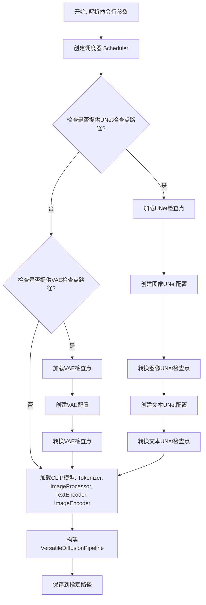
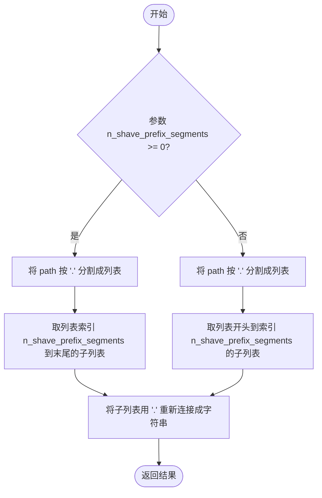
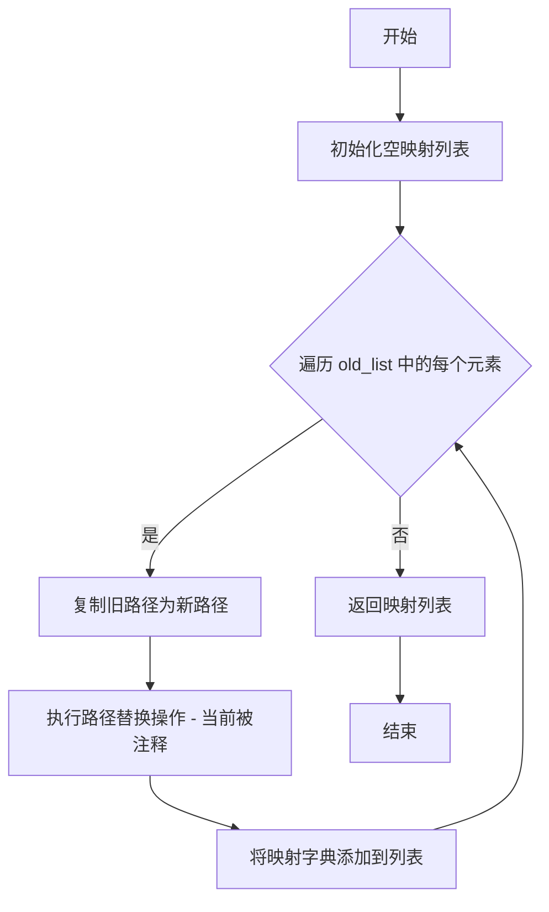
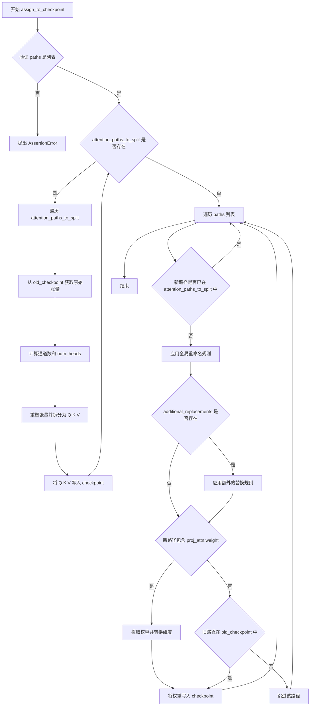
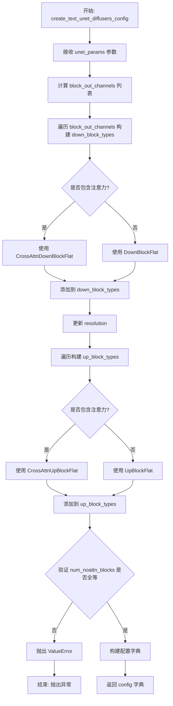
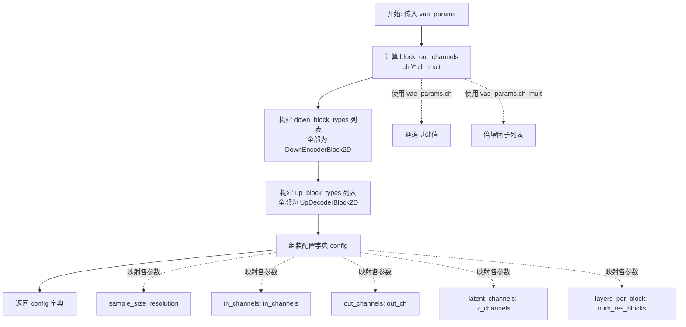
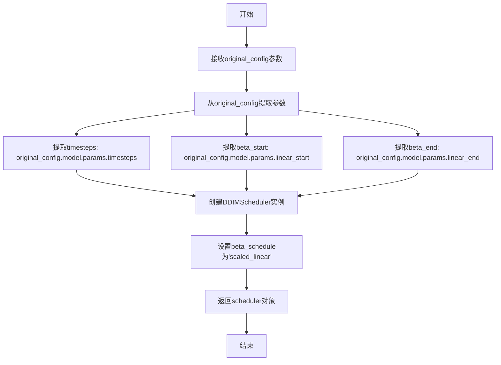
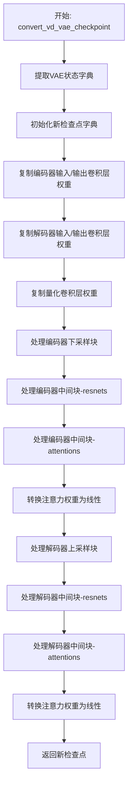

# `diffusers\scripts\convert_versatile_diffusion_to_diffusers.py` 详细设计文档

这是一个模型检查点转换脚本，用于将Versatile Stable Diffusion (VD) 的预训练检查点转换为HuggingFace diffusers库兼容的格式，支持图像UNet、文本UNet和VAE模型的转换，同时支持多种采样调度器和EMA权重提取。

## 整体流程



## 类结构

```
无类层次结构 (脚本文件)
├── 全局配置常量
│   ├── SCHEDULER_CONFIG
│   ├── IMAGE_UNET_CONFIG
│   ├── TEXT_UNET_CONFIG
│   └── AUTOENCODER_CONFIG
├── 路径处理函数
│   ├── shave_segments
│   ├── renew_resnet_paths
│   ├── renew_vae_resnet_paths
renew_attention_paths
│   └── renew_vae_attention_paths
├── 核心转换函数
│   ├── assign_to_checkpoint
│   ├── conv_attn_to_linear
│   ├── convert_vd_unet_checkpoint
│   └── convert_vd_vae_checkpoint
├── 配置创建函数
create_image_unet_diffusers_config
create_text_unet_diffusers_config
create_vae_diffusers_config
│   └── create_diffusers_scheduler
└── 主程序入口 (if __name__ == '__main__')
```

## 全局变量及字段


### `SCHEDULER_CONFIG`
    
调度器配置命名空间，包含beta线性起始值、beta线性结束值、时间步数和缩放因子等参数，用于配置DDIM等调度器

类型：`Namespace`
    


### `IMAGE_UNET_CONFIG`
    
图像UNet模型配置命名空间，定义了输入通道数、模型通道数、输出通道数、注意力块配置等参数，用于创建VersatileDiffusionPipeline的图像UNet

类型：`Namespace`
    


### `TEXT_UNET_CONFIG`
    
文本UNet模型配置命名空间，定义了输入通道数（768维文本嵌入）、模型通道数、输出通道数等参数，用于创建VersatileDiffusionPipeline的文本UNet

类型：`Namespace`
    


### `AUTOENCODER_CONFIG`
    
自编码器(VAE)配置命名空间，定义了双Z通道、Z通道数、分辨率、输入输出通道、通道数、通道倍增和残差块数等参数，用于创建VAE模型

类型：`Namespace`
    


    

## 全局函数及方法


### `shave_segments`

该函数是一个字符串处理工具函数，用于从点号（`.`）分隔的路径字符串中移除指定数量的段（segments）。它通常用于模型权重检查点（checkpoint）的键名（key name）重命名过程中，以剥离不需要的前缀或后缀层索引。

参数：

-  `path`：`str`，原始的点分隔路径字符串（例如 "model.layer.weight"）。
-  `n_shave_prefix_segments`：`int`，要移除的段数量。正值表示移除开头的段（前缀），负值表示移除末尾的段（后缀），默认为 1。

返回值：`str`，处理后的新路径字符串。

#### 流程图



#### 带注释源码

```python
def shave_segments(path, n_shave_prefix_segments=1):
    """
    移除段。正值会剃除第一个段，负值会剃除最后一个段。
    例如：path = "a.b.c", n=1 -> "b.c"; path="a.b.c", n=-1 -> "a.b"
    """
    # 如果 n_shave_prefix_segments 为非负数，则从开头移除指定数量的段
    if n_shave_prefix_segments >= 0:
        # 分割字符串，取切片，拼接
        return ".".join(path.split(".")[n_shave_prefix_segments:])
    else:
        # 如果 n_shave_prefix_segments 为负数，则从末尾移除指定数量的段
        # Python 切片 [:n] (n为负) 会取到倒数第n个元素之前的所有元素
        return ".".join(path.split(".")[:n_shave_prefix_segments])
```


### `renew_resnet_paths`

该函数用于将 Versatile Stable Diffusion 检查点中 ResNet 层的权重路径从旧命名方案映射到新命名方案，执行局部重命名操作。

参数：

- `old_list`：`List[str]`，包含旧权重路径的列表
- `n_shave_prefix_segments`：`int`（默认值=0），要切除的路径前缀段数

返回值：`List[Dict[str, str]]`，返回包含 "old" 和 "new" 键的字典列表，表示旧路径到新路径的映射关系

#### 流程图

```mermaid
flowchart TD
    A[开始] --> B[初始化空mapping列表]
    B --> C{遍历old_list中的每个old_item}
    C --> D[替换 in_layers.0 → norm1]
    D --> E[替换 in_layers.2 → conv1]
    E --> F[替换 out_layers.0 → norm2]
    F --> G[替换 out_layers.3 → conv2]
    G --> H[替换 emb_layers.1 → time_emb_proj]
    H --> I[替换 skip_connection → conv_shortcut]
    I --> J[调用shave_segments处理前缀]
    J --> K[构建映射字典 {"old": old_item, "new": new_item}]
    K --> L[将映射添加到mapping列表]
    L --> C
    C --> M{遍历结束?}
    M --> N[返回mapping列表]
    N --> O[结束]
```

#### 带注释源码

```python
def renew_resnet_paths(old_list, n_shave_prefix_segments=0):
    """
    Updates paths inside resnets to the new naming scheme (local renaming)
    
    该函数将旧版Stable Diffusion模型中ResNet层的权重路径
    转换为Diffusers库支持的新命名规范。
    
    参数:
        old_list: 旧权重路径列表
        n_shave_prefix_segments: 要切除的前缀段数，用于调整路径层级
    
    返回:
        包含旧路径到新路径映射的字典列表
    """
    # 初始化结果列表
    mapping = []
    
    # 遍历所有旧的权重路径
    for old_item in old_list:
        new_item = old_item
        
        # 将输入层中的卷积层0替换为norm1（归一化层）
        new_item = new_item.replace("in_layers.0", "norm1")
        # 将输入层中的卷积层2替换为conv1（卷积层）
        new_item = new_item.replace("in_layers.2", "conv1")
        
        # 将输出层中的归一化层0替换为norm2
        new_item = new_item.replace("out_layers.0", "norm2")
        # 将输出层中的卷积层3替换为conv2
        new_item = new_item.replace("out_layers.3", "conv2")
        
        # 将时间嵌入层替换为time_emb_proj（时间嵌入投影层）
        new_item = new_item.replace("emb_layers.1", "time_emb_proj")
        # 将跳跃连接替换为conv_shortcut（卷积快捷连接）
        new_item = new_item.replace("skip_connection", "conv_shortcut")
        
        # 调用shave_segments函数处理前缀段
        # 正数表示切除前面的段，负数表示保留前面的段
        new_item = shave_segments(new_item, n_shave_prefix_segments=n_shave_prefix_segments)
        
        # 将旧路径和新路径的映射添加到结果列表
        mapping.append({"old": old_item, "new": new_item})
    
    # 返回映射列表
    return mapping
```


### `renew_vae_resnet_paths`

将 VAE ResNet 路径从旧命名方案更新为新命名方案，执行本地重命名操作。

参数：

- `old_list`：`list`，旧路径列表，包含需要转换的模型权重路径
- `n_shave_prefix_segments`：`int`，默认值 0，用于去除路径前缀段数的参数，传递给 `shave_segments` 函数

返回值：`list`，返回映射列表，其中每个元素是包含 "old" 和 "new" 键的字典，分别表示原始路径和转换后的新路径

#### 流程图

```mermaid
flowchart TD
    A[开始 renew_vae_resnet_paths] --> B[初始化空映射列表 mapping]
    B --> C{遍历 old_list 中的每个 old_item}
    C -->|是| D[new_item = old_item]
    D --> E[替换 'nin_shortcut' -> 'conv_shortcut']
    E --> F[调用 shave_segments 去除前缀段]
    F --> G[将 {old: old_item, new: new_item} 添加到 mapping]
    G --> C
    C -->|否| H[返回 mapping 列表]
    H --> I[结束]
```

#### 带注释源码

```python
def renew_vae_resnet_paths(old_list, n_shave_prefix_segments=0):
    """
    Updates paths inside resnets to the new naming scheme (local renaming)
    
    此函数用于将 VAE（变分自编码器）的 ResNet 路径从旧命名方案转换为新命名方案。
    主要处理 'nin_shortcut' 到 'conv_shortcut' 的重命名映射。
    
    参数:
        old_list: 包含旧权重路径的列表
        n_shave_prefix_segments: 可选整数，默认值为0，用于控制路径前缀的去除段数
    
    返回:
        映射列表，每个元素为 {'old': 旧路径, 'new': 新路径} 的字典
    """
    # 初始化空的映射列表，用于存储旧路径到新路径的转换关系
    mapping = []
    
    # 遍历输入的旧路径列表中的每个路径项
    for old_item in old_list:
        # 将当前旧路径赋值给新路径变量，后续将对其进行转换
        new_item = old_item

        # 将路径中的 'nin_shortcut' 替换为 'conv_shortcut'
        # 这是 VAE ResNet 权重命名的关键转换规则
        new_item = new_item.replace("nin_shortcut", "conv_shortcut")
        
        # 调用 shave_segments 函数去除路径前缀段
        # n_shave_prefix_segments 参数控制去除的段数（从路径开头计算）
        new_item = shave_segments(new_item, n_shave_prefix_segments=n_shave_prefix_segments)

        # 将原始旧路径和转换后的新路径作为字典添加到映射列表中
        mapping.append({"old": old_item, "new": new_item})

    # 返回完整的路径映射列表
    return mapping
```


### `renew_attention_paths`

该函数用于将注意力层的旧权重路径映射到新的命名方案，是Versatile Stable Diffusion检查点转换脚本的一部分。当前实现是一个占位符（所有实际替换逻辑被注释掉），返回的映射列表保持原始路径不变。

参数：

- `old_list`：`List[str]`，包含注意力层原始权重路径的列表
- `n_shave_prefix_segments`：`int`，默认值0，用于控制路径前缀段的修整（当前函数体中未使用）

返回值：`List[Dict[str, str]]`，返回包含"old"和"new"键的字典列表，表示从旧路径到新路径的映射关系

#### 流程图



#### 带注释源码

```python
def renew_attention_paths(old_list, n_shave_prefix_segments=0):
    """
    Updates paths inside attentions to the new naming scheme (local renaming)
    
    参数:
        old_list: 包含旧权重路径的列表
        n_shave_prefix_segments: 控制路径前缀段的修整数量
    
    返回:
        包含路径映射的字典列表 [{"old": xxx, "new": xxx}, ...]
    """
    mapping = []
    for old_item in old_list:
        new_item = old_item

        # 下面是被注释掉的路径替换逻辑，实际执行时不做任何替换
        # 这些替换用于将旧的命名转换为新的diffusers命名约定
        
        # 归一化层权重: norm.weight -> group_norm.weight
        # new_item = new_item.replace('norm.weight', 'group_norm.weight')
        # new_item = new_item.replace('norm.bias', 'group_norm.bias')

        # 输出投影层: proj_out.weight -> proj_attn.weight
        # new_item = new_item.replace('proj_out.weight', 'proj_attn.weight')
        # new_item = new_item.replace('proj_out.bias', 'proj_attn.bias')

        # 修整路径前缀段
        # new_item = shave_segments(new_item, n_shave_prefix_segments=n_shave_prefix_segments)

        # 将旧路径和新路径的映射添加到列表中
        mapping.append({"old": old_item, "new": new_item})

    return mapping
```


### `renew_vae_attention_paths`

该函数用于更新VAE（变分自编码器）模型中注意力机制（attention）的权重路径名称，将旧的命名方案转换为新的命名方案，实现本地重命名映射。

参数：

- `old_list`：`List[str]`，需要转换的旧权重路径列表
- `n_shave_prefix_segments`：`int`，要移除的前缀段数量，默认为0

返回值：`List[Dict[str, str]]`，返回包含"old"和"new"键的字典列表，表示旧路径到新路径的映射关系

#### 流程图

```mermaid
flowchart TD
    A[开始] --> B[初始化空mapping列表]
    B --> C{遍历old_list中的每个old_item}
    C -->|是| D[复制old_item到new_item]
    D --> E[替换 norm.weight → group_norm.weight]
    E --> F[替换 norm.bias → group_norm.bias]
    F --> G[替换 q.weight → query.weight]
    G --> H[替换 q.bias → query.bias]
    H --> I[替换 k.weight → key.weight]
    I --> J[替换 k.bias → key.bias]
    J --> K[替换 v.weight → value.weight]
    K --> L[替换 v.bias → value.bias]
    L --> M[替换 proj_out.weight → proj_attn.weight]
    M --> N[替换 proj_out.bias → proj_attn.bias]
    N --> O[调用shave_segments处理前缀段]
    O --> P[将 {old, new} 添加到mapping]
    P --> C
    C -->|遍历完成| Q[返回mapping列表]
    Q --> R[结束]
```

#### 带注释源码

```python
def renew_vae_attention_paths(old_list, n_shave_prefix_segments=0):
    """
    Updates paths inside attentions to the new naming scheme (local renaming)
    
    该函数用于将VAE模型中注意力层的旧权重路径名称映射到新的命名方案。
    主要处理query、key、value以及projection层的权重和偏置参数重命名。
    
    参数:
        old_list: 包含旧权重路径的列表
        n_shave_prefix_segments: 可选参数，指定要移除的前缀段数量
    
    返回:
        mapping: 包含旧路径到新路径映射的字典列表
    """
    # 初始化结果映射列表
    mapping = []
    
    # 遍历每一个旧的权重路径
    for old_item in old_list:
        # 复制原始路径作为新路径的起点
        new_item = old_item

        # 替换归一化层的权重和偏置命名
        # 旧: norm.weight → 新: group_norm.weight
        new_item = new_item.replace("norm.weight", "group_norm.weight")
        new_item = new_item.replace("norm.bias", "group_norm.bias")

        # 替换Query（查询）权重和偏置的命名
        # 旧: q.weight → 新: query.weight
        new_item = new_item.replace("q.weight", "query.weight")
        new_item = new_item.replace("q.bias", "query.bias")

        # 替换Key（键）权重和偏置的命名
        # 旧: k.weight → 新: key.weight
        new_item = new_item.replace("k.weight", "key.weight")
        new_item = new_item.replace("k.bias", "key.bias")

        # 替换Value（值）权重和偏置的命名
        # 旧: v.weight → 新: value.weight
        new_item = new_item.replace("v.weight", "value.weight")
        new_item = new_item.replace("v.bias", "value.bias")

        # 替换输出投影层权重和偏置的命名
        # 旧: proj_out.weight → 新: proj_attn.weight
        new_item = new_item.replace("proj_out.weight", "proj_attn.weight")
        new_item = new_item.replace("proj_out.bias", "proj_attn.bias")

        # 调用shave_segments函数处理前缀段
        # 这是一个辅助函数，用于根据n_shave_prefix_segments的值来裁剪路径
        new_item = shave_segments(new_item, n_shave_prefix_segments=n_shave_prefix_segments)

        # 将旧路径和新路径的映射关系添加到结果列表
        mapping.append({"old": old_item, "new": new_item})

    # 返回完整的映射列表
    return mapping
```


### `assign_to_checkpoint`

该函数是Versatile Stable Diffusion模型权重转换的核心步骤，负责将本地转换后的权重进行全局重命名，并将权重分配到新的checkpoint中。函数支持拆分注意力层（将QKV分离）、应用额外的路径替换规则，以及处理投影层权重的维度转换。

参数：

- `paths`：`list`，包含字典的列表，每个字典有"old"和"new"键，表示权重从旧路径到新路径的映射关系
- `checkpoint`：`dict`，目标checkpoint字典，转换后的权重将存入此字典
- `old_checkpoint`：`dict`，源checkpoint字典，包含待转换的原始权重
- `attention_paths_to_split`：`dict`或`None`，可选参数，指定需要拆分的注意力层路径及其对应的QKV目标路径
- `additional_replacements`：`list`或`None`，可选参数，包含额外的路径替换规则列表
- `config`：`dict`或`None`，可选参数，包含模型配置信息，如`num_head_channels`等，用于注意力层拆分计算

返回值：`None`（直接修改`checkpoint`字典，无返回值）

#### 流程图



#### 带注释源码

```python
def assign_to_checkpoint(
    paths, checkpoint, old_checkpoint, attention_paths_to_split=None, additional_replacements=None, config=None
):
    """
    This does the final conversion step: take locally converted weights and apply a global renaming
    to them. It splits attention layers, and takes into account additional replacements
    that may arise.

    Assigns the weights to the new checkpoint.
    """
    # 验证 paths 参数必须是包含 'old' 和 'new' 键的字典列表
    assert isinstance(paths, list), "Paths should be a list of dicts containing 'old' and 'new' keys."

    # 如果指定了需要拆分的注意力层路径，则进行 QKV 分离
    if attention_paths_to_split is not None:
        # 遍历每个需要拆分的注意力层
        for path, path_map in attention_paths_to_split.items():
            # 从旧 checkpoint 中获取原始注意力权重
            old_tensor = old_checkpoint[path]
            # 计算通道数（原通道数的1/3，因为要拆分为Q、K、V三份）
            channels = old_tensor.shape[0] // 3

            # 根据张量维度确定目标形状
            target_shape = (-1, channels) if len(old_tensor.shape) == 3 else (-1)

            # 计算注意力头数量，用于后续重塑和拆分
            num_heads = old_tensor.shape[0] // config["num_head_channels"] // 3

            # 重塑张量以分离不同注意力头的QKV
            old_tensor = old_tensor.reshape((num_heads, 3 * channels // num_heads) + old_tensor.shape[1:])
            # 沿通道维度拆分为Query、Key、Value三个张量
            query, key, value = old_tensor.split(channels // num_heads, dim=1)

            # 将拆分后的Q、K、V写入目标checkpoint
            checkpoint[path_map["query"]] = query.reshape(target_shape)
            checkpoint[path_map["key"]] = key.reshape(target_shape)
            checkpoint[path_map["value"]] = value.reshape(target_shape)

    # 遍历所有需要转换的路径
    for path in paths:
        new_path = path["new"]

        # 如果该路径已经在注意力层拆分中处理过，则跳过
        if attention_paths_to_split is not None and new_path in attention_paths_to_split:
            continue

        # 应用全局重命名规则：将旧的中级块命名转换为新的diffusers格式
        new_path = new_path.replace("middle_block.0", "mid_block.resnets.0")
        new_path = new_path.replace("middle_block.1", "mid_block.attentions.0")
        new_path = new_path.replace("middle_block.2", "mid_block.resnets.1")

        # 如果存在额外的替换规则，则应用它们
        if additional_replacements is not None:
            for replacement in additional_replacements:
                new_path = new_path.replace(replacement["old"], replacement["new"])

        # proj_attn.weight 需要从卷积1D转换为线性层
        # 通过提取 [:, :, 0, 0] 来移除卷积核维度
        if "proj_attn.weight" in new_path:
            checkpoint[new_path] = old_checkpoint[path["old"]][:, :, 0]
        # 如果旧路径存在于旧checkpoint中，则直接复制权重
        elif path["old"] in old_checkpoint:
            checkpoint[new_path] = old_checkpoint[path["old"]]
```


### `conv_attn_to_linear`

该函数用于将Versatile Stable Diffusion检查点中注意力机制的卷积权重（Conv1D）转换为线性层权重。由于原始模型使用Conv1D（可以看作是沿着最后一个维度进行卷积），而Diffusers模型使用标准的Linear层，因此需要进行维度压缩以适配新的模型结构。

参数：

- `checkpoint`：`dict`，模型检查点字典，包含预训练模型的权重键值对

返回值：`None`，该函数直接修改传入的`checkpoint`字典，无返回值

#### 流程图

```mermaid
flowchart TD
    A[开始] --> B[获取checkpoint所有keys]
    B --> C{遍历keys}
    C -->|遍历每个key| D{检查key后缀}
    D -->|query.weight/key.weight/value.weight| E{维度检查}
    E -->|ndim > 2| F[执行 [:, :, 0, 0] 切片]
    F --> G{继续检查其他key}
    D -->|proj_attn.weight| H{维度检查}
    H -->|ndim > 2| I[执行 [:, :, 0] 切片]
    I --> G
    E -->|ndim ≤ 2| G
    H -->|ndim ≤ 2| G
    G -->|未遍历完| C
    G -->|遍历完成| J[结束]
```

#### 带注释源码

```python
def conv_attn_to_linear(checkpoint):
    """
    将注意力机制的Conv1D权重转换为Linear层权重
    
    原始VD模型使用Conv1D权重，其形状为 (out_channels, in_channels, 1) 
    而Diffusers的Linear层权重形状为 (out_channels, in_channels)
    因此需要移除最后两个维度（或一个维度）的额外切片
    """
    # 获取检查点中所有的键名
    keys = list(checkpoint.keys())
    
    # 定义注意力机制中需要转换的权重键名后缀
    attn_keys = ["query.weight", "key.weight", "value.weight"]
    
    # 遍历检查点中的每个权重键
    for key in keys:
        # 提取键名的最后两个部分，用于匹配注意力权重
        if ".".join(key.split(".")[-2:]) in attn_keys:
            # 对于query/key/value权重，检查是否为Conv1D（维度>2）
            if checkpoint[key].ndim > 2:
                # Conv1D权重形状为 (out_ch, in_ch, 1)，转换为 Linear权重 (out_ch, in_ch)
                # 通过切片 [:, :, 0, 0] 移除最后两个维度
                checkpoint[key] = checkpoint[key][:, :, 0, 0]
        # 检查是否为投影注意力权重
        elif "proj_attn.weight" in key:
            # 对于proj_attn.weight，同样检查维度
            if checkpoint[key].ndim > 2:
                # 投影权重的形状可能为 (out_ch, in_ch*head_dim, 1)
                # 只需要移除最后一个维度
                checkpoint[key] = checkpoint[key][:, :, 0]
```


### `create_image_unet_diffusers_config`

该函数用于将 Versatile Stable Diffusion 模型的 UNet 配置转换为 Diffusers 库所需的配置格式，通过解析模型参数生成包含块类型、通道数、注意力维度等信息的字典。

参数：

- `unet_params`：`Namespace`，Versatile Diffusion 模型的 UNet 参数对象，包含 model_channels、channel_mult、with_attn、num_noattn_blocks、input_channels、output_channels、context_dim 等配置

返回值：`dict`，包含 Diffusers 风格的 UNet 配置字典，包括 sample_size、in_channels、out_channels、down_block_types、up_block_types、block_out_channels、layers_per_block、cross_attention_dim 和 attention_head_dim

#### 流程图

```mermaid
flowchart TD
    A[开始] --> B[计算 block_out_channels<br/>model_channels × channel_mult]
    B --> C[遍历 block_out_channels 构建 down_block_types]
    C --> D{with_attn[i] 为真?}
    D -->|是| E[CrossAttnDownBlock2D]
    D -->|否| F[DownBlock2D]
    E --> G[添加到 down_block_types]
    F --> G
    G --> H[更新 resolution]
    H --> I[构建 up_block_types<br/>逆序遍历 with_attn]
    I --> J{with_attn[-i-1] 为真?}
    J -->|是| K[CrossAttnUpBlock2D]
    J -->|否| L[UpBlock2D]
    K --> M[添加到 up_block_types]
    L --> M
    M --> N{检查 num_noattn_blocks 是否全相等}
    N -->|否| O[抛出 ValueError]
    N -->|是| P[构建最终 config 字典]
    P --> Q[返回 config]
```

#### 带注释源码

```python
def create_image_unet_diffusers_config(unet_params):
    """
    Creates a config for the diffusers based on the config of the VD model.
    """
    # 根据 model_channels 和 channel_mult 计算每个阶段的输出通道数
    # 例如: model_channels=320, channel_mult=[1,2,4,4] => [320, 640, 1280, 1280]
    block_out_channels = [unet_params.model_channels * mult for mult in unet_params.channel_mult]

    # 初始化下采样块类型列表
    down_block_types = []
    resolution = 1
    # 遍历每个通道数级别，决定使用 CrossAttnDownBlock2D 还是 DownBlock2D
    for i in range(len(block_out_channels)):
        block_type = "CrossAttnDownBlock2D" if unet_params.with_attn[i] else "DownBlock2D"
        down_block_types.append(block_type)
        if i != len(block_out_channels) - 1:
            resolution *= 2  # 更新分辨率（用于下采样）

    # 初始化上采样块类型列表，逆序遍历 with_attn
    up_block_types = []
    for i in range(len(block_out_channels)):
        block_type = "CrossAttnUpBlock2D" if unet_params.with_attn[-i - 1] else "UpBlock2D"
        up_block_types.append(block_type)
        resolution //= 2  # 更新分辨率（用于上采样）

    # 验证所有 num_noattn_blocks 是否相等，Diffusers 不支持不同的块数
    if not all(n == unet_params.num_noattn_blocks[0] for n in unet_params.num_noattn_blocks):
        raise ValueError("Not all num_res_blocks are equal, which is not supported in this script.")

    # 构建最终的 Diffusers 配置字典
    config = {
        "sample_size": None,  # 样本大小，稍后设置
        "in_channels": unet_params.input_channels,  # 输入通道数（图像为4）
        "out_channels": unet_params.output_channels,  # 输出通道数
        "down_block_types": tuple(down_block_types),  # 下采样块类型元组
        "up_block_types": tuple(up_block_types),  # 上采样块类型元组
        "block_out_channels": tuple(block_out_channels),  # 各块输出通道数
        "layers_per_block": unet_params.num_noattn_blocks[0],  # 每块的层数
        "cross_attention_dim": unet_params.context_dim,  # 交叉注意力维度
        "attention_head_dim": unet_params.num_heads,  # 注意力头维度
    }

    return config
```


### `create_text_unet_diffusers_config`

该函数用于根据 Versatile Diffusion (VD) 模型的配置创建适用于 diffusers 库的 Text UNet 模型配置。它通过解析 `unet_params` 中的参数（如模型通道数、注意力配置等），生成包含下采样块类型、上采样块类型、通道数等关键信息的配置字典，以支持将原始 VD 模型 checkpoint 转换为 diffusers 格式。

参数：

- `unet_params`：`Namespace` 对象，包含 VD 模型 Text UNet 的所有超参数配置，如 `model_channels`、`channel_mult`、`with_attn`、`num_noattn_blocks`、`context_dim`、`num_heads`、`input_channels`、`output_channels` 等。

返回值：`dict`，返回包含 diffusers 库 Text UNet 模型配置的字典，键包括 `sample_size`、`in_channels`、`out_channels`、`down_block_types`、`up_block_types`、`block_out_channels`、`layers_per_block`、`cross_attention_dim`、`attention_head_dim`。

#### 流程图



#### 带注释源码

```python
def create_text_unet_diffusers_config(unet_params):
    """
    Creates a config for the diffusers based on the config of the VD model.
    """

    # 根据 model_channels 和 channel_mult 计算每个阶段的输出通道数
    # 例如: model_channels=320, channel_mult=[1,2,4,4] -> [320, 640, 1280, 1280]
    block_out_channels = [unet_params.model_channels * mult for mult in unet_params.channel_mult]

    # 初始化下采样块类型列表和分辨率
    down_block_types = []
    resolution = 1
    
    # 遍历每个阶段，确定下采样块的类型
    # Text UNet 使用 Flat 版本的块 (CrossAttnDownBlockFlat 或 DownBlockFlat)
    for i in range(len(block_out_channels)):
        # 根据 with_attn 标志决定是否使用交叉注意力块
        block_type = "CrossAttnDownBlockFlat" if unet_params.with_attn[i] else "DownBlockFlat"
        down_block_types.append(block_type)
        
        # 更新分辨率（每个下采样阶段分辨率翻倍）
        if i != len(block_out_channels) - 1:
            resolution *= 2

    # 初始化上采样块类型列表
    # 注意: 上采样块类型顺序与下采样相反（从深层到浅层）
    up_block_types = []
    for i in range(len(block_out_channels)):
        # 使用倒序索引从 with_attn 中获取对应层的注意力配置
        block_type = "CrossAttnUpBlockFlat" if unet_params.with_attn[-i - 1] else "UpBlockFlat"
        up_block_types.append(block_type)
        resolution //= 2

    # 验证所有层的 resnet 块数量是否相等
    # diffusers 库目前不支持不同层使用不同数量的 resnet 块
    if not all(n == unet_params.num_noattn_blocks[0] for n in unet_params.num_noattn_blocks):
        raise ValueError("Not all num_res_blocks are equal, which is not supported in this script.")

    # 构建最终的配置字典
    config = {
        "sample_size": None,  # 样本大小，在 pipeline 中动态设置
        # 输入通道为三元组 (text_dim, 1, 1)，表示文本条件的维度
        "in_channels": (unet_params.input_channels, 1, 1),
        # 输出通道为三元组，与输入对应
        "out_channels": (unet_params.output_channels, 1, 1),
        # 下采样块类型元组
        "down_block_types": tuple(down_block_types),
        # 上采样块类型元组
        "up_block_types": tuple(up_block_types),
        # 每个阶段的输出通道数
        "block_out_channels": tuple(block_out_channels),
        # 每个 block 中的层数（resnet 块数量）
        "layers_per_block": unet_params.num_noattn_blocks[0],
        # 交叉注意力维度（文本上下文维度）
        "cross_attention_dim": unet_params.context_dim,
        # 注意力头维度
        "attention_head_dim": unet_params.num_heads,
    }

    return config
```


### `create_vae_diffusers_config`

该函数用于将 Versatile Stable Diffusion 模型的 VAE（变分自编码器）参数转换为 diffusers 库所需的配置格式，生成包含模型结构信息的字典，以便后续初始化 `AutoencoderKL` 模型。

参数：

- `vae_params`：`Namespace`，包含 VAE 模型的参数对象，需包含 `ch`（基础通道数）、`ch_mult`（通道倍增列表）、`resolution`（分辨率）、`in_channels`（输入通道数）、`out_ch`（输出通道数）、`z_channels`（潜在空间通道数）、`num_res_blocks`（每块残差层数）等属性。

返回值：`dict`，返回包含 VAE 配置的字典，键包括 `sample_size`、`in_channels`、`out_channels`、`down_block_types`、`up_block_types`、`block_out_channels`、`latent_channels`、`layers_per_block`，用于构建 `AutoencoderKL` 模型。

#### 流程图



#### 带注释源码

```python
def create_vae_diffusers_config(vae_params):
    """
    Creates a config for the diffusers based on the config of the VD model.
    
    将 Versatile Stable Diffusion 模型的 VAE 参数转换为 diffusers 库
    所需要的配置格式，用于初始化 AutoencoderKL 模型。
    
    参数:
        vae_params: Namespace 对象，包含 VAE 模型的各项参数
            - ch: 基础通道数
            - ch_mult: 通道倍增列表
            - resolution: 输入图像分辨率
            - in_channels: 输入通道数
            - out_ch: 输出通道数
            - z_channels: 潜在空间通道数
            - num_res_blocks: 每个块的残差层数量
    
    返回:
        dict: 包含 VAE 配置的字典，可用于 AutoencoderKL 的初始化
    """

    # 根据基础通道数和倍增因子计算各层的输出通道数
    # 例如: ch=128, ch_mult=[1,2,4,4] => [128, 256, 512, 512]
    block_out_channels = [vae_params.ch * mult for mult in vae_params.ch_mult]
    
    # 设置下采样块的类型，全部使用 DownEncoderBlock2D
    down_block_types = ["DownEncoderBlock2D"] * len(block_out_channels)
    
    # 设置上采样块的类型，全部使用 UpDecoderBlock2D
    up_block_types = ["UpDecoderBlock2D"] * len(block_out_channels)

    # 组装完整的 VAE 配置字典
    config = {
        "sample_size": vae_params.resolution,        # 输入样本的尺寸（分辨率）
        "in_channels": vae_params.in_channels,       # VAE 输入通道数（通常为 3 for RGB）
        "out_channels": vae_params.out_ch,           # VAE 输出通道数
        "down_block_types": tuple(down_block_types), # 下采样块类型元组
        "up_block_types": tuple(up_block_types),     # 上采样块类型元组
        "block_out_channels": tuple(block_out_channels), # 各块输出通道数元组
        "latent_channels": vae_params.z_channels,    # 潜在空间通道数（用于 VAE 编码/解码）
        "layers_per_block": vae_params.num_res_blocks, # 每个块中残差层的数量
    }
    
    # 返回配置字典，可用于 AutoencoderKL(**config) 初始化
    return config
```


### `create_diffusers_scheduler`

创建一个DDIMScheduler（去噪扩散隐式模型调度器），用于将Versatile Stable Diffusion模型的原始调度器配置转换为Diffusers库支持的DDIMScheduler。

参数：

- `original_config`：`Namespace` 对象，包含模型的原始配置，必须包含 `model.params.timesteps`（训练时间步数）、`model.params.linear_start`（Beta起始值）、`model.params.linear_end`（Beta结束值）属性

返回值：`DDIMScheduler`，返回配置好的Diffusers库调度器对象

#### 流程图



#### 带注释源码

```python
def create_diffusers_scheduler(original_config):
    """
    创建并返回一个配置好的DDIMScheduler调度器。
    
    该函数用于将Versatile Stable Diffusion模型的原始调度器配置
    转换为Diffusers库支持的DDIMScheduler。
    
    参数:
        original_config: 包含模型参数的配置对象，需要有以下属性:
            - model.params.timesteps: 训练时使用的时间步数
            - model.params.linear_start: Beta_schedule的起始值
            - model.params.linear_end: Beta_schedule的结束值
    
    返回:
        DDIMScheduler: 配置好的去噪扩散隐式模型调度器，
                      使用scaled_linear beta调度策略
    """
    # 创建DDIMScheduler实例，配置参数如下：
    # - num_train_timesteps: 训练时的总时间步数，从原始配置中获取
    # - beta_start: Beta值的起始点，用于控制噪声添加的初始速率
    # - beta_end: Beta值的结束点，用于控制噪声添加的最终速率
    # - beta_schedule: 使用scaled_linear策略，符合原始模型的配置
    schedular = DDIMScheduler(
        num_train_timesteps=original_config.model.params.timesteps,
        beta_start=original_config.model.params.linear_start,
        beta_end=original_config.model.params.linear_end,
        beta_schedule="scaled_linear",
    )
    return schedular
```


### `convert_vd_unet_checkpoint`

将Versatile Stable Diffusion（多才多艺的稳定扩散）的UNet检查点权重转换为Hugging Face Diffusers格式。函数处理原始模型的权重键名重新映射、EMA权重可选提取，以及ResNet、Attention、DownSample、UpSample等模块的权重重组，使其适配Diffusers库定义的UNet2DConditionModel结构。

参数：

- `checkpoint`：`Dict`，原始Versatile Stable Diffusion模型的完整检查点状态字典，包含UNet、VAE等权重
- `config`：`Dict`，目标UNet的配置字典，包含`layers_per_block`、`cross_attention_dim`、`attention_head_dim`等参数，用于指导权重转换和重组
- `unet_key`：`str`，原始检查点中UNet权重的前缀键名（如`model.diffusion_model.unet_image.`或`model.diffusion_model.unet_text.`），用于过滤和提取UNet相关权重
- `extract_ema`：`bool`，可选参数，默认为`False`。当检查点同时包含EMA和非EMA权重时，此标志决定是否提取EMA权重；`True`提取EMA权重，`False`提取非EMA权重

返回值：`Dict`，转换后的新检查点字典，键名已按Diffusers的UNet2DConditionModel架构重新命名和组织

#### 流程图

```mermaid
flowchart TD
    A[开始: convert_vd_unet_checkpoint] --> B{检查点是否包含EMA权重}
    B -->|是| C{extract_ema为True?}
    C -->|是| D[提取EMA权重到unet_state_dict]
    C -->|否| E[提取非EMA权重到unet_state_dict]
    B -->|否| F[直接提取unet_key前缀的权重]
    D --> G[初始化new_checkpoint字典]
    E --> G
    F --> G
    G --> H[转换time_embedding层权重]
    H --> I[转换conv_in输入卷积层权重]
    I --> J[转换conv_norm_out和conv_out输出层权重]
    J --> K[解析input_blocks/middle_block/output_blocks的键名]
    K --> L{遍历input_blocks i=1到num_input_blocks-1}
    L --> M[计算block_id和layer_in_block_id]
    M --> N[提取resnets和attentions子模块键名]
    N --> O{存在downsampler权重?}
    O -->|是| P[转换为down_blocks.{block_id}.downsamplers.0]
    O -->|否| Q[跳过或使用linear层]
    P --> R[调用renew_resnet_paths和assign_to_checkpoint]
    Q --> R
    R --> S{存在attention权重?}
    S -->|是| T[转换为down_blocks.{block_id}.attentions.{layer_in_block_id}]
    S -->|否| U[继续下一层]
    T --> U
    U --> L
    L --> V[处理middle_block中间块]
    V --> W[转换resnet_0/resnet_1和attentions]
    W --> X{遍历output_blocks i=0到num_output_blocks-1}
    X --> Y[计算block_id和layer_in_block_id]
    Y --> Z{output_block_list长度>1?}
    Z -->|是| AA[处理多层级输出块]
    Z -->|否| AB[处理单层级输出块resnet]
    AA --> AC{存在upsampler权重?}
    AC -->|conv方式| AD[转换为up_blocks.{block_id}.upsamplers.0.conv]
    AC -->|linear方式| AE[转换为up_blocks.{block_id}.upsamplers.0.weight]
    AD --> AF[处理attention权重]
    AE --> AF
    AB --> AG[直接映射resnet权重]
    AF --> AH[继续下一层]
    AG --> AH
    AH --> X
    X --> AI[返回new_checkpoint转换后的权重]
```

#### 带注释源码

```python
def convert_vd_unet_checkpoint(checkpoint, config, unet_key, extract_ema=False):
    """
    Takes a state dict and a config, and returns a converted checkpoint.
    将原始检查点状态字典和配置转换为Diffusers格式的检查点
    """

    # extract state_dict for UNet
    # 提取UNet的状态字典
    unet_state_dict = {}
    keys = list(checkpoint.keys())

    # at least a 100 parameters have to start with `model_ema` in order for the checkpoint to be EMA
    # 检查点需要至少100个参数以model_ema开头才被判定为包含EMA权重
    if sum(k.startswith("model_ema") for k in keys) > 100:
        print("Checkpoint has both EMA and non-EMA weights.")
        if extract_ema:
            print(
                "In this conversion only the EMA weights are extracted. If you want to instead extract the non-EMA"
                " weights (useful to continue fine-tuning), please make sure to remove the `--extract_ema` flag."
            )
            # 提取EMA权重：将model_ema.xxx转换为model.diffusion_model.xxx
            for key in keys:
                if key.startswith("model.diffusion_model"):
                    flat_ema_key = "model_ema." + "".join(key.split(".")[1:])
                    unet_state_dict[key.replace(unet_key, "")] = checkpoint.pop(flat_ema_key)
        else:
            print(
                "In this conversion only the non-EMA weights are extracted. If you want to instead extract the EMA"
                " weights (usually better for inference), please make sure to add the `--extract_ema` flag."
            )

    # 遍历所有键，提取以unet_key开头的权重
    for key in keys:
        if key.startswith(unet_key):
            # 移除unet_key前缀后存入unet_state_dict
            unet_state_dict[key.replace(unet_key, "")] = checkpoint.pop(key)

    # 初始化新的检查点字典，用于存储转换后的权重
    new_checkpoint = {}

    # 转换时间嵌入层权重：从旧命名映射到新命名
    # 格式：model.diffusion_model.time_embed.0.weight -> time_embedding.linear_1.weight
    new_checkpoint["time_embedding.linear_1.weight"] = checkpoint["model.diffusion_model.time_embed.0.weight"]
    new_checkpoint["time_embedding.linear_1.bias"] = checkpoint["model.diffusion_model.time_embed.0.bias"]
    new_checkpoint["time_embedding.linear_2.weight"] = checkpoint["model.diffusion_model.time_embed.2.weight"]
    new_checkpoint["time_embedding.linear_2.bias"] = checkpoint["model.diffusion_model.time_embed.2.bias"]

    # 转换输入卷积层权重
    new_checkpoint["conv_in.weight"] = unet_state_dict["input_blocks.0.0.weight"]
    new_checkpoint["conv_in.bias"] = unet_state_dict["input_blocks.0.0.bias"]

    # 转换输出归一化和卷积层权重
    new_checkpoint["conv_norm_out.weight"] = unet_state_dict["out.0.weight"]
    new_checkpoint["conv_norm_out.bias"] = unet_state_dict["out.0.bias"]
    new_checkpoint["conv_out.weight"] = unet_state_dict["out.2.weight"]
    new_checkpoint["conv_out.bias"] = unet_state_dict["out.2.bias"]

    # Retrieves the keys for the input blocks only
    # 检索输入块的键名，按层ID分组
    num_input_blocks = len({".".join(layer.split(".")[:2]) for layer in unet_state_dict if "input_blocks" in layer})
    input_blocks = {
        layer_id: [key for key in unet_state_dict if f"input_blocks.{layer_id}" in key]
        for layer_id in range(num_input_blocks)
    }

    # Retrieves the keys for the middle blocks only
    # 检索中间块的键名
    num_middle_blocks = len({".".join(layer.split(".")[:2]) for layer in unet_state_dict if "middle_block" in layer})
    middle_blocks = {
        layer_id: [key for key in unet_state_dict if f"middle_block.{layer_id}" in key]
        for layer_id in range(num_middle_blocks)
    }

    # Retrieves the keys for the output blocks only
    # 检索输出块的键名
    num_output_blocks = len({".".join(layer.split(".")[:2]) for layer in unet_state_dict if "output_blocks" in layer})
    output_blocks = {
        layer_id: [key for key in unet_state_dict if f"output_blocks.{layer_id}" in key]
        for layer_id in range(num_output_blocks)
    }

    # 处理输入块（Down Blocks）
    for i in range(1, num_input_blocks):
        # 计算块ID和层内ID
        block_id = (i - 1) // (config["layers_per_block"] + 1)
        layer_in_block_id = (i - 1) % (config["layers_per_block"] + 1)

        # 提取当前输入块中的resnet和attention权重键名
        resnets = [
            key for key in input_blocks[i] if f"input_blocks.{i}.0" in key and f"input_blocks.{i}.0.op" not in key
        ]
        attentions = [key for key in input_blocks[i] if f"input_blocks.{i}.1" in key]

        # 处理下采样器（Downsampler）权重
        if f"input_blocks.{i}.0.op.weight" in unet_state_dict:
            # 卷积下采样器
            new_checkpoint[f"down_blocks.{block_id}.downsamplers.0.conv.weight"] = unet_state_dict.pop(
                f"input_blocks.{i}.0.op.weight"
            )
            new_checkpoint[f"down_blocks.{block_id}.downsamplers.0.conv.bias"] = unet_state_dict.pop(
                f"input_blocks.{i}.0.op.bias"
            )
        elif f"input_blocks.{i}.0.weight" in unet_state_dict:
            # Text UNet使用线性层代替下采样器
            shape = unet_state_dict[f"input_blocks.{i}.0.weight"].shape
            if shape[0] != shape[1]:
                continue
            new_checkpoint[f"down_blocks.{block_id}.downsamplers.0.weight"] = unet_state_dict.pop(
                f"input_blocks.{i}.0.weight"
            )
            new_checkpoint[f"down_blocks.{block_id}.downsamplers.0.bias"] = unet_state_dict.pop(
                f"input_blocks.{i}.0.bias"
            )

        # 转换ResNet路径并分配权重
        paths = renew_resnet_paths(resnets)
        meta_path = {"old": f"input_blocks.{i}.0", "new": f"down_blocks.{block_id}.resnets.{layer_in_block_id}"}
        assign_to_checkpoint(
            paths, new_checkpoint, unet_state_dict, additional_replacements=[meta_path], config=config
        )

        # 转换Attention路径并分配权重
        if len(attentions):
            paths = renew_attention_paths(attentions)
            meta_path = {"old": f"input_blocks.{i}.1", "new": f"down_blocks.{block_id}.attentions.{layer_in_block_id}"}
            assign_to_checkpoint(
                paths, new_checkpoint, unet_state_dict, additional_replacements=[meta_path], config=config
            )

    # 处理中间块（Middle Block）
    resnet_0 = middle_blocks[0]
    attentions = middle_blocks[1]
    resnet_1 = middle_blocks[2]

    # 转换中间块的ResNet和Attention权重
    resnet_0_paths = renew_resnet_paths(resnet_0)
    assign_to_checkpoint(resnet_0_paths, new_checkpoint, unet_state_dict, config=config)

    resnet_1_paths = renew_resnet_paths(resnet_1)
    assign_to_checkpoint(resnet_1_paths, new_checkpoint, unet_state_dict, config=config)

    attentions_paths = renew_attention_paths(attentions)
    meta_path = {"old": "middle_block.1", "new": "mid_block.attentions.0"}
    assign_to_checkpoint(
        attentions_paths, new_checkpoint, unet_state_dict, additional_replacements=[meta_path], config=config
    )

    # 处理输出块（Up Blocks）
    for i in range(num_output_blocks):
        block_id = i // (config["layers_per_block"] + 1)
        layer_in_block_id = i % (config["layers_per_block"] + 1)
        # 去除前两个段，提取层信息
        output_block_layers = [shave_segments(name, 2) for name in output_blocks[i]]
        output_block_list = {}

        # 重组输出块层级结构
        for layer in output_block_layers:
            layer_id, layer_name = layer.split(".")[0], shave_segments(layer, 1)
            if layer_id in output_block_list:
                output_block_list[layer_id].append(layer_name)
            else:
                output_block_list[layer_id] = [layer_name]

        # 处理多层级输出块
        if len(output_block_list) > 1:
            resnets = [key for key in output_blocks[i] if f"output_blocks.{i}.0" in key]
            attentions = [key for key in output_blocks[i] if f"output_blocks.{i}.1" in key]

            # 转换ResNet权重
            paths = renew_resnet_paths(resnets)
            meta_path = {"old": f"output_blocks.{i}.0", "new": f"up_blocks.{block_id}.resnets.{layer_in_block_id}"}
            assign_to_checkpoint(
                paths, new_checkpoint, unet_state_dict, additional_replacements=[meta_path], config=config
            )

            # 处理上采样器（Upsampler）- 卷积方式
            if ["conv.weight", "conv.bias"] in output_block_list.values():
                index = list(output_block_list.values()).index(["conv.weight", "conv.bias"])
                new_checkpoint[f"up_blocks.{block_id}.upsamplers.0.conv.weight"] = unet_state_dict[
                    f"output_blocks.{i}.{index}.conv.weight"
                ]
                new_checkpoint[f"up_blocks.{block_id}.upsamplers.0.conv.bias"] = unet_state_dict[
                    f"output_blocks.{i}.{index}.conv.bias"
                ]
                # 清除已处理的attention
                if len(attentions) == 2:
                    attentions = []
            # 处理上采样器 - 线性层方式（Text UNet）
            elif f"output_blocks.{i}.1.weight" in unet_state_dict:
                shape = unet_state_dict[f"output_blocks.{i}.1.weight"].shape
                if shape[0] != shape[1]:
                    continue
                new_checkpoint[f"up_blocks.{block_id}.upsamplers.0.weight"] = unet_state_dict.pop(
                    f"output_blocks.{i}.1.weight"
                )
                new_checkpoint[f"up_blocks.{block_id}.upsamplers.0.bias"] = unet_state_dict.pop(
                    f"output_blocks.{i}.1.bias"
                )
                if len(attentions) == 2:
                    attentions = []
            elif f"output_blocks.{i}.2.weight" in unet_state_dict:
                shape = unet_state_dict[f"output_blocks.{i}.2.weight"].shape
                if shape[0] != shape[1]:
                    continue
                new_checkpoint[f"up_blocks.{block_id}.upsamplers.0.weight"] = unet_state_dict.pop(
                    f"output_blocks.{i}.2.weight"
                )
                new_checkpoint[f"up_blocks.{block_id}.upsamplers.0.bias"] = unet_state_dict.pop(
                    f"output_blocks.{i}.2.bias"
                )

            # 转换Attention权重
            if len(attentions):
                paths = renew_attention_paths(attentions)
                meta_path = {
                    "old": f"output_blocks.{i}.1",
                    "new": f"up_blocks.{block_id}.attentions.{layer_in_block_id}",
                }
                assign_to_checkpoint(
                    paths, new_checkpoint, unet_state_dict, additional_replacements=[meta_path], config=config
                )
        else:
            # 处理单层级输出块
            resnet_0_paths = renew_resnet_paths(output_block_layers, n_shave_prefix_segments=1)
            for path in resnet_0_paths:
                old_path = ".".join(["output_blocks", str(i), path["old"]])
                new_path = ".".join(["up_blocks", str(block_id), "resnets", str(layer_in_block_id), path["new"]])

                new_checkpoint[new_path] = unet_state_dict[old_path]

    # 返回转换后的检查点
    return new_checkpoint
```


### `convert_vd_vae_checkpoint`

将 Versatile Diffusion 的 VAE (Variational Autoencoder) 检查点从原始格式转换为 Diffusers 格式的函数。该函数负责处理编码器和解码器的权重映射，包括卷积层、归一化层、下采样器和上采样器等组件的命名转换。

参数：

- `checkpoint`：`dict`，原始 Versatile Diffusion VAE 检查点的状态字典，包含编码器和解码器的所有权重
- `config`：`Namespace`，VAE 配置对象，包含通道数、分辨率、层数等参数，用于指导权重转换

返回值：`dict`，转换后的新检查点，键名遵循 Diffusers 库的标准命名约定

#### 流程图



#### 带注释源码

```python
def convert_vd_vae_checkpoint(checkpoint, config):
    # 提取 VAE 状态字典
    # 创建一个新字典，包含原始检查点中的所有键值对
    vae_state_dict = {}
    keys = list(checkpoint.keys())
    for key in keys:
        vae_state_dict[key] = checkpoint.get(key)

    # 初始化新检查点字典，用于存储转换后的权重
    new_checkpoint = {}

    # === 复制编码器相关权重 ===
    # 编码器输入卷积层
    new_checkpoint["encoder.conv_in.weight"] = vae_state_dict["encoder.conv_in.weight"]
    new_checkpoint["encoder.conv_in.bias"] = vae_state_dict["encoder.conv_in.bias"]
    # 编码器输出卷积层
    new_checkpoint["encoder.conv_out.weight"] = vae_state_dict["encoder.conv_out.weight"]
    new_checkpoint["encoder.conv_out.bias"] = vae_state_dict["encoder.conv_out.bias"]
    # 编码器输出归一化层
    new_checkpoint["encoder.conv_norm_out.weight"] = vae_state_dict["encoder.norm_out.weight"]
    new_checkpoint["encoder.conv_norm_out.bias"] = vae_state_dict["encoder.norm_out.bias"]

    # === 复制解码器相关权重 ===
    # 解码器输入卷积层
    new_checkpoint["decoder.conv_in.weight"] = vae_state_dict["decoder.conv_in.weight"]
    new_checkpoint["decoder.conv_in.bias"] = vae_state_dict["decoder.conv_in.bias"]
    # 解码器输出卷积层
    new_checkpoint["decoder.conv_out.weight"] = vae_state_dict["decoder.conv_out.weight"]
    new_checkpoint["decoder.conv_out.bias"] = vae_state_dict["decoder.conv_out.bias"]
    # 解码器输出归一化层
    new_checkpoint["decoder.conv_norm_out.weight"] = vae_state_dict["decoder.norm_out.weight"]
    new_checkpoint["decoder.conv_norm_out.bias"] = vae_state_dict["decoder.norm_out.bias"]

    # === 复制量化相关权重 ===
    # 量化卷积层
    new_checkpoint["quant_conv.weight"] = vae_state_dict["quant_conv.weight"]
    new_checkpoint["quant_conv.bias"] = vae_state_dict["quant_conv.bias"]
    # 后量化卷积层
    new_checkpoint["post_quant_conv.weight"] = vae_state_dict["post_quant_conv.weight"]
    new_checkpoint["post_quant_conv.bias"] = vae_state_dict["post_quant_conv.bias"]

    # 获取编码器下采样块的键
    # 计算下采样块的数量：通过提取包含 "encoder.down" 的键的前3段来唯一标识不同的块
    num_down_blocks = len({".".join(layer.split(".")[:3]) for layer in vae_state_dict if "encoder.down" in layer})
    # 为每个下采样块创建键列表
    down_blocks = {
        layer_id: [key for key in vae_state_dict if f"down.{layer_id}" in key] for layer_id in range(num_down_blocks)
    }

    # 获取解码器上采样块的键
    # 计算上采样块的数量
    num_up_blocks = len({".".join(layer.split(".")[:3]) for layer in vae_state_dict if "decoder.up" in layer})
    up_blocks = {
        layer_id: [key for key in vae_state_dict if f"up.{layer_id}" in key] for layer_id in range(num_up_blocks)
    }

    # === 处理编码器下采样块 ===
    for i in range(num_down_blocks):
        # 获取当前下采样块中的 resnet 层的键（排除下采样层）
        resnets = [key for key in down_blocks[i] if f"down.{i}" in key and f"down.{i}.downsample" not in key]

        # 如果存在下采样卷积层，复制其权重到新检查点
        if f"encoder.down.{i}.downsample.conv.weight" in vae_state_dict:
            new_checkpoint[f"encoder.down_blocks.{i}.downsamplers.0.conv.weight"] = vae_state_dict.pop(
                f"encoder.down.{i}.downsample.conv.weight"
            )
            new_checkpoint[f"encoder.down_blocks.{i}.downsamplers.0.conv.bias"] = vae_state_dict.pop(
                f"encoder.down.{i}.downsample.conv.bias"
            )

        # 使用 renew_vae_resnet_paths 更新 resnet 路径
        paths = renew_vae_resnet_paths(resnets)
        # 创建元路径映射，将旧路径映射到新路径
        meta_path = {"old": f"down.{i}.block", "new": f"down_blocks.{i}.resnets"}
        # 将更新后的权重分配到新检查点
        assign_to_checkpoint(paths, new_checkpoint, vae_state_dict, additional_replacements=[meta_path], config=config)

    # === 处理编码器中间块的 resnet 层 ===
    mid_resnets = [key for key in vae_state_dict if "encoder.mid.block" in key]
    num_mid_res_blocks = 2
    for i in range(1, num_mid_res_blocks + 1):
        resnets = [key for key in mid_resnets if f"encoder.mid.block_{i}" in key]

        paths = renew_vae_resnet_paths(resnets)
        meta_path = {"old": f"mid.block_{i}", "new": f"mid_block.resnets.{i - 1}"}
        assign_to_checkpoint(paths, new_checkpoint, vae_state_dict, additional_replacements=[meta_path], config=config)

    # === 处理编码器中间块的注意力层 ===
    mid_attentions = [key for key in vae_state_dict if "encoder.mid.attn" in key]
    paths = renew_vae_attention_paths(mid_attentions)
    meta_path = {"old": "mid.attn_1", "new": "mid_block.attentions.0"}
    assign_to_checkpoint(paths, new_checkpoint, vae_state_dict, additional_replacements=[meta_path], config=config)
    # 调用 conv_attn_to_linear 将卷积注意力权重转换为线性层权重
    conv_attn_to_linear(new_checkpoint)

    # === 处理解码器上采样块 ===
    for i in range(num_up_blocks):
        # 计算反向索引，因为上采样块是从上到下编号的
        block_id = num_up_blocks - 1 - i
        # 获取当前上采样块中的 resnet 层的键（排除上采样层）
        resnets = [
            key for key in up_blocks[block_id] if f"up.{block_id}" in key and f"up.{block_id}.upsample" not in key
        ]

        # 如果存在上采样卷积层，复制其权重到新检查点
        if f"decoder.up.{block_id}.upsample.conv.weight" in vae_state_dict:
            new_checkpoint[f"decoder.up_blocks.{i}.upsamplers.0.conv.weight"] = vae_state_dict[
                f"decoder.up.{block_id}.upsample.conv.weight"
            ]
            new_checkpoint[f"decoder.up_blocks.{i}.upsamplers.0.conv.bias"] = vae_state_dict[
                f"decoder.up.{block_id}.upsample.conv.bias"
            ]

        # 使用 renew_vae_resnet_paths 更新 resnet 路径
        paths = renew_vae_resnet_paths(resnets)
        meta_path = {"old": f"up.{block_id}.block", "new": f"up_blocks.{i}.resnets"}
        assign_to_checkpoint(paths, new_checkpoint, vae_state_dict, additional_replacements=[meta_path], config=config)

    # === 处理解码器中间块的 resnet 层 ===
    mid_resnets = [key for key in vae_state_dict if "decoder.mid.block" in key]
    num_mid_res_blocks = 2
    for i in range(1, num_mid_res_blocks + 1):
        resnets = [key for key in mid_resnets if f"decoder.mid.block_{i}" in key]

        paths = renew_vae_resnet_paths(resnets)
        meta_path = {"old": f"mid.block_{i}", "new": f"mid_block.resnets.{i - 1}"}
        assign_to_checkpoint(paths, new_checkpoint, vae_state_dict, additional_replacements=[meta_path], config=config)

    # === 处理解码器中间块的注意力层 ===
    mid_attentions = [key for key in vae_state_dict if "decoder.mid.attn" in key]
    paths = renew_vae_attention_paths(mid_attentions)
    meta_path = {"old": "mid.attn_1", "new": "mid_block.attentions.0"}
    assign_to_checkpoint(paths, new_checkpoint, vae_state_dict, additional_replacements=[meta_path], config=config)
    # 转换注意力权重为线性层权重
    conv_attn_to_linear(new_checkpoint)
    
    # 返回转换后的新检查点
    return new_checkpoint
```

## 关键组件


### 配置对象 (SCHEDULER_CONFIG, IMAGE_UNET_CONFIG, TEXT_UNET_CONFIG, AUTOENCODER_CONFIG)

定义 Versatile Diffusion 模型的超参数配置，包括时间步数、beta 范围、UNet 通道配置、VAE 参数等，用于后续模型转换。

### 路径转换函数集合

包含 shave_segments、renew_resnet_paths、renew_vae_resnet_paths、renew_attention_paths、renew_vae_attention_paths 等函数，负责将原始模型的权重路径名称转换为 Diffusers 格式的命名规则。

### assign_to_checkpoint 函数

执行最终的权重转换步骤，包括全局路径重命名、注意力层拆分（将 query、key、value 分离）以及将 1D 卷积权重转换为线性层权重。

### conv_attn_to_linear 函数

将注意力机制中的卷积权重转换为线性层权重，处理 query、key、value 和 proj_attn 的维度转换。

### create_image_unet_diffusers_config 函数

根据 IMAGE_UNET_CONFIG 创建适用于 Diffusers 的图像 UNet 配置，包括下采样块类型、上采样块类型、通道数、注意力头维度等参数。

### create_text_unet_diffusers_config 函数

根据 TEXT_UNET_CONFIG 创建适用于 Diffusers 的文本 UNet 配置，使用 Flat 版本的块类型以适应文本条件的特殊处理。

### create_vae_diffusers_config 函数

根据 AUTOENCODER_CONFIG 创建适用于 Diffusers 的 VAE 配置，定义编码器和解码器的块类型、通道数和残差块数量。

### create_diffusers_scheduler 函数

创建 DDIMScheduler 调度器，使用原始配置的 beta 范围和时间步数。

### convert_vd_unet_checkpoint 函数

将 Versatile Diffusion 的 UNet 检查点转换为 Diffusers 格式，支持图像 UNet 和文本 UNet 两种类型，处理 EMA 权重提取、输入块、中间块和输出块的映射。

### convert_vd_vae_checkpoint 函数

将 Versatile Diffusion 的 VAE 检查点转换为 Diffusers 格式，处理编码器和解码器的下采样、上采样、中间块和注意力层的权重映射。

### 主程序执行块

加载检查点文件，创建调度器，转换 UNet 和 VAE 权重，初始化 CLIP tokenizer 和图像/文本编码器，构建 VersatileDiffusionPipeline 并保存到指定路径。


## 问题及建议


### 已知问题

- **硬编码的模型路径**：代码中直接硬编码了 `"openai/clip-vit-large-patch14"` 等模型路径，缺乏灵活性，无法适配不同的模型来源或本地路径。
- **硬编码的配置参数**：使用 `Namespace` 对象硬编码了 `SCHEDULER_CONFIG`、`IMAGE_UNET_CONFIG` 等配置，这些值（如 `scale_factor: 0.18215`）缺乏文档说明，且无法通过命令行参数自定义。
- **未使用的代码**：`renew_attention_paths` 函数内部被注释掉的代码片段长期存在，表明可能是废弃代码或未完成的实现，增加了代码维护负担。
- **缺乏输入验证**：未检查 `--unet_checkpoint_path` 和 `--vae_checkpoint_path` 指向的文件是否存在，也未验证 checkpoint 的完整性和格式正确性。
- **使用不安全的 `torch.load`**：直接使用 `torch.load` 而未设置 `map_location` 参数，可能在不同设备上失败；也未使用 `weights_only=True` 参数，存在潜在的安全风险。
- **代码重复**：`renew_resnet_paths` 和 `renew_vae_resnet_paths`、`renew_attention_paths` 和 `renew_vae_attention_paths` 之间存在大量重复逻辑，可通过抽象公共函数减少冗余。
- **缺乏类型注解**：整个代码库没有使用 Python 类型提示（type hints），降低了代码的可读性和可维护性。
- **魔法数字**：多处使用魔法数字（如 `n_shave_prefix_segments=1`、`n_shave_prefix_segments=0`），缺乏常量定义或配置说明。

### 优化建议

- 将模型路径、配置参数抽取为命令行参数或独立的配置文件，提升脚本的通用性和可配置性。
- 清理 `renew_attention_paths` 等函数中的注释代码，或补充文档说明其用途。
- 添加输入文件存在性检查和 checkpoint 完整性验证，提升脚本的健壮性。
- 改进 `torch.load` 调用，添加 `map_location` 参数和 `weights_only=False`（如需加载完整模型）或 `weights_only=True`（如仅需权重），并添加错误处理。
- 抽取 `renew_*_paths` 函数的公共逻辑为基函数，减少代码重复，提高可维护性。
- 为关键函数和变量添加类型注解，提升代码可读性。
- 将魔法数字定义为具名常量，并添加注释说明其含义和来源。

## 其它


### 设计目标与约束

将Versatile Stable Diffusion（VD）预训练检查点转换为HuggingFace Diffusers格式，支持图像UNet、文本UNet和VAE模型的权重迁移。脚本需支持EMA/非EMA权重提取，支持多种调度器类型（PNDM、LMS、DDIM、Euler、Euler-Ancestral、DPM），输出为标准的Diffusers pipeline格式。

### 错误处理与异常设计

- 参数校验：检查调度器类型是否合法，不合法则抛出ValueError并提示支持的类型
- 路径校验：在分配权重时检查键名是否存在，如`path["old"] in old_checkpoint`
- 配置校验：`create_image_unet_diffusers_config`和`create_text_unet_diffusers_config`中检查`num_noattn_blocks`是否全部相等，不相等则抛出ValueError
- 权重提取：检测检查点是否同时包含EMA和非EMA权重，通过统计以`model_ema`开头的参数数量（阈值>100）来判断

### 数据流与状态机

输入数据流：原始VD检查点（.pt/.pth文件）→ 解析UNet/VAE状态字典 → 路径映射转换（renew_*_paths函数）→ 权重重新分配（assign_to_checkpoint函数）→ 构建新检查点 → 加载到Diffusers模型 → 保存至指定目录。主程序支持条件执行：仅在提供对应路径参数时才执行UNet或VAE转换。

### 外部依赖与接口契约

依赖库：torch、transformers、diffusers。CLIP模型依赖：openai/clip-vit-large-patch14预训练模型。输入接口：--unet_checkpoint_path（可选）、--vae_checkpoint_path（可选）、--dump_path（必填）、--scheduler_type（默认pndm）、--extract_ema（可选标志）。输出接口：保存为VersatileDiffusionPipeline格式，包含tokenizer、image_feature_extractor、text_encoder、image_encoder、image_unet、text_unet、vae和scheduler组件。

### 性能考虑

- 权重转换使用字典操作而非深拷贝，减少内存开销
- 支持选择性提取EMA或非EMA权重，避免不必要的数据加载
- 路径映射采用字符串替换和列表推导式实现，保持转换效率

### 版本兼容性

脚本针对HuggingFace Diffusers库设计，依赖特定版本的API（如UNet2DConditionModel、AutoencoderKL、VersatileDiffusionPipeline等）。CLIP模型使用openai/clip-vit-large-patch14，需确保transformers库版本兼容CLIPTextModelWithProjection和CLIPVisionModelWithProjection接口。

### 使用示例

```bash
python convert_versatile_stable_diffusion_checkpoint.py \
    --unet_checkpoint_path /path/to/vd_unet.pt \
    --vae_checkpoint_path /path/to/vd_vae.pt \
    --scheduler_type ddim \
    --dump_path /output/path
```

### 已知限制

- 仅支持`num_noattn_blocks`（layers_per_block）在所有层级相等的UNet配置
- 图像UNet和文本UNet使用相同的checkpoint对象（从同一文件加载），需确保checkpoint包含两种UNet的权重
- VAE转换假设特定的块结构（down/upsample层），不支持完全自定义的VAE架构
- 未提供文本编码器和图像编码器的转换接口，假设使用HuggingFace预训练模型直接加载

    