# `diffusers\scripts\convert_vq_diffusion_to_diffusers.py` 详细设计文档

此脚本用于将 Microsoft 的 VQ-Diffusion 模型（特别是 ITHQ 数据集）迁移到 Hugging Face diffusers 格式。它通过解析原始 YAML 配置文件和 PyTorch 权重文件，转换为 diffusers 库所需的格式，并最终组装成 VQDiffusionPipeline。

## 整体流程

```mermaid
graph TD
    Start[开始] --> ParseArgs[解析命令行参数]
    ParseArgs --> LoadVQVAE[加载 VQVAE 配置与权重]
    LoadVQVAE --> CreateVQVAE[创建空 VQModel]
    CreateVQVAE --> ConvertVQVAE[转换 VQVAE 权重为 Diffusers 格式]
    ConvertVQVAE --> LoadVQVAEModel[加载 VQVAE 模型到设备]
    LoadVQVAEModel --> LoadTransConfig[加载 Transformer 配置]
    LoadTransConfig --> LoadTransCheckpoint[加载主模型权重 (含 EMA 处理)]
    LoadTransCheckpoint --> CreateTransModel[创建空 Transformer2DModel]
    CreateTransModel --> ConvertTrans[转换 Transformer 权重]
    ConvertTrans --> LoadTransModel[加载 Transformer 模型]
    LoadTransModel --> LoadTextEncoder[加载 CLIP 文本编码器]
    LoadTextEncoder --> InitScheduler[初始化 VQDiffusionScheduler]
    InitScheduler --> InitEmbeddings[初始化 LearnedClassifierFreeSamplingEmbeddings]
    InitEmbeddings --> Assemble[组装 VQDiffusionPipeline]
    Assemble --> Save[保存模型到 dump_path]
    Save --> End[结束]
```

## 类结构

```
ConversionScript (脚本根节点，无内部类定义)
├── VQVAE 转换模块
│   ├── vqvae_model_from_original_config
│   ├── vqvae_original_checkpoint_to_diffusers_checkpoint
│   └── 辅助函数 (get_down_block_types, etc.)
├── Transformer 转换模块
│   ├── transformer_model_from_original_config
│   ├── transformer_original_checkpoint_to_diffusers_checkpoint
│   └── 辅助函数 (transformer_attention_to_diffusers_checkpoint, etc.)
└── 入口逻辑 (Main Execution)
```

## 全局变量及字段


### `PORTED_VQVAES`
    
已移植到diffusers的VQVAE模型类型列表，包含PatchVQGAN模型

类型：`List[str]`
    


### `PORTED_DIFFUSIONS`
    
已移植到diffusers的Diffusion模型类型列表，包含DiffusionTransformer模型

类型：`List[str]`
    


### `PORTED_TRANSFORMERS`
    
已移植到diffusers的Transformer模型类型列表，包含Text2ImageTransformer模型

类型：`List[str]`
    


### `PORTED_CONTENT_EMBEDDINGS`
    
已移植到diffusers的Content Embedding模型类型列表，包含DalleMaskImageEmbedding模型

类型：`List[str]`
    


    

## 全局函数及方法


### `vqvae_model_from_original_config`

该函数负责将来自 VQ-Diffusion 项目的 VQVAE 模型配置转换为 Hugging Face Diffusers 库中的 `VQModel` 对象，支持从原始 YAML 配置文件中提取模型架构参数（如通道数、块类型、注意力分辨率等），并据此实例化一个兼容 Diffusers 格式的 VQVAE 模型。

参数：
- `original_config`：字典（dict），原始 VQ-Diffusion 项目的 VQVAE 配置文件，包含模型的目标类（target）和参数字典（params），其中 params 包含 encoder_config、decoder_config 等子配置

返回值：`VQModel`，从 Diffusers 库导入的 VQ 模型对象，已根据原始配置参数构建完成

#### 流程图

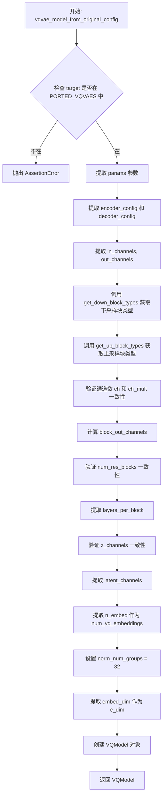

#### 带注释源码

```python
def vqvae_model_from_original_config(original_config):
    # 断言检查：确保原始配置中的目标类（target）已经被移植到 Diffusers
    # PORTED_VQVAES 列表包含已支持的目标类名
    assert original_config["target"] in PORTED_VQVAES, (
        f"{original_config['target']} has not yet been ported to diffusers."
    )

    # 从原始配置中提取参数字典（params）
    original_config = original_config["params"]

    # 提取编码器和解码器的配置参数
    original_encoder_config = original_config["encoder_config"]["params"]
    original_decoder_config = original_config["decoder_config"]["params"]

    # 获取输入和输出通道数
    in_channels = original_encoder_config["in_channels"]
    out_channels = original_decoder_config["out_ch"]

    # 根据原始编码器/解码器配置获取上采样和下采样块的类型
    down_block_types = get_down_block_types(original_encoder_config)
    up_block_types = get_up_block_types(original_decoder_config)

    # 验证编码器和解码器的通道数（ch）和通道乘数（ch_mult）是否一致
    assert original_encoder_config["ch"] == original_decoder_config["ch"]
    assert original_encoder_config["ch_mult"] == original_decoder_config["ch_mult"]
    
    # 计算块的输出通道数：根据通道数和通道乘数生成元组
    block_out_channels = tuple(
        [original_encoder_config["ch"] * a_ch_mult for a_ch_mult in original_encoder_config["ch_mult"]]
    )

    # 验证编码器和解码器的残差块数量是否一致
    assert original_encoder_config["num_res_blocks"] == original_decoder_config["num_res_blocks"]
    
    # 设置每层的残差块数量
    layers_per_block = original_encoder_config["num_res_blocks"]

    # 验证编码器和解码器的潜在空间通道数是否一致
    assert original_encoder_config["z_channels"] == original_decoder_config["z_channels"]
    latent_channels = original_encoder_config["z_channels"]

    # 获取 VQ 嵌入层的数量
    num_vq_embeddings = original_config["n embed"]

    # 硬编码值：ResnetBlock.GroupNorm 中的 num_groups 参数（VQ-Diffusion 中固定为 32）
    norm_num_groups = 32

    # 获取嵌入维度
    e_dim = original_config["embed_dim"]

    # 使用提取的参数创建 Diffusers 库的 VQModel 对象
    model = VQModel(
        in_channels=in_channels,
        out_channels=out_channels,
        down_block_types=down_block_types,
        up_block_types=up_block_types,
        block_out_channels=block_out_channels,
        layers_per_block=layers_per_block,
        latent_channels=latent_channels,
        num_vq_embeddings=num_vq_embeddings,
        norm_num_groups=norm_num_groups,
        vq_embed_dim=e_dim,
    )

    # 返回构建完成的 VQModel 实例
    return model
```


### `get_down_block_types`

该函数根据原始 VQ-Diffusion 模型的 encoder 配置，确定 VQVAE 编码器（encoder）中每层下采样块的类型。它通过比较当前分辨率是否在注意力分辨率集合中来决定使用带注意力（AttnDownEncoderBlock2D）或不带注意力的下采样块（DownEncoderBlock2D）。

参数：

- `original_encoder_config`：`Dict`，原始 VQ-Diffusion 模型中 VQVAE encoder 的配置字典，包含 `attn_resolutions`（注意力分辨率列表）、`ch_mult`（通道倍数列表）和 `resolution`（输入分辨率）等参数。

返回值：`List[str]`，返回 VQVAE 编码器各层的下采样块类型列表，元素为 `"AttnDownEncoderBlock2D"` 或 `"DownEncoderBlock2D"` 字符串。

#### 流程图

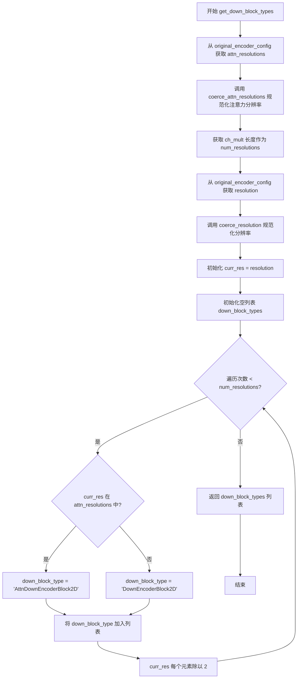

#### 带注释源码

```python
def get_down_block_types(original_encoder_config):
    """
    根据原始 VQ-Diffusion 的 encoder 配置，确定 VQVAE 编码器的下采样块类型。
    
    参数:
        original_encoder_config (dict): 包含原始 VQ-Diffusion VQVAE encoder 配置的字典，
                                       必须包含 'attn_resolutions', 'ch_mult', 'resolution' 键。
    
    返回:
        list: 下采样块类型列表，每个元素为 'AttnDownEncoderBlock2D' 或 'DownEncoderBlock2D'。
    """
    # 1. 从配置中提取注意力分辨率，并规范化为二维列表格式
    # coerce_attn_resolutions 函数将单个整数转换为 [x, x]，保留元组/列表形式
    attn_resolutions = coerce_attn_resolutions(original_encoder_config["attn_resolutions"])
    
    # 2. 获取分辨率层级数量，即通道倍数 ch_mult 的长度
    num_resolutions = len(original_encoder_config["ch_mult"])
    
    # 3. 从配置中提取原始分辨率，并规范化为 [height, width] 列表格式
    resolution = coerce_resolution(original_encoder_config["resolution"])
    
    # 4. 初始化当前分辨率为原始分辨率
    curr_res = resolution
    
    # 5. 初始化下采样块类型列表
    down_block_types = []
    
    # 6. 遍历每一层分辨率层级
    for _ in range(num_resolutions):
        # 判断当前分辨率是否在注意力分辨率集合中
        if curr_res in attn_resolutions:
            # 如果当前分辨率需要注意力机制，使用带注意力的下采样块
            down_block_type = "AttnDownEncoderBlock2D"
        else:
            # 否则使用不带注意力的标准下采样块
            down_block_type = "DownEncoderBlock2D"
        
        # 将确定的下采样块类型添加到列表中
        down_block_types.append(down_block_type)
        
        # 更新当前分辨率，为下一层做准备（分辨率减半）
        # 例如: [64, 64] -> [32, 32] -> [16, 16] -> ...
        curr_res = [r // 2 for r in curr_res]
    
    # 7. 返回完整的下采样块类型列表
    return down_block_types
```


### `get_up_block_types`

该函数根据原始 VQ-Diffusion 解码器配置，生成对应的 Diffusers 上采样块类型列表（UpDecoderBlock2D 或 AttnUpDecoderBlock2D），用于在 VQVAE 模型构建时指定上块结构。

参数：

- `original_decoder_config`：`dict`，原始 VQ-Diffusion 解码器配置字典，包含 `attn_resolutions`、`ch_mult`、`resolution` 等键，用于确定上采样块的类型。

返回值：`list[str]`，返回由 "UpDecoderBlock2D" 和 "AttnUpDecoderBlock2D" 组成的列表，顺序从底层到顶层。

#### 流程图

```mermaid
flowchart TD
    A[开始 get_up_block_types] --> B[获取 attn_resolutions 列表]
    B --> C[获取 num_resolutions 数量]
    C --> D[获取 resolution 分辨率]
    D --> E[计算初始 curr_res = resolution / 2^{num_resolutions-1}]
    E --> F{遍历 i 从 num_resolutions-1 到 0}
    F --> G{curr_res 是否在 attn_resolutions 中?}
    G -->|是| H[up_block_type = AttnUpDecoderBlock2D]
    G -->|否| I[up_block_type = UpDecoderBlock2D]
    H --> J[将 up_block_type 添加到列表]
    I --> J
    J --> K[curr_res = curr_res * 2]
    K --> L{遍历是否结束?}
    L -->|否| F
    L -->|是| M[返回 up_block_types 列表]
```

#### 带注释源码

```python
def get_up_block_types(original_decoder_config):
    """
    根据原始解码器配置生成上采样块类型列表。

    参数:
        original_decoder_config (dict): 包含解码器配置的字典，需包含:
            - attn_resolutions: 注意力分辨率列表
            - ch_mult: 通道乘数列表（用于确定分辨率层级数）
            - resolution: 原始图像分辨率

    返回:
        list: 上块类型列表，每个元素为 "UpDecoderBlock2D" 或 "AttnUpDecoderBlock2D"
    """
    # 将注意力分辨率规范化为二维列表形式
    attn_resolutions = coerce_attn_resolutions(original_decoder_config["attn_resolutions"])
    # 获取分辨率层级数量（ch_mult 列表长度）
    num_resolutions = len(original_decoder_config["ch_mult"])
    # 将分辨率规范化为 [height, width] 列表
    resolution = coerce_resolution(original_decoder_config["resolution"])

    # 计算最底层（最粗粒度）的分辨率：初始分辨率除以 2 的 (num_resolutions-1) 次方
    curr_res = [r // 2 ** (num_resolutions - 1) for r in resolution]
    # 初始化上块类型列表
    up_block_types = []

    # 倒序遍历分辨率层级（从最粗到最细）
    for _ in reversed(range(num_resolutions)):
        # 判断当前分辨率是否在注意力分辨率列表中
        if curr_res in attn_resolutions:
            # 如果需要注意力，则使用带注意力的上采样块
            up_block_type = "AttnUpDecoderBlock2D"
        else:
            # 否则使用普通的无注意力上采样块
            up_block_type = "UpDecoderBlock2D"

        # 将确定的上块类型添加到列表中
        up_block_types.append(up_block_type)

        # 进入下一层（更细粒度），分辨率翻倍
        curr_res = [r * 2 for r in curr_res]

    return up_block_types
```


### `coerce_attn_resolutions`

该函数用于将原始 VQ-Diffusion 配置文件中的 `attn_resolutions`（注意力分辨率）标准化为 diffusers 期望的格式。它将单个整数分辨率值转换为 `[height, width]` 列表对，以确保无论原始配置中是使用单一整数还是元组/列表形式，都能统一处理。

参数：

- `attn_resolutions`：任意类型，来自原始 VQ-Diffusion 配置的注意力分辨率，可以是整数、元组或列表的 iterable

返回值：`list`，返回处理后的注意力分辨率列表，每个元素都是 `[height, width]` 形式的列表

#### 流程图

```mermaid
flowchart TD
    A[开始: 输入 attn_resolutions] --> B[转换为 list]
    B --> C[创建空列表 attn_resolutions_]
    C --> D{遍历 attn_resolutions 中的每个元素 ar}
    D --> E{ar 是 list 或 tuple?}
    E -->|是| F[将 ar 转换为 list 并添加到 attn_resolutions_]
    E -->|否| G[创建 [ar, ar] 并添加到 attn_resolutions_]
    F --> H{是否还有更多元素?}
    G --> H
    H -->|是| D
    H -->|否| I[返回 attn_resolutions_]
```

#### 带注释源码

```python
def coerce_attn_resolutions(attn_resolutions):
    """
    将原始 VQ-Diffusion 配置中的注意力分辨率标准化为 diffusers 格式。
    
    原始配置中的 attn_resolutions 可能是单个整数（如 32）或元组/列表（如 (32, 32)）。
    此函数将所有格式统一转换为 [height, width] 列表对的形式。
    
    例如:
        - 输入: [32, (16, 16)] -> 输出: [[32, 32], [16, 16]]
        - 输入: (32, 32) -> 输出: [[32, 32]]
    """
    # 将输入转换为 list，确保可迭代
    attn_resolutions = list(attn_resolutions)
    
    # 初始化结果列表
    attn_resolutions_ = []
    
    # 遍历每个分辨率配置
    for ar in attn_resolutions:
        # 如果已经是 list 或 tuple 格式，直接转换为 list
        if isinstance(ar, (list, tuple)):
            attn_resolutions_.append(list(ar))
        else:
            # 如果是单个值（整数），假设为正方形分辨率 [value, value]
            attn_resolutions_.append([ar, ar])
    
    return attn_resolutions_
```


### `coerce_resolution`

该函数用于将不同格式的分辨率参数（整数、元组或列表）统一转换为列表格式 `[height, width]`，以适配后续模块对分辨率格式的标准化需求。

参数：

- `resolution`：`int | tuple | list`，输入的分辨率值，可以是单个整数、包含宽高的元组或列表

返回值：`list`，返回标准化的分辨率列表 `[height, width]`

#### 流程图

```mermaid
flowchart TD
    A[开始] --> B[输入 resolution]
    B --> C{isinstance(resolution, int)?}
    C -->|Yes| D[resolution = [resolution, resolution]]
    C --> No --> E{isinstance(resolution, tuple | list)?}
    E -->|Yes| F[resolution = list(resolution)]
    E -->|No| G[raise ValueError]
    D --> H[返回 resolution]
    F --> H
    G --> I[结束]
```

#### 带注释源码

```python
def coerce_resolution(resolution):
    """
    将不同格式的分辨率转换为统一的列表格式 [height, width]
    
    Args:
        resolution: 输入的分辨率，可以是以下格式：
            - int: 单个整数，会被转换为 [resolution, resolution]
            - tuple/list: 包含宽高的序列，会被转换为列表
    
    Returns:
        list: 标准化后的分辨率列表 [height, width]
    
    Raises:
        ValueError: 当 resolution 不是 int、tuple 或 list 类型时抛出
    """
    # 如果是单个整数，扩展为 [H, W] 形式
    if isinstance(resolution, int):
        resolution = [resolution, resolution]  # H, W
    # 如果已经是元组或列表，转换为列表类型
    elif isinstance(resolution, (tuple, list)):
        resolution = list(resolution)
    # 不支持的类型，抛出异常
    else:
        raise ValueError("Unknown type of resolution:", resolution)
    return resolution
```


### `vqvae_original_checkpoint_to_diffusers_checkpoint`

该函数负责将 VQ-Diffusion 项目中的 VQVAE（Vector Quantized Variational Autoencoder）模型检查点转换为 Hugging Face Diffusers 库兼容的格式，通过分别处理编码器、量化卷积、量化嵌入和解码器各部分的权重映射，实现跨框架的模型迁移。

参数：

- `model`：`VQModel`，Diffusers 库中的 VQVAE 模型实例，用于提供目标结构信息
- `checkpoint`：`dict`，原始 VQ-Diffusion 格式的 VQVAE 检查点字典，包含编码器、解码器、量化器等各层的权重

返回值：`dict`，转换后的 Diffusers 兼容检查点字典，键名为 Diffusers 格式的层名称，值为对应的张量数据

#### 流程图

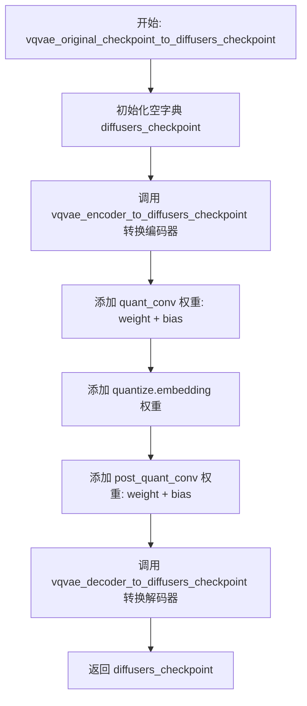

#### 带注释源码

```python
def vqvae_original_checkpoint_to_diffusers_checkpoint(model, checkpoint):
    """
    将 VQ-Diffusion 的 VQVAE 检查点转换为 Diffusers 格式
    
    参数:
        model: Diffusers VQModel 实例，提供目标模型结构
        checkpoint: 原始 VQ-Diffusion 检查点字典
    
    返回:
        转换后的 Diffusers 格式检查点字典
    """
    # 1. 初始化空的检查点字典，用于存储转换后的权重
    diffusers_checkpoint = {}

    # 2. 调用编码器转换函数，处理 encoder 部分的所有权重
    # 包括 conv_in, down_blocks, mid_block 等子组件
    diffusers_checkpoint.update(vqvae_encoder_to_diffusers_checkpoint(model, checkpoint))

    # 3. 添加 quant_conv 层的权重（负责将 latent 映射到 codebook 空间）
    diffusers_checkpoint.update(
        {
            "quant_conv.weight": checkpoint["quant_conv.weight"],
            "quant_conv.bias": checkpoint["quant_conv.bias"],
        }
    )

    # 4. 添加量化器嵌入层的权重
    # 原始检查点中键名为 "quantize.embedding"，需要映射到 Diffusers 格式
    diffusers_checkpoint.update({"quantize.embedding.weight": checkpoint["quantize.embedding"]})

    # 5. 添加 post_quant_conv 层的权重（将 codebook 输出映射回 latent 空间）
    diffusers_checkpoint.update(
        {
            "post_quant_conv.weight": checkpoint["post_quant_conv.weight"],
            "post_quant_conv.bias": checkpoint["post_quant_conv.bias"],
        }
    )

    # 6. 调用解码器转换函数，处理 decoder 部分的所有权重
    # 包括 conv_in, up_blocks, mid_block 等子组件
    diffusers_checkpoint.update(vqvae_decoder_to_diffusers_checkpoint(model, checkpoint))

    # 7. 返回完整的转换后检查点
    return diffusers_checkpoint
```


### `vqvae_encoder_to_diffusers_checkpoint`

该函数用于将 VQ-Diffusion 原始检查点中的 VQVAE 编码器（encoder）部分权重转换为 diffusers 格式。它遍历模型的编码器结构（down blocks、mid block、输出层），从原始检查点中提取对应的权重键值对，并按照 diffusers 的命名约定重新组织，生成新的检查点字典。

参数：

- `model`：`VQModel`，diffusers 库中的 VQModel 实例，包含已构建好的编码器结构
- `checkpoint`：`Dict`，原始 VQ-Diffusion 检查点字典，包含所有模型权重

返回值：`Dict`，转换后的 diffusers 格式检查点字典，仅包含编码器部分的权重

#### 流程图

```mermaid
flowchart TD
    A[函数入口] --> B[初始化空字典 diffusers_checkpoint]
    B --> C[转换 conv_in 层<br/>encoder.conv_in.weight/bias]
    C --> D[遍历 model.encoder.down_blocks]
    D --> E[获取当前 down_block 的索引和对象]
    E --> F[构建 diffusers 和原始权重的前缀<br/>encoder.down_blocks.{idx} 和 encoder.down.{idx}]
    F --> G[遍历 down_block 中的 resnets]
    G --> H[调用 vqvae_resnet_to_diffusers_checkpoint<br/>转换 norm1/conv1/norm2/conv2/shortcut]
    H --> I{是否为最后一个 down_block?}
    I -->|否| J[转换下采样层 downsample<br/>encoder.down_blocks.{idx}.downsamplers.0.conv]
    I -->是 --> K
    J --> K{down_block 是否有 attentions?}
    K -->|是| L[遍历并转换 attention 层<br/>调用 vqvae_attention_to_diffusers_checkpoint]
    K -->|否| M{还有更多 down_block?}
    L --> M
    M -->|是| E
    M -->|否| N[转换 mid_block attention<br/>encoder.mid_block.attentions.0]
    N --> O[遍历转换 mid_block resnets<br/>encoder.mid_block.resnets.{idx}]
    O --> P[转换输出归一化和卷积<br/>encoder.conv_norm_out 和 encoder.conv_out]
    P --> Q[返回 diffusers_checkpoint 字典]
```

#### 带注释源码

```python
def vqvae_encoder_to_diffusers_checkpoint(model, checkpoint):
    """
    将 VQVAE 编码器从原始 VQ-Diffusion 格式转换为 diffusers 格式
    
    参数:
        model: diffusers VQModel 实例，其 encoder 属性包含目标结构
        checkpoint: 原始 VQ-Diffusion 检查点字典
    
    返回:
        包含转换后编码器权重的字典
    """
    diffusers_checkpoint = {}

    # === 1. 转换输入卷积层 (conv_in) ===
    # 原始键: encoder.conv_in.weight / encoder.conv_in.bias
    # 目标键: encoder.conv_in.weight / encoder.conv_in.bias
    diffusers_checkpoint.update(
        {
            "encoder.conv_in.weight": checkpoint["encoder.conv_in.weight"],
            "encoder.conv_in.bias": checkpoint["encoder.conv_in.bias"],
        }
    )

    # === 2. 遍历转换所有 down_blocks (下采样编码块) ===
    for down_block_idx, down_block in enumerate(model.encoder.down_blocks):
        # 构建 diffusers 侧的前缀路径
        diffusers_down_block_prefix = f"encoder.down_blocks.{down_block_idx}"
        # 构建原始检查点侧的前缀路径
        down_block_prefix = f"encoder.down.{down_block_idx}"

        # --- 2.1 转换 resnet 块 ---
        for resnet_idx, resnet in enumerate(down_block.resnets):
            diffusers_resnet_prefix = f"{diffusers_down_block_prefix}.resnets.{resnet_idx}"
            resnet_prefix = f"{down_block_prefix}.block.{resnet_idx}"

            # 调用辅助函数转换单个 resnet 的权重
            diffusers_checkpoint.update(
                vqvae_resnet_to_diffusers_checkpoint(
                    resnet, checkpoint, 
                    diffusers_resnet_prefix=diffusers_resnet_prefix, 
                    resnet_prefix=resnet_prefix
                )
            )

        # --- 2.2 转换下采样层 (downsample) ---
        # 注意：最后一个 down_block 没有下采样层
        if down_block_idx != len(model.encoder.down_blocks) - 1:
            # 原始: encoder.down.{idx}.downsample.conv.weight
            # 目标: encoder.down_blocks.{idx}.downsamplers.0.conv.weight
            diffusers_downsample_prefix = f"{diffusers_down_block_prefix}.downsamplers.0.conv"
            downsample_prefix = f"{down_block_prefix}.downsample.conv"
            diffusers_checkpoint.update(
                {
                    f"{diffusers_downsample_prefix}.weight": checkpoint[f"{downsample_prefix}.weight"],
                    f"{diffusers_downsample_prefix}.bias": checkpoint[f"{downsample_prefix}.bias"],
                }
            )

        # --- 2.3 转换注意力层 (attentions) ---
        # 部分 down_block 包含注意力机制
        if hasattr(down_block, "attentions"):
            for attention_idx, _ in enumerate(down_block.attentions):
                diffusers_attention_prefix = f"{diffusers_down_block_prefix}.attentions.{attention_idx}"
                attention_prefix = f"{down_block_prefix}.attn.{attention_idx}"
                diffusers_checkpoint.update(
                    vqvae_attention_to_diffusers_checkpoint(
                        checkpoint,
                        diffusers_attention_prefix=diffusers_attention_prefix,
                        attention_prefix=attention_prefix,
                    )
                )

    # === 3. 转换中间块 (mid_block) ---
    
    # --- 3.1 转换 mid_block attention ---
    # VQ-Diffusion 中间注意力层硬编码为 attn_1
    diffusers_attention_prefix = "encoder.mid_block.attentions.0"
    attention_prefix = "encoder.mid.attn_1"
    diffusers_checkpoint.update(
        vqvae_attention_to_diffusers_checkpoint(
            checkpoint, diffusers_attention_prefix=diffusers_attention_prefix, attention_prefix=attention_prefix
        )
    )

    # --- 3.2 转换 mid_block resnets ---
    # VQ-Diffusion 中间有两个 resnet 块，命名为 block_1 和 block_2
    for diffusers_resnet_idx, resnet in enumerate(model.encoder.mid_block.resnets):
        diffusers_resnet_prefix = f"encoder.mid_block.resnets.{diffusers_resnet_idx}"

        # 原始索引需要偏移 1 (因为原始命名为 block_1, block_2)
        orig_resnet_idx = diffusers_resnet_idx + 1
        resnet_prefix = f"encoder.mid.block_{orig_resnet_idx}"

        diffusers_checkpoint.update(
            vqvae_resnet_to_diffusers_checkpoint(
                resnet, checkpoint, diffusers_resnet_prefix=diffusers_resnet_prefix, resnet_prefix=resnet_prefix
            )
        )

    # === 4. 转换输出层 (conv_norm_out 和 conv_out) ===
    diffusers_checkpoint.update(
        {
            # 归一化层
            "encoder.conv_norm_out.weight": checkpoint["encoder.norm_out.weight"],
            "encoder.conv_norm_out.bias": checkpoint["encoder.norm_out.bias"],
            # 输出卷积
            "encoder.conv_out.weight": checkpoint["encoder.conv_out.weight"],
            "encoder.conv_out.bias": checkpoint["encoder.conv_out.bias"],
        }
    )

    return diffusers_checkpoint
```


### `vqvae_decoder_to_diffusers_checkpoint`

该函数用于将 VQ-Diffusion 格式的 VQVAE 解码器（decoder）检查点转换为 diffusers 格式。它遍历解码器的各个组件（包括卷积层、上采样块、中间块和输出层），将原始检查点中的参数键名映射到 diffusers 模型对应的键名。

参数：

-  `model`：`VQModel`，diffusers 库中的 VQVAE 模型对象，用于提供模型结构信息
-  `checkpoint`：`Dict[str, Tensor]`，包含原始 VQ-Diffusion 检查点参数字典，键为原始参数名称，值为对应的张量

返回值：`Dict[str, Tensor]`，转换后的 diffusers 格式检查点字典，键为 diffusers 模型的参数名称，值为对应的张量

#### 流程图

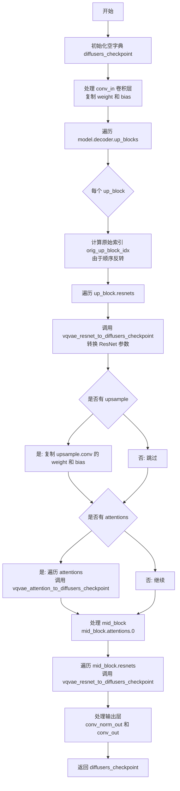

#### 带注释源码

```python
def vqvae_decoder_to_diffusers_checkpoint(model, checkpoint):
    """
    将 VQVAE 解码器从原始 VQ-Diffusion 格式转换为 diffusers 格式

    参数:
        model: diffusers VQModel 实例，提供目标模型结构
        checkpoint: 原始 VQ-Diffusion 检查点字典

    返回:
        转换后的 diffusers 格式检查点字典
    """
    # 初始化空字典用于存储转换后的参数
    diffusers_checkpoint = {}

    # ========== 处理解码器输入卷积层 conv_in ==========
    # 原始格式: decoder.conv_in.weight / bias
    # 目标格式: decoder.conv_in.weight / bias
    diffusers_checkpoint.update(
        {
            "decoder.conv_in.weight": checkpoint["decoder.conv_in.weight"],
            "decoder.conv_in.bias": checkpoint["decoder.conv_in.bias"],
        }
    )

    # ========== 处理上采样块 up_blocks ==========
    # 注意: VQ-Diffusion 中上块顺序是反向存储的
    for diffusers_up_block_idx, up_block in enumerate(model.decoder.up_blocks):
        # 计算原始检查点中的上块索引
        # 例如 diffusers 中第0个对应原始最后一个
        orig_up_block_idx = len(model.decoder.up_blocks) - 1 - diffusers_up_block_idx

        # 构建参数名前缀
        diffusers_up_block_prefix = f"decoder.up_blocks.{diffusers_up_block_idx}"
        up_block_prefix = f"decoder.up.{orig_up_block_idx}"

        # ---------- 处理 ResNet 块 ----------
        for resnet_idx, resnet in enumerate(up_block.resnets):
            diffusers_resnet_prefix = f"{diffusers_up_block_prefix}.resnets.{resnet_idx}"
            resnet_prefix = f"{up_block_prefix}.block.{resnet_idx}"

            # 调用辅助函数转换 ResNet 参数
            diffusers_checkpoint.update(
                vqvae_resnet_to_diffusers_checkpoint(
                    resnet, checkpoint,
                    diffusers_resnet_prefix=diffusers_resnet_prefix,
                    resnet_prefix=resnet_prefix
                )
            )

        # ---------- 处理上采样层 upsample ----------
        # 最后一个 up_block 没有上采样层
        if diffusers_up_block_idx != len(model.decoder.up_blocks) - 1:
            # 原始格式: decoder.up.{idx}.upsample.conv.weight
            # 目标格式: decoder.up_blocks.{idx}.upsamplers.0.conv.weight
            diffusers_downsample_prefix = f"{diffusers_up_block_prefix}.upsamplers.0.conv"
            downsample_prefix = f"{up_block_prefix}.upsample.conv"
            diffusers_checkpoint.update(
                {
                    f"{diffusers_downsample_prefix}.weight": checkpoint[f"{downsample_prefix}.weight"],
                    f"{diffusers_downsample_prefix}.bias": checkpoint[f"{downsample_prefix}.bias"],
                }
            )

        # ---------- 处理注意力层 attentions ----------
        if hasattr(up_block, "attentions"):
            for attention_idx, _ in enumerate(up_block.attentions):
                diffusers_attention_prefix = f"{diffusers_up_block_prefix}.attentions.{attention_idx}"
                attention_prefix = f"{up_block_prefix}.attn.{attention_idx}"
                diffusers_checkpoint.update(
                    vqvae_attention_to_diffusers_checkpoint(
                        checkpoint,
                        diffusers_attention_prefix=diffusers_attention_prefix,
                        attention_prefix=attention_prefix,
                    )
                )

    # ========== 处理中间块 mid_block ==========
    # VQ-Diffusion 中间块包含一个注意力层和两个 ResNet

    # ---------- mid_block 注意力层 ----------
    # 原始: decoder.mid.attn_1
    # 目标: decoder.mid_block.attentions.0
    diffusers_attention_prefix = "decoder.mid_block.attentions.0"
    attention_prefix = "decoder.mid.attn_1"
    diffusers_checkpoint.update(
        vqvae_attention_to_diffusers_checkpoint(
            checkpoint,
            diffusers_attention_prefix=diffusers_attention_prefix,
            attention_prefix=attention_prefix
        )
    )

    # ---------- mid_block ResNet 块 ----------
    # 原始使用 block_1 和 block_2 命名
    for diffusers_resnet_idx, resnet in enumerate(model.encoder.mid_block.resnets):
        diffusers_resnet_prefix = f"decoder.mid_block.resnets.{diffusers_resnet_idx}"

        # 原始索引从1开始 (block_1, block_2)
        orig_resnet_idx = diffusers_resnet_idx + 1
        resnet_prefix = f"decoder.mid.block_{orig_resnet_idx}"

        diffusers_checkpoint.update(
            vqvae_resnet_to_diffusers_checkpoint(
                resnet, checkpoint,
                diffusers_resnet_prefix=diffusers_resnet_prefix,
                resnet_prefix=resnet_prefix
            )
        )

    # ========== 处理输出层 ==========
    # 原始: decoder.norm_out.weight / bias
    # 目标: decoder.conv_norm_out.weight / bias
    diffusers_checkpoint.update(
        {
            "decoder.conv_norm_out.weight": checkpoint["decoder.norm_out.weight"],
            "decoder.conv_norm_out.bias": checkpoint["decoder.norm_out.bias"],
            "decoder.conv_out.weight": checkpoint["decoder.conv_out.weight"],
            "decoder.conv_out.bias": checkpoint["decoder.conv_out.bias"],
        }
    )

    return diffusers_checkpoint
```


### `vqvae_resnet_to_diffusers_checkpoint`

该函数负责将VQ-VAE模型中ResNet块的权重参数从原始VQ-Diffusion格式转换为Diffusers格式，处理norm1、conv1、norm2、conv2以及可选的conv_shortcut（快捷连接）层参数的键名映射和传递。

参数：

- `resnet`：`torch.nn.Module`，原始VQ-Diffusion模型中的ResNet块对象，用于检查是否存在conv_shortcut（快捷连接）
- `checkpoint`：`Dict[str, torch.Tensor]`，包含原始VQ-Diffusion模型权重的字典，通过键名映射转换为Diffusers格式
- `diffusers_resnet_prefix`：`str`（关键字参数），转换后Diffusers模型中ResNet块参数的前缀路径，如"encoder.down_blocks.0.resnets.0"
- `resnet_prefix`：`str`（关键字参数），原始VQ-Diffusion模型中Resnet块参数的前缀路径，如"encoder.down.0.block.0"

返回值：`Dict[str, torch.Tensor]`，返回包含转换后权重参数的字典，键名为Diffusers格式的完整路径，值为对应的张量数据

#### 流程图

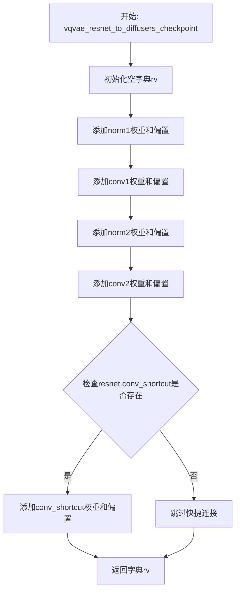

#### 带注释源码

```python
def vqvae_resnet_to_diffusers_checkpoint(resnet, checkpoint, *, diffusers_resnet_prefix, resnet_prefix):
    """
    将VQ-VAE中ResNet块的权重从原始VQ-Diffusion格式转换为Diffusers格式
    
    参数:
        resnet: 原始VQ-Diffusion模型中的ResNet块模块，用于检测是否有快捷连接
        checkpoint: 原始VQ-Diffusion模型的完整权重字典
        diffusers_resnet_prefix: 转换后Diffusers模型中ResNet块参数的前缀路径
        resnet_prefix: 原始VQ-Diffusion模型中ResNet块参数的前缀路径
    
    返回:
        包含转换后权重参数的字典
    """
    # 初始化结果字典，存储转换后的权重参数
    rv = {
        # norm1: 第一个归一化层
        f"{diffusers_resnet_prefix}.norm1.weight": checkpoint[f"{resnet_prefix}.norm1.weight"],
        f"{diffusers_resnet_prefix}.norm1.bias": checkpoint[f"{resnet_prefix}.norm1.bias"],
        # conv1: 第一个卷积层
        f"{diffusers_resnet_prefix}.conv1.weight": checkpoint[f"{resnet_prefix}.conv1.weight"],
        f"{diffusers_resnet_prefix}.conv1.bias": checkpoint[f"{resnet_prefix}.conv1.bias"],
        # norm2: 第二个归一化层
        f"{diffusers_resnet_prefix}.norm2.weight": checkpoint[f"{resnet_prefix}.norm2.weight"],
        f"{diffusers_resnet_prefix}.norm2.bias": checkpoint[f"{resnet_prefix}.norm2.bias"],
        # conv2: 第二个卷积层
        f"{diffusers_resnet_prefix}.conv2.weight": checkpoint[f"{resnet_prefix}.conv2.weight"],
        f"{diffusers_resnet_prefix}.conv2.bias": checkpoint[f"{resnet_prefix}.conv2.bias"],
    }

    # 检查是否存在快捷连接（shortcut connection）
    # 在VQ-Diffusion中，快捷连接使用nin_shortcut（1x1卷积）
    if resnet.conv_shortcut is not None:
        rv.update(
            {
                # conv_shortcut: 快捷连接卷积层
                f"{diffusers_resnet_prefix}.conv_shortcut.weight": checkpoint[f"{resnet_prefix}.nin_shortcut.weight"],
                f"{diffusers_resnet_prefix}.conv_shortcut.bias": checkpoint[f"{resnet_prefix}.nin_shortcut.bias"],
            }
        )

    # 返回转换后的权重字典
    return rv
```


### `vqvae_attention_to_diffusers_checkpoint`

该函数用于将 VQ-Diffusion 模型中注意力模块的检查点参数转换为 Diffusers 格式。它处理权重矩阵的切片和键名映射，将原始检查点中的注意力权重（query、key、value、proj_attn）以及归一化层和偏置项重新映射到 Diffusers 模型所需的键名格式。

参数：

- `checkpoint`：`dict`，原始 VQ-Diffusion 模型的检查点字典，包含以原始键名存储的模型权重
- `diffusers_attention_prefix`：`str`，目标 Diffusers 模型中注意力模块的前缀路径，用于构建新的键名
- `attention_prefix`：`str`，原始 VQ-Diffusion 模型中注意力模块的前缀路径，用于从检查点中提取权重

返回值：`dict`，转换后的 Diffusers 格式检查点字典，包含重新映射键名的注意力模块权重

#### 流程图

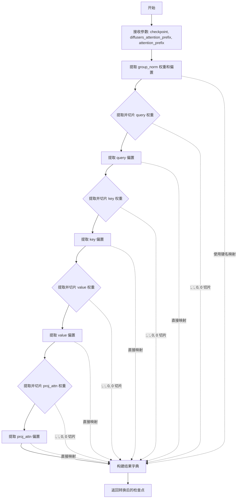

#### 带注释源码

```python
def vqvae_attention_to_diffusers_checkpoint(checkpoint, *, diffusers_attention_prefix, attention_prefix):
    """
    将 VQ-Diffusion 注意力模块的检查点转换为 Diffusers 格式
    
    参数:
        checkpoint: 原始 VQ-Diffusion 模型的检查点字典
        diffusers_attention_prefix: 目标 Diffusers 模型中注意力模块的前缀
        attention_prefix: 原始 VQ-Diffusion 模型中注意力模块的前缀
    
    返回:
        转换后的 Diffusers 格式检查点字典
    """
    return {
        # group_norm: 注意力层的组归一化层
        # 原始模型中使用 "norm.weight" 和 "norm.bias"
        # 转换后使用 "group_norm.weight" 和 "group_norm.bias"
        f"{diffusers_attention_prefix}.group_norm.weight": checkpoint[f"{attention_prefix}.norm.weight"],
        f"{diffusers_attention_prefix}.group_norm.bias": checkpoint[f"{attention_prefix}.norm.bias"],
        
        # query: 查询向量
        # 原始模型中使用 "q.weight"，形状为 [out_channels, in_channels, 1, 1]
        # 需要通过 [:, :, 0, 0] 切片转换为 [out_channels, in_channels]
        f"{diffusers_attention_prefix}.query.weight": checkpoint[f"{attention_prefix}.q.weight"][:, :, 0, 0],
        f"{diffusers_attention_prefix}.query.bias": checkpoint[f"{attention_prefix}.q.bias"],
        
        # key: 键向量
        # 同样需要通过 [:, :, 0, 0] 切片转换为二维权重矩阵
        f"{diffusers_attention_prefix}.key.weight": checkpoint[f"{attention_prefix}.k.weight"][:, :, 0, 0],
        f"{diffusers_attention_prefix}.key.bias": checkpoint[f"{attention_prefix}.k.bias"],
        
        # value: 值向量
        # 同样需要通过 [:, :, 0, 0] 切片转换为二维权重矩阵
        f"{diffusers_attention_prefix}.value.weight": checkpoint[f"{attention_prefix}.v.weight"][:, :, 0, 0],
        f"{diffusers_attention_prefix}.value.bias": checkpoint[f"{attention_prefix}.v.bias"],
        
        # proj_attn: 注意力输出投影层
        # 原始模型中使用 "proj_out.weight"
        # 需要通过 [:, :, 0, 0] 切片转换为二维权重矩阵
        f"{diffusers_attention_prefix}.proj_attn.weight": checkpoint[f"{attention_prefix}.proj_out.weight"][
            :, :, 0, 0
        ],
        f"{diffusers_attention_prefix}.proj_attn.bias": checkpoint[f"{attention_prefix}.proj_out.bias"],
    }
```


### `transformer_model_from_original_config`

该函数用于将原始 VQ-Diffusion 项目的 Transformer 配置转换为 Diffusers 库的 `Transformer2DModel`。它通过解析三个配置文件（扩散配置、Transformer 配置和内容嵌入配置）来提取模型参数，然后使用这些参数构建一个等效的 Diffusers Transformer 模型。

参数：

- `original_diffusion_config`：`dict`，原始 VQ-Diffusion 项目的扩散模型配置文件，包含目标类名和参数
- `original_transformer_config`：`dict`，原始 Transformer 模型的配置文件，包含目标类名和参数（如层数、注意力头数等）
- `original_content_embedding_config`：`dict`，原始内容嵌入的配置文件，包含目标类名和参数（如嵌入数量等）

返回值：`Transformer2DModel`，根据原始 VQ-Diffusion 配置创建的 Diffusers Transformer2DModel 实例

#### 流程图

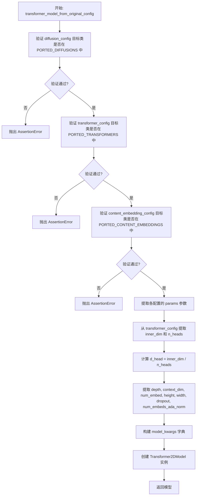

#### 带注释源码

```python
def transformer_model_from_original_config(
    original_diffusion_config, original_transformer_config, original_content_embedding_config
):
    # 验证扩散配置的目标类是否在支持列表中
    # PORTED_DIFFUSIONS = ["image_synthesis.modeling.transformers.diffusion_transformer.DiffusionTransformer"]
    assert original_diffusion_config["target"] in PORTED_DIFFUSIONS, (
        f"{original_diffusion_config['target']} has not yet been ported to diffusers."
    )
    
    # 验证 Transformer 配置的目标类是否在支持列表中
    # PORTED_TRANSFORMERS = ["image_synthesis.modeling.transformers.transformer_utils.Text2ImageTransformer"]
    assert original_transformer_config["target"] in PORTED_TRANSFORMERS, (
        f"{original_transformer_config['target']} has not yet been ported to diffusers."
    )
    
    # 验证内容嵌入配置的目标类是否在支持列表中
    # PORTED_CONTENT_EMBEDDINGS = ["image_synthesis.modeling.embeddings.dalle_mask_image_embedding.DalleMaskImageEmbedding"]
    assert original_content_embedding_config["target"] in PORTED_CONTENT_EMBEDDINGS, (
        f"{original_content_embedding_config['target']} has not yet been ported to diffusers."
    )

    # 从配置字典中提取参数对象
    original_diffusion_config = original_diffusion_config["params"]
    original_transformer_config = original_transformer_config["params"]
    original_content_embedding_config = original_content_embedding_config["params"]

    # 提取 Transformer 的嵌入维度
    inner_dim = original_transformer_config["n_embd"]

    # 提取注意力头数量
    n_heads = original_transformer_config["n_head"]

    # VQ-Diffusion 将多头注意力层的维度表示为:
    # 注意力头数 * 单个头部的序列长度(维度)
    # 我们需要分别指定这些值来配置注意力块
    # 验证维度可以被头数整除
    assert inner_dim % n_heads == 0
    # 计算单个头的维度
    d_head = inner_dim // n_heads

    # 提取 Transformer 层数
    depth = original_transformer_config["n_layer"]
    # 提取条件/交叉注意力的维度
    context_dim = original_transformer_config["condition_dim"]

    # 提取内容嵌入的数量
    num_embed = original_content_embedding_config["num_embed"]
    # Transformer 中的嵌入数量包括 mask 嵌入
    # 内容嵌入(VQVAE)不包括 mask 嵌入，所以需要加 1
    num_embed = num_embed + 1

    # 提取内容的空间尺寸(高度和宽度)
    height = original_transformer_config["content_spatial_size"][0]
    width = original_transformer_config["content_spatial_size"][1]

    # 验证宽度等于高度
    assert width == height, "width has to be equal to height"
    # 提取 Dropout 概率
    dropout = original_transformer_config["resid_pdrop"]
    # 提取 AdaNorm 的嵌入数量(即扩散步数)
    num_embeds_ada_norm = original_diffusion_config["diffusion_step"]

    # 构建 Transformer2DModel 的关键字参数
    model_kwargs = {
        "attention_bias": True,               # 是否使用注意力偏置
        "cross_attention_dim": context_dim,   # 交叉注意力维度
        "attention_head_dim": d_head,        # 单个注意力头的维度
        "num_layers": depth,                  # Transformer 层数
        "dropout": dropout,                   # Dropout 概率
        "num_attention_heads": n_heads,       # 注意力头数量
        "num_vector_embeds": num_embed,      # 向量嵌入数量
        "num_embeds_ada_norm": num_embeds_ada_norm,  # AdaNorm 嵌入数
        "norm_num_groups": 32,                # GroupNorm 的组数
        "sample_size": width,                # 样本尺寸
        "activation_fn": "geglu-approximate", # 激活函数
    }

    # 使用构建的参数创建 Transformer2DModel 实例
    model = Transformer2DModel(**model_kwargs)
    return model
```


### `transformer_original_checkpoint_to_diffusers_checkpoint`

该函数用于将微软 VQ-Diffusion 项目中 Transformer 部分的模型检查点从原始格式转换为 Hugging Face Diffusers 库所需的格式。主要完成模型权重的键名映射和重组织，使得原始预训练权重能够被 Diffusers 的 `Transformer2DModel` 正确加载和使用。

参数：

-  `model`：`Transformer2DModel`，Diffusers 库中的 Transformer2DModel 实例，用于确定模型的层结构和提供转换后的键名前缀
-  `checkpoint`：`<class 'dict'>`，原始 VQ-Diffusion 检查点字典，包含以原始键名存储的模型权重

返回值：`dict`，返回转换后的 Diffusers 格式检查点字典，键名已按照 Diffusers 的命名规范进行重映射

#### 流程图

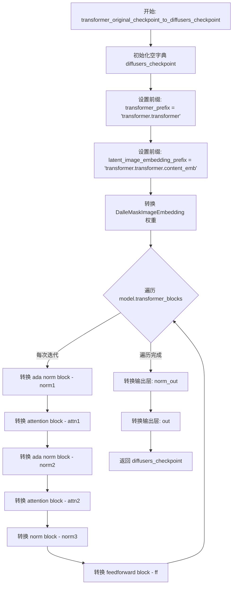

#### 带注释源码

```python
def transformer_original_checkpoint_to_diffusers_checkpoint(model, checkpoint):
    """
    将原始 VQ-Diffusion Transformer 检查点转换为 Diffusers 格式
    
    参数:
        model: Diffusers 的 Transformer2DModel 实例
        checkpoint: 原始 VQ-Diffusion 检查点字典
    返回:
        转换后的 Diffusers 格式检查点字典
    """
    # 初始化结果字典
    diffusers_checkpoint = {}

    # 定义原始检查点中 Transformer 的键名前缀
    transformer_prefix = "transformer.transformer"

    # 定义 Diffusers 模型中 latent image embedding 的前缀
    diffusers_latent_image_embedding_prefix = "latent_image_embedding"
    # 对应原始检查点中的前缀
    latent_image_embedding_prefix = f"{transformer_prefix}.content_emb"

    # === 1. 转换 DalleMaskImageEmbedding (内容嵌入层) ===
    # 包括: emb.weight, height_emb.weight, width_emb.weight
    diffusers_checkpoint.update(
        {
            f"{diffusers_latent_image_embedding_prefix}.emb.weight": checkpoint[
                f"{latent_image_embedding_prefix}.emb.weight"
            ],
            f"{diffusers_latent_image_embedding_prefix}.height_emb.weight": checkpoint[
                f"{latent_image_embedding_prefix}.height_emb.weight"
            ],
            f"{diffusers_latent_image_embedding_prefix}.width_emb.weight": checkpoint[
                f"{latent_image_embedding_prefix}.width_emb.weight"
            ],
        }
    )

    # === 2. 遍历并转换每个 Transformer Block ===
    for transformer_block_idx, transformer_block in enumerate(model.transformer_blocks):
        # Diffusers 中的 transformer block 前缀
        diffusers_transformer_block_prefix = f"transformer_blocks.{transformer_block_idx}"
        # 原始检查点中的 transformer block 前缀
        transformer_block_prefix = f"{transformer_prefix}.blocks.{transformer_block_idx}"

        # --- 2.1 转换第一个 AdaNorm Block (norm1) ---
        # AdaNorm 用于自适应归一化，是 VQ-Diffusion 的关键组件
        diffusers_ada_norm_prefix = f"{diffusers_transformer_block_prefix}.norm1"
        ada_norm_prefix = f"{transformer_block_prefix}.ln1"

        diffusers_checkpoint.update(
            transformer_ada_norm_to_diffusers_checkpoint(
                checkpoint, diffusers_ada_norm_prefix=diffusers_ada_norm_prefix, ada_norm_prefix=ada_norm_prefix
            )
        )

        # --- 2.2 转换第一个 Attention Block (attn1 - 自注意力) ---
        diffusers_attention_prefix = f"{diffusers_transformer_block_prefix}.attn1"
        attention_prefix = f"{transformer_block_prefix}.attn1"

        diffusers_checkpoint.update(
            transformer_attention_to_diffusers_checkpoint(
                checkpoint, diffusers_attention_prefix=diffusers_attention_prefix, attention_prefix=attention_prefix
            )
        )

        # --- 2.3 转换第二个 AdaNorm Block (norm2) ---
        diffusers_ada_norm_prefix = f"{diffusers_transformer_block_prefix}.norm2"
        ada_norm_prefix = f"{transformer_block_prefix}.ln1_1"

        diffusers_checkpoint.update(
            transformer_ada_norm_to_diffusers_checkpoint(
                checkpoint, diffusers_ada_norm_prefix=diffusers_ada_norm_prefix, ada_norm_prefix=ada_norm_prefix
            )
        )

        # --- 2.4 转换第二个 Attention Block (attn2 - 交叉注意力) ---
        diffusers_attention_prefix = f"{diffusers_transformer_block_prefix}.attn2"
        attention_prefix = f"{transformer_block_prefix}.attn2"

        diffusers_checkpoint.update(
            transformer_attention_to_diffusers_checkpoint(
                checkpoint, diffusers_attention_prefix=diffusers_attention_prefix, attention_prefix=attention_prefix
            )
        )

        # --- 2.5 转换 LayerNorm Block (norm3) ---
        diffusers_norm_block_prefix = f"{diffusers_transformer_block_prefix}.norm3"
        norm_block_prefix = f"{transformer_block_prefix}.ln2"

        diffusers_checkpoint.update(
            {
                f"{diffusers_norm_block_prefix}.weight": checkpoint[f"{norm_block_prefix}.weight"],
                f"{diffusers_norm_block_prefix}.bias": checkpoint[f"{norm_block_prefix}.bias"],
            }
        )

        # --- 2.6 转换 FeedForward Block (ff) ---
        diffusers_feedforward_prefix = f"{diffusers_transformer_block_prefix}.ff"
        feedforward_prefix = f"{transformer_block_prefix}.mlp"

        diffusers_checkpoint.update(
            transformer_feedforward_to_diffusers_checkpoint(
                checkpoint,
                diffusers_feedforward_prefix=diffusers_feedforward_prefix,
                feedforward_prefix=feedforward_prefix,
            )
        )

    # === 3. 转换输出层 ===
    
    # 转换最终归一化层 (norm_out)
    diffusers_norm_out_prefix = "norm_out"
    norm_out_prefix = f"{transformer_prefix}.to_logits.0"

    diffusers_checkpoint.update(
        {
            f"{diffusers_norm_out_prefix}.weight": checkpoint[f"{norm_out_prefix}.weight"],
            f"{diffusers_norm_out_prefix}.bias": checkpoint[f"{norm_out_prefix}.bias"],
        }
    )

    # 转换输出投影层 (out)
    diffusers_out_prefix = "out"
    out_prefix = f"{transformer_prefix}.to_logits.1"

    diffusers_checkpoint.update(
        {
            f"{diffusers_out_prefix}.weight": checkpoint[f"{out_prefix}.weight"],
            f"{diffusers_out_prefix}.bias": checkpoint[f"{out_prefix}.bias"],
        }
    )

    return diffusers_checkpoint
```


### `transformer_ada_norm_to_diffusers_checkpoint`

该函数用于将 VQ-Diffusion 模型中的 AdaNorm（自适应归一化）层权重转换为 Diffusers 格式。它接收原始检查点字典和两个前缀参数，通过键名映射的方式将原始模型的权重复制到目标格式的字典中。

参数：

- `checkpoint`：`Dict`，原始 VQ-Diffusion 模型的检查点字典，包含所有权重
- `diffusers_ada_norm_prefix`：`str`（仅关键字参数），转换后 diffusers 模型中 AdaNorm 层的前缀路径
- `ada_norm_prefix`：`str`（仅关键字参数），原始 VQ-Diffusion 模型中 AdaNorm 层的前缀路径

返回值：`Dict`，包含转换后的权重映射字典，键为 diffusers 格式的键名，值为从原始检查点中提取的权重

#### 流程图

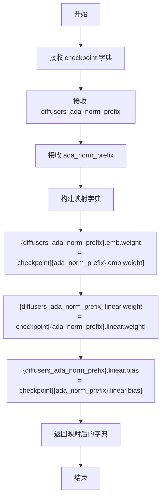

#### 带注释源码

```python
def transformer_ada_norm_to_diffusers_checkpoint(checkpoint, *, diffusers_ada_norm_prefix, ada_norm_prefix):
    """
    将 VQ-Diffusion 的 AdaNorm 层权重转换为 diffusers 格式。

    Args:
        checkpoint: 原始 VQ-Diffusion 模型的检查点字典
        diffusers_ada_norm_prefix: 转换后 diffusers 模型中 AdaNorm 层的前缀
        ada_norm_prefix: 原始 VQ-Diffusion 模型中 AdaNorm 层的前缀

    Returns:
        包含转换后权重的字典
    """
    return {
        # 映射 embedding 权重：从原始检查点的 ada_norm_prefix 键映射到 diffusers 格式的 diffusers_ada_norm_prefix 键
        f"{diffusers_ada_norm_prefix}.emb.weight": checkpoint[f"{ada_norm_prefix}.emb.weight"],
        # 映射线性层权重：将原始模型中的 linear 层权重映射到 diffusers 格式
        f"{diffusers_ada_norm_prefix}.linear.weight": checkpoint[f"{ada_norm_prefix}.linear.weight"],
        # 映射线性层偏置：将原始模型中的 linear 层偏置映射到 diffusers 格式
        f"{diffusers_ada_norm_prefix}.linear.bias": checkpoint[f"{ada_norm_prefix}.linear.bias"],
    }
```


### `transformer_attention_to_diffusers_checkpoint`

该函数用于将 VQ-Diffusion 模型中 Transformer 注意力层的检查点参数从原始格式转换为 Diffusers 格式，主要处理 query、key、value 以及输出投影层的权重和偏置迁移。

参数：

- `checkpoint`：`dict`，原始 VQ-Diffusion 检查点字典，包含原始格式的模型权重
- `diffusers_attention_prefix`：`str`，Diffusers 模型中注意力层参数的前缀路径
- `attention_prefix`：`str`，原始 VQ-Diffusion 模型中注意力层参数的前缀路径

返回值：`dict`，返回转换后的 Diffusers 格式检查点字典

#### 流程图

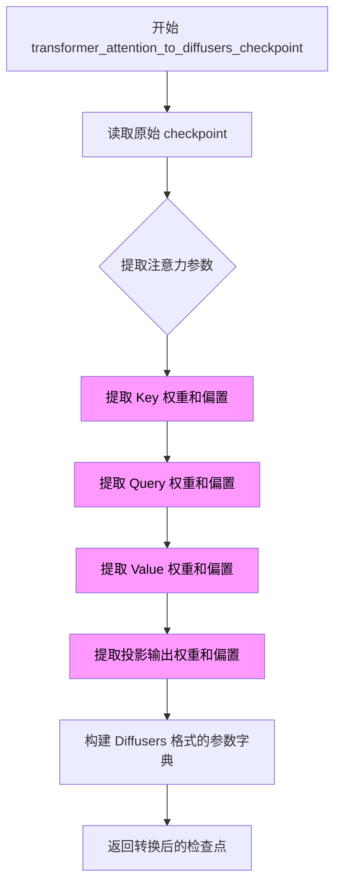

#### 带注释源码

```python
def transformer_attention_to_diffusers_checkpoint(checkpoint, *, diffusers_attention_prefix, attention_prefix):
    """
    将 VQ-Diffusion Transformer 注意力层检查点转换为 Diffusers 格式
    
    该函数处理注意力机制的参数映射，将原始 VQ-Diffusion 模型的参数名和结构
    转换为 Diffusers 框架要求的格式，包括 Query、Key、Value 和输出投影层。
    
    参数:
        checkpoint: 包含原始模型权重的字典
        diffusers_attention_prefix: Diffusers 模型中注意力层的参数前缀
        attention_prefix: 原始 VQ-Diffusion 模型中注意力层的参数前缀
    
    返回:
        包含转换后权重的新字典，键名为 Diffusers 格式的路径
    """
    return {
        # 从原始检查点提取 Key 权重并映射到 Diffusers 格式的 to_k 层
        # key 权重通常存储在 attention_prefix.key.weight 路径
        f"{diffusers_attention_prefix}.to_k.weight": checkpoint[f"{attention_prefix}.key.weight"],
        f"{diffusers_attention_prefix}.to_k.bias": checkpoint[f"{attention_prefix}.key.bias"],
        
        # 从原始检查点提取 Query 权重并映射到 Diffusers 格式的 to_q 层
        # query 权重存储在 attention_prefix.query.weight 路径
        f"{diffusers_attention_prefix}.to_q.weight": checkpoint[f"{attention_prefix}.query.weight"],
        f"{diffusers_attention_prefix}.to_q.bias": checkpoint[f"{attention_prefix}.query.bias"],
        
        # 从原始检查点提取 Value 权重并映射到 Diffusers 格式的 to_v 层
        # value 权重存储在 attention_prefix.value.weight 路径
        f"{diffusers_attention_prefix}.to_v.weight": checkpoint[f"{attention_prefix}.value.weight"],
        f"{diffusers_attention_prefix}.to_v.bias": checkpoint[f"{attention_prefix}.value.bias"],
        
        # 从原始检查点提取输出投影权重并映射到 Diffusers 格式的 to_out.0 层
        # 原始模型使用 proj 层，Diffusers 使用 to_out.0 (包含线性层和可选的 Dropout)
        # 权重存储在 attention_prefix.proj.weight 路径
        f"{diffusers_attention_prefix}.to_out.0.weight": checkpoint[f"{attention_prefix}.proj.weight"],
        f"{diffusers_attention_prefix}.to_out.0.bias": checkpoint[f"{attention_prefix}.proj.bias"],
    }
```


### `transformer_feedforward_to_diffusers_checkpoint`

该函数用于将原始VQ-Diffusion模型中的Transformer前馈网络（Feedforward）层参数转换为Diffusers格式的检查点字典，处理权重和偏置的键名映射。

参数：

- `checkpoint`：`dict`，原始VQ-Diffusion模型的检查点字典，包含原始模型的权重参数
- `diffusers_feedforward_prefix`：`str`，Diffusers模型中前馈网络层参数的目标前缀路径
- `feedforward_prefix`：`str`，原始模型中前馈网络层参数的源前缀路径

返回值：`dict`，转换后的Diffusers格式检查点字典，包含映射后的前馈网络层权重和偏置

#### 流程图

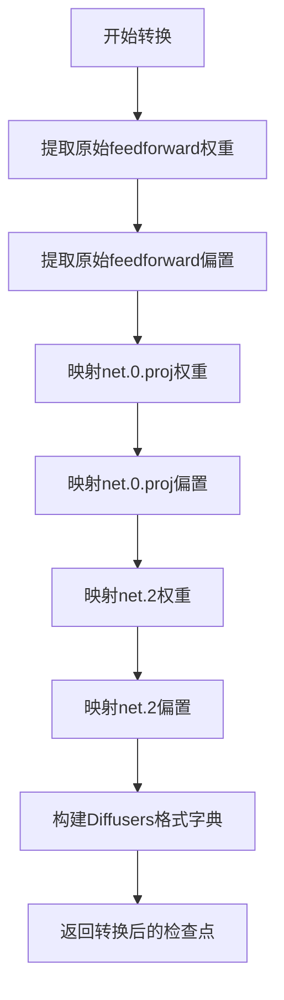

#### 带注释源码

```python
def transformer_feedforward_to_diffusers_checkpoint(checkpoint, *, diffusers_feedforward_prefix, feedforward_prefix):
    """
    将原始VQ-Diffusion的Transformer前馈网络参数转换为Diffusers格式
    
    参数:
        checkpoint: 原始模型的完整检查点字典
        diffusers_feedforward_prefix: Diffusers模型中ff层的目标前缀
        feedforward_prefix: 原始模型中ff层的源前缀
    
    返回:
        包含映射后权重和偏置的字典
    """
    return {
        # 映射第一个全连接层的权重（原始模型索引0对应Diffusers的net.0.proj）
        f"{diffusers_feedforward_prefix}.net.0.proj.weight": checkpoint[f"{feedforward_prefix}.0.weight"],
        # 映射第一个全连接层的偏置
        f"{diffusers_feedforward_prefix}.net.0.proj.bias": checkpoint[f"{feedforward_prefix}.0.bias"],
        # 映射第二个全连接层的权重（原始模型索引2对应Diffusers的net.2）
        f"{diffusers_feedforward_prefix}.net.2.weight": checkpoint[f"{feedforward_prefix}.2.weight"],
        # 映射第二个全连接层的偏置
        f"{diffusers_feedforward_prefix}.net.2.bias": checkpoint[f"{feedforward_prefix}.2.bias"],
    }
```


### `read_config_file`

该函数用于读取并解析 YAML 配置文件，将文件内容加载为 Python 对象并返回。

参数：

- `filename`：`str`，要读取的 YAML 配置文件的路径

返回值：`dict`（或 YAML 文件解析后的嵌套对象），返回从 YAML 文件加载的原始配置对象

#### 流程图

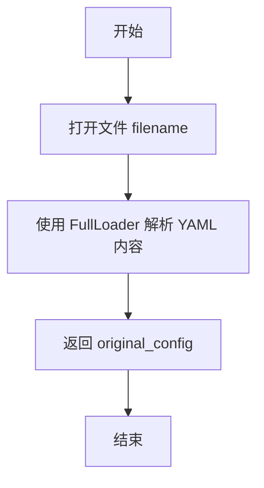

#### 带注释源码

```python
def read_config_file(filename):
    # The yaml file contains annotations that certain values should
    # loaded as tuples.
    # 打开指定路径的 YAML 文件
    with open(filename) as f:
        # 使用 FullLoader 加载 YAML 内容（保留原始类型注解）
        original_config = yaml.load(f, FullLoader)

    # 返回解析后的配置对象
    return original_config
```

## 关键组件


### VQVAE模型配置解析与转换

负责从原始VQ-Diffusion的YAML配置文件中解析VQVAE模型架构参数，包括编码器/解码器的通道数、注意力分辨率、下采样/上采样块类型等，并据此创建diffusers格式的VQModel实例。

### VQVAE检查点权重映射

将原始VQ-Diffusion检查点中的VQVAE权重（encoder、decoder、quant_conv、quantize、post_quant_conv等）重映射到diffusers格式的对应键名，处理权重维度转换和参数名称差异。

### Transformer模型配置解析

从原始配置的diffusion_config、transformer_config和content_embedding_config中提取transformer的关键参数（hidden_dim、num_heads、num_layers、context_dim等），并据此创建diffusers的Transformer2DModel实例。

### Transformer检查点权重映射

将原始transformer的权重键名（transformer.transformer.blocks、attention、mlp、norm等）转换为diffusers格式（transformer_blocks、attn1、attn2、ff等），包括ada norm、attention和feedforward层的参数重映射。

### 文本编码器加载

使用Hugging Face transformers库加载预训练的CLIPTextModel和CLIPTokenizer，用于将文本提示编码为条件嵌入向量。

### 调度器初始化

创建VQDiffusionScheduler，其向量类别数与transformer的num_vector_embeds匹配，用于控制扩散采样过程。

### 惰性权重加载

使用accelerate库的init_empty_weights和load_checkpoint_and_dispatch实现模型权重的惰性加载，通过临时文件保存转换后的检查点再加载到模型中，避免内存溢出。

### EMA权重处理

根据use_ema标志从原始检查点中提取EMA权重，并在transformer权重键前添加"transformer."前缀以匹配目标格式。

### 可学习分类器自由采样嵌入

从原始transformer检查点中提取learned classifier-free sampling embeddings，并创建LearnedClassifierFreeSamplingEmbeddings模型用于无分类器指导采样。

### Pipeline组装与保存

将转换后的VQVAE、transformer、tokenizer、text_encoder、scheduler和learned_embeddings组装为VQDiffusionPipeline并保存为diffusers格式。


## 问题及建议


### 已知问题

- **硬编码配置值**：代码中存在多处硬编码值，如 `norm_num_groups = 32`、`clip_name = "openai/clip-vit-base-patch32"`、`pad_token = "!"` 等，降低了代码的灵活性和可配置性
- **过度使用断言进行错误处理**：代码中大量使用 `assert` 语句进行参数验证，在生产环境中这些应该使用适当的异常处理（ValueError/TypeError）替代，以便提供更有意义的错误信息
- **缺乏YAML安全加载**：使用 `yaml.load(f, FullLoader)` 而非更安全的 `yaml.safe_load`，存在潜在的安全风险
- **代码重复**：VQVAE 编码器和解码器的 checkpoint 转换函数（`vqvae_encoder_to_diffusers_checkpoint` 和 `vqvae_decoder_to_diffusers_checkpoint`）包含大量重复代码，应该提取公共逻辑
- **内存管理不够优化**：虽然使用了临时文件来减少内存占用，但中间 checkpoint 仍然保存在内存中，对于超大模型可能导致内存溢出；此外显式的 `del` 语句不够优雅
- **不支持通用模型**：当前只支持 ITHQ 数据集，`PORTED_VQVAES`、`PORTED_DIFFUSIONS` 等列表只包含单一模型，扩展性差
- **缺乏日志记录**：代码仅使用 `print` 语句进行输出，没有使用标准的 `logging` 模块，不利于生产环境的调试和监控
- **CLIP模型加载问题**：注释中提到 `CLIPTextModel` 不支持 `device_map="auto"`，但实际加载时将整个代码逻辑写死在脚本中，缺乏灵活性
- **EMA权重加载逻辑缺陷**：当指定 `use_ema=True` 但 checkpoint 中不存在 EMA 权重时，代码仅打印警告但继续执行，可能导致模型使用非EMA权重而用户不知情
- **变量命名不一致**：部分变量使用简写（如 `d_head`、`rv`），部分使用完整名称，风格不统一；且一些变量名具有误导性（如 `vqvae_model` 实际是 `VQModel` 实例）

### 优化建议

- 将硬编码值提取为命令行参数或配置文件，提高脚本的可配置性
- 使用 `yaml.safe_load` 替代 `yaml.load` 以提高安全性
- 将断言替换为适当的异常处理，提供更友好的错误信息
- 提取公共函数以减少代码重复，如创建通用的 resnet/attention 转换函数
- 使用 Python `logging` 模块替代 print 语句，支持不同日志级别
- 添加单元测试和集成测试以确保代码正确性
- 为类和方法添加类型提示，提高代码可读性和可维护性
- 添加更完善的错误处理和边界检查，特别是文件加载和参数验证部分
- 考虑使用上下文管理器（with语句）自动管理临时文件
- 添加配置验证逻辑，确保传入的配置文件格式正确
</think>

## 其它


### 设计目标与约束

该代码的核心目标是将微软 VQ-Diffusion 项目中的 ITHQ 数据集预训练模型迁移到 Hugging Face diffusers 框架。主要约束包括：仅支持 ITHQ 数据集模型转换；必须保留原始模型的权重和结构语义；需要处理 EMA 权重和非 EMA 权重两种模式；目标架构仅支持图像合成任务。转换后的模型应完全兼容 diffusers API，支持 `VQDiffusionPipeline` 推理流程。

### 错误处理与异常设计

代码采用断言（assert）进行关键路径验证，包括模型类型检查、配置参数一致性校验（通道数、分辨率、层数等）。配置文件加载使用 `FullLoader` 解析 YAML，失败时抛出 `yaml.YAMLError`。模型文件不存在时 `torch.load` 会抛出 `FileNotFoundError`。关键断言失败场景包括：不支持的 VQVAE 模型类型（`PORTED_VQVAES` 白名单检查）、不支持的 Transformer 类型（`PORTED_DIFFUSIONS` 和 `PORTED_TRANSFORMERS` 白名单检查）、不支持的内容嵌入类型（`PORTED_CONTENT_EMBEDDINGS` 检查）、以及维度不匹配异常（如 `inner_dim % n_heads == 0` 校验）。建议增加更详细的错误信息和异常恢复机制。

### 数据流与状态机

代码的数据流分为三个主要阶段。第一阶段为 VQVAE 模型构建与检查点转换：读取 VQVAE YAML 配置 → 解析编码器/解码器参数 → 构建 diffusers VQModel → 调用 `vqvae_original_checkpoint_to_diffusers_checkpoint` 映射权重 → 临时文件存储后加载模型。第二阶段为 Transformer 模型构建与检查点转换：读取主模型 YAML 配置 → 解析 diffusion/transformer/content_embedding 配置 → 构建 diffusers Transformer2DModel → 处理 EMA 权重（如需要）→ 调用 `transformer_original_checkpoint_to_diffusers_checkpoint` 映射权重 → 临时文件存储后加载模型。第三阶段为完整 Pipeline 组装：加载 CLIP tokenizer 和 text_encoder → 创建 VQDiffusionScheduler → 构建 LearnedClassifierFreeSamplingEmbeddings → 组装 VQDiffusionPipeline → 保存到指定路径。

### 外部依赖与接口契约

主要外部依赖包括：PyTorch（张量运算和模型加载）、PyYAML（配置文件解析）、transformers（CLIPTextModel 和 CLIPTokenizer）、accelerate（`init_empty_weights` 和 `load_checkpoint_and_dispatch` 用于设备映射）、diffusers（VQModel、Transformer2DModel、VQDiffusionPipeline、VQDiffusionScheduler）。接口契约方面，命令行参数 `--vqvae_checkpoint_path` 和 `--vqvae_original_config_file` 必须同时指定， `--checkpoint_path` 和 `--original_config_file` 必须同时指定，`--dump_path` 为必需输出路径，`--checkpoint_load_device` 默认为 "cpu"，`--no_use_ema` 标志控制 EMA 权重加载行为。输入检查点格式必须包含 "model" 键，若使用 EMA 还需包含 "ema" 键。

### 性能考量与资源使用

代码使用 `tempfile.NamedTemporaryFile` 作为中间文件存储转换后的检查点，以避免内存溢出（大规模模型权重可能超出内存）。`load_checkpoint_and_dispatch` 使用 `device_map="auto"` 实现模型分片加载。VQVAE 和 Transformer 模型依次加载，非必要时及时删除原始检查点引用以释放内存。临时文件在上下文结束后自动清理。建议：可考虑使用 `torch.cuda.empty_cache()` 显式释放 GPU 缓存，以及对多模型场景支持并行加载。

### 版本兼容性与依赖管理

代码假设运行环境已安装兼容版本的 diffusers 库（包含 VQDiffusionPipeline）。CLIP 模型使用 "openai/clip-vit-base-patch32" 预训练权重，从 Hugging Face Hub 自动下载。VQDiffusionScheduler 的 `num_vec_classes` 必须与 Transformer 的 `num_vector_embeds` 一致。建议在文档中明确标注测试过的依赖版本范围，特别是 diffusers 和 transformers 库的版本兼容性。

### 测试与验证建议

当前代码缺少单元测试和集成测试。建议补充以下测试用例：VQVAE 配置解析的正确性验证（边界分辨率、通道数）、Transformer 参数映射的完整性验证（所有权重键是否正确转换）、EMA/非 EMA 模式下的输出差异验证、转换后 Pipeline 的前向传播验证（与原始模型输出一致性对比）、以及异常输入（不支持的模型类型、缺失文件）的错误处理验证。

### 配置文件的隐式依赖

代码依赖于 VQ-Diffusion 仓库中的 YAML 配置文件结构，特别是对嵌套参数路径的假设（如 `original_config["params"]["encoder_config"]["params"]`）。这些路径在不同版本的 VQ-Diffusion 配置中可能发生变化。建议在文档中明确标注配置的预期结构版本，并考虑增加配置版本兼容性检查。

### 安全考量

代码从远程 URL 下载预训练权重（Azure Blob Storage 和 GitHub Raw），存在潜在的安全风险：URL 可能被篡改或指向恶意资源。建议增加下载文件的 SHA256 校验和验证机制，或者优先使用本地可信的模型权重文件。


    