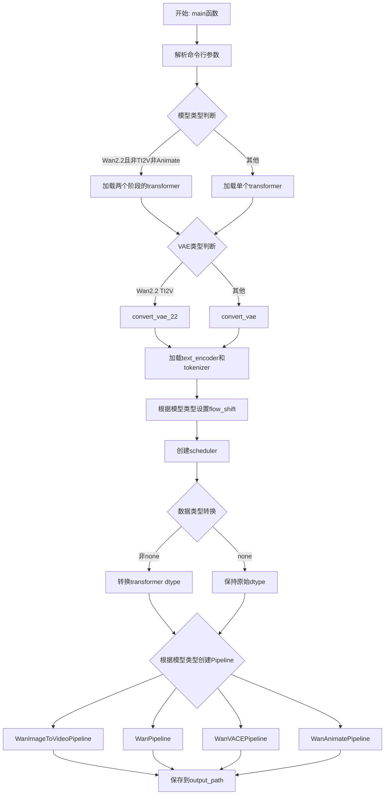
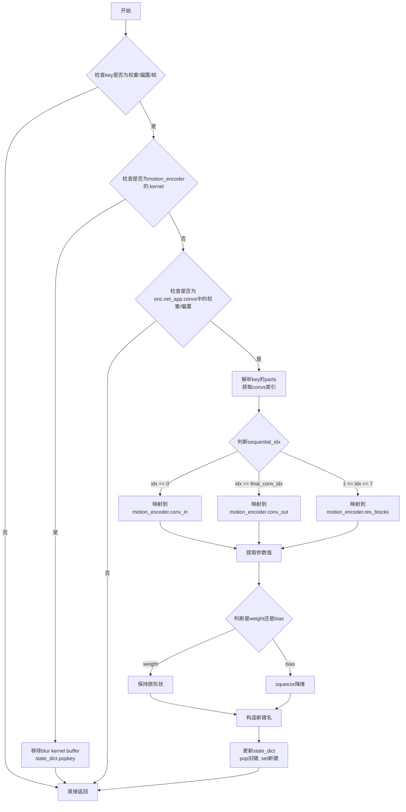
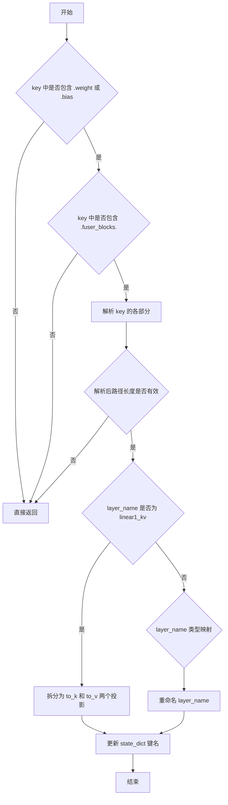
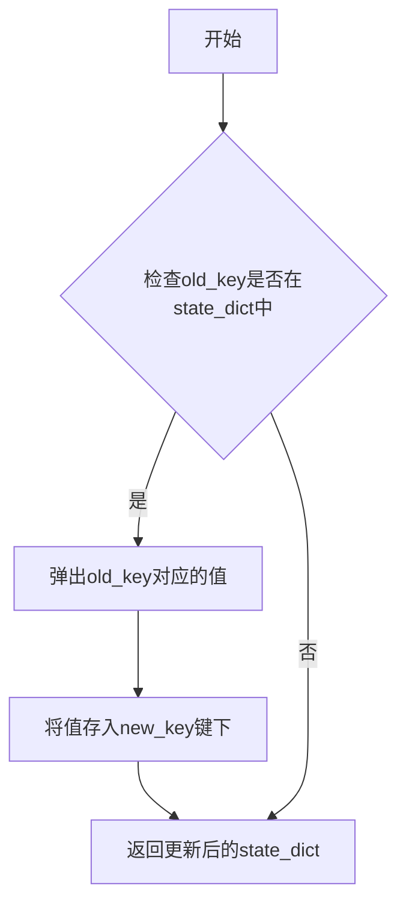
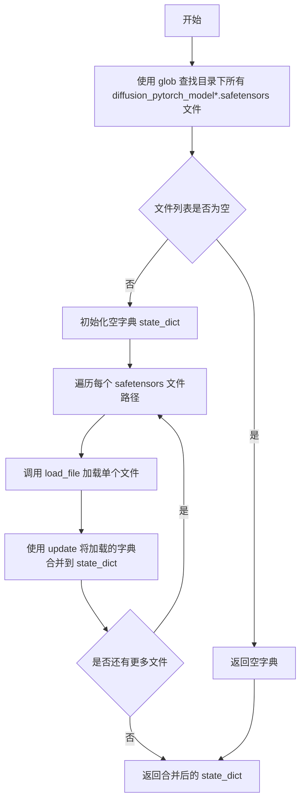
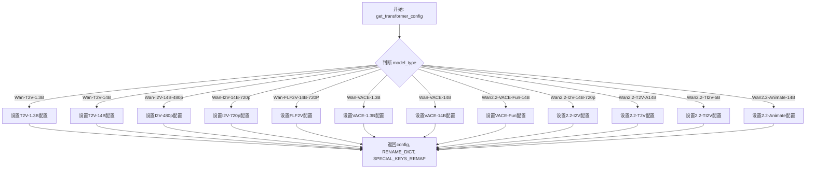
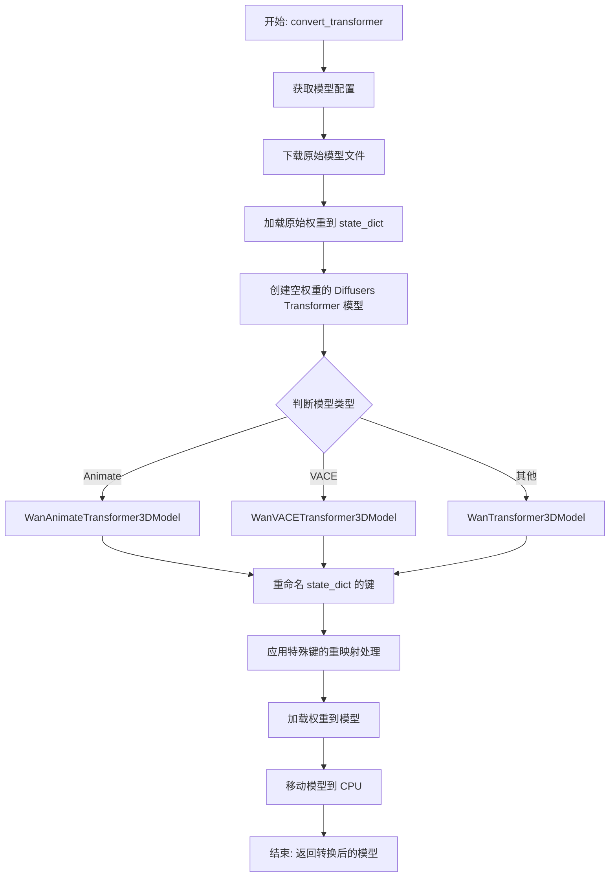
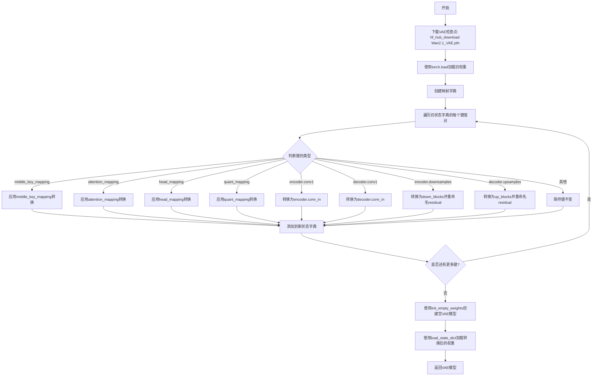
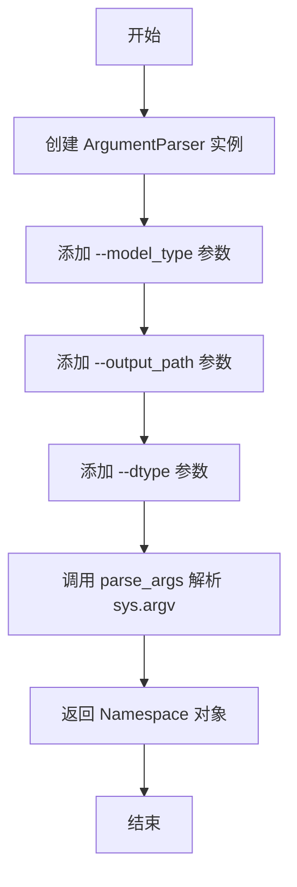

# `diffusers\scripts\convert_wan_to_diffusers.py` 详细设计文档

该代码是一个模型权重转换工具，用于将Wan系列模型（文本到视频、图像到视频、VACE、动画等）的原始检查点权重转换为HuggingFace Diffusers格式，以便在Diffusers库中使用。

## 整体流程



## 类结构

```
无类层次结构（脚本包含多个全局函数和字典）
全局函数:
├── convert_animate_motion_encoder_weights
├── convert_animate_face_adapter_weights
├── update_state_dict_
├── load_sharded_safetensors
├── get_transformer_config
├── convert_transformer
├── convert_vae
├── convert_vae_22
└── get_args
```

## 全局变量及字段


### `TRANSFORMER_KEYS_RENAME_DICT`
    
标准Wan Transformer模型权重键名从原始格式到Diffusers格式的重命名映射字典

类型：`Dict[str, str]`
    


### `VACE_TRANSFORMER_KEYS_RENAME_DICT`
    
Wan VACE Transformer模型权重键名从原始格式到Diffusers格式的重命名映射字典

类型：`Dict[str, str]`
    


### `ANIMATE_TRANSFORMER_KEYS_RENAME_DICT`
    
Wan Animate Transformer模型权重键名从原始格式到Diffusers格式的重命名映射字典

类型：`Dict[str, str]`
    


### `TRANSFORMER_SPECIAL_KEYS_REMAP`
    
标准Transformer模型的特殊键重映射处理函数字典，当前为空字典

类型：`Dict[str, Any]`
    


### `VACE_TRANSFORMER_SPECIAL_KEYS_REMAP`
    
VACE Transformer模型的特殊键重映射处理函数字典，当前为空字典

类型：`Dict[str, Any]`
    


### `ANIMATE_TRANSFORMER_SPECIAL_KEYS_REMAP`
    
Animate Transformer模型的特殊键重映射处理函数字典，包含motion_encoder和face_adapter的转换函数

类型：`Dict[str, Callable]`
    


### `vae22_diffusers_config`
    
Wan2.2 VAE模型的Diffusers配置参数字典，包含模型维度、通道数、缩放因子等配置

类型：`Dict[str, Any]`
    


### `DTYPE_MAPPING`
    
数据类型字符串标识到PyTorch dtype对象的映射字典，用于模型精度转换

类型：`Dict[str, torch.dtype]`
    


    

## 全局函数及方法


### `convert_animate_motion_encoder_weights`

该函数用于将原始 Animate 模型的运动编码器（motion encoder）权重转换为 Diffusers 格式，处理权重键的重命名、重新索引以及移除不必要的 blur kernel buffers。

**参数：**

- `key`：`str`，原始状态字典中的键名
- `state_dict`：`Dict[str, Any]`，PyTorch 模型的状态字典（in-place 修改）
- `final_conv_idx`：`int`，最终卷积层的索引，默认为 8

**返回值：** `None`，该函数直接修改 `state_dict` 字典，无返回值

#### 流程图



#### 带注释源码

```python
def convert_animate_motion_encoder_weights(key: str, state_dict: Dict[str, Any], final_conv_idx: int = 8) -> None:
    """
    Convert all motion encoder weights for Animate model.

    In the original model:
    - All Linear layers in fc use EqualLinear
    - All Conv2d layers in convs use EqualConv2d (except blur_conv which is initialized separately)
    - Blur kernels are stored as buffers in Sequential modules
    - ConvLayer is nn.Sequential with indices: [Blur (optional), EqualConv2d, FusedLeakyReLU (optional)]

    Conversion strategy:
    1. Drop .kernel buffers (blur kernels)
    2. Rename sequential indices to named components (e.g., 0 -> conv2d, 1 -> bias_leaky_relu)
    """
    # Step 1: Skip if not a weight, bias, or kernel
    # 只处理权重、偏置和核，其他键直接跳过
    if ".weight" not in key and ".bias" not in key and ".kernel" not in key:
        return

    # Step 2: Handle Blur kernel buffers from original implementation
    # Diffusers 使用非持久缓冲区构建 blur kernels，需要移除这些键以避免加载错误
    if ".kernel" in key and "motion_encoder" in key:
        # Remove unexpected blur kernel buffers to avoid strict load errors
        state_dict.pop(key, None)
        return

    # Step 3: Rename Sequential indices to named components in ConvLayer and ResBlock
    # 将 nn.Sequential 的数字索引转换为有意义的组件名称
    if ".enc.net_app.convs." in key and (".weight" in key or ".bias" in key):
        parts = key.split(".")

        # Find the sequential index (digit) after convs or after conv1/conv2/skip
        # Examples:
        # - enc.net_app.convs.0.0.weight -> conv_in.weight (initial conv layer weight)
        # - enc.net_app.convs.0.1.bias -> conv_in.act_fn.bias (initial conv layer bias)
        # - enc.net_app.convs.{n:1-7}.conv1.0.weight -> res_blocks.{(n-1):0-6}.conv1.weight
        # - enc.net_app.convs.{n:1-7}.conv1.1.bias -> res_blocks.{(n-1):0-6}.conv1.act_fn.bias
        # - enc.net_app.convs.{n:1-7}.conv2.1.weight -> res_blocks.{(n-1):0-6}.conv2.weight
        # - enc.net_app.convs.{n:1-7}.conv2.2.bias -> res_blocks.{(n-1):0-6}.conv2.act_fn.bias
        # - enc.net_app.convs.{n:1-7}.skip.1.weight -> res_blocks.{(n-1):0-6}.conv_skip.weight
        # - enc.net_app.convs.8 -> conv_out (final conv layer)

        # 查找 "convs" 在键中的位置
        convs_idx = parts.index("convs") if "convs" in parts else -1
        if convs_idx >= 0 and len(parts) - convs_idx >= 2:
            bias = False
            # The nn.Sequential index will always follow convs
            # 获取 Sequential 的索引（数字）
            sequential_idx = int(parts[convs_idx + 1])
            
            # 处理初始卷积层 (index 0)
            if sequential_idx == 0:
                if key.endswith(".weight"):
                    new_key = "motion_encoder.conv_in.weight"
                elif key.endswith(".bias"):
                    new_key = "motion_encoder.conv_in.act_fn.bias"
                    bias = True
            # 处理最终卷积层 (index 8)
            elif sequential_idx == final_conv_idx:
                if key.endswith(".weight"):
                    new_key = "motion_encoder.conv_out.weight"
            else:
                # Intermediate .convs. layers -> .res_blocks.
                # 中间层映射到残差块
                prefix = "motion_encoder.res_blocks."

                # 确定层名称 (conv1, conv2, skip/conv_skip)
                layer_name = parts[convs_idx + 2]
                if layer_name == "skip":
                    layer_name = "conv_skip"

                # 确定参数名称 (weight 或 bias)
                if key.endswith(".weight"):
                    param_name = "weight"
                elif key.endswith(".bias"):
                    param_name = "act_fn.bias"
                    bias = True

                # 构建新键的后缀部分
                suffix_parts = [str(sequential_idx - 1), layer_name, param_name]
                suffix = ".".join(suffix_parts)
                new_key = prefix + suffix

            # 从旧键中提取参数值并插入新键
            param = state_dict.pop(key)
            if bias:
                # bias 需要进行 squeeze 降维处理
                param = param.squeeze()
            state_dict[new_key] = param
            return
        return
    return
```


### `convert_animate_face_adapter_weights`

该函数用于将 Animate 模型中的 Face Adapter 权重从原始格式转换为 Diffusers 格式，主要处理融合的 KV 投影层（将联合的 K 和 V 权重拆分为独立的权重）以及其它层名称的映射。

参数：

- `key`：`str`，原始状态字典中的键名，标识需要转换的权重参数
- `state_dict`：`Dict[str, Any]`，模型权重字典，函数会直接修改此字典中的键名以完成权重转换

返回值：`None`，函数通过修改传入的 `state_dict` 原地完成权重转换，无返回值

#### 流程图



#### 带注释源码

```python
def convert_animate_face_adapter_weights(key: str, state_dict: Dict[str, Any]) -> None:
    """
    Convert face adapter weights for the Animate model.

    The original model uses a fused KV projection but the diffusers models uses separate K and V projections.
    """
    # 过滤：仅处理权重和偏置参数，忽略其他类型的键（如buffers）
    if ".weight" not in key and ".bias" not in key:
        return

    # Face adapter 在新模型中的键前缀
    prefix = "face_adapter."
    
    # 仅处理 fuser_blocks 模块中的权重
    if ".fuser_blocks." in key:
        # 将键按 '.' 分割为列表，便于层级解析
        parts = key.split(".")

        # 查找 fuser_blocks 在路径中的索引位置
        module_list_idx = parts.index("fuser_blocks") if "fuser_blocks" in parts else -1
        
        # 验证路径格式：fuser_blocks 后面必须有 3 个层级（block_idx, layer_name, param_name）
        if module_list_idx >= 0 and (len(parts) - 1) - module_list_idx == 3:
            # 提取各个层级的名称
            block_idx = parts[module_list_idx + 1]       # e.g., "0", "1", ...
            layer_name = parts[module_list_idx + 2]      # e.g., "linear1_kv", "q_norm", ...
            param_name = parts[module_list_idx + 3]     # e.g., "weight", "bias"

            # 处理融合的 KV 投影层：需要拆分为独立的 K 和 V 投影
            if layer_name == "linear1_kv":
                # 定义拆分后的新层级名称
                layer_name_k = "to_k"
                layer_name_v = "to_v"

                # 构建 K 和 V 投影的新键名
                suffix_k = ".".join([block_idx, layer_name_k, param_name])
                suffix_v = ".".join([block_idx, layer_name_v, param_name])
                new_key_k = prefix + suffix_k
                new_key_v = prefix + suffix_v

                # 弹出原始的 KV 融合权重，并按维度 0 拆分为 K 和 V
                kv_proj = state_dict.pop(key)
                k_proj, v_proj = torch.chunk(kv_proj, 2, dim=0)
                
                # 将拆分后的权重存入 state_dict
                state_dict[new_key_k] = k_proj
                state_dict[new_key_v] = v_proj
                return
            
            # 处理其他层：进行名称映射转换
            else:
                # 根据原始层名称映射到新的层名称
                if layer_name == "q_norm":
                    new_layer_name = "norm_q"
                elif layer_name == "k_norm":
                    new_layer_name = "norm_k"
                elif layer_name == "linear1_q":
                    new_layer_name = "to_q"
                elif layer_name == "linear2":
                    new_layer_name = "to_out"

                # 构建新的键名并更新 state_dict
                suffix_parts = [block_idx, new_layer_name, param_name]
                suffix = ".".join(suffix_parts)
                new_key = prefix + suffix
                state_dict[new_key] = state_dict.pop(key)
                return
    
    # 不满足条件的键直接返回，不做处理
    return
```


### `update_state_dict_`

该函数用于在模型状态字典（state_dict）中重命名键，将旧键名对应的值移动到新键名下，实现模型权重的键名映射转换。

参数：

- `state_dict`：`Dict[str, Any]`，需要更新的模型状态字典，包含了模型的权重参数
- `old_key`：`str`，原始的键名，标识需要被重命名的权重参数
- `new_key`：`str`，新的键名，用于替换原始键名

返回值：`dict[str, Any]`，更新后的状态字典，其中旧键已被新键替代

#### 流程图



#### 带注释源码

```python
def update_state_dict_(state_dict: Dict[str, Any], old_key: str, new_key: str) -> dict[str, Any]:
    """
    在模型状态字典中重命名键。
    
    该函数将state_dict中old_key对应的值移动到new_key对应的键下，
    实现了模型权重从原始格式到diffusers格式的键名映射转换。
    
    参数:
        state_dict: 需要更新的模型状态字典
        old_key: 原始的键名
        new_key: 新的键名
    
    返回:
        更新后的状态字典
    """
    # 使用pop方法移除旧键并获取其对应的值，然后将该值赋给新键
    # pop方法会同时删除旧键值对，返回旧键对应的值
    state_dict[new_key] = state_dict.pop(old_key)
```


### `load_sharded_safetensors`

该函数用于从指定目录中加载所有分片的 `safetensors` 格式的模型权重文件，并将它们合并成一个统一的状态字典。

参数：

-  `dir`：`pathlib.Path`，模型目录路径，该目录下包含以 `diffusion_pytorch_model` 为前缀的多个分片 safetensors 文件

返回值：`Dict[str, torch.Tensor]`，合并后的模型状态字典，键为张量名称，值为对应的 PyTorch 张量

#### 流程图



#### 带注释源码

```python
def load_sharded_safetensors(dir: pathlib.Path):
    """
    从指定目录加载所有分片的 safetensors 模型文件。
    
    该函数查找目录下所有匹配 "diffusion_pytorch_model*.safetensors" 模式的文件，
    并将它们合并为一个统一的状态字典。
    
    Args:
        dir: 包含分片模型文件的目录路径
        
    Returns:
        合并后的模型状态字典，键为张量名称，值为 PyTorch 张量
    """
    # 使用 glob 查找目录下所有匹配的 safetensors 文件
    file_paths = list(dir.glob("diffusion_pytorch_model*.safetensors"))
    
    # 初始化空字典用于存储合并后的状态
    state_dict = {}
    
    # 遍历每个分片文件并合并到 state_dict 中
    for path in file_paths:
        # load_file 来自 safetensors.torch，返回字典 {tensor_name: tensor}
        state_dict.update(load_file(path))
    
    # 返回合并后的完整状态字典
    return state_dict
```


### `get_transformer_config`

该函数根据传入的模型类型（model_type）返回对应的transformer配置信息，包括模型ID、diffusers配置参数、以及用于权重重命名和特殊键映射的字典。该函数支持Wan系列的多种模型变体，如T2V（文本到视频）、I2V（图像到视频）、VACE、FLF2V、TI2V和Animate等不同规模和分辨率的模型。

参数：

- `model_type`：`str`，模型类型标识符，用于选择对应的配置。支持的模型类型包括"Wan-T2V-1.3B"、"Wan-T2V-14B"、"Wan-I2V-14B-480p"、"Wan-I2V-14B-720p"、"Wan-FLF2V-14B-720P"、"Wan-VACE-1.3B"、"Wan-VACE-14B"、"Wan2.2-VACE-Fun-14B"、"Wan2.2-I2V-14B-720p"、"Wan2.2-T2V-A14B"、"Wan2.2-TI2V-5B"、"Wan2.2-Animate-14B"等

返回值：`Tuple[Dict[str, Any], ...]`，返回一个三元元组，包含：
- `config`：`Dict[str, Any]`，包含模型ID（model_id）和diffusers配置（diffusers_config）的字典
- `RENAME_DICT`：用于重命名模型权重键的字典
- `SPECIAL_KEYS_REMAP`：用于特殊权重键映射的字典

#### 流程图



#### 带注释源码

```python
def get_transformer_config(model_type: str) -> Tuple[Dict[str, Any], ...]:
    """
    根据模型类型获取对应的transformer配置信息。
    
    Args:
        model_type: str, 模型类型标识符，如"Wan-T2V-1.3B"、"Wan-I2V-14B-720p"等
        
    Returns:
        Tuple[Dict[str, Any], ...]: 包含以下三个元素的元组：
            - config: 包含model_id和diffusers_config的字典
            - RENAME_DICT: 模型权重键重命名映射字典
            - SPECIAL_KEYS_REMAP: 特殊权重键处理函数映射字典
    """
    
    # Wan-T2V-1.3B 模型配置
    if model_type == "Wan-T2V-1.3B":
        config = {
            "model_id": "StevenZhang/Wan2.1-T2V-1.3B-Diff",
            "diffusers_config": {
                "added_kv_proj_dim": None,
                "attention_head_dim": 128,
                "cross_attn_norm": True,
                "eps": 1e-06,
                "ffn_dim": 8960,
                "freq_dim": 256,
                "in_channels": 16,
                "num_attention_heads": 12,
                "num_layers": 30,
                "out_channels": 16,
                "patch_size": [1, 2, 2],
                "qk_norm": "rms_norm_across_heads",
                "text_dim": 4096,
            },
        }
        # 使用标准transformer的权重重命名和特殊键映射字典
        RENAME_DICT = TRANSFORMER_KEYS_RENAME_DICT
        SPECIAL_KEYS_REMAP = TRANSFORMER_SPECIAL_KEYS_REMAP
        
    # Wan-T2V-14B 模型配置
    elif model_type == "Wan-T2V-14B":
        config = {
            "model_id": "StevenZhang/Wan2.1-T2V-14B-Diff",
            "diffusers_config": {
                "added_kv_proj_dim": None,
                "attention_head_dim": 128,
                "cross_attn_norm": True,
                "eps": 1e-06,
                "ffn_dim": 13824,
                "freq_dim": 256,
                "in_channels": 16,
                "num_attention_heads": 40,
                "num_layers": 40,
                "out_channels": 16,
                "patch_size": [1, 2, 2],
                "qk_norm": "rms_norm_across_heads",
                "text_dim": 4096,
            },
        }
        RENAME_DICT = TRANSFORMER_KEYS_RENAME_DICT
        SPECIAL_KEYS_REMAP = TRANSFORMER_SPECIAL_KEYS_REMAP
        
    # Wan-I2V-14B-480p 模型配置
    elif model_type == "Wan-I2V-14B-480p":
        config = {
            "model_id": "StevenZhang/Wan2.1-I2V-14B-480P-Diff",
            "diffusers_config": {
                "image_dim": 1280,
                "added_kv_proj_dim": 5120,
                "attention_head_dim": 128,
                "cross_attn_norm": True,
                "eps": 1e-06,
                "ffn_dim": 13824,
                "freq_dim": 256,
                "in_channels": 36,  # I2V模型输入通道数更多
                "num_attention_heads": 40,
                "num_layers": 40,
                "out_channels": 16,
                "patch_size": [1, 2, 2],
                "qk_norm": "rms_norm_across_heads",
                "text_dim": 4096,
            },
        }
        RENAME_DICT = TRANSFORMER_KEYS_RENAME_DICT
        SPECIAL_KEYS_REMAP = TRANSFORMER_SPECIAL_KEYS_REMAP
        
    # ... 其他模型类型的配置（类似结构，省略部分）
    
    # Wan2.2-Animate-14B 模型配置（动画生成模型）
    elif model_type == "Wan2.2-Animate-14B":
        config = {
            "model_id": "Wan-AI/Wan2.2-Animate-14B",
            "diffusers_config": {
                "image_dim": 1280,
                "added_kv_proj_dim": 5120,
                "attention_head_dim": 128,
                "cross_attn_norm": True,
                "eps": 1e-06,
                "ffn_dim": 13824,
                "freq_dim": 256,
                "in_channels": 36,
                "num_attention_heads": 40,
                "num_layers": 40,
                "out_channels": 16,
                "patch_size": (1, 2, 2),
                "qk_norm": "rms_norm_across_heads",
                "text_dim": 4096,
                "rope_max_seq_len": 1024,
                "pos_embed_seq_len": None,
                # Wan Animate特有配置
                "motion_encoder_size": 512,
                "motion_style_dim": 512,
                "motion_dim": 20,
                "motion_encoder_dim": 512,
                "face_encoder_hidden_dim": 1024,
                "face_encoder_num_heads": 4,
                "inject_face_latents_blocks": 5,
            },
        }
        # 使用Animate专用的权重重命名和特殊键映射
        RENAME_DICT = ANIMATE_TRANSFORMER_KEYS_RENAME_DICT
        SPECIAL_KEYS_REMAP = ANIMATE_TRANSFORMER_SPECIAL_KEYS_REMAP
        
    return config, RENAME_DICT, SPECIAL_KEYS_REMAP
```


### `convert_transformer`

此函数是 Wan 模型转换流程的核心，负责将原始的 Wan Transformer 检查点（Checkpoints）转换为 Diffusers 库支持的格式。它处理模型权重的下载、键的重命名、特殊组件（如 Animate 模型的 Motion Encoder）的转换，并最终返回一个可用的 Diffusers Transformer 模型实例。

参数：

-  `model_type`：`str`，指定要转换的模型类型（如 "Wan-T2V-1.3B", "Wan-I2V-14B-480p", "Wan-VACE-14B" 等）。不同的模型类型对应不同的配置和权重转换逻辑。
-  `stage`：`str` (可选)，指定模型的具体阶段。对于某些双阶段模型（如 Wan2.2 T2V），可能需要分别转换 "high_noise_model" 和 "low_noise_model"。

返回值：`transformers.modeling_utils.PreTrainedModel`，返回转换后的 Diffusers Transformer 模型对象（`WanTransformer3DModel` 或其子类）。

#### 流程图



#### 带注释源码

```python
def convert_transformer(model_type: str, stage: str = None):
    # 1. 获取模型配置、重命名字典和特殊键重映射函数
    # get_transformer_config 根据 model_type 返回对应的配置、键重命名映射和特殊处理函数
    config, RENAME_DICT, SPECIAL_KEYS_REMAP = get_transformer_config(model_type)

    # 2. 提取 Diffusers 所需的模型配置和原始模型 ID
    diffusers_config = config["diffusers_config"]
    model_id = config["model_id"]
    
    # 3. 从 Hugging Face Hub 下载原始模型文件到本地缓存
    model_dir = pathlib.Path(snapshot_download(model_id, repo_type="model"))

    # 4. 如果指定了 stage (如 high_noise_model, low_noise_model)，则拼接路径
    if stage is not None:
        model_dir = model_dir / stage

    # 5. 加载分片的 safetensors 文件，合并为一个完整的 state_dict
    original_state_dict = load_sharded_safetensors(model_dir)

    # 6. 使用 init_empty_weights 上下文管理器创建一个只有结构没有权重的模型
    # 这样可以避免在大规模模型加载时直接分配 GPU 内存
    with init_empty_weights():
        # 根据模型类型选择具体的 Transformer 类
        if "Animate" in model_type:
            transformer = WanAnimateTransformer3DModel.from_config(diffusers_config)
        elif "VACE" in model_type:
            transformer = WanVACETransformer3DModel.from_config(diffusers_config)
        else:
            transformer = WanTransformer3DModel.from_config(diffusers_config)

    # 7. 遍历原始 state_dict，根据 RENAME_DICT 进行键的重命名
    # 这主要是为了适配 Diffusers 模型的内部命名规范
    for key in list(original_state_dict.keys()):
        new_key = key[:] # 复制原始键
        # 依次替换所有需要重命名的键片段
        for replace_key, rename_key in RENAME_DICT.items():
            new_key = new_key.replace(replace_key, rename_key)
        # 更新 state_dict 中的键
        update_state_dict_(original_state_dict, key, new_key)

    # 8. 应用特殊键的重映射处理函数
    # 针对特定的组件（如 motion_encoder, face_adapter）进行复杂的权重转换
    for key in list(original_state_dict.keys()):
        for special_key, handler_fn_inplace in SPECIAL_KEYS_REMAP.items():
            if special_key not in key:
                continue
            # 调用特定的转换函数（如 convert_animate_motion_encoder_weights）
            handler_fn_inplace(key, original_state_dict)

    # 9. 将处理好的权重加载到模型中
    # strict=True 确保所有键都必须匹配，assign=True 确保参数被正确分配到模型层
    transformer.load_state_dict(original_state_dict, strict=True, assign=True)

    # 10. 将模型移动到 CPU，确保所有张量都被实例化（Materialize）
    # 这对于检查权重是否正确转换很重要
    transformer = transformer.to("cpu")

    return transformer
```


### `convert_vae`

该函数用于将原始Wan模型的VAE权重转换为Diffusers格式的VAE模型。它从HuggingFace Hub下载预训练的VAE检查点，使用多个映射字典对权重键进行重命名，以适配Diffusers库中的模型结构，最后将转换后的权重加载到新创建的`AutoencoderKLWan`模型中。

参数：
- 无

返回值：`AutoencoderKLWan`，转换后的Diffusers VAE模型实例

#### 流程图



#### 带注释源码

```python
def convert_vae():
    """
    将原始Wan模型的VAE权重转换为Diffusers格式的AutoencoderKLWan模型。
    该函数处理权重键的重命名，以适配Diffusers库中的模型结构。
    """
    # 从HuggingFace Hub下载Wan2.1 VAE检查点文件
    vae_ckpt_path = hf_hub_download("Wan-AI/Wan2.1-T2V-14B", "Wan2.1_VAE.pth")
    
    # 使用torch.load加载旧格式的权重字典 (weights_only=True限制只加载权重)
    old_state_dict = torch.load(vae_ckpt_path, weights_only=True)
    
    # 初始化新状态字典，用于存放转换后的权重
    new_state_dict = {}

    # 创建中间块的键映射 (encoder/decoder middle block)
    # 原始模型使用residual.0.gamma等命名，转换后的Diffusers模型使用resnets.X.norm1.gamma
    middle_key_mapping = {
        # Encoder middle block
        "encoder.middle.0.residual.0.gamma": "encoder.mid_block.resnets.0.norm1.gamma",
        "encoder.middle.0.residual.2.bias": "encoder.mid_block.resnets.0.conv1.bias",
        "encoder.middle.0.residual.2.weight": "encoder.mid_block.resnets.0.conv1.weight",
        "encoder.middle.0.residual.3.gamma": "encoder.mid_block.resnets.0.norm2.gamma",
        "encoder.middle.0.residual.6.bias": "encoder.mid_block.resnets.0.conv2.bias",
        "encoder.middle.0.residual.6.weight": "encoder.mid_block.resnets.0.conv2.weight",
        "encoder.middle.2.residual.0.gamma": "encoder.mid_block.resnets.1.norm1.gamma",
        "encoder.middle.2.residual.2.bias": "encoder.mid_block.resnets.1.conv1.bias",
        "encoder.middle.2.residual.2.weight": "encoder.mid_block.resnets.1.conv1.weight",
        "encoder.middle.2.residual.3.gamma": "encoder.mid_block.resnets.1.norm2.gamma",
        "encoder.middle.2.residual.6.bias": "encoder.mid_block.resnets.1.conv2.bias",
        "encoder.middle.2.residual.6.weight": "encoder.mid_block.resnets.1.conv2.weight",
        # Decoder middle block
        "decoder.middle.0.residual.0.gamma": "decoder.mid_block.resnets.0.norm1.gamma",
        "decoder.middle.0.residual.2.bias": "decoder.mid_block.resnets.0.conv1.bias",
        "decoder.middle.0.residual.2.weight": "decoder.mid_block.resnets.0.conv1.weight",
        "decoder.middle.0.residual.3.gamma": "decoder.mid_block.resnets.0.norm2.gamma",
        "decoder.middle.0.residual.6.bias": "decoder.mid_block.resnets.0.conv2.bias",
        "decoder.middle.0.residual.6.weight": "decoder.mid_block.resnets.0.conv2.weight",
        "decoder.middle.2.residual.0.gamma": "decoder.mid_block.resnets.1.norm1.gamma",
        "decoder.middle.2.residual.2.bias": "decoder.mid_block.resnets.1.conv1.bias",
        "decoder.middle.2.residual.2.weight": "decoder.mid_block.resnets.1.conv1.weight",
        "decoder.middle.2.residual.3.gamma": "decoder.mid_block.resnets.1.norm2.gamma",
        "decoder.middle.2.residual.6.bias": "decoder.mid_block.resnets.1.conv2.bias",
        "decoder.middle.2.residual.6.weight": "decoder.mid_block.resnets.1.conv2.weight",
    }

    # 创建注意力块的键映射 (middle attention blocks)
    # 原始模型使用to_qkv.weight等融合的QKV投影，转换后使用分离的attention层
    attention_mapping = {
        # Encoder middle attention
        "encoder.middle.1.norm.gamma": "encoder.mid_block.attentions.0.norm.gamma",
        "encoder.middle.1.to_qkv.weight": "encoder.mid_block.attentions.0.to_qkv.weight",
        "encoder.middle.1.to_qkv.bias": "encoder.mid_block.attentions.0.to_qkv.bias",
        "encoder.middle.1.proj.weight": "encoder.mid_block.attentions.0.proj.weight",
        "encoder.middle.1.proj.bias": "encoder.mid_block.attentions.0.proj.bias",
        # Decoder middle attention
        "decoder.middle.1.norm.gamma": "decoder.mid_block.attentions.0.norm.gamma",
        "decoder.middle.1.to_qkv.weight": "decoder.mid_block.attentions.0.to_qkv.weight",
        "decoder.middle.1.to_qkv.bias": "decoder.mid_block.attentions.0.to_qkv.bias",
        "decoder.middle.1.proj.weight": "decoder.mid_block.attentions.0.proj.weight",
        "decoder.middle.1.proj.bias": "decoder.mid_block.attentions.0.proj.bias",
    }

    # 创建头部组件的键映射 (encoder/decoder head)
    head_mapping = {
        # Encoder head
        "encoder.head.0.gamma": "encoder.norm_out.gamma",
        "encoder.head.2.bias": "encoder.conv_out.bias",
        "encoder.head.2.weight": "encoder.conv_out.weight",
        # Decoder head
        "decoder.head.0.gamma": "decoder.norm_out.gamma",
        "decoder.head.2.bias": "decoder.conv_out.bias",
        "decoder.head.2.weight": "decoder.conv_out.weight",
    }

    # 创建量化组件的键映射 (quantization conv layers)
    quant_mapping = {
        "conv1.weight": "quant_conv.weight",
        "conv1.bias": "quant_conv.bias",
        "conv2.weight": "post_quant_conv.weight",
        "conv2.bias": "post_quant_conv.bias",
    }

    # 遍历旧状态字典中的每个键值对，根据类型进行相应的转换
    for key, value in old_state_dict.items():
        # 处理中间块键
        if key in middle_key_mapping:
            new_key = middle_key_mapping[key]
            new_state_dict[new_key] = value
        # 处理注意力块键
        elif key in attention_mapping:
            new_key = attention_mapping[key]
            new_state_dict[new_key] = value
        # 处理头部键
        elif key in head_mapping:
            new_key = head_mapping[key]
            new_state_dict[new_key] = value
        # 处理量化键
        elif key in quant_mapping:
            new_key = quant_mapping[key]
            new_state_dict[new_key] = value
        # 处理encoder的初始卷积层 (conv1 -> conv_in)
        elif key == "encoder.conv1.weight":
            new_state_dict["encoder.conv_in.weight"] = value
        elif key == "encoder.conv1.bias":
            new_state_dict["encoder.conv_in.bias"] = value
        # 处理decoder的初始卷积层 (conv1 -> conv_in)
        elif key == "decoder.conv1.weight":
            new_state_dict["decoder.conv_in.weight"] = value
        elif key == "decoder.conv1.bias":
            new_state_dict["decoder.conv_in.bias"] = value
        # 处理encoder下采样层 (downsamples -> down_blocks, residual -> resnets)
        elif key.startswith("encoder.downsamples."):
            # 将encoder.downsamples替换为encoder.down_blocks
            new_key = key.replace("encoder.downsamples.", "encoder.down_blocks.")
            # 转换residual块命名: residual.0.gamma -> norm1.gamma, residual.2.weight -> conv1.weight等
            if ".residual.0.gamma" in new_key:
                new_key = new_key.replace(".residual.0.gamma", ".norm1.gamma")
            elif ".residual.2.bias" in new_key:
                new_key = new_key.replace(".residual.2.bias", ".conv1.bias")
            elif ".residual.2.weight" in new_key:
                new_key = new_key.replace(".residual.2.weight", ".conv1.weight")
            elif ".residual.3.gamma" in new_key:
                new_key = new_key.replace(".residual.3.gamma", ".norm2.gamma")
            elif ".residual.6.bias" in new_key:
                new_key = new_key.replace(".residual.6.bias", ".conv2.bias")
            elif ".residual.6.weight" in new_key:
                new_key = new_key.replace(".residual.6.weight", ".conv2.weight")
            elif ".shortcut.bias" in new_key:
                new_key = new_key.replace(".shortcut.bias", ".conv_shortcut.bias")
            elif ".shortcut.weight" in new_key:
                new_key = new_key.replace(".shortcut.weight", ".conv_shortcut.weight")
            new_state_dict[new_key] = value
        # 处理decoder上采样层 (upsamples -> up_blocks)
        elif key.startswith("decoder.upsamples."):
            # 解析键的组成部分
            parts = key.split(".")
            block_idx = int(parts[2])
            # 处理残差块，根据原始block_idx映射到新的block_idx和resnet_idx
            if "residual" in key:
                if block_idx in [0, 1, 2]:
                    new_block_idx = 0
                    resnet_idx = block_idx
                elif block_idx in [4, 5, 6]:
                    new_block_idx = 1
                    resnet_idx = block_idx - 4
                elif block_idx in [8, 9, 10]:
                    new_block_idx = 2
                    resnet_idx = block_idx - 8
                elif block_idx in [12, 13, 14]:
                    new_block_idx = 3
                    resnet_idx = block_idx - 12
                else:
                    # 保持其他块不变
                    new_state_dict[key] = value
                    continue
                # 转换残差块组件命名
                if ".residual.0.gamma" in key:
                    new_key = f"decoder.up_blocks.{new_block_idx}.resnets.{resnet_idx}.norm1.gamma"
                elif ".residual.2.bias" in key:
                    new_key = f"decoder.up_blocks.{new_block_idx}.resnets.{resnet_idx}.conv1.bias"
                elif ".residual.2.weight" in key:
                    new_key = f"decoder.up_blocks.{new_block_idx}.resnets.{resnet_idx}.conv1.weight"
                elif ".residual.3.gamma" in key:
                    new_key = f"decoder.up_blocks.{new_block_idx}.resnets.{resnet_idx}.norm2.gamma"
                elif ".residual.6.bias" in key:
                    new_key = f"decoder.up_blocks.{new_block_idx}.resnets.{resnet_idx}.conv2.bias"
                elif ".residual.6.weight" in key:
                    new_key = f"decoder.up_blocks.{new_block_idx}.resnets.{resnet_idx}.conv2.weight"
                else:
                    new_key = key
                new_state_dict[new_key] = value
            # 处理shortcut连接
            elif ".shortcut." in key:
                if block_idx == 4:
                    new_key = key.replace(".shortcut.", ".resnets.0.conv_shortcut.")
                    new_key = new_key.replace("decoder.upsamples.4", "decoder.up_blocks.1")
                else:
                    new_key = key.replace("decoder.upsamples.", "decoder.up_blocks.")
                    new_key = new_key.replace(".shortcut.", ".conv_shortcut.")
                new_state_dict[new_key] = value
            # 处理上采样器 (resample/time_conv -> upsamplers)
            elif ".resample." in key or ".time_conv." in key:
                if block_idx == 3:
                    new_key = key.replace(f"decoder.upsamples.{block_idx}", "decoder.up_blocks.0.upsamplers.0")
                elif block_idx == 7:
                    new_key = key.replace(f"decoder.upsamples.{block_idx}", "decoder.up_blocks.1.upsamplers.0")
                elif block_idx == 11:
                    new_key = key.replace(f"decoder.upsamples.{block_idx}", "decoder.up_blocks.2.upsamplers.0")
                else:
                    new_key = key.replace("decoder.upsamples.", "decoder.up_blocks.")
                new_state_dict[new_key] = value
            else:
                new_key = key.replace("decoder.upsamples.", "decoder.up_blocks.")
                new_state_dict[new_key] = value
        else:
            # 其他未匹配的键保持不变
            new_state_dict[key] = value

    # 使用init_empty_weights创建空模型 (不分配实际内存)
    with init_empty_weights():
        vae = AutoencoderKLWan()
    
    # 加载转换后的状态字典到VAE模型 (strict=True确保所有键都匹配, assign=True分配权重)
    vae.load_state_dict(new_state_dict, strict=True, assign=True)
    
    # 返回转换后的VAE模型
    return vae
```


### `convert_vae_22`

该函数用于将 Wan2.2 模型的 VAE（变分自编码器）从原始检查点格式转换为 Diffusers 格式。它从 HuggingFace 下载预训练的 VAE 权重，通过多个映射字典将旧的状态字典键名转换为新的 Diffusers 兼容键名，然后将转换后的权重加载到 `AutoencoderKLWan` 模型中并返回。

参数：无

返回值：`AutoencoderKLWan`，转换后的 VAE 模型对象

#### 流程图

```mermaid
flowchart TD
    A[Start: convert_vae_22] --> B[Download VAE checkpoint from Wan-AI/Wan2.2-TI2V-5B]
    B --> C[torch.load checkpoint into old_state_dict]
    C --> D[Initialize new_state_dict = {}]
    D --> E[Define key mappings: middle_key_mapping, attention_mapping, head_mapping, quant_mapping]
    E --> F{For each key, value in old_state_dict}
    
    F --> G{key in middle_key_mapping?}
    G -->|Yes| H[new_key = middle_key_mapping[key]]
    H --> I[new_state_dict[new_key] = value]
    
    G -->|No| J{key in attention_mapping?}
    J -->|Yes| K[new_key = attention_mapping[key]]
    K --> I
    
    J -->|No| L{key in head_mapping?}
    L -->|Yes| M[new_key = head_mapping[key]]
    M --> I
    
    L -->|No| N{key in quant_mapping?}
    N -->|Yes| O[new_key = quant_mapping[key]]
    O --> I
    
    N -->|No| P{key == encoder.conv1.weight?}
    P -->|Yes| Q[new_key = encoder.conv_in.weight]
    Q --> I
    
    P -->|No| R{key == decoder.conv1.weight?}
    R -->|Yes| S[new_key = decoder.conv_in.weight]
    S --> I
    
    R -->|No| T{key.startswith encoder.downsamples?}
    T -->|Yes| U[Replace downsamples → down_blocks, resnets, rename residual/shortcut]
    U --> V[new_state_dict[new_key] = value]
    
    T -->|No| W{key.startswith decoder.upsamples?}
    W -->|Yes| X[Replace upsamples → up_blocks, resnets, rename residual/shortcut]
    X --> V
    
    W -->|No| Y[new_key = key (unchanged)]
    Y --> V
    
    I --> Z{More keys?}
    Z -->|Yes| F
    Z -->|No| AA[Create empty AutoencoderKLWan with vae22_diffusers_config]
    AA --> AB[vae.load_state_dict with new_state_dict]
    AB --> AC[Return vae]
```

#### 带注释源码

```python
def convert_vae_22():
    """
    将 Wan2.2 TI2V 模型的 VAE 从原始检查点格式转换为 Diffusers 格式。
    
    转换过程：
    1. 从 HuggingFace 下载 Wan2.2_VAE.pth 权重文件
    2. 定义多个键名映射字典，用于将旧键名转换为新键名
    3. 遍历旧状态字典，根据映射规则转换键名
    4. 创建空的 AutoencoderKLWan 模型并加载转换后的权重
    """
    # 从 HuggingFace Hub 下载 Wan2.2 模型的 VAE 检查点
    vae_ckpt_path = hf_hub_download("Wan-AI/Wan2.2-TI2V-5B", "Wan2.2_VAE.pth")
    
    # 使用 torch.load 加载原始检查点（仅权重）
    old_state_dict = torch.load(vae_ckpt_path, weights_only=True)
    
    # 初始化新的状态字典，用于存储转换后的键值对
    new_state_dict = {}

    # ============ 创建键名映射字典 ============
    
    # 中间块键名映射：处理 encoder 和 decoder 的 middle block
    middle_key_mapping = {
        # Encoder middle block 映射
        "encoder.middle.0.residual.0.gamma": "encoder.mid_block.resnets.0.norm1.gamma",
        "encoder.middle.0.residual.2.bias": "encoder.mid_block.resnets.0.conv1.bias",
        "encoder.middle.0.residual.2.weight": "encoder.mid_block.resnets.0.conv1.weight",
        "encoder.middle.0.residual.3.gamma": "encoder.mid_block.resnets.0.norm2.gamma",
        "encoder.middle.0.residual.6.bias": "encoder.mid_block.resnets.0.conv2.bias",
        "encoder.middle.0.residual.6.weight": "encoder.mid_block.resnets.0.conv2.weight",
        "encoder.middle.2.residual.0.gamma": "encoder.mid_block.resnets.1.norm1.gamma",
        "encoder.middle.2.residual.2.bias": "encoder.mid_block.resnets.1.conv1.bias",
        "encoder.middle.2.residual.2.weight": "encoder.mid_block.resnets.1.conv1.weight",
        "encoder.middle.2.residual.3.gamma": "encoder.mid_block.resnets.1.norm2.gamma",
        "encoder.middle.2.residual.6.bias": "encoder.mid_block.resnets.1.conv2.bias",
        "encoder.middle.2.residual.6.weight": "encoder.mid_block.resnets.1.conv2.weight",
        # Decoder middle block 映射
        "decoder.middle.0.residual.0.gamma": "decoder.mid_block.resnets.0.norm1.gamma",
        "decoder.middle.0.residual.2.bias": "decoder.mid_block.resnets.0.conv1.bias",
        "decoder.middle.0.residual.2.weight": "decoder.mid_block.resnets.0.conv1.weight",
        "decoder.middle.0.residual.3.gamma": "decoder.mid_block.resnets.0.norm2.gamma",
        "decoder.middle.0.residual.6.bias": "decoder.mid_block.resnets.0.conv2.bias",
        "decoder.middle.0.residual.6.weight": "decoder.mid_block.resnets.0.conv2.weight",
        "decoder.middle.2.residual.0.gamma": "decoder.mid_block.resnets.1.norm1.gamma",
        "decoder.middle.2.residual.2.bias": "decoder.mid_block.resnets.1.conv1.bias",
        "decoder.middle.2.residual.2.weight": "decoder.mid_block.resnets.1.conv1.weight",
        "decoder.middle.2.residual.3.gamma": "decoder.mid_block.resnets.1.norm2.gamma",
        "decoder.middle.2.residual.6.bias": "decoder.mid_block.resnets.1.conv2.bias",
        "decoder.middle.2.residual.6.weight": "decoder.mid_block.resnets.1.conv2.weight",
    }

    # 注意力块键名映射：处理 middle block 中的自注意力层
    attention_mapping = {
        # Encoder middle attention
        "encoder.middle.1.norm.gamma": "encoder.mid_block.attentions.0.norm.gamma",
        "encoder.middle.1.to_qkv.weight": "encoder.mid_block.attentions.0.to_qkv.weight",
        "encoder.middle.1.to_qkv.bias": "encoder.mid_block.attentions.0.to_qkv.bias",
        "encoder.middle.1.proj.weight": "encoder.mid_block.attentions.0.proj.weight",
        "encoder.middle.1.proj.bias": "encoder.mid_block.attentions.0.proj.bias",
        # Decoder middle attention
        "decoder.middle.1.norm.gamma": "decoder.mid_block.attentions.0.norm.gamma",
        "decoder.middle.1.to_qkv.weight": "decoder.mid_block.attentions.0.to_qkv.weight",
        "decoder.middle.1.to_qkv.bias": "decoder.mid_block.attentions.0.to_qkv.bias",
        "decoder.middle.1.proj.weight": "decoder.mid_block.attentions.0.proj.weight",
        "decoder.middle.1.proj.bias": "decoder.mid_block.attentions.0.proj.bias",
    }

    # 头部块键名映射：处理 encoder 和 decoder 的输出层
    head_mapping = {
        # Encoder head
        "encoder.head.0.gamma": "encoder.norm_out.gamma",
        "encoder.head.2.bias": "encoder.conv_out.bias",
        "encoder.head.2.weight": "encoder.conv_out.weight",
        # Decoder head
        "decoder.head.0.gamma": "decoder.norm_out.gamma",
        "decoder.head.2.bias": "decoder.conv_out.bias",
        "decoder.head.2.weight": "decoder.conv_out.weight",
    }

    # 量化块键名映射：处理 quant_conv 和 post_quant_conv
    quant_mapping = {
        "conv1.weight": "quant_conv.weight",
        "conv1.bias": "quant_conv.bias",
        "conv2.weight": "post_quant_conv.weight",
        "conv2.bias": "post_quant_conv.bias",
    }

    # ============ 遍历并转换状态字典 ============
    for key, value in old_state_dict.items():
        # 处理中间块键名
        if key in middle_key_mapping:
            new_key = middle_key_mapping[key]
            new_state_dict[new_key] = value
        # 处理注意力块键名
        elif key in attention_mapping:
            new_key = attention_mapping[key]
            new_state_dict[new_key] = value
        # 处理头部块键名
        elif key in head_mapping:
            new_key = head_mapping[key]
            new_state_dict[new_key] = value
        # 处理量化块键名
        elif key in quant_mapping:
            new_key = quant_mapping[key]
            new_state_dict[new_key] = value
        # 处理 encoder 初始卷积层
        elif key == "encoder.conv1.weight":
            new_state_dict["encoder.conv_in.weight"] = value
        elif key == "encoder.conv1.bias":
            new_state_dict["encoder.conv_in.bias"] = value
        # 处理 decoder 初始卷积层
        elif key == "decoder.conv1.weight":
            new_state_dict["decoder.conv_in.weight"] = value
        elif key == "decoder.conv1.bias":
            new_state_dict["decoder.conv_in.bias"] = value
        # 处理 encoder 下采样块
        elif key.startswith("encoder.downsamples."):
            # 将 downsamples 替换为 down_blocks
            new_key = key.replace("encoder.downsamples.", "encoder.down_blocks.")

            # 处理残差块和快捷连接
            if "residual" in new_key or "shortcut" in new_key:
                new_key = new_key.replace(".downsamples.", ".resnets.")

                # 重命名残差组件
                if ".residual.0.gamma" in new_key:
                    new_key = new_key.replace(".residual.0.gamma", ".norm1.gamma")
                elif ".residual.2.weight" in new_key:
                    new_key = new_key.replace(".residual.2.weight", ".conv1.weight")
                elif ".residual.2.bias" in new_key:
                    new_key = new_key.replace(".residual.2.bias", ".conv1.bias")
                elif ".residual.3.gamma" in new_key:
                    new_key = new_key.replace(".residual.3.gamma", ".norm2.gamma")
                elif ".residual.6.weight" in new_key:
                    new_key = new_key.replace(".residual.6.weight", ".conv2.weight")
                elif ".residual.6.bias" in new_key:
                    new_key = new_key.replace(".residual.6.bias", ".conv2.bias")
                elif ".shortcut.weight" in new_key:
                    new_key = new_key.replace(".shortcut.weight", ".conv_shortcut.weight")
                elif ".shortcut.bias" in new_key:
                    new_key = new_key.replace(".shortcut.bias", ".conv_shortcut.bias")

            # 处理重采样块
            elif "resample" in new_key or "time_conv" in new_key:
                parts = new_key.split(".")
                if len(parts) >= 4 and parts[3] == "downsamples":
                    # 移除索引并将 downsamples 改为 downsampler
                    new_parts = parts[:3] + ["downsampler"] + parts[5:]
                    new_key = ".".join(new_parts)

            new_state_dict[new_key] = value

        # 处理 decoder 上采样块
        elif key.startswith("decoder.upsamples."):
            new_key = key.replace("decoder.upsamples.", "decoder.up_blocks.")

            # 处理残差块和快捷连接
            if "residual" in new_key or "shortcut" in new_key:
                new_key = new_key.replace(".upsamples.", ".resnets.")

                # 重命名残差组件
                if ".residual.0.gamma" in new_key:
                    new_key = new_key.replace(".residual.0.gamma", ".norm1.gamma")
                elif ".residual.2.weight" in new_key:
                    new_key = new_key.replace(".residual.2.weight", ".conv1.weight")
                elif ".residual.2.bias" in new_key:
                    new_key = new_key.replace(".residual.2.bias", ".conv1.bias")
                elif ".residual.3.gamma" in new_key:
                    new_key = new_key.replace(".residual.3.gamma", ".norm2.gamma")
                elif ".residual.6.weight" in new_key:
                    new_key = new_key.replace(".residual.6.weight", ".conv2.weight")
                elif ".residual.6.bias" in new_key:
                    new_key = new_key.replace(".residual.6.bias", ".conv2.bias")
                elif ".shortcut.weight" in new_key:
                    new_key = new_key.replace(".shortcut.weight", ".conv_shortcut.weight")
                elif ".shortcut.bias" in new_key:
                    new_key = new_key.replace(".shortcut.bias", ".conv_shortcut.bias")

            # 处理重采样块
            elif "resample" in new_key or "time_conv" in new_key:
                parts = new_key.split(".")
                if len(parts) >= 4 and parts[3] == "upsamples":
                    # 移除索引并将 upsamples 改为 upsampler
                    new_parts = parts[:3] + ["upsampler"] + parts[5:]
                    new_key = ".".join(new_parts)

            new_state_dict[new_key] = value
        else:
            # 其他键保持不变
            new_state_dict[key] = value

    # ============ 创建并加载模型 ============
    # 使用 init_empty_weights 创建空模型框架，避免内存消耗
    with init_empty_weights():
        # 使用 Wan2.2 特定配置创建 AutoencoderKLWan 模型
        vae = AutoencoderKLWan(**vae22_diffusers_config)
    
    # 加载转换后的状态字典，strict=True 确保所有键都匹配
    vae.load_state_dict(new_state_dict, strict=True, assign=True)
    
    return vae
```


### `get_args`

定义并解析命令行参数，用于获取模型转换任务所需的模型类型、输出路径及数据类型配置。

参数：

-  `model_type`：`str`，指定要转换的Wan模型类型（如 "Wan-T2V-1.3B", "Wan-I2V-14B-720p" 等），默认为 `None`。
-  `output_path`：`str`，指定转换后模型保存的目录路径，**必填项**。
-  `dtype`：`str`，指定模型权重的精度类型，可选值为 `fp32`（默认）、`fp16`、`bf16` 或 `none`。

返回值：`argparse.Namespace`，返回一个包含 `model_type`、`output_path` 和 `dtype` 属性的命名空间对象，供后续脚本使用。

#### 流程图



#### 带注释源码

```python
def get_args():
    # 创建命令行参数解析器实例
    parser = argparse.ArgumentParser()
    
    # 添加模型类型参数（可选，默认None）
    # 用于指定要转换的Wan模型子类型，如 Wan-T2V-1.3B
    parser.add_argument("--model_type", type=str, default=None)
    
    # 添加输出路径参数（必需）
    # 指定转换后的Diffusers模型保存路径
    parser.add_argument("--output_path", type=str, required=True)
    
    # 添加数据类型参数（可选，默认fp32）
    # 控制转换后模型的权重精度，可选 fp32, fp16, bf16, none
    parser.add_argument("--dtype", default="fp32", choices=["fp32", "fp16", "bf16", "none"])
    
    # 解析从命令行传入的参数（默认为 sys.argv）
    return parser.parse_args()
```


## 关键组件


### 张量键名重命名映射

负责将原始Wan模型的权重键名转换为Diffusers格式，包含多种模型变体（T2V、I2V、VACE、Animate）的特定映射规则。

### 运动编码器权重转换

将Animate模型的运动编码器（motion_encoder）权重从原始格式转换为Diffusers格式，处理卷积层和残差块的命名转换。

### 人脸适配器权重转换

将Animate模型的人脸适配器（face_adapter）权重从融合的KV投影转换为分离的K和V投影。

### 转换器配置获取

根据模型类型返回对应的HuggingFace模型ID、Diffusers配置以及键名重命名映射。

### 转换器模型转换主流程

负责加载原始模型权重、执行键名重命名、应用特殊转换逻辑、创建空模型并加载权重的完整流程。

### VAE模型转换

将Wan 2.1 VAE模型的权重从原始格式转换为Diffusers格式，处理编码器和解码器的各层组件映射。

### VAE 2.2模型转换

将Wan 2.2 VAE模型权重转换为Diffusers格式，包含特定的配置参数和不同的层级映射规则。

### 状态字典键更新工具

辅助函数，用于在状态字典中更新键名，从旧键名迁移到新键名。

### 分片SafeTensors加载

从目录中加载所有分片的SafeTensors文件并合并为单个状态字典。

### 命令行参数解析

定义并解析命令行参数，包括模型类型、输出路径和数据类型选择。


## 问题及建议


### 已知问题

-   **字符串硬编码与脆弱的模型类型判断**：代码中大量使用 `"Wan2.2" in args.model_type and "TI2V" not in args.model_type and "Animate" not in args.model_type` 等字符串包含判断来区分模型类型，这种方式极易因输入字符串的微小变化（如大小写、空格）导致逻辑错误，缺乏健壮的类型验证机制。
-   **代码重复 (DRY 原则违反)**：`convert_vae()` 和 `convert_vae_22()` 函数中存在大量重复的键映射逻辑（`middle_key_mapping`, `attention_mapping`, `head_mapping`, `quant_mapping`）以及遍历处理逻辑，两者代码行数极高且维护成本高，任何对 VAE 结构的修改都需要在两处同步更新。
-   **状态字典的直接 in-place 修改**：`convert_animate_motion_encoder_weights` 和 `convert_animate_face_adapter_weights` 函数直接修改传入的 `state_dict`，且部分逻辑依赖副作用（如 `state_dict.pop`），这使得函数行为难以追踪和调试，增加了并发调用或重试时的风险。
-   **全局配置字典过于庞大且未封装**：`TRANSFORMER_KEYS_RENAME_DICT`, `VACE_TRANSFORMER_KEYS_RENAME_DICT` 等全局字典包含大量硬编码的键值对，不仅难以维护，而且将数据与逻辑混在一起。配置应该从代码中分离出来。
-   **缺乏错误处理与边界检查**：模型下载（`snapshot_download`, `hf_hub_download`）、文件加载（`load_file`, `torch.load`）均未包含在 try-except 块中，网络中断或文件损坏会导致脚本直接崩溃且无明确错误信息。
-   **未使用的函数参数**：`convert_animate_motion_encoder_weights(key, state_dict, final_conv_idx=8)` 中的 `final_conv_idx` 参数在函数体内未被实际使用，可能是遗留代码或设计疏忽。
-   **类型注解不完整**：部分函数如 `convert_vae()` 和 `convert_vae_22()` 缺少返回类型注解，且使用了旧式的 `dict[str, Any]` 语法（虽然可用但不够规范），降低了代码的可读性和类型安全。

### 优化建议

-   **重构模型类型逻辑**：引入枚举类（Enum）或配置驱动的方式定义支持的模型类型及其转换规则，消除字符串硬编码和脆弱的包含判断。
-   **抽象 VAE 转换逻辑**：将 `convert_vae()` 和 `convert_vae_22()` 合并为一个函数，通过传入配置参数（如 `vae22_diffusers_config`）或动态生成的映射表来区分差异，避免代码重复。
-   **避免 in-place 修改**：重写状态字典处理函数，采用纯函数式编程范式，每次处理返回新的字典或使用不可变数据结构，以提高函数的可测试性和线程安全性。
-   **配置外置**：将巨大的键映射字典迁移至 YAML 或 JSON 配置文件，通过统一的配置加载器读取，代码仅负责解析和应用映射。
-   **增强错误处理**：在所有 I/O 操作（网络请求、文件读写）周围添加异常捕获，提供重试机制和友好的错误提示。
-   **完善类型注解**：为所有函数添加完整的类型注解（包括参数和返回值），并使用 IDE 或 mypy 进行静态类型检查。
-   **内存优化**：对于超大模型的分片加载，考虑流式处理或生成器模式，而非一次性将所有分片加载至内存。

## 其它


### 设计目标与约束

本代码的设计目标是将Wan AI的各种视频生成模型（文本到视频T2V、图像到视频I2V、视频编辑VACE、文本指导图像到视频TI2V、Animate动画等）从原始检查点格式转换为Hugging Face Diffusers格式，以便在Diffusers框架中使用。主要约束包括：1）仅支持PyTorch框架；2）依赖Hugging Face生态（transformers、diffusers、huggingface_hub）；3）模型转换需要足够的内存（使用init_empty_weights()优化）；4）仅支持特定的模型架构版本。

### 错误处理与异常设计

代码中的错误处理主要体现在：1）使用`strict=True, assign=True`进行状态字典加载，确保键名完全匹配；2）对于不存在的键使用`pop(key, None)`避免KeyError；3）Hugging Face Hub下载失败会抛出异常被上层捕获；4）命令行参数使用argparse进行校验，model_type无默认值需显式指定。主要异常类型包括：网络连接异常（下载模型失败）、磁盘空间不足、模型配置不匹配导致的键转换错误。

### 数据流与状态机

数据流主要分为三个阶段：第一阶段是模型识别与配置获取，通过`get_transformer_config()`根据model_type返回对应的模型ID、diffusers配置和键名重命名映射；第二阶段是权重转换，包括加载原始分片safetensors文件、应用RENAME_DICT进行键名替换、应用SPECIAL_KEYS_REMAP处理特殊模块（motion_encoder、face_adapter）；第三阶段是管道组装，根据模型类型选择对应的Pipeline类（ WanPipeline、 WanImageToVideoPipeline、 WanVACEPipeline、 WanAnimatePipeline）并保存。对于Wan2.2的某些模型（如T2V、I2V），还需要处理双阶段转换（high_noise_model和low_noise_model）。

### 外部依赖与接口契约

核心外部依赖包括：1）torch - 张量操作；2）transformers - 预训练模型加载（UMT5EncoderModel、CLIPVisionModel等）；3）diffusers - Diffusers Pipeline和调度器；4）huggingface_hub - 模型下载；5）safetensors - 安全张量文件加载；6）accelerate - 内存优化（init_empty_weights）。命令行接口契约：--model_type指定模型类型（如"Wan-T2V-1.3B"），--output_path指定输出目录，--dtype指定精度（fp32/fp16/bf16/none）。输出为保存到指定路径的Diffusers格式模型。

### 配置管理

代码采用硬编码配置方式，所有模型配置嵌入在`get_transformer_config()`函数中。这种方式适合单一脚本工具，但缺乏灵活性。配置内容包括：1）Hugging Face Hub模型ID；2）Diffusers模型配置字典（层数、注意力头维度、FFN维度等）；3）键名重命名映射字典；4）特殊模块处理函数。配置变更需要修改源代码，不支持运行时外部配置注入。

### 内存优化策略

使用`accelerate.init_empty_weights()`上下文管理器创建元设备模型，避免在加载原始权重前分配完整内存。在状态字典键名转换过程中，通过`pop()`和`update()`操作就地修改字典。转换完成后使用`.to("cpu")`确保所有张量具体化到CPU内存。对于大模型（如14B参数模型），这种按需分配策略至关重要。

### 版本兼容性与扩展性

代码支持多个模型系列的转换，通过RENAME_DICT和SPECIAL_KEYS_REMAP机制实现差异化处理。扩展新模型需要：1）在`get_transformer_config()`添加新的model_type分支；2）定义对应的键名重命名映射；3）如需特殊处理则在SPECIAL_KEYS_REMAP中添加处理函数。当前设计通过字典驱动的方式实现了较好的扩展性，新增模型类型无需修改核心转换逻辑。

### 安全性考虑

代码安全性体现在：1）使用`weights_only=True`加载PyTorch检查点，防止恶意 pickle 对象；2）使用 safetensors 格式避免不安全的反序列化；3）通过命令行参数控制模型类型，避免注入攻击。潜在风险：1）从Hugging Face Hub下载模型需验证来源可靠性；2）本地保存的转换模型应设置适当的文件权限。

### 测试与验证需求

当前代码缺少显式的测试验证机制。建议添加：1）转换后的模型结构与Diffusers官方配置一致性校验；2）键名完全匹配验证（strict=True会触发部分检查）；3）输出张量数值范围合理性检查；4）不同dtype转换后的精度损失评估；5）端到端的推理测试（生成样本帧验证模型功能完整性）。

### 性能特征

主要性能瓶颈：1）Hugging Face Hub模型下载（网络IO）；2）大模型状态字典键名遍历替换（O(n*m)复杂度）；3）张量从GPU到CPU的迁移（对于14B模型可能耗时较长）。优化建议：1）对于批量转换场景，可缓存已下载的模型；2）键名替换可优化为预编译正则表达式；3）考虑使用torch.inference_mode()替代to("cpu")。

### 部署与运维

该代码作为独立转换工具使用，不建议作为长期运行的在线服务。部署形态：1）本地CLI工具；2）CI/CD流水线中的模型预处理步骤；3）Jupyter Notebook中的交互式使用。运维关注点：1）Hugging Face Hub模型ID变更监控；2）Diffusers版本兼容性；3）转换失败时的日志记录与重试机制。


    