# `diffusers\scripts\convert_wuerstchen.py` 详细设计文档

该脚本用于加载Wuerstchen模型的官方预训练权重并进行格式转换，最终导出为HuggingFace Diffusers格式的Pipeline，包含VQ编码器、文本编码器、Prior模型和Decoder模型

## 整体流程

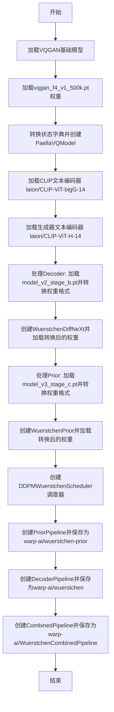

## 类结构

```
全局变量
├── model_path (模型路径)
└── device (设备类型)
外部依赖模块
├── transformers
│   ├── AutoTokenizer
│   └── CLIPTextModel
├── vqgan (本地模块)
│   └── VQModel
└── diffusers
    ├── DDPMWuerstchenScheduler
    ├── WuerstchenCombinedPipeline
    ├── WuerstchenDecoderPipeline
    ├── WuerstchenPriorPipeline
    ├── PaellaVQModel
    ├── WuerstchenDiffNeXt
    └── WuerstchenPrior
```

## 全局变量及字段


### `model_path`
    
模型文件目录路径

类型：`str`
    


### `device`
    
计算设备类型，设置为cpu

类型：`str`
    


### `paella_vqmodel`
    
Paella VQGAN模型实例，用于加载原始VQ模型权重

类型：`VQModel`
    


### `state_dict`
    
模型权重状态字典，用于存储和转换模型参数

类型：`Dict[str, torch.Tensor]`
    


### `vqmodel`
    
转换后的PaellaVQModel模型，用于diffusers管道的VQ量化

类型：`PaellaVQModel`
    


### `text_encoder`
    
CLIP文本编码器（ViT-bigG），用于编码文本提示

类型：`CLIPTextModel`
    


### `tokenizer`
    
CLIP分词器（ViT-bigG），用于对文本进行分词

类型：`AutoTokenizer`
    


### `gen_text_encoder`
    
生成器使用的CLIP文本编码器（ViT-H-14）

类型：`CLIPTextModel`
    


### `gen_tokenizer`
    
生成器使用的CLIP分词器（ViT-H-14）

类型：`AutoTokenizer`
    


### `orig_state_dict`
    
原始模型状态字典，用于加载权重文件

类型：`Dict[str, torch.Tensor]`
    


### `decoder`
    
Wuerstchen解码器模型，用于将潜在表示解码为图像

类型：`WuerstchenDiffNeXt`
    


### `prior_model`
    
Wuerstchen先验模型，用于从文本生成图像潜在表示

类型：`WuerstchenPrior`
    


### `scheduler`
    
DDPM调度器，用于控制去噪扩散过程

类型：`DDPMWuerstchenScheduler`
    


### `prior_pipeline`
    
先验管道，用于从文本生成图像潜在向量

类型：`WuerstchenPriorPipeline`
    


### `decoder_pipeline`
    
解码器管道，用于将潜在表示解码为最终图像

类型：`WuerstchenDecoderPipeline`
    


### `wuerstchen_pipeline`
    
完整的Wuerstchen管线，结合了先验和解码器

类型：`WuerstchenCombinedPipeline`
    


### `VQModel.codebook_size`
    
码本中嵌入向量的数量

类型：`int`
    


### `VQModel.c_latent`
    
潜在空间的通道数

类型：`int`
    


### `PaellaVQModel.num_vq_embeddings`
    
VQ嵌入的数量，决定码本大小

类型：`int`
    


### `PaellaVQModel.latent_channels`
    
潜在表示的通道维度

类型：`int`
    


### `WuerstchenPrior.c_in`
    
输入通道数

类型：`int`
    


### `WuerstchenPrior.c`
    
主干网络的隐藏通道数

类型：`int`
    


### `WuerstchenPrior.c_cond`
    
条件嵌入的通道数

类型：`int`
    


### `WuerstchenPrior.c_r`
    
残差连接的通道数

类型：`int`
    


### `WuerstchenPrior.depth`
    
Transformer块的层数

类型：`int`
    


### `WuerstchenPrior.nhead`
    
多头注意力机制的头数

类型：`int`
    


### `WuerstchenPriorPipeline.prior`
    
先验模型实例

类型：`WuerstchenPrior`
    


### `WuerstchenPriorPipeline.text_encoder`
    
文本编码器模型

类型：`CLIPTextModel`
    


### `WuerstchenPriorPipeline.tokenizer`
    
文本分词器

类型：`AutoTokenizer`
    


### `WuerstchenPriorPipeline.scheduler`
    
扩散调度器

类型：`DDPMWuerstchenScheduler`
    


### `WuerstchenDecoderPipeline.text_encoder`
    
解码器使用的文本编码器

类型：`CLIPTextModel`
    


### `WuerstchenDecoderPipeline.tokenizer`
    
解码器使用的分词器

类型：`AutoTokenizer`
    


### `WuerstchenDecoderPipeline.vqgan`
    
VQGAN量化模型

类型：`PaellaVQModel`
    


### `WuerstchenDecoderPipeline.decoder`
    
解码器网络

类型：`WuerstchenDiffNeXt`
    


### `WuerstchenDecoderPipeline.scheduler`
    
解码器调度器

类型：`DDPMWuerstchenScheduler`
    


### `WuerstchenCombinedPipeline.text_encoder`
    
主文本编码器

类型：`CLIPTextModel`
    


### `WuerstchenCombinedPipeline.tokenizer`
    
主分词器

类型：`AutoTokenizer`
    


### `WuerstchenCombinedPipeline.decoder`
    
解码器模型

类型：`WuerstchenDiffNeXt`
    


### `WuerstchenCombinedPipeline.scheduler`
    
主调度器

类型：`DDPMWuerstchenScheduler`
    


### `WuerstchenCombinedPipeline.vqgan`
    
VQGAN模型

类型：`PaellaVQModel`
    


### `WuerstchenCombinedPipeline.prior_tokenizer`
    
先验管道使用的分词器

类型：`AutoTokenizer`
    


### `WuerstchenCombinedPipeline.prior_text_encoder`
    
先验管道使用的文本编码器

类型：`CLIPTextModel`
    


### `WuerstchenCombinedPipeline.prior`
    
先验模型

类型：`WuerstchenPrior`
    


### `WuerstchenCombinedPipeline.prior_scheduler`
    
先验管道调度器

类型：`DDPMWuerstchenScheduler`
    
    

## 全局函数及方法


### `os.path.join()`

该函数是 Python 标准库 `os.path` 模块中的路径拼接函数，用于将多个路径组件智能地拼接成一个完整的文件系统路径，自动处理不同操作系统下的路径分隔符差异。

参数：

- `path`：`str`，第一个路径组件，通常是目录路径
- `*paths`：`str`，可变数量的后续路径组件，可以是目录名或文件名

返回值：`str`，拼接后的完整文件系统路径

#### 流程图

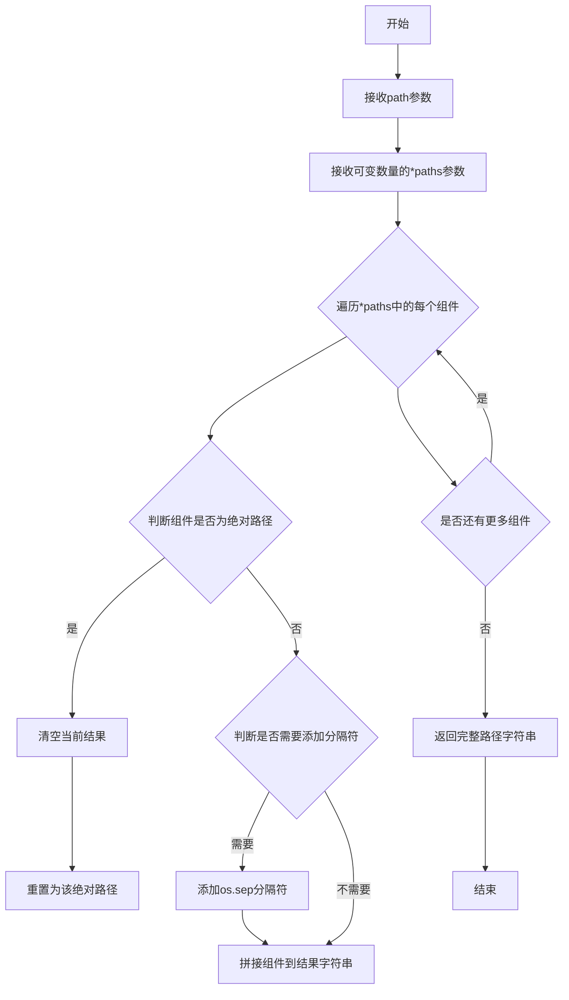

#### 带注释源码

```python
# os.path.join() 函数使用示例

# 定义模型路径目录
model_path = "models/"

# 第一次使用：加载 VQGAN 模型
# 将 model_path 和文件名 "vqgan_f4_v1_500k.pt" 拼接成完整路径
# 例如：models/vqgan_f4_v1_500k.pt (在 Unix 系统上)
vqgan_path = os.path.join(model_path, "vqgan_f4_v1_500k.pt")
state_dict = torch.load(vqgan_path, map_location=device)["state_dict"]

# 第二次使用：加载 Wuerstchen DiffNeXt 解码器模型
# 将 model_path 和文件名 "model_v2_stage_b.pt" 拼接成完整路径
stage_b_path = os.path.join(model_path, "model_v2_stage_b.pt")
orig_state_dict = torch.load(stage_b_path, map_location=device)["state_dict"]

# 第三次使用：加载 Wuerstchen Prior 模型
# 将 model_path 和文件名 "model_v3_stage_c.pt" 拼接成完整路径
stage_c_path = os.path.join(model_path, "model_v3_stage_c.pt")
orig_state_dict = torch.load(stage_c_path, map_location=device)["ema_state_dict"]

# os.path.join() 函数特点：
# 1. 如果任何一个组件是绝对路径，则之前的组件会被丢弃
# 2. 会在最后添加路径分隔符（除了最后一部分）
# 3. 自动处理不同操作系统的路径分隔符（Windows 用 \，Unix 用 /）
```


### `torch.load`

加载保存在磁盘上的PyTorch模型权重文件，并将对象反序列化到CPU设备上。

参数：

- `f`：`str`（或任何类似路径的对象），要加载的文件路径，这里通过`os.path.join(model_path, "xxx.pt")`生成
- `map_location`：`str`或`torch.device`，指定如何将张量映射到目标设备，这里固定为`"cpu"`
- `weights_only`：`bool`（隐含参数，未显式指定），控制是否只加载张量而不加载可执行对象，默认为`False`

返回值：`dict`（字典类型），包含模型权重、Optimizer状态等序列化数据的字典对象。在本代码中通过`["state_dict"]`或`["ema_state_dict"]`键提取具体的模型状态字典。

#### 流程图

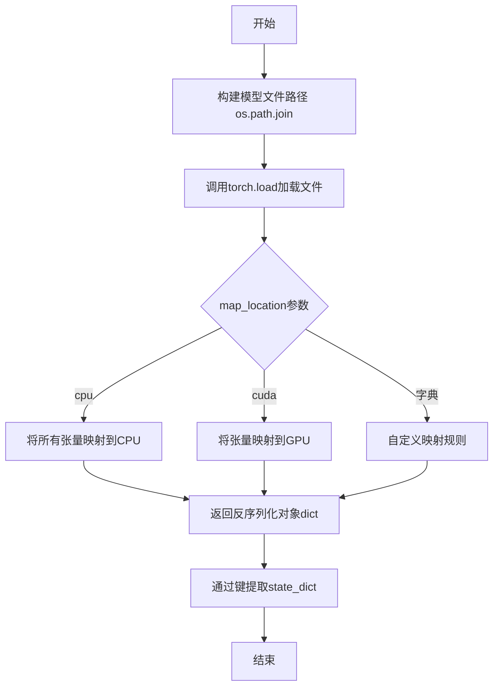

#### 带注释源码

```python
# ============================================================
# torch.load() 调用示例 1: 加载 VQGAN 模型权重
# ============================================================

# 构建模型文件路径: "models/vqgan_f4_v1_500k.pt"
model_file = os.path.join(model_path, "vqgan_f4_v1_500k.pt")

# 加载模型文件并将所有张量映射到CPU设备
# 参数说明:
#   - f: 文件路径 (str)
#   - map_location: 设备映射, 将模型权重加载到 CPU
raw_state = torch.load(
    f=model_file,              # 要加载的模型文件路径
    map_location=device        # device = "cpu", 将张量映射到CPU
)

# 从返回的字典中提取 "state_dict" 键对应的模型权重
state_dict = raw_state["state_dict"]


# ============================================================
# torch.load() 调用示例 2: 加载 DiffNeXt 解码器权重
# ============================================================

# 构建模型文件路径: "models/model_v2_stage_b.pt"
model_file = os.path.join(model_path, "model_v2_stage_b.pt")

# 加载模型文件并将所有张量映射到CPU设备
raw_state = torch.load(
    f=model_file,              # 要加载的模型文件路径 (str)
    map_location=device        # 设备映射参数 (str), 值为 "cpu"
)

# 提取 "state_dict" 键对应的模型权重
orig_state_dict = raw_state["state_dict"]


# ============================================================
# torch.load() 调用示例 3: 加载 Prior 模型权重
# ============================================================

# 构建模型文件路径: "models/model_v3_stage_c.pt"
model_file = os.path.join(model_path, "model_v3_stage_c.pt")

# 加载模型文件并将所有张量映射到CPU设备
raw_state = torch.load(
    f=model_file,              # 要加载的模型文件路径 (str)
    map_location=device        # 设备映射参数 (str), 值为 "cpu"
)

# 从返回的字典中提取 "ema_state_dict" 键对应的模型权重
# EMA (Exponential Moving Average) 权重通常用于推理
orig_state_dict = raw_state["ema_state_dict"]
```


# 设计文档提取

### torch.Tensor.chunk()

`torch.Tensor.chunk()` 是 PyTorch 张量的核心方法之一，用于将张量沿着指定维度分割成多个子张量（chunks）。在代码中，此方法用于将预训练模型中合并的注意力投影权重（in_proj_weight 和 in_proj_bias）拆分为查询（query）、键（key）和值（value）三个独立的权重矩阵，以适配新的模型架构。

#### 参数

- **`chunks`**: `int`，要分割的块数量。代码中传入 `3`，表示将权重分割成 3 个部分（Q、K、V）
- **`dim`**: `int`，要分割的维度。代码中传入 `0`，表示沿着第一个维度（通常为输出通道维度）进行分割

#### 返回值

`List[Tensor]`，返回包含分割后张量的列表，列表长度为 `chunks` 参数指定的数量。每个子张量沿着分割维度的尺寸为原尺寸除以 `chunks`（向上取整）。

#### 流程图

```mermaid
flowchart TD
    A[原始权重张量<br/>shape: (3*n, m)] --> B[调用 chunk 方法]
    B --> C{chunk(3, 0)}
    C --> D[沿维度0分割为3份]
    D --> E[to_q.weight: 权重[0]]
    D --> F[to_k.weight: 权重[1]]
    D --> G[to_v.weight: 权重[2]]
    E --> H[存入新的 state_dict]
    F --> H
    G --> H
```

#### 带注释源码

```python
# 代码中 chunk 方法的实际使用示例
# 用于将合并的注意力投影权重拆分为 Q、K、V 三个独立权重

# 1. 加载原始 state_dict
orig_state_dict = torch.load(os.path.join(model_path, "model_v2_stage_b.pt"), map_location=device)["state_dict"]
state_dict = {}

# 2. 遍历所有键值对
for key in orig_state_dict.keys():
    # 处理 in_proj_weight（输入投影权重）
    # 原始格式: (3 * hidden_size, hidden_size) - 包含 Q、K、V 的权重
    if key.endswith("in_proj_weight"):
        # chunk(3, 0) 表示沿第0维分割成3块
        # 结果: [query_weights, key_weights, value_weights]
        weights = orig_state_dict[key].chunk(3, 0)
        
        # 将分割后的权重重新命名并存储
        state_dict[key.replace("attn.in_proj_weight", "to_q.weight")] = weights[0]  # Query 权重
        state_dict[key.replace("attn.in_proj_weight", "to_k.weight")] = weights[1]  # Key 权重
        state_dict[key.replace("attn.in_proj_weight", "to_v.weight")] = weights[2]  # Value 权重
    
    # 处理 in_proj_bias（输入投影偏置）
    # 原始格式: (3 * hidden_size,) - 包含 Q、K、V 的偏置
    elif key.endswith("in_proj_bias"):
        weights = orig_state_dict[key].chunk(3, 0)
        state_dict[key.replace("attn.in_proj_bias", "to_q.bias")] = weights[0]
        state_dict[key.replace("attn.in_proj_bias", "to_k.bias")] = weights[1]
        state_dict[key.replace("attn.in_proj_bias", "to_v.bias")] = weights[2]
    
    # 处理 out_proj_weight（输出投影权重）
    elif key.endswith("out_proj.weight"):
        weights = orig_state_dict[key]
        state_dict[key.replace("attn.out_proj.weight", "to_out.0.weight")] = weights
    
    # 处理 out_proj_bias（输出投影偏置）
    elif key.endswith("out_proj.bias"):
        weights = orig_state_dict[key]
        state_dict[key.replace("attn.out_proj.bias", "to_out.0.bias")] = weights
    
    # 其他权重直接复制
    else:
        state_dict[key] = orig_state_dict[key]

# chunk 方法的内部实现逻辑（简化版）
# def chunk(tensor, chunks, dim=0):
#     """
#     将 tensor 沿 dim 维度分割成 chunks 个子张量
#     """
#     dim_size = tensor.size(dim)
#     chunk_size = (dim_size + chunks - 1) // chunks  # 向上取整
#     result = []
#     for i in range(chunks):
#         start = i * chunk_size
#         end = min((i + 1) * chunk_size, dim_size)
#         result.append(torch.narrow(tensor, dim, start, end - start))
#     return result
```

---

### 关键组件信息

| 组件名称 | 一句话描述 |
|---------|-----------|
| `orig_state_dict` | 存储从预训练模型文件中加载的原始模型权重 |
| `state_dict` | 存储转换后的模型权重，用于适配新架构 |
| `VQModel` | VQGAN 的向量量化模型，用于图像编码 |
| `PaellaVQModel` | 适配 diffusers 库的量化模型封装 |
| `CLIPTextModel` | CLIP 文本编码器，用于文本到特征表示 |
| `WuerstchenDiffNeXt` | Wuerstchen 模型的解码器（DiffNeXt 架构） |
| `WuerstchenPrior` | Wuerstchen 模型的先验网络 |
| `DDPMWuerstchenScheduler` | 扩散模型调度器 |

---

### 潜在的技术债务或优化空间

1. **硬编码路径和参数**：模型路径 `"models/"`、设备 `"cpu"` 以及各种超参数（如 `num_vq_embeddings`、`c=1536` 等）都是硬编码的，缺乏配置管理机制。

2. **重复代码**：处理 `decoder` 和 `prior` 权重转换的代码高度重复（几乎是复制粘贴），可以提取为通用函数。

3. **错误处理不足**：
   - `torch.load` 缺少 `weights_only` 参数的安全考虑
   - 没有检查加载的文件是否存在
   - 缺少对 `chunk` 操作后张量形状的验证

4. **设备管理不一致**：部分模型加载时未指定 `device` 参数（如 `text_encoder`），可能使用默认 CPU 设备。

5. **内存占用**：一次性加载多个大型模型到内存，可能导致内存不足问题，应考虑按需加载或使用 `device_map` 进行模型并行。

---

### 其它项目

#### 设计目标与约束

- **目标**：将原始 Wuerstchen 预训练模型权重转换为适配 `diffusers` 库格式的模型
- **核心约束**：必须保持权重数值的精确性，确保转换后的模型能够产生与原始模型一致的输出

#### 错误处理与异常设计

- 缺少文件存在性检查
- 缺少模型权重形状验证
- 缺少 `torch.load` 的异常捕获（如文件损坏、格式错误等）

#### 数据流与状态机

```
原始模型文件 (.pt)
    ↓
加载 state_dict
    ↓
权重键名转换 + 拆分 (chunk)
    ↓
新架构的 state_dict
    ↓
加载到新模型架构
    ↓
保存为 diffusers 格式
```

#### 外部依赖与接口契约

- **PyTorch**: 张量操作和模型加载
- **transformers**: CLIP 文本编码器和分词器
- **diffusers**: Wuerstchen Pipeline 实现
- **vqgan**: 原始 VQGAN 模型实现（项目本地模块）

#### 扩展性建议

1. 将权重转换逻辑封装为独立的函数或类
2. 添加配置文件支持（如 YAML 或 JSON）
3. 实现增量转换，支持断点续传
4. 添加日志记录和进度显示


### `torch.nn.Module.to`

将模型参数和缓冲区移动到指定的设备（CPU/GPU）或转换为指定的数据类型。

参数：

- `device`：`torch.device` 或 `str`，表示目标设备（如 "cpu", "cuda", "cuda:0"）
- `dtype`：`torch.dtype`，表示目标数据类型（如 torch.float32）
- `non_blocking`：`bool`，如果为 True 且在 CPU 上，则异步传输（在 GPU 可用时）

返回值：`torch.nn.Module`，返回自身（self），以便支持链式调用。

#### 流程图

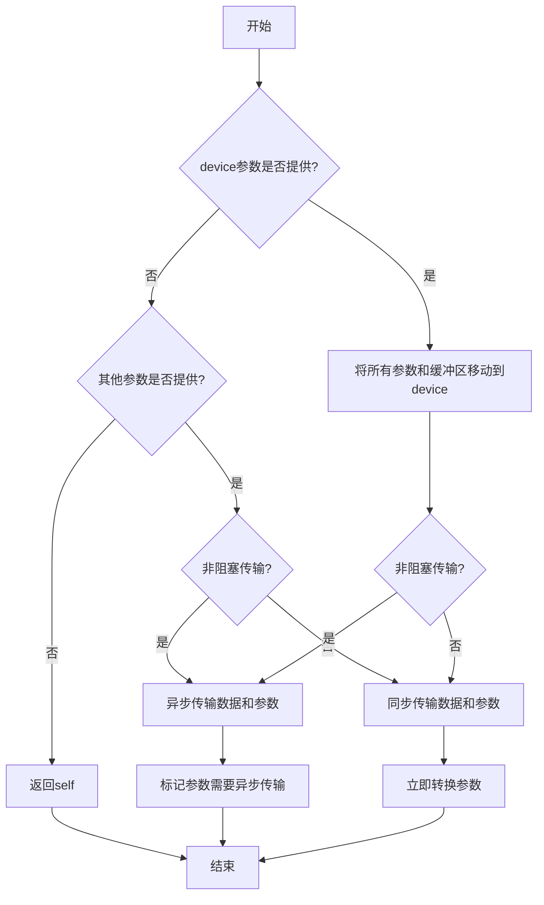

#### 带注释源码

```python
# 在代码中的实际使用示例：

# 示例1：将文本编码器移动到CPU设备
gen_text_encoder = CLIPTextModel.from_pretrained("laion/CLIP-ViT-H-14-laion2B-s32B-b79K").to("cpu")

# 示例2：将先验模型移动到指定设备（CPU或GPU）
prior_model = WuerstchenPrior(
    c_in=16, 
    c=1536, 
    c_cond=1280, 
    c_r=64, 
    depth=32, 
    nhead=24
).to(device)  # device = "cpu"
```

#### 详细说明

`torch.nn.Module.to()` 是 PyTorch 中 `nn.Module` 类的核心方法，用于：

1. **设备迁移**：将模型的所有参数（parameters）和缓冲区（buffers）从当前设备移动到目标设备（如 CPU → GPU）
2. **类型转换**：将参数和缓冲区转换为指定的数据类型（如 float32 → float16）
3. **就地修改**：返回修改后的自身（self），支持链式调用
4. **非阻塞传输**：支持异步传输，提高效率（特别是在 CPU-GPU 数据传输时）

此方法在深度学习模型部署中至关重要，用于：
- 将训练好的模型部署到推理设备
- 在不同设备间迁移模型
- 进行模型量化或类型转换


### `save_pretrained()`

描述：Hugging Face Diffusers 库中 Pipeline 类的标准方法，用于将模型权重、配置和必要组件保存到指定目录（本地磁盘或 Hugging Face Hub）。

参数：

- `save_directory`：`str`，保存模型的目录路径或 Hub 上的模型 ID
- `safe_serialization`：`bool`（可选），是否使用安全序列化（默认 True）
- `variant`：`str`（可选），模型变体（例如 "fp16"）
- `push_to_hub`：`bool`（可选），是否直接推送到 Hugging Face Hub（默认 False）
- `kwargs`：其他可选参数，如 `repo_id`、`commit_message` 等

返回值：`None` 或 `Dict`，保存到本地时返回 None；推送到 Hub 时返回包含 repo_url 的字典

#### 流程图

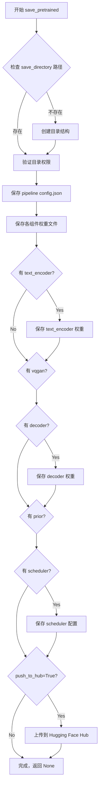

#### 带注释源码

```python
# 伪代码展示 save_pretrained 的核心逻辑
def save_pretrained(
    self,
    save_directory: str,
    safe_serialization: bool = True,
    variant: Optional[str] = None,
    push_to_hub: bool = False,
    **kwargs
):
    """
    保存 pipeline 到指定目录
    
    参数:
        save_directory: 本地路径或 Hub 模型 ID
        safe_serialization: 是否使用 safetensors 格式保存
        variant: 模型变体如 'fp16', 'bf16' 等
        push_to_hub: 是否推送到 Hugging Face Hub
    """
    
    # 1. 创建保存目录
    os.makedirs(save_directory, exist_ok=True)
    
    # 2. 保存 pipeline 配置文件
    pipeline_config = {
        "_class_name": self.__class__.__name__,
        "_diffusers_version": __version__,
        # 保存各组件的类型信息
    }
    save_json(pipeline_config, os.path.join(save_directory, "config.json"))
    
    # 3. 保存各个组件的权重
    # 保存 text_encoder
    if self.text_encoder is not None:
        self.text_encoder.save_pretrained(
            os.path.join(save_directory, "text_encoder"),
            safe_serialization=safe_serialization
        )
    
    # 保存 tokenizer
    if self.tokenizer is not None:
        self.tokenizer.save_pretrained(
            os.path.join(save_directory, "tokenizer")
        )
    
    # 保存 vqgan (Decoder pipeline 特有)
    if hasattr(self, 'vqgan') and self.vqgan is not None:
        self.vqgan.save_pretrained(
            os.path.join(save_directory, "vqgan"),
            safe_serialization=safe_serialization
        )
    
    # 保存 decoder
    if self.decoder is not None:
        self.decoder.save_pretrained(
            os.path.join(save_directory, "decoder"),
            safe_serialization=safe_serialization
        )
    
    # 保存 prior (Combined pipeline 特有)
    if hasattr(self, 'prior') and self.prior is not None:
        self.prior.save_pretrained(
            os.path.join(save_directory, "prior"),
            safe_serialization=safe_serialization
        )
    
    # 保存 scheduler
    if self.scheduler is not None:
        self.scheduler.save_config(os.path.join(save_directory, "scheduler"))
    
    # 4. 可选：推送到 Hub
    if push_to_hub:
        return upload_to_hub(
            folder_path=save_directory,
            repo_id=kwargs.get('repo_id', save_directory),
            commit_message=kwargs.get('commit_message', "Upload pipeline")
        )
    
    return None
```


### `VQModel.load_state_dict`

这是第一个 `load_state_dict` 调用，用于将 VQGAN 模型的权重加载到 `paella_vqmodel` 实例中。

参数：

- `state_dict`：`Dict`，包含从 `vqgan_f4_v1_500k.pt` 文件加载的模型权重字典

返回值：`None`，该方法直接将权重加载到模型中，不返回任何值

#### 流程图

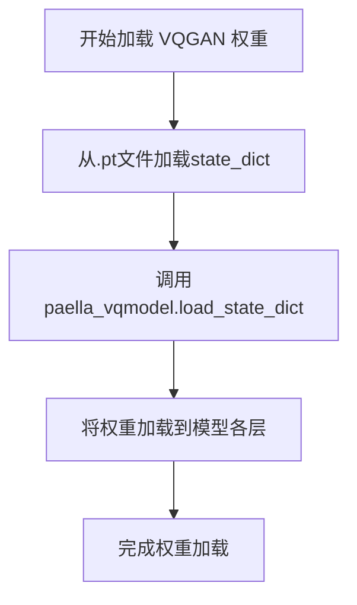

#### 带注释源码

```python
# 加载 VQGAN 模型
paella_vqmodel = VQModel()
# 从本地文件加载权重字典，map_location确保在CPU上加载
state_dict = torch.load(os.path.join(model_path, "vqgan_f4_v1_500k.pt"), map_location=device)["state_dict"]
# 将权重加载到 VQModel 实例中
paella_vqmodel.load_state_dict(state_dict)
```

---

### `PaellaVQModel.load_state_dict`

这是第二个 `load_state_dict` 调用，用于将重新映射后的 VQ 模型权重加载到 `vqmodel` 实例中。

参数：

- `state_dict`：`Dict`，包含经过键名重新映射的 VQ 模型权重字典（将 `vquantizer.codebook.weight` 映射为 `vquantizer.embedding.weight`）

返回值：`None`，该方法直接将权重加载到模型中，不返回任何值

#### 流程图

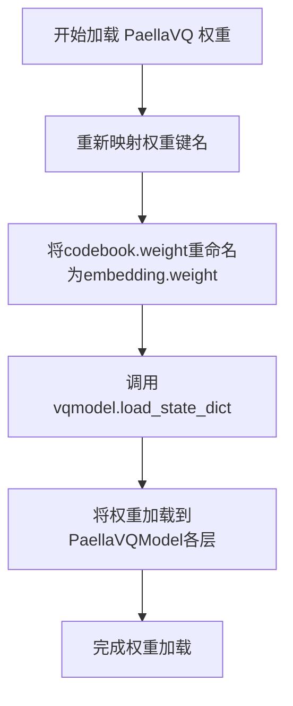

#### 带注释源码

```python
# 对权重键名进行重新映射以适配 PaellaVQModel
state_dict["vquantizer.embedding.weight"] = state_dict["vquantizer.codebook.weight"]
state_dict.pop("vquantizer.codebook.weight")  # 删除旧的键名
# 创建 PaellaVQModel 实例，参数来自原始 VQModel
vqmodel = PaellaVQModel(num_vq_embeddings=paella_vqmodel.codebook_size, latent_channels=paella_vqmodel.c_latent)
# 加载重新映射后的权重
vqmodel.load_state_dict(state_dict)
```

---

### `WuerstchenDiffNeXt.load_state_dict`

这是第三个 `load_state_dict` 调用，用于将经过注意力机制权重重新映射的解码器权重加载到 `decoder` 实例中。

参数：

- `state_dict`：`Dict`，包含经过键名重新映射的 DiffNeXt 解码器权重字典（将 `attn.in_proj_weight` 拆分为 `to_q.weight`、`to_k.weight`、`to_v.weight` 等）

返回值：`None`，该方法直接将权重加载到模型中，不返回任何值

#### 流程图

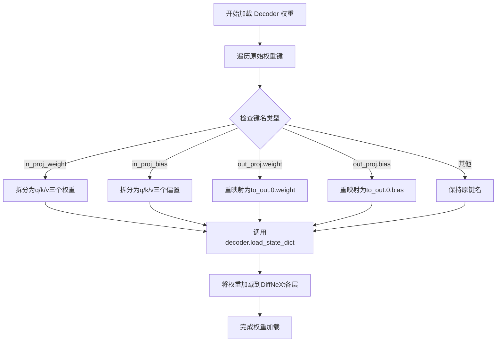

#### 带注释源码

```python
# 加载原始解码器权重
orig_state_dict = torch.load(os.path.join(model_path, "model_v2_stage_b.pt"), map_location=device)["state_dict"]
# 初始化空字典用于存储重映射后的权重
state_dict = {}
for key in orig_state_dict.keys():
    if key.endswith("in_proj_weight"):
        # 将合并的in_proj_weight拆分为to_q, to_k, to_v三个独立的权重
        weights = orig_state_dict[key].chunk(3, 0)
        state_dict[key.replace("attn.in_proj_weight", "to_q.weight")] = weights[0]
        state_dict[key.replace("attn.in_proj_weight", "to_k.weight")] = weights[1]
        state_dict[key.replace("attn.in_proj_weight", "to_v.weight")] = weights[2]
    elif key.endswith("in_proj_bias"):
        weights = orig_state_dict[key].chunk(3, 0)
        state_dict[key.replace("attn.in_proj_bias", "to_q.bias")] = weights[0]
        state_dict[key.replace("attn.in_proj_bias", "to_k.bias")] = weights[1]
        state_dict[key.replace("attn.in_proj_bias", "to_v.bias")] = weights[2]
    elif key.endswith("out_proj.weight"):
        weights = orig_state_dict[key]
        state_dict[key.replace("attn.out_proj.weight", "to_out.0.weight")] = weights
    elif key.endswith("out_proj.bias"):
        weights = orig_state_dict[key]
        state_dict[key.replace("attn.out_proj.bias", "to_out.0.bias")] = weights
    else:
        state_dict[key] = orig_state_dict[key]

# 创建 DiffNeXt 解码器实例
decoder = WuerstchenDiffNeXt()
# 加载重映射后的权重
decoder.load_state_dict(state_dict)
```

---

### `WuerstchenPrior.load_state_dict`

这是第四个 `load_state_dict` 调用，用于将经过注意力机制权重重新映射的 Prior 模型权重加载到 `prior_model` 实例中。

参数：

- `state_dict`：`Dict`，包含经过键名重新映射的 Prior 模型权重字典（与解码器相同的权重拆分和重映射逻辑）

返回值：`None`，该方法直接将权重加载到模型中，不返回任何值

#### 流程图

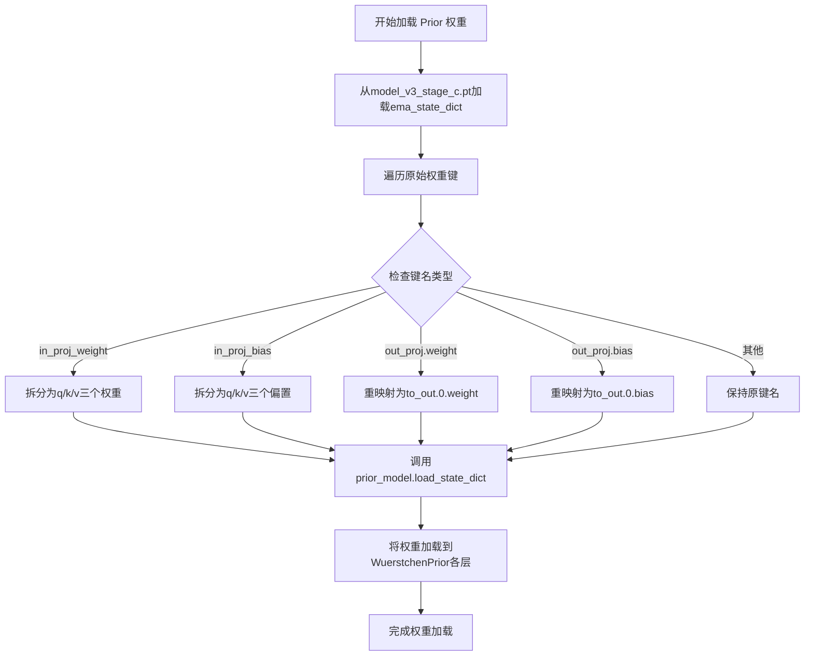

#### 带注释源码

```python
# 加载原始 Prior 模型权重（使用 EMA 权重）
orig_state_dict = torch.load(os.path.join(model_path, "model_v3_stage_c.pt"), map_location=device)["ema_state_dict"]
# 初始化空字典用于存储重映射后的权重
state_dict = {}
for key in orig_state_dict.keys():
    if key.endswith("in_proj_weight"):
        # 将合并的in_proj_weight拆分为to_q, to_k, to_v三个独立的权重
        weights = orig_state_dict[key].chunk(3, 0)
        state_dict[key.replace("attn.in_proj_weight", "to_q.weight")] = weights[0]
        state_dict[key.replace("attn.in_proj_weight", "to_k.weight")] = weights[1]
        state_dict[key.replace("attn.in_proj_weight", "to_v.weight")] = weights[2]
    elif key.endswith("in_proj_bias"):
        weights = orig_state_dict[key].chunk(3, 0)
        state_dict[key.replace("attn.in_proj_bias", "to_q.bias")] = weights[0]
        state_dict[key.replace("attn.in_proj_bias", "to_k.bias")] = weights[1]
        state_dict[key.replace("attn.in_proj_bias", "to_v.bias")] = weights[2]
    elif key.endswith("out_proj.weight"):
        weights = orig_state_dict[key]
        state_dict[key.replace("attn.out_proj.weight", "to_out.0.weight")] = weights
    elif key.endswith("out_proj.bias"):
        weights = orig_state_dict[key]
        state_dict[key.replace("attn.out_proj.bias", "to_out.0.bias")] = weights
    else:
        state_dict[key] = orig_state_dict[key]

# 创建 WuerstchenPrior 实例并移动到设备
prior_model = WuerstchenPrior(c_in=16, c=1536, c_cond=1280, c_r=64, depth=32, nhead=24).to(device)
# 加载重映射后的权重
prior_model.load_state_dict(state_dict)
```


### VQModel.load_state_dict()

该方法用于将预训练的权重状态字典加载到VQModel模型实例中，实现模型参数的初始化和权重迁移。

参数：

-  `state_dict`：`Dict[str, torch.Tensor]`，从磁盘加载的模型权重字典，包含模型各层的参数张量

返回值：`None`，该方法直接修改模型实例的内部状态，不返回任何值

#### 流程图

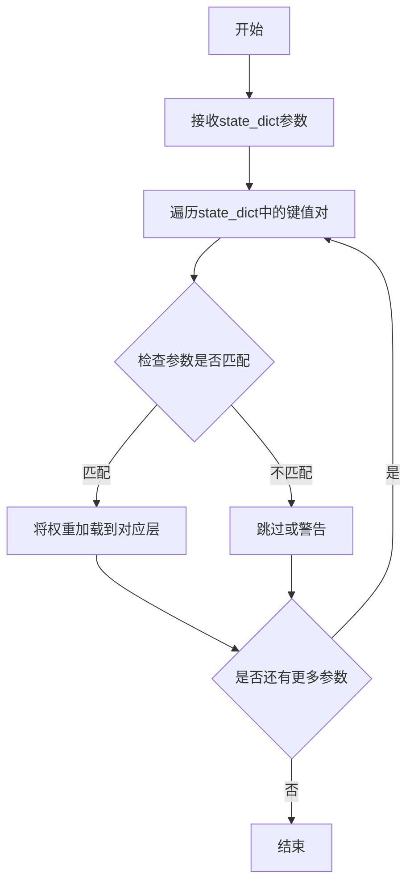

#### 带注释源码

```python
# 在代码中的实际调用：
paella_vqmodel = VQModel()  # 创建VQModel实例
state_dict = torch.load(os.path.join(model_path, "vqgan_f4_v1_500k.pt"), map_location=device)["state_dict"]  # 从磁盘加载预训练权重
paella_vqmodel.load_state_dict(state_dict)  # 将权重加载到模型中

# 紧接着进行权重键名转换以适配PaellaVQModel：
state_dict["vquantizer.embedding.weight"] = state_dict["vquantizer.codebook.weight"]  # 重命名embedding权重
state_dict.pop("vquantizer.codebook.weight")  # 删除旧的codebook权重键
vqmodel = PaellaVQModel(num_vq_embeddings=paella_vqmodel.codebook_size, latent_channels=paella_vqmodel.c_latent)  # 创建PaellaVQModel实例
vqmodel.load_state_dict(state_dict)  # 再次调用load_state_dict加载转换后的权重
```


### `PaellaVQModel.load_state_dict`

加载预训练模型权重到 `PaellaVQModel` 实例中，用于模型初始化或权重迁移。

参数：
- `state_dict`：`dict`，包含模型参数的字典，键为参数名称，值为参数张量。

返回值：`None`，该方法直接修改模型状态，不返回任何值。

#### 流程图

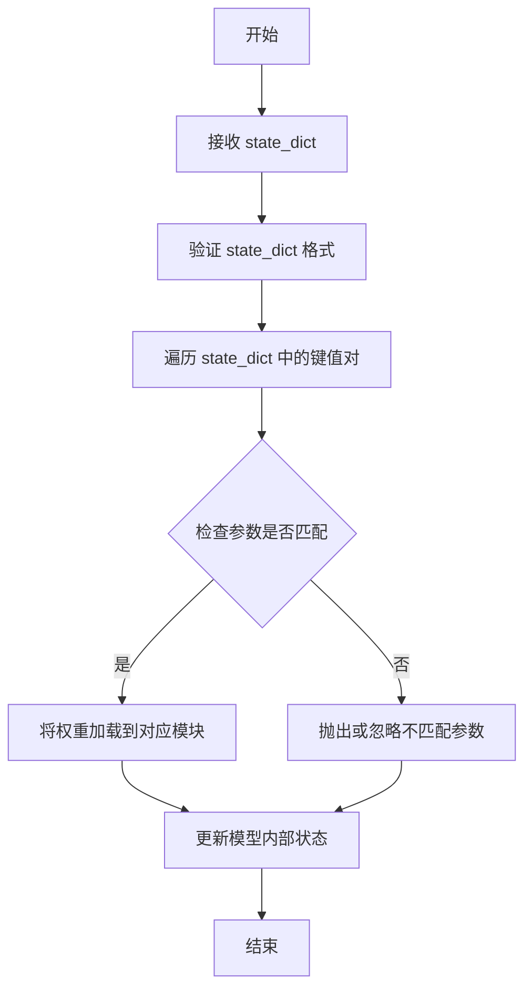

#### 带注释源码

由于 `PaellaVQModel` 继承自 `torch.nn.Module`，`load_state_dict` 方法直接使用父类的实现。以下为调用该方法的示例代码上下文：

```python
# 初始化 PaellaVQModel 实例
vqmodel = PaellaVQModel(
    num_vq_embeddings=paella_vqmodel.codebook_size,  # VQ 嵌入数量
    latent_channels=paella_vqmodel.c_latent        # 潜在空间通道数
)

# 准备状态字典（已修改键名以适配模型结构）
state_dict["vquantizer.embedding.weight"] = state_dict["vquantizer.codebook.weight"]
state_dict.pop("vquantizer.codebook.weight")  # 移除旧键

# 调用 load_state_dict 加载权重
vqmodel.load_state_dict(state_dict)  # 将权重加载到模型中
```


### CLIPTextModel.from_pretrained

该函数是 Hugging Face Transformers 库中 `CLIPTextModel` 类的类方法，用于从预训练模型路径或模型标识符加载 CLIP 文本编码器模型及其配置。在代码中用于加载两个不同规模的 CLIP 模型（ViT-bigG-14 和 ViT-H-14），以支持 Würstchen 图像生成管线中的文本编码功能。

参数：

- `pretrained_model_name_or_path`：`str`，模型标识符（如 "laion/CLIP-ViT-bigG-14-laion2B-39B-b160k"）或本地模型目录路径，指定要加载的预训练模型

返回值：`CLIPTextModel`，返回加载了预训练权重的 CLIP 文本编码器模型实例

#### 流程图

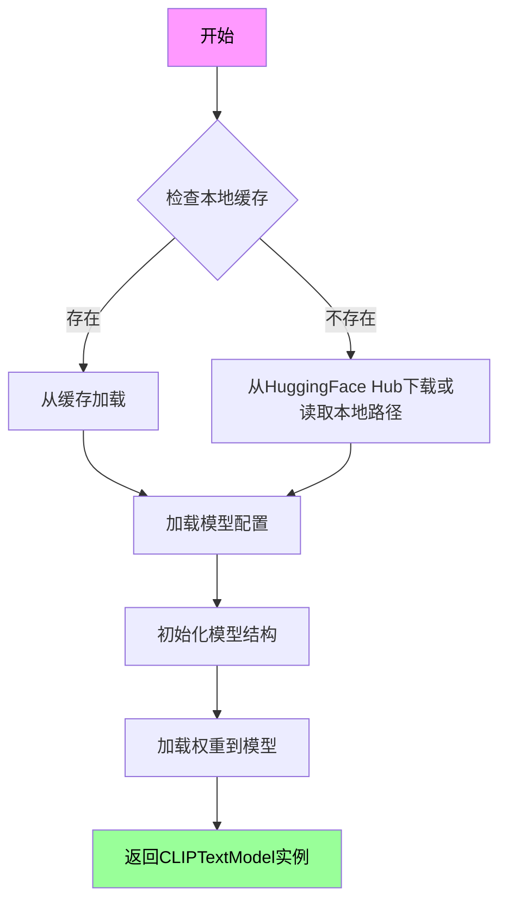

#### 带注释源码

```python
# 第一次调用：加载大型 CLIP 模型 (ViT-bigG-14)
# 用于 Prior 管线，处理更高质量的文本嵌入
text_encoder = CLIPTextModel.from_pretrained("laion/CLIP-ViT-bigG-14-laion2B-39B-b160k")

# 第二次调用：加载中等规模 CLIP 模型 (ViT-H-14)
# 用于 Decoder 管线，生成最终的图像解码条件
# .to("cpu") 将模型移至 CPU 设备（可改为 "cuda" 加速）
gen_text_encoder = CLIPTextModel.from_pretrained("laion/CLIP-ViT-H-14-laion2B-s32B-b79K").to("cpu")

# from_pretrained 方法的完整签名（参考 transformers 库）
# CLIPTextModel.from_pretrained(
#     pretrained_model_name_or_path: str,  # 必需：模型名或路径
#     config: Optional[PretrainedConfig] = None,  # 可选：配置对象
#     cache_dir: Optional[str] = None,  # 可选：缓存目录
#     torch_dtype: Optional[torch.dtype] = None,  # 可选：torch 数据类型
#     force_download: bool = False,  # 可选：强制重新下载
#     resume_download: bool = False,  # 可选：断点续传
#     proxies: Optional[Dict[str, str]] = None,  # 可选：代理设置
#     output_loading_info: bool = False,  # 可选：输出加载信息
#     local_files_only: bool = False,  # 可选：仅使用本地文件
#     use_auth_token: Optional[str] = None,  # 可选：认证令牌
#     revision: str = "main",  # 可选：版本分支
#     mirror: Optional[str] = None,  # 可选：镜像源
#     device_map: Optional[Union[str, Dict[str, int]]] = None,  # 可选：设备映射
#     max_memory: Optional[Dict[int, str]] = None,  # 可选：最大内存
#     offload_folder: Optional[str] = None,  # 可选：卸载文件夹
#     offload_state_dict: bool = False,  # 可选：卸载状态字典
#     low_cpu_mem_usage: bool = False,  # 可选：低内存使用
#     torch_dtype: Optional[torch.dtype] = None  # 可选：torch 数据类型
# ) -> PreTrainedModel
```


### `AutoTokenizer.from_pretrained`

该函数是 Hugging Face Transformers 库中的核心方法，用于从预训练模型或本地目录加载预训练的分词器（Tokenizer），支持从 Hugging Face Hub 下载模型或读取本地缓存的模型配置。

#### 参数

- `pretrained_model_name_or_path`：`str`，模型名称（如 "laion/CLIP-ViT-bigG-14-laion2B-39B-b160k"）或本地模型路径
- `*args`：`可选位置参数`
- `cache_dir`：`str, optional`，缓存目录路径
- `force_download`：`bool, optional`，是否强制重新下载
- `resume_download`：`bool, optional`，是否恢复中断的下载
- `proxies`：`dict, optional`，代理服务器配置
- `revision`：`str, optional`，模型版本/分支
- `use_auth_token`：`str, optional`，访问私有模型的认证令牌
- `local_files_only`：`bool, optional`，是否仅使用本地文件
- `**kwargs`：`关键字参数`，传递给具体分词器类的额外参数

#### 返回值

- **返回值类型**：`tokenizers.Tokenizer` 或具体分词器类实例（如 `CLIPTokenizer`）
- **返回值描述**：返回一个配置好的分词器对象，包含词表、特殊标记、截断和填充配置等，可用于对文本进行编码和解码

#### 流程图

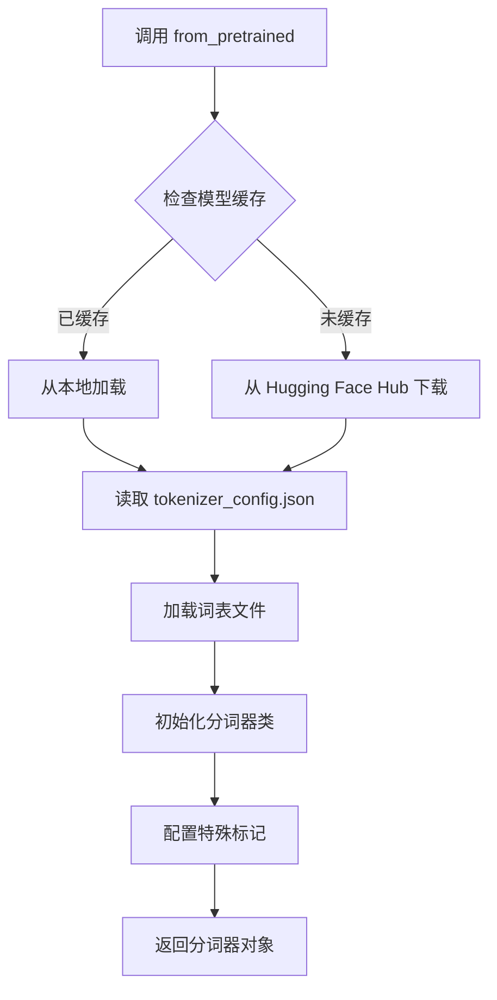

#### 带注释源码

```python
# 从 Hugging Face Hub 加载 CLIP ViT-bigG 分词器
# 用于文本编码，支持 laion2B-39B-b160k 版本的 CLIP 模型
tokenizer = AutoTokenizer.from_pretrained("laion/CLIP-ViT-bigG-14-laion2B-39B-b160k")

# 从 Hugging Face Hub 加载 CLIP ViT-H-14 分词器
# 用于生成器文本编码，支持 laion2B-s32B-b79K 版本的 CLIP 模型
gen_tokenizer = AutoTokenizer.from_pretrained("laion/CLIP-ViT-H-14-laion2B-s32B-b79K")

# 后续使用示例：将文本编码为 token IDs
# inputs = tokenizer("A beautiful landscape painting", return_tensors="pt")
```


### `WuerstchenDiffNeXt.load_state_dict`

该方法是PyTorch `nn.Module` 的标准方法，用于将预训练的模型权重加载到`WuerstchenDiffNeXt`模型实例中。代码中先对原始状态字典进行键名转换（将注意力机制的投影权重从单一块转换为Q、K、V分离的形式），然后调用此方法完成权重加载，使模型具备推理能力。

参数：

- `state_dict`：`Dict[str, torch.Tensor]`，键为参数名称（如 `model.decoder. etc`），值为对应的张量权重，描述模型各层的参数状态

返回值：`None`，该方法在PyTorch内部更新模型参数，不返回任何值

#### 流程图

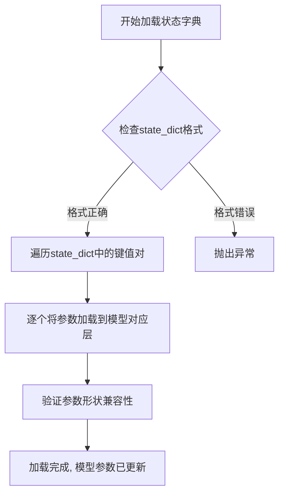

#### 带注释源码

```python
# 代码中调用load_state_dict的位置（位于主脚本中）
# 1. 创建WuerstchenDiffNeXt模型实例
decoder = WuerstchenDiffNeXt()

# 2. 对原始状态字典进行键名转换处理
#    原始模型使用 attn.in_proj_weight (合并的QKV权重)
#    diffusers格式使用 to_q.weight, to_k.weight, to_v.weight (分离的权重)
state_dict = {}
for key in orig_state_dict.keys():
    if key.endswith("in_proj_weight"):
        # 将合并的权重按维度0分成3份: [Q, K, V]
        weights = orig_state_dict[key].chunk(3, 0)
        state_dict[key.replace("attn.in_proj_weight", "to_q.weight")] = weights[0]
        state_dict[key.replace("attn.in_proj_weight", "to_k.weight")] = weights[1]
        state_dict[key.replace("attn.in_proj_weight", "to_v.weight")] = weights[2]
    elif key.endswith("in_proj_bias"):
        # 处理偏置项，同样分为Q、K、V三部分
        weights = orig_state_dict[key].chunk(3, 0)
        state_dict[key.replace("attn.in_proj_bias", "to_q.bias")] = weights[0]
        state_dict[key.replace("attn.in_proj_bias", "to_k.bias")] = weights[1]
        state_dict[key.replace("attn.in_proj_bias", "to_v.bias")] = weights[2]
    elif key.endswith("out_proj.weight"):
        # 输出投影权重转换
        weights = orig_state_dict[key]
        state_dict[key.replace("attn.out_proj.weight", "to_out.0.weight")] = weights
    elif key.endswith("out_proj.bias"):
        # 输出投影偏置转换
        weights = orig_state_dict[key]
        state_dict[key.replace("attn.out_proj.bias", "to_out.0.bias")] = weights
    else:
        # 其他参数直接复制
        state_dict[key] = orig_state_dict[key]

# 3. 调用load_state_dict加载转换后的权重
#    这是PyTorch nn.Module的标准方法
decoder.load_state_dict(state_dict)

# load_state_dict方法内部大致逻辑（简化版）:
# def load_state_dict(self, state_dict):
#     for key, value in state_dict.items():
#         # 递归查找对应的层并赋值
#         if key in self.state_dict():
#             self.state_dict()[key].copy_(value)
#     # 内部还会进行形状检查、strict参数控制等
```


### `WuerstchenPrior.load_state_dict`

将预训练的模型权重加载到 WuerstchenPrior 模型中，完成模型的权重初始化。

参数：

-  `self`：`WuerstchenPrior` 实例，PyTorch 模型对象
-  `state_dict`：`Dict[str, torch.Tensor]` ，包含模型权重的字典，通常从检查点文件加载
-  `strict`：`bool` = `True` ，是否严格匹配模型键值
-  `assign`：`bool` = `False` ，是否将检查点权重直接赋值给模型参数

返回值：`None`，该方法直接在模型对象上更新权重，无返回值

#### 流程图

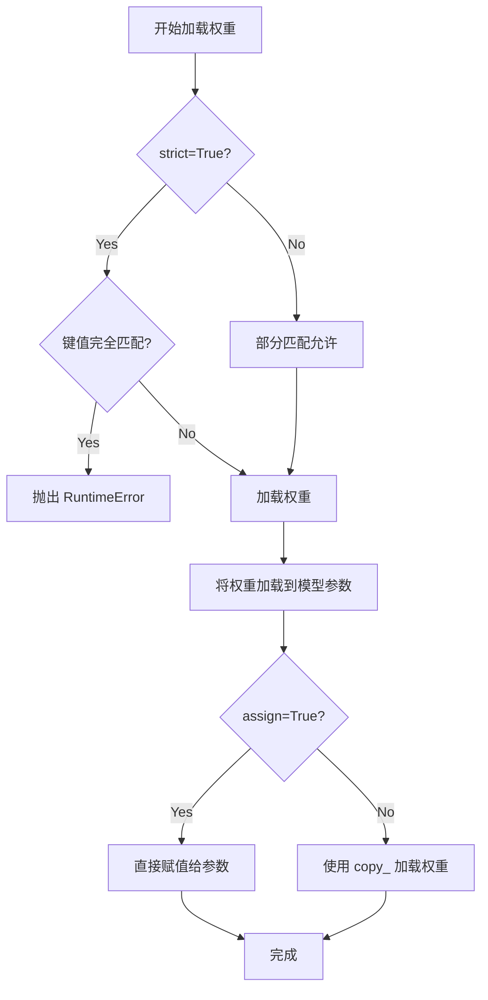

#### 带注释源码

```python
# 代码中的调用示例
prior_model = WuerstchenPrior(c_in=16, c=1536, c_cond=1280, c_r=64, depth=32, nhead=24).to(device)
# 加载经过键名转换的权重字典到 prior_model
# state_dict 包含从原始格式转换而来的权重（如 in_proj_weight 转换为 to_q/to_k/to_v）
prior_model.load_state_dict(state_dict)

# load_state_dict 方法内部执行以下操作：
# 1. 遍历 state_dict 中的键值对
# 2. 根据键名查找对应的模型参数
# 3. 将检查点中的权重加载到模型参数中
# 4. 如果 strict=True 且键不匹配，抛出错误
# 5. 如果 strict=False，则忽略不匹配的键
```


### `WuerstchenPriorPipeline.save_pretrained`

该方法继承自 Hugging Face Diffusers 库的 `DiffusionPipeline` 基类，用于将当前 `WuerstchenPriorPipeline` 对象的所有状态（包括 Prior 模型、CLIPTextModel、Tokenizer 以及 Scheduler 的权重和配置文件）序列化为标准格式并保存到指定的磁盘目录中。

参数：
- `save_directory`：`str`，目标保存路径。如果目录不存在，方法内部会自动创建。

返回值：`None`，无返回值。该操作会触发文件 I/O，将模型权重和配置写入磁盘。

#### 流程图

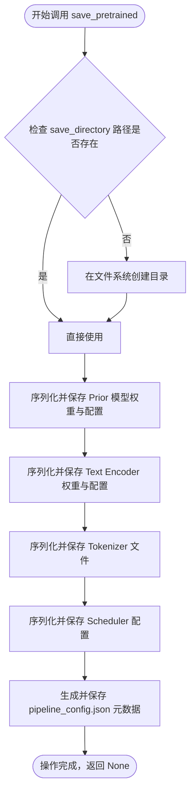

#### 带注释源码

由于 `save_pretrained` 方法的具体实现源码位于 `diffusers` 库内部（未包含在用户提供的代码片段中），以下展示在用户代码中调用该方法的源码：

```python
# prior_pipeline 是 WuerstchenPriorPipeline 的实例
# 它包含了 prior (WuerstchenPrior), text_encoder (CLIPTextModel), 
# tokenizer (AutoTokenizer), scheduler (DDPMWuerstchenScheduler)
prior_pipeline = WuerstchenPriorPipeline(
    prior=prior_model, 
    text_encoder=text_encoder, 
    tokenizer=tokenizer, 
    scheduler=scheduler
)

# 调用 save_pretrained 方法，将所有组件保存到指定路径
# 这会创建目录并写入 .safetensors 或 .bin 文件，以及 config.json 等
prior_pipeline.save_pretrained("warp-ai/wuerstchen-prior")
```


### `WuerstchenDecoderPipeline.save_pretrained`

该方法是 `diffusers` 库中 `WuerstchenDecoderPipeline` 类的成员函数，用于将解码器管道的所有组件（包括文本编码器、分词器、VQGAN 模型、解码器和调度器）保存到指定的目录，以便后续加载或共享。

参数：

- `save_directory`：`str`，保存模型权重和配置文件的目标目录路径
- `push_to_hub`：`bool`（可选，默认为 `False`），是否将模型推送到 Hugging Face Hub
- `**kwargs`：其他可选参数，如 `repo_id`、`commit_message` 等

返回值：`None` 或 `str`，当 `push_to_hub=True` 时返回模型仓库 URL，否则无返回值（`None`）

#### 流程图

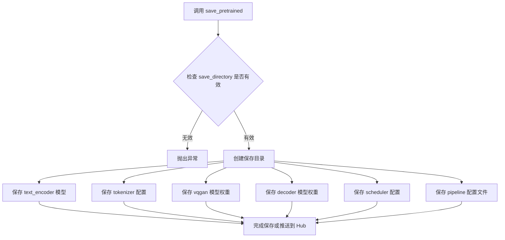

#### 带注释源码

```python
# 创建解码器管道实例
decoder_pipeline = WuerstchenDecoderPipeline(
    text_encoder=gen_text_encoder,      # 生成器文本编码器 (CLIP-ViT-H-14)
    tokenizer=gen_tokenizer,              # 生成器分词器
    vqgan=vqmodel,                        # VQGAN 量化模型 (Paella)
    decoder=decoder,                      # WuerstchenDiffNeXt 解码器
    scheduler=scheduler                   # DDPM 调度器
)

# 调用 save_pretrained 方法将管道保存到指定路径
# 这会保存所有组件：text_encoder, tokenizer, vqgan, decoder, scheduler
# 以及 pipeline 的配置文件 (pipeline_config.json)
decoder_pipeline.save_pretrained("warp-ai/wuerstchen")

# 下方为 diffusers 库中 save_pretrained 的典型实现逻辑：
# def save_pretrained(self, save_directory, ...):
#     # 1. 确保 save_directory 存在
#     os.makedirs(save_directory, exist_ok=True)
#     
#     # 2. 保存各组件模型
#     self.text_encoder.save_pretrained(os.path.join(save_directory, "text_encoder"))
#     self.tokenizer.save_pretrained(os.path.join(save_directory, "tokenizer"))
#     self.vqgan.save_pretrained(os.path.join(save_directory, "vqgan"))
#     self.decoder.save_pretrained(os.path.join(save_directory, "decoder"))
#     self.scheduler.save_pretrained(os.path.join(save_directory, "scheduler"))
#     
#     # 3. 保存 pipeline 配置文件
#     pipeline_config = {
#         "_class_name": "WuerstchenDecoderPipeline",
#         ...
#     }
#     with open(os.path.join(save_directory, "pipeline_config.json"), "w") as f:
#         json.dump(pipeline_config, f)
```


根据代码分析，`WuerstchenCombinedPipeline` 来自 `diffusers` 库，其 `save_pretrained()` 方法继承自基类 `DiffusionPipeline`。下面是详细的分析文档：

---

### `WuerstchenCombinedPipeline.save_pretrained`

该方法继承自 `diffusers.DiffusionPipeline` 基类，用于将 Wuerstchen 组合 pipeline 的所有组件（包括文本编码器、分词器、VQGAN 模型、解码器、Prior 模型和调度器）序列化和保存到指定的目录，以便后续加载推理。

参数：
-  `save_directory`：`str`，必填，保存模型的目录路径
-  `safe_serialization`：`bool`，可选，是否使用安全序列化（默认 `True`）
-  `variant`：`str`，可选，模型变体名称（如 "fp16"）
-  `push_to_hub`：`bool`，可选，是否推送到 Hugging Face Hub（默认 `False`）
-  `**kwargs`：其他可选参数

返回值：无返回值（`None`），直接写入文件系统

#### 流程图

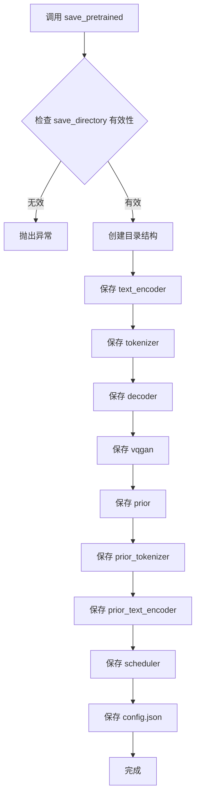

#### 带注释源码

```python
# WuerstchenCombinedPipeline.save_pretrained() 继承自 DiffusionPipeline
# 以下为调用示例代码，展示了该方法的使用方式：

wuerstchen_pipeline = WuerstchenCombinedPipeline(
    # 解码器组件
    text_encoder=gen_text_encoder,      # 主文本编码器 (CLIP ViT-H/14)
    tokenizer=gen_tokenizer,            # 主分词器
    decoder=decoder,                    # WuerstchenDiffNeXt 解码器
    scheduler=scheduler,                # DDPM 调度器
    vqgan=vqmodel,                      # Paella VQGAN 量化模型
    # Prior 组件
    prior_tokenizer=tokenizer,          # Prior 文本编码器的分词器
    prior_text_encoder=text_encoder,    # Prior 文本编码器 (CLIP ViT-bigG)
    prior=prior_model,                  # WuerstchenPrior 模型
    prior_scheduler=scheduler,          # Prior 调度器
)

# 调用 save_pretrained 方法保存整个 pipeline
# 这会将所有组件序列化到指定目录
wuerstchen_pipeline.save_pretrained("warp-ai/WuerstchenCombinedPipeline")

# save_pretrained 内部执行的操作：
# 1. 创建 save_directory 目录
# 2. 依次保存各个组件的模型权重和配置文件
# 3. 保存 pipeline 的整体配置 (config.json)
# 4. 生成 README.md (如果 push_to_hub 为 True)
```

---

### 关键组件信息

| 组件名称 | 一句话描述 |
|---------|-----------|
| `WuerstchenCombinedPipeline` | 结合了 Prior 和 Decoder 的完整 Wuerstchen 文本到图像生成 pipeline |
| `text_encoder` | CLIP 文本编码器，用于将文本提示编码为条件向量 |
| `tokenizer` | 对文本进行分词处理的分词器 |
| `decoder` | WuerstchenDiffNeXt 解码器，将低分辨率潜向量解码为图像 |
| `vqgan` | Paella VQGAN 量化模型，用于图像的离散潜空间表示 |
| `prior` | Wuerstchen Prior 模型，生成文本条件的低分辨率潜向量 |
| `scheduler` | DDPM 调度器，控制去噪过程的噪声调度 |

---

### 技术债务与优化空间

1. **重复的状态字典转换逻辑**：代码中 `decoder` 和 `prior_model` 的权重转换逻辑几乎完全重复，可提取为通用函数
2. **硬编码路径和设备**：模型路径和设备 ("cpu") 硬编码在代码中，缺乏灵活性
3. **缺少错误处理**：文件加载操作没有异常处理机制
4. **模型重复加载**：文本编码器被加载了两次（分别用于 prior 和 generator），造成内存浪费

---

### 其他说明

- **设计目标**：该 pipeline 采用两阶段生成策略，先通过 Prior 生成文本条件的低分辨率潜向量，再通过 Decoder 解码为最终图像
- **外部依赖**：依赖 `diffusers`、`transformers`、`torch` 和自定义的 `vqgan` 模块
- **接口契约**：通过 `save_pretrained()` 保存的模型可使用 `WuerstchenCombinedPipeline.from_pretrained()` 重新加载

## 关键组件


### VQModel / PaellaVQModel

VQGAN量化模型组件，负责将图像转换为离散的latent表示。代码加载了预训练的VQGAN权重，并将codebook权重重新映射以适配PaellaVQModel格式。

### CLIPTextModel

CLIP文本编码器组件，用于将文本提示转换为文本嵌入向量。代码加载了两种规模的CLIP模型：laion/CLIP-ViT-bigG-14-laion2B-39B-b160k用于Prior，laion/CLIP-ViT-H-14-laion2B-s32B-b79K用于Decoder。

### WuerstchenDiffNeXt

解码器模型组件，负责将图像的latent表示解码为最终图像。代码通过状态字典转换逻辑将原始模型权重（包含in_proj_weight等attention参数）转换为diffusers格式（包含to_q、to_k、to_v、to_out等参数）。

### WuerstchenPrior

Prior模型组件，负责根据文本嵌入生成图像的latent表示。配置参数包括c_in=16、c=1536、c_cond=1280、c_r=64、depth=32、nhead=24。采用与解码器相同的状态字典转换逻辑。

### DDPMWuerstchenScheduler

调度器组件，实现DDPM去噪调度算法，用于控制生成过程中的噪声调度。

### 状态字典转换逻辑

关键的数据预处理组件，包含权重重映射逻辑：将原始模型中的attn.in_proj_weight/.bias拆分为to_q、to_k、to_v权重，将attn.out_proj.weight/bias转换为to_out.0.weight/bias。这是适配diffusers库格式的核心逻辑。

### WuerstchenPriorPipeline

Prior管道组件，整合prior_model、text_encoder、tokenizer和scheduler，用于生成图像的latent表示。

### WuerstchenDecoderPipeline

解码器管道组件，整合gen_text_encoder、gen_tokenizer、vqgan、decoder和scheduler，用于将latent解码为图像。

### WuerstchenCombinedPipeline

组合管道组件，整合所有组件（Decoder和Prior），提供完整的文本到图像生成能力。

### 模型权重加载与映射

包含两个阶段的权重加载：model_v2_stage_b.pt（Decoder权重）和model_v3_stage_c.pt（Prior权重，含ema_state_dict）。代码通过os.path.join和torch.load实现跨平台模型加载。


## 问题及建议


### 已知问题

-   **硬编码路径和设备**：模型路径 `"models/"`、设备 `"cpu"` 以及多个模型名称被硬编码，缺乏灵活性和可配置性
-   **重复代码**：状态字典权重转换逻辑（处理 `in_proj_weight`、`in_proj_bias`、`out_proj.weight`、`out_proj.bias`）在decoder和prior加载中完全重复，未抽取为复用函数
-   **设备管理不一致**：部分模型使用 `.to("cpu")`，部分使用 `.to(device)`，造成不一致且容易混淆
-   **缺乏错误处理**：文件加载（`torch.load`）和模型加载（`load_state_dict`）均无try-except异常处理，可能导致运行时崩溃
-   **Pipeline保存路径硬编码**：`"warp-ai/wuerstchen-prior"` 等保存路径直接写在代码中，缺乏配置管理
-   **潜在的内存问题**：加载多个大型模型（CLIP-ViT-bigG-14、CLIP-ViT-H-14）到CPU内存，可能导致内存占用过高
-   **权重转换逻辑脆弱**：通过字符串后缀匹配和chunk进行权重拆分，缺乏健壮性，若权重键名格式变化会失败

### 优化建议

-   将模型路径、设备类型、模型名称等提取为配置文件或命令行参数
-   将状态字典权重转换逻辑抽取为独立的函数（如 `convert_attn_weights`），避免重复代码
-   统一使用 `device` 变量管理设备分配，确保一致性
-   为文件加载和模型加载添加try-except异常处理，捕获 `FileNotFoundError`、`RuntimeError` 等异常
-   将Pipeline保存路径提取为配置常量或变量
-   考虑在加载完成后显式删除不需要的中间变量（如 `orig_state_dict`）以释放内存
-   添加类型注解提升代码可读性和可维护性
-   为关键逻辑添加文档字符串，说明权重转换的具体规则和目的

## 其它


### 设计目标与约束

本代码的设计目标是将原始Wuerstchen模型的权重转换为diffusers库兼容的格式，并保存为可通过WuerstchenCombinedPipeline、WuerstchenPriorPipeline和WuerstchenDecoderPipeline使用的预训练模型。主要约束包括：1) 需要从原始模型检查点正确提取和重新映射注意力权重；2) VQ模型的codebook权重需要正确迁移；3) 设备限制为CPU；4) 模型路径和预训练模型ID需要预先配置。

### 错误处理与异常设计

代码缺少显式的错误处理机制。建议添加：1) 文件不存在检查（model_path下的模型文件）；2) HuggingFace模型加载失败处理；3) state_dict加载失败时的异常捕获；4) 模型格式不兼容时的错误提示；5) 磁盘空间检查（保存模型前）。当前代码在遇到无效路径或损坏的模型文件时会导致程序直接崩溃。

### 数据流与状态机

数据流分为三个主要阶段：1) VQ模型加载阶段：从vqgan_f4_v1_500k.pt加载VQModel，提取codebook权重并重新映射到PaellaVQModel；2) 文本编码器加载阶段：从laion/CLIP-ViT-bigG-14-laion2B-39B-b160k加载CLIPTextModel作为prior文本编码器，从laion/CLIP-ViT-H-14-laion2B-s32B-b79K加载作为generator文本编码器；3) 解码器和先验模型加载阶段：从model_v2_stage_b.pt和model_v3_stage_c.pt加载权重，进行注意力权重重新映射（in_proj_weight->to_q/k/v weight, out_proj_weight->to_out.0.weight）；4) 管道组装阶段：创建三个pipeline并保存到指定目录。

### 外部依赖与接口契约

主要外部依赖包括：1) torch >= 1.0；2) transformers库（AutoTokenizer, CLIPTextModel）；3) diffusers库（Wuerstchen相关pipeline和组件）；4) vqgan模块（本地VQModel类）。接口契约要求：1) 模型文件必须存在于指定路径；2) 预训练模型ID必须可从HuggingFace Hub访问；3) VQModel类需要具有codebook_size和c_latent属性；4) 加载的state_dict必须包含特定的键名以便正确映射。

### 配置与参数说明

关键配置参数包括：model_path指向本地模型目录；device设置为"cpu"；num_vq_embeddings从paella_vqmodel.codebook_size获取；latent_channels为paella_vqmodel.c_latent；prior_model参数c_in=16, c=1536, c_cond=1280, c_r=64, depth=32, nhead=24。三个pipeline保存路径分别为"warp-ai/wuerstchen-prior"、"warp-ai/wuerstchen"和"warp-ai/WuerstchenCombinedPipeline"。

### 性能考虑

当前实现的主要性能瓶颈：1) 所有模型加载和计算均在CPU上执行，效率较低；2) 大型模型文件（39B参数的CLIP模型）加载耗时较长；3) 权重重新映射过程涉及多次循环和张量操作。建议优化：1) 支持CUDA设备以加速推理；2) 使用torch.load的weights_only参数减少内存占用；3) 考虑使用mmap加载大文件；4) 批量处理权重映射逻辑。

### 资源管理

代码未实现显式的资源管理。建议添加：1) 使用torch.no_grad()上下文管理器减少内存消耗；2) 及时释放不需要的中间变量（如orig_state_dict）；3) 考虑使用gc.collect()和torch.cuda.empty_cache()（如使用GPU）；4) 模型保存前检查磁盘空间；5) 分离加载逻辑到独立函数以便内存释放。

### 安全性考虑

当前代码存在以下安全风险：1) 直接从不可信来源加载预训练模型可能存在恶意权重；2) 模型路径未做路径遍历攻击防护；3) 保存模型到HuggingFace需要凭据验证；4) 缺少输入验证机制。建议：1) 验证模型文件完整性（checksum）；2) 使用安全路径处理（os.path.realpath, os.path.abspath）；3) 添加模型来源可信度检查；4) 实现凭据安全存储。

### 版本兼容性

代码依赖的版本要求：1) transformers库需支持CLIPTextModel.from_pretrained；2) diffusers库需包含Wuerstchen相关pipeline；3) PyTorch版本需支持chunk和tensor操作。潜在兼容性问题：1) 不同版本的transformers可能有不同的模型配置；2) diffusers API可能随版本变化；3) VQModel的接口在不同版本间可能有差异。建议锁定依赖版本或添加版本检查逻辑。

### 测试考虑

建议添加的测试用例：1) 模型文件存在性检查；2) state_dict键名验证；3) 权重形状兼容性检查；4) pipeline保存完整性验证；5) 内存使用监控测试；6) CPU/GPU设备兼容性测试。当前代码缺少单元测试和集成测试框架。

### 部署考虑

部署时需考虑：1) 模型文件存储策略（本地或远程）；2) 首次加载的预热时间；3) 内存占用峰值监控；4) 多实例部署时的资源隔离；5) CI/CD流程中的模型缓存机制。建议将模型加载逻辑封装为独立服务或使用模型服务器架构。

    