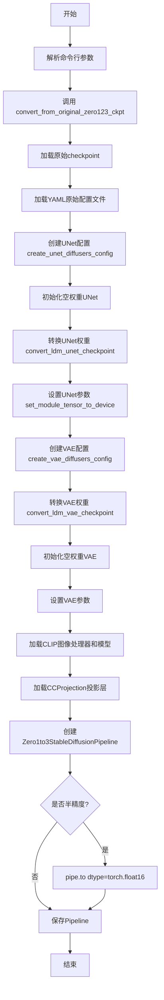
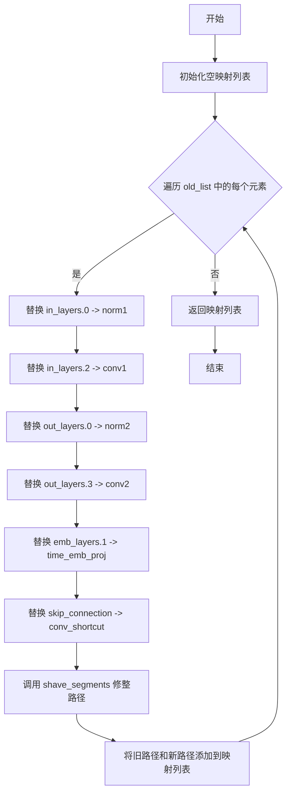
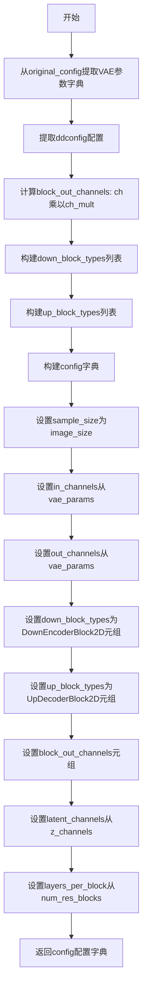
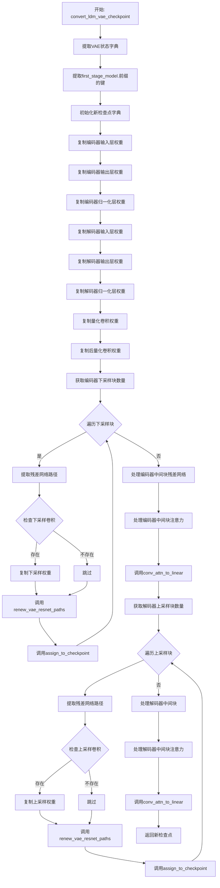
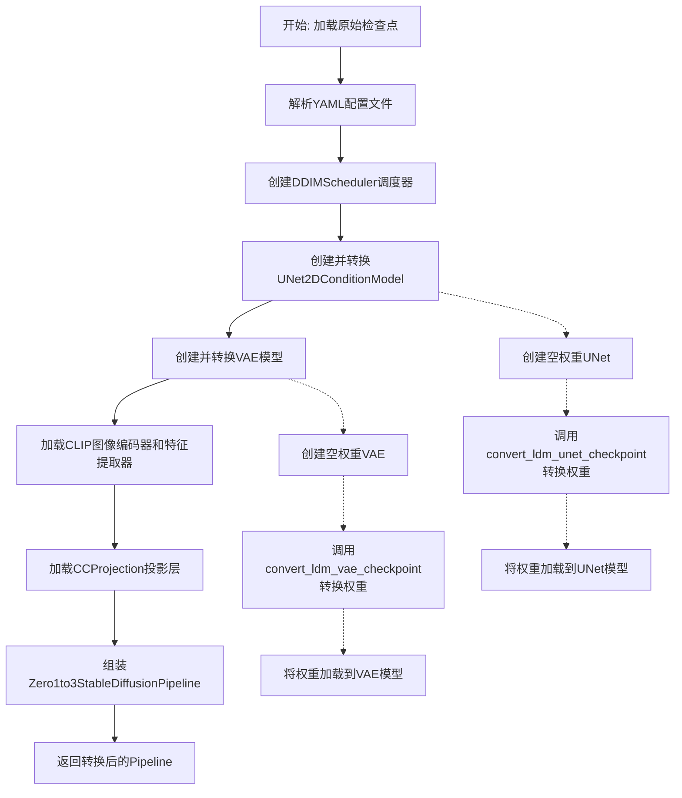

```mermaid
flowchart TD
    A[开始: convert_ldm_unet_checkpoint] --> B{skip_extract_state_dict?}
    B -->|Yes| C[直接使用checkpoint作为unet_state_dict]
    B -->|No| D[提取UNet状态字典]
    D --> E{controlnet?}
    E -->|Yes| F[使用control_model.前缀]
    E -->|No| G[使用model.diffusion_model.前缀]
    F --> H{超过100个model_ema前缀?}
    G --> H
    H -->|Yes且extract_ema| I[提取EMA权重]
    H -->|No| J[提取普通权重]
    I --> K[记录日志警告]
    J --> L[记录日志警告]
    K --> M[开始转换权重名称]
    L --> M
    M --> N[转换time_embedding权重]
    N --> O{class_embed_type为空?}
    O -->|Yes| P[跳过class_embedding]
    O -->|No| Q{class_embed_type为timestep或projection?}
    Q -->|Yes| R[转换class_embedding权重]
    Q -->|No| S[抛出NotImplementedError]
    P --> T{addition_embed_type为text_time?}
    R --> T
    S --> U[转换conv_in权重]
    T -->|Yes| V[转换add_embedding权重]
    T -->|No| U
    V --> U
    U --> W{非controlnet?}
    W -->|Yes| X[转换conv_norm_out和conv_out]
    W -->|No| Y[分组input_blocks]
    X --> Y
    Y --> Z[分组middle_blocks]
    Z --> AA[分组output_blocks]
    AA --> AB[循环处理input_blocks]
    AB --> AC[处理resnets路径]
    AC --> AD{存在attentions?}
    AD -->|Yes| AE[处理attentions路径]
    AD -->|No| AF[处理middle_block]
    AE --> AF
    AF --> AG[处理resnet_0]
    AG --> AH[处理resnet_1]
    AH --> AI[处理attentions]
    AI --> AJ[循环处理output_blocks]
    AJ --> AK{output_block_list长度>1?}
    AK -->|Yes| AL[处理resnets和attentions]
    AK -->|No| AM[处理单个resnet]
    AL --> AN{controlnet?}
    AM --> AN
    AN -->|Yes| AO[转换controlnet相关权重]
    AN -->|No| AP[返回new_checkpoint]
    AO --> AP
```

# `diffusers\scripts\convert_zero123_to_diffusers.py` 详细设计文档

该脚本用于将原始的Zero1to3模型检查点（基于LDM架构）转换为Diffusers格式，包括UNet、VAE、CLIP图像编码器等组件的权重映射和配置转换，并支持EMA权重提取和半精度保存。

## 整体流程



## 类结构

```
无自定义类 (所有函数均为全局函数)
主要依赖外部导入的类:
├── Zero1to3StableDiffusionPipeline (pipeline_zero1to3)
├── CCProjection (pipeline_zero1to3)
├── UNet2DConditionModel (diffusers.models)
├── AutoencoderKL (diffusers.models)
├── CLIPImageProcessor (transformers)
├── CLIPVisionModelWithProjection (transformers)
└── DDIMScheduler (diffusers.schedulers)
```

## 全局变量及字段


### `logger`
    
日志记录器对象，用于在脚本中记录转换过程中的信息、警告和错误消息

类型：`logging.Logger`
    


    

## 全局函数及方法


### `create_unet_diffusers_config`

该函数用于将原始的 LDM（Latent Diffusion Models）模型的配置文件转换为 Diffusers 库所需的 UNet2DConditionModel 配置格式，提取模型参数、注意力机制配置、块类型等关键信息，并返回一个包含所有必要参数的字典。

参数：

- `original_config`：`Dict`，原始 LDM 模型的配置文件（YAML 解析后的字典），包含模型参数、网络配置等
- `image_size`：`int`，输入图像的尺寸，用于计算样本大小
- `controlnet`：`bool`，可选参数，默认为 `False`，指示是否为 ControlNet 模型创建配置

返回值：`Dict`，返回的 Diffusers 风格 UNet 配置字典，包含 `sample_size`、`in_channels`、`down_block_types`、`block_out_channels`、`layers_per_block`、`cross_attention_dim`、`attention_head_dim`、`use_linear_projection`、`class_embed_type`、`addition_embed_type`、`addition_time_embed_dim`、`projection_class_embeddings_input_dim`、`transformer_layers_per_block`、`out_channels`（非 ControlNet 时）、`up_block_types`（非 ControlNet 时）、`conditioning_channels`（ControlNet 时）等键

#### 流程图

```mermaid
flowchart TD
    A[开始] --> B{controlnet 参数?}
    B -->|True| C[从 control_stage_config 获取 unet_params]
    B -->|False| D{unet_config 存在?}
    D -->|True| E[从 unet_config 获取 unet_params]
    D -->|False| F[从 network_config 获取 unet_params]
    C --> G[获取 vae_params]
    E --> G
    F --> G
    G --> H[计算 block_out_channels]
    H --> I[遍历生成 down_block_types]
    I --> J[遍历生成 up_block_types]
    J --> K{transformer_depth 存在?}
    K -->|是| L[处理 transformer_layers_per_block]
    K -->|否| M[设置为 1]
    L --> N[计算 vae_scale_factor]
    M --> N
    N --> O{num_heads 存在?}
    O -->|是| P[设置 head_dim]
    O -->|否| Q{use_linear_in_transformer 存在?}
    Q -->|是| R[计算 head_dim_mult 并设置 head_dim]
    Q -->|否| S[head_dim 为 None]
    R --> T{context_dim 存在?}
    S --> T
    P --> T
    T -->|是| U[提取 context_dim]
    T -->|否| V[context_dim 设为 None]
    U --> W{num_classes 存在?}
    V --> W
    W -->|是 且为 sequential| X{context_dim in [2048, 1280]?}
    W -->|否| Y[抛出 NotImplementedError]
    X -->|是| Z[设置 addition_embed_type=text_time]
    X -->|否| AA[设置 class_embed_type=projection]
    Z --> AB[设置 addition_time_embed_dim=256]
    AA --> AC[提取 adm_in_channels]
    AB --> AD[构建 config 字典]
    AC --> AD
    AD --> AE{controlnet?}
    AE -->|是| AF[添加 conditioning_channels]
    AE -->|否| AG[添加 out_channels 和 up_block_types]
    AF --> AH[返回 config]
    AG --> AH
```

#### 带注释源码

```python
def create_unet_diffusers_config(original_config, image_size: int, controlnet=False):
    """
    Creates a config for the diffusers based on the config of the LDM model.
    """
    # 根据 controlnet 标志从原始配置中提取不同的 UNet 参数
    if controlnet:
        # ControlNet 模式：从 control_stage_config 获取参数
        unet_params = original_config["model"]["params"]["control_stage_config"]["params"]
    else:
        # 非 ControlNet 模式：优先尝试 unet_config，否则使用 network_config
        if (
            "unet_config" in original_config["model"]["params"]
            and original_config["model"]["params"]["unet_config"] is not None
        ):
            unet_params = original_config["model"]["params"]["unet_config"]["params"]
        else:
            unet_params = original_config["model"]["params"]["network_config"]["params"]

    # 从原始配置中提取 VAE 参数（用于计算 vae_scale_factor）
    vae_params = original_config["model"]["params"]["first_stage_config"]["params"]["ddconfig"]

    # 根据 channel_mult 计算输出通道数列表（每个分辨率级别的通道数）
    block_out_channels = [unet_params["model_channels"] * mult for mult in unet_params["channel_mult"]]

    # 根据 attention_resolutions 决定每个分辨率使用哪种下采样块类型
    down_block_types = []
    resolution = 1
    for i in range(len(block_out_channels)):
        # 如果当前分辨率需要注意力机制，使用 CrossAttnDownBlock2D，否则使用 DownBlock2D
        block_type = "CrossAttnDownBlock2D" if resolution in unet_params["attention_resolutions"] else "DownBlock2D"
        down_block_types.append(block_type)
        if i != len(block_out_channels) - 1:
            resolution *= 2

    # 类似的逻辑决定上采样块类型
    up_block_types = []
    for i in range(len(block_out_channels)):
        block_type = "CrossAttnUpBlock2D" if resolution in unet_params["attention_resolutions"] else "UpBlock2D"
        up_block_types.append(block_type)
        resolution //= 2

    # 处理 transformer 层数配置（可能是单个整数或整数列表）
    if unet_params["transformer_depth"] is not None:
        transformer_layers_per_block = (
            unet_params["transformer_depth"]
            if isinstance(unet_params["transformer_depth"], int)
            else list(unet_params["transformer_depth"])
        )
    else:
        transformer_layers_per_block = 1

    # 计算 VAE 缩放因子（用于调整 sample_size）
    vae_scale_factor = 2 ** (len(vae_params["ch_mult"]) - 1)

    # 处理注意力头维度配置
    head_dim = unet_params["num_heads"] if "num_heads" in unet_params else None
    # 检查是否使用线性投影（用于 SD 2.x 版本）
    use_linear_projection = (
        unet_params["use_linear_in_transformer"] if "use_linear_in_transformer" in unet_params else False
    )
    if use_linear_projection:
        # stable diffusion 2-base-512 和 2-768 版本需要特殊处理 head_dim
        if head_dim is None:
            head_dim_mult = unet_params["model_channels"] // unet_params["num_head_channels"]
            head_dim = [head_dim_mult * c for c in list(unet_params["channel_mult"])]

    # 初始化类别嵌入相关变量
    class_embed_type = None
    addition_embed_type = None
    addition_time_embed_dim = None
    projection_class_embeddings_input_dim = None
    context_dim = None

    # 处理上下文维度（cross-attention 维度）
    if unet_params["context_dim"] is not None:
        context_dim = (
            unet_params["context_dim"]
            if isinstance(unet_params["context_dim"], int)
            else unet_params["context_dim"][0]
        )

    # 处理类别条件嵌入配置（支持 SDXL 和其他模型）
    if "num_classes" in unet_params:
        if unet_params["num_classes"] == "sequential":
            if context_dim in [2048, 1280]:
                # SDXL 配置：使用 text_time 嵌入类型
                addition_embed_type = "text_time"
                addition_time_embed_dim = 256
            else:
                # 其他顺序类别模型使用 projection 嵌入
                class_embed_type = "projection"
            assert "adm_in_channels" in unet_params
            projection_class_embeddings_input_dim = unet_params["adm_in_channels"]
        else:
            raise NotImplementedError(f"Unknown conditional unet num_classes config: {unet_params['num_classes']}")

    # 构建基础配置字典
    config = {
        "sample_size": image_size // vae_scale_factor,
        "in_channels": unet_params["in_channels"],
        "down_block_types": tuple(down_block_types),
        "block_out_channels": tuple(block_out_channels),
        "layers_per_block": unet_params["num_res_blocks"],
        "cross_attention_dim": context_dim,
        "attention_head_dim": head_dim,
        "use_linear_projection": use_linear_projection,
        "class_embed_type": class_embed_type,
        "addition_embed_type": addition_embed_type,
        "addition_time_embed_dim": addition_time_embed_dim,
        "projection_class_embeddings_input_dim": projection_class_embeddings_input_dim,
        "transformer_layers_per_block": transformer_layers_per_block,
    }

    # 根据是否为 ControlNet 添加特定配置
    if controlnet:
        config["conditioning_channels"] = unet_params["hint_channels"]
    else:
        config["out_channels"] = unet_params["out_channels"]
        config["up_block_types"] = tuple(up_block_types)

    return config
```


### `assign_to_checkpoint`

该函数执行模型权重转换的最后步骤：将本地转换的权重进行全局重命名，将原始模型的权重键映射到目标模型（Diffusers格式）的键，处理注意力层的分割以及额外的替换规则，最终将转换后的权重写入新的checkpoint字典中。

参数：

- `paths`：`List[Dict[str, str]]`，包含"old"和"new"键的字典列表，定义原始权重键到新权重键的映射关系
- `checkpoint`：`Dict[str, torch.Tensor]`，目标checkpoint字典，用于存储转换后的权重
- `old_checkpoint`：`Dict[str, torch.Tensor]`，原始模型checkpoint字典，包含待转换的权重
- `attention_paths_to_split`：`Optional[Dict[str, Dict[str, str]]]`，可选参数，需要分割的注意力层路径映射，键为原始路径，值为包含"query"、"key"、"value"新路径的字典
- `additional_replacements`：`Optional[List[Dict[str, str]]]`，可选参数，额外的替换规则列表，每个元素包含"old"和"new"键
- `config`：`Optional[Dict]`，可选参数，包含模型配置的字典，如"num_head_channels"等，用于注意力层分割

返回值：`None`，该函数直接修改`checkpoint`字典，不返回任何值

#### 流程图

```mermaid
flowchart TD
    A[开始 assign_to_checkpoint] --> B{验证 paths 是列表}
    B -->|是| C{attention_paths_to_split 不为空?}
    B -->|否| Z[抛出 AssertionError]
    
    C -->|是| D[遍历 attention_paths_to_split]
    C -->|否| E[遍历 paths]
    
    D --> D1[从 old_checkpoint 获取原始张量]
    D --> D2[计算通道数: channels = shape[0] // 3]
    D --> D3[计算头数: num_heads]
    D --> D4[reshape 张量并分割为 query/key/value]
    D --> D5[将分割后的权重写入 checkpoint]
    D --> D6{还有更多 attention 路径?}
    D6 -->|是| D1
    D6 -->|否| E
    
    E --> E1[获取 new_path]
    E --> E2{new_path 已在 attention_paths_to_split 中?}
    E -->|是| E[继续下一个 path]
    E -->|否| E3[全局重命名: middle_block.0/1/2]
    
    E3 --> E4{additional_replacements 不为空?}
    E4 -->|是| E5[应用额外替换规则]
    E4 -->|否| E6[检查是否为注意力权重]
    
    E5 --> E6
    
    E6 --> E7{is_attn_weight 为真且 shape 维度为 3?}
    E7 -->|是| E8[切片: checkpoint[new_path] = old_tensor[:, :, 0]]
    E7 -->|否| E9{is_attn_weight 为真且 shape 维度为 4?}
    
    E9 -->|是| E10[切片: checkpoint[new_path] = old_tensor[:, :, 0, 0]]
    E9 -->|否| E11[直接赋值: checkpoint[new_path] = old_tensor]
    
    E8 --> E12{还有更多 path?}
    E10 --> E12
    E11 --> E12
    
    E12 -->|是| E1
    E12 -->|否| F[结束]
```

#### 带注释源码

```python
def assign_to_checkpoint(
    paths, checkpoint, old_checkpoint, attention_paths_to_split=None, additional_replacements=None, config=None
):
    """
    This does the final conversion step: take locally converted weights and apply a global renaming to them. It splits
    attention layers, and takes into account additional replacements that may arise.

    Assigns the weights to the new checkpoint.
    """
    # 验证 paths 参数必须是包含 'old' 和 'new' 键的字典列表
    assert isinstance(paths, list), "Paths should be a list of dicts containing 'old' and 'new' keys."

    # 如果存在需要分割的注意力层路径，则先将注意力层分割为 query、key、value 三个部分
    if attention_paths_to_split is not None:
        for path, path_map in attention_paths_to_split.items():
            # 从原始 checkpoint 中获取待分割的注意力层张量
            old_tensor = old_checkpoint[path]
            # 原始注意力层通常将 query、key、value 沿通道维度拼接，因此除以 3 获取单个分支的通道数
            channels = old_tensor.shape[0] // 3

            # 根据张量维度确定目标形状，用于后续 reshape
            target_shape = (-1, channels) if len(old_tensor.shape) == 3 else (-1)

            # 计算注意力头的数量，用于正确分割张量
            num_heads = old_tensor.shape[0] // config["num_head_channels"] // 3

            # 重新整形张量以分离不同的头和通道
            # 原始形状: (num_heads * 3 * channels_per_head, ...) 
            # 目标形状: (num_heads, 3 * channels_per_head, ...)
            old_tensor = old_tensor.reshape((num_heads, 3 * channels // num_heads) + old_tensor.shape[1:])
            # 沿通道维度分割为 query、key、value 三个张量
            query, key, value = old_tensor.split(channels // num_heads, dim=1)

            # 将分割后的 query、key、value 写入目标 checkpoint，使用各自的新路径
            checkpoint[path_map["query"]] = query.reshape(target_shape)
            checkpoint[path_map["key"]] = key.reshape(target_shape)
            checkpoint[path_map["value"]] = value.reshape(target_shape)

    # 遍历所有路径映射，进行全局重命名和权重赋值
    for path in paths:
        new_path = path["new"]

        # 如果该路径已经在注意力层分割中处理过，则跳过
        if attention_paths_to_split is not None and new_path in attention_paths_to_split:
            continue

        # 进行全局重命名，将原始中间块命名转换为 Diffusers 格式
        # middle_block.0 -> mid_block.resnets.0
        new_path = new_path.replace("middle_block.0", "mid_block.resnets.0")
        # middle_block.1 -> mid_block.attentions.0
        new_path = new_path.replace("middle_block.1", "mid_block.attentions.0")
        # middle_block.2 -> mid_block.resnets.1
        new_path = new_path.replace("middle_block.2", "mid_block.resnets.1")

        # 应用额外的替换规则（如输入块、输出块的映射）
        if additional_replacements is not None:
            for replacement in additional_replacements:
                new_path = new_path.replace(replacement["old"], replacement["new"])

        # 判断是否为注意力层权重（需要从卷积 1D 转换为线性层）
        # proj_attn.weight 或包含 attentions 和 to_ 的路径（如 to_q.weight, to_k.weight 等）
        is_attn_weight = "proj_attn.weight" in new_path or ("attentions" in new_path and "to_" in new_path)
        # 获取原始张量的形状
        shape = old_checkpoint[path["old"]].shape
        
        # 根据不同的权重类型进行不同的处理
        if is_attn_weight and len(shape) == 3:
            # 3D 权重（卷积 1D）：取第一个时间步的权重
            checkpoint[new_path] = old_checkpoint[path["old"]][:, :, 0]
        elif is_attn_weight and len(shape) == 4:
            # 4D 权重（卷积 2D）：取第一个空间位置和第一个时间步的权重
            checkpoint[new_path] = old_checkpoint[path["old"]][:, :, 0, 0]
        else:
            # 普通权重：直接赋值
            checkpoint[new_path] = old_checkpoint[path["old"]]
```


### `shave_segments`

该函数用于处理点分隔的路径字符串，根据 `n_shave_prefix_segments` 参数的值移除路径中的前缀或后缀段。正值移除前几个段，负值移除后几个段。

参数：

- `path`：`str`，要处理的点分隔路径字符串（例如 "a.b.c.d"）
- `n_shave_prefix_segments`：`int`，要移除的段数，正值移除前缀段，负值移除后缀段，默认为 1

返回值：`str`，处理后的路径字符串

#### 流程图

```mermaid
flowchart TD
    A[开始] --> B{n_shave_prefix_segments >= 0?}
    B -->|是| C[使用 path.split('.')[n_shave_prefix_segments:] 切片]
    B -->|否| D[使用 path.split('.')[:n_shave_prefix_segments] 切片]
    C --> E[用 '.'.join 重新拼接]
    D --> E
    E --> F[返回结果]
```

#### 带注释源码

```python
def shave_segments(path, n_shave_prefix_segments=1):
    """
    移除路径中的段。正值移除前几个段，负值移除后几个段。
    
    参数:
        path: str，要处理的点分隔路径字符串（例如 "input_blocks.1.0.conv.weight"）
        n_shave_prefix_segments: int，要移除的段数。
                                  正值（如 1）移除前1个段，
                                  负值（如 -1）移除最后1个段。
    
    返回:
        str，处理后的路径字符串
    """
    # 正值：从路径中移除前 n_shave_prefix_segments 个段
    # 例如：path="a.b.c.d", n_shave_prefix_segments=1 -> "b.c.d"
    if n_shave_prefix_segments >= 0:
        return ".".join(path.split(".")[n_shave_prefix_segments:])
    else:
        # 负值：从路径中保留前 len(segments) + n_shave_prefix_segments 个段
        # 即移除最后 |n_shave_prefix_segments| 个段
        # 例如：path="a.b.c.d", n_shave_prefix_segments=-1 -> "a.b.c"
        return ".".join(path.split(".")[:n_shave_prefix_segments])
```

#### 使用示例

```python
# 正值：移除前缀段
print(shave_segments("input_blocks.1.0.conv.weight", 1))    # 输出: "1.0.conv.weight"
print(shave_segments("input_blocks.1.0.conv.weight", 2))    # 输出: "0.conv.weight"

# 负值：移除后缀段（保留前面的段）
print(shave_segments("output_blocks.2.0.norm1.weight", -1)) # 输出: "output_blocks.2.0.norm1"
print(shave_segments("output_blocks.2.0.norm1.weight", -2)) # 输出: "output_blocks.2.0"
```

#### 在代码中的作用

在 `convert_ldm_unet_checkpoint` 函数中，`shave_segments` 用于：
1. 在处理输出块时，移除路径中的前两个段以适配新的命名结构
2. 与 `renew_resnet_paths`、`renew_attention_paths` 等函数配合使用，将原始模型的层级路径转换为 Diffusers 格式的路径


### `renew_resnet_paths`

该函数用于将原始Stable Diffusion模型中ResNet层的权重路径转换为Diffusers格式的命名约定。它通过字符串替换将旧版命名（如`in_layers.0`、`out_layers.0`等）映射到新版命名（如`norm1`、`norm2`等），以适配Diffusers库的参数加载逻辑。

参数：

- `old_list`：`List[str]`，原始模型中ResNet层的权重路径列表
- `n_shave_prefix_segments`：`int`，可选参数，指定需要移除的路径前缀段数（默认为0）

返回值：`List[Dict[str, str]]`，返回包含旧路径（`old`）与新路径（`new`）映射关系的字典列表

#### 流程图



#### 带注释源码

```python
def renew_resnet_paths(old_list, n_shave_prefix_segments=0):
    """
    Updates paths inside resnets to the new naming scheme (local renaming)
    
    该函数将原始Stable Diffusion模型的ResNet层权重路径转换为Diffusers格式。
    主要转换规则：
    - in_layers.0 -> norm1: 输入归一化层
    - in_layers.2 -> conv1: 输入卷积层
    - out_layers.0 -> norm2: 输出归一化层
    - out_layers.3 -> conv2: 输出卷积层
    - emb_layers.1 -> time_emb_proj: 时间嵌入投影层
    - skip_connection -> conv_shortcut: 跳跃连接卷积层
    
    Args:
        old_list: 原始模型中ResNet层的权重路径列表
        n_shave_prefix_segments: 需要从路径开头移除的段数，用于处理嵌套层级结构
        
    Returns:
        包含路径映射的字典列表，每个字典有 'old' 和 'new' 两个键
    """
    mapping = []
    for old_item in old_list:
        # 将输入层路径转换为新命名
        new_item = old_item.replace("in_layers.0", "norm1")
        new_item = new_item.replace("in_layers.2", "conv1")

        # 将输出层路径转换为新命名
        new_item = new_item.replace("out_layers.0", "norm2")
        new_item = new_item.replace("out_layers.3", "conv2")

        # 转换时间嵌入层路径
        new_item = new_item.replace("emb_layers.1", "time_emb_proj")
        
        # 转换跳跃连接路径
        new_item = new_item.replace("skip_connection", "conv_shortcut")

        # 修整路径前缀段数，处理层级结构
        new_item = shave_segments(new_item, n_shave_prefix_segments=n_shave_prefix_segments)

        # 添加到映射列表
        mapping.append({"old": old_item, "new": new_item})

    return mapping
```


### `renew_attention_paths`

该函数用于将注意力层（attention layers）的路径从旧的命名方案更新为新的命名方案（本地重命名），通过遍历旧路径列表并生成包含原始路径和新路径的映射字典列表。

参数：

- `old_list`：`list`，需要转换的旧注意力层路径列表
- `n_shave_prefix_segments`：`int`，默认为 0，要截取的前缀段数（可选参数，当前函数内未实现）

返回值：`list[dict]`，返回包含 `old` 和 `new` 键的字典列表，每个字典表示一个路径的映射关系

#### 流程图

```mermaid
flowchart TD
    A[开始 renew_attention_paths] --> B[初始化空列表 mapping]
    B --> C{遍历 old_list 中的每个 old_item}
    C -->|是| D[new_item = old_item]
    D --> E[注释掉的替换规则: norm.weight → group_norm.weight 等]
    E --> F[将 {'old': old_item, 'new': new_item} 添加到 mapping]
    F --> C
    C -->|否| G[返回 mapping 列表]
    G --> H[结束]
```

#### 带注释源码

```python
def renew_attention_paths(old_list, n_shave_prefix_segments=0):
    """
    Updates paths inside attentions to the new naming scheme (local renaming)
    
    参数:
        old_list: 需要转换的旧注意力层路径列表
        n_shave_prefix_segments: 要截取的前缀段数（可选，当前未实现）
    
    返回:
        包含 'old' 和 'new' 键的字典列表，用于本地重命名
    """
    # 初始化用于存储路径映射的空列表
    mapping = []
    
    # 遍历输入的旧路径列表
    for old_item in old_list:
        # 将新路径初始化为旧路径（当前为直接拷贝）
        new_item = old_item

        # 下面是注释掉的替换规则，可能用于未来或特定场景的路径转换：
        # 将 norm.weight 替换为 group_norm.weight
        # new_item = new_item.replace('norm.weight', 'group_norm.weight')
        # 将 norm.bias 替换为 group_norm.bias
        # new_item = new_item.replace('norm.bias', 'group_norm.bias')
        
        # 将 proj_out.weight 替换为 proj_attn.weight
        # new_item = new_item.replace('proj_out.weight', 'proj_attn.weight')
        # 将 proj_out.bias 替换为 proj_attn.bias
        # new_item = new_item.replace('proj_out.bias', 'proj_attn.bias')

        # 可选的路径截取操作（当前被注释掉）
        # new_item = shave_segments(new_item, n_shave_prefix_segments=n_shave_prefix_segments)

        # 将当前路径的映射关系添加到结果列表中
        mapping.append({"old": old_item, "new": new_item})

    # 返回路径映射列表
    return mapping
```


### `convert_ldm_unet_checkpoint`

将原始LDM（Latent Diffusion Model）格式的UNet检查点转换为Diffusers库格式的检查点，处理权重名称映射、EMA权重提取以及不同架构间的结构转换。

参数：

- `checkpoint`：`dict`，原始LDM格式的完整检查点字典，包含模型权重和配置信息
- `config`：`dict`，从原始配置文件生成的Diffusers UNet配置字典，包含模型结构参数
- `path`：`str`，可选，检查点文件路径，用于日志输出
- `extract_ema`：`bool`，是否提取EMA（指数移动平均）权重，默认值为False
- `controlnet`：`bool`，是否为ControlNet模型转换，默认值为False
- `skip_extract_state_dict`：`bool`，是否跳过从检查点中提取UNet状态字典的步骤，默认值为False

返回值：`dict`，转换后的Diffusers格式UNet检查点，键名为新的结构化命名，值为对应的权重张量

#### 流程图



#### 带注释源码

```python
def convert_ldm_unet_checkpoint(
    checkpoint, config, path=None, extract_ema=False, controlnet=False, skip_extract_state_dict=False
):
    """
    Takes a state dict and a config, and returns a converted checkpoint.
    """
    
    # 根据skip_extract_state_dict决定是否需要从checkpoint中提取UNet状态字典
    if skip_extract_state_dict:
        unet_state_dict = checkpoint
    else:
        # 提取UNet的状态字典
        unet_state_dict = {}
        keys = list(checkpoint.keys())

        # 根据是否为ControlNet选择不同的key前缀
        if controlnet:
            unet_key = "control_model."
        else:
            unet_key = "model.diffusion_model."

        # 检查是否有超过100个以model_ema开头的参数，判断是否为EMA检查点
        if sum(k.startswith("model_ema") for k in keys) > 100 and extract_ema:
            logger.warning(f"Checkpoint {path} has both EMA and non-EMA weights.")
            logger.warning(
                "In this conversion only the EMA weights are extracted. If you want to instead extract the non-EMA"
                " weights (useful to continue fine-tuning), please make sure to remove the `--extract_ema` flag."
            )
            # 从EMA权重中提取
            for key in keys:
                if key.startswith("model.diffusion_model"):
                    flat_ema_key = "model_ema." + "".join(key.split(".")[1:])
                    unet_state_dict[key.replace(unet_key, "")] = checkpoint[flat_ema_key]
        else:
            if sum(k.startswith("model_ema") for k in keys) > 100:
                logger.warning(
                    "In this conversion only the non-EMA weights are extracted. If you want to instead extract the EMA"
                    " weights (usually better for inference), please make sure to add the `--extract_ema`` flag."
                )

            # 提取普通权重
            for key in keys:
                if key.startswith(unet_key):
                    unet_state_dict[key.replace(unet_key, "")] = checkpoint[key]

    # 初始化新的checkpoint字典
    new_checkpoint = {}

    # 转换时间嵌入层权重（从time_embed.0到time_embedding.linear_1）
    new_checkpoint["time_embedding.linear_1.weight"] = unet_state_dict["time_embed.0.weight"]
    new_checkpoint["time_embedding.linear_1.bias"] = unet_state_dict["time_embed.0.bias"]
    new_checkpoint["time_embedding.linear_2.weight"] = unet_state_dict["time_embed.2.weight"]
    new_checkpoint["time_embedding.linear_2.bias"] = unet_state_dict["time_embed.2.bias"]

    # 根据class_embed_type处理类别嵌入
    if config["class_embed_type"] is None:
        # 没有需要转换的类别嵌入参数
        ...
    elif config["class_embed_type"] == "timestep" or config["class_embed_type"] == "projection":
        # 转换类别嵌入层权重
        new_checkpoint["class_embedding.linear_1.weight"] = unet_state_dict["label_emb.0.0.weight"]
        new_checkpoint["class_embedding.linear_1.bias"] = unet_state_dict["labelEmb.0.0.bias"]
        new_checkpoint["class_embedding.linear_2.weight"] = unet_state_dict["label_emb.0.2.weight"]
        new_checkpoint["class_embedding.linear_2.bias"] = unet_state_dict["label_emb.0.2.bias"]
    else:
        raise NotImplementedError(f"Not implemented `class_embed_type`: {config['class_embed_type']}")

    # 处理文本时间嵌入类型
    if config["addition_embed_type"] == "text_time":
        new_checkpoint["add_embedding.linear_1.weight"] = unet_state_dict["label_emb.0.0.weight"]
        new_checkpoint["add_embedding.linear_1.bias"] = unet_state_dict["label_emb.0.0.bias"]
        new_checkpoint["add_embedding.linear_2.weight"] = unet_state_dict["label_emb.0.2.weight"]
        new_checkpoint["add_embedding.linear_2.bias"] = unet_state_dict["label_emb.0.2.bias"]

    # 转换输入卷积层权重
    new_checkpoint["conv_in.weight"] = unet_state_dict["input_blocks.0.0.weight"]
    new_checkpoint["conv_in.bias"] = unet_state_dict["input_blocks.0.0.bias"]

    # 非ControlNet模式下转换输出层权重
    if not controlnet:
        new_checkpoint["conv_norm_out.weight"] = unet_state_dict["out.0.weight"]
        new_checkpoint["conv_norm_out.bias"] = unet_state_dict["out.0.bias"]
        new_checkpoint["conv_out.weight"] = unet_state_dict["out.2.weight"]
        new_checkpoint["conv_out.bias"] = unet_state_dict["out.2.bias"]

    # 检索输入块的键
    num_input_blocks = len({".".join(layer.split(".")[:2]) for layer in unet_state_dict if "input_blocks" in layer})
    input_blocks = {
        layer_id: [key for key in unet_state_dict if f"input_blocks.{layer_id}" in key]
        for layer_id in range(num_input_blocks)
    }

    # 检索中间块的键
    num_middle_blocks = len({".".join(layer.split(".")[:2]) for layer in unet_state_dict if "middle_block" in layer})
    middle_blocks = {
        layer_id: [key for key in unet_state_dict if f"middle_block.{layer_id}" in key]
        for layer_id in range(num_middle_blocks)
    }

    # 检索输出块的键
    num_output_blocks = len({".".join(layer.split(".")[:2]) for layer in unet_state_dict if "output_blocks" in layer})
    output_blocks = {
        layer_id: [key for key in unet_state_dict if f"output_blocks.{layer_id}" in key]
        for layer_id in range(num_output_blocks)
    }

    # 循环处理输入块（从索引1开始，跳过输入卷积层）
    for i in range(1, num_input_blocks):
        block_id = (i - 1) // (config["layers_per_block"] + 1)
        layer_in_block_id = (i - 1) % (config["layers_per_block"] + 1)

        # 提取resnet和attention的键
        resnets = [
            key for key in input_blocks[i] if f"input_blocks.{i}.0" in key and f"input_blocks.{i}.0.op" not in key
        ]
        attentions = [key for key in input_blocks[i] if f"input_blocks.{i}.1" in key]

        # 处理下采样层
        if f"input_blocks.{i}.0.op.weight" in unet_state_dict:
            new_checkpoint[f"down_blocks.{block_id}.downsamplers.0.conv.weight"] = unet_state_dict.pop(
                f"input_blocks.{i}.0.op.weight"
            )
            new_checkpoint[f"down_blocks.{block_id}.downsamplers.0.conv.bias"] = unet_state_dict.pop(
                f"input_blocks.{i}.0.op.bias"
            )

        # 转换resnet路径并分配权重
        paths = renew_resnet_paths(resnets)
        meta_path = {"old": f"input_blocks.{i}.0", "new": f"down_blocks.{block_id}.resnets.{layer_in_block_id}"}
        assign_to_checkpoint(
            paths, new_checkpoint, unet_state_dict, additional_replacements=[meta_path], config=config
        )

        # 转换attention路径并分配权重
        if len(attentions):
            paths = renew_attention_paths(attentions)
            meta_path = {"old": f"input_blocks.{i}.1", "new": f"down_blocks.{block_id}.attentions.{layer_in_block_id}"}
            assign_to_checkpoint(
                paths, new_checkpoint, unet_state_dict, additional_replacements=[meta_path], config=config
            )

    # 处理中间块
    resnet_0 = middle_blocks[0]
    attentions = middle_blocks[1]
    resnet_1 = middle_blocks[2]

    # 转换中间resnet
    resnet_0_paths = renew_resnet_paths(resnet_0)
    assign_to_checkpoint(resnet_0_paths, new_checkpoint, unet_state_dict, config=config)

    resnet_1_paths = renew_resnet_paths(resnet_1)
    assign_to_checkpoint(resnet_1_paths, new_checkpoint, unet_state_dict, config=config)

    # 转换中间attention
    attentions_paths = renew_attention_paths(attentions)
    meta_path = {"old": "middle_block.1", "new": "mid_block.attentions.0"}
    assign_to_checkpoint(
        attentions_paths, new_checkpoint, unet_state_dict, additional_replacements=[meta_path], config=config
    )

    # 循环处理输出块
    for i in range(num_output_blocks):
        block_id = i // (config["layers_per_block"] + 1)
        layer_in_block_id = i % (config["layers_per_block"] + 1)
        output_block_layers = [shave_segments(name, 2) for name in output_blocks[i]]
        output_block_list = {}

        # 构建输出块层列表
        for layer in output_block_layers:
            layer_id, layer_name = layer.split(".")[0], shave_segments(layer, 1)
            if layer_id in output_block_list:
                output_block_list[layer_id].append(layer_name)
            else:
                output_block_list[layer_id] = [layer_name]

        # 处理多个层的输出块
        if len(output_block_list) > 1:
            resnets = [key for key in output_blocks[i] if f"output_blocks.{i}.0" in key]
            attentions = [key for key in output_blocks[i] if f"output_blocks.{i}.1" in key]

            resnet_0_paths = renew_resnet_paths(resnets)
            paths = renew_resnet_paths(resnets)

            meta_path = {"old": f"output_blocks.{i}.0", "new": f"up_blocks.{block_id}.resnets.{layer_in_block_id}"}
            assign_to_checkpoint(
                paths, new_checkpoint, unet_state_dict, additional_replacements=[meta_path], config=config
            )

            output_block_list = {k: sorted(v) for k, v in output_block_list.items()}
            # 处理上采样层
            if ["conv.bias", "conv.weight"] in output_block_list.values():
                index = list(output_block_list.values()).index(["conv.bias", "conv.weight"])
                new_checkpoint[f"up_blocks.{block_id}.upsamplers.0.conv.weight"] = unet_state_dict[
                    f"output_blocks.{i}.{index}.conv.weight"
                ]
                new_checkpoint[f"up_blocks.{block_id}.upsamplers.0.conv.bias"] = unet_state_dict[
                    f"output_blocks.{i}.{index}.conv.bias"
                ]

                # 清除已分配的attention
                if len(attentions) == 2:
                    attentions = []

            # 处理attention层
            if len(attentions):
                paths = renew_attention_paths(attentions)
                meta_path = {
                    "old": f"output_blocks.{i}.1",
                    "new": f"up_blocks.{block_id}.attentions.{layer_in_block_id}",
                }
                assign_to_checkpoint(
                    paths, new_checkpoint, unet_state_dict, additional_replacements=[meta_path], config=config
                )
        else:
            # 处理单个resnet层
            resnet_0_paths = renew_resnet_paths(output_block_layers, n_shave_prefix_segments=1)
            for path in resnet_0_paths:
                old_path = ".".join(["output_blocks", str(i), path["old"]])
                new_path = ".".join(["up_blocks", str(block_id), "resnets", str(layer_in_block_id), path["new"]])

                new_checkpoint[new_path] = unet_state_dict[old_path]

    # 处理ControlNet特定权重
    if controlnet:
        # 条件嵌入层
        orig_index = 0

        new_checkpoint["controlnet_cond_embedding.conv_in.weight"] = unet_state_dict.pop(
            f"input_hint_block.{orig_index}.weight"
        )
        new_checkpoint["controlnet_cond_embedding.conv_in.bias"] = unet_state_dict.pop(
            f"input_hint_block.{orig_index}.bias"
        )

        orig_index += 2

        diffusers_index = 0

        # 转换6个中间块
        while diffusers_index < 6:
            new_checkpoint[f"controlnet_cond_embedding.blocks.{diffusers_index}.weight"] = unet_state_dict.pop(
                f"input_hint_block.{orig_index}.weight"
            )
            new_checkpoint[f"controlnet_cond_embedding.blocks.{diffusers_index}.bias"] = unet_state_dict.pop(
                f"input_hint_block.{orig_index}.bias"
            )
            diffusers_index += 1
            orig_index += 2

        new_checkpoint["controlnet_cond_embedding.conv_out.weight"] = unet_state_dict.pop(
            f"input_hint_block.{orig_index}.weight"
        )
        new_checkpoint["controlnet_cond_embedding.conv_out.bias"] = unet_state_dict.pop(
            f"input_hint_block.{orig_index}.bias"
        )

        # 下游块
        for i in range(num_input_blocks):
            new_checkpoint[f"controlnet_down_blocks.{i}.weight"] = unet_state_dict.pop(f"zero_convs.{i}.0.weight")
            new_checkpoint[f"controlnet_down_blocks.{i}.bias"] = unet_state_dict.pop(f"zero_convs.{i}.0.bias")

        # 中间块
        new_checkpoint["controlnet_mid_block.weight"] = unet_state_dict.pop("middle_block_out.0.weight")
        new_checkpoint["controlnet_mid_block.bias"] = unet_state_dict.pop("middle_block_out.0.bias")

    return new_checkpoint
```


### `create_vae_diffusers_config`

该函数用于将原始LDM模型的VAE配置转换为Diffusers格式的VAE配置，通过解析原始配置文件中的VAE参数，生成包含样本尺寸、输入输出通道、下采样和上采样块类型等关键信息的配置字典。

参数：

- `original_config`：`dict`，原始LDM模型的YAML配置对象，包含模型参数字典
- `image_size`：`int`，输入图像的目标尺寸

返回值：`dict`，Diffusers风格的VAE模型配置字典，包含样本尺寸、通道数、块类型等配置项

#### 流程图



#### 带注释源码

```python
def create_vae_diffusers_config(original_config, image_size: int):
    """
    Creates a config for the diffusers based on the config of the LDM model.
    
    该函数从原始LDM模型的配置中提取VAE相关参数，并将其转换为
    Diffusers库中AutoencoderKL模型所需的配置格式。
    
    参数:
        original_config: 原始LDM模型的完整配置字典，通常从YAML文件解析得到
        image_size: 输入图像的目标尺寸，用于设置VAE的sample_size
    
    返回:
        包含VAE模型配置的字典，可用于实例化Diffusers的AutoencoderKL
    """
    # 从原始配置中提取VAE参数字典
    # original_config["model"]["params"]["first_stage_config"]["params"]["ddconfig"]
    # 包含通道数、通道乘数、输入输出通道数、潜在空间通道数、ResBlock数量等
    vae_params = original_config["model"]["params"]["first_stage_config"]["params"]["ddconfig"]
    
    # 提取embed_dim（虽然当前未使用，但可能是为了保持代码完整性或将来扩展）
    _ = original_config["model"]["params"]["first_stage_config"]["params"]["embed_dim"]

    # 计算VAE的输出通道数列表
    # 通过将基础通道数(ch)与通道乘数(ch_mult)相乘得到各层的输出通道数
    # 例如：ch=128, ch_mult=[1,2,4,4] => [128, 256, 512, 512]
    block_out_channels = [vae_params["ch"] * mult for mult in vae_params["ch_mult"]]
    
    # 为每个下采样层级设置编码器块类型
    # DownEncoderBlock2D是Diffusers中用于VAE编码器的下采样块
    down_block_types = ["DownEncoderBlock2D"] * len(block_out_channels)
    
    # 为每个上采样层级设置解码器块类型
    # UpDecoderBlock2D是Diffusers中用于VAE解码器的上采样块
    up_block_types = ["UpDecoderBlock2D"] * len(block_out_channels)

    # 构建最终的Diffusers风格VAE配置字典
    config = {
        # VAE处理的样本尺寸，与输入图像尺寸对应
        "sample_size": image_size,
        
        # VAE编码器的输入通道数
        "in_channels": vae_params["in_channels"],
        
        # VAE解码器的输出通道数
        "out_channels": vae_params["out_ch"],
        
        # 编码器（下采样）块的类型元组
        "down_block_types": tuple(down_block_types),
        
        # 解码器（上采样）块的类型元组
        "up_block_types": tuple(up_block_types),
        
        # 各层的输出通道数元组
        "block_out_channels": tuple(block_out_channels),
        
        # 潜在空间的通道数，用于编码器输出和解码器输入
        "latent_channels": vae_params["z_channels"],
        
        # 每个块中包含的ResNet层数
        "layers_per_block": vae_params["num_res_blocks"],
    }
    
    # 返回转换后的配置字典，可用于实例化Diffusers的AutoencoderKL模型
    return config
```


### `convert_ldm_vae_checkpoint`

该函数负责将原始 LDM（Latent Diffusion Models）格式的 VAE（变分自编码器）检查点转换为 HuggingFace Diffusers 格式。通过提取特定前缀的权重键、重命名层路径、处理残差网络和注意力机制，最终输出符合 Diffusers 标准的 VAE 状态字典。

参数：

- `checkpoint`：`Dict[str, torch.Tensor]`，原始 LDM 格式的完整检查点字典，包含 first_stage_model 前缀的 VAE 权重
- `config`：`Dict`，VAE 配置字典，用于提供转换所需的配置信息（如 num_head_channels）

返回值：`Dict[str, torch.Tensor]`，转换后的 Diffusers 格式 VAE 状态字典，包含 encoder 和 decoder 的所有权重

#### 流程图



#### 带注释源码

```python
def convert_ldm_vae_checkpoint(checkpoint, config):
    """
    将原始 LDM VAE 检查点转换为 Diffusers 格式。
    
    参数:
        checkpoint: 原始 LDM 格式的完整检查点字典
        config: VAE 配置字典
    返回:
        转换后的 Diffusers 格式 VAE 状态字典
    """
    
    # ========== 步骤1: 提取 VAE 状态字典 ==========
    # 从完整检查点中提取以 "first_stage_model." 为前缀的键
    vae_state_dict = {}
    vae_key = "first_stage_model."
    keys = list(checkpoint.keys())
    for key in keys:
        if key.startswith(vae_key):
            # 移除前缀，保留后续部分作为键
            vae_state_dict[key.replace(vae_key, "")] = checkpoint.get(key)

    # ========== 步骤2: 初始化新检查点 ==========
    new_checkpoint = {}

    # ========== 步骤3: 复制编码器的基础层权重 ==========
    # encoder.conv_in: 编码器的输入卷积层
    new_checkpoint["encoder.conv_in.weight"] = vae_state_dict["encoder.conv_in.weight"]
    new_checkpoint["encoder.conv_in.bias"] = vae_state_dict["encoder.conv_in.bias"]
    
    # encoder.conv_out: 编码器的输出卷积层
    new_checkpoint["encoder.conv_out.weight"] = vae_state_dict["encoder.conv_out.weight"]
    new_checkpoint["encoder.conv_out.bias"] = vae_state_dict["encoder.conv_out.bias"]
    
    # encoder.conv_norm_out: 编码器的输出归一化层
    new_checkpoint["encoder.conv_norm_out.weight"] = vae_state_dict["encoder.norm_out.weight"]
    new_checkpoint["encoder.conv_norm_out.bias"] = vae_state_dict["encoder.norm_out.bias"]

    # ========== 步骤4: 复制解码器的基础层权重 ==========
    # decoder.conv_in: 解码器的输入卷积层
    new_checkpoint["decoder.conv_in.weight"] = vae_state_dict["decoder.conv_in.weight"]
    new_checkpoint["decoder.conv_in.bias"] = vae_state_dict["decoder.conv_in.bias"]
    
    # decoder.conv_out: 解码器的输出卷积层
    new_checkpoint["decoder.conv_out.weight"] = vae_state_dict["decoder.conv_out.weight"]
    new_checkpoint["decoder.conv_out.bias"] = vae_state_dict["decoder.conv_out.bias"]
    
    # decoder.conv_norm_out: 解码器的输出归一化层
    new_checkpoint["decoder.conv_norm_out.weight"] = vae_state_dict["decoder.norm_out.weight"]
    new_checkpoint["decoder.conv_norm_out.bias"] = vae_state_dict["decoder.norm_out.bias"]

    # ========== 步骤5: 复制量化相关的卷积层权重 ==========
    # quant_conv: 量化卷积层，用于将潜在表示转换为离散码本
    new_checkpoint["quant_conv.weight"] = vae_state_dict["quant_conv.weight"]
    new_checkpoint["quant_conv.bias"] = vae_state_dict["quant_conv.bias"]
    
    # post_quant_conv: 后量化卷积层，用于从离散码本转换回潜在表示
    new_checkpoint["post_quant_conv.weight"] = vae_state_dict["post_quant_conv.weight"]
    new_checkpoint["post_quant_conv.bias"] = vae_state_dict["post_quant_conv.bias"]

    # ========== 步骤6: 处理编码器的下采样块 ==========
    # 获取编码器下采样块的数量（通过唯一的前三层标识）
    num_down_blocks = len({
        ".".join(layer.split(".")[:3]) 
        for layer in vae_state_dict 
        if "encoder.down" in layer
    })
    
    # 构建每个下采样块的键列表字典
    down_blocks = {
        layer_id: [key for key in vae_state_dict if f"down.{layer_id}" in key] 
        for layer_id in range(num_down_blocks)
    }

    # 遍历每个下采样块进行处理
    for i in range(num_down_blocks):
        # 提取当前块中的残差网络路径（排除下采样层）
        resnets = [
            key for key in down_blocks[i] 
            if f"down.{i}" in key and f"down.{i}.downsample" not in key
        ]

        # 如果存在下采样卷积层，则复制其权重
        if f"encoder.down.{i}.downsample.conv.weight" in vae_state_dict:
            new_checkpoint[f"encoder.down_blocks.{i}.downsamplers.0.conv.weight"] = vae_state_dict.pop(
                f"encoder.down.{i}.downsample.conv.weight"
            )
            new_checkpoint[f"encoder.down_blocks.{i}.downsamplers.0.conv.bias"] = vae_state_dict.pop(
                f"encoder.down.{i}.downsample.conv.bias"
            )

        # 转换残差网络路径并分配权重
        paths = renew_vae_resnet_paths(resnets)
        meta_path = {"old": f"down.{i}.block", "new": f"down_blocks.{i}.resnets"}
        assign_to_checkpoint(
            paths, new_checkpoint, vae_state_dict, 
            additional_replacements=[meta_path], config=config
        )

    # ========== 步骤7: 处理编码器的中间块 ==========
    # 获取中间块的残差网络
    mid_resnets = [key for key in vae_state_dict if "encoder.mid.block" in key]
    num_mid_res_blocks = 2
    
    for i in range(1, num_mid_res_blocks + 1):
        resnets = [key for key in mid_resnets if f"encoder.mid.block_{i}" in key]
        paths = renew_vae_resnet_paths(resnets)
        meta_path = {"old": f"mid.block_{i}", "new": f"mid_block.resnets.{i - 1}"}
        assign_to_checkpoint(
            paths, new_checkpoint, vae_state_dict, 
            additional_replacements=[meta_path], config=config
        )

    # 处理中间块的注意力层
    mid_attentions = [key for key in vae_state_dict if "encoder.mid.attn" in key]
    paths = renew_vae_attention_paths(mid_attentions)
    meta_path = {"old": "mid.attn_1", "new": "mid_block.attentions.0"}
    assign_to_checkpoint(
        paths, new_checkpoint, vae_state_dict, 
        additional_replacements=[meta_path], config=config
    )
    
    # 将卷积注意力权重转换为线性权重
    conv_attn_to_linear(new_checkpoint)

    # ========== 步骤8: 处理解码器的上采样块 ==========
    # 获取解码器上采样块的数量
    num_up_blocks = len({
        ".".join(layer.split(".")[:3]) 
        for layer in vae_state_dict 
        if "decoder.up" in layer
    })
    
    up_blocks = {
        layer_id: [key for key in vae_state_dict if f"up.{layer_id}" in key] 
        for layer_id in range(num_up_blocks)
    }

    # 逆序遍历上采样块（从最深层到最浅层）
    for i in range(num_up_blocks):
        block_id = num_up_blocks - 1 - i
        resnets = [
            key for key in up_blocks[block_id] 
            if f"up.{block_id}" in key and f"up.{block_id}.upsample" not in key
        ]

        # 如果存在上采样卷积层，则复制其权重
        if f"decoder.up.{block_id}.upsample.conv.weight" in vae_state_dict:
            new_checkpoint[f"decoder.up_blocks.{i}.upsamplers.0.conv.weight"] = vae_state_dict[
                f"decoder.up.{block_id}.upsample.conv.weight"
            ]
            new_checkpoint[f"decoder.up_blocks.{i}.upsamplers.0.conv.bias"] = vae_state_dict[
                f"decoder.up.{block_id}.upsample.conv.bias"
            ]

        # 转换残差网络路径并分配权重
        paths = renew_vae_resnet_paths(resnets)
        meta_path = {"old": f"up.{block_id}.block", "new": f"up_blocks.{i}.resnets"}
        assign_to_checkpoint(
            paths, new_checkpoint, vae_state_dict, 
            additional_replacements=[meta_path], config=config
        )

    # ========== 步骤9: 处理解码器的中间块 ==========
    # 处理中间块的残差网络
    mid_resnets = [key for key in vae_state_dict if "decoder.mid.block" in key]
    for i in range(1, num_mid_res_blocks + 1):
        resnets = [key for key in mid_resnets if f"decoder.mid.block_{i}" in key]
        paths = renew_vae_resnet_paths(resnets)
        meta_path = {"old": f"mid.block_{i}", "new": f"mid_block.resnets.{i - 1}"}
        assign_to_checkpoint(
            paths, new_checkpoint, vae_state_dict, 
            additional_replacements=[meta_path], config=config
        )

    # 处理中间块的注意力层
    mid_attentions = [key for key in vae_state_dict if "decoder.mid.attn" in key]
    paths = renew_vae_attention_paths(mid_attentions)
    meta_path = {"old": "mid.attn_1", "new": "mid_block.attentions.0"}
    assign_to_checkpoint(
        paths, new_checkpoint, vae_state_dict, 
        additional_replacements=[meta_path], config=config
    )
    
    # 将卷积注意力权重转换为线性权重
    conv_attn_to_linear(new_checkpoint)
    
    # ========== 步骤10: 返回转换后的检查点 ==========
    return new_checkpoint
```


### `renew_vae_resnet_paths`

将 VAE（变分自编码器）的 ResNet 路径从旧命名方案更新为新的 Diffusers 命名方案，主要处理残差连接和跳跃连接的路径重命名。

参数：

- `old_list`：`List[str]`，包含旧版模型权重路径的列表
- `n_shave_prefix_segments`：`int`，默认为 0，表示要切掉的前缀段数量

返回值：`List[Dict[str, str]]`，返回包含 'old' 和 'new' 键的字典列表，表示旧路径到新路径的映射关系

#### 流程图

```mermaid
flowchart TD
    A[开始: 输入 old_list 和 n_shave_prefix_segments] --> B[初始化空 mapping 列表]
    B --> C{遍历 old_list 中的每个 old_item}
    C -->|是| D[复制 old_item 为 new_item]
    D --> E{"nin_shortcut" 在 new_item 中?}
    E -->|是| F[将 "nin_shortcut" 替换为 "conv_shortcut"]
    E -->|否| G[跳过替换]
    F --> G
    G --> H[调用 shave_segments 切掉前缀段]
    H --> I[将 {"old": old_item, "new": new_item} 添加到 mapping]
    I --> C
    C -->|遍历完成| J[返回 mapping 列表]
    J --> K[结束]
```

#### 带注释源码

```python
def renew_vae_resnet_paths(old_list, n_shave_prefix_segments=0):
    """
    Updates paths inside resnets to the new naming scheme (local renaming)
    
    此函数用于将 VAE 模型中 ResNet 层的旧权重路径重命名映射到新的 Diffusers 格式。
    主要处理 "nin_shortcut" 到 "conv_shortcut" 的替换，以及可选的前缀段修剪。
    
    Args:
        old_list (List[str]): 包含旧版模型权重路径的列表
        n_shave_prefix_segments (int, optional): 要从路径前端切掉的段数，默认为 0
    
    Returns:
        List[Dict[str, str]]: 路径映射列表，每个元素为 {"old": 旧路径, "new": 新路径}
    """
    # 初始化映射结果列表
    mapping = []
    
    # 遍历所有旧路径
    for old_item in old_list:
        # 复制旧路径作为新路径的起点
        new_item = old_item

        # 将 "nin_shortcut" 替换为 "conv_shortcut"
        # 这是 VAE 模型从原始 LDM 格式转换到 Diffusers 格式的关键映射之一
        new_item = new_item.replace("nin_shortcut", "conv_shortcut")
        
        # 调用 shave_segments 函数去除指定数量的前缀段
        # 例如：给定路径 "down.0.block.0.nin_shortcut.weight" 和 n_shave_prefix_segments=1
        # 可能变成 "block.0.nin_shortcut.weight"
        new_item = shave_segments(new_item, n_shave_prefix_segments=n_shave_prefix_segments)

        # 将旧路径到新路径的映射添加到结果列表
        mapping.append({"old": old_item, "new": new_item})

    # 返回完整的路径映射列表
    return mapping
```


### `renew_vae_attention_paths`

该函数用于将原始 LDM（Latent Diffusion Model）模型中 VAE（Variational Autoencoder）的注意力机制（Attention）层的参数名称映射到 Hugging Face Diffusers 格式的名称。它通过字符串替换实现本地命名规则的更新，并将更新后的路径添加到映射列表中。

参数：

- `old_list`：`List[str]`，包含原始检查点中 VAE 注意力层参数名称的列表。
- `n_shave_prefix_segments`：`int`，表示要从路径开头移除的_dot-separated_段数，默认为 0。此参数用于处理路径层级前缀。

返回值：`List[Dict[str, str]]`，返回一个包含字典的列表，每个字典对应一个旧的参数名（`old`）到新的参数名（`new`）的映射。

#### 流程图

```mermaid
flowchart TD
    A([开始 renew_vae_attention_paths]) --> B[初始化空列表 mapping]
    B --> C{遍历 old_list 中的每个 old_item}
    C -->|当前项| D[复制 old_item 到 new_item]
    D --> E{执行字符串替换}
    E --> E1[norm.weight -> group_norm.weight]
    E1 --> E2[norm.bias -> group_norm.bias]
    E2 --> E3[q.weight -> to_q.weight]
    E3 --> E4[q.bias -> to_q.bias]
    E4 --> E5[k.weight -> to_k.weight]
    E5 --> E6[k.bias -> to_k.bias]
    E6 --> E7[v.weight -> to_v.weight]
    E7 --> E8[v.bias -> to_v.bias]
    E8 --> E9[proj_out.weight -> to_out.0.weight]
    E9 --> E10[proj_out.bias -> to_out.0.bias]
    E10 --> F[调用 shave_segments 修整路径]
    F --> G[向 mapping 添加字典 {old: old_item, new: new_item}]
    G --> C
    C -->|遍历结束| H([返回 mapping])
```

#### 带注释源码

```python
def renew_vae_attention_paths(old_list, n_shave_prefix_segments=0):
    """
    Updates paths inside attentions to the new naming scheme (local renaming)
    将注意力层的路径更新为新的命名方案（本地重命名）
    """
    mapping = []
    for old_item in old_list:
        new_item = old_item

        # 替换归一化层的命名: norm -> group_norm
        new_item = new_item.replace("norm.weight", "group_norm.weight")
        new_item = new_item.replace("norm.bias", "group_norm.bias")

        # 替换 Q (Query) 投影层: q -> to_q
        new_item = new_item.replace("q.weight", "to_q.weight")
        new_item = new_item.replace("q.bias", "to_q.bias")

        # 替换 K (Key) 投影层: k -> to_k
        new_item = new_item.replace("k.weight", "to_k.weight")
        new_item = new_item.replace("k.bias", "to_k.bias")

        # 替换 V (Value) 投影层: v -> to_v
        new_item = new_item.replace("v.weight", "to_v.weight")
        new_item = new_item.replace("v.bias", "to_v.bias")

        # 替换输出投影层: proj_out -> to_out.0
        new_item = new_item.replace("proj_out.weight", "to_out.0.weight")
        new_item = new_item.replace("proj_out.bias", "to_out.0.bias")

        # 根据 n_shave_prefix_segments 修整路径前缀
        new_item = shave_segments(new_item, n_shave_prefix_segments=n_shave_prefix_segments)

        # 构建映射字典并添加到列表
        mapping.append({"old": old_item, "new": new_item})

    return mapping
```


### `conv_attn_to_linear`

该函数用于将注意力机制中的卷积权重转换为线性权重。在从原始LDM模型转换到Diffusers格式的过程中，需要处理VAE和UNet中的注意力层权重，这些权重在原始模型中可能是以卷积形式存储的，但在新模型中需要转换为线性投影。

参数：

- `checkpoint`：`dict`，待转换的检查点字典，包含模型权重

返回值：`None`，该函数直接修改传入的字典，不返回任何值

#### 流程图

```mermaid
flowchart TD
    A[开始: conv_attn_to_linear] --> B[获取checkpoint的所有keys]
    B --> C[定义attn_keys列表: query.weight, key.weight, value.weight]
    C --> D[遍历checkpoint中的每个key]
    D --> E{检查key是否匹配注意力权重}
    E -->|匹配attn_keys| F{检查权重维度是否大于2}
    F -->|是| G[取权重张量[:, :, 0, 0]进行降维]
    F -->|否| H[不处理该权重]
    G --> I[更新checkpoint中的权重]
    I --> D
    E -->|不匹配attn_keys| J{检查是否包含proj_attn.weight}
    J -->|是| K{检查权重维度是否大于2}
    K -->|是| L[取权重张量[:, :, 0]进行降维]
    K -->|否| H
    L --> I
    J -->|否| H
    H --> M{是否还有更多key}
    M -->|是| D
    M -->|否| N[结束]
```

#### 带注释源码

```python
def conv_attn_to_linear(checkpoint):
    """
    将注意力层中的卷积权重转换为线性权重
    
    在原始的LDM模型中，注意力层的投影权重可能以卷积形式存储
    （例如形状为 [out_channels, in_channels, height, width]）
    但在Diffusers格式中需要转换为线性投影（形状为 [out_channels, in_channels]）
    
    参数:
        checkpoint: 包含模型权重的字典
        
    返回:
        无返回值，直接修改传入的checkpoint字典
    """
    
    # 获取checkpoint中所有的key（参数名称）
    keys = list(checkpoint.keys())
    
    # 定义需要转换的注意力权重键列表
    # 这些是注意力机制中的Query、Key、Value投影权重
    attn_keys = ["query.weight", "key.weight", "value.weight"]
    
    # 遍历checkpoint中的每个权重键
    for key in keys:
        # 获取key的最后两个部分，用于匹配注意力权重
        # 例如: "encoder.mid.attn_1.q.weight" -> "q.weight" -> "query.weight"
        key_suffix = ".".join(key.split(".")[-2:])
        
        # 检查是否是注意力权重键（query/key/value）
        if key_suffix in attn_keys:
            # 如果权重的维度大于2（说明是卷积形式存储）
            if checkpoint[key].ndim > 2:
                # 将卷积权重转换为线性权重
                # 例如: 从 [C_out, C_in, 1, 1] 转换为 [C_out, C_in]
                checkpoint[key] = checkpoint[key][:, :, 0, 0]
                
        # 检查是否是proj_attn权重（另一种注意力投影权重）
        elif "proj_attn.weight" in key:
            # 如果权重的维度大于2
            if checkpoint[key].ndim > 2:
                # 将卷积权重转换为线性权重
                # 只需要取第一个切片，因为这种权重只有3维
                # 例如: 从 [C_out, C_in, 1] 转换为 [C_out, C_in]
                checkpoint[key][:, :, 0]
```


### `convert_from_original_zero123_ckpt`

该函数是 Zero1to3 模型检查点转换的核心入口，负责将原始 Zero1to3 模型的检查点文件转换为 Hugging Face Diffusers 格式的Pipeline，包括 UNet、VAE、图像编码器和调度器的权重转换与加载。

参数：

- `checkpoint_path`：`str`，原始 Zero1to3 检查点文件的路径
- `original_config_file`：原始模型的 YAML 配置文件路径，用于解析模型架构参数
- `extract_ema`：`bool`，是否提取 EMA 权重（通常 EMA 权重推理效果更好）
- `device`：`str`，用于加载检查点的设备（如 "cpu"、"cuda:0" 等）

返回值：`Zero1to3StableDiffusionPipeline`，转换后的 Diffusers 格式 Pipeline 对象，可直接用于推理

#### 流程图



#### 带注释源码

```python
def convert_from_original_zero123_ckpt(checkpoint_path, original_config_file, extract_ema, device):
    """
    将原始 Zero1to3 检查点转换为 Diffusers 格式的 Pipeline
    
    参数:
        checkpoint_path: 原始检查点文件路径
        original_config_file: 原始模型 YAML 配置文件路径
        extract_ema: 是否提取 EMA 权重
        device: 加载设备
    返回:
        Zero1to3StableDiffusionPipeline: 转换后的 Pipeline 对象
    """
    # 1. 加载原始检查点文件到指定设备
    ckpt = torch.load(checkpoint_path, map_location=device)
    # 从检查点中提取 state_dict（模型权重）
    checkpoint = ckpt["state_dict"]
    # 删除原始加载对象释放内存
    del ckpt
    # 清理 CUDA 缓存
    torch.cuda.empty_cache()

    # 2. 加载并解析原始模型的 YAML 配置文件
    original_config = yaml.safe_load(original_config_file)
    # 获取条件阶段配置的目标类名
    original_config["model"]["params"]["cond_stage_config"]["target"].split(".")[-1]
    
    # 3. 设置 Zero1to3 特定参数（8通道输入用于视角条件）
    num_in_channels = 8
    original_config["model"]["params"]["unet_config"]["params"]["in_channels"] = num_in_channels
    prediction_type = "epsilon"  # 预测类型
    image_size = 256  # 图像尺寸
    
    # 4. 获取调度器参数并创建 DDIMScheduler
    num_train_timesteps = getattr(original_config["model"]["params"], "timesteps", None) or 1000
    beta_start = getattr(original_config["model"]["params"], "linear_start", None) or 0.02
    beta_end = getattr(original_config["model"]["params"], "linear_end", None) or 0.085
    
    scheduler = DDIMScheduler(
        beta_end=beta_end,
        beta_schedule="scaled_linear",
        beta_start=beta_start,
        num_train_timesteps=num_train_timesteps,
        steps_offset=1,
        clip_sample=False,
        set_alpha_to_one=False,
        prediction_type=prediction_type,
    )
    scheduler.register_to_config(clip_sample=False)

    # 5. 转换 UNet 模型
    upcast_attention = None
    # 根据原始配置创建 Diffusers 格式的 UNet 配置
    unet_config = create_unet_diffusers_config(original_config, image_size=image_size)
    unet_config["upcast_attention"] = upcast_attention
    
    # 使用 init_empty_weights 初始化空模型结构（避免一次性加载到内存）
    with init_empty_weights():
        unet = UNet2DConditionModel(**unet_config)
    
    # 转换 UNet 权重并加载到模型
    converted_unet_checkpoint = convert_ldm_unet_checkpoint(
        checkpoint, unet_config, path=None, extract_ema=extract_ema
    )
    for param_name, param in converted_unet_checkpoint.items():
        set_module_tensor_to_device(unet, param_name, "cpu", value=param)

    # 6. 转换 VAE 模型
    vae_config = create_vae_diffusers_config(original_config, image_size=image_size)
    converted_vae_checkpoint = convert_ldm_vae_checkpoint(checkpoint, vae_config)

    # 获取 VAE 缩放因子
    if (
        "model" in original_config
        and "params" in original_config["model"]
        and "scale_factor" in original_config["model"]["params"]
    ):
        vae_scaling_factor = original_config["model"]["params"]["scale_factor"]
    else:
        vae_scaling_factor = 0.18215  # 默认 SD 缩放因子

    vae_config["scaling_factor"] = vae_scaling_factor

    # 初始化空 VAE 并加载权重
    with init_empty_weights():
        vae = AutoencoderKL(**vae_config)

    for param_name, param in converted_vae_checkpoint.items():
        set_module_tensor_to_device(vae, param_name, "cpu", value=param)

    # 7. 加载 CLIP 图像编码器和特征提取器
    feature_extractor = CLIPImageProcessor.from_pretrained(
        "lambdalabs/sd-image-variations-diffusers", subfolder="feature_extractor"
    )
    image_encoder = CLIPVisionModelWithProjection.from_pretrained(
        "lambdalabs/sd-image-variations-diffusers", subfolder="image_encoder"
    )

    # 8. 加载 CCProjection（视角投影层）权重
    cc_projection = CCProjection()
    cc_projection.load_state_dict(
        {
            "projection.weight": checkpoint["cc_projection.weight"].cpu(),
            "projection.bias": checkpoint["cc_projection.bias"].cpu(),
        }
    )

    # 9. 组装完整的 Zero1to3 Pipeline
    pipe = Zero1to3StableDiffusionPipeline(
        vae, image_encoder, unet, scheduler, None, feature_extractor, cc_projection, requires_safety_checker=False
    )

    return pipe
```

## 关键组件


### 张量索引与路径映射

负责将原始LDM模型的张量路径映射到Diffusers模型的新路径，包括重命名规则、层级索引转换和权重重新分配。

### 反量化支持

提供`conv_attn_to_linear`函数，将卷积注意力权重转换为线性层权重，处理3D和4D张量的切片操作。

### 权重分割与合并

在`assign_to_checkpoint`函数中实现，将原始注意力层的query、key、value权重从合并状态分割到独立变量。

### UNet配置转换

`create_unet_diffusers_config`函数从原始YAML配置提取UNet参数，转换为Diffusers格式的字典配置，包括注意力头维度、通道数、层数等。

### VAE配置转换

`create_vae_diffusers_config`函数从原始配置提取VAE参数，生成Diffusers VAE模型配置。

### 路径刷新与分段

`shave_segments`函数根据指定参数移除路径前缀或后缀段，用于层级路径的标准化处理。

### ResNet路径重命名

`renew_resnet_paths`和`renew_vae_resnet_paths`函数将原始ResNet层路径（如in_layers、out_layers、emb_layers）映射到Diffusers的新命名规范。

### Attention路径重命名

`renew_attention_paths`和`renew_vae_attention_paths`函数处理注意力层路径的转换，包括q、k、v投影和输出投影的重命名。

### 主转换流程

`convert_from_original_zero123_ckpt`函数是核心入口，负责加载检查点、转换UNet和VAE权重、加载CLIP特征提取器、创建CCProjection模块，最终组装Zero1to3StableDiffusionPipeline。

### 命令行参数解析

使用argparse定义转换脚本的参数，包括检查点路径、原始配置文件、EMA权重提取选项、输出路径等。


## 问题及建议


### 已知问题

-   **硬编码配置值**：多处使用硬编码值如 `num_in_channels = 8`、`image_size = 256`、`prediction_type = "epsilon"`、`vae_scaling_factor = 0.18215` 和 `num_train_timesteps = 1000`，缺乏灵活性，难以适配不同模型变体
-   **缺失错误处理**：`torch.load` 和 `yaml.safe_load` 等关键操作缺少异常捕获，配置文件格式错误或文件不存在时会导致脚本直接崩溃
-   **未使用变量和死代码**：读取了 `ckpt["global_step"]` 和 `cond_stage_config` 解析结果但未使用；`upcast_attention = None` 被赋值但从未真正使用；`renew_attention_paths` 函数中包含大量被注释掉的代码
-   **硬编码模型路径**：CLIP 图像编码器和特征提取器的模型路径 `"lambdalabs/sd-image-variations-diffusers"` 被硬编码，无法通过参数指定
-   **资源配置不当**：大 checkpoint 直接加载到内存，未使用 `mmap` 或分片加载；`del ckpt` 释放后立即调用 `torch.cuda.empty_cache()` 可能导致内存碎片
-   **缺少参数校验**：`original_config_file` 在代码中标记为可选但实际使用时会引发错误；未对输入参数的类型和有效性进行校验
-   **日志记录不足**：仅在 EMA 权重提取时使用 `logger.warning`，其他关键转换步骤缺少日志，难以追踪调试

### 优化建议

-   **参数化配置**：将硬编码值通过命令行参数或配置文件传入，增加脚本的通用性和可复用性
-   **添加错误处理**：对文件加载、配置解析、模型转换等关键操作添加 try-except 块，提供有意义的错误信息
-   **清理死代码**：移除未使用的变量和被注释的代码片段，提高代码可读性
-   **优化内存管理**：对大 checkpoint 使用 `torch.load(..., mmap=True, map_location='cpu')` 或分片加载，避免内存峰值过高
-   **增加日志记录**：在关键转换节点添加工日志，记录进度、已处理模块数量和耗时等信息
-   **添加输入校验**：在脚本入口处对必需参数进行校验，确保配置文件存在且格式正确
-   **重构重复逻辑**：将 VAE 和 UNet 转换中相似的路径处理逻辑抽取为公共函数，减少代码冗余

## 其它


### 设计目标与约束

该脚本的核心目标是将原始Zero1to3模型的checkpoint（采用LDM/Original格式）转换为Hugging Face Diffusers库支持的格式，以便在Diffusers框架下进行推理和微调。主要约束包括：1) 需要提供原始模型的yaml配置文件路径；2) 仅支持DDIMScheduler；3) 图像尺寸固定为256；4) 输入通道数固定为8（支持View-dependent条件）；5) 默认提取非EMA权重（可通过--extract_ema参数改为提取EMA权重）；6) 输出支持safetensors和半精度格式。

### 错误处理与异常设计

脚本中的错误处理主要通过以下方式实现：1) 使用assert语句进行关键路径的断言检查，如assign_to_checkpoint函数中检查paths是否为list类型；2) 对于不支持的配置值抛出NotImplementedError异常，如class_embed_type为未知类型时；3) 对于EMA权重判断，当checkpoint中model_ema开头的参数超过100个时给出warning提示；4) 使用try-except捕获yaml文件加载异常；5) 对于缺失的配置文件字段，使用getattr和or提供默认值。

### 外部依赖与接口契约

本脚本依赖以下外部包和模块：1) torch用于张量操作和模型加载；2) yaml用于解析原始模型配置文件；3) accelerate库（init_empty_weights、set_module_tensor_to_device）用于内存高效加载；4) transformers库（CLIPImageProcessor、CLIPVisionModelWithProjection）用于图像编码器；5) diffusers库（AutoencoderKL、UNet2DConditionModel、DDIMScheduler、Zero1to3StableDiffusionPipeline）用于目标格式；6) pipeline_zero1to3中的CCProjection和Zero1to3StableDiffusionPipeline为项目自定义模块。输入接口：checkpoint_path（原始ckpt路径）、original_config_file（yaml配置）、extract_ema（是否提取EMA）、device（加载设备）；输出接口：返回Zero1to3StableDiffusionPipeline对象，可通过save_pretrained保存到指定路径。

### 配置管理

脚本采用多层配置管理策略：1) 命令行参数通过argparse定义，支持checkpoint_path、original_config_file、extract_ema、to_safetensors、half、dump_path、device等参数；2) 原始模型配置从yaml文件加载，包含model/params下的unet_config、first_stage_config、cond_stage_config等；3) 创建diffusers格式config时，对于缺失字段使用默认值或推断值，如vae_scale_factor默认为0.18215；4) scheduler配置通过register_to_config动态注册到DDIMScheduler对象；5) 转换过程中的中间配置（如unet_config、vae_config）以字典形式在函数间传递。

### 兼容性说明

本脚本针对特定版本的Zero1to3模型设计，兼容性说明如下：1) 仅支持Zero1to3特定格式的checkpoint，其他SD变体可能不兼容；2) 原始配置文件格式必须为标准LDM YAML格式；3) 仅支持DDIMScheduler，不支持其他类型的scheduler；4) 图像尺寸固定为256x256，不支持其他分辨率；5) 输入通道数固定为8（4通道latent + 4通道conditioning），这是Zero1to3的特有设计；6) CCProjection层为Zero1to3特有组件；7) 依赖lambdalabs/sd-image-variations-diffusers预训练的特征提取器和图像编码器。

### 性能考虑

脚本在性能方面做了以下考虑：1) 使用init_empty_weights()进行内存高效的空模型初始化，避免完整模型加载内存占用；2) 使用set_module_tensor_to_device逐个设置参数到目标设备；3) 通过torch.cuda.empty_cache()及时释放GPU缓存；4) 支持半精度（float16）转换和保存，减少显存和内存占用；5) 支持safetensors格式提供更快的加载速度；6) 在convert_ldm_unet_checkpoint中支持skip_extract_state_dict选项避免不必要的字典操作。

    