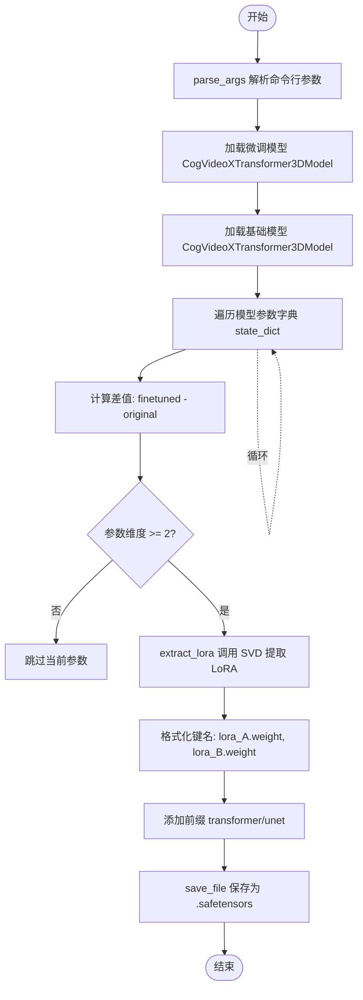
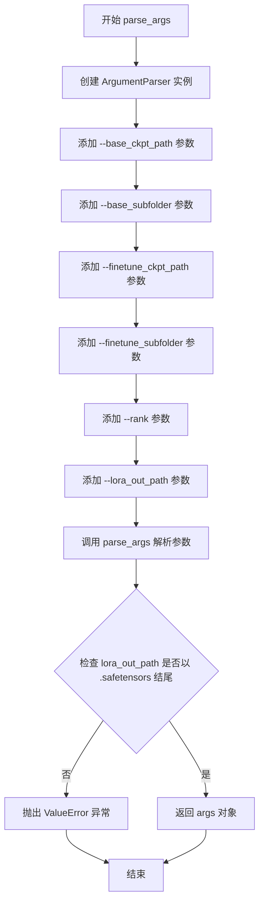
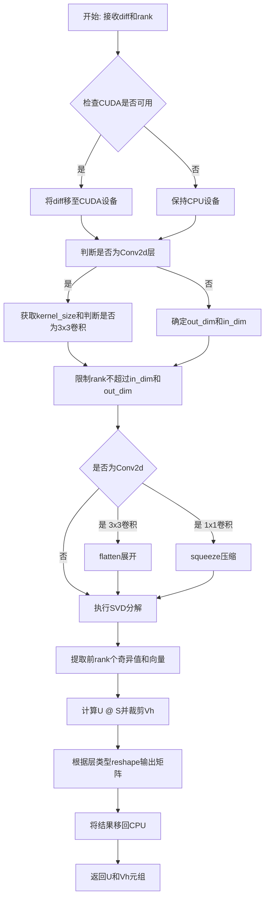
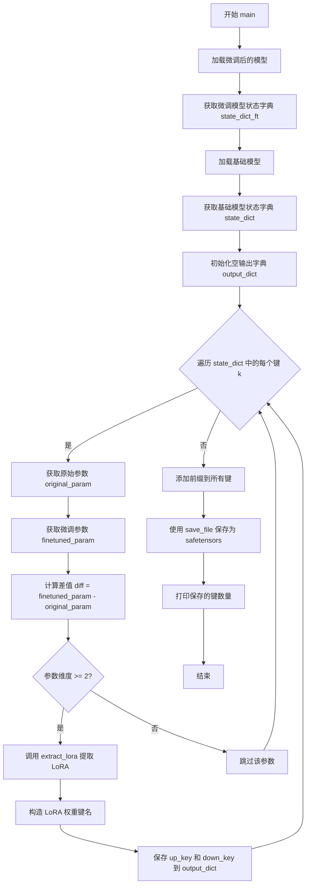
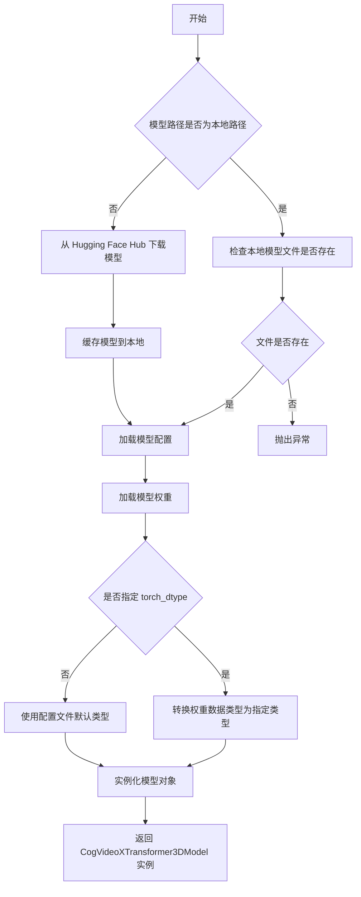
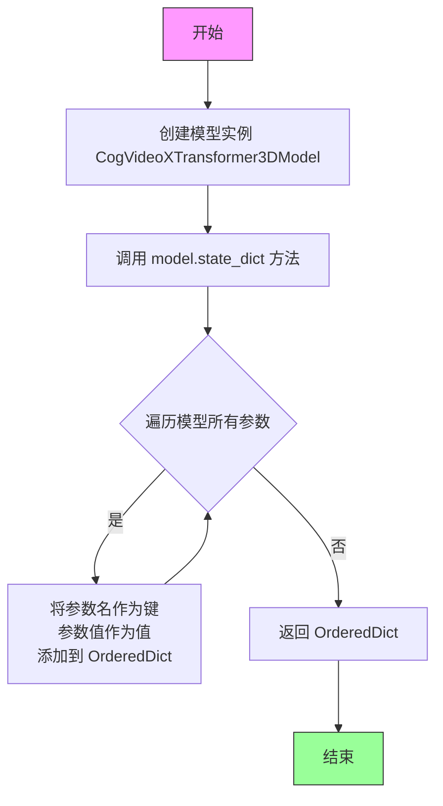

# `diffusers\scripts\extract_lora_from_model.py` 详细设计文档

该脚本用于从完全微调后的 CogVideoX 模型中提取 LoRA (Low-Rank Adaptation) 权重。它通过比较微调模型与基础模型的参数差异，利用 SVD (奇异值分解) 技术提取低秩矩阵，并将其保存为 SafeTensors 格式。

## 整体流程



## 类结构

```
Script Root (extract_lora_from_model.py)
├── Global Variables
│   ├── RANK (int): LoRA 矩阵的秩
│   └── CLAMP_QUANTILE (float): 截断分位数，用于数值clamp
├── Function: parse_args (命令行参数解析)
├── Function: extract_lora (核心数学计算逻辑)
├── Function: main (主流程控制)
└── External Dependency
    └── CogVideoXTransformer3DModel (Diffusers 库模型类)
```

## 全局变量及字段


### `RANK`
    
LoRA提取的秩（rank）参数，控制低秩近似维度，默认为64

类型：`int`
    


### `CLAMP_QUANTILE`
    
用于截断LoRA权重分布的分位数阈值，防止极端值，默认为0.99

类型：`float`
    


### `CogVideoXTransformer3DModel.CogVideoXTransformer3DModel`
    
CogVideoX视频生成模型的Transformer 3D模型类，用于加载和处理CogVideoX模型权重

类型：`class (inherited from PretrainedModel)`
    
    

## 全局函数及方法


### `parse_args`

该函数是命令行参数解析器，用于解析提取 LoRA 权重脚本所需的各项参数，包括基础模型路径、微调模型路径、LoRA 秩以及输出路径等，并进行基本的参数校验。

参数：此函数无参数。

返回值：`args`（`argparse.Namespace`），返回解析后的命令行参数对象，包含 `base_ckpt_path`、`base_subfolder`、`finetune_ckpt_path`、`finetune_subfolder`、`rank` 和 `lora_out_path` 等属性。

#### 流程图



#### 带注释源码

```
def parse_args():
    """
    解析命令行参数，用于配置 LoRA 权重提取流程。
    
    该函数创建一个 ArgumentParser 实例，定义所有需要的命令行参数，
    包括模型路径、子文件夹、秩值和输出路径，然后进行基本的参数验证。
    """
    # 创建参数解析器，设置默认描述信息
    parser = argparse.ArgumentParser()
    
    # 添加基础模型检查点路径参数
    parser.add_argument(
        "--base_ckpt_path",
        default=None,
        type=str,
        required=True,
        help="Base checkpoint path from which the model was finetuned. Can be a model ID on the Hub.",
    )
    
    # 添加基础模型子文件夹参数（可选）
    parser.add_argument(
        "--base_subfolder",
        default="transformer",
        type=str,
        help="subfolder to load the base checkpoint from if any.",
    )
    
    # 添加微调模型检查点路径参数
    parser.add_argument(
        "--finetune_ckpt_path",
        default=None,
        type=str,
        required=True,
        help="Fully fine-tuned checkpoint path. Can be a model ID on the Hub.",
    )
    
    # 添加微调模型子文件夹参数（可选）
    parser.add_argument(
        "--finetune_subfolder",
        default=None,
        type=str,
        help="subfolder to load the fulle finetuned checkpoint from if any.",
    )
    
    # 添加 LoRA 秩参数，默认值为 64
    parser.add_argument("--rank", default=64, type=int)
    
    # 添加 LoRA 输出路径参数
    parser.add_argument("--lora_out_path", default=None, type=str, required=True)
    
    # 解析命令行参数到 args 对象
    args = parser.parse_args()

    # 验证输出文件格式，必须为 .safetensors 格式
    if not args.lora_out_path.endswith(".safetensors"):
        raise ValueError("`lora_out_path` must end with `.safetensors`.")

    # 返回解析后的参数对象
    return args
```


### `extract_lora`

该函数通过计算差分矩阵的奇异值分解（SVD），从完全微调的模型权重中提取低秩适配器（LoRA）权重。它将高维权重矩阵分解为两个低秩矩阵（down 和 up 权重），用于后续的 LoRA 微调，能够显著减少需要训练的参数量。

参数：

- `diff`：`torch.Tensor`，模型权重差分矩阵，即微调后权重减去原始基座模型权重的结果
- `rank`：`int`，LoRA 矩阵的秩（rank），决定了低秩分解的维度大小

返回值：`Tuple[torch.Tensor, torch.Tensor]`，返回一个元组，包含：
- 第一个元素为 up 权重矩阵（U @ S）
- 第二个元素为 down 权重矩阵（Vh）

#### 流程图



#### 带注释源码

```python
def extract_lora(diff, rank):
    """
    从权重差分矩阵中提取LoRA权重（通过SVD分解）
    
    参数:
        diff: 模型权重的差分矩阵 (finetuned - base)
        rank: LoRA的秩，决定低秩分解的维度
    
    返回:
        (U, Vh) 元组，分别对应LoRA的up和down权重
    """
    # 重要：使用CUDA否则会非常慢！
    if torch.cuda.is_available():
        diff = diff.to("cuda")

    # 判断是否为Conv2d层（4维张量）
    is_conv2d = len(diff.shape) == 4
    # 获取卷积核大小，如果是Conv2d则取后两个维度，否则为None
    kernel_size = None if not is_conv2d else diff.size()[2:4]
    # 判断是否为3x3卷积（不是1x1卷积）
    is_conv2d_3x3 = is_conv2d and kernel_size != (1, 1)
    # 获取输出的维度（前两个维度）
    out_dim, in_dim = diff.size()[0:2]
    # 确保rank不超过输入输出的维度
    rank = min(rank, in_dim, out_dim)

    # 对Conv2d层进行预处理
    if is_conv2d:
        if is_conv2d_3x3:
            # 3x3卷积：将HW维度展开到batch维度
            diff = diff.flatten(start_dim=1)
        else:
            # 1x1卷积：移除多余的1维度
            diff = diff.squeeze()

    # 执行SVD分解（将矩阵分解为U, S, Vh）
    U, S, Vh = torch.linalg.svd(diff.float())
    # 保留前rank个左奇异向量
    U = U[:, :rank]
    # 保留前rank个奇异值
    S = S[:rank]
    # 将奇异值乘到U上，得到U @ diag(S)
    U = U @ torch.diag(S)
    # 保留前rank行右奇异向量
    Vh = Vh[:rank, :]

    # 计算分布的分位数用于裁剪
    dist = torch.cat([U.flatten(), Vh.flatten()])
    # 获取99%分位数值作为裁剪上界
    hi_val = torch.quantile(dist, CLAMP_QUANTILE)
    # 下界为负的上界（对称裁剪）
    low_val = -hi_val

    # 对U和Vh进行对称裁剪
    U = U.clamp(low_val, hi_val)
    Vh = Vh.clamp(low_val, hi_val)
    
    # 恢复原始形状
    if is_conv2d:
        # U形状: [out_dim, rank, 1, 1] 用于1x1卷积
        U = U.reshape(out_dim, rank, 1, 1)
        # Vh形状: [rank, in_dim, kH, kW] 用于卷积层
        Vh = Vh.reshape(rank, in_dim, kernel_size[0], kernel_size[1])
    
    # 将结果移回CPU并返回
    return (U.cpu(), Vh.cpu())
```


### `main`

该函数是脚本的核心入口点，负责从完全微调 CogVideoX 模型中提取 LoRA 权重。它加载基础模型和微调模型，计算参数差异，使用 SVD 分解提取低秩适配器权重，并将其保存为 SafeTensors 格式。

参数：

- `args`：`argparse.Namespace`，包含所有命令行参数的命名空间对象

返回值：`None`，该函数无返回值，直接将结果保存到文件

#### 流程图



#### 带注释源码

```python
@torch.no_grad()
def main(args):
    """
    主函数：从完全微调的 CogVideoX 模型中提取 LoRA 权重
    
    参数:
        args: 包含以下属性的命名空间对象:
            - finetune_ckpt_path: 完全微调的检查点路径
            - finetune_subfolder: 微调检查点的子文件夹
            - base_ckpt_path: 基础检查点路径
            - base_subfolder: 基础检查点的子文件夹
            - lora_out_path: 输出的 LoRA 文件路径
    
    返回值:
        None: 结果直接保存到文件
    """
    
    # ------------------------------
    # 步骤1: 加载微调后的模型
    # ------------------------------
    # 使用 diffusers 库加载微调后的 CogVideoXTransformer3DModel
    # 使用 bfloat16 精度以节省显存
    model_finetuned = CogVideoXTransformer3DModel.from_pretrained(
        args.finetune_ckpt_path,      # 微调模型路径或 Hub ID
        subfolder=args.finetune_subfolder,  # 子文件夹（可选）
        torch_dtype=torch.bfloat16    # 使用 bfloat16 精度
    )
    
    # 获取微调模型的所有参数状态字典
    state_dict_ft = model_finetuned.state_dict()

    # ------------------------------
    # 步骤2: 加载基础（预训练）模型
    # ------------------------------
    # 同样加载基础模型用于比较
    base_model = CogVideoXTransformer3DModel.from_pretrained(
        args.base_ckpt_path,          # 基础模型路径或 Hub ID
        subfolder=args.base_subfolder,      # 子文件夹（默认为 "transformer"）
        torch_dtype=torch.bfloat16
    )
    
    # 获取基础模型的所有参数状态字典
    state_dict = base_model.state_dict()
    
    # 初始化输出字典，用于存储提取的 LoRA 权重
    output_dict = {}

    # ------------------------------
    # 步骤3: 遍历模型参数并提取 LoRA
    # ------------------------------
    # 使用 tqdm 显示进度条
    for k in tqdm(state_dict, desc="Extracting LoRA..."):
        # 获取基础模型中的原始参数
        original_param = state_dict[k]
        
        # 获取微调模型中的对应参数
        finetuned_param = state_dict_ft[k]
        
        # ------------------------------
        # 步骤4: 计算差异并提取 LoRA
        # ------------------------------
        # 只处理维度>=2的参数（排除偏置和 1D 参数）
        if len(original_param.shape) >= 2:
            # 计算微调与基础的差值
            diff = finetuned_param.float() - original_param.float()
            
            # 使用 SVD 提取低秩近似
            out = extract_lora(diff, RANK)
            
            # 获取参数名称
            name = k

            # ------------------------------
            # 步骤5: 构造 LoRA 权重键名
            # ------------------------------
            # LoRA 约定：移除 .weight 后缀，分别保存 A 和 B 权重
            if name.endswith(".weight"):
                name = name[: -len(".weight")]
            
            # down_key 对应 LoRA A 权重（降维）
            # up_key 对应 LoRA B 权重（升维）
            down_key = "{}.lora_A.weight".format(name)
            up_key = "{}.lora_B.weight".format(name)

            # ------------------------------
            # 步骤6: 保存 LoRA 权重到输出字典
            # ------------------------------
            # 确保张量是连续的，并转换为原始参数的数据类型
            output_dict[up_key] = out[0].contiguous().to(finetuned_param.dtype)
            output_dict[down_key] = out[1].contiguous().to(finetuned_param.dtype)

    # ------------------------------
    # 步骤7: 添加模型前缀
    # ------------------------------
    # 根据模型类名确定前缀（transformer 或 unet）
    prefix = "transformer" if "transformer" in base_model.__class__.__name__.lower() else "unet"
    
    # 为所有键添加前缀，保持与 diffusers 格式兼容
    output_dict = {f"{prefix}.{k}": v for k, v in output_dict.items()}

    # ------------------------------
    # 步骤8: 保存为 SafeTensors 格式
    # ------------------------------
    # 使用 safetensors 格式保存，安全性更高
    save_file(output_dict, args.lora_out_path)
    
    # 打印保存的信息
    print(f"LoRA saved and it contains {len(output_dict)} keys.")
```


### `CogVideoXTransformer3DModel.from_pretrained`

该方法是 Hugging Face Diffusers 库中 `CogVideoXTransformer3DModel` 类的类方法，用于从预训练模型（可以是本地路径或 Hugging Face Hub 上的模型 ID）加载模型权重并实例化模型对象。

参数：

- `pretrained_model_name_or_path`：`str`，模型标识符或本地模型路径，指定要加载的预训练模型位置
- `subfolder`：`str`（可选），模型子文件夹路径，当模型文件位于主目录的子目录时使用
- `torch_dtype`：`torch.dtype`（可选），指定模型权重加载时的张量数据类型，例如 `torch.bfloat16`、`torch.float32` 等

返回值：`CogVideoXTransformer3DModel`，返回加载完成的模型实例对象

#### 流程图



#### 带注释源码

```python
# 从 diffusers 库导入 CogVideoXTransformer3DModel 类
from diffusers import CogVideoXTransformer3DModel

# 加载微调后的模型
# 参数说明：
# args.finetune_ckpt_path: 微调模型的路径或Hub模型ID
# subfolder: 指定从哪个子文件夹加载（如 "transformer"）
# torch_dtype: 指定模型权重使用 bfloat16 精度加载，节省显存
model_finetuned = CogVideoXTransformer3DModel.from_pretrained(
    args.finetune_ckpt_path,      # 预训练模型路径或Hub ID
    subfolder=args.finetune_subfolder,  # 子文件夹路径（可选）
    torch_dtype=torch.bfloat16    # 加载为 bf16 精度
)

# 加载基础模型（原始预训练模型）
# 用于与微调模型进行对比，计算差异（delta）
base_model = CogVideoXTransformer3DModel.from_pretrained(
    args.base_ckpt_path,          # 基础模型路径或Hub ID
    subfolder=args.base_subfolder,      # 子文件夹路径
    torch_dtype=torch.bfloat16    # 加载为 bf16 精度
)
```


### CogVideoXTransformer3DModel.state_dict

获取模型参数字典，返回模型中所有可学习参数（权重和偏置）的有序字典。这是 PyTorch 模型的标准的内置方法，继承自 `torch.nn.Module`。

参数：

- `self`：`CogVideoXTransformer3DModel`（隐含参数），模型的实例本身
- `*args`：可变位置参数，传递给父类的可选参数（通常不使用）
- `**kwargs`：可变关键字参数，传递给父类的可选参数（通常不使用）

返回值：`OrderedDict[str, torch.Tensor]`，键为参数名称（字符串），值为参数的张量（Tensor）

#### 流程图



#### 带注释源码

```python
# CogVideoXTransformer3DModel 继承自 diffusers 的 PreTrainedModel
# 而 PreTrainedModel 继承自 torch.nn.Module
# state_dict() 方法继承自 torch.nn.Module

# 在代码中的实际调用示例：

# 1. 加载微调后的模型
model_finetuned = CogVideoXTransformer3DModel.from_pretrained(
    args.finetune_ckpt_path, 
    subfolder=args.finetune_subfolder, 
    torch_dtype=torch.bfloat16
)

# 2. 获取微调模型的参数字典
# 返回类型: OrderedDict[str, Tensor]
# 包含模型的所有可学习参数，如 transformer 的权重和偏置
state_dict_ft = model_finetuned.state_dict()

# 3. 同样方式获取基础模型的参数字典
base_model = CogVideoXTransformer3DModel.from_pretrained(
    args.base_ckpt_path, 
    subfolder=args.base_subfolder, 
    torch_dtype=torch.bfloat16
)
state_dict = base_model.state_dict()

# state_dict 返回的字典示例结构：
# {
#     'transformer.pos_embed': tensor([...]),      # 位置编码
#     'transformer.blocks.0.attn.qkv.weight': tensor([...]),  # 注意力层权重
#     'transformer.blocks.0.attn.proj.weight': tensor([...]), # 投影层权重
#     'transformer.blocks.0.mlp.fc1.weight': tensor([...]),   # MLP第一层权重
#     ...
# }
```

## 关键组件


### 张量索引与惰性加载

代码使用`@torch.no_grad()`装饰器禁用梯度计算，通过`.cpu()`将结果移回CPU以节省GPU显存，并使用`tqdm`进行惰性迭代处理状态字典中的参数，避免一次性加载所有参数到内存。

### 反量化支持

`extract_lora`函数中使用`torch.quantile(dist, CLAMP_QUANTILE)`计算分位数，并通过`U.clamp(low_val, hi_val)`和`Vh.clamp(low_val, hi_val)`对分解后的矩阵进行值域限制，实现反量化功能，防止数值溢出。

### 量化策略

定义了`CLAMP_QUANTILE = 0.99`作为量化分位参数，在SVD分解后对奇异值进行截断处理，将分布限制在[-hi_val, hi_val]范围内，确保提取的LoRA权重数值稳定。

### SVD分解提取

使用`torch.linalg.svd(diff.float())`对参数差值进行奇异值分解，通过`U[:, :rank]`、`S[:rank]`和`Vh[:rank, :]`截取前rank个奇异值，实现低秩近似分解，将原始权重转换为LoRA的down和up权重。

### 命令行参数解析

`parse_args`函数使用argparse解析器，支持`--base_ckpt_path`、`--finetune_ckpt_path`、`--rank`、`--lora_out_path`等参数，并验证输出路径必须以`.safetensors`结尾。


## 问题及建议


### 已知问题

- **rank参数未实际使用**：命令行传入的`--rank`参数未被使用，代码中`extract_lora`函数直接引用全局常量`RANK`而非参数值，导致用户指定的rank值无效。
- **缺少权重shape验证**：未检查base模型和finetuned模型对应键的权重shape是否一致，当模型结构不兼容时可能产生难以追踪的错误。
- **CUDA检查逻辑冗余**：代码检查`torch.cuda.is_available()`后将diff移至CUDA，但后续SVD计算未明确指定设备，可能导致意外行为或性能问题。
- **异常处理不足**：模型加载(`from_pretrained`)未捕获可能的异常(如网络问题、磁盘空间不足、模型不存在)，缺少友好的错误提示。
- **硬编码魔数**：变量命名不够描述性，如`CLAMP_QUANTILE=0.99`的0.99数值缺乏解释，代码可读性较差。
- **注释拼写错误**：存在"Spply"→"Supply"、"fulle"→"full"等拼写错误，影响代码专业性。

### 优化建议

- 修复rank参数传递：将`extract_lora(diff, RANK)`改为`extract_lora(diff, args.rank)`，或在函数参数中传入rank值。
- 添加模型权重兼容性检查：遍历state_dict时验证`original_param.shape == finetuned_param.shape`，不匹配时跳过或警告。
- 统一设备管理：在`extract_lora`函数开始明确指定device，避免隐式设备转换；可传入device参数或在main中统一处理。
- 增强异常处理：为`from_pretrained`调用添加try-except，捕获并格式化常见错误(如HuggingFace连接超时、本地路径无效等)。
- 参数化配置项：将`CLAMP_QUANTILE`等超参数加入命令行参数，提升脚本灵活性。
- 优化内存使用：对于超大模型，考虑分块处理SVD或使用内存优化的SVD实现。

## 其它


### 设计目标与约束

本脚本的设计目标是从完全微调的基础模型中提取LoRA（Low-Rank Adaptation）权重，使得用户可以将微调的知识以LoRA格式保存和分发，无需分享完整的微调模型。核心约束包括：1）仅支持CogVideoX系列模型（可通过修改类名扩展到其他模型）；2）输出格式必须为.safetensors；3）rank参数必须在模型维度范围内；4）需要足够的GPU显存进行SVD计算。

### 错误处理与异常设计

脚本包含以下错误处理机制：1）参数验证：检查lora_out_path必须以.safetensors结尾，否则抛出ValueError；2）CUDA可用性检查：在extract_lora函数中检测CUDA是否可用，不可用时在CPU上运行（但会提示性能问题）；3）模型加载异常：由diffusers库自行处理（如模型不存在、权限问题等）；4）参数维度兼容性：检查original_param.shape长度至少为2才进行差值计算，避免标量参数处理错误。

### 数据流与状态机

数据流如下：1）解析命令行参数 → 获取基础模型路径、微调模型路径、rank值、输出路径；2）加载微调模型 → 获取完整状态字典state_dict_ft；3）加载基础模型 → 获取完整状态字典state_dict；4）遍历基础模型参数键 → 对每个参数计算差值（finetuned_param - original_param）；5）对差值进行SVD分解 → 提取rank维度的U、S、Vh矩阵；6）进行分位数 clamping → 防止数值溢出；7）重组为LoRA的up_weight和down_weight格式；8）添加前缀（transformer或unet）→ 保存为safetensors文件。

### 外部依赖与接口契约

主要依赖包括：1）torch：用于张量运算和SVD分解；2）diffusers：CogVideoXTransformer3DModel模型类；3）safetensors：安全保存张量文件；4）tqdm：进度条显示。接口契约：命令行参数--base_ckpt_path和--finetune_ckpt_path支持本地路径或HuggingFace Hub模型ID；--rank默认为64，建议范围为16-128；输出文件必须为.safetensors格式。

### 性能考虑

性能关键点：1）SVD计算是主要瓶颈，代码强制使用CUDA以加速；2）内存占用：需要同时加载两个完整模型和中间计算结果，建议至少16GB GPU显存；3）处理顺序：串行遍历参数，可考虑并行化；4）dtype转换：使用float32进行SVD计算以保证精度，最后转换回bfloat16。

### 安全性考虑

1）模型来源验证：依赖diffusers的模型加载机制，建议验证来源可靠性；2）输出文件安全：使用safetensors格式避免pickle相关的安全风险；3）内存安全：及时释放不再需要的大张量；4）数值安全：clamping防止极端值传播。

### 配置管理

所有配置通过命令行参数传递，无独立配置文件。核心配置项：RANK=64（全局变量）、CLAMP_QUANTILE=0.99（全局变量）、--base_subfolder默认为"transformer"、--finetune_subfolder默认为None。建议将RANK和CLAMP_QUANTILE移至命令行参数以提高灵活性。

### 测试策略

建议测试场景：1）相同模型不同rank值输出验证；2）提取的LoRA应用于基础模型后的效果验证；3）不同模型架构（CogVideoX-2b vs 5b）的兼容性测试；4）边界情况：rank=1、rank达到维度上限；5）内存占用测试；6）输出文件完整性校验。

### 部署相关

部署要求：1）Python 3.8+；2）PyTorch 2.0+ with CUDA；3）diffusers库；4）足够的磁盘空间存储临时模型文件。建议使用虚拟环境隔离依赖。

### 监控和日志

当前仅有基础日志：1）tqdm进度条显示提取进度；2）print输出最终保存的key数量。建议增强：1）添加--verbose参数控制详细输出；2）记录每个参数的提取时间和内存使用；3）添加结构化日志（JSON格式）；4）异常时的完整堆栈跟踪。

### 版本兼容性

1）PyTorch版本：2.0+推荐，1.x可能兼容但性能较差；2）diffusers版本：需支持CogVideoX模型的版本；3）safetensors：最新版本；4）CUDA版本：建议11.8+以获得最佳性能。

### 平台要求

1）操作系统：Linux（推荐）、macOS、Windows（需配置WSL）；2）硬件：NVIDIA GPU（至少8GB显存，推荐16GB+）；3）存储：至少30GB可用空间用于模型缓存。

### 使用示例和用例

用例1：从社区微调模型提取LoRA → 分发给他人；用例2：将全参数微调转为LoRA以节省存储；用例3：提取不同rank的LoRA进行对比实验。示例命令已提供在脚本注释中。

### 限制和假设

限制：1）仅支持CogVideoX模型架构；2）假设基础模型和微调模型结构完全一致；3）假设参数键名完全对应；4）仅处理weight参数，忽略bias；5）不支持多文件模型（需自行合并）。假设：1）用户具备基本深度学习知识；2）计算设备满足显存要求。

### 术语表

LoRA：Low-Rank Adaptation，低秩适配，一种参数高效的微调方法；SVD：Singular Value Decomposition，奇异值分解；safetensors：一种安全的张量序列化格式；checkpoint：模型权重文件；rank：LoRA的秩参数，决定适配器矩阵的维度。

### 参考资料

1）原始实现来源：Stability-AI/stability-ComfyUI-nodes；2）LoRA原理：Hu et al., "LoRA: Low-Rank Adaptation of Large Language Models"；3）CogVideoX模型：https://huggingface.co/THUDM/CogVideoX-5b；4）diffusers库文档。


    