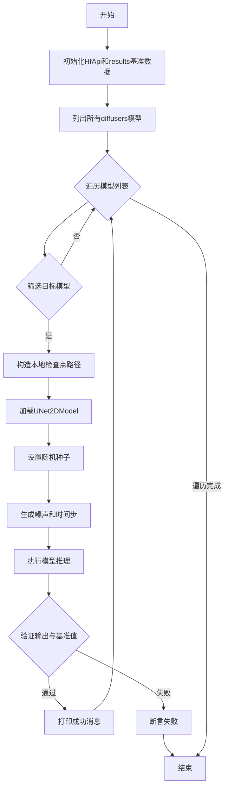
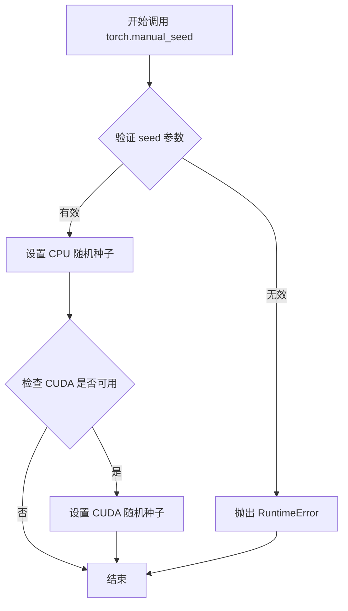
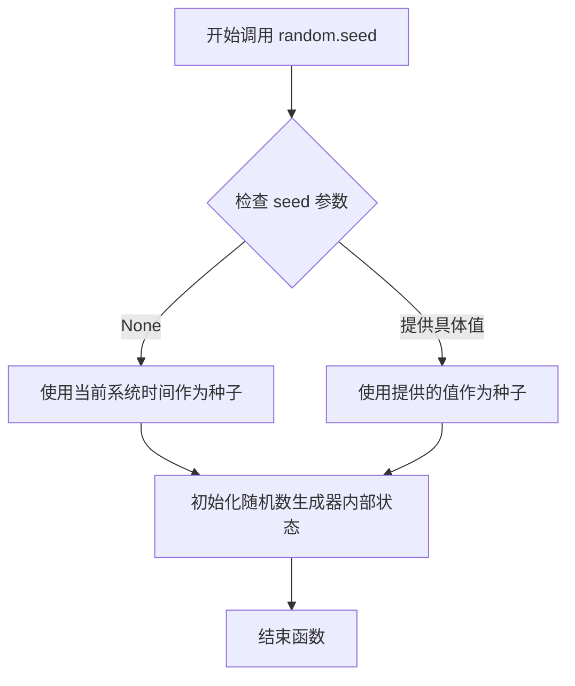
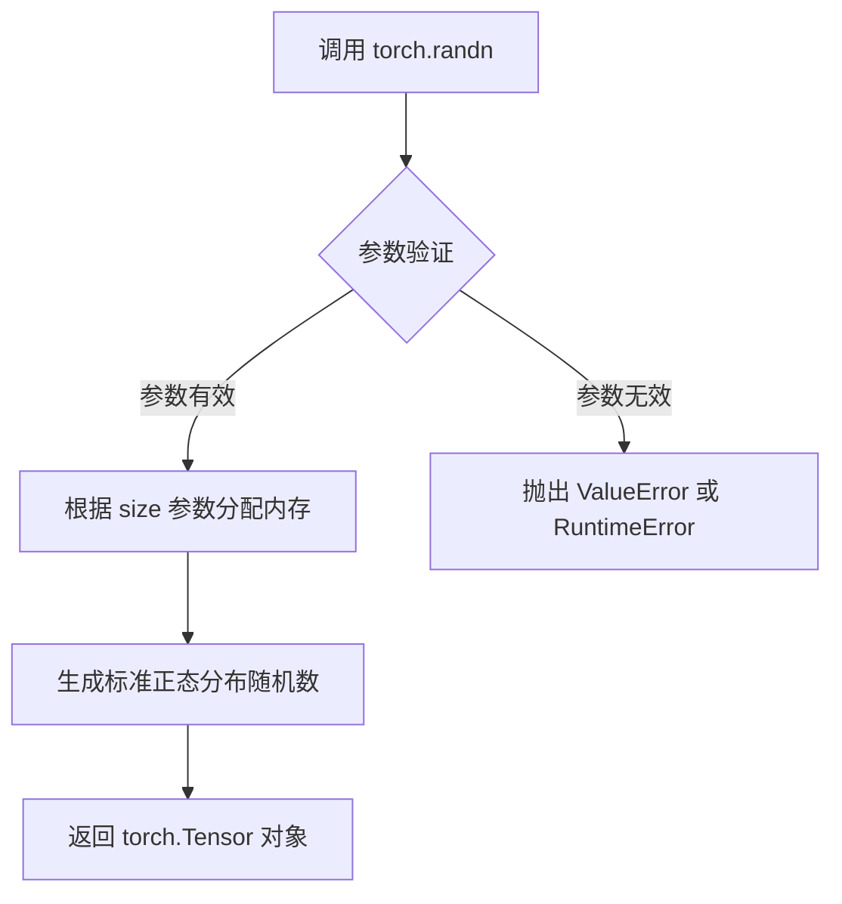
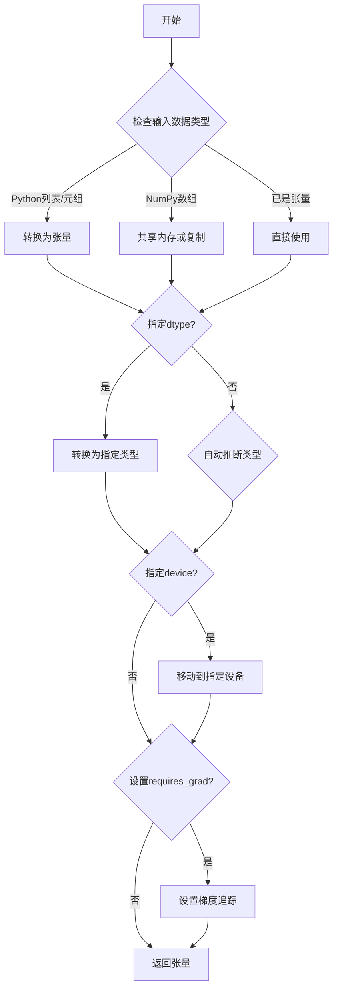
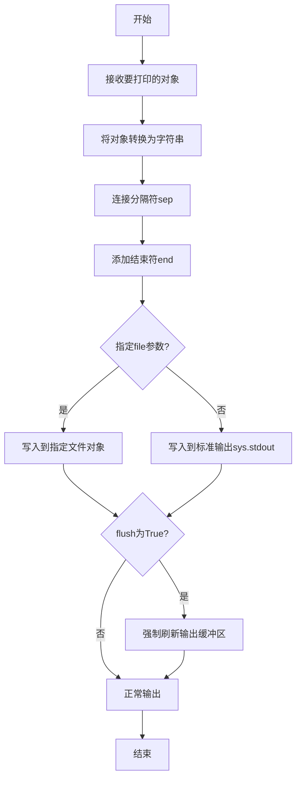
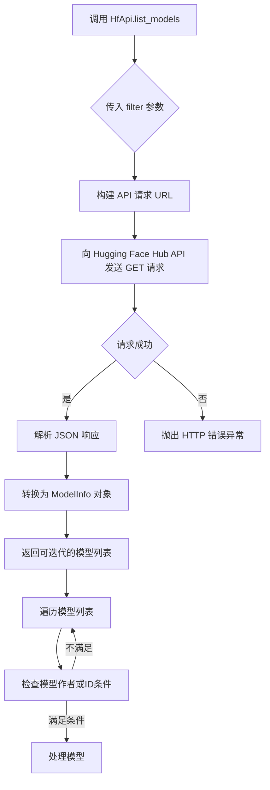
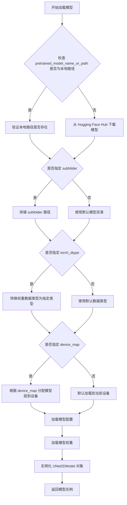

# `diffusers\scripts\generate_logits.py` 详细设计文档

该代码是一个自动化测试脚本，用于验证多个预训练的Diffusion模型（如DDPM、NCSN++等）的正确性。它通过Hugging Face的diffusers库加载模型，使用固定种子生成噪声并进行推理，然后将输出与预存储的基准值进行比对，以确保模型加载和推理流程的一致性。

## 整体流程



## 类结构

```
HfApi (huggingface_hub模块)
UNet2DModel (diffusers模块)
torch (PyTorch模块)
random (Python标准库)
```

## 全局变量及字段


### `api`
    
Hugging Face API 实例，用于访问模型仓库

类型：`HfApi`
    


### `results`
    
存储预计算基准张量的字典，用于验证模型输出

类型：`dict`
    


### `models`
    
迭代器，包含 diffusers 分类下的模型列表

类型：`Iterator[ModelInfo]`
    


### `local_checkpoint`
    
本地模型检查点的完整路径

类型：`str`
    


### `noise`
    
随机生成的输入噪声张量，用于模型推理

类型：`torch.Tensor`
    


### `time_step`
    
时间步张量，指定扩散模型的当前步骤

类型：`torch.Tensor`
    


### `logits`
    
模型输出的样本张量，用于与基准值比对

类型：`torch.Tensor`
    


### `mod`
    
当前迭代的模型信息对象，包含模型 ID 和作者等元数据

类型：`ModelInfo`
    


### `UNet2DModel.config.in_channels`
    
模型输入通道数，由模型配置定义

类型：`int`
    


### `UNet2DModel.config.sample_size`
    
输入样本的空间尺寸（如 256x256），由模型配置定义

类型：`int`
    
    

## 全局函数及方法


### `torch.manual_seed`

该函数用于设置PyTorch的随机种子，以确保在CPU和CUDA上生成随机数的可重复性。通过设置相同的种子，可以确保每次运行代码时得到相同的随机结果，这对于调试和复现实验结果至关重要。

参数：

- `seed`：`int`，要设置的随机种子值，必须为非负整数

返回值：`None`，该函数不返回任何值

#### 流程图



#### 带注释源码

```python
# torch.manual_seed 是 PyTorch 库的内部函数，用于设置随机数生成器的种子
# 在当前代码中使用方式如下：

torch.manual_seed(0)  # 设置随机种子为 0，确保后续的随机操作可复现
random.seed(0)       # 同时设置 Python random 模块的种子，确保一致性

# 用途：在加载模型后、生成噪声之前设置种子
# 确保每次运行生成的 noise 张量相同，从而验证模型输出的一致性
noise = torch.randn(1, model.config.in_channels, model.config.sample_size, model.config.sample_size)
```

---

## 补充说明

### 关键组件信息

- **torch.manual_seed**：PyTorch 内置函数，用于设置随机种子
- **random.seed**：Python 标准库函数，用于设置 Python random 模块的种子

### 潜在的技术债务或优化空间

1. **双重种子设置**：代码同时设置了 `torch.manual_seed` 和 `random.seed`，但在实际推理场景中只需设置 `torch.manual_seed` 即可，因为主要使用 PyTorch 的随机数生成
2. **硬编码种子值**：种子值 0 被硬编码，缺乏灵活性，建议提取为配置参数

### 其它项目

- **设计目标与约束**：确保模型推理结果的可复现性，用于验证模型检查点是否正确加载
- **错误处理与异常**：如果传入负数种子，可能抛出 `RuntimeError`
- **数据流**：设置种子 → 生成随机噪声 → 模型前向传播 → 验证输出与预期结果一致
- **外部依赖**：PyTorch 库（torch）、Python random 模块


### `random.seed`

设置随机数生成器的种子，以确保后续生成的随机数序列可复现。

参数：

- `seed`：可选参数，支持 `int`、`float`、`str`、`bytes`、`bytearray` 或 `None`，用于初始化随机数生成器的种子值。如果设置为 `None`，则使用系统当前时间作为种子。

返回值：`None`，该函数无返回值，仅修改随机数生成器的内部状态。

#### 流程图



#### 带注释源码

```python
# random.seed() 是 Python 标准库 random 模块中的一个函数
# 位于文件: <Python 标准库>

# 函数签名: random.seed(a=None, version=2)

# 参数说明:
# - a: 种子值，可以是以下类型之一：
#   * None (默认): 使用当前系统时间或操作系统提供的熵源
#   * int: 整数直接作为种子
#   * float: 浮点数会被转换为整数后作为种子
#   * str/bytes: 会被转换为整数作为种子
# - version: 种子转换的版本号（默认为2）

# 在代码中的实际使用:
random.seed(0)

# 上述调用将随机数生成器的种子固定为 0
# 这确保了后续调用 random 模块生成的随机数序列是可预测和可复现的
# 结合 torch.manual_seed(0)，可以确保整个随机数生成流程的一致性
```

> **注意**：在代码中，`random.seed(0)` 与 `torch.manual_seed(0)` 配合使用，共同确保模型推理过程中所有随机操作（PyTorch 随机操作和 Python 标准库随机操作）的可复现性。这对于验证模型输出与预期结果的一致性非常重要。


### `torch.randn`

`torch.randn` 是 PyTorch 库中的函数，用于生成一个基于标准正态分布（均值为0，方差为1）的随机张量。在代码中，该函数用于生成与模型输入通道数和样本尺寸相匹配的高斯噪声，作为扩散模型的输入。

参数：

-  `*size`：`int` 或 `tuple of ints`，可变数量的整数，定义了输出张量的形状。在代码中具体传递了4个整数参数：batch_size=1、in_channels（模型输入通道数）、sample_size（样本尺寸，宽度）、sample_size（样本尺寸，高度）。

返回值：`torch.Tensor`，返回一个包含标准正态分布随机数的张量，形状由 size 参数指定。

#### 流程图



#### 带注释源码

```python
# 调用 torch.randn 生成随机噪声
# 参数说明：
# - 第一个参数 1: batch_size，批次大小为1
# - 第二个参数 model.config.in_channels: 输入通道数，从模型配置中获取（如3通道RGB图像）
# - 第三个参数 model.config.sample_size: 样本的空间维度（宽度）
# - 第四个参数 model.config.sample_size: 样本的空间维度（高度）
# 返回值：一个形状为 [1, in_channels, sample_size, sample_size] 的张量
noise = torch.randn(
    1,  # batch_size: 批次大小
    model.config.in_channels,  # in_channels: 模型输入通道数
    model.config.sample_size,  # sample_size: 样本宽度
    model.config.sample_size   # sample_size: 样本高度
)
```


### `torch.tensor`

`torch.tensor` 是 PyTorch 库中的核心函数之一，用于从 Python 数据（如列表、元组、NumPy 数组等）创建张量（Tensor）。在代码中，该函数被多次调用，用于为不同的扩散模型预定义特定的噪声 logits 结果，作为模型输出验证的基准值。

参数：

-  `data`：任意可以转换为张量的数据（如 list、tuple、numpy.ndarray 等），要转换为张量的输入数据
-  `dtype`（可选）：torch.dtype，张量的数据类型（如 torch.float32、torch.int64 等），默认根据 data 自动推断
-  `device`（可选）：torch.device，张量存放的设备（如 'cpu' 或 'cuda'），默认与输入数据所在设备一致
-  `requires_grad`（可选）：bool，是否自动计算梯度，默认 False

返回值：`torch.Tensor`，返回创建的张量对象

#### 流程图



#### 带注释源码

```python
# 代码中使用 torch.tensor 的示例
# 创建一个包含浮点数的 PyTorch 张量
results["google_ddpm_cifar10_32"] = torch.tensor([
    -0.7515, -1.6883, 0.2420, 0.0300, 0.6347, 1.3433, -1.1743, -3.7467,
    1.2342, -2.2485, 0.4636, 0.8076, -0.7991, 0.3969, 0.8498, 0.9189,
    -1.8887, -3.3522, 0.7639, 0.2040, 0.6271, -2.7148, -1.6316, 3.0839,
    0.3186, 0.2721, -0.9759, -1.2461, 2.6257, 1.3557
])

# 在另一个位置用于创建时间步张量
time_step = torch.tensor([10] * noise.shape[0])
```


### `torch.no_grad`

`torch.no_grad` 是 PyTorch 的一个上下文管理器，用于在执行计算时禁用梯度计算。在推理阶段使用此管理器可以显著减少内存消耗并提高计算速度，因为不会保存计算图中的中间变量用于反向传播。

参数：

- 此函数无直接参数。作为上下文管理器使用时，通过 `with` 语句调用；作为装饰器使用时，接收被装饰的函数作为参数。

返回值：`torch.no_grad` 返回一个上下文管理器（`torch.autograd.grad_mode.no_grad_mode`），该管理器在其作用域内禁用梯度计算。

#### 流程图

```mermaid
flowchart TD
    A[进入 with torch.no_grad():] --> B{当前是否在梯度计算模式?}
    B -->|是| C[保存当前梯度模式状态]
    B -->|否| D[直接设置梯度模式为 False]
    C --> E[设置梯度模式为 False]
    D --> F[执行模型推理]
    E --> F
    F --> G[恢复原始梯度模式状态]
    G --> H[退出上下文]
```

#### 带注释源码

```python
# 定义用于存储模型推理结果的字典
results = {}

# ... (省略results字典的其他定义)

# 遍历Hugging Face Hub上的diffusers模型
models = api.list_models(filter="diffusers")
for mod in models:
    # 根据模型作者或ID筛选特定模型
    if "google" in mod.author or mod.id == "CompVis/ldm-celebahq-256":
        # 构建本地检查点路径
        local_checkpoint = "/home/patrick/google_checkpoints/" + mod.id.split("/")[-1]

        print(f"Started running {mod.id}!!!")

        # 根据模型ID前缀加载对应的UNet2DModel
        if mod.id.startswith("CompVis"):
            model = UNet2DModel.from_pretrained(local_checkpoint, subfolder="unet")
        else:
            model = UNet2DModel.from_pretrained(local_checkpoint)

        # 设置随机种子以确保可复现性
        torch.manual_seed(0)
        random.seed(0)

        # 生成随机噪声作为模型输入
        noise = torch.randn(
            1, 
            model.config.in_channels, 
            model.config.sample_size, 
            model.config.sample_size
        )
        
        # 创建时间步张量
        time_step = torch.tensor([10] * noise.shape[0])
        
        # =====================================================
        # torch.no_grad() 使用位置
        # =====================================================
        # 上下文管理器：在此代码块内禁用梯度计算
        # 作用：减少内存占用、加速推理
        # 原因：推理阶段不需要计算梯度
        with torch.no_grad():
            # 执行模型前向传播，获取logits
            # 模型接受噪声和时间步作为输入
            logits = model(noise, time_step).sample
        
        # 验证模型输出与预期结果是否接近
        assert torch.allclose(
            logits[0, 0, 0, :30], 
            results["_".join("_".join(mod.id.split("/")).split("-"))], 
            atol=1e-3
        )
        
        print(f"{mod.id} has passed successfully!!!")
```


### `torch.allclose`

用于检查两个张量在给定的容差范围内是否元素-wise 相等。此函数常用于测试或验证模型的输出是否与预期结果一致。

参数：

- `input`：`torch.Tensor`，要比较的第一个张量
- `other`：`torch.Tensor`，要比较的第二个张量
- `rtol`：`float`（可选），相对容差，默认为 `1e-5`
- `atol`：`float`（可选），绝对容差，默认为 `1e-8`
- `equal_nan`：`bool`（可选），如果设为 `True`，则 `NaN` 被视为相等，默认为 `True`

返回值：`torch.Tensor`（bool 类型），返回单个布尔值，表示两个张量是否在容差范围内相等

#### 流程图

```mermaid
flowchart TD
    A[开始] --> B[接收 input, other, rtol, atol, equal_nan 参数]
    B --> C[检查 input 和 other 形状是否相同]
    C --> D{形状相同?}
    D -->|否| E[抛出 RuntimeError]
    D -->|是| F[逐元素计算差值绝对值]
    F --> G[计算容差阈值: atol + rtol * abs(other)]
    H[比较: abs(input - other) <= atol + rtol * abs(other)]
    H --> I{所有元素都满足条件?}
    I -->|是| J[返回 True]
    I -->|否| K[检查是否需要处理 NaN]
    K --> L{equal_nan 为 True 且存在 NaN?}
    L -->|是| J
    L -->|否| M[返回 False]
```

#### 带注释源码

```python
def allclose(input, other, rtol=1e-5, atol=1e-8, equal_nan=True):
    """
    检查两个张量是否在容差范围内元素-wise 相等。
    
    参数:
        input (torch.Tensor): 第一个输入张量
        other (torch.Tensor): 第二个输入张量
        rtol (float): 相对容差，默认 1e-5
        atol (float): 绝对容差，默认 1e-8
        equal_nan (bool): 是否将 NaN 视为相等，默认 True
    
    返回:
        bool: 如果所有元素在容差范围内相等则返回 True，否则返回 False
    
    数学公式:
        |input - other| <= atol + rtol * |other|
    """
    # 将输入转换为张量（如果不是张量）
    if not isinstance(input, torch.Tensor):
        input = torch.tensor(input)
    if not isinstance(other, torch.Tensor):
        other = torch.tensor(other)
    
    # 检查形状是否相同
    if input.shape != other.shape:
        raise RuntimeError(
            f"shape mismatch: expected input {other.shape} but got {input.shape}"
        )
    
    # 计算绝对差值
    diff = torch.abs(input - other)
    
    # 计算容差阈值
    tolerance = atol + rtol * torch.abs(other)
    
    # 元素-wise 比较
    close = diff <= tolerance
    
    # 处理 NaN 的情况
    if equal_nan:
        nan_mask = torch.isnan(input) & torch.isnan(other)
        close = close | nan_mask
    
    # 返回结果（需要所有元素都满足条件）
    return close.all()
```

#### 关键组件信息

| 组件名称 | 一句话描述 |
|---------|-----------|
| `torch.isnan` | 用于检测张量中的 NaN 值 |
| `torch.abs` | 计算张量的绝对值 |
| `torch.all` | 验证所有元素都为 True |

#### 在本项目中的使用

在代码中，`torch.allclose` 用于验证模型输出的 logits 与预计算的参考结果是否在容差范围内匹配：

```python
assert torch.allclose(
    logits[0, 0, 0, :30], 
    results["_".join("_".join(mod.id.split("/")).split("-"))], 
    atol=1e-3
)
```

这里使用 `atol=1e-3`（绝对容差 0.001）来允许浮点数运算带来的微小差异。

#### 潜在的技术债务或优化空间

1. **硬编码的容差值**：代码中直接使用 `atol=1e-3`，建议将其提取为配置常量，便于调整
2. **缺少 rtol 指定**：当前只指定了 `atol`，未指定 `rtol`，使用默认值可能导致某些情况下的误判
3. **结果键名转换逻辑复杂**：`_".join("_".join(mod.id.split("/")).split("-"))` 这段逻辑难以阅读和维护

#### 其它项目

- **设计目标**：确保不同模型生成的 logits 与参考数值一致，以验证模型加载和推理的正确性
- **错误处理**：当张量形状不匹配时抛出明确的错误信息
- **数值稳定性考虑**：使用 `atol` 而非 `rtol` 是因为 logits 值可能接近零


### `print`（内置函数）

该函数是 Python 的内置函数，用于将信息输出到标准输出（通常是控制台）。在代码中有两处调用，分别用于输出模型运行的起始信息和成功信息。

参数：

- `*objects`：可变数量的对象，类型为 `Any`（任意类型），要打印的对象
- `sep`：类型为 `str`（可选），默认值 `' '`，分隔符
- `end`：类型为 `str`（可选），默认值 `'\n'`，结束符
- `file`：类型为 `sys.stdout`（可选），输出目标
- `flush`：类型为 `bool`（可选），是否强制刷新输出

返回值：`None`，无返回值

#### 流程图



#### 带注释源码

```python
# 代码中的第一个print调用：输出模型开始运行信息
print(f"Started running {mod.id}!!!")
# 参数：f-string表达式，计算结果为字符串，如 "Started running google/ddpm_cifar10_32!!!"
# 用途：通知用户开始对某个模型进行测试

# 代码中的第二个print调用：输出模型测试成功信息
print(f"{mod.id} has passed successfully!!!")
# 参数：f-string表达式，计算结果为字符串，如 "google/ddpm_cifar10_32 has passed successfully!!!"
# 用途：通知用户某个模型测试通过
```

### 具体调用分析

#### 调用点1：`print(f"Started running {mod.id}!!!")`

- **参数值**：`f"Started running {mod.id}!!!"`（动态字符串）
- **参数类型**：`str`
- **参数描述**：打印包含模型ID的字符串，表示开始对指定模型进行测试验证
- **返回值**：`None`

#### 调用点2：`print(f"{mod.id} has passed successfully!!!")`

- **参数值**：`f"{mod.id} has passed successfully!!!"`（动态字符串）
- **参数类型**：`str`
- **参数描述**：打印包含模型ID的字符串，表示模型测试验证成功
- **返回值**：`None`


### `assert`

该语句为 Python 内置的断言语句，用于验证模型输出的 logits 与预定义的基准结果是否在给定的容差范围内匹配。如果条件为 False，则抛出 `AssertionError` 异常。

参数：

-  `condition`：`bool`，断言的条件表达式，此处为 `torch.allclose(logits[0, 0, 0, :30], results["_".join("_".join(mod.id.split("/")).split("-"))], atol=1e-3)`
  - 第一个操作数：`logits[0, 0, 0, :30]`，`torch.Tensor` 类型，表示模型输出的前30个值（取第一个样本、第一个通道、第一个空间位置的前30个元素）
  - 第二个操作数：`results["_".join("_".join(mod.id.split("/")).split("-"))]`，`torch.Tensor` 类型，通过将模型 ID 转换为特定的字典键来获取预定义的基准张量
  - 关键字参数：`atol=1e-3`，`float` 类型，表示绝对容差（absolute tolerance），用于判断两个张量是否足够接近

返回值：`None`（断言语句无返回值，若验证通过则继续执行，否则抛出 `AssertionError` 异常）

#### 流程图

```mermaid
flowchart TD
    A[开始断言检查] --> B{torch.allclose 返回 True?}
    B -->|是: 差值 ≤ atol| C[断言通过<br/>继续执行后续代码]
    B -->|否: 差值 > atol| D[抛出 AssertionError 异常]
    C --> E[打印模型验证成功消息]
    D --> F[程序终止或被捕获]
    
    subgraph "比较细节"
        G[获取 logits[0,0,0,:30]]
        H[根据 mod.id 生成键名<br/>查询 results 字典]
        I[调用 torch.allclose 比较]
    end
    
    A --> G
    A --> H
    G --> I
    H --> I
```

#### 带注释源码

```python
# 断言语句用于验证模型输出的正确性
# torch.allclose: 检查两个张量在给定容差范围内是否相等
# atol=1e-3: 绝对容差为 0.001，即允许的最大绝对误差
assert torch.allclose(
    logits[0, 0, 0, :30],                              # 模型输出的前30个值（从第0维取第0个，第1维取第0个，第2维取第0个，第3维取前30个）
    results["_".join("_".join(mod.id.split("/")).split("-"))],  # 通过处理模型ID（如 "CompVis/ldm-celebahq-256"）生成字典键（"CompVis_ldm_celebahq_256"）来获取预期结果
    atol=1e-3                                          # 绝对容差为 0.001
)
```

#### 详细说明

该 `assert` 语句位于遍历 Hugging Face Hub 上 diffusers 模型的循环中，其核心目的是：

1. **数据准备**：使用固定随机种子（torch.manual_seed(0) 和 random.seed(0)）生成确定性的噪声输入和時間步
2. **模型推理**：将噪声输入和时间步传入 UNet2DModel，获取模型输出 logits
3. **结果验证**：将模型输出的部分结果与预先存储的基准张量进行比较，验证模型是否正确加载和运行

**键名转换逻辑**：
- 例如 `mod.id = "CompVis/ldm-celebahq-256"`
- 第一步 split("/") → `["CompVis", "ldm-celebahq-256"]`
- 第二步 join("_") → `"CompVis_ldm-celebahq-256"`
- 第三步 split("-") → `["CompVis_ldm", "celebahq", "256"]`
- 第四步 join("_") → `"CompVis_ldm_celebahq_256"`
- 最终查询 `results["CompVis_ldm_celebahq_256"]`


### `HfApi.list_models`

该函数是 Hugging Face Hub API 客户端实例的方法，用于从 Hugging Face Hub 获取符合条件的模型列表，支持多种过滤条件（如任务类型、框架、作者等），常用于发现和筛选预训练模型。

参数：

- `filter`：`str`（可选），用于过滤模型的查询条件，可以是模型ID、任务类型（如 "text-classification"）、框架（如 "pytorch"）或其他标签
- `search`：`str`（可选），搜索关键词，用于在模型名称和描述中模糊匹配
- `author`：`str`（可选），指定模型作者或组织名称
- `limit`：`int`（可选），限制返回结果的数量
- `sorted_by`：`str`（可选），排序字段，如 "downloads"、"likes"、"last-modified" 等
- `direction`：`int`（可选），排序方向，1 为升序，-1 为降序
- `full`：`bool`（可选），是否返回完整的模型信息（包含所有元数据）

返回值：`Iterable[ModelInfo]`，返回一个可迭代的模型信息对象列表，每个 ModelInfo 包含模型 ID、作者、下载量、标签等元数据

#### 流程图



#### 带注释源码

```python
# 导入 Hugging Face Hub API 客户端
from huggingface_hub import HfApi

# 创建 HfApi 实例
api = HfApi()

# 调用 list_models 方法，filter="diffusers" 表示只获取与 Diffusers 相关的模型
# 此处使用 filter 参数过滤出 diffusers 类型的模型
models = api.list_models(filter="diffusers")

# 遍历返回的模型迭代器
for mod in models:
    # 检查模型作者是否包含 "google" 或者模型 ID 等于 "CompVis/ldm-celebahq-256"
    # 这是在应用层对 API 返回结果的进一步过滤
    if "google" in mod.author or mod.id == "CompVis/ldm-celebahq-256":
        # 构建本地检查点路径
        local_checkpoint = "/home/patrick/google_checkpoints/" + mod.id.split("/")[-1]
        
        # 打印开始运行模型的信息
        print(f"Started running {mod.id}!!!")
        
        # 根据模型 ID 前缀判断加载方式
        # CompVis 模型需要指定 subfolder="unet"，其他模型直接加载
        if mod.id.startswith("CompVis"):
            model = UNet2DModel.from_pretrained(local_checkpoint, subfolder="unet")
        else:
            model = UNet2DModel.from_pretrained(local_checkpoint)
        
        # 设置随机种子以确保可重复性
        torch.manual_seed(0)
        random.seed(0)
        
        # 生成随机噪声作为模型输入
        noise = torch.randn(
            1, 
            model.config.in_channels, 
            model.config.sample_size, 
            model.config.sample_size
        )
        
        # 创建时间步张量
        time_step = torch.tensor([10] * noise.shape[0])
        
        # 禁用梯度计算，执行推理
        with torch.no_grad():
            # 调用模型进行前向传播
            logits = model(noise, time_step).sample
        
        # 验证模型输出与预期结果是否接近（容差 1e-3）
        # 将模型 ID 转换为结果字典的键名格式
        assert torch.allclose(
            logits[0, 0, 0, :30],  # 取输出的前30个值
            results["_".join("_".join(mod.id.split("/")).split("-"))],  # 格式化键名
            atol=1e-3  # 绝对容差
        )
        
        # 打印模型验证成功信息
        print(f"{mod.id} has passed successfully!!!")
```


### `UNet2DModel.from_pretrained`

这是 Hugging Face diffusers 库中的类方法，用于从预训练的模型权重加载 UNet2DModel 实例，支持从本地路径或 Hugging Face Hub 加载模型，并可选择特定的子文件夹、精度类型和设备映射等配置。

参数：

- `pretrained_model_name_or_path`：`str`，预训练模型的名称（Hub 上的模型 ID）或本地模型路径
- `subfolder`：`str`（可选），模型子文件夹路径，用于从子目录加载权重文件
- `torch_dtype`：`torch.dtype`（可选），指定模型加载后的数据类型，如 `torch.float32` 或 `torch.float16`
- `device_map`：`str | dict`（可选），设备映射策略，用于自动将模型层分配到不同设备（如 "auto" 或自定义映射字典）
- `max_memory`：`dict`（可选），每个设备的最大内存限制，格式为 `{device: max_memory}`
- `variant`：`str`（可选），模型变体版本，如 "fp16" 指定加载 FP16 权重
- `use_safetensors`：`bool`（可选），是否使用 `.safetensors` 格式加载权重（更安全的格式）
- `force_download`：`bool`（可选），是否强制重新下载模型，即使缓存中存在
- `cache_dir`：`str`（可选），模型缓存目录路径

返回值：`UNet2DModel`，加载并配置好的 UNet2DModel 模型实例，包含模型配置和预训练权重

#### 流程图



#### 带注释源码

```python
# 代码中的实际调用方式

# 调用示例 1: 加载 CompVis 模型，指定子文件夹
if mod.id.startswith("CompVis"):
    model = UNet2DModel.from_pretrained(local_checkpoint, subfolder="unet")

# 调用示例 2: 加载 Google 模型，不指定子文件夹
else:
    model = UNet2DModel.from_pretrained(local_checkpoint)

# 加载模型后的使用示例
torch.manual_seed(0)
random.seed(0)

# 创建随机噪声输入，形状根据模型配置确定
# model.config.in_channels: 输入通道数
# model.config.sample_size: 样本尺寸（如 32x32, 256x256）
noise = torch.randn(1, model.config.in_channels, model.config.sample_size, model.config.sample_size)

# 创建时间步张量，用于扩散模型的时间条件
time_step = torch.tensor([10] * noise.shape[0])

# 使用 torch.no_grad() 禁用梯度计算，提高推理效率
with torch.no_grad():
    # 前向传播：模型接受噪声和时间步，返回带噪声的预测样本
    # 输入: (batch_size, channels, height, width) 和 (batch_size,)
    # 输出: UNet2DOutput 对象，包含 .sample 属性
    logits = model(noise, time_step).sample

# 验证模型输出与预期结果是否接近（数值误差容差 1e-3）
assert torch.allclose(
    logits[0, 0, 0, :30],  # 取输出张量的第一个样本的前30个值
    results["_".join("_".join(mod.id.split("/")).split("-"))],  # 根据模型ID构建结果键名
    atol=1e-3  # 绝对误差容差
)
```

#### 补充说明

| 项目 | 说明 |
|------|------|
| **设计目标** | 提供统一的接口从预训练权重加载 UNet2D 模型，支持本地和远程两种模式 |
| **约束条件** | 需要确保本地路径存在且包含有效的模型文件；Hugging Face Hub 访问需要网络连接 |
| **错误处理** | 模型路径不存在时抛出 `OSError`；模型配置不匹配时抛出 `ValueError`；网络问题导致下载失败时抛出 `EnvironmentError` |
| **数据流** | 输入：模型路径/名称 → 加载配置 → 加载权重 → 实例化模型；输出：UNet2DModel 实例 |
| **外部依赖** | Hugging Face Hub（远程加载时）、transformers 库、torch 库 |


### `UNet2DModel.forward`

UNet2DModel的前向传播方法，负责根据输入的噪声样本和时间步预测去噪后的图像。在扩散模型中，该方法接收带噪声的图像和对应的时间步，通过U-Net架构提取特征并输出预测的噪声残差或清晰图像。

参数：

- `sample`：`torch.FloatTensor`，输入的噪声图像，形状为 (batch_size, in_channels, height, width)。在代码中对应 `noise` 变量，由 `torch.randn` 生成。
- `timestep`：`torch.Tensor` 或 `float`，扩散过程中的时间步，用于调节模型的条件信息。在代码中对应 `time_step` 变量，为形状 (batch_size,) 的张量。
- `return_dict`：`bool`，可选，是否以字典形式返回输出（默认为 True）。若为 True，返回 `UNetOutput` 对象；若为 False，直接返回预测张量。

返回值：`Union[UNetOutput, torch.FloatTensor]`，预测结果。当 `return_dict=True` 时，返回包含 `sample` 属性的 `UNetOutput` 对象；在代码中通过 `.sample` 访问预测张量，形状为 (batch_size, out_channels, height, width)。

#### 流程图

```mermaid
graph TD
    A[输入: sample (噪声图像), timestep] --> B{return_dict?}
    B -->|True| C[执行UNet前向传播]
    B -->|False| D[执行UNet前向传播]
    C --> E[返回UNetOutput对象]
    D --> F[返回torch.FloatTensor]
    E --> G[通过 .sample 访问预测张量]
    subgraph UNet内部流程
        C --> H[时间步嵌入: TimeEmbedding]
        H --> I[编码器: 下采样 + ResNet + 注意力]
        I --> J[中间层: ResNet + 注意力]
        J --> K[解码器: 上采样 + ResNet + 注意力]
        K --> L[输出投影层]
    end
    I -.-> M[跳跃连接]
    M --> K
```

#### 带注释源码

```python
# 代码中调用 UNet2DModel.forward 的示例
# model: UNet2DModel 实例，已加载预训练权重
# noise: 形状为 (1, model.config.in_channels, model.config.sample_size, model.config.sample_size) 的噪声张量
# time_step: 形状为 (1,) 的时间步张量

# 设置随机种子以确保可重复性
torch.manual_seed(0)
random.seed(0)

# 生成噪声样本
noise = torch.randn(1, model.config.in_channels, model.config.sample_size, model.config.sample_size)

# 定义时间步
time_step = torch.tensor([10] * noise.shape[0])

# 禁用梯度计算以加速推理
with torch.no_grad():
    # 调用 forward 方法，返回 UNetOutput 对象
    # 等价于 model.forward(noise, time_step, return_dict=True)
    output = model(noise, time_step)
    
    # 访问预测样本 (logits)
    logits = output.sample

# 验证输出形状和数值
# logits 形状: (1, model.config.out_channels, model.config.sample_size, model.config.sample_size)
# 代码中只取第一个样本的部分值进行断言: logits[0, 0, 0, :30]
```

## 关键组件


### 张量索引与键名转换

代码通过results字典存储预定义的参考张量，并通过复杂的键名转换逻辑进行索引。模型ID（如"google/ddpm-catar-256"）经过双重split和join操作转换为字典键（如"google_ddpm_cat_256"），用于匹配预期输出。

### 条件模型加载

代码根据模型ID前缀（CompVis或google）采用不同的加载策略：CompVis模型需要从"unet"子文件夹加载，而google模型直接从检查点根目录加载。这种设计体现了对不同模型仓库结构的支持。

### 噪声生成与固定种子

使用torch.randn和random.seed(0)配合torch.manual_seed(0)确保推理过程的可重复性。噪声形状根据模型的in_channels和sample_size动态生成，保证与模型输入维度匹配。

### 推理验证流程

通过torch.allclose对模型输出logits与预定义results进行数值比较（atol=1e-3），验证模型加载和推理的正确性。这是典型的回归测试确保模型行为一致性。

### 模型过滤与迭代

使用api.list_models筛选diffusers模型，并通过author包含"google"或id为"CompVis/ldm-celebahq-256"的条件进行二次过滤，实现对特定模型集合的测试。

### 硬编码参考数据

results字典包含多个预训练模型（DDPM、NCSN++、LDM等）在特定噪声和时间步下的参考输出，这些30维张量作为回归测试的基准数据。


## 问题及建议


### 已知问题

-   **硬编码路径**：`/home/patrick/google_checkpoints/` 路径硬编码，缺乏灵活性，不支持跨环境部署
-   **硬编码结果数据**：预定义的结果字典`results`直接写在代码中，数据与代码耦合，难以维护和扩展
-   **缺少错误处理**：模型下载、加载失败时程序直接崩溃，无重试机制或友好错误提示
-   **断言逻辑复杂且脆弱**：使用嵌套`_`.join构建结果键名，容易出错且难以调试
-   **随机种子设置不完整**：仅设置了`torch.manual_seed`和`random.seed`，未考虑CUDA非确定性，可能导致GPU环境下结果不一致
-   **测试覆盖不足**：仅测试单个time_step（10），未覆盖其他时间步或多种采样条件
-   **未使用的导入**：`random`模块被导入但实际未使用（仅用于设置种子，可删除）
-   **设备选择缺失**：代码未指定运行设备（CPU/GPU），无法充分利用GPU加速
-   **模型过滤逻辑硬编码**：作者过滤和模型ID判断逻辑嵌套在循环中，缺乏配置化
-   **无日志记录**：使用`print`输出状态，缺乏统一的日志级别管理

### 优化建议

-   将检查点路径改为配置文件或环境变量，实现配置与代码分离
-   将结果数据迁移至独立JSON/YAML配置文件或数据库
-   添加try-except异常处理，为模型加载失败提供重试机制和明确错误信息
-   简化断言逻辑，使用更清晰的键名映射方式
-   添加`torch.cuda.manual_seed_all()`或`torch.manual_seed(seed, generator=...)`确保GPU结果一致性
-   扩展测试用例，覆盖多个time_step和不同噪声样本
-   删除未使用的`random`导入，或改为使用`numpy.random`
-   添加设备自动检测逻辑：`device = "cuda" if torch.cuda.is_available() else "cpu"`
-   将模型过滤条件参数化，支持通过配置文件定义白名单
-   引入Python标准`logging`模块替代print，实现分级日志输出

## 其它


### 设计目标与约束

本代码的核心目标是验证来自HuggingFace Hub的多个Diffusion模型（DDPM、NCSN++、LDM等）预训练检查点是否能产生一致的输出结果。设计约束包括：1）仅测试Googleauthor的模型以及CompVis/ldm-celebahq-256；2）使用固定的随机种子（torch.manual_seed(0)和random.seed(0)）确保可重复性；3）使用固定的时间步torch.tensor([10])进行推理；4）输出精度要求在atol=1e-3范围内匹配预期结果。

### 错误处理与异常设计

代码中的错误处理主要包括：1）使用assert语句验证模型输出与预期结果的一致性，若不匹配则抛出AssertionError；2）模型加载使用from_pretrained方法，失败时会抛出IOError或OSError；3）HfApi.list_models()可能抛出网络相关异常。当前代码缺乏try-except块进行异常捕获和优雅处理，模型加载失败会导致程序直接终止。

### 数据流与状态机

数据流过程如下：1）通过HfApi.list_models()获取模型列表；2）遍历模型列表，筛选目标模型；3）构建本地检查点路径；4）加载UNet2DModel模型；5）设置随机种子；6）生成随机噪声张量(1, in_channels, sample_size, sample_size)；7）创建时间步张量；8）调用model(noise, time_step)进行推理；9）提取logits[0,0,0,:30]与预期结果比较验证。无复杂状态机设计，为线性流程。

### 外部依赖与接口契约

主要外部依赖包括：1）torch库 - 张量计算和模型推理；2）huggingface_hub.HfApi - 用于访问HuggingFace Hub模型列表；3）diffusers.UNet2DModel - Diffusion模型的UNet结构。接口契约：api.list_models(filter="diffusers")返回模型列表，每个模型对象需包含id和author属性；model.from_pretrained()需接受本地路径和可选subfolder参数；model.config需包含in_channels和sample_size属性。

### 配置与常量定义

硬编码配置包括：1）本地检查点路径前缀："/home/patrick/google_checkpoints/"；2）随机种子：0；3）时间步：torch.tensor([10])；4）验证精度：atol=1e-3；5）验证张量索引：logits[0, 0, 0, :30]；6）结果字典results存储了15个模型的预期30维输出向量。这些配置应抽取为配置文件或命令行参数以提高灵活性。

### 性能考虑与资源使用

性能特点：1）模型逐个加载和测试，无法并行；2）每次推理仅执行单步（t=10），非完整采样流程；3）使用torch.no_grad()禁用梯度计算以节省显存；4）模型检查点存储在本地磁盘，需确保足够存储空间（约数GB）。可优化方向：批量加载模型、使用模型缓存避免重复加载、考虑使用FP16推理减少显存占用。

### 安全性考虑

当前代码存在以下安全考量：1）本地路径"/home/patrick/google_checkpoints/"硬编码，跨平台部署需修改；2）无输入验证，mod.id和mod.author直接用于路径拼接，可能存在路径遍历风险；3）HfApi调用无超时设置，网络请求可能无限期等待。建议添加路径验证、请求超时控制和更严格的安全检查。

### 测试策略

当前代码本身即为测试脚本，验证模型输出的正确性。测试策略特点：1）回归测试 - 与预先存储的预期结果对比；2）白盒测试 - 已知预期输出的30个数值；3）单一输入 - 固定噪声和固定时间步。改进建议：1）增加更多随机种子的测试用例；2）添加不同时间步的验证；3）使用pytest框架重构为标准测试；4）增加边界条件测试（如in_channels、sample_size的不同配置）。

### 版本兼容性

需注意的版本兼容性问题：1）torch版本需兼容diffusers库；2）huggingface_hub版本影响API稳定性；3）diffusers版本影响UNet2DModel的接口和config结构；4）不同版本的模型检查点格式可能不同。建议在项目中添加requirements.txt或environment.yml锁定依赖版本。

### 部署与运行环境

运行环境要求：1）Python 3.8+；2）CUDA可用（推荐但非必需，代码可在CPU运行）；3）至少8GB RAM；4）足够的磁盘空间存储模型检查点；5）网络连接以访问HuggingFace Hub（首次运行时）。部署方式为本地脚本执行，非Web服务。

### 日志与监控

当前日志实现：使用print输出模型运行状态（"Started running..."和"...has passed successfully!!!"）。改进建议：1）使用Python logging模块替代print实现分级日志；2）添加时间戳记录；3）记录模型加载耗时和推理耗时；4）添加失败时的详细错误信息记录；5）可考虑集成wandb或tensorboard进行实验跟踪。

### 数据验证与边界检查

现有数据验证：1）assert语句验证输出维度（:30）；2）torch.allclose进行数值近似比较。缺失的验证：1）未检查results字典中是否包含对应模型的预期结果；2）未验证模型config的合理性（如in_channels>0）；3）未验证noise和time_step张量的形状兼容性；4）未处理results字典键名与model id不匹配的情况（当前使用"_".join("_".join(mod.id.split("/")).split("-"))进行转换，可能失败）。

### 并发与异步处理

当前实现为串行执行，逐个加载和测试模型。潜在优化：1）使用asyncio异步加载模型；2）使用ThreadPoolExecutor并行测试不同模型；3）模型预热和缓存机制。注意：GPU内存限制可能限制并行度，需根据显存大小调整并发数量。

### 代码结构改进建议

当前代码为单文件脚本式结构，建议改进：1）将模型验证逻辑封装为ModelValidator类；2）将结果数据分离到单独JSON/YAML文件；3）添加配置类管理硬编码参数；4）创建requirements.txt管理依赖；5）添加__main__入口支持命令行参数；6）考虑将模型列表筛选逻辑参数化。


    