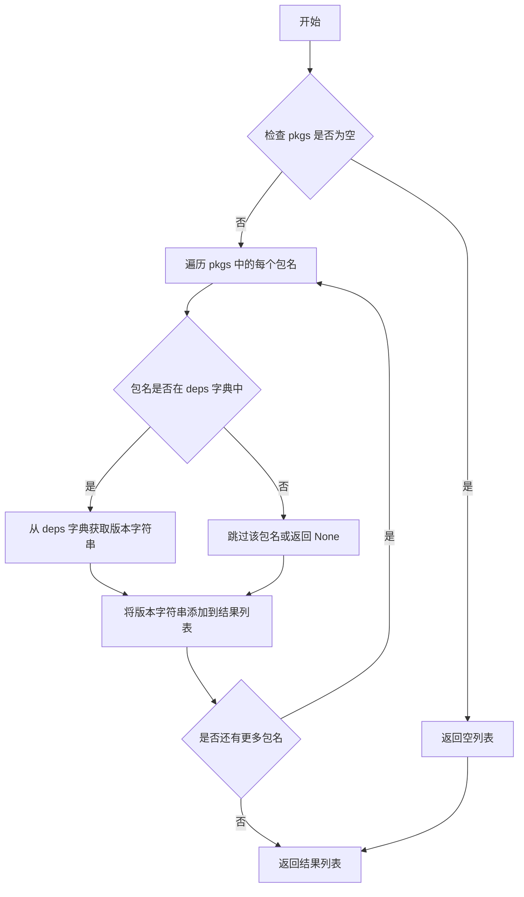
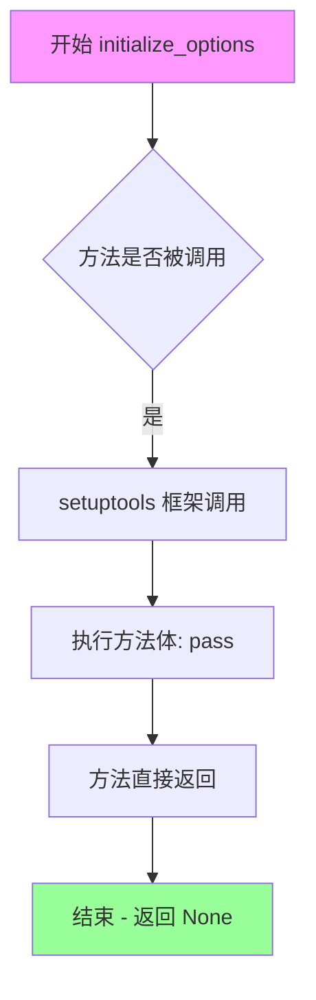
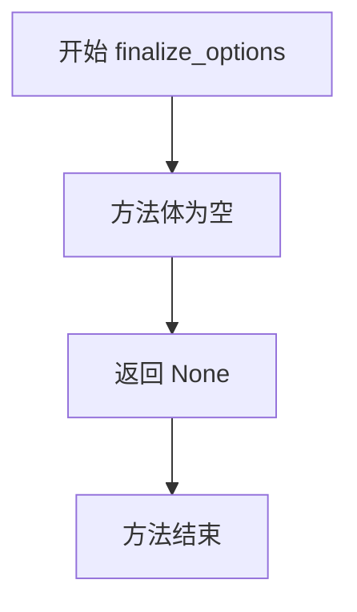

# `diffusers\setup.py` 详细设计文档

这是 diffusers 项目的构建配置文件（setup.py），主要用于定义项目的元数据、核心及可选依赖、平台特定的依赖组合，并实现了一个自定义命令类 `DepsTableUpdateCommand` 用于自动生成依赖版本查找表。

## 整体流程

```mermaid
graph TD
    Start[开始] --> Import[导入模块: os, re, sys, setuptools]
    Import --> DefineDepsList[定义原始依赖列表 _deps]
    DefineDepsList --> ParseDeps[解析依赖生成查找表 deps]
    ParseDeps --> DefineFunc[定义辅助函数 deps_list]
    DefineFunc --> DefineClass[定义自定义命令类 DepsTableUpdateCommand]
    DefineClass --> BuildExtras[构建额外依赖组 extras (quality, docs, training, etc.)]
    BuildExtras --> CheckOS{检查操作系统是否为 Windows}
    CheckOS -- 是 --> ExcludeFlax[extras['flax'] = [] (Windows不支持JAX)]
    CheckOS -- 否 --> IncludeFlax[extras['flax'] = deps_list('jax'...]
    IncludeFlax --> BuildInstallRequires[构建核心依赖列表 install_requires]
    ExcludeFlax --> BuildInstallRequires
    BuildInstallRequires --> CallSetup[调用 setup() 函数配置项目]
    CallSetup --> End[结束: 打包配置完成]
```

## 类结构

```
Command (setuptools 基类)
└── DepsTableUpdateCommand (自定义命令实现类)
```

## 全局变量及字段


### `_deps`
    
包含所有项目依赖的列表，每个元素为带版本要求的依赖字符串

类型：`list`
    


### `deps`
    
将_deps列表转换后的字典，键为包名，值为完整的依赖规范字符串

类型：`dict`
    


### `extras`
    
可选依赖组的字典，用于定义不同功能模块的额外依赖（如quality、docs、training等）

类型：`dict`
    


### `install_requires`
    
安装时必须的核心依赖列表，不包含可选依赖

类型：`list`
    


### `version_range_max`
    
根据Python版本计算的最大版本范围值，用于setuptools分类器

类型：`int`
    


### `DepsTableUpdateCommand.description`
    
命令的描述文本，说明该命令用于构建运行时依赖表

类型：`str`
    


### `DepsTableUpdateCommand.user_options`
    
命令行选项列表，包含每个选项的元组格式配置

类型：`list`
    
    

## 全局函数及方法


### `deps_list`

该函数是一个工具函数，用于根据传入的包名列表，从预先生成的依赖版本字典中查找并返回对应的版本字符串列表。主要用于构建 `extras_require` 字典，为 `setup()` 函数的 `extras_require` 参数提供值。

参数：

- `*pkgs`：`str`，可变参数，接受一个或多个包名（字符串），表示需要查询版本的包名列表

返回值：`list`，返回包含对应包版本字符串的列表，列表中元素的顺序与传入的 `pkgs` 参数顺序一致

#### 流程图



#### 带注释源码

```python
def deps_list(*pkgs):
    """
    根据传入的包名列表，从全局 deps 字典中查找对应的版本字符串。
    
    参数:
        *pkgs: 可变数量的包名参数，每个参数应为字符串类型
        
    返回值:
        list: 包含对应包版本字符串的列表
    """
    # 使用列表推导式遍历所有传入的包名，从 deps 字典中获取对应的版本字符串
    # deps 字典的键为包名，值为版本要求字符串
    # 例如: deps_list("torch", "transformers") -> ["torch>=1.4", "transformers>=4.41.2"]
    return [deps[pkg] for pkg in pkgs]
```


### `DepsTableUpdateCommand.initialize_options`

该方法是 `DepsTableUpdateCommand` 类的实例方法，用于初始化命令行选项。在 setuptools 框架中，此方法在命令选项解析之前被调用，用于设置用户选项的默认值。当前实现为空（pass），表示不设置任何自定义默认值，依赖 setuptools 的基类默认行为。

参数：
- `self`：`DepsTableUpdateCommand` 类型，命令类实例本身

返回值：`None` 类型，该方法不返回任何值，仅作为 setuptools 命令生命周期的钩子存在

#### 流程图



#### 带注释源码

```python
def initialize_options(self):
    """
    初始化命令选项的钩子方法。
    
    在 setuptools 的 Command 框架中，此方法在选项解析之前被调用，
    用于设置用户定义选项的默认值。
    当前实现为空，因为该命令不需要自定义选项默认值。
    
    Args:
        self: DepsTableUpdateCommand 实例
        
    Returns:
        None
    """
    pass  # 空实现，不设置任何自定义选项默认值
```


### `DepsTableUpdateCommand.finalize_options`

该方法是 `DepsTableUpdateCommand` 类的一部分，用于完成命令选项的最终配置。它是 setuptools Command 生命周期中的标准方法，当前实现为空操作（pass），仅用于满足基类接口要求，不执行任何实际逻辑。

参数：

- `self`：隐式参数，`DepsTableUpdateCommand` 类的实例，用于访问类属性和方法

返回值：`None`，无返回值

#### 流程图



#### 带注释源码

```python
def finalize_options(self):
    """
    完成命令选项的最终配置。
    
    这是 setuptools Command 类的标准生命周期方法之一，在 initialize_options() 之后、
    run() 之前被调用。用于处理用户通过命令行传递的选项并进行最终验证或设置。
    
    当前实现为空，因为该命令不需要处理任何用户选项（user_options 仅用于声明选项，
    但不需要在此方法中进行处理）。
    
    参数:
        无额外的参数（self 为隐式参数）
    
    返回值:
        无返回值（返回 None）
    """
    pass
```


### `DepsTableUpdateCommand.run`

该方法为 `setuptools.Command` 的子类方法，核心功能是将 `_deps` 字典中的依赖包及其版本信息格式化为 Python 代码，并写入 `src/diffusers/dependency_versions_table.py` 文件，实现依赖表的自动更新。

参数：

- `self`：`DepsTableUpdateCommand` 类实例，Command 对象自身

返回值：`None`，该方法无返回值，通过副作用（写入文件）完成功能

#### 流程图

```mermaid
flowchart TD
    A[开始 run 方法] --> B[遍历 deps 字典]
    B --> C{遍历每个 key-value 对}
    C -->|是| D[格式化为 \"key\": \"value\", 字符串]
    C -->|否| E[构建 content 列表]
    D --> C
    E --> F[拼接文件头部注释]
    F --> G[构建完整的 Python 代码内容]
    G --> H[设置目标文件路径 src/diffusers/dependency_versions_table.py]
    H --> I[打印 updating {target} 信息]
    I --> J[以写入模式打开目标文件]
    J --> K[将内容写入文件]
    K --> L[结束]
```

#### 带注释源码

```python
def run(self):
    """
    执行依赖表更新操作
    将 _deps 字典中的依赖包信息写入 dependency_versions_table.py 文件
    """
    # 1. 遍历 deps 字典，生成每个依赖项的格式化字符串
    #    格式: "包名": "版本或包名",
    entries = "\n".join([f'    "{k}": "{v}",' for k, v in deps.items()])
    
    # 2. 构建完整的文件内容，包含头部注释和使用说明
    content = [
        "# THIS FILE HAS BEEN AUTOGENERATED. To update:",  # 标记文件为自动生成
        "# 1. modify the `_deps` dict in setup.py",         # 提示修改位置
        "# 2. run `make deps_table_update`",                # 提示重新运行命令
        "deps = {",                                         # Python 字典开始
        entries,                                            # 依赖项条目
        "}",                                                # Python 字典结束
        "",                                                 # 末尾空行
    ]
    
    # 3. 指定输出目标文件路径
    target = "src/diffusers/dependency_versions_table.py"
    
    # 4. 打印更新提示信息
    print(f"updating {target}")
    
    # 5. 写入文件，使用 UTF-8 编码和 Unix 换行符
    with open(target, "w", encoding="utf-8", newline="\n") as f:
        f.write("\n".join(content))
```

---

#### 关键组件信息

| 组件名称 | 一句话描述 |
|---------|-----------|
| `_deps` | 包含所有项目依赖及版本要求的列表 |
| `deps` | 将 `_deps` 解析后生成的包名到依赖字符串的映射字典 |
| `DepsTableUpdateCommand` | setuptools 自定义命令类，用于自动生成依赖版本表文件 |
| `dependency_versions_table.py` | 自动生成的目标文件，存储格式化的依赖版本映射 |

#### 潜在的技术债务或优化空间

1. **硬编码路径**：目标文件路径 `"src/diffusers/dependency_versions_table.py"` 硬编码在方法内部，缺乏灵活性
2. **无错误处理**：文件写入操作缺乏异常捕获，若写入失败会导致程序崩溃
3. **重复解析**：`_deps` 到 `deps` 的解析逻辑在模块加载时执行，每次运行命令都会重复处理
4. **无版本回滚**：更新前未备份原文件，若新文件生成有误无法快速恢复

#### 其它项目

**设计目标与约束**：
- 该方法是 `setuptools` 构建流程的一部分，旨在保持依赖版本信息的单一数据源（`_deps`），避免手动维护多份依赖列表

**错误处理与异常设计**：
- 当前实现未捕获文件读写异常
- 建议增加 `FileNotFoundError`、`IOError` 等异常处理，确保目录不存在时自动创建

**数据流与状态机**：
- 数据流：`setup.py` 中的 `_deps` 列表 → 正则解析 → `deps` 字典 → 格式化字符串 → 写入 `dependency_versions_table.py`
- 状态：初始化 → 解析依赖 → 构建内容 → 写入文件 → 完成

**外部依赖与接口契约**：
- 依赖 `setuptools.Command` 基类
- 输出文件被 `diffusers.dependency_versions_table` 模块导入使用，需保持格式兼容

## 关键组件


### 依赖定义模块 (_deps, deps)

用于管理项目所有依赖项的声明与版本控制，是整个项目依赖管理的核心数据源

### 依赖查询函数 (deps_list)

根据传入的包名列表，从依赖字典中获取对应的依赖规范字符串，用于构建 extras_require

### 依赖表更新命令 (DepsTableUpdateCommand)

自定义的 setuptools 命令类，用于自动生成和更新 src/diffusers/dependency_versions_table.py 文件

### 额外依赖分组 (extras)

按功能维度组织的可选依赖集合，包括质量检查、文档构建、测试、训练、PyTorch、Flax、量化工具等模块化依赖包

### 核心运行时依赖 (install_requires)

项目运行所必需的最小依赖集合，包含 importlib_metadata、filelock、httpx、huggingface-hub 等基础库

### 包配置入口 (setup 函数)

项目打包配置的核心函数，定义包元数据、入口点、分类器等发布所需的所有信息


## 问题及建议


### 已知问题

- **正则表达式解析依赖不够健壮**: 使用 `r"^(([^!=<>~]+)(?:[!=<>~].*)?$)"` 解析依赖列表的正则表达式较为脆弱，可能无法正确处理所有边缘情况（如包含特殊字符的包名或复杂版本约束），且缺乏错误处理机制。
- **硬编码版本号**: `version="0.37.0.dev0"` 被硬编码在 setup() 调用中，在发布流程中需要手动修改，容易导致版本管理混乱或遗漏。
- **文件操作缺乏错误处理**: 读取 `README.md` 文件（`open("README.md", "r", encoding="utf-8").read()`）和写入 `dependency_versions_table.py` 时没有 try-except 保护，可能导致构建失败且错误信息不明确。
- **使用已废弃或冗余的依赖**: 仍然依赖 `importlib_metadata`（Python 3.10+ 可直接使用 `importlib.metadata`），且 `_deps` 列表中包含多个非必要依赖，增加了安装负担和潜在的安全风险。
- **缺乏类型注解**: 整个文件中没有使用任何类型提示（type hints），不利于静态分析和长期维护。
- **DepsTableUpdateCommand 缺少日志和验证**: 自定义命令在执行过程中仅使用 print 输出目标路径，没有验证文件是否成功写入或依赖解析是否完全成功。

### 优化建议

- **改进依赖解析逻辑**: 考虑使用 `packaging` 库的 `Requirement` 类来解析依赖，而不是手动使用正则表达式，以提高健壮性和可维护性。
- **版本号动态管理**: 使用 `setuptools-scm` 或从 `__init__.py` 读取版本号，避免手动维护硬编码版本。
- **添加异常处理**: 为文件读写操作添加 try-except 块，提供有意义的错误信息；为正则解析添加异常捕获，记录无法解析的依赖包。
- **简化 extras 构建**: 使用循环或配置驱动的方式构建 `extras_require` 字典，减少重复代码。
- **添加类型注解**: 为所有函数、方法和全局变量添加类型提示，提高代码可读性和 IDE 支持。
- **增强 DepsTableUpdateCommand**: 添加写入验证和日志记录，确保依赖表更新操作的可靠性。

## 其它


### 设计目标与约束

本setup.py的核心设计目标是构建并发布diffusers库到PyPI，定义包的元数据、依赖关系和发布流程。主要约束包括：Python版本要求>=3.10.0，仅支持Unix系统（JAX/Flax在Windows上不可用），依赖版本需与transformers>=4.41.2和torch>=1.4兼容，版本号格式必须为x.y.z.dev0或x.y.z.rc1或x.y.z。

### 错误处理与异常设计

文件操作错误：使用encoding="utf-8"和newline="\n"参数确保跨平台兼容性，文件读取失败时setup会抛出FileNotFoundError。依赖解析错误：re.findall在_deps列表格式异常时可能返回空列表，导致deps字典不完整，设计通过正则表达式严格匹配格式。版本冲突：依赖版本范围可能冲突（如httpx<1.0.0与urllib3<=2.0.0），setuptools会在安装时检测并报错。自定义命令错误：DepsTableUpdateCommand的run方法未捕获异常，文件写入失败会直接抛出IOError。

### 外部依赖与接口契约

本文件定义了核心依赖（install_requires）、可选依赖（extras_require）和开发依赖。关键接口契约包括：install_requires列表中的包为运行时必需，extras_require中的quality/docs/training/test/torch/flax等组为可选功能所需，entry_points定义了diffusers-cli命令行入口。依赖版本约束遵循PEP 440标准，使用>=、==、!=、<=、>、<等运算符。注意huggingface-hub限制<2.0是因为2.0版本有重大API变更。

### 版本管理策略

版本号当前设置为"0.37.0.dev0"，采用语义化版本格式。dev0表示开发版本，发布时需移除dev后缀或改为rc（候选发布）版本。版本变更需遵循代码开头的发布 checklist，包括pre-release、测试、tag创建、wheel/sdist构建、PyPI上传、post-release等步骤。版本信息同时保存在setup.py和src/diffusers/__init__.py中，需保持同步。

### 包目录结构与文件组织

包使用package_dir={"": "src"}将src目录作为包的根目录，find_packages("src")自动发现所有Python包。package_data={"diffusers": ["py.typed"]}包含类型标记文件，include_package_data=True确保包数据文件被包含。关键目录结构预期为：src/diffusers/（主包）、src/diffusers/dependency_versions_table.py（自动生成）、README.md（长描述来源）、py.typed（类型标记）。

### 构建产物规范

wheel（bdist_wheel）构建产物为Python版本专用，当前环境构建的wheel仅兼容该Python版本。source distribution（sdist）产物为平台无关的tar.gz文件。构建产物存放于dist/目录，包含.diffusers-0.37.0.dev0-py3-none-any.whl和diffusers-0.37.0.dev0.tar.gz两个文件。构建命令必须连续执行以确保一致性：python setup.py bdist_wheel && python setup.py sdist。

### 安全性和合规性检查

许可证声明为Apache 2.0 License，需确保所有依赖库与之兼容。GitPython<3.1.19的限制是因为旧版本存在安全漏洞。safetensors>=0.3.1提供安全的大模型权重加载。huggingface-hub>=0.34.0,<2.0的限制确保使用安全的API版本。hf-doc-builder>=0.3.0用于文档构建安全。

### 发布流程自动化程度

发布流程部分自动化：make pre-release/pre-patch执行版本准备，make fix-copies修复文档索引，make post-release/post-patch执行发布后清理。测试流程需手动触发"Nightly and release tests"工作流。PyPI上传使用twine工具（推荐的安全上传方式）。tag创建和推送需手动执行git tag和git push --tags。发布notes可使用Space自动生成。

### 配置管理和环境适配

os.name == "nt"检测Windows系统，Windows平台flax extras设为空列表因为jax不支持Windows。version_range_max根据Python版本动态生成classifiers，支持Python 3.8至当前版本。sys.version_info用于兼容性检查。不同的extras_require组允许用户根据需求选择性安装依赖，减少不必要的依赖冲突。

### 潜在技术债务

_deps列表手动维护容易出错，正则表达式解析可能无法捕获所有边界情况。long_description直接读取README.md文件，如果文件编码非UTF-8会失败。依赖版本使用字符串比较可能存在隐患（如"0.1.8"与"0.1.10"的版本比较）。DepsTableUpdateCommand没有版本控制和回滚机制。缺少对依赖循环引用的检测。

### 优化空间

可考虑使用pyproject.toml替代setup.py以遵循PEP 621标准。可将_deps列表外部化到配置文件以提高可维护性。可添加依赖冲突的预检查逻辑。可使用hashlib验证下载包的完整性。可添加更多的平台检测逻辑（如ARM架构支持）。

    