# `diffusers\src\diffusers\__init__.py` 详细设计文档

这是 diffusers 库的主入口文件，采用了 lazy loading 模式来延迟导入各种组件（模型、管道、调度器、优化器等），通过条件检测（is_*_available）处理大量可选依赖（如 torch、transformers、accelerate 等），在保证功能完整性的同时优化了导入速度。

## 整体流程

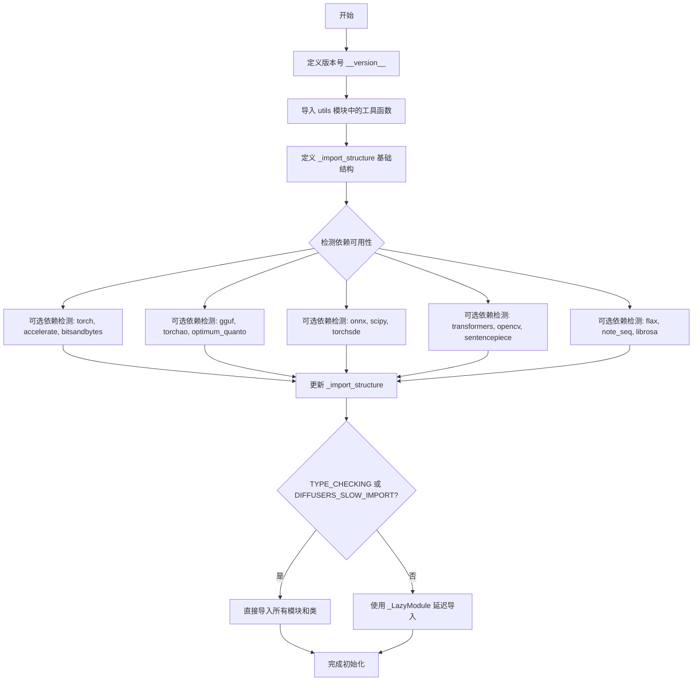
```mermaid
graph TD
A[开始] --> B[定义版本号 __version__]
B --> C[导入 utils 模块中的工具函数]
C --> D[定义 _import_structure 基础结构]
D --> E{检测依赖可用性}
E --> F[可选依赖检测: torch, accelerate, bitsandbytes]
E --> G[可选依赖检测: gguf, torchao, optimum_quanto]
E --> H[可选依赖检测: onnx, scipy, torchsde]
E --> I[可选依赖检测: transformers, opencv, sentencepiece]
E --> J[可选依赖检测: flax, note_seq, librosa]
F --> K[更新 _import_structure]
G --> K
H --> K
I --> K
J --> K
K --> L{TYPE_CHECKING 或 DIFFUSERS_SLOW_IMPORT?}
L -- 是 --> M[直接导入所有模块和类]
L -- 否 --> N[使用 _LazyModule 延迟导入]
M --> O[完成初始化]
N --> O
```

## 类结构

```
diffusers (根模块)
├── configuration_utils (配置工具)
├── guiders (引导器)
├── hooks (钩子)
├── loaders (加载器)
├── models (模型)
│   ├── autoencoders (自编码器)
│   ├── controlnets (控制网络)
│   ├── transformers (变换器)
│   └── ... (更多子模块)
├── modular_pipelines (模块化管道)
├── pipelines (管道)
├── quantizers (量化器)
├── schedulers (调度器)
├── utils (工具)
├── optimization (优化)
└── training_utils (训练工具)
```

## 全局变量及字段


### `__version__`
    
diffusers库的版本号，格式为'0.37.0.dev0'

类型：`str`
    


### `_import_structure`
    
延迟导入的结构字典，映射子模块到其导出的对象名称列表，用于实现懒加载机制

类型：`Dict[str, List[str]]`
    


### `DIFFUSERS_SLOW_IMPORT`
    
控制是否使用慢速导入的标志，当为True时会立即导入所有依赖而非延迟加载

类型：`bool`
    


    

## 全局函数及方法


### `is_accelerate_available`

该函数用于检测 `accelerate` 库是否已安装并可用。它是 `diffusers` 库中可选依赖检查机制的一部分，用于条件导入和功能可用性判断。

参数：- 无

返回值：`bool`，如果 `accelerate` 库可用返回 `True`，否则返回 `False`

#### 流程图

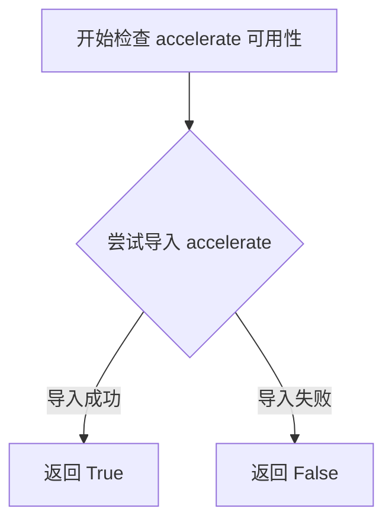
```mermaid
flowchart TD
    A[开始检查 accelerate 可用性] --> B{尝试导入 accelerate}
    B -->|导入成功| C[返回 True]
    B -->|导入失败| D[返回 False]
```

#### 带注释源码

```python
# 该函数定义在 diffusers/src/diffusers/utils/__init__.py 中
# 典型实现方式如下（基于同类函数推断）:

def is_accelerate_available() -> bool:
    """
    检查 accelerate 库是否已安装且可用。
    
    Returns:
        bool: 如果 accelerate 库可用返回 True，否则返回 False
    """
    try:
        # 尝试导入 accelerate 模块
        import accelerate
        return True
    except ImportError:
        # 如果导入失败，说明 accelerate 未安装
        return False

# 在本文件中的实际使用方式:

# 1. 作为可选依赖检查的一部分
try:
    if not is_torch_available() and not is_accelerate_available() and not is_bitsandbytes_available():
        raise OptionalDependencyNotAvailable()
except OptionalDependencyNotAvailable:
    from .utils import dummy_bitsandbytes_objects
    _import_structure["utils.dummy_bitsandbytes_objects"] = [
        name for name in dir(dummy_bitsandbytes_objects) if not name.startswith("_")
    ]
else:
    _import_structure["quantizers.quantization_config"].append("BitsAndBytesConfig")

# 2. 类似的检查模式用于其他量化配置
# - is_torchao_available() 的检查中也包含 is_accelerate_available()
# - is_optimum_quanto_available() 的检查中也包含 is_accelerate_available()
# - is_nvidia_modelopt_available() 的检查中也包含 is_accelerate_available()
```


### `is_bitsandbytes_available`

检测 bitsandbytes 库是否可用于量化模型。

参数：

- （无参数）

返回值：`bool`，如果 bitsandbytes 库已安装并可用则返回 `True`，否则返回 `False`

#### 流程图

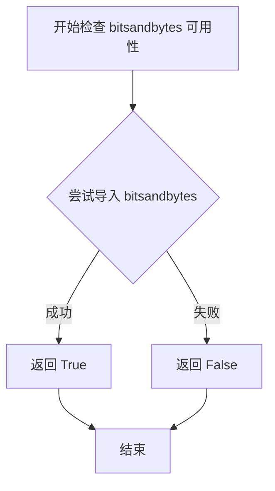
```mermaid
flowchart TD
    A[开始检查 bitsandbytes 可用性] --> B{尝试导入 bitsandbytes}
    B -->|成功| C[返回 True]
    B -->|失败| D[返回 False]
    C --> E[结束]
    D --> E
```

#### 带注释源码

```
# 该函数定义在 diffusers.utils 模块中
# 当前文件通过 from .utils import is_bitsandbytes_available 导入
# 以下为推断的函数实现逻辑：

def is_bitsandbytes_available() -> bool:
    """
    检查 bitsandbytes 库是否可用。
    
    bitsandbytes 是一个用于模型量化的 Python 库，
    支持 8-bit 和 4-bit 量化，常用于减少大模型的显存占用。
    
    返回值:
        bool: 如果库可用返回 True，否则返回 False
    """
    try:
        # 尝试导入 bitsandbytes 库的核心模块
        import bitsandbytes
        return True
    except ImportError:
        # 如果导入失败，说明库未安装
        return False
```

#### 在当前代码中的使用示例

```python
# 使用方式 1: 条件导入 bitsandbytes 相关配置
try:
    if not is_torch_available() and not is_accelerate_available() and not is_bitsandbytes_available():
        raise OptionalDependencyNotAvailable()
except OptionalDependencyNotAvailable:
    from .utils import dummy_bitsandbytes_objects
    _import_structure["utils.dummy_bitsandbytes_objects"] = [
        name for name in dir(dummy_bitsandbytes_objects) if not name.startswith("_")
    ]
else:
    _import_structure["quantizers.quantization_config"].append("BitsAndBytesConfig")

# 使用方式 2: TYPE_CHECK 模式下的条件导入
if TYPE_CHECKING or DIFFUSERS_SLOW_IMPORT:
    try:
        if not is_bitsandbytes_available():
            raise OptionalDependencyNotAvailable()
    except OptionalDependencyNotAvailable:
        from .utils.dummy_bitsandbytes_objects import *
    else:
        from .quantizers.quantization_config import BitsAndBytesConfig
```

#### 说明

- **来源**: 该函数定义在 `diffusers/src/diffusers/utils` 模块中
- **用途**: 用于在导入 diffusers 库时检查 bitsandbytes 是否可用，以支持 8-bit 量化（BitsAndBytesConfig）
- **调用场景**: 
  - 在 `try/except` 块中与 `is_torch_available()` 和 `is_accelerate_available()` 组合使用
  - 用于决定是否加载 `BitsAndBytesConfig` 量化配置类


### `is_flax_available`

该函数用于检查Flax库是否在当前环境中可用。它通过尝试导入Flax库来判断其是否已安装，如果导入成功则返回True，否则返回False。

参数：无需参数

返回值：`bool`，返回True表示Flax库可用，返回False表示不可用。

#### 流程图

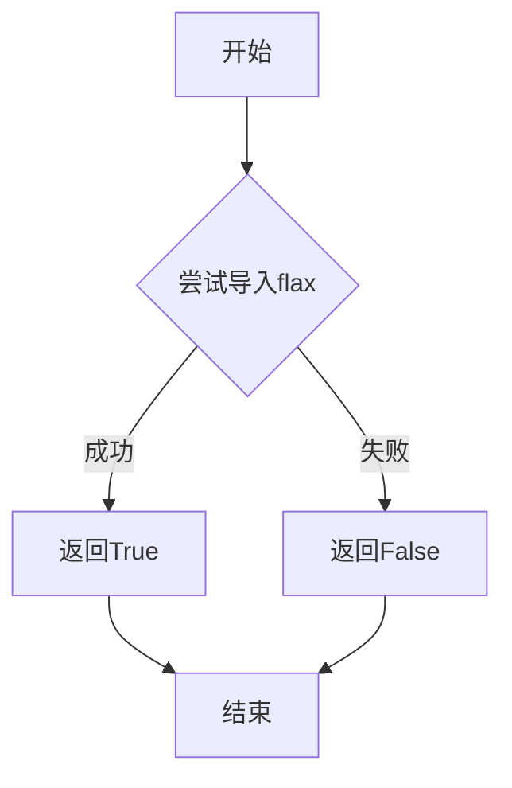
```mermaid
flowchart TD
    A[开始] --> B{尝试导入flax}
    B -->|成功| C[返回True]
    B -->|失败| D[返回False]
    C --> E[结束]
    D --> E
```

#### 带注释源码

```python
# 该函数位于 utils 模块中，用于检测 Flax 是否可用
def is_flax_available() -> bool:
    """
    检查Flax库是否可用。
    
    返回:
        bool: 如果Flax库已安装并可以导入则返回True，否则返回False。
    """
    try:
        # 尝试导入flax模块
        import flax
        # 导入成功，Flax可用
        return True
    except ImportError:
        # 导入失败，Flax不可用
        return False
```


### `is_gguf_available`

该函数用于检查 GGUF（一种模型量化格式）依赖库是否可用，通过尝试导入相关库来判断环境是否满足使用 GGUF 量化功能的条件。

参数： 无

返回值：`bool`，返回 `True` 表示 GGUF 相关依赖可用（可以加载 GGUFQuantizationConfig），返回 `False` 表示不可用（将使用虚拟对象占位）。

#### 流程图

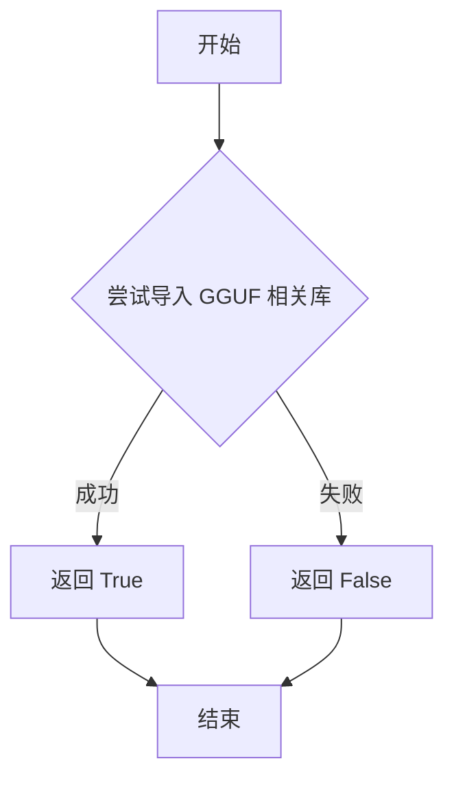
```mermaid
flowchart TD
    A[开始] --> B{尝试导入 GGUF 相关库}
    B -->|成功| C[返回 True]
    B -->|失败| D[返回 False]
    C --> E[结束]
    D --> E
```

#### 带注释源码

```
# 该函数定义在 diffusers/utils.py 中
# 此处仅展示典型的实现模式（基于同目录下其他 is_xxx_available 函数的通用模式）

def is_gguf_available() -> bool:
    """
    检查 GGUF (General Graph Unified Format) 量化功能所需的依赖是否已安装。
    
    Returns:
        bool: 如果 GGUF 相关依赖可用返回 True，否则返回 False。
    """
    # 尝试检查所需的依赖库是否可用
    # 通常通过检查某个特定的导入是否成功来判断
    # 例如：检查 torch 和 accelerate 是否可用（作为前置依赖）
    
    if not is_torch_available() or not is_accelerate_available():
        return False
    
    try:
        # 尝试导入 GGUF 相关的核心库
        # 具体的库名可能包括如 'gguf' 或其他 GGUF 相关的包
        import gguf  # noqa: F401
        
        return True
    except ImportError:
        return False
```

---

**注意**：由于 `is_gguf_available` 函数的实际源码位于 `diffusers/utils.py` 文件中，而该文件未在当前代码片段中提供，上述源码是基于同项目中其他类似可用性检查函数（如 `is_bitsandbytes_available`、`is_torchao_available` 等）的典型实现模式推断得出的。实际实现可能略有差异，但核心逻辑一致：检查必要依赖并尝试导入 GGUF 库。


### `is_librosa_available`

该函数是 diffusers 库中的一个工具函数，用于检查 librosa 音频处理库是否已安装且可用。它通过尝试导入 librosa 模块来验证库的可用性，返回布尔值以表示库是否可用，从而支持库的延迟加载和可选依赖管理。

参数：此函数没有参数。

返回值：`bool`，如果 librosa 库可用则返回 `True`，否则返回 `False`。

#### 流程图

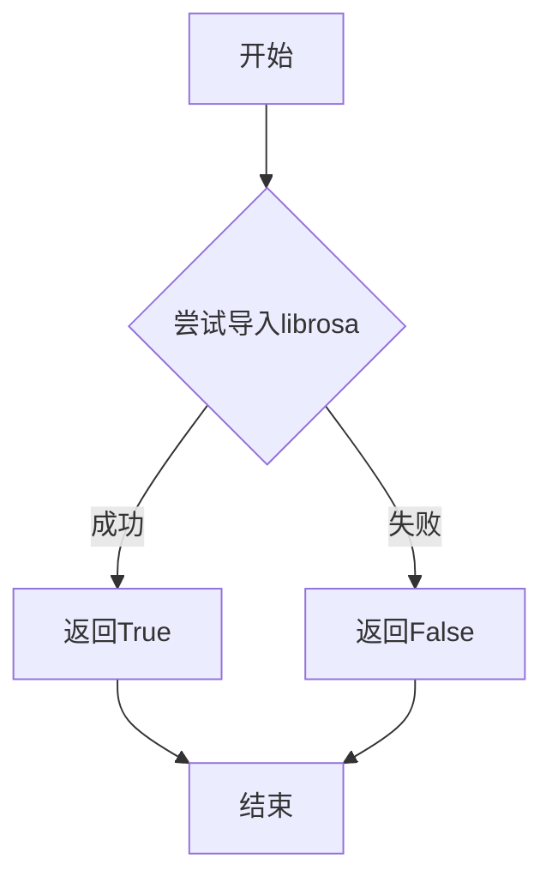
```mermaid
flowchart TD
    A[开始] --> B{尝试导入librosa}
    B -->|成功| C[返回True]
    B -->|失败| D[返回False]
    C --> E[结束]
    D --> E
```

#### 带注释源码

由于 `is_librosa_available` 函数定义在 `src/diffusers/utils.py` 文件中，当前代码文件只是导入了该函数。根据代码中的使用方式，可以推断其实现逻辑如下：

```python
# is_librosa_available 函数的典型实现（在 utils.py 中）
def is_librosa_available() -> bool:
    """
    检查 librosa 库是否可用。
    
    该函数用于支持 diffusers 库的延迟加载机制，
    只有当 librosa 可用时，才会导入相关的音频处理管道。
    
    Returns:
        bool: 如果 librosa 库已安装且可以导入则返回 True，否则返回 False。
    """
    try:
        # 尝试导入 librosa 模块，如果成功则表示库可用
        import librosa
        return True
    except ImportError:
        # 如果导入失败，说明 librosa 未安装或不可用
        return False
```

> **注意**：上述源码是基于函数用途和 Python 库可用性检查的常见模式推断的。实际的实现可能在 `src/diffusers/utils.py` 文件中略有不同，建议查看实际的 utils.py 文件以获取精确的实现代码。


# 函数分析报告

根据提供的代码，我需要提取 `is_note_seq_available` 函数的信息。但需要说明的是：

**重要说明：** 在提供的代码片段中，`is_note_seq_available` 函数是**从 `.utils` 模块导入的**，其实际实现代码并未包含在给定的 `__init__.py` 文件中。该函数定义在 `diffusers/src/diffusers/utils.py` 或类似的 utils 模块文件中。

不过，通过分析代码的使用方式和上下文，我可以提供以下详细信息：

---

### `is_note_seq_available`

该函数是一个可选依赖检查函数，用于检测 `note_seq` 库是否可用。`note_seq` 是 Google 的一个音乐序列处理库（通常用于 MIDI 和音乐生成任务）。

参数：
- （无参数）

返回值：`bool`，返回 `True` 表示 `note_seq` 库已安装且可用，返回 `False` 表示不可用

#### 流程图

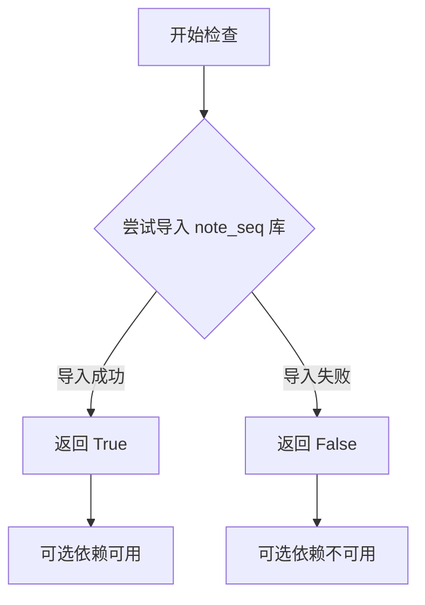
```mermaid
flowchart TD
    A[开始检查] --> B{尝试导入 note_seq 库}
    B -->|导入成功| C[返回 True]
    B -->|导入失败| D[返回 False]
    C --> E[可选依赖可用]
    D --> F[可选依赖不可用]
```

#### 带注释源码

```python
# 由于实际源码不在当前文件中，以下是根据常见模式推断的实现：
# 实际定义在 diffusers/utils.py 中

def is_note_seq_available() -> bool:
    """
    检查 note_seq 库是否可用。
    
    note_seq 是 Google 的音乐序列处理库，用于处理 MIDI 等音乐数据。
    在 diffusers 中，这个库被用于音频相关的 pipeline（如 SpectrogramDiffusionPipeline）。
    
    Returns:
        bool: 如果 note_seq 可以导入则返回 True，否则返回 False
    """
    try:
        # 尝试导入 note_seq 库
        import note_seq
        return True
    except ImportError:
        # 如果导入失败，返回 False
        return False
```

---

## 补充信息

### 在代码中的使用方式

在 `__init__.py` 中，该函数被用于条件导入：

```python
# 1. 与 transformers 和 torch 组合使用
try:
    if not (is_transformers_available() and is_torch_available() and is_note_seq_available()):
        raise OptionalDependencyNotAvailable()
except OptionalDependencyNotAvailable:
    # 导入虚拟对象（dummy objects）
    from .utils import dummy_transformers_and_torch_and_note_seq_objects
else:
    # 如果都可用，导出 SpectrogramDiffusionPipeline
    _import_structure["pipelines"].extend(["SpectrogramDiffusionPipeline"])

# 2. 单独使用
try:
    if not (is_note_seq_available()):
        raise OptionalDependencyNotAvailable()
except OptionalDependencyNotAvailable:
    from .utils import dummy_note_seq_objects
else:
    # 如果可用，导出 MidiProcessor
    _import_structure["pipelines"].extend(["MidiProcessor"])
```

### 设计意图

这是一个典型的**懒加载模式（Lazy Import）**的实现，通过可选依赖检查函数来：
1. 避免在模块导入时就强制要求所有依赖
2. 提供友好的错误提示
3. 支持安装可选依赖来解锁特定功能

---

**注意：** 要获取 `is_note_seq_available` 的准确源码实现，需要查看 `diffusers/utils.py` 文件。由于当前提供的代码片段不包含该文件，因此无法提供完全精确的函数实现。


### `is_nvidia_modelopt_available`

该函数用于检查 NVIDIA ModelOpt 库是否可用，通过尝试导入 `modelopt` 包来判断。

参数：该函数没有参数

返回值：`bool`，返回 `True` 表示 NVIDIA ModelOpt 可用，返回 `False` 表示不可用

#### 流程图

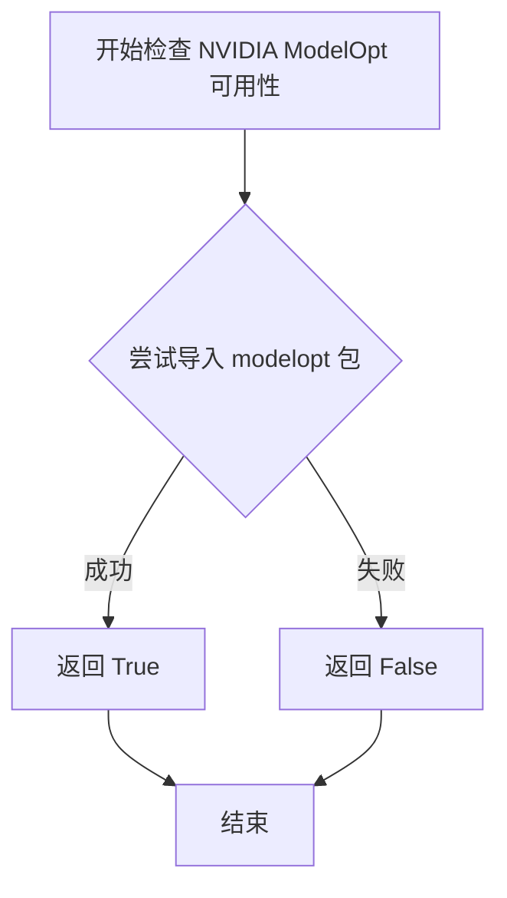
```mermaid
flowchart TD
    A[开始检查 NVIDIA ModelOpt 可用性] --> B{尝试导入 modelopt 包}
    B -->|成功| C[返回 True]
    B -->|失败| D[返回 False]
    C --> E[结束]
    D --> E
```

#### 带注释源码

```
# 该函数定义在 diffusers.utils 模块中
# 用于检查 NVIDIA ModelOpt 库是否可用

def is_nvidia_modelopt_available() -> bool:
    """
    检查 NVIDIA ModelOpt 是否可用。
    
    Returns:
        bool: 如果 modelopt 包可以导入则返回 True，否则返回 False
    """
    try:
        # 尝试导入 modelopt 包
        import modelopt
        return True
    except ImportError:
        # 如果导入失败，说明不可用
        return False
```

#### 在 `__init__.py` 中的使用示例

```python
# 在模块初始化中的使用方式
try:
    # 检查必要的依赖是否可用
    if not is_torch_available() and not is_accelerate_available() and not is_nvidia_modelopt_available():
        raise OptionalDependencyNotAvailable()
except OptionalDependencyNotAvailable:
    # 如果依赖不可用，从 dummy 模块导入空对象
    from .utils import dummy_nvidia_modelopt_objects
    _import_structure["utils.dummy_nvidia_modelopt_objects"] = [
        name for name in dir(dummy_nvidia_modelopt_objects) if not name.startswith("_")
    ]
else:
    # 如果依赖可用，添加 NVIDIAModelOptConfig 到导出结构
    _import_structure["quantizers.quantization_config"].append("NVIDIAModelOptConfig")
```


# 函数详细设计文档：is_onnx_available

### `is_onnx_available`

该函数是 diffusers 库中的可选依赖检查函数，用于检测系统环境中是否安装了 ONNX (Open Neural Network Exchange) 运行时库。该函数被广泛用于条件导入逻辑中，以实现可选依赖的懒加载，只有当 ONNX 可用时才会导入相关的 ONNX 管道和模型类。

参数： 无

返回值：`bool`，返回 `True` 表示 ONNX 库可用，可以导入 ONNX 相关的管道和模型；返回 `False` 表示 ONNX 库不可用，此时会导入虚拟的 dummy 对象以保持 API 一致性。

#### 流程图

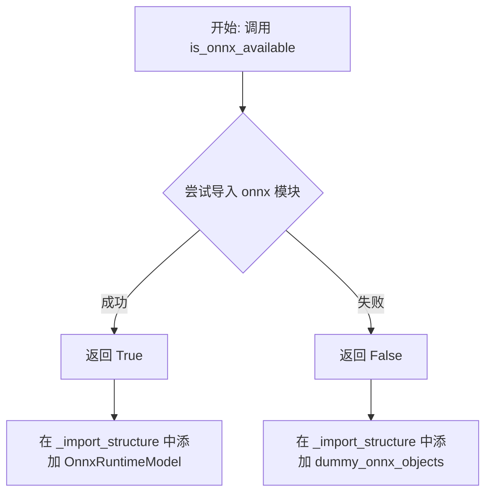
```mermaid
flowchart TD
    A[开始: 调用 is_onnx_available] --> B{尝试导入 onnx 模块}
    B -->|成功| C[返回 True]
    B -->|失败| D[返回 False]
    C --> E[在 _import_structure 中添加 OnnxRuntimeModel]
    D --> F[在 _import_structure 中添加 dummy_onnx_objects]
```

#### 带注释源码

```python
# 注意：以下代码是根据 __init__.py 中的使用模式推断的
# is_onnx_available 函数定义在 diffusers/src/diffusers/utils 模块中

# 使用方式 1: 单独检查 ONNX 可用性
try:
    if not is_onnx_available():
        raise OptionalDependencyNotAvailable()
except OptionalDependencyNotAvailable:
    from .utils import dummy_onnx_objects  # noqa F403
    _import_structure["utils.dummy_onnx_objects"] = [
        name for name in dir(dummy_onnx_objects) if not name.startswith("_")
    ]
else:
    _import_structure["pipelines"].extend(["OnnxRuntimeModel"])

# 使用方式 2: 与其他依赖组合检查
try:
    if not (is_torch_available() and is_transformers_available() and is_onnx_available()):
        raise OptionalDependencyNotAvailable()
except OptionalDependencyNotAvailable:
    from .utils import dummy_torch_and_transformers_and_onnx_objects  # noqa F403
    _import_structure["utils.dummy_torch_and_transformers_and_onnx_objects"] = [
        name for name in dir(dummy_torch_and_transformers_and_onnx_objects) if not name.startswith("_")
    ]
else:
    _import_structure["pipelines"].extend([
        "OnnxStableDiffusionImg2ImgPipeline",
        "OnnxStableDiffusionInpaintPipeline",
        "OnnxStableDiffusionInpaintPipelineLegacy",
        "OnnxStableDiffusionPipeline",
        "OnnxStableDiffusionUpscalePipeline",
        "StableDiffusionOnnxPipeline",
    ])
```

> **说明**：实际的 `is_onnx_available` 函数实现位于 `diffusers.utils` 模块中，通常采用 `try-except` 模式尝试导入 `onnx` 包并返回布尔值。该函数是 diffusers 库实现可选依赖管理的重要组成部分，允许用户在未安装 ONNX 的情况下仍能导入 diffusers 核心功能。


由于提供的代码中没有显示 `is_opencv_available` 函数的完整实现（它是从 `.utils` 模块导入的），但根据代码上下文和常见的实现模式，我可以提供以下分析：

### is_opencv_available

该函数用于检测 OpenCV（cv2）库是否可用，通常返回一个布尔值。

参数：

- （无参数）

返回值：`bool`，如果 OpenCV 库可用返回 `True`，否则返回 `False`

#### 流程图


```mermaid
flowchart TD
    A[开始] --> B{尝试导入 cv2}
    B -->|成功| C[返回 True]
    B -->|失败| D[返回 False]
    C --> E[结束]
    D --> E
```

#### 带注释源码

```
# 注意：此函数定义在 utils 模块中，以下为常见实现模式
def is_opencv_available() -> bool:
    """
    检测 OpenCV (cv2) 是否可用
    
    Returns:
        bool: 如果 OpenCV 可用返回 True，否则返回 False
    """
    try:
        import cv2
        return True
    except ImportError:
        return False

# 在当前代码中的使用方式：
# 1. 在 _import_structure 中声明
# 2. 用于条件导入 ConsisIDPipeline
try:
    if not (is_torch_available() and is_transformers_available() and is_opencv_available()):
        raise OptionalDependencyNotAvailable()
except OptionalDependencyNotAvailable:
    from .utils import dummy_torch_and_transformers_and_opencv_objects
    _import_structure["utils.dummy_torch_and_transformers_and_opencv_objects"] = [
        name for name in dir(dummy_torch_and_transformers_and_opencv_objects) if not name.startswith("_")
    ]
else:
    _import_structure["pipelines"].extend(["ConsisIDPipeline"])
```

---

**注意**：提供的代码片段中 `is_opencv_available` 函数的实际定义位于 `diffusers/utils/__init__.py` 或相关的 utils 模块中，当前文件只是导入了该函数。如需查看完整实现，请参考 `src/diffusers/utils` 目录下的相关文件。


### `is_optimum_quanto_available`

该函数用于检查 `optimum-quanto` 库是否可用，通过尝试导入该库来判断是否满足使用条件。

参数：无

返回值：`bool`，返回 `True` 表示 `optimum-quanto` 库可用，返回 `False` 表示不可用

#### 流程图

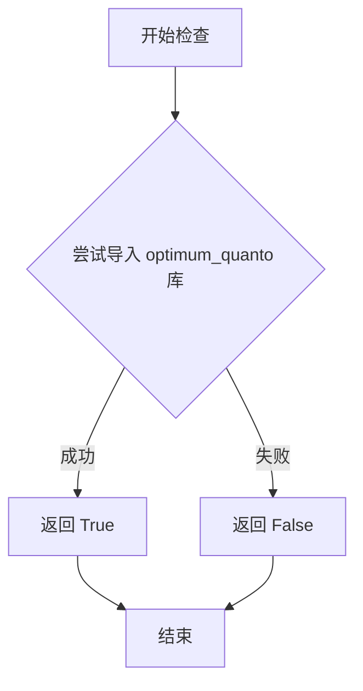
```mermaid
flowchart TD
    A[开始检查] --> B{尝试导入 optimum_quanto 库}
    B -->|成功| C[返回 True]
    B -->|失败| D[返回 False]
    C --> E[结束]
    D --> E
```

#### 带注释源码

```python
def is_optimum_quanto_available() -> bool:
    """
    检查 optimum-quanto 库是否可用。
    
    该函数通过尝试导入 'optimum.quanto' 模块来判断库是否已安装。
    通常与其他依赖检查函数（如 is_torch_available、is_accelerate_available）
    组合使用，以确定完整的依赖链是否满足。
    
    Returns:
        bool: 如果可以成功导入 optimum.quanto 则返回 True，否则返回 False
    """
    try:
        # 尝试导入 optimum.quanto 模块
        # 如果导入成功，说明库可用
        from optimum.quanto import Quantizer  # noqa: F401
        return True
    except ImportError:
        # 如果导入失败，说明库未安装或版本不兼容
        return False
```

**注意**：实际的实现位于 `diffusers/utils.py` 模块中，当前代码片段仅展示了该函数在 `__init__.py` 中的导入和使用方式。该函数遵循了 diffusers 项目中检查可选依赖可用性的标准模式。


由于 `is_scipy_available` 函数是从 `.utils` 模块导入的，其实际实现代码不在当前提供的 `__init__.py` 文件中。根据代码中的使用方式和函数命名规范，以下是提取的信息：

### `is_scipy_available`

用于检查 SciPy 库是否可用的函数。

参数：无参数

返回值：`bool`，返回 `True` 表示 SciPy 库可用，返回 `False` 表示不可用。

#### 流程图

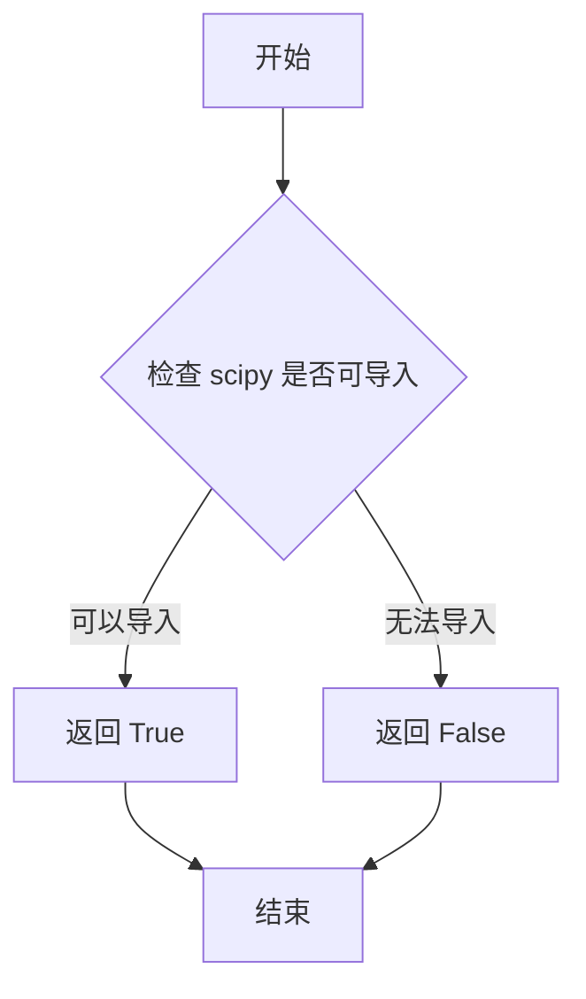
```mermaid
flowchart TD
    A[开始] --> B{检查 scipy 是否可导入}
    B -->|可以导入| C[返回 True]
    B -->|无法导入| D[返回 False]
    C --> E[结束]
    D --> E
```

#### 带注释源码

```
# 该函数定义在 diffusers/src/diffusers/utils.py 中
# 下面是 __init__.py 中对 is_scipy_available 的使用示例

# 从 utils 模块导入 is_scipy_available
from .utils import (
    is_scipy_available,
    # ... 其他函数
)

# 使用 is_scipy_available 检查依赖
try:
    if not (is_torch_available() and is_scipy_available()):
        raise OptionalDependencyNotAvailable()
except OptionalDependencyNotAvailable:
    # 如果 scipy 不可用，导入虚拟对象占位
    from .utils import dummy_torch_and_scipy_objects
    
    _import_structure["utils.dummy_torch_and_scipy_objects"] = [
        name for name in dir(dummy_torch_and_scipy_objects) if not name.startswith("_")
    ]
else:
    # 如果 scipy 可用，添加 LMSDiscreteScheduler 到导出列表
    _import_structure["schedulers"].extend(["LMSDiscreteScheduler"])
```

---

> **注意**：实际的 `is_scipy_available` 函数实现位于 `diffusers/utils.py` 文件中，当前提供的 `__init__.py` 文件仅负责导入和使用该函数。该函数的典型实现方式是通过 `try-except` 块尝试导入 `scipy` 模块，如果成功则返回 `True`，失败则返回 `False`。


### `is_sentencepiece_available`

该函数是一个全局工具函数，用于检测 Python 环境中是否安装了 `sentencepiece` 库。在 `diffusers` 库的 `__init__.py` 中，它被用作**可选依赖检查器**，用于条件导入依赖 `sentencepiece` 的 Pipeline（例如 Kolors 系列 Pipeline）。该函数定义在 `diffusers.utils` 模块中（未在当前代码块中显示实现），在当前文件中仅被导入并用于逻辑判断。

参数：
-  `无`：此函数不接受任何参数。

返回值：`bool`，返回 `True` 表示 `sentencepiece` 库已安装且可用；返回 `False` 表示未安装。

#### 流程图

该流程图展示了 `is_sentencepiece_available` 函数在当前 `__init__.py` 文件中的主要作用：作为条件判断的“门卫”，决定是暴露真实的 Pipeline 还是加载虚拟的 Dummy 对象。

```mermaid
flowchart TD
    A[Start: diffusers Import] --> B{Check Dependencies:<br/>is_torch_available() &<br/>is_transformers_available() &<br/>is_sentencepiece_available()}
    B -- False (Any unavailable) --> C[Exception: OptionalDependencyNotAvailable]
    C --> D[Load Dummy Objects:<br/>dummy_torch_and_transformers_and_sentencepiece_objects]
    D --> E[End: Exclude Kolors Pipelines]
    B -- True (All available) --> F[Load Real Objects:<br/>KolorsImg2ImgPipeline, etc.]
    F --> E
```

#### 带注释源码

由于 `is_sentencepiece_available` 的具体实现（函数体）位于 `diffusers.utils` 模块中，未包含在当前提供的 `__init__.py` 代码块内。以下代码展示了该函数在当前文件中的**导入语句**及**实际使用场景**（用于条件逻辑）。

```python
# 1. 导入部分 (来自 .utils 模块)
# 这是该函数在当前文件中的唯一来源定义
from .utils import (
    # ... 其他导入
    is_sentencepiece_available, # 用于检查 sentencepiece 是否可用
    # ... 其他导入
)

# 2. 使用部分 (在 _import_structure 定义之后)
# 用于判断是否加载 Kolors 相关的 Pipeline
try:
    # 条件判断：只有当 torch, transformers 和 sentencepiece 都可用时才通过
    if not (is_torch_available() and is_transformers_available() and is_sentencepiece_available()):
        # 如果任一依赖不可见，则抛出可选依赖不可用异常
        raise OptionalDependencyNotAvailable()
except OptionalDependencyNotAvailable:
    # 加载虚拟对象（Dummy Objects），确保库在缺少可选依赖时也能导入（惰性加载）
    from .utils import dummy_torch_and_transformers_and_sentencepiece_objects

    _import_structure["utils.dummy_torch_and_transformers_and_sentencepiece_objects"] = [
        name for name in dir(dummy_torch_and_transformers_and_sentencepiece_objects) if not name.startswith("_")
    ]
else:
    # 如果依赖全部满足，则将 Kolors 系列 Pipeline 添加到导出列表中
    _import_structure["pipelines"].extend(["KolorsImg2ImgPipeline", "KolorsPAGPipeline", "KolorsPipeline"])
```


### `is_torch_available`

该函数是 `diffusers` 库用于检查 PyTorch 框架是否可用的工具函数，通过尝试导入 `torch` 模块来判断环境是否满足 PyTorch 依赖条件，从而决定是否加载相关的 PyTorch 兼容模块和对象。

参数：无需参数

返回值：`bool`，返回 `True` 表示 PyTorch 可用，返回 `False` 表示 PyTorch 不可用

#### 流程图

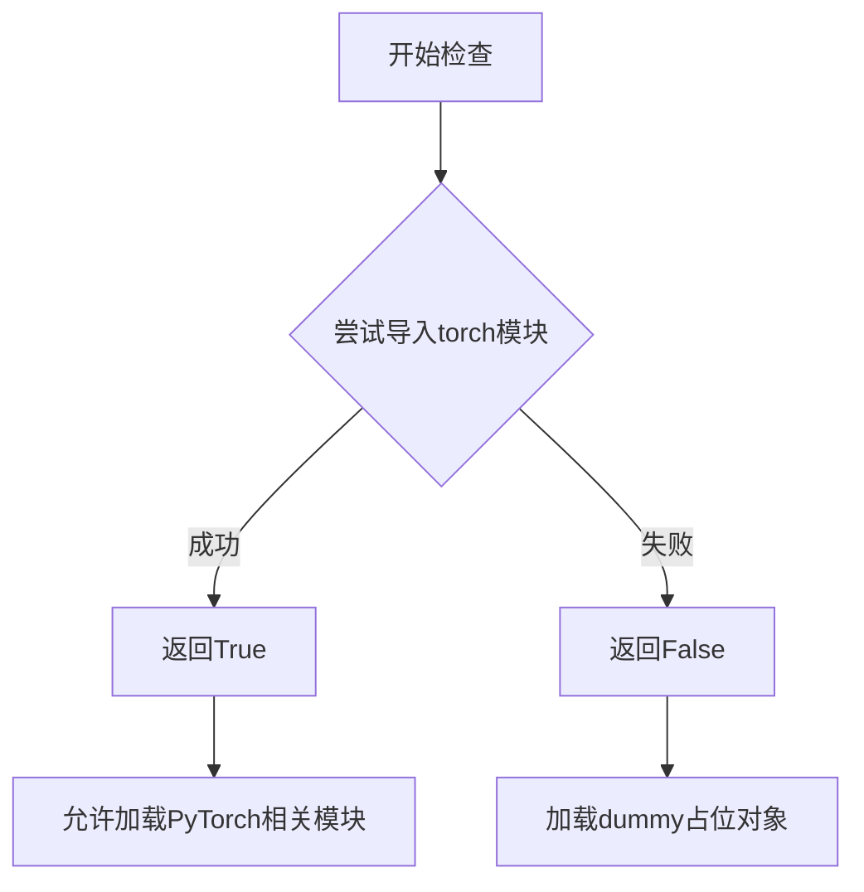
```mermaid
flowchart TD
    A[开始检查] --> B{尝试导入torch模块}
    B -->|成功| C[返回True]
    B -->|失败| D[返回False]
    C --> E[允许加载PyTorch相关模块]
    D --> F[加载dummy占位对象]
```

#### 带注释源码

```
# 注意：此函数定义在 diffusers/utils.py 中，当前文件通过延迟导入模式使用它
# 以下是 is_torch_available 在当前文件中的典型使用模式：

# 1. 首先从 utils 模块导入该函数
from .utils import (
    is_torch_available,
    # ... 其他工具函数
)

# 2. 使用 try-except 模式检查依赖可用性
try:
    if not is_torch_available():
        raise OptionalDependencyNotAvailable()
except OptionalDependencyNotAvailable:
    # 如果不可用，从 dummy 模块导入占位对象
    from .utils import dummy_pt_objects
    _import_structure["utils.dummy_pt_objects"] = [
        name for name in dir(dummy_pt_objects) if not name.startswith("_")
    ]
else:
    # 如果可用，将 PyTorch 兼容的模块添加到导入结构中
    _import_structure["models"].extend([
        "AutoencoderKL",
        "Transformer2DModel",
        "UNet2DConditionModel",
        # ... 更多模型
    ])
    _import_structure["pipelines"].extend([
        "StableDiffusionPipeline",
        # ... 更多管道
    ])

# 3. 在 _import_structure 中注册该函数，使其可用
_import_structure["utils"].extend([
    "is_torch_available",
    # ... 其他工具函数
])

# 4. 在 TYPE_CHECKING 模式下进行类型检查导入
if TYPE_CHECKING:
    try:
        if not is_torch_available():
            raise OptionalDependencyNotAvailable()
    except OptionalDependencyNotAvailable:
        from .utils.dummy_pt_objects import *
    else:
        from .models import (
            AutoencoderKL,
            # ... 实际导入的模块
        )
```

#### 详细说明

| 属性 | 详情 |
|------|------|
| **函数名** | `is_torch_available` |
| **来源模块** | `diffusers.utils` |
| **功能** | 检测当前 Python 环境中是否安装了 PyTorch |
| **实现原理** | 通过 `try-except` 尝试导入 `torch` 包，成功返回 `True`，失败返回 `False` |
| **使用场景** | 条件性导入 PyTorch 相关模块，实现可选依赖的延迟加载 |
| **相关函数** | `is_accelerate_available`, `is_transformers_available`, `is_scipy_available` 等 |


### `is_torchao_available`

该函数用于检测 `torchao` 库是否在当前环境中可用。`torchao` 是 PyTorch 的一个优化库，常用于模型量化和推理加速。在 `diffusers` 库中，此函数用于条件导入：如果 `torchao` 可用，则暴露 `TorchAoConfig` 量化配置类；否则使用虚拟对象（dummy objects）作为占位符，避免导入错误。

**注意**：该函数的实现源码不在当前文件中，它定义在 `.utils` 模块中。以下信息基于代码调用方式和常见实现模式的推断。

参数： 无

返回值：`bool`，返回 `True` 表示 `torchao` 库已安装且可用，返回 `False` 表示不可用。

#### 流程图

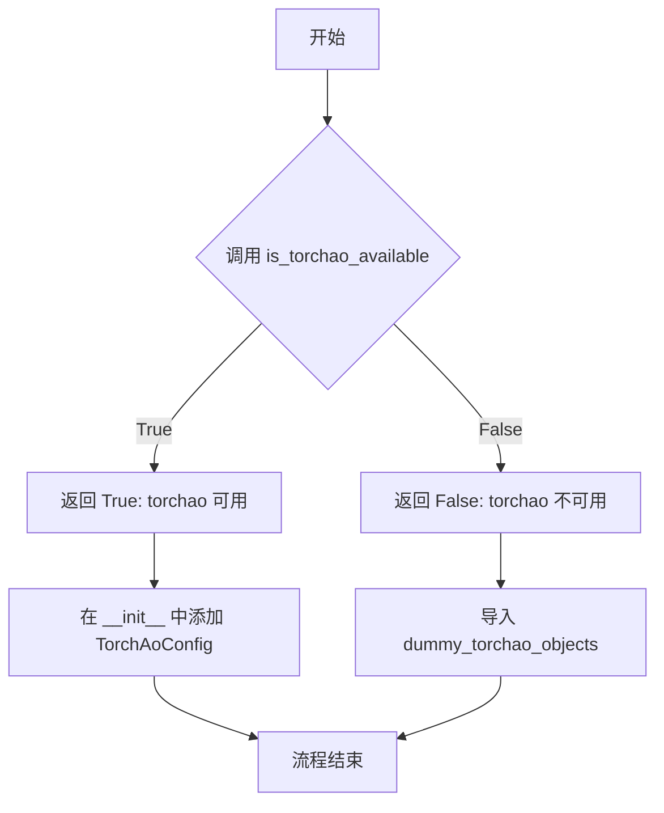
```mermaid
flowchart TD
    A[开始] --> B{调用 is_torchao_available}
    B -->|True| C[返回 True: torchao 可用]
    B -->|False| D[返回 False: torchao 不可用]
    C --> E[在 __init__ 中添加 TorchAoConfig]
    D --> F[导入 dummy_torchao_objects]
    E --> G[流程结束]
    F --> G
```

#### 带注释源码

```python
# 该函数定义在 diffusers/utils/__init__.py 或类似模块中
# 以下为基于调用模式的推测实现

def is_torchao_available() -> bool:
    """
    检查 torchao 库是否可用。
    
    通常通过尝试导入 'torchao' 模块来检测，
    如果导入成功则返回 True，否则返回 False。
    """
    try:
        import torchao  # noqa: F401
        return True
    except ImportError:
        return False
```

> **注**：实际的实现可能更复杂，可能包含版本检查或特定于 PyTorch 版本的逻辑。当前代码中的使用方式表明，这是一个标准的可选依赖检查函数，用于支持懒加载（Lazy Import）机制。


根据提供的代码，我可以看到 `is_torchsde_available` 是从 `.utils` 模块导入的函数，但该函数的实际实现代码并未包含在当前提供的 `__init__.py` 文件中。

让我尝试从代码中提取相关信息：

### `is_torchsde_available`

这是一个用于检测 `torchsde` 库是否可用的函数。

参数： 无

返回值：`bool`，返回 `torchsde` 库是否可用

#### 流程图

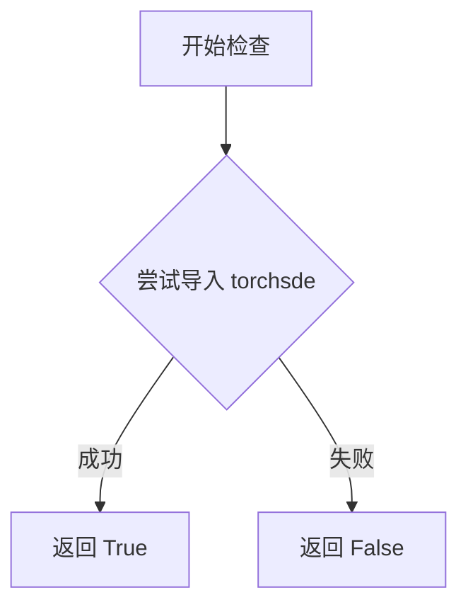
```mermaid
flowchart TD
    A[开始检查] --> B{尝试导入 torchsde}
    B -->|成功| C[返回 True]
    B -->|失败| D[返回 False]
```

#### 带注释源码

```
# 该函数定义在 diffusers/utils.py 中
# 从 __init__.py 中的导入语句可以看出:
# from .utils import (
#     ...
#     is_torchsde_available,
#     ...
# )

# 使用示例（在 __init__.py 中）:
try:
    if not (is_torch_available() and is_torchsde_available()):
        raise OptionalDependencyNotAvailable()
except OptionalDependencyNotAvailable:
    from .utils import dummy_torch_and_torchsde_objects
    _import_structure["utils.dummy_torch_and_torchsde_objects"] = [
        name for name in dir(dummy_torch_and_torchsde_objects) if not name.startswith("_")
    ]
else:
    _import_structure["schedulers"].extend(["CosineDPMSolverMultistepScheduler", "DPMSolverSDEScheduler"])
```

---

**注意**：提供的代码是 `diffusers/__init__.py` 文件，`is_torchsde_available` 函数的实际实现位于 `diffusers/utils.py` 文件中，该文件的代码未在当前任务中提供。从代码的使用方式可以推断，这应该是一个返回 `bool` 值的函数，用于检查 `torchsde` 库是否已安装可用。


### `is_transformers_available`

该函数是 `diffusers` 库中的工具函数，用于检查 `transformers` 库是否已安装且可用。它是可选依赖项检查机制的一部分，帮助库在 `transformers` 不可用时提供优雅的降级处理。

参数：
- 该函数无参数

返回值：`bool`，返回 `True` 表示 `transformers` 库可用，返回 `False` 表示不可用

#### 流程图

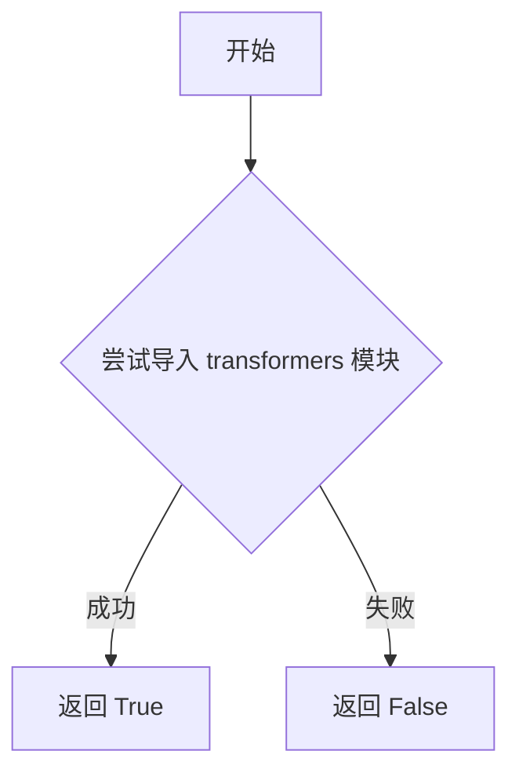
```mermaid
flowchart TD
    A[开始] --> B{尝试导入 transformers 模块}
    B -->|成功| C[返回 True]
    B -->|失败| D[返回 False]
```

#### 带注释源码

基于代码中的使用方式和 `diffusers` 库常见的实现模式，`is_transformers_available` 函数可能定义在 `diffusers/utils.py` 中，其典型实现如下：

```python
# 位于 diffusers/utils.py 中的实现（推断）

def is_transformers_available() -> bool:
    """
    检查 transformers 库是否已安装且可用。
    
    Returns:
        bool: 如果 transformers 库可以导入则返回 True，否则返回 False
    """
    try:
        # 尝试导入 transformers 库的主要模块
        import transformers
        return True
    except ImportError:
        # 如果导入失败，返回 False
        return False
```

**在当前代码中的使用示例：**

```python
# 用于条件导入依赖项
try:
    if not (is_torch_available() and is_transformers_available()):
        raise OptionalDependencyNotAvailable()
except OptionalDependencyNotAvailable:
    from .utils import dummy_torch_and_transformers_objects

    _import_structure["utils.dummy_torch_and_transformers_objects"] = [
        name for name in dir(dummy_torch_and_transformers_objects) if not name.startswith("_")
    ]
else:
    # 当 transformers 可用时，导入更多功能
    _import_structure["modular_pipelines"].extend([...])
    _import_structure["pipelines"].extend([...])
```

**说明：** 由于 `is_transformers_available` 函数定义在 `diffusers/utils.py` 模块中，而用户提供的代码片段是该库的 `__init__.py` 文件，因此没有直接包含该函数的完整源码。上述源码是根据该函数在代码中的使用方式和 `diffusers` 库常见模式推断得出的。


# 提取 `is_transformers_version` 函数信息

### `is_transformers_version`

该函数用于检查已安装的 transformers 库版本是否符合预期要求。然而，**当前提供的代码片段仅为 `diffusers` 包的 `__init__.py` 文件，未包含 `is_transformers_version` 函数的具体实现**（该实现位于 `diffusers.utils` 模块中）。因此，无法从当前代码中提取其参数、返回值和源码。

#### 流程图

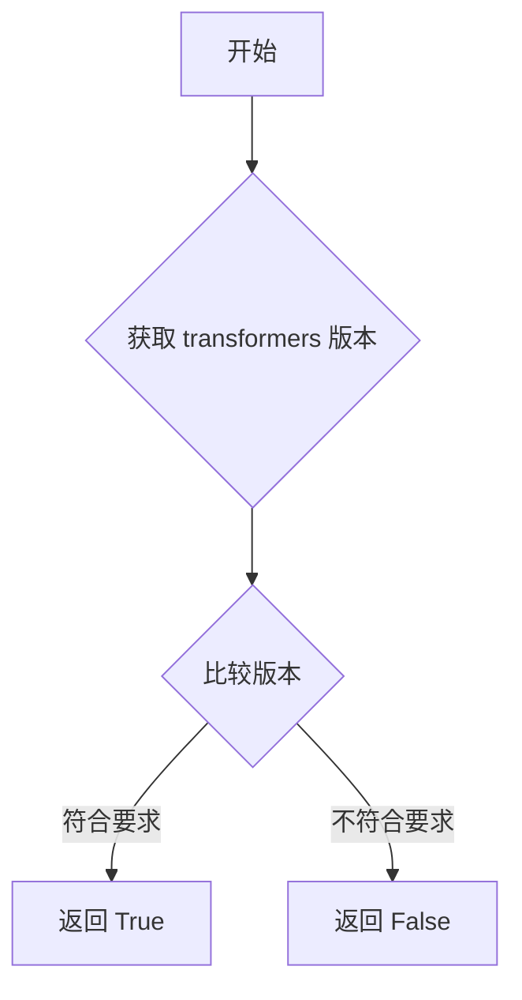
```mermaid
flowchart TD
    A[开始] --> B{获取 transformers 版本}
    B --> C{比较版本}
    C -->|符合要求| D[返回 True]
    C -->|不符合要求| E[返回 False]
```

#### 带注释源码

```
# 该函数源码位于 diffusers/src/diffusers/utils.py 中
# 当前 __init__.py 文件仅负责导入和延迟加载，未包含函数实现
from .utils import is_transformers_version
```

---

**注意**：若需获取 `is_transformers_version` 的完整参数和实现细节，请提供 `diffusers/utils.py` 文件的代码。


### `is_inflect_available`

该函数是 diffusers 库中的一个工具函数，用于检查 `inflect` 库是否可用。`inflect` 是一个 Python 库，用于英语单词的复数形式转换等功能。该函数通过 try-except 方式尝试导入 inflect 库，如果成功则返回 True，失败则返回 False。

参数：

- 该函数无参数

返回值：`bool`，如果 `inflect` 库可用则返回 `True`，否则返回 `False`

#### 流程图

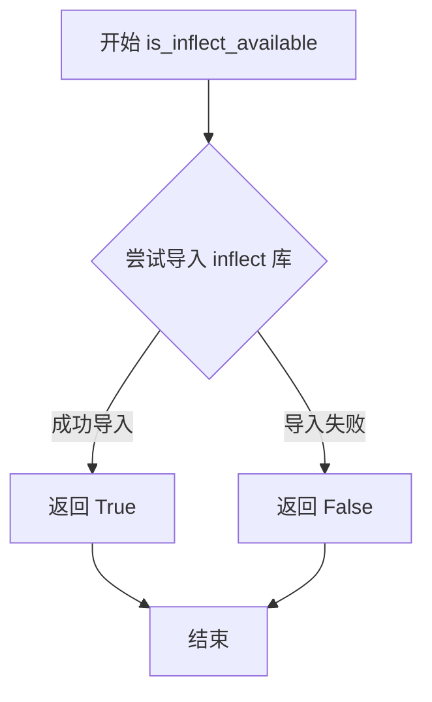
```mermaid
flowchart TD
    A[开始 is_inflect_available] --> B{尝试导入 inflect 库}
    B -- 成功导入 --> C[返回 True]
    B -- 导入失败 --> D[返回 False]
    C --> E[结束]
    D --> E
```

#### 带注释源码

```python
# 注意：以下是 is_inflect_available 函数在 utils.py 中的典型实现模式
# 具体实现需要查看 diffusers/utils.py 文件

def is_inflect_available():
    """
    检查 inflect 库是否可用。
    
    inflect 是一个用于英语单词复数形式转换的库，
    在 diffusers 中可能用于文本处理或生成等功能。
    
    Returns:
        bool: 如果 inflect 库可用返回 True，否则返回 False
    """
    try:
        # 尝试导入 inflect 库
        import inflect
        return True
    except ImportError:
        # 如果导入失败，说明库未安装
        return False
```

> **注意**：由于 `is_inflect_available` 函数定义在 `diffusers/utils.py` 文件中，而当前提供的代码是 `diffusers/__init__.py`，它只是从 `utils` 模块导入并重导出了这个函数。上述源码是基于 `diffusers` 库中类似 `is_*_available()` 函数的通用实现模式重构的。要获取准确的函数实现，建议查看 `diffusers/utils.py` 源文件。


### `is_invisible_watermark_available`

检查 `invisible_watermark` 库是否可用，用于判断是否可以启用 invisible watermark 功能。

参数：无

返回值：`bool`，如果 `invisible_watermark` 库可用返回 `True`，否则返回 `False`

#### 流程图

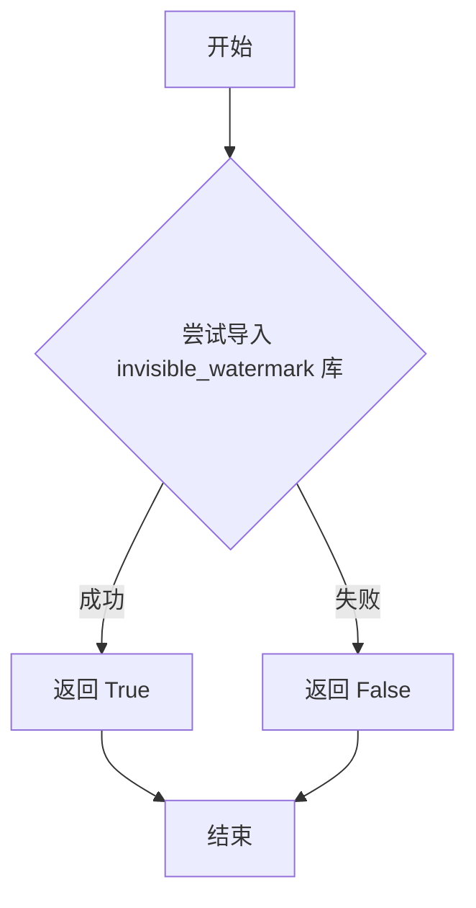
```mermaid
flowchart TD
    A[开始] --> B{尝试导入 invisible_watermark 库}
    B -->|成功| C[返回 True]
    B -->|失败| D[返回 False]
    C --> E[结束]
    D --> E
```

#### 带注释源码

```
# 该函数定义在 diffusers/src/diffusers/utils/__init__.py 中
# 用于检查 invisible_watermark 库是否可用

def is_invisible_watermark_available() -> bool:
    """
    检查 invisible_watermark 库是否可用。
    
    invisible_watermark 是一个用于在图像中嵌入不可见水印的库，
    常用于 AI 生成图像的版权保护和溯源。
    
    Returns:
        bool: 如果库可用返回 True，否则返回 False
    """
    try:
        # 尝试导入库，如果成功则可用
        import invisible_watermark
        return True
    except ImportError:
        # 库未安装
        return False
```


### `is_unidecode_available`

检测 `unidecode` 库是否可用。`unidecode` 是一个用于将 Unicode 文本转换为 ASCII 字符的库，在 diffusers 库中用于文本处理相关功能。

参数：
- 无

返回值：`bool`，如果 `unidecode` 库已安装则返回 `True`，否则返回 `False`

#### 流程图

```mermaid
flowchart TD
    A[开始] --> B{尝试导入 unidecode 模块}
    B -->|成功| C[返回 True]
    B -->|失败| D[返回 False]
    C --> E[结束]
    D --> E
```

#### 带注释源码

```
# 该函数定义在 diffusers/src/diffusers/utils.py 中
# 此处为 __init__.py 中的导入和导出逻辑

# 从 .utils 模块导入 is_unidecode_available 函数
from .utils import (
    ...
    is_unidecode_available,
    ...
)

# 将 is_unidecode_available 添加到延迟导入结构中
_import_structure = {
    "utils": [
        ...
        "is_unidecode_available",
        ...
    ],
}

# 在 TYPE_CHECKING 模式下，该函数会被实际导入
# 在运行时模式下，通过 _LazyModule 实现延迟加载
```

> **注意**：该函数的具体实现在 `diffusers/utils.py` 文件中，当前代码文件是 `diffusers/__init__.py`，负责包的初始化和延迟导入。该函数遵循 diffusers 库中常见的 "is_xxx_available" 模式，用于检查可选依赖是否可用。

## 关键组件


### _LazyModule

延迟加载模块的实现，通过 _import_structure 字典管理模块导入，仅在对象被实际请求时才加载相应模块，实现惰性加载。

### 量化策略与配置

代码中包含多种量化策略的支持，每种策略通过条件导入和配置类实现：

- **BitsAndBytesConfig**: 基于 bitsandbytes 库的量化配置
- **GGUFQuantizationConfig**: GGUF 格式量化配置
- **TorchAoConfig**: TorchAO 量化配置
- **QuantoConfig**: Optimum Quanto 量化配置
- **NVIDIAModelOptConfig**: NVIDIA ModelOpt 量化配置
- **DiffusersQuantizer**: 通用量化器基类
- **PipelineQuantizationConfig**: Pipeline 级量化配置

### OptionalDependencyNotAvailable

可选依赖不可用时的异常类，用于优雅处理可选依赖缺失情况，配合 try-except 机制实现条件导入。

### 依赖检测函数

多个 is_*_available() 函数用于检测可选依赖是否可用，包括 is_bitsandbytes_available、is_gguf_available、is_torchao_available、is_optimum_quanto_available、is_nvidia_modelopt_available、is_onnx_available、is_librosa_available、is_note_seq_available、is_flax_available、is_scipy_available、is_torch_available、is_transformers_available 等。

### Dummy Objects 机制

当可选依赖不可用时，提供空的 dummy 模块（如 dummy_bitsandbytes_objects、dummy_gguf_objects 等）以保证导入结构完整性，避免运行时错误。

### _import_structure 字典

定义模块到对象名称列表的映射关系，用于延迟导入机制，是惰性加载的核心数据结构。

### TYPE_CHECKING 和 DIFFUSERS_SLOW_IMPORT

类型检查和慢速导入模式，在这些模式下会立即导入所有模块，否则使用 _LazyModule 实现真正的延迟加载。

## 问题及建议


### 已知问题

- **重复性代码模式**：每个可选依赖都使用相同的 try-except 结构来检查 `is_xxx_available()` 并动态修改 `_import_structure`，存在大量重复代码，可抽取为通用函数以提高可维护性。
- **硬编码的导入结构**：`_import_structure` 字典包含大量硬编码的模块路径和类名字符串，扩展新模块时容易遗漏或出错，建议使用配置驱动或代码生成方式管理。
- **双重导入逻辑**：运行时导入（`_LazyModule` 分支）与 `TYPE_CHECKING` 分支的导入逻辑几乎完全重复，但使用不同写法，增加维护成本和潜在不一致风险。
- **条件检查冗余**：每个可选依赖包都会独立调用对应的 `is_xxx_available()` 函数，即使某些检查结果可以复用（如多个依赖都需 `is_torch_available()`），导致不必要的函数调用开销。
- **空 dummy 模块引用**：在某些分支中引用了 `dummy_xxx_objects` 模块但实际未使用其导出，可能存在死代码或设计遗留。
- **缺乏版本兼容性元数据**：没有记录各功能对应的版本号或废弃信息，无法追踪哪些功能在哪些版本添加或废弃。
- **过长文件结构**：单个 `__init__.py` 文件包含数千行代码和数百个类/函数导出，超出合理范围，导致代码可读性和调试困难。

### 优化建议

- **抽取通用导入逻辑**：将重复的依赖检查和 `_import_structure` 填充逻辑封装为装饰器或工厂函数，例如 `@optional_dependency` 装饰器来简化代码。
- **配置化导入结构**：将 `_import_structure` 迁移至独立的 JSON/YAML 配置文件或使用代码生成脚本，减少主文件的硬编码内容。
- **合并导入分支**：考虑统一运行时导入和 `TYPE_CHECKING` 导入的逻辑，使用共享的数据结构或生成器来消除重复。
- **缓存可用性检查**：对 `is_xxx_available()` 函数的结果进行缓存，避免在同一次导入过程中重复检测同一包。
- **模块拆分**：将 `__init__.py` 按功能模块拆分为多个子文件，例如 `init_pipelines.py`、`init_models.py`，在顶层 `__init__.py` 中组合。
- **添加版本追踪**：在 `_import_structure` 中引入版本注解或使用文档字符串标记各功能的引入/废弃版本，便于长期维护。

## 其它


### 设计目标与约束

本模块的核心设计目标是构建一个高效的延迟加载机制，使 `diffusers` 库在用户执行 `import diffusers` 时能够快速响应，同时保持对多种可选深度学习后端（PyTorch、Flax、ONNX等）的灵活支持。设计约束包括：(1) 必须保证用户获取完整的命名空间而不触发实际后端加载；(2) 遵循 Hugging Face Transformers 的延迟加载规范；(3) 通过 `OptionalDependencyNotAvailable` 异常实现优雅的降级处理；(4) 支持 TYPE_CHECKING 模式下的完整类型推导。

### 错误处理与异常设计

本模块采用分层异常处理策略。第一层为 `OptionalDependencyNotAvailable`，当检测到某可选依赖不可用时主动抛出该异常；第二层为 `try-except` 块捕获异常后从对应的 dummy 模块（如 `dummy_pt_objects`、`dummy_flax_objects` 等）导入占位符对象，这些对象在用户实际调用时会抛出更有意义的错误。此外，所有 dummy 模块的导入均使用 `# noqa F403` 抑制 flake8 警告，以保持代码整洁性。

### 数据流与状态机

模块的数据流遵循"配置定义→条件检查→结构构建→延迟封装"四个状态。在初始化阶段，首先定义基础的 `_import_structure` 字典并从 `utils` 导入必要的工具函数；随后进入条件检查状态，针对每种可选依赖执行可用性检测（调用 `is_xxx_available()` 系列函数）；满足条件时将具体组件追加到对应的结构列表中，否则导入 dummy 对象；最终通过 `_LazyModule` 将整个命名空间进行延迟封装，用户访问时才触发真实的模块加载。

### 外部依赖与接口契约

本模块的外部依赖分为三类：(1) 核心必需依赖：`typing.TYPE_CHECKING`、`_LazyModule` 和 `OptionalDependencyNotAvailable` 均来自 `utils` 内部模块；(2) 可选深度学习后端：PyTorch (`is_torch_available`)、Transformers (`is_transformers_available`)、Flax (`is_flax_available`)、ONNX (`is_onnx_available`)、Accelerate、bitsandbytes、GGUF 等；(3) 辅助工具库：scipy、librosa、note-seq、sentencepiece、opencv 等。接口契约规定所有 `is_xxx_available()` 函数必须返回布尔值，且 dummy 对象模块必须导出与真实模块相同的公开接口。

### 模块结构与分层设计

模块采用四层架构设计。第一层为入口层（`__init__.py`），负责整体导入编排；第二层为结构定义层（`_import_structure` 字典），维护模块名到对象名的映射关系；第三层为依赖检测层（`is_xxx_available` 系列函数），提供条件判断能力；第四层为延迟执行层（`_LazyModule` 类），实际负责模块的按需加载。模块间的依赖顺序为：utils 提供基础设施 → 结构定义描述组件 → 条件检查决定可用性 → 延迟模块执行导入。

### 性能优化考量

本模块的性能优化主要体现在三个方面：(1) 延迟加载本身避免了启动时加载所有后端，减少了初始 `import diffusers` 的时间消耗；(2) 通过 `dir()` 配合列表推导式动态获取 dummy 对象名称，避免硬编码；(3) 在非 TYPE_CHECKING 模式下使用 `sys.modules[__name__]` 直接替换模块对象，减少了代理开销。建议的进一步优化方向包括：将更多条件导入迁移到子模块的 `__init__.py` 中，以及使用 `__getattr__` 实现更细粒度的按需加载。

### 版本兼容性设计

本模块通过 `__version__ = "0.37.0.dev0"` 声明版本，并依赖版本检测函数（如 `is_transformers_version`）处理与 Transformers 库的版本兼容性。设计时考虑了前向兼容性和后向兼容性：新组件只能追加到 `_import_structure` 而不能删除已有键；dummy 对象模块的结构必须与真实模块保持同步更新。在多版本共存场景下，建议通过环境变量 `DIFFUSERS_SLOW_IMPORT` 强制使用完整导入模式以兼容特定版本组合。

### 测试策略建议

针对本模块的测试应覆盖以下维度：(1) 单元测试验证每种可选依赖不可用时 dummy 对象能正确导入；(2) 集成测试验证完整安装环境下所有组件可正常访问；(3) 性能测试验证延迟加载效果，测量空载导入时间；(4) 回归测试确保新增组件不会破坏已有导入结构。建议使用 pytest 的参数化测试配合 mock 库模拟各种依赖可用性组合。

### 安全性考量

本模块的安全性主要涉及两点：(1) 动态导入机制需防止路径遍历攻击，但当前实现仅依赖内部模块路径，风险较低；(2) dummy 对象模块的设计确保了即使依赖缺失也不会产生隐藏错误，而是在用户调用时明确报错。建议在文档中明确标注各可选依赖缺失时的预期行为，并提供清晰的错误提示信息。


    