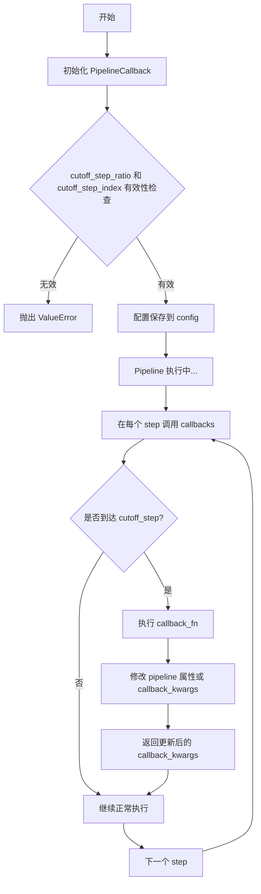
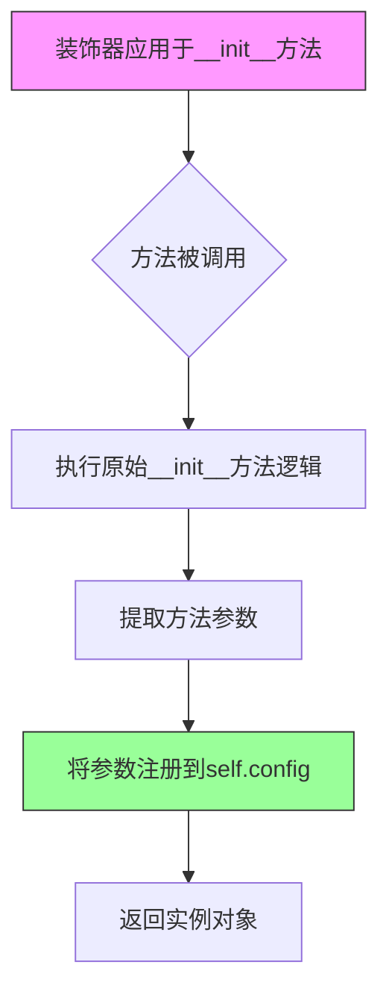
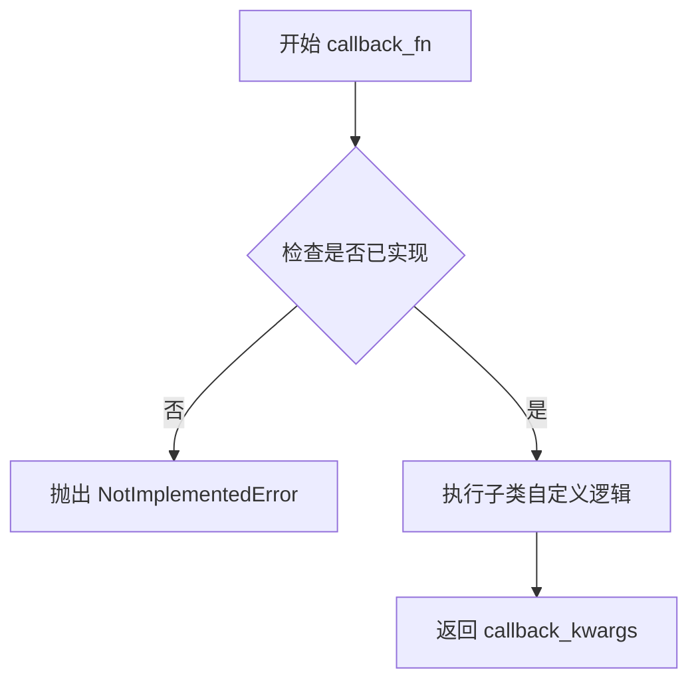
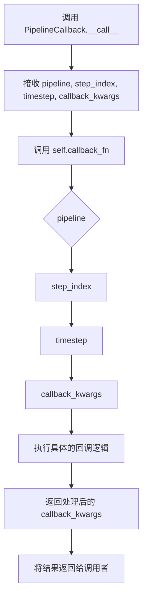
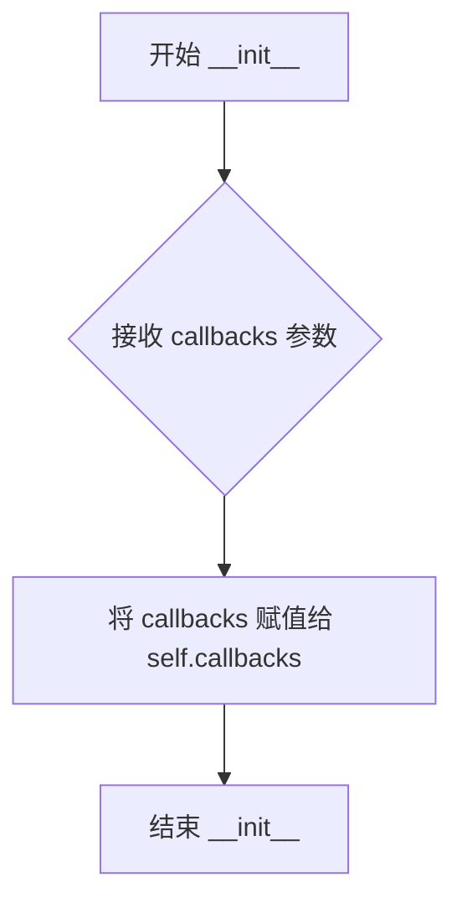
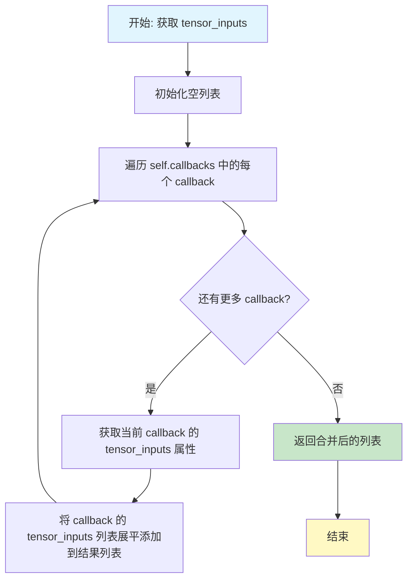
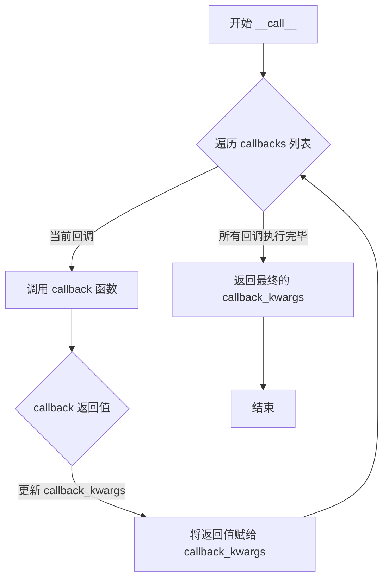
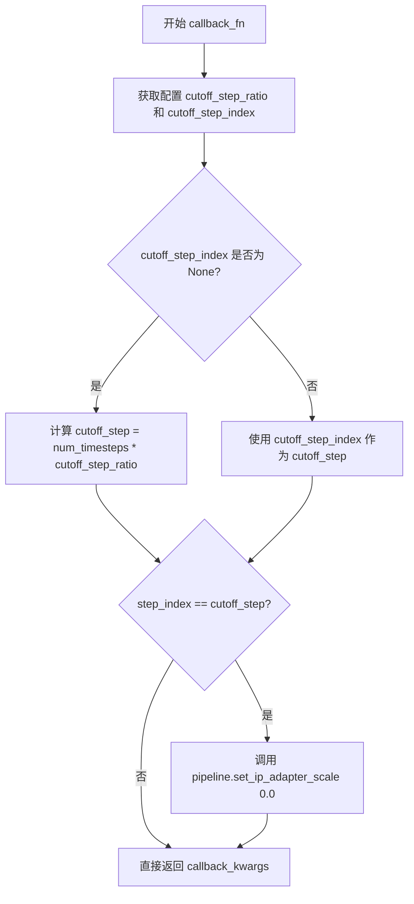

# `diffusers\src\diffusers\callbacks.py` 详细设计文档

这是一个用于Diffusion模型流水线的回调系统，提供了统一的回调接口来在特定步骤禁用CFG（Classifier-Free Guidance）或调整IP Adapter权重，实现条件生成控制的自动化。

## 整体流程



## 类结构

```
ConfigMixin (基类)
└── PipelineCallback (抽象基类)
    ├── MultiPipelineCallbacks (容器类)
    ├── SDCFGCutoffCallback (SD CFG截断)
    ├── SDXLCFGCutoffCallback (SDXL CFG截断)
    ├── SDXLControlnetCFGCutoffCallback (SDXL+Controlnet CFG截断)
    ├── IPAdapterScaleCutoffCallback (IP Adapter截断)
    └── SD3CFGCutoffCallback (SD3 CFG截断)
```

## 全局变量及字段


### `CONFIG_NAME`
    
Global constant representing the configuration file name, used as the default config file name for pipelines

类型：`str`
    


### `PipelineCallback.config_name`
    
Class attribute storing the configuration file name, assigned from CONFIG_NAME

类型：`str`
    


### `PipelineCallback.config`
    
Instance attribute storing the configuration object, populated by register_to_config decorator from init parameters

类型：`ConfigObject`
    


### `MultiPipelineCallbacks.callbacks`
    
Instance attribute storing a list of PipelineCallback objects to be executed in order

类型：`list[PipelineCallback]`
    


### `SDCFGCutoffCallback.tensor_inputs`
    
Class attribute defining the tensor inputs required by this callback, containing 'prompt_embeds'

类型：`list[str]`
    


### `SDXLCFGCutoffCallback.tensor_inputs`
    
Class attribute defining the tensor inputs required by this callback, containing 'prompt_embeds', 'add_text_embeds', and 'add_time_ids'

类型：`list[str]`
    


### `SDXLControlnetCFGCutoffCallback.tensor_inputs`
    
Class attribute defining the tensor inputs required by this callback, containing 'prompt_embeds', 'add_text_embeds', 'add_time_ids', and 'image'

类型：`list[str]`
    


### `IPAdapterScaleCutoffCallback.tensor_inputs`
    
Class attribute defining the tensor inputs required by this callback, currently empty as this callback operates on IP Adapter processors

类型：`list[str]`
    


### `SD3CFGCutoffCallback.tensor_inputs`
    
Class attribute defining the tensor inputs required by this callback, containing 'prompt_embeds' and 'pooled_prompt_embeds'

类型：`list[str]`
    
    

## 全局函数及方法


### `register_to_config`

`register_to_config` 是一个装饰器函数，用于将类的 `__init__` 方法参数自动注册为配置属性。它通常与 `ConfigMixin` 类配合使用，使得子类可以通过 `self.config` 访问这些被注册的参数，实现配置的统一管理和序列化。

参数：

-  `func`：`Callable`，被装饰的 `__init__` 方法，作为装饰器的输入函数

返回值：`Callable`，装饰后的函数，返回一个包装后的 `__init__` 方法

#### 流程图



#### 带注释源码

```python
# 该函数定义在 configuration_utils 模块中，此处为基于使用方式的推断实现
def register_to_config(func):
    """
    装饰器：用于将 __init__ 方法的参数自动注册为配置属性
    
    使用示例:
        @register_to_config
        def __init__(self, cutoff_step_ratio=1.0, cutoff_step_index=None):
            super().__init__()
            ...
    """
    # 使用 functools.wraps 保留原函数的元信息
    @functools.wraps(func)
    def wrapper(self, *args, **kwargs):
        # 1. 首先执行原始的 __init__ 方法
        func(self, *args, **kwargs)
        
        # 2. 获取方法的参数签名
        sig = inspect.signature(func)
        bound_args = sig.bind(self, *args, **kwargs)
        bound_args.apply_defaults()
        
        # 3. 将参数名和值注册到 self.config
        # 假设 self 是 ConfigMixin 的子类，已经初始化了 config 属性
        for param_name, param_value in bound_args.arguments.items():
            if param_name != 'self' and param_value is not None:
                # 将参数值存储到配置中
                setattr(self.config, param_name, param_value)
        
        # 4. 返回实例
        return self
    
    return wrapper


# 在 PipelineCallback 中的使用方式：
# @register_to_config
# def __init__(self, cutoff_step_ratio=1.0, cutoff_step_index=None):
#     super().__init__()
#     # ... 参数验证逻辑
```

> **注意**：由于 `register_to_config` 函数定义在外部模块 `configuration_utils` 中，以上源码为基于其使用方式的合理推断。实际实现可能略有差异，但核心功能是将 `__init__` 方法的参数自动注册到配置对象中，以便后续通过 `self.config` 属性访问。


### `PipelineCallback.__init__`

这是 `PipelineCallback` 类的构造函数，用于初始化回调对象的基本配置参数。该方法接收两个可选参数来控制回调的触发时机，并进行参数校验以确保配置的合法性。

参数：

- `cutoff_step_ratio`：`float`，可选参数（默认值为 `1.0`），表示相对于总步数的比例，用于确定在哪个比例步骤触发回调（例如设为 `0.5` 表示在执行到 50% 步骤时触发）
- `cutoff_step_index`：`int`，可选参数（默认值为 `None`），表示具体的步骤索引，用于直接指定在哪个步骤触发回调

返回值：`None`，该方法为构造函数，不返回任何值

#### 流程图

```mermaid
flowchart TD
    A[开始 __init__] --> B[调用 super().__init__ 初始化父类]
    B --> C{检查 cutoff_step_ratio 和 cutoff_step_index}
    C -->|两者都为 None| D[抛出 ValueError: 需提供其中一个参数]
    C -->|两者都不为 None| E[抛出 ValueError: 只能提供其中一个参数]
    C -->|满足条件（任一参数有值）| F{检查 cutoff_step_ratio 有效性}
    F -->|cutoff_step_ratio 不为 None| G{类型检查和范围检查}
    G -->|不是 float 类型或不在 [0.0, 1.0] 范围内| H[抛出 ValueError: cutoff_step_ratio 必须是 0.0-1.0 之间的 float]
    G -->|通过验证| I[结束 __init__]
    F -->|cutoff_step_ratio 为 None| I
    D --> J[结束]
    E --> J
    H --> J
```

#### 带注释源码

```python
@register_to_config
def __init__(self, cutoff_step_ratio=1.0, cutoff_step_index=None):
    """
    初始化 PipelineCallback 对象。
    
    参数:
        cutoff_step_ratio: 浮点数，表示执行步数的比例阈值 (0.0 ~ 1.0)，默认为 1.0
        cutoff_step_index: 整数，表示具体的执行步数索引，默认为 None
    """
    # 调用父类 ConfigMixin 的初始化方法，确保配置注册等功能正常
    super().__init__()

    # 参数互斥性校验：cutoff_step_ratio 和 cutoff_step_index 不能同时为空或同时有值
    # 必须且仅能提供其中一个参数来确定回调触发时机
    if (cutoff_step_ratio is None and cutoff_step_index is None) or (
        cutoff_step_ratio is not None and cutoff_step_index is not None
    ):
        raise ValueError("Either cutoff_step_ratio or cutoff_step_index should be provided, not both or none.")

    # cutoff_step_ratio 的有效性校验：必须是 float 类型且在 [0.0, 1.0] 范围内
    if cutoff_step_ratio is not None and (
        not isinstance(cutoff_step_ratio, float) or not (0.0 <= cutoff_step_ratio <= 1.0)
    ):
        raise ValueError("cutoff_step_ratio must be a float between 0.0 and 1.0.")
```


### `PipelineCallback.tensor_inputs`

该属性是 `PipelineCallback` 基类中定义的属性方法（property），用于声明回调函数需要处理的张量输入名称。子类需要通过覆盖（override）此属性来指定自己需要的张量键，以便在管道执行过程中获取相应的张量数据进行操作。

参数： 无（作为属性访问，不接受参数）

返回值： `list[str]`，返回回调需要处理的所有张量输入键名称列表

#### 流程图

```mermaid
flowchart TD
    A[访问 tensor_inputs 属性] --> B{子类是否覆盖?}
    B -->|是| C[返回子类定义的列表]
    B -->|否| D[抛出 NotImplementedError]
    
    C --> E[例如: ['prompt_embeds']]
    C --> F[例如: ['prompt_embeds', 'add_text_embeds', 'add_time_ids']]
    C --> G[例如: []]
```

#### 带注释源码

```python
@property
def tensor_inputs(self) -> list[str]:
    """
    属性方法：返回当前回调需要处理的张量输入键名称列表。
    
    这是一个抽象属性，子类必须覆盖（override）此属性并返回一个包含
    张量键名称的列表。这些键名称对应于 pipeline 回调_kwargs 字典中的键，
    用于在 callback_fn 执行时获取相应的张量数据。
    
    返回:
        list[str]: 张量输入键名称列表，例如 ['prompt_embeds', 'add_text_embeds']。
        
    异常:
        NotImplementedError: 如果子类未覆盖此属性，则抛出此异常。
    """
    raise NotImplementedError(f"You need to set the attribute `tensor_inputs` for {self.__class__}")
```

---

### 子类中的实现示例

在子类中，`tensor_inputs` 被定义为**类属性**（而非属性方法），例如：

```python
class SDCFGCutoffCallback(PipelineCallback):
    """
    Stable Diffusion CFG 截断回调，指定需要的张量输入为 prompt_embeds
    """
    # 类属性：声明该回调需要的张量输入键
    tensor_inputs = ["prompt_embeds"]

class SDXLCFGCutoffCallback(PipelineCallback):
    """
    Stable Diffusion XL CFG 截断回调，需要多个张量输入
    """
    # 类属性：声明需要处理的条件嵌入、附加文本嵌入和时间ID
    tensor_inputs = [
        "prompt_embeds",
        "add_text_embeds",
        "add_time_ids",
    ]

class IPAdapterScaleCutoffCallback(PipelineCallback):
    """
    IP Adapter 截断回调，不需要任何张量输入
    """
    # 类属性：空列表，该回调不依赖任何张量数据
    tensor_inputs = []
```

---

### 设计说明

| 项目 | 说明 |
|------|------|
| **设计意图** | 让回调类声明自己需要处理哪些张量，便于 `MultiPipelineCallbacks` 聚合所有回调的张量需求 |
| **覆盖方式** | 子类通过定义**类属性**（而非属性方法）来覆盖 |
| **类型约束** | 必须是 `list[str]`，每个元素对应 `callback_kwargs` 字典中的键 |
| **使用场景** | 在 pipeline 执行循环中，根据此列表提取对应的张量传递给回调函数 |


### `PipelineCallback.callback_fn`

定义回调函数的核心接口，用于在管道的特定步骤执行自定义操作。基类中该方法为抽象方法，抛出 `NotImplementedError`，需由子类实现具体逻辑。

参数：

- `pipeline`：`Any`，执行中的管道对象，传入当前正在运行的 Pipeline 实例。
- `step_index`：`int`，当前执行的步骤索引，用于判断是否达到截断条件。
- `timesteps`：`Any`，当前的时间步信息（具体类型取决于 Pipeline 实现，通常为整数或张量）。
- `callback_kwargs`：`dict[str, Any]`，包含管道执行过程中传递的上下文关键字参数，如 `prompt_embeds` 等张量数据。

返回值：`dict[str, Any]`，返回处理后的 `callback_kwargs`，供后续步骤使用。

#### 流程图



#### 带注释源码

```python
def callback_fn(self, pipeline, step_index, timesteps, callback_kwargs) -> dict[str, Any]:
    """
    定义回调的核心功能。子类必须重写此方法以实现具体的回调逻辑。
    基类中该方法仅抛出异常，提示调用者需要实现该方法。

    参数:
        pipeline: 正在执行的管道对象。
        step_index: 当前步骤索引。
        timesteps: 当前时间步。
        callback_kwargs: 包含张量输入等关键信息的字典。

    返回:
        处理后的 callback_kwargs 字典。
    """
    raise NotImplementedError(f"You need to implement the method `callback_fn` for {self.__class__}")
```


### `PipelineCallback.__call__`

该方法是 `PipelineCallback` 类的可调用接口，通过委托调用子类的 `callback_fn` 方法来实现具体的回调逻辑，提供了统一的回调触发机制。

参数：

- `pipeline`：`Any`，Pipeline 对象，包含扩散模型的所有组件（如 UNet、VAE、调度器等），回调函数可以访问和修改其属性
- `step_index`：`int`，当前推理步骤的索引，从 0 开始递增
- `timestep`：`Any`，当前扩散过程的时间步，通常为整数或张量
- `callback_kwargs`：`dict[str, Any]`），包含张量输入的字典，如 prompt_embeds、add_text_embeds 等，回调函数可以读取和修改这些值

返回值：`dict[str, Any]`，经过 `callback_fn` 处理后的 `callback_kwargs`，可能包含修改后的张量或其他数据

#### 流程图



#### 带注释源码

```python
def __call__(self, pipeline, step_index, timestep, callback_kwargs) -> dict[str, Any]:
    """
    使 PipelineCallback 实例可调用。
    
    参数:
        pipeline: Pipeline 对象，包含扩散模型的所有组件
        step_index: 当前推理步骤的索引
        timestep: 当前扩散过程的时间步
        callback_kwargs: 包含张量输入的字典，如 prompt_embeds 等
    
    返回:
        经过 callback_fn 处理后的 callback_kwargs 字典
    """
    # 委托给子类实现的 callback_fn 方法执行具体的回调逻辑
    # 子类需要实现 callback_fn 方法来定义具体的处理行为
    return self.callback_fn(pipeline, step_index, timestep, callback_kwargs)
```


### `MultiPipelineCallbacks.__init__`

该方法是`MultiPipelineCallbacks`类的构造函数，用于初始化一个支持多个管道回调的容器对象，将传入的回调函数列表存储为实例属性，以便后续统一调用。

参数：

- `callbacks`：`list[PipelineCallback]`，待管理的回调函数列表，每个元素必须是`PipelineCallback`类或其子类的实例

返回值：`None`，构造函数不返回任何值，仅初始化实例状态

#### 流程图



#### 带注释源码

```python
def __init__(self, callbacks: list[PipelineCallback]):
    """
    初始化 MultiPipelineCallbacks 实例。
    
    参数:
        callbacks: PipelineCallback 对象列表，用于在管道执行过程中
                   按顺序调用多个回调函数
    
    返回值:
        无返回值（__init__ 方法）
    """
    # 将传入的回调函数列表存储为实例属性
    # 后续通过 __call__ 方法统一遍历执行所有回调
    self.callbacks = callbacks
```


### MultiPipelineCallbacks.tensor_inputs

该属性方法用于收集并合并所有已注册回调对象的 `tensor_inputs` 属性，返回一个包含所有回调所需张量输入名称的列表。

参数：

- 该方法无显式参数（隐式参数 `self` 为 `MultiPipelineCallbacks` 实例，表示回调集合管理器）

返回值：`list[str]`，返回所有回调张量输入名称的合并列表

#### 流程图



#### 带注释源码

```python
@property
def tensor_inputs(self) -> list[str]:
    """
    收集并合并所有回调的 tensor_inputs 属性。
    
    该属性方法遍历所有已注册的回调对象，提取每个回调的 tensor_inputs，
    并将它们合并成一个统一的列表，用于标识整个回调链所需的所有张量输入。
    
    Returns:
        list[str]: 所有回调张量输入名称的合并列表。例如，如果有两个回调，
                  第一个需要 ['prompt_embeds']，第二个需要 ['image']，
                  则返回 ['prompt_embeds', 'image']。
    
    Example:
        >>> callbacks = [SDCFGCutoffCallback(), IPAdapterScaleCutoffCallback()]
        >>> multi_callbacks = MultiPipelineCallbacks(callbacks)
        >>> multi_callbacks.tensor_inputs
        ['prompt_embeds']  # IPAdapterScaleCutoffCallback 的 tensor_inputs 为空列表
    """
    # 使用列表推导式进行嵌套遍历和展平
    # 外层循环遍历每个回调，内层循环遍历每个回调的 tensor_inputs 列表
    return [input for callback in self.callbacks for input in callback.tensor_inputs]
```


### `MultiPipelineCallbacks.__call__`

该方法是`MultiPipelineCallbacks`类的核心调用方法，用于按顺序执行所有注册的回调函数，并将回调链的最终结果返回。

参数：

- `pipeline`：`Any`，执行中的 pipeline 对象
- `step_index`：`int`，当前的步骤索引
- `timestep`：`Any`，当前的时间步（具体类型取决于 pipeline 实现）
- `callback_kwargs`：`dict[str, Any]`，包含回调所需关键字参数的字典，会在回调链中被逐步修改

返回值：`dict[str, Any]`，经过所有回调处理后的最终 callback_kwargs

#### 流程图



#### 带注释源码

```python
def __call__(self, pipeline, step_index, timestep, callback_kwargs) -> dict[str, Any]:
    """
    Calls all the callbacks in order with the given arguments and returns the final callback_kwargs.
    
    该方法实现了可调用对象接口，使 MultiPipelineCallbacks 实例可以像函数一样被调用。
    它遍历内部存储的所有 PipelineCallback 对象，按顺序执行每个回调，并将前一个回调的
    返回值作为下一个回调的输入，从而形成回调链。
    
    参数:
        pipeline: 执行中的 pipeline 对象，包含了运行时的各种状态和属性
        step_index: 当前的推理步骤索引，用于判断是否达到截止条件
        timestep: 当前的时间步长信息，不同 pipeline 实现中类型可能不同
        callback_kwargs: 关键字参数字典，包含如 prompt_embeds 等张量，会在回调链中被修改
    
    返回值:
        经过所有回调处理后的最终 callback_kwargs 字典
    """
    # 遍历所有注册的回调函数
    for callback in self.callbacks:
        # 调用每个回调函数，将前一个回调的返回值作为下一个回调的输入
        # callback 实际上会调用 PipelineCallback.__call__，后者再调用 callback_fn
        callback_kwargs = callback(pipeline, step_index, timestep, callback_kwargs)
    
    # 返回经过所有回调处理后的最终参数字典
    return callback_kwargs
```


### SDCFGCutoffCallback.callback_fn

该方法是一个用于Stable Diffusion Pipeline的回调函数，在达到指定的截断步骤后禁用CFG（Classifier-Free Guidance）。它通过将`prompt_embeds`裁剪为仅保留条件嵌入，并将`pipeline._guidance_scale`设置为0.0来实现无条件生成切换。

参数：

- `self`：SDCFGCutoffCallback，回调函数所在的实例对象
- `pipeline`：Any，当前执行的Pipeline对象，用于访问配置属性（如`num_timesteps`）和修改内部状态（如`_guidance_scale`）
- `step_index`：int，当前执行的步骤索引，用于与截断步骤进行比较
- `timestep`：int，当前执行的时间步（该参数在当前实现中未被使用）
- `callback_kwargs`：dict[str, Any]，包含回调张量的字典，如`prompt_embeds`等，会被该回调函数修改

返回值：`dict[str, Any]`，返回更新后的`callback_kwargs`字典，其中`prompt_embeds`被裁剪为仅包含条件嵌入

#### 流程图

```mermaid
flowchart TD
    A[开始 callback_fn] --> B[获取配置参数]
    B --> C{cutoff_step_index 是否为 None}
    C -->|是| D[计算 cutoff_step = num_timesteps × cutoff_step_ratio]
    C -->|否| E[使用 cutoff_step_index 作为 cutoff_step]
    D --> F{step_index == cutoff_step?}
    E --> F
    F -->|否| G[直接返回 callback_kwargs]
    F -->|是| H[从 callback_kwargs 获取 prompt_embeds]
    H --> I[裁剪 prompt_embeds 为 [-1]]
    I --> J[设置 pipeline._guidance_scale = 0.0]
    J --> K[更新 callback_kwargs 中的 prompt_embeds]
    K --> G
```

#### 带注释源码

```python
def callback_fn(self, pipeline, step_index, timestep, callback_kwargs) -> dict[str, Any]:
    """
    回调函数核心逻辑：在达到截断步骤时禁用CFG
    
    参数:
        pipeline: Pipeline对象，包含num_timesteps等属性
        step_index: 当前步骤索引
        timestep: 当前时间步（本例中未使用）
        callback_kwargs: 包含prompt_embeds等张量的字典
    
    返回:
        更新后的callback_kwargs字典
    """
    
    # 从配置中获取截断参数
    cutoff_step_ratio = self.config.cutoff_step_ratio      # 截断步骤比例 (0.0-1.0)
    cutoff_step_index = self.config.cutoff_step_index      # 截断步骤索引 (可选)
    
    # 根据配置确定截断步骤
    # 如果cutoff_step_index存在则使用它，否则通过比例计算
    cutoff_step = (
        cutoff_step_index if cutoff_step_index is not None 
        else int(pipeline.num_timesteps * cutoff_step_ratio)
    )
    
    # 判断是否到达截断步骤
    if step_index == cutoff_step:
        # 获取prompt_embeds（第一个tensor_inputs）
        prompt_embeds = callback_kwargs[self.tensor_inputs[0]]
        
        # 裁剪为仅保留最后一个嵌入（条件嵌入）
        # "-1" 表示仅保留条件文本标记的嵌入，去除无条件嵌入
        prompt_embeds = prompt_embeds[-1:]
        
        # 将guidance_scale设置为0.0以禁用CFG
        pipeline._guidance_scale = 0.0
        
        # 更新callback_kwargs中的prompt_embeds
        callback_kwargs[self.tensor_inputs[0]] = prompt_embeds
    
    # 返回更新后的callback_kwargs供下一个回调使用
    return callback_kwargs
```


### `SDXLCFGCutoffCallback.callback_fn`

该方法是 Stable Diffusion XL Pipeline 的回调函数，用于在指定的截断步骤后禁用 CFG（Classifier-Free Guidance）。它通过将 `prompt_embeds`、`add_text_embeds` 和 `add_time_ids` 截取为最后一步的嵌入，并将管道的 `_guidance_scale` 设置为 0.0 来实现 CFG 的动态关闭。

参数：

- `pipeline`：对象，Stable Diffusion XL Pipeline 实例，用于访问配置属性（如 `num_timesteps`）以及修改内部状态（如 `_guidance_scale`）
- `step_index`：整数，当前执行步骤的索引，用于与截断步骤进行比较以确定何时禁用 CFG
- `timestep`：当前的时间步信息（具体类型取决于 Pipeline 实现）
- `callback_kwargs`：字典，包含张量嵌入的字典，键包括 `prompt_embeds`、`add_text_embeds` 和 `add_time_ids`，这些嵌入将被截取最后一步

返回值：`dict[str, Any]`，返回修改后的 `callback_kwargs`，其中张量嵌入已被截取为条件 token 的嵌入

#### 流程图

```mermaid
flowchart TD
    A[开始 callback_fn] --> B[获取配置参数 cutoff_step_ratio 和 cutoff_step_index]
    B --> C{cutoff_step_index 是否为 None?}
    C -->|是| D[计算 cutoff_step = int(pipeline.num_timesteps * cutoff_step_ratio)]
    C -->|否| E[使用 cutoff_step_index 作为 cutoff_step]
    D --> F{step_index == cutoff_step?}
    E --> F
    F -->|否| G[直接返回 callback_kwargs]
    F -->|是| H[从 callback_kwargs 获取 prompt_embeds]
    H --> I[截取 prompt_embeds 最后一步]
    I --> J[从 callback_kwargs 获取 add_text_embeds]
    J --> K[截取 add_text_embeds 最后一步]
    K --> L[从 callback_kwargs 获取 add_time_ids]
    L --> M[截取 add_time_ids 最后一步]
    M --> N[设置 pipeline._guidance_scale = 0.0]
    N --> O[更新 callback_kwargs 中的三个张量]
    O --> G
```

#### 带注释源码

```python
def callback_fn(self, pipeline, step_index, timestep, callback_kwargs) -> dict[str, Any]:
    """
    SDXL Pipeline 的 CFG 截断回调函数。
    在达到截断步骤后，通过将 guidance_scale 设为 0 并保留条件嵌入来禁用 CFG。
    """
    # 从配置中获取截断参数
    cutoff_step_ratio = self.config.cutoff_step_ratio
    cutoff_step_index = self.config.cutoff_step_index

    # 确定截断步骤：优先使用绝对索引，否则使用比例计算
    cutoff_step = (
        cutoff_step_index if cutoff_step_index is not None 
        else int(pipeline.num_timesteps * cutoff_step_ratio)
    )

    # 当达到截断步骤时，执行 CFG 禁用逻辑
    if step_index == cutoff_step:
        # 获取 prompt_embeds（条件文本嵌入），取最后一步
        # "-1" 表示条件文本 token 的嵌入
        prompt_embeds = callback_kwargs[self.tensor_inputs[0]]
        prompt_embeds = prompt_embeds[-1:]

        # 获取 add_text_embeds（条件池化文本嵌入），取最后一步
        add_text_embeds = callback_kwargs[self.tensor_inputs[1]]
        add_text_embeds = add_text_embeds[-1:]

        # 获取 add_time_ids（条件添加的时间向量），取最后一步
        add_time_ids = callback_kwargs[self.tensor_inputs[2]]
        add_time_ids = add_time_ids[-1:]

        # 修改 pipeline 内部状态，将 guidance_scale 设为 0.0 禁用 CFG
        pipeline._guidance_scale = 0.0

        # 更新 callback_kwargs 中的张量嵌入
        callback_kwargs[self.tensor_inputs[0]] = prompt_embeds
        callback_kwargs[self.tensor_inputs[1]] = add_text_embeds
        callback_kwargs[self.tensor_inputs[2]] = add_time_ids

    # 返回修改后的 callback_kwargs
    return callback_kwargs
```


### `SDXLControlnetCFGCutoffCallback.callback_fn`

这是用于Controlnet Stable Diffusion XL Pipelines的回调函数。当扩散过程达到预设的截止步骤时（由`cutoff_step_ratio`或`cutoff_step_index`指定），该回调会禁用Classifier-Free Guidance (CFG)，通过将`prompt_embeds`、`add_text_embeds`、`add_time_ids`和`image`取最后一个嵌入，并直接将pipeline的`_guidance_scale`设置为0.0来实现。

参数：

- `pipeline`：`Any`，Stable Diffusion XL pipeline实例，用于访问配置属性和修改guidance_scale
- `step_index`：`int`，当前扩散过程的步骤索引
- `timestep`：`Any`，当前扩散过程的时间步
- `callback_kwargs`：`dict[str, Any]`：包含所有tensor输入的字典，如prompt_embeds、add_text_embeds、add_time_ids和image等

返回值：`dict[str, Any]`，返回更新后的callback_kwargs，其中包含了处理后的嵌入向量和图像

#### 流程图

```mermaid
flowchart TD
    A[开始 callback_fn] --> B[获取配置: cutoff_step_ratio 和 cutoff_step_index]
    B --> C{cutoff_step_index 是否非空?}
    C -->|是| D[使用 cutoff_step_index 作为截止步骤]
    C -->|否| E[计算: int(pipeline.num_timesteps * cutoff_step_ratio)]
    D --> F{step_index 是否等于 cutoff_step?}
    E --> F
    F -->|否| K[直接返回 callback_kwargs]
    F -->|是| G[从 callback_kwargs 提取 prompt_embeds, 取最后一个]
    G --> H[从 callback_kwargs 提取 add_text_embeds, 取最后一个]
    H --> I[从 callback_kwargs 提取 add_time_ids, 取最后一个]
    I --> J[从 callback_kwargs 提取 image, 取最后一个]
    J --> L[设置 pipeline._guidance_scale = 0.0]
    L --> M[更新 callback_kwargs 中的所有张量]
    M --> K
```

#### 带注释源码

```python
def callback_fn(self, pipeline, step_index, timestep, callback_kwargs) -> dict[str, Any]:
    """
    回调函数核心实现：在达到截止步骤时禁用CFG
    
    参数:
        pipeline: Stable Diffusion XL pipeline实例
        step_index: 当前扩散步骤索引
        timestep: 当前时间步
        callback_kwargs: 包含tensor输入的字典
    
    返回:
        更新后的callback_kwargs字典
    """
    # 从pipeline配置中获取cutoff_step_ratio和cutoff_step_index参数
    # 这两个参数二选一，用于确定何时禁用CFG
    cutoff_step_ratio = self.config.cutoff_step_ratio
    cutoff_step_index = self.config.cutoff_step_index

    # 根据配置确定实际的截止步骤索引
    # 优先使用cutoff_step_index（绝对步数），否则使用cutoff_step_ratio（相对比例）
    cutoff_step = (
        cutoff_step_index if cutoff_step_index is not None else int(pipeline.num_timesteps * cutoff_step_ratio)
    )

    # 检查当前步骤是否达到截止步骤
    if step_index == cutoff_step:
        # 提取prompt_embeds（文本嵌入），取最后一个元素
        # "-1"表示条件文本令牌的嵌入
        prompt_embeds = callback_kwargs[self.tensor_inputs[0]]
        prompt_embeds = prompt_embeds[-1:]

        # 提取add_text_embeds（附加文本嵌入），取最后一个元素
        # "-1"表示条件池化文本令牌的嵌入
        add_text_embeds = callback_kwargs[self.tensor_inputs[1]]
        add_text_embeds = add_text_embeds[-1:]

        # 提取add_time_ids（附加时间ID），取最后一个元素
        # "-1"表示条件添加的时间向量的嵌入
        add_time_ids = callback_kwargs[self.tensor_inputs[2]]
        add_time_ids = add_time_ids[-1:]

        # 针对Controlnet处理：提取图像，取最后一个元素
        image = callback_kwargs[self.tensor_inputs[3]]
        image = image[-1:]

        # 关键操作：将guidance_scale设为0.0以禁用CFG
        # 这使得后续生成过程不再使用无分类器指导
        pipeline._guidance_scale = 0.0

        # 将处理后的张量更新回callback_kwargs
        callback_kwargs[self.tensor_inputs[0]] = prompt_embeds
        callback_kwargs[self.tensor_inputs[1]] = add_text_embeds
        callback_kwargs[self.tensor_inputs[2]] = add_time_ids
        callback_kwargs[self.tensor_inputs[3]] = image

    # 返回更新后的callback_kwargs（可能已修改或保持原样）
    return callback_kwargs
```


### `IPAdapterScaleCutoffCallback.callback_fn`

该方法是 `IPAdapterScaleCutoffCallback` 类的核心回调函数，用于在扩散Pipeline执行过程中，当步数达到指定的截断点（通过 `cutoff_step_ratio` 或 `cutoff_step_index` 确定）时，将 IP Adapter 的缩放因子设置为 0.0，从而禁用 IP Adapter 条件输入。

参数：

- `self`：`IPAdapterScaleCutoffCallback`，回调实例自身
- `pipeline`：`Any`，Pipeline 对象，用于访问配置属性和调用 `set_ip_adapter_scale` 方法
- `step_index`：`int`，当前 diffusion 过程的步数索引
- `timestep`：`Any`，当前的时间步信息（该方法中未直接使用）
- `callback_kwargs`：`dict[str, Any]`，包含张量输入的字典，会原样传递并在截断条件满足时返回

返回值：`dict[str, Any]`，返回更新后的 `callback_kwargs` 字典。

#### 流程图



#### 带注释源码

```python
def callback_fn(self, pipeline, step_index, timestep, callback_kwargs) -> dict[str, Any]:
    """
    回调函数核心实现：当扩散步数达到截断点时禁用 IP Adapter
    
    参数:
        pipeline: Pipeline 对象，包含 num_timesteps 属性和 set_ip_adapter_scale 方法
        step_index: 当前执行到的步数索引
        timestep: 当前时间步（该方法中未使用）
        callback_kwargs: 回调参数字典，包含各类嵌入向量
    
    返回:
        更新后的 callback_kwargs 字典
    """
    # 从配置中获取截断参数
    cutoff_step_ratio = self.config.cutoff_step_ratio
    cutoff_step_index = self.config.cutoff_step_index

    # 确定截断步数：如果指定了具体的截断步索引则使用它，
    # 否则根据总步数和比例计算截断步数
    cutoff_step = (
        cutoff_step_index if cutoff_step_index is not None else int(pipeline.num_timesteps * cutoff_step_ratio)
    )

    # 当到达截断步时，将 IP Adapter 缩放因子设为 0.0 以禁用该特性
    if step_index == cutoff_step:
        pipeline.set_ip_adapter_scale(0.0)
    
    # 返回回调参数字典（此处直接返回，未做修改）
    return callback_kwargs
```


### `SD3CFGCutoffCallback.callback_fn`

该方法是SD3（Stable Diffusion 3）管道的回调函数，用于在指定的步骤（第`cutoff_step`步）禁用Classifier-Free Guidance（CFG）。它通过将`prompt_embeds`和`pooled_prompt_embeds`截取为最后一个条件嵌入，并将管道的`_guidance_scale`设置为0.0来实现这一功能。

参数：

- `pipeline`：`Any`，扩散管道对象，包含`num_timesteps`属性和`_guidance_scale`属性
- `step_index`：`int`，当前推理步骤的索引
- `timestep`：任意类型，时间步对象（本方法中未直接使用
- `callback_kwargs`：`dict[str, Any]`，包含张量数据的字典，必须包含`prompt_embeds`和`pooled_prompt_embeds`

返回值：`dict[str, Any]`，更新后的回调参数字典

#### 流程图

```mermaid
flowchart TD
    A[开始 callback_fn] --> B[获取配置: cutoff_step_ratio 和 cutoff_step_index]
    B --> C{cutoff_step_index 是否为 None?}
    C -->|是| D[计算 cutoff_step = int(pipeline.num_timesteps * cutoff_step_ratio)]
    C -->|否| E[使用 cutoff_step_index 作为 cutoff_step]
    D --> F{step_index == cutoff_step?}
    E --> F
    F -->|否| K[直接返回 callback_kwargs]
    F -->|是| G[从 callback_kwargs 获取 prompt_embeds]
    G --> H[prompt_embeds = prompt_embeds[-1:]]
    H --> I[从 callback_kwargs 获取 pooled_prompt_embeds]
    I --> J[pooled_prompt_embeds = pooled_prompt_embeds[-1:]]
    J --> L[设置 pipeline._guidance_scale = 0.0]
    L --> M[更新 callback_kwargs 的两个嵌入]
    M --> K
```

#### 带注释源码

```python
def callback_fn(self, pipeline, step_index, timestep, callback_kwargs) -> dict[str, Any]:
    """
    SD3管道的CFG截止回调函数。
    当推理步骤达到截止步骤时，禁用CFG以提高生成效率或改变生成策略。
    """
    # 从配置中获取cutoff_step_ratio和cutoff_step_index
    cutoff_step_ratio = self.config.cutoff_step_ratio
    cutoff_step_index = self.config.cutoff_step_index

    # 根据配置确定截止步骤：如果指定了cutoff_step_index则使用它，
    # 否则根据总步数和cutoff_step_ratio计算截止步骤
    cutoff_step = (
        cutoff_step_index if cutoff_step_index is not None else int(pipeline.num_timesteps * cutoff_step_ratio)
    )

    # 检查当前步骤是否达到截止步骤
    if step_index == cutoff_step:
        # 获取条件文本嵌入，取最后一个（索引-1）表示条件token的嵌入
        prompt_embeds = callback_kwargs[self.tensor_inputs[0]]
        prompt_embeds = prompt_embeds[-1:]  # "-1" 表示条件文本token的嵌入

        # 获取池化后的提示嵌入，同样取最后一个
        pooled_prompt_embeds = callback_kwargs[self.tensor_inputs[1]]
        pooled_prompt_embeds = pooled_prompt_embeds[
            -1:
        ]  # "-1" 表示条件池化文本token的嵌入

        # 通过将guidance_scale设置为0.0来禁用CFG
        pipeline._guidance_scale = 0.0

        # 更新callback_kwargs中的嵌入为只包含条件嵌入的形式
        callback_kwargs[self.tensor_inputs[0]] = prompt_embeds
        callback_kwargs[self.tensor_inputs[1]] = pooled_prompt_embeds
    
    # 返回更新后的callback_kwargs，传递给下一个回调或管道步骤
    return callback_kwargs
```

## 关键组件


### PipelineCallback

所有官方管道回调的基类，提供了统一的回调接口结构，要求实现 `tensor_inputs` 和 `callback_fn` 方法，并包含配置参数校验逻辑。

### MultiPipelineCallbacks

用于管理多个管道回调的类，接收 `PipelineCallback` 列表并提供统一的调用接口，遍历执行所有回调并返回最终结果。

### SDCFGCutoffCallback

Stable Diffusion 管道的回调函数，通过 `cutoff_step_ratio` 或 `cutoff_step_index` 在指定步骤后禁用 CFG（将 `_guidance_scale` 设为 0.0），仅保留条件文本嵌入。

### SDXLCFGCutoffCallback

Stable Diffusion XL 基础管道的回调函数，在指定步骤后禁用 CFG，同时处理 `prompt_embeds`、`add_text_embeds` 和 `add_time_ids` 三个张量的截断。

### SDXLControlnetCFGCutoffCallback

SDXL Controlnet 管道的回调函数，在指定步骤后禁用 CFG，额外处理 `image` 张量以适配 Controlnet 输入。

### IPAdapterScaleCutoffCallback

适用于继承 `IPAdapterMixin` 的管道的回调函数，在指定步骤后将 IP Adapter 注意力处理器权重设为 0.0。

### SD3CFGCutoffCallback

Stable Diffusion 3 管道的回调函数，在指定步骤后禁用 CFG，处理 `prompt_embeds` 和 `pooled_prompt_embeds` 两个嵌入向量。


## 问题及建议


### 已知问题

- **代码重复严重**：SDCFGCutoffCallback、SDXLCFGCutoffCallback、SDXLControlnetCFGCutoffCallback、SD3CFGCutoffCallback 四个类的 callback_fn 方法包含几乎完全相同的逻辑，仅在 tensor_inputs 的数量上有差异，造成大量重复代码。
- **配置验证逻辑重复**：每个 Callback 子类都重复了父类 __init__ 中的 cutoff_step_ratio 和 cutoff_step_index 的验证逻辑。
- **硬编码属性访问**：Callback 直接修改 pipeline._guidance_scale 和调用 pipeline.set_ip_adapter_scale(0.0)，依赖于 pipeline 的内部实现细节（私有属性），缺乏抽象层。
- **缺少错误处理**：callback_fn 中直接通过 self.tensor_inputs[索引] 访问 callback_kwargs，没有检查键是否存在的保护逻辑，可能导致 KeyError。
- **类型注解不够精确**：使用 dict[str, Any] 作为返回值类型，无法准确描述 callback_kwargs 的实际结构；list[str] 应改为 list[str]（Python 3.9+）或使用 List[str] 兼容旧版本。
- **tensor_inputs 实现不一致**：PipelineCallback 基类中 tensor_inputs 是 @property（抛出 NotImplementedError），而子类中作为类属性直接赋值，这种不一致可能导致意外的调用行为。
- **cutoff_step 计算逻辑重复**：每个子类都重复实现了相同的 cutoff_step 计算逻辑。

### 优化建议

- **提取公共基类或混入**：将通用的 cutoff 逻辑（cutoff_step 计算、触发判断）提取到基类或使用模板方法模式，子类只需提供需要处理的 tensor_inputs 列表。
- **抽象 pipeline 操作**：引入 PipelineModifier 接口或策略模式，将 guidance_scale 修改等操作抽象出来，避免直接访问私有属性。
- **添加防御性检查**：在 callback_fn 中访问 callback_kwargs 前添加 .get() 检查或显式的键存在验证，提供更友好的错误信息。
- **统一类型注解**：使用 Union[Dict[str, Any], Dict[str, Tensor]] 或定义具体的 TypedDict；确保类型注解与 Python 版本兼容。
- **修复 tensor_inputs 实现**：将子类的类属性改为覆盖 @property，或在基类中提供默认实现。
- **配置验证复用**：在基类中提供配置验证方法，子类通过 super() 调用而非重复验证逻辑。

## 其它


### 设计目标与约束

本代码的设计目标是提供一个统一的回调机制框架，用于在扩散模型（Diffusion Pipeline）的推理过程中动态调整CFG（Classifier-Free Guidance）比例或其他参数。设计约束包括：1）回调必须在特定步骤触发，不能影响其他步骤的执行；2）回调需要访问pipeline的内部状态（如`_guidance_scale`），因此会间接产生对pipeline内部实现的依赖；3）回调必须通过`ConfigMixin`注册配置，确保序列化/反序列化能力；4）所有回调必须实现`tensor_inputs`属性以声明所需张量。

### 错误处理与异常设计

代码中的错误处理主要体现在`PipelineCallback.__init__`方法中：1）当`cutoff_step_ratio`和`cutoff_step_index`同时为`None`或同时非`None`时，抛出`ValueError`；2）当`cutoff_step_ratio`不为`None`且不是`[0.0, 1.0]`范围内的`float`类型时，抛出`ValueError`。此外，抽象方法`tensor_inputs`和`callback_fn`在未实现时抛出`NotImplementedError`。建议增强的错误处理场景包括：检查`pipeline`对象是否具有所需属性（如`_guidance_scale`、`num_timesteps`），在回调修改`callback_kwargs`时验证键是否存在，以及处理`tensor_inputs`为空列表的情况。

### 数据流与状态机

回调系统的数据流如下：1）Pipeline在推理循环的每一步调用`MultiPipelineCallbacks`或单个`PipelineCallback`；2）传入参数包括`pipeline`实例、`step_index`（当前步骤索引）、`timestep`（当前时间步）、`callback_kwargs`（包含中间张量的字典）；3）回调根据`step_index`与`cutoff_step`的比较结果决定是否修改`callback_kwargs`中的张量；4）修改后的`callback_kwargs`返回给pipeline继续执行。状态转换：初始状态为启用CFG（`_guidance_scale > 0`），在达到`cutoff_step`时切换为禁用CFG（`_guidance_scale = 0.0`），之后保持该状态。

### 外部依赖与接口契约

本模块依赖以下外部组件：1）`configuration_utils.ConfigMixin`：提供配置注册和序列化能力，依赖`register_to_config`装饰器；2）`configuration_utils.register_to_config`：将`__init__`参数注册为配置属性；3）`utils.CONFIG_NAME`：配置文件名常量。回调与pipeline之间的接口契约包括：1）Pipeline必须具有`num_timesteps`属性；2）需要修改`_guidance_scale`的回调要求pipeline具有该属性；3）`IPAdapterScaleCutoffCallback`要求pipeline具有`set_ip_adapter_scale`方法；4）`callback_kwargs`字典必须包含回调声明的`tensor_inputs`中的所有键。

### 使用示例与调用场景

典型使用场景包括：1）在文生图（text-to-image）过程中，前N%步骤使用CFG引导以保证质量，后续步骤关闭CFG以减少伪影；2）在ControlNet场景中，CFG截止需要同时处理prompt_embeds、add_text_embeds、add_time_ids和image；3）在IP-Adapter场景中，需要控制IP-Adapter的scale而非CFG。调用示例：
```python
callback = SDXLCFGCutoffCallback(cutoff_step_ratio=0.5)
multi_callbacks = MultiPipelineCallbacks([callback, another_callback])
# 在pipeline的推理循环中
for step_index, timestep in enumerate(timesteps):
    callback_kwargs = multi_callbacks(pipeline, step_index, timestep, callback_kwargs)
```

### 版本兼容性考虑

不同回调类针对不同版本的Stable Diffusion模型：1）`SDCFGCutoffCallback`适用于SD 1.x/2.x；2）`SDXLCFGCutoffCallback`适用于SDXL 1.0；3）`SDXLControlnetCFGCutoffCallback`适用于SDXL+ControlNet；4）`SD3CFGCutoffCallback`适用于SD 3.0。兼容性风险：回调直接访问pipeline的私有属性（如`_guidance_scale`），如果不同版本的pipeline使用了不同的属性名或结构，回调将失效。建议未来版本考虑使用公共API或pipeline提供的回调接口。

### 线程安全与并发处理

当前代码未包含任何线程安全机制。潜在问题：1）多个线程同时调用同一个回调实例可能产生竞态条件，特别是当回调修改`pipeline._guidance_scale`等共享状态时；2）`callback_kwargs`字典在多线程环境下可能被并发修改。建议：1）在多线程场景下，回调实例应为线程隔离；2）如需并发支持，应使用锁保护共享状态的修改；3）考虑使用不可变数据结构或在回调开始时复制所需数据。

### 性能特征分析

性能开销主要包括：1）每次回调调用都会遍历所有回调（`MultiPipelineCallbacks`）；2）张量切片操作（如`prompt_embeds[-1:]`）会创建新张量，对于高分辨率场景可能产生显著内存开销；3）`tensor_inputs`属性在每次调用时通过列表推导式重新计算。建议优化：1）缓存`tensor_inputs`属性而非每次重新计算；2）考虑使用视图（view）而非切片以减少内存分配；3）对于不需要修改的回调，可以实现短路逻辑跳过执行。

### 扩展性与插件机制

当前通过继承`PipelineCallback`基类实现扩展。扩展点包括：1）创建新的回调类继承`PipelineCallback`，实现自定义的`callback_fn`和`tensor_inputs`；2）组合多个回调到`MultiPipelineCallbacks`中按顺序执行。限制：1）不支持回调的优先级设置，执行顺序固定为添加顺序；2）不支持回调的中间结果共享；3）不支持条件跳过回调。建议未来添加：1）回调优先级机制；2）回调链（callback chain）的中断能力；3）回调的并行执行选项。

### 序列化与反序列化能力

所有回调类通过`ConfigMixin`和`register_to_config`装饰器支持配置序列化：1）配置属性（如`cutoff_step_ratio`、`cutoff_step_index`）会被自动包含在配置字典中；2）非配置属性（如`tensor_inputs`作为类属性）不会被序列化。序列化示例：`callback.to_dict()`返回配置字典，`PipelineCallback.from_dict(config_dict)`从配置重建实例。注意：`tensor_inputs`作为类属性定义，需要在子类中手动确保一致性。

### 配置管理最佳实践

配置管理通过以下机制实现：1）`@register_to_config`装饰器自动将`__init__`参数注册为配置属性；2）`config_name = CONFIG_NAME`指定配置文件的默认名称；3）配置验证在`__init__`中手动执行。建议的配置管理改进：1）使用类型注解配合Pydantic进行更严格的配置验证；2）添加配置验证的钩子方法供子类扩展；3）提供默认配置值的说明文档；4）考虑添加配置迁移机制以支持版本升级。

    