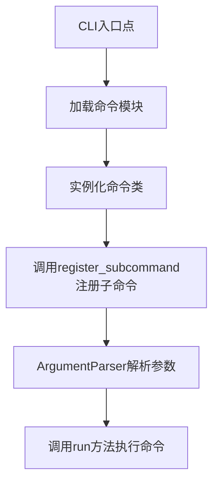
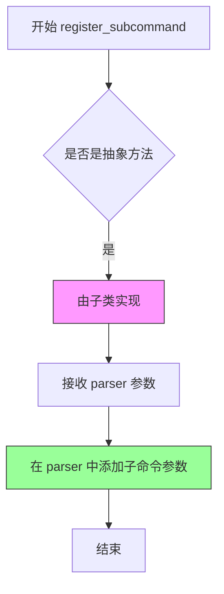
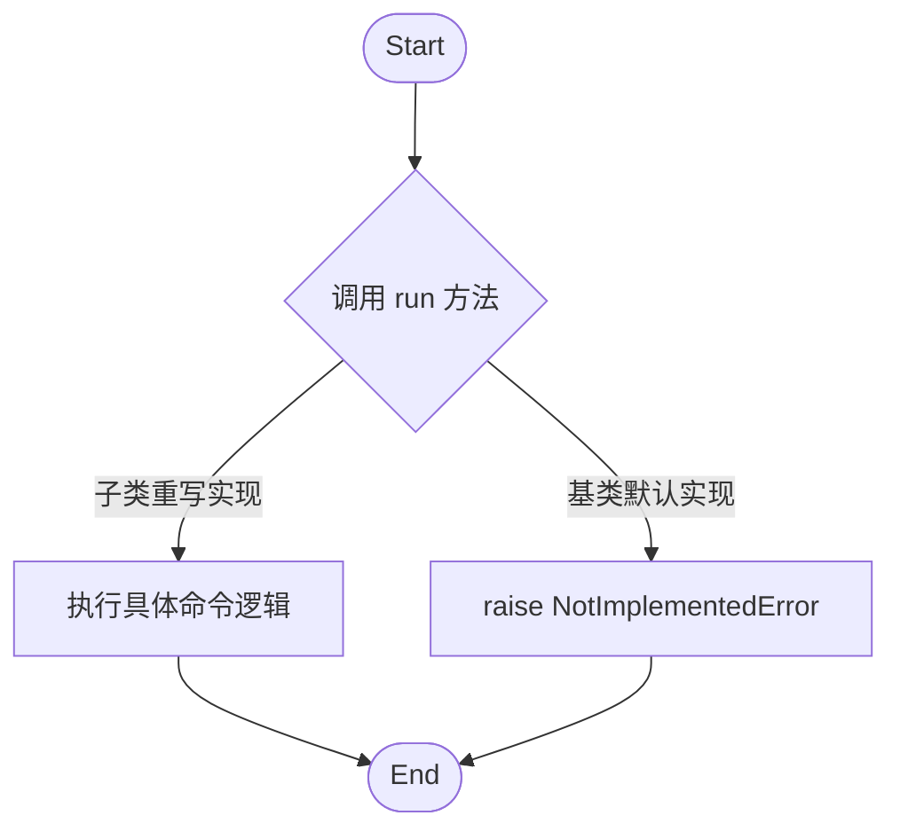

# `diffusers\src\diffusers\commands\__init__.py` 详细设计文档

这是一个抽象基类，定义了HuggingFace Diffusers库中CLI命令的接口规范，包含注册子命令和执行命令两个抽象方法，用于实现可扩展的命令行工具框架。

## 整体流程



## 类结构

```
BaseDiffusersCLICommand (抽象基类)
```

## 全局变量及字段


### `ABC`
    
Abstract base class from the abc module, used as a metaclass for creating abstract classes

类型：`abc.ABC`
    


### `abstractmethod`
    
Decorator from the abc module, used to define abstract methods that must be implemented by subclasses

类型：`abc.abstractmethod`
    


### `ArgumentParser`
    
Argument parser class from the argparse module, used for parsing command-line arguments

类型：`argparse.ArgumentParser`
    


### `BaseDiffusersCLICommand.BaseDiffusersCLICommand`
    
Abstract base class for Diffusers CLI commands, defines interface for registering subcommands and running commands

类型：`type`
    
    

## 全局函数及方法


### `BaseDiffusersCLICommand.register_subcommand`

这是一个抽象静态方法，定义了 CLI 命令的子命令注册接口，所有具体命令实现类必须实现此方法以将自身的命令行参数添加到 ArgumentParser 中。

参数：

- `parser`：`ArgumentParser`，命令行参数解析器实例，用于注册子命令及其相关参数

返回值：`None`，无返回值（该方法仅注册参数，不返回任何内容）

#### 流程图



#### 带注释源码

```python
@staticmethod
@abstractmethod
def register_subcommand(parser: ArgumentParser):
    """
    注册子命令到命令行参数解析器
    
    这是一个抽象静态方法，所有继承 BaseDiffusersCLICommand 的子类
    必须实现此方法来完成自身命令行的参数注册工作。
    
    参数:
        parser: ArgumentParser 对象，用于添加子命令和对应参数
        
    返回:
        None
        
    异常:
        NotImplementedError: 如果直接调用基类的实现会抛出此异常
    """
    raise NotImplementedError()
```


### `BaseDiffusersCLICommand.run`

该方法是 `BaseDiffusersCLICommand` 抽象基类的核心接口之一，定义了 Diffusers CLI 命令执行的入口点。它是一个抽象方法，要求子类必须实现具体的命令执行逻辑。当前基类中的实现仅用于占位，如果被直接调用会抛出 `NotImplementedError`，以此强制子类进行重写。

参数：
- `self`：`BaseDiffusersCLICommand` 类型，调用该方法的类实例本身。

返回值：`None` 或 `NoReturn`。当前实现会抛出 `NotImplementedError` 异常，因此不会返回任何值；具体返回值由子类实现决定。

#### 流程图



#### 带注释源码

```python
@abstractmethod
def run(self):
    """
    执行 CLI 命令的具体逻辑。
    这是一个抽象方法，任何继承 BaseDiffusersCLICommand 的子类
    都必须重写此方法以实现具体的命令功能。
    """
    raise NotImplementedError()
```

## 关键组件


### BaseDiffusersCLICommand

抽象基类，定义了Diffusers CLI命令的接口规范，强制子类实现子命令注册和命令执行功能。

### register_subcommand 方法

静态抽象方法，用于向ArgumentParser注册子命令，接受parser参数并通过装饰器强制子类实现。

### run 方法

抽象方法，定义命令执行逻辑，强制子类实现具体业务逻辑。

### ABC 抽象基类

Python标准库抽象基类，用于创建抽象基类并强制子类实现特定方法。

### ArgumentParser 参数

来自argparse模块，用于解析命令行参数和生成帮助信息。


## 问题及建议


### 已知问题

-   **抽象方法参数缺少类型提示**：`register_subcommand` 方法的参数 `parser` 虽然知道是 `ArgumentParser` 类型，但方法签名中没有明确标注类型
-   **抽象方法 `run` 缺乏约束**：返回值和参数完全无约束，子类实现时缺乏一致性指导
-   **缺少文档字符串**：类本身没有任何 docstring来说明其用途和使用场景
-   **抽象方法实现可能产生混淆**：`register_subcommand` 使用了 `@staticmethod` 装饰器，这使得在子类调用时需要特别小心处理
-   **无错误处理设计**：基类没有定义任何异常处理模式或错误传播机制
-   **接口契约不完整**：缺少对子类必须实现的接口行为的更详细约束说明

### 优化建议

-   **添加类型注解**：为 `register_subcommand` 的 `parser` 参数添加 `: ArgumentParser` 类型标注，为 `run` 方法添加明确的返回类型如 `-> None`
-   **添加类级文档字符串**：使用 docstring 描述该抽象基类的职责、适用场景和子类的实现要求
-   **考虑添加抽象属性**：如果 CLI 命令需要共享状态，可以考虑添加抽象属性定义
-   **定义基础异常类**：在模块级别定义 CLI 命令相关的基异常类，供具体实现使用
-   **添加初始化钩子**：可选地添加 `__init__` 方法定义初始化逻辑的标准接口
-   **考虑添加配置验证**：添加类方法或属性来定义该命令需要哪些配置或参数


## 其它


### 设计目标与约束

本 CLI 命令基类旨在为 Diffusers 项目提供统一的命令行接口扩展框架，通过抽象基类定义标准化的子命令注册和执行流程，使得不同的 CLI 命令可以以一致的方式被集成到主程序中。设计约束包括：必须继承自 `BaseDiffusersCLICommand` 并实现所有抽象方法；`register_subcommand` 方法必须接受一个 `ArgumentParser` 实例并向其添加子命令参数；`run` 方法不接收任何参数且不返回任何值（执行副作用）。

### 错误处理与异常设计

代码本身未实现具体的错误处理机制，但通过抽象方法设计预留了错误处理空间。当子类未实现抽象方法时，会抛出 `NotImplementedError`。在实际使用时，子类应在 `run` 方法中实现 Try-Catch 块来处理可能的异常，如参数解析错误、文件不存在、模型加载失败等情况。建议在基类中添加可选的 `validate()` 方法用于参数验证，以及定义统一的异常类型（如 `CLICommandError`）来规范化错误信息输出。

### 数据流与状态机

该基类本身不维护任何状态，也不涉及复杂的数据流。数据流为：主程序加载 CLI 模块 → 调用各命令类的 `register_subcommand` 方法注册子命令 → 用户通过命令行触发特定子命令 → 主程序实例化对应命令类并调用 `run` 方法执行。不存在状态机的设计，因为每个命令的执行是独立的一次性操作。

### 外部依赖与接口契约

本代码依赖于 Python 标准库中的 `abc` 模块（提供 ABC 和 abstractmethod）和 `argparse` 模块（提供 ArgumentParser）。接口契约包括：子类必须实现 `register_subcommand` 方法，签名必须为 `register_subcommand(self, parser: ArgumentParser)`，无返回值；子类必须实现 `run` 方法，签名为 `run(self)`，无返回值且应返回 None。

### 版本兼容性说明

代码注释表明版权年份为 2025 年，使用 Apache License 2.0 开源协议。Python 版本要求应至少为 Python 3.7+（因为 `from abc import ABC, abstractmethod` 和 `typing` 的普及）。无特定的第三方依赖要求。

### 使用示例与调用约定

主程序通过遍历所有继承自 `BaseDiffusersCLICommand` 的类，调用其 `register_subcommand` 方法将子命令注册到主 ArgumentParser。用户执行命令时，主程序根据子命令名称动态实例化对应的命令类并调用其 `run` 方法。建议的调用模式为：

```python
# 注册阶段
subcommands = [MyCommand1, MyCommand2]  # 所有命令类
for cmd_class in subcommands:
    cmd_class.register_subcommand(parser)

# 执行阶段
args = parser.parse_args()
if hasattr(args, 'func'):
    args.func(args)
# 或者
command = cmd_class()
command.run()
```

### 安全性考虑

由于 `run` 方法执行实际命令操作，应确保：
- 对用户输入进行充分的验证和清理
- 避免命令注入漏洞
- 对敏感操作（如文件删除、模型下载）添加适当的确认机制
- 在 `run` 方法中实施最小权限原则

### 性能考量

该基类设计极为轻量，几乎不产生额外性能开销。实例化命令类时可根据实际需求选择延迟实例化策略，以减少启动时的内存占用。对于耗时操作，建议在 `run` 方法中实现进度反馈机制。

### 测试策略

由于这是抽象基类，测试重点应放在：
- 验证子类正确实现了所有抽象方法
- 测试 `register_subcommand` 方法是否正确向 parser 添加了预期的参数
- 测试 `run` 方法在各种输入条件下的行为
- 使用 mock 来模拟 argparse 的行为进行单元测试


    