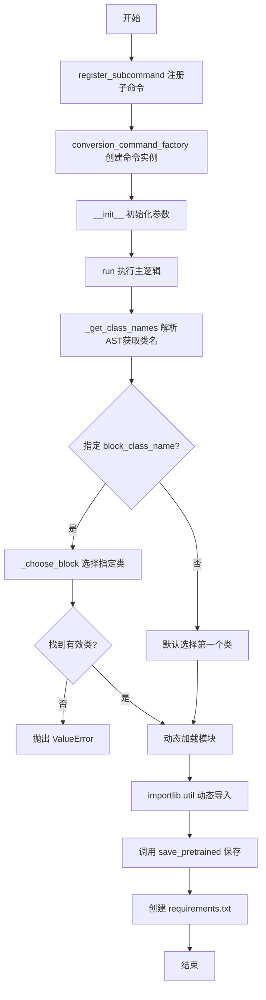
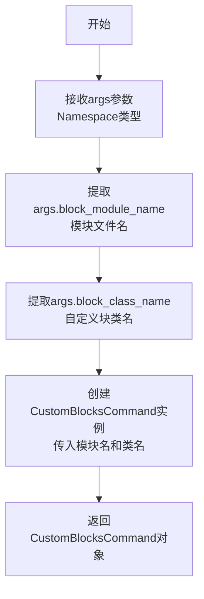
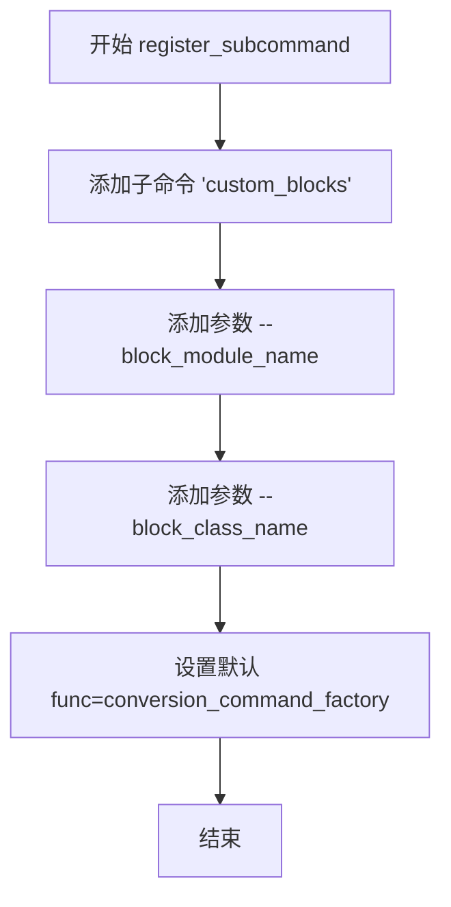
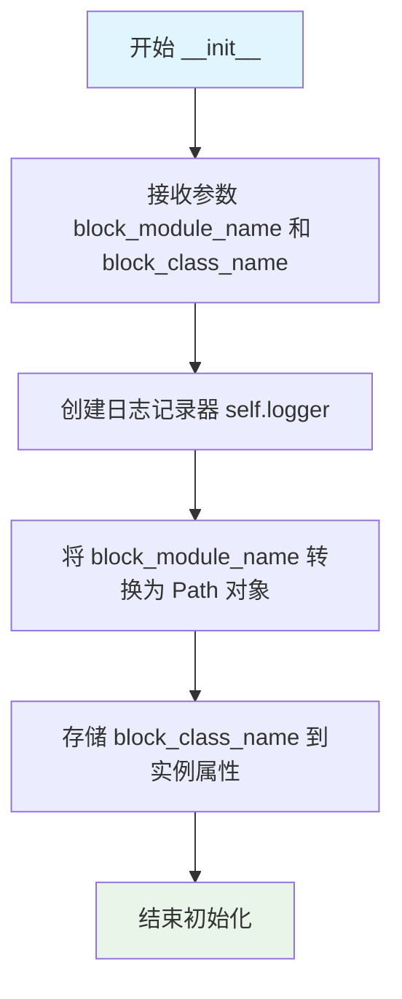
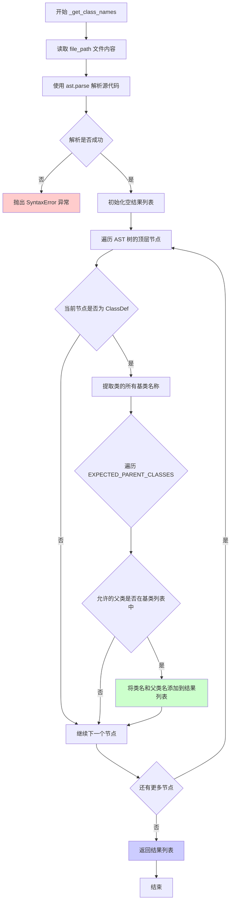
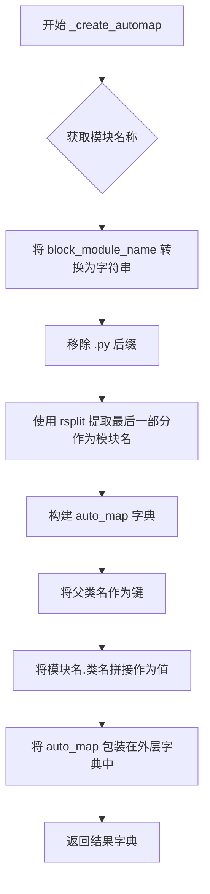

# `diffusers\src\diffusers\commands\custom_blocks.py` 详细设计文档

这是一个 HuggingFace Diffusers CLI 工具，用于从用户提供的 Python 模块文件中自动识别并提取继承自 ModularPipelineBlocks 的自定义 Pipeline Block 类，支持动态导入模块并调用 save_pretrained 方法将配置保存到本地目录。

## 整体流程



## 类结构

```
BaseDiffusersCLICommand (基类)
└── CustomBlocksCommand (CLI命令实现类)
```

## 全局变量及字段


### `EXPECTED_PARENT_CLASSES`
    
预期父类名称列表，用于过滤符合条件的自定义块类

类型：`list`
    


### `CONFIG`
    
配置文件名，用于保存自动映射配置

类型：`str`
    


### `CustomBlocksCommand.self.logger`
    
日志记录器实例，用于输出命令执行过程中的日志信息

类型：`logging`
    


### `CustomBlocksCommand.self.block_module_name`
    
自定义块模块文件路径，指向包含自定义块类的Python文件

类型：`Path`
    


### `CustomBlocksCommand.self.block_class_name`
    
自定义块类名，指定要加载的具体类名称，若为None则自动推断

类型：`str`
    
    

## 全局函数及方法


### `conversion_command_factory`

工厂函数，根据参数创建CustomBlocksCommand实例，用于处理自定义模块的命令行配置。

参数：

- `args`：`Namespace`，命令行参数命名空间对象，包含 `block_module_name` 和 `block_class_name` 属性

返回值：`CustomBlocksCommand`，返回根据参数创建的命令实例对象

#### 流程图



#### 带注释源码

```python
def conversion_command_factory(args: Namespace):
    """
    工厂函数，根据命令行参数创建CustomBlocksCommand实例。
    
    该函数是CLI命令的入口点工厂，在register_subcommand中通过
    set_defaults(func=conversion_command_factory)注册。
    当用户运行diffusers-cli custom_blocks命令时，此函数被调用
    来创建实际的命令执行对象。
    
    参数:
        args: Namespace对象，来自argparse的命名空间，
              包含block_module_name和block_class_name属性
    
    返回值:
        CustomBlocksCommand: 命令实例，后续会调用其run()方法执行实际逻辑
    """
    return CustomBlocksCommand(args.block_module_name, args.block_class_name)
```


### `CustomBlocksCommand.register_subcommand`

该静态方法用于在 CLI 中注册 `custom_blocks` 子命令，配置命令行参数（`--block_module_name` 和 `--block_class_name`），并关联命令处理工厂函数。

参数：

- `parser`：`ArgumentParser`，父级命令行解析器对象，用于注册子命令

返回值：`None`，该方法仅执行参数注册和配置，不返回任何值

#### 流程图



#### 带注释源码

```python
@staticmethod
def register_subcommand(parser: ArgumentParser):
    """
    注册 custom_blocks 子命令到 CLI parser。
    
    参数:
        parser: ArgumentParser - 父级命令行参数解析器
        
    返回:
        None
    """
    # 创建名为 'custom_blocks' 的子命令解析器
    conversion_parser = parser.add_parser("custom_blocks")
    
    # 添加 --block_module_name 参数：指定自定义 block 的模块文件名
    conversion_parser.add_argument(
        "--block_module_name",
        type=str,
        default="block.py",
        help="Module filename in which the custom block will be implemented.",
    )
    
    # 添加 --block_class_name 参数：指定自定义 block 的类名
    conversion_parser.add_argument(
        "--block_class_name",
        type=str,
        default=None,
        help="Name of the custom block. If provided None, we will try to infer it.",
    )
    
    # 绑定工厂函数，当子命令被触发时调用 conversion_command_factory
    conversion_parser.set_defaults(func=conversion_command_factory)
```


### `CustomBlocksCommand.__init__`

该方法用于初始化 `CustomBlocksCommand` 类的实例，接收块模块名称和块类名称作为参数，配置日志记录器并将参数转换为适当的数据类型进行存储。

参数：

- `block_module_name`：`str`，块模块文件名，默认为 `"block.py"`，指定实现自定义块的模块文件名称
- `block_class_name`：`str`，块类名称，默认为 `None`，指定自定义块的名称，若为 `None` 则尝试自动推断

返回值：`None`，该方法为构造函数，不返回任何值（隐式返回 `self`）

#### 流程图



#### 带注释源码

```python
def __init__(self, block_module_name: str = "block.py", block_class_name: str = None):
    """
    初始化 CustomBlocksCommand 实例。
    
    参数:
        block_module_name: str, 块模块文件名，默认为 "block.py"
        block_class_name: str, 块类名称，默认为 None
    """
    # 获取日志记录器，用于后续输出日志信息
    self.logger = logging.get_logger("diffusers-cli/custom_blocks")
    
    # 将块模块名称转换为 Path 对象，便于后续文件操作
    self.block_module_name = Path(block_module_name)
    
    # 存储块类名称，如果为 None 则后续会在 run 方法中尝试自动推断
    self.block_class_name = block_class_name
```


### CustomBlocksCommand.run()

该方法是 CLI 命令的主入口，负责扫描指定模块文件，识别继承自 `ModularPipelineBlocks` 的自定义块类，支持用户指定类名或自动选择，动态加载模块并实例化该类以调用 `save_pretrained` 方法将块保存到当前目录，同时创建空的 requirements.txt 文件。

参数：此方法无显式参数（仅依赖实例属性 `self.block_module_name` 和 `self.block_class_name`）

返回值：`None`，该方法执行副作用操作（文件写入和模块加载）而不返回具体值

#### 流程图

```mermaid
flowchart TD
    A[开始 run 方法] --> B[调用 _get_class_names 解析模块文件]
    B --> C{解析是否成功}
    C -->|是| D[从解析结果中提取所有类名]
    C -->|否| Z[抛出 ValueError 异常]
    D --> E{self.block_class_name 是否已指定}
    E -->|是| F[调用 _choose_block 匹配指定类]
    E -->|否| G[使用第一个找到的类作为默认选择]
    F --> H{是否找到匹配的类}
    H -->|是| I[获取 child_class 和 parent_class]
    H -->|否| J[抛出 ValueError 错误列出可用类]
    G --> I
    I --> K[构建动态模块名称 __dynamic__{stem}]
    K --> L[使用 importlib.util 动态加载模块]
    L --> M[从加载的模块实例化 child_class]
    M --> N[调用实例的 save_pretrained 保存到当前目录]
    N --> O[创建空的 requirements.txt 文件]
    O --> P[结束]
```

#### 带注释源码

```python
def run(self):
    """
    主执行方法：处理类选择、动态导入和保存自定义块
    
    流程：
    1. 解析模块文件获取所有符合条件的类
    2. 根据 block_class_name 选择要使用的类
    3. 动态加载模块并实例化选中的类
    4. 调用 save_pretrained 保存到当前目录
    5. 创建空的 requirements.txt
    """
    
    # 步骤1: 确定要保存的块
    # 调用 _get_class_names 解析模块文件，返回 [(类名, 父类名), ...]
    out = self._get_class_names(self.block_module_name)
    
    # 从解析结果中提取所有找到的类名（去重）
    classes_found = list({cls for cls, _ in out})

    # 步骤2: 类选择逻辑
    if self.block_class_name is not None:
        # 如果用户指定了 block_class_name，尝试匹配
        child_class, parent_class = self._choose_block(out, self.block_class_name)
        
        # 验证是否成功匹配
        if child_class is None and parent_class is None:
            raise ValueError(
                "`block_class_name` could not be retrieved. Available classes from "
                f"{self.block_module_name}:\n{classes_found}"
            )
    else:
        # 如果未指定，使用第一个找到的类作为默认值
        self.logger.info(
            f"Found classes: {classes_found} will be using {classes_found[0]}. "
            "If this needs to be changed, re-run the command specifying `block_class_name`."
        )
        child_class, parent_class = out[0][0], out[0][1]

    # 步骤3: 动态导入并实例化自定义块
    # 构建动态模块名（避免与现有模块冲突）
    module_name = f"__dynamic__{self.block_module_name.stem}"
    
    # 从文件路径创建模块规范
    spec = importlib.util.spec_from_file_location(module_name, str(self.block_module_name))
    
    # 从规范创建模块对象
    module = importlib.util.module_from_spec(spec)
    
    # 执行加载模块
    spec.loader.exec_module(module)
    
    # 步骤4: 实例化类并调用 save_pretrained 保存到当前目录
    # 用户负责运行命令，因此安全性由用户保证
    getattr(module, child_class)().save_pretrained(os.getcwd())

    # 备选方案：手动创建 auto_map 配置（已注释）
    # automap = self._create_automap(parent_class=parent_class, child_class=child_class)
    # with open(CONFIG, "w") as f:
    #     json.dump(automap, f)

    # 步骤5: 创建空的 requirements.txt
    with open("requirements.txt", "w") as f:
        f.write("")
```


### `CustomBlocksCommand._choose_block`

该方法用于从候选类列表中根据指定的类名选择匹配的类及其父类，返回找到的类名和父类名；若未找到则返回两个 `None`。

参数：

- `candidates`：`list[tuple[str, str]]`，候选类列表，每个元素为 (类名, 父类名) 的元组
- `chosen`：`str | None`，要选择的类名，默认为 `None`

返回值：`tuple[str | None, str | None]`，返回找到的 (类名, 父类名) 元组，若未找到则返回 `(None, None)`

#### 流程图

```mermaid
flowchart TD
    A[开始 _choose_block] --> B{遍历 candidates}
    B -->|for each (cls, base)| C{cls == chosen?}
    C -->|是| D[返回 (cls, base)]
    C -->|否| B
    B -->|遍历完成| E[返回 (None, None)]
    D --> F[结束]
    E --> F
```

#### 带注释源码

```python
def _choose_block(self, candidates, chosen=None):
    """
    从候选列表中选择指定的类及其父类。
    
    参数:
        candidates: 候选类列表，每个元素为 (类名, 父类名) 的元组
        chosen: 要选择的类名，默认为 None
    
    返回:
        (类名, 父类名) 元组，若未找到则返回 (None, None)
    """
    # 遍历所有候选类
    for cls, base in candidates:
        # 检查当前类名是否与目标类名匹配
        if cls == chosen:
            # 匹配成功，返回类名和父类名
            return cls, base
    # 遍历完成未找到匹配，返回 (None, None)
    return None, None
```


### `CustomBlocksCommand._get_class_names`

该方法使用 Python AST（抽象语法树）解析给定的 Python 源文件，遍历文件中的所有类定义，提取继承自 `ModularPipelineBlocks` 的类名，并返回由（类名，父类名）组成的元组列表。

参数：

- `file_path`：`Path`，要解析的 Python 源文件路径

返回值：`list[tuple[str, str]]`，返回由元组组成的列表，每个元组包含（子类名，父类名），例如：`[("CustomBlock", "ModularPipelineBlocks")]`

#### 流程图



#### 带注释源码

```python
def _get_class_names(self, file_path):
    """
    使用AST解析文件获取类名列表
    
    参数:
        file_path: Path - 要解析的Python源文件路径
        
    返回:
        list[tuple[str, str]] - (类名, 父类名)的元组列表
    """
    # 读取文件内容，使用UTF-8编码
    source = file_path.read_text(encoding="utf-8")
    
    try:
        # 尝试解析源代码为AST
        # 如果文件包含语法错误，这里会捕获并重新抛出
        tree = ast.parse(source, filename=file_path)
    except SyntaxError as e:
        # 语法错误时抛出明确的ValueError，包含文件名和错误详情
        raise ValueError(f"Could not parse {file_path!r}: {e}") from e

    # 初始化结果列表，用于存储(类名, 父类名)元组
    results: list[tuple[str, str]] = []
    
    # 遍历AST的顶层节点（模块级别的定义）
    for node in tree.body:
        # 只处理类定义节点
        if not isinstance(node, ast.ClassDef):
            continue

        # 提取该类的所有基类名称
        # 例如: class MyClass(Parent1, Parent2) -> ['Parent1', 'Parent2']
        base_names = [
            bname 
            for b in node.bases 
            if (bname := self._get_base_name(b)) is not None
        ]

        # 检查每个允许的父类是否在类的基类列表中
        # EXPECTED_PARENT_CLASSES = ["ModularPipelineBlocks"]
        for allowed in EXPECTED_PARENT_CLASSES:
            if allowed in base_names:
                # 如果找到了匹配的父类，添加到结果中
                results.append((node.name, allowed))

    # 返回找到的类名和父类名对列表
    return results
```


### `CustomBlocksCommand._get_base_name`

该方法是一个递归辅助函数，用于从 AST 节点中提取基类名称。它能处理简单的类名（如 `BaseClass`）以及带模块前缀的属性访问形式（如 `module.BaseClass`），是 `_get_class_names` 方法解析类继承关系的关键组成部分。

参数：

- `node`：`ast.expr`，AST 表达式节点，可能是 `ast.Name`（简单名称）或 `ast.Attribute`（属性访问）

返回值：`str | None`，返回基类名称字符串，如果节点类型无法识别则返回 `None`

#### 流程图

```mermaid
flowchart TD
    A[开始: _get_base_name] --> B{node 是 ast.Name?}
    B -->|是| C[返回 node.id]
    B -->|否| D{node 是 ast.Attribute?}
    D -->|是| E[递归调用: val = _get_base_name<br/>node.value]
    E --> F{val 非空?}
    F -->|是| G[返回 f"{val}.{node.attr}"]
    F -->|否| H[返回 node.attr]
    D -->|否| I[返回 None]
    C --> J[结束]
    G --> J
    H --> J
    I --> J
```

#### 带注释源码

```python
def _get_base_name(self, node: ast.expr):
    """
    递归获取基类名称。
    
    处理两种情况：
    1. ast.Name: 简单类名，如 'BaseClass'
    2. ast.Attribute: 带模块前缀，如 'module.BaseClass'
    
    参数:
        node: AST 表达式节点
        
    返回:
        基类名称字符串，或 None（无法识别时）
    """
    # 情况1: 处理简单名称节点 (如 class Foo(BaseClass))
    if isinstance(node, ast.Name):
        # 返回标识符名称
        return node.id
    
    # 情况2: 处理属性访问节点 (如 class Foo(module.BaseClass))
    elif isinstance(node, ast.Attribute):
        # 递归获取属性值的名称 (如 'module')
        val = self._get_base_name(node.value)
        # 拼接为完整路径: "module.BaseClass"
        return f"{val}.{node.attr}" if val else node.attr
    
    # 情况3: 其他未知节点类型，返回 None
    return None
```


### `CustomBlocksCommand._create_automap`

该方法用于创建自动映射（auto_map）配置，将父类名称映射到包含模块名和子类名的完整路径字符串，以便在配置文件中定义自定义块的映射关系。

参数：

- `parent_class`：`str`，父类名称（如 `ModularPipelineBlocks`）
- `child_class`：`str`，子类（自定义块）的名称

返回值：`dict`，返回一个包含 `auto_map` 键的字典，其值为 `{父类名: "模块名.类名"}` 格式的映射字典

#### 流程图



#### 带注释源码

```python
def _create_automap(self, parent_class, child_class):
    """
    创建自动映射配置字典。
    
    此方法用于生成一个 auto_map 字典，将父类名称映射到自定义块的完整模块路径。
    这个映射用于配置文件中，以便Diffusers能够正确加载自定义块。
    
    参数:
        parent_class (str): 父类名称，通常是 ModularPipelineBlocks 或类似的基类
        child_class (str): 自定义块的类名
    
    返回:
        dict: 包含 auto_map 键的字典，格式为 {"auto_map": {"ParentClass": "module.ChildClass"}}
    """
    # 将 Path 对象转换为字符串，并移除 .py 后缀
    # 例如: "path/to/block.py" -> "path/to/block"
    module = str(self.block_module_name).replace(".py", "").rsplit(".", 1)[-1]
    
    # 构建自动映射字典，键为父类名，值为 "模块名.类名" 的完整路径字符串
    auto_map = {f"{parent_class}": f"{module}.{child_class}"}
    
    # 返回符合配置格式的字典结构
    return {"auto_map": auto_map}
```

## 关键组件


### CustomBlocksCommand (主命令类)

核心CLI命令类，负责将自定义的Diffusers pipeline blocks保存到本地目录，支持动态模块解析与自动发现。

### 动态模块加载机制

使用`importlib.util`在运行时动态导入用户提供的Python模块文件，并实例化自定义block类以调用`save_pretrained`方法。

### AST类解析器

通过Python AST（抽象语法树）解析自定义模块文件，提取继承自`ModularPipelineBlocks`的类定义，返回类名与基类名的映射关系。

### 命令行参数解析

支持`--block_module_name`和`--block_class_name`两个参数，允许用户指定自定义block的模块文件名和类名。

### Block选择器

当提供多个候选类时，通过`_choose_block`方法根据用户指定的类名匹配并返回对应的(child_class, parent_class)元组。

### 自动映射生成器

`_create_automap`方法构建auto_map字典，用于HuggingFace Diffusers的配置文件，格式为`{"auto_map": {"ParentClass": "module.ChildClass"}}`。

### 配置文件生成

将空的requirements.txt写入当前目录，作为占位符表明该自定义block已保存。

### EXPECTED_PARENT_CLASSES常量

定义允许的父类列表`["ModularPipelineBlocks"]`，用于过滤AST解析结果，只保留继承自该父类的自定义block。


## 问题及建议


### 已知问题

- **安全风险**：使用 `spec.loader.exec_module(module)` 动态执行用户提供的模块代码存在代码注入风险，且未验证模块路径是否在允许目录范围内
- **参数类型错误**：`block_class_name` 参数类型声明为 `str = None`，但实际应为 `Optional[str] = None`
- **未验证的常量**：`EXPECTED_PARENT_CLASSES` 定义的 "ModularPipelineBlocks" 类在代码中未被导入或验证其存在性
- **缺少边界检查**：当 `_get_class_names` 返回空列表时，直接访问 `out[0][0]` 会导致 `IndexError` 异常
- **硬编码文件名**：配置文件名 "config.json" 和 "requirements.txt" 被硬编码，缺乏灵活性
- **未使用的功能**：`_create_automap` 方法和相关的注释代码长期存在但未被启用，代码可读性差
- **文件操作无错误处理**：读取文件和写入文件时缺乏完善的异常捕获机制
- **不完整的继承检查**：AST 解析仅检查类的直接基类，未递归检查继承链中的父类

### 优化建议

- 使用安全的模块加载机制（如隔离的 Python 子进程或沙箱环境），或添加路径白名单验证防止目录穿越攻击
- 修正 `block_class_name` 的类型注解为 `Optional[str]`
- 添加模块存在性和类有效性的运行时验证，确保 `EXPECTED_PARENT_CLASSES` 中的类实际可用
- 在访问列表元素前检查列表长度，避免 `IndexError`
- 将硬编码的文件名提取为可配置的类属性或构造函数参数
- 删除或完善注释掉的 `_create_automap` 相关代码，保持代码仓库整洁
- 使用 `try-except` 包裹文件 I/O 操作，并提供有意义的错误信息
- 增强 `_get_class_names` 方法的继承链检查逻辑，递归遍历类的 MRO (Method Resolution Order)

## 其它


### 设计目标与约束

本命令旨在为Diffusers CLI提供一种便捷的机制，允许用户将自定义块（Custom Blocks）打包并保存为预训练模型格式。设计目标包括：1）支持从任意Python模块文件中自动识别并提取继承自`ModularPipelineBlocks`的自定义类；2）通过动态导入机制在运行时实例化并调用`save_pretrained`方法；3）提供灵活的命令行参数以满足不同使用场景。约束条件包括：目标类必须继承自`ModularPipelineBlocks`，且模块文件必须位于可访问的文件系统中。

### 错误处理与异常设计

代码中的异常处理主要包括：1）AST解析失败时抛出`ValueError`，提示具体的语法错误信息；2）当指定的`block_class_name`无法在模块中找到时，抛出`ValueError`并列出所有可用的类名；3）动态导入模块时，通过`importlib.util`的标准机制传播加载异常。在`run()`方法中，若未指定`block_class_name`且模块中未找到任何符合条件的类，将导致后续索引访问`out[0]`时可能引发`IndexError`，这是潜在的异常处理缺口。

### 数据流与状态机

整体数据流如下：1）命令行参数输入 → 2）模块文件路径解析 → 3）AST遍历提取类名与父类关系 → 4）根据参数选择目标类 → 5）动态模块加载 → 6）类实例化 → 7）调用`save_pretrained`保存模型 → 8）写入空的`requirements.txt`。状态机转换路径包括：初始态（参数解析）→ 类选择态（用户指定或默认选择）→ 加载态（动态导入）→ 保存态（调用save_pretrained）→ 完成态。

### 外部依赖与接口契约

本命令依赖以下外部组件：1）`argparse`模块用于命令行参数解析；2）`ast`模块用于源代码静态分析；3）`importlib.util`用于动态模块加载；4）`pathlib.Path`用于文件路径操作；5）Diffusers库的`BaseDiffusersCLICommand`基类、`logging`工具函数以及`save_pretrained`方法。接口契约方面：输入的`block_module_name`应为有效的Python模块文件路径，`block_class_name`（若提供）必须与模块中定义的类名完全匹配，且该类必须继承自`EXPECTED_PARAMS_CLASSES`中定义的父类。

### 安全性考虑

代码存在以下安全考量：1）动态执行模块代码存在一定的安全风险，用户需确保输入的模块文件可信；2）当前实现使用`os.getcwd()`作为输出目录，可能导致当前工作目录被意外污染；3）未对模块文件路径进行恶意路径遍历检测（如`../`攻击）；4）`spec.loader.exec_module(module)`会执行模块中的所有顶级代码，包括可能的副作用。建议在生产环境中增加路径规范化、文件存在性验证及模块可信度检查。

### 性能考虑

性能瓶颈主要体现在：1）每次运行都会完整解析目标模块的AST，对于大型模块文件可能存在性能开销；2）动态导入和模块加载操作相对重量级；3）`save_pretrained`操作涉及模型序列化，可能耗时较长。优化方向包括：缓存AST解析结果、支持增量更新机制、增加异步执行支持以避免阻塞CLI主线程。

### 配置与参数设计

命令行参数设计：1）`--block_module_name`：字符串类型，默认值"block.py"，用于指定包含自定义块的模块文件；2）`--block_class_name`：字符串类型，默认值None，支持自动推断。配置常量：1）`EXPECTED_PARENT_CLASSES`列表定义了合法的父类名称，当前仅包含"ModularPipelineBlocks"；2）`CONFIG`常量定义输出配置文件名为"config.json"（当前代码中实际未使用）。设计采用了最小化参数原则，通过合理的默认值降低用户操作复杂度。

### 使用示例与文档

代码中包含TODO占位符用于文档补充。典型使用场景包括：1）用户开发了自定义的Pipeline块，需要将其打包为可分发的模型格式；2）用户希望将自定义块与Diffusers生态系统集成。示例命令格式：`diffusers-cli custom_blocks --block_module_name my_block.py --block_class_name MyCustomBlock`。

### 版本兼容性与扩展性

当前版本依赖Diffusers库的基础设施，设计上考虑了可扩展性：1）`EXPECTED_PARENT_CLASSES`采用列表定义，可轻松添加新的父类支持；2）`_create_automap`方法预留了自动映射生成逻辑，虽未被激活但提供了扩展路径；3）类的继承结构使得新增命令功能时可通过扩展`BaseDiffusersCLICommand`实现。版本兼容性方面，需确保目标模块的Python版本支持AST特性，且Diffusers库的API保持向后兼容。

    