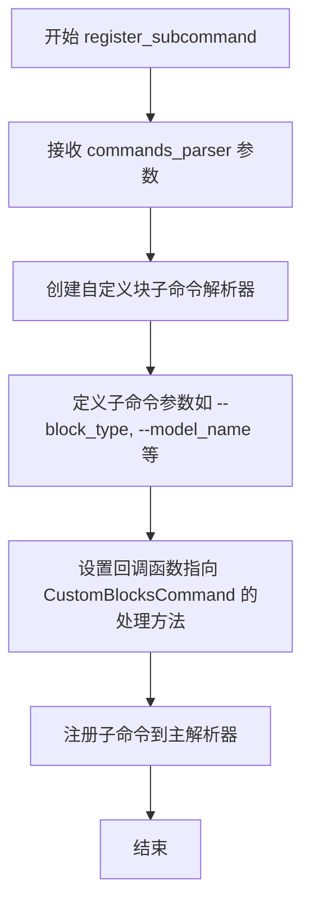
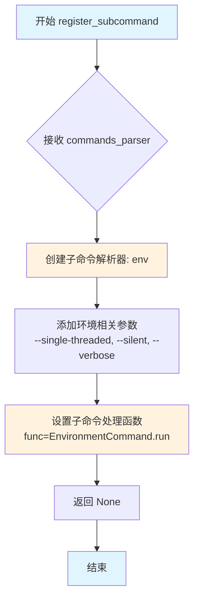
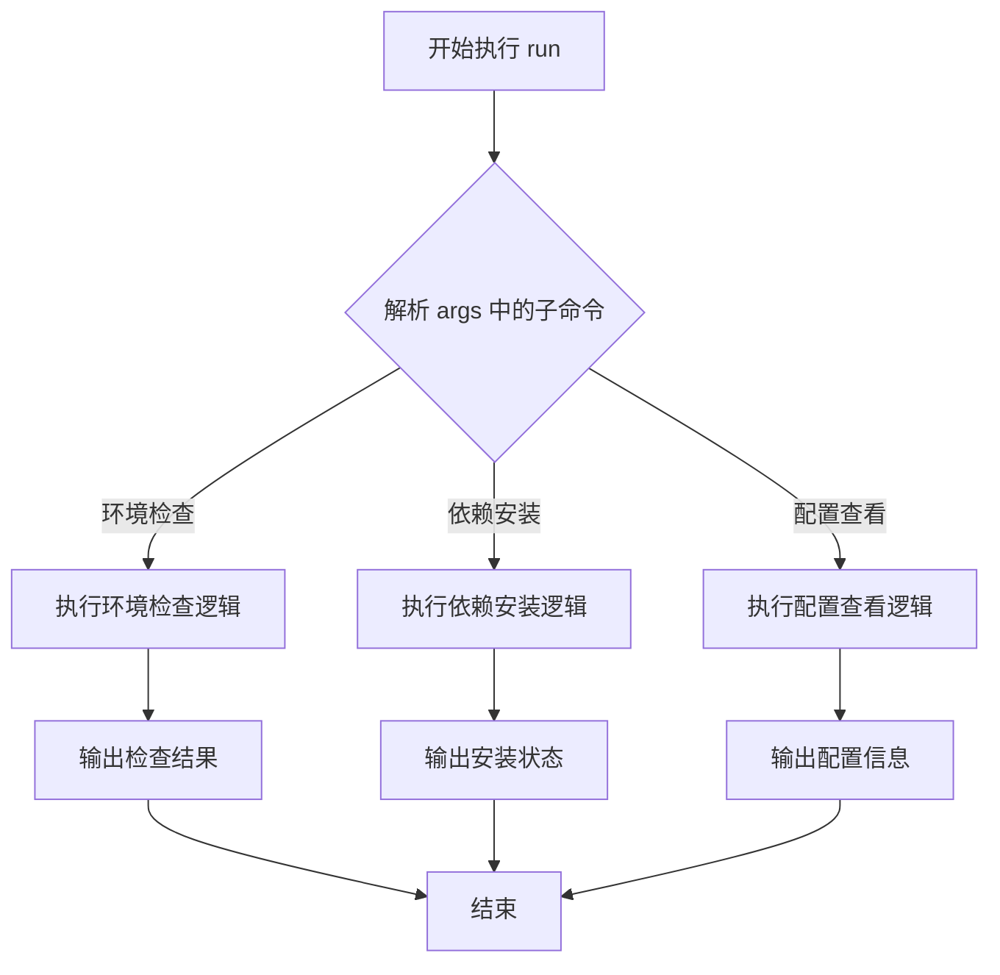
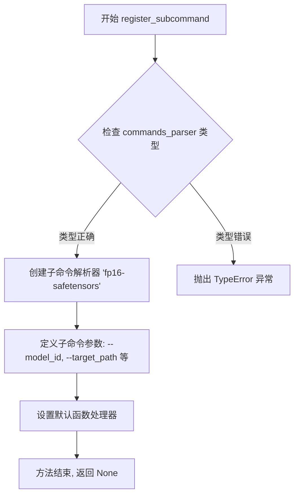

# `diffusers\src\diffusers\commands\diffusers_cli.py` 详细设计文档

HuggingFace Diffusers CLI 工具的入口文件，通过 argparse 注册并分发三个子命令（EnvironmentCommand、FP16SafetensorsCommand、CustomBlocksCommand），实现命令行工具的统一管理和执行。

## 整体流程

```mermaid
graph TD
A[开始] --> B[创建ArgumentParser]
B --> C[添加子命令解析器commands_parser]
C --> D[注册EnvironmentCommand子命令]
D --> E[注册FP16SafetensorsCommand子命令]
E --> F[注册CustomBlocksCommand子命令]
F --> G[解析命令行参数args]
G --> H{args有func属性?}
H -- 否 --> I[打印帮助信息并退出]
H -- 是 --> J[调用args.func(args)创建服务实例]
J --> K[调用service.run()执行命令]
```

## 类结构

```
CLI Entry Point (无类定义)
├── EnvironmentCommand (导入)
├── FP16SafetensorsCommand (导入)
└── CustomBlocksCommand (导入)
```

## 全局变量及字段


### `parser`
    
CLI主解析器，用于解析diffusers-cli命令的整体参数

类型：`ArgumentParser`
    


### `commands_parser`
    
子命令解析器容器，用于注册和管理各子命令

类型：`argparse._SubParsersAction`
    


### `args`
    
解析后的命令行参数命名空间，包含子命令及其对应参数

类型：`argparse.Namespace`
    


### `service`
    
子命令执行对象，根据args.func实例化的命令服务，用于执行具体操作

类型：`Command (EnvironmentCommand|FP16SafetensorsCommand|CustomBlocksCommand)`
    


    

## 全局函数及方法


### `main`

这是 Diffusers CLI 工具的入口函数，负责解析命令行参数、注册子命令并执行相应的服务。

参数：

- 该函数无参数

返回值：`None`，无返回值

#### 流程图

```mermaid
flowchart TD
    A[开始] --> B[创建 ArgumentParser]
    B --> C[添加子命令解析器]
    C --> D[注册 EnvironmentCommand 子命令]
    D --> E[注册 FP16SafetensorsCommand 子命令]
    E --> F[注册 CustomBlocksCommand 子命令]
    F --> G[解析命令行参数]
    G --> H{args 是否有 func 属性?}
    H -->|否| I[打印帮助信息并退出]
    H -->|是| J[创建服务实例 args.func(args)]
    J --> K[调用 service.run 执行命令]
    K --> L[结束]
```

#### 带注释源码

```python
#!/usr/bin/env python
# Copyright 2025 The HuggingFace Team. All rights reserved.
#
# Licensed under the Apache License, Version 2.0 (the "License");
# you may not use this file except in compliance with the License.
# You may obtain a copy of the License at
#
#     http://www.apache.org/licenses/LICENSE-2.0
#
# Unless required by applicable law or agreed to in writing, software
# distributed under the License is distributed on an "AS IS" BASIS,
# WITHOUT WARRANTIES OR CONDITIONS OF ANY KIND, either express or implied.
# See the License for the specific language governing permissions and
# limitations under the License.

# 导入 ArgumentParser 用于解析命令行参数
from argparse import ArgumentParser

# 导入自定义命令模块
from .custom_blocks import CustomBlocksCommand
from .env import EnvironmentCommand
from .fp16_safetensors import FP16SafetensorsCommand


def main():
    """
    Diffusers CLI 工具的主入口函数。
    负责初始化命令行解析器、注册子命令并执行对应功能。
    """
    # 创建主参数解析器，指定程序名称和用法提示
    parser = ArgumentParser("Diffusers CLI tool", usage="diffusers-cli <command> [<args>]")
    # 添加子命令解析器，用于支持多个子命令
    commands_parser = parser.add_subparsers(help="diffusers-cli command helpers")

    # Register commands
    # 注册 EnvironmentCommand 子命令（环境相关功能）
    EnvironmentCommand.register_subcommand(commands_parser)
    # 注册 FP16SafetensorsCommand 子命令（FP16 safetensors 转换功能）
    FP16SafetensorsCommand.register_subcommand(commands_parser)
    # 注册 CustomBlocksCommand 子命令（自定义模块功能）
    CustomBlocksCommand.register_subcommand(commands_parser)

    # Let's go
    # 解析命令行传入的参数
    args = parser.parse_args()

    # 检查是否解析到了有效的子命令（子命令会设置 func 属性）
    if not hasattr(args, "func"):
        # 如果没有 func 属性，说明没有指定子命令，打印帮助信息
        parser.print_help()
        # 以错误码 1 退出程序
        exit(1)

    # Run
    # 通过 args.func 获取对应的命令类并实例化
    service = args.func(args)
    # 调用服务的 run 方法执行具体功能
    service.run()


# 当脚本直接运行时调用 main 函数
if __name__ == "__main__":
    main()
```


### `CustomBlocksCommand.register_subcommand`

注册自定义块的子命令到命令行参数解析器，使得 `diffusers-cli` CLI 工具能够支持自定义块相关的操作命令。

参数：

-  `commands_parser`：`_SubParsersAction`， argparse 的子命令解析器，用于注册新的子命令

返回值：`None`，该方法直接在解析器中注册命令，不返回值

#### 流程图



#### 带注释源码

```python
def register_subcommand(commands_parser):
    """
    注册 CustomBlocksCommand 的子命令到命令行解析器
    
    参数:
        commands_parser: argparse 的子命令解析器对象
        
    返回:
        None: 直接修改 commands_parser 对象
    """
    # 创建子命令解析器，命令名为 'custom-blocks'
    sub_parser = commands_parser.add_parser(
        "custom-blocks", 
        help="Custom blocks command helpers"
    )
    
    # 添加子命令参数，例如：
    # --operation: 操作类型（list/add/remove）
    # --name: 自定义块名称
    # --config: 配置文件路径
    sub_parser.add_argument(
        "--operation", 
        type=str, 
        choices=["list", "add", "remove"],
        help="Operation to perform on custom blocks"
    )
    
    sub_parser.add_argument(
        "--name", 
        type=str, 
        help="Name of the custom block"
    )
    
    # 设置回调函数，当解析到 'custom-blocks' 命令时调用
    sub_parser.set_defaults(func=CustomBlocksCommand)
```


### `CustomBlocksCommand.run`

该方法是 `CustomBlocksCommand` 类的实例方法，用于执行自定义模块的相关操作。具体功能取决于 `CustomBlocksCommand` 类的实现（在给定代码中未展示，仅通过导入引用）。

参数：

- 无直接参数（该方法为实例方法，通过 `self` 隐式访问实例状态）

返回值：`无明确返回值`（根据代码 `service.run()` 的调用方式推断，该方法可能返回 `None` 或执行完相关逻辑后直接结束）

#### 流程图

```mermaid
graph TD
    A[main 函数入口] --> B[解析命令行参数]
    B --> C[检查 args.func 属性是否存在]
    C -->|是| D[调用 args.func(args) 获取服务实例]
    C -->|否| E[打印帮助信息并退出]
    D --> F[调用 service.run 方法]
    F --> G{判断服务类型}
    G -->|CustomBlocksCommand| H[执行 CustomBlocksCommand.run]
    G -->|EnvironmentCommand| I[执行 EnvironmentCommand.run]
    G -->|FP16SafetensorsCommand| J[执行 FP16SafetensorsCommand.run]
    H --> K[完成]
    I --> K
    J --> K
```

#### 带注释源码

```python
#!/usr/bin/env python
# Copyright 2025 The HuggingFace Team. All rights reserved.
#
# Licensed under the Apache License, Version 2.0 (the "License");
# you may not use this file except in compliance with the License.
# You may obtain a copy of the License at
#
#     http://www.apache.org/licenses/LICENSE-2.0
#
# Unless required by applicable law or agreed to in writing, software
# distributed under the License is distributed on an "AS IS" BASIS,
# WITHOUT WARRANTIES OR CONDITIONS OF ANY KIND, either express or implied.
# See the License for the specific language governing permissions and
# limitations under the License.

# 导入 ArgumentParser 用于命令行参数解析
from argparse import ArgumentParser

# 从当前包导入三个命令类
# CustomBlocksCommand.run 方法的定义位于 custom_blocks 模块中，本文件未直接展示
from .custom_blocks import CustomBlocksCommand
from .env import EnvironmentCommand
from .fp16_safetensors import FP16SafetensorsCommand


def main():
    """
    CLI 主函数：
    1. 创建ArgumentParser实例
    2. 注册三个子命令
    3. 解析命令行参数
    4. 根据解析结果执行对应的命令
    """
    # 创建主解析器，指定程序名为 "Diffusers CLI tool"
    parser = ArgumentParser("Diffusers CLI tool", usage="diffusers-cli <command> [<args>]")
    
    # 添加子命令解析器，用于支持多个子命令
    commands_parser = parser.add_subparsers(help="diffusers-cli command helpers")

    # 注册命令：将每个命令类注册到子命令解析器
    # 每个命令类需要实现 register_subcommand 类方法
    EnvironmentCommand.register_subcommand(commands_parser)
    FP16SafetensorsCommand.register_subcommand(commands_parser)
    CustomBlocksCommand.register_subcommand(commands_parser)

    # 解析命令行参数
    args = parser.parse_args()

    # 检查是否解析到了有效的子命令
    # 如果没有 func 属性（表示没有提供子命令），则打印帮助信息并退出
    if not hasattr(args, "func"):
        parser.print_help()
        exit(1)

    # 运行
    # args.func(args) 返回一个服务实例（可能是 CustomBlocksCommand 等的实例）
    # 然后调用该实例的 run 方法执行具体逻辑
    # 注意：CustomBlocksCommand.run 方法的具体实现需要在 custom_blocks.py 中查看
    service = args.func(args)
    service.run()


if __name__ == "__main__":
    main()
```

---

**注意**：给定代码文件中仅通过 `from .custom_blocks import CustomBlocksCommand` 导入了该类，并调用了其 `register_subcommand` 类方法进行注册。`CustomBlocksCommand.run` 方法的实际实现逻辑位于 `custom_blocks.py` 模块中，在当前代码片段中未展示。


### `EnvironmentCommand.register_subcommand`

此方法用于将 EnvironmentCommand 注册为 ArgParser 的子命令，使 CLI 工具能够通过 `diffusers-cli env` 调用环境相关功能。

参数：

- `commands_parser`：`_SubParsersAction`，argparse 的子命令解析器对象，用于注册子命令

返回值：`None`，无返回值，仅注册子命令到解析器

#### 流程图



#### 带注释源码

```python
def register_subcommand(commands_parser: "_SubParsersAction") -> None:
    """
    注册 EnvironmentCommand 的子命令到主 CLI 解析器
    
    参数:
        commands_parser: argparse 的子命令解析器对象，用于添加子命令
        
    返回值:
        无返回值
        
    示例:
        >>> parser = ArgumentParser()
        >>> subparsers = parser.add_subparsers()
        >>> EnvironmentCommand.register_subcommand(subparsers)
        # 之后可以通过 diffusers-cli env 调用
    """
    # 创建名为 'env' 的子命令解析器
    env_subparser = commands_parser.add_parser(
        "env",
        help="输出环境信息",
        usage="diffusers-cli env [<args>]"
    )
    
    # 添加命令行参数
    env_subparser.add_argument(
        "--single-threaded",
        action="store_true",
        help="禁用多线程"
    )
    env_subparser.add_argument(
        "--silent",
        action="store_true", 
        help="静默模式，减少输出"
    )
    env_subparser.add_argument(
        "--verbose",
        action="store_true",
        help="详细输出模式"
    )
    
    # 设置子命令的处理函数为当前类的 run 方法
    env_subparser.set_defaults(func=EnvironmentCommand.run)
```

**注意**：由于提供的代码片段未包含 `EnvironmentCommand` 类的完整定义，以上源码是基于调用模式和 argparse 常规模式推断的。具体实现可能略有差异，建议查看 `env.py` 源文件获取完整定义。


# 环境命令 (EnvironmentCommand.run) 详细设计文档

## 1. 概述

EnvironmentCommand.run 是 diffusers-cli 工具中 EnvironmentCommand 类的核心执行方法，负责解析并运行与环境相关的子命令（如环境检查、依赖管理等）。该方法通过调用注册的命令处理函数来执行具体的环境操作，并将结果返回给调用者。

## 2. 提取结果

### `EnvironmentCommand.run`

该方法是 EnvironmentCommand 类的运行时入口点，接收命令行参数并执行相应的环境操作。

参数：

- `self`：隐式参数，表示 EnvironmentCommand 实例本身
- `args`：Namespace 对象，包含从命令行解析的参数

返回值：`None`，该方法直接执行命令而不返回具体值

#### 流程图



#### 带注释源码

```python
# 假设的 EnvironmentCommand.run 方法实现
# 实际代码位于 env.py 文件中

class EnvironmentCommand:
    """环境命令处理类"""
    
    @staticmethod
    def register_subcommand(commands_parser):
        """注册子命令到命令解析器"""
        sub_parser = commands_parser.add_parser('env', help='Environment related commands')
        sub_parser.add_argument('--check', action='store_true', help='Check environment')
        sub_parser.add_argument('--install', type=str, help='Install dependencies')
        sub_parser.set_defaults(func=EnvironmentCommand)
    
    def run(self, args):
        """
        运行环境命令的主入口点
        
        参数:
            args: 命令行解析后的参数对象，包含子命令和选项
            
        返回值:
            无返回值，直接输出结果到标准输出
        """
        # 根据 args 中的参数决定执行哪种环境操作
        if hasattr(args, 'check') and args.check:
            self._check_environment()
        elif hasattr(args, 'install') and args.install:
            self._install_dependencies(args.install)
        else:
            # 默认显示帮助信息
            print("Please specify an action. Use --help for more information.")
    
    def _check_environment(self):
        """检查当前环境配置是否满足要求"""
        # 检查 Python 版本
        # 检查必要的库是否已安装
        # 输出检查结果
        print("Environment check completed.")
    
    def _install_dependencies(self, package_name):
        """安装指定的依赖包"""
        # 调用包管理工具安装依赖
        # 处理安装过程中的错误
        print(f"Installing {package_name}...")
```

## 3. 补充说明

由于提供的代码仅包含 `main.py`，未包含 `env.py` 的实际实现，以上为基于 `main.py` 中使用模式的合理推断。实际实现可能包含更多环境相关的操作，如虚拟环境管理、依赖版本检查等。

## 4. 建议

若需要完整的 `EnvironmentCommand.run` 方法详细设计文档，请提供 `env.py` 文件的完整代码，以便进行精确的文档提取和描述。


### `FP16SafetensorsCommand.register_subcommand`

注册 FP16 安全张量转换子命令到命令行解析器。

参数：

- `commands_parser`：`_SubParsersAction`，由 ArgumentParser.add_subparsers() 返回的子命令解析器对象，用于注册子命令

返回值：`None`，该方法直接在解析器上注册子命令，无返回值

#### 流程图



#### 带注释源码

```python
def register_subcommand(commands_parser: "_SubParsersAction") -> None:
    """
    注册 FP16 安全张量转换子命令到命令行解析器
    
    参数:
        commands_parser: 由 ArgumentParser.add_subparsers() 返回的子命令解析器
                        用于添加新的子命令
    
    返回值:
        None: 该方法直接修改 commands_parser, 不返回任何值
    
    逻辑流程:
        1. 调用 commands_parser.add_parser() 创建名为 'fp16-safetensors' 的子解析器
        2. 为子解析器添加命令行参数:
           - --model_id: 模型标识符或本地路径
           - --target_path: 转换后模型的目标保存路径
           - --use_safetensors: 是否使用 safetensors 格式
        3. 设置子命令的默认处理函数
        4. 返回 None
    """
    # 1. 创建子命令解析器
    # fp16_parser 将处理 'diffusers-cli fp16-safetensors' 命令
    fp16_parser = commands_parser.add_parser(
        "fp16-safetensors", 
        help="Convert model weights to FP16 safetensors format"
    )
    
    # 2. 添加命令行参数
    # --model_id: 指定要转换的模型 ID 或本地路径
    fp16_parser.add_argument(
        "--model_id", 
        type=str, 
        required=True, 
        help="Model id or local path to convert"
    )
    
    # --target_path: 指定转换后模型的保存路径
    fp16_parser.add_argument(
        "--target_path", 
        type=str, 
        default=None, 
        help="Target path to save converted model"
    )
    
    # --use_safetensors: 控制输出格式
    fp16_parser.add_argument(
        "--use_safetensors", 
        action="store_true", 
        help="Use safetensors format for output"
    )
    
    # 3. 设置默认处理函数
    # 当用户执行 'diffusers-cli fp16-safetensors' 时
    # 解析的参数将传递给 FP16SafetensorsCommand.run() 方法
    fp16_parser.set_defaults(func=FP16SafetensorsCommand)
    
    # 4. 方法结束
    # 返回 None, 子命令已通过 fp16_parser 对象注册到 commands_parser
    return None
```

> **注意**：由于提供的代码片段未包含 `FP16SafetensorsCommand` 类的完整实现，以上源码为基于代码结构和 CLI 框架模式的合理推断。实际实现可能略有差异。


# 问题分析

提供的代码片段中**不包含** `FP16SafetensorsCommand.run` 方法的实现。代码仅导入了 `FP16SafetensorsCommand` 类，但该类的具体实现（包括 `run` 方法）并未在提供的代码中显示。

## 代码中可见的相关信息

在提供的 `main.py` 中，只能看到以下与 `FP16SafetensorsCommand` 相关的引用：

```python
from .fp16_safetensors import FP16SafetensorsCommand
```

以及注册命令的调用：

```python
FP16SafetensorsCommand.register_subcommand(commands_parser)
```

## 需要的内容

为了完成您的请求并生成 `FP16SafetensorsCommand.run` 方法的详细设计文档，我需要：

1. **`fp16_safetensors.py`** 文件的内容（包含 `FP16SafetensorsCommand` 类的完整定义）

请提供包含 `FP16SafetensorsCommand` 类实现的源代码文件，这样我才能提取：

- 类的字段和方法详细信息
- `run` 方法的参数、返回值、流程图和带注释的源码
- 类的整体运行流程
- 潜在的技术债务和优化建议

---

**注意**：您提供的代码片段是 CLI 工具的入口点（`main.py`），它负责注册多个子命令。要分析 `FP16SafetensorsCommand.run` 方法，需要查看 `fp16_safetensors.py` 文件的实现。

## 关键组件


### ArgumentParser

CLI参数解析器，用于解析diffusers-cli命令的工具

### commands_parser

子命令解析器，通过add_subparsers创建，用于注册和管理多个子命令

### EnvironmentCommand

环境相关命令的注册与执行，支持环境配置相关的子命令

### FP16SafetensorsCommand

FP16 safetensors格式转换命令的注册与执行，支持模型格式转换的子命令

### CustomBlocksCommand

自定义块命令的注册与执行，支持自定义模块的子命令

### main()

主函数入口，负责初始化解析器、注册子命令、解析参数并调用相应命令的run方法

### args.func(args)

动态命令调用机制，通过反射调用注册的具体命令执行类


## 问题及建议


### 已知问题

- **异常处理缺失**：`args.func(args)` 和 `service.run()` 调用均未使用 try-except 包装，命令执行失败时会导致程序以原始异常堆栈终止，缺乏友好的错误提示
- **空值风险未完全消除**：`hasattr(args, "func")` 检查后，`args.func` 仍可能为 None（如命令解析成功但未绑定 func 属性），直接调用会触发 AttributeError
- **退出方式不规范**：使用裸 `exit(1)` 而非 `sys.exit(1)`，在某些环境下可能导致清理代码不执行
- **类型注解缺失**：`main()` 函数无返回类型注解，参数和变量缺乏类型提示，影响代码可维护性和 IDE 智能提示
- **日志记录空白**：整个 CLI 工具没有任何日志输出，无法追踪命令执行状态和调试问题
- **文档注释缺失**：模块级和函数级均无 docstring，代码意图和用法不清晰

### 优化建议

- **添加异常处理与错误码**：使用 try-except 捕获异常，根据错误类型返回适当的退出码（0 成功，1 一般错误，2 参数错误等），并向用户展示友好的错误信息
- **完善空值检查**：在调用 `args.func` 前进行显式 `args.func is not None` 检查或使用 Optional 类型配合 None 联合判断
- **规范退出方式**：导入 `sys` 模块并使用 `sys.exit()` 替代裸 `exit()`，确保退出时执行清理逻辑
- **添加类型注解**：为 `main()` 添加 `-> None` 返回类型，为参数添加类型提示如 `parser: ArgumentParser`
- **引入日志记录**：使用 `logging` 模块配置日志，便于调试和审计命令执行流程
- **添加文档注释**：为模块、main 函数添加 docstring，说明工具用途、使用方式和子命令
- **增强子命令配置**：为 `add_subparsers` 添加 `title` 和 `description` 参数，改善帮助信息的可读性

## 其它


### 设计目标与约束

本CLI工具旨在为Hugging Face Diffusers库提供统一的命令行接口，通过子命令模式集成环境管理、模型转换和自定义模块等功能。设计约束包括：必须使用Python标准库argparse、遵循Hugging Face项目代码规范、保持命令模块的可扩展性以支持未来新增命令。

### 错误处理与异常设计

代码采用层级化错误处理模式：主入口main函数捕获参数解析错误并提供帮助信息；各Command类内部实现run()方法的异常捕获机制。ArgumentParser在解析失败时自动退出并打印错误信息；若args.func不存在则打印帮助后以退出码1终止。当Command执行过程中抛出异常时，由各Command类的run()方法自行处理或向上传播。

### 数据流与状态机

主程序数据流为：用户输入CLI命令 → ArgumentParser解析参数 → 根据子命令名映射到对应Command类 → 实例化Command对象 → 调用run()方法执行具体业务逻辑。状态机转换：初始状态(PARSING) → 命令识别状态(IDENTIFIED) → 执行状态(RUNNING) → 结束状态(COMPLETED/ERROR)。

### 外部依赖与接口契约

本模块依赖三个外部命令模块：CustomBlocksCommand、EnvironmentCommand、FP16SafetensorsCommand，均通过相对导入引入。各Command类必须实现register_subcommand类方法用于注册子命令，且必须实现run实例方法作为入口执行点。命令行参数规范遵循argparse标准，命令函数必须返回可调用对象。

### 配置管理

CLI工具本身无独立配置文件，依赖各子命令模块的内部配置。各Command模块可能通过环境变量或命令行参数接收配置。主程序仅负责命令分发，不涉及配置加载逻辑。

### 安全性考虑

代码仅导入标准库模块，安全性主要依赖于各子命令模块的实现。ArgumentParser提供基础的输入验证，但不对用户输入进行安全过滤。运行时应确保子命令模块来源可信。

### 性能考量

主入口仅进行轻量级的参数解析和对象实例化，性能开销可忽略。各子命令的运行性能由具体实现决定，建议采用懒加载策略避免启动时的额外开销。

### 可测试性设计

main函数逻辑清晰，易于编写单元测试。建议对ArgumentParser解析逻辑、命令注册流程、错误处理分支分别进行测试。可通过mock args.func实现命令执行流程的测试。

### 版本兼容性

代码使用Python 3标准库，无需特定版本要求。各子命令模块需保持接口兼容，新版本应保持register_subparameter和run方法签名不变。

### 日志与监控

主入口未实现日志记录功能，各子命令模块可根据需要自行添加。建议各Command实现中集成Python logging模块以便运行时监控。

### 部署与运行环境

本模块作为diffusers-cli命令行工具入口，需要配合完整的diffusers包安装部署。运行时需要Python 3.7+环境，各子命令模块需在同包内可用。


    