# `diffusers\src\diffusers\commands\env.py` 详细设计文档

这是一个环境信息查询命令模块，用于收集和显示当前 Python 运行环境中与 Diffusers 相关的依赖库版本、平台信息以及 GPU/加速器详情，帮助用户诊断环境配置问题。

## 整体流程

```mermaid
graph TD
    A[注册 env 子命令] --> B[调用 run 方法]
B --> C[获取 huggingface_hub 版本]
C --> D{检查 safetensors 是否可用}
D -- 是 --> E[获取 safetensors 版本]
D -- 否 --> F[标记为 not installed]
E --> G{检查 torch 是否可用}
G -- 是 --> H[获取 torch 版本和 CUDA 可用性]
G -- 否 --> I[标记为 not installed]
H --> J{检查 flax 是否可用]
J -- 是 --> K[获取 flax/jax/jaxlib 版本和后端]
J -- 否 --> L[标记为 not installed]
L --> M{检查其他库可用性}
M --> N[收集平台信息]
N --> O{操作系统类型}
O -- Linux/Windows --> P[执行 nvidia-smi 获取 GPU 信息]
O -- Darwin --> Q[执行 system_profiler 获取 Mac GPU 信息]
O -- 其他 --> R[提示手动填写]
P --> S[汇总所有信息到字典]
Q --> S
R --> S
S --> T[调用 format_dict 格式化并打印]
T --> U[返回 info 字典]
```

## 类结构

```
BaseDiffusersCLICommand (基类)
└── EnvironmentCommand (环境信息命令类)
```

## 全局变量及字段


### `hub_version`
    
HuggingFace Hub库的版本号

类型：`str`
    


### `safetensors_version`
    
Safetensors库的版本号，未安装时为'not installed'

类型：`str`
    


### `pt_version`
    
PyTorch库的版本号，未安装时为'not installed'

类型：`str`
    


### `pt_cuda_available`
    
PyTorch的CUDA可用性状态，True/False或'NA'

类型：`str`
    


### `flax_version`
    
Flax库的版本号，未安装时为'not installed'

类型：`str`
    


### `jax_version`
    
JAX库的版本号，未安装时为'not installed'

类型：`str`
    


### `jaxlib_version`
    
JaxLib库的版本号，未安装时为'not installed'

类型：`str`
    


### `jax_backend`
    
JAX后端平台信息(cpu/gpu/tpu)，未安装时为'NA'

类型：`str`
    


### `transformers_version`
    
Transformers库的版本号，未安装时为'not installed'

类型：`str`
    


### `accelerate_version`
    
Accelerate库的版本号，未安装时为'not installed'

类型：`str`
    


### `peft_version`
    
PEFT库的版本号，未安装时为'not installed'

类型：`str`
    


### `bitsandbytes_version`
    
Bitsandbytes库的版本号，未安装时为'not installed'

类型：`str`
    


### `xformers_version`
    
xFormers库的版本号，未安装时为'not installed'

类型：`str`
    


### `platform_info`
    
运行平台的详细信息，通过platform.platform()获取

类型：`str`
    


### `is_google_colab_str`
    
标识当前是否运行在Google Colab上，值为'Yes'或'No'

类型：`str`
    


### `accelerator`
    
GPU或加速器信息，通过nvidia-smi或system_profiler获取，未找到时为'NA'

类型：`str`
    


### `info`
    
包含所有环境信息的字典，用于输出和返回

类型：`dict`
    


    

## 全局函数及方法


### `info_command_factory`

这是一个简单的工厂函数，用于创建 `EnvironmentCommand` 实例，以便在 CLI 中注册 "env" 子命令时提供命令处理对象。

参数：

- `_`：`任意类型`，工厂函数接收的输入参数（此参数未被使用，按惯例使用下划线表示忽略）

返回值：`EnvironmentCommand`，返回一个 `EnvironmentCommand` 实例，用于执行环境信息查询命令

#### 流程图

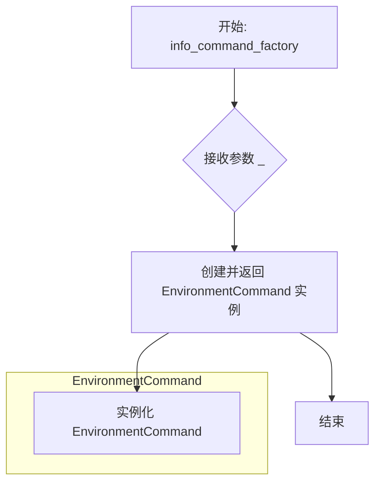

#### 带注释源码

```python
def info_command_factory(_):
    """
    工厂函数，用于创建 EnvironmentCommand 实例。
    
    此函数作为 CLI 命令工厂，被 argparse 用于在解析 'env' 子命令时
    创建对应的命令处理对象。它接收一个未使用的参数（按照 Python 惯例，
    使用下划线表示该参数会被忽略），并返回一个 EnvironmentCommand 实例。
    
    参数:
        _: 任意类型，工厂函数接收的输入参数（此参数在此处未被使用，
           主要是为了匹配 CLI 框架的函数签名要求）
    
    返回值:
        EnvironmentCommand: 返回一个新的 EnvironmentCommand 实例，
                           用于处理 'env' 子命令的运行逻辑
    """
    return EnvironmentCommand()
```


### `platform.platform`

`platform.platform()` 是 Python 标准库函数，用于获取当前运行平台的详细信息（如操作系统、版本等）。在代码中调用该函数以获取平台信息并存储在 `platform_info` 变量中。

参数：

- 该函数在代码中无参数调用，使用默认参数

返回值：`str`，返回平台信息字符串（如 'Linux-5.4.0-123-generic-x86_64-with-glibc2.31' 或 'Darwin-21.4.0-x86_64-i386-64bit'）

#### 流程图

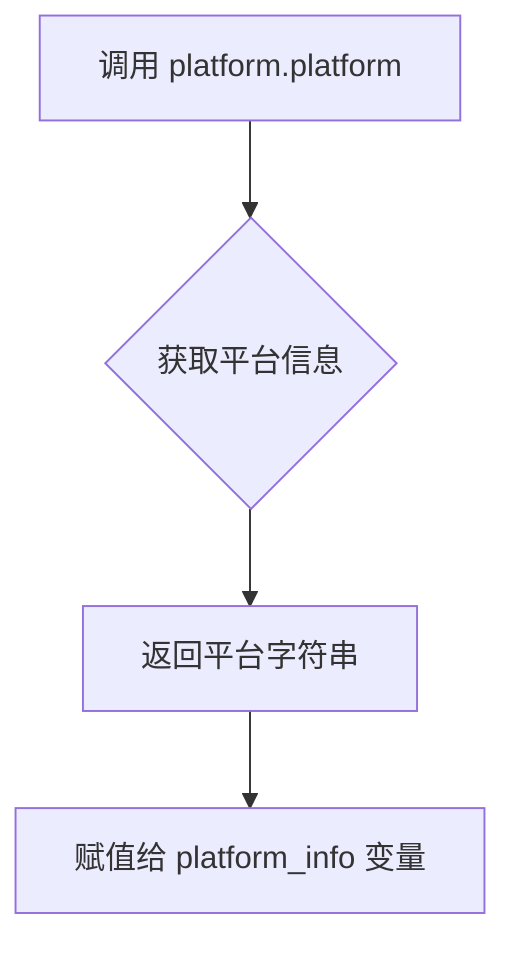

#### 带注释源码

```python
# 在代码中的调用位置（第96行）
# 获取当前平台的详细信息字符串
platform_info = platform.platform()

# platform.platform() 的函数签名（来自 Python 标准库）
# def platform(aliased: bool = False, terse: bool = False) -> str:
#
# 参数说明：
# - aliased: bool, 当为 True 时，返回别名化的平台信息（如将 'linux' 别名化为 'posix'）
# - terse: bool, 当为 True 时，返回更简洁的平台信息
#
# 返回值：
# - str: 描述平台的字符串，包含操作系统名称、版本、硬件架构等信息
#
# 在本代码中的使用：
# - 无参数调用，使用默认参数（aliased=False, terse=False）
# - 返回的字符串示例：
#   * Linux: 'Linux-5.4.0-123-generic-x86_64-with-glibc2.31'
#   * macOS: 'Darwin-21.4.0-x86_64-i386-64bit'
#   * Windows: 'Windows-10-10.0.19041-SP0'
```


### `platform.python_version`

获取当前Python解释器的版本信息，返回一个表示Python版本号的字符串。

参数： 无

返回值：`str`，返回当前Python解释器的版本号（例如："3.10.12"）。

#### 流程图

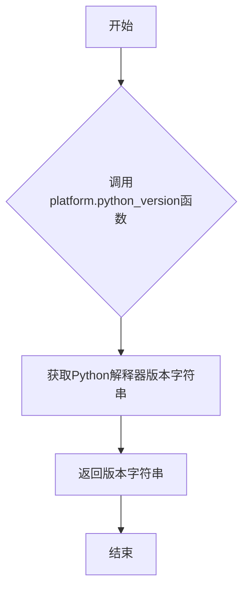

#### 带注释源码

```python
# platform.python_version() 是Python标准库platform模块的静态方法
# 此函数被调用在EnvironmentCommand.run()方法内部
# 用于收集当前Python解释器的版本信息，以便在环境报告中展示

# 代码中的调用方式：
"Python version": platform.python_version(),

# 具体位置在EnvironmentCommand类的run方法中：
# 1. 定义平台信息字典info
# 2. 通过platform.python_version()获取Python版本
# 3. 将版本信息存入info字典，键为"Python version"
# 4. 最终通过format_dict方法格式化并打印环境信息
```


### `subprocess.Popen`

`subprocess.Popen` 是 Python 标准库中的类，用于创建子进程并与其交互。在本代码中，它用于执行系统命令（`nvidia-smi` 或 `system_profiler`）来获取GPU/加速器硬件信息。

参数：

-  `args`：列表或字符串，要执行的命令及参数
  - Linux/Windows: `["nvidia-smi", "--query-gpu=gpu_name,memory.total", "--format=csv,noheader"]`
  - Darwin (Mac): `["system_profiler", "SPDisplaysDataType"]`
-  `stdout`：管道类型，设置为 `subprocess.PIPE` 用于捕获标准输出
-  `stderr`：管道类型，设置为 `subprocess.PIPE` 用于捕获标准错误
-  `shell`：布尔值，可选，默认为 `False`

返回值：`subprocess.Popen` 对象，表示启动的子进程

#### 流程图

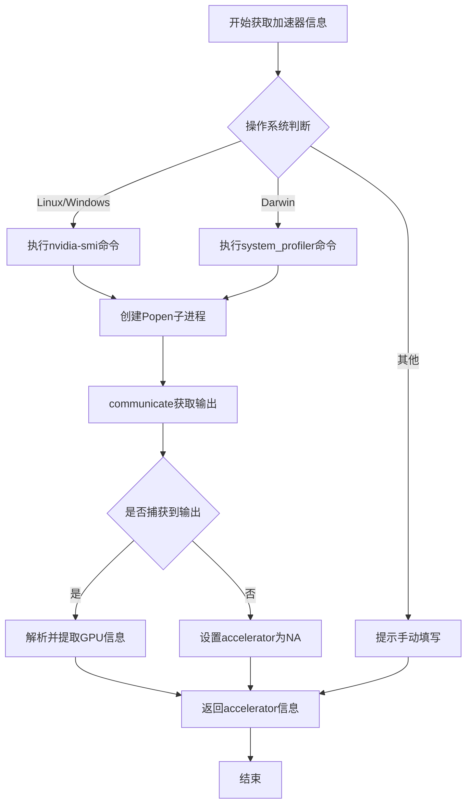

#### 带注释源码

```python
# Linux/Windows 系统：尝试使用 nvidia-smi 获取 GPU 信息
if platform.system() in {"Linux", "Windows"}:
    try:
        # 创建子进程执行 nvidia-smi 命令
        # args: 要执行的命令列表
        # stdout=subprocess.PIPE: 捕获标准输出
        # stderr=subprocess.PIPE: 捕获标准错误输出
        sp = subprocess.Popen(
            ["nvidia-smi", "--query-gpu=gpu_name,memory.total", "--format=csv,noheader"],
            stdout=subprocess.PIPE,
            stderr=subprocess.PIPE,
        )
        # communicate() 等待进程完成，返回 (stdout, stderr) 元组
        out_str, _ = sp.communicate()
        # 将字节解码为 UTF-8 字符串
        out_str = out_str.decode("utf-8")

        # 如果有输出，解析 GPU 信息
        if len(out_str) > 0:
            accelerator = out_str.strip()
    except FileNotFoundError:
        # nvidia-smi 不存在（如无 NVIDIA GPU）
        pass

# Mac OS (Darwin) 系统：使用 system_profiler 获取显卡信息
elif platform.system() == "Darwin":  # Mac OS
    try:
        # 创建子进程执行 system_profiler 命令
        sp = subprocess.Popen(
            ["system_profiler", "SPDisplaysDataType"],
            stdout=subprocess.PIPE,
            stderr=subprocess.PIPE,
        )
        # 等待进程完成并获取输出
        out_str, _ = sp.communicate()
        out_str = out_str.decode("utf-8")

        # 解析输出，提取 "Chipset Model:" 后的显卡名称
        start = out_str.find("Chipset Model:")
        if start != -1:
            start += len("Chipset Model:")
            end = out_str.find("\n", start)
            accelerator = out_str[start:end].strip()

            # 继续提取 VRAM 信息
            start = out_str.find("VRAM (Total):")
            if start != -1:
                start += len("VRAM (Total):")
                end = out_str.find("\n", start)
                accelerator += " VRAM: " + out_str[start:end].strip()
    except FileNotFoundError:
        # system_profiler 命令不可用
        pass
```


### `is_google_colab`

该函数用于检测当前代码是否运行在 Google Colab 环境中，通过检查特定的环境变量和文件路径来判断。

参数：

- 该函数无参数

返回值：`bool`，如果在 Google Colab 环境中运行返回 `True`，否则返回 `False`

#### 流程图

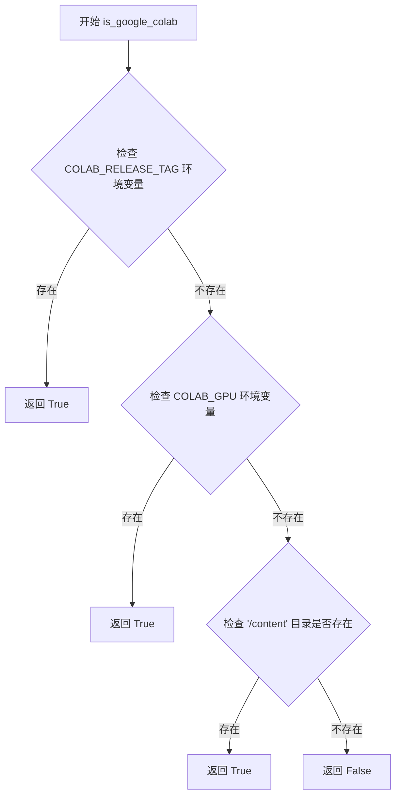

#### 带注释源码

```
# 该函数从 ..utils 模块导入
# 在代码中的使用方式：
is_google_colab_str = "Yes" if is_google_colab() else "No"

# 函数实现（在 ..utils 模块中，完整实现未在当前代码文件中展示）
# 通常实现逻辑如下：
# 1. 检查环境变量 COLAB_RELEASE_TAG 是否存在
# 2. 检查环境变量 COLAB_GPU 是否存在  
# 3. 检查 '/content' 目录是否存在（Colab 特有目录）
# 如果上述任一条件满足，则返回 True 表示运行在 Google Colab 环境中
```


### `is_safetensors_available`

该函数用于检查当前环境中是否安装了 safetensors 库，并返回一个布尔值来指示其可用性。

参数：此函数没有参数。

返回值：`bool`，如果 safetensors 库已安装且可用返回 `True`，否则返回 `False`。

#### 流程图

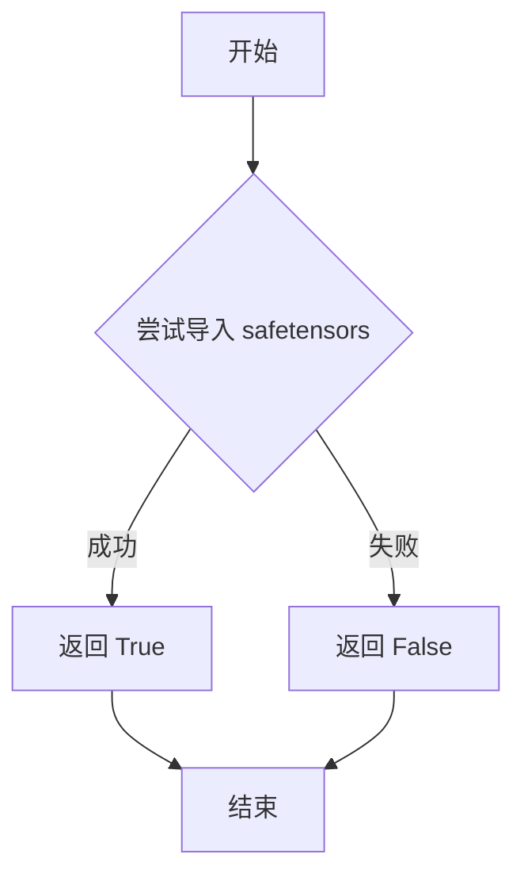

#### 带注释源码

```
# 注意：此函数的实际实现在 ..utils 模块中，此处基于使用方式推断
def is_safetensors_available() -> bool:
    """
    检查 safetensors 库是否可用。
    
    通常实现方式为：
    1. 尝试导入 safetensors 模块
    2. 如果导入成功，返回 True
    3. 如果导入失败（ImportError），返回 False
    
    这是一种常见的可选依赖检查模式，
    用于在某些功能需要特定库时进行条件判断。
    """
    try:
        import safetensors
        return True
    except ImportError:
        return False
```

#### 使用示例

在当前代码中的使用方式：

```
safetensors_version = "not installed"
if is_safetensors_available():
    import safetensors
    safetensors_version = safetensors.__version__
```

这种模式确保了：
- 如果 safetensors 可用，获取其版本号
- 如果不可用，显示 "not installed"
- 不会因为库不存在而导致程序崩溃


### is_torch_available

检查 PyTorch 库是否已安装并可用。该函数是环境检查工具，用于在代码中安全地判断是否可以导入和使用 PyTorch。

参数：

- 无参数

返回值：`bool`，如果 PyTorch 已安装且可用则返回 True，否则返回 False。

#### 流程图

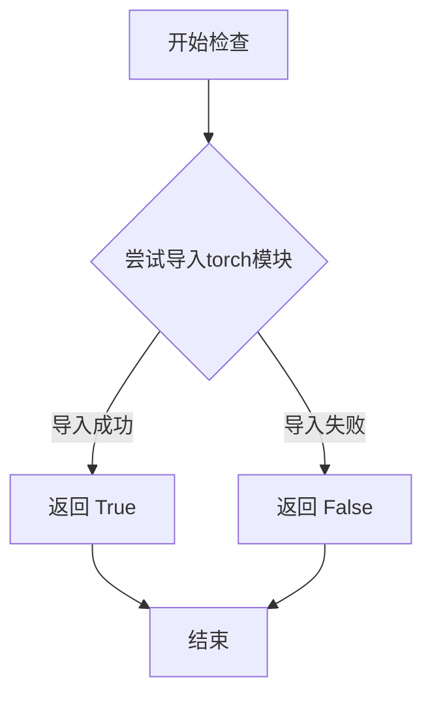

#### 带注释源码

```
# is_torch_available 函数的典型实现方式（位于 ..utils 模块中）

def is_torch_available() -> bool:
    """
    检查 PyTorch 是否可用。
    
    Returns:
        bool: 如果 PyTorch 已安装并可导入则返回 True，否则返回 False。
    """
    try:
        # 尝试导入 torch 模块，如果成功则表示可用
        import torch
        return True
    except ImportError:
        # 如果导入失败，说明 PyTorch 未安装
        return False
```


### `is_flax_available`

该函数用于检查当前环境中 Flax 及其相关依赖（Jax、Jaxlib）是否已安装可用。

参数：无

返回值：`bool`，返回 True 表示 Flax 及相关依赖可用，返回 False 表示不可用。

#### 流程图

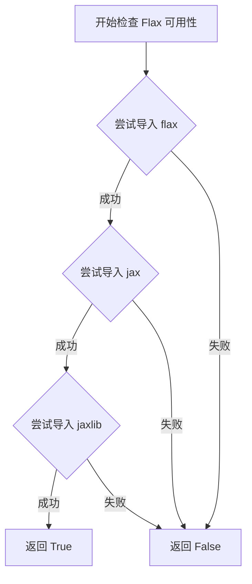

#### 带注释源码

```
# is_flax_available 函数的实现位于 src/diffusers/utils/__init__.py 或类似的 utils 模块中
# 当前代码文件展示了其使用方式：

# 导入 is_flax_available 函数（从上级目录的 utils 模块）
from ..utils import (
    is_flax_available,
    # ... 其他导入
)

# 在 EnvironmentCommand.run() 方法中使用
if is_flax_available():  # 检查 Flax 是否可用
    import flax
    import jax
    import jaxlib

    flax_version = flax.__version__
    jax_version = jax.__version__
    jaxlib_version = jaxlib.__version__
    jax_backend = jax.lib.xla_bridge.get_backend().platform
```

#### 额外信息

**设计目标**：这是一个辅助函数，用于在运行时动态检测 Flax 机器学习框架是否已安装，以便条件性地执行需要 Flax 的代码路径。

**使用场景**：在 Diffusers CLI 的环境信息命令中，使用此函数来决定是否查询和显示 Flax 相关的版本信息。

**实现推测**：根据同类函数（如 `is_torch_available`、`is_transformers_available`）的常见实现模式，该函数可能使用了类似的检测机制，通常通过尝试导入模块并捕获 ImportError 来实现。


### `is_transformers_available`

检查 `transformers` 库是否已安装且可导入。

参数：

- （无参数）

返回值：`bool`，如果 `transformers` 库可用则返回 `True`，否则返回 `False`

#### 流程图

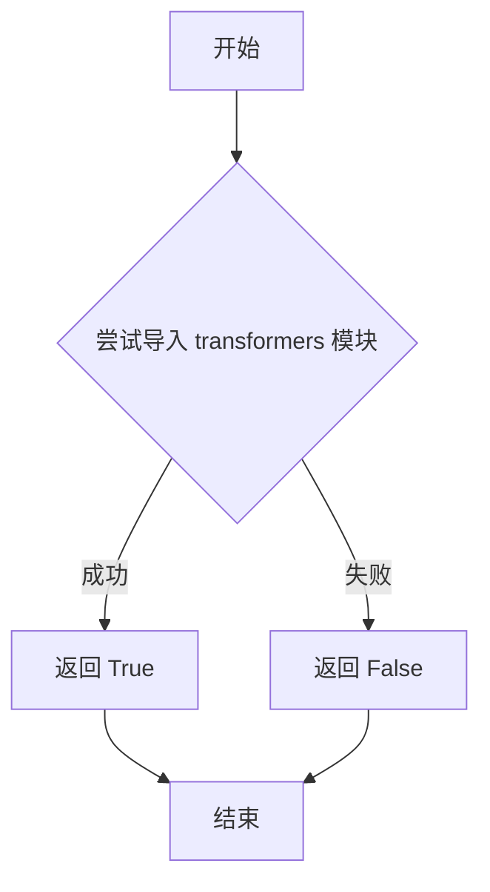

#### 带注释源码

```python
def is_transformers_available():
    """
    检查 transformers 库是否可用。
    
    尝试导入 transformers 模块，如果成功则返回 True，否则返回 False。
    这是一个常用的依赖检查函数，用于条件性地使用 transformers 库的功能。
    
    Returns:
        bool: 如果 transformers 库已安装且可导入则返回 True，否则返回 False
    """
    try:
        import transformers  # 尝试导入 transformers 模块
        return True  # 导入成功，返回 True
    except ImportError:  # 捕获导入错误
        return False  # 导入失败，返回 False
```

**注意**：由于给定的代码文件中 `is_transformers_available` 是从 `..utils` 导入的外部函数，上述源码是基于常见实现模式的推断。该函数在给定代码的 `EnvironmentCommand.run()` 方法中被使用：

```python
# 检查 transformers 是否可用
transformers_version = "not installed"
if is_transformers_available():  # 如果可用
    import transformers
    transformers_version = transformers.__version__  # 获取版本号
```


### `is_accelerate_available`

该函数用于检查当前环境中是否已安装并可用 `accelerate` 库。它通常通过尝试导入该库或检查其版本来判断可用性。

参数：无需参数

返回值：`bool`，返回 `True` 表示 `accelerate` 库可用，返回 `False` 表示不可用。

#### 流程图

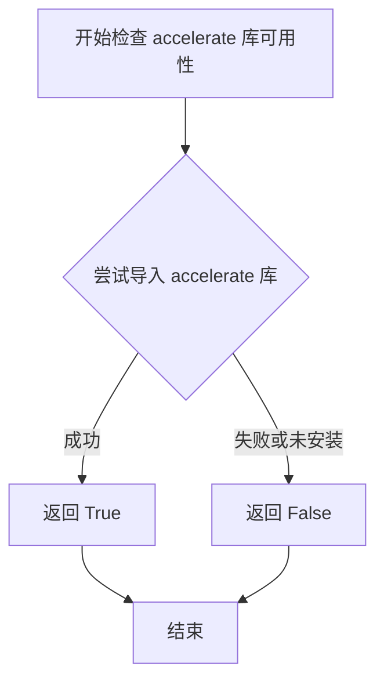

#### 带注释源码

```
# 该函数从 diffusers.utils 模块导入
# 位置: src/diffusers/utils/__init__.py (推测)
# 
# 典型实现方式如下:

def is_accelerate_available() -> bool:
    """
    检查 accelerate 库是否可用。
    
    返回:
        bool: 如果 accelerate 库已安装且可导入返回 True，否则返回 False。
    """
    try:
        import accelerate
        return True
    except ImportError:
        return False

# ------------------
# 在 EnvironmentCommand.run() 中的使用方式:
# ------------------

accelerate_version = "not installed"
if is_accelerate_available():  # 检查 accelerate 是否可用
    import accelerate
    accelerate_version = accelerate.__version__  # 获取版本号

# 说明:
# 1. 首先调用 is_accelerate_available() 检查库是否可用
# 2. 如果返回 True，则安全地导入 accelerate 模块
# 3. 获取并存储 accelerate 的版本号用于显示
```


### `is_peft_available`

该函数用于检查 PEFT（Parameter-Efficient Fine-Tuning）库是否已安装并可用。这是 diffusers 工具模块中的一个实用检查函数，通过尝试导入 `peft` 模块来判断库是否可用。

参数：该函数无参数

返回值：`bool`，返回 `True` 表示 PEFT 库可用，返回 `False` 表示不可用

#### 流程图

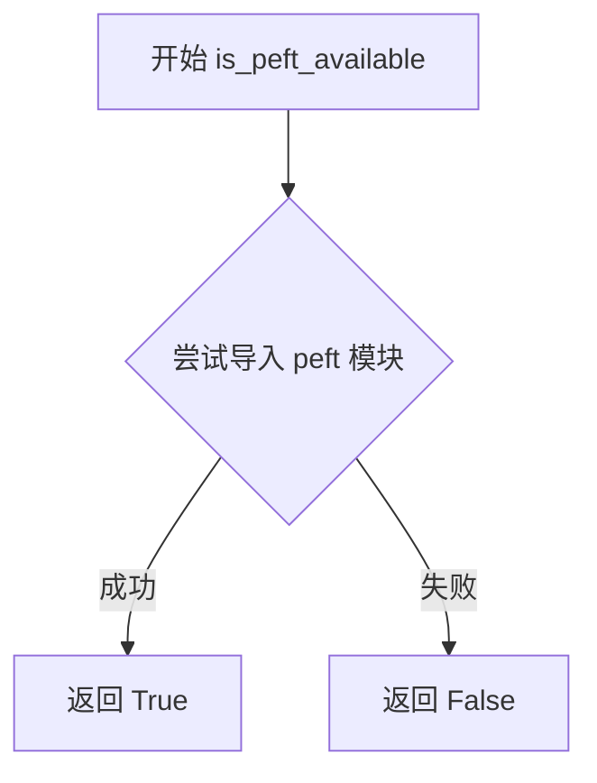

#### 带注释源码

```python
# is_peft_available 函数定义于 diffusers/src/diffusers/utils.py 中
# 以下为推断的实现方式（基于同类函数的常见模式）

def is_peft_available() -> bool:
    """
    检查 PEFT (Parameter-Efficient Fine-Tuning) 库是否可用。
    
    该函数尝试导入 peft 模块，如果成功则返回 True，否则返回 False。
    这种模式常用于检查可选依赖项是否已安装。
    
    Returns:
        bool: 如果 PEFT 库已安装且可导入则返回 True，否则返回 False
    """
    try:
        import peft
        return True
    except ImportError:
        return False
```

#### 在代码中的使用示例

```python
# 在 EnvironmentCommand 类中用于获取 PEFT 版本信息
peft_version = "not installed"
if is_peft_available():
    import peft
    peft_version = peft.__version__
```

---

**注意**：由于 `is_peft_available` 函数定义在 `diffusers.utils` 模块中（通过 `from ..utils import is_peft_available` 导入），而该模块的具体实现未在当前代码片段中提供。上述源码是基于同类工具函数（如 `is_torch_available`、`is_transformers_available` 等）的常见实现模式推断得出的。


### `is_bitsandbytes_available`

该函数用于检查 `bitsandbytes` 库是否可用（已安装且可导入），常用于条件导入或功能兼容性检查。

参数：无

返回值：`bool`，如果 bitsandbytes 库可用则返回 `True`，否则返回 `False`

#### 流程图

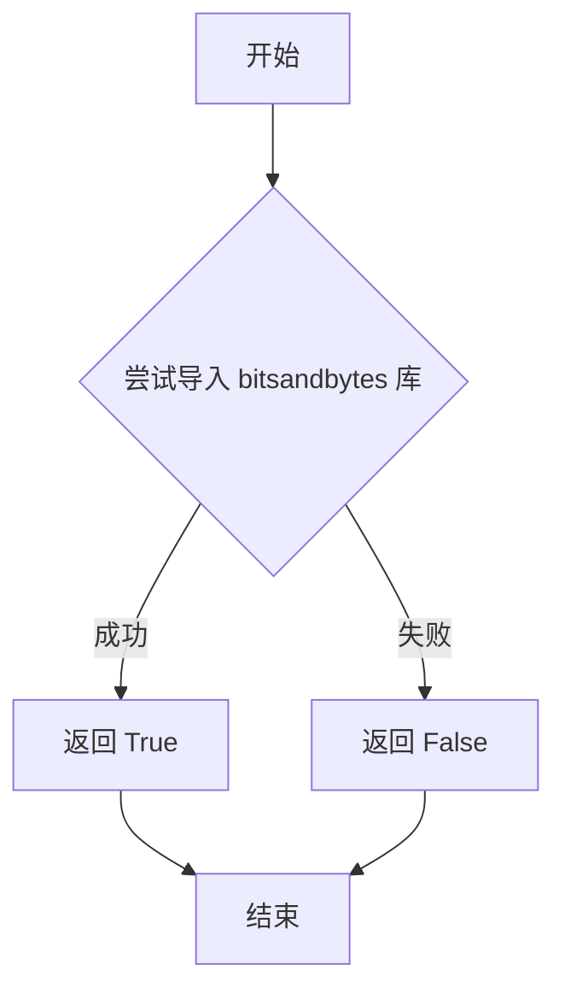

#### 带注释源码

```
# is_bitsandbytes_available 函数定义通常位于 utils 模块中
# 以下是其在当前代码中的使用方式：

# 1. 导入该函数（在文件顶部）
from ..utils import (
    is_bitsandbytes_available,
    # ... 其他工具函数
)

# 2. 在 EnvironmentCommand.run() 方法中的使用
bitsandbytes_version = "not installed"  # 默认值为未安装
if is_bitsandbytes_available():          # 检查 bitsandbytes 是否可用
    import bitsandbytes                   # 动态导入 bitsandbytes
    bitsandbytes_version = bitsandbytes.__version__  # 获取版本号

# 完整函数签名推断：
def is_bitsandbytes_available() -> bool:
    """
    检查 bitsandbytes 库是否已安装且可导入。
    
    Returns:
        bool: 如果 bitsandbytes 可用返回 True，否则返回 False。
    """
    # 内部实现通常使用 try-except 尝试导入
    try:
        import bitsandbytes
        return True
    except ImportError:
        return False
```

#### 在上下文中的使用

```python
# 代码片段来自 EnvironmentCommand.run() 方法
bitsandbytes_version = "not installed"
if is_bitsandbytes_available():
    import bitsandbytes
    bitsandbytes_version = bitsandbytes.__version__

# 后续该值被放入 info 字典用于显示环境信息
info = {
    # ...
    "Bitsandbytes version": bitsandbytes_version,
    # ...
}
```


# is_xformers_available 函数提取

由于 `is_xformers_available` 函数是从 `..utils` 模块导入的（当前代码文件中仅包含导入和使用），我需要基于该函数的典型实现模式和代码中的使用方式来提取信息。

### is_xformers_available

该函数用于检测当前环境中是否已安装并可用 xFormers 库。xFormers 是一个用于高效 Transformer 训练的库，主要用于加速注意力机制的计算。

参数：该函数无参数

返回值：`bool`，返回 `True` 表示 xFormers 已安装且可用，返回 `False` 表示不可用

#### 流程图

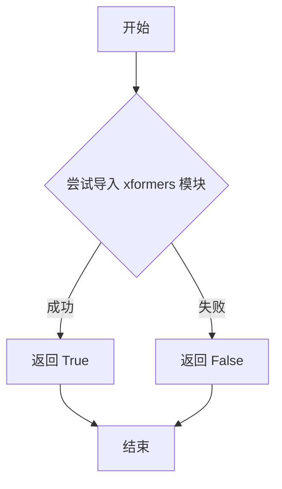

#### 带注释源码

由于 `is_xformers_available` 的实现不在当前文件中（它是从 `..utils` 导入的），以下是基于代码中调用方式的推断实现：

```python
def is_xformers_available() -> bool:
    """
    检测 xFormers 库是否可用
    
    Returns:
        bool: 如果 xFormers 已安装且可导入返回 True，否则返回 False
    """
    try:
        # 尝试导入 xformers 模块
        import xformers
        return True
    except ImportError:
        # 如果导入失败，说明 xFormers 未安装
        return False
```

#### 代码中的实际调用

```python
# 在 EnvironmentCommand 类中的使用示例
xformers_version = "not installed"
if is_xformers_available():  # 检查 xformers 是否可用
    import xformers
    xformers_version = xformers.__version__  # 获取版本号
```

---

**注意**：实际的 `is_xformers_available` 函数定义位于 `..utils` 模块中。如果需要查看完整的实现源码，请查阅 `utils` 模块中的相关文件。


### `EnvironmentCommand.register_subcommand`

该方法是一个静态方法，用于在命令行参数解析器中注册 `env` 子命令，使得用户可以通过 `diffusers env` 命令查看当前环境的依赖版本信息。

参数：

- `parser`：`ArgumentParser`，主命令行参数解析器实例，用于添加子命令

返回值：`None`，无返回值

#### 流程图

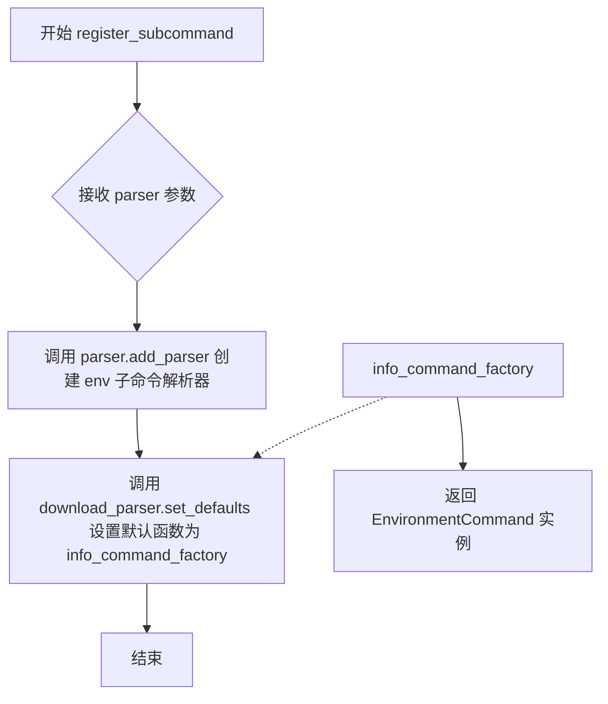

#### 带注释源码

```python
@staticmethod
def register_subcommand(parser: ArgumentParser) -> None:
    """
    注册 env 子命令到命令行解析器
    
    参数:
        parser: ArgumentParser - 主参数解析器，用于添加子命令
    
    返回:
        None - 此方法不返回任何值，仅修改 parser 的内部状态
    """
    # 1. 向解析器添加名为 "env" 的子命令解析器
    #    这允许用户通过命令行执行 "diffusers env" 命令
    download_parser = parser.add_parser("env")
    
    # 2. 设置子命令的默认函数为 info_command_factory
    #    当用户运行 "diffusers env" 时，会调用 info_command_factory
    #    该工厂函数返回 EnvironmentCommand 实例
    download_parser.set_defaults(func=info_command_factory)
```


### `EnvironmentCommand.run`

该方法收集并打印当前 Python 环境中所有相关依赖库的版本信息（包括 PyTorch、Transformers、Diffusers、Flax 等）、平台信息、GPU/Accelerator 信息，并返回一个包含完整环境信息的字典供调试和问题报告使用。

参数：无（仅包含隐式参数 `self`）

返回值：`dict`，返回一个键值对字典，包含以下键值对：
- "🤗 Diffusers version": 版本号
- "Platform": 平台信息
- "Running on Google Colab?": 是否运行在 Google Colab
- "Python version": Python 版本
- "PyTorch version (GPU?)": PyTorch 版本及 CUDA 是否可用
- "Flax version (CPU?/GPU?/TPU?)": Flax 版本及后端
- "Jax version": Jax 版本
- "JaxLib version": JaxLib 版本
- "Huggingface_hub version": huggingface_hub 版本
- "Transformers version": Transformers 版本
- "Accelerate version": Accelerate 版本
- "PEFT version": PEFT 版本
- "Bitsandbytes version": Bitsandbytes 版本
- "Safetensors version": Safetensors 版本
- "xFormers version": xFormers 版本
- "Accelerator": GPU/Accelerator 信息
- "Using GPU in script?": 占位符
- "Using distributed or parallel set-up in script?": 占位符

#### 流程图

```mermaid
flowchart TD
    A[开始] --> B[获取 huggingface_hub 版本]
    B --> C{is_safetensors_available?}
    C -->|是| D[获取 safetensors 版本]
    C -->|否| E[设置 safetensors_version = 'not installed']
    D --> F{is_torch_available?}
    E --> F
    F -->|是| G[获取 torch 版本和 CUDA 可用性]
    F -->|否| H[设置 pt_version = 'not installed', pt_cuda_available = 'NA']
    G --> I{is_flax_available?}
    H --> I
    I -->|是| J[获取 flax, jax, jaxlib 版本及后端]
    I -->|否| K[设置 flax/jax/jaxlib 版本为 'not installed']
    J --> L{is_transformers_available?}
    K --> L
    L -->|是| M[获取 transformers 版本]
    L -->|否| N[设置 transformers_version = 'not installed']
    M --> O{is_accelerate_available?}
    N --> O
    O -->|是| P[获取 accelerate 版本]
    O -->|否| Q[设置 accelerate_version = 'not installed']
    P --> R{is_peft_available?}
    Q --> R
    R -->|是| S[获取 peft 版本]
    R -->|否| T[设置 peft_version = 'not installed']
    S --> U{is_bitsandbytes_available?}
    T --> U
    U -->|是| V[获取 bitsandbytes 版本]
    U -->|否| W[设置 bitsandbytes_version = 'not installed']
    V --> X{is_xformers_available?}
    W --> X
    X -->|是| Y[获取 xformers 版本]
    X -->|否| Z[设置 xformers_version = 'not installed']
    Y --> AA[获取 platform_info]
    Z --> AA
    AA --> AB{is_google_colab?}
    AB -->|是| AC[设置 is_google_colab_str = 'Yes']
    AB -->|否| AD[设置 is_google_colab_str = 'No']
    AC --> AE{platform.system?}
    AD --> AE
    AE -->|Linux/Windows| AF[执行 nvidia-smi 获取 GPU 信息]
    AE -->|Darwin| AG[执行 system_profiler 获取 Mac GPU 信息]
    AE -->|其他| AH[打印提示信息]
    AF --> AI[解析输出获取 accelerator]
    AG --> AI
    AH --> AI
    AI --> AJ[构建 info 字典]
    AJ --> AK[打印格式化后的信息]
    AK --> AL[返回 info 字典]
```

#### 带注释源码

```python
def run(self) -> dict:
    """
    收集并打印当前环境的依赖库版本信息，返回包含完整环境信息的字典。
    """
    # 1. 获取 huggingface_hub 版本
    hub_version = huggingface_hub.__version__

    # 2. 检查 safetensors 是否可用
    safetensors_version = "not installed"
    if is_safetensors_available():
        import safetensors
        safetensors_version = safetensors.__version__

    # 3. 检查 PyTorch 是否可用
    pt_version = "not installed"
    pt_cuda_available = "NA"
    if is_torch_available():
        import torch
        pt_version = torch.__version__
        pt_cuda_available = torch.cuda.is_available()

    # 4. 检查 Flax/JAX 是否可用
    flax_version = "not installed"
    jax_version = "not installed"
    jaxlib_version = "not installed"
    jax_backend = "NA"
    if is_flax_available():
        import flax
        import jax
        import jaxlib
        flax_version = flax.__version__
        jax_version = jax.__version__
        jaxlib_version = jaxlib.__version__
        jax_backend = jax.lib.xla_bridge.get_backend().platform

    # 5. 检查 Transformers 是否可用
    transformers_version = "not installed"
    if is_transformers_available():
        import transformers
        transformers_version = transformers.__version__

    # 6. 检查 Accelerate 是否可用
    accelerate_version = "not installed"
    if is_accelerate_available():
        import accelerate
        accelerate_version = accelerate.__version__

    # 7. 检查 PEFT 是否可用
    peft_version = "not installed"
    if is_peft_available():
        import peft
        peft_version = peft.__version__

    # 8. 检查 Bitsandbytes 是否可用
    bitsandbytes_version = "not installed"
    if is_bitsandbytes_available():
        import bitsandbytes
        bitsandbytes_version = bitsandbytes.__version__

    # 9. 检查 xFormers 是否可用
    xformers_version = "not installed"
    if is_xformers_available():
        import xformers
        xformers_version = xformers.__version__

    # 10. 获取平台信息
    platform_info = platform.platform()

    # 11. 检查是否在 Google Colab
    is_google_colab_str = "Yes" if is_google_colab() else "No"

    # 12. 根据操作系统获取 Accelerator/GPU 信息
    accelerator = "NA"
    if platform.system() in {"Linux", "Windows"}:
        # Linux/Windows: 使用 nvidia-smi 获取 GPU 信息
        try:
            sp = subprocess.Popen(
                ["nvidia-smi", "--query-gpu=gpu_name,memory.total", "--format=csv,noheader"],
                stdout=subprocess.PIPE,
                stderr=subprocess.PIPE,
            )
            out_str, _ = sp.communicate()
            out_str = out_str.decode("utf-8")
            if len(out_str) > 0:
                accelerator = out_str.strip()
        except FileNotFoundError:
            pass
    elif platform.system() == "Darwin":  # Mac OS
        # macOS: 使用 system_profiler 获取 GPU 信息
        try:
            sp = subprocess.Popen(
                ["system_profiler", "SPDisplaysDataType"],
                stdout=subprocess.PIPE,
                stderr=subprocess.PIPE,
            )
            out_str, _ = sp.communicate()
            out_str = out_str.decode("utf-8")

            start = out_str.find("Chipset Model:")
            if start != -1:
                start += len("Chipset Model:")
                end = out_str.find("\n", start)
                accelerator = out_str[start:end].strip()

                start = out_str.find("VRAM (Total):")
                if start != -1:
                    start += len("VRAM (Total):")
                    end = out_str.find("\n", start)
                    accelerator += " VRAM: " + out_str[start:end].strip()
        except FileNotFoundError:
            pass
    else:
        print("It seems you are running an unusual OS. Could you fill in the accelerator manually?")

    # 13. 构建环境信息字典
    info = {
        "🤗 Diffusers version": version,
        "Platform": platform_info,
        "Running on Google Colab?": is_google_colab_str,
        "Python version": platform.python_version(),
        "PyTorch version (GPU?)": f"{pt_version} ({pt_cuda_available})",
        "Flax version (CPU?/GPU?/TPU?)": f"{flax_version} ({jax_backend})",
        "Jax version": jax_version,
        "JaxLib version": jaxlib_version,
        "Huggingface_hub version": hub_version,
        "Transformers version": transformers_version,
        "Accelerate version": accelerate_version,
        "PEFT version": peft_version,
        "Bitsandbytes version": bitsandbytes_version,
        "Safetensors version": safetensors_version,
        "xFormers version": xformers_version,
        "Accelerator": accelerator,
        "Using GPU in script?": "<fill in>",
        "Using distributed or parallel set-up in script?": "<fill in>",
    }

    # 14. 打印格式化后的信息，供用户复制到 GitHub issue
    print("\nCopy-and-paste the text below in your GitHub issue and FILL OUT the two last points.\n")
    print(self.format_dict(info))

    # 15. 返回信息字典
    return info
```


### `EnvironmentCommand.format_dict`

该方法是一个静态方法，用于将字典格式化为符合 GitHub issue 格式的字符串，将每个键值对转换为 Markdown 列表项（`- {键}: {值}`），并用换行符连接。

参数：

- `d`：`dict`，需要格式化的字典，包含环境信息的键值对

返回值：`str`，格式化后的字符串，每行一个属性，格式为 "- {属性名}: {属性值}"

#### 流程图

```mermaid
flowchart TD
    A[开始 format_dict] --> B{输入字典 d}
    B --> C[遍历字典 d.items]
    C --> D[对每个键值对格式化为 f"- {prop}: {val}"]
    D --> E[用换行符 join 所有格式化的字符串]
    E --> F[末尾添加换行符]
    F --> G[返回格式化后的字符串]
```

#### 带注释源码

```python
@staticmethod
def format_dict(d: dict) -> str:
    """
    将字典格式化为符合 GitHub issue 格式的字符串。
    
    参数:
        d: dict - 需要格式化的字典，包含环境信息的键值对
        
    返回:
        str - 格式化后的字符串，每行一个属性，格式为 '- {属性名}: {属性值}'
    """
    # 使用列表推导式遍历字典的每个键值对
    # 将其格式化为 Markdown 列表项格式 "- {键}: {值}"
    # 然后用换行符连接，并在末尾添加一个换行符
    return "\n".join([f"- {prop}: {val}" for prop, val in d.items()]) + "\n"
```

## 关键组件


### 环境信息收集组件

负责收集并展示当前Python运行环境的依赖库版本、平台信息和硬件加速器信息，是Diffusers CLI工具的核心诊断模块。

### 动态依赖版本检测组件

通过条件导入和版本检查机制，动态检测PyTorch、Flax、JAX、Transformers、Accelerate、PEFT、bitsandbytes、safetensors、xformers等关键依赖库的安装状态和版本号。

### 跨平台硬件信息获取组件

针对不同操作系统（Linux/Windows、macOS）使用特定的命令行工具（nvidia-smi、system_profiler）查询GPU/ accelerator信息，并支持优雅的异常处理。

### CLI命令注册与执行组件

实现BaseDiffusersCLICommand接口，通过register_subcommand方法注册"env"子命令，提供标准化的CLI扩展机制。

## 问题及建议


### 已知问题

-   **subprocess 错误处理不完善**：对 `nvidia-smi` 和 `system_profiler` 的调用仅捕获 `FileNotFoundError`，缺少对 `PermissionError`、`subprocess.TimeoutExpired`、进程返回非零退出码等异常的处理，可能导致静默失败或崩溃。
-   **硬编码字符串缺乏统一管理**：版本号占位符（如 `"not installed"`、 `"NA"`）和用户提示信息散落在代码各处，不利于国际化（i18n）和维护。
-   **GPU 信息解析逻辑脆弱**：对 `nvidia-smi` 输出格式的解析假设为单行 CSV，对多 GPU 或不同输出格式可能失效；Mac OS 的解析依赖特定字符串位置（如 `"Chipset Model:"`），易受系统语言或更新影响。
-   **函数职责过于集中**：`run()` 方法同时负责依赖版本检测、系统信息收集、GPU 探测、结果格式化等多个职责，单一职责原则（SRP）执行不到位。
-   **返回字典包含占位符**：`info` 字典中的 `"Using GPU in script?"` 和 `"Using distributed or parallel set-up in script?"` 字段硬编码为 `"<fill in>"`，调用方无法区分是用户未填写还是默认值，语义不明确。
-   **重复的模式代码**：每个依赖库的版本检测逻辑高度相似（检查可用性 → 导入 → 获取版本），存在明显的代码重复，可抽象为通用函数。
-   **缺少类型注解**：部分变量（如 `sp`、`out_str`）未标注类型，影响代码可读性和静态分析工具的有效性。
-   **平台检测与加速器获取耦合**：Linux/Windows、macOS 的加速器检测逻辑内嵌在主流程中，新增平台支持时需修改 `run()` 方法，违反开闭原则。

### 优化建议

-   **重构版本检测逻辑**：抽取通用的依赖检测函数，例如 `get_library_version(name: str, import_name: str) -> str`，接收库名和导入名参数，返回版本字符串或占位符，消除重复代码。
-   **改进 subprocess 错误处理**：统一封装 GPU 信息获取逻辑，使用 `subprocess.run()` 替代 `Popen`，设置超时时间，捕获更全面的异常（`FileNotFoundError`、`OSError`、`subprocess.CalledProcessError`），并在获取失败时返回安全的默认值而非静默跳过。
-   **增强 GPU 输出解析的鲁棒性**：对 `nvidia-smi` 输出按行分割处理，支持多 GPU 场景；对 Mac OS 输出使用正则表达式或更健壮的字符串匹配，降低对精确措辞的依赖。
-   **拆分 `run()` 方法**：将版本检测、平台信息收集、GPU 探测、格式化输出分离为独立私有方法（如 `_collect_library_versions()`、`_detect_accelerator()`、`_format_info()`），提升可测试性和可维护性。
-   **使用枚举或常量类管理占位符**：定义 `VersionStatus` 枚举（`NOT_INSTALLED = "not installed"`，`NOT_APPLICABLE = "NA"`，`USER_REQUIRED = "<fill in>"`），统一替代字符串字面量。
-   **补充类型注解**：为所有函数参数、返回值和关键变量添加 `typing` 注解，配合 `mypy` 等工具进行静态检查。
-   **设计加速器检测的可扩展架构**：采用策略模式或插件化架构，新增平台支持时只需注册新的检测策略类，无需修改核心流程。

## 其它


### 设计目标与约束

该命令旨在提供一个标准化的环境信息收集工具，帮助用户在GitHub Issue中报告问题时快速提供完整的系统环境信息。设计约束包括：跨平台支持（Linux、Windows、macOS）、优雅处理缺失依赖、对异常情况提供友好的用户提示。

### 错误处理与异常设计

代码采用try-except捕获异常，对于nvidia-smi和system_profiler命令使用FileNotFoundError捕获，处理了命令不存在的情况。对于依赖库不存在的情况，通过is_xxx_available()函数预先检查，避免导入错误。

### 外部依赖与接口契约

依赖外部命令包括：nvidia-smi（GPU信息查询）、system_profiler（macOS系统信息）。依赖的Python库包括：huggingface_hub、torch、flax、transformers、accelerate、peft、bitsandbytes、safetensors、xformers。

### 安全性考虑

代码通过subprocess执行系统命令，使用Popen而非直接调用shell，避免了shell注入风险。解码输出时指定UTF-8编码，防止编码问题。

### 性能考虑

使用subprocess.Popen并行执行外部命令，避免阻塞主线程。依赖检查采用惰性导入，仅在需要时加载模块。

### 兼容性设计

支持多平台检测：platform.system()区分Linux、Windows、Darwin（macOS）。对不同平台使用不同的系统命令获取GPU信息。依赖版本检查支持可选依赖，不存在的依赖显示"not installed"。

### 用户交互设计

输出格式化为Markdown列表，便于复制到GitHub Issue。最后两项保留为占位符"<fill in>"，提示用户手动填写GPU使用情况。

### 测试策略建议

建议添加单元测试验证format_dict方法、验证各依赖可用性检测逻辑、添加跨平台模拟测试。

### 配置管理

无外部配置文件，依赖版本信息从运行时环境动态获取。

### 日志设计

使用print输出信息，未使用标准日志模块，可考虑统一日志管理。

### 代码规范与约束

遵循Hugging Face项目规范，使用ArgumentParser注册子命令，继承BaseDiffusersCLICommand基类。


    