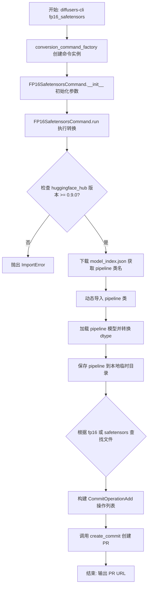
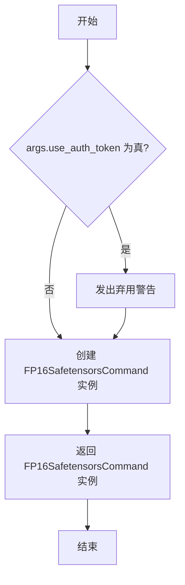
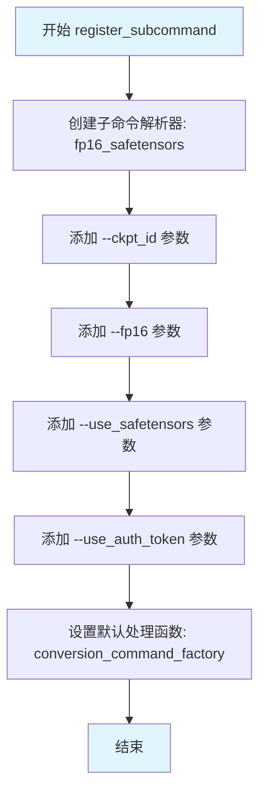
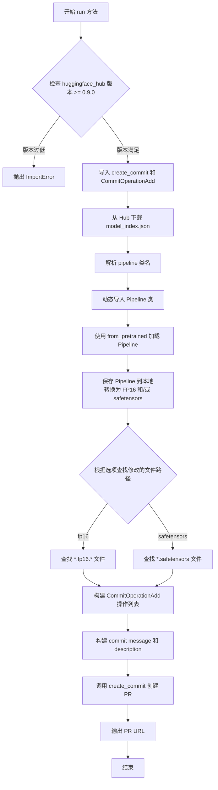
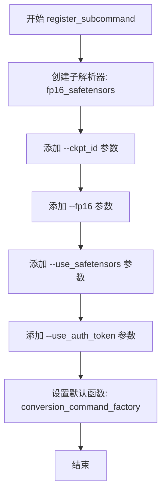
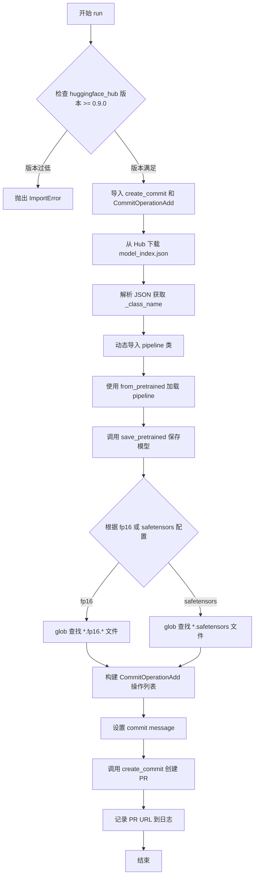

# `diffusers\src\diffusers\commands\fp16_safetensors.py` 详细设计文档

这是一个 diffusers-cli 子命令，用于将 Hugging Face Hub 上的模型检查点转换为 FP16 精度和/或 safetensors 格式，并将转换后的文件通过 PR 提交回模型仓库。

## 整体流程



## 类结构

```
BaseDiffusersCLICommand (抽象基类)
└── FP16SafetensorsCommand
```

## 全局变量及字段


### `conversion_command_factory`
    
命令工厂函数，根据参数创建并返回 FP16SafetensorsCommand 实例

类型：`function`
    


### `FP16SafetensorsCommand.logger`
    
CLI 日志记录器，用于记录命令执行过程中的日志信息

类型：`logging.Logger`
    


### `FP16SafetensorsCommand.ckpt_id`
    
Hugging Face Hub 上的模型仓库 ID，指定要转换的模型

类型：`str`
    


### `FP16SafetensorsCommand.local_ckpt_dir`
    
本地临时保存路径，用于存储下载和转换后的模型文件

类型：`str`
    


### `FP16SafetensorsCommand.fp16`
    
是否使用 FP16 精度，指示转换时是否将模型权重转换为半精度浮点数

类型：`bool`
    


### `FP16SafetensorsCommand.use_safetensors`
    
是否使用 safetensors 格式，指示转换时是否使用安全的张量序列化格式

类型：`bool`
    
    

## 全局函数及方法


### `conversion_command_factory`

这是一个工厂函数，用于根据命令行参数创建 `FP16SafetensorsCommand` 实例。它处理已弃用的 `use_auth_token` 参数的警告，然后返回配置好的命令对象。

参数：

- `args`：`Namespace`，命令行参数命名空间，包含 `ckpt_id`、`fp16`、`use_safetensors`、`use_auth_token` 等属性

返回值：`FP16SafetensorsCommand`，返回新创建的 FP16SafetensorsCommand 实例

#### 流程图



#### 带注释源码

```python
def conversion_command_factory(args: Namespace):
    """
    工厂函数，根据命令行参数创建 FP16SafetensorsCommand 实例
    
    参数:
        args: Namespace 对象，包含以下属性:
            - ckpt_id: str, 模型仓库 ID
            - fp16: bool, 是否使用 FP16 精度
            - use_safetensors: bool, 是否使用 safetensors 格式
            - use_auth_token: bool, 已弃用的认证令牌参数
    
    返回:
        FP16SafetensorsCommand: 配置好的命令实例
    """
    # 检查是否使用了已弃用的 use_auth_token 参数
    if args.use_auth_token:
        # 发出警告，提示该参数将在未来版本中移除
        warnings.warn(
            "The `--use_auth_token` flag is deprecated and will be removed in a future version."
            "Authentication is now handled automatically if the user is logged in."
        )
    
    # 创建并返回 FP16SafetensorsCommand 实例
    # 将命令行参数传递给命令类的构造函数
    return FP16SafetensorsCommand(args.ckpt_id, args.fp16, args.use_safetensors)
```


### `FP16SafetensorsCommand.register_subcommand`

这是一个静态方法，用于向 CLI 解析器注册 `fp16_safetensors` 子命令及其相关参数。该方法是 HuggingFace Diffusers CLI 命令框架的一部分，允许用户通过命令行将模型检查点转换为 FP16 精度和/或 SafeTensors 格式，并自动创建 Pull Request 提交到 Hub。

参数：

- `parser`：`ArgumentParser`，CLI 主解析器对象，该方法将向其中添加 fp16_safetensors 子命令及其参数

返回值：`None`，无返回值（通过修改 parser 对象注册子命令）

#### 流程图



#### 带注释源码

```python
@staticmethod
def register_subcommand(parser: ArgumentParser):
    """
    注册 fp16_safetensors 子命令到 CLI 解析器
    
    参数:
        parser: ArgumentParser 对象,主 CLI 解析器实例
    返回:
        None
    """
    # 创建名为 'fp16_safetensors' 的子命令解析器
    conversion_parser = parser.add_parser("fp16_safetensors")
    
    # 添加 --ckpt_id 参数: 指定要转换的检查点仓库 ID
    conversion_parser.add_argument(
        "--ckpt_id",
        type=str,
        help="Repo id of the checkpoints on which to run the conversion. Example: 'openai/shap-e'.",
    )
    
    # 添加 --fp16 参数: 是否以 FP16 精度序列化变量
    conversion_parser.add_argument(
        "--fp16", action="store_true", help="If serializing the variables in FP16 precision."
    )
    
    # 添加 --use_safetensors 参数: 是否以 safetensors 格式序列化
    conversion_parser.add_argument(
        "--use_safetensors", action="store_true", help="If serializing in the safetensors format."
    )
    
    # 添加 --use_auth_token 参数: 用于私有仓库的身份验证令牌
    conversion_parser.add_argument(
        "--use_auth_token",
        action="store_true",
        help="When working with checkpoints having private visibility. When used `hf auth login` needs to be run beforehand.",
    )
    
    # 设置默认处理函数,当解析到此子命令时调用 conversion_command_factory
    conversion_parser.set_defaults(func=conversion_command_factory)
```


### `FP16SafetensorsCommand.__init__`

该构造函数是`FP16SafetensorsCommand`类的初始化方法，负责设置命令执行所需的基本参数和状态，包括检查点ID、FP16精度选项、safetensors格式选项，并验证参数的有效性。

参数：

-  `ckpt_id`：`str`，HuggingFace Hub上的模型仓库ID，指定要转换的检查点
-  `fp16`：`bool`，是否以FP16精度序列化模型变量
-  `use_safetensors`：`bool`，是否以safetensors格式保存模型

返回值：`None`，构造函数不返回任何值

#### 流程图

```mermaid
flowchart TD
    A[开始初始化] --> B[创建logger记录器]
    B --> C[设置self.ckpt_id为传入的ckpt_id]
    C --> D[构建本地检查点目录路径/tmp/{ckpt_id}]
    D --> E[保存fp16参数到self.fp16]
    E --> F[保存use_safetensors参数到self.use_safetensors]
    F --> G{检查参数有效性}
    G -->|use_safetensors=False且fp16=False| H[抛出NotImplementedError]
    G -->|参数有效| I[初始化完成]
    H --> I
```

#### 带注释源码

```python
def __init__(self, ckpt_id: str, fp16: bool, use_safetensors: bool):
    """
    初始化FP16SafetensorsCommand实例
    
    参数:
        ckpt_id: HuggingFace Hub上的模型仓库ID
        fp16: 是否使用FP16精度
        use_safetensors: 是否使用safetensors格式
    """
    # 创建并配置日志记录器,用于后续输出执行信息
    self.logger = logging.get_logger("diffusers-cli/fp16_safetensors")
    
    # 存储传入的检查点仓库ID
    self.ckpt_id = ckpt_id
    
    # 构建本地临时目录路径,用于存放下载的模型文件
    self.local_ckpt_dir = f"/tmp/{ckpt_id}"
    
    # 存储FP16精度选项
    self.fp16 = fp16

    # 存储safetensors格式选项
    self.use_safetensors = use_safetensors

    # 参数有效性校验:至少需要启用fp16或use_safetensors之一
    # 否则该命令没有实际意义
    if not self.use_safetensors and not self.fp16:
        raise NotImplementedError(
            "When `use_safetensors` and `fp16` both are False, then this command is of no use."
        )
```


### `FP16SafetensorsCommand.run`

该方法是 `FP16SafetensorsCommand` 类的核心方法，负责执行模型检查点的转换（FP16 精度和/或 safetensors 格式）并自动在 Hugging Face Hub 上创建 Pull Request。

参数：该方法无显式参数，使用实例变量 `self.ckpt_id`、`self.fp16`、`self.use_safetensors`

返回值：无（`None`），通过 `self.logger.info` 输出 PR URL

#### 流程图



#### 带注释源码

```python
def run(self):
    # 步骤1: 检查 huggingface_hub 版本是否满足要求
    if version.parse(huggingface_hub.__version__) < version.parse("0.9.0"):
        raise ImportError(
            "The huggingface_hub version must be >= 0.9.0 to use this command. Please update your huggingface_hub"
            " installation."
        )
    else:
        # 动态导入创建 PR 所需的函数和类
        from huggingface_hub import create_commit
        from huggingface_hub._commit_api import CommitOperationAdd

    # 步骤2: 从 Hugging Face Hub 下载 model_index.json
    # 该文件包含 Pipeline 的类名信息
    model_index = hf_hub_download(repo_id=self.ckpt_id, filename="model_index.json")
    
    # 步骤3: 解析 JSON 获取 Pipeline 类名
    with open(model_index, "r") as f:
        pipeline_class_name = json.load(f)["_class_name"]
    
    # 步骤4: 动态导入对应的 Pipeline 类
    # 使用 import_module 从 diffusers 库动态导入
    pipeline_class = getattr(import_module("diffusers"), pipeline_class_name)
    self.logger.info(f"Pipeline class imported: {pipeline_class_name}.")

    # 步骤5: 加载 Pipeline
    # 根据 fp16 参数选择 torch_dtype: float16 或 float32
    pipeline = pipeline_class.from_pretrained(
        self.ckpt_id, 
        torch_dtype=torch.float16 if self.fp16 else torch.float32
    )
    
    # 步骤6: 保存 Pipeline 到本地目录
    # 根据选项转换为 FP16 和/或 safetensors 格式
    pipeline.save_pretrained(
        self.local_ckpt_dir,
        safe_serialization=True if self.use_safetensors else False,
        variant="fp16" if self.fp16 else None,
    )
    self.logger.info(f"Pipeline locally saved to {self.local_ckpt_dir}.")

    # 步骤7: 查找转换后的文件路径
    # 根据转换选项使用 glob 匹配对应的文件
    if self.fp16:
        modified_paths = glob.glob(f"{self.local_ckpt_dir}/*/*.fp16.*")
    elif self.use_safetensors:
        modified_paths = glob.glob(f"{self.local_ckpt_dir}/*/*.safetensors")

    # 步骤8: 准备创建 PR 的操作
    # 构建 commit 消息，描述转换选项
    commit_message = f"Serialize variables with FP16: {self.fp16} and safetensors: {self.use_safetensors}."
    operations = []
    
    # 为每个修改的文件创建 CommitOperationAdd 操作
    # path_in_repo 使用相对路径（跳过前4个路径段：/tmp/{ckpt_id}）
    for path in modified_paths:
        operations.append(
            CommitOperationAdd(
                path_in_repo="/".join(path.split("/")[4:]),  # 相对路径
                path_or_fileobj=path  # 本地文件路径
            )
        )

    # 步骤9: 在 Hugging Face Hub 上创建 PR
    commit_description = (
        "Variables converted by the [`diffusers`' `fp16_safetensors`"
        " CLI](https://github.com/huggingface/diffusers/blob/main/src/diffusers/commands/fp16_safetensors.py)."
    )
    
    # 调用 create_commit 创建 Pull Request
    # repo_type="model" 表示操作对象是模型仓库
    # create_pr=True 表示创建 PR 而不是直接提交
    hub_pr_url = create_commit(
        repo_id=self.ckpt_id,
        operations=operations,
        commit_message=commit_message,
        commit_description=commit_description,
        repo_type="model",
        create_pr=True,
    ).pr_url
    
    # 步骤10: 输出 PR URL
    self.logger.info(f"PR created here: {hub_pr_url}.")
```


### `FP16SafetensorsCommand.register_subcommand`

这是一个静态方法，用于在命令行中注册 `fp16_safetensors` 子命令及其相关参数，允许用户通过 CLI 将 HuggingFace Hub 上的模型转换为 FP16 精度和/或 safetensors 格式，并自动创建 Pull Request。

参数：

- `parser`：`ArgumentParser`，主命令行解析器对象，用于添加子命令

返回值：`None`，无返回值（直接修改传入的 parser 对象）

#### 流程图



#### 带注释源码

```python
@staticmethod
def register_subcommand(parser: ArgumentParser):
    # 创建一个名为 "fp16_safetensors" 的子解析器
    conversion_parser = parser.add_parser("fp16_safetensors")
    
    # 注册 --ckpt_id 参数：指定要转换的检查点的仓库 ID
    conversion_parser.add_argument(
        "--ckpt_id",
        type=str,
        help="Repo id of the checkpoints on which to run the conversion. Example: 'openai/shap-e'.",
    )
    
    # 注册 --fp16 参数：是否以 FP16 精度序列化变量
    conversion_parser.add_argument(
        "--fp16", action="store_true", help="If serializing the variables in FP16 precision."
    )
    
    # 注册 --use_safetensors 参数：是否以 safetensors 格式序列化
    conversion_parser.add_argument(
        "--use_safetensors", action="store_true", help="If serializing in the safetensors format."
    )
    
    # 注册 --use_auth_token 参数：用于访问私有可见性的检查点（已弃用）
    conversion_parser.add_argument(
        "--use_auth_token",
        action="store_true",
        help="When working with checkpoints having private visibility. When used `hf auth login` needs to be run beforehand.",
    )
    
    # 设置默认处理函数为 conversion_command_factory
    conversion_parser.set_defaults(func=conversion_command_factory)
```


### `FP16SafetensorsCommand.__init__`

初始化FP16SafetensorsCommand命令实例，用于处理HuggingFace Hub上模型检查点的FP16和safetensors格式转换。该方法接收模型仓库ID、FP16精度标志和safetensors格式标志，验证参数有效性，并设置实例属性用于后续的模型转换和PR创建操作。

参数：

- `ckpt_id`：`str`，HuggingFace Hub上的模型仓库ID，示例：`"openai/shap-e"`
- `fp16`：`bool`，是否以FP16精度序列化模型变量
- `use_safetensors`：`bool`，是否以safetensors格式序列化模型文件

返回值：无（`None`），该方法为构造函数，仅初始化实例属性

#### 流程图

```mermaid
flowchart TD
    A[开始 __init__] --> B[接收参数: ckpt_id, fp16, use_safetensors]
    B --> C{验证参数组合}
    C -->|use_safetensors=False 且 fp16=False| D[抛出 NotImplementedError]
    C -->|有效组合| E[创建logger: diffusers-cli/fp16_safetensors]
    E --> F[设置 self.ckpt_id = ckpt_id]
    F --> G[设置 self.local_ckpt_dir = /tmp/{ckpt_id}]
    G --> H[设置 self.fp16 = fp16]
    H --> I[设置 self.use_safetensors = use_safetensors]
    I --> J[结束 __init__]
```

#### 带注释源码

```python
def __init__(self, ckpt_id: str, fp16: bool, use_safetensors: bool):
    """
    初始化FP16SafetensorsCommand命令参数
    
    参数:
        ckpt_id: str - HuggingFace Hub上的模型仓库ID
        fp16: bool - 是否以FP16精度序列化变量
        use_safetensors: bool - 是否以safetensors格式序列化
    """
    
    # 创建一个以"diffusers-cli/fp16_safetensors"为名称的logger实例
    # 用于后续的日志输出，记录命令执行过程中的信息
    self.logger = logging.get_logger("diffusers-cli/fp16_safetensors")
    
    # 保存传入的模型仓库ID，用于后续下载和上传模型
    self.ckpt_id = ckpt_id
    
    # 构造本地临时目录路径，用于存放下载的模型文件
    # 格式为: /tmp/{ckpt_id}，例如 /tmp/openai/shap-e
    self.local_ckpt_dir = f"/tmp/{ckpt_id}"
    
    # 保存FP16精度标志，决定模型的torch_dtype和variant参数
    self.fp16 = fp16

    # 保存safetensors格式标志，决定模型文件的安全序列化方式
    self.use_safetensors = use_safetensors

    # 参数有效性验证：至少需要启用fp16或use_safetensors之一
    # 如果两者都为False，则转换命令没有实际意义，抛出NotImplementedError
    if not self.use_safetensors and not self.fp16:
        raise NotImplementedError(
            "When `use_safetensors` and `fp16` both are False, then this command is of no use."
        )
```


### `FP16SafetensorsCommand.run`

该方法执行模型转换和 PR 创建的主逻辑：检查 huggingface_hub 版本要求，下载并解析 model_index.json 确定 pipeline 类，动态加载 pipeline 并按指定的 FP16 精度和 safetensors 格式进行转换和保存，最后在 Hugging Face Hub 上创建 Pull Request 以提交转换后的模型文件。

参数：

- `self`：类的实例方法隐式接收的实例引用，无需外部传入

返回值：`None`，该方法通过副作用（保存文件、创建 PR）完成功能，无返回值

#### 流程图



#### 带注释源码

```python
def run(self):
    # 检查 huggingface_hub 库版本是否满足最低要求（0.9.0）
    if version.parse(huggingface_hub.__version__) < version.parse("0.9.0"):
        raise ImportError(
            "The huggingface_hub version must be >= 0.9.0 to use this command. Please update your huggingface_hub"
            " installation."
        )
    else:
        # 动态导入 Hub API 相关函数，用于后续创建 commit 和 PR
        from huggingface_hub import create_commit
        from huggingface_hub._commit_api import CommitOperationAdd

    # 从 Hugging Face Hub 下载 model_index.json 文件
    model_index = hf_hub_download(repo_id=self.ckpt_id, filename="model_index.json")
    # 解析 JSON 获取 pipeline 的类名（_class_name 字段）
    with open(model_index, "r") as f:
        pipeline_class_name = json.load(f)["_class_name"]
    # 根据类名动态从 diffusers 库导入对应的 pipeline 类
    pipeline_class = getattr(import_module("diffusers"), pipeline_class_name)
    self.logger.info(f"Pipeline class imported: {pipeline_class_name}.")

    # 根据 fp16 参数选择 torch dtype：FP16 或 FP32
    # 加载 pipeline 到本地内存
    pipeline = pipeline_class.from_pretrained(
        self.ckpt_id, torch_dtype=torch.float16 if self.fp16 else torch.float32
    )
    # 保存 pipeline 到本地临时目录，应用指定的序列化选项
    pipeline.save_pretrained(
        self.local_ckpt_dir,
        safe_serialization=True if self.use_safetensors else False,
        variant="fp16" if self.fp16 else None,
    )
    self.logger.info(f"Pipeline locally saved to {self.local_ckpt_dir}.")

    # 根据转换配置使用 glob 匹配查找生成的文件路径
    if self.fp16:
        # 查找所有 FP16 变体文件（后缀包含 .fp16.）
        modified_paths = glob.glob(f"{self.local_ckpt_dir}/*/*.fp16.*")
    elif self.use_safetensors:
        # 查找所有 safetensors 格式文件
        modified_paths = glob.glob(f"{self.local_ckpt_dir}/*/*.safetensors")

    # 准备 commit 信息，记录转换参数
    commit_message = f"Serialize variables with FP16: {self.fp16} and safetensors: {self.use_safetensors}."
    # 构建要添加的文件操作列表
    operations = []
    for path in modified_paths:
        # 提取路径第4个目录后的部分作为 repo 中的目标路径
        operations.append(CommitOperationAdd(path_in_repo="/".join(path.split("/")[4:]), path_or_fileobj=path))

    # 准备 PR 描述，说明转换工具来源
    commit_description = (
        "Variables converted by the [`diffusers`' `fp16_safetensors`"
        " CLI](https://github.com/huggingface/diffusers/blob/main/src/diffusers/commands/fp16_safetensors.py)."
    )
    # 调用 Hub API 创建 commit 并打开 PR
    hub_pr_url = create_commit(
        repo_id=self.ckpt_id,
        operations=operations,
        commit_message=commit_message,
        commit_description=commit_description,
        repo_type="model",
        create_pr=True,
    ).pr_url
    self.logger.info(f"PR created here: {hub_pr_url}.")
```

## 关键组件


### FP16SafetensorsCommand 类

核心命令执行类，负责将 HuggingFace Hub 上的模型检查点转换为 FP16 精度和/或 safetensors 格式，并自动创建 PR 提交更改。

### conversion_command_factory 函数

工厂函数，根据命令行参数创建 FP16SafetensorsCommand 实例，并处理已废弃的 use_auth_token 参数警告。

### 张量精度控制 (fp16 参数)

通过 torch.float16 或 torch.float32 控制模型加载时的数据类型精度，实现模型权重的 FP16 转换功能。

### 序列化格式控制 (use_safetensors 参数)

控制模型保存时使用 safetensors 格式还是默认的 PyTorch 格式，safetensors 格式提供更快的加载速度和更好的安全性。

### HuggingFace Hub 集成模块

包含 model_index.json 下载、pipeline 类动态导入、模型下载 (from_pretrained)、模型保存 (save_pretrained) 以及 PR 创建 (create_commit) 的完整流程。

### 本地临时存储管理

使用 /tmp/{ckpt_id} 路径作为临时本地目录，存储下载后转换的模型文件。

### 文件扫描与过滤模块

使用 glob.glob 根据 fp16 或 safetensors 模式匹配转换后的模型文件路径。

### 提交操作构建模块

将本地文件路径转换为 CommitOperationAdd 操作对象，准备推送到 HuggingFace Hub。

### 命令行参数注册模块

通过 register_subcommand 静态方法注册 fp16_safetensors 子命令及其相关参数 (--ckpt_id, --fp16, --use_safetensors, --use_auth_token)。

### 版本检查模块

验证 huggingface_hub 版本是否 >= 0.9.0，确保 API 兼容性。


## 问题及建议


### 已知问题

- **硬编码临时目录路径**：`self.local_ckpt_dir = f"/tmp/{ckpt_id}"` 使用固定的 `/tmp` 目录，在不同系统环境下可能存在权限问题或存储空间不足的情况，且跨平台兼容性差
- **路径处理的魔法数字**：`path.split("/")[4:")` 使用了硬编码的数字 4，缺乏对不同路径结构的适应性，一旦路径格式变化会导致错误
- **版本检查后的代码结构问题**：`else` 分支内执行导入语句 `from huggingface_hub import create_commit`，这不是好的实践，导入应该统一在文件头部或使用延迟导入的统一管理方式
- **缺失异常处理**：文件操作（`open(model_index, "r")`、`glob.glob`）以及 `hf_hub_download`、`pipeline.save_pretrained`、`create_commit` 等网络和文件操作均缺少 try-except 异常捕获
- **资源未清理**：模型下载到本地临时目录后，运行完成没有清理逻辑，会占用磁盘空间
- **变量赋值冗余**：`safe_serialization=True if self.use_safetensors else False` 可直接简化为 `self.use_safetensors`
- **类型注解不完整**：`conversion_command_factory` 函数参数 `args` 的类型注解已定义，但部分内部变量缺乏类型声明
- **日志信息不完整**：缺少关键步骤的日志记录，如模型下载开始、PR 创建失败等场景

### 优化建议

- 使用 `tempfile.mkdtemp()` 或平台相关的临时目录 API 替代硬编码 `/tmp`，并在 `run()` 方法结束或使用 `finally` 块确保临时文件清理
- 将魔法数字提取为常量或通过动态计算路径层级（如 `path.parts[4:]`）增强代码适应性
- 将 `huggingface_hub` 的导入统一到文件头部，移除版本检查分支内的条件导入
- 为所有 I/O 操作和网络请求添加异常处理，捕获 `OSError`、`HTTPError`、`HGWebSocketError` 等常见异常，并给出有意义的错误信息
- 考虑添加批量处理多个 `ckpt_id` 的支持，提升命令行工具的实用性
- 完善日志记录，在关键节点（下载开始、转换完成、PR 创建等）增加 `logger.debug` 或 `logger.info` 日志

## 其它


### 设计目标与约束

**设计目标**：为 Diffusers CLI 提供一个命令行工具，用于将预训练的扩散模型检查点从原始格式转换为 FP16 精度和/或 safetensors 格式，并自动创建 Pull Request 提交到 Hugging Face Hub。

**约束条件**：
- 依赖 `huggingface_hub >= 0.9.0` 版本
- 必须在 Hugging Face Hub 上存在有效的模型仓库（repo_id）
- 模型仓库必须包含 `model_index.json` 文件以识别管道类
- 用户必须已登录 Hugging Face Hub（当处理私有模型时需要）
- 目标模型仓库必须有写权限才能创建 PR

### 错误处理与异常设计

**ImportError**：当 `huggingface_hub` 版本低于 0.9.0 时抛出，提示用户升级版本。

**NotImplementedError**：当 `use_safetensors` 和 `fp16` 参数均为 False 时抛出，因为这种情况下命令无实际意义。

**异常传播机制**：
- `hf_hub_download` 可能抛出网络相关异常
- `pipeline.from_pretrained` 可能抛出模型加载异常
- `create_commit` 可能抛出 API 调用异常
- 文件系统操作可能抛出 I/O 异常

**警告处理**：当使用已弃用的 `--use_auth_token` 参数时发出警告。

### 数据流与状态机

**主流程状态机**：
1. **初始化状态**：解析命令行参数，验证参数有效性
2. **下载阶段**：从 Hugging Face Hub 下载 model_index.json
3. **加载管道阶段**：动态导入管道类并加载预训练模型
4. **保存阶段**：将模型转换并保存到本地临时目录
5. **提交阶段**：收集转换后的文件并创建 Hub PR

**数据转换流**：
```
Hub Model → from_pretrained() → FP16转换(safe_serialization) → 本地临时目录 → CommitOperationAdd → Hub PR
```

### 外部依赖与接口契约

**直接依赖**：
- `huggingface_hub`：模型下载和 PR 创建
- `torch`：张量 dtype 控制
- `diffusers`：管道类动态导入
- `packaging`：版本比较

**CLI 接口契约**：
| 参数 | 类型 | 必需 | 描述 |
|------|------|------|------|
| --ckpt_id | str | 是 | Hugging Face Hub 上的模型仓库 ID |
| --fp16 | flag | 否 | 启用 FP16 精度序列化 |
| --use_safetensors | flag | 否 | 启用 safetensors 格式序列化 |
| --use_auth_token | flag | 否 | 已弃用参数，用于私有模型 |

**输出产物**：
- 本地临时目录：`/tmp/{ckpt_id}`
- Hugging Face PR URL

### 性能考虑

- 模型下载和保存为 I/O 密集型操作，受网络带宽和磁盘速度影响
- FP16 转换可显著减少模型文件大小（约 50%）
- safetensors 格式提供更快的加载速度
- 使用 `glob.glob` 收集文件时需确保目录结构符合预期

### 安全性考虑

- `--use_auth_token` 已弃用，改为自动认证机制
- 处理私有模型时需要预先通过 `hf auth login` 认证
- 临时目录使用系统 `/tmp`，可能在多用户系统上存在安全风险
- 文件路径处理使用 `split("/")[4:]` 假设固定格式，缺乏健壮性验证

### 兼容性考虑

- 最低要求 `huggingface_hub >= 0.9.0`
- 代码动态导入 diffusers 库中的管道类，支持任何继承自 BaseDiffusersCLICommand 的管道
- `model_index.json` 必须是标准的 Diffusers 格式
- 假设模型目录结构为 `{local_ckpt_dir}/*/*.fp16.*` 或 `{local_ckpt_dir}/*/*.safetensors`

### 使用示例与注意事项

**基本用法**：
```bash
# 转换为 FP16 和 safetensors
diffusers-cli fp16_safetensors --ckpt_id=openai/shap-e --fp16 --use_safetensors

# 仅转换为 FP16
diffusers-cli fp16_safetensors --ckpt_id=openai/shap-e --fp16

# 仅转换为 safetensors
diffusers-cli fp16_safetensors --ckpt_id=openai/shap-e --use_safetensors
```

**注意事项**：
- 命令会在 Hugging Face Hub 上创建 PR，需要仓库的写权限
- 本地临时目录 `/tmp/{ckpt_id}` 不会自动清理
- 转换后的文件会保留原始文件结构，只修改精度和格式


    