# `diffusers\src\diffusers\configuration_utils.py` 详细设计文档

这是HuggingFace diffusers库的配置管理核心模块，提供了ConfigMixin基类用于所有配置类的统一管理，支持从本地路径或HuggingFace Hub加载/保存配置，处理兼容类映射，并提供FrozenDict实现不可变配置存储。

## 整体流程

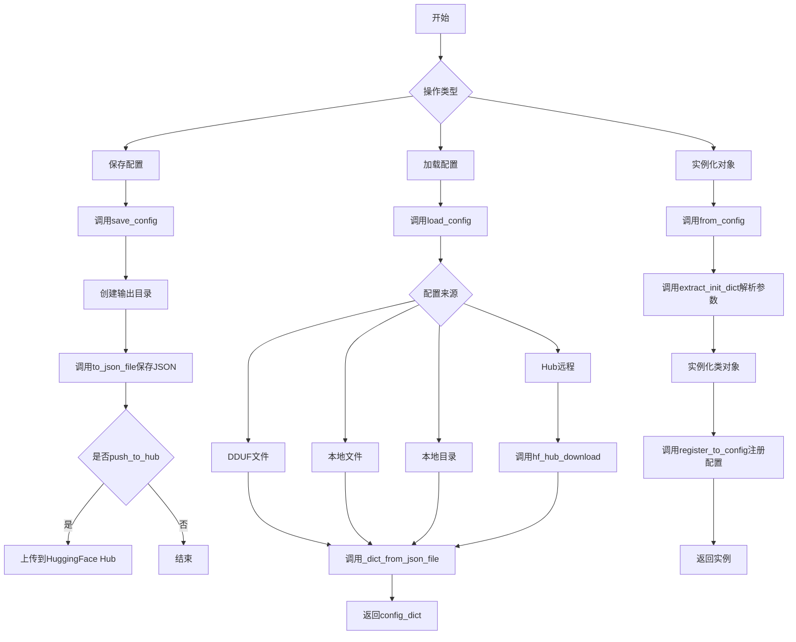

## 类结构

```
object
├── FrozenDict (继承OrderedDict)
├── ConfigMixin (抽象基类)
│   └── LegacyConfigMixin (继承ConfigMixin)
├── register_to_config (函数装饰器)
└── flax_register_to_config (函数装饰器)
```

## 全局变量及字段


### `logger`
    
模块日志记录器，用于记录配置相关的操作信息

类型：`logging.Logger`
    


### `_re_configuration_file`
    
配置文件名正则表达式，用于匹配config.*.json格式的配置文件

类型：`re.Pattern`
    


### `FrozenDict.__frozen`
    
标记字典是否被冻结，True表示字典已冻结不允许修改

类型：`bool`
    


### `ConfigMixin.config_name`
    
类属性，配置文件名，指定保存配置时使用的文件名

类型：`str | None`
    


### `ConfigMixin.ignore_for_config`
    
类属性，忽略配置的属性列表，这些属性不会被保存到配置文件中

类型：`list[str]`
    


### `ConfigMixin.has_compatibles`
    
类属性，是否有兼容类，指示该类是否支持兼容类转换

类型：`bool`
    


### `ConfigMixin._deprecated_kwargs`
    
类属性，已弃用的kwargs列表，包含已废弃但仍支持的参数名

类型：`list[str]`
    


### `ConfigMixin._internal_dict`
    
实例属性，内部配置字典，存储所有配置参数的冻结字典

类型：`FrozenDict`
    
    

## 全局函数及方法


### `register_to_config`

装饰器函数，用于自动将类的 `__init__` 参数注册到配置中。被装饰的类需继承自 `ConfigMixin`。通过该装饰器，所有传入 `__init__` 的参数（除私有参数和 `ignore_for_config` 中指定的参数外）会自动调用 `self.register_to_config` 进行注册。

参数：

- `init`：`Callable`，被装饰的原始 `__init__` 方法

返回值：`Callable`，装饰后的新 `init` 方法

#### 流程图

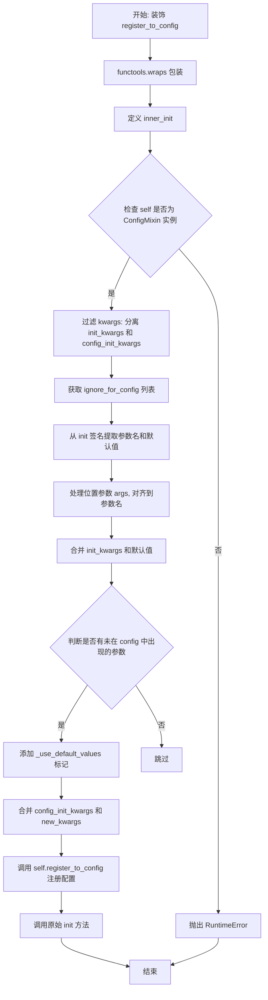

#### 带注释源码

```python
def register_to_config(init):
    r"""
    装饰器: 自动将 init 参数注册到配置
    
    应用到继承自 ConfigMixin 类的 __init__ 方法,
    使所有参数自动发送到 self.register_to_config。
    若要忽略某个 init 参数不注册到配置, 使用类变量 ignore_for_config。
    
    警告: 装饰后, 所有私有参数(以下划线开头)将被丢弃, 不会传递给 init!
    """
    # 使用 functools.wraps 保留原函数的元信息
    @functools.wraps(init)
    def inner_init(self, *args, **kwargs):
        # 1. 忽略 init 中的私有 kwarg(以下划线开头)
        init_kwargs = {k: v for k, v in kwargs.items() if not k.startswith("_")}
        # 收集以双下划线开头的配置参数
        config_init_kwargs = {k: v for k, v in kwargs.items() if k.startswith("_")}
        
        # 2. 检查类是否继承自 ConfigMixin
        if not isinstance(self, ConfigMixin):
            raise RuntimeError(
                f"`@register_for_config` was applied to {self.__class__.__name__} init method, but this class does "
                "not inherit from `ConfigMixin`."
            )

        # 3. 获取需要忽略的配置参数列表
        ignore = getattr(self, "ignore_for_config", [])
        
        # 4. 获取 init 签名中的参数名和默认值
        new_kwargs = {}
        signature = inspect.signature(init)
        parameters = {
            name: p.default 
            for i, (name, p) in enumerate(signature.parameters.items()) 
            if i > 0 and name not in ignore  # 跳过 self 和忽略列表中的参数
        }
        
        # 5. 处理位置参数, 与 kwargs 参数名对齐
        for arg, name in zip(args, parameters.keys()):
            new_kwargs[name] = arg

        # 6. 合并所有 kwargs, 使用默认值填充
        new_kwargs.update(
            {
                k: init_kwargs.get(k, default)
                for k, default in parameters.items()
                if k not in ignore and k not in new_kwargs
            }
        )

        # 7. 记录未在加载配置中出现的参数(使用默认值的参数)
        if len(set(new_kwargs.keys()) - set(init_kwargs)) > 0:
            new_kwargs["_use_default_values"] = list(set(new_kwargs.keys()) - set(init_kwargs))

        # 8. 合并配置参数和普通参数, 优先使用 config_init_kwargs
        new_kwargs = {**config_init_kwargs, **new_kwargs}
        
        # 9. 调用 ConfigMixin.register_to_config 注册配置
        getattr(self, "register_to_config")(**new_kwargs)
        
        # 10. 调用原始 init 方法(只传递过滤后的 kwargs)
        init(self, *args, **init_kwargs)

    return inner_init
```


### `flax_register_to_config`

这是一个装饰器函数，专门为 Flax 模型的配置注册而设计。它用于替代 `register_to_config` 装饰器，处理 Flax 模型中 dataclass 形式的配置参数自动注册。

参数：

- `cls`：`type`，需要注册配置的 Flax 模型类（必须继承自 `ConfigMixin`）

返回值：`type`，返回修改后的类（将原始 `__init__` 替换为包装后的版本）

#### 流程图

```mermaid
flowchart TD
    A[开始: 装饰 flax_register_to_config] --> B[保存原始 __init__ 方法]
    B --> C[创建新的 init 包装函数]
    C --> D{检查 self 是否继承自 ConfigMixin?}
    D -->|否| E[抛出 RuntimeError 异常]
    D -->|是| F[收集 kwargs 参数]
    F --> G[获取 dataclass fields]
    G --> H[遍历 fields 获取默认值]
    H --> I{field 是否为 Flax 内部参数?}
    I -->|是| J[跳过该 field]
    I -->|否| K{field 是否有默认值?}
    K -->|否| L[设置 default_kwargs[field.name] = None]
    K -->|是| M[设置 default_kwargs[field.name] = getattr(self, field.name)]
    L --> N[合并 default_kwargs 和 init_kwargs]
    M --> N
    N --> O{new_kwargs 中是否有 dtype?}
    O -->|是| P[从 new_kwargs 中移除 dtype]
    O -->|否| Q[处理位置参数]
    Q --> R[将位置参数与 field.name 对应]
    R --> S{有未在 init_kwargs 中出现的参数?}
    S -->|是| T[设置 _use_default_values 列表]
    S -->|否| U[调用 register_to_config 注册配置]
    T --> U
    U --> V[调用原始 init 方法]
    V --> W[将新的 init 赋值给 cls.__init__]
    W --> X[返回修改后的 cls]
```

#### 带注释源码

```python
def flax_register_to_config(cls):
    """
    装饰器：为 Flax 模型类自动注册配置参数
    
    与 register_to_config 类似，但专门处理 Flax 模型中使用 dataclass 定义配置的情况。
    它会收集 dataclass 的所有字段及其默认值，并将它们注册到配置中。
    """
    # 1. 保存原始的 __init__ 方法
    original_init = cls.__init__

    # 2. 使用 functools.wraps 装饰新的 init 函数以保留原函数的元信息
    @functools.wraps(original_init)
    def init(self, *args, **kwargs):
        """
        包装后的初始化方法
        """
        # 3. 检查类是否继承自 ConfigMixin
        if not isinstance(self, ConfigMixin):
            raise RuntimeError(
                f"`@register_for_config` was applied to {self.__class__.__name__} init method, but this class does "
                "not inherit from `ConfigMixin`."
            )

        # 4. 收集所有传入的 kwargs 参数
        init_kwargs = dict(kwargs.items())

        # 5. 获取 dataclass 的所有字段定义
        fields = dataclasses.fields(self)
        
        # 6. 准备存储默认值的字典
        default_kwargs = {}
        for field in fields:
            # 跳过 Flax 内部参数（如 _mesh 等）
            if field.name in self._flax_internal_args:
                continue
            
            # 如果字段没有默认值，设置默认为 None
            if type(field.default) == dataclasses._MISSING_TYPE:
                default_kwargs[field.name] = None
            else:
                # 获取字段的当前值作为默认值
                default_kwargs[field.name] = getattr(self, field.name)

        # 7. 合并默认参数和传入参数，传入参数优先
        new_kwargs = {**default_kwargs, **init_kwargs}
        
        # 8. dtype 应该只在 init_kwargs 中，不应该注册到配置
        if "dtype" in new_kwargs:
            new_kwargs.pop("dtype")

        # 9. 处理位置参数，将位置参数与 dataclass 字段对应
        for i, arg in enumerate(args):
            name = fields[i].name
            new_kwargs[name] = arg

        # 10. 记录未在加载配置中出现的参数（使用默认值的参数）
        if len(set(new_kwargs.keys()) - set(init_kwargs)) > 0:
            new_kwargs["_use_default_values"] = list(set(new_kwargs.keys()) - set(init_kwargs))

        # 11. 调用 ConfigMixin 的 register_to_config 方法注册配置
        getattr(self, "register_to_config")(**new_kwargs)
        
        # 12. 调用原始的 __init__ 方法完成初始化
        original_init(self, *args, **kwargs)

    # 13. 用新的 init 方法替换类的原始 __init__
    cls.__init__ = init
    return cls
```


### `FrozenDict.__init__`

初始化 FrozenDict 实例，将传入的键值对设置为对象属性，并将字典冻结以防止修改。

参数：

- `*args`：可变位置参数，传递给父类 `OrderedDict` 的初始化参数，用于构建有序字典
- `**kwargs`：可变关键字参数，传递给父类 `OrderedDict` 的初始化参数，用于构建有序字典

返回值：无返回值（`None`），构造函数不返回任何内容

#### 流程图

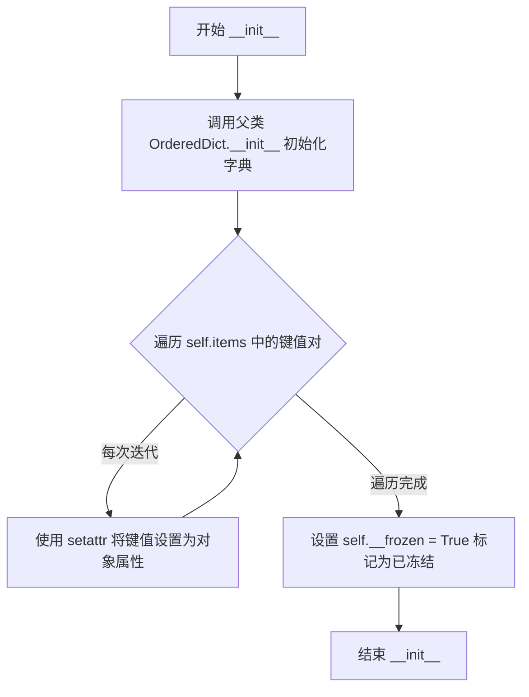

#### 带注释源码

```python
def __init__(self, *args, **kwargs):
    """
    初始化 FrozenDict 实例。
    
    该方法继承自 OrderedDict，创建一个有序字典，并将所有键值对
    作为对象的属性暴露出，同时通过 __frozen 标志位防止后续修改。
    
    参数:
        *args: 可变位置参数，传递给父类 OrderedDict 的初始化参数。
        **kwargs: 可变关键字参数，传递给父类 OrderedDict 的初始化参数。
    """
    # 调用父类 OrderedDict 的 __init__ 方法，初始化有序字典
    # 这会创建字典的基本结构，并填充传入的键值对
    super().__init__(*args, **kwargs)

    # 遍历字典中的所有键值对，将每个键值对设置为对象的属性
    # 这样可以同时通过 dict[key] 和 obj.attr 两种方式访问值
    for key, value in self.items():
        setattr(self, key, value)

    # 设置 __frozen 标志为 True，表示该字典已被冻结
    # 后续任何修改操作（__setattr__, __setitem__, pop 等）都会触发异常
    self.__frozen = True
```


### `FrozenDict.__delitem__`

该方法用于禁用 FrozenDict 实例的删除操作，任何尝试删除键的操作都会抛出异常，确保字典内容的不可变性。

参数：

- `self`：`FrozenDict` 实例，当前对象本身
- `*args`：可变位置参数，用于捕获任意数量的位置参数（此方法不使用）
- `**kwargs`：可变关键字参数，用于捕获任意数量的关键字参数（此方法不使用）

返回值：`None`，该方法通过抛出异常终止执行，无实际返回值

#### 流程图

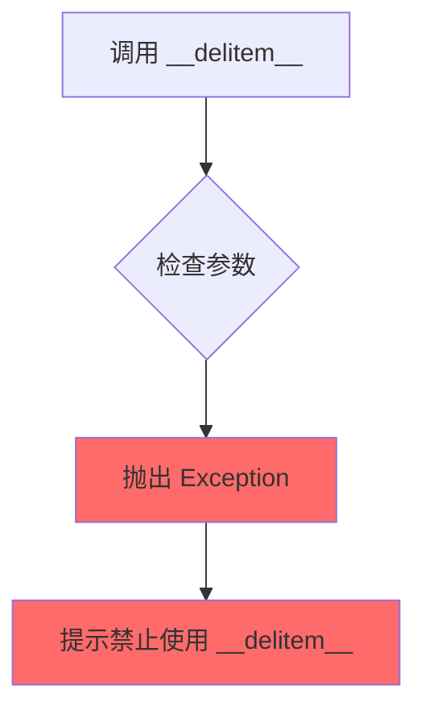

#### 带注释源码

```python
def __delitem__(self, *args, **kwargs):
    """
    禁用删除操作的特殊方法。
    
    FrozenDict 是一个不可变的有序字典容器，继承自 OrderedDict。
    为了确保字典内容不被意外修改，所有修改操作都被禁用。
    
    参数:
        self: FrozenDict 实例本身
        *args: 任意数量的位置参数（不接受，会被忽略）
        **kwargs: 任意数量的关键字参数（不接受，会被忽略）
    
    返回:
        无返回值，该方法总是抛出异常
    
    异常:
        Exception: 始终抛出，提示用户不能在 FrozenDict 实例上使用 __delitem__
    """
    # 构造异常消息，包含类名以提供更清晰的错误上下文
    raise Exception(f"You cannot use ``__delitem__`` on a {self.__class__.__name__} instance.")
```


### `FrozenDict.setdefault`

该方法用于禁用 FrozenDict 实例的 setdefault 操作。任何对此方法的调用都会引发异常，以确保冻结字典的不可变性。

参数：

- `*args`：可变位置参数，接受任意数量的位置参数（但不会使用）
- `**kwargs`：可变关键字参数，接受任意数量的关键字参数（但不会使用）

返回值：无返回值（该方法总是抛出异常，不会正常返回）

#### 流程图

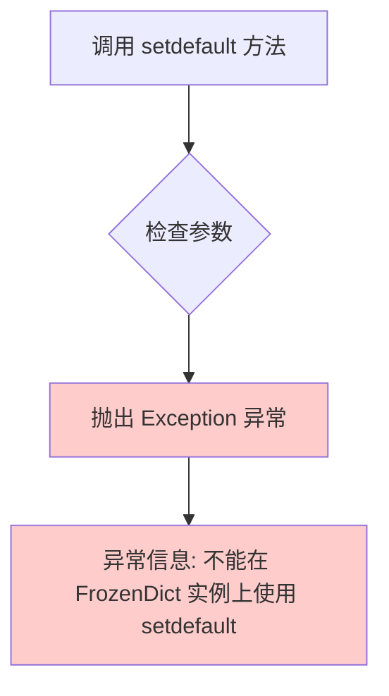

#### 带注释源码

```python
def setdefault(self, *args, **kwargs):
    """
    禁用 setdefault 操作。
    
    FrozenDict 是一个不可变的字典子类，任何尝试修改其内容的操作都会被禁止。
    setdefault 方法允许在字典中设置默认值，这违反了 FrozenDict 的不可变性设计。
    
    参数:
        *args: 可变位置参数，接受任意数量的位置参数（此方法不使用这些参数）
        **kwargs: 可变关键字参数，接受任意数量的关键字参数（此方法不使用这些参数）
    
    返回值:
        无返回值。该方法总是抛出 Exception 异常。
    
    异常:
        Exception: 总是抛出，表示不允许在 FrozenDict 上使用 setdefault 操作
    """
    # 无论传入什么参数，都抛出异常，阻止任何修改 FrozenDict 的尝试
    raise Exception(f"You cannot use ``setdefault`` on a {self.__class__.__name__} instance.")
```


### `FrozenDict.pop`

该方法用于阻止对FrozenDict实例进行pop操作，确保字典内容不可变。当调用此方法时，总是抛出异常，禁止移除字典中的任何键值对。

参数：

- `*args`：可变位置参数，用于接收任意数量的位置参数（但不会被使用）
- `**kwargs`：可变关键字参数，用于接收任意数量的关键字参数（但不会被使用）

返回值：`None`，由于总是抛出异常，实际不返回任何值

#### 流程图

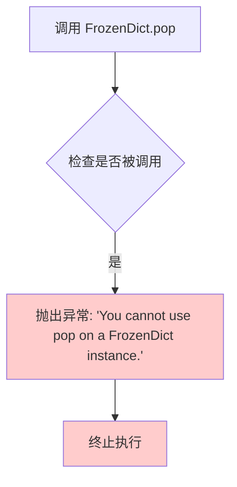

#### 带注释源码

```python
def pop(self, *args, **kwargs):
    """
    禁用pop操作。
    
    FrozenDict是一个不可变的字典实现，该方法故意禁用pop功能，
    以防止用户尝试从冻结的字典中移除任何键值对。
    
    参数:
        *args: 任意数量的位置参数（会被忽略）
        **kwargs: 任意数量的关键字参数（会被忽略）
    
    返回:
        无返回值，总是抛出异常
    
    异常:
        Exception: 总是抛出，提示用户不能在FrozenDict上使用pop操作
    """
    # 无论传入什么参数，都直接抛出异常
    raise Exception(f"You cannot use ``pop`` on a {self.__class__.__name__} instance.")
```


### FrozenDict.update

该方法是 FrozenDict 类的更新操作方法，通过抛出异常的方式禁用字典的 update 功能，防止对不可变字典进行修改。

参数：

- `*args`：任意位置参数，用于接受任意数量的位置参数（实际不会被使用）
- `**kwargs`：任意关键字参数，用于接受任意数量的关键字参数（实际不会被使用）

返回值：无返回值（该方法总是抛出异常）

#### 流程图

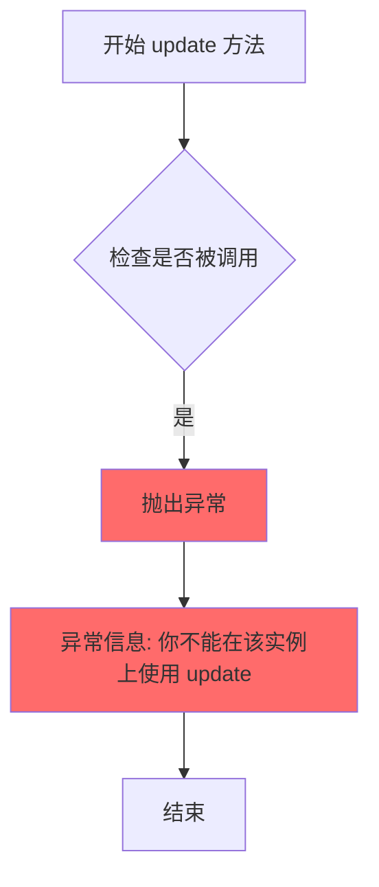

#### 带注释源码

```python
def update(self, *args, **kwargs):
    """
    禁用 update 操作。
    
    FrozenDict 是一个不可变字典类型，继承自 OrderedDict。
    该方法被重写以阻止任何对字典内容的修改尝试。
    
    参数:
        *args: 任意位置参数（不接受任何实际参数）
        **kwargs: 任意关键字参数（不接受任何实际参数）
    
    返回值:
        无返回值，总是抛出异常
    
    异常:
        Exception: 总是抛出，表明该操作不允许
    """
    # 抛出异常并包含类名信息，告知用户不能在 FrozenDict 实例上使用 update
    raise Exception(f"You cannot use ``update`` on a {self.__class__.__name__} instance.")
```


### `FrozenDict.__setattr__`

重写 `__setattr__` 方法以实现字典的冻结功能。当 `FrozenDict` 实例被冻结后，任何尝试修改属性的操作都会抛出异常，从而确保配置对象的不可变性。

**参数：**

- `name`：`Any`，要设置的属性名称
- `value`：`Any`，要设置的属性值

**返回值：** `None`，无返回值（隐式返回 `None`）

#### 流程图

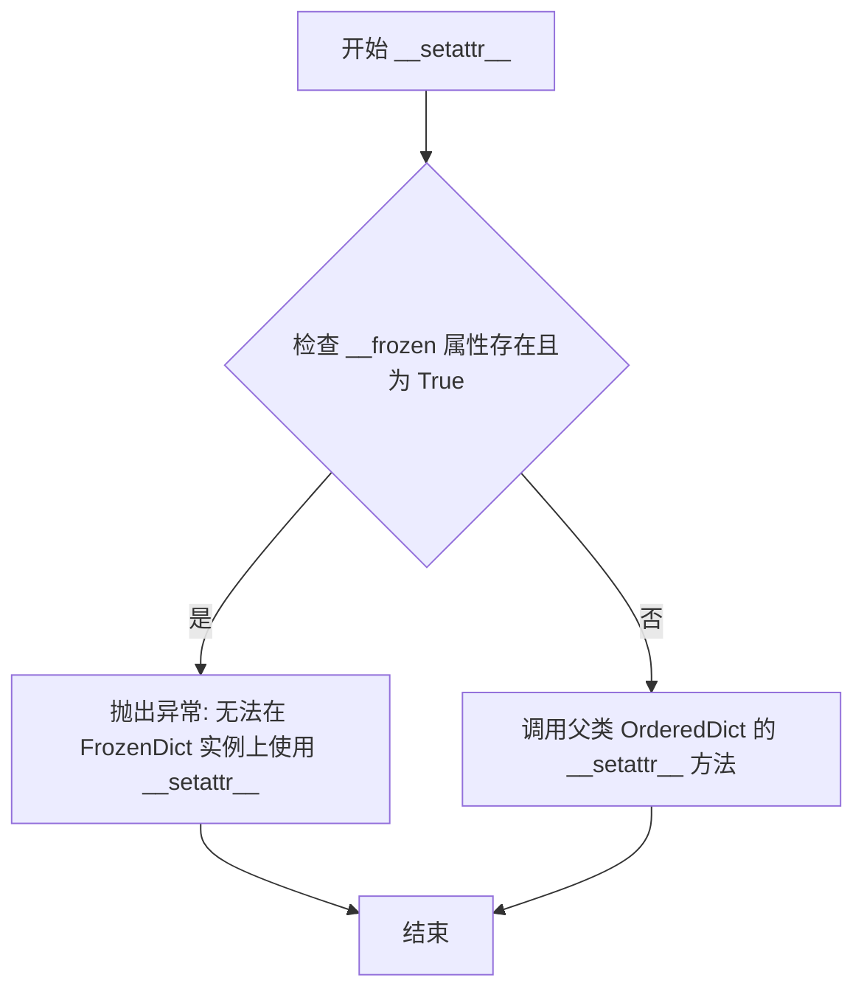

#### 带注释源码

```python
def __setattr__(self, name, value):
    """
    重写 __setattr__ 以防止在冻结的 FrozenDict 实例上修改属性。
    
    参数:
        name: 要设置的属性名称
        value: 要设置的属性值
    
    返回:
        无返回值（隐式返回 None）
    """
    # 检查对象是否已被冻结（__frozen 属性存在且为 True）
    if hasattr(self, "__frozen") and self.__frozen:
        # 如果已冻结，抛出异常阻止属性修改
        raise Exception(f"You cannot use ``__setattr__`` on a {self.__class__.__name__} instance.")
    
    # 如果未冻结，调用父类（OrderedDict）的 __setattr__ 方法执行正常的属性设置
    super().__setattr__(name, value)
```


### `FrozenDict.__setitem__`

重写字典的 `__setitem__` 方法，在字典被冻结时（`__frozen` 属性为 True）阻止任何修改操作，抛出异常以防止对不可变配置对象的修改。

参数：

- `name`：键的名称，用于指定要设置/修改的键
- `value`：要设置的值
- `*args` 和 `**kwargs`：可选参数，用于传递额外的位置参数和关键字参数（继承自父类 `OrderedDict` 的参数）

返回值：`None`，无返回值（调用父类的 `__setitem__` 方法不返回任何值）

#### 流程图

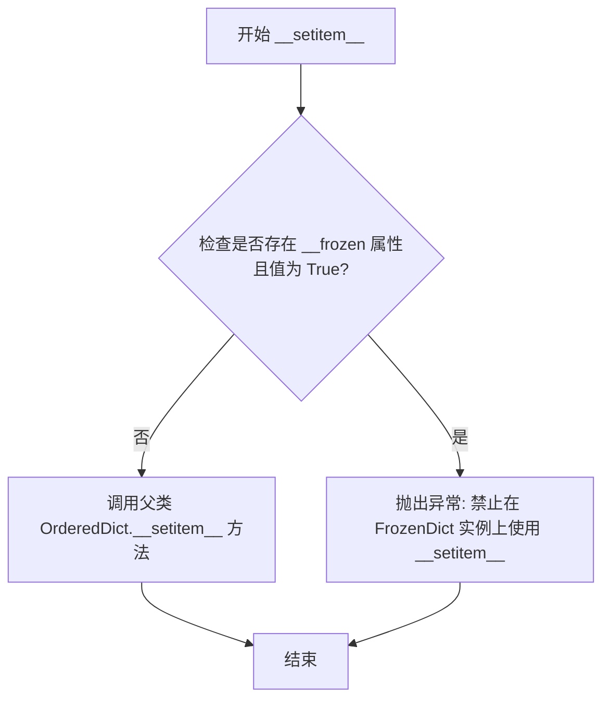

#### 带注释源码

```python
def __setitem__(self, name, value):
    """
    重写字典的 __setitem__ 方法，实现冻结字典的不可变性
    
    当 FrozenDict 被冻结后，任何尝试修改字典内容的操作都会抛出异常。
    这是为了保护配置对象在初始化后不被意外或恶意修改。
    
    Args:
        name: 键名，指定要设置/修改的键
        value: 要设置的值
        *args: 额外的位置参数（传递给父类）
        **kwargs: 额外的关键字参数（传递给父类）
    
    Returns:
        None: 此方法不返回任何值
    
    Raises:
        Exception: 当字典处于冻结状态时抛出
    """
    # 检查对象是否已被冻结
    # hasattr(self, "__frozen") 检查是否存在 __frozen 属性
    # self.__frozen 检查冻结标志是否为 True
    if hasattr(self, "__frozen") and self.__frozen:
        # 抛出异常阻止修改操作
        raise Exception(f"You cannot use ``__setattr__`` on a {self.__class__.__name__} instance.")
    
    # 如果未被冻结，调用父类的 __setitem__ 方法正常执行
    super().__setitem__(name, value)
```


### `ConfigMixin.register_to_config`

该方法用于将配置参数注册到配置对象中，将传入的 kwargs 存储到内部的 `_internal_dict` 字典中，并使用 `FrozenDict` 确保配置字典的不可变性。

参数：

- `**kwargs`：`任意类型`，可变关键字参数，用于接收需要注册到配置中的参数

返回值：`None`，无返回值，该方法直接修改对象内部的 `_internal_dict` 属性

#### 流程图

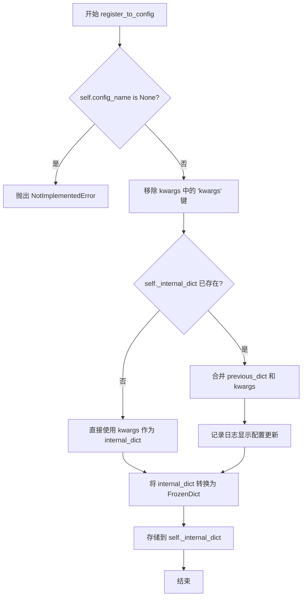

#### 带注释源码

```python
def register_to_config(self, **kwargs):
    """
    将配置参数注册到配置对象中。
    该方法会将传入的 kwargs 存储到内部的 _internal_dict 字典中，
    并使用 FrozenDict 确保配置字典的不可变性。
    """
    # 检查类是否定义了 config_name 属性
    if self.config_name is None:
        raise NotImplementedError(f"Make sure that {self.__class__} has defined a class name `config_name`")
    
    # 特殊处理：移除 kwargs 参数（用于废弃警告）
    # TODO: 当废弃警告和 kwargs 参数被移除时，需要解决这个特殊情况
    kwargs.pop("kwargs", None)

    # 判断是否已经存在 _internal_dict
    if not hasattr(self, "_internal_dict"):
        # 首次注册，直接使用 kwargs 作为内部字典
        internal_dict = kwargs
    else:
        # 更新配置：合并已有配置和新传入的配置
        previous_dict = dict(self._internal_dict)
        internal_dict = {**self._internal_dict, **kwargs}
        # 记录配置更新的调试日志
        logger.debug(f"Updating config from {previous_dict} to {internal_dict}")

    # 将内部字典转换为 FrozenDict（不可变字典）
    self._internal_dict = FrozenDict(internal_dict)
```


### `ConfigMixin.__getattr__`

该方法用于重载默认的属性访问行为，实现对配置属性的优雅降级访问支持。当用户直接通过对象属性访问配置参数时，会触发降级警告并返回对应配置值，而不是抛出 `AttributeError`。

参数：

- `name`：`str`，要访问的属性名称

返回值：`Any`，如果属性存在于配置中则返回配置值，否则抛出 `AttributeError`

#### 流程图

```mermaid
flowchart TD
    A[开始 __getattr__] --> B{_internal_dict 在 __dict__ 中?}
    B -->|否| C{属性名 在对象 __dict__ 中?}
    C -->|是| D[抛出 AttributeError]
    C -->|否| D
    B -->|是| E{属性名 在 _internal_dict 中存在?}
    E -->|是| F{属性名 不在对象 __dict__ 中?}
    F -->|是| G[构造降级警告信息]
    F -->|否| D
    E -->|否| D
    G --> H[调用 deprecate 发出警告]
    H --> I[返回 _internal_dict[name] 的值]
    D --> J[结束]
    I --> J
```

#### 带注释源码

```python
def __getattr__(self, name: str) -> Any:
    """The only reason we overwrite `getattr` here is to gracefully deprecate accessing
    config attributes directly. See https://github.com/huggingface/diffusers/pull/3129

    This function is mostly copied from PyTorch's __getattr__ overwrite:
    https://pytorch.org/docs/stable/_modules/torch/nn/modules/module.html#Module
    """

    # 检查对象的 __dict__ 中是否包含 _internal_dict（即配置字典已初始化）
    # 并且检查该配置字典中是否存在名为 name 的属性
    is_in_config = "_internal_dict" in self.__dict__ and hasattr(self.__dict__["_internal_dict"], name)
    
    # 检查属性名是否直接存在于对象的 __dict__ 中（而非配置中）
    is_attribute = name in self.__dict__

    # 如果属性在配置中存在，但不在对象直接属性中
    # 则触发降级访问警告，提示用户通过 config 对象访问
    if is_in_config and not is_attribute:
        deprecation_message = f"Accessing config attribute `{name}` directly via '{type(self).__name__}' object attribute is deprecated. Please access '{name}' over '{type(self).__name__}'s config object instead, e.g. 'scheduler.config.{name}'."
        # 发出降级警告，版本 1.0.0 后将移除此功能
        deprecate("direct config name access", "1.0.0", deprecation_message, standard_warn=False)
        # 从内部配置字典中返回对应属性的值
        return self._internal_dict[name]

    # 如果属性既不在配置中，也不在对象属性中，抛出 AttributeError
    raise AttributeError(f"'{type(self).__name__}' object has no attribute '{name}'")
```


### `ConfigMixin.save_config`

保存配置对象到指定目录，以便可以使用 `from_config` 类方法重新加载配置。

参数：

- `save_directory`：`str | os.PathLike`，保存配置 JSON 文件的目录（如果不存在则创建）。
- `push_to_hub`：`bool`，可选，默认值为 `False`。是否在保存后将模型推送到 Hugging Face Hub。
- `kwargs`：`dict[str, Any]`，可选。传递给 `push_to_hub` 方法的额外关键字参数。

返回值：`None`，无返回值（该方法直接保存配置到文件）。

#### 流程图

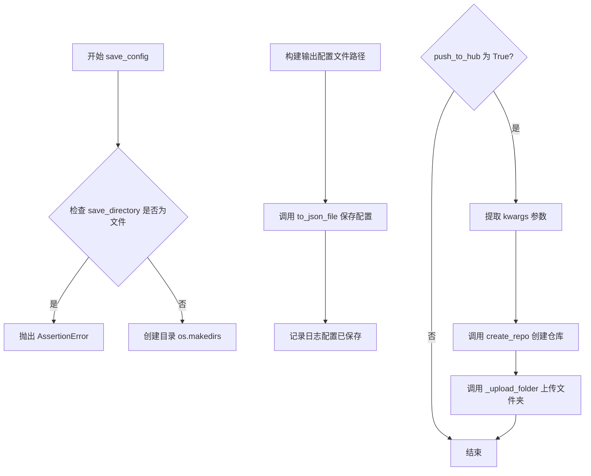

#### 带注释源码

```python
def save_config(self, save_directory: str | os.PathLike, push_to_hub: bool = False, **kwargs):
    """
    Save a configuration object to the directory specified in `save_directory` so that it can be reloaded using the
    [`~ConfigMixin.from_config`] class method.

    Args:
        save_directory (`str` or `os.PathLike`):
            Directory where the configuration JSON file is saved (will be created if it does not exist).
        push_to_hub (`bool`, *optional*, defaults to `False`):
            Whether or not to push your model to the Hugging Face Hub after saving it. You can specify the
            repository you want to push to with `repo_id` (will default to the name of `save_directory` in your
            namespace).
        kwargs (`dict[str, Any]`, *optional*):
            Additional keyword arguments passed along to the [`~utils.PushToHubMixin.push_to_hub`] method.
    """
    # 检查提供的路径是否为文件而非目录
    if os.path.isfile(save_directory):
        raise AssertionError(f"Provided path ({save_directory}) should be a directory, not a file")

    # 创建目录（如果不存在）
    os.makedirs(save_directory, exist_ok=True)

    # 使用预定义名称保存，以便可以使用 from_config 加载
    # self.config_name 是类属性，定义了配置文件的名称
    output_config_file = os.path.join(save_directory, self.config_name)

    # 调用 to_json_file 方法将配置写入 JSON 文件
    self.to_json_file(output_config_file)
    logger.info(f"Configuration saved in {output_config_file}")

    # 如果需要推送到 Hugging Face Hub
    if push_to_hub:
        # 从 kwargs 中提取推送相关的参数
        commit_message = kwargs.pop("commit_message", None)
        private = kwargs.pop("private", None)
        create_pr = kwargs.pop("create_pr", False)
        token = kwargs.pop("token", None)
        # 仓库 ID 默认为保存目录的名称
        repo_id = kwargs.pop("repo_id", save_directory.split(os.path.sep)[-1])
        # 创建仓库（如果不存在）
        repo_id = create_repo(repo_id, exist_ok=True, private=private, token=token).repo_id
        subfolder = kwargs.pop("subfolder", None)

        # 调用内部方法上传文件夹到 Hub
        self._upload_folder(
            save_directory,
            repo_id,
            token=token,
            commit_message=commit_message,
            create_pr=create_pr,
            subfolder=subfolder,
        )
```


### `ConfigMixin.from_config`

从配置字典实例化 Python 类（模型或调度器）。该方法是 `ConfigMixin` 的核心类方法之一，负责将存储在 JSON 配置中的参数转换为实际的对象实例，支持兼容类、废弃参数处理以及未使用 kwargs 的返回。

参数：

- `cls`：类型（隐式 classmethod 参数），调用该方法的类本身
- `config`：`FrozenDict | dict[str, Any]`，用于实例化 Python 类的配置字典。需确保仅加载兼容类的配置文件
- `return_unused_kwargs`：`bool`（可选，默认 `False`），是否返回未被 Python 类消耗的 kwargs
- `**kwargs`：剩余的关键字参数，可用于在加载后更新配置对象。`**kwargs` 会直接传递给底层调度器/模型的 `__init__` 方法，并可能覆盖 `config` 中同名的参数

返回值：`Self | tuple[Self, dict[str, Any]]`，返回从配置字典实例化的模型或调度器对象；若 `return_unused_kwargs` 为 `True`，则返回元组（对象，未使用的 kwargs）

#### 流程图

```mermaid
flowchart TD
    A[开始: from_config] --> B{config 是否为 None?}
    B -->|是| C[抛出 ValueError: 请提供 config]
    B -->|否| D{config 是否为 dict?}
    
    D -->|否| E[处理废弃用法: 提示使用 from_pretrained]
    E --> F[调用 load_config 加载配置]
    F --> G[提取 init_dict, unused_kwargs, hidden_dict]
    
    D -->|是| G
    
    G --> H{dtype 在 unused_kwargs 中?}
    H -->|是| I[将 dtype 加入 init_dict 并从 unused_kwargs 移除]
    H -->|否| J
    
    I --> J
    
    J --> K{存在废弃 kwargs?}
    K -->|是| L[将废弃 kwargs 加入 init_dict]
    K -->|否| M
    
    L --> M
    
    M --> N[使用 init_dict 实例化类: cls(**init_dict)]
    N --> O[调用 register_to_config 注册隐藏配置]
    O --> P[合并 hidden_dict 到 unused_kwargs]
    P --> Q{return_unused_kwargs?}
    
    Q -->|是| R[返回 (model, unused_kwargs)]
    Q -->|否| S[返回 model]
    
    R --> T[结束]
    S --> T
```

#### 带注释源码

```python
@classmethod
def from_config(
    cls, config: FrozenDict | dict[str, Any] = None, return_unused_kwargs=False, **kwargs
) -> Self | tuple[Self, dict[str, Any]]:
    r"""
    Instantiate a Python class from a config dictionary.

    Parameters:
        config (`dict[str, Any]`):
            A config dictionary from which the Python class is instantiated. Make sure to only load configuration
            files of compatible classes.
        return_unused_kwargs (`bool`, *optional*, defaults to `False`):
            Whether kwargs that are not consumed by the Python class should be returned or not.
        kwargs (remaining dictionary of keyword arguments, *optional*):
            Can be used to update the configuration object (after it is loaded) and initiate the Python class.
            `**kwargs` are passed directly to the underlying scheduler/model's `__init__` method and eventually
            overwrite the same named arguments in `config`.

    Returns:
        [`ModelMixin`] or [`SchedulerMixin`]:
            A model or scheduler object instantiated from a config dictionary.

    Examples:

    ```python
    >>> from diffusers import DDPMScheduler, DDIMScheduler, PNDMScheduler

    >>> # Download scheduler from huggingface.co and cache.
    >>> scheduler = DDPMScheduler.from_pretrained("google/ddpm-cifar10-32")

    >>> # Instantiate DDIM scheduler class with same config as DDPM
    >>> scheduler = DDIMScheduler.from_config(scheduler.config)

    >>> # Instantiate PNDM scheduler class with same config as DDPM
    >>> scheduler = PNDMScheduler.from_config(scheduler.config)
    ```
    """
    # <===== TO BE REMOVED WITH DEPRECATION
    # 处理废弃的参数: pretrained_model_name_or_path
    # TODO(Patrick) - make sure to remove the following lines when config=="model_path" is deprecated
    if "pretrained_model_name_or_path" in kwargs:
        config = kwargs.pop("pretrained_model_name_or_path")

    if config is None:
        raise ValueError("Please make sure to provide a config as the first positional argument.")
    # ======>

    # 如果 config 不是字典，说明传入的是模型路径（废弃用法），需要处理兼容性
    if not isinstance(config, dict):
        deprecation_message = "It is deprecated to pass a pretrained model name or path to `from_config`."
        if "Scheduler" in cls.__name__:
            deprecation_message += (
                f"If you were trying to load a scheduler, please use {cls}.from_pretrained(...) instead."
                " Otherwise, please make sure to pass a configuration dictionary instead. This functionality will"
                " be removed in v1.0.0."
            )
        elif "Model" in cls.__name__:
            deprecation_message += (
                f"If you were trying to load a model, please use {cls}.load_config(...) followed by"
                f" {cls}.from_config(...) instead. Otherwise, please make sure to pass a configuration dictionary"
                " instead. This functionality will be removed in v1.0.0."
            )
        deprecate("config-passed-as-path", "1.0.0", deprecation_message, standard_warn=False)
        # 调用 load_config 加载配置
        config, kwargs = cls.load_config(pretrained_model_name_or_path=config, return_unused_kwargs=True, **kwargs)

    # 提取初始化参数字典，处理兼容类、废弃参数等
    init_dict, unused_kwargs, hidden_dict = cls.extract_init_dict(config, **kwargs)

    # 允许在初始化时指定 dtype
    if "dtype" in unused_kwargs:
        init_dict["dtype"] = unused_kwargs.pop("dtype")

    # 添加可能的废弃 kwargs
    for deprecated_kwarg in cls._deprecated_kwargs:
        if deprecated_kwarg in unused_kwargs:
            init_dict[deprecated_kwarg] = unused_kwargs.pop(deprecated_kwarg)

    # 返回模型并选择性地返回 state 和/或 unused_kwargs
    model = cls(**init_dict)

    # 确保也保存可能被兼容类使用的配置参数
    # 更新 _class_name
    if "_class_name" in hidden_dict:
        hidden_dict["_class_name"] = cls.__name__

    # 注册配置到模型
    model.register_to_config(**hidden_dict)

    # 将兼容类的隐藏 kwargs 添加到 unused_kwargs
    unused_kwargs = {**unused_kwargs, **hidden_dict}

    if return_unused_kwargs:
        return (model, unused_kwargs)
    else:
        return model
```


### `ConfigMixin.get_config_dict`

获取配置字典的已弃用方法，现推荐使用 `load_config` 方法。

参数：

- `*args`：可变位置参数，传递给 `load_config` 方法
- `**kwargs`：可变关键字参数，传递给 `load_config` 方法

返回值：`dict[str, Any] | tuple[dict[str, Any], dict[str, Any]]`，返回配置字典，或包含配置字典和未使用参数的元组

#### 流程图

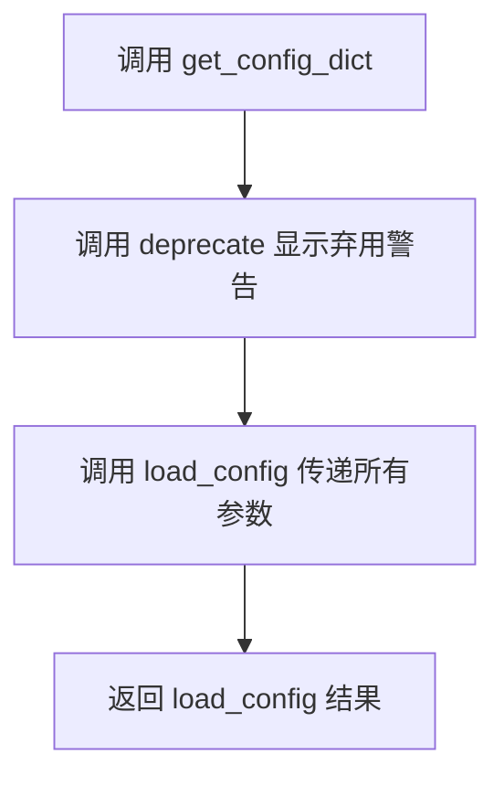

#### 带注释源码

```python
@classmethod
def get_config_dict(cls, *args, **kwargs):
    """
    获取配置字典的已弃用方法。
    该方法会在调用时显示弃用警告，并将所有参数传递给 load_config 方法。
    
    参数:
        *args: 可变位置参数，传递给 load_config
        **kwargs: 可变关键字参数，传递给 load_config
    
    返回:
        返回 load_config 的结果，可能是配置字典或包含配置字典和未使用参数的元组
    """
    # 构建弃用警告消息，建议使用 load_config 替代
    deprecation_message = (
        f" The function get_config_dict is deprecated. Please use {cls}.load_config instead. This function will be"
        " removed in version v1.0.0"
    )
    # 调用 deprecate 函数显示弃用警告
    deprecate("get_config_dict", "1.0.0", deprecation_message, standard_warn=False)
    # 将所有参数传递给 load_config 方法并返回结果
    return cls.load_config(*args, **kwargs)
```


### ConfigMixin.load_config

加载模型或调度器的配置文件，支持从本地路径、HuggingFace Hub或DDUF文件加载配置。

参数：

- `cls`：类型（隐式），调用该方法的类
- `pretrained_model_name_or_path`：`str | os.PathLike`，模型ID（如"google/ddpm-cifar10-32"）或本地目录路径
- `return_unused_kwargs`：`bool`，是否返回未使用的关键字参数，默认为False
- `return_commit_hash`：`bool`，是否返回配置的commit hash，默认为False
- `cache_dir`：`str | os.PathLike`，可选，下载文件的缓存目录
- `force_download`：`bool`，可选，是否强制重新下载，默认为False
- `proxies`：`dict[str, str]`，可选，代理服务器配置
- `token`：`str | bool`，可选，HuggingFace Hub认证令牌
- `local_files_only`：`bool`，可选，是否仅使用本地文件，默认为False
- `revision`：`str`，可选，Git版本标识（分支名、标签名或commit id）
- `subfolder`：`str`，可选，模型仓库中的子文件夹路径
- `user_agent`：`dict`，可选，用户代理信息
- `dduf_entries`：`dict[str, DDUFEntry]`，可选，DDUF文件条目字典

返回值：`tuple[dict[str, Any], dict[str, Any]] | dict[str, Any]`，返回配置字典，可选地包含未使用的kwargs和commit hash

#### 流程图

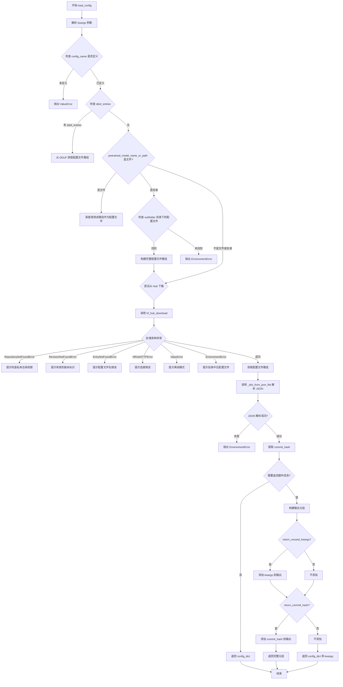

#### 带注释源码

```python
@classmethod
@validate_hf_hub_args
def load_config(
    cls,
    pretrained_model_name_or_path: str | os.PathLike,
    return_unused_kwargs=False,
    return_commit_hash=False,
    **kwargs,
) -> tuple[dict[str, Any], dict[str, Any]]:
    r"""
    Load a model or scheduler configuration.

    Parameters:
        pretrained_model_name_or_path (`str` or `os.PathLike`, *optional*):
            Can be either:
                - A string, the *model id* (for example `google/ddpm-celebahq-256`) of a pretrained model hosted on
                  the Hub.
                - A path to a *directory* (for example `./my_model_directory`) containing model weights saved with
                  [`~ConfigMixin.save_config`].
        cache_dir (`str | os.PathLike`, *optional*):
            Path to a directory where a downloaded pretrained model configuration is cached if the standard cache
            is not used.
        force_download (`bool`, *optional*, defaults to `False`):
            Whether or not to force the (re-)download of the model weights and configuration files, overriding the
            cached versions if they exist.
        proxies (`dict[str, str]`, *optional*):
            A dictionary of proxy servers to use by protocol or endpoint, for example, `{'http': 'foo.bar:3128',
            'http://hostname': 'foo.bar:4012'}`. The proxies are used on each request.
        output_loading_info(`bool`, *optional*, defaults to `False`):
            Whether or not to also return a dictionary containing missing keys, unexpected keys and error messages.
        local_files_only (`bool`, *optional*, defaults to `False`):
            Whether to only load local model weights and configuration files or not. If set to `True`, the model
            won't be downloaded from the Hub.
        token (`str` or *bool*, *optional*):
            The token to use as HTTP bearer authorization for remote files. If `True`, the token generated from
            `diffusers-cli login` (stored in `~/.huggingface`) is used.
        revision (`str`, *optional*, defaults to `"main"`):
            The specific model version to use. It can be a branch name, a tag name, a commit id, or any identifier
            allowed by Git.
        subfolder (`str`, *optional*, defaults to `""`):
            The subfolder location of a model file within a larger model repository on the Hub or locally.
        return_unused_kwargs (`bool`, *optional*, defaults to `False):
            Whether unused keyword arguments of the config are returned.
        return_commit_hash (`bool`, *optional*, defaults to `False):
            Whether the `commit_hash` of the loaded configuration are returned.

    Returns:
        `dict`:
            A dictionary of all the parameters stored in a JSON configuration file.
    """
    # 从 kwargs 中提取各种配置选项
    cache_dir = kwargs.pop("cache_dir", None)
    local_dir = kwargs.pop("local_dir", None)
    local_dir_use_symlinks = kwargs.pop("local_dir_use_symlinks", "auto")
    force_download = kwargs.pop("force_download", False)
    proxies = kwargs.pop("proxies", None)
    token = kwargs.pop("token", None)
    local_files_only = kwargs.pop("local_files_only", False)
    revision = kwargs.pop("revision", None)
    _ = kwargs.pop("mirror", None)  # 已废弃的参数
    subfolder = kwargs.pop("subfolder", None)
    user_agent = kwargs.pop("user_agent", {})
    dduf_entries: dict[str, DDUFEntry] | None = kwargs.pop("dduf_entries", None)

    # 构建用户代理信息，标记文件类型为 config
    user_agent = {**user_agent, "file_type": "config"}
    user_agent = http_user_agent(user_agent)

    # 确保路径为字符串类型
    pretrained_model_name_or_path = str(pretrained_model_name_or_path)

    # 检查类是否定义了 config_name
    if cls.config_name is None:
        raise ValueError(
            "`self.config_name` is not defined. Note that one should not load a config from "
            "`ConfigMixin`. Please make sure to define `config_name` in a class inheriting from `ConfigMixin`"
        )
    
    # 根据不同来源确定配置文件路径
    # 情况1: 从 DDUF 文件加载
    if dduf_entries:
        if subfolder is not None:
            raise ValueError(
                "DDUF file only allow for 1 level of directory (e.g transformer/model1/model.safetentors is not allowed). "
                "Please check the DDUF structure"
            )
        config_file = cls._get_config_file_from_dduf(pretrained_model_name_or_path, dduf_entries)
    # 情况2: 直接给定配置文件路径
    elif os.path.isfile(pretrained_model_name_or_path):
        config_file = pretrained_model_name_or_path
    # 情况3: 给定目录路径
    elif os.path.isdir(pretrained_model_name_or_path):
        if subfolder is not None and os.path.isfile(
            os.path.join(pretrained_model_name_or_path, subfolder, cls.config_name)
        ):
            config_file = os.path.join(pretrained_model_name_or_path, subfolder, cls.config_name)
        elif os.path.isfile(os.path.join(pretrained_model_name_or_path, cls.config_name)):
            # Load from a PyTorch checkpoint
            config_file = os.path.join(pretrained_model_name_or_path, cls.config_name)
        else:
            raise EnvironmentError(
                f"Error no file named {cls.config_name} found in directory {pretrained_model_name_or_path}."
            )
    # 情况4: 从 HuggingFace Hub 加载
    else:
        try:
            # Load from URL or cache if already cached
            config_file = hf_hub_download(
                pretrained_model_name_or_path,
                filename=cls.config_name,
                cache_dir=cache_dir,
                force_download=force_download,
                proxies=proxies,
                local_files_only=local_files_only,
                token=token,
                user_agent=user_agent,
                subfolder=subfolder,
                revision=revision,
                local_dir=local_dir,
                local_dir_use_symlinks=local_dir_use_symlinks,
            )
        except RepositoryNotFoundError:
            raise EnvironmentError(
                f"{pretrained_model_name_or_path} is not a local folder and is not a valid model identifier"
                " listed on 'https://huggingface.co/models'\nIf this is a private repository, make sure to pass a"
                " token having permission to this repo with `token` or log in with `hf auth login`."
            )
        except RevisionNotFoundError:
            raise EnvironmentError(
                f"{revision} is not a valid git identifier (branch name, tag name or commit id) that exists for"
                " this model name. Check the model page at"
                f" 'https://huggingface.co/{pretrained_model_name_or_path}' for available revisions."
            )
        except EntryNotFoundError:
            raise EnvironmentError(
                f"{pretrained_model_name_or_path} does not appear to have a file named {cls.config_name}."
            )
        except HfHubHTTPError as err:
            raise EnvironmentError(
                "There was a specific connection error when trying to load"
                f" {pretrained_model_name_or_path}:\n{err}"
            )
        except ValueError:
            raise EnvironmentError(
                f"We couldn't connect to '{HUGGINGFACE_CO_RESOLVE_ENDPOINT}' to load this model, couldn't find it"
                f" in the cached files and it looks like {pretrained_model_name_or_path} is not the path to a"
                f" directory containing a {cls.config_name} file.\nCheckout your internet connection or see how to"
                " run the library in offline mode at"
                " 'https://huggingface.co/docs/diffusers/installation#offline-mode'."
            )
        except EnvironmentError:
            raise EnvironmentError(
                f"Can't load config for '{pretrained_model_name_or_path}'. If you were trying to load it from "
                "'https://huggingface.co/models', make sure you don't have a local directory with the same name. "
                f"Otherwise, make sure '{pretrained_model_name_or_path}' is the correct path to a directory "
                f"containing a {cls.config_name} file"
            )
    
    # 读取并解析 JSON 配置文件
    try:
        config_dict = cls._dict_from_json_file(config_file, dduf_entries=dduf_entries)
        # 提取配置文件的 commit hash
        commit_hash = extract_commit_hash(config_file)
    except (json.JSONDecodeError, UnicodeDecodeError):
        raise EnvironmentError(f"It looks like the config file at '{config_file}' is not a valid JSON file.")

    # 根据返回选项确定返回值
    if not (return_unused_kwargs or return_commit_hash):
        return config_dict

    outputs = (config_dict,)

    if return_unused_kwargs:
        outputs += (kwargs,)

    if return_commit_hash:
        outputs += (commit_hash,)

    return outputs
```


### `ConfigMixin._get_init_keys`

获取指定类的 `__init__` 方法参数键集合，用于后续配置字典的提取和验证。

参数：

- `input_class`：`type`，目标类的类型，用于获取其 `__init__` 方法的签名信息

返回值：`set`，包含 `__init__` 方法所有参数名（不含 `self`）的集合

#### 流程图

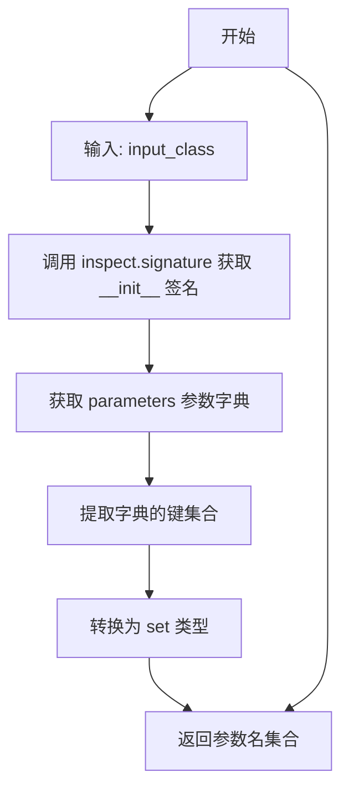

#### 带注释源码

```python
@staticmethod
def _get_init_keys(input_class):
    """
    获取给定类的 __init__ 方法参数键集合
    
    该方法通过 Python 内省模块 inspect 获取类的构造函数签名，
    并提取所有参数名（不含 self），返回一个 set 集合。
    主要用于 ConfigMixin.extract_init_dict 方法中，用于确定
    哪些配置参数应该被传递给类的 __init__ 方法。
    
    Args:
        input_class: 目标类的类型对象，需要获取其 __init__ 方法的参数
        
    Returns:
        set: 包含 __init__ 方法所有参数名（不含 self）的集合
    """
    # 使用 inspect.signature 获取类的 __init__ 方法签名
    # inspect.signature 会返回一个 Signature 对象，包含所有参数信息
    signature = inspect.signature(input_class.__init__)
    
    # 获取 parameters 属性，它是一个有序字典 OrderedDict
    # 键是参数名，值是 Parameter 对象
    parameters = signature.parameters
    
    # 将 parameters 转换为 dict，再获取其 keys（即参数名）
    # 最后转换为 set 集合以便高效操作
    return set(dict(parameters).keys())
```


### `ConfigMixin.extract_init_dict`

该方法是配置混合类的核心方法之一，用于从配置字典中提取初始化参数。它通过分析目标类的`__init__`签名，过滤掉不相关或过时的配置键（如私有属性、兼容类参数、量化配置等），并将处理后的参数分为三类：用于初始化对象的`init_dict`、未被使用的`unused_kwargs`以及为兼容类保留的`hidden_config_dict`。

参数：

- `config_dict`：`dict[str, Any]`，包含从配置文件加载的原始配置字典
- `**kwargs`：可变关键字参数，用于在初始化时覆盖或补充配置字典中的值

返回值：`tuple[dict[str, Any], dict[str, Any], dict[str, Any]]`，返回一个三元组，包含：
- `init_dict`：将传递给类`__init__`方法的参数字典
- `unused_kwargs`：配置中未被使用的参数
- `hidden_config_dict`：为兼容类保存的隐藏配置参数

#### 流程图

```mermaid
flowchart TD
    A[开始 extract_init_dict] --> B[过滤掉使用默认值的键]
    B --> C[复制原始配置字典]
    C --> D[获取__init__签名的期望键]
    D --> E{是否存在kwargs?}
    E -->|是| F[移除kwargs]
    E -->|否| G{是否有_flax_internal_args?}
    F --> G
    G -->|是| H[移除flax内部参数]
    G -->|否| I{ignore_for_config是否为空?}
    H --> I
    I -->|否| J[移除忽略的键]
    I -->|是| K{是否有兼容类?]
    J --> K
    K -->|是| L[获取兼容类的期望键并过滤]
    K -->|否| M{orig_cls_name是否为字符串?}
    L --> M
    M -->|是且不同于当前类| N[获取原始类的意外键并过滤]
    M -->|否| O[抛出ValueError异常]
    N --> P[移除私有属性和quantization_config]
    O --> P
    P --> Q[构建init_dict并处理kwargs覆盖]
    Q --> R{config_dict是否为空?}
    R -->|否| S[输出警告]
    R -->|是| T{是否有未传递的期望键?}
    S --> T
    T -->|是| U[输出信息]
    T -->|否| V[计算unused_kwargs]
    U --> V
    V --> W[计算hidden_config_dict]
    W --> X[返回 init_dict, unused_kwargs, hidden_config_dict]
```

#### 带注释源码

```python
@classmethod
def extract_init_dict(cls, config_dict, **kwargs):
    # 步骤0：跳过配置中不存在的键（即使用默认值的键）
    # 这确保了仅保留从配置文件加载的显式值
    used_defaults = config_dict.get("_use_default_values", [])
    config_dict = {k: v for k, v in config_dict.items() if k not in used_defaults and k != "_use_default_values"}

    # 复制原始配置字典，用于后续计算hidden_config_dict
    original_dict = dict(config_dict.items())

    # 步骤1：从__init__签名中检索期望的配置属性
    expected_keys = cls._get_init_keys(cls)  # 获取__init__的所有参数名
    expected_keys.remove("self")  # 移除self参数
    
    # 移除通用的kwargs参数（如果存在）
    if "kwargs" in expected_keys:
        expected_keys.remove("kwargs")
    
    # 移除Flax内部参数（如果存在）
    if hasattr(cls, "_flax_internal_args"):
        for arg in cls._flax_internal_args:
            expected_keys.remove(arg)

    # 步骤2：移除不能从配置中期望的属性
    # 移除需要在配置中忽略的键
    if len(cls.ignore_for_config) > 0:
        expected_keys = expected_keys - set(cls.ignore_for_config)

    # 加载diffusers库以导入兼容类和原始调度器
    diffusers_library = importlib.import_module(__name__.split(".")[0])

    # 获取兼容类列表（如果有）
    if cls.has_compatibles:
        compatible_classes = [c for c in cls._get_compatibles() if not isinstance(c, DummyObject)]
    else:
        compatible_classes = []

    # 计算兼容类的期望键，并从config_dict中过滤掉这些键
    expected_keys_comp_cls = set()
    for c in compatible_classes:
        expected_keys_c = cls._get_init_keys(c)
        expected_keys_comp_cls = expected_keys_comp_cls.union(expected_keys_c)
    expected_keys_comp_cls = expected_keys_comp_cls - cls._get_init_keys(cls)
    config_dict = {k: v for k, v in config_dict.items() if k not in expected_keys_comp_cls}

    # 移除原始类中不能期望的属性
    # 提取_class_name，默认为当前类名
    orig_cls_name = config_dict.pop("_class_name", cls.__name__)
    if (
        isinstance(orig_cls_name, str)
        and orig_cls_name != cls.__name__
        and hasattr(diffusers_library, orig_cls_name)
    ):
        # 如果_class_name指向另一个类，获取该类的意外键并过滤
        orig_cls = getattr(diffusers_library, orig_cls_name)
        unexpected_keys_from_orig = cls._get_init_keys(orig_cls) - expected_keys
        config_dict = {k: v for k, v in config_dict.items() if k not in unexpected_keys_from_orig}
    elif not isinstance(orig_cls_name, str) and not isinstance(orig_cls_name, (list, tuple)):
        raise ValueError(
            "Make sure that the `_class_name` is of type string or list of string (for custom pipelines)."
        )

    # 移除私有属性（下划线开头的属性）
    config_dict = {k: v for k, v in config_dict.items() if not k.startswith("_")}

    # 移除quantization_config
    config_dict = {k: v for k, v in config_dict.items() if k != "quantization_config"}

    # 步骤3：创建将传递给__init__的关键字参数
    init_dict = {}
    for key in expected_keys:
        # 如果配置参数既在kwargs中又在config_dict中，应该覆盖现有的config_dict键
        if key in kwargs and key in config_dict:
            config_dict[key] = kwargs.pop(key)

        # 如果键在kwargs中，使用kwargs的值（优先级最高）
        if key in kwargs:
            init_dict[key] = kwargs.pop(key)
        # 否则，如果键在config_dict中，使用config_dict的值
        elif key in config_dict:
            init_dict[key] = config_dict.pop(key)

    # 步骤4：如果传入了意外的值，给出友好的警告
    if len(config_dict) > 0:
        logger.warning(
            f"The config attributes {config_dict} were passed to {cls.__name__}, "
            "but are not expected and will be ignored. Please verify your "
            f"{cls.config_name} configuration file."
        )

    # 步骤5：如果配置属性未传递，给出友好的信息（将使用默认值初始化）
    passed_keys = set(init_dict.keys())
    if len(expected_keys - passed_keys) > 0:
        logger.info(
            f"{expected_keys - passed_keys} was not found in config. Values will be initialized to default values."
        )

    # 步骤6：定义未使用的关键字参数
    unused_kwargs = {**config_dict, **kwargs}

    # 步骤7：定义为兼容类保存的"隐藏"配置参数
    hidden_config_dict = {k: v for k, v in original_dict.items() if k not in init_dict}

    return init_dict, unused_kwargs, hidden_config_dict
```


### `ConfigMixin._dict_from_json_file`

从JSON文件（或DDUF条目中）读取配置数据并解析为Python字典

参数：

- `json_file`：`str | os.PathLike`，JSON文件的路径或DDUF中的键名
- `dduf_entries`：`dict[str, DDUFEntry] | None`，可选的DDUF（Diffusers Data Usage Format）条目字典，用于从打包文件中读取配置

返回值：`dict`，从JSON内容解析得到的Python字典

#### 流程图

```mermaid
flowchart TD
    A[开始 _dict_from_json_file] --> B{检查 dduf_entries 是否存在}
    B -->|是| C[从 dduf_entries[json_file] 读取文本内容]
    B -->|否| D[使用 open 打开 json_file 文件]
    D --> E[使用 reader.read 读取文件内容为文本]
    C --> F[调用 json.loads 解析文本为字典]
    E --> F
    F --> G[返回解析后的字典]
```

#### 带注释源码

```python
@classmethod
def _dict_from_json_file(cls, json_file: str | os.PathLike, dduf_entries: dict[str, DDUFEntry] | None = None):
    """
    从JSON文件读取配置并解析为字典
    
    Args:
        json_file: JSON文件路径或DDUF中的键名
        dduf_entries: 可选的DDUF条目字典，用于从打包文件中读取
    
    Returns:
        解析后的Python字典
    """
    # 如果提供了DDUF条目，从内存中读取（用于离线加载场景）
    if dduf_entries:
        text = dduf_entries[json_file].read_text()
    else:
        # 否则从文件系统读取JSON文件
        with open(json_file, "r", encoding="utf-8") as reader:
            text = reader.read()
    
    # 将JSON字符串解析为Python字典并返回
    return json.loads(text)
```


### `ConfigMixin.__repr__`

返回 ConfigMixin 类的字符串表示，格式为 "类名 + 配置的JSON字符串表示"，用于调试和日志输出。

参数：

- `self`：`ConfigMixin`，隐式的当前实例对象

返回值：`str`，返回类的名称以及通过 `to_json_string()` 序列化的配置字典组成的字符串

#### 流程图

```mermaid
flowchart TD
    A[__repr__ 被调用] --> B[获取 self.__class__.__name__]
    B --> C[调用 self.to_json_string 获取JSON字符串]
    C --> D[拼接类名和JSON字符串: f"{类名} {JSON字符串}"]
    D --> E[返回拼接后的字符串]
```

#### 带注释源码

```python
def __repr__(self):
    """
    返回对象的字符串表示形式。
    
    该方法覆盖了 Python 默认的 __repr__ 实现，提供更有意义的调试信息。
    通过将类名与配置字典的 JSON 字符串表示相结合，使用户和开发者能够
    快速了解对象的类型及其当前配置状态。
    
    Returns:
        str: 格式为 "{类名} {JSON配置字符串}" 的字符串表示
    """
    # 获取当前类的名称（如 'DDPMScheduler', 'UNet2DConditionModel' 等）
    class_name = self.__class__.__name__
    
    # 调用 to_json_string() 方法将配置字典序列化为格式化的 JSON 字符串
    # 该方法会包含所有注册到配置中的参数
    json_str = self.to_json_string()
    
    # 使用 f-string 拼接类名和 JSON 字符串，格式如：
    # "DDPMScheduler {\n  "_class_name": "DDPMScheduler",\n  ...
    return f"{class_name} {json_str}"
```


### `ConfigMixin.config`

配置属性 getter，用于获取类的配置信息，以冻结字典的形式返回。

参数：
- `self`：自动隐含的实例参数，无显式参数列表

返回值：`dict[str, Any]`，返回类的配置字典（FrozenDict 类型）

#### 流程图

```mermaid
flowchart TD
    A[访问 config 属性] --> B{检查 _internal_dict 是否存在}
    B -->|存在| C[返回 self._internal_dict]
    B -->|不存在| D[抛出 AttributeError]
    C --> E[结束]
    D --> E
```

#### 带注释源码

```python
@property
def config(self) -> dict[str, Any]:
    """
    Returns the config of the class as a frozen dictionary

    Returns:
        `dict[str, Any]`: Config of the class.
    """
    # 直接返回内部存储的配置字典 _internal_dict
    # 该字典在对象初始化时通过 register_to_config 方法设置
    # 返回类型为 FrozenDict，是 OrderedDict 的子类，支持不可变操作
    return self._internal_dict
```


### `ConfigMixin.to_json_string`

将配置对象序列化为格式化的JSON字符串，包含类的元数据信息（如类名和版本号），并处理各种数据类型（如numpy数组、Path对象和嵌套对象）的转换。

参数：
- （无额外参数，仅包含隐式的 `self` 参数）

返回值：`str`，返回包含配置所有属性的JSON格式字符串。

#### 流程图

```mermaid
flowchart TD
    A[开始 to_json_string] --> B{是否有 _internal_dict}
    B -->|是| C[获取 self._internal_dict]
    B -->|否| D[使用空字典 {}]
    C --> E[添加 _class_name: self.__class__.__name__]
    E --> F[添加 _diffusers_version: __version__]
    F --> G{config_dict 中是否有 quantization_config}
    G -->|是| H{quantization_config 是否为 dict}
    G -->|否| I[应用 to_json_saveable 到所有值]
    H -->|是| J[保持原样]
    H -->|否| K[转换为 dict]
    J --> I
    K --> I
    I --> L[移除 _ignore_files]
    L --> M[移除 _use_default_values]
    M --> N[移除 _pre_quantization_dtype]
    N --> O[json.dumps config_dict, indent=2, sort_keys=True]
    O --> P[添加换行符 \n]
    P --> Q[返回 JSON 字符串]
    
    subgraph to_json_saveable 处理逻辑
    R{value 类型} --> S[numpy.ndarray]
    R --> T[Path]
    R --> U[有 to_dict 方法]
    R --> V[list]
    R --> W[其他]
    S --> X[value.tolist()]
    T --> Y[value.as_posix()]
    U --> Z[value.to_dict()]
    V --> AA[递归处理每个元素]
    X --> AB[返回转换后的值]
    Y --> AB
    Z --> AB
    AA --> AB
    W --> AB
    end
```

#### 带注释源码

```python
def to_json_string(self) -> str:
    """
    Serializes the configuration instance to a JSON string.

    Returns:
        `str`:
            String containing all the attributes that make up the configuration instance in JSON format.
    """
    # 获取内部配置字典，如果不存在则使用空字典
    # 这是配置对象的核心数据存储
    config_dict = self._internal_dict if hasattr(self, "_internal_dict") else {}
    
    # 添加类名信息，用于反序列化时确定具体类类型
    config_dict["_class_name"] = self.__class__.__name__
    
    # 添加diffusers版本号，用于兼容性和版本追踪
    config_dict["_diffusers_version"] = __version__

    # 定义内部函数：将不可序列化的值转换为可序列化的格式
    def to_json_saveable(value):
        """将各种Python对象转换为JSON可序列化的格式"""
        # 处理numpy数组：转换为list
        if isinstance(value, np.ndarray):
            value = value.tolist()
        # 处理Path对象：转换为POSIX路径字符串
        elif isinstance(value, Path):
            value = value.as_posix()
        # 处理具有to_dict方法的对象（如其他配置类）
        elif hasattr(value, "to_dict") and callable(value.to_dict):
            value = value.to_dict()
        # 处理列表：递归处理每个元素
        elif isinstance(value, list):
            value = [to_json_saveable(v) for v in value]
        return value

    # 特殊处理量化配置：确保其为字典格式
    if "quantization_config" in config_dict:
        config_dict["quantization_config"] = (
            config_dict.quantization_config.to_dict()
            if not isinstance(config_dict.quantization_config, dict)
            else config_dict.quantization_config
        )

    # 应用转换函数到所有配置值
    config_dict = {k: to_json_saveable(v) for k, v in config_dict.items()}
    
    # 移除内部使用的元数据键，这些不应被序列化保存
    config_dict.pop("_ignore_files", None)
    config_dict.pop("_use_default_values", None)
    # 移除预量化dtype，因为torch.dtype不可序列化
    _ = config_dict.pop("_pre_quantization_dtype", None)

    # 返回格式化的JSON字符串，缩进2空格，键按字母排序
    return json.dumps(config_dict, indent=2, sort_keys=True) + "\n"
```


### `ConfigMixin.to_json_file`

将配置实例的参数保存到JSON文件中。该方法调用`to_json_string()`方法获取JSON字符串，然后写入指定的文件路径。

参数：

- `json_file_path`：`str | os.PathLike`，要保存配置实例参数的JSON文件的路径

返回值：`None`，无返回值（将配置写入文件）

#### 流程图

```mermaid
flowchart TD
    A[开始 to_json_file] --> B{打开 json_file_path 文件}
    B --> C[调用 self.to_json_string]
    C --> D[获取JSON字符串]
    D --> E[写入文件]
    E --> F[关闭文件]
    F --> G[结束]
    
    subgraph to_json_string
    C1[获取 _internal_dict] --> C2[添加 _class_name]
    C2 --> C3[添加 _diffusers_version]
    C3 --> C4[处理特殊类型: np.ndarray, Path, to_dict方法]
    C4 --> C5[处理 quantization_config]
    C5 --> C6[移除不可序列化字段]
    C6 --> C7[返回JSON字符串]
    end
    
    C --> C1
    C7 --> D
```

#### 带注释源码

```python
def to_json_file(self, json_file_path: str | os.PathLike):
    """
    Save the configuration instance's parameters to a JSON file.

    Args:
        json_file_path (`str` or `os.PathLike`):
            Path to the JSON file to save a configuration instance's parameters.
    """
    # 打开文件用于写入，使用UTF-8编码
    with open(json_file_path, "w", encoding="utf-8") as writer:
        # 调用 to_json_string 方法获取序列化的JSON字符串
        # 并写入到文件中
        writer.write(self.to_json_string())
```


### `ConfigMixin._get_config_file_from_dduf`

从DDUF（Distributed Dataset Upload Format）文件中获取配置文件的完整路径。

参数：

- `cls`：类型，当前类（ConfigMixin 的子类），隐式参数，用于访问类属性 `config_name`
- `pretrained_model_name_or_path`：`str`，模型名称或路径，当为空字符串时仅使用配置文件名
- `dduf_entries`：`dict[str, DDUFEntry]`，DDUF文件条目字典，键为文件路径，值为DDUFEntry对象

返回值：`str`，配置文件在DDUF包内的完整路径

#### 流程图

```mermaid
flowchart TD
    A[开始] --> B{pretrained_model_name_or_path == ''?}
    B -->|是| C[config_file = cls.config_name]
    B -->|否| D[config_file = join(pretrained_model_name_or_path, cls.config_name)]
    C --> E{config_file in dduf_entries?}
    D --> E
    E -->|是| F[返回 config_file]
    E -->|否| G[抛出 ValueError 异常]
    G --> H[结束]
```

#### 带注释源码

```python
@classmethod
def _get_config_file_from_dduf(cls, pretrained_model_name_or_path: str, dduf_entries: dict[str, DDUFEntry]):
    """
    从DDUF文件中获取配置文件的路径。
    
    参数:
        cls: ConfigMixin子类，用于获取config_name类属性
        pretrained_model_name_or_path: 模型标识符或路径
        dduf_entries: DDUF压缩包中的文件条目字典
    
    返回:
        配置文件在DDUF中的路径
    
    异常:
        ValueError: 当配置文件不在DDUF条目中时抛出
    """
    # DDUF文件内部的路径必须始终使用正斜杠 "/"
    # 根据pretrained_model_name_or_path是否为空构建配置文件路径
    config_file = (
        cls.config_name  # 如果路径为空，直接使用配置名
        if pretrained_model_name_or_path == ""
        else "/".join([pretrained_model_name_or_path, cls.config_name])  # 否则拼接路径
    )
    
    # 检查配置文件是否存在于DDUF条目中
    if config_file not in dduf_entries:
        raise ValueError(
            f"We did not manage to find the file {config_file} in the dduf file. "
            f"We only have the following files {dduf_entries.keys()}"
        )
    
    return config_file
```


### `LegacyConfigMixin.from_config`

该方法是一个类方法，用于从配置字典中实例化对象，同时支持从旧类（如 `Transformer2DModel`）映射到新的管道特定类（如 `DiTTransformer2DModel`）。它通过 `_fetch_remapped_cls_from_config` 函数动态解析类映射，如果映射后的类与当前类相同，则调用父类的 `from_config` 方法，否则调用映射类的 `from_config` 方法。

参数：

- `cls`：类型 `type`，表示类本身（类方法隐式参数）
- `config`：类型 `FrozenDict | dict[str, Any] | None`，配置字典，用于实例化 Python 类
- `return_unused_kwargs`：类型 `bool`，可选，是否返回未使用的关键字参数，默认为 `False`
- `**kwargs`：类型 `dict[str, Any]`，剩余的关键字参数，可用于更新配置对象

返回值：`Self | tuple[Self, dict[str, Any]]`，如果 `return_unused_kwargs` 为 `False`，返回实例化的模型或调度器对象；否则返回一个元组，包含实例化对象和未使用的关键字参数字典

#### 流程图

```mermaid
flowchart TD
    A[开始 from_config] --> B{config 参数是否为 None}
    B -->|是| C[抛出 ValueError: 请提供 config]
    B -->|否| D{config 是否为 dict}
    D -->|否| E[调用 cls.load_config 加载配置]
    D -->|是| F[调用 _fetch_remapped_cls_from_config 获取映射类]
    E --> F
    F --> G{映射类是否等于当前类}
    G -->|是| H[调用父类 ConfigMixin.from_config]
    G -->|否| I[调用映射类的 from_config]
    H --> J[返回实例化对象]
    I --> J
```

#### 带注释源码

```python
@classmethod
def from_config(cls, config: FrozenDict | dict[str, Any] = None, return_unused_kwargs=False, **kwargs):
    """
    从配置字典实例化 Python 类，支持类映射。

    参数:
        config: 配置字典，用于实例化类。
        return_unused_kwargs: 是否返回未使用的 kwargs。
        **kwargs: 额外的关键字参数。

    返回:
        实例化的对象或包含对象和未使用 kwargs 的元组。
    """
    # 防止依赖导入问题，延迟导入映射函数
    from .models.model_loading_utils import _fetch_remapped_cls_from_config

    # 从配置中解析映射后的类
    # 如果配置中包含 _class_name 字段，会尝试映射到新的类
    remapped_class = _fetch_remapped_cls_from_config(config, cls)

    # 如果映射后的类与当前类相同，调用父类的 from_config
    # 否则调用映射类的 from_config，实现类的动态转换
    if remapped_class is cls:
        return super(LegacyConfigMixin, remapped_class).from_config(config, return_unused_kwargs, **kwargs)
    else:
        return remapped_class.from_config(config, return_unused_kwargs, **kwargs)
```

## 关键组件


### ConfigMixin

核心配置管理基类，提供配置加载、保存、实例化和兼容类处理功能。支持从本地文件、目录或HuggingFace Hub加载配置，支持DDUF格式，支持量化配置处理。

### FrozenDict

不可变有序字典类，继承自OrderedDict。阻止所有修改操作（delitem、setdefault、pop、update），防止配置被意外修改。

### register_to_config

装饰器函数，自动将类的__init__参数注册到配置中。过滤私有参数，处理位置参数与关键字参数的对齐，记录使用默认值的参数。

### flax_register_to_config

Flax模型专用配置注册装饰器，处理dataclass字段的默认值为None的情况，支持Flax内部参数的过滤。

### LegacyConfigMixin

遗留配置混入类，处理从旧类名（如Transformer2DModel）到新类名（如DiTTransformer2DModel）的映射，解决类名兼容性问题。

### 配置加载与保存机制

支持多种配置来源：本地文件、目录、HuggingFace Hub远程仓库、DDUF压缩包格式。提供完整的错误处理和回退机制。

### 兼容类处理机制

ConfigMixin提供has_compatibles属性和_get_compatibles方法，支持在配置中保存兼容类的信息，实现调度器之间的配置共享。

### 量化配置支持

在to_json_string和extract_init_dict中特别处理quantization_config，支持将量化配置序列化保存和从配置中过滤。

### 弃用警告机制

通过重写__getattr__方法，在访问config属性时发出弃用警告，引导用户通过config对象访问配置参数。


## 问题及建议


### 已知问题

-   **FrozenDict 实现冗余**：`__init__` 中对每个键值对同时使用了 `dict` 存储和 `setattr`，导致属性和字典项重复存储，浪费内存。
-   **FrozenDict 冻结检查效率低**：使用 `hasattr(self, "__frozen")` 检查冻结状态，在每次 `__setattr__` 和 `__setitem__` 调用时都会触发属性查找，开销较大。
-   **ConfigMixin.__getattr__ 覆盖风险**：重载 `__getattr__` 可能与子类属性访问产生冲突，且通过 `self.__dict__` 直接访问私有属性破坏了封装性。
-   **装饰器逻辑重复**：`register_to_config` 装饰器和 `flax_register_to_config` 函数实现大量相似逻辑（如处理位置参数、处理默认值、记录未使用的参数），存在代码重复。
-   **inspect.signature 重复调用**：`_get_init_keys` 和 `extract_init_dict` 中多次调用 `inspect.signature`，未进行缓存，影响性能。
-   **extract_init_dict 方法过于复杂**：该方法包含7个步骤，逻辑嵌套深，代码可读性差，维护困难。
-  **类型注解不完整**：部分方法缺少返回类型注解（如 `register_to_config` 装饰器返回的函数、`flax_register_to_config` 函数）；`dduf_entries` 参数类型在部分方法中未标注。
- **废弃逻辑清理不完整**：代码中存在多个 TODO 注释标记的待移除废弃功能（如 `kwargs` 参数处理、某些废弃 kwarg），但至今未清理。
- **日志级别不一致**：混用 `logger.warning` 和 `logger.info` 记录配置相关问题，错误级别定义不统一。
- **硬编码字符串**：如 `"_use_default_values"`、`"_ignore_files"` 等字符串在多处硬编码，容易出现拼写错误且不利于维护。

### 优化建议

-   **重构 FrozenDict**：移除 `__init__` 中的 `setattr` 逻辑，直接使用父类方法初始化；将 `__frozen` 改为实例属性 `__dict__["_frozen"]` 以避免 `hasattr` 开销。
-   **提取公共逻辑**：将 `register_to_config` 装饰器和 `flax_register_to_config` 中的共同逻辑抽取为独立函数或基类方法。
-   **缓存签名信息**：使用 `@functools.lru_cache` 或类属性缓存 `inspect.signature` 的结果，避免重复解析。
-  **简化 extract_init_dict**：将方法拆分为多个私有辅助方法，每个方法负责单一职责；添加类型注解提升可读性。
-  **完善类型注解**：为所有公开方法补充完整的类型注解，包括泛型类型（如 `Self`）的使用。
-  **统一废弃清理计划**：制定废弃清理时间表，将 TODO 转为具体的 issue 或 PR 任务，分批次移除废弃代码。
-  **统一日志级别**：明确约定不同配置状态的日志级别（如 warning 用于未预期属性，info 用于默认初始化提示）。
-  **提取魔法字符串**：将 `"_use_default_values"`、`"_ignore_files"` 等定义为常量或枚举，提高可维护性。

## 其它


### 设计目标与约束

本模块的设计目标是为所有配置类提供统一的配置管理框架，支持配置的注册、保存、加载和实例化。核心约束包括：1）所有配置参数必须通过`register_to_config`方法注册；2）配置字典在注册后被冻结（FrozenDict），不可直接修改；3）支持从本地文件、目录或HuggingFace Hub加载配置；4）兼容legacy类映射机制，支持从旧类名自动映射到新类。

### 错误处理与异常设计

模块定义了多层异常处理机制：1）`NotImplementedError`：当类未定义`config_name`时抛出；2）`AttributeError`：当访问不存在的配置属性时抛出；3）`AssertionError`：当保存路径为文件而非目录时抛出；4）`EnvironmentError`：当配置文件不存在、路径无效或无法连接到Hub时抛出；5）`ValueError`：当配置格式错误或DDUF文件结构不符合要求时抛出。所有异常均携带描述性错误信息，便于开发者定位问题。

### 数据流与状态机

配置对象经历以下状态转换：1）初始化状态：对象创建时，`_internal_dict`为None；2）注册状态：调用`register_to_config`后，配置参数被冻结存储在`_internal_dict`中；3）序列化状态：调用`to_json_string`或`to_json_file`将配置转为JSON；4）反序列化状态：调用`from_config`或`load_config`从JSON重建配置对象。数据流方向为：外部JSON文件 → `load_config` → `extract_init_dict` → `__init__` → `register_to_config` → `_internal_dict`。

### 外部依赖与接口契约

本模块依赖以下外部包：1）`huggingface_hub`：用于从Hub下载配置和上传模型；2）`numpy`：用于序列化numpy数组；3）`typing_extensions`：用于`Self`类型注解。主要接口契约包括：`from_config`接收dict或FrozenDict作为config参数；`save_config`接收目录路径和可选的Hub推送参数；`load_config`返回配置字典和可选的未使用参数及commit hash；所有配置类必须定义`config_name`类属性。

### 安全性考虑

模块在以下方面考虑了安全性：1）token管理：支持通过`token`参数传递HuggingFace token进行认证；2）文件路径验证：检查保存路径是目录而非文件；3）配置校验：移除私有属性（以`_`开头的键）和量化配置中的敏感信息；4）下载安全：支持`local_files_only`模式避免网络下载。

### 性能考虑

性能优化点包括：1）使用`FrozenDict`而非深拷贝字典，减少内存开销；2）`extract_init_dict`方法通过集合操作高效过滤配置键；3）支持DDUF格式直接从归档文件读取配置，避免完整解压；4）缓存机制：已加载的配置可通过`cache_dir`参数缓存复用。

### 版本兼容性

模块考虑了以下兼容性：1）`_deprecated_kwargs`类属性支持废弃参数处理；2）`get_config_dict`方法标记为废弃，引导使用`load_config`；3）legacy类映射通过`LegacyConfigMixin`支持从旧类名（如`Transformer2DModel`）自动映射到新类（如`DiTTransformer2DModel`）；4）`_diffusers_version`字段记录生成配置的版本号。

### 测试策略

建议的测试覆盖包括：1）单元测试：验证`FrozenDict`的不可变性、各配置方法的输入输出；2）集成测试：测试从Hub加载配置的完整流程；3）边界测试：处理无效路径、损坏的JSON文件、不匹配的类名等异常情况；4）兼容性测试：验证legacy类映射机制和版本迁移。

    