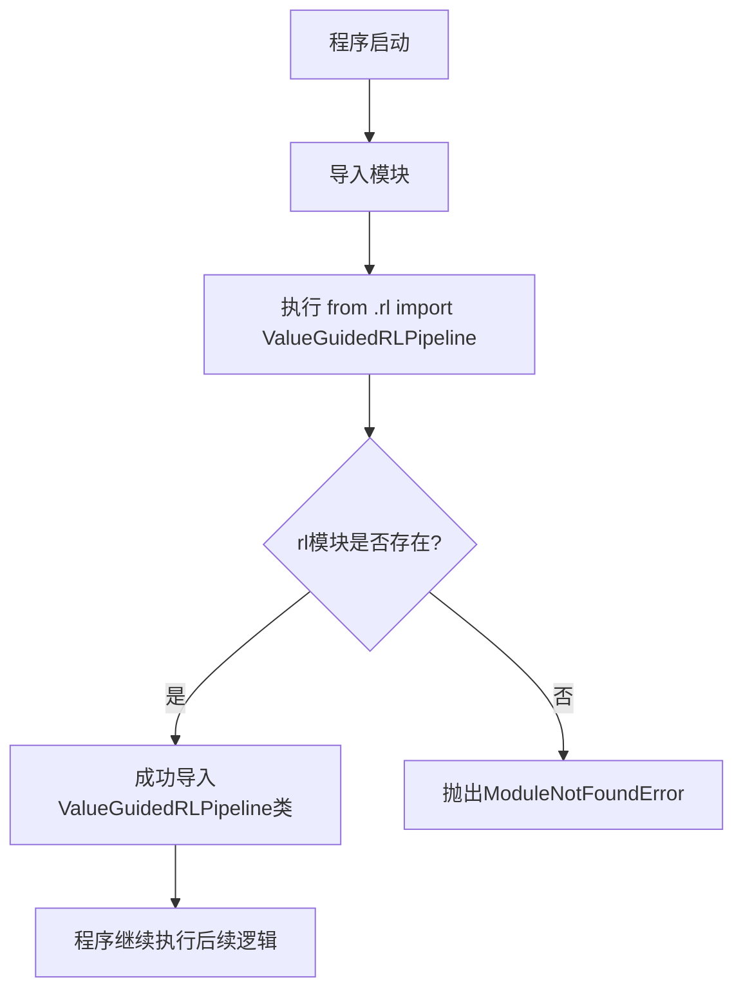
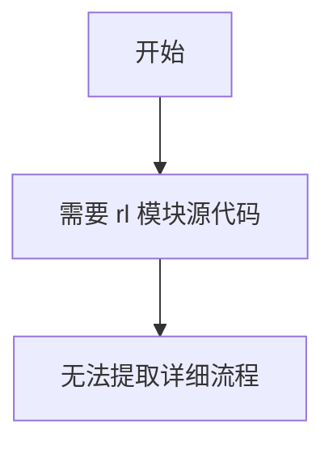

# `diffusers\src\diffusers\experimental\__init__.py` 详细设计文档

这是一个简单的相对导入语句，从当前包的rl模块中导入ValueGuessedRLPipeline类，用于构建基于价值引导的强化学习管道。

## 整体流程



## 类结构

```
ValueGuidedRLPipeline (从rl模块导入的类，具体实现需查看rl模块)
```

## 全局变量及字段


### `ValueGuidedRLPipeline`
    
从rl模块导入的强化学习管道类，用于值引导的强化学习pipeline实现

类型：`class`
    


    

## 全局函数及方法


# ValueGuidedRLPipeline 文档提取

根据提供的代码片段，我只能看到以下导入语句：

```python
from .rl import ValueGuidedRLPipeline
```

这表明 `ValueGuidedRLPipeline` 是从 `rl` 模块导出的一个类或函数，但**没有提供 `rl` 模块的实际源代码**，因此无法提取详细的方法、参数和实现逻辑。

---

## 文档框架（待完善）

### `ValueGuidedRLPipeline`

**描述**：ValueGuidedRLPipeline 是一个强化学习训练管道类，用于实现基于价值引导的强化学习算法。

参数：

- 由于缺少源代码，无法确定参数信息

返回值：由于缺少源代码，无法确定返回值信息

#### 流程图



#### 带注释源码

```
# 源代码未提供
# 需要查看 rl 模块中的 ValueGuidedRLPipeline 类定义
```

---

## 建议

为了生成完整的文档，请提供以下内容：

1. **rl 模块的源代码**：包含 `ValueGuidedRLPipeline` 类的完整定义
2. **相关依赖模块**：如果 `ValueGuidedRLPipeline` 依赖其他模块，也需要提供
3. **使用示例**（如有）：帮助理解类的使用方法

请提供完整的代码，以便我能够生成详细的设计文档。

## 关键组件


### 核心功能概述

该代码文件是一个简单的包初始化文件，通过相对导入的方式从同包的 `rl` 模块中引入 `ValueGuidedRLPipeline` 类，用于在包级别提供对价值引导强化学习流水线的访问接口。

### 文件整体运行流程

该文件作为包的初始化模块，在被导入时执行相对导入语句，从 `.rl` 模块中获取 `ValueGuidedRLPipeline` 类的引用，使其可通过包名直接访问（如 `from package_name import ValueGuidedRLPipeline`）。

### 类详细信息

由于该文件本身不包含类定义，类详情需参考 `rl` 模块中的 `ValueGuidedRLPipeline` 实现。根据命名约定推断，该类可能为强化学习流水线类，用于执行价值引导的强化学习任务。

### 全局变量与函数

该文件不包含全局变量或自定义全局函数，仅包含一条导入语句。

### 关键组件信息

### ValueGuidedRLPipeline

价值引导强化学习流水线组件，负责执行强化学习算法中的价值函数引导策略，可能包含模型加载、数据处理、推理执行等核心功能。

### 潜在技术债务与优化空间

1. **模块职责不清晰**：当前文件仅作为导入中转站，缺乏实际功能实现，可考虑将相关配置或初始化逻辑前置至此
2. **缺乏文档注释**：未包含模块级文档字符串，建议添加模块功能描述
3. **导入耦合度高**：直接暴露内部模块实现细节，建议通过抽象接口或配置类解耦

### 其它项目

- **设计目标**：提供模块化的强化学习流水线访问方式
- **错误处理**：导入失败时将抛出 `ImportError`，建议在外层包装异常处理
- **外部依赖**：依赖 `rl` 模块的存在，需确保目标模块已正确实现
- **接口契约**：遵循 Python 包初始化规范，通过 `__all__` 控制导出内容


## 问题及建议


### 已知问题

-   **代码信息量不足**：仅有一个导入语句，无法进行深度的技术债务分析，需要结合 `ValueGuidedRLPipeline` 类的实际实现才能做出完整评估
-   **依赖隐式耦合**：通过相对导入引用 `rl` 模块，若模块重构或重命名，可能导致导入链断裂
-   **接口契约不明确**：从导入语句无法判断 `ValueGuidedRLPipeline` 的接口设计是否合理、是否遵循开闭原则

### 优化建议

-   **补充完整代码分析**：获取 `rl.py` 或 `rl/__init__.py` 中 `ValueGuidedRLPipeline` 的完整实现，以便进行详细的架构和设计模式分析
-   **显式化依赖声明**：在项目文档或 `__init__.py` 中明确导出公共接口，降低模块间的隐式依赖
-   **考虑使用绝对导入**：在可能的情况下使用绝对导入（如 `from package.rl import ValueGuidedRLPipeline`），提高代码可读性和可维护性
-   **添加类型注解**：在 `ValueGuidedRLPipeline` 类中增加类型提示，便于静态分析和IDE支持


## 其它


### 设计目标与约束

本模块作为ValueGuidedRLPipeline的导入入口，旨在提供强化学习流水线的统一访问入口。设计约束包括：需与rl模块紧密耦合，保持模块接口稳定性，确保版本兼容性。

### 错误处理与异常设计

由于当前代码仅为导入语句，不涉及直接错误处理。潜在的异常场景包括：导入模块不存在、类名变更、循环依赖等。建议在调用方进行异常捕获。

### 数据流与状态机

不适用。当前代码仅负责模块导入，不涉及数据流处理或状态管理。

### 外部依赖与接口契约

本模块依赖rl模块中的ValueGuidedRLPipeline类。接口契约要求调用方必须已知ValueGuidedRLPipeline的具体使用方法，包括构造函数参数、公开方法及返回值格式。

### 性能要求与基准

不适用。导入操作本身无性能开销，性能取决于ValueGuidedRLPipeline的实际实现。

### 安全性考虑

建议确保rl模块来源可信，防止导入恶意代码。避免使用from .rl import *的导入方式，以防止命名空间污染。

### 可扩展性设计

当前设计支持通过修改导入路径实现模块重构。例如：未来可将ValueGuidedRLPipeline迁移至其他模块，只需更新导入语句。

### 配置管理

不适用。当前代码无配置参数。

### 日志与监控

不适用。当前代码无运行时日志输出。

### 测试策略

建议对导入语句进行单元测试，验证模块可正常导入，ValueGuidedRLPipeline类存在且可实例化。

### 部署相关

作为Python包的一部分，通过标准的Python包管理工具（如pip）进行部署。需确保rl模块存在于同一包中。

### 版本兼容性

当前代码适用于Python 3.6+。建议在setup.py或pyproject.toml中明确依赖关系。

### 命名规范

符合Python PEP 8命名规范，使用snake_case命名文件名，PascalCase命名类名。


    