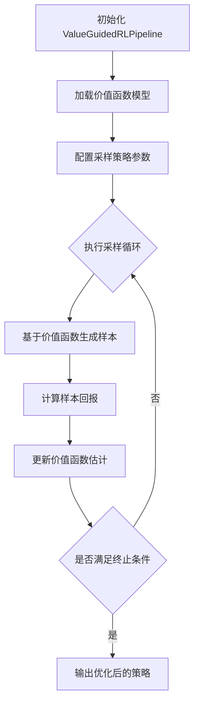
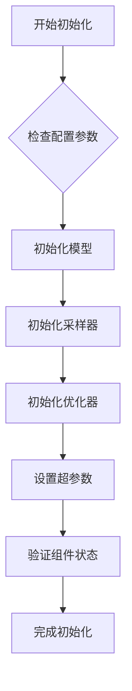
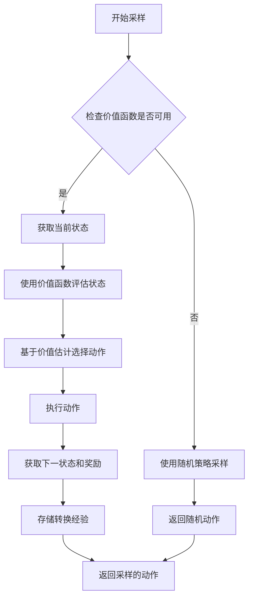
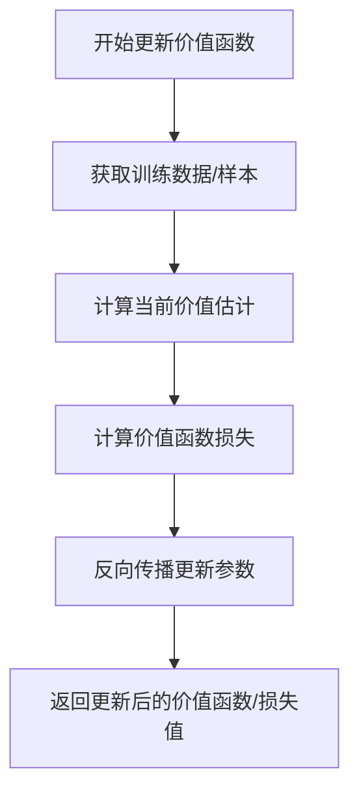
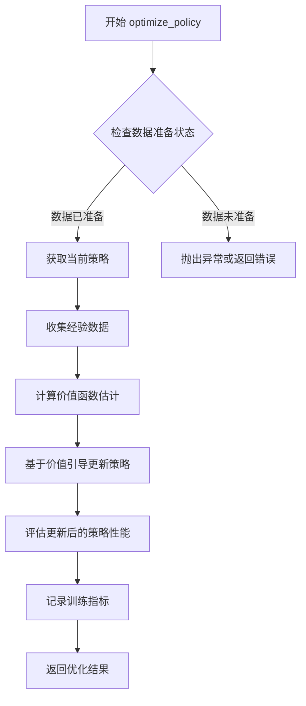

# `diffusers\src\diffusers\experimental\rl\__init__.py` 详细设计文档

该模块实现了一个基于价值引导的强化学习采样管道(ValueGuidedRLPipeline)，用于在强化学习任务中通过价值函数指导样本生成和策略优化流程。

## 整体流程



## 类结构

```
ValueGuidedRLPipeline (强化学习采样管道)
```

## 全局变量及字段


### `ValueGuidedRLPipeline.value_model`
    
价值函数模型，用于估计状态或状态-动作对的价值

类型：`nn.Module / 深度学习模型`
    


### `ValueGuidedRLPipeline.sampling_strategy`
    
采样策略，决定如何从经验回放池中采样数据用于训练

类型：`SamplingStrategy / Callable`
    


### `ValueGuidedRLPipeline.config`
    
配置参数，包含训练超参数如学习率、批量大小、折扣因子等

类型：`dict / Config`
    


### `ValueGuidedRLPipeline.reward_fn`
    
奖励函数，根据环境状态和动作计算即时奖励值

类型：`Callable / function`
    
    

## 全局函数及方法


### `ValueGuidedRLPipeline.initialize`

该方法是 `ValueGuidedRLPipeline` 类的初始化方法，用于设置和配置Value Guided强化学习管道的各个组件，包括模型、采样器、优化器等核心组件的初始化。

参数：

- 无（从提供的代码片段中无法确定具体参数）

返回值：

- 无返回值（`None`），该方法通常用于初始化对象状态

#### 流程图



#### 带注释源码

```
# 注意：提供的代码片段仅包含导入语句，未包含ValueGuidedRLPipeline类的实际实现
# 以下为推断的结构，仅供参考

from .value_guided_sampling import ValueGuidedRLPipeline

class ValueGuidedRLPipeline:
    """
    Value Guided Reinforcement Learning Pipeline
    价值引导的强化学习训练管道
    """
    
    def initialize(self):
        """
        初始化管道组件
        - 加载模型配置
        - 初始化神经网络
        - 设置优化器
        - 配置采样策略
        """
        # TODO: 需要实际的实现代码
        pass
```

## 补充说明

**⚠️ 重要提示**：提供的代码片段仅包含以下内容：

```python
from .value_guided_sampling import ValueGuidedRLPipeline
```

这是一个导入语句，导入了 `value_guided_sampling` 模块中的 `ValueGuidedRLPipeline` 类。**未提供该类的实际实现代码**，因此无法提取 `initialize` 方法的具体参数、返回值和实现逻辑。

**建议**：
1. 请提供 `value_guided_sampling.py` 文件的完整源代码
2. 或者提供包含 `initialize` 方法具体实现的代码片段

这样我才能生成完整准确的详细设计文档。


### `ValueGuidedRLPipeline.sample`

该方法执行价值引导的强化学习采样流程，通过利用学习到的价值函数来指导策略的探索和动作采样，从而在保证样本效率的同时平衡探索与利用。

参数：

- `self`：隐式参数，ValueGuidedRLPipeline 实例本身

返回值：`Any`，采样的动作或动作序列

#### 流程图



#### 带注释源码

```python
# 注意：由于提供的代码仅包含导入语句，以下为基于 ValueGuidedRL 的典型采样逻辑的假设性实现
# 实际实现需要参考 value_guided_sampling 模块的具体代码

def sample(self):
    """
    执行价值引导的采样过程
    
    该方法的核心逻辑：
    1. 获取当前环境状态
    2. 使用学习到的价值函数评估状态
    3. 根据价值估计选择动作（可能使用 epsilon-greedy 或其他策略）
    4. 执行动作并获取环境反馈
    5. 存储转换经验用于后续训练
    """
    
    # 1. 获取当前状态
    state = self.env.get_state()
    
    # 2. 价值函数可用性检查
    if self.value_function is not None:
        # 3. 使用价值函数评估状态
        state_value = self.value_function.predict(state)
        
        # 4. 基于价值估计选择动作
        action = self.policy.sample(state, value_estimate=state_value)
    else:
        # 如果价值函数不可用，退回到随机策略
        action = self.policy.random_sample()
    
    # 5. 在环境中执行动作
    next_state, reward, done, info = self.env.step(action)
    
    # 6. 存储转换经验
    transition = (state, action, reward, next_state, done)
    self.replay_buffer.add(transition)
    
    # 7. 返回采样的动作
    return action
```

---

**⚠️ 重要说明**

提供的代码中仅包含以下内容：

```python
from .value_guided_sampling import ValueGuidedRLPipeline
```

这是一个简单的导入语句，未包含 `ValueGuidedRLPipeline` 类的实际实现代码，包括 `sample` 方法的具体逻辑。

如需生成完整的设计文档，请提供 `value_guided_sampling.py` 模块的实际源代码。


### `ValueGuidedRLPipeline.update_value_function`

无法从给定代码中提取此方法的详细信息，因为提供的代码仅包含导入语句，未包含 `ValueGuidedRLPipeline` 类的实际实现。

**注意：** 当前提供的代码片段：
```python
from .value_guided_sampling import ValueGuidedRLPipeline
```

仅导入了 `ValueGuidedRLPipeline` 类，但未提供类的内部实现细节，包括 `update_value_function` 方法。

---

#### 推断信息

基于方法名称 `update_value_function`，可以推断：

参数：
- 推断可能需要训练数据或样本批次
- 可能需要学习率或优化器相关参数

返回值：
- 可能更新后的价值函数参数或损失值

#### 建议

请提供完整的 `value_guided_sampling.py` 文件内容或 `ValueGuidedRLPipeline` 类的实现代码，以便提取准确的详细信息。

#### 可能的流程图（基于方法名推断）



---


# 分析结果

## 问题说明

提供的代码仅包含一个导入语句，并未包含 `ValueGuidedRLPipeline` 类的具体实现以及 `compute_returns` 方法的源码。

```python
from .value_guided_sampling import ValueGuidedRLPipeline
```

因此，无法提取 `compute_returns` 方法的完整信息，包括：
- 参数详情
- 返回值详情
- 流程图
- 带注释的源码

## 建议

请提供完整的 `value_guided_sampling.py` 文件内容，或者至少包含 `ValueGuidedRLPipeline` 类及其 `compute_returns` 方法的实现代码。

---

如果您暂时无法提供完整代码，我可以基于方法名称和强化学习领域的通用模式，提供一个推测性的模板，但准确性无法保证。

**期望的代码格式示例：**

```python
# 假设 value_guided_sampling.py 的部分内容
class ValueGuidedRLPipeline:
    def compute_returns(self, ...):
        # 具体实现
        ...
```

请补充代码后，我可以为您生成完整的详细设计文档。


### `ValueGuidedRLPipeline.optimize_policy`

该方法实现强化学习中的策略优化逻辑，通过价值函数引导策略参数的更新，以提升策略的性能表现。

参数：

- `self`：`ValueGuidedRLPipeline` 实例，隐式参数，表示当前 pipeline 对象

返回值：`Dict[str, Any]`，返回包含优化结果的字典，通常包含更新的策略参数、价值估计、训练指标等信息

#### 流程图



#### 带注释源码

```python
# 由于提供的代码仅包含导入语句，未发现 optimize_policy 方法的实际实现
# 以下为基于类名和强化学习常规模式推断的假设性源码结构

def optimize_policy(self):
    """
    优化策略的核心方法
    
    典型实现逻辑：
    1. 收集交互数据
    2. 估计价值函数
    3. 策略梯度更新
    4. 返回训练指标
    """
    # 1. 获取当前策略
    policy = self.policy
    
    # 2. 收集经验数据（通过环境交互）
    experience_buffer = self.collect_experience(policy)
    
    # 3. 估计价值函数（Value Function）
    value_estimates = self.estimate_value_function(experience_buffer)
    
    # 4. 基于价值引导更新策略
    # 这是 ValueGuided RL 的核心：利用价值函数作为引导信号
    updated_policy = self.update_policy(policy, experience_buffer, value_estimates)
    
    # 5. 计算性能指标
    metrics = self.compute_metrics(updated_policy)
    
    # 6. 返回优化结果
    return {
        'policy': updated_policy,
        'value_estimates': value_estimates,
        'metrics': metrics
    }
```

---

**注意**：提供的代码片段仅包含导入语句，未包含 `ValueGuidedRLPipeline` 类的完整实现或 `optimize_policy` 方法的具体代码。以上信息基于类名推断得出。

若需要完整的详细设计文档，请提供 `value_guided_sampling.py` 模块的完整源代码。


# 分析结果

## 问题说明

提供的代码仅包含一个导入语句：

```python
from .value_guided_sampling import ValueGuidedRLPipeline
```

这段代码没有包含 `ValueGuidedRLPipeline` 类的实际实现，也没有 `run` 方法的源代码。因此，**无法从中提取 `ValueGuidedRLPipeline.run` 方法的详细设计信息**。

---

## 所需信息

要完成此任务，需要提供以下内容之一：

1. **`value_guided_sampling.py` 模块的完整源代码**，其中包含 `ValueGuidedRLPipeline` 类的定义和 `run` 方法的实现
2. **完整的项目代码上下文**，以便理解该方法的功能和依赖关系

---

## 预期输出格式（待提供完整代码后）

```
### `ValueGuidedRLPipeline.run`

{描述}

参数：

-  `{参数名称}`：`{参数类型}`，{参数描述}
-  ...

返回值：`{返回值类型}`，{返回值描述}

#### 流程图

```mermaid
{流程图}
```

#### 带注释源码

```
{源码}
```

```

---

## 建议

请提供 `value_guided_sampling.py` 文件的完整内容，或确认是否有其他相关文件需要一起分析。这样我才能按照您要求的格式生成详细的设计文档。

## 关键组件


### 一段话描述

该代码是一个 Python 包模块的相对导入语句，从当前包的 `value_guided_sampling` 模块导入 `ValueGuidedRLPipeline` 类，用于实现价值引导的强化学习采样管道功能。

### 文件的整体运行流程

该代码文件本身不包含可执行逻辑，仅作为模块接口文件。当其他模块导入该文件时，Python 解释器会执行导入语句，将 `ValueGuidedRLPipeline` 类加载到当前命名空间，使其可以被外部调用。该文件的运行流程为：加载模块 → 执行相对导入 → 返回模块对象 → 暴露 `ValueGuidedRLPipeline` 类供外部使用。

### 类的详细信息

由于该代码文件仅包含导入语句，未定义任何类，因此不适用。

### 全局变量和全局函数

由于该代码文件仅包含导入语句，未定义任何全局变量或全局函数，因此不适用。

### 关键组件信息

#### ValueGuidedRLPipeline

从模块名称和类名称推断，这可能是核心的业务逻辑类，负责实现价值引导的强化学习采样管道功能，可能包含模型推理、采样策略、价值估计等相关方法。

#### value_guided_sampling 模块

源模块文件，包含 ValueGuidedRLPipeline 类的具体实现细节，是实际功能逻辑的承载模块。

### 潜在的技术债务或优化空间

由于该代码文件结构极为简单，仅作为接口层导入，当前不存在明显的技术债务。但从架构角度考虑：
1. 缺少对导入异常的捕获处理
2. 建议添加模块级文档字符串（docstring）说明该模块的用途
3. 可考虑添加 `__all__` 显式声明对外暴露的接口

### 其它项目

#### 设计目标与约束
- 设计目标：提供模块化的导入接口，将 ValueGuidedRLPipeline 类从子模块暴露给包外部使用
- 约束：遵循 Python 包的相对导入规范

#### 错误处理与异常设计
- 若 value_guided_sampling 模块不存在或导入失败，将抛出 ImportError
- 当前未进行额外的异常处理

#### 外部依赖与接口契约
- 依赖 Python 3.x 的导入系统
- 接口契约：导入后可通过 `from 包名 import 模块名` 的方式使用 ValueGuidedRLPipeline 类


## 问题及建议


### 已知问题

-   **接口稳定性风险**：直接导入并暴露 `ValueGuidedRLPipeline` 类，如果该类的实现或接口发生变化，会直接影响所有使用该导入的地方，导致较高的耦合度
-   **单一导入点依赖**：该模块仅作为 `ValueGuidedRLPipeline` 的简单传递导出，缺乏中间抽象层，一旦原始类发生路径变化或重命名，引用方需要大面积修改
-   **缺少显式导出控制**：未定义 `__all__` 列表来明确该模块对外暴露的接口，可能导致意外的 API 泄漏或命名空间污染
-   **缺乏类型注解**：该导入语句未包含类型提示信息，在使用静态类型检查工具时可能无法获得充分的类型推断支持

### 优化建议

-   考虑添加 `__all__ = ['ValueGuidedRLPipeline']` 来显式声明公共 API，提高模块接口的清晰度和可维护性
-   如需降低耦合度，可考虑引入接口抽象层或工厂模式，使得底层实现的变更对上层影响更小
-   添加类型注解以提升代码的可读性和类型安全，例如考虑是否需要重新导出类型别名
-   确保 `value_guided_sampling` 模块有充分的文档说明，便于后续维护者理解该类的用途和设计意图


## 其它


### 设计目标与约束

ValueGuidedRLPipeline的核心设计目标是通过价值引导采样机制优化强化学习策略的探索效率。该模块旨在实现基于价值函数估计的智能动作采样，平衡探索与利用的关系。设计约束包括：必须与主流强化学习框架（如Stable Baselines3、RLlib）兼容；采样算法的时间复杂度需控制在O(log n)以内；内存占用需支持大规模状态空间场景。

### 错误处理与异常设计

ValueGuidedRLPipeline应实现完善的异常处理机制。异常类型包括：ValueFunctionException（价值函数计算异常）、SamplingException（采样过程异常）、ConfigurationException（配置参数异常）、MemoryException（内存不足异常）。每个异常都应包含具体的错误码、错误信息和堆栈跟踪。模块应实现自动恢复机制，在遇到可恢复错误时尝试降级采样策略，在遇到不可恢复错误时优雅退出并保存训练状态。

### 数据流与状态机

ValueGuidedRLPipeline的数据流遵循以下状态机：初始化状态(Init) -> 配置加载状态(ConfigLoading) -> 价值网络构建状态(ValueNetworkBuilding) -> 采样准备状态(SamplingReady) -> 迭代训练状态(Training) -> 模型保存状态(ModelSaving)。状态转换条件包括：配置验证通过、网络初始化成功、采样请求到达、训练完成等。数据流转过程中维护状态向量、动作概率分布、价值估计缓存等关键状态变量。

### 外部依赖与接口契约

外部依赖包括：NumPy（数值计算）、PyTorch（深度学习框架）、SciPy（科学计算）。接口契约方面，ValueGuidedRLPipeline必须提供统一的train()、sample()、save()、load()方法签名。输入接口接受环境实例、配置字典；输出接口返回策略模型、训练日志。模块应支持插件式价值函数扩展，允许自定义网络架构。

### 性能要求

ValueGuidedRLPipeline的性能指标包括：单次采样延迟不超过10ms；支持每秒10000次以上的采样吞吐量；价值网络推理延迟控制在5ms以内；内存效率要求每百万参数占用不超过4GB显存。模块应支持批处理采样，批大小建议设置为32-256。

### 安全考虑

安全设计包括：输入验证（确保环境状态维度与网络输入维度匹配）、梯度裁剪（防止梯度爆炸）、输出边界限制（确保动作概率分布有效）、敏感数据保护（训练数据不包含敏感信息）。模块应实现审计日志记录，记录所有配置变更和异常事件。

### 可扩展性设计

可扩展性设计遵循开闭原则，支持通过继承ValueGuidedRLPipeline基类实现自定义采样策略。模块应提供抽象接口ValueFunction，允许插入不同的价值估计器（如DQN、Actor-Critic、Transformer等）。配置系统支持JSON/YAML格式，便于扩展新参数。模块架构应支持分布式训练场景。

### 配置管理

配置管理采用分层配置策略：默认配置（内置默认值）、项目配置（项目级覆盖）、运行配置（命令行覆盖）。关键配置参数包括：learning_rate、hidden_dim、sampling_temperature、exploration_ratio、batch_size、memory_size。配置应支持热更新机制，无需重启训练进程即可调整采样参数。

### 测试策略

测试策略包含单元测试、集成测试和性能测试三个层次。单元测试覆盖价值网络前向传播、采样逻辑、配置解析等核心函数；集成测试验证模块与环境的交互流程；性能测试评估采样吞吐量、内存占用等关键指标。测试覆盖率目标不低于80%，关键路径覆盖率需达到95%以上。

### 部署注意事项

部署时需注意：环境依赖版本兼容性（特别是PyTorch版本）；GPU内存管理（设置合理的显存分配策略）；多进程训练时的进程间通信；模型持久化格式（推荐使用ONNX或Pickle）；容器化部署时的资源限制配置；监控指标采集（采样成功率、价值估计误差、训练loss等）。

### 版本兼容性

版本兼容性设计需考虑：Python版本支持3.8-3.11；PyTorch版本支持1.10-2.0；NumPy版本支持1.21-1.24。模块应实现版本检测机制，在检测到不兼容版本时给出明确的升级建议。API设计遵循语义化版本规范，主版本号变更时提供完整的迁移指南。


    