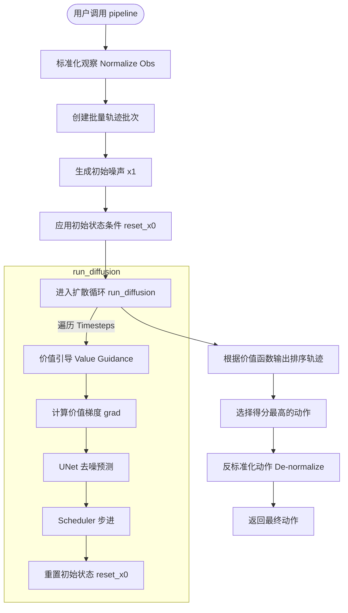
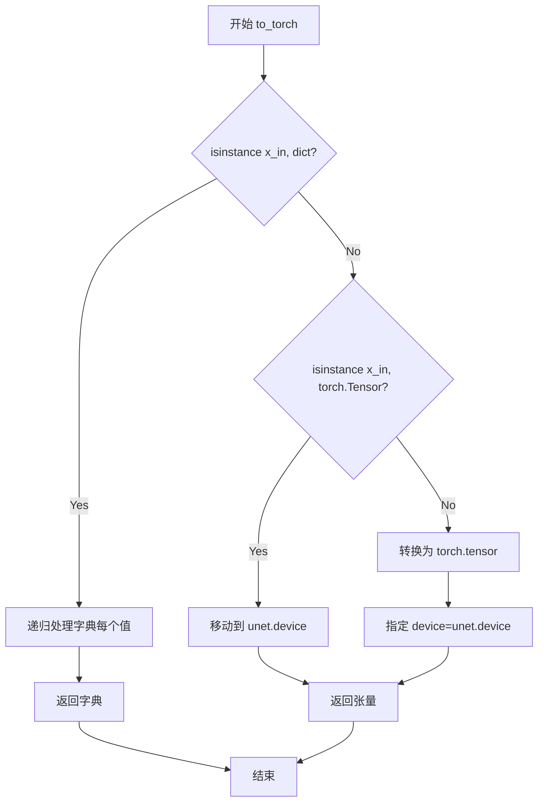
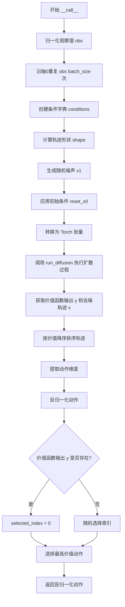

# `diffusers\src\diffusers\experimental\rl\value_guided_sampling.py` 详细设计文档

这是一个基于扩散模型的强化学习推理管道（ValueGuidedRLPipeline），用于在给定环境观察下生成、评估并选择最优的动作序列。它通过价值函数（Value Function）对生成的轨迹进行评分，并返回得分最高的动作。

## 整体流程



## 类结构

```
DiffusionPipeline (基类)
└── ValueGuidedRLPipeline (主类)
```

## 全局变量及字段


### `ValueGuidedRLPipeline.value_function`
    
用于评估轨迹价值的UNet模型

类型：`UNet1DModel`
    


### `ValueGuidedRLPipeline.unet`
    
去噪扩散模型

类型：`UNet1DModel`
    


### `ValueGuidedRLPipeline.scheduler`
    
扩散调度器

类型：`DDPMScheduler`
    


### `ValueGuidedRLPipeline.env`
    
环境对象，用于获取数据集

类型：`Environment`
    


### `ValueGuidedRLPipeline.data`
    
从环境获取的数据集

类型：`Dict`
    


### `ValueGuidedRLPipeline.means`
    
数据集各维度的均值，用于标准化

类型：`Dict`
    


### `ValueGuidedRLPipeline.stds`
    
数据集各维度的标准差，用于标准化

类型：`Dict`
    


### `ValueGuidedRLPipeline.state_dim`
    
观察空间的维度

类型：`int`
    


### `ValueGuidedRLPipeline.action_dim`
    
动作空间的维度

类型：`int`
    
    

## 全局函数及方法


### `ValueGuidedRLPipeline.__init__`

这是 ValueGuidedRLPipeline 类的构造函数，负责初始化价值引导的强化学习扩散管道。它接收价值函数、UNet模型、调度器和环境作为参数，初始化父类模块，注册所有子模块，并从环境中获取数据集以计算状态和动作的均值和标准差，用于后续的归一化和反归一化操作。

参数：

- `value_function`：`UNet1DModel`，用于基于奖励微调轨迹的专用UNet模型
- `unet`：`UNet1DModel`，对编码轨迹进行去噪的UNet架构
- `scheduler`：`DDPMScheduler`，与unet结合使用以对编码轨迹进行去噪的调度器
- `env`：环境对象，遵循OpenAI gym API，用于获取数据集和状态/动作空间信息

返回值：`None`，构造函数不返回任何值

#### 流程图

```mermaid
flowchart TD
    A[开始 __init__] --> B[调用 super().__init__]
    B --> C[register_modules: 注册 value_function, unet, scheduler, env]
    C --> D[调用 env.get_dataset 获取数据]
    D --> E[遍历 data.keys 计算 means]
    E --> F[遍历 data.keys 计算 stds]
    F --> G[获取 state_dim = env.observation_space.shape[0]]
    G --> H[获取 action_dim = env.action_space.shape[0]]
    H --> I[结束 __init__]
```

#### 带注释源码

```
def __init__(
    self,
    value_function: UNet1DModel,  # 用于基于奖励微调轨迹的专用UNet
    unet: UNet1DModel,             # 对编码轨迹进行去噪的UNet架构
    scheduler: DDPMScheduler,     # 与unet结合使用以对编码轨迹进行去噪的调度器
    env,                           # 遵循OpenAI gym API的环境对象
):
    # 调用父类 DiffusionPipeline 的初始化方法
    super().__init__()

    # 注册所有模块，使它们可以通过 pipeline.value_function 等方式访问
    # 同时确保各模块被正确保存到 pipeline 的 config 中
    self.register_modules(value_function=value_function, unet=unet, scheduler=scheduler, env=env)

    # 从环境中获取数据集，用于计算归一化所需的统计信息
    self.data = env.get_dataset()
    
    # 初始化均值字典，用于存储数据集中各键的均值
    self.means = {}
    for key in self.data.keys():
        try:
            # 尝试计算每个数据键的均值
            self.means[key] = self.data[key].mean()
        except:  # noqa: E722
            # 如果计算失败（如数据为空或类型不支持），跳过该键
            pass
    
    # 初始化标准差字典，用于存储数据集中各键的标准差
    self.stds = {}
    for key in self.data.keys():
        try:
            # 尝试计算每个数据键的标准差
            self.stds[key] = self.data[key].std()
        except:  # noqa: E722
            # 如果计算失败，跳过该键
            pass
    
    # 从环境中获取状态空间的维度（观测维度）
    self.state_dim = env.observation_space.shape[0]
    
    # 从环境中获取动作空间的维度
    self.action_dim = env.action_space.shape[0]
```


### `ValueGuidedRLPipeline.normalize`

对输入数据进行Z-score标准化处理，利用预计算的均值和标准差将数据转换到标准正态分布。

参数：

- `x_in`：输入数据（numpy数组或torch张量），需要标准化的原始数据
- `key`：字符串，用于从 `self.means` 和 `self.stds` 字典中获取对应特征的均值和标准差

返回值：`标准化后的数据`，与输入数据类型相同，经过Z-score标准化后的结果

#### 流程图

```mermaid
flowchart TD
    A[开始 normalize] --> B[接收输入 x_in 和 key]
    B --> C{从 self.means 获取均值}
    C --> D{从 self.stds 获取标准差}
    D --> E[计算: (x_in - means[key]) / stds[key]]
    E --> F[返回标准化结果]
```

#### 带注释源码

```python
def normalize(self, x_in, key):
    """
    对输入数据进行Z-score标准化处理。
    
    使用预计算的均值和标准差，将输入数据转换为标准正态分布形式。
    标准化公式: (x_in - mean) / std
    
    参数:
        x_in: 需要标准化的原始数据，支持numpy数组或torch张量
        key: 用于获取对应特征统计量的键名
    
    返回:
        标准化后的数据，类型与输入相同
    """
    return (x_in - self.means[key]) / self.stds[key]
```


### `ValueGuidedRLPipeline.de_normalize`

该方法实现数据的去标准化（反标准化）操作，根据指定的键获取对应的标准差和均值，将标准化后的数据还原为原始尺度的数据。

参数：

- `x_in`：`torch.Tensor` 或 `numpy.ndarray`，需要进行去标准化的输入数据
- `key`：`str`，用于从 `self.means` 和 `self.stds` 字典中获取对应特征的均值和标准差的键名

返回值：`torch.Tensor` 或 `numpy.ndarray`，去标准化后的数据，与输入数据类型保持一致

#### 流程图

```mermaid
flowchart TD
    A[开始 de_normalize] --> B[根据 key 获取 self.stds[key]]
    B --> C[根据 key 获取 self.means[key]]
    C --> D[计算: x_in * stds[key] + means[key]]
    D --> E[返回去标准化后的数据]
    
    B -->|key 不存在| F[可能抛出 KeyError]
    C -->|标准差为0| G[可能导致除零或结果为均值]
```

#### 带注释源码

```python
def de_normalize(self, x_in, key):
    """
    将标准化后的数据还原为原始尺度
    
    去标准化公式: x_original = x_normalized * std + mean
    这与 normalize 方法互为逆操作
    
    参数:
        x_in: 需要去标准化的输入数据（已标准化的数据）
        key: 字符串键，用于从 self.means 和 self.stds 字典中
             获取对应特征的统计量（均值和标准差）
    
    返回:
        去标准化后的数据，数据类型与输入保持一致
    """
    # 公式: x_original = x_normalized * std + mean
    # 例如: 如果原数据被标准化为 (x - mean) / std
    # 去标准化就是: x = x_normalized * std + mean
    return x_in * self.stds[key] + self.means[key]
```


### `ValueGuidedRLPipeline.to_torch`

该方法是一个递归转换函数，用于将输入数据（字典、PyTorch张量或numpy数组）转换为PyTorch张量，并确保张量被移动到与UNet模型相同的设备（CPU/GPU）上，以便在Pipeline的推理过程中保持设备一致性。

参数：

- `x_in`：任意类型，输入数据，可以是字典（dict）、PyTorch张量（torch.Tensor）或其他可张量化的数据类型（如numpy数组）

返回值：`torch.Tensor` 或 `dict`，返回转换后的PyTorch张量或包含张量的字典

#### 流程图



#### 带注释源码

```python
def to_torch(self, x_in):
    """
    将输入数据转换为 PyTorch 张量并移动到正确设备
    
    参数:
        x_in: 输入数据，支持 dict、torch.Tensor 或其他可转换类型
    
    返回:
        转换后的张量或字典
    """
    # 步骤1: 检查输入是否为字典类型
    if isinstance(x_in, dict):
        # 递归处理字典中的每个值，将它们转换为张量
        return {k: self.to_torch(v) for k, v in x_in.items()}
    
    # 步骤2: 检查输入是否已经是 PyTorch 张量
    elif torch.is_tensor(x_in):
        # 如果已是张量，直接移动到 UNet 所在的设备（CPU/GPU）
        return x_in.to(self.unet.device)
    
    # 步骤3: 其他类型（如 numpy 数组）转换为张量
    # 并指定目标设备
    return torch.tensor(x_in, device=self.unet.device)
```


### `ValueGuidedRLPipeline.reset_x0`

该方法用于在扩散模型的采样过程中，根据给定的条件（cond）重置输入轨迹张量的特定维度，将条件值（如初始状态）强制赋值到输入张量的指定位置，确保生成轨迹满足预设的条件约束。

参数：
- `self`：`ValueGuidedRLPipeline`，类的实例本身
- `x_in`：`torch.Tensor`，输入的三维张量，形状为(batch_size, planning_horizon, state_dim + action_dim)，表示生成的轨迹序列
- `cond`：`Dict[int, torch.Tensor]`，条件字典，键为时间步索引（通常为0，表示初始状态），值为对应的条件张量（如观测值）
- `act_dim`：`int`，动作空间的维度，用于确定状态和动作在张量中的分界位置

返回值：`torch.Tensor`，返回修改后的输入张量x_in，其形状与输入相同

#### 流程图

```mermaid
flowchart TD
    A[开始 reset_x0] --> B{遍历 cond 的键值对}
    B -->|对于每个 key, val| C[计算列索引: act_dim:]
    C --> D[执行赋值: x_in[:, key, act_dim:] = val.clone]
    D --> E{检查是否还有更多键值对}
    E -->|是| B
    E -->|否| F[返回 x_in]
    F --> G[结束 reset_x0]
```

#### 带注释源码

```python
def reset_x0(self, x_in, cond, act_dim):
    """
    重置输入张量的初始状态条件。
    
    在扩散模型的迭代采样过程中，某些时间步的轨迹状态需要被强制约束为特定值
    （例如将初始状态设置为当前观测值）。该方法遍历条件字典，将条件值克隆并
    赋值到输入张量的对应位置。
    
    参数:
        x_in: 输入的三维张量，形状为 (batch_size, planning_horizon, state_dim + action_dim)
        cond: 条件字典，键为时间步索引（通常为0），值为该时间步的条件张量
        act_dim: 动作维度，用于确定状态和动作在最后一维的分界点
    
    返回:
        修改后的输入张量 x_in
    """
    # 遍历条件字典中的所有键值对
    # 键通常为0，表示需要重置轨迹的起始点
    # 值为条件张量，通常是当前观测值或初始状态
    for key, val in cond.items():
        # x_in[:, key, act_dim:] 表示：
        # - 批量维度的所有样本 (:)
        # - 时间步 key
        # - 从 act_dim 开始到末尾的列（对应状态部分）
        # 使用 clone() 创建值的副本，避免共享内存导致的潜在问题
        x_in[:, key, act_dim:] = val.clone()
    
    # 返回修改后的张量（注意：这是对原张量的原地修改）
    return x_in
```


### `ValueGuidedRLPipeline.run_diffusion`

该方法实现了基于值引导的扩散采样过程，通过在每个去噪时间步中多次调用值函数计算梯度来引导采样方向，使其向高回报轨迹偏移，随后使用 UNet 模型执行标准去噪步骤，最终输出优化后的轨迹样本。

参数：

- `x`：`torch.Tensor`，输入的带噪声轨迹张量，形状为 (batch_size, planning_horizon, state_dim + action_dim)
- `conditions`：`Dict[int, torch.Tensor]`，条件字典，键为时间步索引，值为观测状态张量，用于强制轨迹从指定状态开始
- `n_guide_steps`：`int`，值函数引导迭代次数，控制每时间步的引导强度
- `scale`：`float`，引导梯度缩放因子，决定每步引导更新的幅度

返回值：`Tuple[torch.Tensor, Optional[torch.Tensor]]`，返回处理后的轨迹张量 x 和最终值函数输出 y

#### 流程图

```mermaid
flowchart TD
    A[开始 run_diffusion] --> B[获取 batch_size]
    B --> C[初始化 y = None]
    C --> D[遍历调度器时间步 for i in timesteps]
    D --> E[创建当前时间步张量 timesteps]
    E --> F{循环 n_guide_steps 次}
    F --> G[启用梯度计算 x.requires_grad_]
    G --> H[调用 value_function 计算 y]
    H --> I[计算 y 对 x 的梯度 grad]
    I --> J[计算模型标准差 model_std]
    J --> K[缩放梯度 grad = model_std * grad]
    K --> L[清零时间步小于2的梯度]
    L --> M[分离 x 并更新 x = x + scale * grad]
    M --> N[应用条件约束 reset_x0]
    N --> O{判断是否继续引导}
    O -->|是| F
    O -->|否| P[调用 UNet 去噪 prev_x = unet(x.permute...)]
    P --> Q[调度器单步更新 x = scheduler.step...]
    Q --> R[再次应用条件约束 reset_x0]
    R --> S[转换为 Torch 张量 to_torch]
    S --> T{判断是否还有时间步}
    T -->|是| D
    T -->|否| U[返回 x 和 y]
```

#### 带注释源码

```python
def run_diffusion(self, x, conditions, n_guide_steps, scale):
    """
    执行值引导的扩散采样过程
    
    参数:
        x: 带噪声的轨迹张量，形状 (batch_size, planning_horizon, state_dim + action_dim)
        conditions: 条件字典，用于强制轨迹从指定观测状态开始
        n_guide_steps: 每个时间步的值函数引导迭代次数
        scale: 引导梯度的缩放因子
    
    返回:
        x: 去噪后的轨迹张量
        y: 最终的值函数输出，用于轨迹排序
    """
    # 获取批次大小
    batch_size = x.shape[0]
    # 初始化值函数输出为 None
    y = None
    
    # 遍历扩散调度器的所有时间步
    for i in tqdm.tqdm(self.scheduler.timesteps):
        # 创建当前时间步的张量批次，用于模型输入
        timesteps = torch.full((batch_size,), i, device=self.unet.device, dtype=torch.long)
        
        # 执行 n_guide_steps 次值函数引导
        for _ in range(n_guide_steps):
            # 启用梯度计算，以便计算值函数对输入的梯度
            with torch.enable_grad():
                x.requires_grad_()

                # 调整维度顺序以匹配预训练模型的输入格式 (batch, dim, seq)
                # 调用值函数预测当前轨迹的价值
                y = self.value_function(x.permute(0, 2, 1), timesteps).sample
                
                # 计算值函数输出对输入轨迹的梯度
                # 这表示如何修改轨迹以提高预期价值
                grad = torch.autograd.grad([y.sum()], [x])[0]

                # 获取后验方差并计算模型标准差
                # 用于控制引导强度的动态调整
                posterior_variance = self.scheduler._get_variance(i)
                model_std = torch.exp(0.5 * posterior_variance)
                # 根据模型不确定性缩放梯度
                grad = model_std * grad

            # 对于接近最终状态的步骤（timesteps < 2），停止梯度引导
            # 因为这些步骤已经是高度去噪的状态
            grad[timesteps < 2] = 0
            
            # 分离 x 以断开计算图，避免梯度累积
            x = x.detach()
            # 应用引导更新：沿梯度方向移动轨迹
            x = x + scale * grad
            # 重新应用条件约束，确保轨迹从指定状态开始
            x = self.reset_x0(x, conditions, self.action_dim)

        # 使用 UNet 执行标准去噪步骤
        # 先调整维度顺序，输入 UNet 期望 (batch, dim, seq) 格式
        prev_x = self.unet(x.permute(0, 2, 1), timesteps).sample
        # 调整回原始维度顺序 (batch, seq, dim)
        prev_x = prev_x.permute(0, 2, 1)

        # 调用调度器的 step 方法进行单步去噪
        # 获取去噪后的样本
        x = self.scheduler.step(prev_x, i, x)["prev_sample"]

        # 应用条件约束到去噪后的轨迹
        # 确保轨迹始终从当前观测状态开始
        x = self.reset_x0(x, conditions, self.action_dim)
        # 确保数据在正确的设备上
        x = self.to_torch(x)
    
    # 返回最终去噪轨迹和值函数输出
    return x, y
```


### `ValueGuidedRLPipeline.__call__`

该方法是 ValueGuidedRLPipeline 的核心调用接口，接收环境观察值，通过价值引导的扩散采样过程生成最优动作序列。方法首先对观察值进行归一化和批次复制，然后结合初始噪声和条件运行扩散过程，最后根据学习到的价值函数对生成的轨迹进行排序，选择价值最高的动作作为输出。

参数：

- `obs`：`numpy.ndarray` 或 `torch.Tensor`，来自环境的当前观察值（状态）
- `batch_size`：`int`，生成的轨迹批次大小，默认为 64，用于并行采样多条轨迹
- `planning_horizon`：`int`，规划视界长度，定义生成轨迹的时间步数，默认为 32
- `n_guide_steps`：`int`，价值引导的梯度上升步数，每步迭代中根据价值函数调整噪声轨迹，默认为 2
- `scale`：`float`，价值梯度缩放因子，控制引导强度，默认为 0.1

返回值：`numpy.ndarray`，形状为 `(action_dim,)` 的反归一化动作向量，用于在环境中执行

#### 流程图



#### 带注释源码

```python
def __call__(self, obs, batch_size=64, planning_horizon=32, n_guide_steps=2, scale=0.1):
    """
    执行价值引导的扩散策略采样
    
    参数:
        obs: 环境观察值
        batch_size: 并行采样的轨迹数量
        planning_horizon: 轨迹时间步长度
        n_guide_steps: 每次去噪迭代中的价值引导步数
        scale: 价值梯度缩放系数
    """
    
    # 步骤1: 归一化观察值，使用预计算的均值和标准差
    obs = self.normalize(obs, "observations")
    
    # 步骤2: 创建批次维度，复制 batch_size 份观察值
    # 每份将作为一条轨迹的初始条件
    obs = obs[None].repeat(batch_size, axis=0)
    
    # 步骤3: 构建条件字典，键为时间步索引，值为初始观察值
    # 0 表示从时间步 0 开始约束轨迹
    conditions = {0: self.to_torch(obs)}
    
    # 步骤4: 定义生成轨迹的形状
    # (batch_size, planning_horizon, state_dim + action_dim)
    shape = (batch_size, planning_horizon, self.state_dim + self.action_dim)
    
    # 步骤5: 生成初始随机噪声作为扩散起点
    x1 = randn_tensor(shape, device=self.unet.device)
    
    # 步骤6: 应用初始条件，将所有轨迹的第一帧设置为当前观察值
    # 确保生成的轨迹从当前状态开始
    x = self.reset_x0(x1, conditions, self.action_dim)
    
    # 步骤7: 确保所有张量在正确的设备上
    x = self.to_torch(x)
    
    # 步骤8: 运行完整的扩散采样过程
    # 返回去噪后的轨迹 x 和价值函数输出 y
    x, y = self.run_diffusion(x, conditions, n_guide_steps, scale)
    
    # 步骤9: 根据价值函数输出对轨迹排序
    # 降序排列，选择价值最高的轨迹
    sorted_idx = y.argsort(0, descending=True).squeeze()
    sorted_values = x[sorted_idx]
    
    # 步骤10: 提取动作部分 (前 action_dim 维度)
    actions = sorted_values[:, :, : self.action_dim]
    
    # 步骤11: 转换为 NumPy 数组并反归一化
    actions = actions.detach().cpu().numpy()
    denorm_actions = self.de_normalize(actions, key="actions")
    
    # 步骤12: 选择动作索引
    if y is not None:
        # 如果运行了价值引导，选择价值最高的动作 (索引 0)
        selected_index = 0
    else:
        # 如果价值引导未执行，随机选择动作
        selected_index = np.random.randint(0, batch_size)
    
    # 步骤13: 提取第一个时间步的动作并返回
    # 注意: 实际上只返回了单步动作用于当前决策
    denorm_actions = denorm_actions[selected_index, 0]
    return denorm_actions
```

## 关键组件


### Value-Guided Sampling

利用价值函数（value_function）在扩散过程的每一步计算梯度，利用梯度来引导生成更高价值的轨迹，通过对多个生成的轨迹按价值排序来选择最优动作。

### 张量索引与惰性加载

使用 `obs[None].repeat(batch_size, axis=0)` 创建批量维度，使用 `x.permute(0, 2, 1)` 调整张量维度以适配预训练模型，使用 `to_torch` 方法惰性地将数据转换为PyTorch张量并在需要时移动到正确设备。

### 反量化支持

提供 `normalize` 和 `de_normalize` 方法对状态和动作进行标准化和反标准化处理，使用数据集中的均值和标准差进行归一化，计算公式为 `x_in * self.stds[key] + self.means[key]`。

### 量化策略

本代码未包含量化策略，UNet模型直接使用原始精度进行推理。

### 条件状态重置

`reset_x0` 方法将条件状态（如初始观察）强制写入生成轨迹的对应位置，确保生成的轨迹从当前状态开始，公式为 `x_in[:, key, act_dim:] = val.clone()`。

### 梯度引导机制

在扩散去噪过程中，使用 `torch.autograd.grad` 计算价值函数关于生成轨迹的梯度，并乘以模型标准差 `model_std = torch.exp(0.5 * posterior_variance)` 进行缩放，引导轨迹向高价值方向优化。

### 轨迹选择与排序

生成批量轨迹后，使用 `y.argsort(0, descending=True)` 按价值降序排序，选择价值最高的轨迹对应的动作 `selected_index = 0`。

### 调度器集成

使用DDPMScheduler进行扩散过程的时间步调度，通过 `self.scheduler.step` 计算前一个样本，并获取后验方差用于梯度缩放。


## 问题及建议


### 已知问题

- **异常处理过于宽泛**：`__init__`方法中使用`except: # noqa: E722`捕获所有异常，会隐藏真正的错误，应使用具体的异常类型（如`TypeError`或`ValueError`）
- **魔法数字缺乏解释**：`grad[timesteps < 2] = 0`中的数字2没有任何注释说明其含义，`scale=0.1`作为默认值也缺乏说明
- **TODO未完成**：`# TODO: verify deprecation of this kwarg`标记的任务尚未完成
- **变量语义不清晰**：`y`变量在不同上下文（是否执行value guiding）中承载不同含义，命名和注释不足
- **类型提示不完整**：`env`参数缺少类型提示，`env.get_dataset()`的返回数据结构未知
- **设备转移效率低**：`to_torch`方法在每次调用时都进行设备检查和转换，可能造成不必要的数据复制
- **代码重复**：计算`self.means`和`self.stds`的逻辑重复遍历`self.data.keys()`

### 优化建议

- 将异常处理改为具体的异常类型捕获，或至少记录日志
- 为所有魔法数字添加常量或配置参数，并添加注释说明其含义
- 完成TODO标记的任务或移除该注释
- 重构`y`变量的使用场景，或添加更清晰的注释说明其作用
- 为`env`参数添加类型提示（如`gym.Env`），为`get_dataset()`方法添加返回值类型注释
- 优化`to_torch`方法，考虑缓存设备信息或使用更高效的转换逻辑
- 合并`self.means`和`self.stds`的计算逻辑，使用单次遍历完成
- 添加输入数据的有效性检查（如`obs`的形状、`batch_size`的正数性等）
- 考虑使用`torch.no_grad()`包裹不需要梯度计算的部分，提高内存效率

## 其它


### 设计目标与约束

设计目标：
- 实现基于扩散模型的强化学习动作规划管道
- 支持值引导的采样策略，通过价值函数评估和选择最优动作轨迹
- 能够处理OpenAI Gym环境的观测空间和动作空间

设计约束：
- 依赖PyTorch和NumPy作为核心计算库
- 必须继承DiffusionPipeline基类
- 需要支持Hopper等预训练环境的数据集格式
- 批处理大小、规划 horizon、引导步骤数等参数需可配置

### 错误处理与异常设计

异常处理策略：
- 数据统计计算中使用try-except捕获异常，避免因数据集为空或格式异常导致程序崩溃
- 使用`# noqa: E722`标记静默处理某些统计异常
- 设备转换时假设输入已正确配置，未做显式设备兼容性检查
- 建议增加：输入形状验证、梯度计算异常捕获、设备不匹配警告

### 数据流与状态机

数据流：
1. 输入观测 → normalize() → 标准化观测
2. 标准化观测 → repeat() → 批量观测
3. 批量观测 + 随机噪声 → reset_x0() → 初始 trajectory
4. trajectory → run_diffusion() 循环 → 去噪 trajectory
5. 去噪 trajectory → value_function() → 价值分数
6. 价值分数排序 → 选择最高价值动作 → de_normalize() → 最终动作

状态机：
- 初始化状态：加载环境数据集、计算数据统计量
- 规划状态：生成批量轨迹并进行扩散去噪
- 评估状态：使用价值函数评估轨迹
- 选择状态：根据价值分数选择最优动作

### 外部依赖与接口契约

外部依赖：
- `numpy`: 数值计算和数组操作
- `torch`: 深度学习张量运算
- `tqdm`: 进度条显示
- `UNet1DModel`: UNet1D模型（价值函数和去噪模型）
- `DiffusionPipeline`: 扩散管道基类
- `DDPMScheduler`: 扩散调度器
- `randn_tensor`: 随机张量生成工具
- `env`: OpenAI Gym兼容环境

接口契约：
- `__call__(obs, batch_size, planning_horizon, n_guide_steps, scale)`: 主接口，接收观测返回动作
- `run_diffusion()`: 内部扩散过程，返回去噪轨迹和价值分数
- `normalize/de_normalize()`: 数据标准化/反标准化
- `to_torch()`: 数据类型转换

### 性能考量

性能瓶颈：
- 循环中的梯度计算（`torch.autograd.grad`）可能导致内存占用高
- `n_guide_steps`增加会显著增加计算时间
- `tqdm`进度条在每个时间步更新可能有轻微开销

优化建议：
- 考虑使用`torch.no_grad()`包裹非梯度计算部分
- 可尝试使用`torch.inference_mode()`提升推理速度
- 批量处理可进一步优化以支持GPU并行

### 安全性考虑

安全检查：
- 当前代码未对输入观测的形状和类型做严格验证
- 设备一致性依赖`self.unet.device`，假设一致
- 随机动作选择使用`np.random.randint`，确保随机性

建议增强：
- 添加输入形状验证
- 添加设备类型检查
- 添加动作空间边界验证

### 配置与参数说明

主要配置参数：
- `batch_size`: 批量轨迹数量，默认64
- `planning_horizon`: 规划视野，默认32步
- `n_guide_steps`: 值引导步骤数，默认2
- `scale`: 梯度缩放因子，默认0.1
- `value_function`: 价值函数模型
- `unet`: 去噪模型
- `scheduler`: 扩散调度器
- `env`: Gym环境

### 使用示例

```python
# 创建管道
pipeline = ValueGuidedRLPipeline(
    value_function=value_function_model,
    unet=unet_model,
    scheduler=scheduler,
    env=env
)

# 获取动作
obs = env.reset()
action = pipeline(obs)
next_obs, reward, done, info = env.step(action)
```

### 版本历史和变更记录

当前版本：初始版本（基于HuggingFace Diffusers库）
- 包含值引导的扩散策略实现
- 支持基于DDPMScheduler的扩散过程
- 提供动作排序选择机制

### 关键算法说明

核心算法：
- 扩散模型去噪：使用UNet1D预测噪声并逐步去噪
- 值引导：利用价值函数计算梯度，引导轨迹向高价值方向优化
- 条件生成：通过reset_x0固定初始状态条件
- 动作选择：根据价值分数排序选择最优动作

    