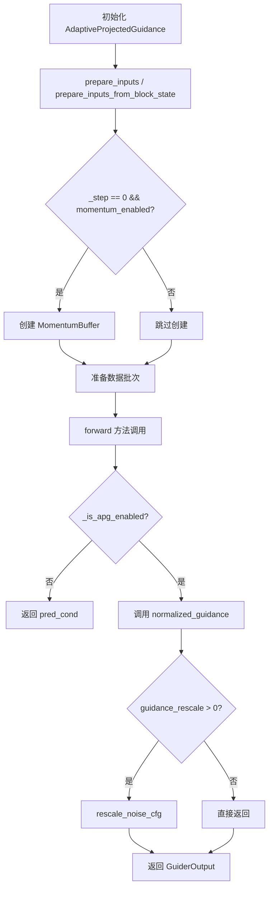
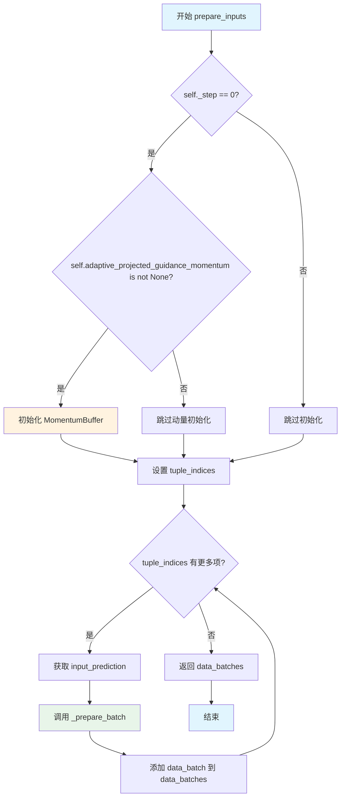
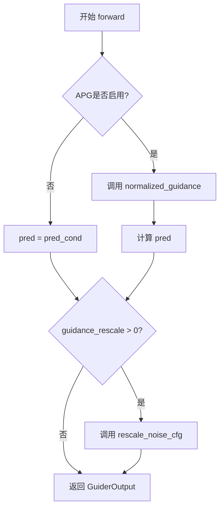
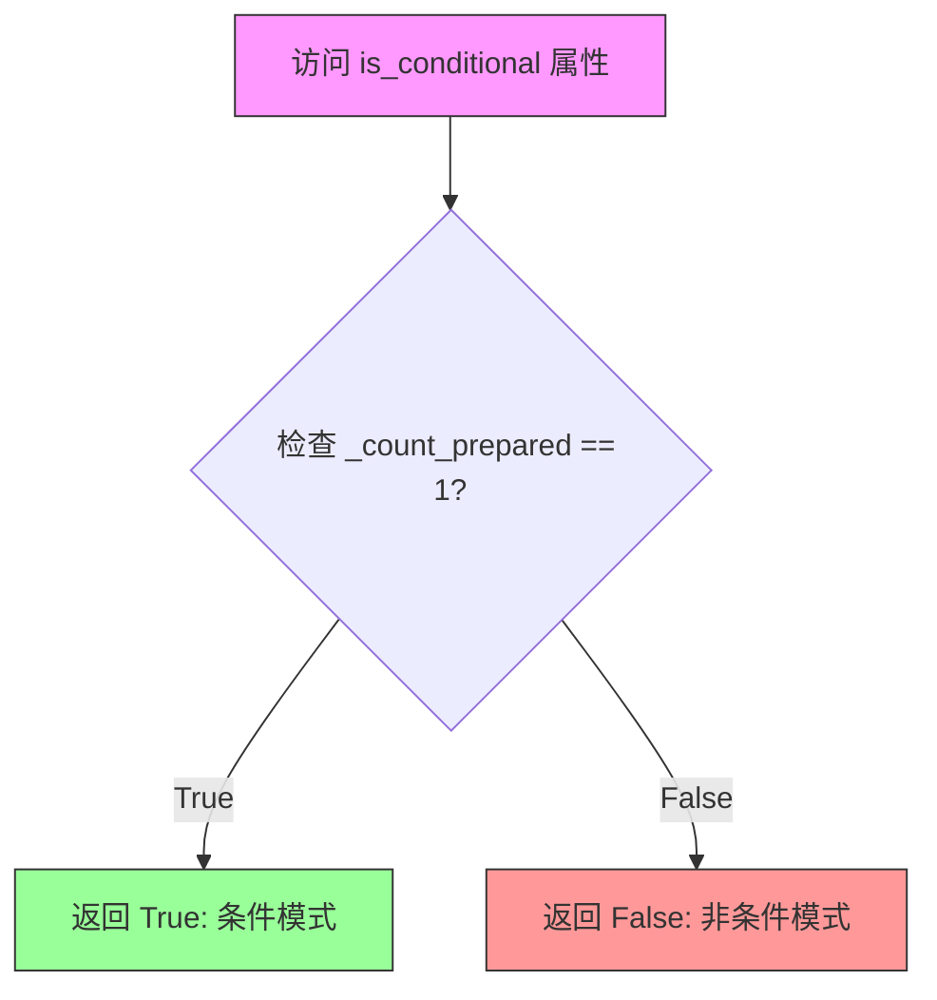
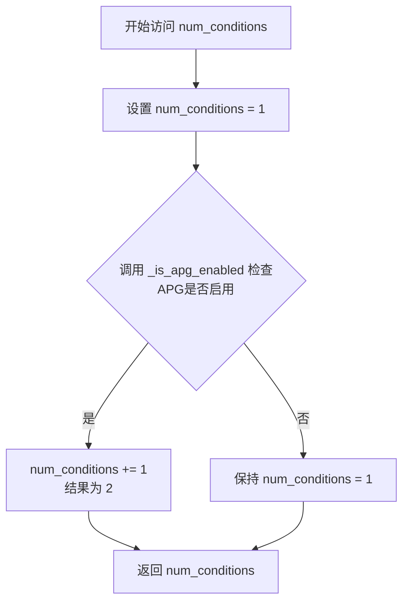
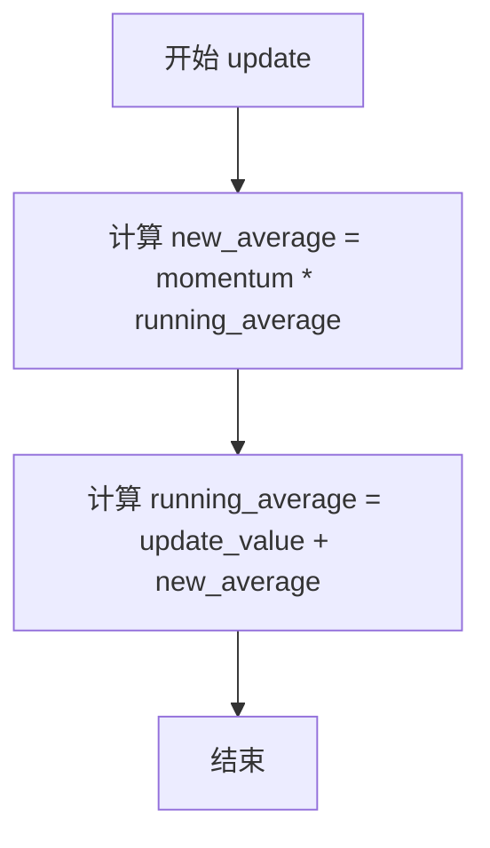
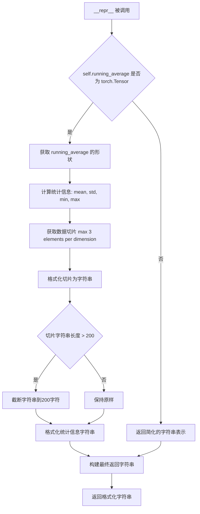

# `diffusers\src\diffusers\guiders\adaptive_projected_guidance.py` 详细设计文档

实现自适应投影引导(Adaptive Projected Guidance, APG)的模块，用于扩散模型的引导生成，通过调整条件和无条件预测之间的差异来改善生成质量，支持动量缓冲和噪声预测重缩放。

## 整体流程



## 类结构

```
BaseGuidance (抽象基类)
└── AdaptiveProjectedGuidance
    └── MomentumBuffer (内部类)
```

## 全局变量及字段


### `_input_predictions`
    
类属性，输入预测列表，包含条件预测和非条件预测的键名

类型：`list`
    


### `AdaptiveProjectedGuidance.guidance_scale`
    
分类器自由引导的缩放参数

类型：`float`
    


### `AdaptiveProjectedGuidance.adaptive_projected_guidance_momentum`
    
动量参数，用于自适应投影引导

类型：`float | None`
    


### `AdaptiveProjectedGuidance.adaptive_projected_guidance_rescale`
    
噪声预测的重缩放因子

类型：`float`
    


### `AdaptiveProjectedGuidance.eta`
    
平行分量权重

类型：`float`
    


### `AdaptiveProjectedGuidance.guidance_rescale`
    
噪声预测重缩放因子

类型：`float`
    


### `AdaptiveProjectedGuidance.use_original_formulation`
    
是否使用原始公式

类型：`bool`
    


### `AdaptiveProjectedGuidance.momentum_buffer`
    
动量缓冲器

类型：`MomentumBuffer | None`
    


### `AdaptiveProjectedGuidance._input_predictions`
    
输入预测列表

类型：`list`
    


### `AdaptiveProjectedGuidance._step`
    
当前步数

类型：`int`
    


### `AdaptiveProjectedGuidance._enabled`
    
是否启用

类型：`bool`
    


### `AdaptiveProjectedGuidance._start`
    
引导开始步数比例

类型：`float`
    


### `AdaptiveProjectedGuidance._stop`
    
引导停止步数比例

类型：`float`
    


### `AdaptiveProjectedGuidance._num_inference_steps`
    
推理总步数

类型：`int | None`
    


### `AdaptiveProjectedGuidance._count_prepared`
    
准备的数量

类型：`int`
    


### `MomentumBuffer.momentum`
    
动量系数

类型：`float`
    


### `MomentumBuffer.running_average`
    
运行时平均值

类型：`float | torch.Tensor`
    
    

## 全局函数及方法


### `normalized_guidance`

该函数实现了自适应投影 Guidance (APG) 的核心归一化 Guidance 计算逻辑，通过将条件预测与无条件预测的差值分解为平行和正交分量，并根据 eta 参数进行混合，最后结合 guidance_scale 输出增强后的预测结果。

参数：

- `pred_cond`：`torch.Tensor`，条件预测张量（通常为文本条件下的模型输出）
- `pred_uncond`：`torch.Tensor`，无条件预测张量（无文本条件下的模型输出）
- `guidance_scale`：`float`，Guidance 缩放因子，控制条件信息的增强程度
- `momentum_buffer`：`MomentumBuffer | None`，动量缓冲区对象，用于累积历史差值以稳定训练，可为 None
- `eta`：`float`，默认为 `1.0`，平行分量与正交分量的混合系数
- `norm_threshold`：`float`，默认为 `0.0`，差值张量的范数阈值，用于防止差值过大
- `use_original_formulation`：`bool`，默认为 `False`，是否使用原始的 classifier-free guidance 公式

返回值：`torch.Tensor`，应用归一化 Guidance 后的预测结果

#### 流程图

```mermaid
flowchart TD
    A[开始: normalized_guidance] --> B[计算差值 diff = pred_cond - pred_uncond]
    B --> C{是否存在 momentum_buffer?}
    C -->|是| D[更新 momentum_buffer.running_average]
    C -->|否| E[继续]
    D --> E
    E --> F{norm_threshold > 0?}
    F -->|是| G[计算 diff 的 L2 范数并限制最大值为 norm_threshold]
    G --> H[缩放 diff]
    F -->|否| I[继续]
    H --> I
    I --> J[转换为 double 类型]
    J --> K[归一化 pred_cond 得到 v1]
    K --> L[计算 v0 平行分量: v0_parallel = sum(v0 * v1) * v1]
    L --> M[计算 v0 正交分量: v0_orthogonal = v0 - v0_parallel]
    M --> N[计算 normalized_update = diff_orthogonal + eta * diff_parallel]
    N --> O{use_original_formulation?}
    O -->|是| P[pred = pred_cond]
    O -->|否| Q[pred = pred_uncond]
    P --> R[pred = pred + guidance_scale * normalized_update]
    Q --> R
    R --> S[返回 pred]
```

#### 带注释源码

```python
def normalized_guidance(
    pred_cond: torch.Tensor,
    pred_uncond: torch.Tensor,
    guidance_scale: float,
    momentum_buffer: MomentumBuffer | None = None,
    eta: float = 1.0,
    norm_threshold: float = 0.0,
    use_original_formulation: bool = False,
):
    """
    计算归一化的 Guidance 用于自适应投影 Guidance (APG)。
    
    该函数将条件预测和无条件预测的差值分解为平行于预测方向和正交于预测方向的分量，
    通过混合这两个分量来生成更稳定的 Guidance 信号。
    
    参数:
        pred_cond: 条件预测张量 (例如文本条件下的噪声预测)
        pred_uncond: 无条件预测张量 (无文本条件下的噪声预测)
        guidance_scale: Guidance 缩放因子
        momentum_buffer: 可选的动量缓冲区，用于累积历史差值
        eta: 平行与正交分量的混合系数
        norm_threshold: 差值范数的阈值，0 表示不限制
        use_original_formulation: 是否使用原始的 classifier-free guidance
    
    返回:
        应用 Guidance 后的预测张量
    """
    # 计算条件预测与无条件预测之间的差值
    diff = pred_cond - pred_uncond
    # 获取需要统计归一化维度的索引（除了 batch 维外的所有维度）
    dim = [-i for i in range(1, len(diff.shape))]

    # 如果提供了动量缓冲区，则更新并使用累积的平均差值
    if momentum_buffer is not None:
        momentum_buffer.update(diff)
        diff = momentum_buffer.running_average

    # 如果设置了范数阈值，则限制差值的最大范数以防止数值不稳定
    if norm_threshold > 0:
        ones = torch.ones_like(diff)
        diff_norm = diff.norm(p=2, dim=dim, keepdim=True)
        scale_factor = torch.minimum(ones, norm_threshold / diff_norm)
        diff = diff * scale_factor

    # 转换为 double 类型以提高计算精度
    v0, v1 = diff.double(), pred_cond.double()
    # 对条件预测进行 L2 归一化
    v1 = torch.nn.functional.normalize(v1, dim=dim)
    # 计算 diff 在预测方向上的投影（平行分量）
    v0_parallel = (v0 * v1).sum(dim=dim, keepdim=True) * v1
    # 计算正交分量（与预测方向垂直的分量）
    v0_orthogonal = v0 - v0_parallel
    # 转换回原始数据类型
    diff_parallel, diff_orthogonal = v0_parallel.type_as(diff), v0_orthogonal.type_as(diff)
    # 混合平行和正交分量得到归一化的更新量
    normalized_update = diff_orthogonal + eta * diff_parallel

    # 根据配置选择起始预测值（使用条件预测或无条件预测）
    pred = pred_cond if use_original_formulation else pred_uncond
    # 应用 guidance 缩放
    pred = pred + guidance_scale * normalized_update

    return pred
```


### AdaptiveProjectedGuidance.__init__

这是 `AdaptiveProjectedGuidance` 类的构造函数，负责初始化自适应投影引导（Adaptive Projected Guidance）算法的各项配置参数，包括引导缩放、动量、重缩放因子等，并调用父类构造函数完成基础初始化。

参数：

- `self`：类的实例对象，隐含参数
- `guidance_scale`：`float`，默认值 `7.5`，classifier-free guidance 的缩放参数，较高值会加强对文本提示的条件，较低值允许更多生成自由
- `adaptive_projected_guidance_momentum`：`float | None`，默认值 `None`，自适应投影引导的动量参数，设为 `None` 时禁用
- `adaptive_projected_guidance_rescale`：`float`，默认值 `15.0`，应用于噪声预测的重缩放因子，用于改善图像质量
- `eta`：`float`，默认值 `1.0`，与 DDIM 采样相关的参数，控制随机性
- `guidance_rescale`：`float`，默认值 `0.0`，噪声预测的重缩放因子，用于改善图像质量并修复过度曝光
- `use_original_formulation`：`bool`，默认值 `False`，是否使用论文中提出的原始 classifier-free guidance 公式
- `start`：`float`，默认值 `0.0`，引导开始的总去噪步骤比例
- `stop`：`float`，默认值 `1.0`，引导停止的总去噪步骤比例
- `enabled`：`bool`，默认值 `True`，是否启用引导

返回值：无（`None`），构造函数不返回值

#### 流程图

```mermaid
flowchart TD
    A[开始 __init__] --> B[调用 super().__init__]
    B --> C[设置 self.guidance_scale]
    C --> D[设置 self.adaptive_projected_guidance_momentum]
    D --> E[设置 self.adaptive_projected_guidance_rescale]
    E --> F[设置 self.eta]
    F --> G[设置 self.guidance_rescale]
    G --> H[设置 self.use_original_formulation]
    H --> I[初始化 self.momentum_buffer = None]
    I --> J[结束 __init__]
```

#### 带注释源码

```python
@register_to_config
def __init__(
    self,
    guidance_scale: float = 7.5,
    adaptive_projected_guidance_momentum: float | None = None,
    adaptive_projected_guidance_rescale: float = 15.0,
    eta: float = 1.0,
    guidance_rescale: float = 0.0,
    use_original_formulation: bool = False,
    start: float = 0.0,
    stop: float = 1.0,
    enabled: bool = True,
):
    """
    初始化 AdaptiveProjectedGuidance 实例。
    
    参数:
        guidance_scale: classifier-free guidance 缩放因子
        adaptive_projected_guidance_momentum: 动量参数，为 None 时禁用
        adaptive_projected_guidance_rescale: 自适应投影引导的重缩放因子
        eta: DDIM 采样参数，控制噪声水平
        guidance_rescale: 噪声预测重缩放因子
        use_original_formulation: 是否使用原始 CFG 公式
        start: 引导开始的步骤比例
        stop: 引导停止的步骤比例
        enabled: 是否启用引导
    """
    # 调用父类 BaseGuidance 的构造函数，初始化基础引导控制参数
    super().__init__(start, stop, enabled)

    # 设置 classifier-free guidance 缩放参数
    self.guidance_scale = guidance_scale
    
    # 设置自适应投影引导的动量参数（用于动量更新）
    self.adaptive_projected_guidance_momentum = adaptive_projected_guidance_momentum
    
    # 设置自适应投影引导的重缩放因子
    self.adaptive_projected_guidance_rescale = adaptive_projected_guidance_rescale
    
    # 设置 eta 参数（DDIM 采样相关）
    self.eta = eta
    
    # 设置噪声预测的重缩放因子
    self.guidance_rescale = guidance_rescale
    
    # 设置是否使用原始 CFG 公式的标志
    self.use_original_formulation = use_original_formulation
    
    # 初始化动量缓冲区为 None，在后续 prepare_inputs 中会根据需要创建
    self.momentum_buffer = None
```


### `AdaptiveProjectedGuidance.prepare_inputs`

该方法用于准备 Adaptive Projected Guidance (APG) 的输入数据。它在每个去噪步骤开始时检查是否需要初始化动量缓冲区，然后根据条件数量（条件/无条件）处理输入预测数据，调用内部方法 `_prepare_batch` 生成标准化的数据批次并返回。

**参数：**

- `self`：类的实例引用
- `data`：`dict[str, tuple[torch.Tensor, torch.Tensor]]`，包含预测数据的字典，键为字符串类型，值为两个张量的元组（通常为条件预测和无条件预测）

**返回值：** `list["BlockState"]`，返回 BlockState 对象列表，每个元素包含处理后的批次数据

#### 流程图



#### 带注释源码

```python
def prepare_inputs(self, data: dict[str, tuple[torch.Tensor, torch.Tensor]]) -> list["BlockState"]:
    """
    准备 Adaptive Projected Guidance 的输入数据。
    
    Args:
        data: 包含预测数据的字典，键为字符串，值为 (条件预测, 无条件预测) 元组
        
    Returns:
        BlockState 对象列表，包含处理后的批次数据
    """
    # 在第一步时初始化动量缓冲区（如果启用了动量）
    if self._step == 0:
        if self.adaptive_projected_guidance_momentum is not None:
            # 创建 MomentumBuffer 实例用于动量更新
            self.momentum_buffer = MomentumBuffer(self.adaptive_projected_guidance_momentum)
    
    # 根据条件数量决定处理的索引：
    # - 单一条件: 只处理索引 0
    # - 多条件: 处理索引 0 和 1（条件和无条件）
    tuple_indices = [0] if self.num_conditions == 1 else [0, 1]
    
    # 存储处理后的数据批次
    data_batches = []
    
    # 遍历每个索引和对应的输入预测类型
    for tuple_idx, input_prediction in zip(tuple_indices, self._input_predictions):
        # 调用内部方法准备单个批次数据
        data_batch = self._prepare_batch(data, tuple_idx, input_prediction)
        # 将批次添加到列表中
        data_batches.append(data_batch)
    
    # 返回所有数据批次
    return data_batches
```


### AdaptiveProjectedGuidance.prepare_inputs_from_block_state

该方法是自适应投影引导（Adaptive Projected Guidance）的输入准备函数，从 BlockState 中提取并处理引导所需的预测数据。它在每个去噪步骤开始时初始化动量缓冲区，根据条件数量遍历处理条件预测（pred_cond）和无条件预测（pred_uncond），最终返回处理后的 BlockState 列表供后续引导计算使用。

参数：

- `self`：隐式参数，AdaptiveProjectedGuidance 类实例，表示当前的自适应投影引导对象
- `data`：`BlockState`，包含去噪过程中的块状态数据，如潜在表示、时间步等信息
- `input_fields`：`dict[str, str | tuple[str, str]]`，字典类型，键为字符串，值为字符串或字符串元组，定义了从 BlockState 中提取输入字段的映射关系（例如 {"pred_cond": "latents"} 或 {"pred_cond": ("latents", "text_embeddings")}）

返回值：`list["BlockState"]`，返回处理后的 BlockState 对象列表，每个元素对应一个预测类型的批处理数据

#### 流程图

```mermaid
flowchart TD
    A[开始 prepare_inputs_from_block_state] --> B{self._step == 0?}
    B -->|是| C{adaptive_projected_guidance_momentum is not None?}
    B -->|否| D[tuple_indices = [0] if num_conditions == 1 else [0, 1]]
    C -->|是| E[初始化 MomentumBuffer]
    C -->|否| D
    E --> D
    D --> F[初始化空列表 data_batches]
    F --> G{遍历 tuple_indices 和 _input_predictions}
    G -->|还有元素| H[调用 _prepare_batch_from_block_state]
    H --> I[将 data_batch 加入 data_batches]
    I --> G
    G -->|遍历完成| J[返回 data_batches]
```

#### 带注释源码

```python
def prepare_inputs_from_block_state(
    self, data: "BlockState", input_fields: dict[str, str | tuple[str, str]]
) -> list["BlockState"]:
    """
    从 BlockState 准备引导所需的输入数据。
    
    参数:
        data: BlockState 对象，包含去噪过程中的块状态数据
        input_fields: 字典，定义从 BlockState 中提取字段的映射关系
    
    返回:
        处理后的 BlockState 对象列表
    """
    # 如果是去噪的第一步（_step == 0），可能需要初始化动量缓冲区
    if self._step == 0:
        # 检查是否启用了自适应投影引导的动量机制
        if self.adaptive_projected_guidance_momentum is not None:
            # 创建动量缓冲区，用于维护预测差异的指数移动平均
            self.momentum_buffer = MomentumBuffer(self.adaptive_projected_guidance_momentum)
    
    # 根据条件数量确定需要处理的预测类型索引
    # 如果只有一个条件（num_conditions == 1），只需处理索引0
    # 否则需要处理索引0和1，分别对应条件和无条件预测
    tuple_indices = [0] if self.num_conditions == 1 else [0, 1]
    
    # 初始化存储处理后数据块的列表
    data_batches = []
    
    # 遍历每个预测类型（pred_cond, pred_uncond）
    for tuple_idx, input_prediction in zip(tuple_indices, self._input_predictions):
        # 调用内部方法从 BlockState 中提取并批处理指定字段
        data_batch = self._prepare_batch_from_block_state(
            input_fields,   # 输入字段映射字典
            data,           # 原始 BlockState 数据
            tuple_idx,      # 元组索引
            input_prediction # 预测类型名称
        )
        # 将处理后的数据块添加到列表中
        data_batches.append(data_batch)
    
    # 返回所有处理后的 BlockState 数据块
    return data_batches
```


### AdaptiveProjectedGuidance.forward

该方法是 Adaptive Projected Guidance (APG) 引导器的核心前向传播方法，负责根据条件预测和无条件预测计算最终的引导输出。它首先检查APG是否启用，若未启用则直接返回条件预测；若启用则调用normalized_guidance函数进行投影引导计算，最后根据需要应用噪声配置重新缩放以改善图像质量。

参数：

- `self`：`AdaptiveProjectedGuidance`，隐含的类实例，包含配置参数如guidance_scale、adaptive_projected_guidance_rescale、use_original_formulation等
- `pred_cond`：`torch.Tensor`，条件预测，来自有条件UNet模型的预测结果，表示在文本提示条件下生成的噪声预测
- `pred_uncond`：`torch.Tensor | None`，无条件预测，来自无条件UNet模型的预测结果（无文本条件），用于计算引导方向；若为None则表示APG未启用

返回值：`GuiderOutput`，包含三个属性的命名元组：
- `pred`：最终处理后的预测张量
- `pred_cond`：原始条件预测的引用
- `pred_uncond`：原始无条件预测的引用

#### 流程图



#### 带注释源码

```python
def forward(self, pred_cond: torch.Tensor, pred_uncond: torch.Tensor | None = None) -> GuiderOutput:
    """
    执行 Adaptive Projected Guidance 的前向传播。
    
    Args:
        pred_cond: 条件预测张量，来自有条件模型
        pred_uncond: 无条件预测张量，来自无条件模型，可为None
    
    Returns:
        包含预测结果的 GuiderOutput 对象
    """
    # 初始化预测结果为None
    pred = None

    # 检查APG是否启用（根据_enabled、step范围、guidance_scale判断）
    if not self._is_apg_enabled():
        # APG未启用时，直接返回条件预测（无引导）
        pred = pred_cond
    else:
        # APG启用时，调用normalized_guidance进行投影引导计算
        pred = normalized_guidance(
            pred_cond,
            pred_uncond,
            self.guidance_scale,          # CFG引导强度
            self.momentum_buffer,        # 动量缓冲（用于APG动量更新）
            self.eta,                     # 并行分量权重
            self.adaptive_projected_guidance_rescale,  # APG重缩放因子
            self.use_original_formulation,  # 是否使用原始CFG公式
        )

    # 如果配置了guidance_rescale，应用噪声配置重缩放
    # 基于Common Diffusion Noise Schedules论文的方法
    if self.guidance_rescale > 0.0:
        pred = rescale_noise_cfg(pred, pred_cond, self.guidance_rescale)

    # 返回GuiderOutput对象，包含最终预测及原始输入的引用
    return GuiderOutput(pred=pred, pred_cond=pred_cond, pred_uncond=pred_uncond)
```


### `AdaptiveProjectedGuidance.is_conditional`

该属性用于判断当前引导配置是否为条件模式，通过检查已准备好的条件数量是否等于1来确定；当仅有一个条件准备完成时返回True，表示启用条件引导；当有两个条件（条件预测和无条件预测）准备完成时返回False，表示启用无分类器引导模式。

参数： （该属性为只读属性，无参数）

返回值：`bool`，返回 `True` 表示当前为条件模式（仅一个条件），返回 `False` 表示为非条件模式（两个条件）

#### 流程图



#### 带注释源码

```python
@property
def is_conditional(self) -> bool:
    """
    判断当前引导是否为条件模式。
    
    该属性检查已准备好的条件数量：
    - 当 _count_prepared == 1 时，返回 True，表示仅有一个条件预测可用，
      启用条件引导模式（conditional guidance）
    - 当 _count_prepared != 1 时，返回 False，表示有两个条件预测可用，
      启用无分类器引导模式（classifier-free guidance）
    
    Returns:
        bool: True 表示条件模式，False 表示非条件模式
    """
    return self._count_prepared == 1
```

#### 关联信息

**相关类字段：**

- `_count_prepared`（继承自 `BaseGuidance`）：`int`，记录已准备好的条件预测数量，用于判断当前引导类型

**调用关系：**
- 该属性被 `prepare_inputs` 和 `prepare_inputs_from_block_state` 方法使用，用于确定 `tuple_indices` 的值
- 当 `is_conditional` 为 True 时，`tuple_indices = [0]`，仅处理条件预测
- 当 `is_conditional` 为 False 时，`tuple_indices = [0, 1]`，同时处理条件预测和无条件预测

**设计意图：**
该属性是自适应投影引导（APG）实现中的关键判断逻辑，用于在条件引导和无分类器引导之间动态切换，确保在不同训练阶段使用正确的引导策略。


### `AdaptiveProjectedGuidance.num_conditions`

这是一个属性方法，用于返回自适应投影引导（APG）中的条件数量。当APG启用时，返回2（包含条件预测和无条件预测）；当APG禁用时，返回1（仅条件预测）。

参数：

- 无（该方法为属性访问器，仅使用隐式参数 `self`）

返回值：`int`，返回条件数量。当APG启用时为2，否则为1。

#### 流程图



#### 带注释源码

```python
@property
def num_conditions(self) -> int:
    """
    返回自适应投影引导（APG）中的条件数量。
    
    该属性决定了在准备输入时需要处理多少个预测副本。
    - 当APG禁用时：只需处理条件预测（num_conditions=1）
    - 当APG启用时：需要同时处理条件预测和无条件预测（num_conditions=2）
    
    Returns:
        int: 条件数量，值为1或2
    """
    # 初始化基础条件数量为1（条件预测）
    num_conditions = 1
    
    # 检查APG是否启用，如果启用则条件数量加1
    # 启用APG时需要额外的无条件预测进行引导计算
    if self._is_apg_enabled():
        num_conditions += 1
    
    # 返回最终的条件数量
    return num_conditions
```


### AdaptiveProjectedGuidance._is_apg_enabled

该方法用于判断 Adaptive Projected Guidance (APG) 是否在当前推理步骤中启用，通过检查引导是否启用、当前步骤是否在配置的范围内，以及 guidance_scale 是否接近临界值（0.0 或 1.0，取决于公式版本）来决定是否应用 APG。

参数：无（仅使用 self 实例属性）

返回值：`bool`，返回 True 表示 APG 将在当前步骤启用，返回 False 表示不启用

#### 流程图

```mermaid
flowchart TD
    A[开始] --> B{self._enabled 是否为 True?}
    B -->|否| C[返回 False]
    B -->|是| D{self._num_inference_steps 是否为 None?}
    D -->|是| E[is_within_range = True]
    D -->|否| F[计算 skip_start_step = int(self._start * self._num_inference_steps)]
    F --> G[计算 skip_stop_step = int(self._stop * self._num_inference_steps)]
    G --> H{skip_start_step <= self._step < skip_stop_step?}
    H -->|是| E
    H -->|否| I[is_within_range = False]
    E --> J{self.use_original_formulation 是否为 True?}
    I --> J
    J -->|是| K[is_close = math.isclose(self.guidance_scale, 0.0)]
    J -->|否| L[is_close = math.isclose(self.guidance_scale, 1.0)]
    K --> M[返回 is_within_range and not is_close]
    L --> M
```

#### 带注释源码

```python
def _is_apg_enabled(self) -> bool:
    """
    判断 Adaptive Projected Guidance (APG) 是否在当前推理步骤中启用。
    
    APG 启用的条件包括：
    1. 引导功能已启用（self._enabled 为 True）
    2. 当前推理步骤在配置的 [start, stop) 范围内
    3. guidance_scale 不接近临界值（使用原始公式时为 0.0，否则为 1.0）
    
    Returns:
        bool: 如果 APG 应该启用返回 True，否则返回 False
    """
    # 步骤1: 检查引导功能是否全局启用
    if not self._enabled:
        return False

    # 步骤2: 检查当前推理步骤是否在配置的 [start, stop) 范围内
    is_within_range = True
    if self._num_inference_steps is not None:
        # 计算跳过起始步骤和停止步骤的索引
        # start 和 stop 为 0.0-1.0 的分数，转换为实际步骤数
        skip_start_step = int(self._start * self._num_inference_steps)
        skip_stop_step = int(self._stop * self._num_inference_steps)
        # 判断当前步骤是否在 [start, stop) 区间内
        is_within_range = skip_start_step <= self._step < skip_stop_step

    # 步骤3: 检查 guidance_scale 是否接近临界值
    # 当 guidance_scale 接近临界值时，APG 的效果近似于无条件生成，
    # 因此不需要额外的引导计算
    is_close = False
    if self.use_original_formulation:
        # 原始公式中，无条件生成的 guidance_scale 为 0.0
        is_close = math.isclose(self.guidance_scale, 0.0)
    else:
        # Diffusers 原生实现中，无条件生成的 guidance_scale 为 1.0
        is_close = math.isclose(self.guidance_scale, 1.0)

    # 综合判断：必须在步骤范围内，且 guidance_scale 不接近临界值
    return is_within_range and not is_close
```


### `MomentumBuffer.update`

该方法用于更新动量缓冲区的运行平均值，采用指数移动平均（EMA）策略，将当前更新值与历史动量值进行加权融合，以实现平滑的梯度或预测值累积效果。

参数：

- `update_value`：`torch.Tensor`，需要累加到动量缓冲区的新值，通常为条件预测与非条件预测之间的差异

返回值：`None`，该方法直接修改对象内部状态，不返回任何值

#### 流程图



#### 带注释源码

```python
def update(self, update_value: torch.Tensor):
    """
    使用指数移动平均策略更新运行平均值。

    该方法实现了一个简化的动量累积器，其更新公式为：
    running_average = update_value + momentum * running_average

    这相当于标准的指数移动平均（EMA）：
    EMA_t = (1 - momentum) * value_t + momentum * EMA_{t-1}

    当 momentum = 0 时，running_average 会完全被 update_value 替换；
    当 momentum 接近 1 时，历史值会被保留更多。

    参数:
        update_value (torch.Tensor): 新的更新值，通常是当前批次的预测差异或梯度
    """
    # 计算历史动量贡献：将动量系数与当前运行平均值相乘
    new_average = self.momentum * self.running_average
    
    # 更新运行平均值：将新值与历史动量贡献相加
    # 这实现了：当前值 + 动量 * 历史累积值
    self.running_average = update_value + new_average
```


### `MomentumBuffer.__repr__`

该方法用于返回 `MomentumBuffer` 对象的字符串表示形式，展示动量参数、张量形状、统计信息（均值、标准差、最小值、最大值）以及 `running_average` 的数据切片，以便于调试和可视化内部状态。

参数：
- 无（仅包含 `self`）

返回值：`str`，包含动量值、形状、统计信息和数据切片的格式化字符串

#### 流程图



#### 带注释源码

```python
def __repr__(self) -> str:
    """
    Returns a string representation showing momentum, shape, statistics, and a slice of the running_average.
    """
    # 检查 running_average 是否为 torch.Tensor 类型
    if isinstance(self.running_average, torch.Tensor):
        # 获取张量的形状元组
        shape = tuple(self.running_average.shape)

        # 计算统计信息（使用 no_grad 避免构建计算图）
        with torch.no_grad():
            stats = {
                "mean": self.running_average.mean().item(),      # 计算均值并转为Python标量
                "std": self.running_average.std().item(),        # 计算标准差并转为Python标量
                "min": self.running_average.min().item(),        # 获取最小值并转为Python标量
                "max": self.running_average.max().item(),        # 获取最大值并转为Python标量
            }

        # 获取切片索引（每个维度最多取3个元素）
        slice_indices = tuple(slice(None, min(3, dim)) for dim in shape)
        # 根据切片索引提取数据
        sliced_data = self.running_average[slice_indices]

        # 格式化切片显示字符串（转换为float32以兼容bfloat16）
        slice_str = str(sliced_data.detach().float().cpu().numpy())
        # 如果字符串过长则截断
        if len(slice_str) > 200:  # Truncate if too long
            slice_str = slice_str[:200] + "..."

        # 格式化统计信息为 key=value 形式，保留4位小数
        stats_str = ", ".join([f"{k}={v:.4f}" for k, v in stats.items()])

        # 返回完整的字符串表示
        return (
            f"MomentumBuffer(\n"
            f"  momentum={self.momentum},\n"
            f"  shape={shape},\n"
            f"  stats=[{stats_str}],\n"
            f"  slice={slice_str}\n"
            f")"
        )
    else:
        # 当 running_average 不是张量时，返回简化表示
        return f"MomentumBuffer(momentum={self.momentum}, running_average={self.running_average})"
```

#### 类的详细信息

##### `MomentumBuffer` 类

| 字段/方法 | 类型 | 描述 |
|-----------|------|------|
| `momentum` | `float` | 动量系数，用于指数移动平均的计算 |
| `running_average` | `torch.Tensor \| int` | 累积的移动平均值，存储动量更新后的结果 |
| `__init__` | 方法 | 初始化动量缓冲区和运行平均值 |
| `update` | 方法 | 根据输入张量更新运行平均值 |
| `__repr__` | 方法 | 返回对象的字符串表示，用于调试 |

#### 关键组件信息

- **MomentumBuffer**: 动量缓冲区类，用于在自适应投影引导（APG）中累积和维护噪声预测的移动平均值
- **running_average**: 核心状态变量，存储经过动量平滑后的差值向量
- **统计信息**: 包含 mean、std、min、max，用于监控数值范围和分布

#### 潜在的技术债务或优化空间

1. **硬编码阈值**: 切片长度限制 200 和每维度最大 3 个元素为硬编码值，可考虑提取为类属性或配置参数
2. **统计计算开销**: 每次 `__repr__` 调用都会计算统计信息，可能带来性能开销，建议添加缓存机制或仅在调试模式启用
3. **float32 转换**: 强制转换为 float32 可能丢失 bfloat16 的精度信息，考虑保留原始数据类型或提供配置选项

#### 其它项目

- **设计目标**: 提供清晰的对象内部状态可视化，便于调试和监控 APG 引导过程中的数值变化
- **错误处理**: 假设输入为合法张量或数值类型，未对异常输入进行显式处理
- **外部依赖**: 依赖 PyTorch 张量操作，需确保运行环境已安装 torch

## 关键组件


### AdaptiveProjectedGuidance

自适应投影引导（APG）主类，继承自BaseGuidance，实现扩散模型的噪声预测引导功能。通过归一化条件与无条件预测的差值，并结合动量缓冲机制，提升图像生成质量。

### MomentumBuffer

动量缓冲器类，用于存储和管理APG的动量状态。通过指数移动平均更新running_average，支持在推理过程中累积和平滑预测差异。

### normalized_guidance

核心引导计算函数，执行归一化引导逻辑。计算条件与无条件预测的差异，应用动量缓冲和阈值归一化，将更新分解为正交和平行分量，最后将归一化更新叠加到基础预测上。

### _is_apg_enabled

APG启用状态判断方法，检查引导是否在当前推理步骤范围内（由start和stop参数控制），并验证guidance_scale是否满足启用条件。

### forward

前向传播方法，根据是否启用APG执行不同的引导策略，调用normalized_guidance计算引导后的预测，并可选地应用噪声预测重缩放。

### prepare_inputs / prepare_inputs_from_block_state

输入准备方法，从数据字典或BlockState中提取条件和无条件预测，初始化动量缓冲，并返回处理后的数据批次列表。


## 问题及建议


### 已知问题

-   **参数命名不一致**：`__init__` 中定义 `adaptive_projected_guidance_rescale` 参数，但在 `forward` 方法调用 `normalized_guidance` 时传入的参数名是 `norm_threshold`，导致代码阅读困难且容易混淆。
-   **重复初始化逻辑**：`prepare_inputs` 和 `prepare_inputs_from_block_state` 方法中都包含完全相同的 momentum_buffer 初始化代码（`if self._step == 0: ...`），违反 DRY 原则。
-   **类型注解与实际返回类型不符**：`prepare_inputs` 和 `prepare_inputs_from_block_state` 方法声明返回 `list["BlockState"]`，但实际返回的是从 `_prepare_batch` 和 `_prepare_batch_from_block_state` 生成的数据，类型可能不匹配。
-   **属性计算未缓存**：`num_conditions` 属性每次调用都会重新计算逻辑（`if self._is_apg_enabled(): num_conditions += 1`），在频繁调用场景下会产生不必要的性能开销。
-   **精度转换开销**：`normalized_guidance` 函数中将张量显式转换为 `double()` 进行计算，然后再通过 `type_as()` 转回原类型，这种双重转换会增加内存和计算开销，特别是对于大尺寸张量。
-   **魔法数字**：`normalized_guidance` 中的 `dim = [-i for i in range(1, len(diff.shape))]` 逻辑不够直观，且没有注释说明其用途。
-   **缺失错误处理**：MomentumBuffer 的 `update` 方法直接进行张量运算，没有对输入进行有效性检查（如是否为 None、维度是否匹配等）。
-   **文档不完整**：类中多个方法（如 `prepare_inputs`、`prepare_inputs_from_block_state`、`forward`）缺少详细的文档字符串，特别是参数和返回值的描述。

### 优化建议

-   **统一参数命名**：将 `normalized_guidance` 函数的 `norm_threshold` 参数重命名为 `adaptive_projected_guidance_rescale`，或在 `__init__` 中添加 `norm_threshold` 参数以保持一致性。
-   **提取公共初始化逻辑**：将 momentum_buffer 的初始化逻辑提取到基类或单独的方法中，例如在 `__init__` 中直接初始化，或创建 `_initialize_momentum` 私有方法。
-   **使用缓存优化属性**：使用 `@functools.cached_property` 或手动缓存机制优化 `num_conditions` 属性，避免重复计算。
-   **优化精度转换**：考虑使用 `to(dtype=torch.float64)` 或在输入已经是 float64 时避免转换，或使用就地操作减少内存分配。
-   **添加类型验证**：在 `MomentumBuffer.update` 方法中添加输入验证，检查 `update_value` 是否为有效的 torch.Tensor。
-   **完善文档**：为所有公共方法添加完整的 docstring，包括参数类型、返回值类型和详细描述。
-   **提取魔法数字**：将 `dim` 的计算逻辑封装为有明确语义的函数或常量，例如 `get_feature_dims(tensor)`。

## 其它


### 设计目标与约束

本模块实现自适应投影引导（APG）算法，旨在提升扩散模型的生成质量。其核心目标包括：1）通过动量机制稳定引导信号，减少生成过程中的抖动；2）支持条件与非条件预测的正交分解，实现更精细的引导控制；3）提供灵活的配置选项以适应不同的生成场景。设计约束包括：依赖PyTorch张量操作，需在GPU环境运行以保证性能；动量缓冲仅在`adaptive_projected_guidance_momentum`非None时初始化；引导功能在`guidance_scale`接近0（原始公式）或1（改进公式）时自动禁用。

### 错误处理与异常设计

本模块的错误处理设计遵循以下原则：1）类型检查：输入预测张量需为`torch.Tensor`类型，非张量输入将在操作时抛出`TypeError`；2）形状兼容性：条件预测与无条件预测的形状需一致，否则在减法操作时抛出`RuntimeError`；3）数值安全：动量更新使用`torch.no_grad()`避免梯度追踪；4）边界保护：`start`和`stop`参数需在[0,1]范围内，超出范围时行为未定义；5）空值处理：`momentum_buffer`仅在使用时创建，调用方需确保`forward`方法调用前已通过`prepare_inputs`或`prepare_inputs_from_block_state`初始化。

### 数据流与状态机

模块的数据流如下：初始化阶段（`__init__`）→ 输入准备阶段（`prepare_inputs`/`prepare_inputs_from_block_state`）→ 前向传播阶段（`forward`）→ 输出生成（`GuiderOutput`）。状态机包含以下状态：1）禁用状态（`_enabled=False`），此时`forward`直接返回条件预测；2）引导范围外状态（step未在[start×steps, stop×steps)区间），此时视为禁用；3）引导激活状态，正常执行归一化引导逻辑；4）动量更新状态（仅当momentum非None且step=0时初始化缓冲）。每次调用`forward`后，内部step计数器递增。

### 外部依赖与接口契约

本模块依赖以下外部组件：1）`BaseGuidance`基类：提供配置注册、启用状态管理、step计数等基础功能；2）`GuiderOutput`：标准输出数据结构，包含pred、pred_cond、pred_uncond字段；3）`rescale_noise_cfg`：来自guider_utils的工具函数，用于噪声预测重新缩放；4）`MomentumBuffer`：内部辅助类，用于动量计算；5）PyTorch库：所有张量操作依赖torch。接口契约要求：输入的`pred_cond`和`pred_uncond`需为4D张量（B,C,H,W）或更高维度；`guidance_scale`需为正数；`eta`需在[0,1]范围内；`adaptive_projected_guidance_rescale`需为非负数。

### 版本历史与变更记录

本模块为diffusers库的一部分，遵循Apache 2.0许可证。代码头部标注2025年HuggingFace Team版权。基于论文https://huggingface.co/papers/2410.02416实现。初始版本包含完整的APG算法实现，包括动量缓冲、正交分解引导、噪声预测重新缩放等功能。

### 性能考虑与基准测试

性能优化要点：1）动量更新使用in-place操作减少内存分配；2）张量运算尽量使用广播机制避免显式循环；3）统计信息计算使用`torch.no_grad()`避免不必要的梯度追踪；4）长切片输出进行截断以控制字符串表示长度。基准测试建议：评估不同`guidance_scale`值对生成质量的影响；测试`adaptive_projected_guidance_momentum`对收敛稳定性的作用；比较`use_original_formulation=True/False`的生成效果差异。

### 安全性考虑

安全措施包括：1）输入张量形状验证（建议在调用前完成）；2）数值范围检查（NaN/Inf检测）；3）内存安全：动量缓冲在step=0时重新初始化，避免状态污染；4）线程安全：本模块非线程安全，多线程场景需外部加锁。

### 使用示例与最佳实践

典型使用场景：1）文生图扩散模型的条件生成；2）图像修复/编辑任务的条件引导。最佳实践：1）`guidance_scale`建议范围[5.0, 12.5]，过高导致饱和；2）`adaptive_projected_guidance_momentum`建议值[0.1, 0.5]；3）`start`和`stop`用于延迟引导或提前终止引导，建议根据具体任务调优；4）在CPU环境运行时应注意内存限制。

### 兼容性考虑

本模块与diffusers库的其他guider实现兼容（如ClassifierFreeGuidance）。API设计遵循BaseGuidance基类接口，确保可互换使用。版本兼容性：Python 3.8+、PyTorch 2.0+。不支持JIT编译场景下的某些动态类型操作。

### 测试策略

建议测试用例：1）单元测试：验证`forward`方法在各种配置下的输出维度；2）集成测试：与完整pipeline联调验证生成效果；3）边界测试：`start=0, stop=1, guidance_scale=0`场景；4）性能测试：批处理场景下的吞吐量；5）回归测试：确保动量缓冲在step重置后正确初始化。


    