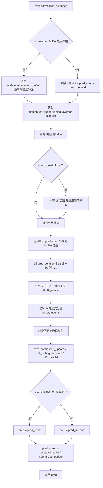
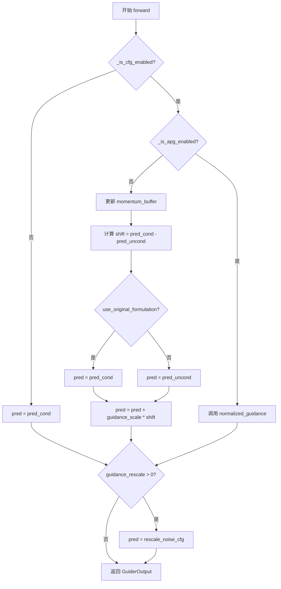
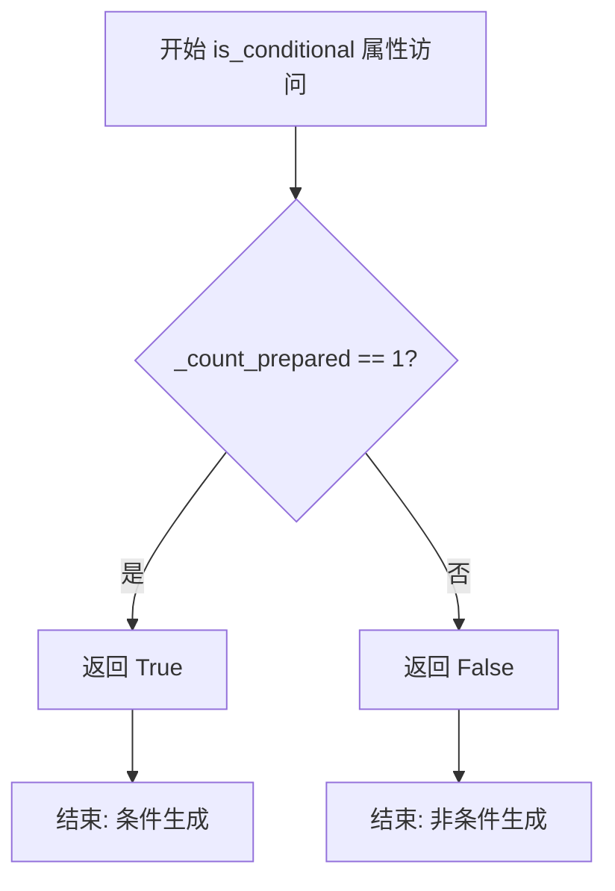
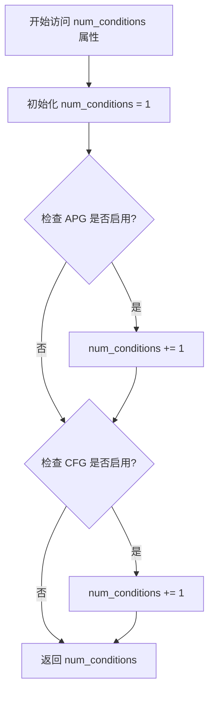
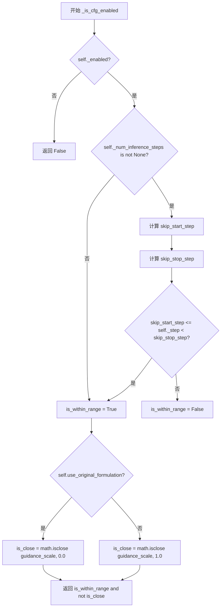
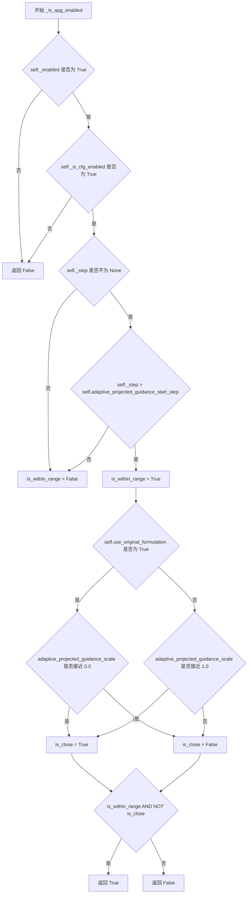
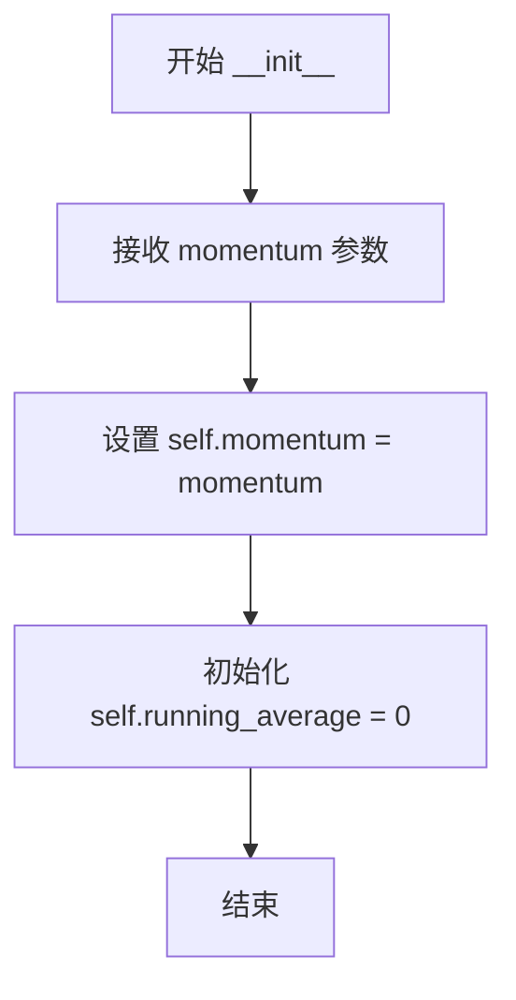
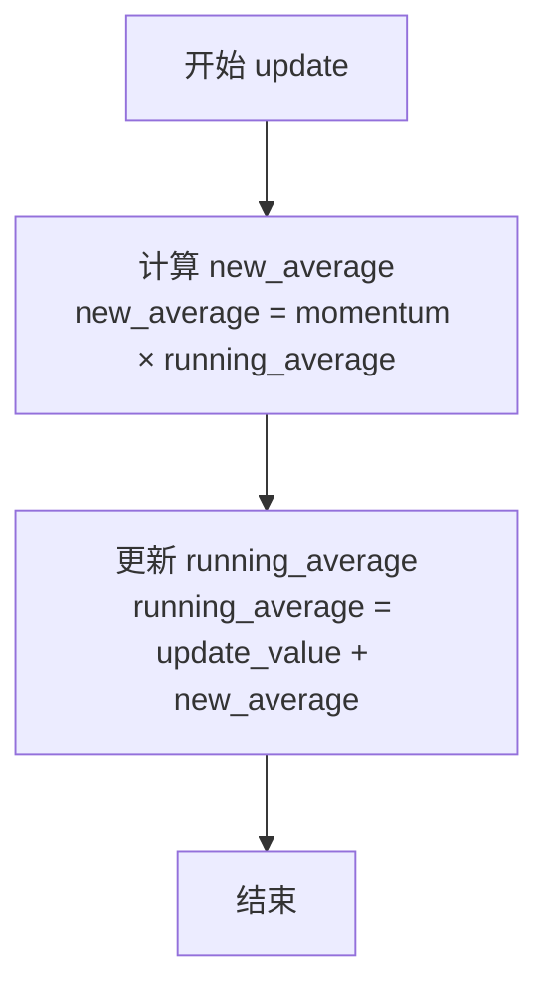
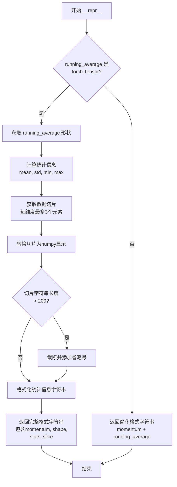

# `diffusers\src\diffusers\guiders\adaptive_projected_guidance_mix.py` 详细设计文档

该文件实现了一个名为 AdaptiveProjectedMixGuidance 的引导器类，它结合了自适应投影引导 (APG) 和无分类器引导 (CFG)，用于扩散模型的图像生成。核心逻辑是根据去噪步骤动态选择使用 CFG 或 APG，并通过动量缓冲区优化投影方向，以提升生成图像的质量和遵循文本提示的能力。

## 整体流程

```mermaid
graph TD
    A[开始 forward] --> B{_is_cfg_enabled()?}
    B -- 否 --> C[直接返回 pred_cond]
    B -- 是 --> D{_is_apg_enabled()?}
    D -- 否 (CFG模式) --> E{有 momentum_buffer?}
    E -- 是 --> F[调用 update_momentum_buffer]
    E -- 否 --> G[计算 shift = pred_cond - pred_uncond]
    F --> G
    G --> H[应用 CFG: pred = pred_uncond + scale * shift]
    D -- 是 (APG模式) --> I[调用 normalized_guidance]
    H --> J{guidance_rescale > 0?}
    I --> J
    J -- 是 --> K[调用 rescale_noise_cfg]
    J -- 否 --> L[封装并返回 GuiderOutput]
    K --> L
    C --> L
```

## 类结构

```
BaseGuidance (抽象基类)
└── AdaptiveProjectedMixGuidance
MomentumBuffer (辅助工具类)
```

## 全局变量及字段


### `_input_predictions`
    
内部使用的输入预测键名列表，包含条件预测和非条件预测的标识符

类型：`list[str]`
    


### `AdaptiveProjectedMixGuidance.guidance_scale`
    
无分类器引导 (CFG) 的强度系数，控制文本提示对生成结果的影响程度

类型：`float`
    


### `AdaptiveProjectedMixGuidance.guidance_rescale`
    
用于改善图像质量的噪声预测重缩放因子，基于Section 3.4的噪声调度改进

类型：`float`
    


### `AdaptiveProjectedMixGuidance.adaptive_projected_guidance_scale`
    
自适应投影引导 (APG) 的强度系数，控制APG对生成结果的影响程度

类型：`float`
    


### `AdaptiveProjectedMixGuidance.adaptive_projected_guidance_momentum`
    
APG的动量参数，用于动量缓冲区的指数移动平均计算

类型：`float`
    


### `AdaptiveProjectedMixGuidance.adaptive_projected_guidance_rescale`
    
APG的重缩放因子，用于调整噪声预测以改善图像质量

类型：`float`
    


### `AdaptiveProjectedMixGuidance.eta`
    
APG中平行分量的权重，控制平行分量在规范化引导中的比例

类型：`float`
    


### `AdaptiveProjectedMixGuidance.use_original_formulation`
    
是否使用原始CFG公式，默认为False使用diffusers原生实现

类型：`bool`
    


### `AdaptiveProjectedMixGuidance.start`
    
引导开始生效的步数比例，表示总去噪步数的起始百分比

类型：`float`
    


### `AdaptiveProjectedMixGuidance.stop`
    
引导停止生效的步数比例，表示总去噪步数的结束百分比

类型：`float`
    


### `AdaptiveProjectedMixGuidance.adaptive_projected_guidance_start_step`
    
APG开始执行的步数，在此之前仅使用CFG并更新动量缓冲区

类型：`int`
    


### `AdaptiveProjectedMixGuidance.enabled`
    
是否启用该引导器，控制整个引导过程的激活状态

类型：`bool`
    


### `AdaptiveProjectedMixGuidance.momentum_buffer`
    
用于存储APG动量计算结果的缓冲区，包含运行平均值和动量参数

类型：`MomentumBuffer`
    


### `AdaptiveProjectedMixGuidance._input_predictions`
    
内部使用的输入预测键名列表，定义了条件预测和非条件预测的标识

类型：`list[str]`
    


### `MomentumBuffer.momentum`
    
动量衰减系数，用于指数移动平均计算的控制参数

类型：`float`
    


### `MomentumBuffer.running_average`
    
累积的预测差异动量，存储条件与非条件预测之间的差值动量

类型：`torch.Tensor`
    
    

## 全局函数及方法


### `update_momentum_buffer`

该函数用于计算条件预测与无条件的差异，并可选地通过 MomentumBuffer 更新动量缓冲区，以支持自适应投影Guidance（APG）中的动量累积机制。

参数：

- `pred_cond`：`torch.Tensor`，条件预测（guided prediction），即基于文本提示的模型输出
- `pred_uncond`：`torch.Tensor`，无条件的预测（unconditioned prediction），即不带文本提示的模型输出
- `momentum_buffer`：`MomentumBuffer | None`，动量缓冲区对象，用于存储和更新预测差异的移动平均值，传入 `None` 时仅计算差异但不更新缓冲区

返回值：`None`，该函数直接修改 `momentum_buffer` 内部状态，无显式返回值

#### 流程图

```mermaid
flowchart TD
    A[开始 update_momentum_buffer] --> B[计算 diff = pred_cond - pred_uncond]
    B --> C{检查 momentum_buffer 是否为 None?}
    C -->|是| D[直接返回，不更新缓冲区]
    C -->|否| E[调用 momentum_buffer.update(diff)]
    E --> F[更新 running_average]
    F --> D
    
    style A fill:#f9f,color:#333
    style F fill:#9f9,color:#333
```

#### 带注释源码

```python
def update_momentum_buffer(
    pred_cond: torch.Tensor,
    pred_uncond: torch.Tensor,
    momentum_buffer: MomentumBuffer | None = None,
):
    """
    更新动量缓冲区，计算条件预测与无条件预测之间的差异。
    
    Args:
        pred_cond: 条件预测张量，基于文本提示的模型输出
        pred_uncond: 无条件预测张量，不带文本提示的模型输出
        momentum_buffer: 可选的动量缓冲区，用于累积差异的移动平均值
    """
    # 计算条件预测与无条件预测之间的差异（CFG 方向向量）
    diff = pred_cond - pred_uncond
    
    # 如果提供了动量缓冲区，则更新其内部状态
    if momentum_buffer is not None:
        # 调用 MomentumBuffer 的 update 方法更新 running_average
        # 公式: running_average = diff + momentum * running_average
        momentum_buffer.update(diff)
```

#### 关联类信息

该函数与以下类协同工作：

| 类名 | 关系 | 描述 |
|------|------|------|
| `MomentumBuffer` | 依赖 | 动量缓冲区类，用于维护差异的指数移动平均值 |
| `AdaptiveProjectedMixGuidance` | 调用者 | 自适应投影混合Guidance类，在 CFG 阶段调用此函数更新动量 |

#### 技术说明

1. **调用场景**：该函数在 `AdaptiveProjectedMixGuidance.forward()` 方法中被调用，仅在启用 CFG 但未启用 APG 时执行，用于在 APG 生效前累积 CFG 方向向量的历史信息

2. **数据流**：
   - 输入：当前步骤的条件预测 `pred_cond` 和无条件预测 `pred_uncond`
   - 处理：计算差值并根据动量参数更新缓冲区
   - 输出：通过 `momentum_buffer.running_average` 提供历史累积的差值

3. **设计意图**：APG（自适应投影Guidance）通过动量机制累积 CFG 方向的历史信息，以实现更稳定的引导效果，在 HunyuanImage2.1 模型中用于提升图像生成质量


### `normalized_guidance`

该函数实现自适应投影引导（Adaptive Projected Guidance, APG）的核心归一化指导逻辑，通过将预测向量分解为平行和正交分量，应用动量缓冲和阈值归一化，最终生成引导后的预测结果。

参数：

- `pred_cond`：`torch.Tensor`，条件预测（classifier-guided prediction）
- `pred_uncond`：`torch.Tensor`，无条件预测（unconditional prediction）
- `guidance_scale`：`float`，引导尺度，控制指导强度
- `momentum_buffer`：`MomentumBuffer | None`，动量缓冲区，用于累积历史差异
- `eta`：`float = 1.0`，平行分量缩放因子
- `norm_threshold`：`float = 0.0`，差异范数阈值，用于防止数值过大
- `use_original_formulation`：`bool = False`，是否使用原始 CFG 公式

返回值：`torch.Tensor`，经过 APG 归一化引导处理后的预测结果

#### 流程图



#### 带注释源码

```python
def normalized_guidance(
    pred_cond: torch.Tensor,          # 条件预测（文本引导的预测）
    pred_uncond: torch.Tensor,        # 无条件预测（无文本引导的预测）
    guidance_scale: float,            # 引导尺度，控制指导强度
    momentum_buffer: MomentumBuffer | None = None,  # 动量缓冲区（可选）
    eta: float = 1.0,                 # 平行分量缩放因子，默认1.0
    norm_threshold: float = 0.0,     # 归一化阈值，用于防止数值爆炸
    use_original_formulation: bool = False,  # 是否使用原始CFG公式
):
    # 步骤1：如果存在动量缓冲区，先更新它并获取累积的历史差异
    if momentum_buffer is not None:
        # 更新动量缓冲区的累积平均值
        update_momentum_buffer(pred_cond, pred_uncond, momentum_buffer)
        # 使用动量累积的差异作为当前差异
        diff = momentum_buffer.running_average
    else:
        # 直接计算条件预测与无条件预测的差异
        diff = pred_cond - pred_uncond

    # 步骤2：构建维度列表，用于后续归一化和投影计算
    # 例如：如果 diff.shape = [B, C, H, W]，则 dim = [-1, -2, -3]
    dim = [-i for i in range(1, len(diff.shape))]

    # 步骤3：如果设置了范数阈值，则对差异向量进行阈值缩放
    # 这可以防止差异过大导致数值不稳定
    if norm_threshold > 0:
        # 创建与 diff 形状相同的全1张量
        ones = torch.ones_like(diff)
        # 计算 diff 的 L2 范数
        diff_norm = diff.norm(p=2, dim=dim, keepdim=True)
        # 计算缩放因子：取 1.0 和 (norm_threshold / diff_norm) 的最小值
        # 这样确保差异不会超过 norm_threshold
        scale_factor = torch.minimum(ones, norm_threshold / diff_norm)
        # 应用缩放
        diff = diff * scale_factor

    # 步骤4：将张量转换为 double 类型以提高计算精度
    v0, v1 = diff.double(), pred_cond.double()
    
    # 步骤5：对条件预测进行 L2 归一化，得到单位向量 v1
    v1 = torch.nn.functional.normalize(v1, dim=dim)

    # 步骤6：计算 v0 在 v1 方向上的投影（平行分量）
    # v0_parallel = (v0 · v1) * v1
    v0_parallel = (v0 * v1).sum(dim=dim, keepdim=True) * v1
    
    # 步骤7：计算 v0 的正交分量（垂直于 v1 的部分）
    v0_orthogonal = v0 - v0_parallel

    # 步骤8：将计算结果转换回原始数据类型（float32等）
    diff_parallel = v0_parallel.type_as(diff)
    diff_orthogonal = v0_orthogonal.type_as(diff)

    # 步骤9：计算归一化后的更新量
    # 正交分量保持不变，平行分量乘以 eta 因子
    normalized_update = diff_orthogonal + eta * diff_parallel

    # 步骤10：根据配置选择基础预测值
    if use_original_formulation:
        # 原始 CFG 公式：从条件预测开始
        pred = pred_cond
    else:
        # Diffusers 原生实现：从无条件预测开始
        pred = pred_uncond

    # 步骤11：应用引导尺度的归一化更新
    pred = pred + guidance_scale * normalized_update

    # 步骤12：返回最终的引导预测结果
    return pred
```


### AdaptiveProjectedMixGuidance.__init__

该方法是 `AdaptiveProjectedMixGuidance` 类的构造函数，负责初始化配置参数并调用父类 `BaseGuidance` 的构造函数。它设置了分类器无关引导（CFG）和自适应投影引导（APG）的各种参数，包括引导尺度、动量、重缩放因子、启用状态等。

参数：

- `self`：隐式参数，类的实例本身
- `guidance_scale`：`float`，默认值 `3.5`，分类器无关引导的尺度参数，用于控制文本提示的 conditioning 强度
- `guidance_rescale`：`float`，默认值 `0.0`，对噪声预测进行重缩放的因子，用于改善图像质量
- `adaptive_projected_guidance_scale`：`float`，默认值 `10.0`，自适应投影引导的尺度参数
- `adaptive_projected_guidance_momentum`：`float`，默认值 `-0.5`，自适应投影引导的动量参数，设为 `None` 时禁用
- `adaptive_projected_guidance_rescale`：`float`，默认值 `10.0`，自适应投影引导的重缩放因子
- `eta`：`float`，默认值 `0.0`，用于 APG 公式中的 eta 参数
- `use_original_formulation`：`bool`，默认值 `False`，是否使用原始 CFG 公式
- `start`：`float`，默认值 `0.0`，CF guidance 开始的去噪步骤比例
- `stop`：`float`，默认值 `1.0`，CF guidance 停止的去噪步骤比例
- `adaptive_projected_guidance_start_step`：`int`，默认值 `5`，APG 开始的步骤索引
- `enabled`：`bool`，默认值 `True`，是否启用该引导

返回值：`None`，无显式返回值，通过 `super().__init__()` 调用父类初始化

#### 流程图

```mermaid
flowchart TD
    A[开始 __init__] --> B[调用父类初始化 super().__init__start stop enabled]
    B --> C[设置 guidance_scale]
    B --> D[设置 guidance_rescale]
    B --> E[设置 adaptive_projected_guidance_scale]
    B --> F[设置 adaptive_projected_guidance_momentum]
    B --> G[设置 adaptive_projected_guidance_rescale]
    B --> H[设置 eta]
    B --> I[设置 adaptive_projected_guidance_start_step]
    B --> J[设置 use_original_formulation]
    B --> K[初始化 momentum_buffer 为 None]
    K --> L[结束 __init__]
```

#### 带注释源码

```python
@register_to_config
def __init__(
    self,
    guidance_scale: float = 3.5,
    guidance_rescale: float = 0.0,
    adaptive_projected_guidance_scale: float = 10.0,
    adaptive_projected_guidance_momentum: float = -0.5,
    adaptive_projected_guidance_rescale: float = 10.0,
    eta: float = 0.0,
    use_original_formulation: bool = False,
    start: float = 0.0,
    stop: float = 1.0,
    adaptive_projected_guidance_start_step: int = 5,
    enabled: bool = True,
):
    """
    初始化 AdaptiveProjectedMixGuidance 引导器
    
    参数:
        guidance_scale: CFG 尺度参数，默认 3.5
        guidance_rescale: CFG 重缩放因子，默认 0.0
        adaptive_projected_guidance_scale: APG 尺度参数，默认 10.0
        adaptive_projected_guidance_momentum: APG 动量参数，默认 -0.5，None 时禁用
        adaptive_projected_guidance_rescale: APG 重缩放因子，默认 10.0
        eta: APG 公式参数，默认 0.0
        use_original_formulation: 是否使用原始 CFG 公式，默认 False
        start: CFG 开始步骤比例，默认 0.0
        stop: CFG 停止步骤比例，默认 1.0
        adaptive_projected_guidance_start_step: APG 开始步骤，默认 5
        enabled: 是否启用，默认 True
    """
    # 调用父类 BaseGuidance 的初始化方法，设置 start、stop、enabled 参数
    super().__init__(start, stop, enabled)

    # 分类器无关引导（CFG）相关参数
    self.guidance_scale = guidance_scale
    self.guidance_rescale = guidance_rescale

    # 自适应投影引导（APG）相关参数
    self.adaptive_projected_guidance_scale = adaptive_projected_guidance_scale
    self.adaptive_projected_guidance_momentum = adaptive_projected_guidance_momentum
    self.adaptive_projected_guidance_rescale = adaptive_projected_guidance_rescale
    self.eta = eta
    self.adaptive_projected_guidance_start_step = adaptive_projected_guidance_start_step

    # CFG 公式选择
    self.use_original_formulation = use_original_formulation

    # 动量缓冲区初始化为 None，在 prepare_inputs 中会根据需要创建
    self.momentum_buffer = None
```


### `AdaptiveProjectedMixGuidance.prepare_inputs`

该方法用于准备批处理数据，根据当前步数初始化动量缓冲区，并根据条件数量遍历输入预测生成对应的数据批次。

参数：

-  `data`：`dict[str, tuple[torch.Tensor, torch.Tensor]]`，输入数据字典，键为字符串（通常是预测类型名称），值为两个张量的元组（可能分别对应条件和非条件预测）

返回值：`list["BlockState"]`，返回处理后的数据批次列表，每个元素对应一个预测类型的处理结果

#### 流程图

```mermaid
flowchart TD
    A[开始 prepare_inputs] --> B{self._step == 0?}
    B -->|是| C{adaptive_projected_guidance_momentum is not None?}
    B -->|否| D[跳过初始化]
    C -->|是| E[创建 MomentumBuffer 实例]
    C -->|否| F[跳过动量缓冲区创建]
    E --> G[tuple_indices = [0] if num_conditions == 1 else [0, 1]]
    F --> G
    G --> H[初始化空列表 data_batches]
    H --> I[遍历 tuple_indices 和 _input_predictions]
    I --> J[调用 _prepare_batch 方法]
    J --> K[将 data_batch 加入 data_batches]
    K --> L{遍历完成?}
    L -->|否| I
    L -->|是| M[返回 data_batches]
```

#### 带注释源码

```python
def prepare_inputs(self, data: dict[str, tuple[torch.Tensor, torch.Tensor]]) -> list["BlockState"]:
    """
    准备批处理数据，用于后续的前向传播计算
    
    参数:
        data: 包含预测结果的字典，键为预测类型名称，值为两个张量的元组
              (通常第一个是条件预测，第二个是非条件预测)
    
    返回:
        处理后的数据批次列表
    """
    # 在第一步时初始化动量缓冲区（如果启用自适应投影引导）
    if self._step == 0:
        if self.adaptive_projected_guidance_momentum is not None:
            # 创建动量缓冲区实例，用于跟踪预测差异的移动平均
            self.momentum_buffer = MomentumBuffer(self.adaptive_projected_guidance_momentum)
    
    # 根据条件数量确定要处理的预测索引
    # 如果只有一个条件，只处理索引0
    # 如果有多个条件（条件+非条件），处理索引0和1
    tuple_indices = [0] if self.num_conditions == 1 else [0, 1]
    
    # 初始化数据批次列表
    data_batches = []
    
    # 遍历每个预测类型（pred_cond 和 pred_uncond）
    for tuple_idx, input_prediction in zip(tuple_indices, self._input_predictions):
        # 调用内部方法准备单个批次数据
        data_batch = self._prepare_batch(data, tuple_idx, input_prediction)
        # 将处理后的批次添加到列表中
        data_batches.append(data_batch)
    
    # 返回所有数据批次
    return data_batches
```


### `AdaptiveProjectedMixGuidance.prepare_inputs_from_block_state`

从块状态（BlockState）准备数据，根据条件数量处理输入预测，返回处理后的块状态列表。该方法是自适应投影混合引导（APG）的输入准备阶段，用于初始化动量缓冲区和批量处理数据。

参数：

- `data`：`BlockState`，输入的块状态对象，包含模型推理过程中的中间状态
- `input_fields`：`dict[str, str | tuple[str, str]]`，输入字段字典，键为字段名称，值为字符串或字符串元组（用于指定条件/非条件字段）

返回值：`list[BlockState]`，处理后的块状态列表，长度为1（仅条件）或2（条件+无条件）

#### 流程图

```mermaid
flowchart TD
    A[开始 prepare_inputs_from_block_state] --> B{self._step == 0?}
    B -->|是| C{adaptive_projected_guidance_momentum is not None?}
    B -->|否| D[继续]
    C -->|是| E[初始化 MomentumBuffer]
    C -->|否| D
    E --> D
    D --> F{self.num_conditions == 1?}
    F -->|是| G[tuple_indices = [0]]
    F -->|否| H[tuple_indices = [0, 1]]
    G --> I[初始化空列表 data_batches]
    H --> I
    I --> J[遍历 tuple_indices 和 _input_predictions]
    J --> K{每次迭代}
    K --> L[_prepare_batch_from_block_state]
    L --> M[将结果追加到 data_batches]
    M --> N{还有更多输入?}
    N -->|是| J
    N -->|否| O[返回 data_batches]
    O --> P[结束]
```

#### 带注释源码

```python
def prepare_inputs_from_block_state(
    self, data: "BlockState", input_fields: dict[str, str | tuple[str, str]]
) -> list["BlockState"]:
    # 第一步初始化：如果当前是第一步（step==0）且配置了动量项，则创建动量缓冲区
    if self._step == 0:
        if self.adaptive_projected_guidance_momentum is not None:
            # 动量缓冲区用于存储自适应投影引导的动量状态
            self.momentum_buffer = MomentumBuffer(self.adaptive_projected_guidance_momentum)
    
    # 确定要处理的元组索引：根据条件数量决定处理一个还是两个预测
    # num_conditions==1 时只处理条件预测，否则同时处理条件和无条件预测
    tuple_indices = [0] if self.num_conditions == 1 else [0, 1]
    
    # 初始化数据批次列表，用于存储处理后的块状态
    data_batches = []
    
    # 遍历元组索引和输入预测类型，处理每个预测
    for tuple_idx, input_prediction in zip(tuple_indices, self._input_predictions):
        # 调用内部方法从块状态准备批量数据
        # 参数：input_fields-输入字段映射, data-块状态, tuple_idx-元组索引, input_prediction-预测类型
        data_batch = self._prepare_batch_from_block_state(input_fields, data, tuple_idx, input_prediction)
        # 将处理后的数据批次添加到列表中
        data_batches.append(data_batch)
    
    # 返回处理后的块状态列表
    return data_batches
```


### AdaptiveProjectedMixGuidance.forward

执行引导计算的核心方法，根据是否启用 CFG（无分类器引导）和 APG（自适应投影引导）来计算最终的预测结果，支持三种模式：无引导、CFG引导、以及APG引导。

参数：

- `self`：AdaptiveProjectedMixGuidance 类实例
- `pred_cond`：`torch.Tensor`，条件预测（文本条件下的噪声预测）
- `pred_uncond`：`torch.Tensor | None`，无条件预测（无文本条件下的噪声预测）

返回值：`GuiderOutput`，包含最终预测结果及中间预测的封装对象

#### 流程图



#### 带注释源码

```python
def forward(self, pred_cond: torch.Tensor, pred_uncond: torch.Tensor | None = None) -> GuiderOutput:
    """
    执行引导计算的核心方法，根据配置执行无引导、CFG引导或APG引导
    
    参数:
        pred_cond: 条件预测（文本条件下的噪声预测）
        pred_uncond: 无条件预测（无文本条件下的噪声预测）
    
    返回:
        GuiderOutput: 包含最终预测及中间预测的封装对象
    """
    pred = None

    # 场景1: 无引导（CFG未启用）
    if not self._is_cfg_enabled():
        pred = pred_cond

    # 场景2: CFG引导（CFG启用但APG未启用）
    elif not self._is_apg_enabled():
        # 更新动量缓冲区（如果启用）
        if self.momentum_buffer is not None:
            update_momentum_buffer(pred_cond, pred_uncond, self.momentum_buffer)
        
        # 计算CFG偏移量
        shift = pred_cond - pred_uncond
        # 根据配置选择基础预测
        pred = pred_cond if self.use_original_formulation else pred_uncond
        # 应用引导比例
        pred = pred + self.guidance_scale * shift

    # 场景3: APG引导（CFG和APG都启用）
    elif self._is_apg_enabled():
        # 调用归一化引导函数执行APG计算
        pred = normalized_guidance(
            pred_cond,
            pred_uncond,
            self.adaptive_projected_guidance_scale,  # APG引导强度
            self.momentum_buffer,                     # 动量缓冲区
            self.eta,                                 # APG参数
            self.adaptive_projected_guidance_rescale, # APG重缩放因子
            self.use_original_formulation,           # 是否使用原始公式
        )

    # 后处理：应用CFG重缩放（可选）
    if self.guidance_rescale > 0.0:
        pred = rescale_noise_cfg(pred, pred_cond, self.guidance_rescale)

    # 返回封装结果
    return GuiderOutput(pred=pred, pred_cond=pred_cond, pred_uncond=pred_uncond)
```


### `AdaptiveProjectedMixGuidance.is_conditional`

该属性用于判断当前是否为条件生成模式。当准备好的条件数量等于1时，返回`True`表示条件生成；否则返回`False`表示非条件生成。

参数：

- 该方法无参数（仅包含 `self`）

返回值：`bool`，返回 `True` 表示条件生成模式（`_count_prepared == 1`），返回 `False` 表示非条件生成模式

#### 流程图



#### 带注释源码

```python
@property
def is_conditional(self) -> bool:
    """
    判断是否为条件生成模式。
    
    该属性通过检查已准备好的条件数量来确定当前是否处于条件生成模式。
    当 _count_prepared 等于 1 时，表示只有一个条件被准备好，此时为条件生成；
    当 _count_prepared 不等于 1 时，表示无条件生成或多个条件。
    
    Returns:
        bool: 如果 _count_prepared == 1 返回 True（条件生成），否则返回 False（非条件生成）
    """
    return self._count_prepared == 1
```


### `AdaptiveProjectedMixGuidance.num_conditions`

该属性用于返回当前引导器所需的条件数量。在自适应投影引导（APG）和分类器自由引导（CFG）混合使用的情况下，根据两种引导模式的启用状态动态计算需要处理的条件数量（条件预测和无条件预测）。

参数：无需参数（作为类的属性访问）

返回值：`int`，返回条件数量。如果仅使用条件预测则返回1；如果启用了APG或CFG则返回2。

#### 流程图



#### 带注释源码

```python
@property
def num_conditions(self) -> int:
    """
    返回引导器所需的条件数量。
    
    该属性根据当前APG和CFG的启用状态动态计算条件数量：
    - 基础条件：始终有1个条件预测 (pred_cond)
    - 额外条件：当APG或CFG启用时，需要额外的无条件预测 (pred_uncond)
    
    Returns:
        int: 条件数量，值为1或2
    """
    # 初始化为基础条件数量（条件预测）
    num_conditions = 1
    
    # 如果APG或CFG模式启用，则需要额外的无条件预测
    # APG (Adaptive Projected Guidance) 和 CFG (Classifier-Free Guidance)
    # 都需要同时处理条件和无条件预测以计算引导
    if self._is_apg_enabled() or self._is_cfg_enabled():
        num_conditions += 1
    
    return num_conditions
```

#### 关键组件信息

| 组件名称 | 一句话描述 |
|---------|-----------|
| `_is_apg_enabled()` | 判断自适应投影引导是否在当前步骤启用 |
| `_is_cfg_enabled()` | 判断分类器自由引导是否在当前步骤启用 |
| `prepare_inputs()` | 使用`num_conditions`确定需要准备的条件批次数量 |

#### 潜在优化空间

1. **缓存机制**：当前`num_conditions`每次访问都会调用`_is_apg_enabled()`和`_is_cfg_enabled()`，这两个方法内部包含多次条件判断，可以考虑缓存结果以减少计算开销。
2. **逻辑简化**：当CFG和APG同时启用时的行为可以更明确地文档化，当前逻辑是两者任一启用就增加条件数，但实际APG是建立在CFG基础之上的。


### `AdaptiveProjectedMixGuidance._is_cfg_enabled`

判断 Classifier-Free Guidance (CFG) 是否启用的内部方法。该方法检查引导是否启用、当前推理步骤是否在配置的开始和停止范围内，以及 guidance_scale 是否偏离默认值（原始公式为 0.0，非原始公式为 1.0），只有同时满足在范围内且未偏离默认值时才返回 True。

参数：无（隐式参数 `self` 为类实例自身）

返回值：`bool`，表示 CFG 是否启用

#### 流程图



#### 带注释源码

```python
def _is_cfg_enabled(self) -> bool:
    """
    判断 Classifier-Free Guidance (CFG) 是否启用。
    
    CFG 启用的条件：
    1. 引导已启用 (self._enabled 为 True)
    2. 当前推理步骤在配置的范围内 (self._start 到 self._stop 之间)
    3. guidance_scale 偏离默认值
       - 使用原始公式时：偏离 0.0
       - 不使用原始公式时：偏离 1.0
    """
    # 条件1：检查引导是否启用
    if not self._enabled:
        return False

    # 条件2：检查当前步骤是否在配置的时间范围内
    is_within_range = True
    if self._num_inference_steps is not None:
        # 将配置的 start/stop 比例转换为实际步骤数
        skip_start_step = int(self._start * self._num_inference_steps)
        skip_stop_step = int(self._stop * self._num_inference_steps)
        # 判断当前步骤是否在 [skip_start_step, skip_stop_step) 范围内
        is_within_range = skip_start_step <= self._step < skip_stop_step

    # 条件3：检查 guidance_scale 是否偏离默认值
    is_close = False
    if self.use_original_formulation:
        # 原始公式：默认值是 0.0（无引导）
        is_close = math.isclose(self.guidance_scale, 0.0)
    else:
        # 非原始公式：默认值是 1.0（无引导效果）
        is_close = math.isclose(self.guidance_scale, 1.0)

    # 只有同时满足在范围内且未偏离默认值时，CFG 才启用
    return is_within_range and not is_close
```


### `AdaptiveProjectedMixGuidance._is_apg_enabled`

该方法是一个内部判断方法，用于确定是否启用自适应投影引导（Adaptive Projected Guidance，APG）。它检查多个条件：首先确认整个引导功能已启用，其次验证 CFG（无分类器引导）已启用，然后判断当前去噪步骤是否超过设定的 APG 启动步骤，最后确保自适应投影引导的缩放参数未接近禁用值（原始公式中为 0.0，diffusers 实现中为 1.0）。只有当所有条件都满足时才返回 True，表示 APG 机制可以在当前步骤生效。

参数：
- 该方法没有显式参数（隐式接收 `self` 实例属性）

返回值：`bool`，返回 True 表示 APG 已启用且可以在当前步骤使用，返回 False 表示 APG 未启用

#### 流程图



#### 带注释源码

```python
def _is_apg_enabled(self) -> bool:
    """
    判断 APG（自适应投影引导）是否在当前步骤启用的内部方法。
    
    APG 启用的条件包括：
    1. 整个引导功能已启用（_enabled 为 True）
    2. CFG（无分类器引导）已启用（_is_cfg_enabled() 返回 True）
    3. 当前去噪步骤超过了设定的 APG 启动步骤
    4. 自适应投影引导的缩放参数未接近禁用阈值
    
    Returns:
        bool: 如果 APG 启用则返回 True，否则返回 False
    """
    # 条件1：检查整个 guidance 功能是否启用
    if not self._enabled:
        return False

    # 条件2：检查 CFG 是否启用，APG 依赖 CFG 工作
    if not self._is_cfg_enabled():
        return False

    # 条件3：检查当前步骤是否在 APG 启动步骤之后
    is_within_range = False
    if self._step is not None:
        # 只有当步骤数大于启动步骤时才启用 APG
        is_within_range = self._step > self.adaptive_projected_guidance_start_step

    # 条件4：检查 guidance_scale 是否接近禁用值
    # 根据实现方式不同，禁用阈值不同：
    # - 原始公式：接近 0.0 表示禁用
    # - diffusers 原生实现：接近 1.0 表示禁用（无效果）
    is_close = False
    if self.use_original_formulation:
        is_close = math.isclose(self.adaptive_projected_guidance_scale, 0.0)
    else:
        is_close = math.isclose(self.adaptive_projected_guidance_scale, 1.0)

    # 只有同时满足步骤在范围内且 scale 未接近禁用值时，APG 才算启用
    return is_within_range and not is_close
```


### `AdaptiveProjectedMixGuidance.get_state`

获取当前引导器的状态，包括父类状态、动量缓冲器、APG启用状态和CFG启用状态。

参数：
- 无参数（仅包含 `self`）

返回值：`dict`，返回包含引导器当前状态的字典，包含父类状态、动量缓冲器、APG启用状态和CFG启用状态。

#### 流程图

```mermaid
flowchart TD
    A[开始 get_state] --> B[调用 super().get_state 获取基础状态]
    B --> C[将 momentum_buffer 添加到状态字典]
    C --> D[调用 _is_apg_enabled 获取APG启用状态]
    D --> E[调用 _is_cfg_enabled 获取CFG启用状态]
    E --> F[将 is_apg_enabled 添加到状态字典]
    F --> G[将 is_cfg_enabled 添加到状态字典]
    G --> H[返回完整状态字典]
```

#### 带注释源码

```python
def get_state(self):
    """
    获取当前引导器的状态。
    
    该方法收集并返回当前引导器的所有相关状态信息，包括：
    - 父类的基础状态
    - 动量缓冲器的当前值
    - APG（自适应投影引导）是否启用
    - CFG（无分类器引导）是否启用
    
    Returns:
        dict: 包含引导器完整状态的字典
    """
    # 调用父类的 get_state 方法获取基础状态
    state = super().get_state()
    
    # 将当前动量缓冲器添加到状态中
    state["momentum_buffer"] = self.momentum_buffer
    
    # 获取并存储 APG 启用状态
    state["is_apg_enabled"] = self._is_apg_enabled()
    
    # 获取并存储 CFG 启用状态
    state["is_cfg_enabled"] = self._is_cfg_enabled()
    
    # 返回包含所有状态信息的字典
    return state
```


### `MomentumBuffer.__init__`

初始化动量缓冲区，设置动量系数和运行平均值，用于在自适应投影引导（APG）中累积和更新动量。

参数：

- `momentum`：`float`，动量系数，用于控制历史信息的衰减速度

返回值：`None`，无返回值（构造函数）

#### 流程图



#### 带注释源码

```python
def __init__(self, momentum: float):
    """
    初始化 MomentumBuffer 实例。
    
    参数:
        momentum: 动量系数，用于在更新时控制历史信息的权重。
                  值越大，历史信息保留越多；值越小，当前值权重越高。
    """
    # 将传入的动量系数存储为实例属性
    self.momentum = momentum
    
    # 初始化运行平均值为0，用于累积预测差异的加权平均
    # 在首次更新前为标量，更新后会被设置为Tensor
    self.running_average = 0
```


### `MomentumBuffer.update`

更新运行平均值，利用动量因子对历史平均值进行指数衰减，并与当前更新值相加。

参数：

- `update_value`：`torch.Tensor`，当前需要更新的值（通常为预测条件与无条件的差值）

返回值：`None`，该方法直接修改实例的 `running_average` 属性，无返回值。

#### 流程图



#### 带注释源码

```python
def update(self, update_value: torch.Tensor):
    """
    使用动量更新运行平均值。

    Args:
        update_value: 当前时刻的更新值（如 pred_cond - pred_uncond）

    Returns:
        None

    Note:
        更新公式: running_average = update_value + momentum * running_average
        这实际上是一个指数移动平均 (EMA):
        - 当 momentum 为负值时（如 -0.5），公式变为:
          running_average = update_value - 0.5 * running_average
        - 这种负动量设计用于自适应投影引导 (APG) 中
    """
    # 计算历史平均值的衰减贡献
    # momentum 为负值时，会产生减法效果
    new_average = self.momentum * self.running_average

    # 将当前更新值与历史衰减值相加，得到新的运行平均值
    self.running_average = update_value + new_average
```


### `MomentumBuffer.__repr__`

该方法为 MomentumBuffer 对象提供人类可读的字符串表示形式，用于调试和日志记录。当 `running_average` 是 Tensor 时，显示动量值、Tensor 形状、统计信息（均值、标准差、最小值、最大值）以及数据切片；否则显示简化表示。

参数：

- `self`：隐含的实例参数，代表调用该方法的 MomentumBuffer 对象实例。

返回值：`str`，返回 MomentumBuffer 对象的字符串表示，包含 momentum、running_average 的形状、统计信息和数据切片（当 running_average 为 Tensor 时），或简化的表示（当 running_average 非 Tensor 时）。

#### 流程图



#### 带注释源码

```python
def __repr__(self) -> str:
    """
    Returns a string representation showing momentum, shape, statistics, and a slice of the running_average.
    """
    # 检查 running_average 是否为 torch.Tensor 类型
    if isinstance(self.running_average, torch.Tensor):
        # 获取张量的形状元组
        shape = tuple(self.running_average.shape)

        # 计算统计信息（使用 no_grad 避免计入计算图）
        with torch.no_grad():
            stats = {
                "mean": self.running_average.mean().item(),  # 计算均值并转为Python标量
                "std": self.running_average.std().item(),    # 计算标准差并转为Python标量
                "min": self.running_average.min().item(),    # 计算最小值并转为Python标量
                "max": self.running_average.max().item(),    # 计算最大值并转为Python标量
            }

        # 获取数据切片（每个维度最多取3个元素）
        slice_indices = tuple(slice(None, min(3, dim)) for dim in shape)
        sliced_data = self.running_average[slice_indices]

        # 格式化切片用于显示（转换为 float32 以兼容 bfloat16）
        slice_str = str(sliced_data.detach().float().cpu().numpy())
        # 如果字符串过长则截断
        if len(slice_str) > 200:  # Truncate if too long
            slice_str = slice_str[:200] + "..."

        # 格式化统计信息字符串，保留4位小数
        stats_str = ", ".join([f"{k}={v:.4f}" for k, v in stats.items()])

        # 返回完整的格式化字符串
        return (
            f"MomentumBuffer(\n"
            f"  momentum={self.momentum},\n"
            f"  shape={shape},\n"
            f"  stats=[{stats_str}],\n"
            f"  slice={slice_str}\n"
            f")"
        )
    else:
        # 当 running_average 不是 Tensor 时，返回简化表示
        return f"MomentumBuffer(momentum={self.momentum}, running_average={self.running_average})"
```

## 关键组件


### AdaptiveProjectedMixGuidance 类

主引导器类，结合了自适应投影引导(APG)和无分类器引导(CFG)，用于HunyuanImage2.1图像生成。核心功能是根据配置参数动态选择CFG或APG策略进行噪声预测的引导计算，支持动量缓冲和噪声rescale。

### MomentumBuffer 类

动量缓冲器类，用于存储和管理APG的动量更新。通过指数移动平均方式更新running_average，实现引导信号的平滑累积，支持惰性加载机制（仅在需要时初始化）。

### normalized_guidance 函数

执行APG的核心归一化引导计算。接收条件预测和非条件预测张量，结合动量缓冲计算差分，对差分进行正交/平行分解和归一化处理，最后叠加到基础预测上实现引导。

### update_momentum_buffer 函数

更新动量缓冲区的辅助函数。计算条件预测与非条件预测之间的差异，并调用MomentumBuffer的update方法进行动量累积。

### 张量索引机制

在prepare_inputs和prepare_inputs_from_block_state方法中使用tuple_indices = [0] if self.num_conditions == 1 else [0, 1]实现条件数量的动态索引，支持单条件和双条件场景的数据批处理。

### 惰性加载实现

momentum_buffer采用惰性初始化模式：仅在self._step == 0且adaptive_projected_guidance_momentum不为None时才创建MomentumBuffer实例，避免不必要的内存占用。

### _is_cfg_enabled 方法

判断CFG引导是否启用的核心方法。检查enabled状态、当前步数是否在[start, stop)范围内，以及guidance_scale是否接近0或1（取决于use_original_formulation配置）。

### _is_apg_enabled 方法

判断APG引导是否启用的方法。在CFG启用的前提下，进一步检查当前步数是否超过adaptive_projected_guidance_start_step，以及adaptive_projected_guidance_scale是否满足启用条件。

### GuiderOutput 数据类

引导输出的标准封装，包含pred（最终预测）、pred_cond（条件预测）和pred_uncond（非条件预测）三个张量字段。

## 问题及建议


### 已知问题

-   **类型注解不一致**：`MomentumBuffer.running_average` 初始化为 `int` 类型 `0`，但后续被赋值为 `torch.Tensor`，缺乏静态类型安全。
-   **代码重复**：`prepare_inputs` 和 `prepare_inputs_from_block_state` 方法中包含重复的 momentum_buffer 初始化逻辑，违反 DRY 原则。
-   **魔法数值缺乏解释**：`adaptive_projected_guidance_momentum` 默认值为 `-0.5`（负值），`adaptive_projected_guidance_start_step` 默认值为 `5`，这些超参数缺乏注释说明其选择依据。
- **缺少输入验证**：`forward` 方法未对 `pred_cond` 和 `pred_uncond` 的形状兼容性进行验证，可能导致运行时错误。
- **性能开销**：每次 `forward` 调用都执行 `.double()` 类型转换，且 `_is_cfg_enabled()` 和 `_is_apg_enabled()` 在单次推理中被多次调用，存在重复计算。
- **状态恢复缺失**：`get_state` 方法保存了 momentum_buffer，但未提供对应的 `set_state` 或 `from_state` 方法来恢复状态。
- **参数命名冗长**：部分参数名过长（如 `adaptive_projected_guidance_start_step`），影响代码可读性。

### 优化建议

-   为 `MomentumBuffer.running_average` 添加 `Tensor | int` 类型注解，或统一初始化为 `None`。
-   抽取公共初始化逻辑到私有方法 `_init_momentum_buffer()` 中。
-   添加输入形状验证逻辑，确保 `pred_cond` 和 `pred_uncond` 维度一致。
-   考虑缓存 `_is_cfg_enabled()` 和 `_is_apg_enabled()` 的结果，避免重复计算。
-   实现状态恢复方法（如 `set_state` 类方法），确保序列化/反序列化对称性。
-   将 `.double()` 替换为 `.to(diff.dtype)` 或使用 `torch.promote_types()` 保持数据类型一致性。
-   为关键超参数添加 docstring 说明其物理意义和调参建议。

## 其它


### 设计目标与约束

本模块的设计目标是将自适应投影引导（APG）与无分类器引导（CFG）相结合，以提升图像生成质量。APG通过动量机制和正交投影技术改进噪声预测，CFG通过条件与无条件预测的线性组合实现文本提示的强条件化。设计约束包括：1）仅支持PyTorch张量操作；2）依赖扩散模型的标准噪声预测接口；3）需要在推理过程中维护动量状态；4）不支持训练模式，仅用于推理；5）需要与BlockState和GuiderOutput等现有引导框架组件兼容。

### 错误处理与异常设计

代码中的错误处理主要通过以下机制实现：1）类型检查：使用TYPE_CHECKING进行类型注解，运行时依赖Python的动态类型特性；2）空值处理：momentum_buffer可能为None，在update_momentum_buffer和normalized_guidance函数中进行空值检查；3）数学运算保护：使用math.isclose进行浮点数相等性判断，避免直接使用==比较浮点数；4）张量维度处理：通过动态计算dim列表适应不同输入形状；5）数值截断：当running_average的字符串表示过长时进行截断处理。潜在异常包括：输入张量形状不匹配、动量值为None时调用update方法、norm_threshold为0时的除零风险。

### 数据流与状态机

数据流主要分为三个阶段：准备阶段（prepare_inputs/prepare_inputs_from_block_state）、前向阶段（forward）、状态保存阶段（get_state）。在准备阶段，根据num_conditions决定处理条件预测或同时处理条件与无条件预测，初始化动量缓冲区。前向阶段根据当前步骤和配置决定使用无引导、CFG或APG算法，并可选择性地应用噪声预测重缩放。状态机转换逻辑：初始状态为无引导，当步骤在start-stop范围内且guidance_scale不接近阈值时启用CFG，当步骤超过adaptive_projected_guidance_start_step且adaptive_projected_guidance_scale不接近阈值时启用APG。状态转换是单向的，从无引导到CFG再到APG。

### 外部依赖与接口契约

本模块依赖以下外部组件：1）torch库：用于张量运算和数学函数；2）math模块：用于浮点数比较；3）configuration_utils.register_to_config装饰器：用于配置注册；4）guider_utils模块：提供BaseGuidance基类、GuiderOutput数据类和rescale_noise_cfg函数；5）modular_pipeline.BlockState：类型注解依赖。接口契约方面：prepare_inputs接收dict[str, tuple[torch.Tensor, torch.Tensor]]格式数据，返回list[BlockState]；forward方法接收pred_cond和可选的pred_uncond张量，返回GuiderOutput对象；get_state方法返回包含momentum_buffer和启用状态的字典。所有张量操作假设使用float32或float16精度，double精度仅用于内部计算以减少精度损失。


    