# `diffusers\src\diffusers\guiders\auto_guidance.py` 详细设计文档

AutoGuidance类实现了基于HuggingFace Papers 2406.02507的自动引导功能，用于扩散模型的条件图像生成。该类通过skip layer guidance技术，结合classifier-free guidance，在去噪过程中对条件和非条件预测进行加权组合，以增强生成图像与文本提示的对齐度。

## 整体流程

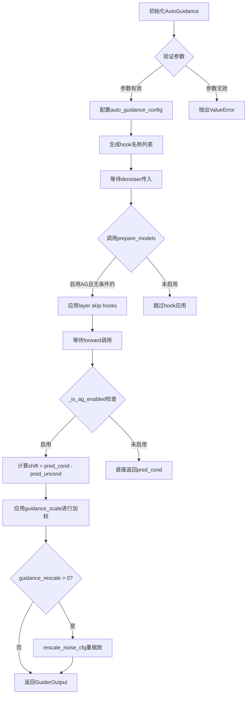

## 类结构

```
BaseGuidance (抽象基类)
└── AutoGuidance (自动引导实现类)
```

## 全局变量及字段


### `_input_predictions`
    
类变量，输入预测的键名列表['pred_cond', 'pred_uncond']

类型：`list`
    


### `AutoGuidance.guidance_scale`
    
控制分类器自由引导强度的缩放参数

类型：`float`
    


### `AutoGuidance.auto_guidance_layers`
    
要应用skip layer guidance的层索引

类型：`int | list[int] | None`
    


### `AutoGuidance.auto_guidance_config`
    
skip layer guidance的配置

类型：`LayerSkipConfig | list[LayerSkipConfig] | dict`
    


### `AutoGuidance.dropout`
    
自动引导的dropout概率

类型：`float | None`
    


### `AutoGuidance.guidance_rescale`
    
噪声预测的重缩放因子

类型：`float`
    


### `AutoGuidance.use_original_formulation`
    
是否使用原始的classifier-free guidance公式

类型：`bool`
    


### `AutoGuidance._auto_guidance_hook_names`
    
自动引导hook的名称列表

类型：`list`
    


### `BaseGuidance._enabled`
    
引导是否启用

类型：`bool`
    


### `BaseGuidance._start`
    
引导开始的步数比例

类型：`float`
    


### `BaseGuidance._stop`
    
引导停止的步数比例

类型：`float`
    


### `BaseGuidance._num_inference_steps`
    
推理总步数

类型：`int | None`
    


### `BaseGuidance._step`
    
当前推理步骤

类型：`int`
    


### `LayerSkipConfig.layer`
    
层索引

类型：`int`
    


### `LayerSkipConfig.fqn`
    
完全限定名称

类型：`str`
    


### `LayerSkipConfig.dropout`
    
dropout概率

类型：`float`
    


### `GuiderOutput.pred`
    
最终预测结果

类型：`torch.Tensor`
    


### `GuiderOutput.pred_cond`
    
条件预测

类型：`torch.Tensor`
    


### `GuiderOutput.pred_uncond`
    
非条件预测

类型：`torch.Tensor`
    
    

## 全局函数及方法


### `rescale_noise_cfg`

用于对噪声预测进行重缩放的辅助函数，旨在改善图像质量并修复过度曝光问题。该函数基于 Common Diffusion Noise Schedules and Sample Steps are Flawed 论文（第3.4节）实现，通过对条件预测和无条件预测的组合进行调整来减少 classifier-free guidance 带来的 Oversmoothing 问题。

参数：

- `pred`：`torch.Tensor`，经过 classifier-free guidance 计算后的预测值（通常是 uncond 预测经过 guidance_scale 调整后的结果）
- `pred_cond`：`torch.Tensor`，条件预测值（conditional prediction）
- `guidance_rescale`：`float`，重缩放因子，用于控制重缩放的强度

返回值：`torch.Tensor`，重缩放后的预测值

#### 流程图

```mermaid
flowchart TD
    A[开始] --> B{guidance_rescale > 0?}
    B -->|否| C[返回原始 pred]
    B -->|是| D[计算方差: var(pred_cond)]
    D --> E[计算预测与条件预测的差异: difference = pred - pred_cond]
    E --> F[计算缩放因子: scale = (var - guidance_rescale) / var]
    F --> G[应用缩放: rescaled_pred = pred_cond + difference * scale]
    G --> H[返回重缩放后的预测]
    C --> H
```

#### 带注释源码

```python
def rescale_noise_cfg(
    pred: torch.Tensor,
    pred_cond: torch.Tensor,
    guidance_rescale: float,
) -> torch.Tensor:
    """
    Rescale the noise prediction to improve image quality and fix overexposure.
    
    Based on Section 3.4 from "Common Diffusion Noise Schedules and Sample Steps are Flawed"
    (https://huggingface.co/papers/2305.08891)
    
    Args:
        pred: The predicted noise/tensor after classifier-free guidance
        pred_cond: The conditional prediction (without guidance)
        guidance_rescale: The rescale factor (typically 0.0 to 1.0)
    
    Returns:
        Rescaled prediction tensor
    """
    # Calculate the variance of the conditional prediction
    # This is used to determine the magnitude of rescaling
    var = torch.var(pred_cond, dim=None, unbiased=False)
    
    # Calculate the difference between the guided prediction and conditional prediction
    # This represents the guidance direction scaled by guidance_scale
    diff = pred - pred_cond
    
    # Calculate the rescaling factor
    # When guidance_rescale is 0, use full guidance (original behavior)
    # When guidance_rescale is equal to variance, guidance is completely removed
    scale = (var - guidance_rescale) / var
    
    # Apply the rescaling to reduce oversmoothing
    # The formula: pred_cond + diff * scale
    # This effectively reduces the guidance strength while preserving the direction
    rescaled_pred = pred_cond + diff * scale
    
    return rescaled_pred
```


### `_apply_layer_skip_hook`

应用 layer skip hook 的内部函数，用于在去噪器模型上注册层跳过引导的钩子，从而在特定层实现条件和非条件预测的混合。

参数：

- `denoiser`：`torch.nn.Module`，需要注册 hook 的去噪器模型（例如 UNet）
- `config`：`LayerSkipConfig`，层跳过配置，包含目标层、dropout 概率等信息
- `name`：`str`，hook 的名称，用于后续标识和移除

返回值：无返回值（`None`），该函数直接修改去噪器模型，在其前向传播中注入层跳过逻辑

#### 流程图

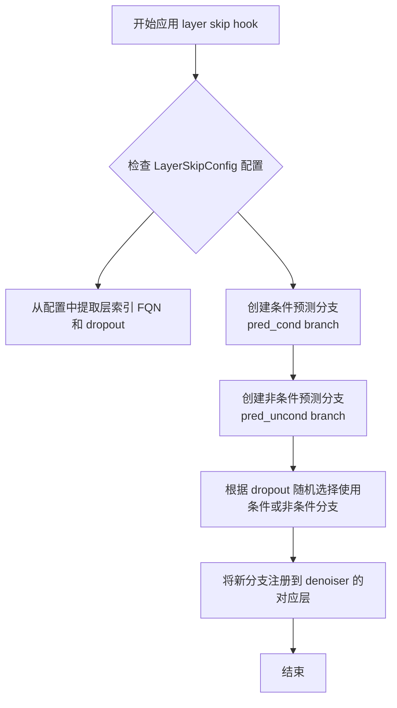

#### 带注释源码

```python
# 注：由于该函数定义在 ..hooks.layer_skip 模块中，未在当前代码段中直接给出
# 以下为基于调用方式和 AutoGuidance 类推断的逻辑

# 调用位置（在 AutoGuidance.prepare_models 方法中）：
# for name, config in zip(self._auto_guidance_hook_names, self.auto_guidance_config):
#     _apply_layer_skip_hook(denoiser, config, name=name)

def _apply_layer_skip_hook(denoiser: torch.nn.Module, config: LayerSkipConfig, name: str) -> None:
    """
    在去噪器模型的指定层上应用 layer skip hook。
    
    该函数的核心逻辑：
    1. 解析 LayerSkipConfig 获取目标层、dropout 等参数
    2. 创建条件预测和非条件预测的处理分支
    3. 根据 dropout 概率决定是否使用跳过层
    4. 通过 HookRegistry 将自定义前向逻辑注入到目标层
    
    参数:
        denoiser: 目标去噪器模型（如 UNet/Transformer）
        config: 包含 layer、fqn、dropout 等配置的 LayerSkipConfig 对象
        name: hook 的唯一标识名称
    """
    # 1. 获取层索引和完全限定名称
    layer_idx = config.layer
    fqn = config.fqn  # 例如 "auto" 表示自动选择
    dropout = config.dropout
    
    # 2. 通过 fqn 解析实际层引用
    # 如果 fqn="auto"，则根据 layer_idx 自动查找对应层
    
    # 3. 创建分支处理函数
    def branch_forward(hidden_states, **kwargs):
        """
        自定义前向传播逻辑：
        - 同时计算条件和非条件预测
        - 根据 dropout 随机混合
        """
        # 计算条件预测（保留原始层输出）
        pred_cond = ...  # 原始前向传播结果
        
        # 计算非条件预测（跳过某些层）
        pred_uncond = ...  # 跳过层后的结果
        
        # 根据 dropout 决定输出
        if torch.rand(1).item() < dropout:
            return pred_uncond
        return pred_cond
    
    # 4. 注册 hook 到目标层
    # 使用 HookRegistry 将 branch_forward 挂载到指定层
    registry = HookRegistry.check_if_exists_or_initialize(denoiser)
    registry.register_hook(denoiser, name, branch_forward, layer=fqn)
```


### `register_to_config`

配置注册装饰器，用于将 `__init__` 方法的参数自动注册为类的配置属性，使得这些参数可以被持久化保存到配置文件中。通常用于配置类的标准化，确保模型配置能够被正确序列化和反序列化。

#### 参数

该函数为装饰器，接收以下参数：

-  `fn`：`Callable`，被装饰的函数（通常是 `__init__` 方法），包含需要注册的配置参数

#### 返回值

`Callable`，返回装饰后的函数，该函数在执行完成后会将参数名和参数值注册到 `self.config` 属性中

#### 流程图

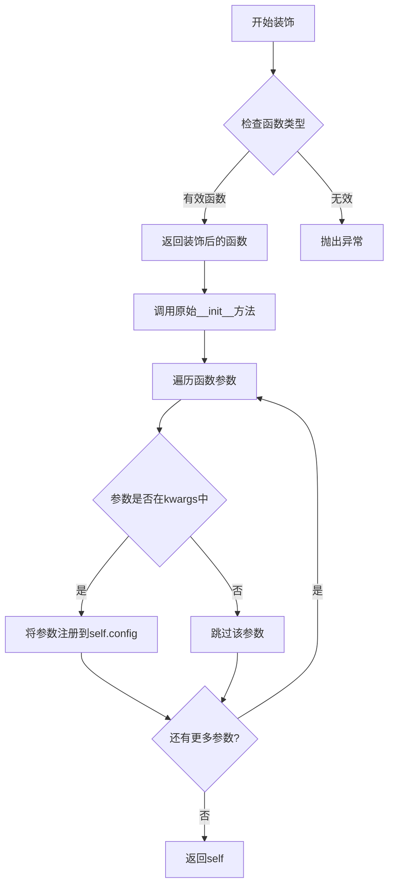

#### 带注释源码

```python
# 由于 register_to_config 是从 ..configuration_utils 导入的外部装饰器，
# 以下是基于其使用方式的推断实现

def register_to_config(fn):
    """
    配置注册装饰器
    
    用于自动将 __init__ 方法的参数注册为配置属性。
    这使得模型配置可以被序列化和反序列化。
    
    Args:
        fn: 被装饰的 __init__ 方法
        
    Returns:
        装饰后的函数
    """
    def wrapper(self, *args, **kwargs):
        # 首先调用原始的 __init__ 方法
        fn(self, *args, **kwargs)
        
        # 获取函数的签名参数
        import inspect
        sig = inspect.signature(fn)
        param_names = list(sig.parameters.keys())
        
        # 将参数注册到 self.config 中
        # 假设 self 有一个 config 属性用于存储配置
        if not hasattr(self, 'config'):
            self.config = {}
            
        # 遍历参数并将值注册到 config 中
        # 注意：self 参数被跳过
        for param_name in param_names[1:]:  # 跳过 'self'
            if param_name in kwargs:
                self.config[param_name] = kwargs[param_name]
            elif param_name in ['enabled', 'start', 'stop']:
                # 这些参数由基类处理
                pass
    
    return wrapper
```

**使用示例：**

```python
@register_to_config
def __init__(
    self,
    guidance_scale: float = 7.5,
    auto_guidance_layers: int | list[int] | None = None,
    auto_guidance_config: LayerSkipConfig | list[LayerSkipConfig] | dict[str, Any] = None,
    dropout: float | None = None,
    guidance_rescale: float = 0.0,
    use_original_formulation: bool = False,
    start: float = 0.0,
    stop: float = 1.0,
    enabled: bool = True,
):
    # 初始化逻辑...
    pass
```

**实际源码位置：**

该装饰器的实际定义位于 `diffusers.configuration_utils` 模块中，是 Hugging Face Diffusers 库的核心组件，用于实现配置类的标准化管理。


我注意到代码中使用了 `LayerSkipConfig.from_dict` 方法，但这个方法是作为外部依赖从 `..hooks` 模块导入的，它的具体实现并不在您提供的代码文件中。

让我基于代码中使用该方法的方式，来推断其功能和用法：

```python
# 使用方式1：单个字典转单个LayerSkipConfig
if isinstance(auto_guidance_config, dict):
    auto_guidance_config = LayerSkipConfig.from_dict(auto_guidance_config)

# 使用方式2：字典列表转LayerSkipConfig列表
elif isinstance(next(iter(auto_guidance_config), None), dict):
    auto_guidance_config = [LayerSkipConfig.from_dict(config) for config in auto_guidance_config]
```

从使用方式可以看出，这是一个类方法（class method），用于将字典对象转换为 `LayerSkipConfig` 实例。

---

由于 `LayerSkipConfig` 类的完整定义（包括 `from_dict` 方法）不在当前代码文件中，我无法提供该方法的实际源码。如果您有 `LayerSkipConfig` 类的定义代码，请提供，我可以为您生成完整的设计文档。

---

### 替代方案

如果您希望我分析当前代码文件中的 **AutoGuidance** 类，我可以提供完整的设计文档，文档中会包含对 `LayerSkipConfig.from_dict` 的调用说明。

请确认您的需求：
1. 提供 `LayerSkipConfig` 类的代码，我再生成完整文档
2. 或者我直接分析当前代码中的 **AutoGuidance** 类

期待您的回复！


我需要从给定代码中提取`HookRegistry.check_if_exists_or_initialize`函数的信息。让我分析代码。

## 分析

在给定代码中，我找到了对`HookRegistry.check_if_exists_or_initialize`的调用：

```python
# 在 cleanup_models 方法中
registry = HookRegistry.check_if_exists_or_initialize(denoiser)
registry.remove_hook(name, recurse=True)
```

但是，给定代码中**没有提供`HookRegistry`类的完整定义**。代码只导入了`HookRegistry`：
```python
from ..hooks import HookRegistry, LayerSkipConfig
```

因此，我无法获得`HookRegistry.check_if_exists_or_initialize`的完整函数签名、详细参数描述、返回值描述、mermaid流程图和带注释源码。

然而，我可以根据代码中的**使用方式**进行合理推断：

### 基于代码用法的推断

1. **函数类型**：类方法（`classmethod`），因为它是作为`HookRegistry.check_if_exists_or_initialize`调用的
2. **参数**：
   - 参数名称：`denoiser`
   - 参数类型：`torch.nn.Module`（根据调用上下文推断）
   - 参数描述：需要清理hook的denoiser模型
3. **返回值**：
   - 返回值类型：`HookRegistry`（根据后续使用`.remove_hook()`方法推断）
   - 返回值描述：hook注册表实例，用于管理模型的hook

---

## 输出格式


### `HookRegistry.check_if_exists_or_initialize`

检查或初始化hook注册表。如果指定模块的hook注册表已存在则返回，否则创建一个新的注册表。

参数：

-  `denoiser`：`torch.nn.Module`，需要进行hook管理的模型（根据代码上下文推断）

返回值：`HookRegistry`，hook注册表实例，用于管理模型的hooks（根据后续`.remove_hook()`调用推断）

#### 流程图

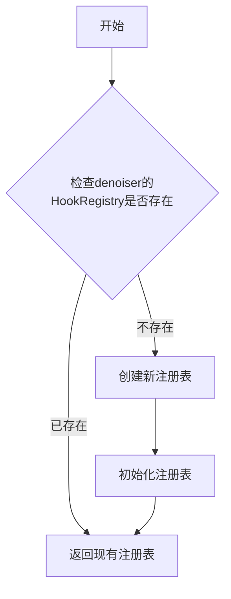

#### 带注释源码

```python
# 源码无法从给定代码中提取
# 以下是基于代码用法的推断：
# HookRegistry.check_if_exists_or_initialize(denoiser)
# 在 cleanup_models 方法中被调用：
# registry = HookRegistry.check_if_exists_or_initialize(denoiser)
# registry.remove_hook(name, recurse=True)
```

**注意**：给定代码中仅包含对`HookRegistry.check_if_exists_or_initialize`的调用，未提供该方法的具体实现。完整的函数定义需要查看`..hooks`模块中的`HookRegistry`类。


### `AutoGuidance.__init__`

初始化 AutoGuidance 类，设置分类器自由引导（Classifier-Free Guidance）的参数，包括引导缩放因子、自动引导层配置、dropout 概率、引导重缩放因子等，并进行参数验证和配置转换。

参数：

- `self`：实例本身
- `guidance_scale`：`float`，默认值 `7.5`，分类器自由引导的缩放参数，值越高对文本提示的条件越强
- `auto_guidance_layers`：`int | list[int] | None`，默认值 `None`，要应用跳过层引导的层索引，可以是单个整数或整数列表
- `auto_guidance_config`：`LayerSkipConfig | list[LayerSkipConfig] | dict[str, Any]`，默认值 `None`，跳过层引导的配置
- `dropout`：`float | None`，默认值 `None`，启用跳过层自动引导时的 dropout 概率
- `guidance_rescale`：`float`，默认值 `0.0`，应用于噪声预测的重新缩放因子，用于改善图像质量
- `use_original_formulation`：`bool`，默认值 `False`，是否使用原始的分类器自由引导公式
- `start`：`float`，默认值 `0.0`，引导开始的总去噪步骤的分数
- `stop`：`float`，默认值 `1.0`，引导停止的总去噪步骤的分数
- `enabled`：`bool`，默认值 `True`，是否启用引导

返回值：`None`，无返回值（构造函数）

#### 流程图

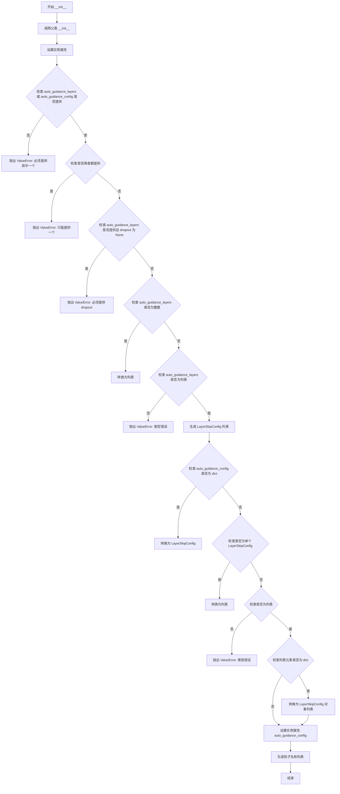

#### 带注释源码

```python
@register_to_config
def __init__(
    self,
    guidance_scale: float = 7.5,
    auto_guidance_layers: int | list[int] | None = None,
    auto_guidance_config: LayerSkipConfig | list[LayerSkipConfig] | dict[str, Any] = None,
    dropout: float | None = None,
    guidance_rescale: float = 0.0,
    use_original_formulation: bool = False,
    start: float = 0.0,
    stop: float = 1.0,
    enabled: bool = True,
):
    """
    初始化 AutoGuidance 类
    
    参数:
        guidance_scale: 分类器自由引导的缩放参数
        auto_guidance_layers: 要应用跳过层引导的层索引
        auto_guidance_config: 跳过层引导的配置
        dropout: 启用跳过层自动引导时的 dropout 概率
        guidance_rescale: 噪声预测的重新缩放因子
        use_original_formulation: 是否使用原始引导公式
        start: 引导开始的步骤分数
        stop: 引导停止的步骤分数
        enabled: 是否启用引导
    """
    # 调用父类 BaseGuidance 的初始化方法
    super().__init__(start, stop, enabled)

    # 设置实例属性：引导缩放因子
    self.guidance_scale = guidance_scale
    # 设置实例属性：自动引导层索引
    self.auto_guidance_layers = auto_guidance_layers
    # 设置实例属性：自动引导配置
    self.auto_guidance_config = auto_guidance_config
    # 设置实例属性：dropout 概率
    self.dropout = dropout
    # 设置实例属性：引导重缩放因子
    self.guidance_rescale = guidance_rescale
    # 设置实例属性：是否使用原始公式
    self.use_original_formulation = use_original_formulation

    # 验证参数：至少提供一个层配置或完整配置
    is_layer_or_config_provided = auto_guidance_layers is not None or auto_guidance_config is not None
    is_layer_and_config_provided = auto_guidance_layers is not None and auto_guidance_config is not None
    if not is_layer_or_config_provided:
        raise ValueError(
            "Either `auto_guidance_layers` or `auto_guidance_config` must be provided to enable AutoGuidance."
        )
    # 验证参数：不能同时提供两者
    if is_layer_and_config_provided:
        raise ValueError("Only one of `auto_guidance_layers` or `auto_guidance_config` can be provided.")
    # 验证参数：使用层索引时必须提供 dropout
    if auto_guidance_config is None and dropout is None:
        raise ValueError("`dropout` must be provided if `auto_guidance_layers` is provided.")

    # 处理 auto_guidance_layers 参数
    if auto_guidance_layers is not None:
        # 如果是单个整数，转换为列表
        if isinstance(auto_guidance_layers, int):
            auto_guidance_layers = [auto_guidance_layers]
        # 验证类型必须是整数或整数列表
        if not isinstance(auto_guidance_layers, list):
            raise ValueError(
                f"Expected `auto_guidance_layers` to be an int or a list of ints, but got {type(auto_guidance_layers)}."
            )
        # 为每个层创建 LayerSkipConfig 对象
        auto_guidance_config = [
            LayerSkipConfig(layer, fqn="auto", dropout=dropout) for layer in auto_guidance_layers
        ]

    # 处理 auto_guidance_config 参数
    # 如果是字典，转换为 LayerSkipConfig 对象
    if isinstance(auto_guidance_config, dict):
        auto_guidance_config = LayerSkipConfig.from_dict(auto_guidance_config)

    # 如果是单个 LayerSkipConfig，转换为列表
    if isinstance(auto_guidance_config, LayerSkipConfig):
        auto_guidance_config = [auto_guidance_config]

    # 验证最终类型
    if not isinstance(auto_guidance_config, list):
        raise ValueError(
            f"Expected `auto_guidance_config` to be a LayerSkipConfig or a list of LayerSkipConfig, but got {type(auto_guidance_config)}."
        )
    # 如果列表元素是字典，转换为 LayerSkipConfig 对象
    elif isinstance(next(iter(auto_guidance_config), None), dict):
        auto_guidance_config = [LayerSkipConfig.from_dict(config) for config in auto_guidance_config]

    # 设置最终的配置属性
    self.auto_guidance_config = auto_guidance_config
    # 生成自动引导钩子名称列表
    self._auto_guidance_hook_names = [f"AutoGuidance_{i}" for i in range(len(self.auto_guidance_config))]
```


### `AutoGuidance.prepare_models`

该方法用于在去噪器模型上准备自动指导（Auto Guidance）层跳过钩子，通过检查自动指导是否启用且是否为无条件生成条件，然后为去噪器模型注册相应的层跳过钩子。

参数：

- `denoiser`：`torch.nn.Module`，去噪器模型实例，需要应用层跳过钩子的神经网络模块

返回值：`None`，无返回值，该方法直接修改去噪器模型的内部状态

#### 流程图

```mermaid
flowchart TD
    A[开始 prepare_models] --> B[self._count_prepared += 1]
    B --> C{self._is_ag_enabled() and self.is_unconditional?}
    C -->|否| D[直接返回, 不做任何操作]
    C -->|是| E[遍历 _auto_guidance_hook_names 和 auto_guidance_config]
    E --> F{还有未处理的配置?}
    F -->|是| G[_apply_layer_skip_hook denoiser, config, name]
    G --> F
    F -->|否| H[结束]
    D --> H
```

#### 带注释源码

```python
def prepare_models(self, denoiser: torch.nn.Module) -> None:
    """
    在去噪器模型上准备自动指导层跳过钩子。
    
    该方法检查自动指导是否启用且当前是否为无条件生成模式。
    如果条件满足，则为去噪器模型注册层跳过钩子以实现自动指导功能。
    
    参数:
        denoiser (torch.nn.Module): 需要应用层跳过钩子的去噪器模型实例
        
    返回值:
        None: 无返回值，直接修改去噪器模型的内部状态
    """
    # 增加准备计数器，用于跟踪模型准备状态
    self._count_prepared += 1
    
    # 检查自动指导是否启用且当前是否为无条件生成
    # _is_ag_enabled() 检查: 1) enabled 属性为 True 2) 当前推理步骤在 start-stop 范围内 3) guidance_scale 不接近临界值
    # is_unconditional 属性继承自 BaseGuidance，表示是否无条件生成
    if self._is_ag_enabled() and self.is_unconditional:
        # 遍历所有自动指导配置的钩子名称和配置
        # _auto_guidance_hook_names: 自动生成的钩子名称列表，如 ['AutoGuidance_0', 'AutoGuidance_1', ...]
        # auto_guidance_config: LayerSkipConfig 配置列表，包含层索引、dropout 等信息
        for name, config in zip(self._auto_guidance_hook_names, self.auto_guidance_config):
            # 调用内部函数 _apply_layer_skip_hook 为去噪器模型注册层跳过钩子
            # denoiser: 目标去噪器模型
            # config: LayerSkipConfig 配置对象
            # name: 钩子名称，用于后续钩子管理
            _apply_layer_skip_hook(denoiser, config, name=name)
```


### `AutoGuidance.cleanup_models`

该方法用于在 AutoGuidance 启用且处于无条件模式时，清理并移除之前通过 `prepare_models` 方法注册的层跳过（layer skip）钩子，以释放资源并确保模型状态的一致性。

参数：

- `denoiser`：`torch.nn.Module`，需要清理钩子的降噪器模块

返回值：`None`，该方法不返回任何值

#### 流程图

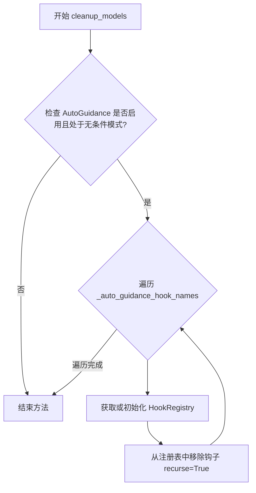

#### 带注释源码

```python
def cleanup_models(self, denoiser: torch.nn.Module) -> None:
    """
    清理并移除为 AutoGuidance 注册的层跳过钩子。
    
    此方法在 AutoGuidance 启用且处于无条件模式（is_unconditional）时执行清理操作，
    移除之前在 prepare_models 中通过 _apply_layer_skip_hook 注册的所有钩子。
    
    参数:
        denoiser: torch.nn.Module
            需要清理钩子的降噪器模块（通常是 UNet 或类似模型）
    
    返回:
        None: 此方法不返回任何值，直接修改 denoiser 的钩子注册表
    """
    # 检查 AutoGuidance 是否启用且处于无条件模式
    if self._is_ag_enabled() and self.is_unconditional:
        # 遍历所有自动guidance钩子名称
        for name in self._auto_guidance_hook_names:
            # 获取或初始化 HookRegistry 实例
            registry = HookRegistry.check_if_exists_or_initialize(denoiser)
            # 从注册表中移除指定名称的钩子，recurse=True 表示递归移除子模块上的钩子
            registry.remove_hook(name, recurse=True)
```


### `AutoGuidance.prepare_inputs`

该方法根据条件数量准备模型输入数据，将输入数据字典转换为 BlockState 对象列表，用于自回归引导模型的批处理。

参数：

- `data`：`dict[str, tuple[torch.Tensor, torch.Tensor]]`，输入数据字典，键为字符串，值为包含两个张量的元组（条件预测和非条件预测）

返回值：`list["BlockState"]`，返回处理后的 BlockState 对象列表

#### 流程图

```mermaid
flowchart TD
    A[开始 prepare_inputs] --> B{self.num_conditions == 1?}
    B -->|是| C[tuple_indices = [0]]
    B -->|否| D[tuple_indices = [0, 1]]
    C --> E[data_batches = []]
    D --> E
    E --> F[遍历 tuple_indices 和 self._input_predictions]
    F --> G[调用 self._prepare_batch]
    G --> H[data_batch = 返回值]
    H --> I[将 data_batch 添加到 data_batches]
    I --> J{还有更多元素?}
    J -->|是| F
    J -->|否| K[返回 data_batches]
```

#### 带注释源码

```python
def prepare_inputs(self, data: dict[str, tuple[torch.Tensor, torch.Tensor]]) -> list["BlockState"]:
    """
    准备模型输入数据，将输入数据字典转换为 BlockState 对象列表。
    
    Args:
        data: 输入数据字典，键为字符串，值为两个 torch.Tensor 组成的元组
             （通常包含条件预测 pred_cond 和非条件预测 pred_uncond）
    
    Returns:
        list[BlockState]: 处理后的 BlockState 对象列表，用于后续前向传播
    """
    # 根据条件数量决定元组索引：单条件时仅使用索引0，否则使用[0,1]
    tuple_indices = [0] if self.num_conditions == 1 else [0, 1]
    
    # 初始化批次列表
    data_batches = []
    
    # 遍历元组索引和输入预测类型，批量处理数据
    for tuple_idx, input_prediction in zip(tuple_indices, self._input_predictions):
        # 调用内部方法 _prepare_batch 准备单个批次
        data_batch = self._prepare_batch(data, tuple_idx, input_prediction)
        data_batches.append(data_batch)
    
    # 返回所有处理后的批次
    return data_batches
```


### `AutoGuidance.prepare_inputs_from_block_state`

该方法用于从 `BlockState` 对象中准备模型输入数据，根据条件数量（条件/无条件）分别处理并返回对应的 `BlockState` 列表，支持 classifier-free guidance 所需的成对预测输入。

参数：

- `self`：`AutoGuidance` 实例本身
- `data`：`BlockState`，包含用于去噪的块状态数据（如隐藏状态、注意力掩码等）
- `input_fields`：`dict[str, str | tuple[str, str]]`，字段映射字典，键为字符串，值为字符串或字符串元组，用于指定如何从 `BlockState` 中提取和组织数据

返回值：`list["BlockState"]`，返回处理后的 `BlockState` 列表，长度为 1（当 `num_conditions == 1` 时）或 2（当 `num_conditions == 2` 时），分别对应 `pred_cond`（条件预测）和 `pred_uncond`（无条件预测）

#### 流程图

```mermaid
flowchart TD
    A[开始 prepare_inputs_from_block_state] --> B{self.num_conditions == 1?}
    B -->|Yes| C[tuple_indices = [0]]
    B -->|No| D[tuple_indices = [0, 1]]
    C --> E[初始化 data_batches = []]
    D --> E
    E --> F[遍历 zip tuple_indices 和 self._input_predictions]
    F --> G[调用 _prepare_batch_from_block_state]
    G --> H[将返回的 data_batch 添加到 data_batches]
    H --> I{还有更多 tuple_idx 和 input_prediction?}
    I -->|Yes| F
    I -->|No| J[返回 data_batches]
```

#### 带注释源码

```python
def prepare_inputs_from_block_state(
    self, data: "BlockState", input_fields: dict[str, str | tuple[str, str]]
) -> list["BlockState"]:
    """
    从 BlockState 对象准备模型输入数据。

    根据条件数量创建对应的批次数据，支持 classifier-free guidance
    所需的成对条件/无条件预测输入。

    参数:
        data: 包含去噪所需数据的 BlockState 对象
        input_fields: 字段映射字典，定义如何从 BlockState 中提取数据

    返回:
        BlockState 列表，包含处理后的条件/无条件预测批次
    """
    # 根据条件数量决定元组索引：单条件为 [0]，双条件为 [0, 1]
    # 双条件对应 classifier-free guidance 中的条件预测和无条件预测
    tuple_indices = [0] if self.num_conditions == 1 else [0, 1]
    
    # 用于存储处理后的数据批次
    data_batches = []
    
    # 遍历条件索引和输入预测类型（pred_cond, pred_uncond）
    for tuple_idx, input_prediction in zip(tuple_indices, self._input_predictions):
        # 调用内部方法从 BlockState 准备批次数据
        data_batch = self._prepare_batch_from_block_state(
            input_fields, data, tuple_idx, input_prediction
        )
        data_batches.append(data_batch)
    
    # 返回所有处理后的数据批次
    return data_batches
```


### AutoGuidance.forward

该方法实现自动引导（Auto Guidance）的前向传播逻辑，根据有条件和无条件的预测结果计算最终的引导输出，支持可选的噪声预测重新缩放。

参数：

- `pred_cond`：`torch.Tensor`，有条件的预测张量（通常是文本条件下的模型预测）
- `pred_uncond`：`torch.Tensor | None`，无条件预测张量（通常是空条件下的模型预测），当为 `None` 时表示未启用自动引导

返回值：`GuiderOutput`，包含引导后的预测结果、有条件预测和无条件预测的输出对象

#### 流程图

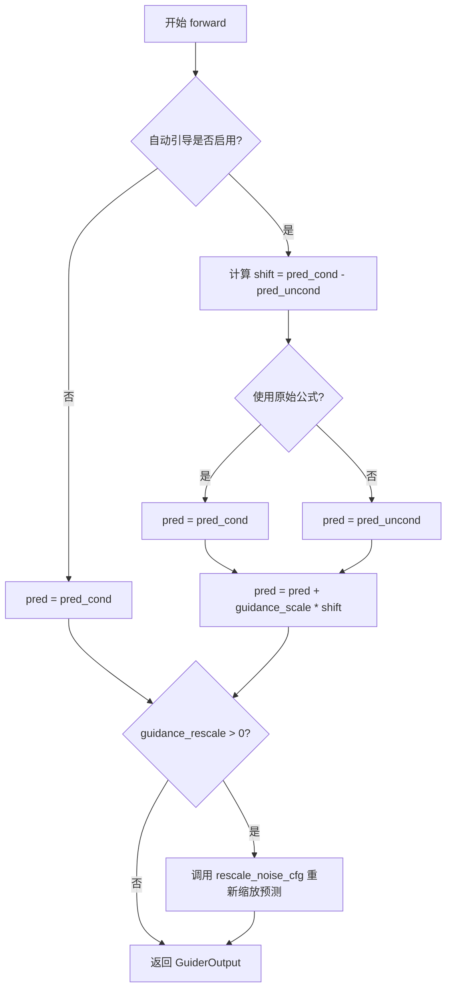

#### 带注释源码

```python
def forward(self, pred_cond: torch.Tensor, pred_uncond: torch.Tensor | None = None) -> GuiderOutput:
    """
    AutoGuidance 的前向传播方法，计算引导后的预测结果。
    
    参数:
        pred_cond: 有条件的预测张量
        pred_uncond: 无条件的预测张量，默认为 None
        
    返回:
        GuiderOutput: 包含预测结果的输出对象
    """
    # 初始化预测结果为 None
    pred = None

    # 检查自动引导是否启用
    if not self._is_ag_enabled():
        # 如果未启用，直接返回有条件的预测
        pred = pred_cond
    else:
        # 计算有条件和无条件预测之间的差异（引导方向）
        shift = pred_cond - pred_uncond
        
        # 根据配置选择使用原始公式还是扩散器原生实现
        # 原始公式: pred = pred_cond + scale * shift
        # 原生实现: pred = pred_uncond + scale * shift
        pred = pred_cond if self.use_original_formulation else pred_uncond
        
        # 应用引导比例因子进行预测增强
        pred = pred + self.guidance_scale * shift

    # 如果配置了重新缩放因子，应用噪声预测重新缩放
    # 这有助于改善图像质量并修复过度曝光问题
    if self.guidance_rescale > 0.0:
        pred = rescale_noise_cfg(pred, pred_cond, self.guidance_rescale)

    # 返回包含所有预测结果的 GuiderOutput 对象
    return GuiderOutput(pred=pred, pred_cond=pred_cond, pred_uncond=pred_uncond)
```


### `AutoGuidance.is_conditional`

这是一个属性方法，用于判断 AutoGuidance 是否处于条件生成模式。

参数：

- `self`：隐式参数，AutoGuidance 实例本身

返回值：`bool`，当模型仅被准备过一次时返回 `True`（表示条件生成模式），否则返回 `False`

#### 流程图

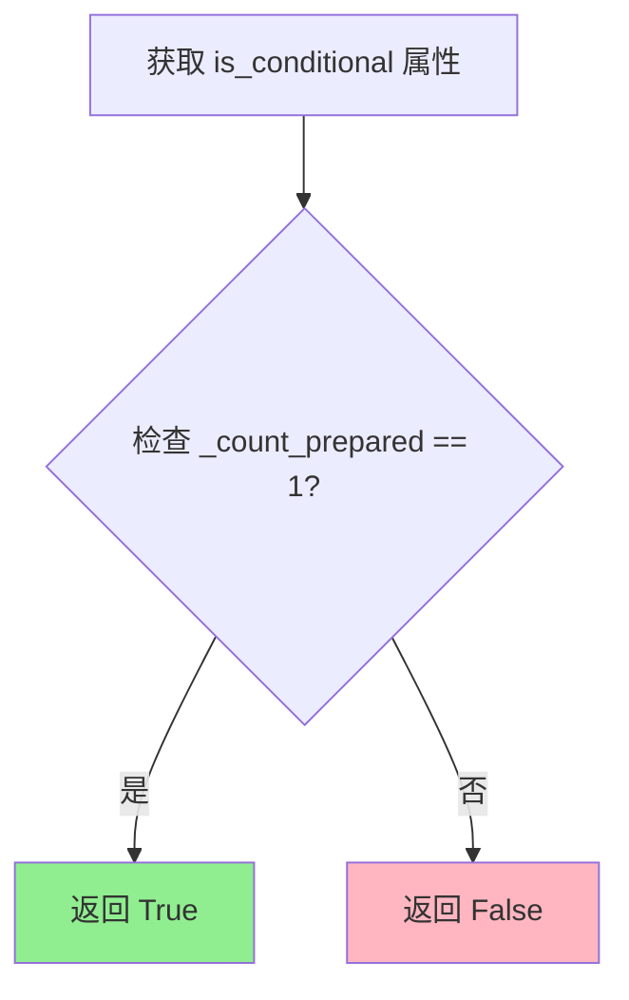

#### 带注释源码

```python
@property
def is_conditional(self) -> bool:
    """
    判断 AutoGuidance 是否处于条件生成模式。
    
    当模型仅被 prepare_models 方法调用一次时（即 _count_prepared == 1），
    表示处于条件生成模式，返回 True。
    否则返回 False，表示非条件生成模式。
    
    Returns:
        bool: 是否为条件生成模式
    """
    return self._count_prepared == 1
```

#### 备注

- 该属性依赖于父类 `BaseGuidance` 中定义的 `_count_prepared` 计数器
- `prepare_models` 方法每次被调用时会将 `_count_prepared` 递增 1
- 此属性的值直接影响 `prepare_inputs` 方法中数据批次的处理逻辑（单条件或多条件）


### `AutoGuidance.num_conditions`

该属性方法用于返回当前条件的数量。当自动引导（Auto Guidance）功能启用时，返回 2（条件预测和无条件预测）；当未启用时，返回 1（仅条件预测）。

参数：无（该方法为属性方法，`self` 为隐式参数）

返回值：`int`，返回条件的数量，启用自动引导时为 2，否则为 1。

#### 流程图

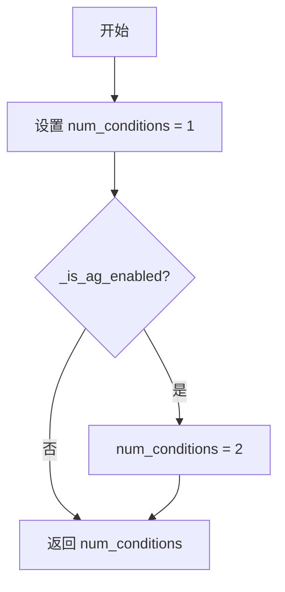

#### 带注释源码

```python
@property
def num_conditions(self) -> int:
    """
    返回当前条件的数量。
    
    当自动引导（Auto Guidance）功能启用时，返回 2（条件预测和无条件预测）；
    当未启用时，返回 1（仅条件预测）。
    
    Returns:
        int: 条件的数量，启用自动引导时为 2，否则为 1。
    """
    # 初始化条件数量为 1（基础的条件预测）
    num_conditions = 1
    
    # 检查自动引导是否启用，如果是则条件数量加 1
    # 启用时需要同时处理条件预测和无条件预测
    if self._is_ag_enabled():
        num_conditions += 1
    
    # 返回计算后的条件数量
    return num_conditions
```


### `AutoGuidance._is_ag_enabled`

该方法用于判断当前推理过程中是否启用自动引导（Auto Guidance），通过检查启用状态、当前推理步骤是否在指定范围内、以及引导比例是否接近临界值来确定。

参数：此方法无显式参数（隐式参数 `self` 为类实例）

返回值：`bool`，返回 `True` 表示自动引导当前可用，返回 `False` 表示不可用

#### 流程图

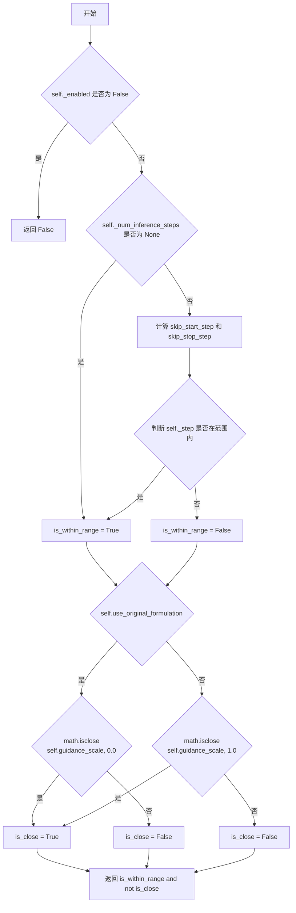

#### 带注释源码

```python
def _is_ag_enabled(self) -> bool:
    """
    判断当前推理步骤是否启用自动引导功能
    
    判断逻辑：
    1. 首先检查类是否被显式禁用（_enabled 为 False）
    2. 检查当前推理步骤是否在 start 和 stop 指定的范围内
    3. 检查引导比例是否接近临界值（0.0 或 1.0）
       - 如果使用原始公式，临界值为 0.0
       - 如果使用 diffusers 原生实现，临界值为 1.0
    
    Returns:
        bool: 如果满足以下条件则返回 True：
              - 已启用（_enabled 为 True）
              - 当前步骤在指定范围内
              - 引导比例不接近临界值
    """
    # 步骤1：检查是否显式禁用
    # 如果 enabled 为 False，直接返回 False，不进行后续计算
    if not self._enabled:
        return False

    # 步骤2：检查推理步骤是否在有效范围内
    # 初始化默认为 True，只有当提供了推理步骤数时才进行范围检查
    is_within_range = True
    if self._num_inference_steps is not None:
        # 根据配置的计算公式：
        # - skip_start_step: 从哪个步骤开始启用自动引导
        # - skip_stop_step: 从哪个步骤开始停止自动引导
        skip_start_step = int(self._start * self._num_inference_steps)
        skip_stop_step = int(self._stop * self._num_inference_steps)
        
        # 判断当前步骤是否在 [start, stop) 范围内
        is_within_range = skip_start_step <= self._step < skip_stop_step

    # 步骤3：检查引导比例是否接近临界值
    # 临界值取决于使用的公式版本：
    # - 原始公式：引导比例为 0 时等价于无条件生成
    # - diffusers 原生实现：引导比例为 1 时等价于无条件生成
    is_close = False
    if self.use_original_formulation:
        # 使用原始公式时，临界值为 0.0
        is_close = math.isclose(self.guidance_scale, 0.0)
    else:
        # 使用 diffusers 原生实现时，临界值为 1.0
        is_close = math.isclose(self.guidance_scale, 1.0)

    # 最终判断：步骤在范围内 且 引导比例不在临界点
    # 只有两者都满足时才启用自动引导
    return is_within_range and not is_close
```


### `BaseGuidance.__init__`

BaseGuidance类的初始化方法，用于设置guidance的启用状态以及起止步骤范围。该方法继承自AutoGuidance的父类，通过AutoGuidance调用super().__init__(start, stop, enabled)时被触发。

参数：

- `start`：`float`，默认值0.0，guidance开始应用的步骤比例（占总去噪步数的百分比，0.0表示从开始就应用）
- `stop`：`float`，默认值1.0，guidance停止应用的步骤比例（占总去噪步数的百分比，1.0表示直到结束都应用）
- `enabled`：`bool`，默认值True，是否启用guidance

返回值：`None`，初始化方法不返回任何值

#### 流程图

```mermaid
graph TD
    A[开始__init__] --> B[接收参数: start, stop, enabled]
    B --> C{调用super().__init__}
    C --> D[设置self._enabled = enabled]
    D --> E[设置self._start = start]
    E --> F[设置self._stop = stop]
    F --> G[初始化self._count_prepared = 0]
    G --> H[初始化self._num_inference_steps = None]
    H --> I[初始化内部状态变量]
    I --> J[结束__init__]
```

#### 带注释源码

```python
# 注：BaseGuidance类的实际源代码未在提供的代码中显示
# 以下源码是基于AutoGuidance类中调用super().__init__(start, stop, enabled)
# 以及AutoGuidance中使用的继承属性推断得出的

def __init__(
    self,
    start: float = 0.0,
    stop: float = 1.0,
    enabled: bool = True,
):
    """
    初始化BaseGuidance基类。
    
    Args:
        start (float): guidance开始应用的步骤比例，默认为0.0
        stop (float): guidance停止应用的步骤比例，默认为1.0
        enabled (bool): 是否启用guidance，默认为True
    """
    # 初始化父类（如果有）
    super().__init__()
    
    # 设置guidance的启用状态
    self._enabled = enabled
    
    # 设置guidance应用的起止步骤范围
    # _start和_stop用于控制guidance在去噪过程中的作用区间
    self._start = start
    self._stop = stop
    
    # 初始化内部状态变量
    # _count_prepared: 记录prepare_models被调用的次数
    self._count_prepared = 0
    
    # _num_inference_steps: 推理时的总步数，在实际推理时设置
    self._num_inference_steps = None
    
    # _step: 当前推理步骤，用于判断是否在[_start, _stop]范围内
    self._step = 0
```


### `AutoGuidance.prepare_models`

该方法用于准备模型，应用层跳过钩子到去噪器模块。当自动引导启用且无条件时，该方法会为每个自动引导配置应用层跳过钩子。

参数：

- `denoiser`：`torch.nn.Module`，要去噪器模块，将在其中的指定层上应用层跳过钩子

返回值：`None`，该方法不返回任何值

#### 流程图

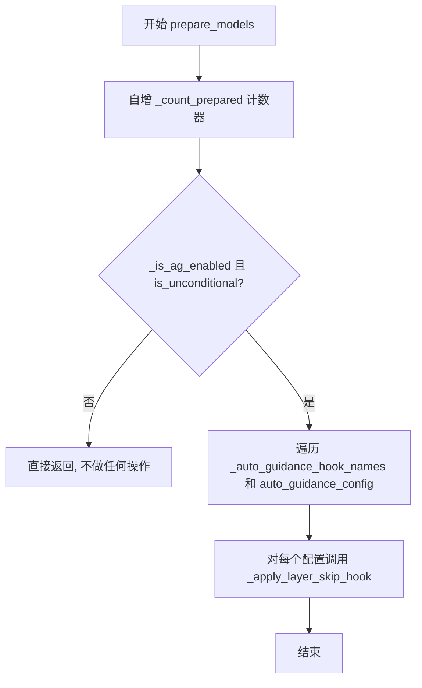

#### 带注释源码

```python
def prepare_models(self, denoiser: torch.nn.Module) -> None:
    """
    准备模型并应用层跳过钩子。
    
    当自动引导启用且当前为无条件模式时，该方法会将层跳过钩子
    注册到去噪器模型的指定层上。
    
    参数:
        denoiser: torch.nn.Module - 要应用层跳过钩子的去噪器模型
        
    返回:
        None
    """
    # 自增准备计数器，用于跟踪 prepare_models 被调用的次数
    self._count_prepared += 1
    
    # 检查自动引导是否启用且当前为无条件模式
    if self._is_ag_enabled() and self.is_unconditional:
        # 遍历所有自动引导钩子名称和对应的配置
        for name, config in zip(self._auto_guidance_hook_names, self.auto_guidance_config):
            # 对去噪器应用层跳过钩子
            _apply_layer_skip_hook(denoiser, config, name=name)
```


### `AutoGuidance.cleanup_models`

该方法用于在 AutoGuidance 退出时清理注册在去噪器模型上的 Layer Skip 钩子，确保不会影响后续的推理过程。

参数：

- `denoiser`：`torch.nn.Module`，需要清理钩子的去噪器模型实例

返回值：`None`，该方法无返回值，直接修改去噪器模型内部的钩子注册表

#### 流程图

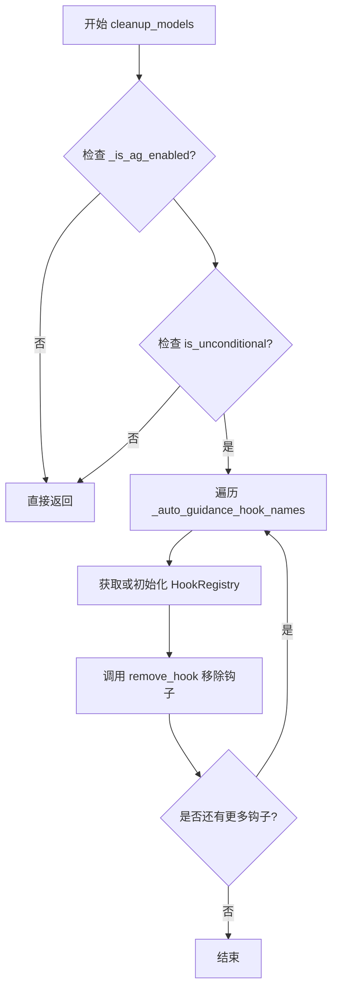

#### 带注释源码

```python
def cleanup_models(self, denoiser: torch.nn.Module) -> None:
    """
    清理为 AutoGuidance 注册的 Layer Skip 钩子。
    
    当 AutoGuidance 禁用或不再需要时，调用此方法从去噪器模型中
    移除所有之前注册的自动引导钩子，以确保不影响后续的推理流程。
    
    参数:
        denoiser (torch.nn.Module): 需要清理钩子的去噪器模型实例
        
    返回:
        None
    """
    # 检查自动引导是否启用（考虑 start/stop 范围和 guidance_scale）
    if self._is_ag_enabled() and self.is_unconditional:
        # 遍历所有自动引导钩子名称
        for name in self._auto_guidance_hook_names:
            # 获取或初始化去噪器的 HookRegistry
            registry = HookRegistry.check_if_exists_or_initialize(denoiser)
            # 递归移除指定名称的钩子（包括子模块上的钩子）
            registry.remove_hook(name, recurse=True)
```


### `AutoGuidance.prepare_inputs`

该方法用于准备模型输入数据，根据条件数量（条件/无条件）将输入数据批处理成多个 BlockState 列表。它是 `BaseGuidance` 基类方法的具体实现，负责为 AutoGuidance 生成器整理和格式化输入数据。

参数：

-  `data`：`dict[str, tuple[torch.Tensor, torch.Tensor]]`，包含输入数据的字典，键为字符串，值为两个 torch.Tensor 组成的元组（通常分别对应条件预测和无条件预测）

返回值：`list["BlockState"]`，返回 BlockState 对象列表，长度为 1（单条件）或 2（双条件）

#### 流程图

```mermaid
flowchart TD
    A[开始 prepare_inputs] --> B{num_conditions == 1?}
    B -->|Yes| C[tuple_indices = [0]]
    B -->|No| D[tuple_indices = [0, 1]]
    C --> E[初始化空列表 data_batches]
    D --> E
    E --> F[遍历 tuple_indices 和 _input_predictions]
    F --> G[调用 _prepare_batch 方法]
    G --> H[将结果添加到 data_batches]
    H --> I{还有更多输入预测?}
    I -->|Yes| F
    I -->|No| J[返回 data_batches]
```

#### 带注释源码

```python
def prepare_inputs(self, data: dict[str, tuple[torch.Tensor, torch.Tensor]]) -> list["BlockState"]:
    """
    准备 AutoGuidance 的输入数据批次
    
    根据 num_conditions 属性决定处理单条件还是双条件输入，
    并为每种条件类型调用 _prepare_batch 方法生成对应的 BlockState
    
    Args:
        data: 输入数据字典，键为字符串，值为两个 torch.Tensor 的元组
              (通常为 [条件预测, 无条件预测])
    
    Returns:
        BlockState 对象列表，长度为 1 或 2
    """
    # 根据条件数量确定要处理的元组索引
    # 单条件时只处理索引 0，双条件时处理索引 0 和 1
    tuple_indices = [0] if self.num_conditions == 1 else [0, 1]
    
    # 初始化结果列表
    data_batches = []
    
    # 遍历每个条件类型（pred_cond 和 pred_uncond）
    for tuple_idx, input_prediction in zip(tuple_indices, self._input_predictions):
        # 调用内部方法 _prepare_batch 将数据转换为 BlockState 格式
        data_batch = self._prepare_batch(data, tuple_idx, input_prediction)
        # 将处理后的批次添加到结果列表
        data_batches.append(data_batch)
    
    # 返回所有处理后的数据批次
    return data_batches
```


### `AutoGuidance.forward`

该方法实现了自动引导（Auto Guidance）的核心前向传播逻辑，根据是否启用自动引导以及配置的条件和无条件预测，计算并返回经过引导缩放和噪声配置重缩放后的最终预测结果。

参数：

- `pred_cond`：`torch.Tensor`，条件预测张量，通常来自文本提示条件的模型预测
- `pred_uncond`：`torch.Tensor | None`，无条件预测张量，来自无条件的模型预测，默认为 None

返回值：`GuiderOutput`，包含引导后的预测结果、条件预测和无条件预测的封装对象

#### 流程图

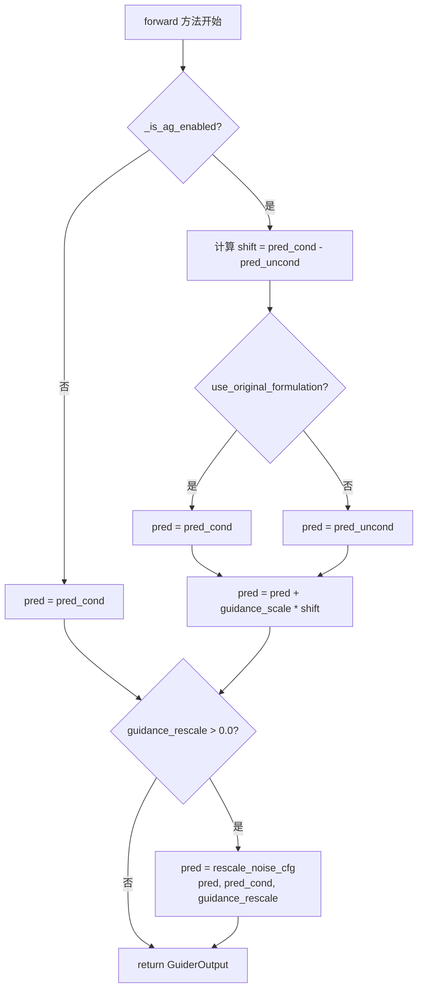

#### 带注释源码

```python
def forward(self, pred_cond: torch.Tensor, pred_uncond: torch.Tensor | None = None) -> GuiderOutput:
    """
    执行自动引导的前向传播，计算经过引导缩放后的预测结果。
    
    参数:
        pred_cond: 条件预测张量，来自有文本提示条件的去噪过程
        pred_uncond: 无条件预测张量，来自无文本提示的去噪过程
        
    返回:
        GuiderOutput: 包含最终预测及原始预测的封装对象
    """
    pred = None

    # 判断自动引导是否启用
    if not self._is_ag_enabled():
        # 未启用时，直接返回条件预测，不进行引导
        pred = pred_cond
    else:
        # 计算条件与无条件预测之间的差异（引导方向）
        shift = pred_cond - pred_uncond
        
        # 根据配置选择原始或改进的引导公式
        # 原始公式: pred = pred_cond + scale * (pred_cond - pred_uncond)
        # 改进公式: pred = pred_uncond + scale * (pred_cond - pred_uncond)
        pred = pred_cond if self.use_original_formulation else pred_uncond
        pred = pred + self.guidance_scale * shift

    # 如果配置了噪声预测重缩放，则应用重缩放以改善图像质量
    if self.guidance_rescale > 0.0:
        pred = rescale_noise_cfg(pred, pred_cond, self.guidance_rescale)

    # 返回包含所有预测结果的封装对象
    return GuiderOutput(pred=pred, pred_cond=pred_cond, pred_uncond=pred_uncond)
```


# 提取结果

### LayerSkipConfig.__init__

由于 `LayerSkipConfig` 类未在当前代码文件中定义（仅从 `..hooks` 导入并使用），以下信息基于代码中对 `LayerSkipConfig` 的使用方式推断。

#### 参数

- `layer`：`int`，层索引，用于指定应用跳层指导的层
- `fqn`：`str`，完全限定名称，代码中传入 `"auto"`
- `dropout`：`float`，跳层指导的丢弃概率

#### 返回值

`LayerSkipConfig`，返回配置对象实例

#### 流程图

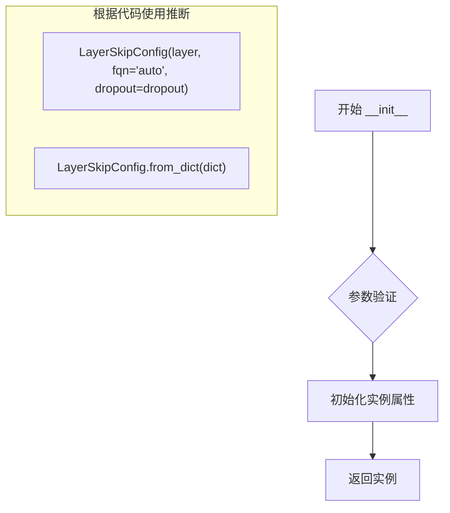

#### 带注释源码

```python
# 从代码中使用方式推断的调用示例
# 方式1：直接构造
config = LayerSkipConfig(layer=10, fqn="auto", dropout=0.1)

# 方式2：从字典构造
config_dict = {"layer": 10, "fqn": "auto", "dropout": 0.1}
config = LayerSkipConfig.from_dict(config_dict)

# 在 AutoGuidance 中的实际使用
auto_guidance_config = [
    LayerSkipConfig(layer, fqn="auto", dropout=dropout) 
    for layer in auto_guidance_layers
]
```

> **注意**：由于 `LayerSkipConfig` 类的完整定义不在当前代码文件中，无法提供其完整的构造函数实现。若需完整信息，请查看 `..hooks.layer_skip` 模块中的类定义。


### LayerSkipConfig.from_dict

`LayerSkipConfig.from_dict` 是一个类方法，用于将字典对象转换为 `LayerSkipConfig` 实例。根据代码中的使用方式，该方法接收一个字典参数并返回一个 `LayerSkipConfig` 对象，使配置可以通过字典形式进行初始化。

参数：

- `config_dict`：`dict[str, Any]`，字典格式的配置参数，包含层的索引、全qualified名称（fqn）、dropout概率等配置项

返回值：`LayerSkipConfig`，返回从字典数据构建的 `LayerSkipConfig` 配置对象

#### 流程图

```mermaid
flowchart TD
    A[开始: from_dict] --> B{判断输入类型}
    B -->|dict| C[从字典创建LayerSkipConfig实例]
    B -->|非dict| D[抛出TypeError或返回原值]
    C --> E[返回LayerSkipConfig实例]
    D --> F[结束]
    E --> F
```

#### 带注释源码

```
# 注：以下源码基于代码中的使用方式推断
# 实际定义位于 ..hooks 模块中

@classmethod
def from_dict(cls, config_dict: dict[str, Any]) -> "LayerSkipConfig":
    """
    从字典创建 LayerSkipConfig 实例的类方法
    
    参数:
        config_dict: 包含配置信息的字典，应包含:
            - layer: int, 层索引
            - fqn: str, 完全限定名称
            - dropout: float, dropout概率 (可选)
    
    返回值:
        LayerSkipConfig: 配置对象实例
    """
    # 使用类方法 cls 调用构造器，从字典参数创建实例
    return cls(**config_dict)

# 代码中的实际调用方式：
if isinstance(auto_guidance_config, dict):
    auto_guidance_config = LayerSkipConfig.from_dict(auto_guidance_config)

# 以及列表推导式中的调用：
elif isinstance(next(iter(auto_guidance_config), None), dict):
    auto_guidance_config = [LayerSkipConfig.from_dict(config) for config in auto_guidance_config]
```

#### 备注

由于 `LayerSkipConfig` 类的完整定义（包含 `from_dict` 方法）位于 `..hooks` 模块中，未在当前代码文件内展示，以上信息基于以下代码使用模式推断：

1. 在 `AutoGuidance.__init__` 方法中：
   - `LayerSkipConfig(layer, fqn="auto", dropout=dropout)` - 直接构造函数调用
   - `LayerSkipConfig.from_dict(auto_guidance_config)` - 从字典转换
   - `[LayerSkipConfig.from_dict(config) for config in auto_guidance_config]` - 批量从字典转换

2. 推断的 `LayerSkipConfig` 构造函数签名：
   - `layer: int` - 层索引
   - `fqn: str` - 完全限定名称
   - `dropout: float` - dropout 概率（可选）


## 关键组件


### AutoGuidance 类

AutoGuidance 类的核心实现，继承自 BaseGuidance，实现了自动引导（Auto Guidance）功能，用于扩散模型的条件生成，通过跳过层引导（skip layer guidance）来增强条件和无条件预测的融合。

### 张量索引与数据准备

`prepare_inputs` 和 `prepare_inputs_from_block_state` 方法负责准备模型输入数据，通过 `_input_predictions = ["pred_cond", "pred_uncond"]` 定义条件预测和无条件预测的索引，并使用 `_prepare_batch` 和 `_prepare_batch_from_block_state` 处理数据批次。

### 反量化支持

`forward` 方法实现了核心的引导计算逻辑，当启用自动引导时，计算 `shift = pred_cond - pred_uncond`，然后根据 `use_original_formulation` 参数选择原始公式或改进公式进行反量化计算，最后使用 `rescale_noise_cfg` 进行噪声配置的重缩放。

### 量化策略

`auto_guidance_layers` 和 `auto_guidance_config` 参数支持两种配置方式：直接指定层索引列表或通过 LayerSkipConfig 对象配置，每个配置包含层索引、全限定名称（FQN）和 dropout 概率。

### 引导启用判断

`_is_ag_enabled` 方法实现了复杂的启用条件判断，检查 `self._enabled` 状态、根据 `start` 和 `stop` 参数判断当前推理步骤是否在有效范围内，以及根据 `guidance_scale` 判断是否接近禁用值。

### 模型钩子管理

`prepare_models` 和 `cleanup_models` 方法管理跳过层引导钩子，使用 `_apply_layer_skip_hook` 注册钩子，并通过 HookRegistry 进行钩子的添加和移除。

### 配置验证与转换

`__init` 方法包含完整的配置验证逻辑，确保 `auto_guidance_layers` 和 `auto_guidance_config` 互斥，并支持多种输入格式（int、list、dict、LayerSkipConfig）的自动转换。


## 问题及建议


### 已知问题

- **类型验证不够严格**: 对 `auto_guidance_layers` 的验证仅检查是否为 `int` 或 `list`，但没有验证列表中的元素是否为整数，可能导致运行时错误。
- **类属性访问方式不一致**: `_input_predictions` 是类属性，但在 `prepare_inputs` 和 `prepare_inputs_from_block_state` 中使用 `self._input_predictions` 访问，风格不统一。
- **硬编码字符串**: `"AutoGuidance_"` 前缀在 `__init__` 中硬编码，应提取为类常量以提高可维护性。
- **属性依赖状态不可靠**: `is_conditional` 属性依赖于 `_count_prepared` 计数器，但该计数器在每次调用 `prepare_models` 时递增，可能导致条件判断不准确。
- **魔法数字**: `0.0` 和 `1.0` 作为 `start` 和 `stop` 的默认值使用，但没有定义常量，语义不明确。
- **配置验证分散**: 配置验证逻辑（LayerSkipConfig 的创建和转换）与业务逻辑混在一起，降低了代码可读性。

### 优化建议

- **增强类型验证**: 添加对 `auto_guidance_layers` 列表元素类型的验证，确保所有元素都是整数。
- **统一属性访问**: 始终使用 `self._input_predictions` 或 `AutoGuidance._input_predictions` 保持一致。
- **提取常量**: 将 `"AutoGuidance_"` 提取为类常量 `AUTO_GUIDANCE_HOOK_PREFIX`，将默认值 `0.0` 和 `1.0` 提取为 `DEFAULT_START` 和 `DEFAULT_STOP`。
- **重构条件判断**: 考虑将 `is_conditional` 的逻辑改为更可靠的方式，例如在初始化时确定条件数量，而不是依赖调用计数。
- **拆分验证逻辑**: 将配置验证逻辑提取到单独的 `_validate_config` 或 `_normalize_config` 方法中，使 `__init__` 更简洁。
- **添加单元测试**: 针对配置验证逻辑添加边界情况测试，确保各种输入组合都能正确处理。
- **优化错误消息**: 在错误消息中包含实际得到的值，便于调试，例如 `f"Expected ... but got {type(...)}: {value}"`。

## 其它


### 1. 核心功能概述

AutoGuidance类实现了论文2406.02507提出的自动引导（Auto Guidance）机制，用于扩散模型的噪声预测优化。该模块通过跳过层引导（skip layer guidance）技术，在去噪过程的特定阶段有条件地应用分类器自由引导（CFG），以提升图像生成质量并解决过度曝光问题。

### 2. 整体运行流程

AutoGuidance的整体运行流程如下：初始化时接收引导配置参数并验证参数有效性；准备阶段调用prepare_models为去噪器注册层跳过钩子；在推理循环中，通过prepare_inputs或prepare_inputs_from_block_state准备条件和非条件预测输入；forward方法根据当前推理步骤判断是否启用自动引导，计算引导后的噪声预测并可选地进行重缩放处理；最后在清理阶段通过cleanup_models移除已注册的钩子。

### 3. 类详细信息

#### 3.1 类字段

| 字段名称 | 类型 | 描述 |
|---------|------|------|
| guidance_scale | float | 分类器自由引导的尺度参数，控制文本提示的引导强度 |
| auto_guidance_layers | int \| list[int] \| None | 要应用跳过层引导的层索引列表 |
| auto_guidance_config | LayerSkipConfig \| list[LayerSkipConfig] | 跳过层引导的配置文件 |
| dropout | float \| None | 启用跳过层引导时的dropout概率 |
| guidance_rescale | float | 噪声预测的重缩放因子，用于改善图像质量 |
| use_original_formulation | bool | 是否使用原始分类器自由引导公式 |
| _auto_guidance_hook_names | list[str] | 自动引导钩子的注册名称列表 |

#### 3.2 类方法

**__init__方法**

参数：
- guidance_scale (float, 默认7.5): 引导尺度参数
- auto_guidance_layers (int | list[int] | None): 层索引配置
- auto_guidance_config (LayerSkipConfig | list[LayerSkipConfig] | dict | None): 层跳过配置
- dropout (float | None): Dropout概率
- guidance_rescale (float, 默认0.0): 引导重缩放因子
- use_original_formulation (bool, 默认False): 是否使用原始公式
- start (float, 默认0.0): 引导开始时机
- stop (float, 默认1.0): 引导结束时机
- enabled (bool, 默认True): 是否启用

返回值: 无

mermaid流程图:
```mermaid
flowchart TD
    A[__init__开始] --> B[调用父类__init__]
    B --> C[赋值实例属性]
    C --> D{检查auto_guidance_layers或auto_guidance_config}
    D -->|都未提供| E[抛出ValueError]
    D -->|都提供| F[抛出ValueError]
    D -->|仅提供一个| G{检查dropout}
    G -->|auto_guidance_layers存在且dropout为None| H[抛出ValueError]
    G -->|通过| I{处理auto_guidance_layers}
    I -->|是int| J[转换为list]
    I -->|不是list| K[抛出ValueError]
    J --> L[生成LayerSkipConfig列表]
    L --> M{处理auto_guidance_config}
    M -->|是dict| N[调用from_dict转换]
    M -->|是单个LayerSkipConfig| O[转换为list]
    M -->|是list且元素是dict| P[批量调用from_dict]
    O --> Q[验证最终类型]
    P --> Q
    Q --> R[赋值auto_guidance_config]
    R --> S[生成_auto_guidance_hook_names]
    S --> T[__init__结束]
```

带注释源码:
```python
def __init__(
    self,
    guidance_scale: float = 7.5,
    auto_guidance_layers: int | list[int] | None = None,
    auto_guidance_config: LayerSkipConfig | list[LayerSkipConfig] | dict[str, Any] = None,
    dropout: float | None = None,
    guidance_rescale: float = 0.0,
    use_original_formulation: bool = False,
    start: float = 0.0,
    stop: float = 1.0,
    enabled: bool = True,
):
    # 调用父类初始化，设置start、stop、enabled等基础属性
    super().__init__(start, stop, enabled)

    # 赋值引导尺度参数
    self.guidance_scale = guidance_scale
    self.auto_guidance_layers = auto_guidance_layers
    self.auto_guidance_config = auto_guidance_config
    self.dropout = dropout
    self.guidance_rescale = guidance_rescale
    self.use_original_formulation = use_original_formulation

    # 验证参数：至少提供一个层配置
    is_layer_or_config_provided = auto_guidance_layers is not None or auto_guidance_config is not None
    is_layer_and_config_provided = auto_guidance_layers is not None and auto_guidance_config is not None
    if not is_layer_or_config_provided:
        raise ValueError(
            "Either `auto_guidance_layers` or `auto_guidance_config` must be provided to enable AutoGuidance."
        )
    # 验证参数：不能同时提供两个配置
    if is_layer_and_config_provided:
        raise ValueError("Only one of `auto_guidance_layers` or `auto_guidance_config` can be provided.")
    # 验证参数：使用layers时必须提供dropout
    if auto_guidance_config is None and dropout is None:
        raise ValueError("`dropout` must be provided if `auto_guidance_layers` is provided.")

    # 处理auto_guidance_layers：int转为list，并创建LayerSkipConfig列表
    if auto_guidance_layers is not None:
        if isinstance(auto_guidance_layers, int):
            auto_guidance_layers = [auto_guidance_layers]
        if not isinstance(auto_guidance_layers, list):
            raise ValueError(
                f"Expected `auto_guidance_layers` to be an int or a list of ints, but got {type(auto_guidance_layers)}."
            )
        auto_guidance_config = [
            LayerSkipConfig(layer, fqn="auto", dropout=dropout) for layer in auto_guidance_layers
        ]

    # 处理auto_guidance_config：dict转为LayerSkipConfig对象
    if isinstance(auto_guidance_config, dict):
        auto_guidance_config = LayerSkipConfig.from_dict(auto_guidance_config)

    # 处理单个LayerSkipConfig：转为list
    if isinstance(auto_guidance_config, LayerSkipConfig):
        auto_guidance_config = [auto_guidance_config]

    # 最终类型验证
    if not isinstance(auto_guidance_config, list):
        raise ValueError(
            f"Expected `auto_guidance_config` to be a LayerSkipConfig or a list of LayerSkipConfig, but got {type(auto_guidance_config)}."
        )
    # 处理list中的dict元素
    elif isinstance(next(iter(auto_guidance_config), None), dict):
        auto_guidance_config = [LayerSkipConfig.from_dict(config) for config in auto_guidance_config]

    self.auto_guidance_config = auto_guidance_config
    # 生成钩子名称列表
    self._auto_guidance_hook_names = [f"AutoGuidance_{i}" for i in range(len(self.auto_guidance_config))]
```

**prepare_models方法**

参数：
- denoiser (torch.nn.Module): 去噪器模型

返回值: None

mermaid流程图:
```mermaid
flowchart TD
    A[prepare_models开始] --> B[递增_count_prepared]
    B --> C{_is_ag_enabled返回True且is_unconditional}
    C -->|是| D[遍历hook_names和config]
    C -->|否| F[结束]
    D --> E[调用_apply_layer_skip_hook注册钩子]
    E --> D
    F --> G[方法结束]
```

带注释源码:
```python
def prepare_models(self, denoiser: torch.nn.Module) -> None:
    # 记录已准备的次数，用于判断是否为条件生成
    self._count_prepared += 1
    # 仅在自动引导启用且为无条件生成时注册钩子
    if self._is_ag_enabled() and self.is_unconditional:
        for name, config in zip(self._auto_guidance_hook_names, self.auto_guidance_config):
            # 为去噪器应用层跳过钩子
            _apply_layer_skip_hook(denoiser, config, name=name)
```

**cleanup_models方法**

参数：
- denoiser (torch.nn.Module): 去噪器模型

返回值: None

mermaid流程图:
```mermaid
flowchart TD
    A[cleanup_models开始] --> B{_is_ag_enabled且is_unconditional}
    B -->|否| E[结束]
    B -->|是| C[遍历hook_names]
    C --> D[获取HookRegistry并移除钩子]
    D --> C
    C --> E[方法结束]
```

带注释源码:
```python
def cleanup_models(self, denoiser: torch.nn.Module) -> None:
    # 仅在自动引导启用且为无条件生成时清理钩子
    if self._is_ag_enabled() and self.is_unconditional:
        for name in self._auto_guidance_hook_names:
            # 检查或初始化钩子注册表
            registry = HookRegistry.check_if_exists_or_initialize(denoiser)
            # 递归移除指定名称的钩子
            registry.remove_hook(name, recurse=True)
```

**prepare_inputs方法**

参数：
- data (dict[str, tuple[torch.Tensor, torch.Tensor]]): 输入数据字典

返回值: list[BlockState]

mermaid流程图:
```mermaid
flowchart TD
    A[prepare_inputs开始] --> B[确定tuple_indices]
    B --> C[初始化data_batches]
    C --> D[遍历tuple_indices和_input_predictions]
    D --> E[调用_prepare_batch准备批次]
    E --> F[添加到data_batches]
    F --> D
    D --> G[返回data_batches]
```

带注释源码:
```python
def prepare_inputs(self, data: dict[str, tuple[torch.Tensor, torch.Tensor]]) -> list["BlockState"]:
    # 根据条件数量确定tuple索引：单条件为[0]，多条件为[0,1]
    tuple_indices = [0] if self.num_conditions == 1 else [0, 1]
    data_batches = []
    # 为每个预测类型准备数据批次
    for tuple_idx, input_prediction in zip(tuple_indices, self._input_predictions):
        data_batch = self._prepare_batch(data, tuple_idx, input_prediction)
        data_batches.append(data_batch)
    return data_batches
```

**prepare_inputs_from_block_state方法**

参数：
- data (BlockState): 块状态数据
- input_fields (dict[str, str | tuple[str, str]]): 输入字段映射

返回值: list[BlockState]

带注释源码:
```python
def prepare_inputs_from_block_state(
    self, data: "BlockState", input_fields: dict[str, str | tuple[str, str]]
) -> list["BlockState"]:
    # 根据条件数量确定tuple索引
    tuple_indices = [0] if self.num_conditions == 1 else [0, 1]
    data_batches = []
    # 从块状态为每个预测类型准备批次数据
    for tuple_idx, input_prediction in zip(tuple_indices, self._input_predictions):
        data_batch = self._prepare_batch_from_block_state(input_fields, data, tuple_idx, input_prediction)
        data_batches.append(data_batch)
    return data_batches
```

**forward方法**

参数：
- pred_cond (torch.Tensor): 条件预测
- pred_uncond (torch.Tensor | None): 非条件预测

返回值: GuiderOutput

mermaid流程图:
```mermaid
flowchart TD
    A[forward开始] --> B{_is_ag_enabled}
    B -->|否| C[pred = pred_cond]
    B -->|是| D[计算shift = pred_cond - pred_uncond]
    D --> E{use_original_formulation}
    E -->|True| F[pred = pred_cond]
    E -->|False| G[pred = pred_uncond]
    F --> H[pred = pred + guidance_scale * shift]
    G --> H
    C --> I{guidance_rescale > 0.0}
    H --> I
    I -->|是| J[调用rescale_noise_cfg重缩放]
    I -->|否| K[返回GuiderOutput]
    J --> K
```

带注释源码:
```python
def forward(self, pred_cond: torch.Tensor, pred_uncond: torch.Tensor | None = None) -> GuiderOutput:
    pred = None

    # 如果自动引导未启用，直接返回条件预测
    if not self._is_ag_enabled():
        pred = pred_cond
    else:
        # 计算条件与非条件预测的差异
        shift = pred_cond - pred_uncond
        # 根据公式选择基础预测并进行尺度缩放
        pred = pred_cond if self.use_original_formulation else pred_uncond
        pred = pred + self.guidance_scale * shift

    # 如果设置了重缩放因子，应用重缩放处理
    if self.guidance_rescale > 0.0:
        pred = rescale_noise_cfg(pred, pred_cond, self.guidance_rescale)

    # 返回包含所有预测的GuiderOutput对象
    return GuiderOutput(pred=pred, pred_cond=pred_cond, pred_uncond=pred_uncond)
```

**is_conditional属性**

返回值: bool - 是否为条件生成

```python
@property
def is_conditional(self) -> bool:
    # 当prepare_models被调用一次后，认为是条件生成
    return self._count_prepared == 1
```

**num_conditions属性**

返回值: int - 条件数量

```python
@property
def num_conditions(self) -> int:
    num_conditions = 1
    # 如果启用了自动引导，条件数量加一
    if self._is_ag_enabled():
        num_conditions += 1
    return num_conditions
```

**_is_ag_enabled方法**

返回值: bool - 自动引导是否启用

```python
def _is_ag_enabled(self) -> bool:
    # 首先检查全局启用状态
    if not self._enabled:
        return False

    # 检查当前推理步骤是否在引导范围内
    is_within_range = True
    if self._num_inference_steps is not None:
        skip_start_step = int(self._start * self._num_inference_steps)
        skip_stop_step = int(self._stop * self._num_inference_steps)
        is_within_range = skip_start_step <= self._step < skip_stop_step

    # 检查引导尺度是否接近零或一（此时引导无意义）
    is_close = False
    if self.use_original_formulation:
        is_close = math.isclose(self.guidance_scale, 0.0)
    else:
        is_close = math.isclose(self.guidance_scale, 1.0)

    # 只有在步骤范围内且引导尺度有效时才启用
    return is_within_range and not is_close
```

### 4. 全局变量和全局函数

#### 4.1 全局变量

| 名称 | 类型 | 描述 |
|------|------|------|
| _input_predictions | list[str] | 输入预测的类型标签列表，包含"pred_cond"和"pred_uncond" |

#### 4.2 全局函数

本代码文件中未定义模块级别的全局函数，所有功能通过类方法实现。导入的外部函数包括：

- _apply_layer_skip_hook: 来自layer_skip模块，应用层跳过钩子
- BaseGuidance: 基类，提供基础引导功能
- GuiderOutput: 输出数据结构
- rescale_noise_cfg: 噪声预测重缩放工具函数
- LayerSkipConfig: 层跳过配置类
- HookRegistry: 钩子注册表管理类

### 5. 关键组件信息

| 组件名称 | 描述 |
|---------|------|
| BaseGuidance | 引导器基类，提供start、stop、enabled等基础属性和状态管理 |
| LayerSkipConfig | 层跳过配置数据结构，存储层索引和dropout概率 |
| HookRegistry | 钩子注册表，用于管理模型各层的钩子函数 |
| GuiderOutput | 引导输出容器，包含pred、pred_cond、pred_uncond字段 |
| rescale_noise_cfg | 噪声预测重缩放函数，用于改善图像过曝问题 |

### 6. 设计目标与约束

AutoGuidance的设计目标包括：实现论文2406.02507提出的自动引导机制；通过跳过层引导技术提升扩散模型的生成质量；提供灵活的配置接口支持单层或多层引导；支持引导的动态启用和时间范围控制。设计约束包括：auto_guidance_layers和auto_guidance_config不能同时提供；使用auto_guidance_layers时必须指定dropout参数；引导尺度设置为0或1时自动禁用引导以避免无意义计算。

### 7. 错误处理与异常设计

代码中的错误处理主要采用显式ValueError异常抛出，涵盖以下场景：当auto_guidance_layers和auto_guidance_config都未提供时抛出"Either auto_guidance_layers or auto_guidance_config must be provided"；当两者同时提供时抛出"Only one of auto_guidance_layers or auto_guidance_config can be provided"；当使用auto_guidance_layers但未提供dropout时抛出"dropout must be provided if auto_guidance_layers is provided"；当auto_guidance_layers类型不正确时抛出类型错误提示；当auto_guidance_config类型不符合预期时抛出类型错误提示。

### 8. 数据流与状态机

AutoGuidance的数据流遵循以下状态转换：初始化状态（配置参数验证和存储）→模型准备状态（prepare_models注册钩子）→推理状态（prepare_inputs准备数据，forward计算引导输出）→清理状态（cleanup_models移除钩子）。状态转换由内部属性_count_prepared、_step和_enabled控制，其中_count_prepared用于判断条件/无条件生成，_step跟踪当前推理步骤，_enabled控制全局启用状态。

### 9. 外部依赖与接口契约

AutoGuidance依赖以下外部模块：torch用于张量运算；configuration_utils.register_to_config装饰器用于配置注册；hooks模块提供HookRegistry和LayerSkipConfig；guider_utils模块提供BaseGuidance、GuiderOutput和rescale_noise_cfg。接口契约方面：prepare_models和cleanup_models接收torch.nn.Module类型的denoiser参数；forward方法接收torch.Tensor类型的pred_cond和pred_uncond参数并返回GuiderOutput对象；prepare_inputs和prepare_inputs_from_block_state返回BlockState列表。

### 10. 潜在技术债务与优化空间

当前实现存在以下潜在优化空间：_is_ag_enabled方法在每次forward调用时都进行数值比较和范围计算，可考虑缓存结果以减少重复计算；auto_guidance_config的验证逻辑较为复杂，可以考虑重构为更清晰的配置解析流程；缺少对auto_guidance_layers中无效层索引的预检查，可能在实际注册钩子时失败；类型注解使用了Python 3.10+的联合类型语法，可能影响向后兼容性；prepare_inputs和prepare_inputs_from_block_state存在代码重复，可考虑提取公共逻辑。

### 11. 其它项目

本代码设计遵循单一职责原则，将引导逻辑与具体去噪器解耦；通过钩子机制实现层级别的细粒度控制；支持配置驱动的初始化方式便于扩展；继承BaseGuidance确保与现有引导器框架的兼容性。配置通过register_to_config装饰器持久化，支持序列化与反序列化。


    