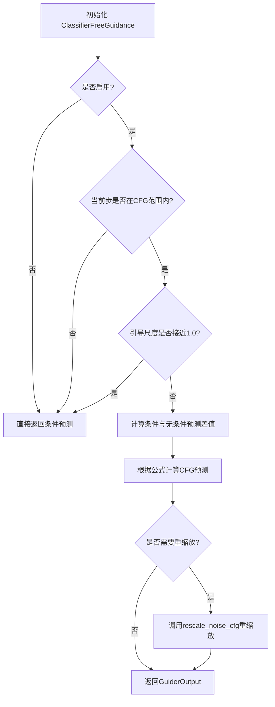
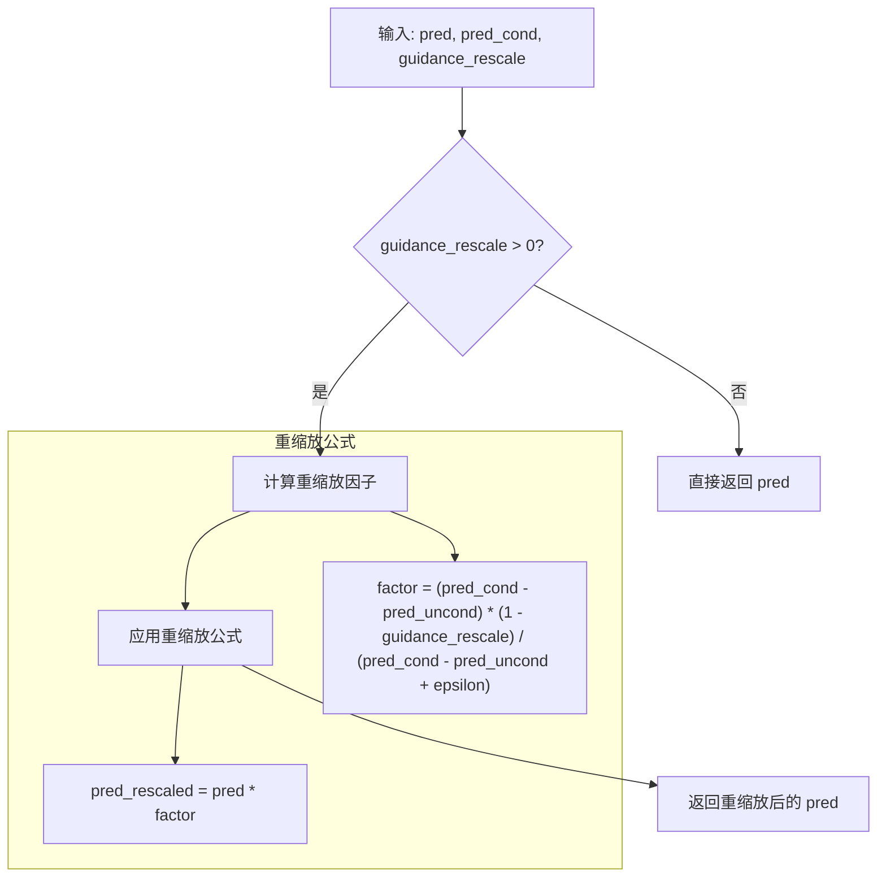
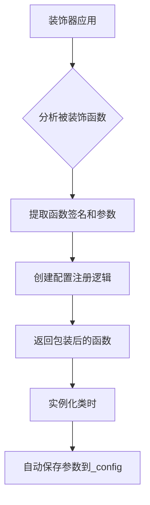
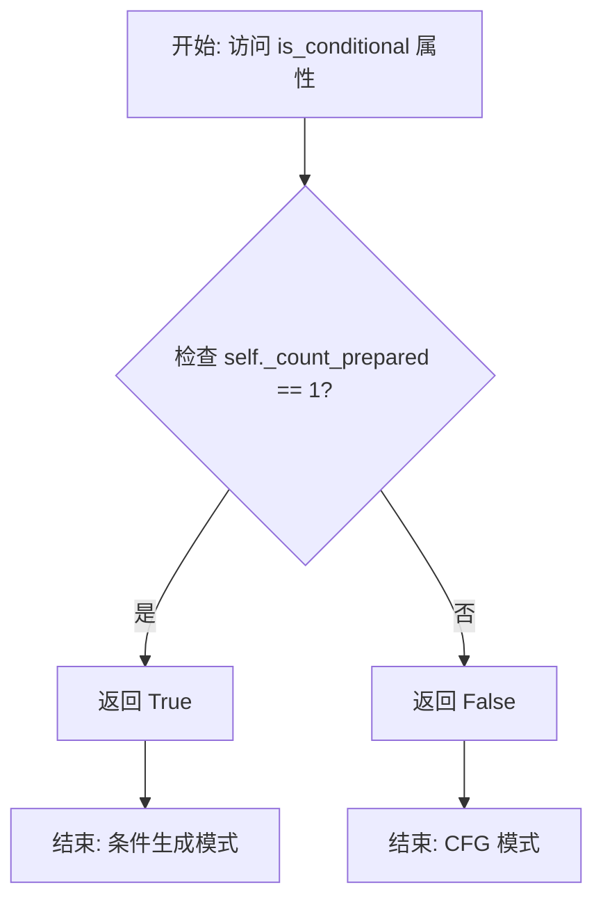
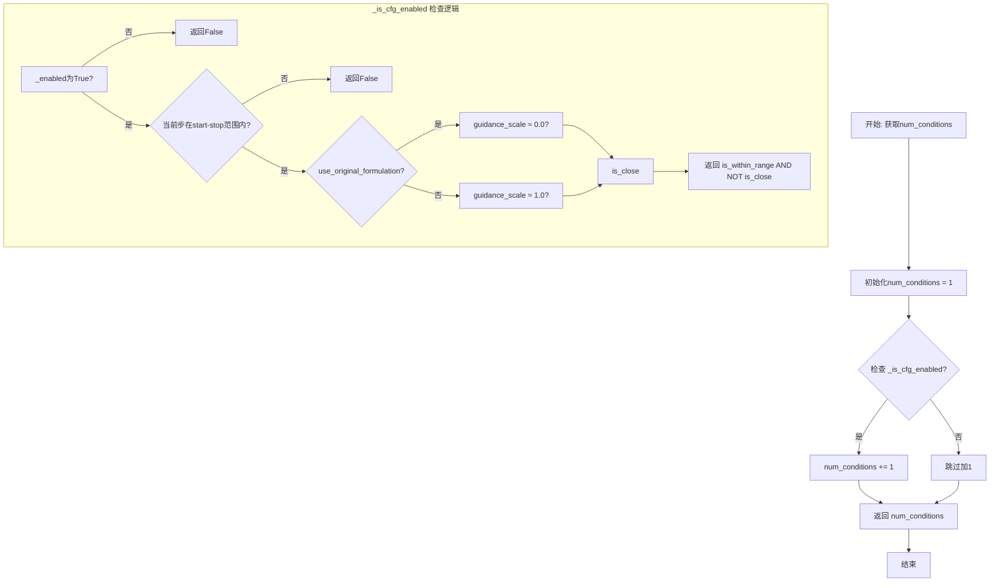

# `diffusers\src\diffusers\guiders\classifier_free_guidance.py` 详细设计文档

实现无分类器引导（Classifier-Free Guidance, CFG）技术，用于扩散模型的推理过程，通过结合条件预测和非条件预测来提高生成质量，支持两种CFG公式（原版和Diffusers-native）、引导尺度重缩放、动态启用/禁用控制等功能。

## 整体流程



## 类结构

```
BaseGuidance (抽象基类)
└── ClassifierFreeGuidance (无分类器引导实现)
```

## 全局变量及字段


### `ClassifierFreeGuidance.guidance_scale`
    
CFG引导尺度，控制条件生成与无条件生成的混合比例

类型：`float`
    


### `ClassifierFreeGuidance.guidance_rescale`
    
引导重缩放因子，用于防止高引导尺度下的过曝问题

类型：`float`
    


### `ClassifierFreeGuidance.use_original_formulation`
    
是否使用原始CFG公式，默认为False使用Diffusers原生公式

类型：`bool`
    


### `ClassifierFreeGuidance._input_predictions`
    
输入预测字段名列表，包含条件预测和无条件预测的标识符

类型：`list`
    
    

## 全局函数及方法


# rescale_noise_cfg 分析

## 概述

`rescale_noise_cfg` 是一个从 `guider_utils` 模块导入的全局函数，用于对 Classifier-Free Guidance (CFG) 的预测结果进行噪声重缩放，以防止高引导尺度下的过曝问题。该函数引用自论文 "Common Diffusion Noise Schedules and Sample Steps are Flawed" (https://huggingface.co/papers/2305.08891)。

**注意**：提供的代码中仅包含该函数的导入语句和调用示例，未包含函数的具体实现源码。以下信息基于代码中的使用方式推断。

---

### rescale_noise_cfg

参数：

- `pred`：`torch.Tensor`，经过 CFG 处理后的预测张量
- `pred_cond`：`torch.Tensor`，条件预测张量（用于重缩放计算）
- `guid_rescale`：`float`，重缩放因子，取值范围 0.0-1.0

返回值：`torch.Tensor`，重缩放后的预测张量

#### 流程图



#### 调用示例源码

在 `ClassifierFreeGuidance` 类中的调用方式：

```python
def forward(self, pred_cond: torch.Tensor, pred_uncond: torch.Tensor | None = None) -> GuiderOutput:
    pred = None

    # 判断 CFG 是否启用
    if not self._is_cfg_enabled():
        # 未启用时直接使用条件预测
        pred = pred_cond
    else:
        # 计算条件与无条件预测的差值
        shift = pred_cond - pred_uncond
        # 根据 formulation 选择基础预测值
        pred = pred_cond if self.use_original_formulation else pred_uncond
        # 应用引导尺度
        pred = pred + self.guidance_scale * shift

    # 如果设置了重缩放因子，则调用 rescale_noise_cfg 进行处理
    # 目的：防止高 guidance_scale 导致的过曝问题
    if self.guidance_rescale > 0.0:
        pred = rescale_noise_cfg(pred, pred_cond, self.guidance_rescale)

    return GuiderOutput(pred=pred, pred_cond=pred_cond, pred_uncond=pred_uncond)
```

---

## 补充说明

### 潜在的技术债务

1. **源码不可见**：`rescale_noise_cfg` 函数的具体实现隐藏在 `guider_utils` 模块中，文档缺失或未在此次提交中包含。

2. **类型推断**：由于函数从外部导入，静态类型检查工具可能无法正确推断其完整的函数签名。

### 设计目标

- **防止过曝**：通过重缩放机制平衡高引导尺度下的预测值，使生成图像既保持 prompt 遵循性又避免质量下降。
- **参数可调**：提供 `guidance_rescale` 参数，允许用户在 0.0（无重缩放）到 1.0（完全重缩放）之间灵活调整。

### 错误处理

基于代码逻辑推断：
- 当 `guidance_rescale <= 0.0` 时，直接返回原始预测，跳过重缩放计算
- 内部实现应包含 epsilon 防止除零错误

---

如需获取 `rescale_noise_cfg` 的完整实现源码，请提供 `guider_utils.py` 模块的内容。


### BaseGuidance.__init__

这是 `BaseGuidance` 基类的构造函数，用于初始化指导器（Guider）的基本配置参数。由于 `BaseGuidance` 类定义在 `guider_utils` 模块中（从 `.guider_utils` 导入），当前代码文件中仅保留了其调用逻辑。

参数：

- `start`：`float`，默认为 `0.0`，表示 CFG 开始的去噪步骤比例（0.0-1.0）
- `stop`：`float`，默认为 `1.0`，表示 CFG 结束的去噪步骤比例（0.0-1.0）
- `enabled`：`bool`，默认为 `True`，表示是否启用 CFG

返回值：`None`，构造函数无返回值，用于初始化对象状态

#### 流程图

```mermaid
flowchart TD
    A[开始 BaseGuidance.__init__] --> B[接收 start, stop, enabled 参数]
    B --> C[调用 super().__init__ 传递参数]
    C --> D[初始化基类属性: _start, _stop, _enabled, _step, _num_inference_steps 等]
    D --> E[返回 None]
    
    style A fill:#f9f,stroke:#333
    style E fill:#9f9,stroke:#333
```

#### 带注释源码

```python
# BaseGuidance 基类构造函数（在 guider_utils 模块中定义）
# 以下为从子类 ClassifierFreeGuidance 中推断的调用逻辑：

def __init__(
    self,
    start: float = 0.0,      # CFG 开始的去噪步骤比例，0.0 表示从第一步开始
    stop: float = 1.0,       # CFG 结束的去噪步骤比例，1.0 表示持续到最后一步
    enabled: bool = True,    # 是否启用 CFG，False 时只使用条件预测
):
    """
    初始化 BaseGuidance 基类。
    
    Args:
        start: CFG 开始应用的步骤比例 (0.0-1.0)
        stop: CFG 停止应用的步骤比例 (0.0-1.0)
        enabled: 是否启用指导器
    """
    # 调用 object 基类初始化
    super().__init__()
    
    # 存储配置参数
    self._start = start
    self._stop = stop
    self._enabled = enabled
    
    # 初始化内部状态
    self._step = 0  # 当前去噪步骤
    self._num_inference_steps = None  # 总去噪步骤数
    self._count_prepared = 0  # 已准备的条件数量
```

---

**注意**：由于 `BaseGuidance` 类的完整源码定义在 `guider_utils` 模块中，当前代码文件仅展示了其子类 `ClassifierFreeGuidance` 对基类构造函数的调用。上述信息是基于调用上下文推断得出的。如需完整的 `BaseGuidance` 类设计文档，需要查看 `guider_utils.py` 源文件。


### register_to_config

`register_to_config` 是一个装饰器，用于自动将 `__init__` 方法的参数注册为类的配置属性。它通常会将所有参数及其默认值存储到 `_config` 属性中，使得这些配置可以被持久化或序列化。该装饰器源自 Hugging Face diffusers 库的 `configuration_utils` 模块。

参数：

-  `func`：`<missing>`，被装饰的 `__init__` 方法（函数对象）

返回值：`<missing>`，装饰器返回的函数，通常是一个包装后的 `__init__` 方法（函数对象）

#### 流程图



#### 带注释源码

```
# 该装饰器的典型实现（基于 Hugging Face diffusers 模式）
# 源码位于: src/diffusers/configuration_utils.py

def register_to_config(init):
    """
    用于自动注册 __init__ 方法参数到 _config 属性的装饰器。
    
    被装饰的类的 __init__ 方法的所有参数（除了 self）都会被自动
    保存到 self._config 属性中。
    """
    # 存储原始 __init__ 方法的参数名和默认值
    # 通过 inspect 模块获取函数签名
    signature = inspect.signature(init)
    parameters = signature.parameters
    
    # 包装后的 __init__ 方法
    @functools.wraps(init)
    def __init__(self, *args, **kwargs):
        # 首先调用原始 __init__ 方法
        init(self, *args, **kwargs)
        
        # 创建一个包含所有配置属性的字典
        # 过滤掉 self 和 *args, **kwargs
        config = {}
        
        # 获取位置参数和关键字参数的值
        bound_args = signature.bind(self, *args, **kwargs)
        bound_args.apply_defaults()
        
        # 排除 self，保存其余参数到 _config
        for param_name, param_value in bound_args.arguments.items():
            if param_name != 'self':
                config[param_name] = param_value
        
        # 将配置存储到 _config 属性
        self._config = config
    
    return __init__
```

**使用示例（基于代码中的实际用法）：**

```
@register_to_config  # 装饰于 ClassifierFreeGuidance.__init__
def __init__(
    self,
    guidance_scale: float = 7.5,
    guidance_rescale: float = 0.0,
    use_original_formulation: bool = False,
    start: float = 0.0,
    stop: float = 1.0,
    enabled: bool = True,
):
    super().__init__(start, stop, enabled)
    self.guidance_scale = guidance_scale
    self.guidance_rescale = guidance_rescale
    self.use_original_formulation = use_original_formulation

# 装饰器会自动将以下参数保存到 self._config:
# self._config = {
#     "guidance_scale": 7.5,
#     "guidance_rescale": 0.0,
#     "use_original_formulation": False,
#     "start": 0.0,
#     "stop": 1.0,
#     "enabled": True
# }
```

**注意事项：**

- 实际的 `register_to_config` 实现位于 `configuration_utils` 模块中，此处展示的是基于其行为的推断实现
- 该装饰器允许配置被序列化和反序列化（如保存到 JSON/YAML）
- 这是 Hugging Face Diffusers 库中常见的配置管理模式


### ClassifierFreeGuidance.__init__

该方法是 `ClassifierFreeGuidance` 类的构造函数，负责初始化 Classifier-Free Guidance (CFG) 扩散模型引导器的各项配置参数，包括引导强度、重新缩放因子、公式变体选择、启用时间窗口等。

参数：

- `self`：隐式参数，实例对象本身
- `guidance_scale`：`float`，默认值 `7.5`，CFG 缩放因子，控制条件预测与无条件预测之间的插值强度，值越大条件引导越强
- `guidance_rescale`：`float`，默认值 `0.0`，引导重新缩放因子，用于防止高引导强度下的过曝问题，参考 Common Diffusion Noise Schedules 论文
- `use_original_formulation`：`bool`，默认值 `False`，是否使用原始 CFG 公式（来自论文），若为 False 则使用 Diffusers 原生的 Imagen 公式
- `start`：`float`，默认值 `0.0`，CFG 开始生效的去噪步骤分数（0.0-1.0），用于跳过早期去噪步骤
- `stop`：`float`，默认值 `1.0`，CFG 停止生效的去噪步骤分数（0.0-1.0），用于跳过晚期去噪步骤
- `enabled`：`bool`，默认值 `True`，CFG 是否启用，为 False 时仅使用条件预测

返回值：`None`，无返回值（`__init__` 方法返回 None）

#### 流程图

```mermaid
flowchart TD
    A[__init__ 调用] --> B[调用父类初始化 super().__init__start stop enabled]
    B --> C[设置 self.guidance_scale = guidance_scale]
    C --> D[设置 self.guidance_rescale = guidance_rescale]
    D --> E[设置 self.use_original_formulation = use_original_formulation]
    E --> F[初始化完成]
    
    B -.->|继承自| G[BaseGuidance]
    G --> G1[设置 self._start]
    G1 --> G2[设置 self._stop]
    G2 --> G3[设置 self._enabled]
    G3 --> G4[初始化 self._num_inference_steps = None]
    G4 --> G5[初始化 self._step = 0]
    G5 --> G6[初始化 self._count_prepared = 0]
```

#### 带注释源码

```python
@register_to_config
def __init__(
    self,
    guidance_scale: float = 7.5,
    guidance_rescale: float = 0.0,
    use_original_formulation: bool = False,
    start: float = 0.0,
    stop: float = 1.0,
    enabled: bool = True,
):
    """
    初始化 ClassifierFreeGuidance 实例。
    
    Args:
        guidance_scale: CFG 缩放因子，默认 7.5
        guidance_rescale: 重新缩放因子，默认 0.0
        use_original_formulation: 是否使用原始公式，默认 False
        start: CFG 开始步骤分数，默认 0.0
        stop: CFG 停止步骤分数，默认 1.0
        enabled: 是否启用 CFG，默认 True
    """
    # 调用父类 BaseGuidance 的 __init__ 方法
    # 传递 start、stop、enabled 参数
    super().__init__(start, stop, enabled)

    # 保存 CFG 缩放因子，控制条件引导强度
    self.guidance_scale = guidance_scale
    # 保存引导重新缩放因子，防止高引导强度过曝
    self.guidance_rescale = guidance_rescale
    # 保存是否使用原始 CFG 公式的标志
    self.use_original_formulation = use_original_formulation
```


### `ClassifierFreeGuidance.prepare_inputs`

该方法负责准备分类器无关引导（CFG）的输入数据。它根据条件数量确定需要处理的预测类型（条件预测或无条件预测），并为每种预测类型调用内部批处理方法，最终返回包含所有处理后数据的 BlockState 列表。

参数：

-  `data`：`dict[str, tuple[torch.Tensor, torch.Tensor]]`，输入数据字典，键为字符串，值为两个张量的元组（通常包含条件预测和无条件预测）

返回值：`list["BlockState"]`，返回处理后的 BlockState 对象列表，用于后续的 CFG 前向传播

#### 流程图

```mermaid
flowchart TD
    A[开始 prepare_inputs] --> B{self.num_conditions == 1?}
    B -->|是| C[tuple_indices = [0]]
    B -->|否| D[tuple_indices = [0, 1]]
    C --> E[初始化空列表 data_batches]
    D --> E
    E --> F[遍历 zip tuple_indices 和 self._input_predictions]
    F --> G[调用 self._prepare_batch]
    G --> H[将结果追加到 data_batches]
    H --> I{还有下一个元素?}
    I -->|是| F
    I -->|否| J[返回 data_batches]
```

#### 带注释源码

```python
def prepare_inputs(self, data: dict[str, tuple[torch.Tensor, torch.Tensor]]) -> list["BlockState"]:
    """
    准备 CFG 所需的输入数据批次。
    
    根据条件数量确定需要处理的预测类型索引，然后为每种预测类型
    调用内部批处理方法生成对应的 BlockState 对象列表。
    
    参数:
        data: 输入数据字典，键为字符串，值为包含两个张量的元组
             （例如：(pred_cond, pred_uncond)）
    
    返回:
        包含处理后 BlockState 对象的列表
    """
    # 根据条件数量决定元组索引：如果只有一个条件则只处理索引 0，
    # 否则同时处理索引 0 和 1（对应条件预测和无条件预测）
    tuple_indices = [0] if self.num_conditions == 1 else [0, 1]
    
    # 初始化用于存储处理后批次的列表
    data_batches = []
    
    # 遍历预测类型索引和对应的预测名称
    for tuple_idx, input_prediction in zip(tuple_indices, self._input_predictions):
        # 调用内部方法准备单个批次数据
        # _input_predictions 包含 ["pred_cond", "pred_uncond"]
        data_batch = self._prepare_batch(data, tuple_idx, input_prediction)
        
        # 将处理后的批次添加到结果列表
        data_batches.append(data_batch)
    
    # 返回所有处理后的批次数据
    return data_batches
```


### `ClassifierFreeGuidance.prepare_inputs_from_block_state`

该方法用于从 BlockState 中准备 CFG 引导所需的输入数据，根据条件数量（单条件或多条件）处理条件预测和无条件预测，生成对应的数据批次列表。

参数：

-  `self`：`ClassifierFreeGuidance` 实例，调用该方法的对象本身
-  `data`：`BlockState`，包含当前去噪步骤的块状态数据（如模型预测结果、潜在变量等）
-  `input_fields`：`dict[str, str | tuple[str, str]]`，字典，键为字段名称，值为字段对应的 BlockState 中的键（单字符串或元组形式）

返回值：`list[BlockState]`，返回处理后的 BlockState 数据批次列表，每个元素对应一个预测类型（条件预测或无条件预测）

#### 流程图

```mermaid
flowchart TD
    A[开始 prepare_inputs_from_block_state] --> B{self.num_conditions == 1?}
    B -->|是| C[tuple_indices = [0]]
    B -->|否| D[tuple_indices = [0, 1]]
    C --> E[初始化空列表 data_batches]
    D --> E
    E --> F[遍历 zip tuple_indices 和 self._input_predictions]
    F --> G[input_prediction: 'pred_cond']
    G --> H{条件为1?}
    H -->|是| I[只处理条件预测, 跳过无条件]
    H -->|否| J[调用 _prepare_batch_from_block_state]
    I --> K[将 data_batch 加入 data_batches]
    J --> K
    K --> L{还有更多 input_prediction?}
    L -->|是| M[处理 'pred_uncond']
    M --> J
    L -->|否| N[返回 data_batches]
```

#### 带注释源码

```
def prepare_inputs_from_block_state(
    self, data: "BlockState", input_fields: dict[str, str | tuple[str, str]]
) -> list["BlockState"]:
    """
    从 BlockState 中准备 CFG 引导所需的输入数据。
    
    根据条件数量决定处理哪些预测类型：
    - 单条件 (num_conditions == 1): 仅处理条件预测 (pred_cond)
    - 多条件 (num_conditions == 2): 处理条件预测 (pred_cond) 和无条件预测 (pred_uncond)
    
    参数:
        data: 包含当前去噪步骤数据的 BlockState 对象
        input_fields: 字段映射字典，指定如何从 BlockState 中提取所需数据
    
    返回:
        BlockState 对象列表，每个对应一个预测类型的批次数据
    """
    # 根据条件数量决定 tuple 索引：单条件为 [0]，多条件为 [0, 1]
    tuple_indices = [0] if self.num_conditions == 1 else [0, 1]
    
    # 初始化存储数据批次的列表
    data_batches = []
    
    # 遍历 tuple 索引和预测类型名称
    # _input_predictions = ["pred_cond", "pred_uncond"]
    for tuple_idx, input_prediction in zip(tuple_indices, self._input_predictions):
        # 调用内部方法从 BlockState 中提取并准备批次数据
        data_batch = self._prepare_batch_from_block_state(
            input_fields, data, tuple_idx, input_prediction
        )
        data_batches.append(data_batch)
    
    # 返回所有数据批次
    return data_batches
```


### `ClassifierFreeGuidance.forward`

该方法实现 Classifier-Free Guidance (CFG) 的前向传播，通过结合条件预测和无条件预测来提高生成质量，根据配置的计算公式（原始形式或Diffusers-native形式）计算最终预测结果，并可选地进行噪声cfg重缩放。

参数：

- `pred_cond`：`torch.Tensor`，条件预测，由带prompt的模型生成的预测结果
- `pred_uncond`：`torch.Tensor | None`，无条件预测，由不带prompt的模型生成的预测结果，可为None（当CFG未启用时）

返回值：`GuiderOutput`，包含最终预测结果、条件预测和无条件预测的输出对象

#### 流程图

```mermaid
flowchart TD
    A[开始 forward] --> B{CFG是否启用?}
    B -->|否| C[pred = pred_cond]
    B -->|是| D{计算 shift}
    D --> D1[shift = pred_cond - pred_uncond]
    D1 --> E{使用原始公式?}
    E -->|是| F[base = pred_cond]
    E -->|否| G[base = pred_uncond]
    F --> H[pred = base + guidance_scale * shift]
    G --> H
    C --> I{guidance_rescale > 0?}
    H --> I
    I -->|是| J[pred = rescale_noise_cfg<br/>(pred, pred_cond, guidance_rescale)]
    I -->|否| K[返回 GuiderOutput]
    J --> K
```

#### 带注释源码

```python
def forward(self, pred_cond: torch.Tensor, pred_uncond: torch.Tensor | None = None) -> GuiderOutput:
    """
    执行 Classifier-Free Guidance 前向传播
    
    参数:
        pred_cond: 条件预测，基于文本提示的模型输出
        pred_uncond: 无条件预测，无文本提示的模型输出
        
    返回:
        包含最终预测及中间结果的 GuiderOutput 对象
    """
    # 初始化预测结果为 None
    pred = None

    # 检查 CFG 是否在当前步骤启用
    if not self._is_cfg_enabled():
        # CFG 未启用时，直接返回条件预测（无引导）
        pred = pred_cond
    else:
        # 计算条件与无条件预测之间的差异
        shift = pred_cond - pred_uncond
        
        # 根据配置选择基础预测：
        # 原始公式: pred_cond + scale * (pred_cond - pred_uncond)
        # Diffusers-native公式: pred_uncond + scale * (pred_cond - pred_uncond)
        pred = pred_cond if self.use_original_formulation else pred_uncond
        
        # 应用 guidance_scale 进行预测偏移
        pred = pred + self.guidance_scale * shift

    # 如果配置了 guidance_rescale，进行重缩放以防止过曝
    if self.guidance_rescale > 0.0:
        pred = rescale_noise_cfg(pred, pred_cond, self.guidance_rescale)

    # 返回包含所有预测结果的 GuiderOutput
    return GuiderOutput(pred=pred, pred_cond=pred_cond, pred_uncond=pred_uncond)
```


### `ClassifierFreeGuidance.is_conditional`

该属性方法用于判断当前 ClassifierFreeGuidance 配置是否为条件生成模式。它通过比较内部计数器 `_count_prepared` 的值是否等于 1 来确定返回结果：当仅准备了一个输入（即条件输入）时返回 `True`，表示处于条件生成模式；当准备了两个输入（条件+无条件）时返回 `False`。

参数：

- 该方法为属性方法，无显式参数（`self` 为隐含参数）

返回值：`bool`，返回 `True` 表示当前为条件生成模式（仅使用条件预测），返回 `False` 表示当前为 CFG 模式（同时使用条件和无条件预测）

#### 流程图



#### 带注释源码

```python
@property
def is_conditional(self) -> bool:
    """
    判断当前 CFG 配置是否为条件生成模式。
    
    当 _count_prepared == 1 时，表示仅准备了条件输入（pred_cond），
    没有准备无条件输入（pred_uncond），此时为纯条件生成模式。
    
    当 _count_prepared == 2 时，表示同时准备了条件和无条件输入，
    此时为完整的 CFG 模式。
    
    Returns:
        bool: True 表示条件生成模式，False 表示 CFG 模式
    """
    return self._count_prepared == 1
```


### `ClassifierFreeGuidance.num_conditions`

该属性方法用于返回当前配置下的条件数量。在Classifier-Free Guidance (CFG) 扩散模型中，条件数量决定了需要准备多少组预测输入。当CFG启用时，需要同时准备条件预测(pred_cond)和无条件预测(pred_uncond)两组数据；当CFG禁用时仅需准备条件预测。

参数：无需显式参数（作为属性方法，通过`self`访问实例状态）

返回值：`int`，返回当前去噪步骤所需的条件数量（1表示仅条件预测，2表示条件预测+无条件预测）

#### 流程图



#### 带注释源码

```python
@property
def num_conditions(self) -> int:
    """
    返回当前配置所需的条件数量。
    
    在Classifier-Free Guidance中：
    - CFG禁用时：只需1个条件（条件预测）
    - CFG启用时：需要2个条件（条件预测 + 无条件预测）
    
    该属性用于prepare_inputs和prepare_inputs_from_block_state方法中，
    决定需要准备多少组数据批次。
    
    Returns:
        int: 条件数量，1表示仅条件预测，2表示条件+无条件预测
    """
    # 初始化基础条件数量为1（条件预测 pred_cond）
    num_conditions = 1
    
    # 检查CFG是否启用，如果启用则条件数量加1
    # 因为需要额外的无条件预测 (pred_uncond)
    if self._is_cfg_enabled():
        num_conditions += 1
    
    # 返回计算后的条件总数
    return num_conditions
```

#### 关联方法说明

该属性方法与以下方法紧密配合：

| 方法名 | 作用 |
|--------|------|
| `prepare_inputs` | 使用`num_conditions`决定`tuple_indices`的值：[0]或[0,1] |
| `prepare_inputs_from_block_state` | 同上，用于从块状态准备输入数据 |
| `_is_cfg_enabled` | 被`num_conditions`调用，确定CFG是否真正启用 |


### `ClassifierFreeGuidance._is_cfg_enabled`

该方法用于判断 Classifier-Free Guidance (CFG) 是否在当前推理步骤中启用，通过检查启用状态、当前步数是否在配置的 CFG 生效范围内以及 guidance_scale 是否有效（不为 0.0 或 1.0）来综合决定。

参数：该方法无显式参数（隐式接收 `self` 实例）

返回值：`bool`，返回 `True` 表示 CFG 在当前步骤启用，返回 `False` 表示禁用

#### 流程图

```mermaid
flowchart TD
    A[开始 _is_cfg_enabled] --> B{self._enabled 是否为 True?}
    B -->|否| C[返回 False]
    B -->|是| D{self._num_inference_steps is not None?}
    D -->|否| E[is_within_range = True]
    D -->|是| F[计算 skip_start_step = int(self._start * self._num_inference_steps)]
    F --> G[计算 skip_stop_step = int(self._stop * self._num_inference_steps)]
    G --> H{skip_start_step <= self._step < skip_stop_step?}
    H -->|是| E
    H -->|否| I[is_within_range = False]
    E --> J{self.use_original_formulation?}
    I --> J
    J -->|是| K{math.isclose<br/>self.guidance_scale<br/>0.0?}
    J -->|否| L{math.isclose<br/>self.guidance_scale<br/>1.0?}
    K -->|是| M[is_close = True]
    K -->|否| N[is_close = False]
    L -->|是| M
    L -->|否| N
    M --> O[返回 is_within_range and not is_close]
    N --> O
    C --> O
```

#### 带注释源码

```python
def _is_cfg_enabled(self) -> bool:
    """
    判断当前推理步骤中 CFG 是否启用。
    
    CFG 启用的条件：
    1. enabled 属性为 True
    2. 当前步数在 [start * num_inference_steps, stop * num_inference_steps) 范围内
    3. guidance_scale 不等于临界值（原始公式下为 0.0，diffusers-native 公式下为 1.0）
    
    Returns:
        bool: CFG 是否在当前步骤启用
    """
    # 第一步检查：全局启用开关
    if not self._enabled:
        return False  # 如果 guider 被全局禁用，直接返回 False

    # 第二步检查：当前步数是否在 CFG 生效的时间范围内
    is_within_range = True
    if self._num_inference_steps is not None:
        # 计算 CFG 开始和停止的绝对步数
        skip_start_step = int(self._start * self._num_inference_steps)
        skip_stop_step = int(self._stop * self._num_inference_steps)
        # 判断当前步是否在 [start, stop) 区间内
        is_within_range = skip_start_step <= self._step < skip_stop_step

    # 第三步检查：guidance_scale 是否为临界值
    # 当 guidance_scale = 0（原始公式）或 1（diffusers-native 公式）时，
    # CFG 不会产生效果，等效于禁用
    is_close = False
    if self.use_original_formulation:
        # 原始公式下，临界值为 0.0
        is_close = math.isclose(self.guidance_scale, 0.0)
    else:
        # diffusers-native 公式下，临界值为 1.0
        is_close = math.isclose(self.guidance_scale, 1.0)

    # 综合判断：必须在有效步数范围内 且 guidance_scale 不等于临界值
    return is_within_range and not is_close
```

## 关键组件


### ClassifierFreeGuidance 类

实现无分类器引导（CFG）的核心类，用于扩散模型的生成质量提升和提示词对齐。

### guidance_scale 参数

CFG缩放因子，控制条件预测与无条件预测之间的加权强度，典型范围1.0-20.0。

### guidance_rescale 参数

基于"Common Diffusion Noise Schedules and Sample Steps are Flawed"论文的重缩放因子，防止高引导强度导致的过曝问题。

### forward 方法

执行CFG计算的核心方法，支持两种公式：原始论文公式和Diffusers原生公式（Imagen论文），并可选进行噪声配置重缩放。

### _is_cfg_enabled 方法

判断CFG是否在当前去噪步骤启用，综合考虑enabled状态、步数范围（start/stop）和guidance_scale值。

### prepare_inputs / prepare_inputs_from_block_state

实现张量索引与惰性加载的输入准备方法，根据num_conditions动态选择处理单条件或双条件预测。

### use_original_formulation 开关

控制CFG公式选择：True使用原始论文公式 x_pred = x_cond + scale * (x_cond - x_uncond)，False使用Diffusers原生公式 x_pred = x_uncond + scale * (x_cond - x_uncond)。

### start / stop 参数

CFG生效的去噪步骤范围（0.0-1.0分数），实现早期或晚期步骤禁用CFG的惰性加载策略。

### rescale_noise_cfg 函数引用

外部工具函数，用于根据预测条件对噪声配置进行重缩放处理，源自guider_utils模块。


## 问题及建议


### 已知问题

-   **重复代码模式**：`prepare_inputs` 和 `prepare_inputs_from_block_state` 方法中存在几乎完全相同的循环逻辑，仅调用的内部方法不同，可通过提取公共方法减少重复。
-   **属性计算开销**：`num_conditions` 属性在每次调用时都会执行 `_is_cfg_enabled()` 判断，当在循环中频繁访问时会造成不必要的性能开销，应考虑缓存或延迟计算。
-   **缺少输入验证**：构造函数未对参数范围进行校验（如 `guidance_scale` 应为正数、`start`/`stop` 应在 [0,1] 范围内、`start` 应小于 `stop` 等），可能导致运行时错误。
-   **类型注解不完整**：`forward` 方法中 `pred_uncond` 参数类型为 `torch.Tensor | None`，但当 CFG 启用时该值不应为 `None`，缺少运行时校验。
-   **硬编码值**：`tuple_indices = [0] if self.num_conditions == 1 else [0, 1]` 和 `_input_predictions = ["pred_cond", "pred_uncond"]` 应作为类常量或配置常量提取，提高可维护性。
-   **边界条件处理**：`stop` 参数设置为 1.0 时，`skip_stop_step = int(self._stop * self._num_inference_steps)` 会在某些情况下导致最后一个 step 被跳过，与文档描述的"在第 stop 步之后停止"语义不完全一致。
-   **文档不一致**：类 docstring 描述了两种 CFG 公式，但对 `start`/`stop` 参数的具体生效机制说明不够清晰，未明确说明是按 step 索引还是按时间步比例计算。

### 优化建议

-   将 `prepare_inputs` 和 `prepare_inputs_from_block_state` 中的公共循环逻辑提取为私有方法，如 `_build_data_batches`，接收工厂函数作为参数。
-   将 `num_conditions` 和 `_input_predictions` 相关的硬编码逻辑提取为类常量 `CONDITION_INDICES`。
-   在 `__init__` 中添加参数校验逻辑，确保 `0.0 <= start <= stop <= 1.0` 和 `guidance_scale >= 0.0`。
-   在 `forward` 方法开始时添加断言或显式检查，当 `pred_uncond` 为 `None` 且 CFG 启用时抛出有意义的错误信息。
-   考虑将 `_is_cfg_enabled()` 的结果缓存到实例变量中，仅在 `step` 变化时重新计算，减少重复调用开销。
-   完善边界条件处理逻辑，确保 `stop=1.0` 时能正确包含最后一个 denoising step。
-   为 `prepare_inputs` 方法的返回类型添加更精确的泛型类型注解。


## 其它


### 设计目标与约束

**设计目标**：
- 实现无分类器引导（CFG）算法，用于改善扩散模型的生成质量
- 提供灵活的配置选项，支持不同的CFG公式和引导策略
- 支持在特定去噪步骤范围内启用/禁用CFG，实现动态引导控制

**设计约束**：
- 继承自`BaseGuidance`基类，必须实现其定义的接口方法
- 输入预测必须包含`pred_cond`（条件预测），可选包含`pred_uncond`（无条件预测）
- `guidance_scale`必须在合理范围内（通常1.0-20.0），过大会导致质量下降
- `guidance_rescale`用于防止过度曝光，范围0.0-1.0

### 错误处理与异常设计

**输入验证**：
- `guidance_scale`为0时，使用原始公式时无效果；使用Diffusers原生公式时等价于无条件生成
- `guidance_rescale`必须为非负值，否则可能产生数值不稳定
- `start`和`stop`参数必须在[0.0, 1.0]范围内，且start < stop
- 当CFG禁用时，`pred_uncond`参数可以传入None

**边界情况处理**：
- 当`num_conditions == 1`时（CFG禁用或单条件），只准备一个数据批次
- 当`guidance_scale`接近0（原公式）或1（Diffusers公式）时，CFG自动禁用以避免无效计算
- 步骤范围检查使用整数比较，确保在有效步骤范围内才启用CFG

### 数据流与状态机

**数据输入流**：
```
外部数据字典 → prepare_inputs() / prepare_inputs_from_block_state() 
→ _prepare_batch() / _prepare_batch_from_block_state() 
→ BlockState列表 → forward()方法
```

**状态转换**：
- **初始化状态**：创建CFG实例，设置配置参数
- **准备状态**：调用`prepare_inputs`或`prepare_inputs_from_block_state`准备输入数据
- **执行状态**：调用`forward`方法执行CFG计算，输出`GuiderOutput`
- **状态管理**：通过`_step`、`_num_inference_steps`、`_enabled`等属性跟踪当前状态

**关键状态变量**：
- `_enabled`：CFG全局启用/禁用开关
- `_step`：当前去噪步骤（用于范围判断）
- `_num_inference_steps`：总去噪步骤数（用于范围判断）
- `_start`/`_stop`：CFG启用/禁用的步骤范围

### 外部依赖与接口契约

**直接依赖**：
- `torch`：张量运算和数学函数
- `math`：数值比较（`math.isclose`）
- `..configuration_utils.register_to_config`：配置装饰器
- `.guider_utils.BaseGuidance`：基类
- `.guider_utils.GuiderOutput`：输出数据结构
- `.guider_utils.rescale_noise_cfg`：噪声重缩放工具函数
- `..modular_pipelines.modular_pipeline.BlockState`：块状态数据类型

**接口契约**：
- `prepare_inputs(data: dict[str, tuple[torch.Tensor, torch.Tensor]]) -> list[BlockState]`：从字典准备输入
- `prepare_inputs_from_block_state(data: BlockState, input_fields: dict[str, str | tuple[str, str]]) -> list[BlockState]`：从BlockState准备输入
- `forward(pred_cond: torch.Tensor, pred_uncond: torch.Tensor | None = None) -> GuiderOutput`：执行CFG计算
- 属性`is_conditional`：返回是否为条件模式
- 属性`num_conditions`：返回条件数量（1或2）

### 配置参数详细说明

| 参数名 | 类型 | 默认值 | 说明 |
|--------|------|--------|------|
| guidance_scale | float | 7.5 | CFG缩放因子，控制条件预测的权重 |
| guidance_rescale | float | 0.0 | 噪声重缩放因子，防止过度曝光 |
| use_original_formulation | bool | False | 是否使用原始CFG公式 |
| start | float | 0.0 | CFG开始的步骤比例（0.0-1.0） |
| stop | float | 1.0 | CFG结束的步骤比例（0.0-1.0） |
| enabled | bool | True | CFG全局启用开关 |

### 数学公式说明

**原始CFG公式**（use_original_formulation=True）：
```
x_pred = x_cond + guidance_scale * (x_cond - x_uncond)
```
含义：将条件预测进一步远离无条件预测

**Diffusers原生公式**（默认，use_original_formulation=False）：
```
x_pred = x_uncond + guidance_scale * (x_cond - x_uncond)
```
含义：将无条件预测向条件预测方向移动，抑制负面特征

**重缩放公式**（guidance_rescale > 0）：
基于论文"Common Diffusion Noise Schedules and Sample Steps are Flawed"，用于修正高引导尺度下的过度曝光问题

### 使用示例

```python
# 基本用法
guider = ClassifierFreeGuidance(
    guidance_scale=7.5,
    guidance_rescale=0.0,
    use_original_formulation=False,
    start=0.0,
    stop=1.0,
    enabled=True
)

# 准备输入
data = {
    "pred_cond": (cond_tensor,),
    "pred_uncond": (uncond_tensor,)
}
block_states = guider.prepare_inputs(data)

# 执行前向传播
output = guider.forward(pred_cond, pred_uncond)
# output.pred: 应用CFG后的预测
# output.pred_cond: 原始条件预测
# output.pred_uncond: 原始无条件预测
```

### 版本历史与参考文献

**参考文献**：
- Classifier-Free Diffusion Guidance (https://huggingface.co/papers/2207.12598)
- Imagen (Diffusers原生公式来源)
- Common Diffusion Noise Schedules and Sample Steps are Flawed (https://huggingface.co/papers/2305.08891) - guidance_rescale的理论基础

**版本信息**：
- 代码版权：HuggingFace Team © 2025
- 许可证：Apache License 2.0

### 与基类交互详细说明

**继承关系**：
`ClassifierFreeGuidance` → `BaseGuidance`

**从基类继承的属性和方法**：
- `_enabled`：全局启用状态
- `_start`/`_stop`：步骤范围
- `_step`：当前步骤
- `_num_inference_steps`：总步骤数
- `_count_prepared`：已准备输入计数
- `_prepare_batch()`：准备批数据
- `_prepare_batch_from_block_state()`：从BlockState准备数据

**基类要求实现的抽象方法**：
- `prepare_inputs()`：准备输入数据
- `prepare_inputs_from_block_state()`：从BlockState准备输入
- `forward()`：执行引导计算
- `is_conditional`属性：判断是否为条件模式
- `num_conditions`属性：返回条件数量

### 性能考虑与优化空间

**计算优化**：
- 当`guidance_scale`接近禁用阈值时，跳过CFG计算直接返回条件预测
- 使用`math.isclose`进行浮点数比较，避免精确相等判断
- 步骤范围检查使用整数运算，避免不必要的浮点开销

**潜在优化方向**：
- 可考虑使用原地操作（in-place operation）减少内存分配
- 对于大规模批量处理，可预先计算缩放因子
- 可添加CUDA优化支持，利用GPU加速张量运算


    