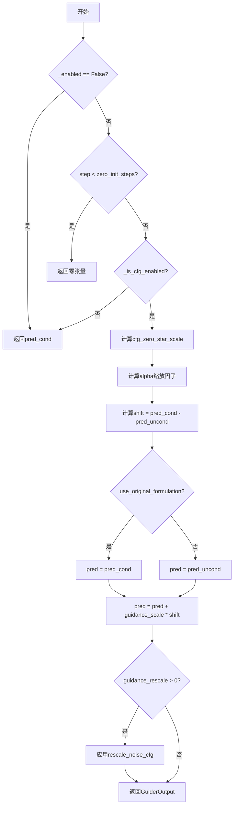
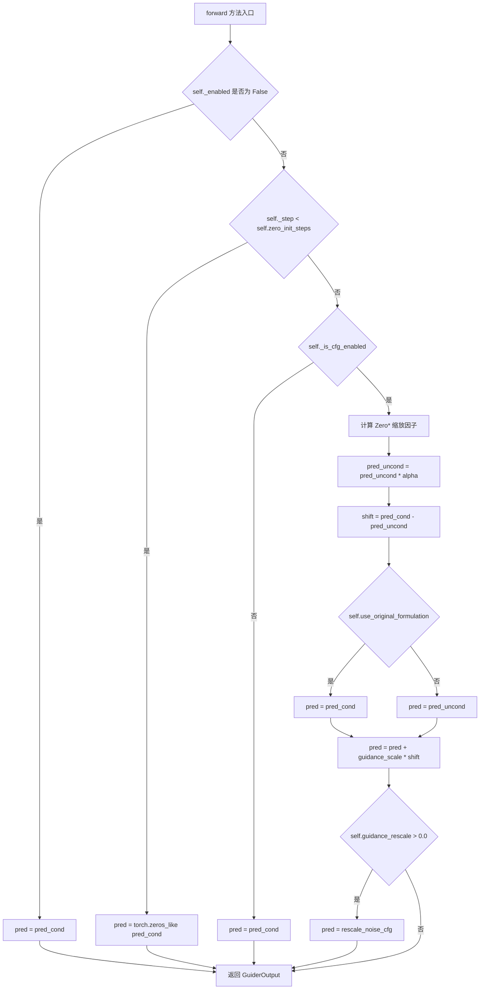
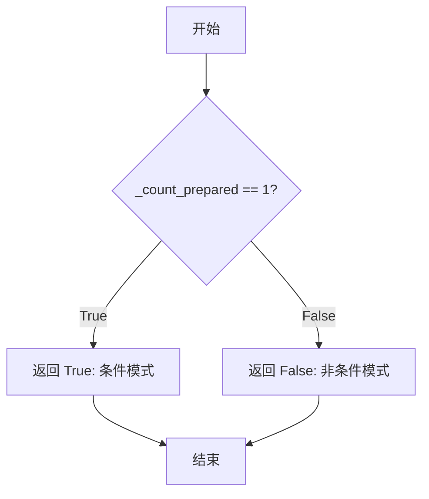
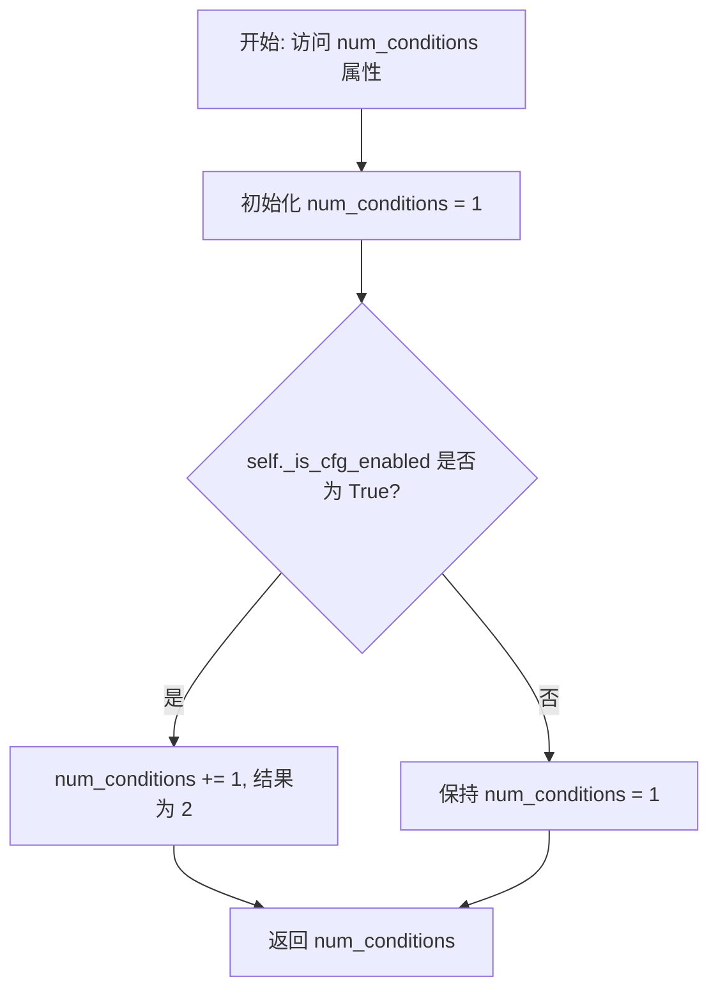

# `diffusers\src\diffusers\guiders\classifier_free_zero_star_guidance.py` 详细设计文档

实现Classifier-Free Zero*引导技术，用于扩散模型的图像生成，通过零初始化前几步的噪声预测并引入最优重缩放因子来提高生成图像质量

## 整体流程



## 类结构

```
BaseGuidance (抽象基类)
└── ClassifierFreeZeroStarGuidance
```

## 全局变量及字段


### `cfg_zero_star_scale`
    
计算CFG-Zero*的缩放因子，基于条件和无条件预测的点积与无条件预测的平方范数之比

类型：`function`
    


### `ClassifierFreeZeroStarGuidance.guidance_scale`
    
分类器自由引导的缩放参数，控制文本提示对生成结果的条件强度

类型：`float`
    


### `ClassifierFreeZeroStarGuidance.zero_init_steps`
    
噪声预测被清零的推理步数，用于CFG-Zero*方法的初始步骤

类型：`int`
    


### `ClassifierFreeZeroStarGuidance.guidance_rescale`
    
噪声预测的重缩放因子，用于改善图像质量并修复过曝问题

类型：`float`
    


### `ClassifierFreeZeroStarGuidance.use_original_formulation`
    
是否使用原始分类器自由引导公式的标志位

类型：`bool`
    


### `ClassifierFreeZeroStarGuidance._input_predictions`
    
类属性定义了输入预测的键名列表，包含条件预测和无条件预测

类型：`list[str]`
    
    

## 全局函数及方法


### `cfg_zero_star_scale`

计算Zero*引导的缩放因子，通过计算条件预测与无条件预测的点积除以无条件预测的平方范数，得到一个缩放系数用于调整无条件预测的权重。

参数：

- `cond`：`torch.Tensor`，条件预测张量，通常是文本条件下的噪声预测
- `uncond`：`torch.Tensor`，无条件预测张量，是无文本条件下的噪声预测
- `eps`：`float`，防止除零的微小常量，默认值为 `1e-8`

返回值：`torch.Tensor`，缩放因子（scale），表示条件预测在无条件预测方向上的投影强度

#### 流程图

```mermaid
flowchart TD
    A[开始: cfg_zero_star_scale] --> B[保存原始数据类型 cond_dtype]
    B --> C[将cond和unconv转换为float类型]
    C --> D[计算点积: dot_product = sum(cond * uncond, dim=1, keepdim=True)]
    E[计算平方范数: squared_norm = sum(uncond^2, dim=1, keepdim=True) + eps]
    D --> F[计算缩放因子: scale = dot_product / squared_norm]
    E --> F
    F --> G[将结果转换回原始数据类型 cond_dtype]
    G --> H[返回scale张量]
```

#### 带注释源码

```python
def cfg_zero_star_scale(cond: torch.Tensor, uncond: torch.Tensor, eps: float = 1e-8) -> torch.Tensor:
    """
    计算Zero*引导的缩放因子
    
    该函数实现了论文中提到的Zero*引导技术，通过计算条件预测和无条件预测之间的
    投影关系来确定最优的缩放因子。其核心思想是利用条件预测在无条件预测方向上的
    投影来调整无分类器引导的强度。
    
    数学公式: st_star = (v_cond^T * v_uncond) / ||v_uncond||^2
    
    Args:
        cond: 条件预测张量，形状为 [batch, ...]，通常是模型在文本条件下的预测
        uncond: 无条件预测张量，形状与cond相同，是模型在无文本条件下的预测
        eps: 防止除零的小常量，默认值为1e-10
    
    Returns:
        torch.Tensor: 缩放因子，形状为 [batch, 1, 1, ...]，用于调整无条件预测
    """
    # 保存原始数据类型，以便最后转换回去
    cond_dtype = cond.dtype
    
    # 转换为float类型进行计算，确保数值精度
    # 避免在计算过程中出现半精度浮点数可能带来的数值问题
    cond = cond.float()
    uncond = uncond.float()
    
    # 计算条件预测与无条件预测的点积（分子）
    # 这表示两个向量在同一方向上的投影强度
    # dim=1 表示在特征维度上求和，keepdim=True 保持维度以便后续广播
    dot_product = torch.sum(cond * uncond, dim=1, keepdim=True)
    
    # 计算无条件预测的平方范数（分母）
    # 加上eps防止除零错误
    # ||v_uncond||^2 表示无条件预测向量的模的平方
    squared_norm = torch.sum(uncond**2, dim=1, keepdim=True) + eps
    
    # 计算缩放因子st_star
    # st_star = v_cond^T * v_uncond / ||v_uncond||^2
    # 这个因子表示条件预测在无条件预测方向上的归一化投影
    scale = dot_product / squared_norm
    
    # 将结果转换回原始数据类型，保持与输入一致
    return scale.to(dtype=cond_dtype)
```


### `ClassifierFreeZeroStarGuidance.__init__`

这是 `ClassifierFreeZeroStarGuidance` 类的构造函数，用于初始化分类器无关零星引导（Classifier-Free Zero* Guidance）的配置参数。该方法继承自 `BaseGuidance` 类，并设置了用于扩散模型推理的引导参数，包括引导缩放、零初始化步数、引导重缩放因子等。

参数：

- `guidance_scale`：`float`，默认值 `7.5`，分类器无关引导的缩放参数。较高值会对文本提示产生更强的条件作用，较低值允许生成更多自由。过高可能导致饱和和图像质量下降。
- `zero_init_steps`：`int`，默认值 `1`，对噪声预测进行清零的推理步数（参见论文第4.2节）。
- `guidance_rescale`：`float`，默认值 `0.0`，应用于噪声预测的重缩放因子。用于改善图像质量并修复过度曝光，基于 Common Diffusion Noise Schedules and Sample Steps are Flawed 论文第3.4节。
- `use_original_formulation`：`bool`，默认值 `False`，是否使用论文中提出的原始分类器无关引导公式。默认使用 diffusers-native 实现。
- `start`：`float`，默认值 `0.0`，引导开始生效的总去噪步骤比例。
- `stop`：`float`，默认值 `1.0`，引导停止生效的总去噪步骤比例。
- `enabled`：`bool`，默认值 `True`，是否启用该引导器。

返回值：`None`，构造函数不返回任何值（隐式返回 `self`）。

#### 流程图

```mermaid
flowchart TD
    A[开始 __init__] --> B[调用 super().__init__<br/>传入 start, stop, enabled]
    B --> C[设置 self.guidance_scale<br/>= guidance_scale]
    C --> D[设置 self.zero_init_steps<br/>= zero_init_steps]
    D --> E[设置 self.guidance_rescale<br/>= guidance_rescale]
    E --> F[设置 self.use_original_formulation<br/>= use_original_formulation]
    F --> G[结束 __init__]
```

#### 带注释源码

```python
@register_to_config
def __init__(
    self,
    guidance_scale: float = 7.5,           # 分类器无关引导的缩放参数，默认7.5
    zero_init_steps: int = 1,              # 零初始化步数，默认1步
    guidance_rescale: float = 0.0,         # 噪声预测重缩放因子，默认0.0（不重缩放）
    use_original_formulation: bool = False,# 是否使用原始公式，默认False
    start: float = 0.0,                    # 引导开始比例，默认0.0
    stop: float = 1.0,                     # 引导停止比例，默认1.0
    enabled: bool = True,                  # 是否启用，默认True
):
    # 调用父类 BaseGuidance 的构造函数
    # 初始化继承的引导控制属性（_enabled, _start, _stop, _step 等）
    super().__init__(start, stop, enabled)

    # 存储分类器无关零星引导的特有参数
    self.guidance_scale = guidance_scale           # 控制条件作用的强度
    self.zero_init_steps = zero_init_steps         # 控制前几步预测置零的步数
    self.guidance_rescale = guidance_rescale       # 控制噪声预测的重缩放
    self.use_original_formulation = use_original_formulation  # 控制使用哪种CFG公式
```


### ClassifierFreeZeroStarGuidance.prepare_inputs

该方法负责准备分类器自由零样本引导（CFG-Zero*）的输入数据，根据条件数量（单条件或双条件）将输入数据处理成适合后续前向传播的BlockState列表。

参数：
- `self`：`ClassifierFreeZeroStarGuidance`，类的实例本身，包含引导配置和状态
- `data`：`dict[str, tuple[torch.Tensor, torch.Tensor]]`，输入数据字典，键为字符串（如"latents"等），值为两个torch.Tensor组成的元组，通常第一个元素为条件预测，第二个元素为无条件预测

返回值：`list["BlockState"]`，返回BlockState对象列表，每个元素包含处理后的批次数据

#### 流程图

```mermaid
flowchart TD
    A[开始 prepare_inputs] --> B{self.num_conditions == 1?}
    B -->|是| C[设置 tuple_indices = [0]]
    B -->|否| D[设置 tuple_indices = [0, 1]]
    C --> E[初始化空列表 data_batches]
    D --> E
    E --> F[遍历 zip tuple_indices 和 self._input_predictions]
    F --> G[调用 self._prepare_batch]
    G --> H[将返回的 data_batch 加入 data_batches]
    H --> I{遍历完成?}
    I -->|否| F
    I -->|是| J[返回 data_batches]
```

#### 带注释源码

```python
def prepare_inputs(self, data: dict[str, tuple[torch.Tensor, torch.Tensor]]) -> list["BlockState"]:
    """
    准备分类器自由零样本引导的输入数据。
    
    根据条件数量决定处理单条件还是双条件预测，并将数据转换为BlockState格式。
    
    参数:
        data: 输入数据字典，键为字符串，值为两个张量的元组 (条件预测, 无条件预测)
        
    返回:
        BlockState对象列表，每个元素对应一个预测类型的批次数据
    """
    # 根据条件数量确定要处理的元组索引：单条件时只处理索引0，双条件时处理索引0和1
    tuple_indices = [0] if self.num_conditions == 1 else [0, 1]
    
    # 初始化用于存储处理后批次的列表
    data_batches = []
    
    # 遍历选定的元组索引和对应的输入预测类型
    for tuple_idx, input_prediction in zip(tuple_indices, self._input_predictions):
        # 调用内部方法将数据处理成BlockState格式
        # _prepare_batch 方法会从data字典中提取指定索引和预测类型的数据
        data_batch = self._prepare_batch(data, tuple_idx, input_prediction)
        
        # 将处理好的批次添加到列表中
        data_batches.append(data_batch)
    
    # 返回所有处理后的批次数据
    return data_batches
```


### `ClassifierFreeZeroStarGuidance.prepare_inputs_from_block_state`

该方法用于从块状态（BlockState）中准备分类器-free零样本引导（CFG-Zero*）的输入数据，根据条件数量构建对应的数据批次。

参数：

- `self`：`ClassifierFreeZeroStarGuidance` 实例本身
- `data`：`BlockState`，输入的块状态数据对象，包含模型推理过程中的中间状态
- `input_fields`：`dict[str, str | tuple[str, str]]`，输入字段的字典，键为字段名称，值为字段对应的键名或键名元组（用于条件和非条件情况）

返回值：`list[BlockState]`，返回准备好的 BlockState 数据批次列表，每个元素对应一个预测类型（条件预测或非条件预测）

#### 流程图

```mermaid
flowchart TD
    A[开始] --> B{self.num_conditions == 1?}
    B -->|是| C[tuple_indices = [0]]
    B -->|否| D[tuple_indices = [0, 1]]
    C --> E[初始化空列表 data_batches]
    D --> E
    E --> F[遍历 tuple_indices 和 self._input_predictions]
    F --> G[调用 _prepare_batch_from_block_state]
    G --> H[将结果添加到 data_batches]
    H --> I{还有更多元素?}
    I -->|是| F
    I -->|否| J[返回 data_batches]
    J --> K[结束]
```

#### 带注释源码

```python
def prepare_inputs_from_block_state(
    self, data: "BlockState", input_fields: dict[str, str | tuple[str, str]]
) -> list["BlockState"]:
    """
    从块状态准备输入数据批次。
    
    该方法根据条件数量确定需要处理的数据批次数量，然后为每个预测类型
    （条件预测 pred_cond 和非条件预测 pred_uncond）准备对应的数据批次。
    
    参数:
        data: 包含当前推理步骤中间状态的 BlockState 对象
        input_fields: 字段映射字典，指定如何从 BlockState 中提取数据
    
    返回:
        包含所有准备好的数据批次的列表
    """
    # 根据条件数量确定元组索引：单条件时为[0]，双条件时为[0,1]
    # 这决定了需要为条件预测和非条件预测分别准备数据
    tuple_indices = [0] if self.num_conditions == 1 else [0, 1]
    
    # 初始化数据批次列表，用于收集所有处理后的 BlockState
    data_batches = []
    
    # 遍历索引和预测类型（pred_cond, pred_uncond）
    # _input_predictions 定义为 ["pred_cond", "pred_uncond"]
    for tuple_idx, input_prediction in zip(tuple_indices, self._input_predictions):
        # 调用内部方法从 BlockState 中提取并处理数据
        # 参数：input_fields（字段映射）, data（源数据）, tuple_idx（索引）, input_prediction（预测类型）
        data_batch = self._prepare_batch_from_block_state(
            input_fields, data, tuple_idx, input_prediction
        )
        # 将处理后的数据批次添加到列表中
        data_batches.append(data_batch)
    
    # 返回所有准备好的数据批次
    return data_batches
```


### `ClassifierFreeZeroStarGuidance.forward`

该方法是 `ClassifierFreeZeroStarGuidance` 类的核心推理方法，实现 CFG-Zero* 指导策略。它接收条件预测和非条件预测张量，根据是否启用指导、是否处于零初始化步骤以及配置参数，计算最终的引导输出。核心逻辑包括：零初始化处理、CFG启用判断、Zero* 缩放因子计算、原始/改进公式选择以及噪声配置重缩放。

参数：

- `self`：`ClassifierFreeZeroStarGuidance`，类的实例本身
- `pred_cond`：`torch.Tensor`，条件预测张量，通常是文本条件下的噪声预测
- `pred_uncond`：`torch.Tensor | None`，非条件预测张量，即无文本条件下的噪声预测，可为 None

返回值：`GuiderOutput`，包含最终预测结果 `pred`、条件预测 `pred_cond` 和非条件预测 `pred_uncond` 的命名元组

#### 流程图



#### 带注释源码

```python
def forward(self, pred_cond: torch.Tensor, pred_uncond: torch.Tensor | None = None) -> GuiderOutput:
    """
    执行 Classifier-Free Zero* 引导的前向传播。
    
    该方法实现了 CFG-Zero* 指导策略，根据当前推理步骤和配置参数
    计算引导后的噪声预测。
    
    Args:
        pred_cond: 条件预测张量（文本条件下的噪声预测）
        pred_uncond: 非条件预测张量（无文本条件下的噪声预测）
    
    Returns:
        包含最终预测结果的 GuiderOutput 对象
    """
    # 初始化预测结果为 None
    pred = None

    # 场景 1: 指导被禁用，直接返回条件预测
    if not self._enabled:
        pred = pred_cond

    # 场景 2: 处于零初始化步骤内，将预测置零
    # 这是 CFG-Zero* 的核心创新点，在前 N 步将噪声预测置零
    elif self._step < self.zero_init_steps:
        pred = torch.zeros_like(pred_cond)
    
    # 场景 3: CFG 未启用，返回条件预测
    elif not self._is_cfg_enabled():
        pred = pred_cond
    
    # 场景 4: 执行完整的 CFG-Zero* 计算
    else:
        # 展平张量以计算缩放因子
        pred_cond_flat = pred_cond.flatten(1)
        pred_uncond_flat = pred_uncond.flatten(1)
        
        # 计算 Zero* 缩放因子 alpha
        # 基于公式: st_star = v_cond^T * v_uncond / ||v_uncond||^2
        alpha = cfg_zero_star_scale(pred_cond_flat, pred_uncond_flat)
        
        # 重新调整 alpha 的形状以匹配原始预测张量
        alpha = alpha.view(-1, *(1,) * (len(pred_cond.shape) - 1))
        
        # 对非条件预测应用缩放因子
        pred_uncond = pred_uncond * alpha
        
        # 计算条件与非条件预测之间的差异
        shift = pred_cond - pred_uncond
        
        # 根据配置选择使用原始公式还是改进公式
        # 原始公式: pred = pred_cond + scale * shift
        # 改进公式: pred = pred_uncond + scale * shift
        pred = pred_cond if self.use_original_formulation else pred_uncond
        pred = pred + self.guidance_scale * shift

    # 场景 5: 应用噪声配置重缩放（可选）
    # 用于改善图像质量和修复过度曝光问题
    if self.guidance_rescale > 0.0:
        pred = rescale_noise_cfg(pred, pred_cond, self.guidance_rescale)

    # 返回包含所有预测结果的 GuiderOutput 对象
    return GuiderOutput(pred=pred, pred_cond=pred_cond, pred_uncond=pred_uncond)
```


### `ClassifierFreeZeroStarGuidance.is_conditional`

该属性用于判断当前引导器是否处于条件模式。它通过比较内部计数器 `_count_prepared` 与 1 来确定是否只准备了一个条件（条件模式），如果返回 True 表示为条件模式，返回 False 表示为非条件模式（即无分类器自由引导模式）。

参数： 无

返回值：`bool`，返回 True 表示当前处于条件模式（只准备了一个条件），返回 False 表示当前处于非条件模式。

#### 流程图



#### 带注释源码

```python
@property
def is_conditional(self) -> bool:
    """
    判断当前引导器是否处于条件模式。
    
    该属性通过检查已准备的条件数量来确定模式：
    - 当 _count_prepared == 1 时，表示只有一个条件被准备，此时为条件模式
    - 当 _count_prepared != 1 时，表示没有条件或多个条件，此时为非条件模式
    
    在 CFG-Zero* 的上下文中，这个属性用于决定如何处理预测：
    - 条件模式下：需要计算条件预测和无条件预测之间的差异来实现引导
    - 非条件模式下：直接返回条件预测，不需要引导
    
    Returns:
        bool: True 表示条件模式，False 表示非条件模式
    """
    return self._count_prepared == 1
```


### `ClassifierFreeZeroStarGuidance.num_conditions`

该属性方法用于获取 Classifier-Free Zero* Guidance（CFG-Zero*）的条件数量。根据是否启用了 Classifier-Free Guidance（CFG），返回 1 或 2 个条件：当 CFG 禁用时返回 1（仅条件预测）；当 CFG 启用时返回 2（条件预测 + 非条件预测）。

参数：无（该方法为属性，通过 `self` 访问实例状态）

返回值：`int`，返回当前引导过程中的条件数量。返回 1 表示仅条件预测；返回 2 表示同时包含条件预测和非条件预测。

#### 流程图



#### 带注释源码

```python
@property
def num_conditions(self) -> int:
    """
    属性方法：获取当前条件数量
    
    该方法根据 Classifier-Free Guidance (CFG) 是否启用，
    返回需要的条件预测数量。
    
    Returns:
        int: 条件数量。
              - 返回 1：CFG 未启用，仅需条件预测 (pred_cond)
              - 返回 2：CFG 已启用，需要条件预测 (pred_cond) 和非条件预测 (pred_uncond)
    """
    # 步骤1: 初始化基础条件数量为 1（始终存在条件预测）
    num_conditions = 1
    
    # 步骤2: 检查 CFG 是否启用，如果启用则条件数量加 1
    # _is_cfg_enabled() 检查以下条件:
    #   - guidance 必须启用 (self._enabled == True)
    #   - 当前推理步骤必须在 start 和 stop 定义的范围内
    #   - guidance_scale 不能接近 0.0（原版公式）或 1.0（diffusers 原生实现）
    if self._is_cfg_enabled():
        num_conditions += 1
    
    # 步骤3: 返回计算出的条件数量
    return num_conditions
```

#### 关联方法 `_is_cfg_enabled()` 逻辑参考

```python
def _is_cfg_enabled(self) -> bool:
    """
    检查 Classifier-Free Guidance 是否应该启用
    
    启用条件（需同时满足）:
    1. guidance 已启用 (self._enabled == True)
    2. 当前推理步骤在指定范围内 (start <= step < stop)
    3. guidance_scale 不接近临界值
       - 原版公式: 不能接近 0.0
       - diffusers 原生实现: 不能接近 1.0
    """
    if not self._enabled:
        return False

    is_within_range = True
    if self._num_inference_steps is not None:
        skip_start_step = int(self._start * self._num_inference_steps)
        skip_stop_step = int(self._stop * self._num_inference_steps)
        is_within_range = skip_start_step <= self._step < skip_stop_step

    is_close = False
    if self.use_original_formulation:
        is_close = math.isclose(self.guidance_scale, 0.0)
    else:
        is_close = math.isclose(self.guidance_scale, 1.0)

    return is_within_range and not is_close
```

#### 设计意图与使用场景

| 场景 | `num_conditions` 返回值 | 说明 |
|------|------------------------|------|
| 纯文本条件生成 | 1 | 仅使用 `pred_cond` 进行生成 |
| Classifier-Free Guidance 启用 | 2 | 同时使用 `pred_cond` 和 `pred_uncond` 进行引导 |
| Guidance 禁用 | 1 | 等同于纯条件生成 |

该属性在 `prepare_inputs` 和 `prepare_inputs_from_block_state` 方法中被使用，用于确定需要准备多少个数据批次（1 个或 2 个）。


### `ClassifierFreeZeroStarGuidance._is_cfg_enabled`

该方法用于判断在当前推理步骤是否启用 Classifier-Free Guidance（CFG）功能。它通过检查引导是否启用、当前步骤是否在配置的范围内（start 到 stop 之间），以及 guidance_scale 是否接近临界值（原始配方为 0.0，其他为 1.0）来确定是否应该应用分类器自由引导。

参数：无显式参数（但内部访问以下实例属性）

-  `self._enabled`：`bool`，类是否启用
-  `self._num_inference_steps`：`int | None`，总推理步数
-  `self._start`：`float`，引导开始的应用比例（0.0 到 1.0）
-  `self._stop`：`float`，引导停止的应用比例（0.0 到 1.0）
-  `self._step`：`int`，当前推理步骤
-  `self.use_original_formulation`：`bool`，是否使用原始 CFG 公式
-  `self.guidance_scale`：`float`，引导强度参数

返回值：`bool`，返回 `True` 表示当前步骤应该启用 CFG 功能，返回 `False` 表示不启用

#### 流程图

```mermaid
flowchart TD
    A[开始 _is_cfg_enabled] --> B{self._enabled 是否为 False?}
    B -->|是| C[返回 False]
    B -->|否| D{self._num_inference_steps 是否为 None?}
    D -->|是| E[is_within_range = True]
    D -->|否| F[计算 skip_start_step = int(self._start * self._num_inference_steps)]
    F --> G[计算 skip_stop_step = int(self._stop * self._num_inference_steps)]
    G --> H[判断 skip_start_step <= self._step < skip_stop_step]
    H --> E
    E --> I{self.use_original_formulation 是否为 True?}
    I -->|是| J[is_close = math.isclose(self.guidance_scale, 0.0)]
    I -->|否| K[is_close = math.isclose(self.guidance_scale, 1.0)]
    J --> L{is_within_range and not is_close}
    K --> L
    L -->|True| M[返回 True]
    L -->|False| N[返回 False]
```

#### 带注释源码

```python
def _is_cfg_enabled(self) -> bool:
    """
    判断当前推理步骤是否启用 Classifier-Free Guidance 功能
    
    该方法检查三个条件：
    1. 引导是否已启用（self._enabled）
    2. 当前步骤是否在配置的范围内（start 到 stop 之间）
    3. guidance_scale 是否接近临界值（原始配方为 0.0，其他为 1.0）
    
    只有当所有条件都满足时才返回 True，表示应该应用 CFG
    """
    
    # 第一步：检查引导是否整体禁用
    if not self._enabled:
        return False

    # 第二步：检查当前步骤是否在配置的范围内
    # 如果未配置推理步数，则默认在范围内
    is_within_range = True
    if self._num_inference_steps is not None:
        # 计算需要跳过引导的起始和结束步骤
        skip_start_step = int(self._start * self._num_inference_steps)
        skip_stop_step = int(self._stop * self._num_inference_steps)
        # 判断当前步骤是否在 [start, stop) 区间内
        is_within_range = skip_start_step <= self._step < skip_stop_step

    # 第三步：检查 guidance_scale 是否接近临界值
    # 如果 guidance_scale 接近临界值，CFG 的效果接近于无引导，
    # 因此不需要执行 CFG 计算
    is_close = False
    if self.use_original_formulation:
        # 原始配方：临界值为 0.0
        is_close = math.isclose(self.guidance_scale, 0.0)
    else:
        # Diffusers 原生实现：临界值为 1.0
        # 因为 CFG 公式为：pred_cond + scale * (pred_cond - pred_uncond)
        # 当 scale = 1 时，pred_cond + 1 * (pred_cond - pred_uncond) = 2 * pred_cond - pred_uncond
        # 这实际上退化为一种特殊情况
        is_close = math.isclose(self.guidance_scale, 1.0)

    # 最终判断：必须在范围内且 guidance_scale 不接近临界值
    return is_within_range and not is_close
```

## 关键组件


### ClassifierFreeZeroStarGuidance类

核心引导类，实现Classifier-Free Zero* (CFG-Zero*)扩散模型引导技术，支持零初始化噪声预测和最优缩放因子，用于提升生成图像质量。

### cfg_zero_star_scale函数

计算CFG-Zero*最优缩放因子的核心函数，通过计算条件与无条件预测的点积及其范数，实现论文中的v_cond^T * v_uncond / ||v_uncond||^2公式。

### 引导启用/禁用机制

通过_enabled标志和start/stop范围控制实现惰性加载，仅在指定推理步骤范围内启用引导，支持动态开关引导功能。

### 张量形状处理

使用flatten(1)和view(-1, *(1,) * (len(pred_cond.shape) - 1))实现张量维度变换，保持批处理维度的同时对特征维度进行展平和恢复。

### 条件预测处理

通过num_conditions属性和_input_predictions列表管理条件与无条件预测，支持单条件和多条件（CFG）两种模式。

### guidance_rescale重缩放

集成rescale_noise_cfg函数对最终预测进行重缩放，基于Common Diffusion Noise Schedules论文修复过曝问题。

### use_original_formulation开关

支持切换原始CFG公式与diffusers原生实现，提供两种不同的引导计算路径。


## 问题及建议


### 已知问题

-   **参数验证缺失**：构造函数中未对 `guidance_scale`、`zero_init_steps`、`start`、`stop` 等参数进行有效性验证，可能导致运行时错误或难以调试的问题。
-   **类型注解不完整**：`forward` 方法中 `pred_uncond` 参数在某些分支下可能为 `None`，但方法内部使用前缺少显式的 `None` 检查。
-   **魔法数字和硬编码**：`_input_predictions = ["pred_cond", "pred_uncond"]` 采用硬编码方式，应考虑从配置或基类继承。
-   **代码重复**：`prepare_inputs` 和 `prepare_inputs_from_block_state` 方法结构高度相似，存在重复逻辑，可提取公共方法。
-   **冗余导入**：`from typing import TYPE_CHECKING` 导入后仅用于类型检查，但未在运行时使用，属于冗余导入。
-   **属性设计问题**：`is_conditional` 属性仅依赖 `_count_prepared` 变量判断，逻辑过于简单且不够明确，可能导致条件判断不准确。
-   **注释不完整**：`cfg_zero_star_scale` 函数中的公式计算缺乏数学解释和注释，`st_star` 变量的命名和注释不足。
-   **错误处理缺失**：未对 `pred_cond` 和 `pred_uncond` 的形状兼容性进行验证，可能在运行时产生难以追踪的张量形状错误。

### 优化建议

-   **添加参数验证**：在 `__init__` 方法中添加参数范围检查（如 `guidance_scale >= 0`、`0 <= start < stop <= 1` 等），使用 `ValueError` 抛出明确错误信息。
-   **完善类型注解与检查**：在 `forward` 方法中对 `pred_uncond` 进行 `None` 检查，或在文档中明确说明何时 `pred_uncond` 可为 `None`。
-   **消除硬编码**：将 `_input_predictions` 移动到基类或配置中，通过继承或参数传递获取。
-   **提取公共逻辑**：将 `prepare_inputs` 和 `prepare_inputs_from_block_state` 中的循环逻辑提取为私有方法 `_prepare_inputs_common`。
-   **移除冗余导入**：删除 `TYPE_CHECKING` 导入或将其用于实际的类型注解场景。
-   **增强文档**：为 `cfg_zero_star_scale` 函数添加详细的数学公式说明和参数描述。
-   **添加输入验证**：在 `forward` 方法中添加 `pred_cond` 和 `pred_uncond` 形状兼容性检查。


## 其它


### 设计目标与约束

本模块实现 Classifier-Free Zero* (CFG-Zero*) 引导技术，旨在通过零初始化噪声预测和最优重缩放因子来提高扩散模型的图像生成质量。设计约束包括：仅支持 PyTorch 张量运算；依赖 `BaseGuidance` 基类；不支持梯度计算（使用 `.float()` 转换）；必须与 `GuiderOutput` 数据结构兼容；zero_init_steps 必须小于总推理步数。

### 错误处理与异常设计

**参数验证异常**：当 `guidance_scale < 0` 时应抛出 `ValueError`；当 `zero_init_steps < 0` 时应抛出 `ValueError`；当 `start >= stop` 时应抛出 `ValueError`。**张量形状不匹配**：在 `forward` 方法中，当 `pred_cond` 和 `pred_uncond` 形状不一致时，抛出 `RuntimeError` 并附带详细错误信息。**设备兼容性**：当 `pred_cond` 和 `pred_uncond` 位于不同设备时，应抛出 `RuntimeError`。**数值稳定性**：在 `cfg_zero_star_scale` 中使用 `eps=1e-8` 防止除零错误。

### 数据流与状态机

**输入数据流**：外部 Pipeline 调用 `prepare_inputs()` 或 `prepare_inputs_from_block_state()` 准备条件和非条件预测 → 调用 `forward()` 执行引导计算 → 返回 `GuiderOutput` 对象。**状态转换**：`__init__` (初始化) → `prepare_inputs`/`prepare_inputs_from_block_state` (准备数据) → `forward` (执行引导) → `_is_cfg_enabled` (检查是否启用)。**状态变量**：`_enabled` (全局开关)、`_step` (当前推理步)、`_num_inference_steps` (总步数)、`_start` 和 `_stop` (启用范围)、`_count_prepared` (已准备数据计数)。

### 外部依赖与接口契约

**直接依赖**：`torch` (张量运算)、`math` (数值比较)、`..configuration_utils.register_to_config` (配置注册)、`.guider_utils.BaseGuidance` (基类)、`.guider_utils.GuiderOutput` (输出结构)、`.guider_utils.rescale_noise_cfg` (噪声重缩放)。**间接依赖**：`BlockState` (模块化流水线状态)、`modular_pipeline` (流水线模块)。**接口契约**：`prepare_inputs()` 必须返回 `list[BlockState]`；`forward()` 必须接受 `pred_cond: torch.Tensor` 和可选的 `pred_uncond: torch.Tensor | None`，返回 `GuiderOutput`；所有子类必须实现 `is_conditional` 和 `num_conditions` 属性。

### 性能考虑

**计算优化**：在 `cfg_zero_star_scale` 中使用 `flatten(1)` 批量展平以减少循环；使用 `view(-1, *(1,) * (len(pred_cond.shape) - 1))` 进行高效维度重塑。**内存优化**：当 `self._enabled == False` 时直接返回 `pred_cond` 避免不必要的计算；使用 `torch.zeros_like()` 创建零张量时复用输入设备。**热点路径**：`forward` 方法中的条件分支应按执行频率排序，将最常见路径放在最前面。

### 安全性考虑

**输入验证**：对所有浮点参数进行边界检查；验证张量维度是否符合预期。**数值安全**：在点积计算前转换数据类型到 `float` 以避免精度问题；使用 `eps` 防止除零。**配置安全**：`register_to_config` 装饰器确保配置可序列化，防止恶意配置注入。

### 版本兼容性

**PyTorch 版本**：代码使用 `torch.Tensor` 类型注解，需要 PyTorch 1.9+；使用 `torch.sum(..., dim=1, keepdim=True)` 需要 PyTorch 1.0+。**Python 版本**：使用 `from __future__ import annotations` 延迟注解求值，兼容 Python 3.7+。**HuggingFace 生态系统**：依赖 `diffusers` 库的 `BaseGuidance` 和 `GuiderOutput`，需要与主库版本同步更新。

### 测试策略

**单元测试**：测试 `cfg_zero_star_scale` 函数对各种输入形状的处理；测试 `forward` 方法在不同配置组合下的输出；测试边界条件 (`zero_init_steps=0`, `guidance_rescale=0.0`)。**集成测试**：与完整 Pipeline 集成测试；测试在不同设备 (CPU/CUDA) 上的行为。**回归测试**：验证与原始论文实现的数值一致性；确保 `use_original_formulation=True` 和 `False` 的行为差异符合预期。

### 配置管理

**配置项**：`guidance_scale` (float, 默认 7.5)、`zero_init_steps` (int, 默认 1)、`guidance_rescale` (float, 默认 0.0)、`use_original_formulation` (bool, 默认 False)、`start` (float, 默认 0.0)、`stop` (float, 默认 1.0)、`enabled` (bool, 默认 True)。**配置持久化**：通过 `@register_to_config` 装饰器自动将配置注册到全局配置注册表，支持序列化和反序列化。**运行时配置更新**：建议提供 `set_guidance_scale()` 等方法支持运行时调整参数。

### 资源清理

本模块不直接管理外部资源（如文件句柄、网络连接），无需显式资源清理。张量内存由 PyTorch 自动管理，在对象销毁时自动释放。**内存泄漏防护**：避免在循环中累积张量引用；使用本地变量而非实例变量存储中间计算结果。

### 线程安全

**全局状态**：`_step`、`_num_inference_steps`、`_count_prepared` 等实例变量非线程安全，在多线程环境下使用需加锁保护。**无状态方法**：`forward` 方法的参数传递是线程安全的（每个线程有独立的张量）。**建议**：在多线程 Pipeline 中每个线程应创建独立的 `ClassifierFreeZeroStarGuidance` 实例。

### 使用示例

```python
# 基本用法
guider = ClassifierFreeZeroStarGuidance(
    guidance_scale=7.5,
    zero_init_steps=1,
    guidance_rescale=0.0,
    start=0.0,
    stop=0.2
)
output = guider.forward(pred_cond, pred_uncond)

# 禁用引导
guider = ClassifierFreeZeroStarGuidance(enabled=False)
output = guider.forward(pred_cond)  # 直接返回 pred_cond
```

### 边界条件处理

**空张量**：当输入张量形状为 `(0, ...)` 时，行为未定义，需添加显式检查。**单步推理**：当 `zero_init_steps > num_inference_steps` 时，所有步骤都将执行零初始化，应抛出警告。**数值极端值**：当 `pred_cond` 或 `pred_uncond` 包含 `inf` 或 `nan` 时，`cfg_zero_star_scale` 可能返回异常值，需添加数值稳定性检查。

### 日志与监控

**关键事件日志**：记录引导启用/禁用状态转换；记录 `zero_init_steps` 执行时机；记录 `guidance_rescale` 应用结果。**性能监控**：建议添加 `forward()` 方法执行时间监控；记录张量形状和设备信息用于调试。**调试信息**：在 `YiYi Notes` 注释位置添加的条件分支应替换为正式的日志调用。


    