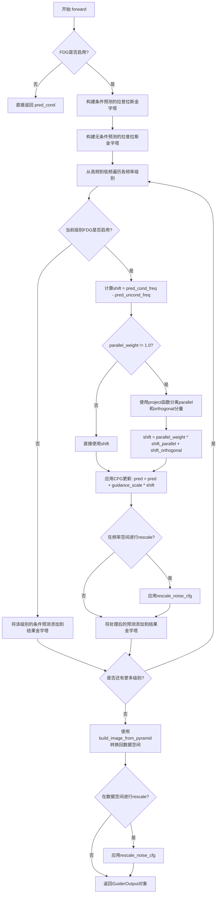
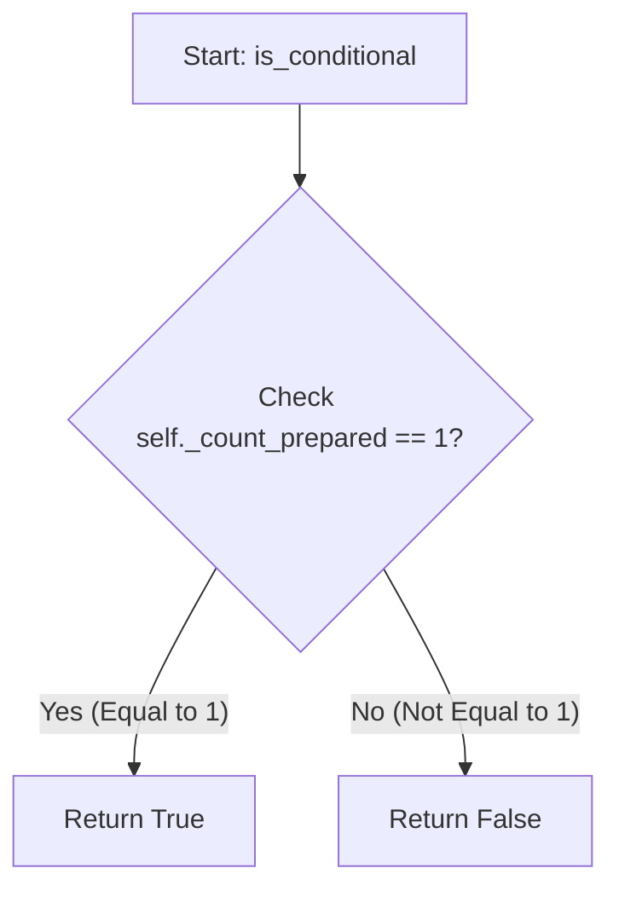
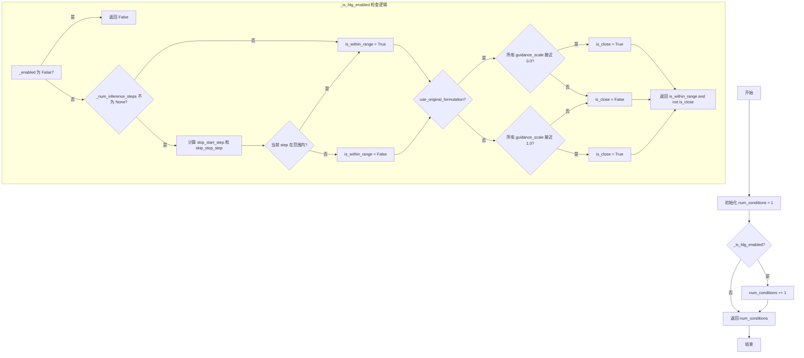

# `diffusers\src\diffusers\guiders\frequency_decoupled_guidance.py` 详细设计文档

Frequency-Decoupled Guidance (FDG) 实现了一种基于频率分解的引导技术，用于改进扩散模型的生成质量和条件跟随能力。该技术通过拉普拉斯金字塔将CFG预测分解为低频和高频分量，分别使用不同的引导强度进行CFG更新，从而在保持样本多样性的同时增强图像质量。

## 整体流程

```mermaid
graph TD
    A[开始 forward] --> B{FDG是否启用?}
    B -- 否 --> C[返回 pred_cond]
    B -- 是 --> D[构建条件预测的拉普拉斯金字塔]
    D --> E[构建无条件预测的拉普拉斯金字塔]
    E --> F{遍历各频率级别}
    F --> G[获取当前级别的条件/无条件预测]
    G --> H[计算shift = pred_cond - pred_uncond]
    H --> I{parallel_weight != 1.0?}
    I -- 是 --> J[投影shift到条件预测上]
    I -- 否 --> K[继续]
    J --> L[应用加权shift]
    K --> L
    L --> M[应用CFG更新: pred = pred + scale * shift]
    M --> N{在freq空间重缩放?}
    N -- 是 --> O[应用rescale_noise_cfg]
    N -- 否 --> P[添加引导后的级别到金字塔]
    O --> P
    P --> Q{还有更多级别?}
    Q -- 是 --> F
    Q -- 否 --> R[从频率金字塔重建图像]
    R --> S{在data空间重缩放?}
    S -- 是 --> T[使用guidance_rescale[0]重缩放]
    S -- 否 --> U[返回GuiderOutput]
    T --> U
```

## 类结构

```
BaseGuidance (抽象基类)
└── FrequencyDecoupledGuidance
```

## 全局变量及字段


### `_CAN_USE_KORNIA`
    
Boolean flag indicating whether the kornia library is available in the current environment

类型：`bool`
    


### `upsample_and_blur_func`
    
Kornia function to upsample and blur images, used for reconstructing images from Laplacian pyramid

类型：`function | None`
    


### `build_laplacian_pyramid_func`
    
Kornia function to build a Laplacian pyramid from an image tensor for frequency decomposition

类型：`function | None`
    


### `FrequencyDecoupledGuidance.guidance_scales`
    
Scale parameters for frequency-decoupled guidance for each frequency component, listed from highest to lowest frequency

类型：`list[float] | tuple[float]`
    


### `FrequencyDecoupledGuidance.guidance_rescale`
    
Rescale factors applied to noise predictions to improve image quality and fix overexposure

类型：`list[float]`
    


### `FrequencyDecoupledGuidance.parallel_weights`
    
Optional weights for the parallel component of each frequency component of the projected CFG shift

类型：`list[float]`
    


### `FrequencyDecoupledGuidance.use_original_formulation`
    
Flag to use the original CFG formulation from the paper instead of the diffusers-native implementation

类型：`bool`
    


### `FrequencyDecoupledGuidance.start`
    
Fraction of total denoising steps after which guidance starts for each frequency component

类型：`list[float]`
    


### `FrequencyDecoupledGuidance.stop`
    
Fraction of total denoising steps after which guidance stops for each frequency component

类型：`list[float]`
    


### `FrequencyDecoupledGuidance.guidance_rescale_space`
    
Whether to perform guidance rescaling in data space or frequency space

类型：`str`
    


### `FrequencyDecoupledGuidance.upcast_to_double`
    
Whether to upcast certain operations to float64 for better numerical precision

类型：`bool`
    


### `FrequencyDecoupledGuidance.enabled`
    
Whether the guidance is currently enabled or disabled

类型：`bool`
    


### `FrequencyDecoupledGuidance.levels`
    
Number of frequency levels in the Laplacian pyramid decomposition

类型：`int`
    


### `FrequencyDecoupledGuidance.guidance_start`
    
Normalized start step for each frequency component to begin applying guidance

类型：`list[float]`
    


### `FrequencyDecoupledGuidance.guidance_stop`
    
Normalized stop step for each frequency component to stop applying guidance

类型：`list[float]`
    
    

## 全局函数及方法


### `project`

该函数实现了向量投影算法，将向量 v0 投影到向量 v1 上，返回 v0 的平行分量（parallel component）和正交分量（orthogonal component）。这是频率解耦指导（FDG）中计算 CFG 偏移量的并行权重时所使用的核心数学运算。

参数：

- `v0`：`torch.Tensor`，待投影的向量，形状为 [B, ...]，其中 B 是批次维度，其余为通道或空间维度
- `v1`：`torch.Tensor`，目标投影向量，形状为 [B, ...]，维度需与 v0 相同
- `upcast_to_double`：`bool`，是否将计算过程提升到 float64 精度以提高数值稳定性，默认为 True

返回值：`tuple[torch.Tensor, torch.Tensor]`，返回两个张量——v0_parallel（v0 在 v1 方向上的平行分量）和 v0_orthogonal（v0 垂直于 v1 方向的正交分量）

#### 流程图

```mermaid
flowchart TD
    A[输入 v0, v1] --> B{upcast_to_double?}
    B -->|Yes| C[保存原始 dtype 并转换为 double]
    B -->|No| D[跳过类型转换]
    C --> E[计算所有非批次维度]
    D --> E
    E --> F[对 v1 进行 L2 归一化]
    F --> G[计算平行分量: v0_parallel = sum(v0 * v1, dim) * v1]
    G --> H[计算正交分量: v0_orthogonal = v0 - v0_parallel]
    H --> I{upcast_to_double?}
    I -->|Yes| J[将结果转回原始 dtype]
    I -->|No| K[直接返回结果]
    J --> L[返回 v0_parallel, v0_orthogonal]
    K --> L
```

#### 带注释源码

```python
def project(v0: torch.Tensor, v1: torch.Tensor, upcast_to_double: bool = True) -> tuple[torch.Tensor, torch.Tensor]:
    """
    Project vector v0 onto vector v1, returning the parallel and orthogonal components of v0. Implementation from paper
    (Algorithm 2).
    """
    # v0 shape: [B, ...]
    # v1 shape: [B, ...]
    # Assume first dim is a batch dim and all other dims are channel or "spatial" dims
    
    # 获取除第一个批次维度外的所有维度索引，用于后续归一化和求和操作
    all_dims_but_first = list(range(1, len(v0.shape)))
    
    # 如果需要提升精度到 double（float64），以提高数值计算的稳定性
    if upcast_to_double:
        dtype = v0.dtype  # 保存原始数据类型
        v0, v1 = v0.double(), v1.double()  # 转换为 double 类型进行计算
    
    # 对 v1 进行 L2 归一化，使其成为单位向量
    v1 = torch.nn.functional.normalize(v1, dim=all_dims_but_first)
    
    # 计算 v0 在 v1 方向上的投影（平行分量）
    # 步骤：1) 逐元素相乘 v0 * v1
    #       2) 在所有非批次维度上求和，保持维度以便广播
    #       3) 乘以归一化后的 v1 得到投影向量
    v0_parallel = (v0 * v1).sum(dim=all_dims_but_first, keepdim=True) * v1
    
    # 计算正交分量：v0 与其平行分量的差值
    v0_orthogonal = v0 - v0_parallel
    
    # 如果之前提升了精度，现在将结果转回原始数据类型
    if upcast_to_double:
        v0_parallel = v0_parallel.to(dtype)
        v0_orthogonal = v0_orthogonal.to(dtype)
    
    # 返回平行分量和正交分量
    return v0_parallel, v0_orthogonal
```


### `build_image_from_pyramid`

从拉普拉斯金字塔频率空间恢复数据空间的潜在表示（图像），通过迭代上采样并逐层叠加高频分量。

参数：

- `pyramid`：`list[torch.Tensor]`，拉普拉斯金字塔的频率空间表示，形状为 `[[B, C, H, W], [B, C, H/2, W/2], ...]`

返回值：`torch.Tensor`，从频域恢复到数据空间（像素空间）的图像张量

#### 流程图

```mermaid
flowchart TD
    A[开始: 输入金字塔 pyramid] --> B[img = pyramid[-1]]
    B --> C{i < 0?}
    C -->|否| D[i = len(pyramid) - 2]
    D --> E[img = upsample_and_blur_func + pyramid[i]]
    E --> F[i = i - 1]
    F --> C
    C -->|是| G[返回 img]
    
    style A fill:#f9f,color:#333
    style G fill:#9f9,color:#333
```

#### 带注释源码

```python
def build_image_from_pyramid(pyramid: list[torch.Tensor]) -> torch.Tensor:
    """
    Recovers the data space latents from the Laplacian pyramid frequency space. Implementation from the paper
    (Algorithm 2).
    """
    # pyramid shapes: [[B, C, H, W], [B, C, H/2, W/2], ...]
    # 从金字塔最低频率层（最大尺寸）开始，作为初始图像
    img = pyramid[-1]
    
    # 从倒数第二层开始，逆序遍历金字塔
    for i in range(len(pyramid) - 2, -1, -1):
        # 对当前图像进行上采样和模糊处理，然后加上当前层的频率分量
        img = upsample_and_blur_func(img) + pyramid[i]
    
    # 返回重建后的完整图像
    return img
```


### `FrequencyDecoupledGuidance.__init__`

初始化 FrequencyDecoupledGuidance 类的实例，用于设置频率解耦引导（FDG）的各种参数，包括指导量表、引导重缩放、并行权重等，并进行参数验证和初始化父类。

参数：

- `self`：隐含的实例引用，当前类实例
- `guidance_scales`：`list[float] | tuple[float]`，默认为 `[10.0, 5.0]`，频率解耦引导的缩放参数，从最高频率级别到最低频率级别列出
- `guidance_rescale`：`float | list[float] | tuple[float]`，默认为 `0.0`，应用于噪声预测的重缩放因子，可改善图像质量
- `parallel_weights`：`float | list[float] | tuple[float] | None`，默认为 `None`，投影 CFG 移位的并行分量权重
- `use_original_formulation`：`bool`，默认为 `False`，是否使用原始 CFG 公式
- `start`：`float | list[float] | tuple[float]`，默认为 `0.0`，引导开始的去噪步骤分数
- `stop`：`float | list[float] | tuple[float]`，默认为 `1.0`，引导停止的去噪步骤分数
- `guidance_rescale_space`：`str`，默认为 `"data"`，执行引导重缩放的空间（"data" 或 "freq"）
- `upcast_to_double`：`bool`，默认为 `True`，是否将某些操作（如投影操作）转换为 float64
- `enabled`：`bool`，默认为 `True`，是否启用引导

返回值：`None`，无返回值（`__init__` 方法）

#### 流程图

```mermaid
flowchart TD
    A[开始 __init__] --> B{检查 kornia 库是否可用}
    B -->|不可用| C[Raise ImportError]
    B -->|可用| D[计算 min_start 和 max_stop]
    D --> E[调用父类 __init__]
    E --> F[设置 self.guidance_scales]
    F --> G[计算 self.levels]
    G --> H{guidance_rescale 是 float?}
    H -->|是| I[扩展为列表]
    H -->|否| J{长度匹配 levels?}
    J -->|否| K[Raise ValueError]
    J -->|是| L[设置 self.guidance_rescale]
    I --> L
    L --> M{guidance_rescale_space 有效?}
    M -->|否| N[Raise ValueError]
    M -->|是| O[设置 self.guidance_rescale_space]
    O --> P{parallel_weights 为 None?}
    P -->|是| Q[设为 [1.0] * self.levels]
    P -->|否| R{是 float?}
    R -->|是| S[扩展为列表]
    R -->|否| T{长度匹配 levels?}
    S --> U
    T -->|否| V[Raise ValueError]
    T -->|是| U[设置 self.parallel_weights]
    Q --> U
    U --> W[设置 use_original_formulation 和 upcast_to_double]
    W --> X{start 是 float?]
    X -->|是| Y[扩展为列表]
    X -->|否| Z{长度匹配 levels?}
    Z -->|否| AA[Raise ValueError]
    Z -->|是| AB
    Y --> AB[设置 self.guidance_start]
    AB --> AC{stop 是 float?]
    AC -->|是| AD[扩展为列表]
    AC -->|否| AE{长度匹配 levels?}
    AE -->|否| AF[Raise ValueError]
    AE -->|是| AG
    AD --> AG[设置 self.guidance_stop]
    AG --> AH[结束 __init__]
```

#### 带注释源码

```python
@register_to_config
def __init__(
    self,
    guidance_scales: list[float] | tuple[float] = [10.0, 5.0],
    guidance_rescale: float | list[float] | tuple[float] = 0.0,
    parallel_weights: float | list[float] | tuple[float] | None = None,
    use_original_formulation: bool = False,
    start: float | list[float] | tuple[float] = 0.0,
    stop: float | list[float] | tuple[float] = 1.0,
    guidance_rescale_space: str = "data",
    upcast_to_double: bool = True,
    enabled: bool = True,
):
    # 检查 kornia 库是否可用，这是 FrequencyDecoupledGuidance 的必要依赖
    if not _CAN_USE_KORNIA:
        raise ImportError(
            "The `FrequencyDecoupledGuidance` guider cannot be instantiated because the `kornia` library on which "
            "it depends is not available in the current environment. You can install `kornia` with `pip install "
            "kornia`."
        )

    # 计算所有频率分量的最早开始和最晚停止点，用于父类初始化
    min_start = start if isinstance(start, float) else min(start)
    max_stop = stop if isinstance(stop, float) else max(stop)
    # 调用父类 BaseGuidance 的初始化方法
    super().__init__(min_start, max_stop, enabled)

    # 设置指导缩放参数和级别数量
    self.guidance_scales = guidance_scales
    self.levels = len(guidance_scales)

    # 处理 guidance_rescale 参数：如果是单个 float 则扩展为列表
    if isinstance(guidance_rescale, float):
        self.guidance_rescale = [guidance_rescale] * self.levels
    elif len(guidance_rescale) == self.levels:
        self.guidance_rescale = guidance_rescale
    else:
        raise ValueError(
            f"`guidance_rescale` has length {len(guidance_rescale)} but should have the same length as "
            f"`guidance_scales` ({len(self.guidance_scales)})"
        )
    
    # 验证并设置引导重缩放空间参数
    if guidance_rescale_space not in ["data", "freq"]:
        raise ValueError(
            f"Guidance rescale space is {guidance_rescale_space} but must be one of `data` or `freq`."
        )
    self.guidance_rescale_space = guidance_rescale_space

    # 处理并行权重参数：如果为 None 则使用默认权重 1.0
    if parallel_weights is None:
        # 使用正常 CFG 移位（并行和正交分量权重相等）
        self.parallel_weights = [1.0] * self.levels
    elif isinstance(parallel_weights, float):
        self.parallel_weights = [parallel_weights] * self.levels
    elif len(parallel_weights) == self.levels:
        self.parallel_weights = parallel_weights
    else:
        raise ValueError(
            f"`parallel_weights` has length {len(parallel_weights)} but should have the same length as "
            f"`guidance_scales` ({len(self.guidance_scales)})"
        )

    # 设置是否使用原始 CFG 公式和是否转换为 double 类型
    self.use_original_formulation = use_original_formulation
    self.upcast_to_double = upcast_to_double

    # 处理 start 参数：如果是单个 float 则扩展为列表
    if isinstance(start, float):
        self.guidance_start = [start] * self.levels
    elif len(start) == self.levels:
        self.guidance_start = start
    else:
        raise ValueError(
            f"`start` has length {len(start)} but should have the same length as `guidance_scales` "
            f"({len(self.guidance_scales)})"
        )
    
    # 处理 stop 参数：如果是单个 float 则扩展为列表
    if isinstance(stop, float):
        self.guidance_stop = [stop] * self.levels
    elif len(stop) == self.levels:
        self.guidance_stop = stop
    else:
        raise ValueError(
            f"`stop` has length {len(stop)} but should have the same length as `guidance_scales` "
            f"({len(self.guidance_scales)})"
        )
```


### FrequencyDecoupledGuidance.prepare_inputs

该方法负责准备频率解耦引导（FDG）的输入数据，根据条件数量（conditional/unconditional）处理预测数据并将它们转换为适合后续处理的 BlockState 批次列表。

参数：

- `data`：`dict[str, tuple[torch.Tensor, torch.Tensor]]`，包含预测数据的字典，键为字符串，值为包含条件预测和非条件预测的元组

返回值：`list["BlockState"]`，返回处理后的 BlockState 批次列表

#### 流程图

```mermaid
flowchart TD
    A[开始 prepare_inputs] --> B{self.num_conditions == 1?}
    B -->|是| C[设置 tuple_indices = [0]]
    B -->|否| D[设置 tuple_indices = [0, 1]]
    C --> E[初始化空列表 data_batches]
    D --> E
    E --> F[遍历 tuple_indices 和 self._input_predictions]
    F --> G[调用 self._prepare_batch]
    G --> H[将返回的 data_batch 添加到 data_batches]
    H --> I{还有更多 tuple_idx?}
    I -->|是| F
    I -->|否| J[返回 data_batches]
```

#### 带注释源码

```python
def prepare_inputs(self, data: dict[str, tuple[torch.Tensor, torch.Tensor]]) -> list["BlockState"]:
    """
    准备频率解耦引导的输入数据。
    
    该方法根据条件数量确定需要处理的预测类型（条件/非条件），
    并将输入数据转换为 BlockState 批次格式供后续处理使用。
    
    Args:
        data: 包含预测结果的字典，键为字符串，值为 (条件预测, 非条件预测) 元组
        
    Returns:
        BlockState 对象列表，每个对应一个预测批次
    """
    # 根据条件数量确定要处理的元组索引
    # 如果只有一个条件，则只处理索引 0；否则处理索引 0 和 1（条件和非条件）
    tuple_indices = [0] if self.num_conditions == 1 else [0, 1]
    
    # 初始化存储处理后批次的列表
    data_batches = []
    
    # 遍历每个元组索引和对应的输入预测类型
    for tuple_idx, input_prediction in zip(tuple_indices, self._input_predictions):
        # 调用内部方法将原始数据转换为 BlockState 格式
        # _prepare_batch 方法负责提取指定索引的数据并进行必要的预处理
        data_batch = self._prepare_batch(data, tuple_idx, input_prediction)
        
        # 将处理后的批次添加到结果列表中
        data_batches.append(data_batch)
    
    # 返回所有处理后的批次数据
    return data_batches
```


### `FrequencyDecoupledGuidance.prepare_inputs_from_block_state`

该方法用于从 BlockState 中准备条件和无条件的输入数据，根据条件数量确定需要处理的批次数量，并调用内部方法 `_prepare_batch_from_block_state` 来构建每个数据批次。

参数：

-  `data`：`BlockState`，包含块状态数据的对象，从中提取预测结果
-  `input_fields`：`dict[str, str | tuple[str, str]]`，字段映射字典，键为字段名，值为字段路径或路径元组

返回值：`list[BlockState]`，返回准备好的数据批次列表，每个元素对应一个条件（条件预测或无条件预测）的数据

#### 流程图

```mermaid
flowchart TD
    A[开始 prepare_inputs_from_block_state] --> B{self.num_conditions == 1?}
    B -->|是| C[tuple_indices = [0]]
    B -->|否| D[tuple_indices = [0, 1]]
    C --> E[初始化空列表 data_batches]
    D --> E
    E --> F[遍历 ziptuple_indices, self._input_predictions]
    F --> G[调用 _prepare_batch_from_block_state]
    G --> H[将返回的 data_batch 添加到 data_batches]
    H --> I{还有下一个元素?}
    I -->|是| F
    I -->|否| J[返回 data_batches]
```

#### 带注释源码

```python
def prepare_inputs_from_block_state(
    self, data: "BlockState", input_fields: dict[str, str | tuple[str, str]]
) -> list["BlockState"]:
    """
    从 BlockState 中准备输入数据批次。
    
    该方法根据条件数量确定需要处理的预测类型（条件预测/无条件预测），
    并为每种类型调用内部方法准备相应的数据批次。
    
    Args:
        data: BlockState 对象，包含模型预测结果
        input_fields: 字段映射字典，定义如何从 BlockState 中提取数据
    
    Returns:
        数据批次列表，每个元素对应一个预测类型的处理结果
    """
    # 根据条件数量确定元组索引：单一条件时为 [0]，条件+无条件时为 [0, 1]
    tuple_indices = [0] if self.num_conditions == 1 else [0, 1]
    
    # 初始化数据批次列表
    data_batches = []
    
    # 遍历元组索引和输入预测类型，为每种预测类型准备数据
    # _input_predictions = ["pred_cond", "pred_uncond"]
    for tuple_idx, input_prediction in zip(tuple_indices, self._input_predictions):
        # 调用内部方法从 BlockState 中准备批次数据
        data_batch = self._prepare_batch_from_block_state(
            input_fields, data, tuple_idx, input_prediction
        )
        data_batches.append(data_batch)
    
    return data_batches
```


### `FrequencyDecoupledGuidance.forward`

该方法实现了频率解耦引导（Frequency-Decoupled Guidance，FDG）的核心逻辑，通过拉普拉斯金字塔将分类器自由引导（CFG）的预测分解为不同频率成分，对每个频率成分应用不同的引导比例，最后将处理后的频率成分重新转换回数据空间，生成最终的引导预测。

参数：

- `pred_cond`：`torch.Tensor`，条件预测张量，由带文本提示的扩散模型生成
- `pred_uncond`：`torch.Tensor | None`，无条件预测张量，由不带文本提示的扩散模型生成，可为 None

返回值：`GuiderOutput`，包含引导后的预测结果、条件预测和无条件预测的元组对象

#### 流程图



#### 带注释源码

```python
def forward(self, pred_cond: torch.Tensor, pred_uncond: torch.Tensor | None = None) -> GuiderOutput:
    """
    前向传播方法，实现频率解耦引导（FDG）算法。
    
    该方法将条件预测和无条件预测分解为拉普拉斯金字塔的频率成分，
    对每个频率成分应用不同的引导比例，最后将处理后的结果转换回数据空间。
    
    Args:
        pred_cond: 条件预测张量，形状为 [B, C, H, W]
        pred_uncond: 无条件预测张量，形状为 [B, C, H, W]，可以为 None
    
    Returns:
        GuiderOutput: 包含引导后的预测、条件预测和无条件预测
    """
    # 初始化预测结果为 None
    pred = None

    # 检查 FDG 是否启用（根据 enabled 标志和当前的推理步骤范围）
    if not self._is_fdg_enabled():
        # 如果未启用，直接返回条件预测作为结果
        pred = pred_cond
    else:
        # 应用频率变换（拉普拉斯金字塔）将预测分解为多个频率级别
        # 构建条件预测的拉普拉斯金字塔，levels 决定了分解的级别数
        pred_cond_pyramid = build_laplacian_pyramid_func(pred_cond, self.levels)
        # 构建无条件预测的拉普拉斯金字塔
        pred_uncond_pyramid = build_laplacian_pyramid_func(pred_uncond, self.levels)

        # 从高频到低频率遍历，与论文实现保持一致
        # 存储每层频率级别处理后的引导预测
        pred_guided_pyramid = []
        # 将引导参数打包在一起以便迭代：引导比例、并行权重、rescale参数
        parameters = zip(self.guidance_scales, self.parallel_weights, self.guidance_rescale)
        
        # 遍历每个频率级别（从最高频开始）
        for level, (guidance_scale, parallel_weight, guidance_rescale) in enumerate(parameters):
            # 检查当前级别是否启用 FDG（根据该级别的 start/stop 范围）
            if self._is_fdg_enabled_for_level(level):
                # 获取当前频率级别的条件预测（在频率空间中）
                pred_cond_freq = pred_cond_pyramid[level]
                # 获取当前频率级别的无条件预测（在频率空间中）
                pred_uncond_freq = pred_uncond_pyramid[level]

                # 计算 CFG 移位向量：条件预测与无条件预测的差值
                shift = pred_cond_freq - pred_uncond_freq

                # 应用并行权重（如果使用）
                # 1.0 表示使用正常的 CFG 移位（并行和正交分量权重相等）
                if not math.isclose(parallel_weight, 1.0):
                    # 将移位向量投影到条件预测方向，得到并行和正交分量
                    shift_parallel, shift_orthogonal = project(shift, pred_cond_freq, self.upcast_to_double)
                    # 根据并行权重重新组合：并行分量 * 权重 + 正交分量
                    shift = parallel_weight * shift_parallel + shift_orthogonal

                # 为当前频率级别应用 CFG 更新
                # 根据配置选择使用原始公式还是 diffusers 原生实现
                pred = pred_cond_freq if self.use_original_formulation else pred_uncond_freq
                # 应用引导比例进行预测修正：pred = pred + scale * shift
                pred = pred + guidance_scale * shift

                # 如果在频率空间中进行 rescale（根据 guidance_rescale_space 配置）
                if self.guidance_rescale_space == "freq" and guidance_rescale > 0.0:
                    # 对当前频率级别的预测进行噪声配置 rescale
                    pred = rescale_noise_cfg(pred, pred_cond_freq, guidance_rescale)

                # 将当前 FDG 引导后的级别添加到结果金字塔中
                pred_guided_pyramid.append(pred)
            else:
                # 如果当前级别未启用 FDG，则直接将条件预测级别添加到结果中（非 FDG 预测）
                pred_guided_pyramid.append(pred_cond_freq)

        # 通过应用逆频率变换（从拉普拉斯金字塔重建）将预测从频率空间转回数据空间（如图像像素空间）
        pred = build_image_from_pyramid(pred_guided_pyramid)

        # 如果在数据空间中进行 rescale，使用第一个 rescale 值作为"全局"值
        # 应用于所有频率级别
        if self.guidance_rescale_space == "data" and self.guidance_rescale[0] > 0.0:
            pred = rescale_noise_cfg(pred, pred_cond, self.guidance_rescale[0])

    # 返回 GuiderOutput 对象，包含引导后的预测、条件预测和无条件预测
    return GuiderOutput(pred=pred, pred_cond=pred_cond, pred_uncond=pred_uncond)
```


### `FrequencyDecoupledGuidance.is_conditional`

该属性用于判断当前 Guidance 实例是否处于“条件模式”。它通过检查内部准备的输入数量（`_count_prepared`）来判断。如果仅准备了一个输入（通常是条件输入），则返回 `True`；否则返回 `False`。

参数：
- 该属性无显式参数（隐含 `self`）。

返回值：`bool`，如果处于条件模式返回 `True`，否则返回 `False`。

#### 流程图



#### 带注释源码

```python
@property
def is_conditional(self) -> bool:
    """
    判断当前 Guidance 是否处于条件模式。
    通常用于检查是否只准备了条件预测（pred_cond）而没有准备无条件预测（pred_uncond），
    或者内部状态是否符合条件模式的设定。
    """
    return self._count_prepared == 1
```


### `FrequencyDecoupledGuidance.num_conditions`

该属性是一个只读属性，用于返回当前 GUIDance 配置下的条件数量。在 Frequency-Decoupled Guidance (FDG) 中，如果 FDG 功能启用，则条件数量会额外增加一个（因为 FDG 会处理条件预测和无条件预测两个分支）。

参数：无

返回值：`int`，返回当前配置下的条件数量。如果 FDG 未启用，返回 1；如果 FDG 启用，返回 2。

#### 流程图



#### 带注释源码

```python
@property
def num_conditions(self) -> int:
    """
    返回当前 GUIDance 配置下的条件数量。
    
    在 Frequency-Decoupled Guidance (FDG) 中，如果 FDG 功能启用，
    则需要处理条件预测（pred_cond）和无条件预测（pred_uncond）两个分支，
    因此条件数量为 2；否则仅需处理条件预测，条件数量为 1。
    
    Returns:
        int: 条件数量。FDG 未启用时返回 1，启用时返回 2。
    """
    # 初始化为基础条件数量（条件预测）
    num_conditions = 1
    
    # 检查 FDG 是否启用，如果启用则增加条件数量
    # FDG 启用条件包括：
    # 1. guider 本身已启用（self._enabled 为 True）
    # 2. 当前推理步骤在 start 和 stop 指定的范围内
    # 3. guidance_scales 不全为 0（使用原始公式时）或不全为 1（使用默认公式时）
    if self._is_fdg_enabled():
        num_conditions += 1
    
    return num_conditions
```


### FrequencyDecoupledGuidance._is_fdg_enabled

该方法用于判断频域解耦引导（Frequency-Decoupled Guidance, FDG）在当前推理步骤是否启用。方法首先检查 guider 是否被启用，然后判断当前去噪步骤是否在配置的起始和停止范围内，最后根据是否使用原始公式来判断所有频率分量的引导比例是否接近默认值（0.0 或 1.0）。只有当步骤在范围内且引导比例未接近默认值时，FDG 才会生效。

参数：

- `self`：隐含的实例参数，表示 `FrequencyDecoupledGuidance` 类的当前实例，无需显式传递。

返回值：`bool`，返回 True 表示 FDG 在当前推理步骤启用，返回 False 表示未启用。

#### 流程图

```mermaid
flowchart TD
    A[开始 _is_fdg_enabled] --> B{self._enabled 是否为 False?}
    B -->|是| C[返回 False]
    B -->|否| D{self._num_inference_steps 是否为 None?}
    D -->|是| E[is_within_range = True]
    D -->|否| F[计算 skip_start_step = int(self._start * self._num_inference_steps)]
    F --> G[计算 skip_stop_step = int(self._stop * self._num_inference_steps)]
    G --> H{skip_start_step <= self._step < skip_stop_step?}
    H -->|是| I[is_within_range = True]
    H -->|否| J[is_within_range = False]
    I --> K{self.use_original_formulation 是否为 True?}
    J --> K
    K -->|是| L[is_close = all(math.isclose(s, 0.0) for s in self.guidance_scales)]
    K -->|否| M[is_close = all(math.isclose(s, 1.0) for s in self.guidance_scales)]
    L --> N[返回 is_within_range and not is_close]
    M --> N
    C --> O[结束]
    N --> O
```

#### 带注释源码

```python
def _is_fdg_enabled(self) -> bool:
    """
    判断频域解耦引导（FDG）在当前推理步骤是否启用。
    
    只有当以下条件同时满足时，FDG 才被认为启用：
    1. guider 本身被启用（self._enabled 为 True）
    2. 当前推理步骤在配置的 [start, stop) 范围内
    3. 引导比例未接近默认值（使用原始公式时为 0.0，否则为 1.0）
    """
    # 第一步：检查 guider 是否被禁用。如果被禁用，直接返回 False，不执行任何 FDG 逻辑
    if not self._enabled:
        return False

    # 第二步：检查当前推理步骤是否在 [start, stop) 范围内
    # 如果没有设置推理步骤数（self._num_inference_steps 为 None），默认在范围内
    is_within_range = True
    if self._num_inference_steps is not None:
        # 计算需要跳过的起始和停止步骤数
        # self._start 和 self._stop 是 0.0 到 1.0 之间的比例
        skip_start_step = int(self._start * self._num_inference_steps)
        skip_stop_step = int(self._stop * self._num_inference_steps)
        # 判断当前步骤是否在 [start, stop) 范围内
        is_within_range = skip_start_step <= self._step < skip_stop_step

    # 第三步：检查引导比例是否接近默认值
    # 如果使用原始公式，默认值为 0.0；否则使用 diffusers 原生实现，默认值为 1.0
    is_close = False
    if self.use_original_formulation:
        # 检查所有频率分量的引导比例是否都接近 0.0
        is_close = all(math.isclose(guidance_scale, 0.0) for guidance_scale in self.guidance_scales)
    else:
        # 检查所有频率分量的引导比例是否都接近 1.0
        is_close = all(math.isclose(guidance_scale, 1.0) for guidance_scale in self.guidance_scales)

    # 只有同时满足：在范围内 且 引导比例未接近默认值时，FDG 才启用
    return is_within_range and not is_close
```


### `FrequencyDecoupledGuidance._is_fdg_enabled_for_level`

该方法用于判断在给定的频率级别（level）上，FDG（频域解耦引导）是否启用。它通过检查两个条件来确定：1）当前推理步骤是否在指定的起止范围内；2）当前级别的引导比例是否接近默认值（原始公式为0.0，其他为1.0）。只有当两个条件都满足时才返回True。

参数：

- `level`：`int`，频率级别，从高到低编号（0表示最高频率级别）

返回值：`bool`，如果该频率级别启用FDG则返回True，否则返回False

#### 流程图

```mermaid
flowchart TD
    A[开始] --> B{self._enabled?}
    B -->|否| C[返回 False]
    B -->|是| D{self._num_inference_steps is not None?}
    D -->|否| E[is_within_range = True]
    D -->|是| F[计算 skip_start_step = int(guidance_start[level] * _num_inference_steps)]
    F --> G[计算 skip_stop_step = int(guidance_stop[level] * _num_inference_steps)]
    G --> H{skip_start_step <= self._step < skip_stop_step?}
    H -->|否| I[is_within_range = False]
    H -->|是| E
    I --> J{use_original_formulation?}
    E --> J
    J -->|是| K{guidance_scales[level] ≈ 0.0?}
    J -->|否| L{guidance_scales[level] ≈ 1.0?}
    K -->|是| M[is_close = True]
    K -->|否| N[is_close = False]
    L -->|是| M
    L -->|否| N
    M --> O[返回 is_within_range and not is_close]
    N --> O
```

#### 带注释源码

```python
def _is_fdg_enabled_for_level(self, level: int) -> bool:
    """
    判断在给定的频率级别上是否启用FDG。
    
    参数:
        level: 频率级别，从高到低编号（0是最高频率级别）
    
    返回:
        bool: 如果该频率级别启用FDG则返回True
    """
    # 检查guidance是否全局启用
    if not self._enabled:
        return False

    # 判断当前推理步骤是否在当前频率级别指定的起止范围内
    is_within_range = True
    if self._num_inference_steps is not None:
        # 根据start和stop参数计算当前级别允许的推理步骤范围
        # guidance_start和guidance_stop是相对于总推理步数的比例[0,1]
        skip_start_step = int(self.guidance_start[level] * self._num_inference_steps)
        skip_stop_step = int(self.guidance_stop[level] * self._num_inference_steps)
        # 检查当前步骤是否在范围内（注意是左闭右开区间）
        is_within_range = skip_start_step <= self._step < skip_stop_step

    # 判断引导比例是否接近默认值（即不需要进行guidance）
    is_close = False
    if self.use_original_formulation:
        # 原始CFG公式中，默认引导比例为0.0
        is_close = math.isclose(self.guidance_scales[level], 0.0)
    else:
        # Diffusers原生实现中，默认引导比例为1.0（无guidance效果）
        is_close = math.isclose(self.guidance_scales[level], 1.0)

    # 只有同时满足在有效范围内且guidance比例不接近默认值时，才启用FDG
    return is_within_range and not is_close
```

## 关键组件


### FrequencyDecoupledGuidance 类

实现频率解耦引导（FDG）的核心类，通过拉普拉斯金字塔将预测分解为不同频率分量，分别应用不同的引导强度来改善扩散模型的生成质量。

### project 函数

将向量v0投影到向量v1上，返回平行和正交分量，用于计算带权重的CFG偏移。

### build_image_from_pyramid 函数

从拉普拉斯金字塔频域表示恢复数据空间潜在表示，实现逆频率变换。

### 拉普拉斯金字塔变换

使用kornia库的build_laplacian_pyramid_func实现，将图像/潜在表示分解为多级高频和低频分量。

### 引导缩放策略

根据频率级别应用不同的guidance_scales，高频分量使用较高引导强度（如10.0），低频分量使用较低引导强度（如5.0）。

### 引导重缩放机制

支持在数据空间或频率空间进行guidance_rescale，基于Common Diffusion Noise Schedules论文改善图像质量。

### 并行权重机制

通过parallel_weights参数控制CFG偏移的并行分量权重，实现更精细的引导控制。

### 条件/无条件预测处理

_input_predictions定义了对cond和uncond预测的处理，支持单条件和多条件场景。

### 频率级别启用控制

通过guidance_start和guidance_stop参数控制每个频率分量的引导启用/停止时间点。

### BaseGuidance基类集成

继承自BaseGuidance，集成推理步骤跟踪和启用状态管理功能。


## 问题及建议


### 已知问题

- **缺失的空值检查**：当 kornia 不可用时，`upsample_and_blur_func` 和 `build_laplacian_pyramid_func` 被设置为 `None`，但在 `build_image_from_pyramid` 函数中直接使用而没有空值检查，可能导致运行时错误。
- **重复的参数验证逻辑**：对 `start`、`stop`、`guidance_rescale` 和 `parallel_weights` 参数的类型检查和列表转换逻辑重复出现在 `__init__` 方法中，可提取为私有辅助方法以提高代码可维护性。
- **隐藏的依赖关系**：`is_conditional` 属性依赖于继承的 `_count_prepared` 属性，但该属性在当前类中未定义，导致类的接口不透明。
- **数值稳定性风险**：`project` 函数中的向量归一化在 `v1` 为零向量时可能产生 NaN 值，缺乏对退化情况的处理。
- **不完整的 guidance_rescale_space 实现**：当 `guidance_rescale_space` 设置为 `"freq"` 时，使用每个频率级别各自的 `guidance_rescale` 值，但代码注释表明频率空间的重缩放是"推测性的"，可能不会产生预期结果，这表明该功能可能是一个未完成或实验性的实现。

### 优化建议

- **添加防御性编程**：在 `build_image_from_pyramid` 和 `forward` 方法开始处添加对 `upsample_and_blur_func` 和 `build_laplacian_pyramid_func` 的空值检查，提供更清晰的错误消息。
- **重构参数验证**：创建 `_normalize_to_list` 辅助方法，将浮点数或元组参数统一转换为列表，减少代码重复。
- **优化数值精度策略**：当前每次调用 `project` 时都会进行 double 类型转换（当 `upcast_to_double=True` 时），对于不需要 `parallel_weights` 的常见情况（`parallel_weight=1.0`），可以跳过此开销以提升性能。
- **增强输入验证**：在 `__init__` 中添加对 `guidance_scales` 为空列表的检查，防止除零错误或空循环。
- **考虑并行化**：Laplacian 金字塔的构建和频率空间的 CFG 更新操作在每个级别是独立的，可考虑使用批处理或并行操作来加速推理。
- **提取魔法数字**：将 `1.0`（作为 normal CFG shift 的默认值）等魔法数字定义为类常量或配置常量，提高代码可读性。

## 其它


### 设计目标与约束

**设计目标**：实现Frequency-Decoupled Guidance (FDG)技术，通过将传统的classifier-free guidance (CFG)预测解耦为低频和高频成分，分别应用不同的引导尺度，从而在扩散模型生成过程中提升图像质量、细节保留和色彩组合的真实性。

**核心约束**：
- 依赖kornia库进行拉普拉斯金字塔操作
- guidance_scales和guidance_rescale等列表参数必须长度一致
- guidance_rescale_space仅支持"data"或"freq"两种模式
- parallel_weights建议在[0, 1]范围内

### 错误处理与异常设计

1. **ImportError**：当kornia库不可用时，抛出ImportError提示安装kornia
2. **ValueError**：当guidance_rescale长度与guidance_scales不一致时抛出
3. **ValueError**：当guidance_rescale_space不是"data"或"freq"时抛出
4. **ValueError**：当parallel_weights长度与guidance_scales不一致时抛出
5. **ValueError**：当start/stop长度与guidance_scales不一致时抛出

### 数据流与状态机

**数据流**：
- 输入：pred_cond（条件预测）, pred_uncond（无条件预测）
- 流程：构建拉普拉斯金字塔 → 逐层应用CFG → 频率空间重缩放（可选）→ 逆变换回数据空间 → 数据空间重缩放（可选）
- 输出：GuiderOutput对象，包含pred, pred_cond, pred_uncond

**状态机**：
- FDG启用条件：enabled=True 且 在start-stop范围内 且 guidance_scale不接近1.0（默认形式）或0.0（原版形式）
- 每层级启用条件：enabled=True 且 在该层级的start-stop范围内 且 该层级guidance_scale不接近阈值

### 外部依赖与接口契约

**外部依赖**：
- kornia.geometry.pyrup：上采样和模糊函数
- kornia.geometry.transform.build_laplacian_pyramid：构建拉普拉斯金字塔
- ..configuration_utils.register_to_config：配置注册装饰器
- ..utils.is_kornia_available：检查kornia可用性
- .guider_utils.BaseGuidance：基类
- .guider_utils.GuiderOutput：输出数据类
- .guider_utils.rescale_noise_cfg：噪声配置重缩放函数

**接口契约**：
- forward()方法接收pred_cond和可选的pred_uncond，返回GuiderOutput
- prepare_inputs()和prepare_inputs_from_block_state()返回BlockState列表
- is_conditional属性返回是否有条件预测
- num_conditions属性返回条件数量（1或2）

### 性能特征与资源消耗

- 时间复杂度：O(n * H * W) 其中n为金字塔层数，H*W为特征图尺寸
- 空间复杂度：O(n * H * W) 用于存储金字塔各层
- upcast_to_double默认启用以提高数值精度，但会增加内存和计算开销

### 版本兼容性说明

- 基于Diffusers模块化管道架构
- 需要Python typing.TYPE_CHECKING支持
- 适配BlockState类型注解（需要modular_pipelines模块）

### 测试考量

- 单元测试：验证各层级引导计算的正确性
- 集成测试：验证与Diffusers pipeline的完整集成
- 数值测试：对比FDG与标准CFG的输出差异
- 边界测试：验证start/stop边界条件处理

    