# `diffusers\src\diffusers\guiders\guider_utils.py` 详细设计文档

这是 Hugging Face Diffusers 库中的指导机制（Guidance）基础类模块，提供了用于实现扩散模型引导技术（如 Classifier-Free Guidance）的抽象基类 BaseGuidance，以及噪声预测重缩放工具函数。该模块定义了引导技术的配置管理、模型准备、状态跟踪和前向传播接口。

## 整体流程

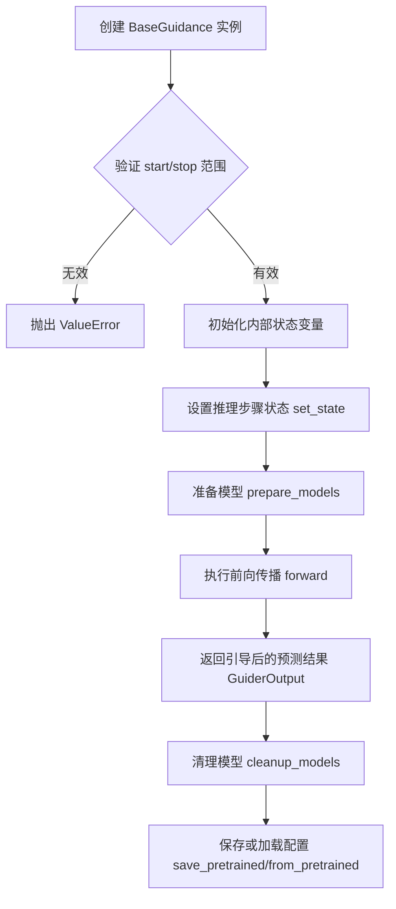

## 类结构

```
BaseGuidance (配置混合基类)
├── ConfigMixin (配置混入)
├── PushToHubMixin (推送到Hub混入)
└── GuiderOutput (输出数据类)
```

## 全局变量及字段


### `GUIDER_CONFIG_NAME`
    
引导配置文件名常量

类型：`str`
    


### `logger`
    
模块日志记录器

类型：`logging.Logger`
    


### `BaseGuidance.config_name`
    
配置文件名

类型：`str`
    


### `BaseGuidance._input_predictions`
    
所需的预测名称列表

类型：`list`
    


### `BaseGuidance._identifier_key`
    
标识符键名

类型：`str`
    


### `BaseGuidance._start`
    
引导起始点(0.0-1.0)

类型：`float`
    


### `BaseGuidance._stop`
    
引导结束点(0.0-1.0)

类型：`float`
    


### `BaseGuidance._step`
    
当前推理步骤

类型：`int`
    


### `BaseGuidance._num_inference_steps`
    
推理总步数

类型：`int`
    


### `BaseGuidance._timestep`
    
当前时间步

类型：`torch.LongTensor`
    


### `BaseGuidance._count_prepared`
    
prepare_models调用计数

类型：`int`
    


### `BaseGuidance._input_fields`
    
输入字段映射

类型：`dict[str, str | tuple[str, str]]`
    


### `BaseGuidance._enabled`
    
是否启用引导

类型：`bool`
    


### `GuiderOutput.pred`
    
引导后的预测

类型：`torch.Tensor`
    


### `GuiderOutput.pred_cond`
    
条件预测

类型：`torch.Tensor | None`
    


### `GuiderOutput.pred_uncond`
    
无条件预测

类型：`torch.Tensor | None`
    
    

## 全局函数及方法


### `rescale_noise_cfg`

该函数根据 `guidance_rescale` 参数对噪声预测张量进行重缩放，基于论文 "Common Diffusion Noise Schedules and Sample Steps are Flawed" Section 3.4 的方法，通过调整条件和无条件噪声预测的标准差比率来改善图像质量并修复过度曝光问题，同时通过混合因子避免生成过于平淡的图像。

参数：

- `noise_cfg`：`torch.Tensor`，引导扩散过程的预测噪声张量（即条件和无条件预测的混合结果）
- `noise_pred_text`：`torch.Tensor`，文本引导扩散过程的预测噪声张量（条件预测）
- `guidance_rescale`：`float`，可选，默认值为 0.0，重缩放因子，用于控制重缩放后结果与原始结果的混合比例

返回值：`torch.Tensor`，重缩放后的噪声预测张量

#### 流程图

```mermaid
flowchart TD
    A[开始] --> B[计算 noise_pred_text 的标准差 std_text]
    B --> C[计算 noise_cfg 的标准差 std_cfg]
    C --> D[计算重缩放因子: std_text / std_cfg]
    D --> E[重缩放 noise_cfg: noise_cfg * (std_text / std_cfg)]
    E --> F[得到 noise_pred_rescaled]
    F --> G[混合原始与重缩放结果:<br/>guidance_rescale * noise_pred_rescaled + (1 - guidance_rescale) * noise_cfg]
    G --> H[返回重缩放后的 noise_cfg]
```

#### 带注释源码

```python
def rescale_noise_cfg(noise_cfg, noise_pred_text, guidance_rescale=0.0):
    r"""
    Rescales `noise_cfg` tensor based on `guidance_rescale` to improve image quality and fix overexposure. Based on
    Section 3.4 from [Common Diffusion Noise Schedules and Sample Steps are
    Flawed](https://huggingface.co/papers/2305.08891).

    Args:
        noise_cfg (`torch.Tensor`):
            The predicted noise tensor for the guided diffusion process.
        noise_pred_text (`torch.Tensor`):
            The predicted noise tensor for the text-guided diffusion process.
        guidance_rescale (`float`, *optional*, defaults to 0.0):
            A rescale factor applied to the noise predictions.
    Returns:
        noise_cfg (`torch.Tensor`): The rescaled noise prediction tensor.
    """
    # 计算文本引导预测在空间维度（不包括batch维度）上的标准差
    # keepdim=True 保持维度以便后续广播操作
    std_text = noise_pred_text.std(dim=list(range(1, noise_pred_text.ndim)), keepdim=True)
    
    # 计算引导预测在空间维度上的标准差
    std_cfg = noise_cfg.std(dim=list(range(1, noise_cfg.ndim)), keepdim=True)
    
    # 使用标准差比率重缩放预测结果（修复过度曝光问题）
    # 当 guidance_rescale > 0 时，此操作可改善图像质量
    noise_pred_rescaled = noise_cfg * (std_text / std_cfg)
    
    # 通过 guidance_rescale 因子混合原始结果与重缩放结果
    # 避免生成看起来过于"平淡"或"Plain"的图像
    # 当 guidance_rescale = 0 时，返回原始 noise_cfg（无重缩放）
    # 当 guidance_rescale = 1 时，返回完全重缩放的结果
    noise_cfg = guidance_rescale * noise_pred_rescaled + (1 - guidance_rescale) * noise_cfg
    
    return noise_cfg
```


### `BaseGuidance.__init__`

这是 `BaseGuidance` 类的构造函数，用于初始化引导（Guidance）技术的基本配置参数，并进行参数校验。

参数：

- `start`：`float`，默认值 `0.0`，引导技术的起始比例，范围在 [0.0, 1.0)
- `stop`：`float`，默认值 `1.0`，引导技术的结束比例，范围在 [start, 1.0]
- `enabled`：`bool`，默认值 `True`，是否启用该引导技术

返回值：`None`，构造函数无返回值，仅初始化实例状态

#### 流程图

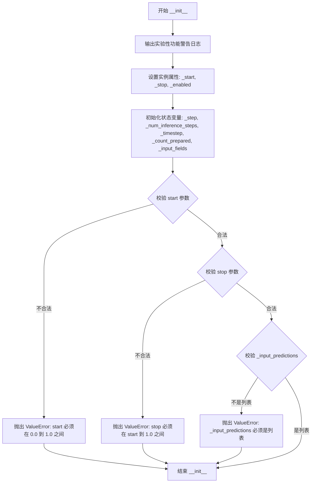

#### 带注释源码

```python
def __init__(self, start: float = 0.0, stop: float = 1.0, enabled: bool = True):
    """
    初始化 BaseGuidance 实例的基本配置参数。

    Args:
        start (float): 引导技术的起始比例，范围 [0.0, 1.0)，默认为 0.0
        stop (float): 引导技术的结束比例，范围 [start, 1.0]，默认为 1.0
        enabled (bool): 是否启用该引导技术，默认为 True
    """
    # 输出实验性功能警告日志，提示 API 可能在未来版本中发生破坏性变更
    logger.warning(
        "Guiders are currently an experimental feature under active development. "
        "The API is subject to breaking changes in future releases."
    )

    # 设置引导的起始和结束比例
    self._start = start
    self._stop = stop

    # 初始化推理状态变量为 None，后续通过 set_state() 方法设置
    self._step: int = None                  # 当前推理步数
    self._num_inference_steps: int = None   # 总推理步数
    self._timestep: torch.LongTensor = None # 当前时间步张量

    # 记录 prepare_models 被调用的次数
    self._count_prepared = 0

    # 输入字段字典，用于指定数据中需要的预测字段
    self._input_fields: dict[str, str | tuple[str, str]] = None

    # 引导技术启用/禁用标志
    self._enabled = enabled

    # 校验 start 参数必须在 [0.0, 1.0) 范围内
    if not (0.0 <= start < 1.0):
        raise ValueError(f"Expected `start` to be between 0.0 and 1.0, but got {start}.")

    # 校验 stop 参数必须在 [start, 1.0] 范围内
    if not (start <= stop <= 1.0):
        raise ValueError(f"Expected `stop` to be between {start} and 1.0, but got {stop}.")

    # 校验子类必须定义 _input_predictions 为列表类型
    # 这是引导技术所需预测名称的列表，由子类实现时定义
    if self._input_predictions is None or not isinstance(self._input_predictions, list):
        raise ValueError(
            "`_input_predictions` must be a list of required prediction names for the guidance technique."
        )
```


### `BaseGuidance.new`

该方法创建当前引导器实例的副本，可选择性地修改配置参数。通过调用类的 `from_config` 类方法，使用当前实例的配置并合并 kwargs 中提供的新参数来生成新实例。

参数：

- `**kwargs`：`dict`，要覆盖新实例配置的配置参数。如果未提供 kwargs，则返回具有相同配置的精确副本。

返回值：`Self`（类型由类决定），具有相同（或更新）配置的新引导器实例。

#### 流程图

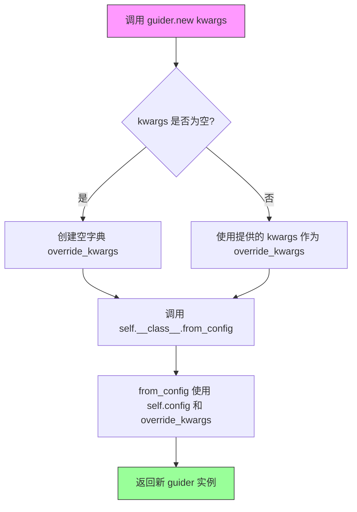

#### 带注释源码

```python
def new(self, **kwargs):
    """
    创建此引导器实例的副本，可选择性地修改配置参数。

    Args:
        **kwargs: 配置参数，用于覆盖新实例中的值。如果未提供 kwargs，
            则返回具有相同配置的精确副本。

    Returns:
        具有相同（或更新）配置的新的引导器实例。

    Example:
        ```python
        # 创建一个 CFG 引导器
        guider = ClassifierFreeGuidance(guidance_scale=3.5)

        # 创建精确副本
        same_guider = guider.new()

        # 创建具有不同起始步骤的副本，保留其他配置
        new_guider = guider.new(guidance_scale=5)
        ```
    """
    # 使用类的 from_config 类方法创建新实例
    # self.config 获取当前实例的配置
    # **kwargs 用于覆盖配置中的特定参数
    return self.__class__.from_config(self.config, **kwargs)
```


### `BaseGuidance.disable`

该方法用于禁用当前 guidance 实例，将内部 `_enabled` 标志设置为 `False`，从而在后续推理过程中跳过该 guidance 技术的应用。

参数： 无

返回值：`None`，无返回值（Python 方法默认返回 `None`）

#### 流程图

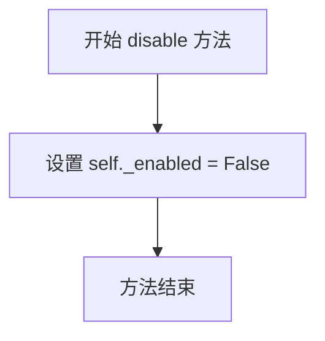

#### 带注释源码

```python
def disable(self):
    """
    禁用该 guidance 实例。
    
    该方法将 _enabled 标志设置为 False，使得在后续的推理过程中
    该 guidance 技术不会被应用。可以通过 enable() 方法重新启用。
    """
    self._enabled = False
```


### BaseGuidance.enable

该方法用于启用（激活）Guidance 引导功能，将内部标志位 `_enabled` 设置为 `True`，从而使后续的推理过程应用指定的引导技术。

参数：

- `self`：`BaseGuidance`，隐式的实例参数，表示当前 Guidance 对象本身

返回值：`None`，该方法无返回值，仅修改对象内部状态

#### 流程图

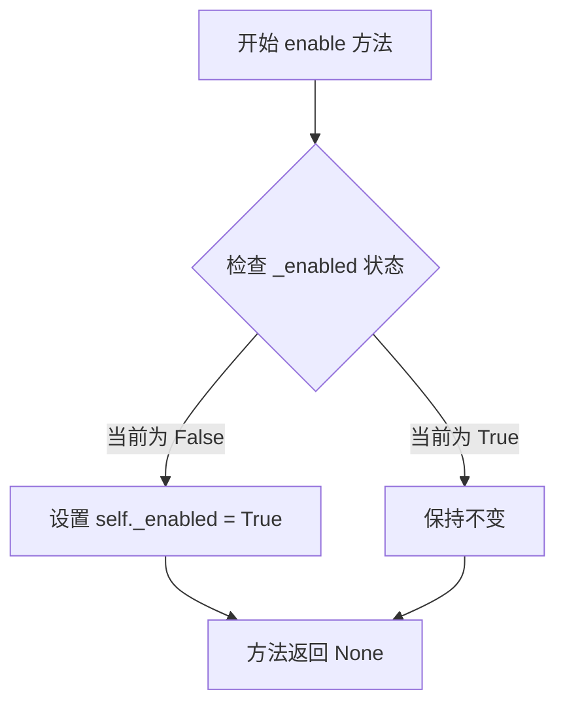

#### 带注释源码

```python
def enable(self):
    """
    启用 Guidance 引导功能。
    
    该方法将 _enabled 属性设置为 True，使得在后续的扩散模型推理过程中
    会应用该 Guidance 技术的引导逻辑。与 disable() 方法配合使用，
    可以动态控制 Guidance 的启用/禁用状态。
    
    Args:
        self: BaseGuidance 实例，隐式参数
        
    Returns:
        None: 无返回值，仅修改对象内部状态
    """
    self._enabled = True  # 将启用标志设置为 True
```


### `BaseGuidance.set_state`

该方法用于设置 Guidance 技术的内部状态，包括当前推理步骤、总推理步骤数和时间步张量，并在每次调用时重置准备计数器。

参数：

- `step`：`int`，当前推理步骤索引，标识当前处于去噪过程的第几步
- `num_inference_steps`：`int`，总推理步骤数，表示整个去噪过程的总步数
- `timestep`：`torch.LongTensor`，当前时间步张量，表示扩散过程中的具体时间步

返回值：`None`，该方法直接修改对象内部状态，不返回任何值

#### 流程图

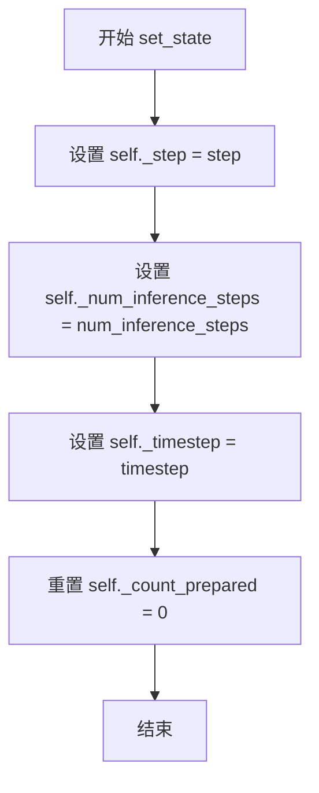

#### 带注释源码

```python
def set_state(self, step: int, num_inference_steps: int, timestep: torch.LongTensor) -> None:
    """
    设置 Guidance 技术的内部状态。
    
    此方法在每个推理步骤开始时被调用，用于同步 Guidance 对象的内部状态
    与扩散 pipeline 的实际执行状态。重置 _count_prepared 是因为每次状态
    更新后需要重新准备模型。
    
    Args:
        step: 当前推理步骤索引，从 0 开始
        num_inference_steps: 总推理步骤数
        timestep: 当前时间步张量，用于确定噪声调度
    """
    self._step = step                        # 更新当前推理步骤
    self._num_inference_steps = num_inference_steps  # 更新总推理步数
    self._timestep = timestep                # 更新当前时间步张量
    self._count_prepared = 0                 # 重置准备计数器，表示需要重新准备模型
```


### `BaseGuidance.get_state`

获取当前 guidance 技术的状态，并将其作为字典返回。该方法主要用于调试和状态检查，状态变量会包含在 `__repr__` 方法中。

参数：
- 无参数（仅包含 `self`）

返回值：`dict[str, Any]`，返回包含当前状态变量的字典，包括：
- `step`：当前推理步骤
- `num_inference_steps`：总推理步骤数
- `timestep`：当前时间步张量
- `count_prepared`：`prepare_models` 被调用的次数
- `enabled`：guidance 是否启用
- `num_conditions`：条件数量

#### 流程图

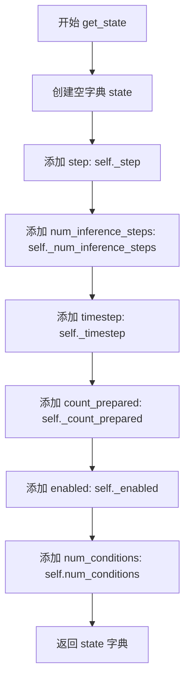

#### 带注释源码

```python
def get_state(self) -> dict[str, Any]:
    """
    Returns the current state of the guidance technique as a dictionary. The state variables will be included in
    the __repr__ method. Returns:
        `dict[str, Any]`: A dictionary containing the current state variables including:
            - step: Current inference step
            - num_inference_steps: Total number of inference steps
            - timestep: Current timestep tensor
            - count_prepared: Number of times prepare_models has been called
            - enabled: Whether the guidance is enabled
            - num_conditions: Number of conditions
    """
    # 创建一个字典来存储当前 guidance 的所有状态变量
    state = {
        "step": self._step,                      # 当前推理步骤（从 0 开始）
        "num_inference_steps": self._num_inference_steps,  # 总推理步骤数
        "timestep": self._timestep,               # 当前时间步张量（用于去噪调度）
        "count_prepared": self._count_prepared, # prepare_models 方法被调用的次数
        "enabled": self._enabled,                # guidance 功能是否启用
        "num_conditions": self.num_conditions,   # 条件数量（通过属性获取，需子类实现）
    }
    return state  # 返回包含所有状态信息的字典
```


### `BaseGuidance.__repr__`

返回 guidance 对象的字符串表示，包含配置信息和当前运行时状态。

参数：

- `self`：`BaseGuidance` 实例，当前对象本身

返回值：`str`，返回对象的字符串表示，包含 ConfigMixin 的配置信息和当前状态信息。

#### 流程图

```mermaid
flowchart TD
    A[开始 __repr__] --> B[调用 super().__repr__ 获取配置字符串]
    B --> C[调用 get_state 获取当前状态字典]
    C --> D[遍历状态字典的每个键值对]
    D --> E{值是否为多行字符串?}
    E -->|是| F[将后续行缩进]
    E -->|否| G[直接转换]
    F --> H[格式化键值对并添加到列表]
    G --> H
    H --> I{还有更多键值对?}
    I -->|是| D
    I -->|否| J[用换行符连接所有状态行]
    J --> K[返回组合字符串: 配置 + State标题 + 状态信息]
    K --> L[结束]
```

#### 带注释源码

```python
def __repr__(self) -> str:
    """
    Returns a string representation of the guidance object including both config and current state.
    """
    # 获取父类 ConfigMixin 的字符串表示（包含配置信息）
    str_repr = super().__repr__()

    # 获取当前运行时状态字典
    state = self.get_state()

    # 格式化每个状态变量为独立的行并缩进
    state_lines = []
    for k, v in state.items():
        # 将值转换为字符串并处理多行值
        v_str = str(v)
        if "\n" in v_str:
            # 对于多行值（如 MomentumBuffer），缩进后续行
            v_lines = v_str.split("\n")
            v_str = v_lines[0] + "\n" + "\n".join(["    " + line for line in v_lines[1:]])
        state_lines.append(f"  {k}: {v_str}")

    # 用换行符连接所有状态行
    state_str = "\n".join(state_lines)

    # 返回组合后的完整字符串表示
    return f"{str_repr}\nState:\n{state_str}"
```


### `BaseGuidance.prepare_models`

该方法用于为指导技术准备模型，会增加内部计数器以跟踪准备次数。在基类中实现为简单的计数递增，具体模型准备逻辑需由子类重写实现。

参数：

- `self`：当前 `BaseGuidance` 实例的隐式参数
- `denoiser`：`torch.nn.Module`，要去 prepared 的去噪模型实例。该参数在基类中未被使用，留给子类实现具体的模型准备逻辑

返回值：`None`，无返回值

#### 流程图

```mermaid
flowchart TD
    A[Start prepare_models] --> B[接收 denoiser 参数]
    B --> C{基类实现}
    C --> D[将 _count_prepared 计数器加 1]
    D --> E[End]
    
    F[子类重写] --> G[执行自定义模型准备逻辑]
    G --> H[调用 super().prepare_models 递增计数器]
    H --> E
```

#### 带注释源码

```python
def prepare_models(self, denoiser: torch.nn.Module) -> None:
    """
    Prepares the models for the guidance technique on a given batch of data. This method should be overridden in
    subclasses to implement specific model preparation logic.
    
    该方法为指导技术准备模型。在每个批次数据处理前调用，用于执行必要的模型准备工作，
    例如注册前向钩子、设置特定参数等。基类实现仅递增计数器，具体准备逻辑需由子类重写。
    
    Args:
        denoiser (torch.nn.Module): The denoiser model to be prepared. In the base class, this parameter
            is not used directly; it is provided for subclasses to implement specific preparation logic.
            子类可以实现诸如注册钩子、准备条件输入等操作。
    """
    # 递增准备计数器，用于跟踪 prepare_models 被调用的次数
    # 可用于调试、日志记录或状态验证
    self._count_prepared += 1
```


### `BaseGuidance.cleanup_models`

该方法是 `BaseGuidance` 类的清理方法，用于在处理一批数据后清理模型。它是一个基类方法，应在子类中被重写以实现特定的模型清理逻辑，例如移除在 `prepare_models` 阶段添加的钩子或其他有状态修改。

参数：

- `denoiser`：`torch.nn.Module`，需要进行清理的去噪模型

返回值：`None`，无返回值

#### 流程图

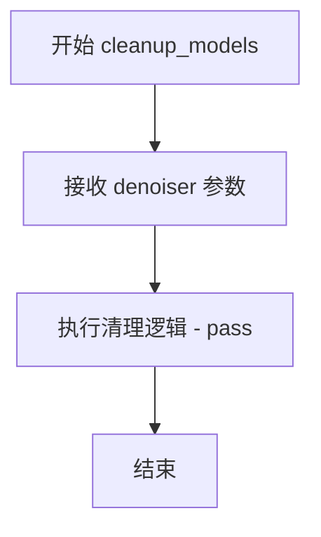

#### 带注释源码

```python
def cleanup_models(self, denoiser: torch.nn.Module) -> None:
    """
    Cleans up the models for the guidance technique after a given batch of data. This method should be overridden
    in subclasses to implement specific model cleanup logic. It is useful for removing any hooks or other stateful
    modifications made during `prepare_models`.
    """
    pass
```


### `BaseGuidance.prepare_inputs`

该方法是一个抽象方法，用于将输入的 `BlockState` 数据准备为引导技术所需的格式，返回一个 `BlockState` 列表。每个 `BlockState` 代表不同的条件（如条件和非条件），供后续的 `forward` 方法使用。子类需要实现此方法以提供具体的输入准备逻辑。

参数：

-  `data`：`BlockState`，输入的块状态数据，包含推理过程中的中间状态和预测结果

返回值：`list[BlockState]`，返回准备好的块状态列表，每个元素对应一个条件（如分类器自由引导中的条件和非条件输入）

#### 流程图

```mermaid
flowchart TD
    A[开始 prepare_inputs] --> B{子类实现?}
    B -->|是| C[执行子类具体逻辑]
    B -->|否| D[抛出 NotImplementedError]
    C --> E[返回 list[BlockState]]
    D --> F[结束]
    E --> F
    
    style D fill:#ffcccc
    style E fill:#ccffcc
```

#### 带注释源码

```python
def prepare_inputs(self, data: "BlockState") -> list["BlockState"]:
    """
    Prepares the input data for the guidance technique.
    
    This method transforms a single BlockState into a list of BlockState objects,
    where each BlockState represents a different condition (e.g., conditional and 
    unconditional inputs for classifier-free guidance).
    
    Args:
        data: The input BlockState containing inference data such as predictions,
              timesteps, and other relevant information.
    
    Returns:
        A list of BlockState objects, each prepared for the guidance technique's
        forward pass. The number of returned states should match num_conditions.
    
    Raises:
        NotImplementedError: If called on the base class without implementation.
    """
    raise NotImplementedError("BaseGuidance::prepare_inputs must be implemented in subclasses.")
```


### BaseGuidance.prepare_inputs_from_block_state

该方法是一个抽象方法，用于从 BlockState 中准备 GUIDANCE 技术的输入数据。它接收输入数据和字段映射配置，返回准备好的 BlockState 列表供 GUIDANCE 技术使用。在基类中直接抛出 `NotImplementedError`，要求子类实现具体逻辑。

参数：

- `self`：`BaseGuidance`，方法所属的 GUIDANCE 基类实例
- `data`：`BlockState`，输入的块状态数据对象，包含推理过程中的中间状态（如噪声预测、时间步等）
- `input_fields`：`dict[str, str | tuple[str, str]]`，输入字段映射字典。键为要存储的字段名，值为字符串（条件数据标识）或元组（条件/无条件数据标识对），用于从 data 中提取相应的属性

返回值：`list[BlockState]`，准备好的块状态列表，每个元素包含从原始 BlockState 中提取的对应字段数据

#### 流程图

```mermaid
flowchart TD
    A[开始 prepare_inputs_from_block_state] --> B{子类是否已实现该方法?}
    B -->|是: 子类重写实现| C[执行子类具体逻辑]
    B -->|否: 基类默认实现| D[抛出 NotImplementedError]
    C --> E[返回 list[BlockState]]
    D --> F[错误: BaseGuidance::prepare_inputs_from_block_state must be implemented in subclasses.]
    
    style D fill:#ffcccc
    style F fill:#ff9999
```

#### 带注释源码

```python
def prepare_inputs_from_block_state(
    self, data: "BlockState", input_fields: dict[str, str | tuple[str, str]]
) -> list["BlockState"]:
    """
    从 BlockState 中准备 GUIDANCE 技术的输入数据。
    
    这是一个抽象方法，在基类中抛出 NotImplementedError。
    子类需要重写此方法以实现具体的数据准备逻辑。
    
    Args:
        data: 输入的 BlockState 对象，包含推理过程中的中间状态
        input_fields: 字段映射字典，定义如何从 data 中提取和组织数据
    
    Returns:
        list[BlockState]: 准备好的 BlockState 列表
        
    Raises:
        NotImplementedError: 当子类未重写此方法时抛出
    """
    raise NotImplementedError("BaseGuidance::prepare_inputs_from_block_state must be implemented in subclasses.")
```


### `BaseGuidance.__call__`

该方法是 `BaseGuidance` 类的可调用接口（`__call__`），用于在扩散模型推理过程中执行引导技术。它接收一组 `BlockState` 对象作为输入，验证每个对象是否包含 `noise_pred` 属性，检查数据数量是否与条件数量匹配，然后将噪声预测传递给 `forward` 方法进行具体的引导计算。

参数：

- `data`：`list["BlockState"]`，包含推理过程中累积的噪声预测和其他状态的 `BlockState` 对象列表

返回值：`Any`，具体由子类 `forward` 方法决定，通常是经过引导处理后的噪声预测张量

#### 流程图

```mermaid
flowchart TD
    A[__call__ 入口] --> B{验证 data 中每个对象<br/>是否具有 noise_pred 属性}
    B -->|是| C{验证 data 长度是否等于<br/>num_conditions}
    B -->|否| D[抛出 ValueError:<br/>Expected all data to have<br/>noise_pred attribute]
    C -->|是| E[构建 forward_inputs 字典]
    C -->|否| F[抛出 ValueError:<br/>Expected {num_conditions} data items,<br/>but got {len(data)}]
    E --> G[调用 self.forward<br/>**forward_inputs]
    G --> H[返回 forward 结果]
```

#### 带注释源码

```python
def __call__(self, data: list["BlockState"]) -> Any:
    """
    使 BaseGuidance 实例可调用，作为引导技术的入口点。
    
    参数:
        data: 包含 BlockState 对象的列表，每个对象应包含 noise_pred 属性
        
    返回值:
        Any: 子类 forward 方法的返回值，通常是处理后的噪声预测
        
    异常:
        ValueError: 如果数据缺少 noise_pred 属性或数量不匹配
    """
    # 第一步：验证所有 BlockState 对象是否都具有 noise_pred 属性
    # noise_pred 是扩散模型推理过程中产生的噪声预测结果
    if not all(hasattr(d, "noise_pred") for d in data):
        raise ValueError("Expected all data to have `noise_pred` attribute.")
    
    # 第二步：验证输入数据的数量是否与引导器配置的条件数量相匹配
    # 不同的引导技术可能需要不同数量的条件输入（如 classifier-free guidance 需要条件和无条件各一个）
    if len(data) != self.num_conditions:
        raise ValueError(
            f"Expected {self.num_conditions} data items, but got {len(data)}. Please check the input data."
        )
    
    # 第三步：构建传递给 forward 方法的输入字典
    # 使用 _identifier_key 作为键，从每个 BlockState 对象中提取对应的 noise_pred
    # _identifier_key 用于区分不同条件的标识符（如 'cond' 或 'uncond'）
    forward_inputs = {getattr(d, self._identifier_key): d.noise_pred for d in data}
    
    # 第四步：调用子类实现的 forward 方法进行具体的引导计算
    # 将构建好的输入字典解包传递给 forward
    return self.forward(**forward_inputs)
```


### `BaseGuidance.forward`

该方法是 `BaseGuidance` 类的抽象方法，用于在扩散模型的推理过程中执行指导（guidance）计算。由于是抽象方法，基类中只定义了接口而未实现具体逻辑，具体的前向传播逻辑需由子类（如 `ClassifierFreeGuidance` 等）重写实现。

参数：

- `*args`：可变位置参数，由子类定义具体的输入参数
- `**kwargs`：可变关键字参数，由子类定义具体的输入参数

返回值：`Any`，具体返回值类型由子类实现决定，通常为经过指导处理后的噪声预测结果

#### 流程图

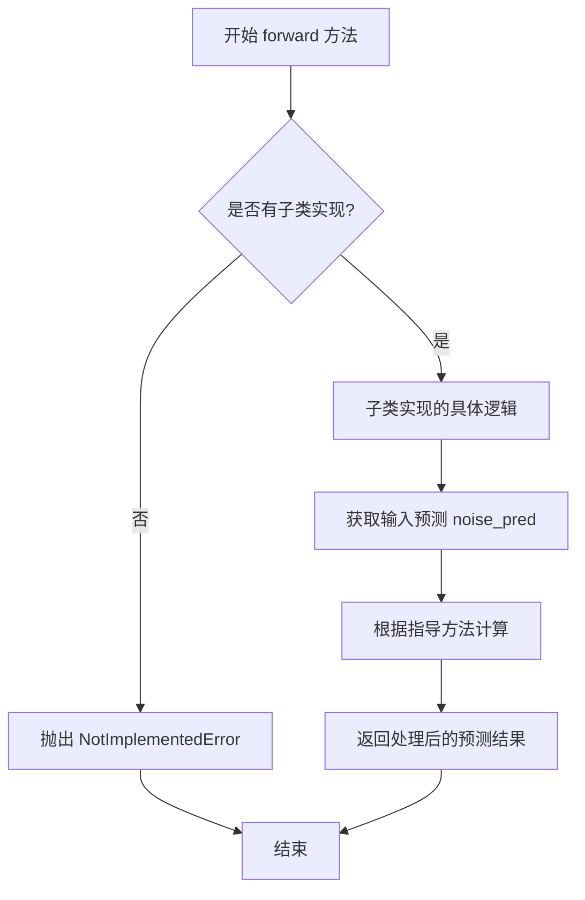

#### 带注释源码

```python
def forward(self, *args, **kwargs) -> Any:
    """
    执行指导技术的前向传播。
    
    该方法是抽象方法，在基类中只抛出 NotImplementedError。
    子类需要重写此方法以实现具体的指导逻辑，例如：
    - ClassifierFreeGuidance: 实现无分类器指导
    - 其它自定义指导技术
    
    Args:
        *args: 可变位置参数，通常包含条件预测和无条件预测
        **kwargs: 可变关键字参数，包含其他必要的预测数据
        
    Returns:
        Any: 经过指导处理后的预测结果，具体类型由子类定义
        
    Raises:
        NotImplementedError: 当基类被直接调用时抛出
        
    Note:
        此方法通常通过 __call__ 方法间接调用。
        __call__ 方法会先验证输入数据，然后准备 forward_inputs 字典，
        字典的键由 _identifier_key 标识，值为对应的 noise_pred。
    """
    raise NotImplementedError("BaseGuidance::forward must be implemented in subclasses.")
```

#### 设计说明

1. **抽象方法设计**：`BaseGuidance.forward` 采用模板方法模式，基类定义接口规范，子类提供具体实现。这种设计允许不同类型的指导技术（如 CFG、Img2Img Guidance 等）拥有统一的方法签名。

2. **调用流程**：用户通常不直接调用 `forward`，而是通过 `__call__` 方法。`__call__` 会：
   - 验证所有数据对象具有 `noise_pred` 属性
   - 检查数据数量与 `num_conditions` 匹配
   - 构建 `forward_inputs` 字典并传递给 `forward`

3. **参数灵活性**：使用 `*args` 和 `**kwargs` 允许子类定义任意数量和类型的参数，保持良好的扩展性。

4. **技术债务/优化空间**：
   - 抽象方法缺乏明确的接口定义文档，子类实现时需要参考父类调用方式
   - 建议在文档中明确子类必须实现的参数契约


### `BaseGuidance.is_conditional`

该属性是一个抽象属性，用于指示当前guidance技术是否为条件性guidance（conditional guidance）。它必须由子类实现，以返回True表示支持条件性guidance（如Classifier-Free Guidance），返回False表示无条件guidance。

参数：无（作为属性访问，无需参数）

返回值：`bool`，返回True表示该guidance技术为条件性guidance，返回False表示无条件guidance。

#### 流程图

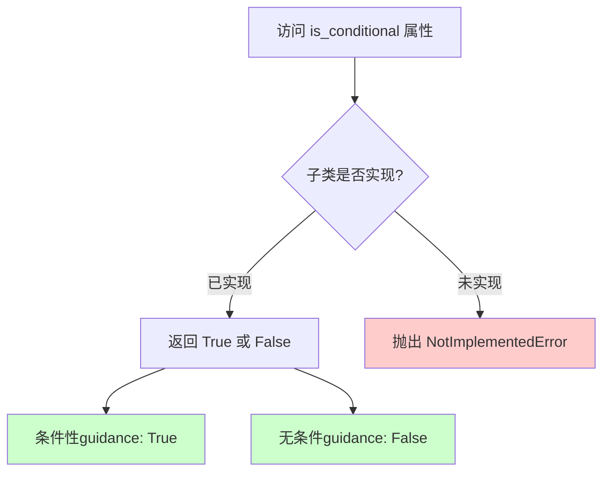

#### 带注释源码

```python
@property
def is_conditional(self) -> bool:
    """
    属性：is_conditional
    
    描述：
        指示当前guidance技术是否为条件性guidance（conditional guidance）的抽象属性。
        该属性必须由子类实现，以返回True表示支持条件性guidance（如Classifier-Free Guidance），
        返回False表示无条件guidance。
        
        在扩散模型的推理过程中：
        - 条件性guidance（is_conditional=True）通常需要同时预测有条件和无条件的噪声，
          然后根据guidance_scale进行加权组合
        - 无条件guidance（is_conditional=False）只需进行单一的噪声预测
        
    返回值：
        bool: 
            - True: 该guidance技术为条件性guidance
            - False: 该guidance技术为无条件guidance
            
    使用示例：
        ```python
        # 在子类中的实现示例
        @property
        def is_conditional(self) -> bool:
            return True  # 对于Classifier-Free Guidance
        ```
        
    注意：
        此属性与 is_unconditional 属性互补，is_unconditional = not is_conditional
    """
    raise NotImplementedError("BaseGuidance::is_conditional must be implemented in subclasses.")
```


### `BaseGuidance.is_unconditional`

该属性返回当前 Guidance 是否为无条件执行的布尔值，通过对 `is_conditional` 属性返回值的逻辑非运算得到。

参数：无

返回值：`bool`，返回 True 表示该 Guidance 是无条件的（不执行条件引导），返回 False 表示是有条件的（执行条件引导）。

#### 流程图

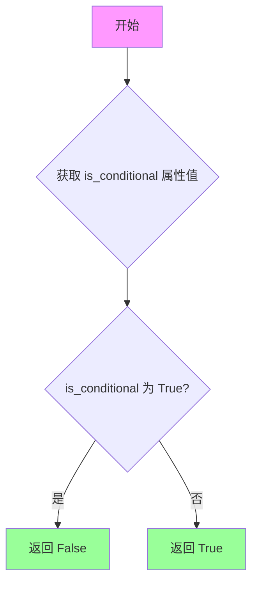

#### 带注释源码

```python
@property
def is_unconditional(self) -> bool:
    """
    属性：判断当前 Guidance 是否为无条件执行
    
    该属性通过取反 is_conditional 属性的返回值来确定当前 Guidance 是否为无条件执行。
    如果 is_conditional 返回 True（条件引导），则 is_unconditional 返回 False；
    如果 is_conditional 返回 False（无条件引导），则 is_unconditional 返回 True。
    
    注意：具体的 is_conditional 实现由子类提供，本方法依赖子类实现的 is_conditional 属性。
    
    返回值:
        bool: True 表示无条件执行，False 表示条件执行
    """
    return not self.is_conditional
```


### `BaseGuidance.num_conditions`

该属性是 `BaseGuidance` 类中的一个抽象属性，用于返回指导技术所需的条件数量。它是一个只读属性，必须在子类中实现。

参数：无（这是一个属性而非方法）

返回值：`int`，返回指导技术所需的条件数量。

#### 流程图

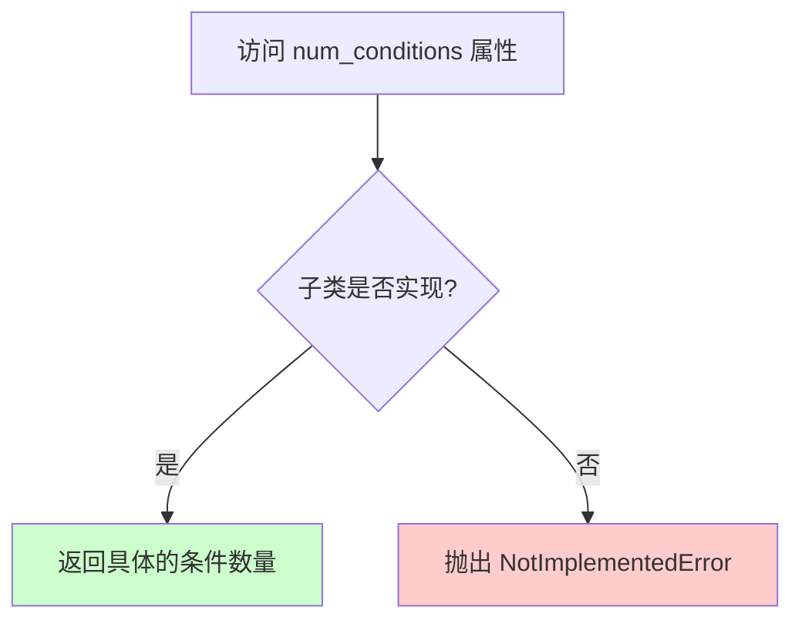

#### 带注释源码

```python
@property
def num_conditions(self) -> int:
    """
    属性用于返回指导技术所需的条件数量。
    
    这是一个抽象属性，必须在子类中实现。
    具体的指导技术（如 ClassifierFreeGuidance）需要根据其配置
    返回适当的条件数量（例如，CFG 可能返回 2：条件和非条件）。
    
    Returns:
        int: 指导技术所需的条件数量
        
    Raises:
        NotImplementedError: 如果子类没有实现此属性
    """
    raise NotImplementedError("BaseGuidance::num_conditions must be implemented in subclasses.")
```

#### 使用示例

该属性在类内部被用于验证输入数据的数量：

```python
def __call__(self, data: list["BlockState"]) -> Any:
    # 检查所有数据是否有 noise_pred 属性
    if not all(hasattr(d, "noise_pred") for d in data):
        raise ValueError("Expected all data to have `noise_pred` attribute.")
    # 使用 num_conditions 验证输入数据数量
    if len(data) != self.num_conditions:
        raise ValueError(
            f"Expected {self.num_conditions} data items, but got {len(data)}. Please check the input data."
        )
    # ... 后续处理
```

在状态获取中也会暴露该属性：

```python
def get_state(self) -> dict[str, Any]:
    state = {
        # ... 其他状态字段
        "num_conditions": self.num_conditions,  # 暴露条件数量到状态中
    }
    return state
```


### `BaseGuidance._prepare_batch`

该方法是一个类方法，用于根据指定的元组索引准备_guidance技术的批次数据。它从输入字典中提取数据，将元组类型的值按索引取值，将张量直接传递，最后将处理后的数据封装成 `BlockState` 对象返回。

参数：

- `cls`：类方法隐式参数，指向 `BaseGuidance` 类本身
- `data`：`dict[str, tuple[torch.Tensor, torch.Tensor]]`，输入数据字典，键为字段名，值为张量或元组（通常包含条件和非条件数据）
- `tuple_index`：`int`，用于访问元组元素的索引（0表示条件数据，1表示非条件数据）
- `identifier`：`str`，用于标识该批次数据的唯一标识符

返回值：`BlockState`，封装好的批次数据对象，包含提取的字段和标识符

#### 流程图

```mermaid
flowchart TD
    A[开始 _prepare_batch] --> B{导入 BlockState}
    B --> C[初始化空字典 data_batch]
    C --> D{遍历 data 的每个键值对}
    D --> E{value 是 torch.Tensor?}
    E -->|Yes| F[直接赋值 data_batch[key] = value]
    F --> H{继续遍历}
    E -->|No| G{value 是 tuple?}
    G -->|Yes| I[data_batch[key] = value[tuple_index]]
    I --> H
    G -->|No| J[抛出 ValueError]
    J --> K[捕获异常并记录日志]
    K --> H
    H -->|还有更多| D
    H -->|遍历完成| L[添加标识符到 data_batch]
    L --> M[返回 BlockState(**data_batch)]
    M --> N[结束]
    
    style J fill:#ffcccc
    style K fill:#ffffcc
```

#### 带注释源码

```python
@classmethod
def _prepare_batch(
    cls,
    data: dict[str, tuple[torch.Tensor, torch.Tensor]],
    tuple_index: int,
    identifier: str,
) -> "BlockState":
    """
    为引导技术准备批次数据。此方法用于 BaseGuidance 类的 prepare_inputs 方法。
    它根据提供的元组索引准备批次。

    参数:
        data: 包含张量或元组的字典，用于构建批次数据
        tuple_index: 整数索引，用于访问元组类型值中的特定元素
        identifier: 字符串标识符，用于标记批次

    返回:
        BlockState: 准备好的批次数据对象
    """
    # 延迟导入 BlockState，避免循环依赖
    from ..modular_pipelines.modular_pipeline import BlockState

    # 初始化空字典用于存储处理后的数据
    data_batch = {}
    
    # 遍历输入数据的每个键值对
    for key, value in data.items():
        try:
            # 检查值是否为张量
            if isinstance(value, torch.Tensor):
                # 直接将张量添加到批次字典中
                data_batch[key] = value
            # 检查值是否为元组（如包含条件和非条件数据）
            elif isinstance(value, tuple):
                # 根据 tuple_index 从元组中提取对应元素
                data_batch[key] = value[tuple_index]
            else:
                # 值类型既不是张量也不是元组，抛出异常
                raise ValueError(f"Invalid value type: {type(value)}")
        except ValueError:
            # 捕获 ValueError，记录调试日志（属性不存在时跳过）
            logger.debug(f"`data` does not have attribute(s) {value}, skipping.")
    
    # 将标识符添加到批次数据中，用于后续识别
    data_batch[cls._identifier_key] = identifier
    
    # 使用处理后的数据创建并返回 BlockState 对象
    return BlockState(**data_batch)
```


### BaseGuidance._prepare_batch_from_block_state

该类方法用于从 BlockState 对象中提取指定字段的数据，构建新的 BlockState 实例。它在 `prepare_inputs` 方法中被调用，根据 `tuple_index` 参数从输入字段的元组值中选择条件数据或无条件数据。

参数：

- `input_fields`：`dict[str, str | tuple[str, str]]`，字段映射字典，键为输出字段名，值为源属性名（字符串）或条件/无条件属性名元组
- `data`：`BlockState`，输入的 BlockState 对象，包含待提取的数据
- `tuple_index`：`int`，当 input_fields 值为元组时，选择元组中元素的索引（0 表示条件数据，1 表示无条件数据）
- `identifier`：`str`，用于标识该批次的唯一标识符，会被写入返回的 BlockState 的 `_identifier_key` 属性中

返回值：`BlockState`，包含提取后字段的新 BlockState 实例

#### 流程图

```mermaid
flowchart TD
    A[开始 _prepare_batch_from_block_state] --> B[创建空字典 data_batch]
    B --> C{遍历 input_fields 的每个键值对}
    C --> D{当前值是字符串?}
    D -->|是| E[使用 getattr 获取 data.值]
    E --> H[将结果存入 data_batch]
    D -->|否| F{当前值是元组?}
    F -->|是| G[根据 tuple_index 获取元组元素 getattr(data, value[tuple_index])]
    G --> H
    F -->|否| I[跳过该字段]
    H --> C
    C --> J[将 identifier 写入 data_batch]
    J --> K[返回新创建的 BlockState]
```

#### 带注释源码

```python
@classmethod
def _prepare_batch_from_block_state(
    cls,
    input_fields: dict[str, str | tuple[str, str]],
    data: "BlockState",
    tuple_index: int,
    identifier: str,
) -> "BlockState":
    """
    Prepares a batch of data for the guidance technique. This method is used in the `prepare_inputs` method of the
    `BaseGuidance` class. It prepares the batch based on the provided tuple index.

    Args:
        input_fields (`dict[str, str | tuple[str, str]]`):
            A dictionary where the keys are the names of the fields that will be used to store the data once it is
            prepared with `prepare_inputs`. The values can be either a string or a tuple of length 2, which is used
            to look up the required data provided for preparation. If a string is provided, it will be used as the
            conditional data (or unconditional if used with a guidance method that requires it). If a tuple of
            length 2 is provided, the first element must be the conditional data identifier and the second element
            must be the unconditional data identifier or None.
        data (`BlockState`):
            The input data to be prepared.
        tuple_index (`int`):
            The index to use when accessing input fields that are tuples.

    Returns:
        `BlockState`: The prepared batch of data.
    """
    # 延迟导入 BlockState，避免循环依赖
    from ..modular_pipelines.modular_pipeline import BlockState

    # 初始化用于存储提取数据的字典
    data_batch = {}
    
    # 遍历输入字段映射，提取所需属性
    for key, value in input_fields.items():
        try:
            if isinstance(value, str):
                # 值是字符串时，直接获取对应属性
                data_batch[key] = getattr(data, value)
            elif isinstance(value, tuple):
                # 值是元组时，根据 tuple_index 选择条件或无条件数据
                data_batch[key] = getattr(data, value[tuple_index])
            else:
                # 已经是字符串或长度为2的元组，无需处理
                pass
        except AttributeError:
            # 属性不存在时记录调试日志并跳过
            logger.debug(f"`data` does not have attribute(s) {value}, skipping.")
    
    # 将标识符添加到批次数据中，用于后续识别
    data_batch[cls._identifier_key] = identifier
    
    # 使用提取的数据创建新的 BlockState 实例并返回
    return BlockState(**data_batch)
```


### `BaseGuidance.from_pretrained`

从预定义的JSON配置文件在本地目录或Hub仓库中实例化一个guider。

参数：

-   `cls`：类本身（隐式参数），表示该方法为类方法
-   `pretrained_model_name_or_path`：`str | os.PathLike | None`，可以是Hub上预训练模型的模型ID（如`google/ddpm-celebahq-256`），或者是包含guider配置的本地目录路径（如`./my_model_directory`）
-   `subfolder`：`str | None`，Hub上或本地大型模型仓库中模型文件所在的子文件夹位置
-   `return_unused_kwargs`：`bool | None`，是否返回未被Python类使用的kwargs，默认为`False`
-   `cache_dir`：`str | os.PathLike | None`，用于缓存下载的预训练模型配置的目录
-   `force_download`：`bool | None`，是否强制（重新）下载模型权重和配置文件
-   `proxies`：`dict[str, str] | None`，代理服务器字典
-   `output_loading_info`：`bool | None`，是否返回包含缺失键、意外键和错误消息的字典
-   `local_files_only`：`bool | None`，是否仅加载本地模型权重和配置文件
-   `token`：`str | bool | None`，用于远程文件的HTTPBearer授权令牌
-   `revision`：`str | None`，要使用的特定模型版本
-   `**kwargs`：其他关键字参数，会传递给`load_config`和`from_config`

返回值：`Self`，返回一个guider实例

#### 流程图

```mermaid
flowchart TD
    A[from_pretrained 开始] --> B{cls.load_config}
    B --> C[传入 pretrained_model_name_or_path]
    B --> D[传入 subfolder]
    B --> E[传入 return_unused_kwargs=True]
    B --> F[传入 return_commit_hash=True]
    B --> G[传入 **kwargs]
    
    C --> H[load_config 返回 config, kwargs, commit_hash]
    D --> H
    E --> H
    F --> H
    G --> H
    
    H --> I{cls.from_config}
    I --> J[传入 config]
    I --> K[传入 return_unused_kwargs]
    I --> L[传入 **kwargs]
    
    J --> M[from_config 返回 guider 实例]
    K --> M
    L --> M
    
    M --> N[from_pretrained 返回 guider 实例]
```

#### 带注释源码

```python
@classmethod
@validate_hf_hub_args
def from_pretrained(
    cls,
    pretrained_model_name_or_path: str | os.PathLike | None = None,
    subfolder: str | None = None,
    return_unused_kwargs=False,
    **kwargs,
) -> Self:
    r"""
    Instantiate a guider from a pre-defined JSON configuration file in a local directory or Hub repository.

    Parameters:
        pretrained_model_name_or_path (`str` or `os.PathLike`, *optional*):
            Can be either:
                - A string, the *model id* (for example `google/ddpm-celebahq-256`) of a pretrained model hosted on
                  the Hub.
                - A path to a *directory* (for example `./my_model_directory`) containing the guider configuration
                  saved with [`~BaseGuidance.save_pretrained`].
        subfolder (`str`, *optional*):
            The subfolder location of a model file within a larger model repository on the Hub or locally.
        return_unused_kwargs (`bool`, *optional*, defaults to `False`):
            Whether kwargs that are not consumed by the Python class should be returned or not.
        cache_dir (`str | os.PathLike`, *optional*):
            Path to a directory where a downloaded pretrained model configuration is cached if the standard cache
            is not used.
        force_download (`bool`, *optional*, defaults to `False`):
            Whether or not to force the (re-)download of the model weights and configuration files, overriding the
            cached versions if they exist.
        proxies (`dict[str, str]`, *optional*):
            A dictionary of proxy servers to use by protocol or endpoint, for example, `{'http': 'foo.bar:3128',
            'http://hostname': 'foo.bar:4012'}`. The proxies are used on each request.
        output_loading_info(`bool`, *optional*, defaults to `False`):
            Whether or not to also return a dictionary containing missing keys, unexpected keys and error messages.
        local_files_only(`bool`, *optional*, defaults to `False`):
            Whether to only load local model weights and configuration files or not. If set to `True`, the model
            won't be downloaded from the Hub.
        token (`str` or *bool*, *optional*):
            The token to use as HTTP bearer authorization for remote files. If `True`, the token generated from
            `diffusers-cli login` (stored in `~/.huggingface`) is used.
        revision (`str`, *optional*, defaults to `"main"`):
            The specific model version to use. It can be a branch name, a tag name, a commit id, or any identifier
            allowed by Git.

    > [!TIP] > To use private or [gated models](https://huggingface.co/docs/hub/models-gated#gated-models), log-in
    with `hf > auth login`. You can also activate the special >
    ["offline-mode"](https://huggingface.co/diffusers/installation.html#offline-mode) to use this method in a >
    firewalled environment.

    """
    # 调用类的load_config方法加载配置
    # 传入return_unused_kwargs=True以获取未被使用的kwargs
    # 传入return_commit_hash=True以获取commit_hash
    config, kwargs, commit_hash = cls.load_config(
        pretrained_model_name_or_path=pretrained_model_name_or_path,
        subfolder=subfolder,
        return_unused_kwargs=True,  # 获取未使用的kwargs以便传递给from_config
        return_commit_hash=True,
        **kwargs,
    )
    # 调用类的from_config方法从配置实例化guider
    # 传入原始的return_unused_kwargs参数
    return cls.from_config(config, return_unused_kwargs=return_unused_kwargs, **kwargs)
```


### `BaseGuidance.save_pretrained`

保存引导器（Guider）配置对象到指定目录，以便可以通过 `from_pretrained` 类方法重新加载。该方法内部调用 `ConfigMixin.save_config` 来完成实际的配置保存工作。

参数：

- `save_directory`：`str | os.PathLike`，保存配置 JSON 文件的目录（如果不存在则创建）
- `push_to_hub`：`bool`，可选，默认为 `False`，是否在保存后将模型推送到 Hugging Face Hub
- `**kwargs`：`dict[str, Any]`，可选，传递给 `PushToHubMixin.push_to_hub` 方法的额外关键字参数

返回值：`None`，无返回值（直接修改文件系统状态或推送至 Hub）

#### 流程图

```mermaid
flowchart TD
    A[调用 save_pretrained] --> B{检查 save_directory 是否有效}
    B -->|无效| C[抛出异常]
    B -->|有效| D[调用 self.save_config]
    D --> E{push_to_hub=True?}
    E -->|是| F[推送配置到 Hub]
    E -->|否| G[保存配置到本地目录]
    F --> H[结束]
    G --> H
```

#### 带注释源码

```python
def save_pretrained(self, save_directory: str | os.PathLike, push_to_hub: bool = False, **kwargs):
    """
    Save a guider configuration object to a directory so that it can be reloaded using the
    [`~BaseGuidance.from_pretrained`] class method.

    Args:
        save_directory (`str` or `os.PathLike`):
            Directory where the configuration JSON file will be saved (will be created if it does not exist).
        push_to_hub (`bool`, *optional*, defaults to `False`):
            Whether or not to push your model to the Hugging Face Hub after saving it. You can specify the
            repository you want to push to with `repo_id` (will default to the name of `save_directory` in your
            namespace).
        kwargs (`dict[str, Any]`, *optional*):
            Additional keyword arguments passed along to the [`~utils.PushToHubMixin.push_to_hub`] method.
    """
    # 委托给 ConfigMixin.save_config 处理实际保存逻辑
    # 该方法会保存 guider_config.json 到指定目录
    self.save_config(save_directory=save_directory, push_to_hub=push_to_hub, **kwargs)
```

## 关键组件


### BaseGuidance

核心基类，提供引导技术的抽象骨架。继承自ConfigMixin和PushToHubMixin，用于实现各种扩散模型引导方法（如Classifier-Free Guidance）。该类定义了模型准备、输入准备、状态管理等标准接口，并提供了配置保存/加载功能。

### GuiderOutput

输出数据结构类，继承自BaseOutput。包含三个张量字段：pred（预测结果）、pred_cond（条件预测）、pred_uncond（无条件预测），用于封装引导技术的输出结果。

### rescale_noise_cfg

噪声配置重缩放工具函数，基于论文"Common Diffusion Noise Schedules and Sample Steps are Flawed"的Section 3.4实现。通过计算文本预测和_cfg预测的标准差比率，对噪声预测进行重缩放以改善图像质量并修复过曝问题。

### _input_predictions (类属性)

静态类属性，定义引导技术所需预测名称的列表。子类必须设置此属性为预测名称列表，用于验证输入数据的有效性。

### _identifier_key (类属性)

字符串常量`"__guidance_identifier__"`，作为BlockState中的标识符键，用于在数据批处理时追踪不同条件下的数据项。

### start / stop (实例属性)

浮点数类型，表示引导生效的时间步范围（0.0到1.0之间）。start定义引导开始的相对时间点，stop定义引导结束的时间点。构造函数中包含验证逻辑，确保start>=0且stop<=1。

### _enabled (实例属性)

布尔类型，控制引导技术是否启用。通过enable()和disable()方法动态切换，在__call__中会检查此标志。

### _step / _num_inference_steps / _timestep (实例属性)

状态跟踪变量。_step记录当前推理步数，_num_inference_steps记录总推理步数，_timestep是torch.LongTensor类型，记录当前时间步张量。通过set_state()方法设置，get_state()方法返回。

### prepare_models / cleanup_models

模型准备和清理接口方法。prepare_models在每个batch数据上进行模型准备（如注册hook、调整参数），cleanup_models用于清理模型状态（如移除hook）。基类中仅增加计数，子类需重写实现具体逻辑。

### prepare_inputs / prepare_inputs_from_block_state

输入准备抽象方法，接收BlockState并返回处理后的BlockState列表。用于将原始数据转换为引导技术所需的格式。基类中抛出NotImplementedError，要求子类实现。

### forward

前向传播抽象方法，接收预测张量并返回处理后的结果。子类需要实现具体的引导逻辑（如CFG的权重混合、噪声调度等）。

### is_conditional / is_unconditional / num_conditions

抽象属性，用于描述引导技术的条件特性。is_conditional指示是否有条件输入，num_conditions返回条件数量。基类中要求子类实现。

### _prepare_batch / _prepare_batch_from_block_state

静态类方法，用于批处理数据。_prepare_batch从字典数据创建BlockState，_prepare_batch_from_block_state从BlockState对象提取字段。两者都支持tuple索引来选择条件或无条件数据。

### from_pretrained / save_pretrained

模型加载和保存方法。from_pretrained从预训练配置实例化Guider对象，save_pretrained保存配置到目录。遵循HuggingFace Hub的模型加载规范，支持子文件夹、缓存、token等参数。

### new

实例复制方法，创建当前guider的副本，可选择性覆盖配置参数。内部调用from_config实现，支持快速创建配置略有不同的 guider 实例。


## 问题及建议


### 已知问题

- **类型注解不一致**：`_step` 声明为 `int` 类型但初始化为 `None`，`_timestep` 声明为 `torch.LongTensor` 但初始化为 `None`，这种模式会导致类型检查器警告
- **缺少正式的抽象方法定义**：多个方法（`prepare_inputs`、`forward`、`is_conditional`、`num_conditions` 等）仅通过抛出 `NotImplementedError` 来表示为抽象方法，未使用 `abc` 模块进行正式声明，导致子类可能忘记实现这些方法
- **控制流异常滥用**：`_prepare_batch` 方法中使用 `try-except` 捕获 `ValueError` 进行控制流，这种模式不符合异常处理最佳实践
- **除零风险**：`rescale_noise_cfg` 函数在计算 `std_text / std_cfg` 时未检查 `std_cfg` 是否为零，可能导致除零错误
- **重复代码**：`_prepare_batch` 和 `_prepare_batch_from_block_state` 方法包含大量重复逻辑，可以提取公共方法
- **`_input_predictions` 设计不清晰**：类属性 `_input_predictions` 初始化为 `None` 并在 `__init__` 中检查其存在性，这种设计容易造成混淆，子类可能忘记定义该属性
- **警告重复打印**：每次实例化 `BaseGuidance` 子类时都会打印实验性功能警告，在频繁创建对象的场景中会造成日志噪音

### 优化建议

- 使用 `Optional[int]` 和 `Optional[torch.LongTensor]` 替代当前类型注解，并在方法中添加适当的 None 检查
- 引入 `abc.ABC` 和 `@abstractmethod` 装饰器来正式定义抽象方法接口
- 重构 `_prepare_batch` 方法，使用条件判断替代异常处理作为控制流手段
- 在 `rescale_noise_cfg` 中添加 `std_cfg` 为零的检查逻辑
- 将两个 `_prepare_batch` 方法的公共逻辑提取为独立辅助方法
- 将 `_input_predictions` 改为抽象属性或在文档中更明确地说明子类必须定义此属性
- 使用 Python 的 `warnings` 模块配合 `stacklevel` 参数或实现单次警告机制，避免重复打印

## 其它


### 设计目标与约束

本模块旨在为扩散模型（Diffusion Models）提供统一的引导（Guidance）技术框架，目标是支持多种引导技术（如Classifier-Free Guidance）的可扩展实现。设计约束包括：1）必须继承ConfigMixin和PushToHubMixin以支持配置管理和模型共享；2）引导技术必须在denoising过程的特定时间步（timestep）范围内工作，由start和stop参数控制（0.0-1.0之间的比例）；3）所有具体引导实现需重写prepare_inputs、forward、is_conditional和num_conditions等抽象方法。

### 错误处理与异常设计

代码中包含多处显式的错误处理和验证：1）在__init__中验证start、stop参数范围（0.0<=start<1.0, start<=stop<=1.0）并抛出ValueError；2）验证_input_predictions必须为list类型；3）在__call__方法中检查输入数据是否包含noise_pred属性，以及数据数量是否匹配num_conditions；4）使用NotImplementedError强制子类实现抽象方法；5）使用logger.warning提示API为实验性功能可能发生重大变更。

### 数据流与状态机

BaseGuidance的工作流程如下：1）初始化阶段：创建guider实例，设置start/stop/enabled参数；2）状态设置阶段：调用set_state更新当前推理步骤step、推理总步数num_inference_steps和当前timestep；3）模型准备阶段：调用prepare_models对denoiser进行初始化（如注册hook）；4）输入准备阶段：调用prepare_inputs或prepare_inputs_from_block_state准备BlockState数据列表；5）前向传播阶段：调用__call__方法，最终执行forward进行实际的引导计算；6）清理阶段：调用cleanup_models清理注册的hook等状态。

### 外部依赖与接口契约

本模块依赖以下外部包：1）torch：用于张量操作和模型处理；2）huggingface_hub.utils.validate_hf_hub_args：用于验证Hub相关参数；3）typing_extensions.Self：用于类型注解；4）..configuration_utils.ConfigMixin：配置管理混入类；5）..utils.BaseOutput和PushToHubMixin：输出基类和模型推送混入；6）..modular_pipelines.modular_pipeline.BlockState：数据块状态类。接口契约要求：子类必须实现prepare_inputs、forward、is_conditional和num_conditions四个抽象方法；prepare_models和cleanup_models可选择重写以实现模型状态的挂载和清理。

### 性能考虑与优化空间

当前实现存在以下性能优化空间：1）_identifier_key使用字符串"__guidance_identifier__"作为字典键，可考虑使用更高效的唯一标识方式；2）get_state方法每次调用都构建新字典，对于高频调用场景可考虑缓存；3）prepare_inputs和prepare_inputs_from_block_state方法中使用getattr动态获取属性，可考虑预先建立属性映射表以减少反射开销；4）rescale_noise_cfg函数中std计算可考虑使用torch.var_mean等组合函数减少遍历次数。

### 安全性考虑

代码在安全性方面有以下考虑：1）通过validate_hf_hub_args装饰器验证Hub参数，防止注入攻击；2）模型加载支持local_files_only模式，避免网络下载潜在风险；3）支持token认证机制确保私有模型访问安全；4）实验性API通过warning提示用户可能的风险。然而，当前实现未包含输入数据的消毒（sanitization）处理，建议在使用外部传入的BlockState数据时增加字段验证。

### 兼容性设计

本模块遵循以下兼容性策略：1）使用from __future__ import annotations支持Python 3.7+的延迟类型注解；2）通过TYPE_CHECKING条件导入避免运行时循环依赖；3）config_name使用全局常量GUIDER_CONFIG_NAME，便于配置文件的统一管理；4）from_pretrained和save_pretrained方法遵循HuggingFace标准模式，确保与现有模型加载体系兼容；5）支持subfolder参数以适应多模型目录结构。

### 测试策略建议

建议针对以下场景编写测试用例：1）参数验证测试：验证start/stop非法值时抛出正确的ValueError；2）状态管理测试：验证set_state和get_state的配对行为；3）enable/disable功能测试；4）new方法测试：验证配置复制和覆盖的正确性；5）抽象方法实现验证：确保子类正确实现所有必需方法；6）from_pretrained/save_pretrained往返测试；7）prepare_inputs批量处理测试，包括tuple和string类型input_fields的处理。

### 版本演进与迁移指南

当前版本标记为实验性功能（experimental feature under active development），API可能发生重大变更。建议：1）在生产环境中锁定具体子类实现而非直接使用BaseGuidance；2）关注start/stop参数语义未来可能的调整；3）_identifier_key的命名空间可能随版本演化；4）BlockState的字段结构需与modular_pipeline模块保持同步。

    