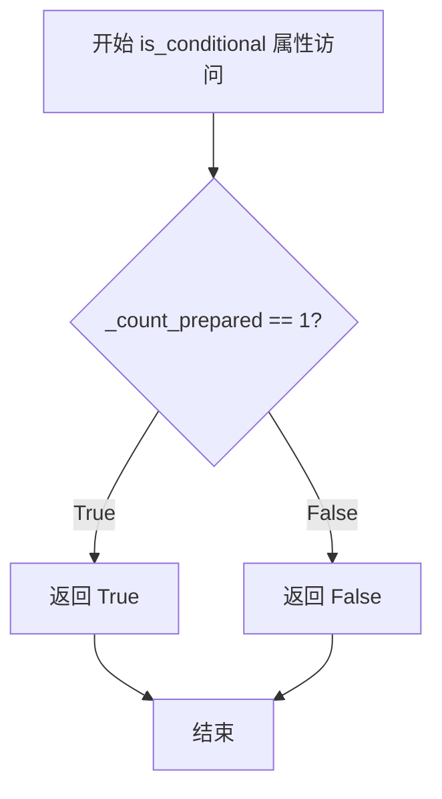
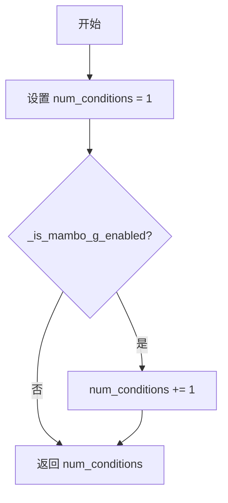

# `diffusers\src\diffusers\guiders\magnitude_aware_guidance.py` 详细设计文档

Magnitude-Aware Mitigation for Boosted Guidance (MAMBO-G) 实现，提供一种基于预测幅度动态调整分类器自由引导强度的引导策略，用于改进扩散模型的图像生成质量。

## 整体流程

```mermaid
graph TD
    A[开始 forward] --> B{_is_mambo_g_enabled?}
    B -- 否 --> C[pred = pred_cond]
    B -- 是 --> D[调用 mambo_guidance]
    D --> E[计算 diff = pred_cond - pred_uncond]
    E --> F[计算 ratio = ||diff|| / ||pred_uncond||]
    F --> G[计算 guidance_scale_final = guidance_scale * exp(-alpha * ratio)]
    G --> H[pred = pred + guidance_scale_final * diff]
    C --> I{guidance_rescale > 0?}
    H --> I
    I -- 是 --> J[调用 rescale_noise_cfg]
    I -- 否 --> K[返回 GuiderOutput]
    J --> K
```

## 类结构

```
BaseGuidance (抽象基类)
└── MagnitudeAwareGuidance
```

## 全局变量及字段


### `MagnitudeAwareGuidance._input_predictions`
    
List of input prediction field names, contains 'pred_cond' and 'pred_uncond'

类型：`list[str]`
    


### `MagnitudeAwareGuidance.guidance_scale`
    
The scale parameter for classifier-free guidance, controlling conditioning strength on text prompt

类型：`float`
    


### `MagnitudeAwareGuidance.alpha`
    
The alpha parameter for magnitude-aware guidance, controlling aggressive suppression of guidance scale based on magnitude

类型：`float`
    


### `MagnitudeAwareGuidance.guidance_rescale`
    
The rescale factor applied to noise predictions for improving image quality and fixing overexposure

类型：`float`
    


### `MagnitudeAwareGuidance.use_original_formulation`
    
Flag to determine whether to use the original classifier-free guidance formulation or diffusers-native implementation

类型：`bool`
    


### `MagnitudeAwareGuidance.start`
    
Fraction of total denoising steps after which guidance starts being applied

类型：`float`
    


### `MagnitudeAwareGuidance.stop`
    
Fraction of total denoising steps after which guidance stops being applied

类型：`float`
    


### `MagnitudeAwareGuidance.enabled`
    
Flag to enable or disable the magnitude-aware guidance mechanism

类型：`bool`
    
    

## 全局函数及方法


### `mambo_guidance`

该函数实现了 Magnitude-Aware Mitigation for Boosted Guidance (MAMBO-G) 算法，通过计算条件预测与无条件预测之间的幅度比率，动态调整引导强度以减少饱和并提高生成图像质量。

参数：

- `pred_cond`：`torch.Tensor`，条件预测张量（来自文本条件）
- `pred_uncond`：`torch.Tensor`，无条件预测张量（无文本条件）
- `guidance_scale`：`float`，分类器-free 引导的缩放参数
- `alpha`：`float`（默认值为 `8.0`），幅度感知引导的 alpha 参数，值越大对大幅度 guidance 的抑制越强
- `use_original_formulation`：`bool`（默认值为 `False`），是否使用论文中提出的原始公式

返回值：`torch.Tensor`，应用幅度感知引导后的调整预测张量

#### 流程图

```mermaid
flowchart TD
    A[开始: mambo_guidance] --> B[获取计算维度<br/>dim = range(1, len(pred_cond.shape))]
    B --> C[计算差值<br/>diff = pred_cond - pred_uncond]
    C --> D[计算差值范数<br/>norm_diff = ||diff||]
    D --> E[计算无条件预测范数<br/>norm_uncond = ||pred_uncond||]
    E --> F[计算幅度比率<br/>ratio = norm_diff / norm_uncond]
    F --> G{use_original_formulation?}
    G -->|True| H[使用原始公式<br/>guidance_scale_final = guidance_scale × exp(-α × ratio)]
    G -->|False| I[使用Diffusers原生实现<br/>guidance_scale_final = 1 + (guidance_scale - 1) × exp(-α × ratio)]
    H --> J{use_original_formulation?}
    I --> J
    J -->|True| K[选择基础预测<br/>pred = pred_cond]
    J -->|False| L[选择基础预测<br/>pred = pred_uncond]
    K --> M[应用引导<br/>pred = pred + guidance_scale_final × diff]
    L --> M
    M --> N[返回调整后的预测]
```

#### 带注释源码

```python
def mambo_guidance(
    pred_cond: torch.Tensor,
    pred_uncond: torch.Tensor,
    guidance_scale: float,
    alpha: float = 8.0,
    use_original_formulation: bool = False,
):
    """
    实现 Magnitude-Aware Mitigation for Boosted Guidance (MAMBO-G) 算法
    
    该函数根据条件预测和无条件预测之间的幅度比率动态调整引导强度，
    当引导更新幅度较大时自动降低引导强度，从而减少饱和现象。
    
    参数:
        pred_cond: 条件预测张量，来自文本条件的模型输出
        pred_uncond: 无条件预测张量，无文本条件的模型输出
        guidance_scale: 分类器-free 引导的缩放参数
        alpha: 幅度感知参数，控制对大幅度引导的抑制程度
        use_original_formulation: 是否使用论文原始公式
    
    返回:
        应用幅度感知引导后的预测张量
    """
    
    # 获取需要计算范数的维度（排除批次维度）
    dim = list(range(1, len(pred_cond.shape)))
    
    # 计算条件预测与无条件预测之间的差异
    diff = pred_cond - pred_uncond
    
    # 计算差异和无条件预测的 L2 范数，然后计算比率
    # 比率越大表示条件引导的幅度相对越大
    ratio = torch.norm(diff, dim=dim, keepdim=True) / torch.norm(pred_uncond, dim=dim, keepdim=True)
    
    # 根据是否使用原始公式计算最终的引导缩放因子
    # 使用指数衰减：当 ratio 增大时，引导强度自动降低
    if use_original_formulation:
        # 论文原始公式：直接从 guidance_scale 进行缩放
        guidance_scale_final = guidance_scale * torch.exp(-alpha * ratio)
    else:
        # Diffusers 原生实现：从 1.0 开始调整
        # 相当于 (guidance_scale - 1) 的基础上的指数衰减
        guidance_scale_final = 1.0 + (guidance_scale - 1.0) * torch.exp(-alpha * ratio)
    
    # 根据公式类型选择基础预测
    # 原始公式以条件预测为基础，原生实现以无条件预测为基础
    pred = pred_cond if use_original_formulation else pred_uncond
    
    # 将缩放后的引导差异加到基础预测上
    pred = pred + guidance_scale_final * diff
    
    return pred
```


### `MagnitudeAwareGuidance.__init__`

这是 `MagnitudeAwareGuidance` 类的构造函数，负责初始化幅度感知引导（Magnitude-Aware Mitigation for Boosted Guidance, MAMBO-G） Guidance 类的实例。该类继承自 `BaseGuidance`，用于在扩散模型的推理过程中实现一种改进的分类器自由引导（Classifier-Free Guidance）方法，通过根据预测差异的幅度动态调整引导强度来提升图像质量。

参数：

-  `guidance_scale`：`float`，默认值 `10.0`，分类器自由引导的缩放参数。较高的值会增强对文本提示的条件反射，而较低的值允许生成更多自由度。较高的值可能导致饱和和图像质量下降。
-  `alpha`：`float`，默认值 `8.0`，幅度感知引导的 alpha 参数。较高的值会在引导更新幅度较大时更积极地抑制引导缩放。
-  `guidance_rescale`：`float`，默认值 `0.0`，应用于噪声预测的重缩放因子。用于改善图像质量和修复过度曝光，参考自 Common Diffusion Noise Schedules and Sample Steps are Flawed 论文的第 3.4 节。
-  `use_original_formulation`：`bool`，默认值 `False`，是否使用论文中提出的原始分类器自由引导公式。默认使用 diffusers 原生实现，该实现已在代码库中存在很长时间。
-  `start`：`float`，默认值 `0.0`，引导开始的总去噪步数的分数。
-  `stop`：`float`，默认值 `1.0`，引导停止的总去噪步数的分数。
-  `enabled`：`bool`，默认值 `True`，是否启用引导。

返回值：`None`，构造函数不返回值，主要通过修改实例属性来初始化对象状态。

#### 流程图

```mermaid
flowchart TD
    A[开始 __init__] --> B[调用 super().__init__<br/>传入 start, stop, enabled]
    B --> C[设置 self.guidance_scale<br/>= guidance_scale]
    C --> D[设置 self.alpha<br/>= alpha]
    D --> E[设置 self.guidance_rescale<br/>= guidance_rescale]
    E --> F[设置 self.use_original_formulation<br/>= use_original_formulation]
    F --> G[结束 __init__]
```

#### 带注释源码

```python
@register_to_config
def __init__(
    self,
    guidance_scale: float = 10.0,
    alpha: float = 8.0,
    guidance_rescale: float = 0.0,
    use_original_formulation: bool = False,
    start: float = 0.0,
    stop: float = 1.0,
    enabled: bool = True,
):
    """
    初始化 MagnitudeAwareGuidance 实例。
    
    该构造函数使用 @register_to_config 装饰器，将所有参数注册为配置属性，
    以便后续可以序列化和反序列化。调用父类 BaseGuidance 的构造函数来初始化
    基础引导功能，然后设置 MAMBO-G 特定的参数。
    
    参数:
        guidance_scale: 分类器自由引导的缩放参数，默认 10.0
        alpha: 幅度感知引导的 alpha 参数，默认 8.0
        guidance_rescale: 噪声预测的重缩放因子，默认 0.0
        use_original_formulation: 是否使用原始引导公式，默认 False
        start: 引导开始的步数分数，默认 0.0
        stop: 引导停止的步数分数，默认 1.0
        enabled: 是否启用引导，默认 True
    """
    # 调用父类 BaseGuidance 的构造函数，初始化基础引导功能
    # 父类负责设置 _start, _stop, _enabled, _step, _num_inference_steps 等属性
    super().__init__(start, stop, enabled)

    # 设置 MAMBO-G 特定的引导参数
    self.guidance_scale = guidance_scale
    self.alpha = alpha
    self.guidance_rescale = guidance_rescale
    self.use_original_formulation = use_original_formulation
```


### `MagnitudeAwareGuidance.prepare_inputs`

该方法负责将输入数据准备为适合推理的数据批次。它根据条件数量决定处理单个还是多个数据批次，并调用内部方法 `_prepare_batch` 对每个批次进行预处理，最终返回包含所有数据批次的列表。

参数：

-  `data`：`dict[str, tuple[torch.Tensor, torch.Tensor]]`，输入数据字典，键为字符串，值为包含条件和非条件预测的元组

返回值：`list["BlockState"]`，返回准备好的数据批次列表

#### 流程图

```mermaid
flowchart TD
    A[开始 prepare_inputs] --> B{self.num_conditions == 1?}
    B -->|是| C[tuple_indices = [0]]
    B -->|否| D[tuple_indices = [0, 1]]
    C --> E[初始化空列表 data_batches]
    D --> E
    E --> F[遍历 tuple_indices 和 self._input_predictions]
    F --> G[调用 self._prepare_batch]
    G --> H[将结果添加到 data_batches]
    H --> I{还有更多数据?}
    I -->|是| F
    I -->|否| J[返回 data_batches]
```

#### 带注释源码

```python
def prepare_inputs(self, data: dict[str, tuple[torch.Tensor, torch.Tensor]]) -> list["BlockState"]:
    """
    准备输入数据批次。
    
    根据条件数量确定要处理的元组索引：
    - 如果只有一个条件，使用索引 [0]
    - 如果有多个条件，使用索引 [0, 1]
    
    Args:
        data: 输入数据字典，键为字符串，值为 (条件预测, 非条件预测) 元组
        
    Returns:
        准备好的数据批次列表
    """
    # 根据条件数量决定处理哪些索引
    # 单条件时只处理索引0，双条件时处理索引0和1
    tuple_indices = [0] if self.num_conditions == 1 else [0, 1]
    
    # 初始化数据批次列表
    data_batches = []
    
    # 遍历索引和预测类型，处理每个数据批次
    for tuple_idx, input_prediction in zip(tuple_indices, self._input_predictions):
        # 调用内部方法准备单个批次
        data_batch = self._prepare_batch(data, tuple_idx, input_prediction)
        # 将批次添加到列表中
        data_batches.append(data_batch)
    
    # 返回所有准备好的批次
    return data_batches
```


### `MagnitudeAwareGuidance.prepare_inputs_from_block_state`

该方法是MagnitudeAwareGuidance类的核心输入预处理方法，负责从BlockState中提取并组织条件和无条件预测数据，以便后续的前向传播处理。根据条件数量（单条件或双条件）确定需要处理的预测类型，并通过内部方法 `_prepare_batch_from_block_state` 批量处理数据。

参数：

-  `self`：隐式参数，类型为 `MagnitudeAwareGuidance`，表示当前实例本身
-  `data`：类型为 `"BlockState"`（来自 `TYPE_CHECKING` 导入的 `BlockState` 类型），表示包含当前去噪步骤状态的块状态对象，其中存储了模型预测结果
-  `input_fields`：类型为 `dict[str, str | tuple[str, str]]`，字典键为字段名称，值为字符串字段名或包含（条件字段名, 无条件字段名）的元组，用于指定从BlockState中提取哪些预测字段

返回值：`list["BlockState"]`，返回处理后的BlockState对象列表，每个元素对应一个预测批次（条件预测或无条件预测）

#### 流程图

```mermaid
flowchart TD
    A[开始 prepare_inputs_from_block_state] --> B{self.num_conditions == 1?}
    B -->|是| C[tuple_indices = [0]]
    B -->|否| D[tuple_indices = [0, 1]]
    C --> E[初始化空列表 data_batches]
    D --> E
    E --> F[遍历 zip{tuple_indices, self._input_predictions}]
    F --> G[调用 _prepare_batch_from_block_state]
    G --> H[将返回的 data_batch 添加到 data_batches]
    H --> I{还有更多 tuple_idx?}
    I -->|是| F
    I -->|否| J[返回 data_batches]
    J --> K[结束]
    
    style A fill:#f9f,color:#333
    style J fill:#9f9,color:#333
    style K fill:#9f9,color:#333
```

#### 带注释源码

```python
def prepare_inputs_from_block_state(
    self, data: "BlockState", input_fields: dict[str, str | tuple[str, str]]
) -> list["BlockState"]:
    """
    从BlockState中准备输入数据批次。
    
    该方法根据条件数量确定需要处理的预测类型（条件预测pred_cond或无条件预测pred_uncond），
    并为每种预测类型调用内部方法生成对应的批次数据。
    
    Args:
        data: 包含当前去噪步骤状态的BlockState对象
        input_fields: 字段映射字典，指定从BlockState中提取哪些预测字段
                     格式: {输出字段名: "源字段名"} 或 {输出字段名: ("条件字段", "无条件字段")}
    
    Returns:
        处理后的BlockState对象列表，长度为1（单条件）或2（双条件）
    """
    # 根据条件数量确定元组索引：单条件时只处理索引0，双条件时处理索引0和1
    tuple_indices = [0] if self.num_conditions == 1 else [0, 1]
    
    # 初始化批次列表，用于存储处理后的BlockState对象
    data_batches = []
    
    # 遍历元组索引和预测类型名称，为每个预测类型生成对应的批次数据
    # _input_predictions = ["pred_cond", "pred_uncond"]
    for tuple_idx, input_prediction in zip(tuple_indices, self._input_predictions):
        # 调用内部方法从BlockState中提取并处理指定字段的数据
        data_batch = self._prepare_batch_from_block_state(
            input_fields,  # 字段映射配置
            data,          # 源BlockState数据
            tuple_idx,     # 元组索引（用于处理tuple类型的预测数据）
            input_prediction  # 预测类型名称（pred_cond或pred_uncond）
        )
        # 将处理完成的批次添加到结果列表
        data_batches.append(data_batch)
    
    # 返回所有处理后的批次数据
    return data_batches
```


### `MagnitudeAwareGuidance.forward`

该方法是 MagnitudeAwareGuidance 类的核心前向传播方法，负责根据是否启用 MAMBO-G（Magnitude-Aware Mitigation for Boosted Guidance）来计算最终的噪声预测。它首先检查引导是否在当前去噪步骤范围内启用，然后根据条件预测和无条件预测计算带有引导尺度的最终预测，最后可选地应用噪声配置重缩放以改善图像质量。

参数：

- `pred_cond`：`torch.Tensor`，条件预测（conditioned prediction），通常是文本条件下的模型输出
- `pred_uncond`：`torch.Tensor | None`，无条件预测（unconditioned prediction），无文本条件下的模型输出，可为 None

返回值：`GuiderOutput`，包含最终预测 pred、条件预测 pred_cond 和无条件预测 pred_uncond 的输出对象

#### 流程图

```mermaid
flowchart TD
    A[开始 forward] --> B{_is_mambo_g_enabled?}
    B -->|否| C[pred = pred_cond]
    B -->|是| D[调用 mambo_guidance]
    D --> E[pred = mambo_guidance<br/>(pred_cond, pred_uncond,<br/>guidance_scale, alpha,<br/>use_original_formulation)]
    C --> F{guidance_rescale > 0?}
    E --> F
    F -->|是| G[pred = rescale_noise_cfg<br/>(pred, pred_cond,<br/>guidance_rescale)]
    F -->|否| H[返回 GuiderOutput]
    G --> H
```

#### 带注释源码

```python
def forward(self, pred_cond: torch.Tensor, pred_uncond: torch.Tensor | None = None) -> GuiderOutput:
    """
    执行 Magnitude-Aware Guidance 的前向传播
    
    参数:
        pred_cond: 条件预测张量，来自文本条件下的模型输出
        pred_uncond: 无条件预测张量，来自无文本条件下的模型输出，可为 None
    
    返回:
        GuiderOutput: 包含最终预测和原始预测的对象
    """
    # 初始化 pred 为 None
    pred = None

    # 检查 MAMBO-G 是否启用
    # _is_mambo_g_enabled() 检查:
    #   1. 引导是否启用 (_enabled)
    #   2. 当前步骤是否在 start 和 stop 范围内
    #   3. guidance_scale 是否接近 0.0 (原始公式) 或 1.0 (diffusers 公式)
    if not self._is_mambo_g_enabled():
        # 如果未启用 MAMBO-G，直接使用条件预测作为输出
        pred = pred_cond
    else:
        # 启用 MAMBO-G，应用幅度感知引导
        # 这会根据预测差异的幅度动态调整引导强度
        pred = mambo_guidance(
            pred_cond,          # 条件预测
            pred_uncond,        # 无条件预测
            self.guidance_scale,  # 引导尺度
            self.alpha,         # 幅度感知参数
            self.use_original_formulation,  # 是否使用原始公式
        )

    # 如果设置了 guidance_rescale，应用噪声配置重缩放
    # 这有助于改善图像质量并修复过曝问题
    if self.guidance_rescale > 0.0:
        pred = rescale_noise_cfg(pred, pred_cond, self.guidance_rescale)

    # 返回 GuiderOutput 对象，包含:
    # - pred: 最终调整后的预测
    # - pred_cond: 原始条件预测
    # - pred_uncond: 原始无条件预测
    return GuiderOutput(pred=pred, pred_cond=pred_cond, pred_uncond=pred_uncond)
```


### `MagnitudeAwareGuidance.is_conditional`

该属性方法用于判断当前引导是否处于条件性模式。它通过检查已准备好的条件数量（`_count_prepared`）是否等于 1 来确定返回 True 或 False。当只准备了一个条件（通常是条件预测）时，返回 True 表示条件性引导；当准备了两个条件（条件预测和无条件预测）时，返回 False。

参数：
- （无传统参数，该方法为属性方法，隐含参数为 `self`）

返回值：`bool`，返回是否为条件性引导。如果准备好的条件数量等于 1 则返回 `True`，表示条件性引导；否则返回 `False`。

#### 流程图



#### 带注释源码

```python
@property
def is_conditional(self) -> bool:
    """
    判断当前引导是否为条件性模式。
    
    该属性通过检查已准备的条件数量来确定引导类型：
    - 当 _count_prepared == 1 时，返回 True（条件性引导）
    - 当 _count_prepared != 1 时，返回 False（通常为无条件引导）
    
    Returns:
        bool: 如果只准备了一个条件（条件预测），返回 True；
              如果准备了多个条件（包括无条件预测），返回 False。
    """
    return self._count_prepared == 1
```


### `MagnitudeAwareGuidance.num_conditions`

该属性方法用于返回当前_guidance_的条件数量。在 MagnitudeAwareGuidance 中，默认情况下有一个条件（pred_cond），当 Mambo-G 启用时，会额外增加一个条件（pred_uncond），因此返回值为 1 或 2。

参数： 无（仅包含隐式参数 `self`）

返回值：`int`，返回当前_guidance_的条件数量。如果 Mambo-G 未启用，返回 1；如果启用，返回 2。

#### 流程图



#### 带注释源码

```python
@property
def num_conditions(self) -> int:
    """
    属性方法，返回当前 guidance 的条件数量。
    
    默认情况下有一个条件（pred_cond），
    当 Mambo-G 启用时，会额外增加一个条件（pred_uncond）。
    """
    # 初始化条件数为 1（基础的条件预测）
    num_conditions = 1
    
    # 如果 Mambo-G 功能启用，条件数加 1
    # 这是因为启用后需要同时处理条件预测和非条件预测
    if self._is_mambo_g_enabled():
        num_conditions += 1
    
    # 返回最终的条件数量（1 或 2）
    return num_conditions
```


### `MagnitudeAwareGuidance._is_mambo_g_enabled`

该方法用于判断 Magnitude-Aware Guidance（MAMBO-G）功能是否启用。它通过检查当前推理步骤是否在指定范围内、以及 guidance_scale 是否处于有效值（不为 0.0 或 1.0）来确定是否启用 Magnitude-Aware 引导策略。

参数：
- 无显式参数（隐式参数 `self` 为 `MagnitudeAwareGuidance` 实例）

返回值：`bool`，返回 `True` 表示 MAMBO-G 功能启用，返回 `False` 表示禁用

#### 流程图

```mermaid
flowchart TD
    A[开始] --> B{self._enabled == False?}
    B -->|是| C[返回 False]
    B -->|否| D{self._num_inference_steps is not None?}
    D -->|是| E[计算 skip_start_step = int(self._start * self._num_inference_steps)]
    D -->|否| G{self.use_original_formulation?}
    E --> F[计算 skip_stop_step = int(self._stop * self._num_inference_steps)]
    F --> H[is_within_range = skip_start_step <= self._step < skip_stop_step]
    H --> G
    G -->|是| I{math.isclose guidance_scale, 0.0?}
    G -->|否| J{math.isclose guidance_scale, 1.0?}
    I -->|是| K[is_close = True]
    I -->|否| L[is_close = False]
    J -->|是| M[is_close = True]
    J -->|否| N[is_close = False]
    K --> O[返回 is_within_range and not is_close]
    L --> O
    M --> O
    N --> O
```

#### 带注释源码

```python
def _is_mambo_g_enabled(self) -> bool:
    """
    判断 Magnitude-Aware Guidance (MAMBO-G) 是否启用。
    
    启用条件：
    1. 当前启用状态 self._enabled 为 True
    2. 当前推理步骤在 [start * num_inference_steps, stop * num_inference_steps) 范围内
    3. guidance_scale 不接近临界值（使用原始公式时不为 0.0，否则不为 1.0）
    
    Returns:
        bool: 如果满足所有启用条件返回 True，否则返回 False
    """
    # 步骤1：检查全局启用开关
    if not self._enabled:
        return False

    # 步骤2：检查当前推理步骤是否在指定范围内
    is_within_range = True
    if self._num_inference_steps is not None:
        # 计算跳过的起始和结束步骤
        skip_start_step = int(self._start * self._num_inference_steps)
        skip_stop_step = int(self._stop * self._num_inference_steps)
        # 判断当前步骤是否在范围内
        is_within_range = skip_start_step <= self._step < skip_stop_step

    # 步骤3：检查 guidance_scale 是否接近临界值
    # 临界值含义：
    # - 使用原始公式时：guidance_scale=0.0 意味着无引导
    # - 使用 diffusers 公式时：guidance_scale=1.0 意味着无引导
    is_close = False
    if self.use_original_formulation:
        # 原始公式下，guidance_scale 接近 0.0 则视为无引导
        is_close = math.isclose(self.guidance_scale, 0.0)
    else:
        # diffusers 公式下，guidance_scale 接近 1.0 则视为无引导
        is_close = math.isclose(self.guidance_scale, 1.0)

    # 步骤4：返回最终启用状态
    # 需要在范围内且 guidance_scale 不接近临界值
    return is_within_range and not is_close
```

## 关键组件


### MagnitudeAwareGuidance 类

核心引导类，实现"Magnitude-Aware Mitigation for Boosted Guidance"（MAMBO-G）算法，用于根据预测幅度动态调整分类器无关引导（CFG）强度，以防止高引导尺度下的图像质量下降。

### mambo_guidance 函数

核心计算函数，通过计算条件预测与无条件预测之间的差异幅度，使用指数衰减函数动态调整最终引导尺度，实现幅度感知的引导控制。

### BaseGuidance 基类

提供引导的基础框架，定义 enabled、start、stop 等控制参数，以及 BlockState 数据处理的相关接口。

### GuiderOutput 数据结构

封装引导输出结果，包含 pred（最终预测）、pred_cond（条件预测）、pred_uncond（无条件预测）三个张量。

### 配置参数组

guidance_scale（引导尺度，默认10.0）、alpha（幅度感知参数，默认8.0）、guidance_rescale（预测重缩放因子，默认0.0）、use_original_formulation（是否使用原始公式）、start/stop（引导启用范围）等核心配置。

### prepare_inputs 方法

数据准备方法，从输入字典中提取条件和无条件预测批次，处理单条件或多条件场景。

### prepare_inputs_from_block_state 方法

从 BlockState 块状态中准备输入数据，支持更复杂的数据流集成。

### forward 方法

前向传播方法，根据是否启用 MAMBO-G 执行相应引导计算，并可选地应用噪声预测重缩放。

### _is_mambo_g_enabled 方法

判断 MAMBO-G 是否应启用的方法，检查 enabled 状态、当前推理步骤是否在 start-stop 范围内、以及 guidance_scale 是否接近 0 或 1。

### is_conditional 属性

判断是否为条件生成模式，基于准备好的批次数确定。

### num_conditions 属性

返回条件数量，在启用 MAMBO-G 时返回 2，否则返回 1。

### _input_predictions 属性

定义输入预测的名称列表，包含 "pred_cond" 和 "pred_uncond"。


## 问题及建议


### 已知问题

-   **魔法数字缺乏解释**：`alpha` 默认值为 8.0，`use_original_formulation` 中与 0.0 或 1.0 的比较缺乏注释说明其数学含义
-   **重复代码模式**：`prepare_inputs` 和 `prepare_inputs_from_block_state` 方法结构高度重复，可抽取公共逻辑
-   **计算冗余**：`mambo_guidance` 函数中分别调用两次 `torch.norm` 计算分子和分母范数，可合并为单次计算
- **类型注解不完整**：`mambo_guidance` 全局函数缺少返回类型注解
- **输入验证缺失**：未对 `pred_cond` 和 `pred_uncond` 的形状兼容性进行校验，可能导致运行时错误
- **边界条件处理**：`forward` 方法在 `pred_uncond` 为 `None` 时调用 `mambo_guidance` 会导致空值引用异常
- **属性设计问题**：`is_conditional` 属性依赖protected成员 `_count_prepared`，破坏了封装性

### 优化建议

-   为关键阈值常量添加显式命名常量或配置说明文档
-   重构 `prepare_inputs` 和 `prepare_inputs_from_block_state`，抽取公共逻辑到私有辅助方法
-   优化 `mambo_guidance` 中的范数计算，使用单一归约操作或预先计算
-   为所有函数添加完整的类型注解，包括返回类型
-   在 `forward` 方法入口处添加 `pred_uncond` 的空值检查和形状验证
-   考虑将 `_count_prepared` 的逻辑封装为受保护的方法而非直接访问
-   对 `stop=1.0` 的边界情况添加单元测试验证预期行为
-   添加 `torch.no_grad()` 装饰器到 `forward` 方法以避免不必要的梯度计算


## 其它


### 设计目标与约束

本模块实现MAMBO-G (Magnitude-Aware Mitigation for Boosted Guidance) 引导策略，旨在通过动态调整guidance_scale来解决高引导强度下的图像质量退化问题。核心设计目标包括：1) 提供可配置的alpha参数控制幅度感知抑制强度；2) 支持在指定去噪步骤范围内启用/禁用引导；3) 兼容原始CFG公式和diffusers原生实现两种模式。约束条件包括：输入预测张量需支持指定维度的范数计算，且guidance_scale必须为非负值。

### 错误处理与异常设计

主要异常场景包括：1) pred_cond与pred_uncond形状不匹配时，torch.norm计算会失败，需在调用前确保形状一致；2) 当num_inference_steps为None时，_is_mambo_g_enabled中的范围检查会被跳过，依赖调用方正确设置；3) alpha为负值时会导致指数函数增长而非衰减，可能产生数值不稳定；4) guidance_rescale为负值时会导致噪声预测被放大而非缩小。当前实现主要依赖Python的类型检查和torch的自动梯度检查，缺少显式的参数验证逻辑。

### 数据流与状态机

模块数据流如下：1) 初始化阶段：接收guidance_scale、alpha、guidance_rescale等参数，创建MagnitudeAwareGuidance实例；2) 准备阶段：prepare_inputs或prepare_inputs_from_block_state被调用，根据num_conditions构建数据批次；3) 执行阶段：forward方法被调用，首先检查_is_mambo_g_enabled状态，若启用则调用mambo_guidance计算最终预测，否则直接返回pred_cond；4) 可选后处理：若guidance_rescale>0则应用rescale_noise_cfg进行噪声预测重缩放。状态转换由_enabled、_step、_num_inference_steps、_start、_stop等内部状态变量控制。

### 外部依赖与接口契约

核心依赖包括：1) BaseGuidance基类（来自guider_utils），提供基础引导框架和状态管理；2) GuiderOutput数据结构（来自guider_utils），定义返回格式；3) rescale_noise_cfg函数（来自guider_utils），用于噪声预测重缩放；4) register_to_config装饰器（来自configuration_utils），用于配置注册；5) torch库，提供张量操作和数学函数。接口契约要求：prepare_inputs接收dict[str, tuple[torch.Tensor, torch.Tensor]]格式数据；forward方法接收pred_cond和可选的pred_uncond张量；返回GuiderOutput对象包含pred、pred_cond、pred_uncond三个张量属性。

### 性能考虑

性能关键点包括：1) mambo_guidance中的torch.norm计算为O(n)复杂度，其中n为特征维度；2) 指数函数torch.exp为逐元素计算，对于大尺寸张量可能较慢；3) 多次张量复用（如pred_cond - pred_uncond的结果）可考虑缓存；4) 当guidance_scale接近1.0或0.0时，模块会被禁用，可跳过大部分计算。建议在高频调用场景下使用@torch.jit.script优化mambo_guidance函数。

### 配置管理

配置通过__init__方法的参数传入，并使用@register_to_config装饰器自动注册到配置对象。配置项包括：guidance_scale（引导强度，默认10.0）、alpha（幅度感知参数，默认8.0）、guidance_rescale（重缩放因子，默认0.0）、use_original_formulation（公式选择，默认False）、start（起始比例，默认0.0）、stop（停止比例，默认1.0）、enabled（启用开关，默认True）。配置值在实例生命周期内应保持不变，否则可能导致不一致的行为。

### 测试策略

建议测试用例包括：1) 单元测试：验证mambo_guidance在各种输入形状下的计算正确性；2) 边界测试：alpha=0、guidance_scale=0、guidance_scale=1等边界条件；3) 集成测试：与完整pipeline集成验证图像生成效果；4) 数值稳定性测试：极端参数值下的输出NaN/Inf检查；5) 性能基准测试：与标准CFG实现对比推理时间。当前代码缺少内建的单元测试。

### 版本兼容性

代码依赖于：1) Python typing模块的TYPE_CHECKING；2) torch库的核心功能（已广泛兼容）；3) HuggingFace diffusers的guider_utils和configuration_utils模块。版本兼容性风险在于：1) 不同torch版本对某些操作的梯度计算可能有细微差异；2) BaseGuidance基类的接口可能随diffusers版本变化；3) torch.norm的dim参数行为在不同版本间保持一致。建议锁定diffusers和torch的兼容版本。

### 使用示例

```python
from diffusers import DiffusionPipeline
from diffusers.models.guiders import MagnitudeAwareGuidance

# 基础用法
guider = MagnitudeAwareGuidance(
    guidance_scale=10.0,
    alpha=8.0,
    guidance_rescale=0.0,
    start=0.0,
    stop=1.0
)

# 在pipeline中使用
pipeline = DiffusionPipeline.from_pretrained("stabilityai/stable-diffusion-xl-base-1.0")
pipeline.guider = guider
image = pipeline(prompt="a beautiful sunset").images[0]

# 自定义参数范围
guider_mid = MagnitudeAwareGuidance(
    guidance_scale=7.5,
    alpha=10.0,
    start=0.2,
    stop=0.8
)
```

    