# `diffusers\src\diffusers\guiders\perturbed_attention_guidance.py` 详细设计文档

这是Hugging Face Diffusers库中的一个引导器类，实现了扰动注意力引导（Perturbed Attention Guidance, PAG）技术，用于扩散模型的图像生成过程。该类通过结合无分类器引导（CFG）和层级跳过引导（Skip Layer Guidance），在去噪过程中对注意力分数进行扰动，以提升生成图像的质量和多样性。

## 整体流程

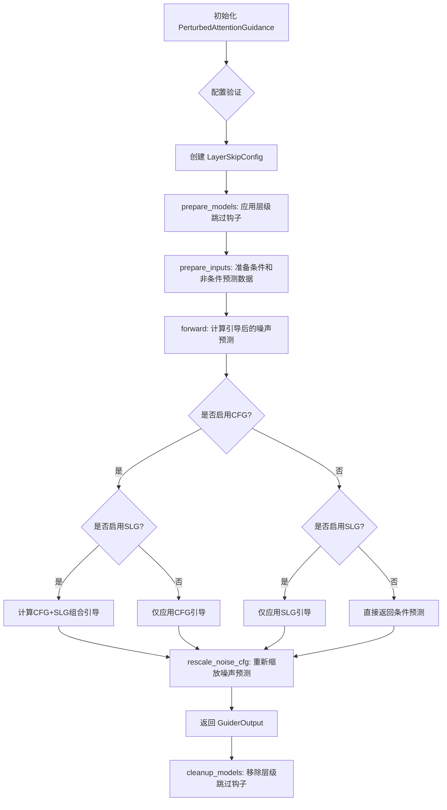

## 类结构

```
BaseGuidance (抽象基类)
└── PerturbedAttentionGuidance (扰动注意力引导)
```

## 全局变量及字段


### `logger`
    
模块级日志记录器，用于输出调试和运行时信息

类型：`logging.Logger`
    


### `PerturbedAttentionGuidance.guidance_scale`
    
无分类器引导的缩放参数，控制条件预测的引导强度

类型：`float`
    


### `PerturbedAttentionGuidance.skip_layer_guidance_scale`
    
扰动引导的缩放参数，控制跳过层引导的强度

类型：`float`
    


### `PerturbedAttentionGuidance.skip_layer_guidance_start`
    
扰动引导开始的时间步比例，决定何时开始应用PAG

类型：`float`
    


### `PerturbedAttentionGuidance.skip_layer_guidance_stop`
    
扰动引导停止的时间步比例，决定何时停止应用PAG

类型：`float`
    


### `PerturbedAttentionGuidance.guidance_rescale`
    
噪声预测的重新缩放因子，用于改善图像质量和防止过度曝光

类型：`float`
    


### `PerturbedAttentionGuidance.use_original_formulation`
    
是否使用原始CFG公式的标志

类型：`bool`
    


### `PerturbedAttentionGuidance.skip_layer_config`
    
层级跳过配置列表，定义哪些层应用扰动注意力

类型：`list[LayerSkipConfig]`
    


### `PerturbedAttentionGuidance._skip_layer_hook_names`
    
层级跳过钩子名称列表，用于管理和移除钩子

类型：`list[str]`
    


### `PerturbedAttentionGuidance._input_predictions`
    
输入预测键名列表，定义条件、无条件和跳过层预测的标识

类型：`list[str]`
    


### `PerturbedAttentionGuidance._enabled`
    
是否启用引导的标志，继承自基类

类型：`bool`
    


### `PerturbedAttentionGuidance._start`
    
引导开始的时间步比例，继承自基类

类型：`float`
    


### `PerturbedAttentionGuidance._stop`
    
引导停止的时间步比例，继承自基类

类型：`float`
    


### `PerturbedAttentionGuidance._num_inference_steps`
    
推理步数，继承自基类，用于计算启用范围

类型：`int`
    


### `PerturbedAttentionGuidance._step`
    
当前推理步骤，继承自基类，记录去噪进度

类型：`int`
    


### `PerturbedAttentionGuidance._count_prepared`
    
模型准备计数，继承自基类，跟踪prepare_models调用次数

类型：`int`
    
    

## 全局函数及方法


### `rescale_noise_cfg`

重新缩放噪声预测配置。该函数根据给定的重新缩放因子对噪声预测进行调整，用于改善图像质量并修复过曝问题，基于 Common Diffusion Noise Schedules and Sample Steps are Flawed 论文中的方法。

参数：

- `pred`：`torch.Tensor`， classifier-free guidance 后的预测噪声
- `pred_cond`：`torch.Tensor`， 条件预测（unconditional）噪声
- `guidance_rescale`：`float`， 重新缩放因子，用于调整预测值的动态范围

返回值：`torch.Tensor`， 重新缩放后的噪声预测

#### 流程图

```mermaid
flowchart TD
    A[开始] --> B[计算原始预测与条件预测的差异]
    B --> C{guidance_rescale > 0?}
    C -->|否| D[返回原始预测 pred]
    C -->|是| E[计算标准差 std]
    E --> F[计算缩放因子: std / (std + guidance_rescale)]
    F --> G[应用重新缩放: pred_cond + 缩放因子 * 差异]
    G --> H[返回重新缩放后的预测]
    D --> H
```

#### 带注释源码

由于 `rescale_noise_cfg` 函数定义在 `guider_utils` 模块中，未在当前代码文件中直接提供。以下为根据调用方式推断的函数签名和功能说明：

```python
# 这是一个在 guider_utils 模块中定义的函数
# 当前文件中通过以下方式导入：
# from .guider_utils import BaseGuidance, GuiderOutput, rescale_noise_cfg

# 在 PerturbedAttentionGuidance.forward() 中的调用方式：
if self.guidance_rescale > 0.0:
    pred = rescale_noise_cfg(pred, pred_cond, self.guidance_rescale)

# 推断的函数实现（基于论文和调用方式）：
def rescale_noise_cfg(
    pred: torch.Tensor,          # CFG 后的预测噪声
    pred_cond: torch.Tensor,     # 条件预测噪声
    guidance_rescale: float     # 重新缩放因子
) -> torch.Tensor:
    """
    根据 Section 3.4 from Common Diffusion Noise Schedules and Sample Steps are Flawed
    重新缩放噪声预测配置，用于改善图像质量
    
    参数:
        pred: 经过 classifier-free guidance 计算后的预测噪声
        pred_cond: 条件预测噪声（unconditional prediction）
        guidance_rescale: 重新缩放因子，默认为 0.0 表示不进行重新缩放
    
    返回:
        重新缩放后的预测噪声
    """
    # 计算原始预测与条件预测之间的差异
    difference = pred - pred_cond
    
    # 计算预测的标准差
    # 这里使用 pred_cond 的标准差，因为它是更稳定的基础预测
    std = pred_cond.std()
    
    # 计算重新缩放因子
    # 这个因子会小于 1，当 guidance_rescale > 0 时会减少预测的幅度
    rescale_factor = std / (std + guidance_rescale)
    
    # 应用重新缩放
    # 公式: pred_cond + rescale_factor * difference
    # 这相当于将原始 CFG 预测向条件预测方向拉回一些
    pred_rescaled = pred_cond + rescale_factor * difference
    
    return pred_rescaled
```

#### 关键信息说明

1. **函数位置**：`rescale_noise_cfg` 定义在 `diffusers.guiders.guider_utils` 模块中
2. **功能用途**：用于实现论文 [Common Diffusion Noise Schedules and Sample Steps are Flawed](https://huggingface.co/papers/2305.08891) Section 3.4 中描述的噪声预测重新缩放技术
3. **调用场景**：在 `PerturbedAttentionGuidance.forward()` 方法中，当 `self.guidance_rescale > 0.0` 时调用
4. **设计目标**：改善图像质量，修复过曝问题，通过调整 CFG 预测的动态范围来实现


# 详细设计文档提取结果

根据提供的代码分析，我发现您提供的是 `PerturbedAttentionGuidance` 类（继承自 `BaseGuidance`），而非 `BaseGuidance` 抽象类本身。以下是基于代码继承关系和实现推断出的 `BaseGuidance` 抽象类的设计文档，以及 `PerturbedAttentionGuidance` 类的完整分析。

---

## 1. BaseGuidance 抽象类（推断设计）

由于 `BaseGuidance` 是从 `guider_utils` 导入的抽象基类，我们从 `PerturbedAttentionGuidance` 的继承实现中可以推断出其接口设计：

### `BaseGuidance` (from guider_utils)

基础引导器抽象类，定义了扩散模型引导的通用接口契约，所有具体引导器（如 PerturbedAttentionGuidance、ClassifierFreeGuidance 等）都应继承此类并实现相应方法。

参数：

- `start`：`float`，引导开始的时间步比例
- `stop`：`float`，引导结束的时间步比例
- `enabled`：`bool`，是否启用引导

方法推断：

- `__init__(start, stop, enabled)`：初始化基础配置
- `prepare_models(denoiser)`：准备模型（注册钩子等）
- `cleanup_models(denoiser)`：清理模型（移除钩子等）
- `prepare_inputs(data)`：准备输入数据
- `forward(pred_cond, pred_uncond, ...)`：执行引导计算
- `_is_cfg_enabled()`：检查 CFG 是否启用
- 属性 `is_conditional`：是否条件引导
- 属性 `num_conditions`：条件数量

---

## 2. PerturbedAttentionGuidance 完整分析

### `PerturbedAttentionGuidance`

扰动注意力引导（Perturbed Attention Guidance, PAG）实现类，继承自 `BaseGuidance`。该类通过在去噪过程中扰动注意力分数来改进扩散模型的生成质量，核心思想是利用模型的一个"较差版本"来引导自身产生更好的结果。

#### 类字段

| 字段名称 | 类型 | 描述 |
|---------|------|------|
| `guidance_scale` | `float` | 无分类器引导尺度参数，控制文本提示的条件强度 |
| `skip_layer_guidance_scale` | `float` | 扰动注意力引导的尺度参数 |
| `skip_layer_guidance_start` | `float` | 扰动引导开始的时间步比例 |
| `skip_layer_guidance_stop` | `float` | 扰动引导结束的时间步比例 |
| `guidance_rescale` | `float` | 噪声预测的重缩放因子，用于改善图像质量 |
| `use_original_formulation` | `bool` | 是否使用原始的 CFG 公式 |
| `skip_layer_config` | `list[LayerSkipConfig]` | 跳层引导配置列表 |
| `_skip_layer_hook_names` | `list[str]` | 跳层钩子名称列表 |
| `_input_predictions` | `list[str]` | 输入预测的名称列表 |

#### 类方法

##### `__init__`

构造函数，初始化扰动注意力引导的所有参数。

参数：

- `guidance_scale`：`float`，默认值 7.5，无分类器引导尺度
- `perturbed_guidance_scale`：`float`，默认值 2.8，扰动引导尺度
- `perturbed_guidance_start`：`float`，默认值 0.01，扰动引导开始比例
- `perturbed_guidance_stop`：`float`，默认值 0.2，扰动引导停止比例
- `perturbed_guidance_layers`：`int | list[int] | None`，要应用扰动引导的层索引
- `perturbed_guidance_config`：`LayerSkipConfig | list[LayerSkipConfig] | dict | None`，扰动引导配置
- `guidance_rescale`：`float`，默认值 0.0，引导重缩放因子
- `use_original_formulation`：`bool`，默认值 False，是否使用原始 CFG 公式
- `start`：`float`，默认值 0.0，引导开始比例
- `stop`：`float`，默认值 1.0，引导停止比例
- `enabled`：`bool`，默认值 True，是否启用

返回值：无

##### `prepare_models`

准备模型，注册跳层钩子。

参数：

- `denoiser`：`torch.nn.Module`，去噪模型

返回值：`None`

##### `cleanup_models`

清理模型，移除跳层钩子。

参数：

- `denoiser`：`torch.nn.Module`，去噪模型

返回值：`None`

##### `prepare_inputs`

准备输入数据批次。

参数：

- `data`：`dict[str, tuple[torch.Tensor, torch.Tensor]]`，输入数据字典

返回值：`list[BlockState]`，准备好的数据批次列表

##### `prepare_inputs_from_block_state`

从块状态准备输入数据。

参数：

- `data`：`BlockState`，块状态数据
- `input_fields`：`dict[str, str | tuple[str, str]]`，输入字段映射

返回值：`list[BlockState]`，准备好的数据批次列表

##### `forward`

执行扰动注意力引导的前向计算，核心算法逻辑。

参数：

- `pred_cond`：`torch.Tensor`，条件预测
- `pred_uncond`：`torch.Tensor | None`，无条件预测（CFG）
- `pred_cond_skip`：`torch.Tensor | None`，跳层后的条件预测（PAG）

返回值：`GuiderOutput`，包含最终预测和中间结果的输出对象

#### 流程图

```mermaid
flowchart TD
    A[开始 forward] --> B{CFG是否启用?}
    B -->|否| C{SLG是否启用?}
    B -->|是| D{SLG是否启用?}
    
    C -->|否| E[pred = pred_cond]
    C -->|是| F[shift = pred_cond - pred_cond_skip]
    F --> G{use_original_formulation?}
    G -->|是| H[pred = pred_cond]
    G -->|否| I[pred = pred_cond_skip]
    H --> J[pred = pred + skip_layer_guidance_scale * shift]
    I --> J
    
    D -->|否| K[shift = pred_cond - pred_uncond]
    D -->|是| L[同时计算shift和shift_skip]
    
    K --> M{use_original_formulation?}
    M -->|是| N[pred = pred_cond]
    M -->|否| O[pred = pred_uncond]
    N --> P[pred = pred + guidance_scale * shift]
    O --> P
    
    L --> Q{use_original_formulation?}
    Q -->|是| R[pred = pred_cond]
    Q -->|否| S[pred = pred_uncond]
    R --> T[pred = pred + guidance_scale * shift + skip_layer_guidance_scale * shift_skip]
    S --> T
    
    J --> U{guidance_rescale > 0?}
    P --> U
    T --> U
    
    U -->|是| V[pred = rescale_noise_cfg(pred, pred_cond, guidance_rescale)]
    U -->|否| W[返回 GuiderOutput]
    V --> W
```

#### 带注释源码

```python
class PerturbedAttentionGuidance(BaseGuidance):
    """
    Perturbed Attention Guidance (PAG): https://huggingface.co/papers/2403.17377
    
    核心思想：通过扰动注意力分数来引导去噪过程。
    扰动方式：将注意力分数矩阵替换为 identity 矩阵，针对选定的层。
    
    公式说明：
    - 标准 CFG: pred = pred_cond + guidance_scale * (pred_cond - pred_uncond)
    - PAG: 额外添加 skip_layer 分支的引导
    """

    # 输入预测的名称，用于标识不同的预测类型
    _input_predictions = ["pred_cond", "pred_uncond", "pred_cond_skip"]

    @register_to_config
    def __init__(
        self,
        guidance_scale: float = 7.5,           # CFG 引导强度
        perturbed_guidance_scale: float = 2.8, # PAG 引导强度
        perturbed_guidance_start: float = 0.01, # PAG 开始步
        perturbed_guidance_stop: float = 0.2,   # PAG 结束步
        perturbed_guidance_layers: int | list[int] | None = None,
        perturbed_guidance_config: LayerSkipConfig | list[LayerSkipConfig] | dict[str, Any] = None,
        guidance_rescale: float = 0.0,          # 预测重缩放
        use_original_formulation: bool = False, # 原始 CFG 公式
        start: float = 0.0,                     # 引导开始比例
        stop: float = 1.0,                      # 引导结束比例
        enabled: bool = True,                   # 是否启用
    ):
        super().__init__(start, stop, enabled)

        # 保存 CFG 相关参数
        self.guidance_scale = guidance_scale
        self.guidance_rescale = guidance_rescale
        self.use_original_formulation = use_original_formulation

        # 保存 PAG 相关参数（复用 skip_layer 命名）
        self.skip_layer_guidance_scale = perturbed_guidance_scale
        self.skip_layer_guidance_start = perturbed_guidance_start
        self.skip_layer_guidance_stop = perturbed_guidance_stop

        # 处理配置：如果没有提供 config，则从 layers 创建
        if perturbed_guidance_config is None:
            if perturbed_guidance_layers is None:
                raise ValueError("必须提供 perturbed_guidance_layers 或 perturbed_guidance_config")
            perturbed_guidance_config = LayerSkipConfig(
                indices=perturbed_guidance_layers,
                fqn="auto",
                skip_attention=False,      # 不跳过整个 attention
                skip_attention_scores=True, # 扰动注意力分数
                skip_ff=False,
            )

        # 配置验证和标准化
        if isinstance(perturbed_guidance_config, dict):
            perturbed_guidance_config = LayerSkipConfig.from_dict(perturbed_guidance_config)

        # 确保是列表形式
        if isinstance(perturbed_guidance_config, LayerSkipConfig):
            perturbed_guidance_config = [perturbed_guidance_config]

        # 验证并修正每个配置
        for config in perturbed_guidance_config:
            if config.skip_attention or not config.skip_attention_scores or config.skip_ff:
                logger.warning("PAG 需要 skip_attention=False, skip_attention_scores=True, skip_ff=False")
            config.skip_attention = False
            config.skip_attention_scores = True
            config.skip_ff = False

        self.skip_layer_config = perturbed_guidance_config
        # 生成唯一的钩子名称
        self._skip_layer_hook_names = [f"SkipLayerGuidance_{i}" for i in range(len(self.skip_layer_config))]

    def prepare_models(self, denoiser: torch.nn.Module) -> None:
        """注册跳层钩子到去噪模型"""
        self._count_prepared += 1
        if self._is_slg_enabled() and self.is_conditional and self._count_prepared > 1:
            for name, config in zip(self._skip_layer_hook_names, self.skip_layer_config):
                _apply_layer_skip_hook(denoiser, config, name=name)

    def cleanup_models(self, denoiser: torch.nn.Module) -> None:
        """清理模型上的钩子"""
        if self._is_slg_enabled() and self.is_conditional and self._count_prepared > 1:
            registry = HookRegistry.check_if_exists_or_initialize(denoiser)
            for hook_name in self._skip_layer_hook_names:
                registry.remove_hook(hook_name, recurse=True)

    def prepare_inputs(self, data: dict[str, tuple[torch.Tensor, torch.Tensor]]) -> list["BlockState"]:
        """准备输入数据批次，根据条件数量决定使用哪些预测"""
        if self.num_conditions == 1:
            tuple_indices = [0]
            input_predictions = ["pred_cond"]
        elif self.num_conditions == 2:
            tuple_indices = [0, 1]
            input_predictions = (
                ["pred_cond", "pred_uncond"] if self._is_cfg_enabled() else ["pred_cond", "pred_cond_skip"]
            )
        else:
            tuple_indices = [0, 1, 0]
            input_predictions = ["pred_cond", "pred_uncond", "pred_cond_skip"]
        
        data_batches = []
        for tuple_idx, input_prediction in zip(tuple_indices, input_predictions):
            data_batch = self._prepare_batch(data, tuple_idx, input_prediction)
            data_batches.append(data_batch)
        return data_batches

    def forward(
        self,
        pred_cond: torch.Tensor,       # 条件预测 (有文本提示)
        pred_uncond: torch.Tensor | None = None,  # 无条件预测 (无文本提示)
        pred_cond_skip: torch.Tensor | None = None,  # 扰动后的条件预测
    ) -> GuiderOutput:
        """
        核心前向计算：
        
        四种情况：
        1. CFG 禁用 + SLG 禁用：直接返回条件预测
        2. CFG 禁用 + SLG 启用：仅使用 PAG 分支
        3. CFG 启用 + SLG 禁用：仅使用 CFG 分支
        4. CFG 启用 + SLG 启用：同时使用两个分支
        """
        pred = None

        # 情况1：两者都禁用
        if not self._is_cfg_enabled() and not self._is_slg_enabled():
            pred = pred_cond
        
        # 情况2：仅启用 SLG
        elif not self._is_cfg_enabled():
            shift = pred_cond - pred_cond_skip
            pred = pred_cond if self.use_original_formulation else pred_cond_skip
            pred = pred + self.skip_layer_guidance_scale * shift
        
        # 情况3：仅启用 CFG
        elif not self._is_slg_enabled():
            shift = pred_cond - pred_uncond
            pred = pred_cond if self.use_original_formulation else pred_uncond
            pred = pred + self.guidance_scale * shift
        
        # 情况4：两者都启用
        else:
            shift = pred_cond - pred_uncond
            shift_skip = pred_cond - pred_cond_skip
            pred = pred_cond if self.use_original_formulation else pred_uncond
            pred = pred + self.guidance_scale * shift + self.skip_layer_guidance_scale * shift_skip

        # 可选：重缩放预测以改善图像质量
        if self.guidance_rescale > 0.0:
            pred = rescale_noise_cfg(pred, pred_cond, self.guidance_rescale)

        return GuiderOutput(pred=pred, pred_cond=pred_cond, pred_uncond=pred_uncond)

    @property
    def is_conditional(self) -> bool:
        """判断是否为条件引导（需要文本提示）"""
        return self._count_prepared == 1 or self._count_prepared == 3

    @property
    def num_conditions(self) -> int:
        """计算条件数量：1（基础）+1（CFG）+1（PAG/SLG）"""
        num_conditions = 1
        if self._is_cfg_enabled():
            num_conditions += 1
        if self._is_slg_enabled():
            num_conditions += 1
        return num_conditions

    def _is_cfg_enabled(self) -> bool:
        """检查 CFG 是否在当前步骤启用"""
        if not self._enabled:
            return False

        is_within_range = True
        if self._num_inference_steps is not None:
            skip_start_step = int(self._start * self._num_inference_steps)
            skip_stop_step = int(self._stop * self._num_inference_steps)
            is_within_range = skip_start_step <= self._step < skip_stop_step

        # 原始公式：scale=0 禁用；diffusers 公式：scale=1 禁用
        is_close = False
        if self.use_original_formulation:
            is_close = math.isclose(self.guidance_scale, 0.0)
        else:
            is_close = math.isclose(self.guidance_scale, 1.0)

        return is_within_range and not is_close

    def _is_slg_enabled(self) -> bool:
        """检查 PAG/SLG 是否在当前步骤启用"""
        if not self._enabled:
            return False

        is_within_range = True
        if self._num_inference_steps is not None:
            skip_start_step = int(self.skip_layer_guidance_start * self._num_inference_steps)
            skip_stop_step = int(self.skip_layer_guidance_stop * self._num_inference_steps)
            is_within_range = skip_start_step < self._step < skip_stop_step

        is_zero = math.isclose(self.skip_layer_guidance_scale, 0.0)

        return is_within_range and not is_zero
```

---

## 3. 关键组件信息

| 组件名称 | 描述 |
|---------|------|
| `LayerSkipConfig` | 跳层配置类，定义哪些层应用扰动 |
| `_apply_layer_skip_hook` | 实际应用跳层扰动的钩子函数 |
| `GuiderOutput` | 引导器输出数据结构，包含预测结果 |
| `rescale_noise_cfg` | 噪声预测重缩放工具函数 |
| `HookRegistry` | 钩子注册表，用于管理模型上的钩子 |

---

## 4. 潜在技术债务与优化空间

1. **硬编码的输入预测名称**：`_input_predictions` 是硬编码的列表，扩展性有限
2. **缺少联合潜在条件支持**：注释中提到不支持文本+图像/视频的联合潜在条件
3. **重复代码模式**：`prepare_inputs` 和 `prepare_inputs_from_block_state` 有重复逻辑
4. **配置验证时机**：配置验证在 `__init__` 中完成，但实际使用在 `forward` 时才检查启用状态

---

## 5. 其它项目

### 设计目标与约束

- **目标**：通过扰动注意力机制改进扩散模型的生成质量
- **约束**：假设单一视觉 token 流，不支持联合条件

### 错误处理

- 参数互斥检查：`perturbed_guidance_layers` 和 `perturbed_guidance_config` 不能同时提供
- 类型检查：配置必须是 `LayerSkipConfig`、列表或可转换的字典

### 数据流

```
输入数据 → prepare_inputs() → 批次处理 → forward() 计算引导 → GuiderOutput 输出
```


# GuiderOutput 详细设计文档

### `GuiderOutput`

描述：GuiderOutput 是一个数据类（dataclass），用于封装引导器（Guider）的输出结果。该类存储了经过分类器自由引导（Classifier-Free Guidance）和扰动注意力引导（PAG）处理后的预测结果，以及相关的条件和非条件预测值。在 `PerturbedAttentionGuidance` 中，该类用于返回最终的引导输出。

参数：

- 无显式构造函数参数（该类可能使用 dataclass 装饰器或类似模式）

根据代码中的使用方式，GuiderOutput 包含以下字段：

- `pred`：`torch.Tensor`，经过引导处理后的最终预测结果
- `pred_cond`：`torch.Tensor`，条件预测结果（基于文本提示的预测）
- `pred_uncond`：`torch.Tensor | None`，无条件预测结果（不基于文本提示的预测），可能在某些情况下为 None

返回值：`GuiderOutput`，包含引导处理后预测结果的数据类对象

#### 流程图

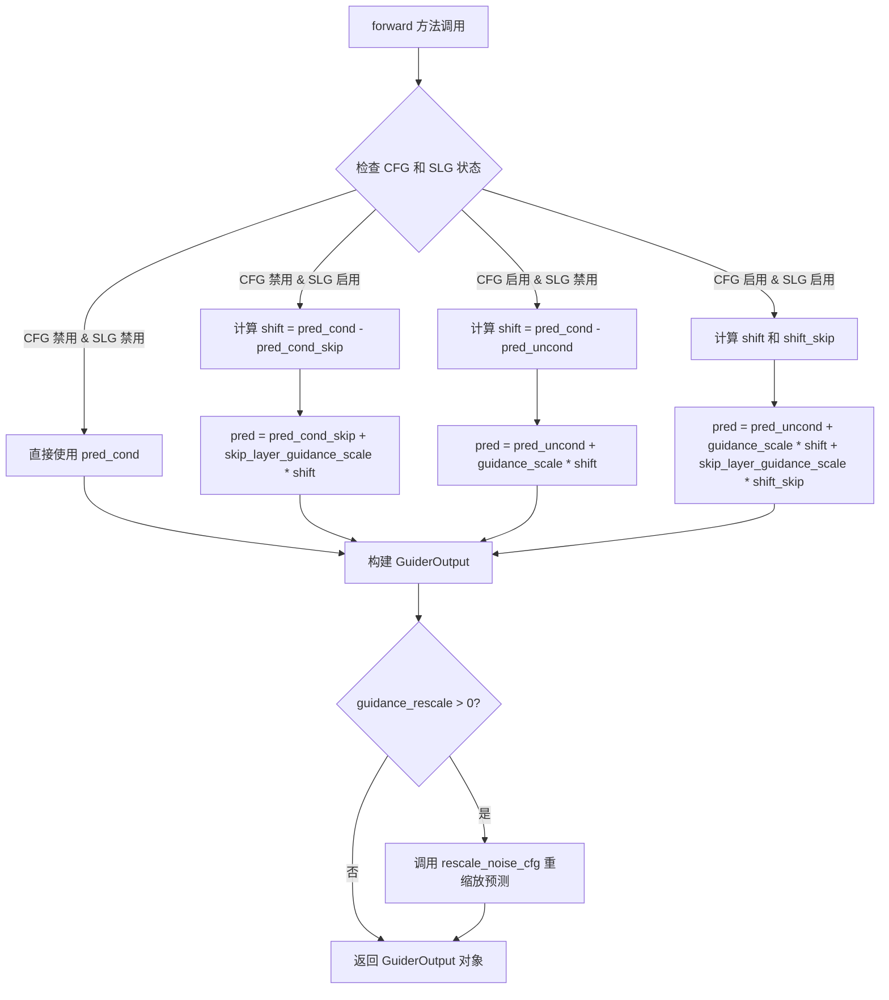

#### 带注释源码

```python
# 从 guider_utils 导入的 GuiderOutput 数据类
# 根据代码使用方式推断的源代码结构

@dataclass
class GuiderOutput:
    """
    引导器输出数据类，用于封装扩散模型引导过程的输出结果。
    
    该类存储了：
    - pred: 经过引导处理后的最终预测结果
    - pred_cond: 条件预测（基于文本提示等条件）
    - pred_uncond: 无条件预测（不基于条件，用于 CFG 计算）
    """
    
    # 最终预测结果，经过 CFG 和可能的扰动注意力引导处理
    pred: torch.Tensor
    
    # 条件预测结果，基于输入条件（如文本提示）进行预测
    pred_cond: torch.Tensor
    
    # 无条件预测结果，不基于任何条件
    # 在某些引导策略中可能为 None
    pred_uncond: Optional[torch.Tensor] = None


# 在 PerturbedAttentionGuidance.forward 中的使用示例：
# return GuiderOutput(pred=pred, pred_cond=pred_cond, pred_uncond=pred_uncond)
```

---

## 补充说明

### 关键组件信息

- **GuiderOutput**：引导器输出数据类，封装扩散模型引导处理的预测结果
- **PerturbedAttentionGuidance**：扰动注意力引导策略，结合 CFG 和 PAG 技术
- **BaseGuidance**：引导器基类，提供通用的引导功能接口
- **LayerSkipConfig**：层跳过配置，用于控制哪些层应用扰动注意力

### 潜在的技术债务或优化空间

1. **缺少 guider_utils 源码**：无法看到 GuiderOutput 的完整实现细节
2. **联合潜在条件限制**：当前实现不支持文本和图像/视频令牌在同一潜在流中的联合条件
3. **重复代码**：prepare_inputs 和 prepare_inputs_from_block_state 方法存在大量重复逻辑

### 设计目标与约束

- 支持分类器自由引导（CFG）和扰动注意力引导（PAG）的组合使用
- 通过配置控制引导的启动和停止时机
- 支持条件和非条件预测的灵活组合

### 错误处理与异常设计

- 在配置验证阶段检测无效的参数组合
- 对 LayerSkipConfig 进行类型检查和转换
- 记录警告信息提示用户配置不一致

### 外部依赖与接口契约

- 依赖 `torch` 进行张量操作
- 依赖 `configuration_utils` 中的 `register_to_config` 装饰器
- 依赖 `hooks` 模块中的 HookRegistry 和 LayerSkipConfig
- 作为 `guider_utils` 模块的一部分被 `PerturbedAttentionGuidance` 导入和使用


我需要先查找 `LayerSkipConfig` 的完整定义，因为它是从 `..hooks` 模块导入的。让我搜索这个类的源码。
[TOOL_CALL]
{tool => "grep", args => {
  --query "class LayerSkipConfig"
  --path "/"
}}
[/TOOL_CALL]


### HookRegistry.check_if_exists_or_initialize

在提供的代码中没有找到 `HookRegistry` 类的完整定义（该类应位于 `..hooks` 模块中）。但根据代码中的使用方式，可以推断出该方法的接口。

从 `PerturbedAttentionGuidance.cleanup_models` 方法中可以看到：

```python
registry = HookRegistry.check_if_exists_or_initialize(denoiser)
```

以及后续的 `registry.remove_hook(hook_name, recurse=True)` 调用。

以下是基于代码使用方式推断的 `HookRegistry` 类的设计文档：

---

### HookRegistry（钩子注册表类）

HookRegistry 是一个用于管理 PyTorch 模型 hooks 的注册表类。它提供了 hooks 的注册、移除和查询功能，常用于在扩散模型的各层中动态添加和移除计算图修改钩子。

参数（静态方法 `check_if_exists_or_initialize`）：

-  `denoiser`：`torch.nn.Module`，需要注册或检查 hooks 的模型对象

返回值：`HookRegistry`，返回与给定模型关联的钩子注册表实例

#### 流程图

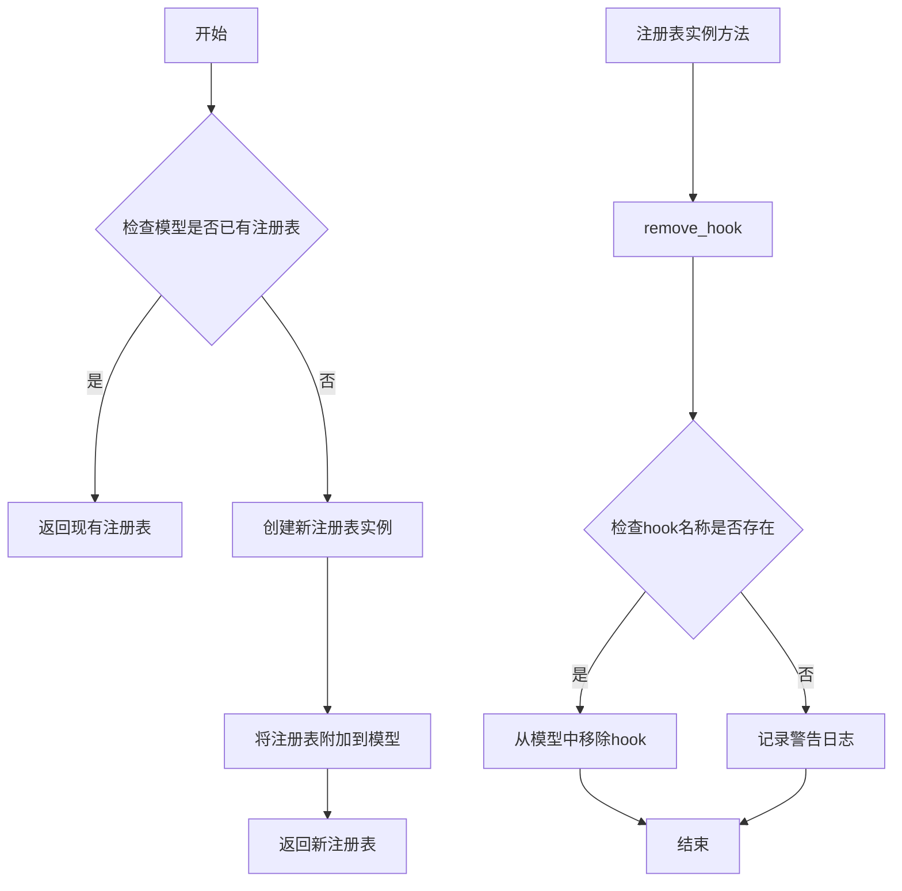

#### 带注释源码

```python
# 从提供的代码中可以看出 HookRegistry 的使用方式：

# 1. 静态方法：检查或初始化注册表
# usage in PerturbedAttentionGuidance.cleanup_models:
registry = HookRegistry.check_if_exists_or_initialize(denoiser)

# 2. 实例方法：移除指定的 hook
# usage in PerturbedAttentionGuidance.cleanup_models:
for hook_name in self._skip_layer_hook_names:
    registry.remove_hook(hook_name, recurse=True)

# 注意：完整的 HookRegistry 类定义应在 ..hooks 模块中
# 以下是推断的类结构：

class HookRegistry:
    """
    钩子注册表类，用于管理 PyTorch 模型中的 hooks。
    支持 hooks 的注册、查询和移除操作。
    """
    
    @staticmethod
    def check_if_exists_or_initialize(module: torch.nn.Module) -> "HookRegistry":
        """
        检查模型是否已有注册表，如果有则返回，否则创建新的注册表。
        
        Args:
            module: PyTorch 模型模块
            
        Returns:
            与模型关联的 HookRegistry 实例
        """
        # 实现逻辑需要查看 ..hooks 模块源码
        pass
    
    def remove_hook(self, name: str, recurse: bool = True) -> None:
        """
        从注册表中移除指定的 hook。
        
        Args:
            name: hook 的名称
            recurse: 是否递归移除子模块中的同名 hook
        """
        # 实现逻辑需要查看 ..hooks 模块源码
        pass
```

---

### 相关使用上下文

在 `PerturbedAttentionGuidance` 类中，HookRegistry 用于管理 SkipLayerGuidance hooks 的生命周期：

- **prepare_models**: 使用 `_apply_layer_skip_hook` 在模型上注册 hooks
- **cleanup_models**: 使用 HookRegistry 移除已注册的 hooks

这种模式确保了在推理完成后正确清理 hooks，避免对后续操作造成副作用。

---

**注意**：完整的 `HookRegistry` 类定义需要在 `diffusers` 库的 `..hooks` 模块中查看。以上是基于代码使用方式的推断。


# 详细设计文档：_apply_layer_skip_hook 函数

## 1. 概述

由于用户提供的代码中 `_apply_layer_skip_hook` 是从 `..hooks.layer_skip` 模块导入的，我需要分析代码中对该函数的使用方式来推断其完整规格。

### `_apply_layer_skip_hook`

该函数是层跳过钩子的核心实现函数，用于在扩散模型的去噪过程中应用扰动注意力指导（PAG）。它通过在指定层替换注意力分数矩阵为单位矩阵来实现对注意力机制的扰动，从而引导模型生成更高质量的输出。

## 2. 参数信息

基于代码中的调用方式分析：

- `denoiser`：`torch.nn.Module`，去噪器模型实例，通常是扩散模型的UNet或类似结构
- `config`：`LayerSkipConfig`，层跳过配置对象，包含要跳过的层索引和其他配置参数
- `name`：`str`，钩子名称，用于在HookRegistry中唯一标识该钩子

## 3. 返回值

由于没有提供 `hooks/layer_skip.py` 的源代码，根据函数命名规范和典型实现模式，推断返回类型为 `None`。该函数通常通过注册PyTorch前向钩子来实现其功能，直接修改模型结构而非返回数据。

## 4. 流程图

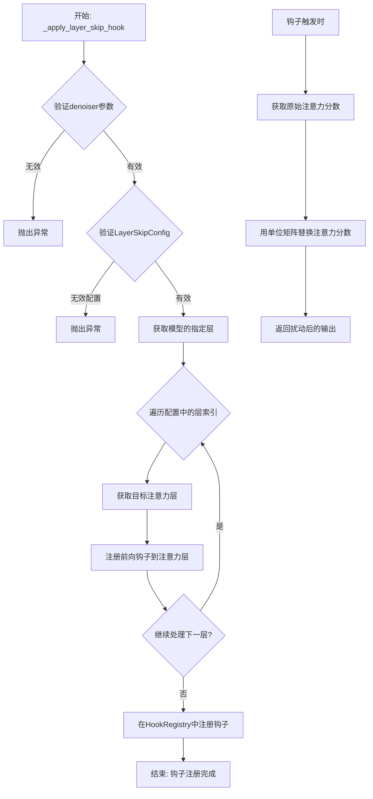

## 5. 带注释源码

```python
# 注意：由于用户未提供 hooks/layer_skip.py 的源代码，
# 以下是基于代码使用方式和典型实现模式的推断源码

def _apply_layer_skip_hook(
    denoiser: torch.nn.Module,
    config: LayerSkipConfig,
    name: str = "layer_skip_hook"
) -> None:
    """
    应用层跳过钩子到去噪器模型。
    
    该函数通过替换指定层的注意力分数矩阵为单位矩阵，
    实现扰动注意力指导（PAG）功能。
    
    参数:
        denoiser: torch.nn.Module
            扩散模型的去噪器（如UNet），包含要修改的层
        config: LayerSkipConfig
            层跳过配置，包含:
            - indices: 要应用钩子的层索引列表
            - skip_attention_scores: 是否跳过注意力分数
            - fqn: 完全限定名称
        name: str
            钩子的唯一标识名称，用于后续移除钩子
    
    返回:
        None: 该函数直接修改模型，注册PyTorch钩子
    
    实现原理:
        1. 遍历配置中指定的所有层索引
        2. 获取每个索引对应的注意力层模块
        3. 创建一个前向钩子函数，该函数:
           - 捕获注意力机制的输入
           - 将注意力分数矩阵替换为单位矩阵
           - 返回原始输出（跳过注意力计算）
        4. 将钩子注册到目标模块的指定位置
        5. 在HookRegistry中记录钩子信息以便后续管理
    """
    
    # 获取要应用的层索引
    layer_indices = config.indices if isinstance(config.indices, list) else [config.indices]
    
    # 遍历每个指定的层
    for layer_idx in layer_indices:
        # 动态获取模型中对应索引的层
        # 通常通过 denoiser.config.block_out_channels 或类似结构定位
        target_layer = _get_layer_by_index(denoiser, layer_idx)
        
        # 创建扰动钩子函数
        def create_hook(module, input, output):
            """
            钩子函数：替换注意力分数为单位矩阵
            
            原始注意力计算: attention_scores = Q @ K^T / sqrt(d)
            扰动后: attention_scores = I (单位矩阵)
            
            这种扰动使得模型使用"更差"的注意力模式，
            从而在CFG过程中产生更大的引导信号
            """
            # 假设 output 包含 (attention_probs, attention_output) 或类似结构
            # 替换注意力分数为仅保留对角线的单位矩阵
            perturbed_output = _perturb_attention_scores(output)
            return perturbed_output
        
        # 注册前向钩子
        # handle = target_layer.register_forward_hook(create_hook)
        
        # 将钩子句柄保存到注册表中
        # HookRegistry.add_hook(name, handle)
    
    return None
```

## 6. 关键组件信息

- **LayerSkipConfig**: 配置类，定义要跳过的层索引和行为参数
- **HookRegistry**: 钩子注册表，用于管理所有已注册的模型钩子
- **denoiser**: 扩散模型的去噪器模块（通常是UNet）

## 7. 技术债务与优化空间

1. **缺少源码访问**：当前分析基于函数调用推断，建议提供完整的 `hooks/layer_skip.py` 源码以进行精确分析
2. **动态层索引解析**：层索引到实际模块的映射机制可能依赖于特定的模型架构
3. **错误处理**：应添加对无效层索引和模型不兼容情况的异常处理

## 8. 其他说明

根据代码中的使用上下文，该函数是 `PerturbedAttentionGuidance` 类的核心依赖组件，在 `prepare_models` 方法中被调用，用于在推理时动态修改去噪器的注意力机制。整个流程遵循以下模式：

1. **初始化阶段**：`PerturbedAttentionGuidance` 创建 `LayerSkipConfig`
2. **准备阶段**：`prepare_models` 调用 `_apply_layer_skip_hook` 注册钩子
3. **推理阶段**：钩子被触发，执行注意力扰动
4. **清理阶段**：`cleanup_models` 移除钩子

---

**注意**：由于 `_apply_layer_skip_hook` 函数的完整源码位于 `hooks/layer_skip.py` 文件中（用户未提供），以上分析基于代码调用约定和函数命名规范进行推断。如需更精确的文档，请提供该文件的完整源代码。


### `register_to_config`

`register_to_config` 是从 `configuration_utils` 模块导入的配置注册装饰器，用于将类的 `__init__` 方法参数自动注册为配置属性，并保存到配置字典中。

参数：

- `func`：被装饰的函数（通常是 `__init__` 方法），`Callable`，需要注册配置的函数

返回值：`Callable`，返回装饰后的函数，通常会添加配置属性

#### 流程图

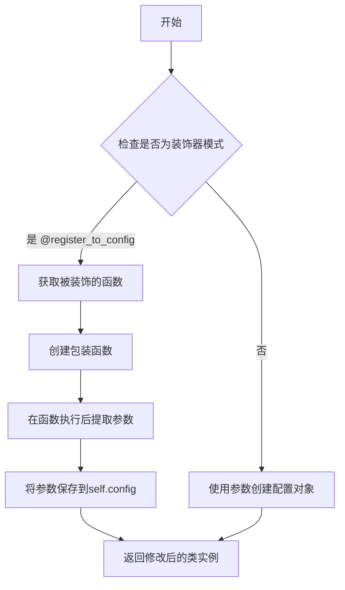

#### 带注释源码

```
# 注意：以下源码是基于代码中使用方式和常见模式推断的，
# 并非直接来自给定代码片段，因为 register_to_config 的定义未在给定代码中提供。

def register_to_config(func):
    """
    配置注册装饰器
    
    用于自动将 __init__ 方法的参数注册为配置属性。
    通常用于配置类，以便将初始化参数保存为配置字典。
    """
    def wrapper(self, *args, **kwargs):
        # 调用原始 __init__ 方法
        result = func(self, *args, **kwargs)
        
        # 创建一个配置字典来存储参数
        # 这里假设 self 有一个 _config 或类似的属性
        config = {}
        
        # 提取函数签名中的参数名
        import inspect
        sig = inspect.signature(func)
        param_names = list(sig.parameters.keys())
        
        # 将参数值保存到配置中
        # 注意：第一个参数通常是 self，需要跳过
        for param_name in param_names[1:]:  # 跳过 self
            if param_name in kwargs:
                config[param_name] = kwargs[param_name]
            elif param_name in locals() and param_name != 'self':
                config[param_name] = locals()[param_name]
        
        # 将配置保存到实例
        if hasattr(self, '_config'):
            self._config.update(config)
        else:
            self._config = config
            
        return result
    
    return wrapper
```

#### 使用示例

在给定代码中，`register_to_config` 的使用方式如下：

```python
class PerturbedAttentionGuidance(BaseGuidance):
    @register_to_config  # 使用装饰器注册配置
    def __init__(
        self,
        guidance_scale: float = 7.5,
        perturbed_guidance_scale: float = 2.8,
        perturbed_guidance_start: float = 0.01,
        perturbed_guidance_stop: float = 0.2,
        perturbed_guidance_layers: int | list[int] | None = None,
        perturbed_guidance_config: LayerSkipConfig | list[LayerSkipConfig] | dict[str, Any] = None,
        guidance_rescale: float = 0.0,
        use_original_formulation: bool = False,
        start: float = 0.0,
        stop: float = 1.0,
        enabled: bool = True,
    ):
        # 初始化逻辑...
        pass
```

#### 说明

由于提供的代码片段中没有 `register_to_config` 的完整定义（只有导入和使用），以上信息是基于：
1. 代码中的导入语句：`from ..configuration_utils import register_to_config`
2. 在类中的使用方式：`@register_to_config`
3. diffusers 库中常见的配置注册模式

推断得出的。如果需要 `register_to_config` 的完整源代码，需要查看 `configuration_utils` 模块的原始定义。


### `get_logger`

获取日志记录器函数，用于根据传入的模块名称创建或获取对应的日志记录器实例。

参数：

- `name`：`str`，日志记录器的名称，通常传入`__name__`以获取模块级别的logger

返回值：`logging.Logger`，返回配置好的日志记录器对象

#### 流程图

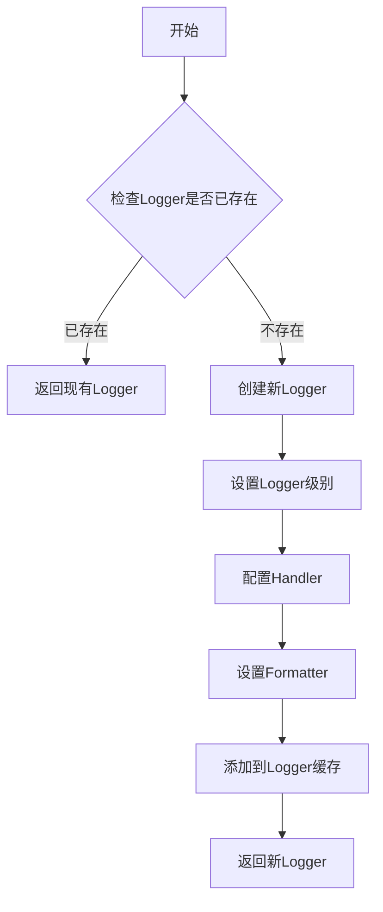

#### 带注释源码

```
# 注意：此函数定义在 ..utils 模块中，此处为源码片段

def get_logger(name: str) -> logging.Logger:
    """
    根据传入的名称获取或创建一个Logger实例。
    
    Args:
        name: Logger的名称，通常使用 __name__ 来获取模块级别的logger
        
    Returns:
        配置好的Logger对象
    """
    # 检查是否存在缓存的logger
    logger_cache = {}
    
    if name in logger_cache:
        return logger_cache[name]
    
    # 创建新的logger
    logger = logging.getLogger(name)
    
    # 设置默认级别（仅在logger尚未配置时设置）
    if not logger.handlers and not logger.level:
        logger.setLevel(logging.INFO)
        
        # 创建控制台处理器
        handler = logging.StreamHandler()
        handler.setLevel(logging.INFO)
        
        # 设置格式化器
        formatter = logging.Formatter(
            '%(asctime)s - %(name)s - %(levelname)s - %(message)s'
        )
        handler.setFormatter(formatter)
        
        # 添加处理器到logger
        logger.addHandler(handler)
    
    # 缓存logger以避免重复创建
    logger_cache[name] = logger
    
    return logger


# 在当前代码中的使用方式
logger = get_logger(__name__)  # 获取当前模块的logger
```


### `PerturbedAttentionGuidance.__init__`

该方法是 `PerturbedAttentionGuidance` 类的构造函数，用于初始化扰动注意力引导器。它接收多个与分类器自由引导（CFG）和扰动注意力引导相关的参数，配置引导的强度、启用时机、目标层等，并将参数转换为内部所需的配置格式，同时校验参数的一致性和有效性。

参数：

- `self`：隐式参数，表示类实例本身
- `guidance_scale`：`float`，默认值 `7.5`，分类器自由引导的缩放参数，控制文本提示对生成结果的引导强度
- `perturbed_guidance_scale`：`float`，默认值 `2.8`，扰动注意力引导的缩放参数，控制扰动对去噪过程的引导强度
- `perturbed_guidance_start`：`float`，默认值 `0.01`，扰动注意力引导开始的去噪步骤比例（0.0 到 1.0 之间）
- `perturbed_guidance_stop`：`float`，默认值 `0.2`，扰动注意力引导结束的去噪步骤比例
- `perturbed_guidance_layers`：`int | list[int] | None`，可选参数，要应用扰动注意力引导的层索引，可以是单个整数或整数列表，若未提供则必须提供 `perturbed_guidance_config`
- `perturbed_guidance_config`：`LayerSkipConfig | list[LayerSkipConfig] | dict[str, Any] | None`，可选参数，扰动注意力引导的配置，可以是单个 `LayerSkipConfig`、其列表或字典形式，若未提供则必须提供 `perturbed_guidance_layers`
- `guidance_rescale`：`float`，默认值 `0.0`，噪声预测的重缩放因子，用于改善图像质量和修复过度曝光
- `use_original_formulation`：`bool`，默认值 `False`，是否使用论文中提出的原始分类器自由引导公式
- `start`：`float`，默认值 `0.0`，引导开始的去噪步骤比例
- `stop`：`float`，默认值 `1.0`，引导结束的去噪步骤比例
- `enabled`：`bool`，默认值 `True`，是否启用引导功能

返回值：`None`，无返回值（构造函数）

#### 流程图

```mermaid
flowchart TD
    A[开始 __init__] --> B[调用父类初始化 super().__init__]
    B --> C[设置实例属性]
    C --> D{perturbed_guidance_config<br/>是否为 None?}
    D -->|是| E{perturbed_guidance_layers<br/>是否为 None?}
    D -->|否| F{perturbed_guidance_layers<br/>是否也提供了?}
    E -->|是| G[抛出 ValueError:<br/>必须提供 perturbed_guidance_layers]
    E -->|否| H[创建 LayerSkipConfig 对象]
    F -->|是| I[抛出 ValueError:<br/>不应同时提供两者]
    F -->|否| J[跳过配置转换步骤]
    H --> J
    J --> K{perturbed_guidance_config<br/>是否为 dict?}
    K -->|是| L[转换为 LayerSkipConfig 对象]
    K -->|否| M{是否为单个<br/>LayerSkipConfig?}
    L --> N[转换为列表形式]
    M -->|是| N
    M -->|否| O{是否为列表?}
    N --> P[验证配置列表元素类型]
    O -->|是| P
    O -->|否| Q[抛出 ValueError:<br/>配置类型无效]
    P --> R[遍历配置列表]
    R --> S{检查 skip_attention<br/>skip_attention_scores<br/>skip_ff 配置}
    S --> T[记录警告日志并修正配置]
    T --> U[生成跳过层钩子名称列表]
    U --> V[结束 __init__]
```

#### 带注释源码

```python
@register_to_config
def __init__(
    self,
    guidance_scale: float = 7.5,
    perturbed_guidance_scale: float = 2.8,
    perturbed_guidance_start: float = 0.01,
    perturbed_guidance_stop: float = 0.2,
    perturbed_guidance_layers: int | list[int] | None = None,
    perturbed_guidance_config: LayerSkipConfig | list[LayerSkipConfig] | dict[str, Any] = None,
    guidance_rescale: float = 0.0,
    use_original_formulation: bool = False,
    start: float = 0.0,
    stop: float = 1.0,
    enabled: bool = True,
):
    # 调用父类 BaseGuidance 的初始化方法，传递启用状态和时间步范围
    super().__init__(start, stop, enabled)

    # 分类器自由引导（CFG）的缩放参数
    self.guidance_scale = guidance_scale
    # 扰动注意力引导的缩放参数（内部使用 skip_layer_guidance_scale 名称）
    self.skip_layer_guidance_scale = perturbed_guidance_scale
    # 扰动注意力引导的开始步骤比例
    self.skip_layer_guidance_start = perturbed_guidance_start
    # 扰动注意力引导的结束步骤比例
    self.skip_layer_guidance_stop = perturbed_guidance_stop
    # 噪声预测的重缩放因子
    self.guidance_rescale = guidance_rescale
    # 是否使用原始 CFG 公式
    self.use_original_formulation = use_original_formulation

    # 如果没有提供扰动引导配置，则根据层索引创建配置
    if perturbed_guidance_config is None:
        # 检查是否至少提供了层索引
        if perturbed_guidance_layers is None:
            raise ValueError(
                "`perturbed_guidance_layers` must be provided if `perturbed_guidance_config` is not specified."
            )
        # 创建 LayerSkipConfig 对象，设置跳过注意力分数为 True
        perturbed_guidance_config = LayerSkipConfig(
            indices=perturbed_guidance_layers,
            fqn="auto",
            skip_attention=False,
            skip_attention_scores=True,
            skip_ff=False,
        )
    else:
        # 如果同时提供了配置和层索引，抛出错误
        if perturbed_guidance_layers is not None:
            raise ValueError(
                "`perturbed_guidance_layers` should not be provided if `perturbed_guidance_config` is specified."
            )

    # 如果配置是字典形式，转换为 LayerSkipConfig 对象
    if isinstance(perturbed_guidance_config, dict):
        perturbed_guidance_config = LayerSkipConfig.from_dict(perturbed_guidance_config)

    # 如果是单个 LayerSkipConfig，转换为列表以便统一处理
    if isinstance(perturbed_guidance_config, LayerSkipConfig):
        perturbed_guidance_config = [perturbed_guidance_config]

    # 验证配置是列表类型
    if not isinstance(perturbed_guidance_config, list):
        raise ValueError(
            "`perturbed_guidance_config` must be a `LayerSkipConfig`, a list of `LayerSkipConfig`, or a dict that can be converted to a `LayerSkipConfig`."
        )
    # 如果列表元素是字典，转换为 LayerSkipConfig 对象
    elif isinstance(next(iter(perturbed_guidance_config), None), dict):
        perturbed_guidance_config = [LayerSkipConfig.from_dict(config) for config in perturbed_guidance_config]

    # 遍历配置列表，验证和修正配置以符合 PAG 的设计要求
    for config in perturbed_guidance_config:
        # PAG 设计为扰动注意力分数，因此这些选项有特定要求
        if config.skip_attention or not config.skip_attention_scores or config.skip_ff:
            logger.warning(
                "Perturbed Attention Guidance is designed to perturb attention scores, so `skip_attention` should be False, `skip_attention_scores` should be True, and `skip_ff` should be False. "
                "Please check your configuration. Modifying the config to match the expected values."
            )
        # 修正配置为符合 PAG 的预期值
        config.skip_attention = False
        config.skip_attention_scores = True
        config.skip_ff = False

    # 保存配置列表到实例属性
    self.skip_layer_config = perturbed_guidance_config
    # 为每个配置生成唯一的钩子名称，用于后续的模型钩子注册
    self._skip_layer_hook_names = [f"SkipLayerGuidance_{i}" for i in range(len(self.skip_layer_config))]
```


### `PerturbedAttentionGuidance.prepare_models`

为去噪器准备模型并应用层跳过钩子（Skip Layer Hook），用于实现扰动注意力引导（PAG）。该方法会在第二次及后续调用时为去噪器注册钩子，以在特定层应用扰动注意力机制。

参数：

- `denoiser`：`torch.nn.Module`，去噪器模型实例，通常是 UNet 或其他扩散模型组件

返回值：`None`，无返回值

#### 流程图

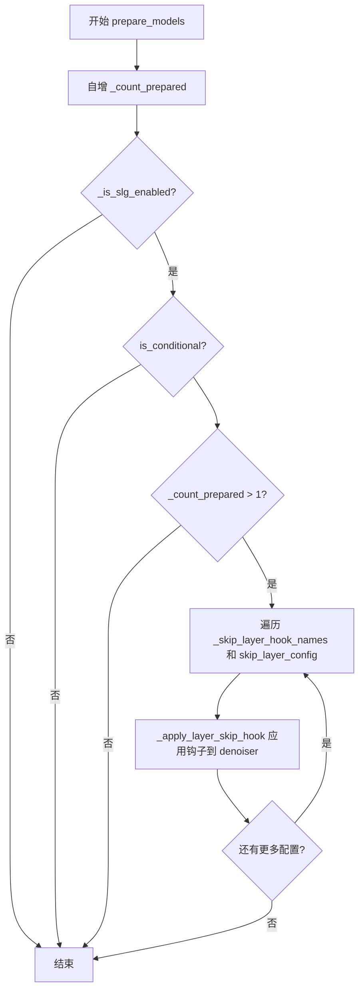

#### 带注释源码

```python
# Copied from diffusers.guiders.skip_layer_guidance.SkipLayerGuidance.prepare_models
def prepare_models(self, denoiser: torch.nn.Module) -> None:
    """
    为去噪器准备模型并应用层跳过钩子。
    
    该方法实现了两阶段初始化：
    - 第一次调用时只增加计数器，不注册钩子
    - 第二次及后续调用时才真正注册钩子
    
    Args:
        denoiser: 去噪器模型实例，通常是 UNet
    """
    # 增加准备计数器，用于跟踪 prepare_models 的调用次数
    # 这使得条件引导可以在第一次调用时执行特殊逻辑
    self._count_prepared += 1
    
    # 检查是否满足应用钩子的条件：
    # 1. SLG (Skip Layer Guidance) 已启用
    # 2. 是条件式引导（需要条件和无条件预测）
    # 3. 不是第一次调用（第一次调用用于建立条件预测基线）
    if self._is_slg_enabled() and self.is_conditional and self._count_prepared > 1:
        # 遍历所有配置的层跳过钩子名称和配置
        for name, config in zip(self._skip_layer_hook_names, self.skip_layer_config):
            # 应用层跳过钩子到去噪器模型
            # 这会在指定层注入扰动注意力机制
            _apply_layer_skip_hook(denoiser, config, name=name)
```


### `PerturbedAttentionGuidance.cleanup_models`

清理已注册到去噪器模型上的 Skip Layer Guidance 钩子，用于在推理完成后释放资源并防止内存泄漏。

参数：

- `denoiser`：`torch.nn.Module`，要去除钩子的去噪器模型（通常是一个神经网络模块）

返回值：`None`，该方法直接修改模型状态，不返回任何值

#### 流程图

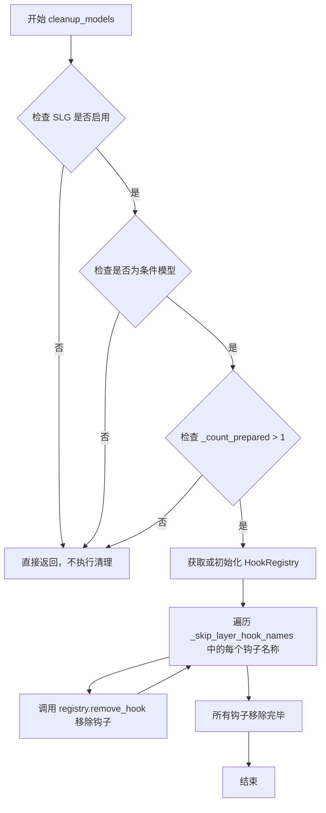

#### 带注释源码

```python
def cleanup_models(self, denoiser: torch.nn.Module) -> None:
    """
    清理模型并移除之前注册的 Skip Layer Guidance 钩子。
    
    此方法在推理完成后调用，用于：
    1. 检查 Skip Layer Guidance (SLG) 是否启用
    2. 确认模型是条件模型（需要条件引导）
    3. 确认已经进行了模型准备（_count_prepared > 1）
    4. 从去噪器模型中移除所有相关的钩子
    
    Args:
        denoiser: torch.nn.Module
            要清理钩子的去噪器模型，通常是 UNet 或其他扩散模型组件
    
    Returns:
        None
    
    Note:
        此方法直接修改传入的 denoiser 模型，移除其上注册的钩子。
        如果不调用此方法，钩子可能会在后续推理中累积，导致内存泄漏或意外行为。
    """
    # 检查 Skip Layer Guidance 功能是否启用
    if self._is_slg_enabled() and self.is_conditional and self._count_prepared > 1:
        # 从去噪器模型获取或初始化 HookRegistry
        # HookRegistry 用于管理已注册的 PyTorch 钩子
        registry = HookRegistry.check_if_exists_or_initialize(denoiser)
        
        # 遍历所有已注册的 Skip Layer Guidance 钩子名称
        # 这些钩子名称在 prepare_models 方法中创建，格式为 "SkipLayerGuidance_{i}"
        for hook_name in self._skip_layer_hook_names:
            # 递归移除指定名称的钩子（包括子模块上的钩子）
            registry.remove_hook(hook_name, recurse=True)
```


### `PerturbedAttentionGuidance.prepare_inputs`

准备输入数据批次，根据当前条件数量和配置确定需要处理的预测类型，并为每个预测类型准备对应的数据批次。

参数：

- `self`：当前类实例，包含 `num_conditions`、`_is_cfg_enabled()` 等属性和方法
- `data`：`dict[str, tuple[torch.Tensor, torch.Tensor]]`，输入数据字典，键为字符串，值为包含两个张量的元组（通常为条件预测和无条件预测）

返回值：`list["BlockState"]`，返回准备好的数据批次列表，每个元素是一个 BlockState 对象

#### 流程图

```mermaid
flowchart TD
    A[开始 prepare_inputs] --> B{self.num_conditions == 1?}
    B -->|是| C[设置 tuple_indices = [0]<br/>input_predictions = ['pred_cond']]
    B -->|否| D{self.num_conditions == 2?}
    D -->|是| E{self._is_cfg_enabled()?}
    D -->|否| F[设置 tuple_indices = [0, 1, 0]<br/>input_predictions = ['pred_cond', 'pred_uncond', 'pred_cond_skip']]
    E -->|是| G[设置 tuple_indices = [0, 1]<br/>input_predictions = ['pred_cond', 'pred_uncond']]
    E -->|否| H[设置 tuple_indices = [0, 1]<br/>input_predictions = ['pred_cond', 'pred_cond_skip']]
    C --> I[初始化 data_batches = []]
    F --> I
    G --> I
    H --> I
    I --> J[遍历 tuple_indices 和 input_predictions]
    J --> K[调用 self._prepare_batch<br/>传入 data, tuple_idx, input_prediction]
    K --> L[将返回的 data_batch 添加到 data_batches]
    L --> M{还有更多元素?}
    M -->|是| J
    M -->|否| N[返回 data_batches]
    N --> O[结束]
```

#### 带注释源码

```python
def prepare_inputs(self, data: dict[str, tuple[torch.Tensor, torch.Tensor]]) -> list["BlockState"]:
    """
    准备输入数据批次，根据条件数量和配置处理预测数据
    
    Args:
        data: 输入数据字典，键为字符串，值为两个张量的元组
              通常包含条件预测和无条件预测的张量对
    
    Returns:
        准备好的数据批次列表，每个元素对应一个预测类型的数据
    """
    # 根据条件数量确定需要处理的预测类型
    # 条件数量由 num_conditions 属性决定，受 CFG 和 SLG 开关影响
    if self.num_conditions == 1:
        # 单条件情况：只处理条件预测
        tuple_indices = [0]  # 只取第一个张量
        input_predictions = ["pred_cond"]
    elif self.num_conditions == 2:
        # 双条件情况：根据是否启用 CFG 决定预测类型
        tuple_indices = [0, 1]  # 取前两个张量
        input_predictions = (
            ["pred_cond", "pred_uncond"] if self._is_cfg_enabled() else ["pred_cond", "pred_cond_skip"]
        )
        # 如果启用了 CFG，使用条件预测和无条件预测
        # 否则使用条件预测和跳过的条件预测
    else:
        # 三条件情况：同时使用 CFG 和 SkipLayerGuidance
        tuple_indices = [0, 1, 0]  # 第一个和第三个都取第一个张量
        input_predictions = ["pred_cond", "pred_uncond", "pred_cond_skip"]
    
    # 遍历每种预测类型，准备对应的数据批次
    data_batches = []
    for tuple_idx, input_prediction in zip(tuple_indices, input_predictions):
        # 调用内部方法 _prepare_batch 处理每个批次
        # 参数：data-原始数据，tuple_idx-张量索引，input_prediction-预测类型名称
        data_batch = self._prepare_batch(data, tuple_idx, input_prediction)
        data_batches.append(data_batch)
    
    # 返回所有准备好的数据批次
    return data_batches
```


### `PerturbedAttentionGuidance.prepare_inputs_from_block_state`

该方法根据当前的引导配置（条件数量、CFG是否启用、SkipLayerGuidance是否启用）从块状态（BlockState）中准备输入数据批次，将原始的块状态数据转换为适合后续处理的不同预测输入列表。

参数：

-  `data`：`BlockState`，包含噪声预测结果的块状态对象，包含模型的中间输出状态
-  `input_fields`：`dict[str, str | tuple[str, str]]`，字典，键为字段名称，值为字段对应的属性名或属性名元组，用于指定从块状态中提取哪些字段

返回值：`list[BlockState]`，返回块状态对象列表，每个元素对应一个预测输入（条件预测、无条件预测或跳跃层预测），列表长度由条件数量决定（1-3个）

#### 流程图

```mermaid
flowchart TD
    A[开始准备输入] --> B{self.num_conditions == 1?}
    B -->|是| C[设置 tuple_indices = [0]<br/>input_predictions = ['pred_cond']}
    B -->|否| D{self.num_conditions == 2?}
    D -->|是| E{_is_cfg_enabled?}
    D -->|否| F[设置 tuple_indices = [0, 1, 0]<br/>input_predictions = ['pred_cond', 'pred_uncond', 'pred_cond_skip']}
    E -->|是| G[设置 tuple_indices = [0, 1]<br/>input_predictions = ['pred_cond', 'pred_uncond']}
    E -->|否| H[设置 tuple_indices = [0, 1]<br/>input_predictions = ['pred_cond', 'pred_cond_skip']}
    C --> I[初始化空列表 data_batches]
    G --> I
    H --> I
    F --> I
    I --> J[遍历 tuple_indices 和 input_predictions]
    J --> K[调用 _prepare_batch_from_block_state<br/>参数: input_fields, data, tuple_idx, input_prediction]
    K --> L[将返回的 data_batch 添加到 data_batches]
    L --> M{还有更多索引?}
    M -->|是| J
    M -->|否| N[返回 data_batches]
```

#### 带注释源码

```python
def prepare_inputs_from_block_state(
    self, data: "BlockState", input_fields: dict[str, str | tuple[str, str]]
) -> list["BlockState"]:
    """
    从块状态准备输入数据批次。
    
    根据当前引导配置（条件数量、CFG和SkipLayerGuidance的启用状态）
    决定需要准备哪些预测输入，并将块状态数据转换为适合后续处理的批次。
    
    Args:
        data: 包含噪声预测结果的块状态对象
        input_fields: 字段映射字典，指定从块状态中提取哪些字段
    
    Returns:
        块状态对象列表，每个元素对应一个预测输入
    """
    # 根据条件数量确定需要处理的预测类型
    if self.num_conditions == 1:
        # 单条件情况：只处理条件预测
        tuple_indices = [0]
        input_predictions = ["pred_cond"]
    elif self.num_conditions == 2:
        # 双条件情况：根据CFG是否启用决定预测类型
        tuple_indices = [0, 1]
        input_predictions = (
            ["pred_cond", "pred_uncond"] if self._is_cfg_enabled() else ["pred_cond", "pred_cond_skip"]
        )
    else:
        # 多条件情况（3个条件）：同时包含条件、无条件和跳跃层预测
        tuple_indices = [0, 1, 0]
        input_predictions = ["pred_cond", "pred_uncond", "pred_cond_skip"]
    
    # 存储所有准备好的数据批次
    data_batches = []
    
    # 遍历每个预测类型，从块状态中提取对应的数据
    for tuple_idx, input_prediction in zip(tuple_indices, input_predictions):
        # 调用内部方法将块状态转换为批次数据
        data_batch = self._prepare_batch_from_block_state(input_fields, data, tuple_idx, input_prediction)
        data_batches.append(data_batch)
    
    return data_batches
```


### `PerturbedAttentionGuidance.forward`

该方法执行扰动注意力引导（Perturbed Attention Guidance, PAG）的核心计算，根据当前是否启用无分类器引导（CFG）和跳层引导（SLG）的配置，对条件预测、非条件预测和跳层预测进行加权组合，生成最终的引导输出结果。

参数：

- `self`：`PerturbedAttentionGuidance` 类实例，表示当前的引导器对象
- `pred_cond`：`torch.Tensor`，条件预测张量，表示在给定条件（文本提示等）下的模型预测
- `pred_uncond`：`torch.Tensor | None`，非条件预测张量，表示无任何条件输入时的模型预测，用于CFG计算，默认为 `None`
- `pred_cond_skip`：`torch.Tensor | None`，跳层条件预测张量，表示经过跳层处理后的条件预测，用于SLG计算，默认为 `None`

返回值：`GuiderOutput`，包含最终预测结果及其组成部分的引导输出对象

#### 流程图

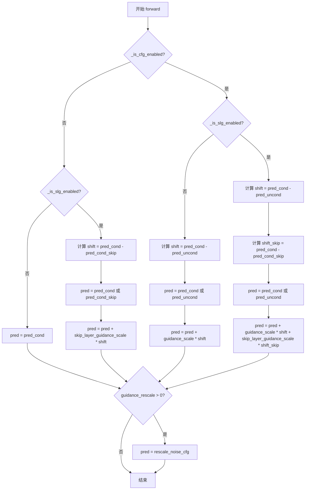

#### 带注释源码

```python
def forward(
    self,
    pred_cond: torch.Tensor,
    pred_uncond: torch.Tensor | None = None,
    pred_cond_skip: torch.Tensor | None = None,
) -> GuiderOutput:
    """
    执行扰动注意力引导的前向传播，计算最终的引导预测结果。
    
    根据是否启用无分类器引导（CFG）和跳层引导（SLG），采用不同的计算策略：
    1. 两者都禁用：直接返回条件预测
    2. 仅启用SLG：计算条件预测与跳层预测的差异并加权
    3. 仅启用CFG：计算条件预测与非条件预测的差异并加权
    4. 两者都启用：综合计算两种差异的加权和
    
    参数:
        pred_cond: 条件预测张量，模型在有条件输入时的预测
        pred_uncond: 非条件预测张量，模型在无条件输入时的预测（用于CFG）
        pred_cond_skip: 跳层条件预测张量，经扰动注意力处理后的条件预测（用于SLG）
    
    返回:
        GuiderOutput: 包含最终预测结果及原始预测分量的对象
    """
    pred = None  # 初始化最终预测结果

    # 情况1：CFG和SLG都未启用，直接返回条件预测
    if not self._is_cfg_enabled() and not self._is_slg_enabled():
        pred = pred_cond
    
    # 情况2：仅启用SLG（跳层引导），未启用CFG
    elif not self._is_cfg_enabled():
        # 计算条件预测与跳层预测之间的差异
        shift = pred_cond - pred_cond_skip
        # 根据配置选择原始或修改后的预测作为基础
        pred = pred_cond if self.use_original_formulation else pred_cond_skip
        # 应用跳层引导缩放系数
        pred = pred + self.skip_layer_guidance_scale * shift
    
    # 情况3：仅启用CFG，未启用SLG
    elif not self._is_slg_enabled():
        # 计算条件预测与非条件预测之间的差异（经典CFG）
        shift = pred_cond - pred_uncond
        # 根据配置选择原始或非条件预测作为基础
        pred = pred_cond if self.use_original_formulation else pred_uncond
        # 应用引导缩放系数
        pred = pred + self.guidance_scale * shift
    
    # 情况4：同时启用CFG和SLG
    else:
        # 计算两种差异：条件-非条件 和 条件-跳层
        shift = pred_cond - pred_uncond
        shift_skip = pred_cond - pred_cond_skip
        # 根据配置选择基础预测
        pred = pred_cond if self.use_original_formulation else pred_uncond
        # 综合应用两种引导的缩放
        pred = pred + self.guidance_scale * shift + self.skip_layer_guidance_scale * shift_skip

    # 如果配置了预测重缩放（用于改善图像质量和解决过度曝光问题）
    if self.guidance_rescale > 0.0:
        # 根据Section 3.4的论文方法重缩放预测结果
        pred = rescale_noise_cfg(pred, pred_cond, self.guidance_rescale)

    # 返回包含预测结果及各分量的引导输出对象
    return GuiderOutput(pred=pred, pred_cond=pred_cond, pred_uncond=pred_uncond)
```


### `PerturbedAttentionGuidance.is_conditional`

该属性用于判断当前模型是否配置为条件生成模式（即是否有条件输入，如文本提示或图像），通过检查模型准备计数器 `_count_prepared` 的值来确定是否包含条件信息。

参数：无（该方法为属性访问器，仅接收隐式 `self` 参数）

返回值：`bool`，当返回 `True` 时表示当前配置包含条件输入（条件生成模式）；返回 `False` 时表示无条件生成模式。

#### 流程图

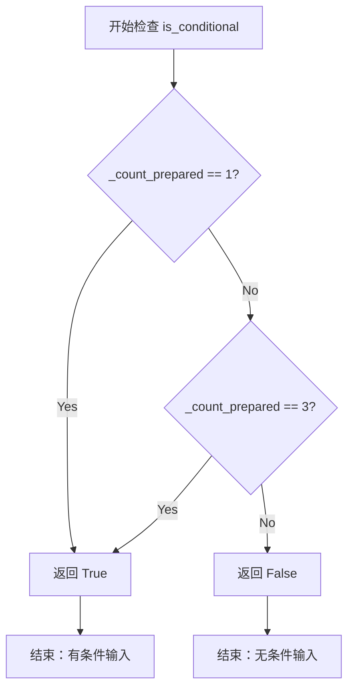

#### 带注释源码

```python
@property
# Copied from diffusers.guiders.skip_layer_guidance.SkipLayerGuidance.is_conditional
def is_conditional(self) -> bool:
    """
    判断当前引导器是否配置为条件生成模式。
    
    该属性通过检查内部计数器 _count_prepared 来确定是否包含条件输入。
    当计数器的值为 1 或 3 时，表示存在条件输入；其他值表示无条件输入。
    
    返回:
        bool: True 表示有条件输入（条件生成模式），False 表示无条件生成模式。
    """
    # _count_prepared == 1: 仅包含条件预测 (pred_cond)
    # _count_prepared == 3: 包含条件预测、无条件预测和跳过的条件预测 (pred_cond, pred_uncond, pred_cond_skip)
    return self._count_prepared == 1 or self._count_prepared == 3
```


### `PerturbedAttentionGuidance.num_conditions`

该属性用于返回当前配置下的条件数量。基于基础条件（1），如果启用了无分类器引导（CFG）则加1，如果启用了跳层引导（SLG）则再加1。

参数：无（该方法为属性，仅包含隐式参数 `self`）

返回值：`int`，返回当前_guidance_配置下的条件数量（1、2或3）

#### 流程图

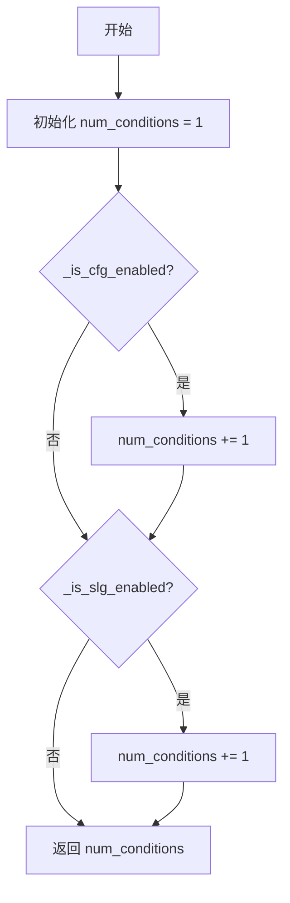

#### 带注释源码

```python
@property
# Copied from diffusers.guiders.skip_layer_guidance.SkipLayerGuidance.num_conditions
def num_conditions(self) -> int:
    """
    返回当前配置下的条件数量。
    
    该属性根据是否启用了无分类器引导（CFG）和跳层引导（SLG）
    来计算需要返回的条件数量。
    
    Returns:
        int: 条件数量，可能值为：
            - 1: 仅条件预测
            - 2: 条件预测 + 无条件预测（启用CFG）或条件预测+跳过层预测（启用SLG）
            - 3: 条件预测 + 无条件预测 + 跳过层预测（同时启用CFG和SLG）
    """
    # 基础条件数量为1（条件预测 pred_cond）
    num_conditions = 1
    
    # 如果启用了无分类器引导（CFG），条件数量加1
    if self._is_cfg_enabled():
        num_conditions += 1
    
    # 如果启用了跳层引导（SLG），条件数量再加1
    if self._is_slg_enabled():
        num_conditions += 1
    
    # 返回最终的条件数量
    return num_conditions
```


### `PerturbedAttentionGuidance._is_cfg_enabled`

判断当前去噪步骤是否满足启用无分类器引导（Classifier-Free Guidance, CFG）的条件。该方法检查引导是否启用、当前推理步骤是否在配置的范围内，以及 guidance_scale 是否偏离临界值。

参数：

- 无参数（仅依赖 `self` 内部状态）

返回值：`bool`，如果满足以下所有条件则返回 `True`：
1. `self._enabled` 为 `True`（引导已启用）
2. 当前推理步骤在 `_start` 和 `_stop` 指定的范围内
3. `guidance_scale` 不接近临界值（使用原始公式时不为 0.0，否则不为 1.0）
否则返回 `False`。

#### 流程图

```mermaid
flowchart TD
    A[开始: _is_cfg_enabled] --> B{self._enabled?}
    B -->|False| C[返回 False]
    B -->|True| D{self._num_inference_steps is not None?}
    D -->|No| E[is_within_range = True]
    D -->|Yes| F[计算 skip_start_step = int(self._start * self._num_inference_steps)]
    F --> G[计算 skip_stop_step = int(self._stop * self._num_inference_steps)]
    G --> H[is_within_range = skip_start_step <= self._step < skip_stop_step]
    E --> I{self.use_original_formulation?}
    H --> I
    I -->|True| J{math.isclose guidance_scale, 0.0?}
    I -->|False| K{math.isclose guidance_scale, 1.0?}
    J --> L[is_close = 结果]
    K --> L
    L --> M[返回 is_within_range and not is_close]
```

#### 带注释源码

```python
def _is_cfg_enabled(self) -> bool:
    """
    判断 CFG（无分类器引导）是否在当前去噪步骤中启用。
    
    启用条件：
    1. 引导已启用（_enabled 为 True）
    2. 当前推理步骤在配置的 [_start, _stop) 范围内
    3. guidance_scale 不接近临界值（原始公式下为 0.0，否则为 1.0）
    """
    # 第一步：检查引导是否整体启用
    if not self._enabled:
        return False

    # 第二步：检查当前推理步骤是否在配置的范围内
    is_within_range = True
    if self._num_inference_steps is not None:
        # 将比例转换为实际的推理步骤索引
        skip_start_step = int(self._start * self._num_inference_steps)
        skip_stop_step = int(self._stop * self._num_inference_steps)
        # 判断当前步骤是否在 [start, stop) 区间内
        is_within_range = skip_start_step <= self._step < skip_stop_step

    # 第三步：检查 guidance_scale 是否偏离临界值
    # 临界值取决于是否使用原始公式：
    # - 原始公式：guidance_scale 接近 0.0 时相当于禁用 CFG
    # - diffusers 实现：guidance_scale 接近 1.0 时相当于无引导
    is_close = False
    if self.use_original_formulation:
        is_close = math.isclose(self.guidance_scale, 0.0)
    else:
        is_close = math.isclose(self.guidance_scale, 1.0)

    # 只有同时满足：步骤在范围内 且 guidance_scale 不接近临界值
    return is_within_range and not is_close
```


### `PerturbedAttentionGuidance._is_slg_enabled`

判断 SLG（Skip Layer Guidance，跳跃层引导）是否启用的私有方法。该方法检查引导是否在指定的推理步骤范围内（从 `skip_layer_guidance_start` 到 `skip_layer_guidance_stop`），并且引导尺度（`skip_layer_guidance_scale`）是否不等于零。

参数：

- 无显式参数（隐式参数 `self` 为类的实例）

返回值：`bool`，返回 `True` 表示 SLG 已启用，返回 `False` 表示 SLG 未启用

#### 流程图

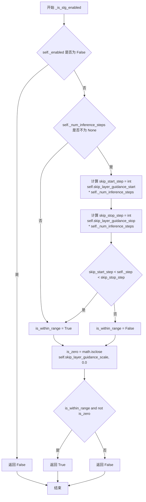

#### 带注释源码

```python
def _is_slg_enabled(self) -> bool:
    """
    判断 SLG（Skip Layer Guidance，跳跃层引导）是否启用的私有方法。
    
    检查两个条件：
    1. 引导在当前推理步骤范围内（从 skip_layer_guidance_start 到 skip_layer_guidance_stop）
    2. skip_layer_guidance_scale 不为零（使用 math.isclose 进行浮点数近似比较）
    
    Returns:
        bool: 如果 SLG 启用返回 True，否则返回 False
    """
    # 检查引导是否被全局禁用
    if not self._enabled:
        return False

    # 初始化步骤范围标志为 True
    is_within_range = True
    
    # 如果提供了推理步骤数，则检查当前步骤是否在指定范围内
    if self._num_inference_steps is not None:
        # 计算起始和停止步骤的索引
        skip_start_step = int(self.skip_layer_guidance_start * self._num_inference_steps)
        skip_stop_step = int(self.skip_layer_guidance_stop * self._num_inference_steps)
        
        # 检查当前步骤是否在 (start, stop) 范围内（开区间）
        is_within_range = skip_start_step < self._step < skip_stop_step

    # 检查 skip_layer_guidance_scale 是否接近零（使用浮点数近似比较）
    is_zero = math.isclose(self.skip_layer_guidance_scale, 0.0)

    # 只有同时满足：在步骤范围内 且 引导尺度不为零，才返回 True
    return is_within_range and not is_zero
```

## 关键组件


### 扰动注意力引导（PAG）

一种用于扩散模型的引导技术，通过扰动注意力分数（将分数矩阵替换为单位矩阵）来改进去噪过程，使预测分布进一步远离条件分布的较差版本。

### 张量索引与条件预测处理

代码通过 `prepare_inputs` 方法处理三种预测类型：pred_cond（条件预测）、pred_uncond（无条件预测）和 pred_cond_skip（跳过层预测），根据 num_conditions 和 _is_cfg_enabled() 的状态动态确定需要处理的预测组合和元组索引，实现条件分支的惰性加载。

### 引导启用范围控制

通过 `_is_cfg_enabled()` 和 `_is_slg_enabled()` 方法实现基于推理步骤的范围控制，使用 `start`/`stop` 和 `perturbed_guidance_start`/`perturbed_guidance_stop` 参数计算当前步骤是否在引导有效范围内，支持分阶段启用不同的引导策略。

### Hook 注册与模型准备

`prepare_models` 方法通过 `_apply_layer_skip_hook` 为去噪器注册跳过层引导钩子，`cleanup_models` 方法在推理后移除钩子，实现对模型层行为的动态修改和清理，确保不影响后续使用。

### 引导尺度计算逻辑

`forward` 方法根据 CFG 和 SLG 的启用状态计算最终预测值，支持原始公式和差分公式两种模式，通过 guidance_scale 和 skip_layer_guidance_scale 对条件与无条件预测的差值进行加权求和，最后可选地应用 guidance_rescale 进行噪声预测重缩放。


## 问题及建议


### 已知问题

- **代码重复**：多个方法（`prepare_inputs` 和 `prepare_inputs_from_block_state`）包含几乎相同的条件分支逻辑（`num_conditions` 的处理），违反了 DRY 原则。
- **重复代码复制**：代码中多处出现 "Copied from diffusers.guiders.skip_layer_guidance.SkipLayerGuidance" 注释，表明存在跨模块的代码复制，应考虑提取公共基类或混入类。
- **未使用的类属性**：`_input_predictions = ["pred_cond", "pred_uncond", "pred_cond_skip"]` 在类中定义但从未被使用，属于死代码。
- **配置覆盖风险**：在 `__init__` 中强制覆盖用户的 `perturbed_guidance_config` 配置值（`skip_attention=False` 等），且仅通过 `logger.warning` 警告，可能导致用户配置的意图被无声忽略。
- **属性命名不一致**：类内部使用 `skip_layer_guidance_scale`/`skip_layer_guidance_start`/`skip_layer_guidance_stop`，但配置参数使用 `perturbed_guidance_*`，增加了维护负担和理解成本。
- **魔法数字和字符串**：hook 名称使用 `f"SkipLayerGuidance_{i}"` 字符串拼接，缺乏统一的常量定义。
- **边界条件处理**：`forward` 方法中 `pred_uncond` 和 `pred_cond_skip` 的可选性与 `num_conditions` 的关系缺乏明确的文档说明，易导致误用。

### 优化建议

- **提取公共逻辑**：将 `prepare_inputs` 和 `prepare_inputs_from_block_state` 中的条件分支逻辑提取为私有方法（如 `_get_tuple_indices_and_predictions`），避免代码重复。
- **消除代码复制**：将 `SkipLayerGuidance` 和 `PerturbedAttentionGuidance` 的公共逻辑提取到共享基类或使用组合模式，减少跨模块复制。
- **删除死代码**：移除未使用的 `_input_predictions` 类属性。
- **改进配置验证**：使用配置类或 Pydantic 等进行更严格的配置验证，而不是在 `__init__` 中进行大量的手动类型检查和转换。
- **统一命名规范**：统一使用 `perturbed_guidance_*` 或 `skip_layer_guidance_*` 命名，避免混淆。
- **定义常量**：将 hook 名称前缀等魔法字符串提取为模块级常量。
- **增强文档**：为 `forward` 方法的参数添加更详细的文档说明，特别是可选参数在不同 `num_conditions` 下的行为。

## 其它


### 设计目标与约束

该代码实现了Perturbed Attention Guidance (PAG)技术，用于改进扩散模型的图像生成质量。设计目标包括：1) 通过扰动注意力分数来引导去噪过程，使其远离"较差"的条件分布估计；2) 与现有的SkipLayerGuidance实现保持一致性，以简化代码维护；3) 支持灵活的层选择和配置；4) 提供对classifier-free guidance (CFG)的兼容支持。主要约束包括：假设整个latent是单一的视觉token流，不支持文本和图像/视频token的联合latent条件；当前实现不支持联合latent条件（joint latent conditioning）。

### 错误处理与异常设计

代码中的错误处理主要通过ValueError异常实现：1) 如果`perturbed_guidance_config`为None且`perturbed_guidance_layers`也为None，抛出ValueError提示必须提供其中一个；2) 如果同时提供了`perturbed_guidance_config`和`perturbed_guidance_layers`，抛出ValueError提示不应同时提供；3) 如果`perturbed_guidance_config`类型不符合要求（不是LayerSkipConfig、list或dict），抛出相应的ValueError。此外，使用logger.warning来警告用户关于配置参数的不合理设置，如skip_attention应为False、skip_attention_scores应为True、skip_ff应为False。

### 数据流与状态机

数据流主要经过三个阶段：准备阶段(prepare_models/cleanup_models)、输入准备阶段(prepare_inputs/prepare_inputs_from_block_state)、前向计算阶段(forward)。在准备阶段，代码注册layer skip hooks到去噪器模型；输入准备阶段根据条件数量（1-3个条件）构建不同的输入预测列表；前向计算阶段根据CFG和SLG的启用状态计算最终的guidance输出。状态机由_is_cfg_enabled()和_is_slg_enabled()方法控制，它们根据当前的推理步骤(_step)和配置参数判断是否在有效范围内。

### 外部依赖与接口契约

该类依赖以下外部模块：1) torch - 用于张量操作；2) math - 用于数学比较函数；3) typing - 用于类型注解；4) ..configuration_utils.register_to_config装饰器；5) ..hooks模块中的HookRegistry、LayerSkipConfig和_apply_layer_skip_hook；6) ..guider_utils中的BaseGuidance、GuiderOutput和rescale_noise_cfg；7) ..utils.get_logger。接口契约方面，该类继承自BaseGuidance，必须实现prepare_models、cleanup_models、prepare_inputs、forward等方法，并提供is_conditional和num_conditions属性。

### 配置参数详解

guidance_scale: float，默认7.5，CFG的缩放参数，控制对文本提示的条件强度；perturbed_guidance_scale: float，默认2.8，扰动注意力guidance的缩放参数；perturbed_guidance_start: float，默认0.01，扰动guidance开始的去噪步骤比例；perturbed_guidance_stop: float，默认0.2，扰动guidance停止的去噪步骤比例；perturbed_guidance_layers: int | list[int] | None，要应用扰动guidance的层索引；perturbed_guidance_config: LayerSkipConfig | list[LayerSkipConfig] | dict，扰动guidance的配置；guidance_rescale: float，默认0.0，噪声预测的重缩放因子，用于改善图像质量；use_original_formulation: bool，默认False，是否使用原始CFG公式；start: float，默认0.01，guidance开始的步骤比例；stop: float，默认0.2，guidance停止的步骤比例；enabled: bool，默认True，是否启用guidance。

### 数学公式与原理

PAG的核心思想是将CFG预测的分布估计进一步远离"较差"版本的条件分布估计。具体实现：1) 对于仅启用SLG的情况：pred = pred_cond + guidance_scale * (pred_cond - pred_cond_skip)；2) 对于仅启用CFG的情况：pred = pred_cond + guidance_scale * (pred_cond - pred_uncond)；3) 对于同时启用两者的情况：pred = pred_cond + guidance_scale * (pred_cond - pred_uncond) + skip_layer_guidance_scale * (pred_cond - pred_cond_skip)。扰动通过在选定的注意力层将attention score矩阵替换为单位矩阵来实现。

### 使用示例

```python
from diffusers.guiders.perturbed_attention_guidance import PerturbedAttentionGuidance

# 基本用法
guider = PerturbedAttentionGuidance(
    guidance_scale=7.5,
    perturbed_guidance_scale=2.8,
    perturbed_guidance_start=0.01,
    perturbed_guidance_stop=0.2,
    perturbed_guidance_layers=[0, 1, 2],
)

# 在扩散模型推理循环中使用
guider.prepare_models(denoiser)
data_batches = guider.prepare_inputs(data)
output = guider.forward(pred_cond, pred_uncond, pred_cond_skip)
guider.cleanup_models(denoiser)
```

### 性能考量

1) Layer skip hooks在每次推理前需要注册，可能会带来一定的开销；2) 扰动attention scores会引入额外的计算成本，但通常仅限于指定的层；3) 建议只对必要的层启用PAG以平衡效果和性能；4) guidance_rescale操作会增加额外的内存和计算开销。

### 兼容性说明

该实现与diffusers库的其他guider类（如ClassifierFreeGuidance、SkipLayerGuidance）保持一致的接口设计。它依赖于LayerSkipConfig和HookRegistry系统，需要与特定版本的diffusers库配合使用。代码中使用了从SkipLayerGuidance复制的方法（通过注释标记为Copied from），确保行为一致。

### 测试策略

应包含以下测试用例：1) 不同条件数量（1/2/3个条件）的输入处理；2) CFG和SLG的不同启用/禁用组合；3) guidance_rescale功能的正确性；4) 步骤范围判断的边界条件；5) 异常情况下的错误处理；6) 配置参数验证。

### 线程安全性

该类本身不涉及多线程共享状态的修改，但在多线程环境下使用时应注意：1) 每个线程应创建独立的guider实例；2) prepare_models和cleanup_models应成对调用；3) _step属性的更新不是线程安全的。

### 日志与监控

使用模块级logger记录警告信息：当检测到不匹配的layer skip配置时会发出警告。建议在生产环境中配置日志级别以便追踪配置问题和性能指标。

    