# `diffusers\src\diffusers\guiders\skip_layer_guidance.py` 详细设计文档

SkipLayerGuidance类实现了Skip Layer Guidance (SLG)和Spatio-Temporal Guidance (STG)技术，用于改善扩散模型生成图像的结构和解剖学一致性，通过在去噪过程中跳过指定transformer块的前向传播，并基于条件预测与跳过层后预测的差异来调整CFG预测

## 整体流程

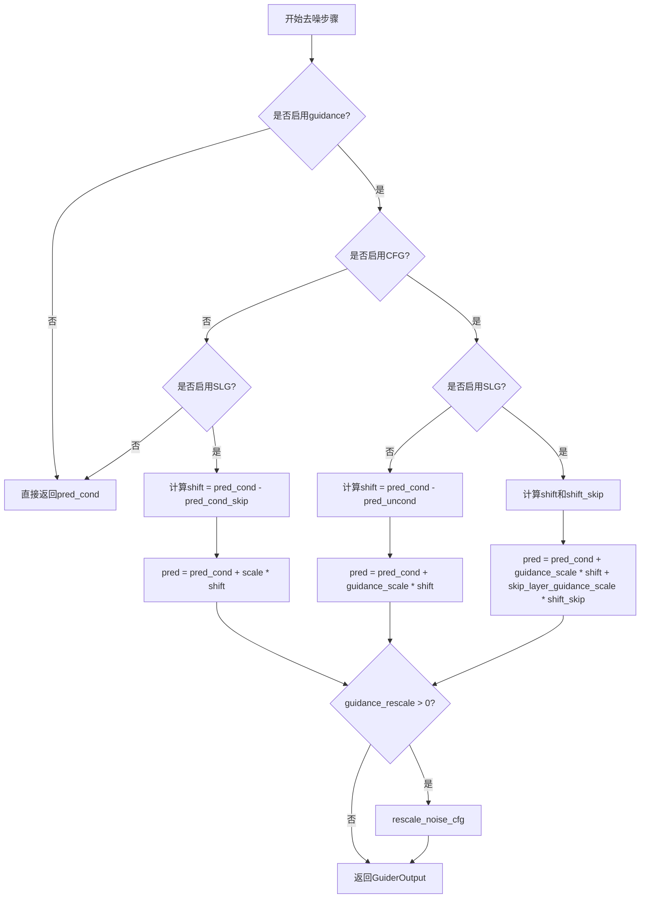

## 类结构

```
BaseGuidance (抽象基类)
└── SkipLayerGuidance
```

## 全局变量及字段


### `_input_predictions`
    
输入预测的键名列表，包含条件预测、无条件预测和跳过层预测

类型：`list[str]`
    


### `SkipLayerGuidance._count_prepared`
    
模型准备计数器，用于跟踪prepare_models调用次数

类型：`int`
    


### `SkipLayerGuidance._enabled`
    
引导是否启用的标志

类型：`bool`
    


### `SkipLayerGuidance._start`
    
引导开始应用的推理步骤比例

类型：`float`
    


### `SkipLayerGuidance._stop`
    
引导停止应用的推理步骤比例

类型：`float`
    


### `SkipLayerGuidance._num_inference_steps`
    
总推理步数，用于计算引导的起止步骤

类型：`int | None`
    


### `SkipLayerGuidance._step`
    
当前推理步骤计数

类型：`int`
    


### `SkipLayerGuidance.guidance_scale`
    
CFG引导尺度参数，控制文本提示的条件强度

类型：`float`
    


### `SkipLayerGuidance.skip_layer_guidance_scale`
    
跳过层引导尺度，控制结构和解剖学一致性改善程度

类型：`float`
    


### `SkipLayerGuidance.skip_layer_guidance_start`
    
跳过层引导开始步数比例，控制何时开始应用跳过层引导

类型：`float`
    


### `SkipLayerGuidance.skip_layer_guidance_stop`
    
跳过层引导结束步数比例，控制何时停止应用跳过层引导

类型：`float`
    


### `SkipLayerGuidance.skip_layer_config`
    
跳过层配置列表，定义要跳过的层及其配置

类型：`list[LayerSkipConfig]`
    


### `SkipLayerGuidance._skip_layer_hook_names`
    
跳过层钩子名称列表，用于注册和管理层跳过钩子

类型：`list[str]`
    


### `SkipLayerGuidance.guidance_rescale`
    
噪声预测重缩放因子，用于改善图像质量和修复过曝

类型：`float`
    


### `SkipLayerGuidance.use_original_formulation`
    
是否使用原始CFG公式的标志

类型：`bool`
    
    

## 全局函数及方法


### `register_to_config`

这是一个装饰器函数，用于将类的 `__init__` 方法参数自动注册到配置中，通常用于实现配置管理、参数追踪和序列化功能。它会捕获 `__init__` 的所有参数，并将其存储在类的配置属性中。

参数：

- 该装饰器不接受额外参数，它直接作用于被装饰的函数（通常是 `__init__` 方法）

返回值：`Callable`，返回装饰后的函数

#### 流程图

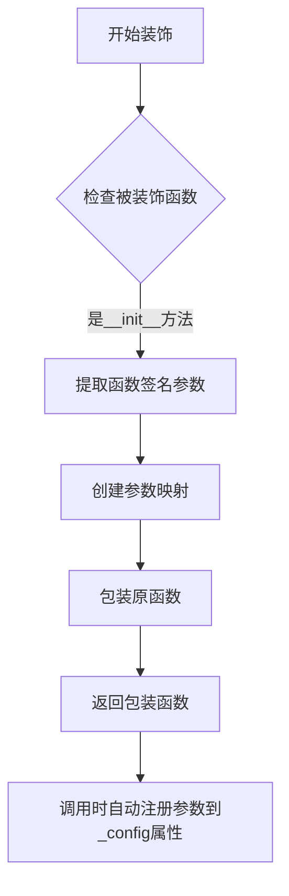

#### 带注释源码

```python
# 这是一个装饰器，需要从 configuration_utils 模块导入
# 使用方式：@register_to_config 放在 __init__ 方法定义之前
from ..configuration_utils import register_to_config

class SkipLayerGuidance(BaseGuidance):
    """
    Skip Layer Guidance (SLG) 引导类
    """
    
    @register_to_config  # 装饰器应用位置
    def __init__(
        self,
        guidance_scale: float = 7.5,  # CFG引导强度
        skip_layer_guidance_scale: float = 2.8,  # 跳层引导强度
        skip_layer_guidance_start: float = 0.01,  # 跳层引导开始步数比例
        skip_layer_guidance_stop: float = 0.2,  # 跳层引导结束步数比例
        skip_layer_guidance_layers: int | list[int] | None = None,  # 跳层的层索引
        skip_layer_config: LayerSkipConfig | list[LayerSkipConfig] | dict[str, Any] = None,  # 跳层配置
        guidance_rescale: float = 0.0,  # 噪声预测重缩放因子
        use_original_formulation: bool = False,  # 是否使用原始CFG公式
        start: float = 0.0,  # 引导开始步数比例
        stop: float = 1.0,  # 引导结束步数比例
        enabled: bool = True,  # 是否启用
    ):
        # 装饰器会自动将这些参数注册到 self._config 中
        # 支持配置序列化、参数验证等功能
        super().__init__(start, stop, enabled)
        
        self.guidance_scale = guidance_scale
        self.skip_layer_guidance_scale = skip_layer_guidance_scale
        # ... 其他初始化逻辑
```

#### 说明

由于 `register_to_config` 是从外部模块导入的装饰器，其完整实现不在当前代码文件中。根据 Hugging Face diffusers 库的设计模式，该装饰器的主要功能包括：

1. **参数捕获**：自动捕获 `__init__` 方法的所有参数及其默认值
2. **配置存储**：将参数存储到 `self._config` 或类似属性中
3. **序列化支持**：使类支持配置保存和加载（如 `save_config`, `from_config`）
4. **类型注解保留**：保留原始函数的类型注解以支持类型检查


### `_apply_layer_skip_hook`

该函数是一个从外部模块导入的层跳过钩子应用函数，用于在去噪器的指定层上注册钩子，以实现跳过层指导（Skip Layer Guidance）功能。

参数：

- `denoiser`：`torch.nn.Module`，要去噪器模型实例，钩子将被注册到该模型上
- `config`：`LayerSkipConfig`，层跳过配置，包含要跳过的层信息
- `name`：`str`，钩子名称，用于标识和后续移除钩子

返回值：无（`None`）

#### 流程图

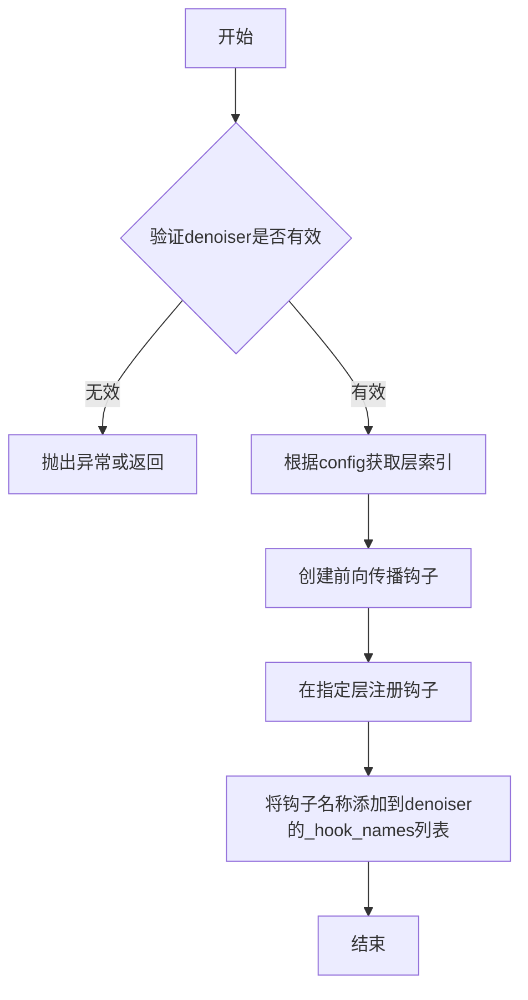

#### 带注释源码

```python
# 该函数定义在 ..hooks.layer_skip 模块中
# 当前文件只导入了该函数，未包含其实现源码
from ..hooks.layer_skip import _apply_layer_skip_hook

# 在 SkipLayerGuidance.prepare_models 方法中调用
def prepare_models(self, denoiser: torch.nn.Module) -> None:
    self._count_prepared += 1
    # 仅在SLG启用、条件存在、且不是首次准备时应用钩子
    if self._is_slg_enabled() and self.is_conditional and self._count_prepared > 1:
        # 为每个跳过层配置注册钩子
        for name, config in zip(self._skip_layer_hook_names, self.skip_layer_config):
            _apply_layer_skip_hook(denoiser, config, name=name)
```

---

> **注意**：提供的代码文件中仅包含对此函数的导入语句和调用，并未包含 `_apply_layer_skip_hook` 的完整实现源码。该函数定义在 `..hooks.layer_skip` 模块中。如需获取完整的函数实现，请查阅 `hooks/layer_skip.py` 文件。


### `BaseGuidance`

`BaseGuidance` 是从 `guider_utils` 模块导入的基类，定义了图像生成过程中 GUIDANCE（引导）功能的抽象接口。该类被 `SkipLayerGuidance` 等具体引导实现类继承，提供了通用的时间步控制（start/stop）、启用/禁用状态管理，以及模型准备和输入准备的标准方法。

由于 `BaseGuidance` 的源代码未在当前文件中提供（仅通过 `from .guider_utils import BaseGuidance` 导入），以下信息基于 `SkipLayerGuidance` 对其使用方式的推断：

参数：

-  `start`：`float`，guidance 开始的推理步数比例（0.0 到 1.0）
-  `stop`：`float`，guidance 停止的推理步数比例（0.0 到 1.0）
-  `enabled`：`bool`，是否启用该 guidance

返回值：`BaseGuidance` 实例

#### 继承关系推断

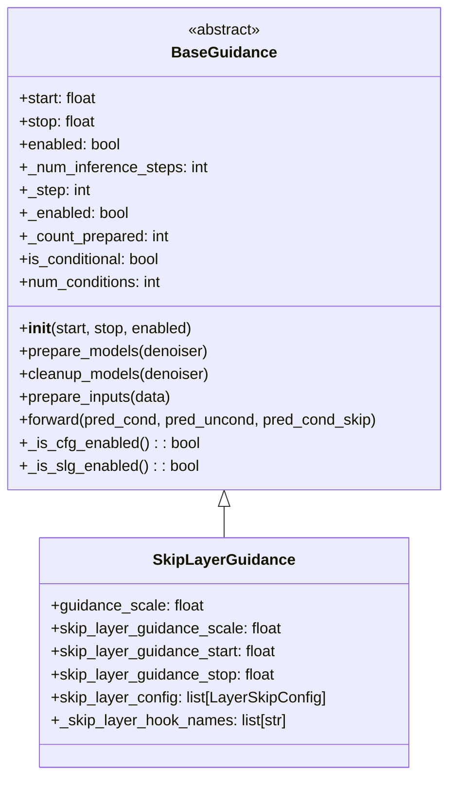

#### 带注释源码

```python
# BaseGuidance 源码未在当前文件中提供，以下为基于子类使用推断的接口定义

# 从 guider_utils 模块导入（源代码不在当前文件中）
from .guider_utils import BaseGuidance, GuiderOutput, rescale_noise_cfg


# ============================================================
# 以下为 BaseGuidance 类的推断属性和方法（基于 SkipLayerGuidance 的使用）
# ============================================================

class BaseGuidance:
    """
    Guidance 基类，定义图像生成引导的通用接口。
    
    负责：
    - 管理 guidance 的时间范围（start/stop）
    - 跟踪推理步骤（_step, _num_inference_steps）
    - 条件判断（is_conditional, num_conditions）
    - 模型准备和清理（prepare_models, cleanup_models）
    - 输入准备（prepare_inputs, prepare_inputs_from_block_state）
    - 前向计算（forward）
    """
    
    # 类属性（通过 register_to_config 装饰器从 __init__ 参数注册）
    _input_predictions = []  # 子类定义具体的输入预测类型
    
    def __init__(
        self,
        start: float = 0.0,
        stop: float = 1.0,
        enabled: bool = True,
    ):
        """
        初始化 BaseGuidance。
        
        Args:
            start: guidance 开始的推理步数比例（0.0 到 1.0）
            stop: guidance 停止的推理步数比例（0.0 到 1.0）
            enabled: 是否启用该 guidance
        """
        self._start = start
        self._stop = stop
        self._enabled = enabled
        self._num_inference_steps = None  # 推理总步数
        self._step = 0  # 当前推理步骤
        self._count_prepared = 0  # 模型准备计数
    
    # 属性（子类继承）
    @property
    def is_conditional(self) -> bool:
        """判断是否需要条件输入"""
        raise NotImplementedError
    
    @property
    def num_conditions(self) -> int:
        """返回条件的数量（1=仅条件，2=条件+无条件/PAG，3=条件+无条件+跳层）"""
        raise NotImplementedError
    
    # 模型管理方法（子类可重写）
    def prepare_models(self, denoiser: torch.nn.Module) -> None:
        """准备模型，应用必要的 hooks 或配置"""
        self._count_prepared += 1
    
    def cleanup_models(self, denoiser: torch.nn.Module) -> None:
        """清理模型，移除 hooks"""
        pass
    
    # 输入准备方法（子类可重写）
    def prepare_inputs(self, data: dict[str, tuple[torch.Tensor, torch.Tensor]]) -> list["BlockState"]:
        """准备推理输入"""
        raise NotImplementedError
    
    def prepare_inputs_from_block_state(
        self, 
        data: "BlockState", 
        input_fields: dict[str, str | tuple[str, str]]
    ) -> list["BlockState"]:
        """从 BlockState 准备推理输入"""
        raise NotImplementedError
    
    # 核心前向方法（子类必须重写）
    def forward(
        self,
        pred_cond: torch.Tensor,
        pred_uncond: torch.Tensor | None = None,
        pred_cond_skip: torch.Tensor | None = None,
    ) -> GuiderOutput:
        """
        执行 guidance 计算。
        
        Args:
            pred_cond: 条件预测
            pred_uncond: 无条件预测（用于 CFG）
            pred_cond_skip: 跳层后的条件预测（用于 SLG）
            
        Returns:
            GuiderOutput: 包含调整后的预测和中间结果
        """
        raise NotImplementedError
    
    # 内部辅助方法（子类可调用）
    def _is_cfg_enabled(self) -> bool:
        """判断 CFG 是否在当前步骤启用"""
        raise NotImplementedError
    
    def _is_slg_enabled(self) -> bool:
        """判断 Skip Layer Guidance 是否在当前步骤启用"""
        raise NotImplementedError
    
    def _prepare_batch(
        self, 
        data: dict, 
        tuple_idx: int, 
        input_prediction: str
    ) -> dict:
        """准备单个批次的输入数据"""
        raise NotImplementedError
    
    def _prepare_batch_from_block_state(
        self, 
        input_fields: dict, 
        data: "BlockState", 
        tuple_idx: int, 
        input_prediction: str
    ) -> "BlockState":
        """从 BlockState 准备单个批次的输入数据"""
        raise NotImplementedError
```

---

**说明**：由于 `BaseGuidance` 类的源代码位于 `guider_utils` 模块中，未在当前提供的代码文件中包含，上述信息是基于 `SkipLayerGuidance` 类对其的使用方式推断得出的。如需完整的 `BaseGuidance` 源代码，请参考 `guider_utils.py` 文件。


### `GuiderOutput`

`GuiderOutput`是从`guider_utils`模块导入的数据类，用于封装Skip Layer Guidance（SLG）和Classifier-Free Guidance（CFG）组合推理后的预测结果。该类在`SkipLayerGuidance.forward`方法中被实例化并返回，包含经过引导处理后的最终预测结果以及中间的条件预测和无条件预测值。

参数：
由于`GuiderOutput`是导入的数据类，其参数定义在`guider_utils`模块中。基于代码中的使用方式，推断其参数如下：
- `pred`：`torch.Tensor`，经过引导处理后的最终预测结果
- `pred_cond`：`torch.Tensor`，条件预测结果（基于文本提示等条件）
- `pred_uncond`：`torch.Tensor`，无条件预测结果（无文本条件时的预测）

返回值：`GuiderOutput`，包含引导输出的数据类实例

#### 流程图

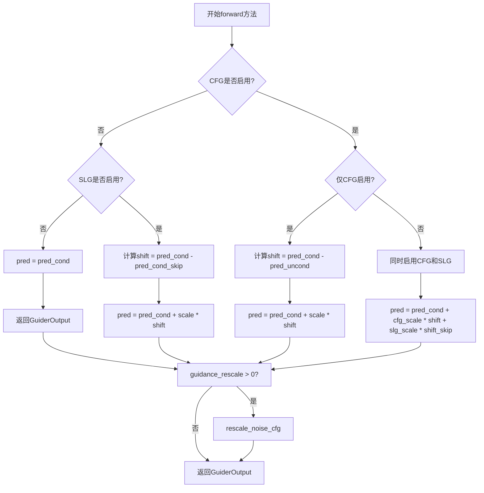

#### 带注释源码

```python
def forward(
    self,
    pred_cond: torch.Tensor,
    pred_uncond: torch.Tensor | None = None,
    pred_cond_skip: torch.Tensor | None = None,
) -> GuiderOutput:
    """
    执行Skip Layer Guidance和Classifier-Free Guidance的前向传播
    
    参数:
        pred_cond: 条件预测结果，基于文本提示等条件
        pred_uncond: 无条件预测结果，不使用文本条件
        pred_cond_skip: 跳过层后的条件预测结果
    
    返回:
        GuiderOutput: 包含最终预测和中间结果的封装对象
    """
    pred = None

    # 情况1: CFG和SLG都未启用，直接返回条件预测
    if not self._is_cfg_enabled() and not self._is_slg_enabled():
        pred = pred_cond
    # 情况2: 仅启用SLG，未启用CFG
    elif not self._is_cfg_enabled():
        shift = pred_cond - pred_cond_skip  # 计算跳过层带来的差异
        pred = pred_cond if self.use_original_formulation else pred_cond_skip
        pred = pred + self.skip_layer_guidance_scale * shift  # 应用SLG缩放
    # 情况3: 仅启用CFG，未启用SLG
    elif not self._is_slg_enabled():
        shift = pred_cond - pred_uncond  # 计算条件与无条件的差异
        pred = pred_cond if self.use_original_formulation else pred_uncond
        pred = pred + self.guidance_scale * shift  # 应用CFG缩放
    # 情况4: 同时启用CFG和SLG
    else:
        shift = pred_cond - pred_uncond  # CFG差异
        shift_skip = pred_cond - pred_cond_skip  # SLG差异
        pred = pred_cond if self.use_original_formulation else pred_uncond
        # 组合CFG和SLG的影响
        pred = pred + self.guidance_scale * shift + self.skip_layer_guidance_scale * shift_skip

    # 如果设置了rescale参数，对预测进行重缩放以改善图像质量
    if self.guidance_rescale > 0.0:
        pred = rescale_noise_cfg(pred, pred_cond, self.guidance_rescale)

    # 返回GuiderOutput封装对象
    return GuiderOutput(pred=pred, pred_cond=pred_cond, pred_uncond=pred_uncond)
```


根据代码分析，`rescale_noise_cfg` 是从 `guider_utils` 模块导入的函数，其定义不在当前文件中。以下是根据代码中的使用方式推断的信息：

### `rescale_noise_cfg`

该函数用于根据给定的重缩放因子调整噪声预测配置，源自论文 "Common Diffusion Noise Schedules and Sample Steps are Flawed" (https://huggingface.co/papers/2305.08891) 中的技术，用于改善图像质量并修复过度曝光问题。

参数：

-  `pred`：`torch.Tensor`，经过引导后的预测结果（即 CFG 预测）
-  `pred_cond`：`torch.Tensor`，条件预测（条件于文本提示的预测）
-  `guidance_rescale`：`float`，重缩放因子，用于调整预测值的动态范围

返回值：`torch.Tensor`，重缩放后的预测结果

#### 流程图

```mermaid
flowchart TD
    A[开始: rescale_noise_cfg] --> B[计算预测的标准差]
    B --> C[计算条件预测的标准差]
    C --> D[计算重缩放比例: std_pred / std_cond]
    D --> E{guidance_rescale 是否大于 0?}
    E -->|否| F[返回原始 pred]
    E -->|是| G[应用重缩放: pred = pred - (1 - guidance_rescale) * (pred - pred_cond) * (1 - 比例)]
    G --> H[返回重缩放后的 pred]
```

#### 带注释源码

```
# 该函数定义在 guider_utils.py 中，此处为基于使用方式推断的源码
def rescale_noise_cfg(
    pred: torch.Tensor,       # 经过 CFG 引导后的预测
    pred_cond: torch.Tensor,  # 条件预测（无条件跳过层的预测）
    guidance_rescale: float   # 重缩放因子
) -> torch.Tensor:
    """
    重缩放噪声预测配置以改善图像质量。
    
    基于 Section 3.4 from Common Diffusion Noise Schedules and Sample Steps are Flawed
    (https://huggingface.co/papers/2305.08891)
    
    原理：防止 CFG 预测的分布方差过大导致采样质量下降。
    通过将预测值向条件预测方向收缩一定比例来实现。
    """
    # 1. 计算预测的标准差
    std_pred = pred.std(dim=None, keepdim=False)
    # 2. 计算条件预测的标准差
    std_cond = pred_cond.std(dim=None, keepdim=False)
    # 3. 计算重缩放比例
    # 如果预测标准差为0，直接返回原始预测
    if std_pred == 0 or std_cond == 0 or not torch.isfinite(std_pred) or not torch.isfinite(std_cond):
        return pred
    
    # 计算重缩放因子
    # 公式: pred = pred - (1 - guidance_rescale) * (pred - pred_cond) * (1 - std_cond / std_pred)
    # 这相当于将预测向条件预测方向移动一定比例
    residual = (pred - pred_cond) * (1 - guidance_rescale) * (1 - std_cond / std_pred)
    pred = pred - residual
    
    return pred
```

> **注意**：由于 `rescale_noise_cfg` 函数的实际定义不在当前代码文件中，以上源码是基于其在 `forward` 方法中的使用方式和扩散模型领域的常见实现推断的。如需获取准确实现，请参考 `guider_utils.py` 模块中的原始定义。


### `LayerSkipConfig`

`LayerSkipConfig` 是从 `..hooks` 模块导入的配置类，用于定义跳层指导（Skip Layer Guidance）的具体层配置。根据代码中的使用方式，它封装了要跳过的层索引及其完全限定名称（FQN）。

参数：

-  `layer`：`int`，要跳过的层索引
-  `fqn`：`str`，层的完全限定名称（Fully Qualified Name），默认为 `"auto"`

返回值：`LayerSkipConfig`，返回配置实例对象

#### 流程图

```mermaid
flowchart TD
    A[创建 LayerSkipConfig] --> B{传入参数类型}
    B -->|单个整数| C[LayerSkipConfig(layer, fqn='auto')]
    B -->|字典| D[LayerSkipConfig.from_dict(dict)]
    B -->|已存在实例| E[直接使用该实例]
    C --> F[存储到 skip_layer_config 列表]
    D --> F
    E --> F
    F --> G[注册到 HookRegistry]
```

#### 带注释源码

```python
# LayerSkipConfig 用于配置 Skip Layer Guidance (SLG) 的层跳过行为
# 以下是 SkipLayerGuidance 类中如何使用 LayerSkipConfig 的示例

# 1. 类型定义（在 __init__ 参数中）
skip_layer_config: LayerSkipConfig | list[LayerSkipConfig] | dict[str, Any] = None

# 2. 从整数列表创建 LayerSkipConfig 实例
if skip_layer_guidance_layers is not None:
    if isinstance(skip_layer_guidance_layers, int):
        skip_layer_guidance_layers = [skip_layer_guidance_layers]
    # 为每个层索引创建 LayerSkipConfig，fqn='auto' 表示自动推断完整名称
    skip_layer_config = [LayerSkipConfig(layer, fqn="auto") for layer in skip_layer_guidance_layers]

# 3. 从字典创建 LayerSkipConfig 实例
if isinstance(skip_layer_config, dict):
    skip_layer_config = LayerSkipConfig.from_dict(skip_layer_config)

# 4. 处理单个或多个 LayerSkipConfig
if isinstance(skip_layer_config, LayerSkipConfig):
    skip_layer_config = [skip_layer_config]

# 5. 从字典列表创建多个 LayerSkipConfig
elif isinstance(next(iter(skip_layer_config), None), dict):
    skip_layer_config = [LayerSkipConfig.from_dict(config) for config in skip_layer_config]

# 6. 创建钩子以应用层跳过
def prepare_models(self, denoiser: torch.nn.Module) -> None:
    self._count_prepared += 1
    if self._is_slg_enabled() and self.is_conditional and self._count_prepared > 1:
        # 为每个 LayerSkipConfig 配置应用层跳过钩子
        for name, config in zip(self._skip_layer_hook_names, self.skip_layer_config):
            _apply_layer_skip_hook(denoiser, config, name=name)
```


根据提供的代码，我注意到 `HookRegistry` 是从 `..hooks` 模块导入的外部类，并非在本文件中定义。但代码中使用了 `HookRegistry.check_if_exists_or_initialize` 方法和返回的 registry 对象的 `remove_hook` 方法。以下是基于代码使用方式的推断：


### `HookRegistry.check_if_exists_or_initialize`

检查或初始化与给定模块关联的 HookRegistry 实例。

参数：

-  `denoiser`：`torch.nn.Module`，需要注册或检查 HookRegistry 的去噪器模块

返回值：`HookRegistry`，与 denoiser 关联的 HookRegistry 实例

#### 流程图

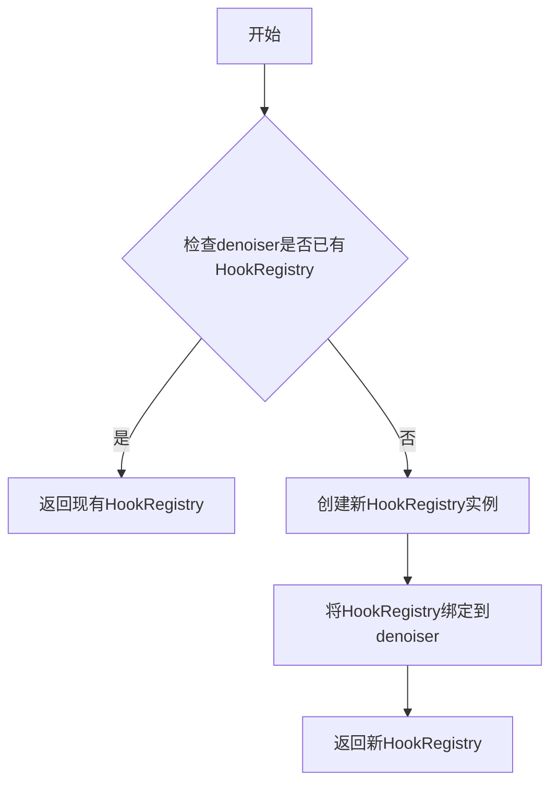

#### 带注释源码

由于 HookRegistry 是从 `..hooks` 模块导入的外部类，以下源码基于代码中的使用方式推断：

```python
# 在 SkipLayerGuidance.cleanup_models 方法中使用
registry = HookRegistry.check_if_exists_or_initialize(denoiser)
# 移除之前注册的钩子
for hook_name in self._skip_layer_hook_names:
    registry.remove_hook(hook_name, recurse=True)
```

---

### `HookRegistry.remove_hook`

从模块中移除指定的钩子。

参数：

-  `hook_name`：`str`，要移除的钩子名称
-  `recurse`：`bool`，是否递归移除子模块中的钩子，默认为 True

返回值：`None`

#### 流程图

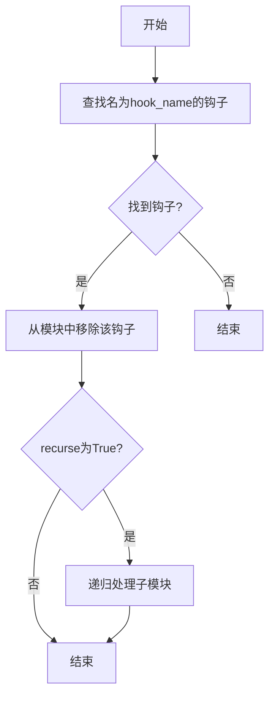

#### 带注释源码

```python
# 在 SkipLayerGuidance.cleanup_models 方法中使用
registry = HookRegistry.check_if_exists_or_initialize(denoiser)
# 遍历要移除的钩子名称列表
for hook_name in self._skip_layer_hook_names:
    # 移除钩子，recurse=True 表示同时移除子模块中的同名钩子
    registry.remove_hook(hook_name, recurse=True)
```

---

**注意**：`HookRegistry` 类的完整定义位于 `..hooks` 模块中（`src/diffusers/hooks.py` 或类似路径），而非本代码文件内。上述信息基于代码使用方式的推断。如需获取 HookRegistry 的完整设计文档，建议查看 `..hooks` 模块的源码。


### `SkipLayerGuidance.__init__`

该方法是SkipLayerGuidance类的构造函数，负责初始化跳层指导（Skip Layer Guidance）的各种参数和配置，包括CFG缩放因子、跳层指导的起止时间、层配置、hook注册等，同时对输入参数进行合法性校验并构建内部配置结构。

参数：

- `guidance_scale`：`float`，默认值`7.5`，分类器自由引导的缩放参数，值越高对文本提示的条件越强
- `skip_layer_guidance_scale`：`float`，默认值`2.8`，跳层指导的缩放参数，影响结构和解剖一致性
- `skip_layer_guidance_start`：`float`，默认值`0.01`，跳层指导开始的去噪步骤比例
- `skip_layer_guidance_stop`：`float`，默认值`0.2`，跳层指导结束的去噪步骤比例
- `skip_layer_guidance_layers`：`int | list[int] | None`，要应用跳层指导的层索引列表
- `skip_layer_config`：`LayerSkipConfig | list[LayerSkipConfig] | dict[str, Any]`，跳层指导的层配置
- `guidance_rescale`：`float`，默认值`0.0`，噪声预测的重缩放因子，用于改善图像质量
- `use_original_formulation`：`bool`，默认值`False`，是否使用原始分类器自由引导公式
- `start`：`float`，默认值`0.0`，指导开始的去噪步骤比例
- `stop`：`float`，默认值`1.0`，指导结束的去噪步骤比例
- `enabled`：`bool`，默认值`True`，是否启用指导

返回值：`None`，无返回值（构造函数）

#### 流程图

```mermaid
flowchart TD
    A[开始 __init__] --> B[调用父类 __init__]
    B --> C[赋值 guidance_scale]
    C --> D[赋值 skip_layer_guidance_scale]
    D --> E[赋值 skip_layer_guidance_start/stop]
    E --> F[赋值 guidance_rescale/use_original_formulation]
    F --> G{验证 start < stop}
    G -->|否| H[抛出 ValueError]
    G -->|是| I{layers 和 config 都为 None}
    I -->|是| J[抛出 ValueError]
    I -->|否| K{layers 和 config 都提供}
    K -->|是| L[抛出 ValueError]
    K -->|否| M{skip_layer_guidance_layers 不为 None}
    M -->|是| N{是单个 int}
    N -->|是| O[转换为 list]
    N -->|否| P{类型是 list}
    P -->|否| Q[抛出 ValueError]
    P -->|是| R[构建 LayerSkipConfig 列表]
    M -->|否| S{skip_layer_config 是 dict}
    S -->|是| T[从 dict 创建 LayerSkipConfig]
    S -->|否| U{是单个 LayerSkipConfig}
    U -->|是| V[转换为 list]
    U -->|否| W{是 list]
    W -->|是| X{元素是 dict}
    X -->|是| Y[从每个 dict 创建 LayerSkipConfig]
    X -->|否| Z[验证元素类型]
    Y --> AA[赋值 skip_layer_config]
    Z --> AA
    V --> AA
    R --> AA
    T --> AA
    AA --> AB[生成 hook 名称列表]
    AB --> AC[结束]
```

#### 带注释源码

```python
@register_to_config
def __init__(
    self,
    guidance_scale: float = 7.5,
    skip_layer_guidance_scale: float = 2.8,
    skip_layer_guidance_start: float = 0.01,
    skip_layer_guidance_stop: float = 0.2,
    skip_layer_guidance_layers: int | list[int] | None = None,
    skip_layer_config: LayerSkipConfig | list[LayerSkipConfig] | dict[str, Any] = None,
    guidance_rescale: float = 0.0,
    use_original_formulation: bool = False,
    start: float = 0.0,
    stop: float = 1.0,
    enabled: bool = True,
):
    # 调用父类 BaseGuidance 的构造函数，初始化基础的开始/停止时间和启用状态
    super().__init__(start, stop, enabled)

    # 赋值分类器自由引导（CFG）的缩放参数
    self.guidance_scale = guidance_scale
    # 赋值跳层指导的缩放参数
    self.skip_layer_guidance_scale = skip_layer_guidance_scale
    # 赋值跳层指导的开始和停止时间点
    self.skip_layer_guidance_start = skip_layer_guidance_start
    self.skip_layer_guidance_stop = skip_layer_guidance_stop
    # 赋值噪声预测的重缩放因子
    self.guidance_rescale = guidance_rescale
    # 赋值是否使用原始CFG公式的标志
    self.use_original_formulation = use_original_formulation

    # 验证 skip_layer_guidance_start 在有效范围内 [0.0, 1.0)
    if not (0.0 <= skip_layer_guidance_start < 1.0):
        raise ValueError(
            f"Expected `skip_layer_guidance_start` to be between 0.0 and 1.0, but got {skip_layer_guidance_start}."
        )
    # 验证 skip_layer_guidance_stop 在有效范围内 [start, 1.0]
    if not (skip_layer_guidance_start <= skip_layer_guidance_stop <= 1.0):
        raise ValueError(
            f"Expected `skip_layer_guidance_stop` to be between 0.0 and 1.0, but got {skip_layer_guidance_stop}."
        )

    # 校验必须提供 skip_layer_guidance_layers 或 skip_layer_config 之一
    if skip_layer_guidance_layers is None and skip_layer_config is None:
        raise ValueError(
            "Either `skip_layer_guidance_layers` or `skip_layer_config` must be provided to enable Skip Layer Guidance."
        )
    # 校验不能同时提供两者
    if skip_layer_guidance_layers is not None and skip_layer_config is not None:
        raise ValueError("Only one of `skip_layer_guidance_layers` or `skip_layer_config` can be provided.")

    # 处理 skip_layer_guidance_layers 参数
    if skip_layer_guidance_layers is not None:
        # 如果是单个整数，转换为列表
        if isinstance(skip_layer_guidance_layers, int):
            skip_layer_guidance_layers = [skip_layer_guidance_layers]
        # 验证类型必须是 int 或 list[int]
        if not isinstance(skip_layer_guidance_layers, list):
            raise ValueError(
                f"Expected `skip_layer_guidance_layers` to be an int or a list of ints, but got {type(skip_layer_guidance_layers)}."
            )
        # 从层索引列表创建 LayerSkipConfig 对象列表
        skip_layer_config = [LayerSkipConfig(layer, fqn="auto") for layer in skip_layer_guidance_layers]

    # 处理 skip_layer_config 参数
    # 如果是字典，转换为 LayerSkipConfig 对象
    if isinstance(skip_layer_config, dict):
        skip_layer_config = LayerSkipConfig.from_dict(skip_layer_config)

    # 如果是单个 LayerSkipConfig，转换为列表
    if isinstance(skip_layer_config, LayerSkipConfig):
        skip_layer_config = [skip_layer_config]

    # 验证最终类型必须是 LayerSkipConfig 或 list[LayerSkipConfig]
    if not isinstance(skip_layer_config, list):
        raise ValueError(
            f"Expected `skip_layer_config` to be a LayerSkipConfig or a list of LayerSkipConfig, but got {type(skip_layer_config)}."
        )
    # 如果列表元素是字典，从每个字典创建 LayerSkipConfig 对象
    elif isinstance(next(iter(skip_layer_config), None), dict):
        skip_layer_config = [LayerSkipConfig.from_dict(config) for config in skip_layer_config]

    # 赋值配置对象列表
    self.skip_layer_config = skip_layer_config
    # 为每个配置生成唯一的 hook 名称
    self._skip_layer_hook_names = [f"SkipLayerGuidance_{i}" for i in range(len(self.skip_layer_config))]
```


### `SkipLayerGuidance.prepare_models`

该方法用于在去噪模型上准备跳层引导（Skip Layer Guidance）所需的模型钩子。它通过增加准备计数器并在满足特定条件时，为去噪器模型注册跳层钩子，以便在后续推理过程中应用跳层指导逻辑。

参数：

- `denoiser`：`torch.nn.Module`，要去噪器模型，跳层引导钩子将应用于该模型上

返回值：`None`，该方法无返回值，仅执行模型钩子注册操作

#### 流程图

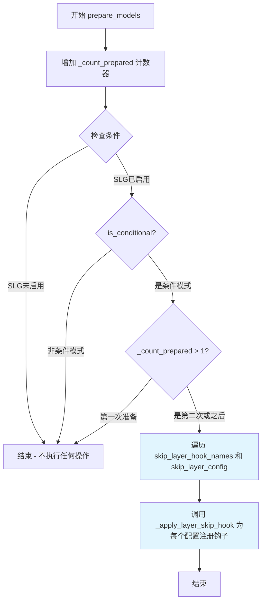

#### 带注释源码

```python
def prepare_models(self, denoiser: torch.nn.Module) -> None:
    """
    在去噪模型上准备跳层引导（Skip Layer Guidance）所需的模型钩子。
    
    该方法在每个去噪步骤中被调用，用于注册或更新跳层引导钩子。
    只有当以下条件全部满足时才会注册钩子：
    1. 跳层引导已启用（SLG enabled）
    2. 处于条件模式（conditional mode）
    3. 不是第一次准备模型（_count_prepared > 1）
    
    第一次准备时不注册钩子，因为此时需要收集条件预测（pred_cond）作为参考。
    从第二次开始才注册钩子以生成跳过层后的预测（pred_cond_skip）。
    
    Args:
        denoiser: 要应用跳层引导钩子的去噪器模型（torch.nn.Module）
    
    Returns:
        None
    """
    # 增加准备计数器，用于跟踪模型准备的次数
    # _count_prepared = 1: 第一次，准备条件预测
    # _count_prepared = 2+: 后续，准备带跳过层的预测
    self._count_prepared += 1
    
    # 检查是否满足注册跳层钩子的条件
    # 条件1: SLG已启用（skip_layer_guidance_scale > 0 且在指定的步数范围内）
    # 条件2: 处于条件模式（需要条件和无条件预测）
    # 条件3: 不是第一次准备（第一次用于收集基准条件预测）
    if self._is_slg_enabled() and self.is_conditional and self._count_prepared > 1:
        # 遍历所有跳层配置，为每个配置在去噪器上注册钩子
        # _skip_layer_hook_names: 钩子名称列表，如 ['SkipLayerGuidance_0', 'SkipLayerGuidance_1', ...]
        # skip_layer_config: LayerSkipConfig 配置列表，指定要跳过的层
        for name, config in zip(self._skip_layer_hook_names, self.skip_layer_config):
            # _apply_layer_skip_hook: 在去噪器的指定层上注册前向传播跳过钩子
            # 参数:
            #   - denoiser: 去噪器模型
            #   - config: LayerSkipConfig，包含要跳过的层信息
            #   - name: 钩子名称，用于后续识别和移除
            _apply_layer_skip_hook(denoiser, config, name=name)
```


### `SkipLayerGuidance.cleanup_models`

该方法用于在推理完成后清理去噪器模型上注册的跳过层引导（Skip Layer Guidance）钩子，确保不会影响后续的推理过程。

参数：

- `denoiser`：`torch.nn.Module`，去噪器模块，是需要移除钩子的目标模型

返回值：`None`，无返回值，用于清理已注册的跳过层引导钩子

#### 流程图

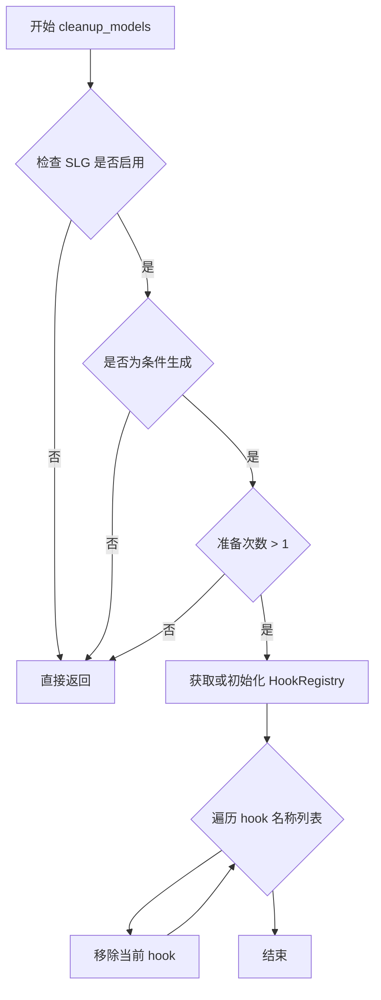

#### 带注释源码

```python
def cleanup_models(self, denoiser: torch.nn.Module) -> None:
    """
    清理去噪器模型上注册的跳过层引导钩子。
    
    此方法在推理完成后调用，用于移除之前在 prepare_models 中注册的钩子。
    只有在 SLG 启用、是条件生成、且已准备多次的情况下才执行清理操作。
    
    参数:
        denoiser: torch.nn.Module，去噪器模块，需要移除钩子的目标模型
    """
    # 检查跳过层引导是否启用、是否为条件生成、以及是否已准备多次
    if self._is_slg_enabled() and self.is_conditional and self._count_prepared > 1:
        # 获取或初始化去噪器的钩子注册表
        registry = HookRegistry.check_if_exists_or_initialize(denoiser)
        # 遍历所有跳过层钩子名称，逐一移除
        for hook_name in self._skip_layer_hook_names:
            registry.remove_hook(hook_name, recurse=True)
```


### `SkipLayerGuidance.prepare_inputs`

该方法根据当前条件数量（num_conditions）和CFG/SLG启用状态，准备不同类型的输入批次。它从数据字典中提取相应的预测结果（条件预测、无条件预测或跳过层预测），并将其转换为适合后续处理的BlockState列表。

参数：

- `data`：`dict[str, tuple[torch.Tensor, torch.Tensor]]`，输入数据字典，键为字符串，值为两个张量组成的元组（通常为正向和反向传播的预测结果）

返回值：`list["BlockState"]`，返回处理后的BlockState对象列表，每个元素对应一种预测类型的批次数据

#### 流程图

```mermaid
flowchart TD
    A[开始 prepare_inputs] --> B{num_conditions == 1?}
    B -->|Yes| C[设置 tuple_indices = [0]<br/>input_predictions = ['pred_cond']"
    B -->|No| D{num_conditions == 2?}
    D -->|Yes| E{CFG是否启用?}
    D -->|No| F[设置 tuple_indices = [0, 1, 0]<br/>input_predictions = ['pred_cond', 'pred_uncond', 'pred_cond_skip']"
    E -->|Yes| G[input_predictions = ['pred_cond', 'pred_uncond']"
    E -->|No| H[input_predictions = ['pred_cond', 'pred_cond_skip']"
    G --> I[创建空列表 data_batches]
    H --> I
    C --> I
    I --> J[遍历 tuple_indices 和 input_predictions]
    J --> K[调用 _prepare_batch<br/>处理每个数据批次]
    K --> L[将结果添加到 data_batches]
    L --> M{遍历完成?}
    M -->|No| J
    M -->|Yes| N[返回 data_batches]
```

#### 带注释源码

```python
def prepare_inputs(self, data: dict[str, tuple[torch.Tensor, torch.Tensor]]) -> list["BlockState"]:
    """
    根据条件数量准备输入批次数据
    
    参数:
        data: 包含预测结果的字典，值为两个张量组成的元组
              第一个元素通常为正向预测，第二个为反向预测
    
    返回:
        BlockState对象列表，每个对应一种预测类型
    """
    # 判断条件数量，确定需要处理的预测类型
    if self.num_conditions == 1:
        # 单条件情况：仅需要条件预测
        tuple_indices = [0]  # 使用第一个元组索引
        input_predictions = ["pred_cond"]  # 预测类型名称
    elif self.num_conditions == 2:
        # 双条件情况：需要条件预测 + 无条件预测 或 条件预测 + 跳过层预测
        tuple_indices = [0, 1]  # 使用前两个元组索引
        input_predictions = (
            ["pred_cond", "pred_uncond"] if self._is_cfg_enabled() else ["pred_cond", "pred_cond_skip"]
        )
    else:
        # 三条件情况：需要条件预测、无条件预测、跳过层预测
        # 注意：tuple_indices中第一个0再次出现，表示pred_cond使用两次
        tuple_indices = [0, 1, 0]
        input_predictions = ["pred_cond", "pred_uncond", "pred_cond_skip"]
    
    # 初始化结果列表
    data_batches = []
    
    # 遍历每种预测类型，调用内部方法准备批次数据
    for tuple_idx, input_prediction in zip(tuple_indices, input_predictions):
        # 调用私有方法处理单个批次
        data_batch = self._prepare_batch(data, tuple_idx, input_prediction)
        # 添加到结果列表
        data_batches.append(data_batch)
    
    # 返回所有处理后的批次数据
    return data_batches
```


### `SkipLayerGuidance.prepare_inputs_from_block_state`

该方法根据当前条件数量（CFG 条件数和 SLG 条件数）从 BlockState 中准备输入批次。它确定要使用的预测类型（条件预测、无条件预测或跳过层预测），并为每种预测类型创建相应的数据批次。

参数：

-  `self`：`SkipLayerGuidance`，SkipLayerGuidance 类实例本身
-  `data`：`BlockState`，包含模型块状态的输入数据对象
-  `input_fields`：`dict[str, str | tuple[str, str]]`，字段映射字典，键为字段名，值为字符串或字符串元组（表示源和目标字段名）

返回值：`list[BlockState]`，返回准备好的 BlockState 批次列表

#### 流程图

```mermaid
flowchart TD
    A[开始] --> B{num_conditions == 1?}
    B -->|Yes| C[设置 tuple_indices = [0]<br/>input_predictions = ['pred_cond']}
    B -->|No| D{num_conditions == 2?}
    D -->|Yes| E{CFG 是否启用?}
    D -->|No| F[设置 tuple_indices = [0, 1, 0]<br/>input_predictions = ['pred_cond', 'pred_uncond', 'pred_cond_skip']}
    E -->|Yes| G[input_predictions = ['pred_cond', 'pred_uncond']]
    E -->|No| H[input_predictions = ['pred_cond', 'pred_cond_skip']]
    C --> I[初始化空列表 data_batches]
    G --> I
    H --> I
    F --> I
    I --> J[遍历 tuple_indices 和 input_predictions]
    J --> K[调用 _prepare_batch_from_block_state<br/>创建 data_batch]
    K --> L[将 data_batch 添加到 data_batches]
    L --> M{还有更多项?}
    M -->|Yes| J
    M -->|No| N[返回 data_batches]
```

#### 带注释源码

```python
def prepare_inputs_from_block_state(
    self, data: "BlockState", input_fields: dict[str, str | tuple[str, str]]
) -> list["BlockState"]:
    """
    从 BlockState 准备输入批次。
    
    根据条件数量确定使用哪些预测类型：
    - 1个条件: 仅条件预测 (pred_cond)
    - 2个条件: 
      - 启用CFG时: 条件预测 + 无条件预测 (pred_cond, pred_uncond)
      - 未启用CFG时: 条件预测 + 跳过层预测 (pred_cond, pred_cond_skip)
    - 3个条件: 条件预测 + 无条件预测 + 跳过层预测 (pred_cond, pred_uncond, pred_cond_skip)
    
    参数:
        data: BlockState 对象，包含模型的块状态数据
        input_fields: 字段映射字典，定义如何从 data 中提取字段
    
    返回:
        BlockState 对象列表，每个对应一个预测类型
    """
    # 根据条件数量确定批次索引和预测类型
    if self.num_conditions == 1:
        # 单条件情况：仅需要条件预测
        tuple_indices = [0]
        input_predictions = ["pred_cond"]
    elif self.num_conditions == 2:
        # 双条件情况：根据CFG是否启用决定预测类型
        tuple_indices = [0, 1]
        input_predictions = (
            ["pred_cond", "pred_uncond"] if self._is_cfg_enabled() else ["pred_cond", "pred_cond_skip"]
        )
    else:
        # 三条件情况：同时使用CFG和SLG
        tuple_indices = [0, 1, 0]
        input_predictions = ["pred_cond", "pred_uncond", "pred_cond_skip"]
    
    # 为每个预测类型创建对应的数据批次
    data_batches = []
    for tuple_idx, input_prediction in zip(tuple_indices, input_predictions):
        # 调用内部方法从BlockState准备批次数据
        data_batch = self._prepare_batch_from_block_state(input_fields, data, tuple_idx, input_prediction)
        data_batches.append(data_batch)
    
    return data_batches
```


### `SkipLayerGuidance.forward`

该方法实现Skip Layer Guidance (SLG)的前向传播逻辑，根据CFG（无分类器引导）和SLG的启用状态，对条件预测、无条件预测和跳过层预测进行加权组合，生成最终的引导输出。

参数：

- `pred_cond`：`torch.Tensor`，条件预测结果，来自带条件的模型前向传播
- `pred_uncond`：`torch.Tensor | None`，无条件预测结果，来自不带条件的模型前向传播（CFG需要）
- `pred_cond_skip`：`torch.Tensor | None`，跳过指定层后的条件预测结果（SLG需要）

返回值：`GuiderOutput`，包含最终预测结果 `pred`、条件预测 `pred_cond` 和无条件预测 `pred_uncond` 的封装对象

#### 流程图

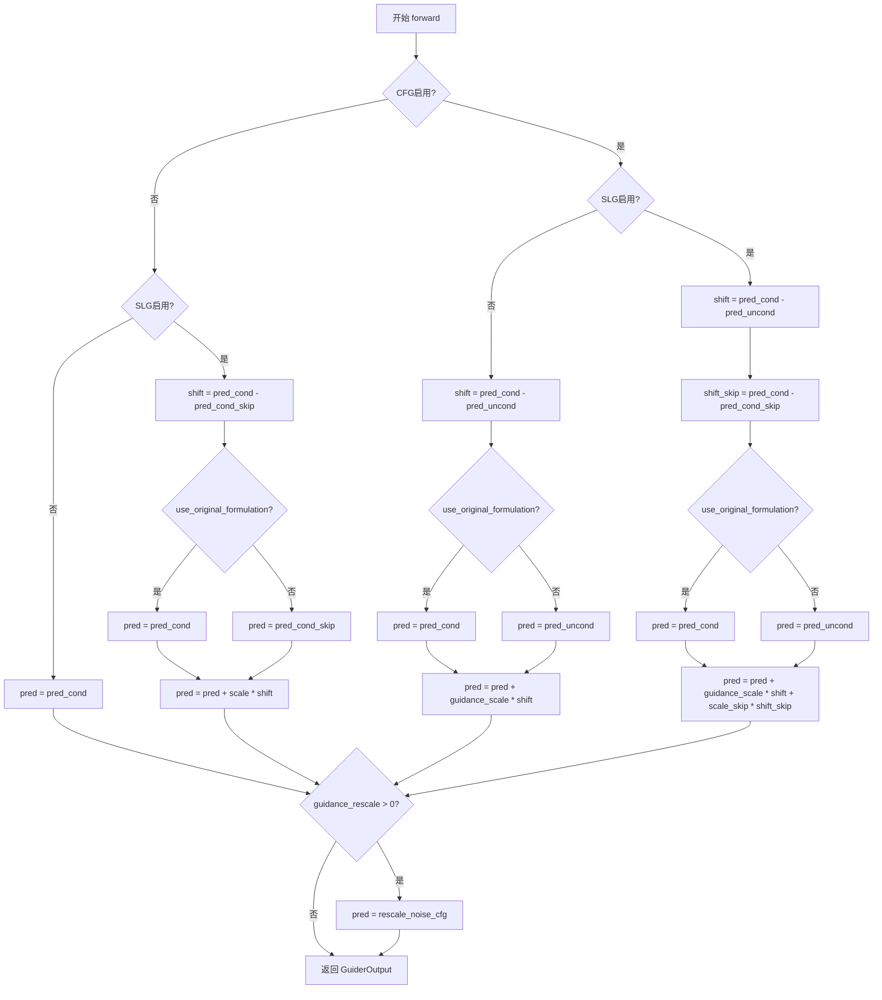

#### 带注释源码

```python
def forward(
    self,
    pred_cond: torch.Tensor,
    pred_uncond: torch.Tensor | None = None,
    pred_cond_skip: torch.Tensor | None = None,
) -> GuiderOutput:
    """
    执行Skip Layer Guidance的前向传播，根据启用状态组合不同的预测结果。
    
    参数:
        pred_cond: 条件预测结果，来自正常的条件前向传播
        pred_uncond: 无条件预测结果，用于CFG计算
        pred_cond_skip: 跳过指定层后的预测结果，用于SLG计算
    
    返回:
        包含最终预测及中间结果的GuiderOutput对象
    """
    # 初始化预测结果为None
    pred = None

    # 情况1: CFG和SLG都未启用，直接返回条件预测
    if not self._is_cfg_enabled() and not self._is_slg_enabled():
        pred = pred_cond
    # 情况2: 仅启用SLG（未启用CFG）
    elif not self._is_cfg_enabled():
        # 计算跳过层带来的差异
        shift = pred_cond - pred_cond_skip
        # 根据use_original_formulation选择基础预测
        pred = pred_cond if self.use_original_formulation else pred_cond_skip
        # 应用SLG缩放系数
        pred = pred + self.skip_layer_guidance_scale * shift
    # 条件3: 仅启用CFG（未启用SLG）
    elif not self._is_slg_enabled():
        # 计算CFG的差异
        shift = pred_cond - pred_uncond
        # 根据use_original_formulation选择基础预测
        pred = pred_cond if self.use_original_formulation else pred_uncond
        # 应用CFG缩放系数
        pred = pred + self.guidance_scale * shift
    # 情况4: CFG和SLG都启用
    else:
        # 计算两种差异
        shift = pred_cond - pred_uncond
        shift_skip = pred_cond - pred_cond_skip
        # 根据use_original_formulation选择基础预测
        pred = pred_cond if self.use_original_formulation else pred_uncond
        # 组合应用两个缩放系数
        pred = pred + self.guidance_scale * shift + self.skip_layer_guidance_scale * shift_skip

    # 如果设置了guidance_rescale，对预测进行重缩放以改善图像质量
    if self.guidance_rescale > 0.0:
        pred = rescale_noise_cfg(pred, pred_cond, self.guidance_rescale)

    # 返回包含所有预测结果的GuiderOutput封装对象
    return GuiderOutput(pred=pred, pred_cond=pred_cond, pred_uncond=pred_uncond)
```


### `SkipLayerGuidance.is_conditional`

该属性方法用于判断当前去噪步骤是否需要使用条件预测（conditional prediction）。它基于 `prepare_models` 方法被调用的次数（`_count_prepared`）来决定是否返回 True：当准备好了单个条件预测（_count_prepared == 1）时返回 True，当同时准备好条件、无条件和跳过层的预测（_count_prepared == 3）时也返回 True，其他情况返回 False。

参数：无显式参数（隐式参数 `self` 为类的实例）

返回值：`bool`，返回是否应该使用条件预测

#### 流程图

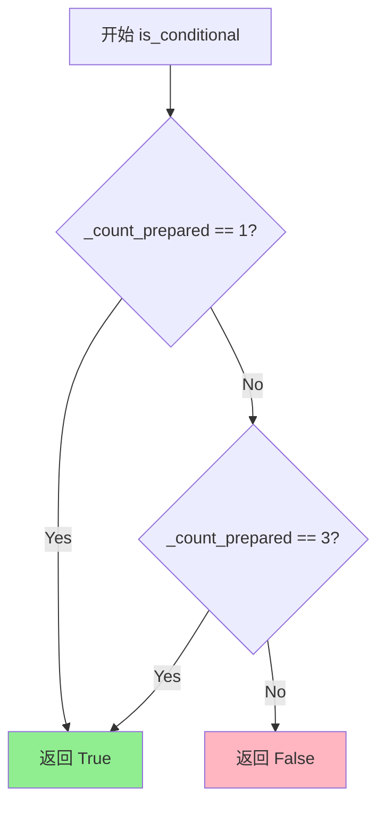

#### 带注释源码

```python
@property
def is_conditional(self) -> bool:
    """
    判断当前去噪步骤是否需要使用条件预测。
    
    该属性基于 _count_prepared 计数器来决定是否返回 True：
    - 当 _count_prepared == 1 时：仅准备好了条件预测（单条件模式）
    - 当 _count_prepared == 3 时：同时准备好了条件、无条件和跳过层预测（多条件模式）
    - 其他情况返回 False，表示当前不需要条件预测
    
    Returns:
        bool: 是否应该使用条件预测
    """
    return self._count_prepared == 1 or self._count_prepared == 3
```


### `SkipLayerGuidance.num_conditions`

该属性方法用于计算当前配置下条件的数量。它根据 CFG（无分类器引导）和 SLG（跳过层引导）是否启用来返回 1、2 或 3 个条件。

参数： 无

返回值：`int`，返回条件的数量（1、2 或 3）

#### 流程图

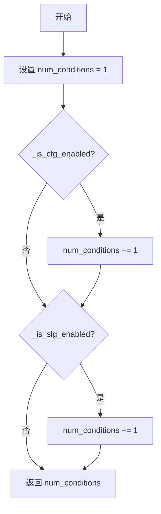

#### 带注释源码

```python
@property
def num_conditions(self) -> int:
    """
    计算并返回当前配置下条件的数量。
    
    该属性根据以下两个因素确定条件数量：
    1. CFG（无分类器引导）是否启用
    2. SLG（跳过层引导）是否启用
    
    返回值：
        - 1: 仅条件预测（条件引导禁用）
        - 2: 条件预测 + 无条件预测（仅启用 CFG 或仅启用 SLG）
        - 3: 条件预测 + 无条件预测 + 跳过层预测（同时启用 CFG 和 SLG）
    """
    # 初始化基础条件数量为 1（总是有条件预测）
    num_conditions = 1
    
    # 如果 CFG 启用，条件数量加 1
    if self._is_cfg_enabled():
        num_conditions += 1
    
    # 如果 SLG 启用，条件数量再加 1
    if self._is_slg_enabled():
        num_conditions += 1
    
    # 返回最终的条件数量
    return num_conditions
```


### `SkipLayerGuidance._is_cfg_enabled`

该方法用于判断当前是否启用无分类器引导（Classifier-Free Guidance，CFG）。它通过检查引导是否启用、当前推理步骤是否在配置的起止范围内，以及引导比例是否接近阈值（原始公式为0.0，diffusers实现为1.0）来确定CFG是否处于活动状态。

参数：无（仅包含隐式参数 `self`）

返回值：`bool`，返回 `True` 表示CFG已启用，返回 `False` 表示未启用

#### 流程图

```mermaid
flowchart TD
    A[开始 _is_cfg_enabled] --> B{self._enabled 是否为 False}
    B -->|是| C[返回 False]
    B -->|否| D{self._num_inference_steps 是否为 None}
    D -->|是| E[is_within_range = True]
    D -->|否| F[计算 skip_start_step = int(self._start * self._num_inference_steps)]
    F --> G[计算 skip_stop_step = int(self._stop * self._num_inference_steps)]
    G --> H[判断 skip_start_step <= self._step < skip_stop_step]
    H -->|是| E
    H -->|否| I[is_within_range = False]
    E --> J{self.use_original_formulation}
    I --> J
    J -->|是| K{math.isclose guidance_scale 0.0}
    J -->|否| L{math.isclose guidance_scale 1.0}
    K -->|是| M[is_close = True]
    K -->|否| N[is_close = False]
    L -->|是| M
    L -->|否| N
    M --> O[返回 is_within_range and not is_close]
    N --> O
```

#### 带注释源码

```python
def _is_cfg_enabled(self) -> bool:
    """
    判断当前是否启用无分类器引导（Classifier-Free Guidance, CFG）。
    
    CFG启用的条件：
    1. 引导已启用（self._enabled 为 True）
    2. 当前推理步骤在配置的起止范围内（start <= step < stop）
    3. 引导比例不接近阈值：
       - 使用原始公式时：guidance_scale 不接近 0.0
       - 使用diffusers实现时：guidance_scale 不接近 1.0
    
    Returns:
        bool: 如果CFG启用返回True，否则返回False
    """
    # 检查引导是否启用（基类属性，通过enabled参数控制）
    if not self._enabled:
        return False

    # 初始化步骤范围标志为True
    is_within_range = True
    # 如果配置了推理步骤数，则检查当前步骤是否在范围内
    if self._num_inference_steps is not None:
        # 计算启用CFG的起始步骤（基于总步数的百分比）
        skip_start_step = int(self._start * self._num_inference_steps)
        # 计算停止CFG的步骤（基于总步数的百分比）
        skip_stop_step = int(self._stop * self._num_inference_steps)
        # 判断当前步骤是否在 [start, stop) 区间内
        is_within_range = skip_start_step <= self._step < skip_stop_step

    # 初始化阈值接近标志为False
    is_close = False
    if self.use_original_formulation:
        # 原始CFG论文公式：当guidance_scale接近0时，等同于不使用CFG
        is_close = math.isclose(self.guidance_scale, 0.0)
    else:
        # diffusers默认实现：当guidance_scale接近1时，等同于不使用CFG
        # 这是因为 CFG公式: pred_uncond + scale * (pred_cond - pred_uncond)
        # 当scale=1时，结果就是pred_cond
        is_close = math.isclose(self.guidance_scale, 1.0)

    # 只有同时满足：在步骤范围内 且 引导比例不在阈值附近时，CFG才真正启用
    return is_within_range and not is_close
```


### `SkipLayerGuidance._is_slg_enabled`

该方法用于判断 Skip Layer Guidance（SLG）功能是否在当前推理步骤中启用。它通过检查引导是否启用、当前推理步骤是否在配置的起始和停止范围内，以及 `skip_layer_guidance_scale` 是否非零来确定是否应启用 SLG。

参数：无（仅包含隐式参数 `self`）

返回值：`bool`，表示在当前推理步骤中 Skip Layer Guidance 是否启用

#### 流程图

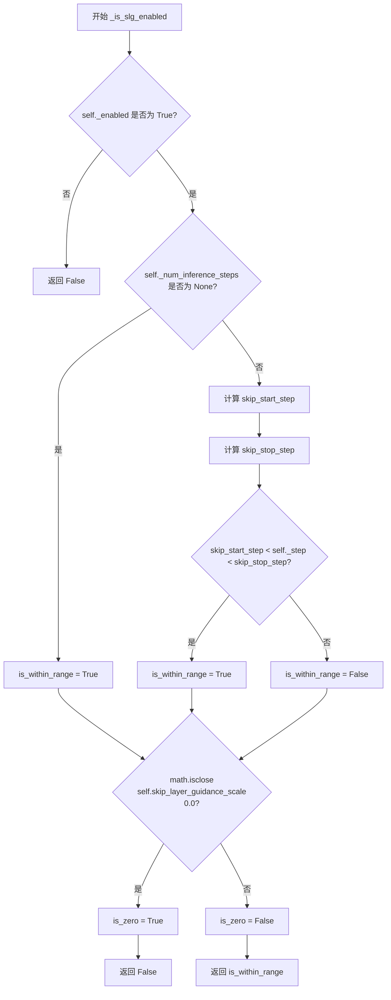

#### 带注释源码

```python
def _is_slg_enabled(self) -> bool:
    """
    判断 Skip Layer Guidance (SLG) 在当前推理步骤是否启用。
    
    SLG 启用的条件：
    1. 引导功能已启用（_enabled 为 True）
    2. 当前推理步骤在 skip_layer_guidance_start 和 skip_layer_guidance_stop 定义的范围内
    3. skip_layer_guidance_scale 不为零（即非零缩放因子）
    """
    
    # 步骤 1：检查引导功能是否全局启用
    if not self._enabled:
        return False  # 如果引导被禁用，直接返回 False

    # 步骤 2：检查当前推理步骤是否在 SLG 应用的范围内
    is_within_range = True
    if self._num_inference_steps is not None:
        # 将起始/停止的相对比例转换为绝对步骤数
        skip_start_step = int(self.skip_layer_guidance_start * self._num_inference_steps)
        skip_stop_step = int(self.skip_layer_guidance_stop * self._num_inference_steps)
        # 检查当前步骤是否在开区间 (start, stop) 范围内
        is_within_range = skip_start_step < self._step < skip_stop_step

    # 步骤 3：检查 skip_layer_guidance_scale 是否为零
    # 使用 math.isclose 进行浮点数比较，避免精度问题
    is_zero = math.isclose(self.skip_layer_guidance_scale, 0.0)

    # 只有当步骤在范围内且 scale 不为零时才返回 True
    return is_within_range and not is_zero
```

## 关键组件


### SkipLayerGuidance 类

SkipLayerGuidance 是一个扩散模型的引导策略类，实现了 Skip Layer Guidance (SLG) 和 Spatio-Temporal Guidance (STG) 两种技术，用于通过跳过指定 Transformer 块的前向传递来改善生成图像的结构和解剖学一致性。

### 配置参数 (类字段)

包含多个配置字段：guidance_scale（无分类器引导尺度）、skip_layer_guidance_scale（跳过层引导尺度）、skip_layer_guidance_start 和 skip_layer_guidance_stop（引导的起止时间步）、skip_layer_guidance_layers（要跳过的层索引列表）、skip_layer_config（LayerSkipConfig 配置对象）、guidance_rescale（噪声预测重缩放因子）等，用于控制引导行为的各个方面。

### prepare_models 方法

准备模型的方法，接收 denoiser 参数，通过调用 _apply_layer_skip_hook 为指定的跳过层配置注册钩子，使得在后续推理过程中能够跳过指定层的前向传播。

### cleanup_models 方法

清理模型的方法，接收 denoiser 参数，在推理完成后移除之前注册的跳过层钩子，释放资源并恢复模型原始状态。

### prepare_inputs 方法

准备输入数据的方法，接收 data 字典参数，根据 num_conditions 和 CFG/SLG 启用状态，将输入数据组织为包含 pred_cond、pred_uncond、pred_cond_skip 等预测张量的批次列表。

### forward 方法

前向推理的核心方法，接收 pred_cond、pred_uncond、pred_cond_skip 三个张量参数，根据 CFG 和 SLG 的启用状态计算最终的引导输出，支持多种组合模式：仅条件预测、仅 SLG、仅 CFG、以及 CFG+SLG 联合模式，并可选地应用 guidance_rescale 进行噪声预测重缩放。

### _is_cfg_enabled 方法

检查无分类器引导（CFG）是否启用的内部方法，通过判断当前推理步骤是否在配置的起止时间步范围内，以及 guidance_scale 是否接近 0 或 1 来确定。

### _is_slg_enabled 方法

检查跳过层引导（SLG）是否启用的内部方法，通过判断当前推理步骤是否在 skip_layer_guidance_start 和 skip_layer_guidance_stop 范围内，以及 skip_layer_guidance_scale 是否接近 0 来确定。

### BaseGuidance 基类继承

继承自 BaseGuidance 基类，提供了 start、stop、enabled 等基础属性以及 _prepare_batch、_prepare_batch_from_block_state 等辅助方法，用于管理引导的通用生命周期和输入处理逻辑。

### HookRegistry 与 LayerSkipConfig

利用 HookRegistry 管理系统钩子的注册和移除，使用 LayerSkipConfig 配置类定义单个跳过层的具体参数（如层索引和完全限定名称），实现细粒度的层跳过控制。

### GuiderOutput 返回类型

forward 方法返回 GuiderOutput 类型，包含 pred（最终预测）、pred_cond（条件预测）、pred_uncond（无条件预测）等字段，用于封装引导后的输出结果。


## 问题及建议


### 已知问题

- **魔法数字与脆弱的条件逻辑**：`is_conditional` 属性中硬编码了 `_count_prepared == 1 or self._count_prepared == 3`，这种设计依赖于特定的调用顺序，代码可读性差且难以维护
- **重复代码**：`prepare_inputs` 和 `prepare_inputs_from_block_state` 方法中的条件分支逻辑几乎完全重复；`_is_cfg_enabled()` 和 `_is_slg_enabled()` 方法结构相似但未提取公共逻辑
- **参数验证不完整**：仅验证了 `skip_layer_guidance_start/stop` 的范围，但未对 `guidance_scale`、`skip_layer_guidance_scale` 等关键参数做正数校验，也未处理 `skip_layer_config` 为空列表的边界情况
- **hook 管理逻辑复杂且脆弱**：依赖 `_count_prepared` 计数器来判断是否注册/移除 hook，逻辑分散在 `prepare_models` 和 `cleanup_models` 中，容易出错
- **forward 方法分支嵌套深**：包含 4 个主要条件分支的嵌套逻辑，可读性和可维护性较差
- **缺少对外部依赖的类型校验**：未对传入的 `denoiser` 参数做类型验证，也未处理 `LayerSkipConfig.from_dict` 可能抛出的异常

### 优化建议

- 将 `_count_prepared` 的判断逻辑抽象为更清晰的枚举或状态机，并用常量替代魔法数字
- 提取 `prepare_inputs` 和 `prepare_inputs_from_block_state` 中的公共逻辑为私有辅助方法；将 `_is_cfg_enabled()` 和 `_is_slg_enabled()` 的公共比较逻辑提取为基类方法
- 增强参数校验：添加 `guidance_scale > 0`、`skip_layer_guidance_scale >= 0`、`skip_layer_config` 非空等校验，并提供有意义的错误信息
- 重构 forward 方法：使用策略模式或提前返回来减少嵌套层级，使不同引导模式的计算逻辑更清晰
- 考虑添加缓存机制：对于不经常变化的配置（如 `_is_cfg_enabled()` 的计算结果），可在属性中缓存以避免重复计算
- 补充边界情况处理：处理 `skip_layer_config` 为空列表、Hook 注册失败等异常情况

## 其它


### 设计目标与约束

设计目标：实现Skip Layer Guidance (SLG)和Spatio-Temporal Guidance (STG)技术，通过在去噪过程中跳过指定transformer块的前向传播，改善生成图像的结构和解剖学一致性。约束：依赖于BaseGuidance基类，需要与ClassifierFreeGuidance配合使用，仅在条件扩散模型中生效。

### 错误处理与异常设计

代码包含以下异常处理：1) skip_layer_guidance_start和skip_layer_guidance_stop的范围验证（0.0-1.0且start≤stop）；2) skip_layer_guidance_layers和skip_layer_config的互斥验证；3) skip_layer_guidance_layers类型验证（int或list[int]）；4) skip_layer_config类型验证（LayerSkipConfig、list或dict）。异常通过ValueError抛出，提供明确的错误信息。

### 数据流与状态机

数据流：prepare_inputs方法将输入数据按条件数（1/2/3）分解为不同批次→forward方法接收pred_cond、pred_uncond、pred_cond_skip三个预测→根据CFG和SLG启用状态计算最终预测→返回GuiderOutput。状态机通过_is_cfg_enabled()和_is_slg_enabled()方法控制引导逻辑，根据denoising步骤数判断是否在有效范围内。

### 外部依赖与接口契约

依赖：torch、math、TYPE_CHECKING相关类型、configuration_utils的register_to_config装饰器、hooks模块的HookRegistry和LayerSkipConfig、guider_utils模块的BaseGuidance、GuiderOutput和rescale_noise_cfg。接口契约：prepare_models(denoiser)注册层跳过钩子、cleanup_models(denoiser)移除钩子、prepare_inputs/data和forward方法需返回/接受特定格式的Tensor数据。

### 配置参数说明

guidance_scale：CFG缩放参数，默认7.5；skip_layer_guidance_scale：SLG缩放参数，默认2.8；skip_layer_guidance_start/stop：SLG生效的denoising步骤范围（0.01-0.2）；skip_layer_guidance_layers：需跳过的层索引；guidance_rescale：噪声预测重缩放因子；use_original_formulation：是否使用原始CFG公式；start/stop：整体引导生效范围；enabled：是否启用引导。

### 性能考虑

SLG通过跳过部分transformer块的前向传播减少计算量，但需要额外的条件预测批次。当skip_layer_guidance_scale接近0或步骤超出范围时，SLG自动禁用以避免不必要的计算。prepare_models中仅在_count_prepared>1时注册钩子，避免重复初始化。

### 使用示例

```python
from diffusers import StableDiffusion3Pipeline
from diffusers.guiders import SkipLayerGuidance

config = SkipLayerGuidance(
    guidance_scale=7.5,
    skip_layer_guidance_scale=2.8,
    skip_layer_guidance_layers=[7, 8, 9]
)
pipeline = StableDiffusion3Pipeline.from_pretrained("stabilityai/stable-diffusion-3.5-medium")
pipeline.guider = config
```

### 版本历史与参考文献

版本：基于HuggingFace Diffusers框架。参考文献：1) SLG原始论文（StabilityAI）；2) STG论文（2411.18664）；3) Common Diffusion Noise Schedules and Sample Steps are Flawed（2305.08891）；4) Guiding a Diffusion Model with a Bad Version of Itself（2406.02507）。

### 测试策略

应包含：1) 参数范围验证测试；2) 互斥参数测试；3) 不同条件数（1/2/3）下的prepare_inputs输出验证；4) forward方法在CFG/SLG启用/禁用组合下的输出正确性；5) is_conditional和num_conditions属性测试；6) 集成测试验证与BaseGuidance基类的兼容性。

    