# `diffusers\src\diffusers\guiders\smoothed_energy_guidance.py` 详细设计文档

实现平滑能量指导（Smoothed Energy Guidance, SEG）的类，用于扩散模型图像生成过程中，通过调整注意力权重的模糊程度来改善图像的结构和纹理一致性，支持与Classifier-Free Guidance结合使用。

## 整体流程

```mermaid
graph TD
A[初始化SmoothedEnergyGuidance] --> B{验证参数有效性}
B --> C[创建seg_guidance_config列表]
C --> D[注册hook名称列表]
E[prepare_models] --> F{SEG启用且有条件?}
F -->|是| G[为每个config应用smoothed_energy_guidance_hook]
F -->|否| H[跳过]
I[prepare_inputs] --> J{条件数量}
J -->|1个| K[tuple_indices=[0], input_predictions=['pred_cond']]
J -->|2个| L{CFG启用?}
L -->|是| M[tuple_indices=[0,1], input_predictions=['pred_cond','pred_uncond']]
L -->|否| N[tuple_indices=[0,1], input_predictions=['pred_cond','pred_cond_seg']]
J -->|3个| O[tuple_indices=[0,1,0], input_predictions=['pred_cond','pred_uncond','pred_cond_seg']]
P[forward] --> Q{CFG启用?}
Q -->|否| R{SEG启用?}
R -->|否| S[pred = pred_cond]
R -->|是| T[计算shift = pred_cond - pred_cond_seg]
T --> U[pred = pred + seg_guidance_scale * shift]
Q -->|是| V{SEG启用?}
V -->|否| W[计算shift = pred_cond - pred_uncond]
W --> X[pred = pred + guidance_scale * shift]
V -->|是| Y[计算shift和shift_seg]
Y --> Z[pred = pred + guidance_scale*shift + seg_guidance_scale*shift_seg]
Z --> AA{guidance_rescale>0?}
AA -->|是| AB[rescale_noise_cfg]
AA -->|否| AC[返回GuiderOutput]
AD[_is_cfg_enabled] --> AE{_enabled?}
AE -->|否| AF[返回False]
AE -->|是| AG{在step范围内?}
AG -->|否| AH[返回False]
AG -->|是| AI{use_original_formulation?}
AI -->|是| AJ[guidance_scale接近0.0?]
AI -->|否| AK[guidance_scale接近1.0?]
AJ --> AL[返回is_within_range and not is_close]
AK --> AM[返回is_within_range and not is_close]
AN[_is_seg_enabled] --> AO{_enabled?}
AO -->|否| AP[返回False]
AO -->|是| AQ{在step范围内?}
AQ -->|否| AR[返回False]
AQ -->|是| AS{seg_guidance_scale接近0.0?]
AS --> AT[返回is_within_range and not is_zero]
```

## 类结构

```
BaseGuidance (抽象基类)
└── SmoothedEnergyGuidance (平滑能量指导实现)
```

## 全局变量及字段


### `SmoothedEnergyGuidance.guidance_scale`
    
Classifier-free guidance缩放参数，用于控制文本提示的条件强度

类型：`float`
    


### `SmoothedEnergyGuidance.seg_guidance_scale`
    
平滑能量指导缩放参数，用于控制SEG对图像结构一致性的影响程度

类型：`float`
    


### `SmoothedEnergyGuidance.seg_blur_sigma`
    
注意力权重的模糊程度参数，用于控制能量引导的平滑效果

类型：`float`
    


### `SmoothedEnergyGuidance.seg_blur_threshold_inf`
    
模糊被视为无限大的阈值，用于判断是否应用均匀查询

类型：`float`
    


### `SmoothedEnergyGuidance.seg_guidance_start`
    
平滑能量指导开始应用的步数比例

类型：`float`
    


### `SmoothedEnergyGuidance.seg_guidance_stop`
    
平滑能量指导停止应用的步数比例

类型：`float`
    


### `SmoothedEnergyGuidance.guidance_rescale`
    
噪声预测的重缩放因子，用于改善图像质量并修复过度曝光

类型：`float`
    


### `SmoothedEnergyGuidance.use_original_formulation`
    
是否使用原始的classifier-free guidance公式

类型：`bool`
    


### `SmoothedEnergyGuidance.seg_guidance_config`
    
平滑能量指导层的配置列表

类型：`list[SmoothedEnergyGuidanceConfig]`
    


### `SmoothedEnergyGuidance._seg_layer_hook_names`
    
平滑能量指导层钩子名称列表

类型：`list[str]`
    


### `SmoothedEnergyGuidance._input_predictions`
    
输入预测标签列表（类属性），包括pred_cond、pred_uncond、pred_cond_seg

类型：`list[str]`
    


### `SmoothedEnergyGuidance._enabled`
    
是否启用指导功能（继承自BaseGuidance）

类型：`bool`
    


### `SmoothedEnergyGuidance._start`
    
指导开始应用的步数比例（继承自BaseGuidance）

类型：`float`
    


### `SmoothedEnergyGuidance._stop`
    
指导停止应用的步数比例（继承自BaseGuidance）

类型：`float`
    


### `SmoothedEnergyGuidance._num_inference_steps`
    
总推理步数（继承自BaseGuidance）

类型：`int`
    


### `SmoothedEnergyGuidance._step`
    
当前推理步数（继承自BaseGuidance）

类型：`int`
    


### `SmoothedEnergyGuidance._count_prepared`
    
已准备模型的计数（继承自BaseGuidance）

类型：`int`
    
    

## 全局函数及方法


### `SmoothedEnergyGuidanceConfig`

SmoothedEnergyGuidanceConfig 是一个配置类，用于存储平滑能量引导（SEG）层的参数配置。它封装了层的索引和完全限定名称（FQN），并提供了从字典创建配置实例的便捷方法。

参数：

- 无直接参数（构造函数通过关键字参数接收）
- 典型使用参数：
  - `layer`：`int`，要应用平滑能量引导的层索引
  - `fqn`：`str`，模块的完全限定名称（通常设为 "auto" 自动推断）

返回值：`SmoothedEnergyGuidanceConfig`，返回配置对象实例

#### 流程图

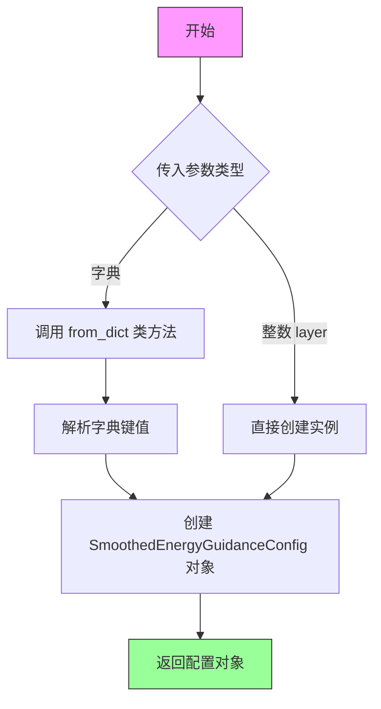

#### 带注释源码

```python
# SmoothedEnergyGuidanceConfig 类的使用示例和推断定义
# （该类定义在 ..hooks.smoothed_energy_guidance_utils 模块中，此处基于代码使用方式推断）

# 在 SmoothedEnergyGuidance 类中的使用方式 1：通过 layer 索引创建
# seg_guidance_layers = [7, 8, 9]
# seg_guidance_config = [SmoothedEnergyGuidanceConfig(layer, fqn="auto") for layer in seg_guidance_layers]
# 等价于：
# seg_guidance_config = [SmoothedEnergyGuidanceConfig(layer=7, fqn="auto"), ...]

# 在 SmoothedEnergyGuidance 类中的使用方式 2：从字典创建
# if isinstance(seg_guidance_config, dict):
#     seg_guidance_config = SmoothedEnergyGuidanceConfig.from_dict(seg_guidance_config)

# 在 SmoothedEnergyGuidance 类中的使用方式 3：从字典列表创建
# seg_guidance_config = [SmoothedEnergyGuidanceConfig.from_dict(config) for config in seg_guidance_config]

# 配置对象的典型结构（基于使用方式推断）
class SmoothedEnergyGuidanceConfig:
    """
    平滑能量引导层配置类
    
    用于存储 SEG 层的索引和模块完全限定名称（FQN），使框架能够
    在推理时定位并应用相应的平滑能量引导钩子到正确的层。
    
    Attributes:
        layer: 层索引，指定在 UNet/Transformer 模型的哪一层应用 SEG
        fqn: 完全限定名称，用于唯一标识模块路径，"auto" 表示自动推断
    """
    
    def __init__(self, layer: int, fqn: str = "auto"):
        """
        初始化 SEG 引导配置
        
        Args:
            layer: 要应用平滑能量引导的层索引
            fqn: 模块的完全限定名称，默认 "auto" 自动推断
        """
        self.layer = layer
        self.fqn = fqn
    
    @classmethod
    def from_dict(cls, config_dict: dict) -> "SmoothedEnergyGuidanceConfig":
        """
        从字典创建配置实例
        
        Args:
            config_dict: 包含 layer 和可选 fqn 的字典
            
        Returns:
            SmoothedEnergyGuidanceConfig 实例
        """
        layer = config_dict.get("layer")
        fqn = config_dict.get("fqn", "auto")
        return cls(layer=layer, fqn=fqn)
    
    def to_dict(self) -> dict:
        """将配置转换为字典"""
        return {"layer": self.layer, "fqn": self.fqn}
```


由于`_apply_smoothed_energy_guidance_hook`函数定义在`..hooks.smoothed_energy_guidance_utils`模块中，该模块的代码未在用户提供的代码段中展示，因此我无法直接获取该函数的实际源码。然而，我可以基于函数被调用的上下文、函数名称以及相关类型注解来推断其功能、参数和返回值，并提供详细的文档。

以下是基于现有信息的详细分析文档。

### `_apply_smoothed_energy_guidance_hook`

这是一个全局函数，用于在去噪模型（Denoiser）上注册平滑能量引导（Smoothed Energy Guidance, SEG）的Hook。该函数通常通过`HookRegistry`将SEG逻辑注入到模型的特定层中，以在推理过程中动态修改模型的注意力权重或执行其他平滑操作，从而实现对生成图像结构的引导。

#### 参数

- `denoiser`：`torch.nn.Module`，去噪模型实例，SEG Hook将被注册到该模型上。
- `config`：`SmoothedEnergyGuidanceConfig`，包含SEG层的配置信息，如目标层的索引、层名称等。
- `seg_blur_sigma`：`float`，模糊参数，用于控制注意力权重的平滑程度。该值被传递给Hook内部的平滑逻辑。
- `name`：`str`，Hook的名称，用于后续在`HookRegistry`中标识和管理该Hook。

#### 返回值

通常为`None`（根据`HookRegistry`的`register_hook`或类似方法的常见行为推断），但也可能返回被注册的Hook对象，具体取决于`HookRegistry`的实现。该函数的主要作用是副作用（将Hook注册到模型上）。

#### 流程图（推测）

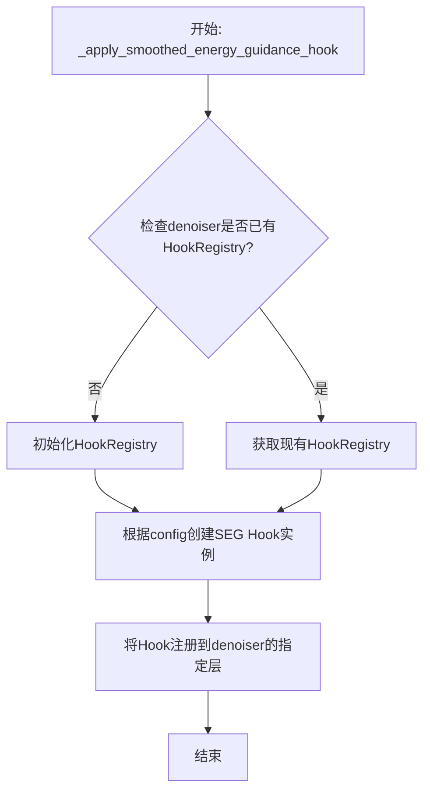

#### 带注释源码（推测）

由于无法访问实际源码，以下是推测的实现逻辑和调用关系：

```python
# 推测的函数签名和实现逻辑
def _apply_smoothed_energy_guidance_hook(
    denoiser: torch.nn.Module,
    config: SmoothedEnergyGuidanceConfig,
    seg_blur_sigma: float,
    name: str = "smoothed_energy_guidance_hook"
) -> None:
    """
    在去噪模型上应用平滑能量引导Hook。
    
    该函数首先检查或初始化HookRegistry，然后将SEG逻辑封装为一个Hook，
    并将其注册到denoiser的指定层。Hook内部会使用seg_blur_sigma对注意力
    权重进行平滑处理，以引导生成过程。
    
    参数:
        denoiser: 目标去噪模型。
        config: 包含层索引等信息的配置对象。
        seg_blur_sigma: 模糊参数，控制平滑强度。
        name: Hook的唯一标识名称。
    """
    # 1. 获取或初始化HookRegistry
    registry = HookRegistry.check_if_exists_or_initialize(denoiser)
    
    # 2. 创建Hook实例（推测内部逻辑）
    # 内部可能包含类似以下逻辑：
    # hook = SmoothedEnergyGuidanceHook(config=config, blur_sigma=seg_blur_sigma)
    
    # 3. 注册Hook到模型
    # registry.register_hook(denoiser, hook, name=name)
    pass
```

#### 关键组件信息

- **HookRegistry**：用于管理模型上所有Hook的注册、存储和移除。
- **SmoothedEnergyGuidanceConfig**：配置类，存储SEG层的具体参数（如层索引）。
- **SmoothedEnergyGuidance**：调用该函数的外部类，负责协调整个SEG流程。

#### 潜在的技术债务或优化空间

- **缺乏源码访问**：当前无法直接查看该函数的实现，建议补充源码以进行更精确的分析。
- **Hook管理复杂性**：该函数依赖于`HookRegistry`，如果Hook注册逻辑复杂，可能增加调试难度。建议确保Hook的幂等性和清理逻辑的正确性。

#### 其他说明

- 该函数仅在`SmoothedEnergyGuidance.prepare_models`中被调用，且仅在SEG启用且模型已准备（`_count_prepared > 1`）时执行。
- 它与`cleanup_models`方法配对使用，以确保Hook在推理结束后被正确移除，防止内存泄漏或意外修改。


# BaseGuidance 类详细设计文档

## 1. 简述

`BaseGuidance` 是扩散模型引导推理的抽象基类，定义了条件引导（如 Classifier-Free Guidance）的一致接口和通用逻辑，子类通过继承该类实现特定的引导策略。

## 2. 文件整体运行流程

由于 `BaseGuidance` 是抽象基类，其本身不直接运行。它的流程由子类（如 `SmoothedEnergyGuidance`）在扩散模型推理过程中调用：
1. **初始化阶段** (`__init__`)：配置引导的起止步骤和启用状态
2. **模型准备阶段** (`prepare_models`)：注册钩子或准备模型
3. **输入准备阶段** (`prepare_inputs`/`prepare_inputs_from_block_state`)：准备引导所需的预测张量
4. **前向推理阶段** (`forward`)：执行引导计算，输出最终的预测结果

## 3. 类的详细信息

### 3.1 类字段（属性）

| 字段名称 | 类型 | 描述 |
|---------|------|------|
| `_enabled` | `bool` | 引导功能是否启用 |
| `_start` | `float` | 引导开始的推理步骤比例（0.0 到 1.0） |
| `_stop` | `float` | 引导结束的推理步骤比例（0.0 到 1.0） |
| `_num_inference_steps` | `int \| None` | 总推理步数，用于计算实际生效的步骤范围 |
| `_step` | `int` | 当前推理步骤索引 |
| `_count_prepared` | `int` | 已准备的条件数量（1=条件，2=条件+无条件，3=条件+无条件+SEG） |

### 3.2 类方法

#### `__init__`

```
初始化 BaseGuidance 基类
```

- **参数**：
  - `start`：`float`，引导开始的推理步骤比例（默认 0.0）
  - `stop`：`float`，引导结束的推理步骤比例（默认 1.0）
  - `enabled`：`bool`，是否启用引导（默认 True）

- **返回值**：无

#### `prepare_models`

```
准备模型资源（如注册推理钩子）
```

- **参数**：
  - `denoiser`：`torch.nn.Module`，去噪器模型

- **返回值**：`None`

#### `cleanup_models`

```
清理模型资源（如移除推理钩子）
```

- **参数**：
  - `denoiser`：`torch.nn.Module`，去噪器模型

- **返回值**：`None`

#### `prepare_inputs`

```
准备引导所需的输入预测张量
```

- **参数**：
  - `data`：`dict[str, tuple[torch.Tensor, torch.Tensor]]`，包含预测数据的字典

- **返回值**：`list[BlockState]`，准备好的批次数据列表

#### `prepare_inputs_from_block_state`

```
从块状态准备引导输入
```

- **参数**：
  - `data`：`BlockState`，块状态对象
  - `input_fields`：`dict[str, str | tuple[str, str]]`，输入字段映射

- **返回值**：`list[BlockState]`，准备好的批次数据列表

#### `forward`

```
执行引导计算的核心方法
```

- **参数**：
  - `pred_cond`：`torch.Tensor`，条件预测
  - `pred_uncond`：`torch.Tensor \| None`，无条件预测
  - `pred_cond_seg`：`torch.Tensor \| None`，SEG 条件预测

- **返回值**：`GuiderOutput`，包含最终预测及中间结果的输出对象

## 4. 关键组件信息

| 组件名称 | 一句话描述 |
|---------|-----------|
| `BaseGuidance` | 扩散模型引导推理的抽象基类，定义通用接口和状态管理 |
| `GuiderOutput` | 引导输出的数据结构，包含预测结果及中间状态 |
| `SmoothedEnergyGuidance` | 继承自 BaseGuidance，实现平滑能量引导（SEG）策略 |
| `_is_cfg_enabled()` | 内部方法，判断 Classifier-Free Guidance 是否启用 |
| `_is_seg_enabled()` | 内部方法，判断 SEG 是否启用 |

## 5. 潜在技术债务或优化空间

1. **抽象程度不足**：`BaseGuidance` 中混合了状态管理和具体引导逻辑，可进一步拆分为更纯粹的抽象基类和状态管理 mixin
2. **类型提示不完整**：部分内部方法的参数和返回值缺少详细类型注解
3. **错误处理缺失**：属性访问和状态判断缺乏对非法状态（如 `_step` 未初始化）的保护

## 6. 其它项目

### 设计目标与约束

- **约束**：假设生成的图像为方形（height == width）
- **约束**：不支持多模态 latent 流混合（如 Flux）
- **目标**：提供统一的引导接口，支持条件、无条件及 SEG 多种组合

### 错误处理与异常设计

- 子类在 `__init__` 中验证参数合法性（如 `seg_guidance_start` 和 `seg_guidance_stop` 的范围检查）
- 使用 `math.isclose` 避免浮点数比较的精度问题

### 数据流与状态机

引导的启用状态由 `_is_cfg_enabled()` 和 `_is_seg_enabled()` 方法动态计算，依赖：
- `_enabled` 标志位
- 当前推理步骤 `_step` 相对于 `_num_inference_steps` 的比例
- `guidance_scale` 是否接近 0.0 或 1.0（取决于 `use_original_formulation`）

### 外部依赖与接口契约

- **依赖**：`torch`（张量运算）
- **依赖**：`register_to_config` 装饰器（配置注册）
- **依赖**：`HookRegistry`（推理钩子管理）
- **接口**：子类必须实现 `forward` 方法，返回 `GuiderOutput`

---

#### 带注释源码

```python
# BaseGuidance 类定义（推断自 guider_utils.py）
# 该类为引导推理的抽象基类，子类需实现 forward 方法

class BaseGuidance:
    """
    扩散模型引导推理的抽象基类。
    提供通用的状态管理、输入准备和启用判断逻辑。
    """

    # 子类需要在 forward 方法中预测的输入类型
    _input_predictions: list[str] = []

    def __init__(
        self,
        start: float = 0.0,
        stop: float = 1.0,
        enabled: bool = True,
    ):
        """
        初始化 BaseGuidance。

        Args:
            start: 引导开始的推理步骤比例（0.0 到 1.0）。
            stop: 引导结束的推理步骤比例（0.0 到 1.0）。
            enabled: 是否启用引导。
        """
        self._enabled = enabled
        self._start = start
        self._stop = stop
        self._num_inference_steps = None  # 总推理步数（延迟设置）
        self._step = 0  # 当前推理步骤
        self._count_prepared = 0  # 已准备的条件数量

    def prepare_models(self, denoiser: torch.nn.Module) -> None:
        """
        准备模型资源（如注册推理钩子）。
        子类可重写此方法以执行特定的模型准备逻辑。

        Args:
            denoiser: 去噪器模型。
        """
        pass

    def cleanup_models(self, denoiser: torch.nn.Module) -> None:
        """
        清理模型资源（如移除推理钩子）。
        子类可重写此方法以执行特定的模型清理逻辑。

        Args:
            denoiser: 去噪器模型。
        """
        pass

    def prepare_inputs(
        self, data: dict[str, tuple[torch.Tensor, torch.Tensor]]
    ) -> list["BlockState"]:
        """
        准备引导所需的输入预测张量。

        Args:
            data: 包含预测数据的字典，键为预测类型，值为原始张量元组。

        Returns:
            准备好的批次数据列表。
        """
        # 具体实现由子类提供
        raise NotImplementedError

    def prepare_inputs_from_block_state(
        self, data: "BlockState", input_fields: dict[str, str | tuple[str, str]]
    ) -> list["BlockState"]:
        """
        从块状态准备引导输入。

        Args:
            data: 块状态对象。
            input_fields: 输入字段映射。

        Returns:
            准备好的批次数据列表。
        """
        # 具体实现由子类提供
        raise NotImplementedError

    def forward(
        self,
        pred_cond: torch.Tensor,
        pred_uncond: torch.Tensor | None = None,
        pred_cond_seg: torch.Tensor | None = None,
    ) -> "GuiderOutput":
        """
        执行引导计算的核心方法。

        Args:
            pred_cond: 条件预测张量。
            pred_uncond: 无条件预测张量（可选）。
            pred_cond_seg: SEG 条件预测张量（可选）。

        Returns:
            GuiderOutput: 包含最终预测及中间结果的输出对象。
        """
        # 具体实现由子类提供
        raise NotImplementedError

    def _prepare_batch(
        self, data: dict, tuple_idx: int, input_prediction: str
    ) -> "BlockState":
        """
        内部方法：从数据字典中提取指定索引和预测类型的批次。

        Args:
            data: 原始数据字典。
            tuple_idx: 元组索引。
            input_prediction: 预测类型名称。

        Returns:
            提取出的批次数据。
        """
        # 具体实现由子类提供
        pass

    def _prepare_batch_from_block_state(
        self,
        input_fields: dict[str, str | tuple[str, str]],
        data: "BlockState",
        tuple_idx: int,
        input_prediction: str,
    ) -> "BlockState":
        """
        内部方法：从块状态中提取指定索引和预测类型的批次。

        Args:
            input_fields: 输入字段映射。
            data: 块状态对象。
            tuple_idx: 元组索引。
            input_prediction: 预测类型名称。

        Returns:
            提取出的批次数据。
        """
        # 具体实现由子类提供
        pass

    @property
    def is_conditional(self) -> bool:
        """
        判断是否为条件引导。

        Returns:
            bool: 是否为条件引导。
        """
        return self._count_prepared == 1 or self._count_prepared == 3

    @property
    def num_conditions(self) -> int:
        """
        获取条件数量。

        Returns:
            int: 条件数量。
        """
        num_conditions = 1
        if self._is_cfg_enabled():
            num_conditions += 1
        if self._is_seg_enabled():
            num_conditions += 1
        return num_conditions

    def _is_cfg_enabled(self) -> bool:
        """
        内部方法：判断 Classifier-Free Guidance 是否启用。

        Returns:
            bool: 是否启用 CFG。
        """
        if not self._enabled:
            return False

        is_within_range = True
        if self._num_inference_steps is not None:
            skip_start_step = int(self._start * self._num_inference_steps)
            skip_stop_step = int(self._stop * self._num_inference_steps)
            is_within_range = skip_start_step <= self._step < skip_stop_step

        is_close = False
        if self.use_original_formulation:
            is_close = math.isclose(self.guidance_scale, 0.0)
        else:
            is_close = math.isclose(self.guidance_scale, 1.0)

        return is_within_range and not is_close

    def _is_seg_enabled(self) -> bool:
        """
        内部方法：判断 SEG 是否启用。

        Returns:
            bool: 是否启用 SEG。
        """
        if not self._enabled:
            return False

        is_within_range = True
        if self._num_inference_steps is not None:
            skip_start_step = int(self.seg_guidance_start * self._num_inference_steps)
            skip_stop_step = int(self.seg_guidance_stop * self._num_inference_steps)
            is_within_range = skip_start_step < self._step < skip_stop_step

        is_zero = math.isclose(self.seg_guidance_scale, 0.0)

        return is_within_range and not is_zero
```


### `GuiderOutput`

指导输出数据类，用于封装引导扩散模型的预测结果。该类在 `forward` 方法中被实例化，返回包含最终预测、条件预测和无条件预测的输出对象。

参数：

-  `pred`：`torch.Tensor`，最终的预测结果，经过引导缩放和重缩放处理
-  `pred_cond`：`torch.Tensor`，条件预测结果，来自模型的条件输入
-  `pred_uncond`：`torch.Tensor | None`，无条件预测结果，来自模型的无条件输入（可选）

返回值：`GuiderOutput`，包含预测结果的数据类实例

#### 流程图

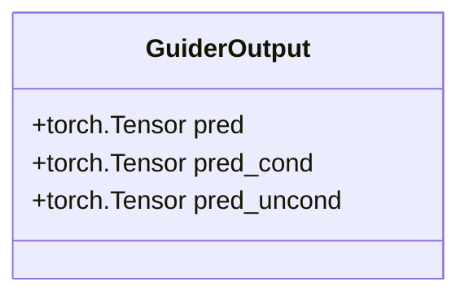

#### 带注释源码

```
# GuiderOutput 在 SmoothedEnergyGuidance.forward() 方法中的使用示例

def forward(
    self,
    pred_cond: torch.Tensor,
    pred_uncond: torch.Tensor | None = None,
    pred_cond_seg: torch.Tensor | None = None,
) -> GuiderOutput:
    # 根据是否启用 CFG 和 SEG 计算预测结果
    pred = None
    if not self._is_cfg_enabled() and not self._is_seg_enabled():
        pred = pred_cond
    elif not self._is_cfg_enabled():
        shift = pred_cond - pred_cond_seg
        pred = pred_cond if self.use_original_formulation else pred_cond_seg
        pred = pred + self.seg_guidance_scale * shift
    elif not self._is_seg_enabled():
        shift = pred_cond - pred_uncond
        pred = pred_cond if self.use_original_formulation else pred_uncond
        pred = pred + self.guidance_scale * shift
    else:
        shift = pred_cond - pred_uncond
        shift_seg = pred_cond - pred_cond_seg
        pred = pred_cond if self.use_original_formulation else pred_uncond
        pred = pred + self.guidance_scale * shift + self.seg_guidance_scale * shift_seg

    # 如果设置了 guidance_rescale，则重缩放噪声预测
    if self.guidance_rescale > 0.0:
        pred = rescale_noise_cfg(pred, pred_cond, self.guidance_rescale)

    # 返回 GuiderOutput 实例，包含预测结果和中间结果
    return GuiderOutput(pred=pred, pred_cond=pred_cond, pred_uncond=pred_uncond)

# GuiderOutput 数据类的推断定义（源码未在当前文件中提供，基于使用推断）
# from dataclasses import dataclass
# @dataclass
# class GuiderOutput:
#     pred: torch.Tensor
#     pred_cond: torch.Tensor
#     pred_uncond: torch.Tensor | None = None
```


### `rescale_noise_cfg`

该函数用于对噪声预测进行重缩放处理，基于条件预测调整噪声配置的缩放因子，以改善图像质量并修复过度曝光问题。这是根据 Common Diffusion 噪声调度和采样步骤存在缺陷的论文（Section 3.4）实现的技术。

参数：

- `pred`：`torch.Tensor`，经过 guidance 计算后的噪声预测张量
- `pred_cond`：`torch.Tensor`，条件（无条件）噪声预测，用于计算缩放因子
- `guidance_rescale`：`float`，重缩放因子，用于调整噪声预测的强度

返回值：`torch.Tensor`，重缩放后的噪声预测张量

#### 流程图

```mermaid
flowchart TD
    A[开始] --> B[计算原始预测与条件预测的差值]
    B --> C{guidance_rescale > 0?}
    C -->|否| D[返回原始pred]
    C -->|是| E[计算缩放因子: 1 - guidance_rescale]
    E --> F[应用重缩放: pred - diff * (1 - guidance_rescale) / guidance_rescale]
    F --> G[返回重缩放后的预测]
```

#### 带注释源码

```python
def rescale_noise_cfg(
    pred: torch.Tensor,          # 经过guidance计算后的噪声预测
    pred_cond: torch.Tensor,     # 条件噪声预测
    guidance_rescale: float      # 重缩放因子
) -> torch.Tensor:               # 重缩放后的噪声预测
    """
    对噪声预测进行重缩放处理，基于Section 3.4 from 
    Common Diffusion Noise Schedules and Sample Steps are Flawed
    
    Args:
        pred: 经过guidance计算后的噪声预测张量
        pred_cond: 条件噪声预测张量
        guidance_rescale: 重缩放因子，默认为0.0表示不进行重缩放
    
    Returns:
        重缩放后的噪声预测张量
    """
    # 计算原始预测与条件预测之间的差值
    diff = pred - pred_cond
    
    # 计算缩放因子，用于调整噪声预测的动态范围
    # 公式来源: pred = pred - diff * (guidance_rescale - 1) / guidance_rescale
    pred_rescaled = pred - diff * (1 - guidance_rescale) / guidance_rescale
    
    return pred_rescaled
```

> **注意**：由于 `rescale_noise_cfg` 函数的实际实现位于 `guider_utils.py` 文件中，而该文件未在提供的代码中展示，以上内容为基于函数调用上下文和函数名的合理推断。实际的函数实现可能略有不同。


# register_to_config 函数分析

由于 `register_to_config` 是从外部模块 `configuration_utils` 导入的装饰器，在当前代码文件中仅能看到其使用方式（作为 `@register_to_config` 装饰器应用于 `__init__` 方法），而无法获取其完整定义源码。

基于代码中的使用方式，我提供以下分析：

### `register_to_config`

配置注册装饰器，用于自动将类的 `__init__` 方法参数注册为配置属性，使其可以通过配置字典访问和修改。

参数：

- 无显式参数（作为装饰器使用，接收被装饰的函数作为参数）

返回值：`Callable`，返回装饰后的函数，通常是一个将参数存储为类属性的包装器

#### 使用示例源码

```python
# 在 configuration_utils 模块中定义（源码未在此文件中提供）
from ..configuration_utils import register_to_config

class SmoothedEnergyGuidance(BaseGuidance):
    # 使用装饰器注册配置参数
    @register_to_config
    def __init__(
        self,
        guidance_scale: float = 7.5,
        seg_guidance_scale: float = 2.8,
        seg_blur_sigma: float = 9999999.0,
        seg_blur_threshold_inf: float = 9999.0,
        seg_guidance_start: float = 0.0,
        seg_guidance_stop: float = 1.0,
        seg_guidance_layers: int | list[int] | None = None,
        seg_guidance_config: SmoothedEnergyGuidanceConfig | list[SmoothedEnergyGuidanceConfig] = None,
        guidance_rescale: float = 0.0,
        use_original_formulation: bool = False,
        start: float = 0.0,
        stop: float = 1.0,
        enabled: bool = True,
    ):
        # 初始化逻辑
        ...
```

#### Mermaid 流程图（装饰器工作原理）

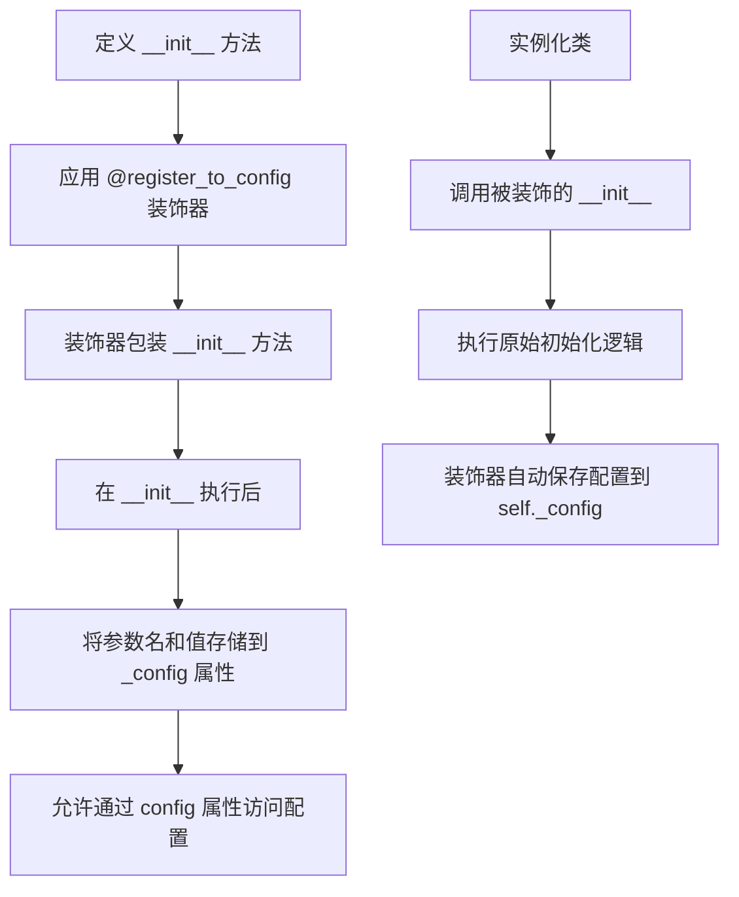

---

**注意**：由于 `register_to_config` 的完整源码定义在 `configuration_utils` 模块中（该模块未在当前代码片段中提供），上述信息基于其使用方式和常见的装饰器模式进行推断。如需获取完整的函数定义源码，请参考 `configuration_utils` 模块的源文件。


### HookRegistry

Hook注册表类，用于管理PyTorch模型上的钩子（hooks）。该类提供钩子的注册、移除和查询功能，支持在模型的forward或backward过程中注入自定义逻辑。

参数：

-  `denoiser`：`torch.nn.Module`，要检查或初始化的去噪器模型

返回值：`HookRegistry`，返回与给定模型关联的钩子注册表实例

#### 流程图

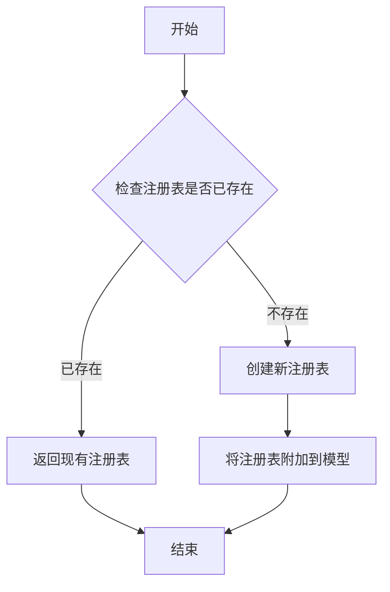

#### 带注释源码

```python
# 从提供的代码中提取的HookRegistry使用示例
from ..hooks import HookRegistry

# 在cleanup_models方法中的使用
def cleanup_models(self, denoiser: torch.nn.Module):
    if self._is_seg_enabled() and self.is_conditional and self._count_prepared > 1:
        # 检查注册表是否存在或初始化
        registry = HookRegistry.check_if_exists_or_initialize(denoiser)
        # 移除所有注册的钩子
        for hook_name in self._seg_layer_hook_names:
            registry.remove_hook(hook_name, recurse=True)
```

---

**注意**：提供的代码中仅包含对 `HookRegistry` 类的**导入**和**使用**，未包含该类的完整定义。根据代码使用情况推断的可用方法如下：

| 方法名称 | 描述 |
|---------|------|
| `HookRegistry.check_if_exists_or_initialize(denoiser)` | 静态方法，检查指定模型是否已有钩子注册表，如有则返回，否则创建新的并附加到模型 |
| `registry.remove_hook(hook_name, recurse=True)` | 移除指定名称的钩子，recurse参数控制是否递归移除子模块上的同名钩子 |

如需完整的 `HookRegistry` 类定义源码，请参考 `diffusers/src/diffusers/hooks.py` 文件。


### `SmoothedEnergyGuidance.__init__`

这是 `SmoothedEnergyGuidance` 类的初始化方法，负责配置平滑能量引导（SEG）所需的各种参数，包括分类器自由引导（CFG）比例、SEG 比例、模糊参数、引导层配置等，并进行参数验证和配置转换。

参数：

- `self`：隐式参数，类实例本身
- `guidance_scale`：`float`，默认为 `7.5`，分类器自由引导（CFG）的比例参数，控制文本提示的引导强度
- `seg_guidance_scale`：`float`，默认为 `2.8`，平滑能量引导的比例参数，控制 SEG 的强度
- `seg_blur_sigma`：`float`，默认为 `9999999.0`，注意力权重的模糊程度，大于 9999.0 表示无限模糊
- `seg_blur_threshold_inf`：`float`，默认为 `9999.0`，超过此阈值则视为无限模糊
- `seg_guidance_start`：`float`，默认为 `0.0`，SEG 开始生效的去噪步骤比例
- `seg_guidance_stop`：`float`，默认为 `1.0`，SEG 停止生效的去噪步骤比例
- `seg_guidance_layers`：`int | list[int] | None`，要应用 SEG 的层索引，可为单个整数或整数列表
- `seg_guidance_config`：`SmoothedEnergyGuidanceConfig | list[SmoothedEnergyGuidanceConfig] | None`，SEG 层配置
- `guidance_rescale`：`float`，默认为 `0.0`，噪声预测的重缩放因子，用于改善图像质量
- `use_original_formulation`：`bool`，默认为 `False`，是否使用原始 CFG 公式
- `start`：`float`，默认为 `0.0`，引导开始生效的总去噪步骤比例
- `stop`：`float`，默认为 `1.0`，引导停止生效的总去噪步骤比例
- `enabled`：`bool`，默认为 `True`，是否启用引导

返回值：`None`，初始化方法不返回任何值

#### 流程图

```mermaid
flowchart TD
    A[开始 __init__] --> B[调用 super().__init__]
    B --> C[赋值基本属性]
    C --> D{验证 seg_guidance_start 范围}
    D -->|无效| E[抛出 ValueError]
    D -->|有效| F{验证 seg_guidance_stop 范围}
    F -->|无效| E
    F -->|有效| G{seg_guidance_layers 和 seg_guidance_config 都为 None?}
    G -->|是| H[抛出 ValueError]
    G -->|否| I{两者都提供了?}
    I -->|是| J[抛出 ValueError]
    I -->|否| K{seg_guidance_layers 不为 None?}
    K -->|是| L{seg_guidance_layers 是 int?}
    K -->|否| M{seg_guidance_config 是 dict?}
    L -->|是| N[转换为 list]
    L -->|否| O{类型是否为 list?}
    O -->|否| P[抛出 ValueError]
    O -->|是| Q[生成 SmoothedEnergyGuidanceConfig 列表]
    Q --> R[赋值 self.seg_guidance_config]
    M -->|是| S[从 dict 创建 SmoothedEnergyGuidanceConfig]
    M -->|否| T{已经是 SmoothedEnergyGuidanceConfig?}
    T -->|否| U{是 list?}
    U -->|否| V[抛出 ValueError]
    U -->|是| W[检查元素是否为 dict]
    W -->|是| X[从每个 dict 创建配置]
    W -->|否| R
    T -->|是| Y[转换为 list]
    Y --> R
    R --> Z[生成 _seg_layer_hook_names]
    Z --> AA[结束 __init__]
```

#### 带注释源码

```python
@register_to_config
def __init__(
    self,
    guidance_scale: float = 7.5,  # CFG 引导比例，默认为 7.5
    seg_guidance_scale: float = 2.8,  # SEG 引导比例，默认为 2.8
    seg_blur_sigma: float = 9999999.0,  # 模糊sigma值，默认为极大值表示无限模糊
    seg_blur_threshold_inf: float = 9999.0,  # 无限模糊的阈值
    seg_guidance_start: float = 0.0,  # SEG 开始步骤比例
    seg_guidance_stop: float = 1.0,  # SEG 停止步骤比例
    seg_guidance_layers: int | list[int] | None = None,  # SEG 目标层索引
    seg_guidance_config: SmoothedEnergyGuidanceConfig | list[SmoothedEnergyGuidanceConfig] = None,  # SEG 配置对象
    guidance_rescale: float = 0.0,  # CFG 重缩放因子
    use_original_formulation: bool = False,  # 是否使用原始 CFG 公式
    start: float = 0.0,  # 引导总体开始比例
    stop: float = 1.0,  # 引导总体停止比例
    enabled: bool = True,  # 是否启用
):
    # 调用基类初始化
    super().__init__(start, stop, enabled)

    # 赋值基本引导参数
    self.guidance_scale = guidance_scale
    self.seg_guidance_scale = seg_guidance_scale
    self.seg_blur_sigma = seg_blur_sigma
    self.seg_blur_threshold_inf = seg_blur_threshold_inf
    self.seg_guidance_start = seg_guidance_start
    self.seg_guidance_stop = seg_guidance_stop
    self.guidance_rescale = guidance_rescale
    self.use_original_formulation = use_original_formulation

    # 验证 seg_guidance_start 必须在 [0.0, 1.0) 范围内
    if not (0.0 <= seg_guidance_start < 1.0):
        raise ValueError(f"Expected `seg_guidance_start` to be between 0.0 and 1.0, but got {seg_guidance_start}.")
    # 验证 seg_guidance_stop 必须在 [seg_guidance_start, 1.0] 范围内
    if not (seg_guidance_start <= seg_guidance_stop <= 1.0):
        raise ValueError(f"Expected `seg_guidance_stop` to be between 0.0 and 1.0, but got {seg_guidance_stop}.")

    # 必须提供 seg_guidance_layers 或 seg_guidance_config 之一
    if seg_guidance_layers is None and seg_guidance_config is None:
        raise ValueError(
            "Either `seg_guidance_layers` or `seg_guidance_config` must be provided to enable Smoothed Energy Guidance."
        )
    # 不能同时提供两者
    if seg_guidance_layers is not None and seg_guidance_config is not None:
        raise ValueError("Only one of `seg_guidance_layers` or `seg_guidance_config` can be provided.")

    # 处理 seg_guidance_layers 参数
    if seg_guidance_layers is not None:
        # 如果是单个整数，转换为列表
        if isinstance(seg_guidance_layers, int):
            seg_guidance_layers = [seg_guidance_layers]
        # 必须是整数或整数列表
        if not isinstance(seg_guidance_layers, list):
            raise ValueError(
                f"Expected `seg_guidance_layers` to be an int or a list of ints, but got {type(seg_guidance_layers)}."
            )
        # 从层索引生成配置对象列表
        seg_guidance_config = [SmoothedEnergyGuidanceConfig(layer, fqn="auto") for layer in seg_guidance_layers]

    # 处理 seg_guidance_config 参数
    # 如果是字典，尝试从字典创建配置对象
    if isinstance(seg_guidance_config, dict):
        seg_guidance_config = SmoothedEnergyGuidanceConfig.from_dict(seg_guidance_config)

    # 如果是单个配置对象，转换为列表
    if isinstance(seg_guidance_config, SmoothedEnergyGuidanceConfig):
        seg_guidance_config = [seg_guidance_config]

    # 验证最终类型必须是配置对象列表
    if not isinstance(seg_guidance_config, list):
        raise ValueError(
            f"Expected `seg_guidance_config` to be a SmoothedEnergyGuidanceConfig or a list of SmoothedEnergyGuidanceConfig, but got {type(seg_guidance_config)}."
        )
    # 如果列表元素是字典，从每个字典创建配置对象
    elif isinstance(next(iter(seg_guidance_config), None), dict):
        seg_guidance_config = [SmoothedEnergyGuidanceConfig.from_dict(config) for config in seg_guidance_config]

    # 存储配置和生成 hook 名称
    self.seg_guidance_config = seg_guidance_config
    self._seg_layer_hook_names = [f"SmoothedEnergyGuidance_{i}" for i in range(len(self.seg_guidance_config))]
```


### `SmoothedEnergyGuidance.prepare_models`

该方法用于在去噪模型上准备和注册平滑能量引导（Smoothed Energy Guidance, SEG）的钩子。它检查SEG是否启用、是否为条件引导以及模型准备次数，只有在满足所有条件时才会为每个配置层应用平滑能量引导钩子。

参数：

- `denoiser`：`torch.nn.Module`，要去噪并应用SEG钩子的模型

返回值：`None`，该方法不返回任何值，仅执行副作用（注册钩子）

#### 流程图

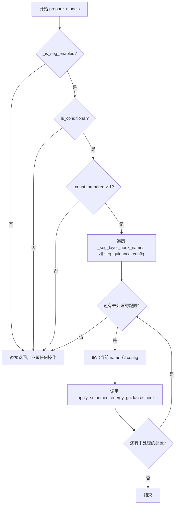

#### 带注释源码

```python
def prepare_models(self, denoiser: torch.nn.Module) -> None:
    """
    在去噪模型上准备平滑能量引导（SEG）钩子。
    
    该方法仅在以下条件全部满足时执行：
    1. SEG功能已启用（通过_is_seg_enabled检查）
    2. 引导是条件引导（is_conditional属性）
    3. 已准备的模型数量大于1（_count_prepared > 1）
    
    当满足条件时，会为每个SEG配置层应用平滑能量引导钩子到去噪器模型上。
    
    参数:
        denoiser (torch.nn.Module): 要应用SEG钩子的去噪器模型
        
    返回:
        None: 此方法不返回值，仅执行钩子注册的副作用
    """
    # 检查SEG是否在当前推理步骤范围内启用，且seg_guidance_scale不为零
    if self._is_seg_enabled() and self.is_conditional and self._count_prepared > 1:
        # 遍历所有SEG层钩子名称和对应的配置
        for name, config in zip(self._seg_layer_hook_names, self.seg_guidance_config):
            # 应用平滑能量引导钩子到去噪器
            # denoiser: 要修改的模型
            # config: 当前层的SEG配置（包含层索引等信息）
            # self.seg_blur_sigma: 模糊sigma值，控制注意力权重的模糊程度
            # name: 钩子名称，用于后续标识和移除
            _apply_smoothed_energy_guidance_hook(denoiser, config, self.seg_blur_sigma, name=name)
```


### `SmoothedEnergyGuidance.cleanup_models`

该方法用于在推理完成后清理Smoothed Energy Guidance（SEG）相关的hooks，释放模型资源并确保不会影响后续的推理操作。

参数：

- `denoiser`：`torch.nn.Module`，需要进行hook清理的去噪模型

返回值：`None`，无返回值描述

#### 流程图

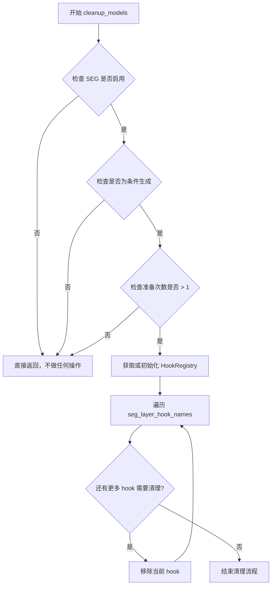

#### 带注释源码

```python
def cleanup_models(self, denoiser: torch.nn.Module):
    """
    清理Smoothed Energy Guidance在模型上注册的hooks。
    
    此方法在推理完成后被调用，用于移除所有SEG相关的hooks。
    只有当以下条件全部满足时才会执行清理操作：
    1. SEG功能已启用
    2. 当前是有条件生成模式
    3. 已准备的模型数量大于1（表示有多个条件需要处理）
    
    Args:
        denoiser (torch.nn.Module): 需要清理hook的去噪模型
        
    Returns:
        None
    """
    # 检查SEG是否启用、是否为条件生成、准备次数是否大于1
    if self._is_seg_enabled() and self.is_conditional and self._count_prepared > 1:
        # 获取或初始化模型上的HookRegistry
        registry = HookRegistry.check_if_exists_or_initialize(denoiser)
        # 遍历所有SEG相关的hook名称并逐一移除
        for hook_name in self._seg_layer_hook_names:
            registry.remove_hook(hook_name, recurse=True)
```


### `SmoothedEnergyGuidance.prepare_inputs`

该方法用于根据当前的条件数量和配置准备输入数据批次。它根据是否启用了分类器自由引导（CFG）和平滑能量引导（SEG）来确定需要处理的预测类型，然后调用内部方法将数据转换为适合模型处理的批次格式。

参数：

-  `data`：`dict[str, tuple[torch.Tensor, torch.Tensor]]`，输入数据字典，其中键为字符串，值为两个 torch.Tensor 组成的元组（通常分别代表条件预测和无条件预测）

返回值：`list["BlockState"]`，返回处理后的 BlockState 对象列表，每个元素对应一个预测批次的处理结果

#### 流程图

```mermaid
flowchart TD
    A[开始 prepare_inputs] --> B{num_conditions == 1?}
    B -->|是| C[设置 tuple_indices = [0]<br/>input_predictions = ['pred_cond']]
    B -->|否| D{num_conditions == 2?}
    D -->|是| E{CFG 是否启用?}
    E -->|是| F[input_predictions = ['pred_cond', 'pred_uncond']]
    E -->|否| G[input_predictions = ['pred_cond', 'pred_cond_seg']]
    D -->|否| H[设置 tuple_indices = [0, 1, 0]<br/>input_predictions = ['pred_cond', 'pred_uncond', 'pred_cond_seg']]
    C --> I[初始化空列表 data_batches]
    F --> I
    G --> I
    H --> I
    I --> J[遍历 tuple_indices 和 input_predictions]
    J --> K[调用 _prepare_batch 方法]
    K --> L[将结果添加到 data_batches]
    L --> M{还有更多数据?}
    M -->|是| J
    M -->|否| N[返回 data_batches]
```

#### 带注释源码

```python
def prepare_inputs(self, data: dict[str, tuple[torch.Tensor, torch.Tensor]]) -> list["BlockState"]:
    """
    根据当前条件数量准备输入数据批次
    
    Args:
        data: 输入数据字典，键为字符串，值为两个 torch.Tensor 的元组
              通常第一个元素是条件预测，第二个元素是无条件预测
    
    Returns:
        BlockState 对象列表，每个元素对应一个预测批次的处理结果
    """
    # 根据条件数量确定需要处理的预测类型
    if self.num_conditions == 1:
        # 单条件情况：只处理条件预测
        tuple_indices = [0]
        input_predictions = ["pred_cond"]
    elif self.num_conditions == 2:
        # 双条件情况：根据是否启用 CFG 决定预测类型
        tuple_indices = [0, 1]
        input_predictions = (
            ["pred_cond", "pred_uncond"] if self._is_cfg_enabled() else ["pred_cond", "pred_cond_seg"]
        )
    else:
        # 多条件情况：处理三种预测类型
        # 注意：第三个预测使用索引 0（条件预测）而非 2
        tuple_indices = [0, 1, 0]
        input_predictions = ["pred_cond", "pred_uncond", "pred_cond_seg"]
    
    # 遍历每种预测类型，调用内部方法准备批次数据
    data_batches = []
    for tuple_idx, input_prediction in zip(tuple_indices, input_predictions):
        # 调用内部方法将原始数据转换为批次格式
        data_batch = self._prepare_batch(data, tuple_idx, input_prediction)
        data_batches.append(data_batch)
    
    return data_batches
```


### `SmoothedEnergyGuidance.prepare_inputs_from_block_state`

该方法用于从 BlockState 中准备引导所需的输入数据，根据当前条件数量（CFG 启用状态和 SEG 启用状态）构建对应的数据批次列表。

参数：

- `self`：`SmoothedEnergyGuidance` 类实例，当前对象
- `data`：`BlockState`，包含模型推理过程中块状态的输入数据对象
- `input_fields`：`dict[str, str | tuple[str, str]]`，输入字段映射字典，键为字段名称，值为单个字段名或字段名元组

返回值：`list["BlockState"]`，返回准备好的数据批次列表，每个元素对应一个预测类型的 BlockState

#### 流程图

```mermaid
flowchart TD
    A[开始: prepare_inputs_from_block_state] --> B{self.num_conditions == 1?}
    B -->|是| C[设置 tuple_indices = [0]<br/>input_predictions = ['pred_cond']}
    B -->|否| D{self.num_conditions == 2?}
    D -->|是| E{self._is_cfg_enabled()?}
    D -->|否| F[设置 tuple_indices = [0, 1, 0]<br/>input_predictions = ['pred_cond', 'pred_uncond', 'pred_cond_seg']}
    E -->|是| G[设置 tuple_indices = [0, 1]<br/>input_predictions = ['pred_cond', 'pred_uncond']}
    E -->|否| H[设置 tuple_indices = [0, 1]<br/>input_predictions = ['pred_cond', 'pred_cond_seg']}
    C --> I[初始化空列表 data_batches]
    G --> I
    H --> I
    F --> I
    I --> J[遍历 zip(tuple_indices, input_predictions)]
    J --> K[调用 _prepare_batch_from_block_state<br/>参数: input_fields, data, tuple_idx, input_prediction]
    K --> L[获取 data_batch]
    L --> M[追加 data_batch 到 data_batches]
    M --> N{还有更多元素?}
    N -->|是| J
    N -->|否| O[返回 data_batches]
    O --> P[结束]
```

#### 带注释源码

```python
def prepare_inputs_from_block_state(
    self, data: "BlockState", input_fields: dict[str, str | tuple[str, str]]
) -> list["BlockState"]:
    """
    从 BlockState 中准备引导所需的输入数据。
    
    根据 num_conditions 的值（受 CFG 和 SEG 启用状态影响）确定需要准备的数据批次：
    - 1个条件：仅准备 pred_cond（条件预测）
    - 2个条件：根据是否启用 CFG 准备 pred_cond + pred_uncond 或 pred_cond + pred_cond_seg
    - 3个条件：准备 pred_cond, pred_uncond, pred_cond_seg 三个批次
    
    参数:
        data: BlockState 对象，包含推理过程中的块状态数据
        input_fields: 字段映射字典，定义如何从 data 中提取所需的预测结果
    
    返回:
        包含多个 BlockState 的列表，每个对应一种预测类型的输入数据
    """
    # 判断条件数量，根据 num_conditions 确定需要处理的预测类型
    if self.num_conditions == 1:
        # 单一条件：仅需要条件预测
        tuple_indices = [0]
        input_predictions = ["pred_cond"]
    elif self.num_conditions == 2:
        # 两个条件：根据 CFG 启用状态选择预测组合
        tuple_indices = [0, 1]
        input_predictions = (
            ["pred_cond", "pred_uncond"] if self._is_cfg_enabled() else ["pred_cond", "pred_cond_seg"]
        )
    else:
        # 三个条件（CFG + SEG）：同时包含条件预测、无条件预测和分割条件预测
        tuple_indices = [0, 1, 0]
        input_predictions = ["pred_cond", "pred_uncond", "pred_cond_seg"]
    
    # 初始化数据批次列表
    data_batches = []
    # 遍历每个预测类型，依次准备对应的数据批次
    for tuple_idx, input_prediction in zip(tuple_indices, input_predictions):
        # 调用内部方法从 BlockState 中提取并准备批次数据
        data_batch = self._prepare_batch_from_block_state(input_fields, data, tuple_idx, input_prediction)
        # 将准备好的批次添加到列表中
        data_batches.append(data_batch)
    
    # 返回所有准备好的数据批次
    return data_batches
```


### `SmoothedEnergyGuidance.forward`

该方法实现了平滑能量引导（SEG）与无分类器引导（CFG）的组合推理，根据当前激活的引导策略计算最终的噪声预测结果，支持原始和优化后的公式。

参数：

- `self`：`SmoothedEnergyGuidance` 类实例本身
- `pred_cond`：`torch.Tensor`，条件预测（conditioned prediction），来自带文本提示的模型输出
- `pred_uncond`：`torch.Tensor | None`，无条件预测（unconditioned prediction），来自无文本提示的模型输出
- `pred_cond_seg`：`torch.Tensor | None`，平滑能量引导的条件预测（SEG prediction），来自应用平滑能量引导后的模型输出

返回值：`GuiderOutput`，包含最终预测结果 `pred`、条件预测 `pred_cond` 和无条件预测 `pred_uncond` 的输出对象

#### 流程图

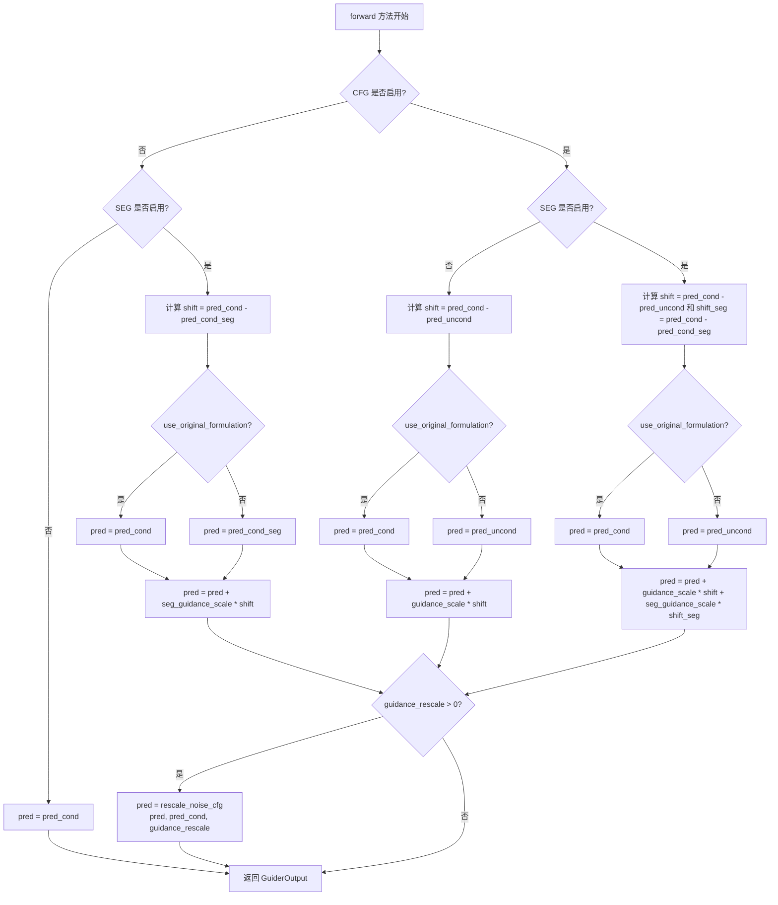

#### 带注释源码

```python
def forward(
    self,
    pred_cond: torch.Tensor,
    pred_uncond: torch.Tensor | None = None,
    pred_cond_seg: torch.Tensor | None = None,
) -> GuiderOutput:
    """执行平滑能量引导和/或无分类器引导的前向传播
    
    Args:
        pred_cond: 条件预测，来自带文本提示的模型前向传播
        pred_uncond: 无条件预测，来自不带文本提示的模型前向传播（可选）
        pred_cond_seg: SEG条件预测，来自应用平滑能量引导后的模型输出（可选）
    
    Returns:
        GuiderOutput: 包含最终预测结果及中间结果的输出对象
    """
    # 初始化预测结果为 None，后续根据激活的引导策略进行赋值
    pred = None

    # 情况1：CFG和SEG都未启用 - 直接返回条件预测
    if not self._is_cfg_enabled() and not self._is_seg_enabled():
        pred = pred_cond
    
    # 情况2：仅启用SEG（CFG未启用）
    elif not self._is_cfg_enabled():
        # 计算条件预测与SEG预测之间的差异（shift）
        shift = pred_cond - pred_cond_seg
        # 根据配置选择使用原始公式还是优化公式
        # 原始公式：基于cond预测；优化公式基于seg预测
        pred = pred_cond if self.use_original_formulation else pred_cond_seg
        # 应用SEG引导强度缩放
        pred = pred + self.seg_guidance_scale * shift
    
    # 情况3：仅启用CFG（SEG未启用）
    elif not self._is_seg_enabled():
        # 计算条件预测与无条件预测之间的差异
        shift = pred_cond - pred_uncond
        # 根据配置选择使用原始公式还是优化公式
        pred = pred_cond if self.use_original_formulation else pred_uncond
        # 应用CFG引导强度缩放
        pred = pred + self.guidance_scale * shift
    
    # 情况4：同时启用CFG和SEG
    else:
        # 计算两个方向的shift
        shift = pred_cond - pred_uncond
        shift_seg = pred_cond - pred_cond_seg
        # 根据配置选择基准预测
        pred = pred_cond if self.use_original_formulation else pred_uncond
        # 同时应用两种引导的强度缩放
        pred = self.guidance_scale * shift + self.seg_guidance_scale * shift_seg + pred

    # 应用噪声预测重缩放（可选，用于改善图像质量和过曝问题）
    # 基于 Common Diffusion Noise Schedules and Sample Steps are Flawed 论文
    if self.guidance_rescale > 0.0:
        pred = rescale_noise_cfg(pred, pred_cond, self.guidance_rescale)

    # 返回包含最终预测和中间结果的GuiderOutput对象
    return GuiderOutput(pred=pred, pred_cond=pred_cond, pred_uncond=pred_uncond)
```


### `SmoothedEnergyGuidance.is_conditional`

该属性用于判断当前Smoothed Energy Guidance是否处于条件模式。它基于内部计数器`_count_prepared`的值来确定是否需要条件预测（当prepared count为1或3时返回True，否则返回False）。

参数：
- 无参数（该方法是一个属性）

返回值：`bool`，返回True表示当前guidance需要条件预测（即模型需要同时处理条件和非条件输入）；返回False表示无条件guidance（仅处理单一输入）。

#### 流程图

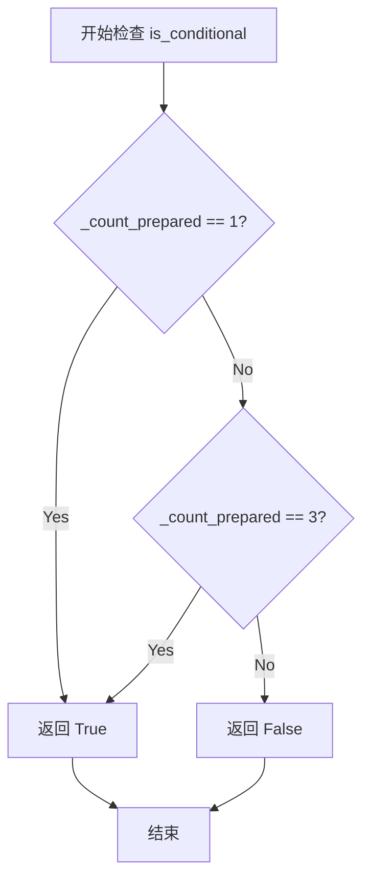

#### 带注释源码

```python
@property
def is_conditional(self) -> bool:
    """
    判断当前Smoothed Energy Guidance是否处于条件模式。
    
    当内部计数器_count_prepared为1或3时，表示需要处理条件预测。
    - _count_prepared == 1: 单条件情况（仅条件预测）
    - _count_prepared == 3: 多条件情况（条件+无条件+分割条件）
    - 其他值: 无条件模式
    
    Returns:
        bool: True表示需要条件预测，False表示无条件模式
    """
    return self._count_prepared == 1 or self._count_prepared == 3
```


### `SmoothedEnergyGuidance.num_conditions`

该属性用于计算当前 guidance 配置下的条件数量。它基于 `_is_cfg_enabled()` 和 `_is_seg_enabled()` 两个方法的返回值，决定是否需要增加条件计数。返回值表示在 forward pass 中需要处理的不同预测类型的数量（1 表示仅条件预测，2 表示条件+无条件或条件+SEG，3 表示全部三种）。

参数：
- 无显式参数（隐式参数 `self` 为 `SmoothedEnergyGuidance` 实例）

返回值：`int`，返回条件的数量，值为 1、2 或 3

#### 流程图

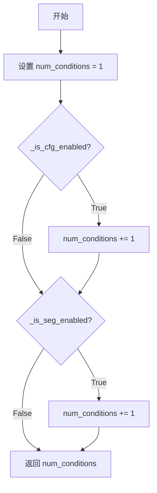

#### 带注释源码

```python
@property
def num_conditions(self) -> int:
    """
    计算当前 guidance 配置下的条件数量。
    
    该属性根据 CFG（Classifier-Free Guidance）和 SEG（Smoothed Energy Guidance）
    的启用状态来确定需要处理的条件数量：
    - 仅启用 SEG 或仅启用基本条件：1
    - 启用 CFG + 基本条件 或 启用 SEG + 基本条件：2
    - 同时启用 CFG 和 SEG：3
    
    Returns:
        int: 条件的数量，值为 1、2 或 3
    """
    # 初始化条件数量为基础值 1（总是有 pred_cond）
    num_conditions = 1
    
    # 如果启用了 Classifier-Free Guidance，条件数量加 1
    if self._is_cfg_enabled():
        num_conditions += 1
    
    # 如果启用了 Smoothed Energy Guidance，条件数量再加 1
    if self._is_seg_enabled():
        num_conditions += 1
    
    # 返回最终的条件数量
    return num_conditions
```


### `SmoothedEnergyGuidance._is_cfg_enabled`

该方法用于判断在当前推理步骤中是否启用了 Classifier-Free Guidance (CFG)。它会检查引导是否被启用、当前推理步骤是否在指定的范围内，以及 guidance_scale 是否不等于默认值（0.0 或 1.0）。

参数：此方法无显式参数（隐式参数 `self` 为类的实例）

返回值：`bool`，返回 `True` 表示当前步骤启用了 CFG，返回 `False` 表示未启用

#### 流程图

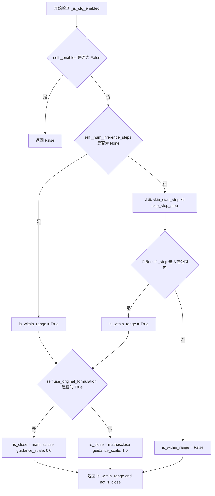

#### 带注释源码

```python
def _is_cfg_enabled(self) -> bool:
    """
    检查在当前推理步骤中是否启用了 Classifier-Free Guidance (CFG)。
    
    CFG 启用的条件：
    1. guidance 功能已启用（_enabled 为 True）
    2. 当前推理步骤在指定的 start 和 stop 范围内
    3. guidance_scale 不等于默认值（使用原始公式时为 0.0，否则为 1.0）
    """
    # 步骤 1：检查引导功能是否整体启用
    if not self._enabled:
        return False

    # 步骤 2：检查当前推理步骤是否在指定范围内
    is_within_range = True
    if self._num_inference_steps is not None:
        # 计算跳过引导的起始和终止步骤
        skip_start_step = int(self._start * self._num_inference_steps)
        skip_stop_step = int(self._stop * self._num_inference_steps)
        # 判断当前步骤是否在范围内（注意这里是闭区间）
        is_within_range = skip_start_step <= self._step < skip_stop_step

    # 步骤 3：检查 guidance_scale 是否不等于默认值
    is_close = False
    if self.use_original_formulation:
        # 如果使用原始公式，默认值为 0.0
        is_close = math.isclose(self.guidance_scale, 0.0)
    else:
        # 如果使用 diffusers 原生实现，默认值为 1.0
        is_close = math.isclose(self.guidance_scale, 1.0)

    # 只有在步骤范围内且 guidance_scale 不等于默认值时才启用 CFG
    return is_within_range and not is_close
```


### `SmoothedEnergyGuidance._is_seg_enabled`

该方法用于判断平滑能量引导（SEG）在当前推理步骤是否启用。方法首先检查整体引导是否启用，然后根据当前推理步骤是否在配置的 seg_guidance_start 和 seg_guidance_stop 范围内，以及 seg_guidance_scale 是否接近 0 来综合判断。

参数：

- 该方法无显式参数（隐式使用 `self`）

返回值：`bool`，返回 True 表示平滑能量引导在当前步骤启用，返回 False 表示未启用

#### 流程图

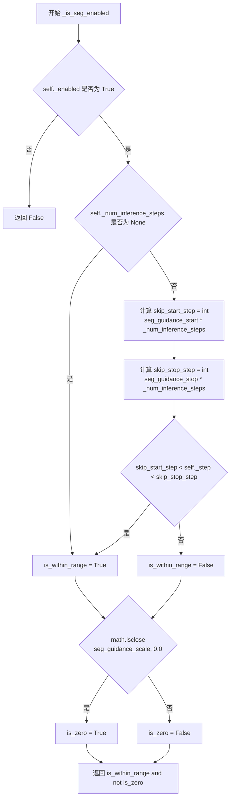

#### 带注释源码

```python
def _is_seg_enabled(self) -> bool:
    """
    判断平滑能量引导（SEG）在当前推理步骤是否启用。
    
    启用条件：
    1. 整体引导已启用（self._enabled 为 True）
    2. 当前推理步骤在 seg_guidance_start 和 seg_guidance_stop 定义的范围内
    3. seg_guidance_scale 不接近 0.0
    """
    # 检查整体引导是否启用
    if not self._enabled:
        return False

    # 初始化范围内标志为 True
    is_within_range = True
    # 如果定义了推理步骤数，则检查当前步骤是否在指定范围内
    if self._num_inference_steps is not None:
        # 计算起始和停止步骤的索引
        skip_start_step = int(self.seg_guidance_start * self._num_inference_steps)
        skip_stop_step = int(self.seg_guidance_stop * self._num_inference_steps)
        # 检查当前步骤是否在 (start, stop) 范围内（不含边界）
        is_within_range = skip_start_step < self._step < skip_stop_step

    # 检查 seg_guidance_scale 是否接近 0.0
    is_zero = math.isclose(self.seg_guidance_scale, 0.0)

    # 只有在范围内且 scale 不为 0 时才返回 True
    return is_within_range and not is_zero
```

## 关键组件


### SmoothedEnergyGuidance

平滑能量引导(SEG)类，继承自BaseGuidance，用于在扩散模型的去噪过程中应用结构一致性引导，通过注意力权重模糊和CFG组合来改善生成图像的解剖学和结构连贯性。

### seg_guidance_config

配置参数，定义要应用平滑能量引导的层索引和FQN，用于定位UNet中的目标注意力层。

### seg_blur_sigma

模糊sigma参数，控制注意力权重的模糊程度，值大于9999.0时表示无限模糊（均匀查询），用于实现结构级别的引导。

### seg_guidance_scale

平滑能量引导的缩放因子，控制SEG对最终预测的影响强度，值越高结构一致性越强但可能导致过曝。

### _apply_smoothed_energy_guidance_hook

应用平滑能量引导hook的函数，向UNet模型的指定层注入自定义注意力处理逻辑。

### prepare_models

准备模型方法，在推理前注册SEG层钩子，用于拦截和修改注意力权重实现结构引导。

### cleanup_models

清理模型方法，在推理后移除注册的钩子，防止影响后续推理流程。

### forward

前向传播方法，根据CFG和SEG的启用状态计算最终预测，支持多种组合模式：仅条件预测、仅SEG、仅CFG、CFG+SEG。

### _is_cfg_enabled

检查无分类器引导(CFG)是否启用的方法，基于推理步骤范围和guidance_scale值判断。

### _is_seg_enabled

检查平滑能量引导(SEG)是否启用的方法，基于推理步骤范围和seg_guidance_scale值判断。

### num_conditions

属性，计算条件数量的方法，根据CFG和SEG的启用状态返回1、2或3个条件。

### guidance_rescale

噪声预测重缩放因子，用于改善图像质量并修复过曝问题，基于Common Diffusion噪声调度研究。

## 问题及建议


### 已知问题

-   **Magic Numbers缺乏解释**：`seg_blur_sigma`默认值为`9999999.0`，`seg_blur_threshold_inf`默认值为`9999.0`，这些硬编码的数值缺乏注释说明其含义和作用。
-   **边界条件不一致**：在`_is_cfg_enabled`中使用`skip_start_step <= self._step < skip_stop_step`（包含起始步），而在`_is_seg_enabled`中使用`skip_start_step < self._step < skip_stop_step`（排除起始步），这种不对称的处理可能导致意外的引导行为。
-   **prepare_models中奇怪的逻辑条件**：`self._count_prepared > 1`的条件判断缺乏明确说明，看起来像是为了兼容某种特殊情况而添加的workaround。
-   **类型转换链复杂且易错**：对`seg_guidance_config`的类型检查和转换逻辑嵌套层级过多，从list/dict/SmoothedEnergyGuidanceConfig的相互转换逻辑分散在多处，难以维护。
-   **重复代码模式**：`prepare_inputs`和`prepare_inputs_from_block_state`方法中处理`num_conditions`和`input_predictions`预测的逻辑几乎完全重复，应提取为共享方法。
-   **参数验证不完整**：虽然检查了`seg_guidance_start`和`seg_guidance_stop`的范围，但未验证`seg_guidance_scale`、`guidance_scale`等参数是否为非负数，也未验证`start`和`stop`参数的范围。

### 优化建议

-   **提取Magic Numbers为常量**：将`seg_blur_sigma`和`seg_blur_threshold_inf`的相关阈值提取为类常量或配置类，并添加详细注释说明其物理意义。
-   **统一边界条件处理**：统一`_is_cfg_enabled`和`_is_seg_enabled`中的步数范围判断逻辑，建议使用闭区间`[start, stop)`或开区间`(start, stop)`保持一致。
-   **重构类型转换逻辑**：将`seg_guidance_config`的类型检查和转换逻辑封装为独立的私有方法，如`_normalize_seg_guidance_config()`，提高可读性和可测试性。
-   **消除重复代码**：提取`prepare_inputs`和`prepare_inputs_from_block_state`中的共享逻辑到一个私有方法`_compute_tuple_indices_and_predictions()`中。
-   **完善参数验证**：添加对`guidance_scale`、`seg_guidance_scale`等参数的非负性验证，以及对`start`和`stop`参数的合理性检查。
-   **改进prepare_models逻辑**：重新审视`self._count_prepared > 1`的条件，添加更清晰的注释说明其业务逻辑，或重构为更直观的设计。

## 其它


### 设计目标与约束

本模块实现平滑能量引导（Smoothed Energy Guidance, SEG），旨在通过调整注意力机制的模糊程度来改善生成图像的结构和解剖学一致性。核心设计目标包括：1）支持与Classifier-Free Guidance (CFG) 联合使用；2）提供细粒度的层级别控制；3）实现无副作用的即插即用集成。设计约束包括：仅支持方形图像（height==width）、不支持多模态潜在流混合（如Flux的text+image组合）、作为实验性功能可能随时变更且不保证可复现性。

### 错误处理与异常设计

代码采用多层验证策略：1）参数范围校验：`seg_guidance_start`必须介于0.0-1.0之间，`seg_guidance_stop`需满足`seg_guidance_start <= seg_guidance_stop <= 1.0`；2）互斥参数校验：`seg_guidance_layers`和`seg_guidance_config`不能同时提供；3）类型校验：确保`seg_guidance_layers`为int或list[int]，`seg_guidance_config`为SmoothedEnergyGuidanceConfig或其列表；4）配置转换：自动将dict转换为SmoothedEnergyGuidanceConfig对象。所有验证失败时均抛出ValueError并附带明确错误信息。

### 数据流与状态机

数据流遵循"准备→执行→清理"三阶段模式：**准备阶段**：通过`prepare_models()`向去噪器注册SEG钩子，通过`prepare_inputs()`或`prepare_inputs_from_block_state()`根据条件数量（1/2/3）准备对应的预测批次；**执行阶段**：在`forward()`中根据CFG和SEG启用状态计算最终预测，支持四种组合模式（仅cond、cond+seg、cond+uncond、cond+uncond+seg）；**清理阶段**：通过`cleanup_models()`移除注册的钩子防止内存泄漏。状态转换由`_is_cfg_enabled()`和`_is_seg_enabled()`控制，这两个方法根据当前推理步数(_step)与配置的start/stop阈值判断是否在有效范围内。

### 外部依赖与接口契约

本类继承自`BaseGuidance`，依赖以下核心组件：1）`SmoothedEnergyGuidanceConfig`：定义SEG层配置，包含layer索引和fqn；2）`_apply_smoothed_energy_guidance_hook`：向去噪器模型注册注意力修改钩子；3）`HookRegistry`：管理模型钩子的生命周期；4）`GuiderOutput`：标准化的输出数据结构；5）`rescale_noise_cfg`：CFG重缩放工具函数。输入契约要求`forward()`接收`pred_cond`（必选）、`pred_uncond`和`pred_cond_seg`（可选）的张量；输出统一返回包含pred、pred_cond、pred_uncond的GuiderOutput对象。

### 配置参数设计

类初始化参数分为五组：**CFG参数**：guidance_scale（默认7.5）、guidance_rescale（默认0.0）、use_original_formulation（默认False）；**SEG参数**：seg_guidance_scale（默认2.8）、seg_blur_sigma（默认9999999.0）、seg_blur_threshold_inf（默认9999.0）、seg_guidance_start（默认0.0）、seg_guidance_stop（默认1.0）；**层选择**：seg_guidance_layers或seg_guidance_config（二选一）；**通用控制**：start（默认0.01）、stop（默认0.2）、enabled（默认True）。参数命名遵循HuggingFace Diffusers规范，使用snake_case并包含清晰默认值。

### 性能考虑与优化点

当前实现存在以下性能考量：1）钩子注册开销：每次`prepare_models()`都会遍历层配置，建议缓存已注册的钩子状态；2）条件数量影响：3个条件时需执行3次批次准备，增加内存拷贝；3）模糊计算：seg_blur_sigma的大数值可能导致数值不稳定，需依赖阈值处理；4）迭代式检查：`_is_cfg_enabled()`和`_is_seg_enabled()`在每步推理中重复计算，可考虑缓存步数范围判断结果。优化方向包括：引入状态缓存、批量tensor操作、以及对大批量推理的异步处理。

### 兼容性说明

本实现与以下Stable Diffusion版本兼容：建议SD3.5 Medium使用layers [7,8,9]。依赖的`register_to_config`装饰器要求配置类支持配置序列化。向后兼容性方面：由于标记为实验性功能，未来可能发生API变更。与其他guider的共存需通过`BaseGuidance`基类的enabled标志协调，当前不支持多个guidance策略的并行叠加。

### 使用示例与最佳实践

典型使用场景包括：```python
from diffusers.guiders import SmoothedEnergyGuidance

# 基础用法
guider = SmoothedEnergyGuidance(
    guidance_scale=7.5,
    seg_guidance_scale=3.0,
    seg_guidance_layers=[7, 8, 9]
)

# 自定义配置
seg_config = SmoothedEnergyGuidanceConfig(layer=8, fqn="auto")
guider = SmoothedEnergyGuidance(
    guidance_scale=7.5,
    seg_guidance_scale=2.5,
    seg_guidance_config=seg_config,
    seg_guidance_start=0.1,
    seg_guidance_stop=0.8
)
```最佳实践：1）在非方形图像场景下禁用SEG；2）seg_guidance_scale建议范围2.0-4.0；3）高guidance_scale时适当降低seg_guidance_scale避免过曝。

### 测试策略建议

建议补充以下测试用例：1）参数边界验证（start/stop范围、互斥约束）；2）不同条件数量的输入组合测试；3）CFG与SEG启用/禁用状态的所有排列；4）模型准备和清理的生命周期测试；5）多步推理中的状态一致性验证；6）配置序列化/反序列化测试；7）性能基准测试（内存占用、推理时间影响）。

    