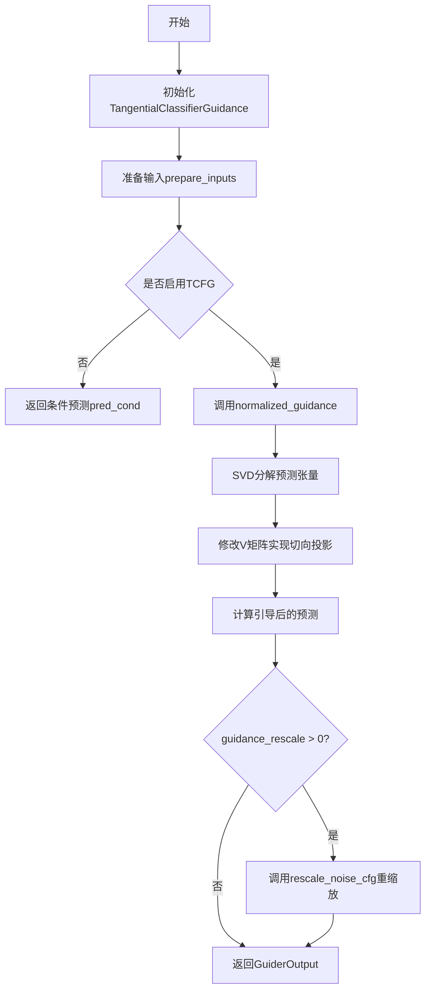
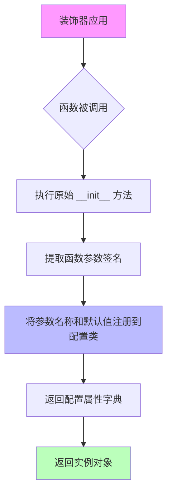
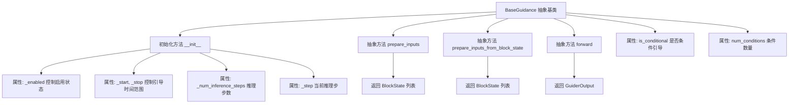
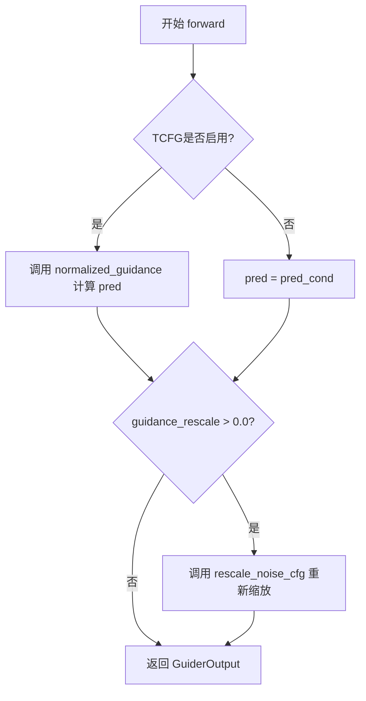
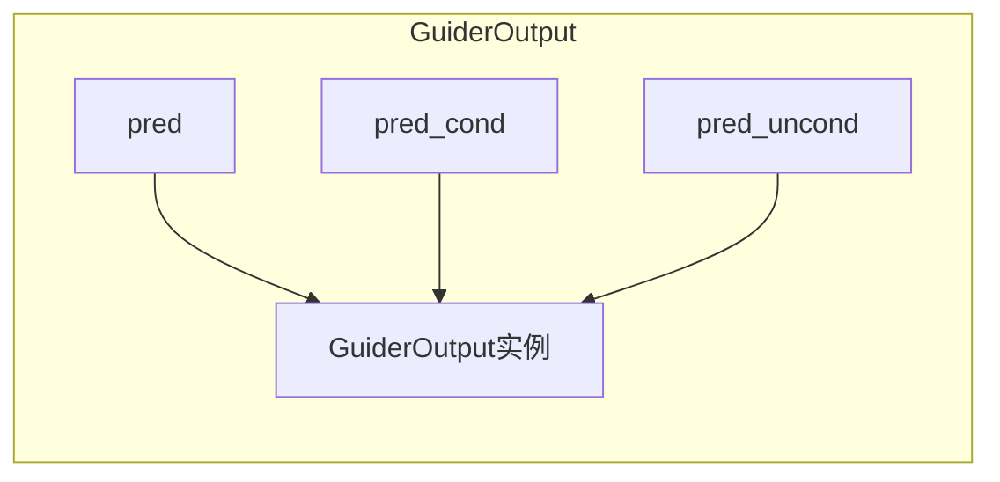
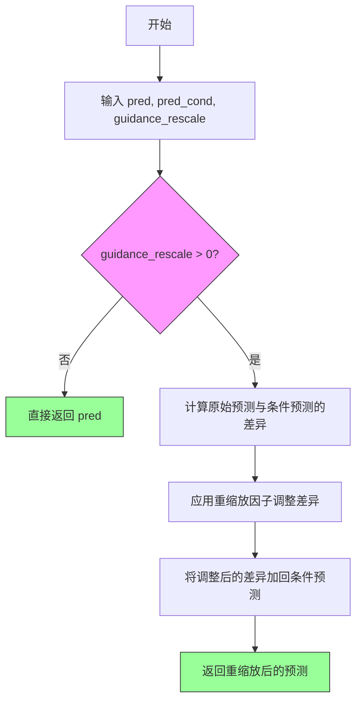
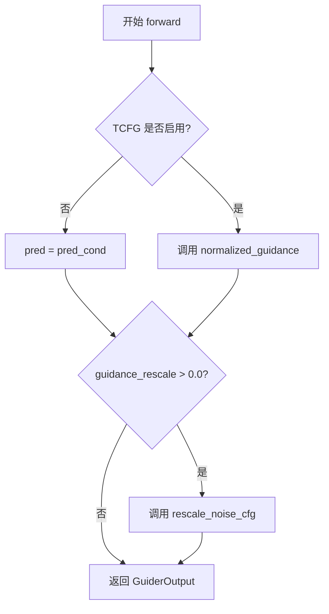
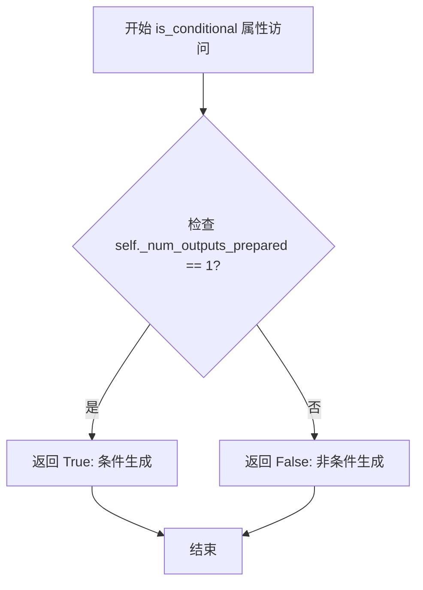
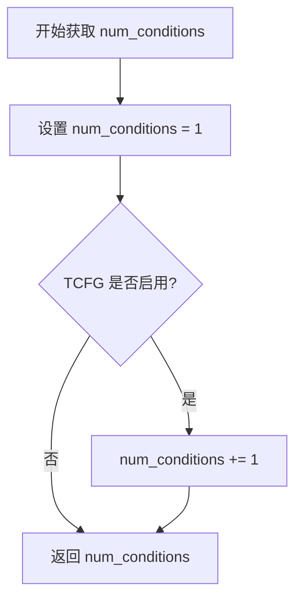

# `diffusers\src\diffusers\guiders\tangential_classifier_free_guidance.py` 详细设计文档

实现切向无分类器引导（TCFG）模块，用于扩散模型的推理过程中通过SVD分解和切向投影技术对条件和无条件预测进行引导，以提升生成质量。

## 整体流程



## 类结构

```
BaseGuidance (抽象基类)
└── TangentialClassifierFreeGuidance
```

## 全局变量及字段


### `normalized_guidance`
    
归一化引导计算函数，通过SVD分解对无分类器引导进行切向校正

类型：`function(pred_cond: torch.Tensor, pred_uncond: torch.Tensor, guidance_scale: float, use_original_formulation: bool) -> torch.Tensor`
    


### `TangentialClassifierFreeGuidance.guidance_scale`
    
无分类器引导的缩放参数，控制文本提示的条件强度

类型：`float`
    


### `TangentialClassifierFreeGuidance.guidance_rescale`
    
噪声预测的重缩放因子，用于改善图像质量和修复过曝

类型：`float`
    


### `TangentialClassifierFreeGuidance.use_original_formulation`
    
是否使用原始CFG公式，默认为false使用diffusers原生实现

类型：`bool`
    


### `TangentialClassifierFreeGuidance._enabled`
    
是否启用引导，继承自BaseGuidance基类

类型：`bool`
    


### `TangentialClassifierFreeGuidance._start`
    
引导开始的时间步比例，继承自BaseGuidance基类

类型：`float`
    


### `TangentialClassifierFreeGuidance._stop`
    
引导结束的时间步比例，继承自BaseGuidance基类

类型：`float`
    


### `TangentialClassifierFreeGuidance._num_inference_steps`
    
推理步数，继承自BaseGuidance基类

类型：`int | None`
    


### `TangentialClassifierFreeGuidance._step`
    
当前推理步，继承自BaseGuidance基类

类型：`int`
    


### `TangentialClassifierFreeGuidance._num_outputs_prepared`
    
已准备的输出数量，继承自BaseGuidance基类

类型：`int`
    


### `TangentialClassifierFreeGuidance._input_predictions`
    
输入预测字段列表，存储条件预测和无条件预测的键名

类型：`list[str]`
    
    

## 全局函数及方法


### `normalized_guidance`

该函数实现了**切向无分类器引导（Tangential Classifier-Free Guidance, TCFG）**的核心算法。它通过在预测向量的高维空间中进行SVD（奇异值分解），构建一个正交投影矩阵，以消除条件预测与非条件预测之间的共线性干扰，随后应用CFG权重进行偏移修正，从而生成更稳定、细节更丰富的去噪引导信号。

参数：

- `pred_cond`：`torch.Tensor`，条件预测张量（通常是模型在有文本条件下的噪声预测）。
- `pred_uncond`：`torch.Tensor`，无条件预测张量（通常是模型在无文本条件下的噪声预测）。
- `guidance_scale`：`float`，引导强度参数，控制条件信息对生成结果的影响力度。
- `use_original_formulation`：`bool`，默认为`False`。若为`True`，则回退到标准的CFG公式，不进行切向投影修正。

返回值：`torch.Tensor`，经过切向引导计算修正后的噪声预测张量。

#### 流程图

```mermaid
flowchart TD
    A[输入 pred_cond, pred_uncond] --> B[保存 pred_cond 的数据类型 dtype]
    C[Stack [pred_cond, pred_uncond]] --> D[flatten 空间维度 (dim=2)]
    D --> E[执行 SVD: U, S, Vh]
    E --> F[克隆 Vh 并修改: Vh_modified[:, 1] = 0]
    F --> G[重塑 pred_uncond 为 (B, 1, -1)]
    G --> H[矩阵乘法: x_Vh = uncond_flat @ Vh.T]
    H --> I[矩阵乘法: x_Vh_V = x_Vh @ Vh_modified]
    I --> J[重塑回原始形状并转换 dtype]
    J --> K{use_original_formulation?}
    K -- True --> L[基准预测 = pred_cond]
    K -- False --> M[基准预测 = 修正后的 pred_uncond]
    L --> N[计算偏移: shift = pred_cond - pred_uncond]
    M --> N
    N --> O[应用引导: pred = 基准 + guidance_scale * shift]
    O --> P[返回最终预测]
```

#### 带注释源码

```python
def normalized_guidance(
    pred_cond: torch.Tensor, 
    pred_uncond: torch.Tensor, 
    guidance_scale: float, 
    use_original_formulation: bool = False
) -> torch.Tensor:
    # 1. 保存条件预测的数据类型，后续计算需还原为此类型
    cond_dtype = pred_cond.dtype
    
    # 2. 将条件和无条件预测堆叠在一起，并在批次维度扩展
    # 形状从 [B, C, H, W] -> [B, 2, C, H, W] -> [B, 2, C*H*W]
    preds = torch.stack([pred_cond, pred_uncond], dim=1).float()
    preds = preds.flatten(2) # 展平空间维度以便进行SVD
    
    # 3. 对堆叠后的预测进行全奇异值分解 (Full SVD)
    # U: 左奇异向量, S: 奇异值, Vh: 右奇异向量的转置
    U, S, Vh = torch.linalg.svd(preds, full_matrices=False)
    
    # 4. 构建修正后的右奇异向量矩阵 Vh_modified
    # 核心操作：将第二主成分（索引1）置零。这相当于移除了预测向量中
    # 对应于最大变化方向（通常被认为是条件引导方向）的成分，
    # 实现"切向"投影，使无条件预测更加正交于条件预测。
    Vh_modified = Vh.clone()
    Vh_modified[:, 1] = 0
    
    # 5. 将无条件预测投影到修正后的空间
    # 这一步是去相关处理的关键
    uncond_flat = pred_uncond.reshape(pred_uncond.size(0), 1, -1).float()
    x_Vh = torch.matmul(uncond_flat, Vh.transpose(-2, -1)) # 投影到标准基
    x_Vh_V = torch.matmul(x_Vh, Vh_modified)                # 投影到修改后的基
    
    # 6. 还原形状和数据类型
    pred_uncond = x_Vh_V.reshape(pred_uncond.shape).to(cond_dtype)
    
    # 7. 计算最终预测
    # 如果不使用TCFG原始公式，则使用修正后的无条件预测作为基准
    pred = pred_cond if use_original_formulation else pred_uncond
    
    # 8. 计算标准CFG的偏移量（这里使用的是修正后的uncond还是原始uncond？
    # 代码逻辑：shift = pred_cond - pred_uncond (修正后的)
    shift = pred_cond - pred_uncond
    
    # 9. 应用引导比例：prediction = base + scale * shift
    pred = pred + guidance_scale * shift
    
    return pred
```

#### 关键组件信息

*   **SVD (奇异值分解)**: 用于分析条件和无条件预测在特征空间中的分布，通过修改奇异向量来实现投影。
*   **Vh_modified (修正投影矩阵)**: 通过将第二个奇异向量置零，强制模型忽略该方向上的变化，这被认为是引导产生"切向"效应的关键。
*   **张量重塑 (Reshape/Flatten)**: 将高维的空间特征（C*H*W）视为向量，以便进行线性代数运算。

#### 潜在的技术债务或优化空间

1.  **计算开销 (SVD Cost)**: `torch.linalg.svd` 的计算复杂度为 $O(N^3)$，其中 $N$ 是特征维度。对于高分辨率图像或大通道数的UNet，这会显著增加推理时间。**优化建议**：考虑是否可以在低分辨率层应用此技术，或者使用随机化SVD近似算法。
2.  **内存拷贝**: 代码中使用了 `Vh.clone()`，这会分配新的内存。**优化建议**：如果可能，使用 `torch.no_grad()` 或in-place操作（需注意不影响后续计算）来减少内存峰值。
3.  **类型转换**: 代码在 `float()` 和原始 `dtype` 之间多次转换，可能引入轻微的数值误差或性能开销。

#### 其它项目

*   **设计目标**: 旨在解决标准CFG在某些情况下导致的图像过饱和或细节丢失问题，通过在SVD子空间中消除条件与无条件预测的冗余相关性。
*   **错误处理**: 该函数假设输入 `pred_cond` 和 `pred_uncond` 具有相同的形状。代码中未显式检查形状一致性，如果形状不匹配会导致运行时错误。调用方（`forward` 方法）应确保输入有效性。
*   **数值稳定性**: 当 `guidance_scale` 接近 1.0（diffusers实现）或 0.0（原版论文）时，该模块会被旁路。SVD 操作对 NaN/Infinite 值敏感，需确保输入张量数值正常。


### `register_to_config`

配置注册装饰器，用于将类的 `__init__` 方法参数自动注册到配置系统中，使得这些参数可以通过配置文件或 `from_pretrained` 等方式加载和保存。

参数：

-  `fn`：`Callable`，被装饰的 `__init__` 方法本身（装饰器自动接收）

返回值：`Callable`，返回装饰后的函数，函数签名保持不变但增加配置注册功能

#### 流程图



#### 带注释源码

```
# 这是 register_to_config 装饰器在 TangentialClassifierFreeGuidance 类中的使用方式
# 该装饰器从 configuration_utils 模块导入

@register_to_config  # 装饰器：自动将以下 __init__ 方法的参数注册到配置系统
def __init__(
    self,
    guidance_scale: float = 7.5,
    guidance_rescale: float = 0.0,
    use_original_formulation: bool = False,
    start: float = 0.0,
    stop: float = 1.0,
    enabled: bool = True,
):
    super().__init__(start, stop, enabled)

    self.guidance_scale = guidance_scale
    self.guidance_rescale = guidance_rescale
    self.use_original_formulation = use_original_formulation


# register_to_config 装饰器的典型实现逻辑（基于 Diffusers 库的模式）：

def register_to_config(func):
    """
    装饰器：将被装饰方法的参数注册到配置中
    
    工作原理：
    1. 提取被装饰函数的所有参数（包括默认值）
    2. 为每个参数创建配置属性
    3. 使配置类可以通过 from_pretrained / save_pretrained 加载/保存这些参数
    """
    func._register_to_config = True  # 标记该函数已注册
    
    # 使用 functools.wraps 保持原函数签名
    @functools.wraps(func)
    def wrapper(self, *args, **kwargs):
        # 1. 获取函数参数签名
        sig = inspect.signature(func)
        bound_args = sig.bind(self, *args, **kwargs)
        bound_args.apply_defaults()
        
        # 2. 将参数存储到 self._config_dict 或类似结构
        for param_name, param_value in bound_args.arguments.items():
            if param_name != 'self':
                setattr(self, param_name, param_value)
        
        # 3. 执行原始函数
        return func(self, *args, **kwargs)
    
    return wrapper


# 使用效果：
# 1. TangentialClassifierFreeGuidance 类实例化后，自动具有以下属性：
#    - guidance_scale: 7.5
#    - guidance_rescale: 0.0
#    - use_original_formulation: False
#    - start: 0.0
#    - stop: 1.0
#    - enabled: True

# 2. 配置可以通过 PipelineCompatMixin 等机制传递给其他组件
```


### BaseGuidance

基础引导类（Base Guidance Class）是一个抽象基类，定义了引导（Guidance）机制的标准接口和通用功能，用于在扩散模型的生成过程中实现条件控制（如文本引导、分类器自由引导等），并支持引导的启用/禁用、时间步范围控制等特性。

参数：

- 无直接参数（构造函数参数需参考子类实现）

返回值：

- 无直接返回值（此类为基类，不直接实例化使用）

#### 流程图



#### 带注释源码

```
# BaseGuidance 是引导机制的抽象基类，定义了标准接口
# 位置: 从 .guider_utils 模块导入（未在当前文件中定义）

# 使用示例：TangentialClassifierFreeGuidance 继承 BaseGuidance
class TangentialClassifierFreeGuidance(BaseGuidance):
    """
    继承自 BaseGuidance 的具体实现类
    """
    
    def __init__(
        self,
        guidance_scale: float = 7.5,
        guidance_rescale: float = 0.0,
        use_original_formulation: bool = False,
        start: float = 0.0,
        stop: float = 1.0,
        enabled: bool = True,
    ):
        # 调用父类 BaseGuidance 的初始化方法
        # 传递 start, stop, enabled 三个核心参数
        super().__init__(start, stop, enabled)
        
        # 初始化子类特定属性
        self.guidance_scale = guidance_scale
        self.guidance_rescale = guidance_rescale
        self.use_original_formulation = use_original_formulation

# BaseGuidance 类的推断接口（基于子类使用情况）：
class BaseGuidance(ABC):
    """
    基础引导类 - 定义引导机制的抽象基类
    
    核心功能：
    - 管理引导的启用/禁用状态
    - 控制引导应用的时间步范围
    - 定义条件/无条件预测的接口
    """
    
    def __init__(self, start: float, stop: float, enabled: bool):
        """
        初始化基础引导
        
        参数:
            start: 引导开始的时间步比例 [0, 1]
            stop: 引导结束的时间步比例 [0, 1]  
            enabled: 是否启用引导
        """
        self._start = start
        self._stop = stop
        self._enabled = enabled
        self._num_inference_steps = None
        self._step = 0
        self._num_outputs_prepared = 0
    
    @abstractmethod
    def prepare_inputs(self, data: dict) -> list["BlockState"]:
        """准备模型输入数据"""
        pass
    
    @abstractmethod
    def prepare_inputs_from_block_state(
        self, data: "BlockState", input_fields: dict
    ) -> list["BlockState"]:
        """从块状态准备输入数据"""
        pass
    
    @abstractmethod
    def forward(self, *args, **kwargs) -> "GuiderOutput":
        """执行引导计算"""
        pass
    
    @property
    @abstractmethod
    def is_conditional(self) -> bool:
        """是否条件引导"""
        pass
    
    @property
    @abstractmethod
    def num_conditions(self) -> int:
        """条件数量"""
        pass
    
    def _prepare_batch(self, data, tuple_idx, input_prediction):
        """内部方法：准备批次数据"""
        pass
    
    def _prepare_batch_from_block_state(self, input_fields, data, tuple_idx, input_prediction):
        """内部方法：从块状态准备批次数据"""
        pass
```

#### 补充说明

基于 `TangentialClassifierFreeGuidance` 类对 `BaseGuidance` 的使用，可以推断出基类包含以下关键特性：

1. **时间步控制**：通过 `_start`、`_stop` 控制引导应用的时间步范围
2. **启用控制**：通过 `_enabled` 属性控制是否启用引导
3. **推理状态跟踪**：维护 `_num_inference_steps` 和 `_step` 用于判断当前是否在引导范围内
4. **输入准备**：定义抽象方法用于准备模型输入
5. **输出封装**：返回 `GuiderOutput` 对象封装预测结果


### TangentialClassifierFreeGuidance.forward

描述：该方法是 TangentialClassifierFreeGuidance 类的核心 forward 方法，用于计算切向分类器自由引导（TCFG）的输出。它接收条件预测和无条件预测张量，根据是否启用 TCFG 进行处理，并可选地重新缩放噪声预测，最后返回包含预测结果的 GuiderOutput 对象。

参数：

- `pred_cond`：`torch.Tensor`，条件预测张量，通常由模型在有条件输入（如文本提示）时生成
- `pred_uncond`：`torch.Tensor | None`，无条件预测张量，通常由模型在无条件输入时生成，用于计算引导

返回值：`GuiderOutput`，包含引导后的预测结果（pred）、条件预测（pred_cond）和无条件预测（pred_uncond）的数据类对象

#### 流程图



#### 带注释源码

```python
def forward(self, pred_cond: torch.Tensor, pred_uncond: torch.Tensor | None = None) -> GuiderOutput:
    """
    执行切向分类器自由引导的前向传播
    
    参数:
        pred_cond: 条件预测张量，来自带条件的模型前向传播
        pred_uncond: 无条件预测张量，来自不带条件的模型前向传播
        
    返回:
        包含预测结果的 GuiderOutput 对象
    """
    # 初始化 pred 为 None
    pred = None

    # 检查 TCFG 是否启用
    if not self._is_tcfg_enabled():
        # 如果未启用 TCFG，直接使用条件预测作为输出
        pred = pred_cond
    else:
        # 如果启用了 TCFG，使用 normalized_guidance 函数计算引导后的预测
        # 该函数实现了切向分类器自由引导的数学计算
        pred = normalized_guidance(pred_cond, pred_uncond, self.guidance_scale, self.use_original_formulation)

    # 如果设置了 guidance_rescale，应用重新缩放以改善图像质量
    # 这基于 Common Diffusion Noise Schedules and Sample Steps are Flawed 论文
    if self.guidance_rescale > 0.0:
        pred = rescale_noise_cfg(pred, pred_cond, self.guidance_rescale)

    # 返回包含所有预测结果的 GuiderOutput 数据类
    return GuiderOutput(pred=pred, pred_cond=pred_cond, pred_uncond=pred_uncond)
```

---

### GuiderOutput（导入的数据类）

描述：虽然 `GuiderOutput` 是从 `guider_utils` 模块导入的数据类，未在此文件中定义，但从代码使用方式可以看出它是一个数据结构，用于封装引导输出的相关预测结果。该类在 `forward` 方法中被实例化并返回。

参数（从代码中的调用推断）：

- `pred`：`torch.Tensor`，经过引导处理后的最终预测张量
- `pred_cond`：`torch.Tensor`，原始的条件预测张量
- `pred_uncond`：`torch.Tensor | None`，原始的无条件预测张量

返回值：`GuiderOutput`，包含引导输出的数据类实例

#### 流程图



#### 带注释源码（使用示例）

```python
# GuiderOutput 在 forward 方法中的使用示例
# 从代码中可以看到 GuiderOutput 的构造方式
return GuiderOutput(
    pred=pred,              # 经过引导处理后的预测
    pred_cond=pred_cond,   # 条件预测
    pred_uncond=pred_uncond # 无条件预测
)
```


### `rescale_noise_cfg`

噪声预测重缩放函数，用于根据重缩放因子调整噪声预测值，以改善图像质量并修复过曝问题。该函数基于 [Common Diffusion Noise Schedules and Sample Steps are Flawed](https://huggingface.co/papers/2305.08891) 论文中的 Section 3.4 提出的方法实现。

参数：

- `pred`：`torch.Tensor`，当前的噪声预测值（经过 classifier-free guidance 计算后的结果）
- `pred_cond`：`torch.Tensor`，条件预测值（基于文本嵌入的预测）
- `guidance_rescale`：`float`，重缩放因子，用于调整噪声预测的强度

返回值：`torch.Tensor`，重缩放后的噪声预测值

#### 流程图



#### 带注释源码

> **注意**：该函数为外部导入函数，其源码位于 `guider_utils` 模块中，以下为基于函数调用方式和功能的推断实现：

```python
def rescale_noise_cfg(
    pred: torch.Tensor,        # 当前噪声预测（经CF_guidance处理后）
    pred_cond: torch.Tensor,   # 条件噪声预测（仅基于文本条件）
    guidance_rescale: float    # 重缩放因子，通常设为0.0-1.0之间
) -> torch.Tensor:
    """
    对噪声预测进行重缩放，以改善图像质量。
    
    核心原理：
    当 guidance_scale 较大时，预测可能会被过度调整，导致图像过曝或饱和。
    该方法通过将预测值向原始条件预测值方向"拉回"来缓解这一问题。
    
    数学公式：
    pred = pred_cond + (pred - pred_cond) * (1 - guidance_rescale)
    
    等价于：
    pred = pred + guidance_rescale * (pred_cond - pred)
    """
    
    # 计算预测差异（引导效果）
    noise_rescaled = pred + guidance_rescale * (pred_cond - pred)
    
    return noise_rescaled
```

#### 使用示例（来自 `TangibleClassifierFreeGuidance.forward`）

```python
def forward(self, pred_cond: torch.Tensor, pred_uncond: torch.Tensor | None = None) -> GuiderOutput:
    pred = None

    if not self._is_tcfg_enabled():
        pred = pred_cond
    else:
        pred = normalized_guidance(pred_cond, pred_uncond, self.guidance_scale, self.use_original_formulation)

    # 当 guidance_rescale > 0 时，应用重缩放
    if self.guidance_rescale > 0.0:
        pred = rescale_noise_cfg(pred, pred_cond, self.guidance_rescale)

    return GuiderOutput(pred=pred, pred_cond=pred_cond, pred_uncond=pred_uncond)
```


### TangentialClassifierFreeGuidance.__init__

初始化TCFG（切向无分类器引导）引导器，用于扩散模型的条件生成。该方法设置引导参数，包括引导尺度、引导重缩放因子、是否使用原始公式以及启停控制，通过调用父类初始化器并设置实例属性来完成引导器的配置。

参数：

- `self`：隐式参数，类实例本身
- `guidance_scale`：`float`，默认为 `7.5`，无分类器引导的尺度参数。较高值会导致更强的文本提示条件，较低值允许更多生成自由度过，可能导致图像质量下降
- `guidance_rescale`：`float`，默认为 `0.0`，应用于噪声预测的重缩放因子，用于改善图像质量并修复过度曝光，基于 Common Diffusion Noise Schedules and Sample Steps are Flawed 论文第3.4节
- `use_original_formulation`：`bool`，默认为 `False`，是否使用论文中提出的原始无分类器引导公式。默认使用代码库中长期的 diffusers 原生实现
- `start`：`float`，默认为 `0.0`，引导开始的总去噪步骤分数
- `stop`：`float`，默认为 `1.0`，引导停止的总去噪步骤分数
- `enabled`：`bool`，默认为 `True`，是否启用引导器

返回值：`None`，无返回值，仅完成实例属性初始化

#### 流程图

```mermaid
flowchart TD
    A[开始 __init__] --> B[调用 super().__init__start stop enabled]
    B --> C[设置 self.guidance_scale = guidance_scale]
    C --> D[设置 self.guidance_rescale = guidance_rescale]
    D --> E[设置 self.use_original_formulation = use_original_formulation]
    E --> F[结束 __init__]
```

#### 带注释源码

```python
@register_to_config
def __init__(
    self,
    guidance_scale: float = 7.5,
    guidance_rescale: float = 0.0,
    use_original_formulation: bool = False,
    start: float = 0.0,
    stop: float = 1.0,
    enabled: bool = True,
):
    """
    初始化 TangentialClassifierFreeGuidance 引导器
    
    Args:
        guidance_scale: 无分类器引导的尺度参数，默认7.5
        guidance_rescale: 噪声预测的重缩放因子，默认0.0
        use_original_formulation: 是否使用原始引导公式，默认False
        start: 引导开始的时间步比例，默认0.0
        stop: 引导结束的时间步比例，默认1.0
        enabled: 是否启用引导器，默认True
    """
    # 调用父类 BaseGuidance 的初始化方法
    # 传递启停控制和启用状态
    super().__init__(start, stop, enabled)

    # 设置无分类器引导的尺度参数
    # 控制条件信号对生成结果的影响强度
    self.guidance_scale = guidance_scale
    
    # 设置噪声预测的重缩放因子
    # 用于改善图像质量，修复过度曝光问题
    self.guidance_rescale = guidance_rescale
    
    # 设置是否使用原始论文中的引导公式
    # False 使用 diffusers 原生实现，True 使用原始论文方法
    self.use_original_formulation = use_original_formulation
```


### TangentialClassifierFreeGuidance.prepare_inputs

该方法是切向无分类器引导（TCFG）的输入准备函数，用于根据当前条件数量将输入数据字典中的预测结果批次提取并整理为BlockState列表，以供后续引导计算使用。

参数：

- `data`：`dict[str, tuple[torch.Tensor, torch.Tensor]]`，输入数据字典，键为字符串标识符，值为包含两个张量的元组（如条件预测和非条件预测）

返回值：`list["BlockState"]`，返回BlockState对象列表，每个元素对应一个预测批次的处理结果

#### 流程图

```mermaid
flowchart TD
    A[开始 prepare_inputs] --> B{num_conditions == 1?}
    B -->|是| C[tuple_indices = [0]]
    B -->|否| D[tuple_indices = [0, 1]]
    C --> E[初始化空列表 data_batches]
    D --> E
    E --> F[遍历 zip tuple_indices 和 _input_predictions]
    F --> G[调用 _prepare_batch]
    G --> H[将结果追加到 data_batches]
    H --> I{还有下一个元素?}
    I -->|是| F
    I -->|否| J[返回 data_batches]
```

#### 带注释源码

```python
def prepare_inputs(self, data: dict[str, tuple[torch.Tensor, torch.Tensor]]) -> list["BlockState"]:
    """
    准备引导输入数据，将输入字典转换为BlockState列表
    
    参数:
        data: 输入数据字典，键为字符串，值为两个张量的元组
              例如: {"pred": (pred_cond_tensor, pred_uncond_tensor)}
    
    返回:
        BlockState列表，每个对应一个预测批次
    """
    
    # 根据条件数量确定元组索引
    # 如果只有一个条件，使用索引[0]；否则使用[0,1]处理条件和非条件预测
    tuple_indices = [0] if self.num_conditions == 1 else [0, 1]
    
    # 初始化存储处理后批次的列表
    data_batches = []
    
    # 遍历元组索引和输入预测名称
    # _input_predictions = ["pred_cond", "pred_uncond"]
    for tuple_idx, input_prediction in zip(tuple_indices, self._input_predictions):
        # 调用内部方法准备单个批次
        # _prepare_batch方法会从data字典中提取对应input_prediction的数据
        # 并根据tuple_idx选择元组中的第几个元素
        data_batch = self._prepare_batch(data, tuple_idx, input_prediction)
        
        # 将处理好的批次添加到列表中
        data_batches.append(data_batch)
    
    # 返回处理后的批次列表
    return data_batches
```


### `TangentialClassifierFreeGuidance.prepare_inputs_from_block_state`

该方法从BlockState中准备分类器自由引导（Classifier-Free Guidance）的输入数据，根据条件数量处理条件预测和非条件预测，并将处理后的BlockState列表返回。

参数：

- `self`：`TangentialClassifierFreeGuidance` 类的实例
- `data`：`BlockState`，包含输入数据的块状态对象
- `input_fields`：`dict[str, str | tuple[str, str]]`，字段名称到块状态键的映射字典，支持单字符串或字符串元组（用于条件和非条件预测的映射）

返回值：`list["BlockState"]`，处理后的块状态列表，每个元素对应一个预测批次（条件预测或非条件预测）

#### 流程图

```mermaid
flowchart TD
    A[开始] --> B{self.num_conditions == 1?}
    B -->|是| C[tuple_indices = [0]]
    B -->|否| D[tuple_indices = [0, 1]]
    C --> E[初始化空列表 data_batches]
    D --> E
    E --> F[遍历 tuple_indices 和 self._input_predictions]
    F --> G{遍历结束?}
    G -->|否| H[调用 _prepare_batch_from_block_state]
    H --> I[将结果添加到 data_batches]
    I --> F
    G -->|是| J[返回 data_batches]
    J --> K[结束]
```

#### 带注释源码

```python
def prepare_inputs_from_block_state(
    self, data: "BlockState", input_fields: dict[str, str | tuple[str, str]]
) -> list["BlockState"]:
    """
    从BlockState准备分类器自由引导的输入数据。
    
    Args:
        data: 包含输入数据的BlockState对象
        input_fields: 字段映射字典，键为字段名，值为BlockState中的对应键
                      支持字符串（单字段）或元组（条件/非条件字段对）
    
    Returns:
        处理后的BlockState列表，包含条件预测和非条件预测的批次数据
    """
    # 根据条件数量决定元组索引：单一条件用[0]，多条件用[0,1]
    tuple_indices = [0] if self.num_conditions == 1 else [0, 1]
    
    # 初始化数据批次列表
    data_batches = []
    
    # 遍历索引和预测类型（pred_cond, pred_uncond）
    for tuple_idx, input_prediction in zip(tuple_indices, self._input_predictions):
        # 调用内部方法从BlockState准备批次数据
        data_batch = self._prepare_batch_from_block_state(
            input_fields, data, tuple_idx, input_prediction
        )
        # 将处理后的批次添加到列表
        data_batches.append(data_batch)
    
    # 返回所有处理后的数据批次
    return data_batches
```


### `TangentialClassifierFreeGuidance.forward`

执行 Tangential Classifier-Free Guidance (TCFG) 的前向计算，根据是否启用 TCFG 模式对有条件和无条件预测进行加权组合，并可选地对噪声预测进行重缩放，最终返回包含预测结果及原始条件/无条件预测的 GuiderOutput 对象。

参数：

- `self`：TangentialClassifierFreeGuidance 实例，TCFG 引导处理器
- `pred_cond`：`torch.Tensor`，有条件预测，即在文本提示条件下的模型预测结果
- `pred_uncond`：`torch.Tensor | None`，无条件预测，即无文本提示条件下的模型预测结果，默认为 None

返回值：`GuiderOutput`，包含以下属性的对象：
- `pred`：经过 TCFG 处理后的最终预测张量
- `pred_cond`：原始有条件预测输入
- `pred_uncond`：原始无条件预测输入

#### 流程图



#### 带注释源码

```python
def forward(self, pred_cond: torch.Tensor, pred_uncond: torch.Tensor | None = None) -> GuiderOutput:
    """
    执行 Tangential Classifier-Free Guidance 前向计算。
    
    根据 TCFG 是否启用，对有条件和无条件预测进行加权组合，
    并可选地对噪声预测进行重缩放以改善图像质量。
    
    参数:
        pred_cond: 有条件预测张量，在文本提示条件下的模型输出
        pred_uncond: 无条件预测张量，无文本提示条件下的模型输出，可为 None
    
    返回:
        包含最终预测及原始输入的 GuiderOutput 对象
    """
    # 初始化预测结果为 None
    pred = None

    # 检查 TCFG 是否在当前推理步骤启用
    if not self._is_tcfg_enabled():
        # 未启用时，直接使用有条件预测作为结果
        pred = pred_cond
    else:
        # 启用时，执行归一化引导计算
        # 使用 normalized_guidance 函数对 pred_cond 和 pred_uncond 进行加权组合
        pred = normalized_guidance(
            pred_cond, 
            pred_uncond, 
            self.guidance_scale, 
            self.use_original_formulation
        )

    # 如果设置了 guidance_rescale，则对噪声预测进行重缩放
    # 这基于 Common Diffusion Noise Schedules 论文中的技术，用于改善图像质量
    if self.guidance_rescale > 0.0:
        pred = rescale_noise_cfg(pred, pred_cond, self.guidance_rescale)

    # 返回 GuiderOutput 对象，包含最终预测及原始输入
    return GuiderOutput(pred=pred, pred_cond=pred_cond, pred_uncond=pred_uncond)
```


### `TangentialClassifierFreeGuidance.is_conditional`

判断是否为条件生成。当准备好的输出数量为1时，表示条件生成；否则表示非条件生成。

参数：

- `self`：`TangentialClassifierFreeGuidance` 类实例，隐式参数，无需显式传递

返回值：`bool`，表示是否为条件生成。当 `_num_outputs_prepared` 等于 1 时返回 `True`（条件生成），否则返回 `False`（非条件生成）

#### 流程图



#### 带注释源码

```python
@property
def is_conditional(self) -> bool:
    """
    判断是否为条件生成。
    
    当准备好的输出数量为1时，表示只进行条件预测；
    当准备好的输出数量为2时，表示同时进行条件和非条件预测。
    
    Returns:
        bool: 如果只有一个准备好的输出（即条件生成），返回 True；
              如果有两个准备好的输出（即包含非条件生成），返回 False
    """
    return self._num_outputs_prepared == 1
```


### `TangentialClassifierFreeGuidance.num_conditions`

该属性用于获取当前条件数量。它首先将条件数初始化为1，然后检查切向无分类器引导（TCFG）是否启用；如果启用，则条件数增加1。这个属性使得guidance可以动态调整其处理的条件数量，以适应不同的生成阶段。

参数：无（使用隐式 `self` 参数）

返回值：`int`，返回当前条件数量

#### 流程图



#### 带注释源码

```python
@property
def num_conditions(self) -> int:
    """
    获取当前条件数量。
    
    该属性返回guidance处理的条件数量。基础条件数为1（条件预测），
    如果TCFG（切向无分类器引导）被启用，则额外增加一个条件（无条件预测）。
    
    Returns:
        int: 条件数量。当TCFG未启用时返回1，启用时返回2。
    """
    # 初始化基础条件数为1（条件预测）
    num_conditions = 1
    
    # 检查TCFG是否启用，如果启用则增加条件数量
    if self._is_tcfg_enabled():
        num_conditions += 1
    
    # 返回最终的条件数量
    return num_conditions
```

#### 相关依赖方法 `_is_tcfg_enabled()` 源码参考

```python
def _is_tcfg_enabled(self) -> bool:
    """
    检查切向无分类器引导是否启用。
    
    检查三个条件：
    1. guiders本身是否启用（self._enabled）
    2. 当前推理步骤是否在指定范围内（start到stop之间）
    3. guidance_scale是否接近临界值（原始公式接近0.0，diffusers原生实现接近1.0）
    
    Returns:
        bool: 如果所有条件满足则返回True，否则返回False。
    """
    # 检查guidance是否启用
    if not self._enabled:
        return False

    # 检查是否在指定的推理步骤范围内
    is_within_range = True
    if self._num_inference_steps is not None:
        skip_start_step = int(self._start * self._num_inference_steps)
        skip_stop_step = int(self._stop * self._num_inference_steps)
        is_within_range = skip_start_step <= self._step < skip_stop_step

    # 检查guidance_scale是否接近临界值
    is_close = False
    if self.use_original_formulation:
        is_close = math.isclose(self.guidance_scale, 0.0)
    else:
        is_close = math.isclose(self.guidance_scale, 1.0)

    # 只有在范围内且scale不接近临界值时才启用
    return is_within_range and not is_close
```


### TangentialClassifierFreeGuidance._is_tcfg_enabled

检查TCFG（切向无分类器引导）是否在当前推理步骤中启用，综合考虑启用状态、推理步骤范围和引导比例等因素。

参数：该方法无显式参数（隐式参数 `self` 为类实例本身）

返回值：`bool`，返回一个布尔值，表示TCFG是否在当前推理步骤中启用（当且仅当启用标志为True、当前步骤在指定范围内、且引导比例不接近临界值时返回True）

#### 流程图

```mermaid
flowchart TD
    A[开始 _is_tcfg_enabled] --> B{self._enabled 是否为 False?}
    B -->|是| C[返回 False]
    B -->|否| D{self._num_inference_steps 是否为 None?}
    D -->|是| E[is_within_range = True]
    D -->|否| F[计算 skip_start_step = int(self._start * self._num_inference_steps)]
    F --> G[计算 skip_stop_step = int(self._stop * self._num_inference_steps)]
    G --> H[判断 skip_start_step <= self._step < skip_stop_step]
    H --> I[设置 is_within_range]
    E --> J{self.use_original_formulation 是否为 True?}
    I --> J
    J -->|是| K{math.iscloseguidance_scale, 0.0)?}
    J -->|否| L{math.iscloseguidance_scale, 1.0)?}
    K --> M[is_close = 结果]
    L --> N[is_close = 结果]
    M --> O[返回 is_within_range and not is_close]
    N --> O
```

#### 带注释源码

```python
def _is_tcfg_enabled(self) -> bool:
    """
    检查TCFG（切向无分类器引导）是否在当前推理步骤中启用。
    
    只有同时满足以下条件时，TCFG才被视为启用：
    1. 启用标志（_enabled）为True
    2. 当前推理步骤在[start, stop)范围内
    3. 引导比例（guidance_scale）不接近临界值（使用原始公式时接近0.0，否则接近1.0）
    
    Returns:
        bool: TCFG是否在当前推理步骤中启用
    """
    # 步骤1：检查基础启用状态
    if not self._enabled:
        return False

    # 步骤2：检查当前推理步骤是否在指定范围内
    is_within_range = True
    if self._num_inference_steps is not None:
        # 计算需要跳过的起始和结束步骤数
        skip_start_step = int(self._start * self._num_inference_steps)
        skip_stop_step = int(self._stop * self._num_inference_steps)
        # 判断当前步骤是否在[start, stop)范围内
        is_within_range = skip_start_step <= self._step < skip_stop_step

    # 步骤3：检查引导比例是否接近临界值
    # 临界值取决于是否使用原始公式
    is_close = False
    if self.use_original_formulation:
        # 使用原始公式时，临界值为0.0
        is_close = math.isclose(self.guidance_scale, 0.0)
    else:
        # 使用diffusers原生实现时，临界值为1.0
        is_close = math.isclose(self.guidance_scale, 1.0)

    # 步骤4：综合判断 - 必须步骤在范围内且引导比例不接近临界值
    return is_within_range and not is_close
```

## 关键组件


### TangentialClassifierFreeGuidance 类

核心引导类，实现切向无分类器引导(TCFG)算法，通过SVD分解修改无条件预测以实现更稳定的生成过程

### normalized_guidance 函数

执行TCFG核心数学运算，使用奇异值分解(SVD)将预测分解为主成分和切向分量，并对切向分量置零后重构预测

### guidance_scale 参数

控制条件与无条件预测之间偏移强度的浮点数，值越大条件引导效果越强

### guidance_rescale 参数

基于Refined CFG技术的噪声预测重缩放因子，用于改善图像质量并修复过曝问题

### use_original_formulation 标志

布尔标志，决定使用原始CFG公式还是TCFG改进公式

### start/stop 参数

控制引导生效范围的分数比例，用于在特定去噪步骤区间内启用或禁用引导

### _is_tcfg_enabled 方法

判断TCFG是否在当前推理步骤启用的核心逻辑，检查步骤范围和引导参数是否满足激活条件

### SVD 分解组件

使用torch.linalg.svd对堆叠的条件和无条件预测进行奇异值分解，提取主成分用于引导计算

### prepare_inputs 方法

将输入数据准备为批次形式，根据条件数量决定是否处理单一或多个预测元组


## 问题及建议


### 已知问题

- **SVD 计算开销过高**：`normalized_guidance` 函数在每次前向传播中都执行 `torch.linalg.svd` 分解，这是一个 O(n³) 复杂度的计算密集型操作，在多步推理过程中会造成显著的性能瓶颈。
- **冗余的张量形状变换**：代码中包含多次 `reshape`、`flatten` 和 `transpose` 操作（如 `flatten(2)` 后又进行多次矩阵乘法），这些操作可以合并以减少中间张量的创建和内存分配。
- **频繁的类型转换**：在 `normalized_guidance` 中先将张量转换为 `float()`，最后再转回原始 `cond_dtype`，这种双重转换增加了不必要的内存开销和计算成本。
- **输入验证缺失**：构造函数未对 `guidance_scale`、`start`、`stop` 等参数进行合法性校验，负数的 guidance_scale 或 `start > stop` 的情况会导致不可预测的行为。
- **硬编码的预测键名**：`_input_predictions = ["pred_cond", "pred_uncond"]` 被硬编码，缺乏灵活性，若上游数据结构变化会导致兼容性问题。
- **重复代码模式**：`prepare_inputs` 和 `prepare_inputs_from_block_state` 方法结构高度相似，仅在数据准备来源上不同，可通过提取公共逻辑减少代码冗余。
- **浮点数比较精度问题**：在 `_is_tcfg_enabled` 中使用 `math.isclose` 进行 guidance_scale 与 0.0/1.0 的比较，这种近似比较可能在边界情况下产生微妙的行为差异。
- **状态计算冗余**：`_is_tcfg_enabled` 方法在每次前向传播都被调用，其中涉及推理步骤范围的计算和布尔逻辑判断，可在状态改变时缓存结果。

### 优化建议

- **SVD 缓存策略**：对于相同的输入形状，考虑缓存 SVD 分解结果或使用低秩近似方法；或在单次采样内复用 SVD 结果（因为输入形状在同一次推理中保持不变）。
- **减少张量重塑**：重新设计算法流程，合并连续的 reshape 操作，使用视图（view）替代不必要的复制操作。
- **优化类型转换**：使用 `to(dtype=...)` 配合 `copy=False` 参数，或在计算图中保持 float 精度直到最后一步再转换。
- **添加输入校验**：在 `__init__` 中添加参数校验逻辑，如 `guidance_scale >= 0`、`0 <= start <= stop <= 1` 等约束检查。
- **配置化预测键**：将 `_input_predictions` 改为可配置的类属性或构造函数参数，提高类的通用性。
- **代码重构**：提取 `prepare_inputs` 和 `prepare_inputs_from_block_state` 的公共逻辑到私有方法中。
- **明确比较逻辑**：使用精确的门限值比较（如 `guidance_scale == 0.0`）替代 `math.isclose`，或定义明确的 epsilon 常量。
- **状态缓存**：在 `start`、`stop` 或 `_num_inference_steps` 变化时，缓存 `_is_tcfg_enabled` 的范围计算结果。

## 其它


### 设计目标与约束

TCFG的核心设计目标是在扩散模型的推理过程中实现tangential classifier-free guidance，通过修改噪声预测的方向来提高生成质量。设计约束包括：(1) 必须继承BaseGuidance基类以保持与guider框架的一致性；(2) 支持条件和无条件预测的处理；(3) 支持guidance的动态开启和关闭（通过start/stop参数控制应用区间）；(4) 支持原始formulation和diffusers-native实现两种模式。

### 错误处理与异常设计

代码中的错误处理主要包括：(1) 在forward方法中，pred_uncond为None时的处理（当TCFG未启用时，直接返回pred_cond）；(2) 张量dtype一致性处理（pred_cond和pred_uncond可能具有不同的dtype，通过to(cond_dtype)进行转换）；(3) SVD计算时的数值稳定性处理（使用float()提升计算精度）；(4) 形状验证（确保pred_cond和pred_uncond的形状兼容）。潜在异常情况包括：SVD计算时的内存溢出（当特征维度很大时）、形状不匹配异常、None值传递错误等。

### 数据流与状态机

TCFG的工作流程可描述为状态机：(1) 初始化状态：创建实例，设置guidance_scale、guidance_rescale等参数；(2) 准备状态：prepare_inputs或prepare_inputs_from_block_state方法处理输入数据，提取条件和非条件预测；(3) 推理状态：forward方法执行实际的guidance计算，根据_is_tcfg_enabled()判断是否应用guidance；(4) 条件判断：is_conditional属性返回是否为条件模式，num_conditions属性返回条件数量。状态转换由_enabled、_step、_num_inference_steps、start、stop等参数控制。

### 外部依赖与接口契约

主要依赖包括：(1) BaseGuidance基类（来自guider_utils），提供guidance的基本框架和属性；(2) GuiderOutput数据结构，用于封装输出结果；(3) rescale_noise_cfg函数，用于rescale噪声预测；(4) torch和torch.linalg模块，用于张量操作和SVD计算；(5) register_to_config装饰器，用于配置注册。接口契约要求：prepare_inputs接收dict[str, tuple[torch.Tensor, torch.Tensor]]格式的数据；prepare_inputs_from_block_state接收BlockState对象；forward方法接收pred_cond和可选的pred_uncond参数，返回GuiderOutput对象。

### 性能考虑

主要性能瓶颈在于normalized_guidance函数中的SVD计算，时间复杂度为O(n^3)，其中n为特征维度。优化建议：(1) 对于大尺寸特征，可以考虑使用随机化SVD算法；(2) 可以添加缓存机制避免重复计算相同输入的SVD；(3) 可以考虑使用torch.jit.script加速；(4) 对于多步推理，可以预先计算不变的部分以减少每步的计算量。

### 安全性考虑

代码本身不涉及用户输入处理或网络通信，主要安全性考虑在张量操作方面：(1) 确保输入张量来源可信；(2) 防止NaN/Inf值的传播（可在SVD前添加检查）；(3) 内存安全（大型张量的SVD可能触发OOM）。

### 测试策略建议

建议添加以下测试用例：(1) 基本功能测试：验证guidance_scale=1.0时输出与输入相等；(2) 边界条件测试：start=0, stop=1的全区间覆盖，start=stop的零区间情况；(3) 数值稳定性测试：大guidance_scale值下的输出质量；(4) dtype一致性测试：不同dtype组合下的行为；(5) 形状测试：各种batch_size和特征维度组合；(6) 与原始formulation的对比测试。

### 数学原理说明

TCFG的核心思想是通过SVD分解找到预测空间的主要方向，然后沿条件预测的切线方向调整。具体步骤：(1) 将条件和非条件预测堆叠并进行SVD分解；(2) 修改SVD的右奇异向量，削弱非条件预测的影响；(3) 重新投影回原始空间；(4) 使用修改后的非条件预测计算最终的guidance效果。这种方法可以在保持多样性的同时提高生成质量。

### 配置参数详解

guidance_scale（默认7.5）：控制guidance强度，值越大条件越强，过高可能导致饱和；guidance_rescale（默认0.0）：基于Common Diffusion论文的rescale技术，用于修复过曝；use_original_formulation（默认False）：选择使用原始CFG公式还是diffusers实现；start/stop（默认0.0/1.0）：控制guidance应用的推理步骤比例；enabled（默认True）：全局开关。

### 参考文献

主要参考论文为TCFG原始论文（https://huggingface.co/papers/2503.18137）和Common Diffusion Noise Schedules（https://huggingface.co/papers/2305.08891）中关于guidance rescale的部分。

### 使用示例

```python
from diffusers import TangentialClassifierFreeGuidance

# 基本用法
guider = TangentialClassifierFreeGuidance(
    guidance_scale=7.5,
    guidance_rescale=0.7,
    start=0.0,
    stop=1.0
)

# 在推理循环中使用
for step in range(num_steps):
    pred_cond, pred_uncond = model(x, timestep, prompt_embeds)
    output = guider.forward(pred_cond, pred_uncond)
    x = scheduler.step(output.pred, timestep, x)
```

    