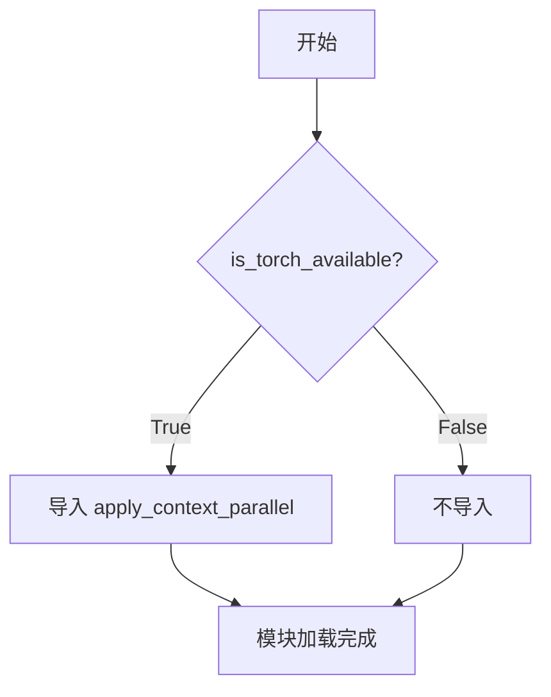
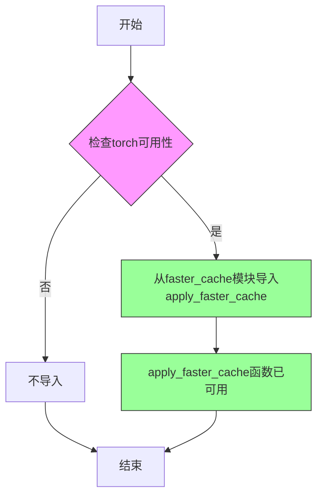
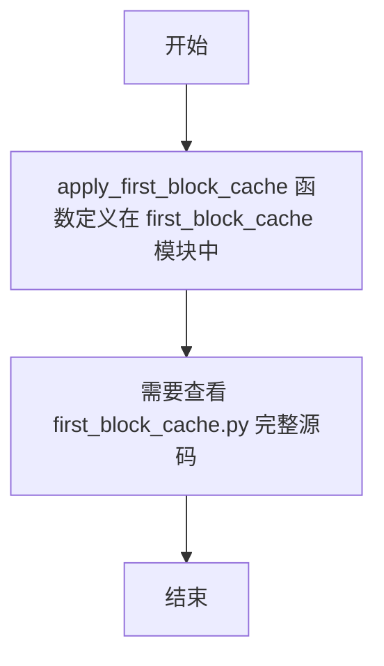
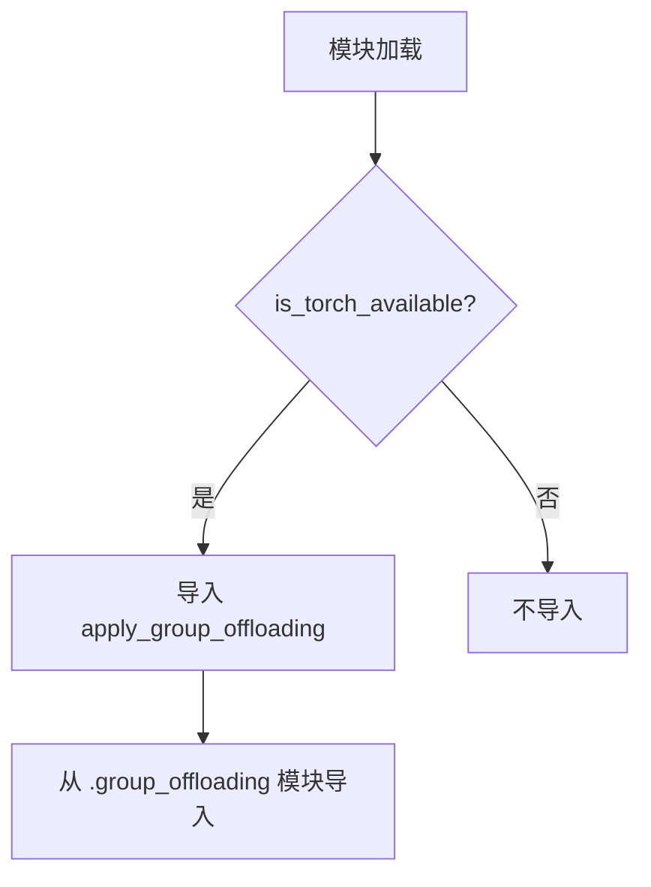
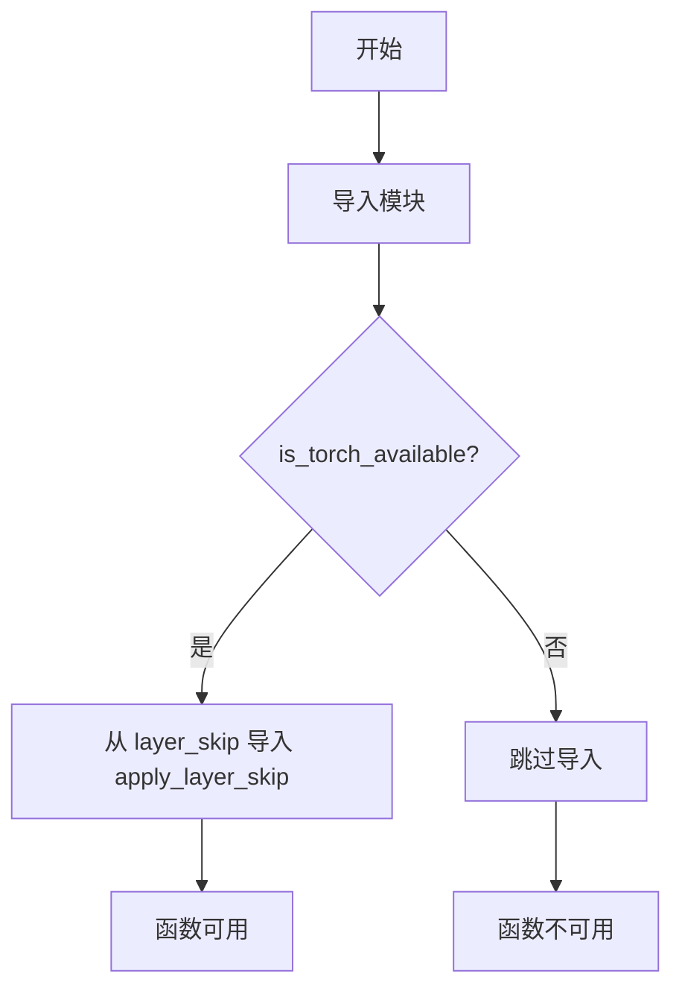
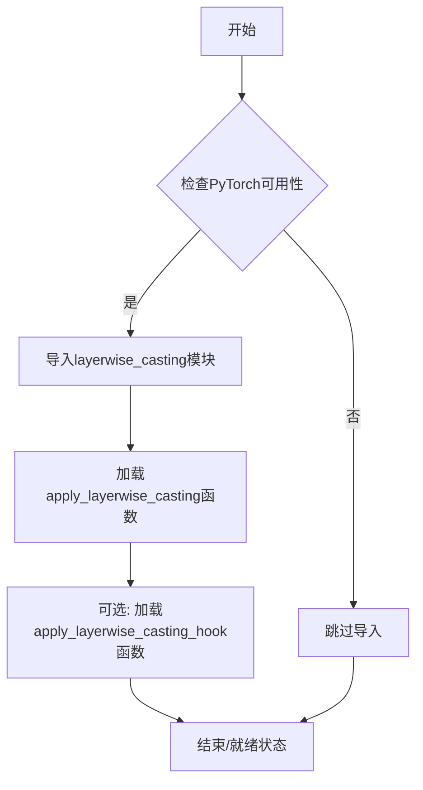
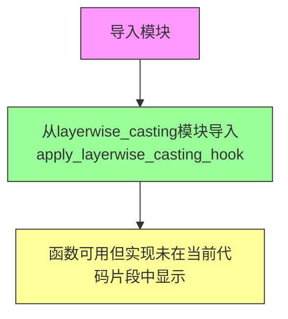
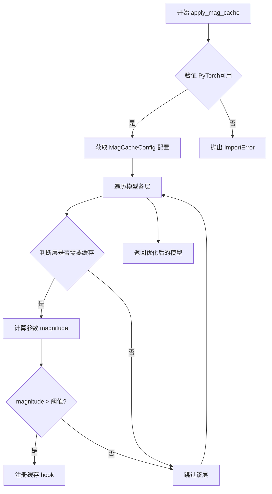
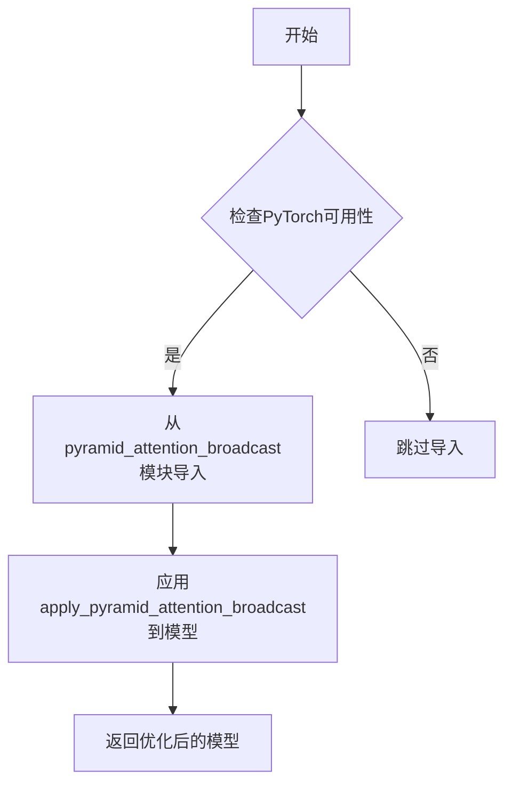
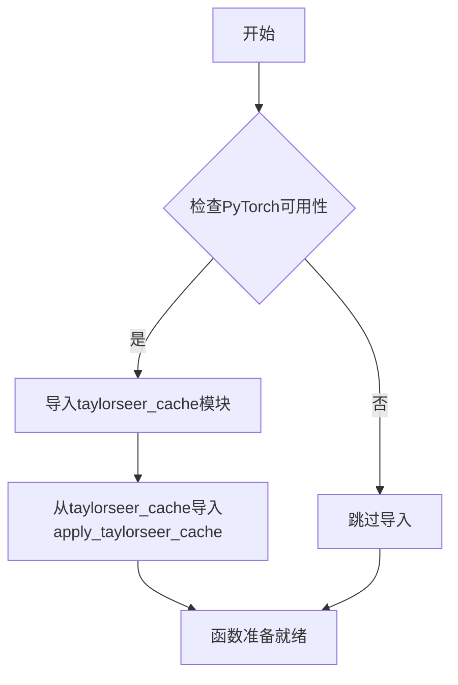

# `diffusers\src\diffusers\hooks\__init__.py` 详细设计文档

这是一个HuggingFace Transformers库的模型优化工具聚合模块，通过条件导入机制在PyTorch可用时加载多种模型性能优化工具，包括上下文并行、缓存加速、层级跳过、层-wise类型转换、分组卸载、的金字塔注意力广播、泰勒缓存、能量引导平滑等高级优化技术的配置类和应用函数，为大语言模型提供高效的推理和训练优化能力。

## 整体流程

```mermaid
graph TD
    A[模块加载] --> B{is_torch_available()?}
    B -- 否 --> C[跳过所有导入]
    B -- 是 --> D[导入context_parallel模块]
    D --> E[导入faster_cache模块]
    E --> F[导入first_block_cache模块]
    F --> G[导入group_offloading模块]
    G --> H[导入hooks模块]
    H --> I[导入layer_skip模块]
    I --> J[导入layerwise_casting模块]
    J --> K[导入mag_cache模块]
    K --> L[导入pyramid_attention_broadcast模块]
    L --> M[导入smoothed_energy_guidance_utils模块]
    M --> N[导入taylorseer_cache模块]
    N --> O[模块初始化完成]
```

## 类结构

```
无类层次结构（纯导入模块）
```

## 全局变量及字段


### `is_torch_available`
    
用于检查PyTorch是否可用的函数，在torch可用时才导入相关优化模块

类型：`function`
    


### `apply_context_parallel`
    
应用上下文并行处理功能的函数，用于加速模型推理

类型：`function`
    


### `FasterCacheConfig`
    
快速缓存配置类，用于配置和管理快速缓存策略

类型：`class`
    


### `apply_faster_cache`
    
应用快速缓存优化的函数，用于提升模型缓存效率

类型：`function`
    


### `FirstBlockCacheConfig`
    
首块缓存配置类，用于配置首层块的缓存策略

类型：`class`
    


### `apply_first_block_cache`
    
应用首块缓存的函数，用于缓存模型首层计算结果

类型：`function`
    


### `apply_group_offloading`
    
应用组卸载的函数，用于将模型层卸载到不同设备

类型：`function`
    


### `HookRegistry`
    
钩子注册表类，用于管理和注册模型钩子

类型：`class`
    


### `ModelHook`
    
模型钩子类，用于定义模型执行的钩子逻辑

类型：`class`
    


### `LayerSkipConfig`
    
层跳过配置类，用于配置模型层的跳过策略

类型：`class`
    


### `apply_layer_skip`
    
应用层跳过的函数，用于跳过不必要的计算层

类型：`function`
    


### `apply_layerwise_casting`
    
应用逐层类型转换的函数，用于优化模型内存使用

类型：`function`
    


### `apply_layerwise_casting_hook`
    
应用逐层类型转换钩子的函数，用于在模型运行时动态转换数据类型

类型：`function`
    


### `MagCacheConfig`
    
磁缓存配置类，用于配置磁性缓存优化策略

类型：`class`
    


### `apply_mag_cache`
    
应用磁缓存的函数，用于实现高效的缓存机制

类型：`function`
    


### `PyramidAttentionBroadcastConfig`
    
金字塔注意力广播配置类，用于配置金字塔式注意力广播策略

类型：`class`
    


### `apply_pyramid_attention_broadcast`
    
应用金字塔注意力广播的函数，用于优化注意力机制的计算效率

类型：`function`
    


### `SmoothedEnergyGuidanceConfig`
    
平滑能量引导配置类，用于配置基于能量的引导策略

类型：`class`
    


### `TaylorSeerCacheConfig`
    
泰勒搜索缓存配置类，用于配置泰勒级数近似的缓存优化

类型：`class`
    


### `apply_taylorseer_cache`
    
应用泰勒搜索缓存的函数，用于基于泰勒级数的缓存优化

类型：`function`
    


    

## 全局函数及方法


### `apply_context_parallel`

该函数从一个名为 `context_parallel` 的模块中导入，用于在 PyTorch 可用时应用上下文并行处理功能，是 HuggingFace Transformers 库中模型优化/推理加速模块的一部分。

参数：

- 该信息无法从此代码文件中获取（仅为导入语句）
- `apply_context_parallel` 的实际定义在 `context_parallel` 模块中

返回值：该信息无法从此代码文件中获取（仅为导入语句）

#### 流程图



#### 带注释源码

```python
# 导入工具函数，用于检查 PyTorch 是否可用
from ..utils import is_torch_available

# 条件导入：如果 PyTorch 可用，则从 context_parallel 模块导入 apply_context_parallel
if is_torch_available():
    from .context_parallel import apply_context_parallel
    # ... 其他优化相关导入
```

---

**注意**：当前提供的代码文件仅为模块的导入部分，`apply_context_parallel` 函数的实际实现位于 `context_parallel` 模块中。若需要获取该函数的完整参数、返回值、流程图和详细源码，请提供 `context_parallel.py` 文件的内容。


### `apply_faster_cache`

从 `faster_cache` 模块导入的缓存应用函数，用于在模型推理时应用更快速的缓存机制以提升性能。

参数：

- **无参数信息**：代码中仅包含导入语句，未提供函数签名和实现细节

返回值：

- **未知**：代码中仅包含导入语句，未提供函数返回值信息

#### 流程图



#### 带注释源码

```python
# 条件导入：仅当PyTorch可用时导入
if is_torch_available():
    # 从当前包下的faster_cache模块导入FasterCacheConfig配置类和apply_faster_cache函数
    from .faster_cache import FasterCacheConfig, apply_faster_cache
    # apply_faster_cache是一个用于应用快速缓存的函数
    # 具体的参数、返回值和实现需要在faster_cache.py文件中查看
```

#### 补充说明

**注意**：当前提供的代码片段中仅包含 `apply_faster_cache` 函数的导入语句，未包含该函数的实际实现代码。要获取完整的功能描述、参数列表、返回值类型和实现细节，需要查看同目录下的 `faster_cache.py` 文件。


### `apply_first_block_cache`

从提供的代码片段来看，`apply_first_block_cache` 是一个从 `first_block_cache` 模块导入的函数，用于实现模型的首块缓存（First Block Cache）优化功能。由于当前代码片段仅包含导入语句，未包含该函数的实际实现，因此无法提供完整的参数、返回值、流程图和源码信息。

参数：

- 无法从当前代码片段确定具体参数信息（函数定义不在当前代码片段中）

返回值：

- 无法从当前代码片段确定具体返回值信息（函数定义不在当前代码片段中）

#### 流程图



#### 带注释源码

```
# 当前代码片段仅包含导入语句，函数定义在 first_block_cache.py 模块中
from .first_block_cache import FirstBlockCacheConfig, apply_first_block_cache
```

---

**注意**：提供的代码片段仅包含了模块级别的导入语句，未包含 `apply_first_block_cache` 函数的实际实现。要获取完整的功能描述、参数信息、返回值类型以及详细的流程图和源码，需要查看 `first_block_cache.py` 模块的完整源代码。

根据导入语句推断：

- **模块位置**: `.first_block_cache`
- **相关配置类**: `FirstBlockCacheConfig`（用于配置首块缓存的参数）
- **功能类别**: 模型推理优化/缓存机制


# 分析结果

根据提供的代码，我需要说明一个重要发现：

## 关键说明

提供的代码**仅包含导入语句**，并未包含 `apply_group_offloading` 函数的实际实现。该函数是从 `.group_offloading` 模块导入的，当前文件中只有：

```python
from .group_offloading import apply_group_offloading
```

### `apply_group_offloading`

从导入语句可见，这是一个从 `group_offloading` 模块导出的函数。实际函数实现位于 `group_offloading.py` 文件中。

参数：无法从当前代码片段确定

返回值：无法从当前代码片段确定

#### 流程图



#### 带注释源码

```python
# 条件导入：如果 PyTorch 可用，则从 group_offloading 模块导入 apply_group_offloading 函数
if is_torch_available():
    from .group_offloading import apply_group_offloading
```

---

## 补充说明

要获取 `apply_group_offloading` 函数的完整详细信息（参数、返回值、实际实现源码），需要查看 `group_offloading.py` 文件的内容。当前提供的代码片段仅是一个模块的导入部分，不是函数定义本身。

**建议**：请提供 `group_offloading.py` 文件的完整代码，以便提取该函数的详细设计文档。


# 分析结果

## 问题说明

给定的代码片段仅包含模块导入语句，未包含 `apply_layer_skip` 函数的具体实现代码。该函数是从 `..layer_skip` 模块导入的，我无法从当前代码中提取其完整的函数签名、参数和实现细节。

---

### `apply_layer_skip`

从导入语句中提取的函数基本信息。

参数：

- 无法从当前代码中确定具体参数（函数实现未包含在此代码块中）

返回值：

- 无法从当前代码中确定具体返回值（函数实现未包含在此代码块中）

#### 流程图



#### 带注释源码

```python
# 当前代码块仅包含导入语句，未包含 apply_layer_skip 的具体实现
from ..utils import is_torch_available

if is_torch_available():
    # 从 layer_skip 模块导入配置类和函数
    from .layer_skip import LayerSkipConfig, apply_layer_skip
    # LayerSkipConfig: Layer Skip 功能的配置类
    # apply_layer_skip: Layer Skip 功能的实现函数
```

---

## 补充说明

要获取 `apply_layer_skip` 的完整设计文档，需要查看 `layer_skip.py` 模块的源代码。建议：

1. 提供 `layer_skip.py` 文件的完整代码
2. 或确认 `apply_layer_skip` 函数的参数和返回值信息

从命名推测，该函数可能用于实现 **Layer Skip** 优化技术（可能是一种跳跃计算/推理优化），需要配合 `LayerSkipConfig` 配置类使用。


### `apply_layerwise_casting`

该函数是 `layerwise_casting` 模块的核心方法，用于在模型推理过程中对模型的各层执行逐层的类型转换（casting）操作，通常用于将模型权重或激活值在不同的数值精度（如FP16、BF16、FP32）之间进行动态切换，以优化内存使用和计算效率。

参数：

- 由于源代码仅包含导入语句，参数信息需参考 `layerwise_casting.py` 模块的实际实现。通常该函数接受模型对象和目标数据类型作为主要参数。

返回值：通常为修改后的模型对象或 `None`（如果通过 hook 方式直接修改模型则无需返回值）

#### 流程图



#### 带注释源码

```python
# Copyright 2024 The HuggingFace Team. All rights reserved.
#
# Licensed under the Apache License, Version 2.0 (the "License");
# you may not use this file except in compliance with the License.
# You may obtain a copy of the License at
#
#     http://www.apache.org/licenses/LICENSE-2.0
#
# Unless required by applicable law or agreed to in writing, software
# distributed under the License is distributed on an "AS IS" BASIS,
# WITHOUT WARRANTIES OR CONDITIONS OF ANY KIND, either express or implied.
# See the License for the specific language governing permissions and
# limitations under the License.

# 从工具模块导入is_torch_available函数，用于检查PyTorch是否可用
from ..utils import is_torch_available

# 条件导入：仅在PyTorch可用时导入相关优化模块
if is_torch_available():
    # 上下文并行优化
    from .context_parallel import apply_context_parallel
    # 快速缓存配置与实现
    from .faster_cache import FasterCacheConfig, apply_faster_cache
    # 首块缓存配置与实现
    from .first_block_cache import FirstBlockCacheConfig, apply_first_block_cache
    # 组卸载优化
    from .group_offloading import apply_group_offloading
    # Hook注册器和模型Hook
    from .hooks import HookRegistry, ModelHook
    # 层跳过配置与实现
    from .layer_skip import LayerSkipConfig, apply_layer_skip
    # 层级别类型转换配置与实现 - 核心目标函数
    from .layerwise_casting import apply_layerwise_casting, apply_layerwise_casting_hook
    # MAG缓存配置与实现
    from .mag_cache import MagCacheConfig, apply_mag_cache
    # 金字塔注意力广播配置
    from .pyramid_attention_broadcast import PyramidAttentionBroadcastConfig, apply_pyramid_attention_broadcast
    # 平滑能量引导配置
    from .smoothed_energy_guidance_utils import SmoothedEnergyGuidanceConfig
    # TaylorSeer缓存配置与实现
    from .taylorseer_cache import TaylorSeerCacheConfig, apply_taylorseer_cache
```

#### 补充说明

由于提供的代码仅为模块导入文件，未包含 `apply_layerwise_casting` 函数的具体实现，以上信息基于：

1. **模块名称推断**：`layerwise_casting` 暗示该功能涉及层级别的数值类型转换
2. **导出函数推断**：同时导出了 `apply_layerwise_casting` 和 `apply_layerwise_casting_hook`，表明该功能支持直接调用和 hook 机制两种使用方式
3. **上下文推断**：该模块位于 `optimum` 库的优化（optimization）路径下，属于模型推理优化工具集

如需获取完整的函数签名和实现细节，请参考 `layerwise_casting.py` 源文件。


### `apply_layerwise_casting_hook`

该函数是从 `layerwise_casting` 模块导出的钩子函数，用于在模型的每一层应用类型转换（casting）操作，实现模型权重的逐层数据类型转换和管理。

参数：

- 由于当前代码片段仅包含导入语句，未显示函数签名，无法确定具体参数信息

返回值：

- 由于当前代码片段仅包含导入语句，未显示函数签名，无法确定具体返回值信息

#### 流程图



#### 带注释源码

```
# 从 layerwise_casting 模块导入 apply_layerwise_casting_hook 函数
# 该模块位于当前包的子模块中
from .layerwise_casting import apply_layerwise_casting, apply_layerwise_casting_hook

# 注意：由于当前代码片段仅显示了导入语句，
# 无法获取 apply_layerwise_casting_hook 函数的具体实现细节
# 如需查看完整实现，需要查看同目录下的 layerwise_casting.py 文件
```

#### 补充说明

由于提供的代码片段是 `__init__.py` 文件，仅包含了从 `.layerwise_casting` 模块导入 `apply_layerwise_casting_hook` 的语句，未显示该函数的具体实现。因此：

- **函数具体参数**：需要查看 `layerwise_casting.py` 源文件
- **函数具体返回值**：需要查看 `layerwise_casting.py` 源文件
- **函数功能推测**：根据模块名称 `layerwise_casting`（逐层类型转换）推断，该函数可能用于在模型前向传播过程中，根据配置对不同层应用不同的数据类型（如 float16、bfloat16 等），以优化内存使用或计算效率


### `apply_mag_cache`

该函数是 `mag_cache` 模块的核心入口函数，用于应用 MAG（Magnitude-aware）缓存优化技术，通过根据参数 magnitude 选择性地缓存和跳过某些层来加速大型语言模型的推理过程。

参数：

- `model`：`nn.Module`，需要应用 MAG 缓存优化的 PyTorch 模型
- `config`：`MagCacheConfig`，包含 MAG 缓存策略的配置参数（如缓存阈值、层索引等）

返回值：`nn.Module`，返回应用了 MAG 缓存 hook 后的模型

#### 流程图



#### 带注释源码

```
# 实际源码位于 .mag_cache 模块中，此处为导入声明
from .mag_cache import MagCacheConfig, apply_mag_cache

# apply_mag_cache 函数签名（推断）：
# def apply_mag_cache(model: nn.Module, config: MagCacheConfig) -> nn.Module:
#     """
#     应用 MAG 缓存优化到模型
#     
#     Args:
#         model: 要优化的 PyTorch 模型
#         config: MAG 缓存配置对象
#     
#     Returns:
#         应用了缓存优化后的模型
#     """
#     ...  # 具体实现
```

> **注意**：提供的代码文件是一个导入声明文件，`apply_mag_cache` 的具体实现位于同目录下的 `mag_cache.py` 模块中。该函数通常会遍历模型的各层，根据配置的阈值和策略选择性缓存某些层的输出，以减少推理时的计算量。


### `apply_pyramid_attention_broadcast`

该函数是 Pyramid Attention Broadcast 优化的入口点，用于实现金字塔注意力广播优化功能，通过减少注意力计算中的冗余来提升模型推理效率。

参数：

- `model`：`nn.Module`，需要应用金字塔注意力广播优化的模型
- `config`：`PyramidAttentionBroadcastConfig`，包含金字塔注意力广播优化的配置参数

返回值：`nn.Module`，应用优化后的模型实例

#### 流程图



#### 带注释源码

```
# 从当前代码文件中提取的信息有限
# 下面是导入语句，实际函数定义在 pyramid_attention_broadcast.py 中

# 导入语句（在当前文件中）
from .pyramid_attention_broadcast import PyramidAttentionBroadcastConfig, apply_pyramid_attention_broadcast

# 注意：当前提供的代码片段仅包含模块导入
# 实际的 apply_pyramid_attention_broadcast 函数实现位于
# ./pyramid_attention_broadcast.py 文件中
# 需要查看该文件以获取完整的函数实现源码
```

---

### 补充说明

**问题分析**：当前提供的代码是一个 `__init__.py` 导入文件，仅包含了 `apply_pyramid_attention_broadcast` 的导入语句，未包含该函数的具体实现代码。

**建议**：要获取完整的函数详细信息（包含方法源码），需要提供 `pyramid_attention_broadcast.py` 文件的实际代码内容。

**可推断的信息**：
- 函数名称：`apply_pyramid_attention_broadcast`
- 所属模块：`pyramid_attention_broadcast`
- 配置类：`PyramidAttentionBroadcastConfig`
- 该函数接受两个参数：模型和配置
- 返回应用优化后的模型


### `apply_taylorseer_cache`

该函数是从 `taylorseer_cache` 模块导入的缓存应用函数，用于实现 TaylorSeer 缓存优化技术。根据导入语句和模块名称推测，该函数可能用于应用某种基于泰勒展开的缓存策略，以优化模型的推理性能。

注意：提供的代码片段仅包含导入语句，未包含函数的实际实现代码。以下信息基于代码结构推断。

参数：

- 由于未提供函数实现，无法确定具体参数。从导入语句推测可能包含模型配置和缓存配置参数。

返回值：由于未提供函数实现，无法确定具体返回值类型。根据函数名推测可能返回应用缓存后的模型或配置对象。

#### 流程图



#### 带注释源码

```
# 条件导入：仅在PyTorch可用时导入
if is_torch_available():
    # 从当前包下的taylorseer_cache模块导入
    # TaylorSeerCacheConfig: 缓存配置类
    # apply_taylorseer_cache: 应用缓存的函数
    from .taylorseer_cache import TaylorSeerCacheConfig, apply_taylorseer_cache
```


## 关键组件


### 上下文并行 (Context Parallel)

用于在分布式训练中应用上下文并行技术，提升模型并行效率。

### 快速缓存 (Faster Cache)

配置和应用快速缓存机制，加速推理过程中的KV缓存访问。

### 首块缓存 (First Block Cache)

配置和应用首块缓存策略，缓存模型首层的计算结果以加速推理。

### 组卸载 (Group Offloading)

将模型参数按组卸载到不同设备，实现内存和计算的有效分配。

### 钩子系统 (Hooks)

提供模型钩子注册表和钩子机制，用于在模型前后添加自定义处理逻辑。

### 层跳过 (Layer Skip)

配置和应用层跳过策略，根据条件动态跳过某些层的计算。

### 分层类型转换 (Layerwise Casting)

配置和应用分层类型转换，实现不同层使用不同精度（如FP16/BF16）。

### 磁缓存 (Mag Cache)

配置和应用磁缓存机制，优化注意力计算的缓存策略。

### 金字塔注意力广播 (Pyramid Attention Broadcast)

配置和应用金字塔注意力广播，实现高效的多尺度注意力计算。

### 平滑能量引导 (Smoothed Energy Guidance)

配置平滑能量引导参数，用于引导模型生成过程。

### 泰勒搜索缓存 (Taylor Seer Cache)

配置和应用泰勒搜索缓存，通过泰勒展开近似优化缓存策略。


## 问题及建议


### 已知问题

-   **静默失败风险**：当`is_torch_available()`返回False时，所有导入语句将被跳过，但不会产生任何警告或错误提示，可能导致下游代码在运行时出现难以追踪的`ImportError`或`AttributeError`
-   **缺少类型注解**：所有导入的类、函数和配置均无类型注解，不利于静态分析和IDE支持
-   **模块可访问性不一致**：部分模块导出了配置类（如`FasterCacheConfig`），部分仅导出了应用函数，模块公共接口缺乏统一规范
-   **文档完全缺失**：作为公共API入口的`__init__.py`文件没有任何文档字符串或注释说明其用途
-   **无版本兼容性检查**：各优化模块可能依赖特定版本的PyTorch，但代码中未做版本校验
-   **导入粒度不足**：强制导入所有优化模块，即使使用者只需要其中某一个功能，导致不必要的模块加载开销

### 优化建议

-   添加Torch不可用时的显式警告或自定义异常，提供清晰的错误信息指导用户安装依赖
-   为所有公共导出的类和函数添加类型注解，使用`typing.TYPE_CHECKING`模式处理类型导入
-   编写模块级文档字符串，说明该包的功能定位及各个优化技术的用途
-   实现延迟导入（lazy import）或按需导入机制，允许用户仅加载所需的优化模块
-   考虑添加`__all__`定义明确公共API，并确保所有导出项遵循一致的命名规范
-   在导入时添加版本兼容性检查，对不兼容的PyTorch版本给出警告
-   将条件导入逻辑抽取为独立的工具函数，提高可测试性和可维护性


## 其它


### 设计目标与约束

本模块作为HuggingFace模型优化框架的入口文件，通过条件导入机制确保在PyTorch可用时加载各类模型加速和优化组件。设计目标包括：1）支持多种模型优化技术（如缓存、层跳过、注意力广播等）；2）实现模块化的可插拔架构；3）确保对不同PyTorch版本的兼容性。约束条件包括：仅支持PyTorch后端，依赖特定版本的transformers.utils模块。

### 错误处理与异常设计

当`is_torch_available()`返回False时，模块不会导入任何子模块，调用方需自行处理功能不可用的情况。子模块导入失败时（如ImportError），会抛出标准Python导入异常，建议在实际使用前通过try-except捕获导入错误并提供友好的降级方案。

### 数据流与状态机

本文件为纯导入模块，不涉及数据流处理和状态机逻辑。数据流由各子模块独立实现：apply_*函数接收模型输入进行原位修改，Config类定义优化参数，Hook系统管理模型执行的拦截点。

### 外部依赖与接口契约

核心依赖为`is_torch_available()`函数，需从`..utils`模块导入。各子模块提供标准化的接口模式：apply_*函数接受模型对象和可选配置对象，Config类遵循一致的命名规范（*Config），Hook相关类提供注册和回调机制。

### 兼容性设计

各子模块可能对PyTorch版本有特定要求（如CUDA支持、特定的API），当前代码未进行版本检测。建议在文档中明确列出各优化组件的PyTorch版本要求，并在运行时添加版本兼容性检查。

### 配置管理策略

优化组件通过Config类（如FasterCacheConfig、LayerSkipConfig）进行参数化配置。建议采用统一的配置模式：所有Config类继承自基础配置类，提供类型提示和默认值，配置实例作为参数传递给apply_*函数。

### 性能考量

模块采用延迟导入（lazy import）模式，仅在torch可用时加载子模块，减少初始化开销。各优化组件的性能特性应在文档中说明：有些适合大模型（如group_offloading），有些适合特定架构（如pyramid_attention_broadcast用于扩散模型）。

### 安全性考虑

代码遵循Apache 2.0许可证。子模块可能涉及模型权重的内存管理（如offloading），需注意敏感数据处理。Hook机制允许在模型前向传播时执行自定义代码，使用时需确保来源可信。

### 使用示例与最佳实践

应在文档中提供典型使用场景的代码示例：1）检查优化功能可用性；2）选择合适的优化组件；3）应用优化到模型；4）处理兼容性和回退逻辑。

### 测试策略建议

建议包含：1）导入测试验证torch可用/不可用场景；2）各子模块的单元测试；3）集成测试验证不同优化组件的组合使用；4）性能基准测试验证优化效果。


    