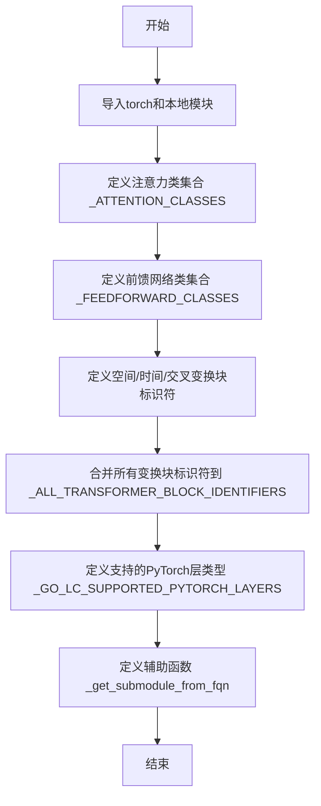
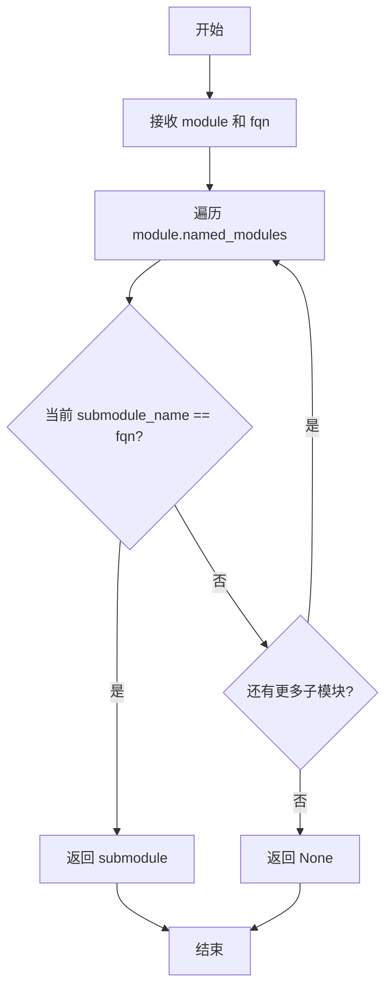

# `diffusers\src\diffusers\hooks\_common.py` 详细设计文档

该代码文件定义了Diffusers模型中的Transformer模块相关常量和辅助函数，提供了注意力机制(Attention)、前馈网络(FeedForward)的类集合，支持多种Transformer块标识符的识别，并定义了可用于group offloading和layerwise casting的PyTorch层类型，同时提供了通过全限定名称(FQN)获取子模块的辅助函数。

## 整体流程



## 类结构

```
全局常量和函数模块（非类结构）
├── 全局变量集合
│   ├── _ATTENTION_CLASSES
│   ├── _FEEDFORWARD_CLASSES
│   ├── _SPATIAL_TRANSFORMER_BLOCK_IDENTIFIERS
│   ├── _TEMPORAL_TRANSFORMER_BLOCK_IDENTIFIERS
│   ├── _CROSS_TRANSFORMER_BLOCK_IDENTIFIERS
│   ├── _ALL_TRANSFORMER_BLOCK_IDENTIFIERS
│   └── _GO_LC_SUPPORTED_PYTORCH_LAYERS
└── 全局函数
    └── _get_submodule_from_fqn
```

## 全局变量及字段


### `_ATTENTION_CLASSES`
    
包含Attention、MochiAttention和AttentionModuleMixin的元组，用于识别支持的注意力机制类

类型：`tuple[type, ...]`
    


### `_FEEDFORWARD_CLASSES`
    
包含FeedForward和LuminaFeedForward的元组，用于识别支持的前馈网络类

类型：`tuple[type, ...]`
    


### `_SPATIAL_TRANSFORMER_BLOCK_IDENTIFIERS`
    
空间Transformer块的标识符集合，用于在模型中识别和定位空间变换块

类型：`tuple[str, ...]`
    


### `_TEMPORAL_TRANSFORMER_BLOCK_IDENTIFIERS`
    
时间Transformer块的标识符集合，用于在模型中识别和定位时间变换块

类型：`tuple[str, ...]`
    


### `_CROSS_TRANSFORMER_BLOCK_IDENTIFIERS`
    
交叉Transformer块的标识符集合，用于在模型中识别和定位交叉注意力变换块

类型：`tuple[str, ...]`
    


### `_ALL_TRANSFORMER_BLOCK_IDENTIFIERS`
    
所有Transformer块标识符的并集，用于统一识别各类Transformer块

类型：`tuple[str, ...]`
    


### `_GO_LC_SUPPORTED_PYTORCH_LAYERS`
    
支持组卸载和分层转换的PyTorch层类型集合，包含各种卷积层和线性层

类型：`tuple[type, ...]`
    


    

## 全局函数及方法


### `_get_submodule_from_fqn`

通过完全限定名称（FQN）在 PyTorch 模块中查找并返回对应的子模块。

参数：

- `module`：`torch.nn.Module`，要搜索的根模块
- `fqn`：`str`，子模块的完全限定名称（Fully Qualified Name）

返回值：`torch.nn.Module | None`，如果找到匹配的子模块则返回该模块，否则返回 `None`

#### 流程图



#### 带注释源码

```python
def _get_submodule_from_fqn(module: torch.nn.Module, fqn: str) -> torch.nn.Module | None:
    """
    根据完全限定名称（FQN）在 PyTorch 模块中查找子模块。
    
    参数:
        module: torch.nn.Module - 要搜索的根模块
        fqn: str - 子模块的完全限定名称，例如 'encoder.layer1.linear'
    
    返回:
        torch.nn.Module | None - 找到的子模块，如果未找到则返回 None
    """
    # 遍历模块的所有命名子模块（包括自身）
    for submodule_name, submodule in module.named_modules():
        # 检查当前子模块的名称是否与目标 FQN 完全匹配
        if submodule_name == fqn:
            # 找到匹配的子模块，直接返回
            return submodule
    # 遍历完成未找到匹配项，返回 None
    return None
```

## 关键组件


### _ATTENTION_CLASSES

定义了支持的注意力类元组，包含 Attention、MochiAttention 和 AttentionModuleMixin，用于标识可用的注意力实现。

### _FEEDFORWARD_CLASSES

定义了支持的前馈网络类元组，包含 FeedForward 和 LuminaFeedForward，用于标识可用的前馈网络实现。

### _SPATIAL_TRANSFORMER_BLOCK_IDENTIFIERS

空间变换器块的标识符集合，用于在模型中识别空间Transformer块，包含 "blocks"、"transformer_blocks"、"single_transformer_blocks"、"layers" 和 "visual_transformer_blocks"。

### _TEMPORAL_TRANSFORMER_BLOCK_IDENTIFIERS

时间变换器块的标识符集合，用于识别时间维度上的Transformer块，仅包含 "temporal_transformer_blocks"。

### _CROSS_TRANSFORMER_BLOCK_IDENTIFIERS

交叉变换器块的标识符集合，用于识别跨注意力机制中的Transformer块，包含 "blocks"、"transformer_blocks" 和 "layers"。

### _ALL_TRANSFORMER_BLOCK_IDENTIFIERS

所有变换器块的统一标识符集合，通过合并空间、时间和交叉变换器块的标识符得到，用于通用查找。

### _GO_LC_SUPPORTED_PYTORCH_LAYERS

支持组卸载（Group Offloading）和分层转换（Layerwise Casting）的PyTorch层类型元组，包含Conv1d、Conv2d、Conv3d、ConvTranspose1d、ConvTranspose2d、ConvTranspose3d和Linear等卷积和线性层。

### _get_submodule_from_fqn

根据完全限定名称（FQN）在模块中查找并返回对应的子模块，支持从根模块递归遍历所有命名子模块。


## 问题及建议


### 已知问题

-   **全局变量命名混乱**：所有全局变量和私有函数都使用下划线前缀 `_` 命名，但实际用途不同（类元组是公共API，标识符是配置数据），导致命名空间混淆
-   **标识符集合存在冗余重复**：`blocks`、`transformer_blocks`、`layers` 三个标识符同时出现在空间、交叉变换块集合中，可能导致匹配逻辑的歧义
-   **`_ALL_TRANSFORMER_BLOCK_IDENTIFIERS` 构造方式低效**：使用集合去重后再转元组，而原始数据就存在大量重复，说明数据结构设计不合理
-   **子模块查找算法效率低下**：`_get_submodule_from_fqn` 使用 `named_modules()` 遍历整个模块树，对于深层网络会产生O(n)时间复杂度，且找到第一个匹配后就应立即终止而非继续遍历
-   **LayerNorm/GroupNorm 支持被禁用**：TODO 注释表明这些 Norm 层因 "double invocation" 问题被排除，但长期作为技术债务遗留，缺乏后续跟进计划
-   **类型注解不完整**：函数参数 `fqn` 缺少类型注解，内部变量也缺少类型信息
-   **魔法字符串硬编码**：变换块标识符全部硬编码在全局变量中，缺乏配置化机制，扩展需要修改源码

### 优化建议

-   **重构全局变量组织**：将类元组（`_ATTENTION_CLASSES`、`_FEEDFORWARD_CLASSES`）与配置标识符分离到不同的模块或类中，使用明确的导出接口而非以下划线前缀
-   **消除标识符冗余**：重新设计 `_SPATIAL_TRANSFORMER_BLOCK_IDENTIFIERS`、`_TEMPORAL_TRANSFORMER_BLOCK_IDENTIFIERS`、`_CROSS_TRANSFORMER_BLOCK_IDENTIFIERS` 的定义，确保每个标识符只出现在其对应的语义分类中
-   **优化子模块查找**：改用 `module.get_submodule(fqn)` 或实现基于路径分割的递归查找，减少不必要的树遍历
-   **解决 LayerNorm 遗留问题**：明确 LayerNorm/GroupNorm 问题的根因（如 CogVideoXLayerNorm 的双重调用），制定修复计划并补充测试覆盖
-   **完善类型注解**：为函数参数 `fqn: str` 添加类型注解，考虑使用 `typing.Optional[torch.nn.Module]` 替代 `| None` 语法以兼容旧版 Python
-   **配置外置**：将变换块标识符迁移至配置文件或构建时生成，避免硬编码在 Python 源码中

## 其它


### 设计目标与约束

本模块作为HuggingFace Diffusers库的注意力机制和前馈网络支持层，旨在提供统一的接口来处理多种注意力类别的前向传播。设计约束包括：仅支持特定的注意力类（Attention、MochiAttention、AttentionModuleMixin）和前馈网络类（FeedForward、LuminaFeedForward）；仅支持特定的PyTorch层进行组卸载和层次casting（特定的Conv和Linear层）；模块查找依赖于完全限定名称（FQN）的精确匹配。

### 错误处理与异常设计

_get_submodule_from_fqn函数通过遍历所有命名模块来查找子模块，若未找到匹配项则返回None。代码未显式抛出异常，而是采用"失败安全"（fail-safe）策略返回None调用方需要自行处理None的情况。这种设计适合在模型结构遍历场景中使用，避免因单个模块查找失败而导致整个流程中断。

### 外部依赖与接口契约

本模块依赖以下外部组件：1）torch.nn模块，提供神经网络基本组件；2）..models.attention模块中的AttentionModuleMixin、FeedForward、LuminaFeedForward类；3）..models.attention_processor模块中的Attention、MochiAttention类。接口契约要求传入的module参数必须是torch.nn.Module实例，fqn参数必须是字符串类型。

### 数据流与状态机

本模块主要提供配置定义和工具函数，不涉及复杂的状态机或数据流。核心数据流为：调用方传入torch.nn.Module对象和完全限定名称字符串，_get_submodule_from_fqn函数遍历模块的named_modules()迭代器，通过字符串匹配返回目标子模块或None。

### 配置与参数说明

_ALL_TRANSFORMER_BLOCK_IDENTIFIERS元组整合了空间、时间、交叉三类转换器块的所有可能标识符，用于在模型结构分析时识别不同类型的转换器块。_GO_LC_SUPPORTED_PYTORCH_LAYERS元组定义了支持组卸载和层次casting的PyTorch层类型，目前仅包含卷积层和线性层，不包含归一化层（代码注释说明因CogVideoX中存在双重调用问题而暂不支持）。

### 性能考量

_get_submodule_from_fqn函数的时间复杂度为O(n)，其中n为模型中所有子模块的数量。在大型模型中频繁调用此函数可能导致性能问题，建议在需要多次查找时预先构建模块名称到模块的映射字典进行优化。命名元组（_ATTENTION_CLASSES、_FEEDFORWARD_CLASSES等）在模块加载时创建，属于轻量级对象。

### 版本兼容性说明

此代码模块属于Apache License 2.0开源协议，版权归属HuggingFace Team。代码中使用Python 3.10+的类型联合语法（module: torch.nn.Module | None），需要Python 3.10及以上版本运行。


    