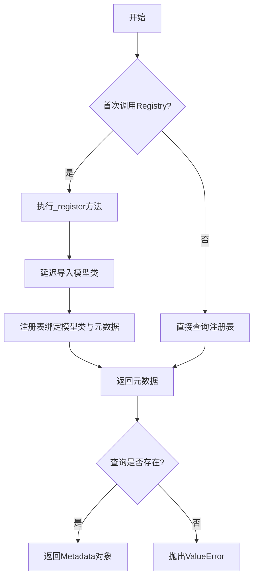
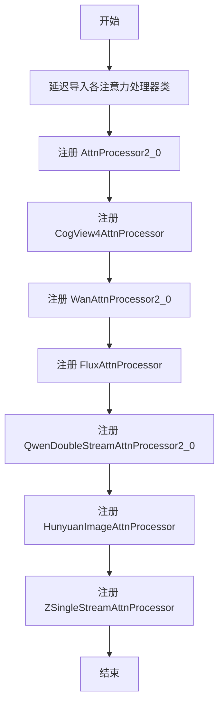
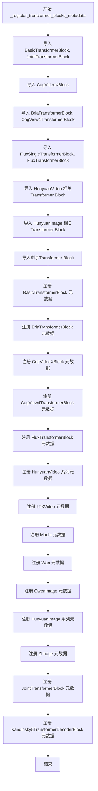
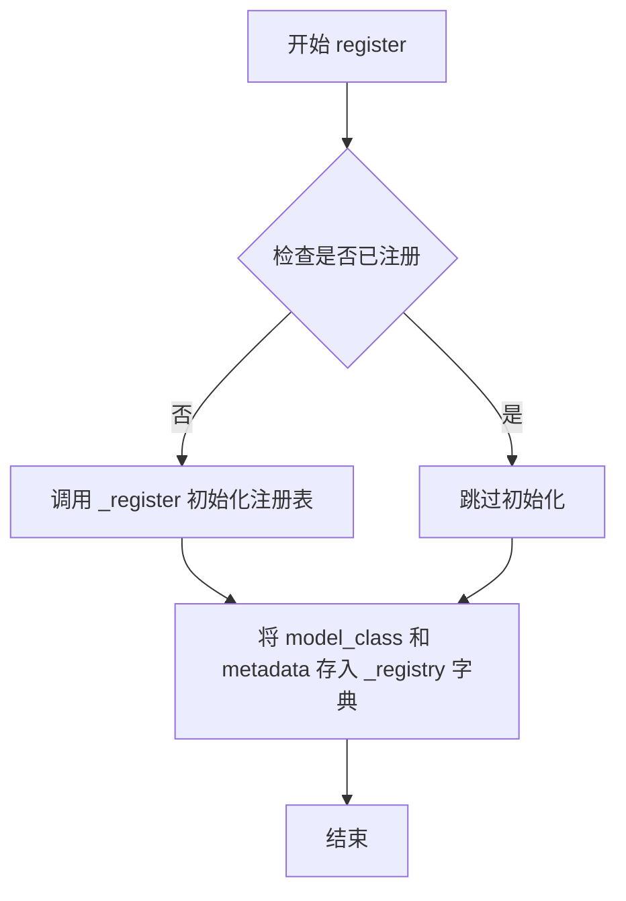
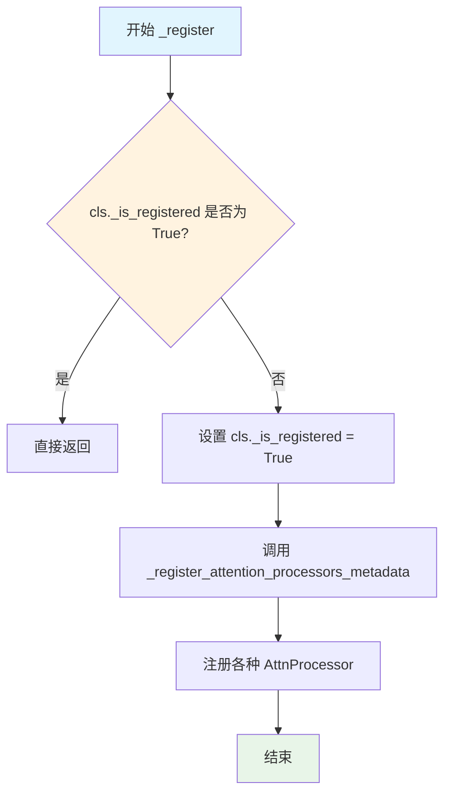
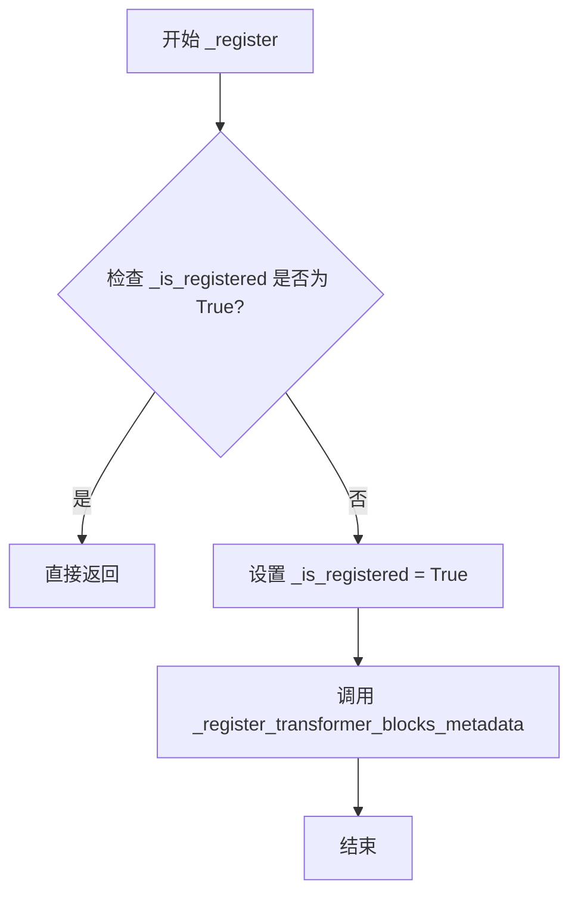

# `diffusers\src\diffusers\hooks\_helpers.py` 详细设计文档

这是一个用于管理Transformer模型中注意力处理器(Attention Processor)和Transformer模块元数据的注册系统，通过延迟注册机制动态绑定不同模型的处理元信息，支持查询特定模型类所需的隐藏状态参数索引等关键元数据。

## 整体流程



## 类结构

```
AttentionProcessorMetadata (数据类)
TransformerBlockMetadata (数据类)
AttentionProcessorRegistry (注册表类)
TransformerBlockRegistry (注册表类)
全局函数:
├── _register_attention_processors_metadata
├── _register_transformer_blocks_metadata
└── _skip_attention___ret___hidden_states 等辅助函数
```

## 全局变量及字段


### `_registry`
    
存储模型类与元数据的映射

类型：`dict[Type, AttentionProcessorMetadata]`
    


### `_is_registered`
    
是否已注册的标志

类型：`bool`
    


### `_registry`
    
存储模型类与元数据的映射

类型：`dict[Type, TransformerBlockMetadata]`
    


### `_is_registered`
    
是否已注册的标志

类型：`bool`
    


### `_skip_proc_output_fn_Attention_AttnProcessor2_0`
    
跳过AttnProcessor2.0处理器输出的函数

类型：`Callable[[Any], Any]`
    


### `_skip_proc_output_fn_Attention_CogView4AttnProcessor`
    
跳过CogView4AttnProcessor处理器输出的函数

类型：`Callable[[Any], Any]`
    


### `_skip_proc_output_fn_Attention_WanAttnProcessor2_0`
    
跳过WanAttnProcessor2.0处理器输出的函数

类型：`Callable[[Any], Any]`
    


### `_skip_proc_output_fn_Attention_FluxAttnProcessor`
    
跳过FluxAttnProcessor处理器输出的函数

类型：`Callable[[Any], Any]`
    


### `_skip_proc_output_fn_Attention_QwenDoubleStreamAttnProcessor2_0`
    
跳过QwenDoubleStreamAttnProcessor2.0处理器输出的函数

类型：`Callable[[Any], Any]`
    


### `_skip_proc_output_fn_Attention_HunyuanImageAttnProcessor`
    
跳过HunyuanImageAttnProcessor处理器输出的函数

类型：`Callable[[Any], Any]`
    


### `_skip_proc_output_fn_Attention_ZSingleStreamAttnProcessor`
    
跳过ZSingleStreamAttnProcessor处理器输出的函数

类型：`Callable[[Any], Any]`
    


### `AttentionProcessorMetadata.skip_processor_output_fn`
    
跳过处理器输出的函数

类型：`Callable[[Any], Any]`
    


### `TransformerBlockMetadata.return_hidden_states_index`
    
返回隐藏状态的参数索引

类型：`int | None`
    


### `TransformerBlockMetadata.return_encoder_hidden_states_index`
    
返回编码器隐藏状态的参数索引

类型：`int | None`
    


### `TransformerBlockMetadata.hidden_states_argument_name`
    
隐藏状态参数名称

类型：`str`
    


### `TransformerBlockMetadata._cls`
    
模型类

类型：`Type | None`
    


### `TransformerBlockMetadata._cached_parameter_indices`
    
缓存的参数索引字典

类型：`dict[str, int] | None`
    
    

## 全局函数及方法


### `_register_attention_processors_metadata`

延迟注册所有注意力处理器（Attention Processor）的元数据，通过延迟导入的方式避免循环导入问题，并将多个注意力处理器类注册到`AttentionProcessorRegistry`中。

参数：无需显式参数

返回值：`None`，无返回值描述

#### 流程图



#### 带注释源码

```python
def _register_attention_processors_metadata():
    """
    延迟注册所有注意力处理器元数据。
    使用延迟导入避免循环依赖问题。
    """
    # 从各模型模块延迟导入注意力处理器类
    from ..models.attention_processor import AttnProcessor2_0
    from ..models.transformers.transformer_cogview4 import CogView4AttnProcessor
    from ..models.transformers.transformer_flux import FluxAttnProcessor
    from ..models.transformers.transformer_hunyuanimage import HunyuanImageAttnProcessor
    from ..models.transformers.transformer_qwenimage import QwenDoubleStreamAttnProcessor2_0
    from ..models.transformers.transformer_wan import WanAttnProcessor2_0
    from ..models.transformers.transformer_z_image import ZSingleStreamAttnProcessor

    # 注册 AttnProcessor2_0 处理器元数据
    AttentionProcessorRegistry.register(
        model_class=AttnProcessor2_0,
        metadata=AttentionProcessorMetadata(
            skip_processor_output_fn=_skip_proc_output_fn_Attention_AttnProcessor2_0,
        ),
    )

    # 注册 CogView4AttnProcessor 处理器元数据
    AttentionProcessorRegistry.register(
        model_class=CogView4AttnProcessor,
        metadata=AttentionProcessorMetadata(
            skip_processor_output_fn=_skip_proc_output_fn_Attention_CogView4AttnProcessor,
        ),
    )

    # 注册 WanAttnProcessor2_0 处理器元数据
    AttentionProcessorRegistry.register(
        model_class=WanAttnProcessor2_0,
        metadata=AttentionProcessorMetadata(
            skip_processor_output_fn=_skip_proc_output_fn_Attention_WanAttnProcessor2_0,
        ),
    )

    # 注册 FluxAttnProcessor 处理器元数据
    AttentionProcessorRegistry.register(
        model_class=FluxAttnProcessor,
        metadata=AttentionProcessorMetadata(skip_processor_output_fn=_skip_proc_output_fn_Attention_FluxAttnProcessor),
    )

    # 注册 QwenDoubleStreamAttnProcessor2_0 处理器元数据
    AttentionProcessorRegistry.register(
        model_class=QwenDoubleStreamAttnProcessor2_0,
        metadata=AttentionProcessorMetadata(
            skip_processor_output_fn=_skip_proc_output_fn_Attention_QwenDoubleStreamAttnProcessor2_0
        ),
    )

    # 注册 HunyuanImageAttnProcessor 处理器元数据
    AttentionProcessorRegistry.register(
        model_class=HunyuanImageAttnProcessor,
        metadata=AttentionProcessorMetadata(
            skip_processor_output_fn=_skip_proc_output_fn_Attention_HunyuanImageAttnProcessor,
        ),
    )

    # 注册 ZSingleStreamAttnProcessor 处理器元数据
    AttentionProcessorRegistry.register(
        model_class=ZSingleStreamAttnProcessor,
        metadata=AttentionProcessorMetadata(
            skip_processor_output_fn=_skip_proc_output_fn_Attention_ZSingleStreamAttnProcessor,
        ),
    )
```


### `_register_transformer_blocks_metadata`

该函数是一个延迟注册函数，用于在首次访问时动态导入并注册各种Transformer模块（如BasicTransformerBlock、FluxTransformerBlock、HunyuanVideoTransformerBlock等）的元数据，包括返回隐藏状态索引和编码器隐藏状态索引等信息，以避免循环导入问题。

参数： 无

返回值：`None`，该函数无返回值，仅执行注册逻辑

#### 流程图



#### 带注释源码

```python
def _register_transformer_blocks_metadata():
    """
    延迟注册所有Transformer模块的元数据。
    
    该函数通过延迟导入来避免循环导入问题，并在首次调用时
    将各种Transformer Block类注册到 TransformerBlockRegistry 中。
    """
    # 导入基础Transformer模块
    from ..models.attention import BasicTransformerBlock, JointTransformerBlock
    
    # 导入CogVideoX系列
    from ..models.transformers.cogvideox_transformer_3d import CogVideoXBlock
    
    # 导入Bria和CogView4系列
    from ..models.transformers.transformer_bria import BriaTransformerBlock
    from ..models.transformers.transformer_cogview4 import CogView4TransformerBlock
    
    # 导入Flux系列
    from ..models.transformers.transformer_flux import FluxSingleTransformerBlock, FluxTransformerBlock
    
    # 导入HunyuanVideo系列（包含4种子类）
    from ..models.transformers.transformer_hunyuan_video import (
        HunyuanVideoSingleTransformerBlock,
        HunyuanVideoTokenReplaceSingleTransformerBlock,
        HunyuanVideoTokenReplaceTransformerBlock,
        HunyuanVideoTransformerBlock,
    )
    
    # 导入HunyuanImage系列
    from ..models.transformers.transformer_hunyuanimage import (
        HunyuanImageSingleTransformerBlock,
        HunyuanImageTransformerBlock,
    )
    
    # 导入其他Transformer模块
    from ..models.transformers.transformer_kandinsky import Kandinsky5TransformerDecoderBlock
    from ..models.transformers.transformer_ltx import LTXVideoTransformerBlock
    from ..models.transformers.transformer_mochi import MochiTransformerBlock
    from ..models.transformers.transformer_qwenimage import QwenImageTransformerBlock
    from ..models.transformers.transformer_wan import WanTransformerBlock
    from ..models.transformers.transformer_z_image import ZImageTransformerBlock

    # 注册 BasicTransformerBlock
    # return_hidden_states_index=0 表示该Block的forward方法第一个返回值是hidden_states
    # return_encoder_hidden_states_index=None 表示不返回encoder_hidden_states
    TransformerBlockRegistry.register(
        model_class=BasicTransformerBlock,
        metadata=TransformerBlockMetadata(
            return_hidden_states_index=0,
            return_encoder_hidden_states_index=None,
        ),
    )
    
    # 注册 BriaTransformerBlock（配置与BasicTransformerBlock相同）
    TransformerBlockRegistry.register(
        model_class=BriaTransformerBlock,
        metadata=TransformerBlockMetadata(
            return_hidden_states_index=0,
            return_encoder_hidden_states_index=None,
        ),
    )

    # 注册 CogVideoXBlock
    # 第一个返回值是hidden_states，第二个返回值是encoder_hidden_states
    TransformerBlockRegistry.register(
        model_class=CogVideoXBlock,
        metadata=TransformerBlockMetadata(
            return_hidden_states_index=0,
            return_encoder_hidden_states_index=1,
        ),
    )

    # 注册 CogView4TransformerBlock（配置与CogVideoX相同）
    TransformerBlockRegistry.register(
        model_class=CogView4TransformerBlock,
        metadata=TransformerBlockMetadata(
            return_hidden_states_index=0,
            return_encoder_hidden_states_index=1,
        ),
    )

    # 注册 FluxTransformerBlock
    # 第二个返回值是hidden_states，第一个返回值是encoder_hidden_states（与其他模型相反）
    TransformerBlockRegistry.register(
        model_class=FluxTransformerBlock,
        metadata=TransformerBlockMetadata(
            return_hidden_states_index=1,
            return_encoder_hidden_states_index=0,
        ),
    )
    TransformerBlockRegistry.register(
        model_class=FluxSingleTransformerBlock,
        metadata=TransformerBlockMetadata(
            return_hidden_states_index=1,
            return_encoder_hidden_states_index=0,
        ),
    )

    # 注册 HunyuanVideo 系列（4种子类，配置相同）
    TransformerBlockRegistry.register(
        model_class=HunyuanVideoTransformerBlock,
        metadata=TransformerBlockMetadata(
            return_hidden_states_index=0,
            return_encoder_hidden_states_index=1,
        ),
    )
    TransformerBlockRegistry.register(
        model_class=HunyuanVideoSingleTransformerBlock,
        metadata=TransformerBlockMetadata(
            return_hidden_states_index=0,
            return_encoder_hidden_states_index=1,
        ),
    )
    TransformerBlockRegistry.register(
        model_class=HunyuanVideoTokenReplaceTransformerBlock,
        metadata=TransformerBlockMetadata(
            return_hidden_states_index=0,
            return_encoder_hidden_states_index=1,
        ),
    )
    TransformerBlockRegistry.register(
        model_class=HunyuanVideoTokenReplaceSingleTransformerBlock,
        metadata=TransformerBlockMetadata(
            return_hidden_states_index=0,
            return_encoder_hidden_states_index=1,
        ),
    )

    # 注册 LTXVideoTransformerBlock
    TransformerBlockRegistry.register(
        model_class=LTXVideoTransformerBlock,
        metadata=TransformerBlockMetadata(
            return_hidden_states_index=0,
            return_encoder_hidden_states_index=None,
        ),
    )

    # 注册 MochiTransformerBlock
    TransformerBlockRegistry.register(
        model_class=MochiTransformerBlock,
        metadata=TransformerBlockMetadata(
            return_hidden_states_index=0,
            return_encoder_hidden_states_index=1,
        ),
    )

    # 注册 WanTransformerBlock
    TransformerBlockRegistry.register(
        model_class=WanTransformerBlock,
        metadata=TransformerBlockMetadata(
            return_hidden_states_index=0,
            return_encoder_hidden_states_index=None,
        ),
    )

    # 注册 QwenImageTransformerBlock（与Flux类似，返回顺序特殊）
    TransformerBlockRegistry.register(
        model_class=QwenImageTransformerBlock,
        metadata=TransformerBlockMetadata(
            return_hidden_states_index=1,
            return_encoder_hidden_states_index=0,
        ),
    )

    # 注册 HunyuanImage 系列（2个子类，配置相同）
    TransformerBlockRegistry.register(
        model_class=HunyuanImageTransformerBlock,
        metadata=TransformerBlockMetadata(
            return_hidden_states_index=0,
            return_encoder_hidden_states_index=1,
        ),
    )
    TransformerBlockRegistry.register(
        model_class=HunyuanImageSingleTransformerBlock,
        metadata=TransformerBlockMetadata(
            return_hidden_states_index=0,
            return_encoder_hidden_states_index=1,
        ),
    )

    # 注册 ZImageTransformerBlock
    TransformerBlockRegistry.register(
        model_class=ZImageTransformerBlock,
        metadata=TransformerBlockMetadata(
            return_hidden_states_index=0,
            return_encoder_hidden_states_index=None,
        ),
    )

    # 注册 JointTransformerBlock（双流结构）
    TransformerBlockRegistry.register(
        model_class=JointTransformerBlock,
        metadata=TransformerBlockMetadata(
            return_hidden_states_index=1,
            return_encoder_hidden_states_index=0,
        ),
    )

    # 注册 Kandinsky5TransformerDecoderBlock（使用特殊参数名 visual_embed）
    TransformerBlockRegistry.register(
        model_class=Kandinsky5TransformerDecoderBlock,
        metadata=TransformerBlockMetadata(
            return_hidden_states_index=0,
            return_encoder_hidden_states_index=None,
            hidden_states_argument_name="visual_embed",
        ),
    )
```


### `_skip_attention___ret___hidden_states`

该函数是一个全局辅助函数，用于从传入的参数中提取 `hidden_states` 参数。它首先检查关键字参数 `kwargs`，如果不存在则检查位置参数 `args`，并返回提取到的 `hidden_states` 值。

参数：

-  `self`：`Any`，第一个参数（用于兼容调用约定）
-  `*args`：`Tuple[Any, ...]`，可变位置参数列表
-  `**kwargs`：`Dict[str, Any]`，可变关键字参数列表

返回值：`Any`，返回提取到的 `hidden_states` 值

#### 流程图

```mermaid
flowchart TD
    A[开始] --> B{检查 kwargs 中是否存在 hidden_states}
    B -->|是| C[从 kwargs 获取 hidden_states]
    B -->|否| D{检查 args 长度是否大于 0}
    D -->|是| E[从 args[0] 获取 hidden_states]
    D -->|否| F[hidden_states 为 None]
    C --> G[返回 hidden_states]
    E --> G
    F --> G
```

#### 带注释源码

```
def _skip_attention___ret___hidden_states(self, *args, **kwargs):
    """
    从 kwargs 或 args 中提取 hidden_states 参数
    
    参数:
        self: 第一个参数（用于兼容调用约定）
        *args: 可变位置参数
        **kwargs: 可变关键字参数
    
    返回:
        hidden_states: 从参数中提取的 hidden_states 值
    """
    # 1. 首先尝试从关键字参数 kwargs 中获取 hidden_states
    hidden_states = kwargs.get("hidden_states", None)
    
    # 2. 如果 kwargs 中没有，且 args 长度大于 0，则从位置参数 args[0] 获取
    if hidden_states is None and len(args) > 0:
        hidden_states = args[0]
    
    # 3. 返回提取到的 hidden_states
    return hidden_states
```


### `_skip_attention___ret___hidden_states___encoder_hidden_states`

该函数用于从注意力处理器的参数中提取 `hidden_states` 和 `encoder_hidden_states`，优先从 kwargs 获取，若不存在则从位置参数 args 中按索引提取，最后返回这两个状态元组。

参数：

- `self`：调用此方法的对象（注意力处理器实例）
- `*args`：`Tuple[Any, ...]`：可变位置参数，用于在 kwargs 中找不到时从位置参数获取
- `**kwargs`：`Dict[str, Any]`：关键字参数字典，可能包含 `hidden_states` 和 `encoder_hidden_states`

返回值：`Tuple[Any, Any]`，返回提取后的 `(hidden_states, encoder_hidden_states)` 元组

#### 流程图

```mermaid
flowchart TD
    A[开始] --> B{kwargs 中是否有 hidden_states?}
    B -->|是| C[使用 kwargs 的 hidden_states]
    B -->|否| D{args 长度 > 0?}
    D -->|是| E[使用 args[0] 作为 hidden_states]
    D -->|否| F[hidden_states = None]
    
    C --> G{kwargs 中是否有 encoder_hidden_states?}
    E --> G
    F --> G
    
    G -->|是| H[使用 kwargs 的 encoder_hidden_states]
    G -->|否| I{args 长度 > 1?}
    I -->|是| J[使用 args[1] 作为 encoder_hidden_states]
    I -->|否| K[encoder_hidden_states = None]
    
    H --> L[返回 (hidden_states, encoder_hidden_states)]
    J --> L
    K --> L
```

#### 带注释源码

```python
def _skip_attention___ret___hidden_states___encoder_hidden_states(self, *args, **kwargs):
    """
    从参数中提取 hidden_states 和 encoder_hidden_states。
    
    该函数用于注意力处理器的输出跳过逻辑，优先从关键字参数获取，
    若不存在则从位置参数按索引提取。
    
    参数:
        self: 注意力处理器实例
        *args: 可变位置参数，当 kwargs 中不存在时使用
        **kwargs: 关键字参数，可能包含 hidden_states 和 encoder_hidden_states
    
    返回:
        Tuple[Any, Any]: (hidden_states, encoder_hidden_states) 元组
    """
    # 优先从 kwargs 获取 hidden_states
    hidden_states = kwargs.get("hidden_states", None)
    # 优先从 kwargs 获取 encoder_hidden_states
    encoder_hidden_states = kwargs.get("encoder_hidden_states", None)
    
    # 如果 kwargs 中没有 hidden_states，尝试从位置参数 args[0] 获取
    if hidden_states is None and len(args) > 0:
        hidden_states = args[0]
    
    # 如果 kwargs 中没有 encoder_hidden_states，尝试从位置参数 args[1] 获取
    if encoder_hidden_states is None and len(args) > 1:
        encoder_hidden_states = args[1]
    
    # 返回提取到的 hidden_states 和 encoder_hidden_states
    return hidden_states, encoder_hidden_states
```


### `TransformerBlockMetadata._get_parameter_from_args_kwargs`

该方法是 `TransformerBlockMetadata` 类的核心实例方法，负责根据参数名称（identifier）从调用 `forward` 方法时传入的 `args`（位置参数）和 `kwargs`（关键字参数）中动态检索对应的值。它首先检查关键字参数，然后利用缓存或通过反射（inspect）获取函数签名来定位位置参数索引，从而准确提取值。

参数：

-  `identifier`：`str`，需要获取的参数的名称（例如 "hidden_states" 或 "encoder_hidden_states"）。
-  `args`：`tuple`，调用 forward 方法时传入的位置参数元组，默认为空元组。
-  `kwargs`：`dict`，调用 forward 方法时传入的关键字参数字典，默认为 None。

返回值：`Any`，返回找到的参数值。如果在 kwargs 中找到直接返回，否则从 args 中根据索引返回。

#### 流程图

```mermaid
flowchart TD
    A([Start _get_parameter_from_args_kwargs]) --> B{identifier in kwargs?}
    B -- Yes --> C[Return kwargs[identifier]]
    B -- No --> D{_cached_parameter_indices is not None?}
    D -- Yes --> E[Get index from cache]
    D -- No --> F[Inspect self._cls.forward signature]
    F --> G[Build _cached_parameter_indices map]
    G --> H{identifier in parameters?}
    H -- No --> I[Raise ValueError: Parameter not found]
    H -- Yes --> J[Get parameter index]
    E --> J
    J --> K{index < len(args)?}
    K -- No --> L[Raise ValueError: Not enough arguments]
    K -- Yes --> M[Return args[index]]
```

#### 带注释源码

```python
def _get_parameter_from_args_kwargs(self, identifier: str, args=(), kwargs=None):
    # 确保 kwargs 不为 None，初始化为空字典
    kwargs = kwargs or {}
    
    # 1. 优先从 kwargs (关键字参数) 中查找
    if identifier in kwargs:
        return kwargs[identifier]
    
    # 2. 如果存在缓存的参数索引映射，直接使用索引从 args 中获取
    if self._cached_parameter_indices is not None:
        return args[self._cached_parameter_indices[identifier]]
    
    # 3. 如果没有缓存，则需要检查 _cls 是否已设置
    if self._cls is None:
        raise ValueError("Model class is not set for metadata.")
    
    # 4. 通过反射获取模型类 forward 方法的签名
    parameters = list(inspect.signature(self._cls.forward).parameters.keys())
    # 移除 'self' 参数，因为我们处理的是 forward 的调用参数
    parameters = parameters[1:]  
    
    # 5. 构建并缓存参数名到索引的映射，以提高后续调用性能
    self._cached_parameter_indices = {param: i for i, param in enumerate(parameters)}
    
    # 6. 验证请求的参数名是否存在于函数签名中
    if identifier not in self._cached_parameter_indices:
        raise ValueError(f"Parameter '{identifier}' not found in function signature but was requested.")
    
    # 7. 获取参数在 args 中的索引
    index = self._cached_parameter_indices[identifier]
    
    # 8. 校验传入的位置参数数量是否足够
    if index >= len(args):
        raise ValueError(f"Expected {index} arguments but got {len(args)}.")
    
    # 9. 返回对应索引位置的值
    return args[index]
```


### `AttentionProcessorRegistry.register`

注册处理器元数据到全局注册表中，用于将模型类与对应的注意力处理器元数据进行关联。

参数：

- `model_class`：`Type`，需要注册的模型类类型
- `metadata`：`AttentionProcessorMetadata`，注意力处理器的元数据对象，包含跳过处理器输出函数等信息

返回值：`None`，该方法仅执行注册操作，不返回任何值

#### 流程图



#### 带注释源码

```python
@classmethod
def register(cls, model_class: Type, metadata: AttentionProcessorMetadata):
    """
    注册处理器元数据到全局注册表中。
    
    参数:
        model_class: Type - 需要注册的模型类类型
        metadata: AttentionProcessorMetadata - 注意力处理器的元数据对象
    
    返回值:
        None - 该方法仅执行注册操作，不返回任何值
    """
    # 首先调用 _register 确保注册表已初始化（加载所有内置处理器）
    cls._register()
    
    # 将模型类与对应的元数据存入注册表字典中
    # 键为模型类，值为对应的 AttentionProcessorMetadata
    cls._registry[model_class] = metadata
```


### `AttentionProcessorRegistry.get`

获取指定模型类对应的注意力处理器元数据。如果模型类未注册，则抛出 `ValueError` 异常。该方法内部会先调用 `_register()` 确保注册表已初始化（延迟注册机制）。

参数：

- `model_class`：`Type`，需要获取元数据的模型类（通常为注意力处理器的类类型）

返回值：`AttentionProcessorMetadata`，返回与指定模型类关联的处理器元数据对象，包含 `skip_processor_output_fn` 等信息

#### 流程图

```mermaid
flowchart TD
    A[开始: get model_class] --> B{cls._is_registered 已注册?}
    B -- 否 --> C[调用 cls._register 初始化注册表]
    B -- 是 --> D{model_class 在注册表中?}
    C --> D
    D -- 否 --> E[抛出 ValueError: Model class not registered]
    D -- 是 --> F[返回 cls._registry[model_class]]
    E --> G[结束]
    F --> G
```

#### 带注释源码

```python
@classmethod
def get(cls, model_class: Type) -> AttentionProcessorMetadata:
    """
    获取指定模型类对应的注意力处理器元数据。

    参数:
        model_class: Type，需要获取元数据的模型类

    返回值:
        AttentionProcessorMetadata，与指定模型类关联的元数据对象

    异常:
        ValueError: 如果模型类未在注册表中注册
    """
    # 调用 _register 确保注册表已初始化（延迟注册机制）
    # 避免在模块导入时因循环依赖导致的错误
    cls._register()

    # 检查模型类是否已在注册表中注册
    if model_class not in cls._registry:
        # 未注册则抛出详细的错误信息
        raise ValueError(f"Model class {model_class} not registered.")

    # 返回对应的处理器元数据
    return cls._registry[model_class]
```


### `AttentionProcessorRegistry._register`

这是一个内部注册方法，用于延迟初始化并注册注意力处理器的元数据。它通过检查 `_is_registered` 标志来确保注册过程只执行一次，避免循环导入问题。

参数：

- `cls`：隐含的类参数，表示 `AttentionProcessorRegistry` 类本身

返回值：`None`，无显式返回值

#### 流程图



#### 带注释源码

```python
@classmethod
def _register(cls):
    """
    内部注册方法，用于延迟注册注意力处理器元数据。
    使用 _is_registered 标志确保只执行一次注册，避免循环导入错误。
    """
    # 检查是否已经注册过
    if cls._is_registered:
        return  # 已注册，直接返回，避免重复注册
    
    # 标记为已注册状态
    cls._is_registered = True
    
    # 调用全局函数执行实际的处理器元数据注册
    # 这个函数内部会导入各种 AttnProcessor 类并注册到 _registry 字典中
    _register_attention_processors_metadata()
```


### `TransformerBlockRegistry.register`

注册模块元数据，将模型类及其对应的 TransformerBlockMetadata 注册到内部注册表中，同时绑定模型类到元数据对象。

参数：

- `model_class`：`Type`，要注册的模型类（torch.nn.Module 的子类）
- `metadata`：`TransformerBlockMetadata`，包含 Transformer 块元数据的对象（如返回隐藏状态的索引等）

返回值：`None`，无返回值（执行注册赋值操作）

#### 流程图

```mermaid
flowchart TD
    A[开始 register] --> B{_is_registered?}
    B -->|否| C[调用 _register 初始化]
    C --> D[设置 metadata._cls = model_class]
    D --> E[cls._registry[model_class] = metadata]
    E --> F[结束 register]
    B -->|是| D
```

#### 带注释源码

```python
@classmethod
def register(cls, model_class: Type, metadata: TransformerBlockMetadata):
    """
    注册 Transformer 块元数据到全局注册表
    
    参数:
        model_class: 要注册的模型类（如 FluxTransformerBlock 等）
        metadata: TransformerBlockMetadata 实例，包含块的元信息
    """
    # 调用 _register 确保所有内置块已注册（延迟注册机制）
    cls._register()
    
    # 将模型类绑定到元数据对象，用于后续参数解析
    metadata._cls = model_class
    
    # 将模型类及其元数据存入内部字典注册表
    cls._registry[model_class] = metadata
```


### `TransformerBlockRegistry.get`

获取与指定模型类关联的 `TransformerBlockMetadata` 元数据。如果模型类未注册，则抛出 `ValueError` 异常。

参数：

- `model_class`：`Type`，需要获取元数据的模型类类型

返回值：`TransformerBlockMetadata`，返回与模型类关联的元数据对象，包含隐藏状态索引、编码器隐藏状态索引等信息

#### 流程图

```mermaid
flowchart TD
    A[开始] --> B{cls._is_registered?}
    B -->|否| C[调用 _register 方法]
    B -->|是| D[继续]
    C --> D
    D --> E{model_class in cls._registry?}
    E -->|否| F[抛出 ValueError: Model class not registered]
    E -->|是| G[返回 cls._registry[model_class]]
    F --> H[结束]
    G --> H
```

#### 带注释源码

```python
@classmethod
def get(cls, model_class: Type) -> TransformerBlockMetadata:
    """
    获取与指定模型类关联的 TransformerBlockMetadata。
    
    参数:
        model_class: Type - 需要获取元数据的模型类类型
        
    返回值:
        TransformerBlockMetadata - 与模型类关联的元数据对象
    """
    # 确保注册过程已完成（延迟加载机制，避免循环导入）
    cls._register()
    
    # 检查模型类是否已在注册表中注册
    if model_class not in cls._registry:
        # 如果未注册，抛出详细的错误信息
        raise ValueError(f"Model class {model_class} not registered.")
    
    # 从注册表中返回对应的元数据
    return cls._registry[model_class]
```


### `TransformerBlockRegistry._register`

这是 `TransformerBlockRegistry` 类的内部注册方法，采用懒加载模式（延迟注册），确保在首次访问时才执行实际的元数据注册操作，避免全局作用域下的循环导入问题。

参数：
- 无显式参数（`cls` 为类方法隐含参数）

返回值：`None`，该方法无返回值，仅执行注册逻辑

#### 流程图



#### 带注释源码

```python
@classmethod
def _register(cls):
    """
    内部注册方法，采用懒加载模式。
    
    该方法确保 TransformerBlockRegistry 的元数据注册只执行一次，
    避免在全局作用域导入时触发循环依赖问题。
    """
    # 检查是否已经完成注册
    if cls._is_registered:
        # 已注册则直接返回，避免重复执行
        return
    
    # 标记为已注册状态，防止后续重复调用
    cls._is_registered = True
    
    # 执行实际的 transformer blocks 元数据注册
    _register_transformer_blocks_metadata()
```

## 关键组件


### AttentionProcessorMetadata

用于存储注意力处理器的元数据的数据类，包含一个跳过处理器输出函数的 callable，用于确定在推理时需要跳过哪些输出。

### TransformerBlockMetadata

用于存储 Transformer 块元数据的数据类，包含隐藏状态和编码器隐藏状态的返回索引，以及用于从 args/kwargs 中惰性获取参数的 `_get_parameter_from_args_kwargs` 方法。

### AttentionProcessorRegistry

注意力处理器注册表类，负责管理不同模型类对应的注意力处理器元数据。采用惰性加载模式避免循环导入，通过 `register` 和 `get` 方法实现注册和获取功能。

### TransformerBlockRegistry

Transformer 块注册表类，与 AttentionProcessorRegistry 类似，负责管理各种 Transformer 块的元数据，包括返回状态索引信息。

### _register_attention_processors_metadata

注册函数，将多种注意力处理器（AttnProcessor2_0、CogView4AttnProcessor、FluxAttnProcessor 等）注册到 AttentionProcessorRegistry，包含各自的 skip_processor_output_fn 配置。

### _register_transformer_blocks_metadata

注册函数，将多种 Transformer 块（BasicTransformerBlock、CogVideoXBlock、FluxTransformerBlock 等）注册到 TransformerBlockRegistry，配置各自的隐藏状态返回索引。

### 惰性加载机制

通过 `_is_registered` 标志和延迟导入实现惰性注册，避免在模块加载时产生循环导入问题。

### 张量索引机制

TransformerBlockMetadata 中的 `return_hidden_states_index` 和 `return_encoder_hidden_states_index` 字段用于指定函数返回参数的位置索引，配合 `_get_parameter_from_args_kwargs` 方法实现参数动态获取。

### skip_processor_output_fn

跳过处理器输出函数，用于在推理时确定从注意力处理器输出中需要跳过哪些张量（如 hidden_states 或 encoder_hidden_states），支持不同的返回策略配置。


## 问题及建议


### 已知问题

-   **单次注册机制限制**：两个Registry类使用`_is_registered`布尔标志实现单次注册，一旦注册后无法重新加载或重置，在需要动态更新或测试场景下不灵活
-   **动态签名检查性能开销**：`TransformerBlockMetadata._get_parameter_from_args_kwargs`方法每次调用都会使用`inspect.signature`获取函数签名，虽然有缓存机制`_cached_parameter_indices`，但在首次调用时仍有性能开销
-   **类型注解兼容性**：`dict[str, int]`语法需要Python 3.9+，若项目需要兼容更低版本Python会导致兼容性问题
-   **代码重复**：两个Registry类（`AttentionProcessorRegistry`和`TransformerBlockRegistry`）结构高度相似，存在明显的代码重复，可以抽象为通用基类
-   **参数验证不完整**：参数索引越界时仅抛出通用`ValueError`，缺乏具体上下文信息（如函数名、参数名等），调试困难
-   **导入语句分散**：大量模型导入语句分散在多个函数内部（`_register_attention_processors_metadata`和`_register_transformer_blocks_metadata`），维护成本高，新增模型时需要修改多个位置

### 优化建议

-   **引入注册机制基类**：创建抽象基类`BaseRegistry`封装通用逻辑（注册、获取、延迟加载），减少代码重复
-   **改进类型注解兼容性**：使用`Dict`和`List`（从`typing`导入）替代内置泛型类型，或明确声明支持的Python版本
-   **增加详细错误信息**：在参数验证失败时提供更详细的错误上下文，包括函数签名、参数名等
-   **集中管理模型注册**：将模型导入和注册逻辑抽离为独立配置文件或装饰器模式，便于扩展和维护
-   **支持重置机制**：为Registry类添加`reset()`方法或在测试中使用`unittest.mock`辅助管理注册状态
-   **延迟计算优化**：考虑将`inspect.signature`的调用提前到注册阶段而非首次使用时，减少运行时开销


## 其它


### 设计目标与约束

该模块的核心设计目标是提供一个统一的元数据注册中心，用于管理多种Transformer模型中的注意力处理器（Attention Processor）和Transformer块（Transformer Block）的元数据信息。主要约束包括：1）采用延迟注册机制避免循环导入问题；2）通过类方法（classmethod）实现全局单例注册表；3）支持动态参数索引缓存以提高查询性能；4）元数据与具体模型类绑定，实现类型安全的访问。

### 错误处理与异常设计

代码中涉及两类主要异常场景：1）参数标识符未在函数签名中找到时抛出`ValueError`，提示具体的参数名称；2）参数索引超出实际参数个数时抛出`ValueError`，显示期望的索引值和实际得到的参数个数；3）访问未注册的模型类时抛出`ValueError`，包含具体的模型类信息。异常设计遵循Python惯例，使用内建的`ValueError`表示客户端错误，所有异常均携带描述性错误消息便于调试。

### 数据流与状态机

模块的数据流分为两个独立的注册路径：AttentionProcessorRegistry负责注册各类注意力处理器的元数据，包含跳过处理器输出的回调函数；TransformerBlockRegistry负责注册Transformer块的元数据，包含返回隐藏状态和编码器隐藏状态的索引位置。两个注册表均采用懒加载机制，首次访问时触发`_register()`方法执行实际的注册操作，注册完成后设置`_is_registered`标志防止重复注册。

### 外部依赖与接口契约

模块依赖Python标准库：`inspect`模块用于动态获取函数签名参数列表；`dataclasses`用于定义元数据数据结构；`typing`模块提供类型注解。外部模型导入通过相对导入从`..models`路径获取，涵盖CogView4、Flux、HunyuanImage、HunyuanVideo、Qwen、Wan、Z-Image等Vision/Video生成模型的处理器和块类。接口契约要求所有注册的模型类必须是Type类型，元数据对象必须包含相应的字段定义。

### 性能考虑

代码包含两项性能优化设计：1）`_cached_parameter_indices`字典缓存函数参数名称到位置的映射，避免每次调用都进行函数签名解析；2）`_is_registered`标志位确保注册函数在整个生命周期内仅执行一次。参数索引缓存采用延迟初始化策略，仅在首次需要通过标识符访问参数时创建，缓存命中时直接通过索引访问元组元素，时间复杂度为O(1)。

### 安全性考虑

该模块为纯数据管理和元数据存储模块，不涉及用户输入处理、网络通信或文件操作，因此不引入明显的安全风险。注册机制基于模型类的类型引用，不执行任意代码或动态 eval 操作。唯一需要注意的是模块通过相对导入访问其他模型定义，需确保导入路径的正确性和模型类的可信性。

### 测试策略

建议针对以下场景编写单元测试：1）验证注册表对已注册模型类返回正确的元数据对象；2）验证访问未注册模型类时抛出预期的`ValueError`；3）验证`_get_parameter_from_args_kwargs`方法正确处理kwargs优先、参数索引越界、参数不存在等边界情况；4）验证延迟注册机制确保注册函数仅执行一次；5）验证缓存机制在多次调用时返回一致结果。

### 版本兼容性

该模块使用Python 3.7+引入的 dataclass 装饰器，要求运行时Python版本不低于3.7。类型注解使用Python 3.5+的注解语法，兼容现代Python版本。模块设计为HuggingFace Diffusers库内部组件，依赖于库内部定义的各类模型类，版本兼容性由上游库维护。

### 配置与可扩展性

模块设计支持可扩展注册：1）通过`register`类方法允许动态添加新的注意力处理器或Transformer块；2）`TransformerBlockMetadata`支持自定义`hidden_states_argument_name`参数以适应不同模型的接口签名；3）`AttentionProcessorMetadata`预留了可扩展的回调函数字段`skip_processor_output_fn`。新模型集成时只需创建相应的元数据实例并调用注册方法即可。

### 监控与可观测性

由于该模块为底层元数据管理组件，不涉及运行时监控指标采集。建议在上层调用点添加日志记录：1）首次触发注册时的日志输出便于追踪模块初始化；2）访问未注册模型类时的错误日志便于排查集成问题；3）可通过注册表公开内部`_registry`字典的只读视图供调试使用。

### 潜在技术债务

1）TODO注释指出延迟注册是为解决循环导入的临时方案，长期应考虑重构模块依赖关系以支持 eager 注册；2）部分跳过处理函数（如`_skip_proc_output_fn_Attention_FluxAttnProcessor`）的逻辑尚未完全明确，注释标注为"not sure what this is yet"表明存在未完成的功能理解；3）缺乏对注册表完整性的运行时校验机制，依赖调用方保证注册顺序。

    