# `diffusers\src\diffusers\hooks\context_parallel.py` 详细设计文档

该模块实现了Context Parallel（上下文并行）功能，用于在分布式计算环境中对深度学习模型进行输入切分和输出聚合，支持多种分片策略（等分和任意分），通过PyTorch的distributed模块实现跨设备的张量通信和梯度同步。

## 整体流程

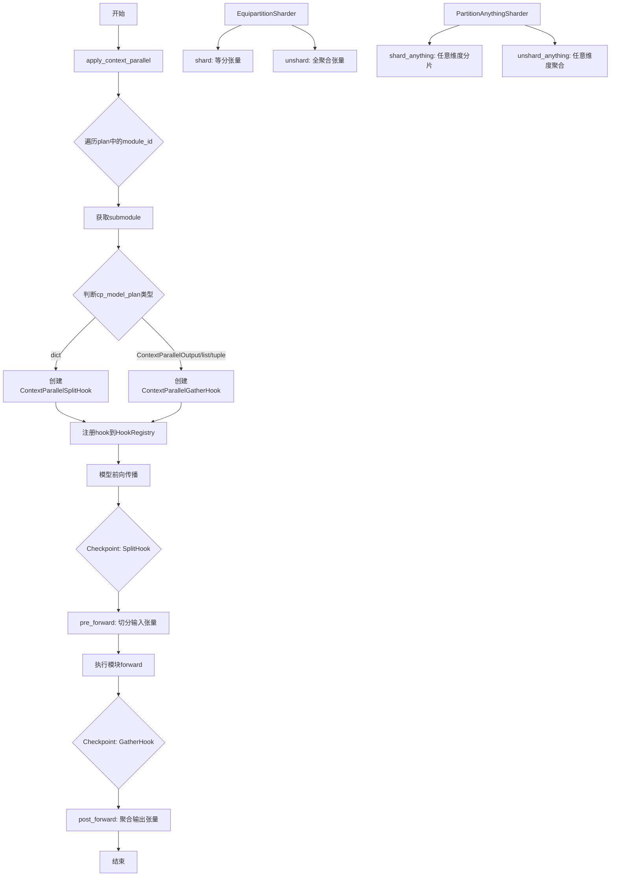

## 类结构

```
ModuleForwardMetadata (数据类)
├── ContextParallelSplitHook (ModelHook子类)
│   ├── pre_forward (切分输入)
│   ├── post_forward (处理输出)
│   └── _prepare_cp_input (准备CP输入)
├── ContextParallelGatherHook (ModelHook子类)
│   └── post_forward (聚合输出)
├── AllGatherFunction (torch.autograd.Function)
│   ├── forward (全聚合)
│   └── backward (反向传播)
├── EquipartitionSharder
│   ├── shard (等分片)
│   └── unshard (等聚合)
├── AllGatherAnythingFunction (torch.autograd.Function)
│   ├── forward (任意聚合)
│   └── backward (反向传播)
└── PartitionAnythingSharder
    ├── shard_anything (任意分片)
    └── unshard_anything (任意聚合)
```

## 全局变量及字段


### `_CONTEXT_PARALLEL_INPUT_HOOK_TEMPLATE`
    
输入hook名称模板，用于注册上下文并行的输入hook

类型：`str`
    


### `_CONTEXT_PARALLEL_OUTPUT_HOOK_TEMPLATE`
    
输出hook名称模板，用于注册上下文并行的输出hook

类型：`str`
    


### `ModuleForwardMetadata.cached_parameter_indices`
    
缓存的参数索引映射，用于快速查找函数参数位置

类型：`dict[str, int]`
    


### `ModuleForwardMetadata._cls`
    
模型类类型，用于获取forward函数签名

类型：`Type`
    


### `ContextParallelSplitHook.metadata`
    
并行模型计划，包含输入切分配置

类型：`ContextParallelModelPlan`
    


### `ContextParallelSplitHook.parallel_config`
    
并行配置，包含设备网格和分片策略

类型：`ContextParallelConfig`
    


### `ContextParallelSplitHook.module_forward_metadata`
    
模块前向元数据，用于参数解析和缓存

类型：`ModuleForwardMetadata`
    


### `ContextParallelGatherHook.metadata`
    
并行模型计划，包含输出聚合配置

类型：`ContextParallelModelPlan`
    


### `ContextParallelGatherHook.parallel_config`
    
并行配置，包含设备网格和聚合策略

类型：`ContextParallelConfig`
    


### `AllGatherFunction.ctx.dim`
    
用于全聚合的维度参数

类型：`int`
    


### `AllGatherFunction.ctx.group`
    
分布式通信组

类型：`dist.device_mesh.DeviceMesh | ProcessGroup`
    


### `AllGatherFunction.ctx.world_size`
    
分布式世界的进程数量

类型：`int`
    


### `AllGatherFunction.ctx.rank`
    
当前进程在分布式组中的排名

类型：`int`
    


### `AllGatherAnythingFunction.ctx.dim`
    
用于任意聚合的维度参数

类型：`int`
    


### `AllGatherAnythingFunction.ctx.group`
    
分布式设备网格通信组

类型：`dist.device_mesh.DeviceMesh`
    


### `AllGatherAnythingFunction.ctx.world_size`
    
分布式世界的进程数量

类型：`int`
    


### `AllGatherAnythingFunction.ctx.rank`
    
当前进程在分布式组中的排名

类型：`int`
    
    

## 全局函数及方法


### `apply_context_parallel`

该函数是上下文并行（Context Parallelism）的核心入口函数，负责将上下文并行机制应用到指定的神经网络模型上。它通过遍历并行计划字典，根据每个子模块的计划类型创建相应的分割或聚合钩子，并将这些钩子注册到模型的HookRegistry中，从而在模型的前向传播过程中实现输入数据的分割或输出的聚合。

参数：

- `module`：`torch.nn.Module`，需要应用上下文并行的目标模型
- `parallel_config`：`ContextParallelConfig`，上下文并行的配置对象，包含设备网格、分片策略等配置信息
- `plan`：`dict[str, ContextParallelModelPlan]`，一个字典，键为模块标识符（module_id），值为对应的 `ContextParallelModelPlan`，定义了每个子模块的并行策略

返回值：`None`，该函数直接修改模型，不返回任何值

#### 流程图

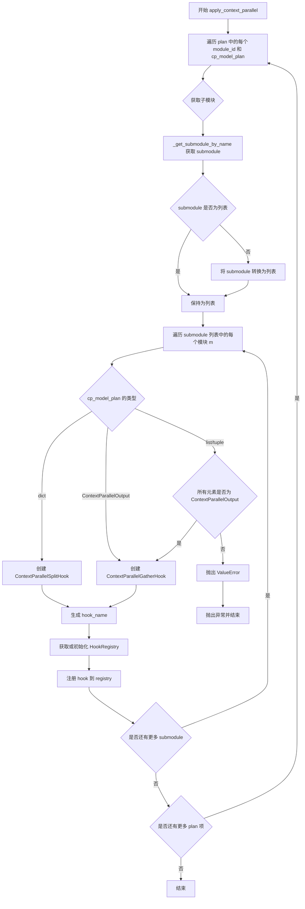

#### 带注释源码

```python
def apply_context_parallel(
    module: torch.nn.Module,
    parallel_config: ContextParallelConfig,
    plan: dict[str, ContextParallelModelPlan],
) -> None:
    """Apply context parallel on a model."""
    # 记录调试日志，包含并行配置中的设备网格和并行计划
    logger.debug(f"Applying context parallel with CP mesh: {parallel_config._mesh} and plan: {plan}")

    # 遍历并行计划字典中的每个模块项
    for module_id, cp_model_plan in plan.items():
        # 根据模块标识符获取对应的子模块
        submodule = _get_submodule_by_name(module, module_id)
        
        # 如果获取到的子模块不是列表，则转换为列表以统一处理
        if not isinstance(submodule, list):
            submodule = [submodule]

        # 记录调试日志，显示将要应用钩子的模块数量
        logger.debug(f"Applying ContextParallelHook to {module_id=} identifying a total of {len(submodule)} modules")

        # 遍历每个子模块
        for m in submodule:
            # 根据 cp_model_plan 的类型创建相应的钩子
            if isinstance(cp_model_plan, dict):
                # 字典类型表示需要进行输入分割，创建分割钩子
                hook = ContextParallelSplitHook(cp_model_plan, parallel_config)
                hook_name = _CONTEXT_PARALLEL_INPUT_HOOK_TEMPLATE.format(module_id)
            elif isinstance(cp_model_plan, (ContextParallelOutput, list, tuple)):
                # ContextParallelOutput 或列表/元组类型表示需要进行输出聚合
                if isinstance(cp_model_plan, ContextParallelOutput):
                    # 如果是单个 ContextParallelOutput，转换为列表
                    cp_model_plan = [cp_model_plan]
                
                # 验证所有元素都是 ContextParallelOutput 类型
                if not all(isinstance(x, ContextParallelOutput) for x in cp_model_plan):
                    raise ValueError(f"Expected all elements of cp_model_plan to be CPOutput, but got {cp_model_plan}")
                
                # 创建聚合钩子
                hook = ContextParallelGatherHook(cp_model_plan, parallel_config)
                hook_name = _CONTEXT_PARALLEL_OUTPUT_HOOK_TEMPLATE.format(module_id)
            else:
                # 不支持的类型，抛出异常
                raise ValueError(f"Unsupported context parallel model plan type: {type(cp_model_plan)}")
            
            # 获取或初始化子模块的钩子注册表
            registry = HookRegistry.check_if_exists_or_initialize(m)
            # 将钩子注册到注册表中
            registry.register_hook(hook, hook_name)
```


### `remove_context_parallel`

该函数用于移除模型上已注册的上下文并行（Context Parallel）钩子，逆向操作 `apply_context_parallel`，通过遍历计划中的模块并从对应的子模块注册表中删除指定名称的钩子，从而解除模型的上下文并行配置。

参数：

- `module`：`torch.nn.Module`，要移除上下文并行的目标模型
- `plan`：`dict[str, ContextParallelModelPlan]`，上下文并行计划字典，键为模块标识符，值为上下文并行模型计划（用于确定要移除的钩子类型）

返回值：`None`，该函数无返回值，直接修改模型的钩子注册状态

#### 流程图

```mermaid
flowchart TD
    A[开始 remove_context_parallel] --> B[遍历 plan.items()]
    B --> C{获取 submodule}
    C --> D[_get_submodule_by_name 根据 module_id 获取子模块]
    D --> E{检查 submodule 是否为列表}
    E -->|否| F[将 submodule 包装为列表]
    E -->|是| G[直接使用 submodule]
    F --> G
    G --> H[遍历 submodule 中的每个模块 m]
    H --> I[HookRegistry.check_if_exists_or_initialize m]
    I --> J{cp_model_plan 类型判断}
    J -->|dict| K[使用 _CONTEXT_PARALLEL_INPUT_HOOK_TEMPLATE 格式化 hook_name]
    J -->|ContextParallelOutput/list/tuple| L[使用 _CONTEXT_PARALLEL_OUTPUT_HOOK_TEMPLATE 格式化 hook_name]
    J -->|其他| M[抛出 ValueError 异常]
    K --> N[registry.remove_hook hook_name]
    L --> N
    M --> O[结束]
    N --> P{plan 是否遍历完成}
    P -->|否| B
    P -->|是| O
```

#### 带注释源码

```python
def remove_context_parallel(
    module: torch.nn.Module, 
    plan: dict[str, ContextParallelModelPlan]
) -> None:
    """
    移除模型上已注册的上下文并行钩子。
    
    此函数是 apply_context_parallel 的逆操作，遍历 plan 中定义的每个模块，
    根据 cp_model_plan 的类型确定要移除的钩子名称，并从对应的 HookRegistry 中删除钩子。
    
    参数:
        module: torch.nn.Module - 要移除上下文并行的目标模型
        plan: dict[str, ContextParallelModelPlan] - 上下文并行计划字典，
              键为模块标识符，值为 ContextParallelModelPlan（dict/ContextParallelOutput/list/tuple）
    
    返回:
        None - 直接修改模型的钩子注册状态，无返回值
    """
    # 遍历计划字典中的每个模块ID和对应的上下文并行模型计划
    for module_id, cp_model_plan in plan.items():
        # 根据模块名称获取子模块，支持通配符 '*' 匹配 ModuleList
        submodule = _get_submodule_by_name(module, module_id)
        
        # 确保 submodule 统一为列表形式，便于统一遍历处理
        if not isinstance(submodule, list):
            submodule = [submodule]

        # 遍历每个子模块，移除其上注册的上下文并行钩子
        for m in submodule:
            # 检查并初始化该模块的钩子注册表
            registry = HookRegistry.check_if_exists_or_initialize(m)
            
            # 根据 cp_model_plan 的类型确定要移除的钩子名称模板
            if isinstance(cp_model_plan, dict):
                # 输入类型的上下文并行计划，使用输入钩子模板
                hook_name = _CONTEXT_PARALLEL_INPUT_HOOK_TEMPLATE.format(module_id)
            elif isinstance(cp_model_plan, (ContextParallelOutput, list, tuple)):
                # 输出类型的上下文并行计划，使用输出钩子模板
                hook_name = _CONTEXT_PARALLEL_OUTPUT_HOOK_TEMPLATE.format(module_id)
            else:
                # 不支持的上下文并行模型计划类型，抛出异常
                raise ValueError(
                    f"Unsupported context parallel model plan type: {type(cp_model_plan)}"
                )
            
            # 从注册表中移除指定名称的钩子
            registry.remove_hook(hook_name)
```


### `_get_submodule_by_name`

通过名称（支持嵌套模块路径和通配符）从给定的 PyTorch 模型中获取子模块。

参数：

- `model`：`torch.nn.Module`，要搜索的 PyTorch 模型实例
- `name`：`str`，子模块的名称，支持点号分隔的路径（如 `"encoder.layer1"`）和通配符 `"*"`（仅用于 `ModuleList`）

返回值：`torch.nn.Module | list[torch.nn.Module]`，如果找到单个模块则返回该模块，如果使用通配符 `"*"` 则返回模块列表

#### 流程图

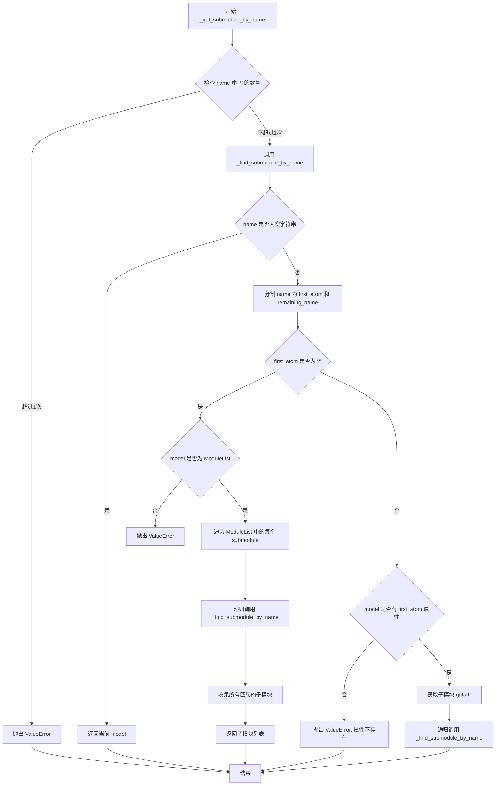

#### 带注释源码

```python
def _get_submodule_by_name(model: torch.nn.Module, name: str) -> torch.nn.Module | list[torch.nn.Module]:
    """
    通过名称获取子模块。
    
    参数:
        model: 要搜索的 PyTorch 模型实例
        name: 子模块名称，支持点号分隔的嵌套路径和通配符 '*'
    
    返回:
        找到的子模块或子模块列表
    
    异常:
        ValueError: 通配符使用超过一次，或通配符未与 ModuleList 一起使用，或属性不存在
    """
    # 检查通配符 '*' 是否使用超过一次，通配符在名称中只能出现一次
    if name.count("*") > 1:
        raise ValueError("Wildcard '*' can only be used once in the name")
    
    # 调用内部函数执行实际的子模块查找
    return _find_submodule_by_name(model, name)


def _find_submodule_by_name(model: torch.nn.Module, name: str) -> torch.nn.Module | list[torch.nn.Module]:
    """
    递归查找子模块的内部实现函数。
    
    参数:
        model: 当前搜索的模型或模块
        name: 剩余的子模块名称路径
    
    返回:
        找到的子模块或子模块列表
    """
    # 空字符串表示到达路径末端，返回当前模型
    if name == "":
        return model
    
    # 分割名称为第一部分和剩余部分
    # 例如 "a.b.c" -> first_atom="a", remaining_name="b.c"
    # 例如 "a" -> first_atom="a", remaining_name=""
    first_atom, remaining_name = name.split(".", 1) if "." in name else (name, "")
    
    # 处理通配符 '*' - 仅允许与 ModuleList 一起使用
    if first_atom == "*":
        # 验证模型是 ModuleList 类型
        if not isinstance(model, torch.nn.ModuleList):
            raise ValueError("Wildcard '*' can only be used with ModuleList")
        
        # 遍历 ModuleList 中的所有子模块
        submodules = []
        for submodule in model:
            # 递归查找每个子模块
            subsubmodules = _find_submodule_by_name(submodule, remaining_name)
            # 确保返回的是列表以便合并
            if not isinstance(subsubmodules, list):
                subsubmodules = [subsubmodules]
            submodules.extend(subsubmodules)
        return submodules
    else:
        # 处理常规属性访问
        if hasattr(model, first_atom):
            # 获取子模块
            submodule = getattr(model, first_atom)
            # 递归查找剩余路径
            return _find_submodule_by_name(submodule, remaining_name)
        else:
            # 属性不存在，抛出错误
            raise ValueError(f"'{first_atom}' is not a submodule of '{model.__class__.__name__}'")
```


### `_find_submodule_by_name`

该函数是一个递归函数，用于通过名称字符串在 PyTorch 模型中查找子模块。支持通过点号(`.`)进行嵌套查找，以及使用星号(`*`)通配符在 `ModuleList` 中查找所有子模块。

参数：

- `model`：`torch.nn.Module`，要搜索的父模块
- `name`：`str`，子模块名称，支持点号分隔的路径和通配符 `*`

返回值：`torch.nn.Module | list[torch.nn.Module]`，返回找到的单个子模块或子模块列表

#### 流程图

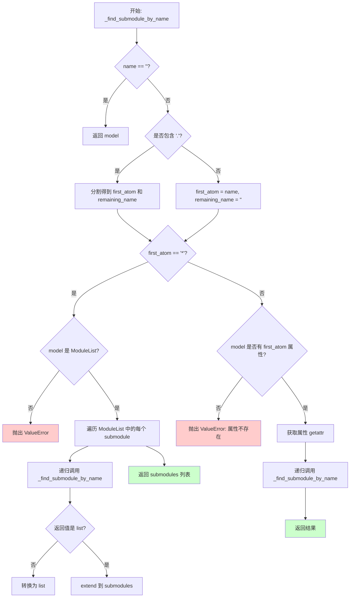

#### 带注释源码

```python
def _find_submodule_by_name(model: torch.nn.Module, name: str) -> torch.nn.Module | list[torch.nn.Module]:
    """
    递归查找子模块
    
    参数:
        model: 要搜索的父模块
        name: 子模块名称，支持点号分隔的路径和通配符 *
    
    返回:
        找到的子模块或子模块列表
    """
    # 递归终止条件：名称为空时返回当前模型
    if name == "":
        return model
    
    # 分割名称为第一部分和剩余部分
    # 例如: "block.attention" -> first_atom="block", remaining_name="attention"
    #       "attention"     -> first_atom="attention", remaining_name=""
    first_atom, remaining_name = name.split(".", 1) if "." in name else (name, "")
    
    # 处理通配符 '*'：在 ModuleList 中查找所有子模块
    if first_atom == "*":
        # 通配符只能与 ModuleList 一起使用
        if not isinstance(model, torch.nn.ModuleList):
            raise ValueError("Wildcard '*' can only be used with ModuleList")
        
        submodules = []
        # 遍历 ModuleList 中的每个模块
        for submodule in model:
            # 递归查找剩余名称
            subsubmodules = _find_submodule_by_name(submodule, remaining_name)
            # 确保返回的是列表形式
            if not isinstance(subsubmodules, list):
                subsubmodules = [subsubmodules]
            submodules.extend(subsubmodules)
        return submodules
    
    # 处理普通属性名称
    else:
        # 检查模型是否有该属性
        if hasattr(model, first_atom):
            # 获取子模块
            submodule = getattr(model, first_atom)
            # 递归查找剩余部分
            return _find_submodule_by_name(submodule, remaining_name)
        else:
            # 属性不存在，抛出错误
            raise ValueError(f"'{first_atom}' is not a submodule of '{model.__class__.__name__}'")
```


### `_fill_gather_shapes`

该函数是一个带 LRU 缓存的辅助函数，用于在分布式聚合操作中为每个 rank 计算聚合后的张量形状。它接收原始张量形状、每个 rank 的聚合维度大小、聚合维度索引和世界大小，然后返回一个包含各 rank 目标形状的列表，用于后续的 all_gather 操作。

参数：

- `shape`：`tuple[int]`，原始张量的形状元组
- `gather_dims`：`tuple[int]`，每个 rank 对应维度的聚合大小元组
- `dim`：`int`，需要进行聚合的维度索引
- `world_size`：`int`，分布式进程组的世界大小（rank 数量）

返回值：`list[list[int]]`，包含每个 rank 聚合后形状的列表

#### 流程图

```mermaid
flowchart TD
    A[开始: _fill_gather_shapes] --> B[初始化空列表 gather_shapes]
    B --> C[遍历 i 从 0 到 world_size-1]
    C --> D[深拷贝原始 shape 为 rank_shape]
    D --> E[将 rank_shape 的 dim 维度替换为 gather_dims[i]]
    E --> F[将 rank_shape 添加到 gather_shapes]
    F --> G{遍历完成?}
    G -->|否| C
    G -->|是| H[返回 gather_shapes 列表]
```

#### 带注释源码

```python
@functools.lru_cache(maxsize=64)
def _fill_gather_shapes(shape: tuple[int], gather_dims: tuple[int], dim: int, world_size: int) -> list[list[int]]:
    """
    为分布式 all_gather 操作生成每个 rank 的目标形状。
    
    使用 LRU 缓存避免重复计算相同参数组合的形状。
    
    参数:
        shape: 原始张量形状元组
        gather_dims: 每个 rank 对应维度的聚合大小元组
        dim: 需要聚合的维度索引
        world_size: 分布式进程组的世界大小
    
    返回:
        包含每个 rank 目标形状的列表
    """
    gather_shapes = []
    
    # 遍历每个 rank，为其计算聚合后的形状
    for i in range(world_size):
        # 深拷贝原始形状，避免修改原始数据
        rank_shape = list(copy.deepcopy(shape))
        
        # 将指定维度替换为当前 rank 的聚合维度大小
        rank_shape[dim] = gather_dims[i]
        
        # 添加当前 rank 的形状到结果列表
        gather_shapes.append(rank_shape)
    
    return gather_shapes
```


### `_all_gather_anything`

该函数实现了一个任意形状的全聚合（All-Gather）操作，允许在不同分布式进程（ranks）上的张量在指定维度上具有不同大小，通过收集每个进程的张量大小信息、分配对应形状的缓冲区、执行分布式 all_gather 操作，最后在指定维度上拼接各进程的张量来实现灵活的聚合功能。

参数：

- `tensor`：`torch.Tensor`，需要被全聚合的输入张量
- `dim`：`int`，指定在哪个维度上进行聚合操作
- `group`：`dist.device_mesh.DeviceMesh`，分布式通信的进程组/设备网格

返回值：`torch.Tensor`，聚合后的张量，其在 dim 维度上的大小为所有进程对应维度大小之和

#### 流程图

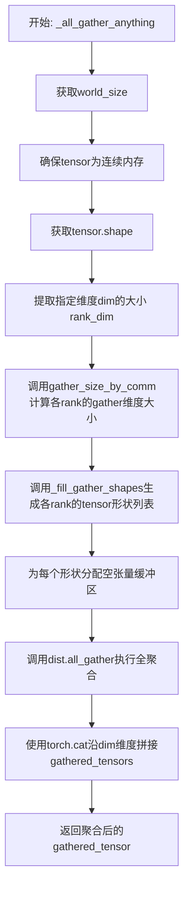

#### 带注释源码

```python
@functools.lru_cache(maxsize=64)
def _all_gather_anything(tensor: torch.Tensor, dim: int, group: dist.device_mesh.DeviceMesh) -> torch.Tensor:
    """
    执行任意形状的全聚合操作，允许不同进程上的tensor在指定维度上具有不同大小。
    
    参数:
        tensor: 输入张量，形状可以为任意形式
        dim: 指定聚合的维度索引
        group: 分布式进程组，用于通信
    
    返回:
        聚合后的张量
    """
    # 获取分布式进程组中的世界大小（进程数）
    world_size = dist.get_world_size(group=group)

    # 确保tensor在内存中是连续存储的，这对于分布式通信操作是必要的
    tensor = tensor.contiguous()
    
    # 获取输入tensor的形状
    shape = tensor.shape
    
    # 提取当前进程在指定维度上的大小
    rank_dim = shape[dim]
    
    # 根据通信组和当前维度大小，计算所有进程在聚合维度上应该具有的大小
    # 这允许不同进程拥有不同大小的tensor
    gather_dims = gather_size_by_comm(rank_dim, group)

    # 使用缓存的_fill_gather_shapes函数生成所有进程的tensor形状列表
    # 每个进程可能具有不同的形状
    gather_shapes = _fill_gather_shapes(tuple(shape), tuple(gather_dims), dim, world_size)

    # 为每个进程预分配对应形状的空张量缓冲区
    # 这些缓冲区将用于存储从各进程收集来的tensor
    gathered_tensors = [torch.empty(shape, device=tensor.device, dtype=tensor.dtype) for shape in gather_shapes]

    # 执行分布式all_gather操作
    # 每个进程的tensor被收集到对应的gathered_tensors缓冲区中
    dist.all_gather(gathered_tensors, tensor, group=group)
    
    # 将收集到的所有tensor沿指定维度dim进行拼接
    gathered_tensor = torch.cat(gathered_tensors, dim=dim)
    
    return gathered_tensor
```


### `ModuleForwardMetadata._get_parameter_from_args_kwargs`

从 args/kwargs 中获取指定标识符的参数值，并返回参数值、是否来自 kwargs 以及参数索引的元组。该方法支持从 kwargs 直接获取、从缓存的参数索引获取、或通过动态检查函数签名获取三种方式。

参数：

- `self`：`ModuleForwardMetadata`，方法所属的实例对象
- `identifier`：`str`，要获取的参数的名称标识符
- `args`：`tuple`，位置参数元组，默认为空元组 `()`
- `kwargs`：`dict`，关键字参数字典，默认为 `None`

返回值：`tuple[Any, bool, int | None]`，返回三元组 (参数值, 是否来自kwargs, 参数索引)。如果参数来自 kwargs，则索引为 `None`；否则索引表示该参数在 args 中的位置。

#### 流程图

```mermaid
flowchart TD
    A[开始 _get_parameter_from_args_kwargs] --> B{kwargs is not None<br/>and identifier in kwargs?}
    B -->|Yes| C[返回 kwargs[identifier], True, None]
    B -->|No| D{cached_parameter_indices<br/>is not None?}
    D -->|Yes| E{identifier in<br/>cached_parameter_indices?}
    D -->|No| F{_cls is None?}
    E -->|Yes| G[返回 args[index], False, index]
    E -->|No| H[raise ValueError:<br/>Parameter not found in cached indices]
    F -->|Yes| I[raise ValueError:<br/>Model class is not set]
    F -->|No| J[获取 _cls.forward 的签名参数<br/>跳过 self]
    J --> K[构建 cached_parameter_indices 缓存]
    L{identifier in<br/>cached_parameter_indices?}
    K --> L
    L -->|No| M[raise ValueError:<br/>Parameter not found in signature]
    L -->|Yes| N{index >= len(args)?}
    N -->|Yes| O[raise ValueError:<br/>Expected N arguments but got M]
    N -->|No| P[返回 args[index], False, index]
```

#### 带注释源码

```python
def _get_parameter_from_args_kwargs(self, identifier: str, args=(), kwargs=None):
    """
    从 args/kwargs 中获取指定标识符的参数值。
    
    参数:
        identifier: 要获取的参数名称
        args: 位置参数元组
        kwargs: 关键字参数字典
    
    返回:
        三元组 (参数值, 是否来自kwargs, 参数索引)
    """
    # 确保 kwargs 不为 None，处理默认参数
    kwargs = kwargs or {}

    # 优先检查 kwargs 中是否直接包含该参数
    if identifier in kwargs:
        # 如果在 kwargs 中找到，返回参数值，标记为来自 kwargs，索引为 None
        return kwargs[identifier], True, None

    # 如果已有缓存的参数索引，直接从 args 中按索引获取
    if self.cached_parameter_indices is not None:
        index = self.cached_parameter_indices.get(identifier, None)
        if index is None:
            # 缓存中不存在该参数索引，抛出异常
            raise ValueError(f"Parameter '{identifier}' not found in cached indices.")
        # 从 args 中按索引获取参数值，标记为非 kwargs，传递索引
        return args[index], False, index

    # 如果模型类未设置，无法获取函数签名，抛出异常
    if self._cls is None:
        raise ValueError("Model class is not set for metadata.")

    # 获取模型 forward 方法的签名参数
    parameters = list(inspect.signature(self._cls.forward).parameters.keys())
    parameters = parameters[1:]  # 跳过 `self` 参数
    # 构建参数名称到索引的缓存映射
    self.cached_parameter_indices = {param: i for i, param in enumerate(parameters)}

    # 检查请求的参数是否在函数签名中
    if identifier not in self.cached_parameter_indices:
        raise ValueError(f"Parameter '{identifier}' not found in function signature but was requested.")

    # 获取参数在 args 中的索引位置
    index = self.cached_parameter_indices[identifier]

    # 验证参数数量是否足够
    if index >= len(args):
        raise ValueError(f"Expected {index} arguments but got {len(args)}.")

    # 返回参数值、非 kwargs 标记、索引位置
    return args[index], False, index
```


### `ContextParallelSplitHook.initialize_hook`

该方法是 `ContextParallelSplitHook` 类的初始化hook，用于准备上下文并行（Context Parallel）所需的模块元数据。它提取目标模块的实际类类型，并创建一个 `ModuleForwardMetadata` 对象来缓存函数签名参数，以便在后续的 `pre_forward` 方法中快速定位和处理输入参数。

参数：

- `module`：`torch.nn.Module`，需要初始化hook的目标模块实例

返回值：`torch.nn.Module`，返回传入的模块实例本身，以便hook注册链式调用

#### 流程图

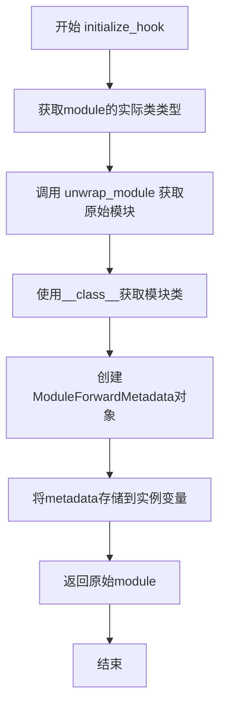

#### 带注释源码

```python
def initialize_hook(self, module):
    """
    初始化hook，准备模块元数据用于后续的上下文并行处理。
    
    该方法在hook首次应用于模块时调用，用于：
    1. 获取模块的实际类类型（处理可能存在的wrapper）
    2. 创建ModuleForwardMetadata对象以缓存forward签名参数
    """
    # 使用unwrap_module处理可能的模块包装，获取原始模块
    # 这样可以正确获取实际类类型而非包装器类
    cls = unwrap_module(module).__class__
    
    # 创建模块前向元数据对象，传入类信息
    # ModuleForwardMetadata会缓存该类的forward方法参数信息
    # 便于在pre_forward中快速定位参数位置
    self.module_forward_metadata = ModuleForwardMetadata(_cls=cls)
    
    # 返回原始模块，保持模块引用不变
    # 这对于hook注册链式调用是必要的
    return module
```


### `ContextParallelSplitHook.pre_forward`

该方法是 `ContextParallelSplitHook` 类的前向预处理钩子，负责在模型前向传播之前对输入进行切分（shard）处理。它遍历上下文并行元数据，从模块输入参数中提取相应的张量，并根据配置对输入进行分区切分，以支持上下文并行计算。

参数：

- `self`：`ContextParallelSplitHook` 实例，隐式参数，包含元数据和并行配置
- `module`：`torch.nn.Module`，执行前向传播的模块
- `*args`：可变位置参数，传递给模块 forward 方法的原始输入
- `**kwargs`：可变关键字参数，传递给模块 forward 方法的原始关键字参数

返回值：`tuple[tuple, dict]`（即 `(tuple[tuple, dict], dict)`），返回一个元组，包含修改后的位置参数元组和关键字参数字典

#### 流程图

```mermaid
flowchart TD
    A[开始 pre_forward] --> B[将 args 转换为列表 args_list]
    B --> C[遍历 metadata 中的每个输入项 name, cpm]
    C --> D{检查 cpm 是否为 ContextParallelInput 且 split_output=True}
    D -->|是| E[跳过当前项, 继续下一个]
    D -->|否| F[从 args/kwargs 中获取输入值 input_val]
    F --> G{input_val 是否为 None}
    G -->|是| E
    G -->|否| H{input_val 类型}
    H -->|Tensor| I[调用 _prepare_cp_input 切分张量]
    H -->|list/tuple| J[遍历 input_val 逐个处理]
    H -->|其他| K[抛出 ValueError]
    I --> L[将处理后的值写回 args_list 或 kwargs]
    J --> M{元素为 tensor 且不需要 split_output}
    M -->|是| I
    M -->|否| N[保持原值]
    N --> L
    L --> O{还有更多 metadata 项?}
    O -->|是| C
    O -->|否| P[返回 tuple(args_list, kwargs)]
    P --> Q[结束]
    K --> R[抛出异常: 不支持的输入类型]
```

#### 带注释源码

```python
def pre_forward(self, module, *args, **kwargs):
    """
    在模型前向传播之前对输入进行上下文并行切分预处理
    
    该方法遍历 ContextParallelModelPlan 中的每个输入规范,
    从模块的输入参数中提取对应的张量,并根据配置进行分区切分,
    以支持上下文并行计算模式。
    """
    # 将位置参数转换为列表以便修改
    args_list = list(args)

    # 遍历元数据中的每个输入项 (name: 输入参数名, cpm: ContextParallelInput 配置)
    for name, cpm in self.metadata.items():
        # 如果是 ContextParallelInput 且设置了 split_output=True,表示输出需要切分而非输入
        if isinstance(cpm, ContextParallelInput) and cpm.split_output:
            continue

        # 从模块的 forward 参数中提取指定名称的参数值
        # 返回: (参数值, 是否为关键字参数, 参数索引)
        input_val, is_kwarg, index = self.module_forward_metadata._get_parameter_from_args_kwargs(
            name, args_list, kwargs
        )

        # 如果参数值为 None,跳过处理
        if input_val is None:
            continue

        # 根据输入类型进行相应处理
        if isinstance(input_val, torch.Tensor):
            # 单个张量:调用 _prepare_cp_input 进行分区切分
            input_val = self._prepare_cp_input(input_val, cpm)
        elif isinstance(input_val, (list, tuple)):
            # 列表/元组:需要与 cpm 列表长度匹配
            if len(input_val) != len(cpm):
                raise ValueError(
                    f"Expected input model plan to have {len(input_val)} elements, but got {len(cpm)}."
                )
            sharded_input_val = []
            for i, x in enumerate(input_val):
                # 仅对 tensor 类型且未设置 split_output 的元素进行切分
                if torch.is_tensor(x) and not cpm[i].split_output:
                    x = self._prepare_cp_input(x, cpm[i])
                sharded_input_val.append(x)
            # 保持原始容器类型
            input_val = sharded_input_val
        else:
            raise ValueError(f"Unsupported input type: {type(input_val)}")

        # 将处理后的值写回原位置
        if is_kwarg:
            # 如果原参数是关键字参数,更新 kwargs
            kwargs[name] = input_val
        elif index is not None and index < len(args_list):
            # 如果原参数是位置参数,更新 args_list
            args_list[index] = input_val
        else:
            # 异常情况:无法确定参数位置
            raise ValueError(
                f"An unexpected error occurred while processing the input '{name}'. Please open an "
                f"issue at https://github.com/huggingface/diffusers/issues and provide a minimal reproducible "
                f"example along with the full stack trace."
            )

    # 返回修改后的位置参数元组和关键字参数字典
    return tuple(args_list), kwargs
```


### `ContextParallelSplitHook.post_forward`

该方法用于在模型前向传播后处理输出，实现Context Parallel的后向处理逻辑。具体来说，它对模型输出进行检查和分割处理，根据`split_output`标志对指定的输出张量进行分片操作，以便在分布式环境下正确处理上下文并行的模型输出。

参数：

- `module`：`torch.nn.Module`，执行前向传播的模块实例
- `output`：`torch.Tensor | list[torch.Tensor] | tuple[torch.Tensor]`，模型前向传播的输出，可以是单个张量或张量列表/元组

返回值：`torch.Tensor | tuple[torch.Tensor]`，处理后的输出。如果输入是单个张量则返回张量，否则返回元组

#### 流程图

```mermaid
flowchart TD
    A[开始 post_forward] --> B{output是否为Tensor?}
    B -->|是| C[is_tensor = True]
    B -->|否| D{output是否为list/tuple且全为Tensor?}
    D -->|是| E[is_tensor_list = True]
    D -->|否| F[抛出ValueError]
    C --> G[output转换为list]
    E --> G
    G --> H[遍历metadata中的每个cpm]
    H --> I{cpm是否为ContextParallelInput且split_output为True?}
    I -->|否| H
    I -->|是| J{index是否越界?}
    J -->|是| K[抛出ValueError]
    J -->|否| L[获取output[index]]
    L --> M[调用_prepare_cp_input处理当前输出]
    M --> N[更新output[index]]
    N --> H
    H --> O{遍历完成?}
    O -->|否| H
    O -->|是| P{is_tensor为True?}
    P -->|是| Q[返回output[0]]
    P -->|否| R[返回tuple(output)]
    Q --> S[结束]
    R --> S
    F --> S
    K --> S
```

#### 带注释源码

```python
def post_forward(self, module, output):
    """
    在模型前向传播后处理输出，实现Context Parallel的后向处理（处理输出）。
    
    该方法对模型输出进行检查，并对其中的指定张量进行分片处理，
    以支持上下文并行的分布式训练。
    """
    # 检查output是否为单个Tensor
    is_tensor = isinstance(output, torch.Tensor)
    # 检查output是否为Tensor列表或元组
    is_tensor_list = isinstance(output, (list, tuple)) and all(isinstance(x, torch.Tensor) for x in output)

    # 验证输出类型是否合法
    if not is_tensor and not is_tensor_list:
        raise ValueError(f"Expected output to be a tensor or a list/tuple of tensors, but got {type(output)}.")

    # 将输出统一转换为列表进行处理
    output = [output] if is_tensor else list(output)
    
    # 遍历元数据中的每个输出配置
    for index, cpm in self.metadata.items():
        # 仅处理设置了split_output的ContextParallelInput
        if not isinstance(cpm, ContextParallelInput) or not cpm.split_output:
            continue
        
        # 检查索引是否越界
        if index >= len(output):
            raise ValueError(f"Index {index} out of bounds for output of length {len(output)}.")
        
        # 获取当前需要处理的输出
        current_output = output[index]
        # 调用_prepare_cp_input对输出进行分片处理
        current_output = self._prepare_cp_input(current_output, cpm)
        # 将处理后的输出放回原位置
        output[index] = current_output

    # 根据原始输出类型返回结果
    return output[0] if is_tensor else tuple(output)
```


### `ContextParallelSplitHook._prepare_cp_input`

准备上下文并行输入，根据配置使用等分片或任意分片策略对输入张量进行分片处理。

参数：

- `self`：`ContextParallelSplitHook`，隐式的调用者实例，包含元数据和并行配置
- `x`：`torch.Tensor`，待分片的输入张量
- `cp_input`：`ContextParallelInput`，上下文并行输入配置，包含分片维度、预期维度等参数

返回值：`torch.Tensor`，分片后的张量

#### 流程图

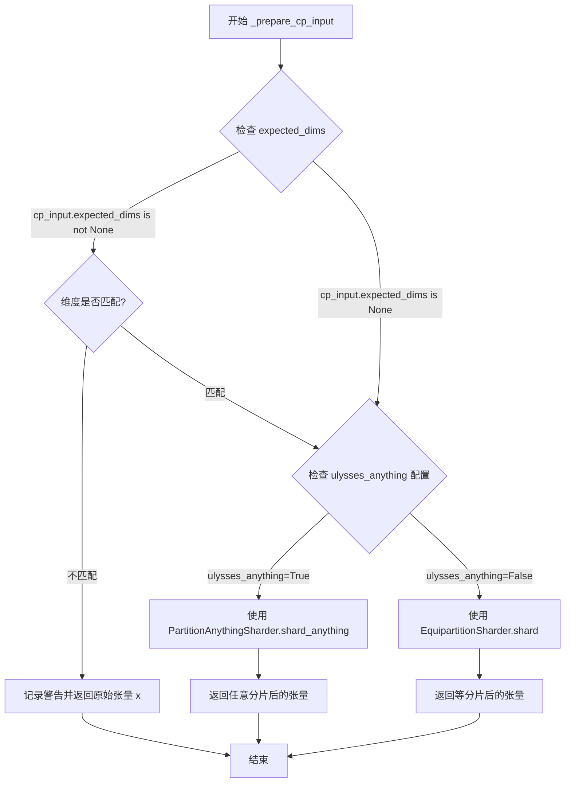

#### 带注释源码

```python
def _prepare_cp_input(self, x: torch.Tensor, cp_input: ContextParallelInput) -> torch.Tensor:
    """
    准备上下文并行输入，根据配置对输入张量进行分片。
    
    参数:
        x: 待分片的输入张量
        cp_input: 上下文并行输入配置，包含分片维度、预期维度等信息
    
    返回:
        分片后的张量
    """
    # 检查是否需要验证输入张量的维度
    # 如果配置了 expected_dims 且输入维度不匹配，则跳过分片并返回原始张量
    if cp_input.expected_dims is not None and x.dim() != cp_input.expected_dims:
        logger.warning_once(
            f"Expected input tensor to have {cp_input.expected_dims} dimensions, "
            f"but got {x.dim()} dimensions, split will not be applied."
        )
        return x  # 维度不匹配，返回原始张量不分片
    else:
        # 根据 parallel_config.ulysses_anything 配置选择分片策略
        if self.parallel_config.ulysses_anything:
            # 使用任意分片策略：支持不均匀的分片
            return PartitionAnythingSharder.shard_anything(
                x,                      # 输入张量
                cp_input.split_dim,     # 分片维度
                self.parallel_config._flattened_mesh  # 设备网格
            )
        else:
            # 使用等分片策略：张量在分片维度上必须均匀分割
            return EquipartitionSharder.shard(
                x,                      # 输入张量
                cp_input.split_dim,     # 分片维度
                self.parallel_config._flattened_mesh  # 设备网格
            )
```


### `ContextParallelGatherHook.post_forward`

该方法是 Context Parallel（上下文并行）中的后向处理钩子，主要负责在模型前向传播完成后对输出进行聚合（gather）操作，将分布在多个设备上的分片张量重新合并为完整的张量，支持等距分片和任意分片两种模式。

参数：

- `module`：`torch.nn.Module`，执行前向传播的模块实例
- `output`： Union[torch.Tensor, list[torch.Tensor], tuple[torch.Tensor]]，模型前向传播的输出，可以是单个张量或张量列表/元组

返回值： Union[torch.Tensor, list[torch.Tensor], tuple[torch.Tensor]]，聚合后的输出，类型与输入保持一致

#### 流程图

```mermaid
flowchart TD
    A[开始 post_forward] --> B{output 是否为 Tensor?}
    B -->|是| C[将 output 包装为列表: output = [output]
    B -->|否| D{output 是否为 list/tuple<br>且所有元素均为 Tensor?}
    D -->|否| E[抛出 ValueError]
    D -->|是| F[将 output 转换为 list]
    C --> G[验证 output 长度与 metadata 长度相等]
    G --> H{验证通过?}
    H -->|否| I[抛出 ValueError]
    H -->|是| J[遍历 metadata 中的每个 ContextParallelModelPlan]
    J --> K{当前 cpm 是否为 None?}
    K -->|是| J
    K -->|否| L{ulysses_anything 配置?}
    L -->|是| M[调用 PartitionAnythingSharder.unshard_anything]
    L -->|否| N[调用 EquipartitionSharder.unshard]
    M --> O[更新 output[i]]
    N --> O
    O --> J
    J --> P{原始输入是单个 Tensor?}
    P -->|是| Q[返回 output[0]]
    P -->|否| R[返回 tuple(output)]
    Q --> S[结束]
    R --> S
    E --> S
    I --> S
```

#### 带注释源码

```python
def post_forward(self, module, output):
    """
    在模型前向传播完成后执行的后向处理钩子，负责聚合分布式输出的张量。
    
    参数:
        module: 执行前向传播的模块
        output: 模型前向传播的输出，可以是单个Tensor或Tensor列表/元组
    
    返回:
        聚合后的输出，类型与输入保持一致
    """
    # Step 1: 判断输出是否为单个Tensor
    is_tensor = isinstance(output, torch.Tensor)

    # Step 2: 验证输出类型有效性
    if is_tensor:
        # 如果是单个Tensor，包装为列表以便统一处理
        output = [output]
    elif not (isinstance(output, (list, tuple)) and all(isinstance(x, torch.Tensor) for x in output)):
        # 如果不是Tensor也不是Tensor的list/tuple，抛出异常
        raise ValueError(f"Expected output to be a tensor or a list/tuple of tensors, but got {type(output)}.")

    # Step 3: 转换为list以便修改元素
    output = list(output)

    # Step 4: 验证输出数量与metadata计划数量匹配
    if len(output) != len(self.metadata):
        raise ValueError(f"Expected output to have {len(self.metadata)} elements, but got {len(output)}.")

    # Step 5: 遍历每个输出，执行对应的反分片(gather)操作
    for i, cpm in enumerate(self.metadata):
        # 跳过None的metadata（表示该输出不需要处理）
        if cpm is None:
            continue
        
        # 根据配置选择不同的反分片策略
        if self.parallel_config.ulysses_anything:
            # 使用任意分片策略进行反分片
            # 适用于更通用的张量形状和分片情况
            output[i] = PartitionAnythingSharder.unshard_anything(
                output[i], cpm.gather_dim, self.parallel_config._flattened_mesh
            )
        else:
            # 使用等距分片策略进行反分片
            # 要求张量在指定维度上能够均匀分割
            output[i] = EquipartitionSharder.unshard(
                output[i], cpm.gather_dim, self.parallel_config._flattened_mesh
            )

    # Step 6: 根据原始输入类型返回对应格式
    # 如果原始输入是单个Tensor，返回单个Tensor
    # 如果原始输入是list/tuple，返回tuple
    return output[0] if is_tensor else tuple(output)
```


### AllGatherFunction.forward

该方法实现了分布式深度学习中的全聚合（All-Gather）操作，在前向传播时将输入张量沿指定维度在通信组内的所有进程间进行收集聚合，同时保存反向传播所需的上下文信息（维度、通信组、世界大小和进程排名）。

参数：

- `ctx`：`torch.autograd.Function.Context`，PyTorch 自动梯度函数的上下文对象，用于存储反向传播所需的信息
- `tensor`：`torch.Tensor`，输入张量，需要在进程间进行全聚合的 tensor
- `dim`：`int`，整数类型，指定沿 tensor 的哪个维度进行全聚合操作
- `group`：`dist.ProcessGroup` 或等效的通信组对象，指定参与全聚合的进程组，通常通过 `mesh.get_group()` 获取

返回值：`torch.Tensor`，全聚合操作返回的张量，其在指定维度的长度将变为原来的 world_size 倍（如果原始长度相同）

#### 流程图

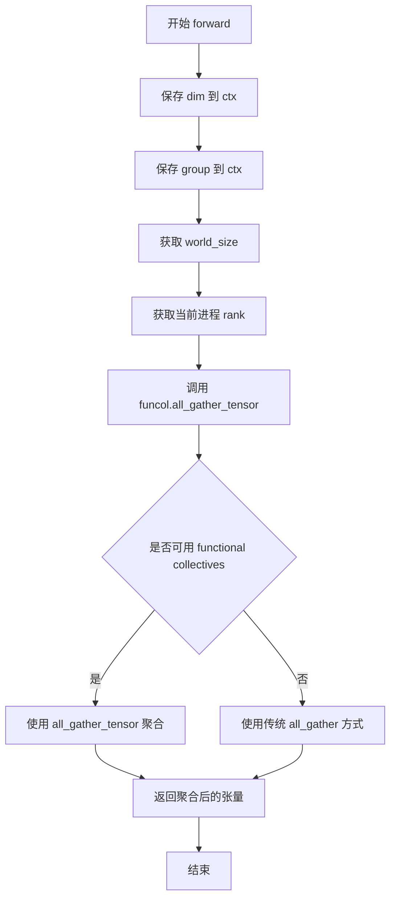

#### 带注释源码

```python
@staticmethod
def forward(ctx, tensor, dim, group):
    """
    AllGatherFunction 的前向传播方法，执行全聚合操作。
    
    该方法沿指定维度收集所有进程上的张量，生成一个包含所有进程数据的聚合张量。
    同时保存反向传播所需的上下文信息。
    
    参数:
        ctx: 上下文对象，用于在反向传播时恢复信息
        tensor: 输入张量，待聚合的 tensor
        dim: 整数，沿 tensor 的哪个维度进行聚合
        group: 通信组，指定参与聚合的进程集合
    
    返回:
        聚合后的张量
    """
    # 保存维度信息到上下文，供反向传播使用
    ctx.dim = dim
    
    # 保存通信组信息到上下文，供反向传播确定如何分割梯度
    ctx.group = group
    
    # 获取通信组中的总进程数（世界大小）
    ctx.world_size = torch.distributed.get_world_size(group)
    
    # 获取当前进程在通信组中的排名（索引）
    ctx.rank = torch.distributed.get_rank(group)
    
    # 使用 PyTorch 分布式功能模块的 all_gather_tensor 进行全聚合
    # 这是一个函数式集合操作，会在指定 group 的所有进程间收集 tensor
    return funcol.all_gather_tensor(tensor, dim, group=group)
```


### `AllGatherFunction.backward`

该方法是 PyTorch 自定义 autograd Function 的反向传播实现，用于在分布式训练的反向传播阶段将聚合的梯度分散（scatter）回各个进程。具体来说，它接收来自上一层的聚合梯度，按照维度分割成与进程数相等的块，然后返回当前进程对应的梯度块。

参数：

- `ctx`：`torch.autograd.function.FunctionCtx`，PyTorch 自动传入的上下文对象，包含前向传播时保存的 `dim`、`group`、`world_size`（总进程数）和 `rank`（当前进程编号）
- `grad_output`：`torch.Tensor`，反向传播时从后续层接收到的梯度输出（即聚合后的梯度）

返回值：`tuple[torch.Tensor, None, None]`，返回一个元组，其中第一个元素是当前进程对应的梯度分片（类型为 `torch.Tensor`），第二和第三个元素均为 `None`，分别对应前向传播参数中的 `dim` 和 `group`（因为这两个参数是配置参数，不需要梯度）

#### 流程图

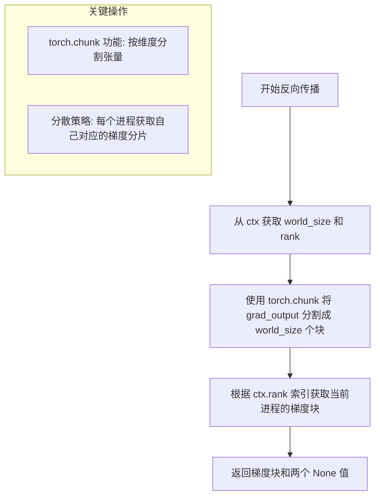

#### 带注释源码

```python
@staticmethod
def backward(ctx, grad_output):
    # ctx: 上下文对象, 存储了前向传播时的关键信息
    # grad_output: 反向传播输入的梯度, 这是已经经过 AllGather 聚合后的梯度
    
    # 将聚合后的梯度按照 world_size (总进程数) 和维度 dim 分割成多个块
    # 例如: 如果 world_size=4, dim=0, grad_output shape 为 [8, ...]
    # 则分割后得到 4 个 shape 为 [2, ...] 的梯度块
    grad_chunks = torch.chunk(grad_output, ctx.world_size, dim=ctx.dim)
    
    # 根据当前进程的 rank (编号) 选取对应的梯度块
    # rank=0 的进程获取第0块, rank=1 的进程获取第1块, 以此类推
    # 这样就实现了梯度的分散(Scatter)操作
    #
    # 返回值说明:
    # - 第一个返回值: 当前进程对应的梯度块, 传递给前一层
    # - 第二个返回值 None: 对应 forward 的 tensor 参数, 不需要梯度
    # - 第三个返回值 None: 对应 forward 的 dim 参数, 不需要梯度
    # (group 参数同样不需要梯度, 由 PyTorch 自动处理)
    return grad_chunks[ctx.rank], None, None
```


### `EquipartitionSharder.shard`

该方法将输入张量在指定维度上按照设备网格进行等分切分，返回当前进程对应的张量分片。核心逻辑是将张量沿指定维度切分为与网格大小相同数量的块，然后根据当前进程的rank选择对应的块。

参数：

- `tensor`：`torch.Tensor`，要进行等分切分的输入张量
- `dim`：`int`，要切分的维度索引
- `mesh`：`torch.distributed.device_mesh.DeviceMesh`，分布式设备网格，用于确定切分数量和进程rank

返回值：`torch.Tensor`，返回切分后的张量分片，即当前进程rank对应的张量块

#### 流程图

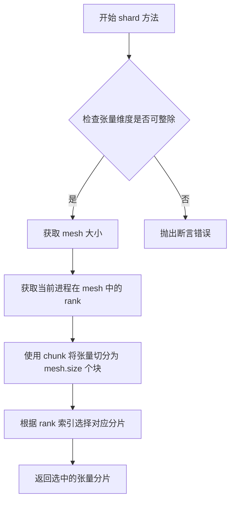

#### 带注释源码

```python
@classmethod
def shard(cls, tensor: torch.Tensor, dim: int, mesh: torch.distributed.device_mesh.DeviceMesh) -> torch.Tensor:
    """
    将输入张量在指定维度上等分切分，返回当前进程对应的分片
    
    参数:
        tensor: 要切分的输入张量
        dim: 切分的维度
        mesh: 设备网格
        
    返回:
        当前进程rank对应的张量分片
    """
    # NOTE: 以下断言在一般情况下不必须为真，目前强制执行是因为
    # 另一种情况尚未经过测试或任何模型的需求
    assert tensor.size()[dim] % mesh.size() == 0, (
        "Tensor size along dimension to be sharded must be divisible by mesh size"
    )

    # 以下代码与 Dynamo 的 fullgraph 不兼容（DeviceMesh.get_rank 会失败）
    # return tensor.chunk(mesh.size(), dim=dim)[mesh.get_rank()]

    # 使用 chunk 将张量沿指定维度切分为 mesh.size() 个块，
    # 然后根据当前进程在 mesh.get_group() 中的 rank 选择对应的块
    return tensor.chunk(mesh.size(), dim=dim)[torch.distributed.get_rank(mesh.get_group())]
```


### `EquipartitionSharder.unshard`

该方法用于将经过分片处理的张量重新聚合（unshard）成一个完整的张量。它通过调用 `AllGatherFunction` 在指定的维度上执行分布式通信操作，将分布在多个设备上的分片张量收集并拼接成原始的完整张量。

参数：

- `tensor`：`torch.Tensor`，输入的已分片张量，需要进行聚合操作
- `dim`：`int`，指定在哪个维度上进行张量聚合（gather）
- `mesh`：`torch.distributed.device_mesh.DeviceMesh`，分布式设备网格，包含通信组信息

返回值：`torch.Tensor`，聚合后的完整张量

#### 流程图

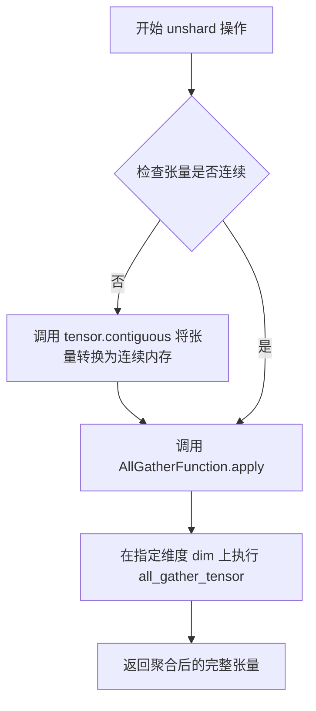

#### 带注释源码

```python
@classmethod
def unshard(cls, tensor: torch.Tensor, dim: int, mesh: torch.distributed.device_mesh.DeviceMesh) -> torch.Tensor:
    """
    将分片张量重新聚合为完整张量
    
    参数:
        tensor: 已经过 shard 操作的分片张量
        dim: 需要进行聚合的维度
        mesh: DeviceMesh 对象，包含分布式通信组信息
    
    返回:
        聚合后的完整张量
    """
    # 首先确保张量在内存中是连续存储的
    # 这是因为 all_gather 操作要求输入是连续的
    tensor = tensor.contiguous()
    
    # 调用自定义的 AllGatherFunction 进行梯度安全的 all-gather 操作
    # - tensor: 要聚合的分片张量
    # - dim: 聚合维度
    # - mesh.get_group(): 获取当前 mesh 对应的通信组
    tensor = AllGatherFunction.apply(tensor, dim, mesh.get_group())
    
    # 返回聚合后的完整张量
    return tensor
```


### `AllGatherAnythingFunction.forward`

这是 PyTorch 自定义 autograd Function 的前向传播方法，用于在分布式计算环境中执行任意形状张量的全局聚合（All-Gather）操作。该函数支持不同进程上的不同张量形状，通过调用 `_all_gather_anything` 内部函数收集来自所有进程的张量，并在指定维度上进行拼接聚合，是分布式模型并行中上下文并行（Context Parallel）功能的核心组件。

参数：

- `ctx`：`torch.autograd.function.FunctionCtx`，PyTorch 自动提供的上下文对象，用于在前向传播中保存信息（如维度、通信组、世界大小、进程_rank_），供反向传播时使用
- `tensor`：`torch.Tensor`，输入的待聚合张量，可以是任意形状
- `dim`：`int`，指定在哪个维度上进行全局聚合
- `group`：`dist.device_mesh.DeviceMesh`，PyTorch 分布式设备网格对象，定义通信组和设备拓扑结构

返回值：`torch.Tensor`，聚合后的张量。该张量在指定维度上的大小将为所有进程对应维度大小之和，其他维度保持不变

#### 流程图

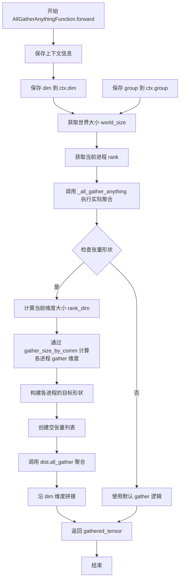

#### 带注释源码

```python
class AllGatherAnythingFunction(torch.autograd.Function):
    """
    PyTorch 自定义 autograd Function，用于支持任意形状张量的全局聚合操作。
    与标准 All-Gather 不同，此函数允许不同进程上的张量沿聚合维度具有不同大小。
    """

    @staticmethod
    def forward(
        ctx,  # 上下文对象，用于保存前向传播信息供反向传播使用
        tensor: torch.Tensor,  # 输入张量，任意形状
        dim: int,  # 聚合维度索引
        group: dist.device_mesh.DeviceMesh  # 分布式通信设备网格
    ):
        """
        前向传播：执行任意形状张量的全局聚合
        
        参数:
            ctx: PyTorch 自动提供的上下文，保存反向传播所需信息
            tensor: 待聚合的输入张量
            dim: 沿该维度进行聚合
            group: 定义参与聚合的进程组
        
        返回:
            聚合后的张量，沿 dim 维度的大小为所有进程该维度大小之和
        """
        
        # ==================== 保存上下文信息供反向传播使用 ====================
        ctx.dim = dim  # 记录聚合维度，用于反向传播时分割梯度
        ctx.group = group  # 记录通信组，用于反向传播确定进程标识
        ctx.world_size = dist.get_world_size(group)  # 记录世界大小（总进程数）
        ctx.rank = dist.get_rank(group)  # 记录当前进程排名
        
        # ==================== 执行实际的 All-Gather 操作 ====================
        # 调用内部函数执行支持任意形状的 all-gather
        # 该函数内部会处理不同进程不同形状的情况
        gathered_tensor = _all_gather_anything(tensor, dim, group)
        
        return gathered_tensor  # 返回聚合后的张量
```


### `AllGatherAnythingFunction.backward`

该方法是 PyTorch 自定义 autograd 函数 `AllGatherAnythingFunction` 的反向传播实现，用于在分布式训练中将收集（gather）的梯度分散（scatter）回原始的各个 rank，实现了"All-to-All"通信模式中梯度的反向流动。

参数：

- `ctx`：`torch.autograd.function.Context`，PyTorch 自动传递的上下文对象，包含 `forward` 阶段保存的 `dim`（分片维度）、`group`（通信组）、`world_size`（进程数）和 `rank`（当前进程 rank）等属性
- `grad_output`：`torch.Tensor`，从上层反向传播过来的梯度输出，即汇聚后的张量梯度

返回值：`tuple[torch.Tensor | None, None, None]`，返回三元素元组。第一个元素是当前 rank 对应的梯度分片（`grad_splits[ctx.rank]`），用于继续反向传播；后两个元素为 `None`，对应 `forward` 中的 `dim` 和 `group` 参数，因为它们是张量而非可学习参数，不需要计算梯度

#### 流程图

```mermaid
flowchart TD
    A[开始 backward] --> B[接收 grad_output 梯度]
    B --> C{检查 ctx.world_size}
    C -->|world_size > 1| D[使用 torch.tensor_split 沿 dim 维度分割 grad_output]
    C -->|world_size == 1| E[grad_splits 只有一个元素]
    D --> F[根据 ctx.rank 选取对应分片]
    E --> F
    F --> G[返回 grad_splits[rank], None, None]
```

#### 带注释源码

```python
@staticmethod
def backward(ctx, grad_output):
    # NOTE: We use `tensor_split` instead of chunk, because the `chunk`
    # function may return fewer than the specified number of chunks!
    # 使用 tensor_split 而不是 chunk，因为 chunk 可能返回少于指定数量的分块
    # 这确保了在某些边界情况下（如张量大小不能整除 world_size）能正确分割
    grad_splits = torch.tensor_split(grad_output, ctx.world_size, dim=ctx.dim)
    # 将汇聚后的梯度沿 dim 维度分割成 world_size 份，每份对应一个 rank
    return grad_splits[ctx.rank], None, None
    # 返回当前 rank 对应的梯度分片，继续向后传播
    # 第二个和第三个 None 分别对应 forward 中的 dim 和 group 参数
    # 它们不是张量，不需要计算梯度
```


### `PartitionAnythingSharder.shard_anything`

将任意大小的张量在指定维度上按设备网格进行分片，返回当前进程所在设备对应的分片张量。该方法使用 `tensor_split` 而非 `chunk`，以确保在张量维度不能被整除时也能正确处理。

参数：

- `cls`：类方法隐含的第一个参数，表示类本身
- `tensor`：`torch.Tensor`，输入的要分片的张量
- `dim`：`int`，指定要分片的维度索引
- `mesh`：`torch.distributed.device_mesh.DeviceMesh`，分布式设备网格，定义分片的进程组

返回值：`torch.Tensor`，分片后的张量，为原始张量在指定维度上的第 `rank` 个分片

#### 流程图

```mermaid
flowchart TD
    A[开始 shard_anything] --> B{验证张量维度}
    B -->|维度小于mesh大小| C[抛出 AssertionError]
    B -->|维度足够| D[执行 tensor_split 分片]
    D --> E[获取当前进程 rank]
    E --> F[返回对应 rank 的分片]
    
    B2(断言检查) --> tensor.size[dim] >= mesh.size()
    
    subgraph 分片策略
        D -->|"tensor.tensor_split(mesh.size(), dim=dim)"| S1[将张量沿 dim 分为 mesh.size() 份]
        S1 -->|"[dist.get_rank(mesh.get_group())]"| E
    end
```

#### 带注释源码

```python
@classmethod
def shard_anything(
    cls, tensor: torch.Tensor, dim: int, mesh: torch.distributed.device_mesh.DeviceMesh
) -> torch.Tensor:
    """
    将任意大小的张量在指定维度上按设备网格进行分片。
    
    参数:
        tensor: 要分片的输入张量
        dim: 要分片的维度索引
        mesh: 设备网格，定义分片的进程组
    
    返回:
        分片后的张量（当前 rank 对应的部分）
    """
    # 断言：确保张量在指定维度的大小大于等于 mesh 中的设备数量
    # 否则无法进行分片
    assert tensor.size()[dim] >= mesh.size(), (
        f"Cannot shard tensor of size {tensor.size()} along dim {dim} across mesh of size {mesh.size()}."
    )
    
    # NOTE: 使用 tensor_split 而非 chunk，因为 chunk 函数在某些情况下
    # 可能返回少于指定数量的分片，导致索引越界
    # tensor_split 会严格按照指定数量返回分片
    return tensor.tensor_split(mesh.size(), dim=dim)[dist.get_rank(mesh.get_group())]
    # 获取当前进程在 mesh 组中的 rank 索引
    # 从分片结果中选择对应 rank 的张量分片返回
```


### `PartitionAnythingSharder.unshard_anything`

该方法是 `PartitionAnythingSharder` 类的一个类方法，用于在分布式并行环境中将分片（sharded）的张量重新聚合（unshard）回来。它通过调用 `AllGatherAnythingFunction` 的前向传播来实现任意尺寸张量的全局聚合，支持不均匀分片的场景。

参数：

- `cls`：类方法隐式参数，表示 `PartitionAnythingSharder` 类本身
- `tensor`：`torch.Tensor`，输入的分片张量，需要进行全局聚合
- `dim`：`int`，指定在哪个维度上进行聚合操作
- `mesh`：`torch.distributed.device_mesh.DeviceMesh`，分布式设备网格，定义了参与聚合的进程组信息

返回值：`torch.Tensor`，聚合后的完整张量

#### 流程图

```mermaid
flowchart TD
    A[开始: 输入分片张量 tensor] --> B{tensor.contiguous}
    B -->|确保内存连续| C[调用 AllGatherAnythingFunction.apply]
    C --> D[获取分布式进程组信息]
    D --> E[在指定维度 dim 上执行 all_gather 聚合]
    E --> F[返回聚合后的完整张量]
    
    subgraph AllGatherAnythingFunction
        G[前向传播: all_gather_tensor] --> H[收集所有进程的分片张量]
        H --> I[在 dim 维度拼接张量]
    end
    
    subgraph 反向传播
        J[梯度分割: tensor_split] --> K[返回当前 rank 对应的梯度]
    end
```

#### 带注释源码

```python
@classmethod
def unshard_anything(
    cls, tensor: torch.Tensor, dim: int, mesh: torch.distributed.device_mesh.DeviceMesh
) -> torch.Tensor:
    """
    将分片的张量重新聚合（unshard）回来。
    
    参数:
        tensor: 输入的分片张量，需要进行全局聚合
        dim: 指定在哪个维度上进行聚合操作
        mesh: 分布式设备网格，定义了参与聚合的进程组
    
    返回:
        聚合后的完整张量
    """
    # 首先确保张量在内存中是连续的，这是分布式通信的要求
    tensor = tensor.contiguous()
    
    # 调用 AllGatherAnythingFunction 的前向传播
    # 该函数会使用 PyTorch 的 functional collectives 执行 all-gather 操作
    # 支持任意维度的张量聚合，即使各进程上的分片大小不同
    tensor = AllGatherAnythingFunction.apply(tensor, dim, mesh.get_group())
    
    return tensor
```

## 关键组件


# 上下文并行(Context Parallel)模块详细设计文档

## 一段话描述

该代码实现了**上下文并行(Context Parallel)功能**，用于在分布式深度学习环境中对模型的输入进行分割（split）和输出进行聚合（gather），支持两种分割策略（等分和任意分），通过PyTorch的DeviceMesh和钩子机制实现无侵入式的模型并行。

---

## 文件的整体运行流程

1. **初始化阶段**：用户通过`apply_context_parallel`函数注册上下文并行钩子，传入模型、并行配置和执行计划
2. **前向传播阶段**：
   - `ContextParallelSplitHook.pre_forward`在模型前向传播前执行，根据配置将输入张量按指定维度分割
   - 支持等分区分割（EquipartitionSharder）和任意分区分割（PartitionAnythingSharder）
3. **后向传播阶段**：
   - `ContextParallelGatherHook.post_forward`在模型前向传播后执行，将分割的输出重新聚合
   - 使用AllGather操作合并各并行ranks的结果
4. **卸载阶段**：通过`remove_context_parallel`函数移除已注册的钩子

---

## 类的详细信息

### ModuleForwardMetadata

**描述**：数据类，存储模块前向传播的元数据，用于从参数名称解析参数值。

**字段**：

| 字段名 | 类型 | 描述 |
|--------|------|------|
| cached_parameter_indices | dict[str, int] | 缓存的参数名到参数索引的映射 |
| _cls | Type | 模型类类型 |

**方法**：

#### `_get_parameter_from_args_kwargs`

```python
def _get_parameter_from_args_kwargs(self, identifier: str, args=(), kwargs=None):
```

| 参数名 | 参数类型 | 参数描述 |
|--------|----------|----------|
| identifier | str | 参数名称 |
| args | tuple | 位置参数元组 |
| kwargs | dict | 关键字参数字典 |

| 返回值类型 | 返回值描述 |
|------------|------------|
| tuple | (参数值, 是否为kwargs, 参数索引) |

**mermaid流程图**：

```mermaid
flowchart TD
    A[开始] --> B{kwargs中是否存在identifier}
    B -->|是| C[返回kwargs中的值, True, None]
    B -->|否| D{cached_parameter_indices是否存在}
    D -->|是| E{identifier在缓存中}
    D -->|否| F{_cls是否为None}
    E -->|是| G[从args获取值, False, index]
    E -->|否| H[抛出ValueError]
    F -->|是| I[抛出ValueError]
    F -->|否| J[获取_cls.forward的签名]
    J --> K[构建参数索引缓存]
    K --> L{identifier在签名中}
    L -->|是| M[返回args值, False, index]
    L -->|否| N[抛出ValueError]
```

**源码**：

```python
def _get_parameter_from_args_kwargs(self, identifier: str, args=(), kwargs=None):
    kwargs = kwargs or {}

    if identifier in kwargs:
        return kwargs[identifier], True, None

    if self.cached_parameter_indices is not None:
        index = self.cached_parameter_indices.get(identifier, None)
        if index is None:
            raise ValueError(f"Parameter '{identifier}' not found in cached indices.")
        return args[index], False, index

    if self._cls is None:
        raise ValueError("Model class is not set for metadata.")

    parameters = list(inspect.signature(self._cls.forward).parameters.keys())
    parameters = parameters[1:]  # skip `self`
    self.cached_parameter_indices = {param: i for i, param in enumerate(parameters)}

    if identifier not in self.cached_parameter_indices:
        raise ValueError(f"Parameter '{identifier}' not found in function signature but was requested.")

    index = self.cached_parameter_indices[identifier]

    if index >= len(args):
        raise ValueError(f"Expected {index} arguments but got {len(args)}.")

    return args[index], False, index
```

---

### ContextParallelSplitHook

**描述**：上下文并行分割钩子，继承自ModelHook，在模型前向传播前分割输入张量。

**字段**：

| 字段名 | 类型 | 描述 |
|--------|------|------|
| metadata | ContextParallelModelPlan | 上下文并行模型计划 |
| parallel_config | ContextParallelConfig | 并行配置 |
| module_forward_metadata | ModuleForwardMetadata | 模块前向元数据 |

**方法**：

#### `initialize_hook`

```python
def initialize_hook(self, module):
```

| 参数名 | 参数类型 | 参数描述 |
|--------|----------|----------|
| module | torch.nn.Module | 待初始化的模块 |

| 返回值类型 | 返回值描述 |
|------------|------------|
| torch.nn.Module | 原始模块 |

**mermaid流程图**：

```mermaid
flowchart TD
    A[开始] --> B[获取module的类]
    B --> C[创建ModuleForwardMetadata]
    C --> D[返回module]
```

#### `pre_forward`

```python
def pre_forward(self, module, *args, **kwargs):
```

| 参数名 | 参数类型 | 参数描述 |
|--------|----------|----------|
| module | torch.nn.Module | 模块实例 |
| *args | tuple | 位置参数 |
| **kwargs | dict | 关键字参数 |

| 返回值类型 | 返回值描述 |
|------------|------------|
| tuple | (处理后的args, 处理后的kwargs) |

**mermaid流程图**：

```mermaid
flowchart TD
    A[开始] --> B[将args转为列表]
    B --> C{遍历metadata中的每个cpm}
    C --> D{cpm是ContextParallelInput且split_output为True}
    D -->|是| E[跳过本次循环]
    D -->|否| F[获取参数值]
    F --> G{input_val是否为None}
    G -->|是| H[跳过本次循环]
    G -->|否| I{input_val是Tensor}
    I -->|是| J[调用_prepare_cp_input]
    I -->|否| K{input_val是list/tuple}
    K -->|是| L[遍历input_val]
    L --> M{元素是tensor且不需要split_output}
    M -->|是| N[调用_prepare_cp_input]
    M -->|否| O[保持原值]
    N --> P[添加到sharded_input_val]
    O --> P
    P --> Q{遍历完成}
    Q -->|是| R[input_val赋值sharded_input_val]
    K -->|否| S[抛出ValueError]
    R --> T{is_kwarg为True}
    T -->|是| U[更新kwargs]
    T -->|否| V{index有效}
    V -->|是| W[更新args_list]
    V -->|否| X[抛出ValueError]
    E --> Y{遍历完成}
    Y --> Z[返回tuple(args_list, kwargs)]
```

#### `post_forward`

```python
def post_forward(self, module, output):
```

| 参数名 | 参数类型 | 参数描述 |
|--------|----------|----------|
| module | torch.nn.Module | 模块实例 |
| output | Tensor | 模型输出 |

| 返回值类型 | 返回值描述 |
|------------|------------|
| tuple | 处理后的输出 |

#### `_prepare_cp_input`

```python
def _prepare_cp_input(self, x: torch.Tensor, cp_input: ContextParallelInput) -> torch.Tensor:
```

| 参数名 | 参数类型 | 参数描述 |
|--------|----------|----------|
| x | torch.Tensor | 输入张量 |
| cp_input | ContextParallelInput | 并行输入配置 |

| 返回值类型 | 返回值描述 |
|------------|------------|
| torch.Tensor | 分割后的张量 |

---

### ContextParallelGatherHook

**描述**：上下文并行聚合钩子，继承自ModelHook，在模型前向传播后聚合输出张量。

**字段**：

| 字段名 | 类型 | 描述 |
|--------|------|------|
| metadata | ContextParallelModelPlan | 上下文并行模型计划 |
| parallel_config | ContextParallelConfig | 并行配置 |

**方法**：

#### `post_forward`

```python
def post_forward(self, module, output):
```

| 参数名 | 参数类型 | 参数描述 |
|--------|----------|----------|
| module | torch.nn.Module | 模块实例 |
| output | Tensor | 模型输出 |

| 返回值类型 | 返回值描述 |
|------------|------------|
| tuple | 聚合后的输出 |

**mermaid流程图**：

```mermaid
flowchart TD
    A[开始] --> B{output是否为Tensor}
    B -->|是| C[转为list]
    B -->|否| D{output是否为list/tuple且全为Tensor}
    D -->|否| E[抛出ValueError]
    D -->|是| F[转为list]
    C --> F
    F --> G{output长度与metadata长度相等}
    G -->|否| H[抛出ValueError]
    G -->|是| I[遍历metadata]
    I --> J{cpm是否为None}
    J -->|是| K[继续下一轮]
    J -->|否| L{ulysses_anything为True}
    L -->|是| M[调用PartitionAnythingSharder.unshard_anything]
    L -->|否| N[调用EquipartitionSharder.unshard]
    M --> O[更新output]
    N --> O
    K --> P{遍历完成}
    P --> Q[根据原始类型返回结果]
```

---

### AllGatherFunction

**描述**：自定义PyTorch自动梯度函数，实现全收集操作及其反向传播。

**方法**：

#### `forward`

```python
@staticmethod
def forward(ctx, tensor, dim, group):
```

| 参数名 | 参数类型 | 参数描述 |
|--------|----------|----------|
| ctx | Context | 梯度上下文 |
| tensor | torch.Tensor | 输入张量 |
| dim | int | 收集维度 |
| group | dist.ProcessGroup | 进程组 |

| 返回值类型 | 返回值描述 |
|------------|------------|
| torch.Tensor | 收集后的张量 |

#### `backward`

```python
@staticmethod
def backward(ctx, grad_output):
```

| 参数名 | 参数类型 | 参数描述 |
|--------|----------|----------|
| ctx | Context | 梯度上下文 |
| grad_output | torch.Tensor | 输出的梯度 |

| 返回值类型 | 返回值描述 |
|------------|------------|
| tuple | (当前rank的梯度块, None, None) |

---

### EquipartitionSharder

**描述**：等分区分割器，将张量均匀分割到各并行ranks。

**方法**：

#### `shard`

```python
@classmethod
def shard(cls, tensor: torch.Tensor, dim: int, mesh: torch.distributed.device_mesh.DeviceMesh) -> torch.Tensor:
```

| 参数名 | 参数类型 | 参数描述 |
|--------|----------|----------|
| tensor | torch.Tensor | 待分割的张量 |
| dim | int | 分割维度 |
| mesh | DeviceMesh | 设备网格 |

| 返回值类型 | 返回值描述 |
|------------|------------|
| torch.Tensor | 分割后的张量块 |

#### `unshard`

```python
@classmethod
def unshard(cls, tensor: torch.Tensor, dim: int, mesh: torch.distributed.device_mesh.DeviceMesh) -> torch.Tensor:
```

| 参数名 | 参数类型 | 参数描述 |
|--------|----------|----------|
| tensor | torch.Tensor | 当前rank的张量 |
| dim | int | 聚合维度 |
| mesh | DeviceMesh | 设备网格 |

| 返回值类型 | 返回值描述 |
|------------|------------|
| torch.Tensor | 聚合后的完整张量 |

---

### AllGatherAnythingFunction

**描述**：自定义PyTorch自动梯度函数，支持任意形状张量的全收集操作。

**方法**：

#### `forward`

```python
@staticmethod
def forward(ctx, tensor: torch.Tensor, dim: int, group: dist.device_mesh.DeviceMesh):
```

| 参数名 | 参数类型 | 参数描述 |
|--------|----------|----------|
| ctx | Context | 梯度上下文 |
| tensor | torch.Tensor | 输入张量 |
| dim | int | 收集维度 |
| group | DeviceMesh | 设备网格 |

| 返回值类型 | 返回值描述 |
|------------|------------|
| torch.Tensor | 收集后的张量 |

#### `backward`

```python
@staticmethod
def backward(ctx, grad_output):
```

| 参数名 | 参数类型 | 参数描述 |
|--------|----------|----------|
| ctx | Context | 梯度上下文 |
| grad_output | torch.Tensor | 输出的梯度 |

| 返回值类型 | 返回值描述 |
|------------|------------|
| tuple | (当前rank的梯度分割, None, None) |

---

### PartitionAnythingSharder

**描述**：任意分区分割器，支持将任意大小（可整除或不可整除mesh size）的张量进行分割。

**方法**：

#### `shard_anything`

```python
@classmethod
def shard_anything(
    cls, tensor: torch.Tensor, dim: int, mesh: torch.distributed.device_mesh.DeviceMesh
) -> torch.Tensor:
```

| 参数名 | 参数类型 | 参数描述 |
|--------|----------|----------|
| tensor | torch.Tensor | 待分割的张量 |
| dim | int | 分割维度 |
| mesh | DeviceMesh | 设备网格 |

| 返回值类型 | 返回值描述 |
|------------|------------|
| torch.Tensor | 分割后的张量块 |

#### `unshard_anything`

```python
@classmethod
def unshard_anything(
    cls, tensor: torch.Tensor, dim: int, mesh: torch.distributed.device_mesh.DeviceMesh
) -> torch.Tensor:
```

| 参数名 | 参数类型 | 参数描述 |
|--------|----------|----------|
| tensor | torch.Tensor | 当前rank的张量 |
| dim | int | 聚合维度 |
| mesh | DeviceMesh | 设备网格 |

| 返回值类型 | 返回值描述 |
|------------|------------|
| torch.Tensor | 聚合后的完整张量 |

---

## 全局变量和全局函数

### `_CONTEXT_PARALLEL_INPUT_HOOK_TEMPLATE`

| 名称 | 类型 | 描述 |
|------|------|------|
| _CONTEXT_PARALLEL_INPUT_HOOK_TEMPLATE | str | 上下文并行输入钩子名称模板 |

### `_CONTEXT_PARALLEL_OUTPUT_HOOK_TEMPLATE`

| 名称 | 类型 | 描述 |
|------|------|------|
| _CONTEXT_PARALLEL_OUTPUT_HOOK_TEMPLATE | str | 上下文并行输出钩子名称模板 |

### `apply_context_parallel`

```python
def apply_context_parallel(
    module: torch.nn.Module,
    parallel_config: ContextParallelConfig,
    plan: dict[str, ContextParallelModelPlan],
) -> None:
```

| 参数名 | 参数类型 | 参数描述 |
|--------|----------|----------|
| module | torch.nn.Module | 目标模型 |
| parallel_config | ContextParallelConfig | 并行配置 |
| plan | dict[str, ContextParallelModelPlan] | 并行执行计划 |

| 返回值类型 | 返回值描述 |
|------------|------------|
| None | 无返回值 |

### `remove_context_parallel`

```python
def remove_context_parallel(module: torch.nn.Module, plan: dict[str, ContextParallelModelPlan]) -> None:
```

| 参数名 | 参数类型 | 参数描述 |
|--------|----------|----------|
| module | torch.nn.Module | 目标模型 |
| plan | dict[str, ContextParallelModelPlan] | 并行执行计划 |

| 返回值类型 | 返回值描述 |
|------------|------------|
| None | 无返回值 |

### `_all_gather_anything`

```python
@maybe_allow_in_graph
def _all_gather_anything(tensor: torch.Tensor, dim: int, group: dist.device_mesh.DeviceMesh) -> torch.Tensor:
```

| 参数名 | 参数类型 | 参数描述 |
|--------|----------|----------|
| tensor | torch.Tensor | 输入张量 |
| dim | int | 收集维度 |
| group | DeviceMesh | 设备网格 |

| 返回值类型 | 返回值描述 |
|------------|------------|
| torch.Tensor | 收集后的张量 |

### `_get_submodule_by_name`

```python
def _get_submodule_by_name(model: torch.nn.Module, name: str) -> torch.nn.Module | list[torch.nn.Module]:
```

| 参数名 | 参数类型 | 参数描述 |
|--------|----------|----------|
| model | torch.nn.Module | 父模型 |
| name | str | 子模块名称（支持通配符*） |

| 返回值类型 | 返回值描述 |
|------------|------------|
| torch.nn.Module \| list[torch.nn.Module] | 找到的子模块 |

---

## 关键组件信息

### ContextParallelSplitHook - 输入分割组件

在模型前向传播前将输入张量按指定维度分割到不同的并行ranks。

### ContextParallelGatherHook - 输出聚合组件

在模型前向传播后将分割的输出重新聚合为完整张量。

### EquipartitionSharder - 等分分割器

要求张量在分割维度上可被mesh size整除，采用chunk操作进行均匀分割。

### PartitionAnythingSharder - 任意分割器

支持任意大小的张量分割，使用tensor_split处理不可整除的情况。

### AllGatherFunction / AllGatherAnythingFunction - 梯度函数

自定义PyTorch autograd函数，实现全收集操作及其正确的反向传播梯度分割。

### ModuleForwardMetadata - 参数解析组件

通过函数签名缓存实现参数名到参数值的惰性解析，支持位置参数和关键字参数。

---

## 潜在的技术债务或优化空间

1. **断言限制**：EquipartitionSharder中强制要求tensor.size()[dim] % mesh.size() == 0，限制了灵活性
2. **警告信息**：使用logger.warning_once但参数名不明确，建议改进日志级别和消息内容
3. **错误处理**：部分错误消息包含GitHub链接，可能导致错误信息过长
4. **类型注解**：部分函数缺少返回类型注解（如_get_submodule_by_name内部函数）
5. **性能优化**：_fill_gather_shapes使用copy.deepcopy可能带来性能开销，可考虑缓存优化

---

## 其它项目

### 设计目标与约束

- **目标**：实现无侵入式的模型上下文并行，通过钩子机制在运行时动态注入并行逻辑
- **约束**：
  - EquipartitionSharder要求张量维度可被mesh size整除
  - 仅支持torch.Tensor、list/tuple of tensors的输入输出
  - 通配符*在模块名称中只能使用一次

### 错误处理与异常设计

- **参数解析错误**：通过ValueError明确指出缺失的参数
- **类型错误**：验证输入输出类型，不符合则抛出明确的ValueError
- **索引越界**：检查output列表长度与metadata长度匹配
- **模块查找错误**：子模块不存在时抛出详细的错误信息

### 数据流与状态机

- **数据流**：输入 → 分割(shard) → 模型前向 → 聚合(unshard) → 输出
- **状态转换**：
  - ModuleForwardMetadata: 未初始化 → 参数缓存构建完成
  - Hook: 注册 → 激活 → 执行 → 卸载

### 外部依赖与接口契约

- **依赖**：
  - torch.distributed：分布式通信
  - torch.distributed._functional_collectives：函数式集合通信
  - torch.autograd.Function：自定义梯度函数
  - HookRegistry：钩子注册与管理
- **接口契约**：
  - apply_context_parallel/remove_context_parallel需配合ContextParallelConfig和ContextParallelModelPlan使用
  - sharder类需实现shard和unshard方法
  - 自定义梯度函数需正确实现forward和backward

## 问题及建议


### 已知问题

-   **硬编码的缓存大小**: `@functools.lru_cache(maxsize=64)` 使用固定缓存大小，未根据实际设备数量或内存动态调整，可能导致内存浪费或缓存不足
-   **重复的类型检查逻辑**: 在 `ContextParallelSplitHook.pre_forward` 和 `ContextParallelGatherHook.post_forward` 中存在重复的张量类型检查代码 (`is_tensor`, `is_tensor_list` 判断)
-   **可变默认参数陷阱**: `ModuleForwardMetadata._get_parameter_from_args_kwargs` 使用 `kwargs=None` 作为可变默认参数，可能导致意外的状态共享
-   **缺少错误处理**: `_all_gather_anything` 函数中 `dist.all_gather` 调用缺少异常处理，分布式通信失败时可能导致难以追踪的错误
-   **未使用的导入**: `copy` 模块被导入但未使用
-   **代码注释与实现不一致**: `EquipartitionSharder.shard` 中注释提到 `tensor.chunk(mesh.size(), dim=dim)[mesh.get_rank()]` 但实际实现使用 `torch.distributed.get_rank(mesh.get_group())`，两者在某些场景下可能有差异
-   **私有属性直接访问**: 代码中多处直接访问 `parallel_config._mesh`、`parallel_config._flattened_mesh`、`ContextParallelModelPlan` 等私有属性，违反封装原则，增加维护成本
-   **重复的模块遍历逻辑**: `apply_context_parallel` 和 `remove_context_parallel` 中有几乎相同的子模块遍历和处理逻辑，未提取为公共函数

### 优化建议

-   **提取公共函数**: 将子模块遍历逻辑提取为独立函数，如 `_iterate_submodules(module, plan)`，减少代码重复
-   **添加通信失败处理**: 在分布式集合操作周围添加超时和重试机制，提升鲁棒性
-   **移除未使用导入**: 删除 `copy` 模块的导入
-   **修复可变默认参数**: 将 `kwargs=None` 改为 `kwargs=None` 并在函数内部初始化 `kwargs = kwargs or {}`（虽然代码中已正确处理，但声明时可改为 `kwargs: dict = None` 并添加类型提示）
-   **统一错误处理和日志**: 考虑使用统一的日志级别和错误处理方式，避免 `logger.warning_once` 与其他日志级别混用
-   **缓存中间结果**: 对 `_get_submodule_by_name` 的结果进行缓存，避免重复遍历
-   **重构分片逻辑**: 将 `EquipartitionSharder` 和 `PartitionAnythingSharder` 的公共逻辑提取到基类或工具函数中
-   **增加类型注解完整性**: 为所有函数参数和返回值添加完整的类型注解，提升代码可读性和 IDE 支持
-   **添加设备兼容性检查**: 在使用 `torch.distributed` 功能前增加更完善的可用性检查


## 其它


### 设计目标与约束

本模块的设计目标是实现Context Parallel（上下文并行），允许在分布式训练环境中将模型的输入/输出在特定维度上进行分割和聚集，以支持更大的上下文长度或更高效的并行计算。核心约束包括：1) 仅支持PyTorch分布式环境；2) 依赖特定的DeviceMesh配置；3) 输入张量维度必须能被mesh大小整除（对于EquipartitionSharder）；4) 需要与ModelHook系统集成。

### 错误处理与异常设计

代码中的错误处理主要通过ValueError异常实现。关键错误场景包括：1) 参数标识符未在缓存索引或函数签名中找到；2) 输入类型不支持（仅支持Tensor、list、tuple）；3) 输入元素数量与模型计划不匹配；4) 输出索引越界；5) 子模块名称解析失败（通配符使用错误、属性不存在）；6) cp_model_plan类型不支持。所有错误都包含描述性消息，部分错误（如参数未找到）提供了GitHub Issue链接以便用户报告问题。

### 数据流与状态机

数据流主要分为两个阶段：pre_forward阶段进行输入分割（sharding），post_forward阶段进行输出聚集（gathering）。对于SplitHook：输入张量根据ContextParallelInput配置在指定维度被分割，每个rank保留分割后的部分。对于GatherHook：输出张量在指定维度被聚集还原。状态转换通过HookRegistry管理，initialize_hook创建ModuleForwardMetadata实例并缓存参数索引，pre_forward处理输入分割，post_forward处理输出分割或聚集。

### 外部依赖与接口契约

主要外部依赖包括：1) torch.distributed - 分布式通信基础；2) torch.distributed._functional_collectives - 函数式集合操作；3) ..models._modeling_parallel中的ContextParallelConfig、ContextParallelInput、ContextParallelModelPlan、ContextParallelOutput等配置类；4) ..utils中的get_logger和torch_utils工具。接口契约方面：apply_context_parallel接受module、parallel_config和plan字典；plan字典键为模块名称字符串，值为ContextParallelModelPlan（dict）或ContextParallelOutput/列表；所有hook通过HookRegistry注册和移除。

### 并行策略与通信模式

代码支持两种并行策略：1) EquipartitionSharder - 等分策略，要求张量维度可被mesh大小整除，使用chunk进行分割；2) PartitionAnythingSharder - 任意分割策略，使用tensor_split允许更灵活的维度分割。通信模式采用all-gather操作：AllGatherFunction用于等分场景的聚集，AllGatherAnythingFunction用于任意分割场景的聚集。两种sharder都支持ulysses_anything配置选项以决定使用哪种策略。

### 性能特征与资源考虑

性能优化措施包括：1) 使用functools.lru_cache缓存gather_shapes计算结果；2) ModuleForwardMetadata缓存参数索引以避免重复的签名检查；3) 使用tensor_split替代chunk以避免返回少于指定数量的块。资源考虑：1) all-gather操作会产生内存压力，因为需要同时保留所有rank的数据；2) PartitionAnythingSharder允许处理不可整除的情况，提高了灵活性但可能带来负载不均衡；3) HookRegistry的存在增加了模块调用的开销。

### 兼容性注意事项

代码存在以下兼容性考虑：1) EquipartitionSharder.shard中的注释表明使用chunk的方式与Dynamo的fullgraph不完全兼容；2) 对torch.distributed.is_available()进行了检查，确保在非分布式环境下不会导入不存在的模块；3) DeviceMesh的使用依赖PyTorch的distributed.device_mesh模块；4) _maybe_allow_in_graph装饰器用于支持torch.compile场景。

### 使用示例与典型场景

典型使用场景包括：1) 长序列transformer模型，需要将序列长度分割到多个GPU；2) 图像生成模型，将空间维度分割实现并行计算；3) 大上下文窗口的语言模型。用户需要：1) 创建ContextParallelConfig配置mesh；2) 定义ContextParallelModelPlan，指定哪些模块需要分割输入/输出；3) 调用apply_context_parallel应用并行；4) 执行模型前向传播；5) 调用remove_context_parallel移除并行钩子。

### 限制与未实现功能

代码中的TODO注释提到需要与._helpers.TransformerBlockMetadata进行整合。EquipartitionSharder对输入维度可整除的强制要求限制了某些场景的使用。尚未支持自定义分割函数，所有分割逻辑都封装在两个Sharder类中。错误恢复机制有限，钩子注册失败或参数解析错误会导致整个前向传播失败。


    