# `diffusers\src\diffusers\hooks\faster_cache.py` 详细设计文档

FasterCache 是一个实验性功能，通过条件性跳过扩散模型的去噪迭代和注意力计算来加速推理过程，同时利用低频/高频信号分离技术近似无条件分支输出，从而在保持生成质量的同时显著减少计算量。

## 整体流程

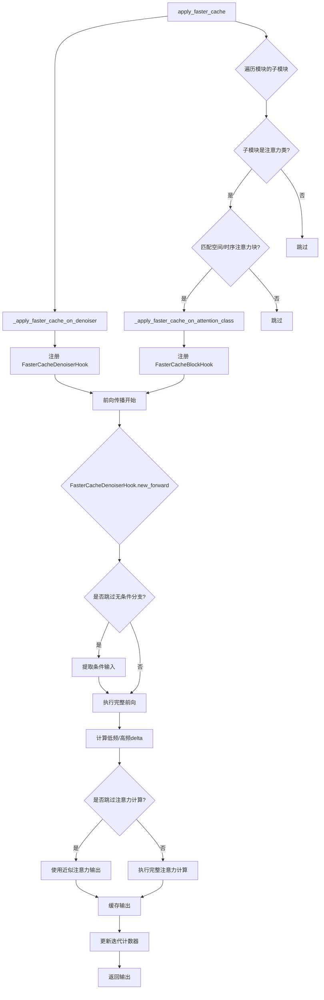

## 类结构

```
FasterCacheConfig (@dataclass)
├── FasterCacheDenoiserState
├── FasterCacheBlockState
├── FasterCacheDenoiserHook (继承 ModelHook)
│   ├── initialize_hook()
│   ├── new_forward()
│   └── reset_state()
└── FasterCacheBlockHook (继承 ModelHook)
        ├── initialize_hook()
        ├── new_forward()
        ├── reset_state()
        └── _compute_approximated_attention_output()
```

## 全局变量及字段


### `_FASTER_CACHE_DENOISER_HOOK`
    
Hook identifier name for the FasterCache denoiser module

类型：`str`
    


### `_FASTER_CACHE_BLOCK_HOOK`
    
Hook identifier name for the FasterCache attention block

类型：`str`
    


### `_SPATIAL_ATTENTION_BLOCK_IDENTIFIERS`
    
Regex pattern tuples to match spatial attention block names in the model

类型：`tuple[str, ...]`
    


### `_TEMPORAL_ATTENTION_BLOCK_IDENTIFIERS`
    
Regex pattern tuples to match temporal attention block names in the model

类型：`tuple[str, ...]`
    


### `_TRANSFORMER_BLOCK_IDENTIFIERS`
    
Combined regex patterns for both spatial and temporal transformer block identifiers

类型：`tuple[str, ...]`
    


### `_UNCOND_COND_INPUT_KWARGS_IDENTIFIERS`
    
Default identifiers to match input kwargs containing batchwise-concatenated unconditional and conditional inputs

类型：`tuple[str, ...]`
    


### `FasterCacheConfig.spatial_attention_block_skip_range`
    
Calculate attention states every N iterations for spatial attention blocks

类型：`int`
    


### `FasterCacheConfig.temporal_attention_block_skip_range`
    
Calculate attention states every N iterations for temporal attention blocks

类型：`int | None`
    


### `FasterCacheConfig.spatial_attention_timestep_skip_range`
    
Timestep range within which spatial attention computation can be skipped

类型：`tuple[int, int]`
    


### `FasterCacheConfig.temporal_attention_timestep_skip_range`
    
Timestep range within which temporal attention computation can be skipped

类型：`tuple[int, int]`
    


### `FasterCacheConfig.low_frequency_weight_update_timestep_range`
    
Timestep range within which low frequency weight scaling update is applied

类型：`tuple[int, int]`
    


### `FasterCacheConfig.high_frequency_weight_update_timestep_range`
    
Timestep range within which high frequency weight scaling update is applied

类型：`tuple[int, int]`
    


### `FasterCacheConfig.alpha_low_frequency`
    
Weight to scale low frequency updates by (alpha1 in the paper)

类型：`float`
    


### `FasterCacheConfig.alpha_high_frequency`
    
Weight to scale high frequency updates by (alpha2 in the paper)

类型：`float`
    


### `FasterCacheConfig.unconditional_batch_skip_range`
    
Process unconditional branch every N iterations (CFG-Cache parameter n)

类型：`int`
    


### `FasterCacheConfig.unconditional_batch_timestep_skip_range`
    
Timestep range within which unconditional branch computation can be skipped

类型：`tuple[int, int]`
    


### `FasterCacheConfig.spatial_attention_block_identifiers`
    
Identifiers to match spatial attention blocks in the model for applying FasterCache

类型：`tuple[str, ...]`
    


### `FasterCacheConfig.temporal_attention_block_identifiers`
    
Identifiers to match temporal attention blocks in the model for applying FasterCache

类型：`tuple[str, ...]`
    


### `FasterCacheConfig.attention_weight_callback`
    
Callback function to determine weight for scaling attention outputs

类型：`Callable[[torch.nn.Module], float]`
    


### `FasterCacheConfig.low_frequency_weight_callback`
    
Callback function to determine weight for low frequency updates

类型：`Callable[[torch.nn.Module], float]`
    


### `FasterCacheConfig.high_frequency_weight_callback`
    
Callback function to determine weight for high frequency updates

类型：`Callable[[torch.nn.Module], float]`
    


### `FasterCacheConfig.tensor_format`
    
Format of input tensors (BCFHW, BFCHW, or BCHW)

类型：`str`
    


### `FasterCacheConfig.is_guidance_distilled`
    
Whether the model is guidance distilled (disables unconditional branch skipping)

类型：`bool`
    


### `FasterCacheConfig.current_timestep_callback`
    
Callback function to get the current denoising timestep

类型：`Callable[[], int]`
    


### `FasterCacheConfig._unconditional_conditional_input_kwargs_identifiers`
    
Identifiers to match input kwargs containing batchwise-concatenated unconditional and conditional inputs

类型：`list[str]`
    


### `FasterCacheDenoiserState.iteration`
    
Current iteration count of the denoiser

类型：`int`
    


### `FasterCacheDenoiserState.low_frequency_delta`
    
Cached low frequency delta for approximating unconditional branch

类型：`torch.Tensor`
    


### `FasterCacheDenoiserState.high_frequency_delta`
    
Cached high frequency delta for approximating unconditional branch

类型：`torch.Tensor`
    


### `FasterCacheBlockState.iteration`
    
Current iteration count of the attention block

类型：`int`
    


### `FasterCacheBlockState.batch_size`
    
Batch size for the attention block (unconditional-conditional concatenated)

类型：`int`
    


### `FasterCacheBlockState.cache`
    
Cached attention outputs from previous iterations for approximation

类型：`tuple[torch.Tensor, torch.Tensor]`
    


### `FasterCacheDenoiserHook.unconditional_batch_skip_range`
    
Skip range for processing unconditional branch every N iterations

类型：`int`
    


### `FasterCacheDenoiserHook.unconditional_batch_timestep_skip_range`
    
Timestep range for skipping unconditional branch computation

类型：`tuple[int, int]`
    


### `FasterCacheDenoiserHook.uncond_cond_input_kwargs_identifiers`
    
Identifiers to match input kwargs that contain unconditional and conditional inputs

类型：`list[str]`
    


### `FasterCacheDenoiserHook.tensor_format`
    
Format of input tensors for splitting low/high frequency components

类型：`str`
    


### `FasterCacheDenoiserHook.is_guidance_distilled`
    
Whether the model is guidance distilled (disables unconditional branch handling)

类型：`bool`
    


### `FasterCacheDenoiserHook.current_timestep_callback`
    
Callback to get the current denoising timestep

类型：`Callable[[], int]`
    


### `FasterCacheDenoiserHook.low_frequency_weight_callback`
    
Callback to get weight for scaling low frequency updates

类型：`Callable[[torch.nn.Module], torch.Tensor]`
    


### `FasterCacheDenoiserHook.high_frequency_weight_callback`
    
Callback to get weight for scaling high frequency updates

类型：`Callable[[torch.nn.Module], torch.Tensor]`
    


### `FasterCacheDenoiserHook.state`
    
State object tracking iteration and frequency deltas for the denoiser

类型：`FasterCacheDenoiserState`
    


### `FasterCacheBlockHook.block_skip_range`
    
Skip range for computing attention every N iterations in the block

类型：`int`
    


### `FasterCacheBlockHook.timestep_skip_range`
    
Timestep range for skipping attention computation in the block

类型：`tuple[int, int]`
    


### `FasterCacheBlockHook.is_guidance_distilled`
    
Whether the model is guidance distilled (affects caching behavior)

类型：`bool`
    


### `FasterCacheBlockHook.weight_callback`
    
Callback to get weight for approximating attention outputs

类型：`Callable[[torch.nn.Module], float]`
    


### `FasterCacheBlockHook.current_timestep_callback`
    
Callback to get the current denoising timestep

类型：`Callable[[], int]`
    


### `FasterCacheBlockHook.state`
    
State object tracking iteration, batch size, and cache for the block

类型：`FasterCacheBlockState`
    
    

## 全局函数及方法


### `apply_faster_cache`

该函数是 FasterCache 的主入口，用于将 FasterCache 优化技术应用到指定的 PyTorch 模块（通常是 CogVideoX 等转换器模型）。它通过注册 hook 到模型的 denoiser 层和注意力层，在推理过程中实现无条件分支跳过和注意力计算缓存，从而加速扩散模型的推理速度。

参数：

- `module`：`torch.nn.Module`，要应用 FasterCache 的 PyTorch 模块，通常是 `CogVideoXTransformer3DModel` 等支持的转换器架构
- `config`：`FasterCacheConfig`，包含 FasterCache 的详细配置参数，如跳过范围、时间步范围、权重回调等

返回值：`None`，该函数直接修改传入的模块，不返回任何值

#### 流程图

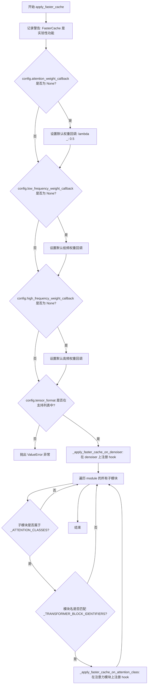

#### 带注释源码

```python
def apply_faster_cache(module: torch.nn.Module, config: FasterCacheConfig) -> None:
    r"""
    Applies [FasterCache](https://huggingface.co/papers/2410.19355) to a given pipeline.

    Args:
        module (`torch.nn.Module`):
            The pytorch module to apply FasterCache to. Typically, this should be a transformer architecture supported
            in Diffusers, such as `CogVideoXTransformer3DModel`, but external implementations may also work.
        config (`FasterCacheConfig`):
            The configuration to use for FasterCache.

    Example:
    ```python
    >>> import torch
    >>> from diffusers import CogVideoXPipeline, FasterCacheConfig, apply_faster_cache

    >>> pipe = CogVideoXPipeline.from_pretrained("THUDM/CogVideoX-5b", torch_dtype=torch.bfloat16)
    >>> pipe.to("cuda")

    >>> config = FasterCacheConfig(
    ...     spatial_attention_block_skip_range=2,
    ...     spatial_attention_timestep_skip_range=(-1, 681),
    ...     low_frequency_weight_update_timestep_range=(99, 641),
    ...     high_frequency_weight_update_timestep_range=(-1, 301),
    ...     spatial_attention_block_identifiers=["transformer_blocks"],
    ...     attention_weight_callback=lambda _: 0.3,
    ...     tensor_format="BFCHW",
    ... )
    >>> apply_faster_cache(pipe.transformer, config)
    ```
    """

    # 记录警告信息，说明 FasterCache 是实验性功能，可能不会按预期工作
    # 不是所有模型都支持 FasterCache，API 可能在未来版本中更改
    logger.warning(
        "FasterCache is a purely experimental feature and may not work as expected. Not all models support FasterCache. "
        "The API is subject to change in future releases, with no guarantee of backward compatibility. Please report any issues at "
        "https://github.com/huggingface/diffusers/issues."
    )

    # 如果用户未提供注意力权重回调函数，默认使用 0.5 作为所有时间步的权重
    # 论文中建议随着推理进度从 0 逐渐增加到 1，但这因模型而异
    # 如果用户想使用不同的权重函数，需要提供自己的权重回调
    if config.attention_weight_callback is None:
        logger.warning(
            "No `attention_weight_callback` provided when enabling FasterCache. Defaulting to using a weight of 0.5 for all timesteps."
        )
        config.attention_weight_callback = lambda _: 0.5

    # 如果用户未提供低频权重回调函数，使用论文中描述的默认行为
    # 在指定时间步范围内返回 alpha_low_frequency，否则返回 1.0
    if config.low_frequency_weight_callback is None:
        logger.debug(
            "Low frequency weight callback not provided when enabling FasterCache. Defaulting to behaviour described in the paper."
        )

        def low_frequency_weight_callback(module: torch.nn.Module) -> float:
            # 检查当前时间步是否在低频权重更新范围内
            is_within_range = (
                config.low_frequency_weight_update_timestep_range[0]
                < config.current_timestep_callback()
                < config.low_frequency_weight_update_timestep_range[1]
            )
            # 在范围内使用 alpha_low_frequency，否则使用 1.0（不更新）
            return config.alpha_low_frequency if is_within_range else 1.0

        config.low_frequency_weight_callback = low_frequency_weight_callback

    # 如果用户未提供高频权重回调函数，使用论文中描述的默认行为
    if config.high_frequency_weight_callback is None:
        logger.debug(
            "High frequency weight callback not provided when enabling FasterCache. Defaulting to behaviour described in the paper."
        )

        def high_frequency_weight_callback(module: torch.nn.Module) -> float:
            # 检查当前时间步是否在高频权重更新范围内
            is_within_range = (
                config.high_frequency_weight_update_timestep_range[0]
                < config.current_timestep_callback()
                < config.high_frequency_weight_update_timestep_range[1]
            )
            return config.alpha_high_frequency if is_within_range else 1.0

        config.high_frequency_weight_callback = high_frequency_weight_callback

    # 验证 tensor_format 是否为支持的格式
    # TODO(aryan): Support BSC for LTX Video
    supported_tensor_formats = ["BCFHW", "BFCHW", "BCHW"]
    if config.tensor_format not in supported_tensor_formats:
        raise ValueError(f"`tensor_format` must be one of {supported_tensor_formats}, but got {config.tensor_format}.")

    # 第一步：在 denoiser 顶层模块上注册 FasterCache hook
    # 这用于处理无条件分支跳过和低频/高频权重更新
    _apply_faster_cache_on_denoiser(module, config)

    # 第二步：遍历模块的所有子模块，为符合条件的注意力层注册 hook
    # 只处理匹配 _TRANSFORMER_BLOCK_IDENTIFIERS 正则表达式的注意力模块
    for name, submodule in module.named_modules():
        # 检查子模块是否属于已知的注意力类
        if not isinstance(submodule, _ATTENTION_CLASSES):
            continue
        # 检查模块名是否匹配空间或时间注意力块标识符
        if any(re.search(identifier, name) is not None for identifier in _TRANSFORMER_BLOCK_IDENTIFIERS):
            # 为每个匹配的注意力模块应用 FasterCache
            _apply_faster_cache_on_attention_class(name, submodule, config)
```


### `_apply_faster_cache_on_denoiser`

该函数用于将 FasterCache 优化技术应用到去噪器（Denoiser）模块，通过注册 `FasterCacheDenoiserHook` 到模型的钩子注册表中，从而实现无条件分支计算的跳过与近似，提升推理速度。

参数：

- `module`：`torch.nn.Module`，目标 PyTorch 模块，通常是支持 FasterCache 的 Transformer 架构（如 CogVideoXTransformer3DModel）。
- `config`：`FasterCacheConfig`，FasterCache 的配置对象，包含跳过范围、时间步范围、权重回调等参数。

返回值：`None`，无返回值，该函数仅执行副作用（注册钩子）。

#### 流程图

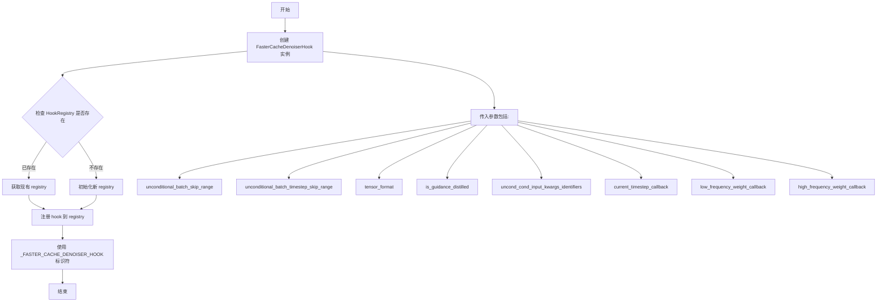

#### 带注释源码

```python
def _apply_faster_cache_on_denoiser(module: torch.nn.Module, config: FasterCacheConfig) -> None:
    r"""
    将 FasterCache 优化应用到去噪器模块。
    
    该函数是 FasterCache 整体应用流程的关键部分，负责在去噪器（denoiser）级别
    注册钩子，以实现无条件分支（unconditional branch）的计算跳过和近似。
    
    Args:
        module (torch.nn.Module): 要应用 FasterCache 的模块。
        config (FasterCacheConfig): FasterCache 配置对象。
    
    Returns:
        None
    """
    
    # 创建 FasterCacheDenoiserHook 实例
    # 该钩子将拦截去噪器的前向传播，根据配置决定是否跳过无条件分支计算
    # 并通过频域分解（FFT）近似无条件分支输出
    hook = FasterCacheDenoiserHook(
        config.unconditional_batch_skip_range,           # 无条件批次跳过范围
        config.unconditional_batch_timestep_skip_range,   # 无条件批次时间步跳过范围
        config.tensor_format,                             # 张量格式 (BCFHW/BFCHW/BCHW)
        config.is_guidance_distilled,                     # 是否为 guidance 蒸馏模型
        config._unconditional_conditional_input_kwargs_identifiers,  # 输入参数标识符
        config.current_timestep_callback,                 # 当前时间步回调函数
        config.low_frequency_weight_callback,             # 低频权重回调函数
        config.high_frequency_weight_callback,            # 高频权重回调函数
    )
    
    # 检查模块是否已有 HookRegistry
    # 如果没有则初始化一个新的注册表，用于管理该模块上的所有钩子
    registry = HookRegistry.check_if_exists_or_initialize(module)
    
    # 将创建的钩子注册到注册表中，使用预定义的标识符
    # 标识符为 "faster_cache_denoiser"，用于后续识别和管理
    registry.register_hook(hook, _FASTER_CACHE_DENOISER_HOOK)
```


### `_apply_faster_cache_on_attention_class`

该函数是FasterCache的核心组件之一，用于判断给定的注意力模块是否符合应用FasterCache的条件（空间注意力或时间注意力），并在符合条件时为该模块注册`FasterCacheBlockHook`以实现注意力计算的缓存与复用，从而加速Diffusion模型的推理过程。

参数：

-  `name`：`str`，模块在模型中的完整路径名称，用于通过正则表达式匹配判断该模块是否为空间或时间注意力模块
-  `module`：`AttentionModuleMixin`，注意力模块的实例，通常是`torch.nn.Module`且实现了特定接口的注意力层
-  `config`：`FasterCacheConfig`，FasterCache的全局配置对象，包含跳过的步数范围、时间步范围、权重回调函数等配置信息

返回值：`None`，该函数仅执行副作用（注册Hook），不返回任何值

#### 流程图

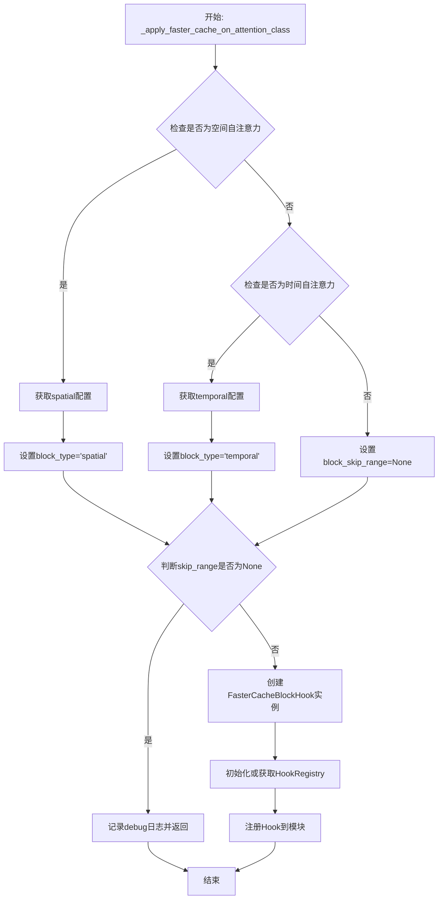

#### 带注释源码

```python
def _apply_faster_cache_on_attention_class(name: str, module: AttentionModuleMixin, config: FasterCacheConfig) -> None:
    r"""
    为单个注意力模块应用FasterCache优化。
    
    该函数会检查传入的注意力模块是否符合FasterCache的应用条件：
    1. 必须是自注意力（而非cross-attention）
    2. 必须是空间注意力或时间注意力
    3. 对应的skip_range配置必须不为None
    
    只有满足所有条件的模块才会被注册FasterCacheBlockHook。
    
    Args:
        name: 模块名称，用于正则匹配识别模块类型
        module: 注意力模块实例
        config: FasterCache全局配置
    """
    
    # 判断是否为空间自注意力（spatial self-attention）
    # 需要满足三个条件：
    # 1. 模块名称匹配spatial_attention_block_identifiers中的任意一个正则表达式
    # 2. config中spatial_attention_block_skip_range不为None（即启用了spatial缓存）
    # 3. 模块不是cross-attention（通过is_cross_attention属性判断，为False表示是自注意力）
    is_spatial_self_attention = (
        any(re.search(identifier, name) is not None for identifier in config.spatial_attention_block_identifiers)
        and config.spatial_attention_block_skip_range is not None
        and not getattr(module, "is_cross_attention", False)
    )
    
    # 判断是否为时间自注意力（temporal self-attention）
    # 需要满足：
    # 1. 模块名称匹配temporal_attention_block_identifiers中的任意一个正则表达式
    # 2. config中temporal_attention_block_skip_range不为None
    # 3. 模块不是cross-attention（直接访问is_cross_attention属性）
    is_temporal_self_attention = (
        any(re.search(identifier, name) is not None for identifier in config.temporal_attention_block_identifiers)
        and config.temporal_attention_block_skip_range is not None
        and not module.is_cross_attention
    )

    # 初始化变量，后续根据匹配的注意力类型填充具体值
    block_skip_range, timestep_skip_range, block_type = None, None, None
    
    # 如果匹配到空间自注意力，则使用spatial相关的配置参数
    if is_spatial_self_attention:
        block_skip_range = config.spatial_attention_block_skip_range      # 空间注意力跳过的迭代次数
        timestep_skip_range = config.spatial_attention_timestep_skip_range # 空间注意力允许跳过的时间步范围
        block_type = "spatial"  # 标记为spatial类型，用于日志输出
    # 否则如果匹配到时间自注意力，则使用temporal相关的配置参数
    elif is_temporal_self_attention:
        block_skip_range = config.temporal_attention_block_skip_range     # 时间注意力跳过的迭代次数
        timestep_skip_range = config.temporal_attention_timestep_skip_range # 时间注意力允许跳过的时间步范围
        block_type = "temporal"  # 标记为temporal类型，用于日志输出

    # 如果block_skip_range或timestep_skip_range为None，说明该模块不符合应用条件
    # 可能是：既不是spatial也不是temporal，或者对应的skip_range被设置为None（禁用了该类型缓存）
    if block_skip_range is None or timestep_skip_range is None:
        logger.debug(
            f'Unable to apply FasterCache to the selected layer: "{name}" because it does '
            f"not match any of the required criteria for spatial or temporal attention layers. Note, "
            f"however, that this layer may still be valid for applying PAB. Please specify the correct "
            f"block identifiers in the configuration or use the specialized `apply_faster_cache_on_module` "
            f"function to apply FasterCache to this layer."
        )
        return  # 直接返回，不注册任何hook

    # 打印debug日志，记录将为哪个模块启用FasterCache
    logger.debug(f"Enabling FasterCache ({block_type}) for layer: {name}")
    
    # 创建FasterCacheBlockHook实例，传入：
    # - block_skip_range: 注意力计算跳过的迭代周期
    # - timestep_skip_range: 允许跳过的时间步范围
    # - is_guidance_distilled: 是否为guidance蒸馏模型
    # - attention_weight_callback: 计算注意力权重缩放的回调函数
    # - current_timestep_callback: 获取当前时间步的回调函数
    hook = FasterCacheBlockHook(
        block_skip_range,
        timestep_skip_range,
        config.is_guidance_distilled,
        config.attention_weight_callback,
        config.current_timestep_callback,
    )
    
    # 检查模块是否已经初始化了HookRegistry，如果没有则初始化
    # HookRegistry用于管理模块上的多个hook
    registry = HookRegistry.check_if_exists_or_initialize(module)
    
    # 将FasterCacheBlockHook注册到模块上，使用_FASTER_CACHE_BLOCK_HOOK作为hook的唯一标识符
    # 注册后，当模块前向传播时，会自动调用hook的new_forward方法
    registry.register_hook(hook, _FASTER_CACHE_BLOCK_HOOK)
```


### `_split_low_high_freq`

该函数通过二维快速傅里叶变换（FFT）将输入张量从空间域转换到频率域，并使用圆形掩码在频域中分离低频和高频成分。这是 FasterCache 算法的核心组件，用于在推理过程中分别处理图像的低频结构和高频细节，从而实现无条件分支的近似计算。

参数：

- `x`：`torch.Tensor`，输入的张量，通常是隐藏状态，形状为 (B, C, H, W) 或类似的四维张量

返回值：`tuple[torch.Tensor, torch.Tensor]`，返回两个 FFT 频域张量——低频成分和高频成分，均为复数类型

#### 流程图

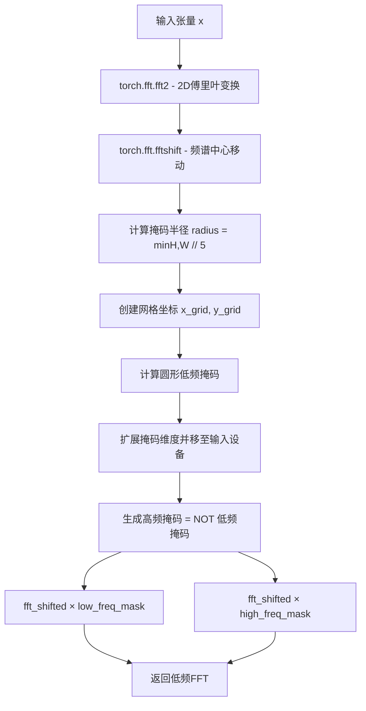

#### 带注释源码

```python
@torch.no_grad()
def _split_low_high_freq(x):
    """
    将输入张量分离为低频和高频成分
    
    该函数通过以下步骤实现频率分离：
    1. 对输入进行2D傅里叶变换，将图像从空间域转换到频率域
    2. 使用fftshift将低频成分（DC分量）移动到频谱中心
    3. 创建一个以中心为圆心的圆形掩码，半径为图像尺寸的1/5
    4. 掩码内部为低频成分，外部为高频成分
    
    Args:
        x: 输入张量，形状通常为 (B, C, H, W)
        
    Returns:
        tuple: (低频FFT分量, 高频FFT分量)
    """
    # 第一步：执行2D快速傅里叶变换
    # 将空间域信号转换为频率域表示
    fft = torch.fft.fft2(x)
    
    # 第二步：将频谱移动到中心
    # fftshift 将零频率分量移到频谱中心，便于创建圆形掩码
    fft_shifted = torch.fft.fftshift(fft)
    
    # 获取输入图像的高度和宽度
    height, width = x.shape[-2:]
    
    # 计算圆形掩码的半径
    # 使用宽高中较小值的1/5作为半径，这是经验值
    radius = min(height, width) // 5
    
    # 创建2D网格坐标，用于生成圆形掩码
    y_grid, x_grid = torch.meshgrid(torch.arange(height), torch.arange(width))
    
    # 计算网格中心点
    center_x, center_y = width // 2, height // 2
    
    # 创建圆形低频掩码：中心圆内为True（低频），外部为False（高频）
    # 使用欧几里得距离公式：(x-xc)² + (y-yc)² <= r²
    mask = (x_grid - center_x) ** 2 + (y_grid - center_y) ** 2 <= radius**2
    
    # 扩展掩码维度以匹配输入张量，并确保在正确的设备上（CPU/GPU）
    low_freq_mask = mask.unsqueeze(0).unsqueeze(0).to(x.device)
    
    # 高频掩码是低频掩码的逻辑非
    high_freq_mask = ~low_freq_mask
    
    # 将频谱与掩码相乘，分离低频和高频成分
    low_freq_fft = fft_shifted * low_freq_mask
    high_freq_fft = fft_shifted * high_freq_mask
    
    # 返回分离后的频率成分（仍处于频域，未进行逆变换）
    return low_freq_fft, high_freq_fft
```


### `FasterCacheConfig.__repr__`

该方法返回 `FasterCacheConfig` 对象的字符串表示形式，用于直观展示配置的所有关键参数值，方便调试和日志输出。

参数：

- `self`：`FasterCacheConfig` 实例，隐式参数，代表当前配置对象本身，无需显式传递。

返回值：`str`，返回格式化后的字符串，包含对象类名及所有配置属性的名称和当前值。

#### 流程图

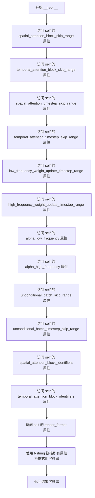

#### 带注释源码

```python
def __repr__(self) -> str:
    """
    返回 FasterCacheConfig 对象的字符串表示。
    
    Returns:
        str: 包含对象类名及所有配置属性的格式化字符串。
    """
    return (
        f"FasterCacheConfig(\n"  # 开始构建字符串，添加类名和左括号
        f"  spatial_attention_block_skip_range={self.spatial_attention_block_skip_range},\n"  # 空间注意力块跳过范围
        f"  temporal_attention_block_skip_range={self.temporal_attention_block_skip_range},\n"  # 时间注意力块跳过范围
        f"  spatial_attention_timestep_skip_range={self.spatial_attention_timestep_skip_range},\n"  # 空间注意力时间步跳过范围
        f"  temporal_attention_timestep_skip_range={self.temporal_attention_timestep_skip_range},\n"  # 时间注意力时间步跳过范围
        f"  low_frequency_weight_update_timestep_range={self.low_frequency_weight_update_timestep_range},\n"  # 低频权重更新时间步范围
        f"  high_frequency_weight_update_timestep_range={self.high_frequency_weight_update_timestep_range},\n"  # 高频权重更新时间步范围
        f"  alpha_low_frequency={self.alpha_low_frequency},\n"  # 低频权重缩放因子
        f"  alpha_high_frequency={self.alpha_high_frequency},\n"  # 高频权重缩放因子
        f"  unconditional_batch_skip_range={self.unconditional_batch_skip_range},\n"  # 无条件批次跳过范围
        f"  unconditional_batch_timestep_skip_range={self.unconditional_batch_timestep_skip_range},\n"  # 无条件批次时间步跳过范围
        f"  spatial_attention_block_identifiers={self.spatial_attention_block_identifiers},\n"  # 空间注意力块标识符
        f"  temporal_attention_block_identifiers={self.temporal_attention_block_identifiers},\n"  # 时间注意力块标识符
        f"  tensor_format={self.tensor_format},\n"  # 张量格式
        f")"  # 添加右括号，完成字符串构建
    )
```


### `FasterCacheDenoiserState.reset`

重置 FasterCache 的顶级去噪器模块状态，将迭代计数重置为 0，并清除低频和高频 delta 缓存。

参数：
- 无

返回值：`None`，无返回值（该方法直接修改对象状态）

#### 流程图

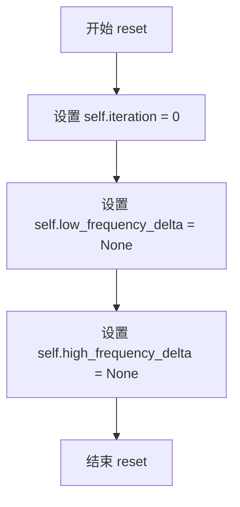

#### 带注释源码

```python
def reset(self):
    """
    重置 FasterCacheDenoiserState 的内部状态。
    
    该方法在每个去噪循环开始时被调用，以确保状态被正确初始化。
    它清除迭代计数器和频率相关的缓存，以便进行新一轮的推理。
    """
    # 重置迭代计数器
    self.iteration = 0
    
    # 清除低频 delta 缓存
    self.low_frequency_delta = None
    
    # 清除高频 delta 缓存
    self.high_frequency_delta = None
```


### FasterCacheBlockState.reset

该方法用于重置 FasterCacheBlockState 的内部状态，将迭代计数器、批次大小和缓存数据全部清空，以便在新的推理周期开始时能够重新初始化。

参数：
- 无

返回值：`None`，无返回值，用于重置对象状态

#### 流程图

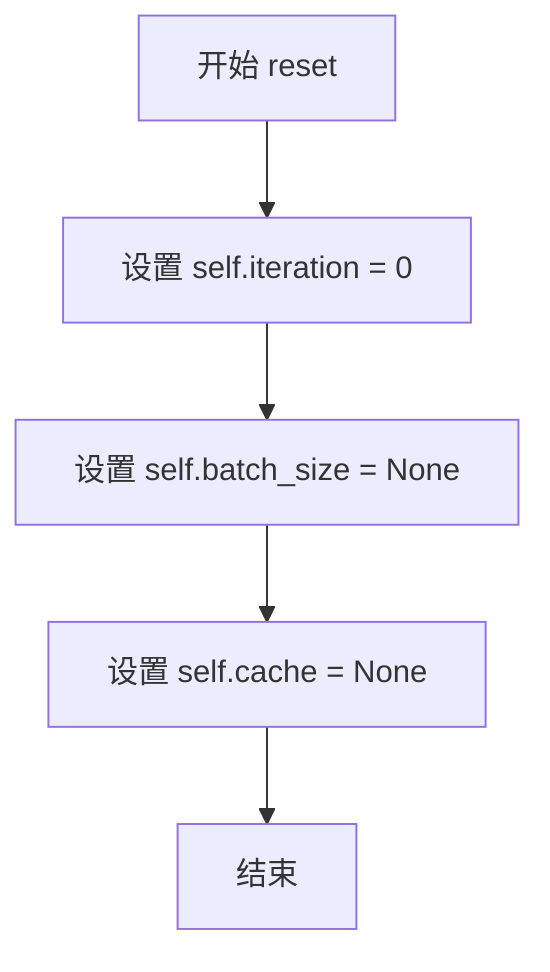

#### 带注释源码

```python
def reset(self):
    """
    重置 FasterCacheBlockState 的内部状态。
    
    该方法在每个新的去噪周期开始时被调用，用于清除之前积累的状态信息，
    包括迭代计数器、批次大小和注意力缓存。这确保了在重新开始推理时
    能够获得正确的结果，不会受到上一次推理的残留数据影响。
    """
    # 重置迭代计数器为0，表示新的推理周期开始
    self.iteration = 0
    
    # 重置批次大小为None，表示尚未确定当前推理的批次大小
    # 批次大小会在第一次前向传播时从输入张量中推断
    self.batch_size = None
    
    # 清空缓存数据，缓存中存储了之前的注意力输出用于近似计算
    # 设置为None表示当前没有可用的缓存数据
    self.cache = None
```


### `FasterCacheDenoiserHook.initialize_hook`

该方法是FasterCacheDenoiserHook类的初始化钩子，用于在将钩子挂载到模块上时创建并初始化FasterCacheDenoiserState状态对象，从而为后续的缓存推理提供状态跟踪基础。

参数：

- `module`：`torch.nn.Module`，需要挂载钩子的目标模块

返回值：`torch.nn.Module`，返回原始传入的module，以便链式调用

#### 流程图

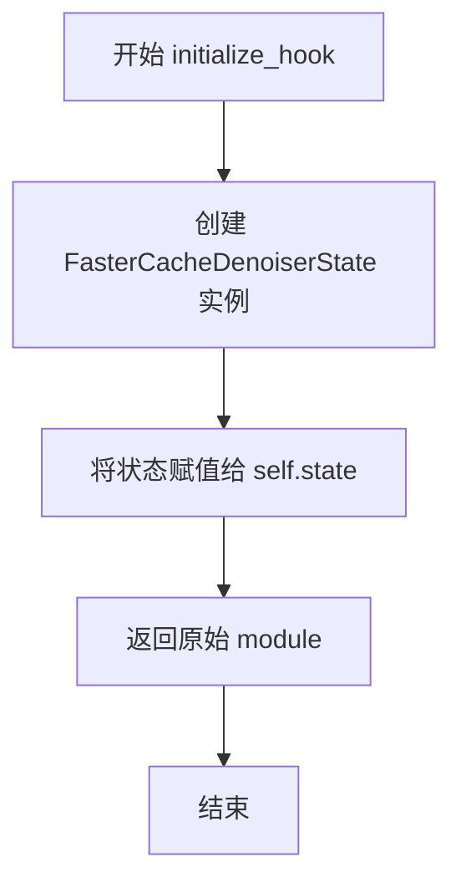

#### 带注释源码

```python
def initialize_hook(self, module):
    # 创建一个新的 FasterCacheDenoiserState 实例
    # 该状态对象用于跟踪:
    # - iteration: 当前迭代次数
    # - low_frequency_delta: 低频分量差异,用于近似无条件分支
    # - high_frequency_delta: 高频分量差异,用于近似无条件分支
    self.state = FasterCacheDenoiserState()
    
    # 返回原始模块,这是钩子注册接口的标准约定
    # 允许调用者继续对返回的模块进行链式操作
    return module
```

---

### 上下文信息

#### 所属类：`FasterCacheDenoiserHook`

该类继承自`ModelHook`，是FasterCache方案中用于处理顶层去噪器模块的钩子类。它负责：

1. 管理去噪器级别的状态（迭代次数、频率分量差异）
2. 条件性地跳过无条件分支（unconditional branch）的计算
3. 使用FFT频域分解技术近似无条件分支输出

#### 类字段

- `unconditional_batch_skip_range`：`int`，无条件分支跳过的迭代间隔
- `unconditional_batch_timestep_skip_range`：`tuple[int, int]]`，允许跳过无条件分支的时间步范围
- `tensor_format`：`str`，输入张量的格式（BCFHW/BFCHW/BCHW）
- `is_guidance_distilled`：`bool`，是否使用指导蒸馏模型
- `uncond_cond_input_kwargs_identifiers`：`list[str]`，需要分割的输入参数标识符
- `current_timestep_callback`：`Callable[[], int]]`，获取当前时间步的回调函数
- `low_frequency_weight_callback`：`Callable[[torch.nn.Module], torch.Tensor]]`，低频权重回调
- `high_frequency_weight_callback`：`Callable[[torch.nn.Module], torch.Tensor]]`，高频权重回调

#### 相关类：`FasterCacheDenoiserState`

```python
class FasterCacheDenoiserState:
    def __init__(self) -> None:
        self.iteration: int = 0           # 当前迭代计数器
        self.low_frequency_delta: torch.Tensor = None   # 低频分量差异缓存
        self.high_frequency_delta: torch.Tensor = None  # 高频分量差异缓存
```

---

### 关键设计说明

**1. 状态初始化模式**

该方法遵循钩子框架的标准模式：
- 在`initialize_hook`中创建状态
- 在`reset_state`中重置状态
- 状态生命周期与模块绑定

**2. 与Paper的对应关系**

根据FasterCache论文，该初始化为后续的Equation 9-11计算奠定基础：
- `iteration`用于判断是否满足跳过条件
- `low_frequency_delta`和`high_frequency_delta`用于存储频域差异，实现无条件分支的近似

**3. 潜在优化空间**

- 当前每次调用都创建新对象，可考虑对象池化
- 状态初始化硬编码，无法自定义初始值


### `FasterCacheDenoiserHook._get_cond_input`

从批量级联的张量中提取条件分支输入。该方法假设输入张量沿维度0批量级联了无条件和条件输入（无条件在前，条件在后），通过`chunk`操作分离并返回条件部分。

参数：

- `input`：`torch.Tensor`，批量级联的无条件和条件输入张量，通常维度0的大小为2*batch_size

返回值：`torch.Tensor`，仅包含条件分支的输入张量（实际上应为`torch.Tensor`，代码中的类型标注`tuple[torch.Tensor, torch.Tensor]`可能有误）

#### 流程图

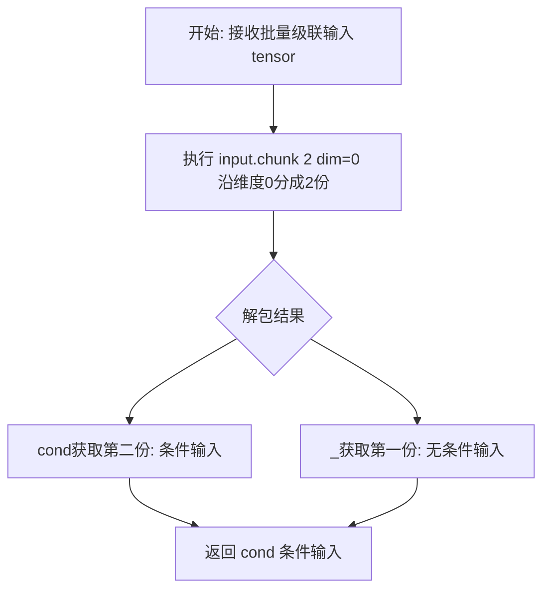

#### 带注释源码

```python
@staticmethod
def _get_cond_input(input: torch.Tensor) -> tuple[torch.Tensor, torch.Tensor]:
    # 注意：此方法假设输入张量是沿维度0批量级联的，
    # 其中无条件输入在前，条件输入在后。
    # 例如：如果 batch_size=2，则 tensor 形状为 [4, ...]，
    # 前2个样本是无条件输入，后2个样本是条件输入。
    _, cond = input.chunk(2, dim=0)  # 使用 chunk 将张量沿 dim=0 分成两半，取第二半（条件部分）
    return cond  # 返回条件分支的输入张量
```


### FasterCacheDenoiserHook.new_forward

该方法是 FasterCache 核心前向传播钩子，用于在扩散模型的去噪过程中通过跳过无条件分支计算并使用低频/高频近似技术来加速推理。当满足条件（迭代次数、时间步范围、批次跳过范围）时，该方法仅计算条件分支，然后利用快速傅里叶变换（FFT）分离低频和高频分量来近似无条件分支输出，从而在保持生成质量的同时显著减少计算量。

参数：

- `module`：`torch.nn.Module`，执行前向传播的目标模块
- `*args`：可变位置参数，包含模块前向传播所需的positional参数
- `**kwargs`：可变关键字参数，包含模块前向传播所需的keyword参数

返回值：`Any`，返回原始模块的输出经过条件/无条件分支处理后的结果

#### 流程图

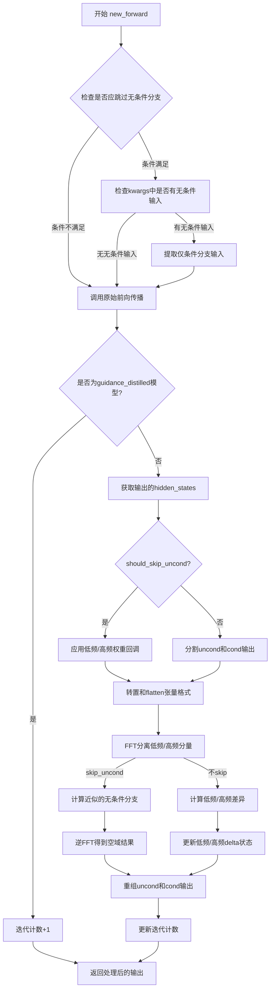

#### 带注释源码

```python
def new_forward(self, module: torch.nn.Module, *args, **kwargs) -> Any:
    """
    FasterCache去噪器钩子的核心前向方法
    
    该方法实现了FasterCache论文中的条件/无条件分支近似技术：
    1. 判断当前迭代是否满足跳过无条件分支的条件
    2. 如果满足，仅提取条件分支输入进行计算
    3. 利用FFT分离低频/高频分量，通过历史delta近似无条件分支
    4. 重新组合近似的无条件分支和计算的条件分支输出
    """
    
    # 第一部分：判断是否跳过无条件分支
    # 检查当前时间步是否在用户配置的跳过范围内
    is_within_timestep_range = (
        self.unconditional_batch_timestep_skip_range[0]
        < self.current_timestep_callback()  # 获取当前去噪时间步
        < self.unconditional_batch_timestep_skip_range[1]
    )
    
    # 决定是否跳过无条件分支计算，需满足以下所有条件：
    # 1. 已完成至少一次迭代（iteration > 0）
    # 2. 当前时间步在允许范围内
    # 3. 当前迭代不是无条件批次跳过周期的整数倍
    # 4. 模型不是guidance distilled类型
    should_skip_uncond = (
        self.state.iteration > 0
        and is_within_timestep_range
        and self.state.iteration % self.unconditional_batch_skip_range != 0
        and not self.is_guidance_distilled
    )

    # 第二部分：如果要跳过，处理输入（仅保留条件分支）
    if should_skip_uncond:
        # 检查是否有需要拆分的输入参数
        is_any_kwarg_uncond = any(k in self.uncond_cond_input_kwargs_identifiers for k in kwargs.keys())
        if is_any_kwarg_uncond:
            logger.debug("FasterCache - Skipping unconditional branch computation")
            # 假设输入是按批次级联的无条件+条件顺序，需要提取条件部分
            # 格式：[uncond_batch, cond_batch] -> 取后半部分
            args = tuple([self._get_cond_input(arg) if torch.is_tensor(arg) else arg for arg in args])
            kwargs = {
                k: v if k not in self.uncond_cond_input_kwargs_identifiers else self._get_cond_input(v)
                for k, v in kwargs.items()
            }

    # 第三部分：执行前向传播
    output = self.fn_ref.original_forward(*args, **kwargs)

    # 第四部分：处理guidance distilled特殊情况
    if self.is_guidance_distilled:
        self.state.iteration += 1
        return output

    # 第五部分：提取hidden states进行处理
    if torch.is_tensor(output):
        hidden_states = output
    elif isinstance(output, (tuple, Transformer2DModelOutput)):
        hidden_states = output[0]

    batch_size = hidden_states.size(0)

    # 第六部分：根据是否跳过无条件分支进行不同处理
    if should_skip_uncond:
        # 情况A：已跳过无条件分支，需要从历史状态近似它
        # 应用低频和高频权重回调（用于调整近似强度）
        self.state.low_frequency_delta = self.state.low_frequency_delta * self.low_frequency_weight_callback(
            module
        )
        self.state.high_frequency_delta = self.state.high_frequency_delta * self.high_frequency_weight_callback(
            module
        )

        # 调整张量维度顺序以适应FFT处理
        # BCFHW: Batch, Channel, Frame, Height, Width
        # BFCHW: Batch, Frame, Channel, Height, Width
        if self.tensor_format == "BCFHW":
            hidden_states = hidden_states.permute(0, 2, 1, 3, 4)
        if self.tensor_format == "BCFHW" or self.tensor_format == "BFCHW":
            hidden_states = hidden_states.flatten(0, 1)

        # 使用FFT分离低频和高频分量
        # 低频分量包含图像的主要结构信息
        # 高频分量包含纹理和细节信息
        low_freq_cond, high_freq_cond = _split_low_high_freq(hidden_states.float())

        # 根据论文Equation 9和10近似无条件分支输出
        # uncond = delta + cond
        low_freq_uncond = self.state.low_frequency_delta + low_freq_cond
        high_freq_uncond = self.state.high_frequency_delta + high_freq_cond
        uncond_freq = low_freq_uncond + high_freq_uncond

        # 逆FFT变换回空域
        uncond_states = torch.fft.ifftshift(uncond_freq)
        uncond_states = torch.fft.ifft2(uncond_states).real

        # 恢复原始张量形状
        if self.tensor_format == "BCFHW" or self.tensor_format == "BFCHW":
            uncond_states = uncond_states.unflatten(0, (batch_size, -1))
            hidden_states = hidden_states.unflatten(0, (batch_size, -1))
        if self.tensor_format == "BCFHW":
            uncond_states = uncond_states.permute(0, 2, 1, 3, 4)
            hidden_states = hidden_states.permute(0, 2, 1, 3, 4)

        # 合并近似的无条件分支和计算的条件分支
        # 输出格式：[uncond_output, cond_output]
        uncond_states = uncond_states.to(hidden_states.dtype)
        hidden_states = torch.cat([uncond_states, hidden_states], dim=0)
    else:
        # 情况B：计算了无条件分支，需要更新delta状态
        # 分割无条件输出和条件输出
        uncond_states, cond_states = hidden_states.chunk(2, dim=0)
        
        # 调整维度
        if self.tensor_format == "BCFHW":
            uncond_states = uncond_states.permute(0, 2, 1, 3, 4)
            cond_states = cond_states.permute(0, 2, 1, 3, 4)
        if self.tensor_format == "BCFHW" or self.tensor_format == "BFCHW":
            uncond_states = uncond_states.flatten(0, 1)
            cond_states = cond_states.flatten(0, 1)

        # 分别提取低频和高频分量
        low_freq_uncond, high_freq_uncond = _split_low_high_freq(uncond_states.float())
        low_freq_cond, high_freq_cond = _split_low_high_freq(cond_states.float())
        
        # 计算并存储差异（用于后续迭代的近似计算）
        # 论文中的delta代表无条件分支和条件分支之间的差异
        self.state.low_frequency_delta = low_freq_uncond - low_freq_cond
        self.state.high_frequency_delta = high_freq_uncond - high_freq_cond

    # 更新迭代计数
    self.state.iteration += 1
    
    # 第七部分：重构输出格式
    if torch.is_tensor(output):
        output = hidden_states
    elif isinstance(output, tuple):
        output = (hidden_states, *output[1:])
    else:
        # 处理Transformer2DModelOutput等特殊输出类型
        output.sample = hidden_states

    return output
```


### `FasterCacheDenoiserHook.reset_state`

该方法用于重置 FasterCache 去噪器钩子的内部状态，清除迭代计数器和缓存的低频/高频频率增量，以便钩子可以重新用于新的推理会话或管道重置。

参数：

- `module`：`torch.nn.Module`，需要重置状态的 PyTorch 模块

返回值：`torch.nn.Module`，返回传入的相同模块，表示重置操作已完成

#### 流程图

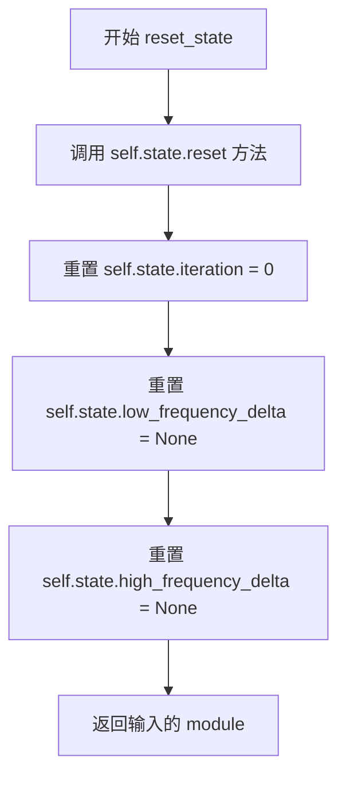

#### 带注释源码

```python
def reset_state(self, module: torch.nn.Module) -> torch.nn.Module:
    """
    重置 FasterCacheDenoiserHook 的内部状态。

    此方法在推理过程开始前或需要重置缓存状态时调用。
    它会清除:
    - iteration: 迭代计数器，用于决定何时跳过无条件的计算分支
    - low_frequency_delta: 低频频率增量，用于近似无条件分支的低频分量
    - high_frequency_delta: 高频频率增量，用于近似无条件分支的高频分量

    Args:
        module: 需要重置状态的 PyTorch 模块

    Returns:
        返回传入的 module，用于链式调用
    """
    # 调用 FasterCacheDenoiserState 对象的 reset 方法
    # 该方法会将 iteration 重置为 0，low_frequency_delta 和 high_frequency_delta 重置为 None
    self.state.reset()
    # 返回模块以支持链式调用
    return module
```


### `FasterCacheBlockHook.initialize_hook`

该方法是 FasterCacheBlockHook 类的初始化钩子，用于在模块上创建并初始化 FasterCacheBlockState 状态对象，为后续的缓存挂载提供状态管理基础。

参数：

- `module`：`torch.nn.Module`，被挂载 hook 的模块实例

返回值：`torch.nn.Module`，返回传入的模块本身，以支持链式调用

#### 流程图

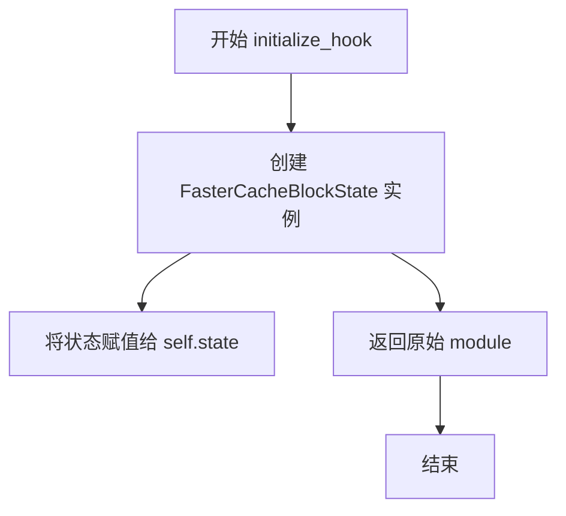

#### 带注释源码

```
def initialize_hook(self, module):
    """
    初始化 hook 的状态。

    该方法在 hook 首次被挂载到模块上时调用，用于创建并初始化
    FasterCacheBlockState 实例。该状态对象用于跟踪：
    - 当前迭代次数 (iteration)
    - 批处理大小 (batch_size)
    - 缓存的注意力输出 (cache)

    Args:
        module: 被挂载 hook 的 PyTorch 模块

    Returns:
        返回原始的 module 以支持钩子注册链式调用
    """
    # 创建并初始化 FasterCacheBlockState 状态对象
    # 状态对象用于在推理过程中维护缓存信息
    self.state = FasterCacheBlockState()
    
    # 返回原始模块，保持接口一致性
    return module
```


### FasterCacheBlockHook._compute_approximated_attention_output

该方法实现了 FasterCache 算法中注意力输出的近似计算逻辑。它基于两个时间步的注意力输出（t_2_output 和 t_output）和权重系数，通过线性外推的方式近似当前时间步的注意力输出，从而减少计算量。

参数：

- `self`：FasterCacheBlockHook 实例本身
- `t_2_output`：`torch.Tensor`，表示倒数第二个时间步的注意力输出（缓存数据）
- `t_output`：`torch.Tensor`，表示上一个时间步的注意力输出（缓存数据）
- `weight`：`float`，用于控制近似程度的权重系数，由 weight_callback 回调函数计算得出
- `batch_size`：`int`，条件分支的批次大小（不含无分类器引导的 unconditional 部分）

返回值：`torch.Tensor`，返回近似计算后的当前时间步注意力输出

#### 流程图

```mermaid
flowchart TD
    A[开始 _compute_approximated_attention_output] --> B{检查 t_2_output.size(0) == batch_size?}
    B -- 否 --> C[断言 t_2_output.size(0) == 2 * batch_size]
    C --> D[提取条件分支: t_2_output = t_2_output[batch_size:]
    B -- 是 --> E{检查 t_output.size(0) == batch_size?}
    E -- 否 --> F[断言 t_output.size(0) == 2 * batch_size]
    F --> G[提取条件分支: t_output = t_output[batch_size:]
    E -- 是 --> H[计算近似输出]
    D --> H
    H --> I[计算差值: t_output - t_2_output]
    I --> J[加权外推: t_output + (t_output - t_2_output) * weight]
    J --> K[返回近似注意力输出]
```

#### 带注释源码

```python
def _compute_approximated_attention_output(
    self, t_2_output: torch.Tensor, t_output: torch.Tensor, weight: float, batch_size: int
) -> torch.Tensor:
    # 检查 t_2_output（倒数第二个时间步的缓存输出）是否已经是纯条件分支输出
    # 如果缓存包含 batchwise-concatenated 的 unconditional-conditional 分支输出，
    # 则需要提取条件分支部分
    if t_2_output.size(0) != batch_size:
        # 断言确认缓存确实包含两倍的 batch_size（unconditional + conditional）
        assert t_2_output.size(0) == 2 * batch_size
        # 取条件分支输出（跳过 unconditional 部分）
        t_2_output = t_2_output[batch_size:]
    
    # 同样检查 t_output（上一个时间步的缓存输出）
    # 如果缓存包含 batchwise-concatenated 的 unconditional-conditional 分支输出，
    # 则需要提取条件分支部分
    if t_output.size(0) != batch_size:
        # 断言确认缓存确实包含两倍的 batch_size（unconditional + conditional）
        assert t_output.size(0) == 2 * batch_size
        # 取条件分支输出（跳过 unconditional 部分）
        t_output = t_output[batch_size:]
    
    # 核心近似逻辑：基于两个时间步的输出进行线性外推
    # 参考 FasterCache 论文中的 Equation 8 或类似的外推公式
    # 近似输出 = 当前输出 + (当前输出 - 上一次输出) * weight
    # 这相当于利用相邻时间步的变化趋势来预测当前时间步的输出
    return t_output + (t_output - t_2_output) * weight
```


### `FasterCacheBlockHook.new_forward`

该方法是 FasterCache 框架中注意力块的核心 hook 方法，负责根据配置的跳过策略决定是执行完整的注意力计算还是使用缓存的输出来近似计算，从而加速扩散模型的推理过程。

参数：

- `module`：`torch.nn.Module`，应用此 hook 的注意力模块
- `*args`：可变位置参数，包含传递给注意力模块的原始参数
- `**kwargs`：可变关键字参数，包含传递给注意力模块的原始关键字参数

返回值：`Any`，返回原始注意力模块的输出（经缓存处理后的结果），类型取决于被 hook 的模块返回值

#### 流程图

```mermaid
flowchart TD
    A[开始 new_forward] --> B[获取 batch_size]
    B --> C{self.state.batch_size 是 None?}
    C -->|是| D[设置 self.state.batch_size = batch_size]
    C -->|否| E{当前 timestep 在跳过范围内?}
    D --> E
    E -->|否| F[should_skip_attention = False]
    E -->|是| G{iteration > 0 且 iteration % block_skip_range == 0?}
    G -->|是| H[should_skip_attention = False]
    G -->|否| I[should_skip_attention = True]
    F --> J{should_skip_attention?}
    H --> J
    I --> K{is_guidance_distilled 或 batch_size 不匹配?}
    K -->|是| J
    K -->|否| L[should_skip_attention = True]
    L --> J
    J -->|是| M[从缓存获取 t_2_output, t_output]
    J -->|否| N[调用原始 forward]
    M --> O[计算 weight]
    O --> P{缓存是单个 tensor?}
    P -->|是| Q[调用 _compute_approximated_attention_output]
    P -->|否| R[遍历缓存计算近似输出]
    Q --> S[构建输出 tuple]
    R --> S
    N --> T[提取 cache_output]
    S --> T
    T --> U{缓存为空?}
    U -->|是| V[初始化缓存为 [cache_output, cache_output]]
    U -->|否| W[更新缓存为 [上一缓存, cache_output]]
    V --> X[iteration += 1]
    W --> X
    X --> Y[返回 output]
```

#### 带注释源码

```python
def new_forward(self, module: torch.nn.Module, *args, **kwargs) -> Any:
    """
    执行 FasterCache 的注意力块前向传播。
    
    决策逻辑：
    1. 首先获取当前输入的 batch_size
    2. 检查是否满足跳过条件（时间步范围、迭代次数等）
    3. 如果满足跳过条件，使用缓存的输出来近似计算注意力
    4. 否则执行完整的注意力计算
    5. 更新缓存状态并返回结果
    """
    # 从 args 和 kwargs 中提取第一个 tensor 的 batch_size
    batch_size = [
        *[arg.size(0) for arg in args if torch.is_tensor(arg)],
        *[v.size(0) for v in kwargs.values() if torch.is_tensor(v)],
    ][0]
    
    # 首次前向传播时记录真实的 batch_size（包含 unconditional + conditional）
    if self.state.batch_size is None:
        # Will be updated on first forward pass through the denoiser
        self.state.batch_size = batch_size

    # 确定是否在允许跳过的时间步范围内
    is_within_timestep_range = (
        self.timestep_skip_range[0] < self.current_timestep_callback() < self.timestep_skip_range[1]
    )
    
    # 如果不在时间步范围内，则不跳过注意力计算
    if not is_within_timestep_range:
        should_skip_attention = False
    else:
        # 判断当前迭代是否应该计算注意力（每 block_skip_range 次迭代计算一次）
        should_compute_attention = self.state.iteration > 0 and self.state.iteration % self.block_skip_range == 0
        should_skip_attention = not should_compute_attention
    
    # 额外检查：如果模型是 guidance distilled 或 batch_size 不匹配，则不执行跳过
    if should_skip_attention:
        should_skip_attention = self.is_guidance_distilled or self.state.batch_size != batch_size

    if should_skip_attention:
        logger.debug("FasterCache - Skipping attention and using approximation")
        
        # 使用缓存的输出来近似当前注意力输出
        if torch.is_tensor(self.state.cache[-1]):
            # 缓存是单个 tensor 的情况
            t_2_output, t_output = self.state.cache
            weight = self.weight_callback(module)
            output = self._compute_approximated_attention_output(t_2_output, t_output, weight, batch_size)
        else:
            # 缓存包含多个 tensor（来自不同迭代的输出）
            # 例如注意力块可能返回多个输出 [A, B, C, ...]
            # 缓存格式为 [[A_1, B_1, C_1, ...], [A_2, B_2, C_2, ...], ...]
            output = ()
            for t_2_output, t_output in zip(*self.state.cache):
                result = self._compute_approximated_attention_output(
                    t_2_output, t_output, self.weight_callback(module), batch_size
                )
                output += (result,)
    else:
        logger.debug("FasterCache - Computing attention")
        # 执行完整的注意力计算
        output = self.fn_ref.original_forward(*args, **kwargs)

    # 从输出中提取 conditional branch 的结果用于缓存
    # Diffusers 块返回单个 hidden_states 或 (hidden_states, encoder_hidden_states) 元组
    if torch.is_tensor(output):
        cache_output = output
        # 只有当输出是 unconditional-conditional 拼接结果时才提取 conditional 部分
        if not self.is_guidance_distilled and cache_output.size(0) == self.state.batch_size:
            # 只缓存 conditional branch 的输出
            cache_output = cache_output.chunk(2, dim=0)[1]
    else:
        # 处理元组输出的情况
        cache_output = ()
        for out in output:
            if not self.is_guidance_distilled and out.size(0) == self.state.batch_size:
                out = out.chunk(2, dim=0)[1]
            cache_output += (out,)

    # 更新缓存：保持最近两次迭代的输出（用于近似计算）
    if self.state.cache is None:
        self.state.cache = [cache_output, cache_output]
    else:
        self.state.cache = [self.state.cache[-1], cache_output]

    # 更新迭代计数器
    self.state.iteration += 1
    return output
```


### FasterCacheBlockHook.reset_state

重置 FasterCache 块钩子的内部状态，将迭代计数器、批大小和缓存数据全部清空，为下一次推理运行做好准备。

参数：

- `module`：`torch.nn.Module`，需要重置状态的 PyTorch 模块

返回值：`torch.nn.Module`，返回传入的模块实例，以便支持链式调用或进一步处理

#### 流程图

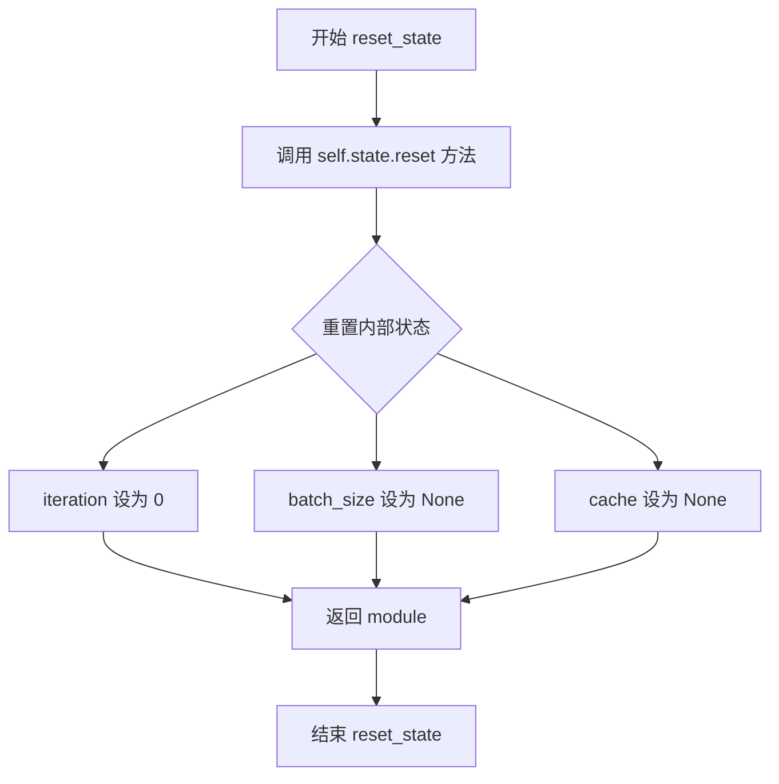

#### 带注释源码

```
def reset_state(self, module: torch.nn.Module) -> torch.nn.Module:
    """
    重置 FasterCacheBlockHook 的内部状态。
    
    此方法在每次新的推理运行开始时被调用，用于清除之前迭代中积累的状态信息。
    内部状态存储在 self.state (FasterCacheBlockState) 中，包含：
    - iteration: 当前迭代计数
    - batch_size: 批处理大小
    - cache: 注意力输出的缓存（用于计算近似值）
    
    参数:
        module: 钩子所绑定的 PyTorch 模块
        
    返回:
        返回传入的 module 参数，支持链式调用
    """
    self.state.reset()  # 调用 FasterCacheBlockState 的 reset 方法重置所有状态
    return module        # 返回模块实例以支持链式调用
```

## 关键组件


### FasterCacheConfig

FasterCache 的配置类，包含空间/时间注意力跳过范围、频率权重更新范围、张量格式等参数，用于控制缓存策略和近似计算。

### FasterCacheDenoiserState

FasterCache 顶级降噪器的状态管理类，记录迭代次数、低频和高频增量，用于在降噪过程中维护和更新缓存状态。

### FasterCacheBlockState

FasterCache 应用于单个块时的状态管理类，记录迭代次数、批次大小和注意力输出缓存，用于块的注意力计算跳过和近似输出计算。

### FasterCacheDenoiserHook

降噪器级别的 Hook 类，继承自 ModelHook，实现条件/无条件分支的输入分离、低频和高频频率分量计算、无条件分支近似等功能，是 FasterCache 在降噪器层面的核心处理单元。

### FasterCacheBlockHook

注意力块级别的 Hook 类，继承自 ModelHook，实现注意力计算的条件跳过、基于缓存的注意力输出近似计算等功能，通过维护前两次迭代的注意力输出缓存来加速推理。

### apply_faster_cache

应用 FasterCache 到给定模块的主入口函数，负责验证配置参数、初始化权重回调函数、遍历模块找到注意力块并注册相应的 Hook，将 FasterCache 技术集成到扩散模型管道中。

### _apply_faster_cache_on_denoiser

内部函数，用于在降噪器模块上注册 FasterCacheDenoiserHook，建立降噪器级别的缓存和近似机制。

### _apply_faster_cache_on_attention_class

内部函数，用于在识别出的注意力块上注册 FasterCacheBlockHook，根据空间或时间注意力类型配置相应的跳过范围和时间步范围。

### _split_low_high_freq

使用傅里叶变换将张量分割为低频和高频分量的辅助函数，通过频域掩码实现低频和高频信息的分离，用于无条件分支的近似计算。


## 问题及建议


### 已知问题

-   **缺失的回调函数检查**: `FasterCacheConfig` 中的 `current_timestep_callback` 被定义为可选参数，但在 `apply_faster_cache` 函数中没有检查其是否为 `None`。如果用户未提供该回调，后续使用时会抛出 `TypeError`，导致运行时错误。
-   **未使用的变量**: `FasterCacheBlockHook` 初始化时接收了 `block_type` 参数，但在 `_apply_faster_cache_on_attention_class` 函数中定义后未实际使用，造成代码冗余。
-   **正则表达式重复编译**: 在 `_apply_faster_cache_on_attention_class` 和 `apply_faster_cache` 中，正则表达式模式在每次模块迭代时都被 `re.search` 重新编译，缺乏缓存机制，影响性能。
-   **硬编码的 FFT 参数**: `_split_low_high_freq` 函数中，半径计算使用硬编码值 `radius = min(height, width) // 5`，缺乏灵活性，无法根据不同模型或场景进行调整。
-   **TODO 未完成**: 代码中存在 `TODO(aryan): Support BSC for LTX Video` 注释，表明对 LTX Video 的 BSC 格式支持尚未实现，但标记为待完成事项。
-   **类型注解不一致**: 部分变量（如 `cache_output`、`batch_size`）的类型注解不够完整或使用了过于宽泛的类型（如 `Any`），降低了代码的可读性和类型安全性。
-   **魔法数字分散**: 多个关键 timestep 值（如 681、641、301、901 等）作为魔法数字散布在代码各处，而非通过配置统一管理，增加维护难度。

### 优化建议

-   **添加回调函数验证**: 在 `apply_faster_cache` 函数开头添加 `current_timestep_callback` 的 None 检查，若为 None 则抛出明确的 `ValueError`，并提供清晰的错误信息指导用户如何配置。
-   **移除未使用变量**: 删除 `_apply_faster_cache_on_attention_class` 函数中未使用的 `block_type` 变量定义，或在日志中合理利用它。
-   **预编译正则表达式**: 将模块级别的正则表达式模式在函数外部使用 `re.compile` 预编译，避免在循环中重复创建正则对象。
-   **将 FFT 参数配置化**: 在 `FasterCacheConfig` 中添加 `fft_radius_ratio` 参数，允许用户自定义 FFT 半径比例，默认值为 0.2（对应 `// 5`）。
-   **完成 TODO 项**: 实现对 BSC 张量格式的支持，或在文档中明确说明当前不支持的原因和时间表。
-   **改进类型注解**: 为关键变量添加更精确的类型注解，例如使用 `tuple[torch.Tensor, ...]` 替代 `Any` 表示元组类型的输出。
-   **提取魔法数字**: 在 `FasterCacheConfig` 中定义常量类或使用枚举，将 timestep 相关的魔法数字提取为命名常量，提高可读性和可维护性。
-   **统一日志级别**: 审查并统一日志调用，对于重要的配置警告使用 `logger.warning`，避免关键信息被遗漏。


## 其它


### 设计目标与约束

**设计目标**：FasterCache旨在通过缓存和重用注意力计算结果来加速扩散模型的推理过程，特别适用于视频生成模型（如CogVideoX）。该实现基于论文https://huggingface.co/papers/2410.19355，通过三种核心优化策略实现加速：1）空间注意力跳过计算；2）时间注意力跳过计算；3）无条件分支（unconditional branch）的近似计算。

**设计约束**：
- 仅支持PyTorch环境
- 仅支持特定的Transformer架构（需继承AttentionModuleMixin）
- 模型输入必须为批次级联的无条件-条件输入（batchwise-concatenated unconditional-conditional inputs）
- 张量格式必须为BCFHW、BFCHW或BCHW之一
- 视为实验性功能，无向后兼容性保证

### 错误处理与异常设计

**异常类型**：
- `ValueError`：当tensor_format参数不在支持的三种格式（BCFHW、BFCHW、BCHW）时抛出
- `AssertionError`：在FasterCacheBlockHook._compute_approximated_attention_output中，当缓存张量维度不匹配时触发

**日志记录**：
- 使用debug级别记录FasterCache的跳过行为（"FasterCache - Skipping attention and using approximation"）
- 使用warning级别记录实验性功能提示和缺失callback的默认行为

### 数据流与状态机

**迭代状态机**：
- FasterCacheDenoiserState维护全局迭代计数（iteration）和低频/高频delta张量
- FasterCacheBlockState维护块级迭代计数、批次大小和缓存队列

**数据流向**：
1. apply_faster_cache注册全局hook到denoiser，遍历子模块注册attention hook
2. 每次前向传播时，denoiser hook根据timestep和iteration判断是否跳过无条件分支计算
3. attention hook根据skip_range和timestep_range判断是否跳过注意力计算或使用缓存近似

### 外部依赖与接口契约

**依赖模块**：
- `torch`：张量操作和FFT计算
- `re`：正则表达式匹配块标识符
- `dataclasses`：配置数据类
- `..models.attention.AttentionModuleMixin`：注意力模块混入类
- `..models.modeling_outputs.Transformer2DModelOutput`：模型输出类型
- `..utils.logging`：日志工具
- `.hooks.HookRegistry`：Hook注册表
- `._common._ATTENTION_CLASSES`：支持的注意力类集合

**接口契约**：
- apply_faster_cache接受torch.nn.Module和FasterCacheConfig参数，无返回值
- 模块需实现特定命名规范（transformer_blocks、blocks等）以被正确识别
- current_timestep_callback必须返回当前去噪时间步（整数）

### 性能考量

**优化策略**：
- 空间/时间注意力块按skip_range周期计算，中间迭代使用缓存近似
- 无条件分支通过频率域分解（低频+高频）近似，避免重复计算
- 使用缓存队列（t-2和t时刻）进行线性外推近似

**资源占用**：
- 缓存保留最近两次迭代的注意力输出
- 低频/高频delta张量与输入hidden_states同尺寸

### 兼容性设计

**支持的模型**：
- CogVideoXTransformer3DModel（通过transformer_blocks.*attn1标识）
- 潜在支持LTX Video（需BSC格式支持，代码中已有TODO）

**不支持场景**：
- 非Transformer架构
- 未实现AttentionModuleMixin的自定义模块
- guidance distilled模型（部分功能禁用）

### 版本演进与迁移

**当前版本**：纯实验性功能（v0）

**迁移注意事项**：
- API可能在未来版本中变化
- 不保证向后兼容性
- 建议在生产环境使用前进行充分测试
</content>
    