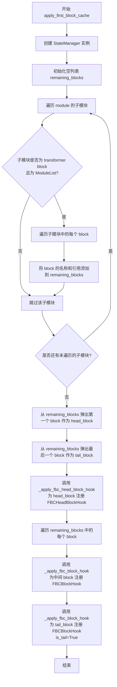
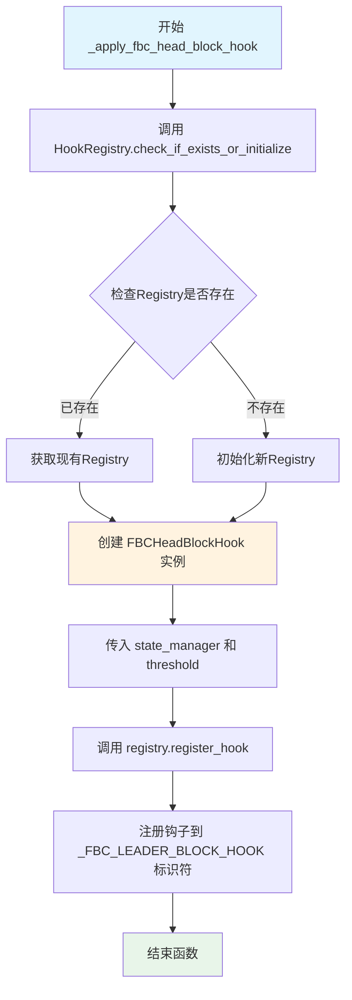
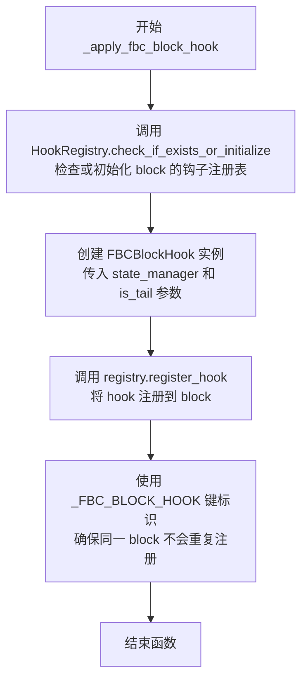
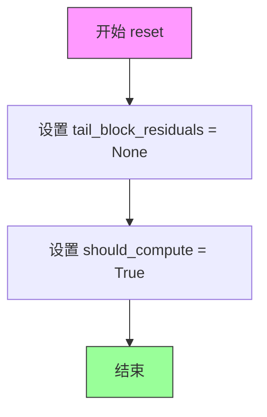
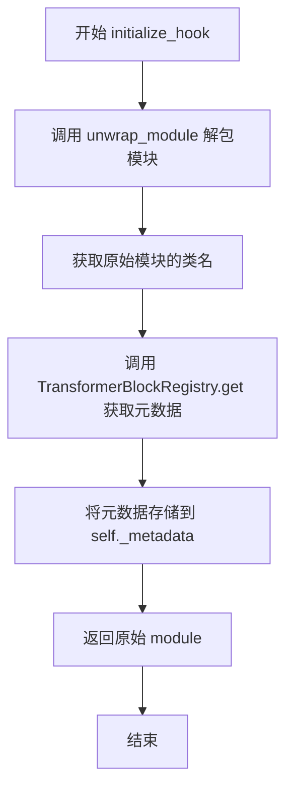
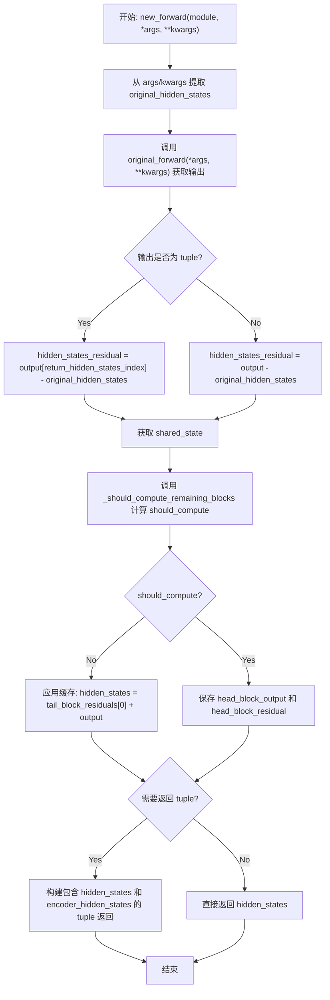
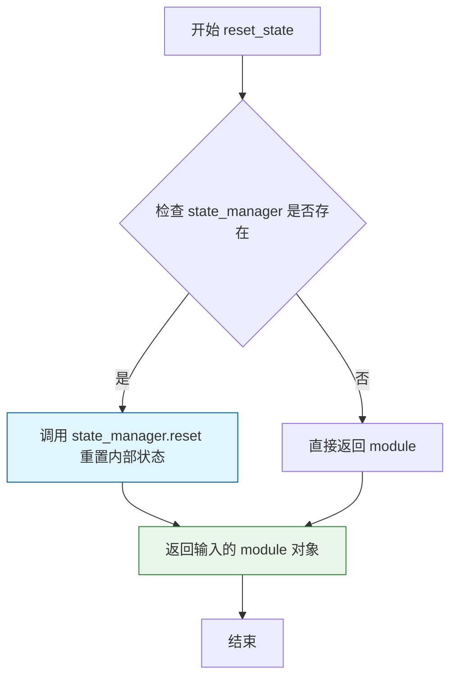
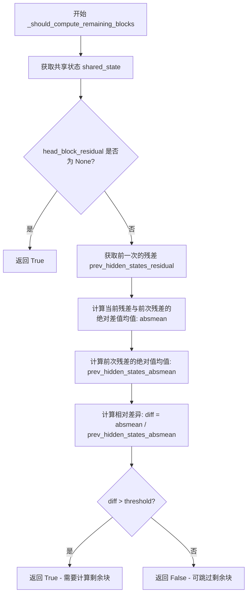
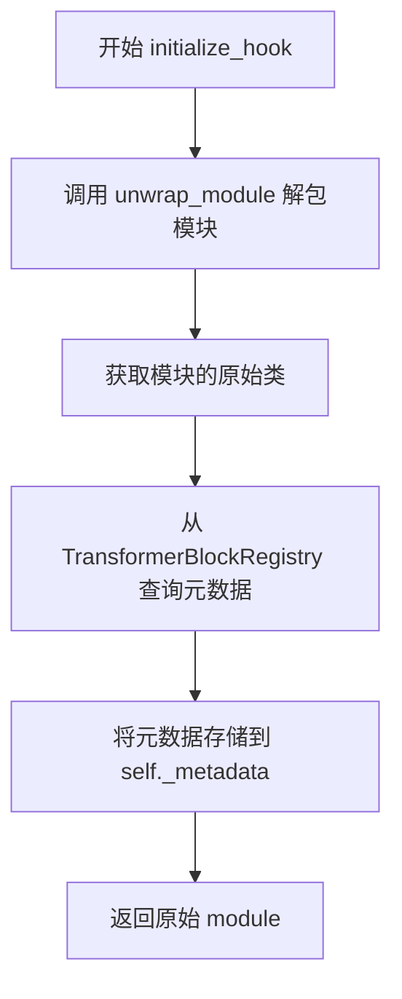
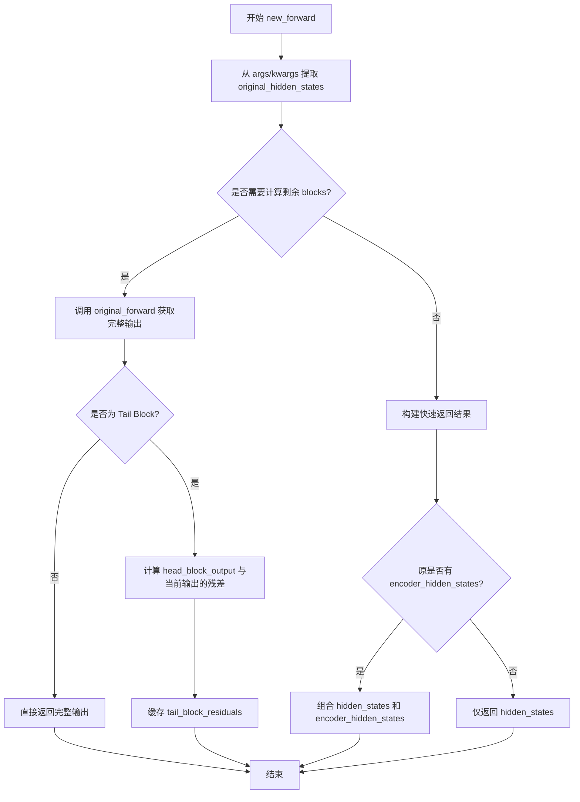

# `diffusers\src\diffusers\hooks\first_block_cache.py` 详细设计文档

First Block Cache (FBC) 是一种用于加速Transformer模型推理的动态缓存机制，通过比较第一块(transformer block)的残差变化来决定是否跳过剩余块的计算，从而在保持生成质量的同时提升推理速度。

## 整体流程

```mermaid
graph TD
    A[apply_first_block_cache 被调用] --> B[初始化 StateManager 和 FBCSharedBlockState]
    B --> C[遍历模块子组件，识别所有 Transformer Block]
    C --> D[获取 head_block (第一个块) 和 tail_block (最后一个块)]
    D --> E[_apply_fbc_head_block_hook 安装 FBCHeadBlockHook 到 head_block]
    E --> F{遍历 remaining_blocks}
    F --> G[_apply_fbc_block_hook 安装 FBCBlockHook 到中间块]
    G --> H[_apply_fbc_block_hook 安装 FBCBlockHook 到 tail_block (标记 is_tail=True)]
    H --> I[推理阶段: 输入进入 head_block]
    I --> J[FBCHeadBlockHook.new_forward 执行前向传播]
    J --> K[计算 hidden_states_residual]
    K --> L{_should_compute_remaining_blocks 判断}
    L -- diff > threshold: 需要计算 --> M[保存 head_block_output 和 residual]
    L -- diff <= threshold: 跳过计算 --> N[使用缓存的 tail_block_residuals 构造输出]
    M --> O[中间块继续计算]
    N --> P[tail_block 跳过计算]
    O --> Q[tail_block 计算残差并保存]
    P --> Q
```

## 类结构

```
BaseState (抽象基类，来自 hooks 模块)
├── FBCSharedBlockState (FBC 共享状态类)
ModelHook (抽象基类，来自 hooks 模块)
├── FBCHeadBlockHook (头部块 Hook)
└── FBCBlockHook (中间块和尾部块 Hook)
```

## 全局变量及字段


### `_FBC_LEADER_BLOCK_HOOK`
    
用于标识FBC头部块Hook的注册名称

类型：`str`
    


### `_FBC_BLOCK_HOOK`
    
用于标识FBC普通块Hook的注册名称

类型：`str`
    


### `logger`
    
模块级日志记录器，用于输出调试和信息日志

类型：`logging.Logger`
    


### `FirstBlockCacheConfig.threshold`
    
决定是否跳过剩余块计算的阈值

类型：`float`
    


### `FBCSharedBlockState.head_block_output`
    
头部块的输出，用于缓存

类型：`torch.Tensor | tuple[torch.Tensor, ...]`
    


### `FBCSharedBlockState.head_block_residual`
    
头部块的残差，用于比较计算

类型：`torch.Tensor`
    


### `FBCSharedBlockState.tail_block_residuals`
    
尾部块的残差，用于缓存恢复

类型：`torch.Tensor | tuple[torch.Tensor, ...]`
    


### `FBCSharedBlockState.should_compute`
    
是否需要计算剩余块的标志

类型：`bool`
    


### `FBCHeadBlockHook.state_manager`
    
状态管理器，用于管理FBC共享状态

类型：`StateManager`
    


### `FBCHeadBlockHook.threshold`
    
判断是否跳过剩余块计算的阈值

类型：`float`
    


### `FBCHeadBlockHook._metadata`
    
Transformer块的元数据，包含参数和返回值索引信息

类型：`TransformerBlockMetadata`
    


### `FBCBlockHook.state_manager`
    
状态管理器，用于管理FBC共享状态

类型：`StateManager`
    


### `FBCBlockHook.is_tail`
    
标识当前块是否为尾部块的标志

类型：`bool`
    


### `FBCBlockHook._metadata`
    
Transformer块的元数据，包含参数和返回值索引信息

类型：`TransformerBlockMetadata`
    
    

## 全局函数及方法


### `apply_first_block_cache`

该函数用于将 First Block Cache (FBC) 优化技术应用到指定的 PyTorch transformer 模块。FBC 是基于 TeaCache 思想实现的动态缓存机制，通过比较首层 transformer block 的残差变化来决定是否跳过剩余层的计算，从而加速推理过程。

参数：

- `module`：`torch.nn.Module`，目标 PyTorch 模块，通常是 Diffusers 支持的 transformer 架构（如 CogVideoXTransformer3DModel）
- `config`：`FirstBlockCacheConfig`，FBC 的配置参数，目前包含 `threshold` 阈值用于决定是否跳过剩余层的计算

返回值：`None`，该函数直接修改模块的 hook 状态，不返回任何值

#### 流程图



#### 带注释源码

```python
def apply_first_block_cache(module: torch.nn.Module, config: FirstBlockCacheConfig) -> None:
    """
    Applies [First Block
    Cache](https://github.com/chengzeyi/ParaAttention/blob/4de137c5b96416489f06e43e19f2c14a772e28fd/README.md#first-block-cache-our-dynamic-caching)
    to a given module.

    First Block Cache builds on the ideas of [TeaCache](https://huggingface.co/papers/2411.19108). It is much simpler
    to implement generically for a wide range of models and has been integrated first for experimental purposes.

    Args:
        module (`torch.nn.Module`):
            The pytorch module to apply FBCache to. Typically, this should be a transformer architecture supported in
            Diffusers, such as `CogVideoXTransformer3DModel`, but external implementations may also work.
        config (`FirstBlockCacheConfig`):
            The configuration to use for applying the FBCache method.

    Example:
        ```python
        >>> import torch
        >>> from diffusers import CogView4Pipeline
        >>> from diffusers.hooks import apply_first_block_cache, FirstBlockCacheConfig

        >>> pipe = CogView4Pipeline.from_pretrained("THUDM/CogView4-6B", torch_dtype=torch.bfloat16)
        >>> pipe.to("cuda")

        >>> apply_first_block_cache(pipe.transformer, FirstBlockCacheConfig(threshold=0.2))

        >>> prompt = "A photo of an astronaut riding a horse on mars"
        >>> image = pipe(prompt, generator=torch.Generator().manual_seed(42)).images[0]
        >>> image.save("output.png")
        ```
    """

    # 创建一个状态管理器，用于在不同的 hook 之间共享状态
    # FBCSharedBlockState 定义了需要共享的状态数据结构
    state_manager = StateManager(FBCSharedBlockState, (), {})
    
    # 用于存储所有需要应用 hook 的 transformer block
    remaining_blocks = []

    # 遍历模块的所有子模块，筛选出 transformer block
    for name, submodule in module.named_children():
        # 检查子模块名称是否在预定义的 transformer block 标识符列表中
        # 且子模块是否为 torch.nn.ModuleList 类型
        if name not in _ALL_TRANSFORMER_BLOCK_IDENTIFIERS or not isinstance(submodule, torch.nn.ModuleList):
            continue
        # 遍历 ModuleList 中的每个 block
        for index, block in enumerate(submodule):
            # 使用 "父模块名.索引" 的格式作为 block 的名称
            remaining_blocks.append((f"{name}.{index}", block))

    # 弹出第一个 block 作为 head block（首层）
    head_block_name, head_block = remaining_blocks.pop(0)
    # 弹出最后一个 block 作为 tail block（尾层）
    tail_block_name, tail_block = remaining_blocks.pop(-1)

    # 为 head block 注册 FBCHeadBlockHook
    # 这个 hook 负责计算首层输出与原始输入的残差，并判断是否需要计算剩余层
    logger.debug(f"Applying FBCHeadBlockHook to '{head_block_name}'")
    _apply_fbc_head_block_hook(head_block, state_manager, config.threshold)

    # 为中间的所有 block 注册 FBCBlockHook
    for name, block in remaining_blocks:
        logger.debug(f"Applying FBCBlockHook to '{name}'")
        _apply_fbc_block_hook(block, state_manager)

    # 为 tail block 注册 FBCBlockHook，并标记 is_tail=True
    # tail block 特殊处理：需要计算尾层输出与 head block 输出的残差
    logger.debug(f"Applying FBCBlockHook to tail block '{tail_block_name}'")
    _apply_fbc_block_hook(tail_block, state_manager, is_tail=True)
```


### `_apply_fbc_head_block_hook`

该函数是 First Block Cache (FBC) 机制的核心辅助函数之一，负责为Transformer模块的头部Block注册FBCHeadBlockHook钩子，以实现动态缓存优化逻辑。

参数：

- `block`：`torch.nn.Module`，目标Transformer块，将在其上注册FBC头部块钩子
- `state_manager`：`StateManager`，状态管理器，用于在多个钩子之间共享FBCSharedBlockState状态
- `threshold`：`float`，阈值参数，用于决定是否跳过剩余块的计算

返回值：`None`，该函数仅执行注册操作，无返回值

#### 流程图



#### 带注释源码

```python
def _apply_fbc_head_block_hook(block: torch.nn.Module, state_manager: StateManager, threshold: float) -> None:
    """
    为给定的Transformer块应用FBC（First Block Cache）头部块钩子。
    
    此函数是FBC机制的关键组成部分，负责在模型的第一个Transformer块上注册
    FBCHeadBlockHook，该钩子会拦截前向传播并实现动态缓存逻辑：
    - 当残差差异小于阈值时，跳过后续块的计算
    - 否则正常计算并缓存头部块输出
    
    Args:
        block (torch.nn.Module): 要注册钩子的Transformer块模块
        state_manager (StateManager): 状态管理器，用于在头部块、尾部和中间块之间共享状态
        threshold (float): 决定是否跳过剩余块计算的阈值参数
    
    Returns:
        None: 此函数不返回值，仅执行副作用（注册钩子）
    """
    # 检查给定block是否已有HookRegistry，若无则创建新实例
    # HookRegistry用于管理模块上的所有钩子，支持钩子的注册、查询和执行
    registry = HookRegistry.check_if_exists_or_initialize(block)
    
    # 创建FBCHeadBlockHook实例，传入状态管理器和阈值
    # FBCHeadBlockHook继承自ModelHook，会拦截模块的forward方法
    # 阈值将用于决定是否需要继续计算后续块
    hook = FBCHeadBlockHook(state_manager, threshold)
    
    # 将钩子注册到Registry中，使用_FBC_LEADER_BLOCK_HOOK作为标识符
    # _FBC_LEADER_BLOCK_HOOK = "fbc_leader_block_hook"
    # 注册后，当block执行forward时会先调用此钩子的new_forward方法
    registry.register_hook(hook, _FBC_LEADER_BLOCK_HOOK)
```


### `_apply_fbc_block_hook`

将 FBCBlockHook 钩子注册到指定的 Transformer 块上，用于实现 First Block Cache (FBC) 动态缓存优化机制。

参数：

- `block`：`torch.nn.Module`，要应用钩子的 PyTorch 模块，通常是 Transformer 模型中的单个块
- `state_manager`：`StateManager`，状态管理器实例，用于在多个钩子之间共享 FBC 缓存状态（如残差计算结果）
- `is_tail`：`bool`，布尔标志，标识当前块是否为尾部块（最后一个块），默认为 `False`

返回值：`None`，该函数无返回值，通过副作用（注册钩子）生效

#### 流程图



#### 带注释源码

```python
def _apply_fbc_block_hook(block: torch.nn.Module, state_manager: StateManager, is_tail: bool = False) -> None:
    """
    将 FBCBlockHook 钩子注册到指定的 Transformer 块上。
    
    这是 First Block Cache (FBC) 缓存机制的关键辅助函数之一。
    FBC 通过比较首块输出的残差与前一次推理的残差来判断是否需要继续计算后续块，
    从而实现动态跳过部分计算以加速推理。
    
    Args:
        block: 要应用钩子的 PyTorch 模块（通常是 TransformerBlock）
        state_manager: 状态管理器，用于在首块、尾块和其他块之间共享计算状态
        is_tail: 标识该块是否为尾部块（最后一个块），用于特殊处理残差计算
    """
    # 检查并初始化指定 block 的 HookRegistry
    # 如果该 block 尚未有注册表，则创建一个新的
    registry = HookRegistry.check_if_exists_or_initialize(block)
    
    # 创建 FBCBlockHook 实例，传入共享状态管理器和尾部块标志
    hook = FBCBlockHook(state_manager, is_tail)
    
    # 将钩子注册到注册表中，使用 _FBC_BLOCK_HOOK 作为唯一标识键
    # 该键确保后续可以据此查找或移除已注册的钩子
    registry.register_hook(hook, _FBC_BLOCK_HOOK)
```


### `FBCSharedBlockState.reset`

该方法用于重置 First Block Cache (FBC) 的共享状态，将尾块残差重置为 `None`，并将计算标志设置为 `True`，以便在下一轮前向传播时重新计算所有块。

参数：

- 无显式参数（`self` 为隐式参数，表示类的实例）

返回值：`None`，无返回值（方法直接修改对象状态）

#### 流程图



#### 带注释源码

```python
def reset(self):
    """
    重置 FBC 共享块状态。
    
    该方法在每次前向传播开始时被调用，用于：
    1. 清除尾块残差（tail_block_residuals），为新一轮缓存计算做准备
    2. 重置计算标志（should_compute）为 True，确保完整计算所有 transformer 块
    """
    # 将尾块残差置为 None，释放缓存的残差数据
    self.tail_block_residuals = None
    
    # 设置 should_compute 为 True，表示需要计算所有块
    # 只有当 head block 的残差变化小于阈值时，才会被设置为 False
    self.should_compute = True
```


### `FBCHeadBlockHook.initialize_hook`

该方法是 FBCHeadBlockHook 类的初始化钩子方法，用于在将钩子挂载到模块上之前进行必要的准备工作，包括解包模块以获取原始模块，并从 TransformerBlockRegistry 中获取对应模块类的元数据信息。

参数：

- `module`：`torch.nn.Module`，需要初始化的目标模块

返回值：`torch.nn.Module`，返回原始模块本身，以支持链式调用

#### 流程图



#### 带注释源码

```python
def initialize_hook(self, module):
    """
    初始化 Hook 的元数据。
    
    该方法在将 Hook 挂载到模块之前调用，用于：
    1. 解包模块以获取原始的 Transformer 块
    2. 从注册表中获取该块类型的元数据信息
    
    Args:
        module (torch.nn.Module): 需要初始化的目标模块
        
    Returns:
        torch.nn.Module: 返回原始模块本身，支持链式调用
    """
    # Step 1: 解包模块，获取原始的未包装模块
    # 这确保我们获取的是实际的 Transformer 块而非装饰器包装的版本
    unwrapped_module = unwrap_module(module)
    
    # Step 2: 从 TransformerBlockRegistry 中获取该模块类的元数据
    # 元数据包含块的参数信息、返回值索引等关键信息
    self._metadata = TransformerBlockRegistry.get(unwrapped_module.__class__)
    
    # Step 3: 返回原始模块以支持链式调用
    return module
```


### FBCHeadBlockHook.new_forward

这是 First Block Cache (FBC) 机制中 Head Block 的 Hook 方法，负责拦截第一个 Transformer Block 的前向传播，计算输出残差并决定是否启用缓存机制来跳过后续 Block 的计算。

参数：

- `module`：`torch.nn.Module`，要 Hook 的 Transformer 模块
- `*args`：可变位置参数，包含模块前向传播的原始输入参数
- `**kwargs`：可变关键字参数，包含模块前向传播的原始关键字参数

返回值：`torch.Tensor | tuple[torch.Tensor, ...]`，根据模块输出格式返回隐藏状态，或包含隐藏状态和编码器隐藏状态的元组

#### 流程图



#### 带注释源码

```python
def new_forward(self, module: torch.nn.Module, *args, **kwargs):
    # 从模块的输入参数中提取原始的 hidden_states，用于后续计算残差
    original_hidden_states = self._metadata._get_parameter_from_args_kwargs("hidden_states", args, kwargs)

    # 调用模块的原始前向传播方法，获取未经 hook 修改的输出
    output = self.fn_ref.original_forward(*args, **kwargs)
    
    # 判断输出是否为元组格式（某些模型返回 (hidden_states, encoder_hidden_states)）
    is_output_tuple = isinstance(output, tuple)

    # 计算 hidden_states 残差：当前输出与原始输入的差值
    # 这是判断是否跳过后续计算的关键依据
    if is_output_tuple:
        hidden_states_residual = output[self._metadata.return_hidden_states_index] - original_hidden_states
    else:
        hidden_states_residual = output - original_hidden_states

    # 获取共享状态管理器，用于存储跨 Block 的中间结果
    shared_state: FBCSharedBlockState = self.state_manager.get_state()
    
    # 初始化局部变量
    hidden_states = encoder_hidden_states = None
    
    # 判断是否需要计算剩余的 Block
    # 基于当前残差与上一次残差的差异程度决定
    should_compute = self._should_compute_remaining_blocks(hidden_states_residual)
    shared_state.should_compute = should_compute

    # 如果不应继续计算，则应用缓存机制
    if not should_compute:
        # 应用缓存：将 tail block 的残差加到当前 head block 输出上
        if is_output_tuple:
            hidden_states = (
                shared_state.tail_block_residuals[0] + output[self._metadata.return_hidden_states_index]
            )
        else:
            hidden_states = shared_state.tail_block_residuals[0] + output

        # 如果模型返回编码器隐藏状态，也需要加上对应的残差
        if self._metadata.return_encoder_hidden_states_index is not None:
            assert is_output_tuple
            encoder_hidden_states = (
                shared_state.tail_block_residuals[1] + output[self._metadata.return_encoder_hidden_states_index]
            )

        # 根据输出格式构建返回结果
        if is_output_tuple:
            return_output = [None] * len(output)
            return_output[self._metadata.return_hidden_states_index] = hidden_states
            return_output[self._metadata.return_encoder_hidden_states_index] = encoder_hidden_states
            return_output = tuple(return_output)
        else:
            return_output = hidden_states
        output = return_output
    else:
        # 如果需要计算剩余 Block，则保存当前 Block 的输出和残差
        # 供后续 Block 使用
        if is_output_tuple:
            head_block_output = [None] * len(output)
            head_block_output[0] = output[self._metadata.return_hidden_states_index]
            head_block_output[1] = output[self._metadata.return_encoder_hidden_states_index]
        else:
            head_block_output = output
        shared_state.head_block_output = head_block_output
        shared_state.head_block_residual = hidden_states_residual

    return output
```


### `FBCHeadBlockHook.reset_state`

重置FBC（First Block Cache）头块钩子的内部状态，通过调用状态管理器的重置方法清除所有缓存的残差和计算标志，为下一次推理迭代做准备。

参数：

- `module`：`torch.nn.Module`，需要重置状态的PyTorch模块实例（虽然当前实现中未直接使用，但保留以保持接口一致性）

返回值：`torch.nn.Module`，返回传入的模块对象，支持链式调用或流水线集成

#### 流程图



#### 带注释源码

```python
def reset_state(self, module: torch.nn.Module) -> torch.nn.Module:
    """
    重置FBCHeadBlockHook的内部状态。
    
    此方法在每次推理迭代开始时被调用，用于清除上一轮计算中
    缓存的head_block_residual、tail_block_residuals等状态数据，
    并将should_compute标志重置为True，以确保新一轮的动态计算
    能够正确执行。
    
    Args:
        module (torch.nn.Module): 
            PyTorch模块实例。此参数在当前实现中未被直接使用，
            但保留以保持与ModelHook基类接口的一致性，便于扩展。
    
    Returns:
        torch.nn.Module: 返回输入的module对象，支持链式调用或
                        与其他钩子方法的集成。
    """
    # 调用状态管理器的reset方法，清除所有共享状态
    # 包括：tail_block_residuals、head_block_residual、head_block_output
    # 以及将should_compute重置为True
    self.state_manager.reset()
    
    # 返回原始模块，保持接口一致性
    return module
```


### `FBCHeadBlockHook._should_compute_remaining_blocks`

该方法用于判断在 First Block Cache 优化策略中，是否需要继续计算模型剩余的 transformer 块。它通过比较当前 hidden states 残差与前一次计算的残差，根据预设的阈值决定是否跳过后续块的计算，从而实现动态缓存优化。

参数：

- `hidden_states_residual`：`torch.Tensor`，当前前向传播产生的隐藏状态残差（即当前 block 输出与原始输入的差值）

返回值：`bool`，返回 `True` 表示需要计算剩余块，返回 `False` 表示可以使用缓存结果跳过剩余块的计算

#### 流程图



#### 带注释源码

```python
@torch.compiler.disable  # 禁用 torch.compile 优化，确保函数正常执行
def _should_compute_remaining_blocks(self, hidden_states_residual: torch.Tensor) -> bool:
    """
    判断是否需要计算模型剩余的 transformer 块
    
    该方法是 First Block Cache (FBC) 策略的核心逻辑，通过比较当前前向传播
    产生的 hidden states 残差与缓存的残差，计算两者的相对差异。如果差异
    超过阈值，则认为当前输入与缓存时的输入差异较大，需要完整计算所有块；
    否则可以跳过剩余块的计算，使用缓存的尾块残差进行快速推理。
    
    Args:
        hidden_states_residual: 当前 block 输出的 hidden states 与原始输入的差值
        
    Returns:
        bool: True 表示需要计算剩余块，False 表示可以使用缓存
    """
    # 获取共享状态，其中存储了 head block 的残差和输出等信息
    shared_state = self.state_manager.get_state()
    
    # 第一次调用时，head_block_residual 尚未初始化，需要完整计算
    if shared_state.head_block_residual is None:
        return True
    
    # 获取前一次（通常是上一轮推理）缓存的 head block 残差
    prev_hidden_states_residual = shared_state.head_block_residual
    
    # 计算当前残差与前次残差的绝对差值，然后取均值
    # 这反映了当前输入与缓存输入在特征层面的变化程度
    absmean = (hidden_states_residual - prev_hidden_states_residual).abs().mean()
    
    # 计算前次残差的绝对值均值，作为比较的基准
    prev_hidden_states_absmean = prev_hidden_states_residual.abs().mean()
    
    # 计算相对差异比例，用于与阈值进行比较
    # 使用 .item() 将张量转换为 Python 标量，以便与 float 比较
    diff = (absmean / prev_hidden_states_absmean).item()
    
    # 如果相对差异超过阈值，说明当前输入与缓存时差异较大，需要完整计算
    # 否则可以复用缓存结果，跳过剩余块的计算
    return diff > self.threshold
```


### `FBCBlockHook.initialize_hook`

该方法用于初始化 FBC (First Block Cache) 块级 Hook，通过解包模块并从转换器块注册表中获取对应的元数据，为后续的 forward 拦截和缓存逻辑做好准备。

参数：

- `module`：`torch.nn.Module`，需要初始化 Hook 的目标模块，通常是 Transformer 的一个块（block）

返回值：`torch.nn.Module`，返回原始模块本身

#### 流程图



#### 带注释源码

```python
def initialize_hook(self, module):
    """
    初始化 Hook，解析并存储目标模块的元数据信息。
    
    该方法在 Hook 被注册到模块时调用，用于：
    1. 获取模块的原始（解包后的）类对象
    2. 从全局注册表中查询该类对应的 Transformer 块元数据
    3. 元数据包含前向参数名、返回值索引等关键信息，供 new_forward 使用
    """
    # unwrap_module 处理模块可能被包装的情况（如 DataParallel、DistributedDataParallel 等）
    # 返回底层的原始模块对象，确保能正确识别模块类型
    unwrapped_module = unwrap_module(module)
    
    # 从 TransformerBlockRegistry 获取该模块类对应的元数据
    # 元数据包含：输入参数映射、返回值索引（hidden_states、encoder_hidden_states 等）
    self._metadata = TransformerBlockRegistry.get(unwrapped_module.__class__)
    
    # 返回原始 module，保持接口一致性
    return module
```


### `FBCBlockHook.new_forward`

该方法是 First Block Cache (FBC) 优化策略的核心执行逻辑，负责在推理过程中根据缓存状态动态决定是执行完整的前向传播还是使用预计算的残差值进行快速返回，从而实现 Transformer 模型推理加速。

参数：

- `module`：`torch.nn.Module`，被 Hook 挂载的目标模块（Transformer 块）
- `*args`：可变位置参数，包含模型前向传播所需的原始输入参数（如 hidden_states、encoder_hidden_states 等）
- `**kwargs`：可变关键字参数，包含模型前向传播所需的命名参数

返回值：`torch.Tensor | tuple[torch.Tensor, ...]`，根据是否需要计算返回原始输入或经过残差计算后的输出

#### 流程图



#### 带注释源码

```python
def new_forward(self, module: torch.nn.Module, *args, **kwargs):
    """
    FBC Block Hook 的核心前向方法，根据缓存状态决定是执行完整计算还是使用缓存快速返回。
    
    参数:
        module: 被 hook 的 torch.nn.Module 实例
        *args: 位置参数元组，通常包含 hidden_states 等输入
        **kwargs: 关键字参数字典
    
    返回:
        torch.Tensor 或 tuple: 计算后的输出或快速返回的缓存结果
    """
    # 步骤1: 从原始参数中提取 hidden_states，用于后续残差计算
    original_hidden_states = self._metadata._get_parameter_from_args_kwargs("hidden_states", args, kwargs)
    
    # 步骤2: 如果模型返回 encoder_hidden_states，也需要提取用于缓存
    original_encoder_hidden_states = None
    if self._metadata.return_encoder_hidden_states_index is not None:
        original_encoder_hidden_states = self._metadata._get_parameter_from_args_kwargs(
            "encoder_hidden_states", args, kwargs
        )

    # 步骤3: 获取共享状态管理器中的缓存状态
    shared_state = self.state_manager.get_state()

    # 步骤4: 根据 should_compute 标志决定执行路径
    if shared_state.should_compute:
        # 路径A: 执行完整的前向传播
        output = self.fn_ref.original_forward(*args, **kwargs)
        
        # 步骤5: 如果是 Tail Block，计算并缓存残差值供后续使用
        if self.is_tail:
            hidden_states_residual = encoder_hidden_states_residual = None
            if isinstance(output, tuple):
                # 计算 hidden_states 残差: 当前输出 - head block 输出
                hidden_states_residual = (
                    output[self._metadata.return_hidden_states_index] - shared_state.head_block_output[0]
                )
                # 计算 encoder_hidden_states 残差
                encoder_hidden_states_residual = (
                    output[self._metadata.return_encoder_hidden_states_index] - shared_state.head_block_output[1]
                )
            else:
                # 非元组输出时的残差计算
                hidden_states_residual = output - shared_state.head_block_output
            
            # 缓存残差值供非计算路径使用
            shared_state.tail_block_residuals = (hidden_states_residual, encoder_hidden_states_residual)
        
        # 返回完整计算结果
        return output

    # 路径B: 快速返回路径 - 不执行完整计算，使用缓存残差
    if original_encoder_hidden_states is None:
        # 简单情况: 只需要返回原始 hidden_states
        return_output = original_hidden_states
    else:
        # 复杂情况: 需要返回包含 encoder_hidden_states 的元组
        return_output = [None, None]
        return_output[self._metadata.return_hidden_states_index] = original_hidden_states
        return_output[self._metadata.return_encoder_hidden_states_index] = original_encoder_hidden_states
        return_output = tuple(return_output)
    
    return return_output
```

## 关键组件


### FirstBlockCacheConfig

FirstBlockCacheConfig 是 FBC 的配置类，用于配置 FBC 的阈值参数。threshold 参数决定了是否跳过剩余 blocks 的计算，较高的阈值会导致更激进的跳过策略，从而加速推理但可能降低生成质量。

### FBCSharedBlockState

FBCSharedBlockState 是跨多个 hook 共享的状态类，用于在 FBCHeadBlockHook 和 FBCBlockHook 之间传递状态信息，包括头部 block 的输出、残差值、尾部 block 的残差值以及是否应该计算剩余 blocks 的标志。

### FBCHeadBlockHook

FBCHeadBlockHook 是应用于模型第一个 transformer block 的 hook，负责执行 FBC 的核心逻辑：计算当前输出与原始输入之间的残差，根据阈值判断是否需要计算剩余 blocks，并在满足条件时缓存残差值以供后续 blocks 使用。

### FBCBlockHook

FBCBlockHook 是应用于剩余 transformer blocks 的 hook，根据 FBCHeadBlockHook 的判断结果决定是否执行原始 forward 过程，或直接返回原始输入（跳过计算）。

### apply_first_block_cache

apply_first_block_cache 是主应用函数，负责遍历模块的所有 transformer block 子模块，识别头部 block 和尾部 block，并分别应用 FBCHeadBlockHook 和 FBCBlockHook，从而实现完整的 FBC 缓存机制。

### TransformerBlockRegistry

TransformerBlockRegistry 是用于注册和获取 transformer block 元数据的注册表，提供从 block 类获取其参数信息（如 hidden_states、encoder_hidden_states）和输出索引的能力。

### HookRegistry

HookRegistry 是用于管理模型 hook 的注册表，支持检查 hook 是否存在、初始化新的 hook 注册表以及注册新的 hook 实例。

### StateManager

StateManager 是状态管理器，负责管理 FBCSharedBlockState 实例的创建、获取和重置，为多个 hook 提供共享状态的持久化机制。


## 问题及建议


### 已知问题

-   **状态重置不完整**：`FBCSharedBlockState.reset()` 方法只重置了 `tail_block_residuals` 和 `should_compute`，但没有重置 `head_block_output` 和 `head_block_residual`。这可能导致在模型复用时出现状态污染。
-   **类型注解不一致**：`head_block_output` 类型注解为 `torch.Tensor | tuple[torch.Tensor, ...]`，但实际代码中使用了列表赋值（如 `head_block_output = [None] * len(output)`），类型不一致。
-   **缺少空值检查**：在 `_should_compute_remaining_blocks` 方法中，直接访问 `head_block_residual` 进行计算，没有对 `prev_hidden_states_absmean` 为 0 的情况进行处理，可能导致除零错误。
-   **hook 注册后无法移除**：代码提供了 `apply_first_block_cache` 来注册 hook，但没有提供相应的卸载机制，导致无法动态控制缓存的启用/禁用。
-   **元数据可能为 None**：`initialize_hook` 方法中获取的 `self._metadata` 可能为 None（如果 `TransformerBlockRegistry.get()` 未找到对应的 transformer block），但在 `new_forward` 中直接使用没有空值检查。
-   **tuple 输出索引越界风险**：当 transformer block 的输出为 tuple 时，代码使用硬编码的索引访问（如 `output[self._metadata.return_hidden_states_index]`），如果 tuple 长度不足会导致 IndexError。
- **参数获取可能返回 None**：`_get_parameter_from_args_kwargs` 方法可能返回 None，但后续代码直接使用返回值进行计算，没有空值保护。

### 优化建议

-   **完善状态重置**：在 `FBCSharedBlockState.reset()` 中添加对 `head_block_output` 和 `head_block_residual` 的重置，并在 `reset_state` 方法中调用 `shared_state.reset()`。
-   **添加除零保护**：在 `_should_compute_remaining_blocks` 中添加对 `prev_hidden_states_absmean` 为 0 的检查，避免除零错误。
-   **提供 hook 注销接口**：添加 `remove_first_block_cache` 函数，允许用户卸载已注册的 hooks。
-   **增强元数据校验**：在 `initialize_hook` 中验证 `self._metadata` 不为 None，或在 `new_forward` 中添加断言/异常处理。
-   **统一类型注解**：确保 `head_block_output` 的类型注解与实际使用一致，或修改代码使用正确的类型。
-   **添加输出长度校验**：在访问 tuple 索引前，验证 output 的长度是否足够。
-   **增加参数空值检查**：在使用 `_get_parameter_from_args_kwargs` 返回值前，检查是否为 None 并给出合理的默认值或抛出明确的异常。


## 其它


### 设计目标与约束

**设计目标：**
实现First Block Cache（FBC）机制，通过缓存第一个Transformer块的输出并计算残差，在残差变化较小时跳过后续块的计算，从而加速Transformer模型的推理过程。

**约束条件：**
- 仅适用于支持TransformerBlockRegistry中注册的结构
- 需要模型输出hidden_states且结构符合元数据要求
- threshold为关键超参数，需根据模型特性调优
- 适用于Diffusers库支持的CogVideoX等模型架构

### 错误处理与异常设计

**日志记录：**
- 使用get_logger(__name__)创建模块级logger
- debug级别日志记录hook应用情况
- logger.debug(f"Applying FBCHeadBlockHook to '{head_block_name}'")

**断言检查：**
- 当return_encoder_hidden_states_index不为None时，验证输出为tuple
- torch.compiler.disable装饰器用于禁止JIT编译优化特定方法

**异常传播：**
- 底层依赖torch操作自动抛出相关异常
- HookRegistry和TransformerBlockRegistry操作异常会向上传播

### 数据流与状态机

**状态类FBCSharedBlockState：**
- head_block_output: 第一个块的输出（hidden_states或tuple）
- head_block_residual: 第一个块的残差
- tail_block_residuals: 尾部块输出与head_block_output的残差
- should_compute: 布尔标志，指示是否需要计算后续块

**状态转换流程：**
1. 初始化：创建StateManager和FBCSharedBlockState
2. 首次前向：head_block_residual为None，should_compute=True
3. 计算残差：比较当前与前次残差的绝对均值
4. 决策分支：如果diff > threshold，正常计算；否则应用缓存
5. 重置：调用reset()方法重置状态

### 外部依赖与接口契约

**核心依赖：**
- torch: 张量运算和模块操作
- diffusers.utils: get_logger, unwrap_module
- diffusers.hooks: BaseState, HookRegistry, ModelHook, StateManager
- diffusers.models.transformers: _ALL_TRANSFORMER_BLOCK_IDENTIFIERS, TransformerBlockRegistry

**接口契约：**
- ModelHook接口：initialize_hook, new_forward, reset_state
- BaseState接口：reset方法
- TransformerBlockRegistry.get: 根据模块类获取元数据
- HookRegistry.register_hook: 注册hook到模块

### 性能考量与优化空间

**性能优势：**
- 跳过大部分Transformer块的前向计算
- 减少GPU计算资源和内存带宽使用
- 阈值越高，跳过计算越多，加速越明显

**性能开销：**
- 需要存储head_block_output和residuals
- 每个前向传播需计算absmean差异
- StateManager的状态管理 overhead

**优化方向：**
- 可考虑实现多级缓存（Multi-Block Cache）
- 支持动态threshold调整策略
- 批量推理场景下的状态复用优化

### 并发与线程安全性

**单线程假设：**
- 状态管理器StateManager在单次前向传播内使用
- 状态存储在shared_state中，不涉及跨线程共享
- 未使用线程锁或同步机制

**使用限制：**
- 不支持同一module实例的并发前向调用
- 多线程推理需为每个线程创建独立module或state_manager

### 配置管理

**配置类FirstBlockCacheConfig：**
- threshold: float类型，默认值0.05
- 文档说明：残差绝对均值变化率与threshold比较

**配置影响：**
- 高threshold（>0.1）：更多跳过，质量可能下降，速度提升明显
- 低threshold（<0.02）：几乎不跳过，质量保持，加速有限
- 建议范围：0.05-0.2，根据模型调整

### 测试策略建议

**单元测试：**
- FBCSharedBlockState状态重置测试
- FBCHeadBlockHook缓存决策逻辑测试（diff > threshold）
- FBCBlockHook条件计算测试

**集成测试：**
- 端到端推理结果质量对比（有/无FBC）
- 不同threshold值下的性能基准测试
- 多模型兼容性测试（CogVideoX, StableDiffusion等）

### 版本兼容性要求

**依赖版本：**
- torch >= 2.0（用于torch.compiler.disable）
- diffusers >= 0.30.0（hooks模块）
- Python >= 3.8

**兼容性说明：**
- 需要TransformerBlockRegistry已初始化
- 需要模型已注册到_ALL_TRANSFORMER_BLOCK_IDENTIFIERS
- 类型注解使用Python 3.10+语法（|联合类型）

### 限制与已知问题

**当前限制：**
- 仅支持输出hidden_states的Transformer架构
- 仅支持encoder-decoder或decoder-only结构
- 不支持同时进行训练和推理

**已知问题：**
- threshold需手动调优，无自动适配机制
- 首次前向无法使用缓存（head_block_residual为None）
- 极端情况下可能影响生成质量

### 安全考量

**无敏感数据处理：**
- 不涉及用户输入验证或处理
- 不存储或传输敏感信息

**安全建议：**
- 模块来源于可信的HuggingFace和Diffusers生态
- 建议在受控环境中使用
- 注意模型文件的来源验证

    