# `diffusers\src\diffusers\hooks\group_offloading.py` 详细设计文档

该文件实现了一种针对 PyTorch 模型的分层分组卸载（Group Offloading）机制。通过将模型的内部模块（ModuleList 或 Sequential）分组在 CPU（内存或磁盘）和加速器设备（GPU）之间动态迁移，以降低显存占用。同时支持异步流（Streams）来实现数据传输与计算的重叠，以及基于执行顺序的预取（Prefetching）优化。

## 整体流程

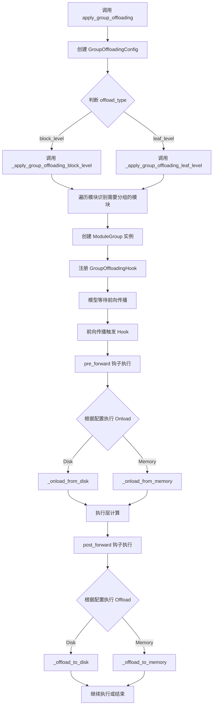

## 类结构

```
ModelHook (抽象基类)
├── GroupOffloadingHook
├── LazyPrefetchGroupOffloadingHook
│   └── (依赖 LayerExecutionTrackerHook)
└── LayerExecutionTrackerHook

Data Structures
├── GroupOffloadingConfig (配置数据类)
└── ModuleGroup (模块分组管理类)
```

## 全局变量及字段


### `logger`
    
模块级日志记录器，用于输出调试和信息日志

类型：`logging.Logger`
    


### `_GROUP_OFFLOADING`
    
分组卸载hook在HookRegistry中的唯一标识键

类型：`str`
    


### `_LAYER_EXECUTION_TRACKER`
    
层执行跟踪hook在HookRegistry中的唯一标识键

类型：`str`
    


### `_LAZY_PREFETCH_GROUP_OFFLOADING`
    
延迟预取分组卸载hook在HookRegistry中的唯一标识键

类型：`str`
    


### `_GROUP_ID_LAZY_LEAF`
    
用于标识延迟预取叶子级分组卸载的分组ID

类型：`str`
    


### `GroupOffloadingType.GroupOffloadingType.BLOCK_LEVEL`
    
枚举成员，表示块级分组卸载策略

类型：`GroupOffloadingType`
    


### `GroupOffloadingType.GroupOffloadingType.LEAF_LEVEL`
    
枚举成员，表示叶子级分组卸载策略

类型：`GroupOffloadingType`
    


### `GroupOffloadingConfig.GroupOffloadingConfig.onload_device`
    
模块组加载目标设备（通常是GPU）

类型：`torch.device`
    


### `GroupOffloadingConfig.GroupOffloadingConfig.offload_device`
    
模块组卸载目标设备（通常是CPU）

类型：`torch.device`
    


### `GroupOffloadingConfig.GroupOffloadingConfig.offload_type`
    
分组卸载类型（块级或叶子级）

类型：`GroupOffloadingType`
    


### `GroupOffloadingConfig.GroupOffloadingConfig.non_blocking`
    
是否使用非阻塞数据传输

类型：`bool`
    


### `GroupOffloadingConfig.GroupOffloadingConfig.record_stream`
    
是否记录CUDA stream以跟踪张量使用

类型：`bool`
    


### `GroupOffloadingConfig.GroupOffloadingConfig.low_cpu_mem_usage`
    
是否最小化CPU内存使用（动态固定内存而非预固定）

类型：`bool`
    


### `GroupOffloadingConfig.GroupOffloadingConfig.num_blocks_per_group`
    
每个分组包含的模块块数量

类型：`int | None`
    


### `GroupOffloadingConfig.GroupOffloadingConfig.offload_to_disk_path`
    
将参数卸载到磁盘的路径（用于内存受限环境）

类型：`str | None`
    


### `GroupOffloadingConfig.GroupOffloadingConfig.stream`
    
用于异步数据传输的CUDA/XPU流

类型：`torch.cuda.Stream | torch.Stream | None`
    


### `GroupOffloadingConfig.GroupOffloadingConfig.block_modules`
    
显式指定作为块进行卸载的模块名称列表

类型：`list[str] | None`
    


### `GroupOffloadingConfig.GroupOffloadingConfig.exclude_kwargs`
    
在设备转移时需要排除的kwargs键列表（用于保持可变状态对象身份）

类型：`list[str] | None`
    


### `GroupOffloadingConfig.GroupOffloadingConfig.module_prefix`
    
模块名称前缀，用于避免磁盘卸载时文件名冲突

类型：`str`
    


### `ModuleGroup.ModuleGroup.modules`
    
属于该分组的模块列表

类型：`list[torch.nn.Module]`
    


### `ModuleGroup.ModuleGroup.offload_device`
    
分组参数卸载目标设备

类型：`torch.device`
    


### `ModuleGroup.ModuleGroup.onload_device`
    
分组参数加载目标设备

类型：`torch.device`
    


### `ModuleGroup.ModuleGroup.offload_leader`
    
负责触发卸载操作的模块（通常是分组中最后一个模块）

类型：`torch.nn.Module`
    


### `ModuleGroup.ModuleGroup.onload_leader`
    
负责触发加载操作的模块（通常是分组中第一个模块）

类型：`torch.nn.Module | None`
    


### `ModuleGroup.ModuleGroup.parameters`
    
分组需要管理的独立参数列表

类型：`list[torch.nn.Parameter]`
    


### `ModuleGroup.ModuleGroup.buffers`
    
分组需要管理的独立缓冲区列表

类型：`list[torch.Tensor]`
    


### `ModuleGroup.ModuleGroup.non_blocking`
    
是否使用非阻塞数据传输

类型：`bool`
    


### `ModuleGroup.ModuleGroup.stream`
    
用于异步数据传输的CUDA/XPU流

类型：`torch.cuda.Stream | torch.Stream | None`
    


### `ModuleGroup.ModuleGroup.record_stream`
    
是否记录stream以正确追踪张量生命周期

类型：`bool`
    


### `ModuleGroup.ModuleGroup.onload_self`
    
是否由分组自身负责加载（false表示由前一分组预加载）

类型：`bool`
    


### `ModuleGroup.ModuleGroup.low_cpu_mem_usage`
    
是否最小化CPU内存使用

类型：`bool`
    


### `ModuleGroup.ModuleGroup.offload_to_disk_path`
    
将参数卸载到磁盘的路径

类型：`str | None`
    


### `ModuleGroup.ModuleGroup.cpu_param_dict`
    
存储卸载到CPU的参数字典（键为参数对象，值为CPU张量）

类型：`dict`
    


### `ModuleGroup.ModuleGroup.tensor_to_key`
    
张量到安全张量文件键名的映射

类型：`dict`
    


### `ModuleGroup.ModuleGroup.key_to_tensor`
    
安全张量文件键名到原始张量的映射

类型：`dict`
    


### `GroupOffloadingHook.GroupOffloadingHook.group`
    
该hook管理的模块分组

类型：`ModuleGroup`
    


### `GroupOffloadingHook.GroupOffloadingHook.next_group`
    
预取模式下下一个待加载的模块分组

类型：`ModuleGroup | None`
    


### `GroupOffloadingHook.GroupOffloadingHook.config`
    
分组卸载配置信息

类型：`GroupOffloadingConfig`
    


### `LazyPrefetchGroupOffloadingHook.LazyPrefetchGroupOffloadingHook.execution_order`
    
记录前向传播中层的执行顺序

类型：`list[tuple[str, torch.nn.Module]]`
    


### `LazyPrefetchGroupOffloadingHook.LazyPrefetchGroupOffloadingHook._layer_execution_tracker_module_names`
    
需要跟踪执行顺序的模块名称集合

类型：`set`
    


### `LayerExecutionTrackerHook.LayerExecutionTrackerHook.execution_order_update_callback`
    
回调函数，用于更新层的执行顺序

类型：`callable`
    
    

## 全局函数及方法


### `apply_group_offloading`

该函数是组卸载（Group Offloading）功能的主入口函数，用于将模型模块的内部层组卸载到CPU或磁盘，以减少GPU显存占用。它在模块级卸载和叶级卸载之间提供了一种平衡方案，通过按组卸载`torch.nn.ModuleList`或`torch.nn.Sequential`块来降低内存消耗，同时保持较好的性能。

参数：

- `module`：`torch.nn.Module`，要应用组卸载的模块
- `onload_device`：`str | torch.device`，模块组加载到的目标设备
- `offload_device`：`str | torch.device`，模块组卸载到的设备，默认为CPU
- `offload_type`：`str | GroupOffloadingType`，卸载类型，可选"block_level"或"leaf_level"，默认为"block_level"
- `num_blocks_per_group`：`int | None`，每组的块数量，当offload_type="block_level"时需要指定
- `non_blocking`：`bool`，是否使用非阻塞数据传输，默认为False
- `use_stream`：`bool`，是否使用CUDA流进行异步数据传输，默认为False
- `record_stream`：`bool`，是否记录流以优化异步传输，默认为False
- `low_cpu_mem_usage`：`bool`，是否最小化CPU内存使用，默认为False
- `offload_to_disk_path`：`str | None`，卸载到磁盘的路径，用于内存受限场景
- `block_modules`：`list[str] | None`，显式指定的块模块名称列表
- `exclude_kwargs`：`list[str] | None`，在send_to_device中需要排除的kwargs键列表

返回值：`None`，该函数无返回值，直接在模块上注册卸载钩子

#### 流程图

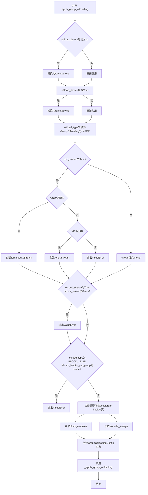

#### 带注释源码

```python
def apply_group_offloading(
    module: torch.nn.Module,
    onload_device: str | torch.device,
    offload_device: str | torch.device = torch.device("cpu"),
    offload_type: str | GroupOffloadingType = "block_level",
    num_blocks_per_group: int | None = None,
    non_blocking: bool = False,
    use_stream: bool = False,
    record_stream: bool = False,
    low_cpu_mem_usage: bool = False,
    offload_to_disk_path: str | None = None,
    block_modules: list[str] | None = None,
    exclude_kwargs: list[str] | None = None,
) -> None:
    r"""
    Applies group offloading to the internal layers of a torch.nn.Module. To understand what group offloading is, and
    where it is beneficial, we need to first provide some context on how other supported offloading methods work.

    Typically, offloading is done at two levels:
    - Module-level: In Diffusers, this can be enabled using the `ModelMixin::enable_model_cpu_offload()` method. It
      works by offloading each component of a pipeline to the CPU for storage, and onloading to the accelerator device
      when needed for computation. This method is more memory-efficient than keeping all components on the accelerator,
      but the memory requirements are still quite high. For this method to work, one needs memory equivalent to size of
      the model in runtime dtype + size of largest intermediate activation tensors to be able to complete the forward
      pass.
    - Leaf-level: In Diffusers, this can be enabled using the `ModelMixin::enable_sequential_cpu_offload()` method. It
      works by offloading the lowest leaf-level parameters of the computation graph to the CPU for storage, and
      onloading only the leafs to the accelerator device for computation. This uses the lowest amount of accelerator
      memory, but can be slower due to the excessive number of device synchronizations.

    Group offloading is a middle ground between the two methods. It works by offloading groups of internal layers,
    (either `torch.nn.ModuleList` or `torch.nn.Sequential`). This method uses lower memory than module-level
    offloading. It is also faster than leaf-level/sequential offloading, as the number of device synchronizations is
    reduced.

    Another supported feature (for CUDA devices with support for asynchronous data transfer streams) is the ability to
    overlap data transfer and computation to reduce the overall execution time compared to sequential offloading. This
    is enabled using layer prefetching with streams, i.e., the layer that is to be executed next starts onloading to
    the accelerator device while the current layer is being executed - this increases the memory requirements slightly.
    Note that this implementation also supports leaf-level offloading but can be made much faster when using streams.

    Args:
        module (`torch.nn.Module`):
            The module to which group offloading is applied.
        onload_device (`torch.device`):
            The device to which the group of modules are onloaded.
        offload_device (`torch.device`, defaults to `torch.device("cpu")`):
            The device to which the group of modules are offloaded. This should typically be the CPU. Default is CPU.
        offload_type (`str` or `GroupOffloadingType`, defaults to "block_level"):
            The type of offloading to be applied. Can be one of "block_level" or "leaf_level". Default is
            "block_level".
        offload_to_disk_path (`str`, *optional*, defaults to `None`):
            The path to the directory where parameters will be offloaded. Setting this option can be useful in limited
            RAM environment settings where a reasonable speed-memory trade-off is desired.
        num_blocks_per_group (`int`, *optional*):
            The number of blocks per group when using offload_type="block_level". This is required when using
            offload_type="block_level".
        non_blocking (`bool`, defaults to `False`):
            If True, offloading and onloading is done with non-blocking data transfer.
        use_stream (`bool`, defaults to `False`):
            If True, offloading and onloading is done asynchronously using a CUDA stream. This can be useful for
            overlapping computation and data transfer.
        record_stream (`bool`, defaults to `False`): When enabled with `use_stream`, it marks the current tensor
            as having been used by this stream. It is faster at the expense of slightly more memory usage. Refer to the
            [PyTorch official docs](https://pytorch.org/docs/stable/generated/torch.Tensor.record_stream.html) more
            details.
        low_cpu_mem_usage (`bool`, defaults to `False`):
            If True, the CPU memory usage is minimized by pinning tensors on-the-fly instead of pre-pinning them. This
            option only matters when using streamed CPU offloading (i.e. `use_stream=True`). This can be useful when
            the CPU memory is a bottleneck but may counteract the benefits of using streams.
        block_modules (`list[str]`, *optional*):
            List of module names that should be treated as blocks for offloading. If provided, only these modules will
            be considered for block-level offloading. If not provided, the default block detection logic will be used.
        exclude_kwargs (`list[str]`, *optional*):
            List of kwarg keys that should not be processed by send_to_device. This is useful for mutable state like
            caching lists that need to maintain their object identity across forward passes. If not provided, will be
            inferred from the module's `_skip_keys` attribute if it exists.

    Example:
        ```python
        >>> from diffusers import CogVideoXTransformer3DModel
        >>> from diffusers.hooks import apply_group_offloading

        >>> transformer = CogVideoXTransformer3DModel.from_pretrained(
        ...     "THUDM/CogVideoX-5b", subfolder="transformer", torch_dtype=torch.bfloat16
        ... )

        >>> apply_group_offloading(
        ...     transformer,
        ...     onload_device=torch.device("cuda"),
        ...     offload_device=torch.device("cpu"),
        ...     offload_type="block_level",
        ...     num_blocks_per_group=2,
        ...     use_stream=True,
        ... )
        ```
    """

    # 将字符串设备转换为torch.device对象
    onload_device = torch.device(onload_device) if isinstance(onload_device, str) else onload_device
    offload_device = torch.device(offload_device) if isinstance(offload_device, str) else offload_device
    
    # 将offload_type字符串转换为枚举类型
    offload_type = GroupOffloadingType(offload_type)

    stream = None
    # 如果启用流式传输，根据设备类型创建相应的流对象
    if use_stream:
        if torch.cuda.is_available():
            stream = torch.cuda.Stream()
        elif hasattr(torch, "xpu") and torch.xpu.is_available():
            stream = torch.Stream()
        else:
            raise ValueError("Using streams for data transfer requires a CUDA device, or an Intel XPU device.")

    # 验证参数有效性：record_stream必须与use_stream一起使用
    if not use_stream and record_stream:
        raise ValueError("`record_stream` cannot be True when `use_stream=False`.")
    
    # block_level模式必须指定num_blocks_per_group
    if offload_type == GroupOffloadingType.BLOCK_LEVEL and num_blocks_per_group is None:
        raise ValueError("`num_blocks_per_group` must be provided when using `offload_type='block_level'.")

    # 检查模块是否已应用accelerate的其他hook，避免冲突
    _raise_error_if_accelerate_model_or_sequential_hook_present(module)

    # 从模块属性获取块模块列表（如果未提供）
    if block_modules is None:
        block_modules = getattr(module, "_group_offload_block_modules", None)

    # 从模块属性获取需要排除的kwargs（如果未提供）
    if exclude_kwargs is None:
        exclude_kwargs = getattr(module, "_skip_keys", None)

    # 创建组卸载配置对象
    config = GroupOffloadingConfig(
        onload_device=onload_device,
        offload_device=offload_device,
        offload_type=offload_type,
        num_blocks_per_group=num_blocks_per_group,
        non_blocking=non_blocking,
        stream=stream,
        record_stream=record_stream,
        low_cpu_mem_usage=low_cpu_mem_usage,
        offload_to_disk_path=offload_to_disk_path,
        block_modules=block_modules,
        exclude_kwargs=exclude_kwargs,
    )
    
    # 调用内部函数执行实际的组卸载应用
    _apply_group_offloading(module, config)
```


### `_apply_group_offloading`

该函数是私有内部方法，作为**分发控制器**（Dispatcher）。它接收模块和配置对象，根据 `config` 中指定的卸载类型（`offload_type`），将实际处理逻辑路由至对应的底层实现函数（块级卸载或叶级卸载），是实现 Group Offloading 策略的关键入口。

参数：
- `module`：`torch.nn.Module`，目标 PyTorch 模块，Group Offloading 将应用于该模块的内部结构。
- `config`：`GroupOffloadingConfig`，数据结构，包含设备信息、卸载类型（Block/Leaf）、流控制等详细配置。

返回值：`None`，无直接返回值，通过副作用对 `module` 注册 Hooks。

#### 流程图

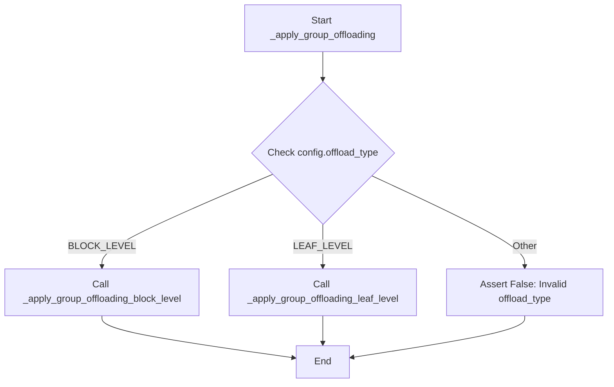

#### 带注释源码

```python
def _apply_group_offloading(module: torch.nn.Module, config: GroupOffloadingConfig) -> None:
    r"""
    根据配置类型将卸载逻辑分发的具体实现函数。
    
    Args:
        module: 需要应用 Group Offloading 的根模块。
        config: 包含具体卸载策略的配置对象。
    """
    # 判断卸载类型：如果是块级（Block Level）卸载
    if config.offload_type == GroupOffloadingType.BLOCK_LEVEL:
        # 调用块级卸载处理函数
        _apply_group_offloading_block_level(module, config)
    # 判断卸载类型：如果是叶级（Leaf Level）卸载
    elif config.offload_type == GroupOffloadingType.LEAF_LEVEL:
        # 调用叶级卸载处理函数
        _apply_group_offloading_leaf_level(module, config)
    else:
        # 如果配置了未知的卸载类型，抛出断言错误
        assert False
```


### `_apply_group_offloading_block_level`

该函数将块级卸载应用于torch.nn.Module的内部层，处理ModuleList、Sequential块以及显式定义的块模块。它递归地为每个块组创建ModuleGroup并注册相应的GroupOffloadingHook，同时处理不属于任何块的剩余子模块和参数缓冲区。

参数：

- `module`：`torch.nn.Module`，需要应用组卸载的模块
- `config`：`GroupOffloadingConfig`，包含卸载配置的dataclass对象

返回值：`None`，该函数不返回任何值

#### 流程图

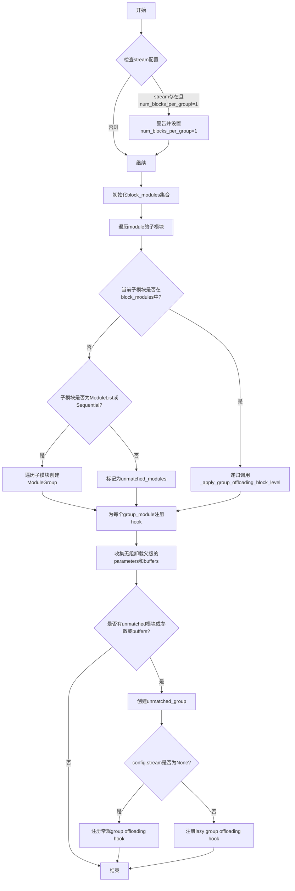

#### 带注释源码

```python
def _apply_group_offloading_block_level(module: torch.nn.Module, config: GroupOffloadingConfig) -> None:
    r"""
    This function applies offloading to groups of torch.nn.ModuleList or torch.nn.Sequential blocks, and explicitly
    defined block modules. In comparison to the "leaf_level" offloading, which is more fine-grained, this offloading is
    done at the top-level blocks and modules specified in block_modules.

    When block_modules is provided, only those modules will be treated as blocks for offloading. For each specified
    module, recursively apply block offloading to it.
    """
    # 如果使用stream但num_blocks_per_group不为1，发出警告并强制设为1
    # stream功能仅在num_blocks_per_group=1时支持
    if config.stream is not None and config.num_blocks_per_group != 1:
        logger.warning(
            f"Using streams is only supported for num_blocks_per_group=1. Got {config.num_blocks_per_group=}. Setting it to 1."
        )
        config.num_blocks_per_group = 1

    # 将block_modules转换为集合以便快速查找，如果为None则创建空集合
    block_modules = set(config.block_modules) if config.block_modules is not None else set()

    # 初始化存储变量
    # 存储已经应用组卸载的模块名称集合
    modules_with_group_offloading = set()
    # 存储不匹配的子模块
    unmatched_modules = []
    # 存储匹配的模块组
    matched_module_groups = []

    # 遍历module的所有直接子模块
    for name, submodule in module.named_children():
        # 检查是否是显式定义的块模块
        if name in block_modules:
            # 为避免磁盘卸载时文件名冲突，使用前缀追踪子模块
            # 否则，共享相同模型类的子模块会被分配相同的文件名
            prefix = f"{config.module_prefix}{name}." if config.module_prefix else f"{name}."
            submodule_config = replace(config, module_prefix=prefix)

            # 递归调用处理子模块
            _apply_group_offloading_block_level(submodule, submodule_config)
            # 标记该模块已处理
            modules_with_group_offloading.add(name)

        # 检查是否是ModuleList或Sequential类型
        elif isinstance(submodule, (torch.nn.ModuleList, torch.nn.Sequential)):
            # 按块大小遍历创建ModuleGroup
            for i in range(0, len(submodule), config.num_blocks_per_group):
                current_modules = list(submodule[i : i + config.num_blocks_per_group])
                if len(current_modules) == 0:
                    continue

                # 生成唯一的group_id
                group_id = f"{config.module_prefix}{name}_{i}_{i + len(current_modules) - 1}"
                # 创建ModuleGroup对象
                group = ModuleGroup(
                    modules=current_modules,
                    offload_device=config.offload_device,
                    onload_device=config.onload_device,
                    offload_to_disk_path=config.offload_to_disk_path,
                    offload_leader=current_modules[-1],
                    onload_leader=current_modules[0],
                    non_blocking=config.non_blocking,
                    stream=config.stream,
                    record_stream=config.record_stream,
                    low_cpu_mem_usage=config.low_cpu_mem_usage,
                    onload_self=True,
                    group_id=group_id,
                )
                matched_module_groups.append(group)
                # 记录已应用卸载的模块
                for j in range(i, i + len(current_modules)):
                    modules_with_group_offloading.add(f"{name}.{j}")
        else:
            # 不匹配的模块添加到列表
            unmatched_modules.append((name, submodule))

    # 为匹配的模块组应用组卸载hook
    for i, group in enumerate(matched_module_groups):
        for group_module in group.modules:
            _apply_group_offloading_hook(group_module, group, config=config)

    # 收集没有组卸载父级的参数和缓冲区
    # 这些需要在module的forward pass中单独处理
    parameters = _gather_parameters_with_no_group_offloading_parent(module, modules_with_group_offloading)
    buffers = _gather_buffers_with_no_group_offloading_parent(module, modules_with_group_offloading)
    # 提取参数和缓冲区对象
    parameters = [param for _, param in parameters]
    buffers = [buffer for _, buffer in buffers]

    # 为剩余未匹配的子模块创建组
    unmatched_modules = [unmatched_module for _, unmatched_module in unmatched_modules]
    # 如果存在未匹配模块、参数或缓冲区，则创建unmatched_group
    if len(unmatched_modules) > 0 or len(parameters) > 0 or len(buffers) > 0:
        unmatched_group = ModuleGroup(
            modules=unmatched_modules,
            offload_device=config.offload_device,
            onload_device=config.onload_device,
            offload_to_disk_path=config.offload_to_disk_path,
            offload_leader=module,
            onload_leader=module,
            parameters=parameters,
            buffers=buffers,
            non_blocking=False,
            stream=None,
            record_stream=False,
            onload_self=True,
            group_id=f"{config.module_prefix}{module.__class__.__name__}_unmatched_group",
        )
        # 根据是否使用stream选择注册常规hook或lazy hook
        if config.stream is None:
            _apply_group_offloading_hook(module, unmatched_group, config=config)
        else:
            _apply_lazy_group_offloading_hook(module, unmatched_group, config=config)
```


### `_apply_group_offloading_leaf_level`

该函数将组卸载（group offloading）应用到叶子级别（leaf level）的模块。它通过为每个叶子模块创建单独的 ModuleGroup 来实现细粒度的内存管理，具有最低的内存需求，但可能因过多的设备同步而较慢。当配合流（streams）使用时，可以重叠数据传输和计算，从而在不影响性能的情况下减少内存使用。

参数：

- `module`：`torch.nn.Module`，要应用组卸载的模块
- `config`：`GroupOffloadingConfig`，组卸载配置对象，包含设备信息、流配置等

返回值：`None`，该函数直接修改模块的钩子，不返回任何值

#### 流程图

```mermaid
flowchart TD
    A[开始: _apply_group_offloading_leaf_level] --> B[初始化空集合 modules_with_group_offloading]
    B --> C{遍历 module.named_modules()}
    C -->|迭代下一个子模块| D{检查子模块是否是支持的层类型?}
    D -->|否| C
    D -->|是| E[为子模块创建 ModuleGroup]
    E --> F[_apply_group_offloading_hook 应用卸载钩子]
    F --> G[将子模块名称加入 modules_with_group_offloading]
    G --> C
    C -->|遍历完成| H[收集没有组卸载父级的参数和缓冲区]
    H --> I[为每个参数/缓冲区找到最近的父模块]
    I --> J[为每个父模块创建 ModuleGroup]
    J --> K[_apply_group_offloading_hook 应用卸载钩子]
    K --> L{检查 config.stream 是否存在?}
    L -->|是| M[创建 unmatched_group ModuleGroup]
    L -->|否| N[结束]
    M --> O[_apply_lazy_group_offloading_hook 应用懒预取钩子]
    O --> N
```

#### 带注释源码

```python
def _apply_group_offloading_leaf_level(module: torch.nn.Module, config: GroupOffloadingConfig) -> None:
    r"""
    This function applies offloading to groups of leaf modules in a torch.nn.Module. This method has minimal memory
    requirements. However, it can be slower compared to other offloading methods due to the excessive number of device
    synchronizations. When using devices that support streams to overlap data transfer and computation, this method can
    reduce memory usage without any performance degradation.
    """
    # 创建模块集合，用于跟踪已经应用了组卸载的模块
    modules_with_group_offloading = set()
    
    # 遍历模块的所有子模块，为叶子级别的支持层创建 ModuleGroup
    for name, submodule in module.named_modules():
        # 检查子模块是否是支持的 PyTorch 层类型（如 Linear, Conv2d 等）
        if not isinstance(submodule, _GO_LC_SUPPORTED_PYTORCH_LAYERS):
            continue
        
        # 为每个叶子模块创建一个独立的 ModuleGroup
        # 叶子级别意味着每个模块独立成为一个组
        group = ModuleGroup(
            modules=[submodule],  # 只有一个模块的组
            offload_device=config.offload_device,
            onload_device=config.onload_device,
            offload_to_disk_path=config.offload_to_disk_path,
            offload_leader=submodule,  # 模块自身既是 offload leader 也是 onload leader
            onload_leader=submodule,
            non_blocking=config.non_blocking,
            stream=config.stream,
            record_stream=config.record_stream,
            low_cpu_mem_usage=config.low_cpu_mem_usage,
            onload_self=True,  # 叶子模块自己负责加载
            group_id=name,  # 使用模块名称作为组 ID
        )
        
        # 为该子模块应用组卸载钩子
        _apply_group_offloading_hook(submodule, group, config=config)
        
        # 记录已应用卸载的模块名称
        modules_with_group_offloading.add(name)

    # 收集在非叶子层级（即父模块层级）的参数和缓冲区
    # 这些参数/缓冲区需要在模块的前向传播时被单独 offload/onload
    module_dict = dict(module.named_modules())
    parameters = _gather_parameters_with_no_group_offloading_parent(module, modules_with_group_offloading)
    buffers = _gather_buffers_with_no_group_offloading_parent(module, modules_with_group_offloading)

    # 为每个参数和缓冲区找到最近的父模块，并附加组钩子
    parent_to_parameters = {}
    for name, param in parameters:
        # 在模块字典中查找父模块名称
        parent_name = _find_parent_module_in_module_dict(name, module_dict)
        if parent_name in parent_to_parameters:
            parent_to_parameters[parent_name].append(param)
        else:
            parent_to_parameters[parent_name] = [param]

    parent_to_buffers = {}
    for name, buffer in buffers:
        parent_name = _find_parent_module_in_module_dict(name, module_dict)
        if parent_name in parent_to_buffers:
            parent_to_buffers[parent_name].append(buffer)
        else:
            parent_to_buffers[parent_name] = [buffer]

    # 合并所有父模块名称（可能只有参数、只有缓冲区或两者都有）
    parent_names = set(parent_to_parameters.keys()) | set(parent_to_buffers.keys())
    
    # 为每个父模块创建 ModuleGroup 并应用卸载钩子
    for name in parent_names:
        parameters = parent_to_parameters.get(name, [])
        buffers = parent_to_buffers.get(name, [])
        parent_module = module_dict[name]
        
        # 创建包含参数和缓冲区但不含子模块的组
        group = ModuleGroup(
            modules=[],  # 空模块列表，因为这些是父模块级别的参数/缓冲区
            offload_device=config.offload_device,
            onload_device=config.onload_device,
            offload_leader=parent_module,
            onload_leader=parent_module,
            offload_to_disk_path=config.offload_to_disk_path,
            parameters=parameters,  # 父模块的参数
            buffers=buffers,        # 父模块的缓冲区
            non_blocking=config.non_blocking,
            stream=config.stream,
            record_stream=config.record_stream,
            low_cpu_mem_usage=config.low_cpu_mem_usage,
            onload_self=True,
            group_id=name,
        )
        
        # 应用组卸载钩子
        _apply_group_offloading_hook(parent_module, group, config=config)

    # 如果使用了流（streams），需要应用懒预取钩子
    # 因为我们事先不知道层的执行顺序，需要在第一次前向传播时动态确定
    if config.stream is not None:
        # 创建用于处理未匹配模块的 ModuleGroup
        unmatched_group = ModuleGroup(
            modules=[],
            offload_device=config.offload_device,
            onload_device=config.onload_device,
            offload_to_disk_path=config.offload_to_disk_path,
            offload_leader=module,
            onload_leader=module,
            parameters=None,
            buffers=None,
            non_blocking=False,
            stream=None,
            record_stream=False,
            low_cpu_mem_usage=config.low_cpu_mem_usage,
            onload_self=True,
            group_id=_GROUP_ID_LAZY_LEAF,  # 特殊标记用于懒预取
        )
        
        # 应用懒预取钩子，用于在运行时确定层的执行顺序并进行预取
        _apply_lazy_group_offloading_hook(module, unmatched_group, config=config)
```


### `_apply_group_offloading_hook`

该函数用于将 GroupOffloadingHook 注册到指定的模块上，以便对模块组进行分层卸载（offload）和加载（onload）操作，支持模块级别的 GPU 内存优化。

参数：

- `module`：`torch.nn.Module`，需要应用分组卸载钩子的目标模块
- `group`：`ModuleGroup`，包含待管理模块列表及相关设备信息的模块组对象
- `config`：`GroupOffloadingConfig`（keyword-only），分组卸载的配置参数，包含设备、_stream_、块大小等信息

返回值：`None`，无返回值

#### 流程图

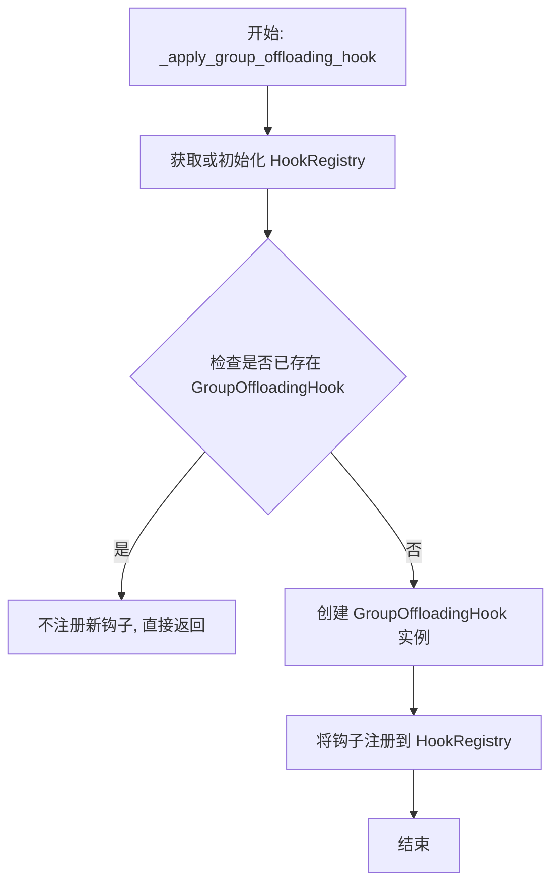

#### 带注释源码

```python
def _apply_group_offloading_hook(
    module: torch.nn.Module,
    group: ModuleGroup,
    *,
    config: GroupOffloadingConfig,
) -> None:
    """
    为指定模块注册分组卸载钩子。
    
    参数:
        module: 要应用分组卸载的模块。
        group: 包含模块组信息的 ModuleGroup 对象。
        config: GroupOffloadingConfig 配置对象。
    """
    # 获取或初始化模块的 HookRegistry，用于管理该模块上的所有钩子
    registry = HookRegistry.check_if_exists_or_initialize(module)

    # 检查是否已经存在 GroupOffloadingHook
    # 场景：如果模块包含的 torch.nn.Parameter 的父模块已经注册过钩子，
    # 则不应覆盖现有的钩子，以避免重复卸载
    if registry.get_hook(_GROUP_OFFLOADING) is None:
        # 创建新的分组卸载钩子实例
        hook = GroupOffloadingHook(group, config=config)
        # 将钩子注册到注册表中，键名为 _GROUP_OFFLOADING
        registry.register_hook(hook, _GROUP_OFFLOADING)
```


### `_apply_lazy_group_offloading_hook`

该函数用于为模块应用延迟预取组卸载钩子。它结合了 `GroupOffloadingHook` 和 `LazyPrefetchGroupOffloadingHook`，在支持流（streams）的情况下实现延迟预取功能，以便在模型前向传播过程中重叠数据迁移和计算。

参数：

- `module`：`torch.nn.Module`，需要应用延迟预取组卸载钩子的目标模块
- `group`：`ModuleGroup`，包含要管理的模块组的配置信息
- `config`：`GroupOffloadingConfig`（关键字参数），组卸载的全局配置

返回值：`None`，该函数不返回任何值

#### 流程图

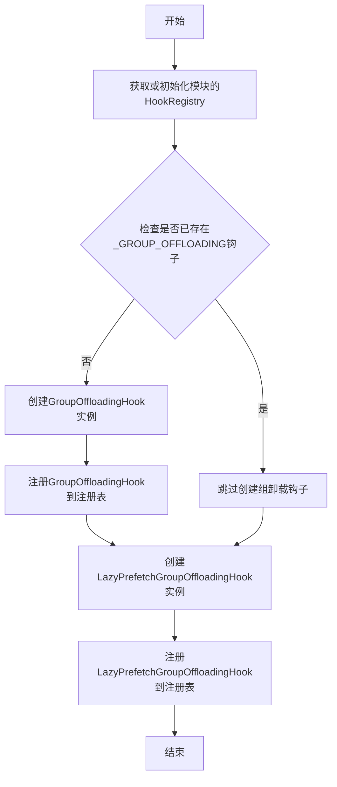

#### 带注释源码

```python
def _apply_lazy_group_offloading_hook(
    module: torch.nn.Module,
    group: ModuleGroup,
    *,
    config: GroupOffloadingConfig,
) -> None:
    r"""
    为模块应用延迟预取组卸载钩子。该函数结合了GroupOffloadingHook和LazyPrefetchGroupOffloadingHook，
    用于在支持流的情况下实现延迟预取功能，允许在当前层计算时预加载下一层的数据，
    从而重叠数据迁移和计算，提高执行效率。
    
    参数:
        module: 要应用钩子的torch.nn.Module实例
        group: ModuleGroup对象，包含要管理的模块组信息
        config: GroupOffloadingConfig对象，包含全局卸载配置
    """
    # 获取或初始化模块的HookRegistry，用于管理所有的钩子
    registry = HookRegistry.check_if_exists_or_initialize(module)

    # 检查是否已经存在组卸载钩子。如果模块已有torch.nn.Parameter的父模块是当前模块，
    # 可能已经注册过组卸载钩子，此时不应覆盖已有的钩子
    if registry.get_hook(_GROUP_OFFLOADING) is None:
        # 创建GroupOffloadingHook实例，负责实际的模块卸载和加载操作
        hook = GroupOffloadingHook(group, config=config)
        # 将组卸载钩子注册到注册表，使用_GROUP_OFFLOADING作为键
        registry.register_hook(hook, _GROUP_OFFLOADING)

    # 创建LazyPrefetchGroupOffloadingHook实例，负责跟踪层执行顺序并设置预取关系
    lazy_prefetch_hook = LazyPrefetchGroupOffloadingHook()
    # 将延迟预取钩子注册到注册表
    registry.register_hook(lazy_prefetch_hook, _LAZY_PREFETCH_GROUP_OFFLOADING)
```


### `_gather_parameters_with_no_group_offloading_parent`

该函数用于收集模块中不属于任何已应用 group offloading 的父模块的参数。它遍历模块的所有命名参数，通过逐层检查参数名称的父模块路径，确定参数是否隶属于某个已配置 group offloading 的模块，最终返回那些"独立"参数的列表（名称, 参数）对。

参数：

- `module`：`torch.nn.Module`，要检查的模块
- `modules_with_group_offloading`：`Set[str]`，已应用 group offloading 的模块名称集合

返回值：`list[torch.nn.Parameter]`，返回没有 group offloading 父模块的参数列表，每个元素是一个元组 (参数名称, 参数对象)

#### 流程图

```mermaid
flowchart TD
    A[开始: 输入 module 和 modules_with_group_offloading] --> B[初始化空列表 parameters]
    B --> C[遍历 module.named_parameters]
    C --> D{还有参数?}
    D -->|是| E[获取参数名称并分割为原子列表 atoms]
    E --> F{atoms 列表长度 > 0?}
    F -->|是| G[取 atoms 组成父模块名称 parent_name]
    G --> H{parent_name 在 modules_with_group_offloading 中?}
    H -->|是| I[设置 has_parent_with_group_offloading = True]
    I --> J[跳出循环]
    H -->|否| K[移除最后一个原子]
    K --> F
    F -->|否| L{has_parent_with_group_offloading 为 False?}
    L -->|是| M[将 (name, parameter) 加入 parameters 列表]
    M --> C
    L -->|否| C
    D -->|否| N[返回 parameters 列表]
```

#### 带注释源码

```python
def _gather_parameters_with_no_group_offloading_parent(
    module: torch.nn.Module, modules_with_group_offloading: Set[str]
) -> list[torch.nn.Parameter]:
    """
    收集没有 group offloading 父模块的参数。
    
    该函数遍历模块的所有参数，检查每个参数的父模块是否在
    已配置 group offloading 的模块集合中。如果参数不属于任何
    已 offloading 的模块，则将其添加到返回列表中。
    
    Args:
        module: 要检查的 PyTorch 模块
        modules_with_group_offloading: 已应用 group offloading 的模块名称集合
    
    Returns:
        返回没有 group offloading 父模块的参数列表，每个元素为 (参数名称, 参数对象) 元组
    """
    parameters = []
    
    # 遍历模块的所有命名参数
    for name, parameter in module.named_parameters():
        has_parent_with_group_offloading = False
        
        # 将参数名称分割为原子列表
        # 例如: "block.0.weight" -> ["block", "0", "weight"]
        atoms = name.split(".")
        
        # 逐层向上检查父模块名称
        # 从完整名称开始，逐步减少原子数量
        while len(atoms) > 0:
            # 重新组合为父模块名称
            # ["block", "0", "weight"] -> "block.0.weight"
            # ["block", "0"] -> "block.0"
            # ["block"] -> "block"
            parent_name = ".".join(atoms)
            
            # 检查该父模块是否在 group offloading 集合中
            if parent_name in modules_with_group_offloading:
                has_parent_with_group_offloading = True
                break
            
            # 移除最后一个原子，向上查找父模块
            atoms.pop()
        
        # 如果参数不属于任何已 offloading 的模块，添加到结果列表
        if not has_parent_with_group_offloading:
            parameters.append((name, parameter))
    
    return parameters
```


### `_gather_buffers_with_no_group_offloading_parent`

该函数用于收集模块中那些没有分组卸载父模块的缓冲区（buffers）。它遍历模块的所有缓冲区，检查每个缓冲区的父模块是否在已应用分组卸载的模块集合中，如果不在，则将其添加到返回列表中。这主要用于确保顶层模块的缓冲区能够被正确地卸载和加载。

参数：

- `module`：`torch.nn.Module`，要检查的模块
- `modules_with_group_offloading`：`Set[str]`，已应用分组卸载的模块名称集合

返回值：`list[torch.Tensor]`，返回缓冲区名称和缓冲区对象的元组列表

#### 流程图

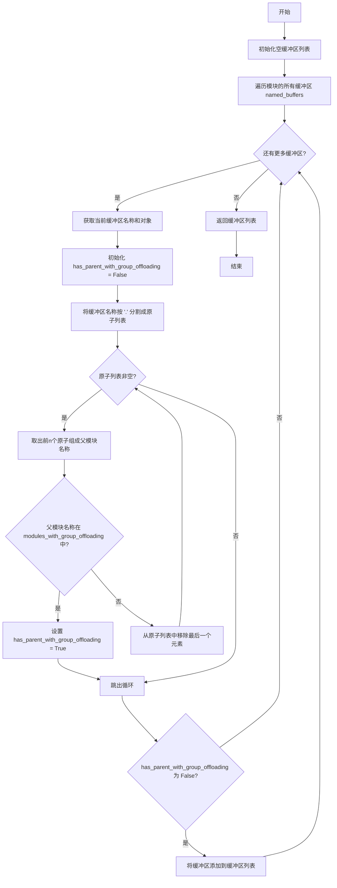

#### 带注释源码

```python
def _gather_buffers_with_no_group_offloading_parent(
    module: torch.nn.Module, modules_with_group_offloading: Set[str]
) -> list[torch.Tensor]:
    """
    收集没有分组卸载父模块的缓冲区。
    
    该函数遍历模块的所有缓冲区，检查每个缓冲区的父模块是否在已应用
    分组卸载的模块集合中。如果父模块不在该集合中，则将缓冲区添加到
    返回列表中。这用于确保顶层模块的缓冲区能够被正确处理。
    
    参数:
        module: 要检查的模块
        modules_with_group_offloading: 已应用分组卸载的模块名称集合
    
    返回:
        缓冲区名称和缓冲区对象的元组列表
    """
    buffers = []
    # 遍历模块的所有缓冲区（包括命名缓冲区）
    for name, buffer in module.named_buffers():
        has_parent_with_group_offloading = False
        # 将缓冲区名称分割成原子列表，如 'block.0.weight' -> ['block', '0', 'weight']
        atoms = name.split(".")
        
        # 逐层向上查找父模块，检查是否有分组卸载的父模块
        while len(atoms) > 0:
            # 每次取出前面所有原子组成父模块名称，如 ['block', '0', 'weight'] -> 'block.0'
            parent_name = ".".join(atoms)
            
            # 检查父模块是否在分组卸载模块集合中
            if parent_name in modules_with_group_offloading:
                has_parent_with_group_offloading = True
                break
            
            # 移除最后一个原子，继续检查更上层的父模块
            atoms.pop()
        
        # 如果没有找到有分组卸载的父模块，则添加到列表中
        if not has_parent_with_group_offloading:
            buffers.append((name, buffer))
    
    return buffers
```


### `_find_parent_module_in_module_dict`

该函数用于在模块字典中查找给定参数或缓冲区的最近父模块。它通过从完整名称开始，逐步移除名称的最后一个部分，直到在模块字典中找到匹配的模块。

参数：

- `name`：`str`，参数或缓冲区的完整名称（例如 "block.0.weight"）
- `module_dict`：`dict[str, torch.nn.Module]`，模块名字典，键为模块名称，值为 torch.nn.Module 对象

返回值：`str`，返回找到的父模块名称，如果未找到则返回空字符串

#### 流程图

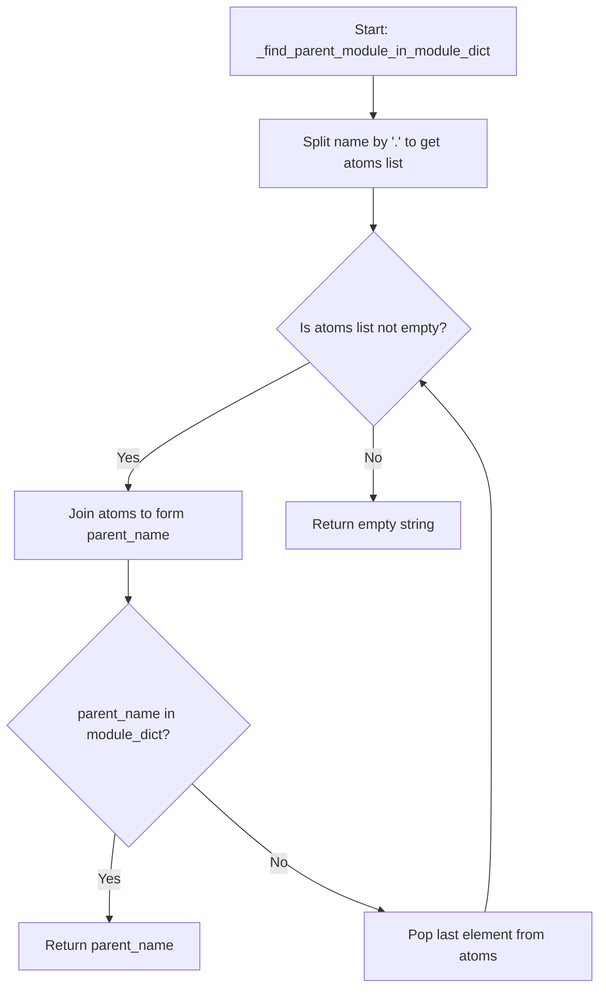

#### 带注释源码

```python
def _find_parent_module_in_module_dict(name: str, module_dict: dict[str, torch.nn.Module]) -> str:
    r"""
    在模块字典中查找给定参数/缓冲区的最近父模块。
    
    该函数用于在叶级分组卸载场景中，为没有父模块的参数和缓冲区找到
    最近的祖先模块，以便为其附加分组卸载钩子。
    
    Args:
        name: 参数或缓冲区的完整名称，例如 "block.0.attn.weight"
        module_dict: 模块名字典，键为模块名称，值为 torch.nn.Module 对象
    
    Returns:
        找到的最近父模块名称，如果未找到则返回空字符串
    """
    # 将名称按 "." 分割成部分，例如 "block.0.weight" -> ["block", "0", "weight"]
    atoms = name.split(".")
    
    # 循环尝试找到最近的父模块
    while len(atoms) > 0:
        # 将当前的部分重新拼接成模块名
        # 第一次: "block.0.weight", 第二次: "block.0", 第三次: "block"
        parent_name = ".".join(atoms)
        
        # 检查该父模块名是否在模块字典中
        if parent_name in module_dict:
            # 找到匹配的父模块，返回其名称
            return parent_name
        
        # 未找到，移除最后一个部分，继续尝试更短的路径
        atoms.pop()
    
    # 如果遍历完所有可能的父模块名都未找到，返回空字符串
    return ""
```


### `_raise_error_if_accelerate_model_or_sequential_hook_present`

该函数用于验证目标模块是否已经应用了来自 Accelerate 库的其他卸载策略（`AlignDevicesHook` 或 `CpuOffload`），如果检测到冲突的 hook，则抛出 `ValueError` 异常，以防止同时应用多种不同的模型卸载策略。

参数：

- `module`：`torch.nn.Module`，需要进行检查的 PyTorch 模块

返回值：`None`，该函数不返回任何值，仅在检测到冲突时抛出异常

#### 流程图

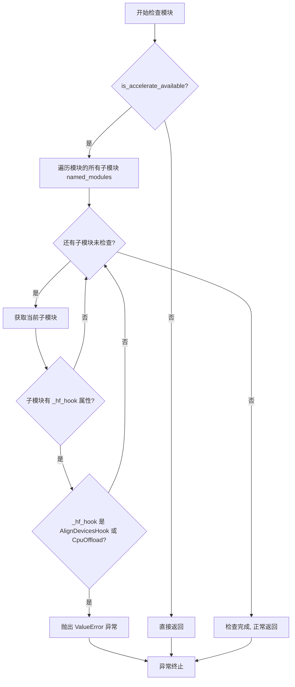

#### 带注释源码

```python
def _raise_error_if_accelerate_model_or_sequential_hook_present(module: torch.nn.Module) -> None:
    """
    检查模块是否已经应用了来自 Accelerate 的模型卸载或顺序卸载 hook。
    
    该函数会在应用 group offloading 之前被调用，用于防止与 Accelerate 库中已存在的
    卸载策略（如 AlignDevicesHook 和 CpuOffload）产生冲突。如果检测到冲突的 hook，
    会抛出 ValueError 以阻止用户同时使用两种不同的卸载策略。
    
    参数:
        module (torch.nn.Module): 需要进行检查的 PyTorch 模块
        
    返回:
        None: 该函数不返回值，仅在检测到冲突时抛出异常
        
    异常:
        ValueError: 当模块的某个子模块已经应用了 AlignDevicesHook 或 CpuOffload 时抛出
    """
    # 首先检查 accelerate 库是否可用，如果不可用则直接返回（无需检查）
    if not is_accelerate_available():
        return
    
    # 遍历模块的所有子模块（包括模块本身）
    for name, submodule in module.named_modules():
        # 检查子模块是否具有 _hf_hook 属性（这是 Accelerate 库添加的 hook 属性）
        if not hasattr(submodule, "_hf_hook"):
            continue
        
        # 检查该 hook 是否为 Accelerate 库中的冲突策略类型
        # AlignDevicesHook: 用于模型级别的设备对齐和卸载
        # CpuOffload: 用于顺序 CPU 卸载
        if isinstance(submodule._hf_hook, (AlignDevicesHook, CpuOffload)):
            # 抛出详细的错误信息，指出冲突的模块名称和类型
            raise ValueError(
                f"Cannot apply group offloading to a module that is already applying an alternative "
                f"offloading strategy from Accelerate. If you want to apply group offloading, please "
                f"disable the existing offloading strategy first. Offending module: {name} ({type(submodule)})"
            )
```


### `_get_top_level_group_offload_hook`

该函数是一个私有辅助函数，用于在给定模块的整个模块树中查找并返回最早注册的 GroupOffloadingHook 实例。它通过遍历模块的所有子模块，检查每个子模块是否具有 `_diffusers_hook` 属性，并从该属性中获取组卸载钩子。如果找到任何有效的 GroupOffloadingHook，则立即返回；否则返回 None。

参数：

- `module`：`torch.nn.Module`，需要在其子模块树中搜索组卸载钩子的目标模块

返回值：`GroupOffloadingHook | None`，返回找到的第一个 GroupOffloadingHook 实例，如果未找到则返回 None

#### 流程图

```mermaid
flowchart TD
    A[开始] --> B[遍历 module.modules()]
    B --> C{还有子模块未遍历?}
    C -->|是| D{当前子模块有 _diffusers_hook 属性?}
    C -->|否| G[返回 None]
    D -->|否| B
    D -->|是| E[尝试获取 _GROUP_OFFLOADING 钩子]
    E --> F{获取到的钩子不为 None?}
    F -->|否| B
    F -->|是| H[返回该 GroupOffloadingHook]
    I[结束] --> H
    
    style A fill:#f9f,color:#333
    style H fill:#9f9,color:#333
    style G fill:#f99,color:#333
```

#### 带注释源码

```python
def _get_top_level_group_offload_hook(module: torch.nn.Module) -> GroupOffloadingHook | None:
    """
    在模块及其所有子模块中查找并返回第一个 GroupOffloadingHook。
    
    该函数遍历给定模块的整个模块树（包括模块本身及其所有子模块），
    查找第一个注册了组卸载钩子的子模块。一旦找到有效的钩子就立即返回，
    这确保了返回的是"顶级"或"最早注册"的钩子。
    
    Args:
        module: 需要搜索的 torch.nn.Module 实例
        
    Returns:
        找到的第一个 GroupOffloadingHook 实例，如果未找到则返回 None
    """
    # 遍历模块的所有子模块（包括模块本身）
    for submodule in module.modules():
        # 检查当前子模块是否具有 _diffusers_hook 属性
        # 这是 diffusers 框架用于存储钩子注册表的内部属性
        if hasattr(submodule, "_diffusers_hook"):
            # 从子模块的钩子注册表中获取 _GROUP_OFFLOADING 钩子
            group_offloading_hook = submodule._diffusers_hook.get_hook(_GROUP_OFFLOADING)
            # 如果成功获取到钩子（不为 None），立即返回
            if group_offloading_hook is not None:
                return group_offloading_hook
    # 遍历完所有子模块均未找到组卸载钩子，返回 None
    return None
```


### `_is_group_offload_enabled`

检查给定模块是否启用了组卸载（group offloading）功能。

参数：

- `module`：`torch.nn.Module`，需要检查的PyTorch模块

返回值：`bool`，如果模块启用了组卸载则返回`True`，否则返回`False`

#### 流程图

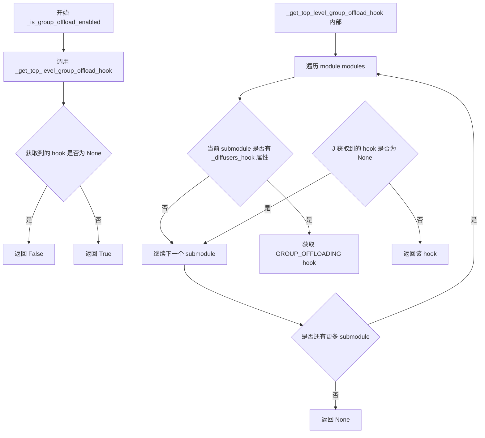

#### 带注释源码

```python
def _is_group_offload_enabled(module: torch.nn.Module) -> bool:
    """
    检查给定模块是否启用了组卸载（group offloading）功能。
    
    该函数通过获取顶层组卸载hook来判断模块是否启用了组卸载。
    如果存在顶层hook，则说明组卸载已启用。
    
    Args:
        module (torch.nn.Module): 需要检查的PyTorch模块
        
    Returns:
        bool: 如果模块启用了组卸载返回True，否则返回False
    """
    # 调用内部函数获取顶层组卸载hook
    top_level_group_offload_hook = _get_top_level_group_offload_hook(module)
    # 如果hook存在且不为None，说明组卸载已启用
    return top_level_group_offload_hook is not None


def _get_top_level_group_offload_hook(module: torch.nn.Module) -> GroupOffloadingHook | None:
    """
    获取模块的顶层组卸载hook。
    
    遍历模块的所有子模块，查找第一个注册了GROUP_OFFLOADING hook的子模块，
    并返回该hook。这通常对应于顶层模块的组卸载配置。
    
    Args:
        module (torch.nn.Module): 要查找hook的PyTorch模块
        
    Returns:
        GroupOffloadingHook | None: 找到的顶层hook，如果不存在则返回None
    """
    # 遍历模块的所有子模块（包括模块本身）
    for submodule in module.modules():
        # 检查子模块是否有diffusers_hook属性（HookRegistry）
        if hasattr(submodule, "_diffusers_hook"):
            # 从hook注册表中获取GROUP_OFFLOADING类型的hook
            group_offloading_hook = submodule._diffusers_hook.get_hook(_GROUP_OFFLOADING)
            # 如果找到了group offloading hook，返回它
            if group_offloading_hook is not None:
                return group_offloading_hook
    # 没有找到任何组卸载hook，返回None
    return None
```


### `_get_group_onload_device`

获取已启用组卸载（Group Offloading）的模块的目标设备（onload device）。该函数首先查找模块的顶层组卸载钩子，如果找到则返回其配置中指定的目标设备，否则抛出异常。

参数：

- `module`：`torch.nn.Module`，需要获取 onload 设备的模块

返回值：`torch.device`，模块在执行时会被加载到的目标设备

#### 流程图

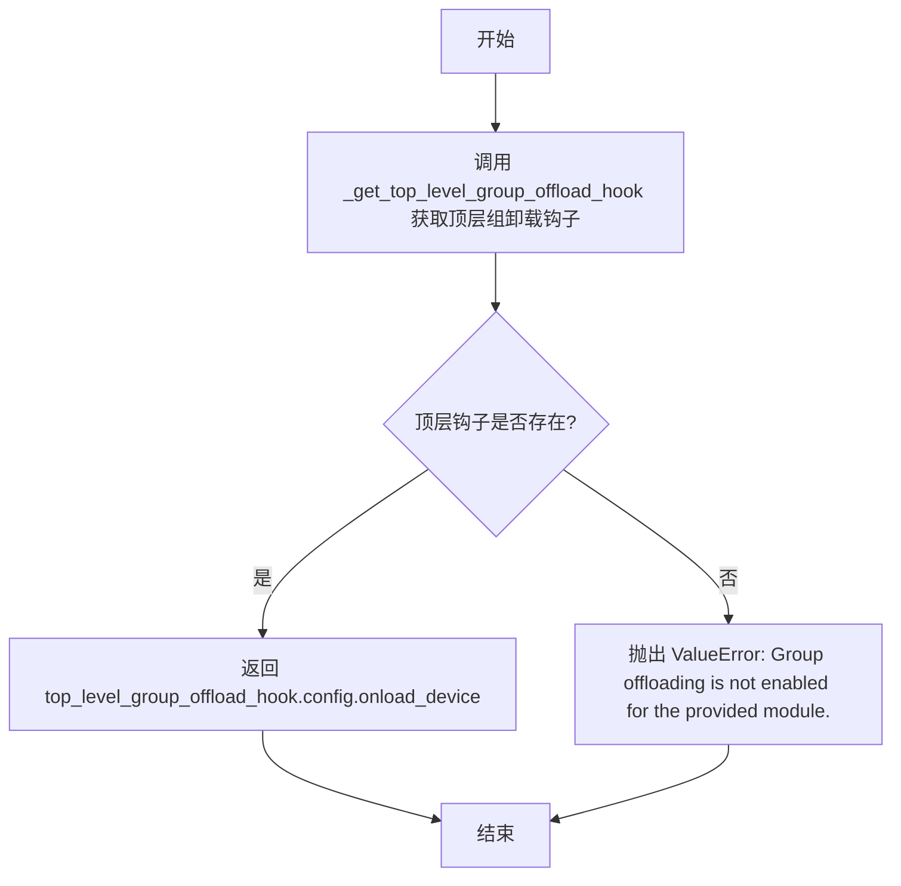

#### 带注释源码

```python
def _get_group_onload_device(module: torch.nn.Module) -> torch.device:
    """
    获取模块的 onload 设备。
    
    当组卸载（Group Offloading）被启用时，模块的参数和缓冲区会被卸载到 CPU 或其他设备，
    在前向传播时再加载回计算设备。此函数返回模块实际执行时所在的设备。
    
    Args:
        module: 需要查询的 torch.nn.Module 实例
        
    Returns:
        torch.device: 模块被加载到的目标设备（通常是 CUDA 设备）
        
    Raises:
        ValueError: 如果模块未启用组卸载
    """
    # 获取模块的顶层组卸载钩子
    top_level_group_offload_hook = _get_top_level_group_offload_hook(module)
    
    # 如果找到了顶层钩子，说明启用了组卸载
    if top_level_group_offload_hook is not None:
        # 从钩子的配置中获取 onload_device 并返回
        return top_level_group_offload_hook.config.onload_device
    
    # 如果没有找到顶层钩子，说明未启用组卸载，抛出异常
    raise ValueError("Group offloading is not enabled for the provided module.")
```


### `_compute_group_hash`

该函数用于根据组标识符生成唯一的短哈希值，以便在将模块组卸载到磁盘时创建唯一的文件名。它使用SHA-256哈希算法，并将结果截断为前16个字符，以获得合理简短但唯一的名称。

参数：

- `group_id`：`str`，需要进行哈希处理的组标识符（通常是基于模块名称和索引构建的字符串）

返回值：`str`，返回SHA-256哈希值的前16个字符，用作唯一的文件名标识

#### 流程图

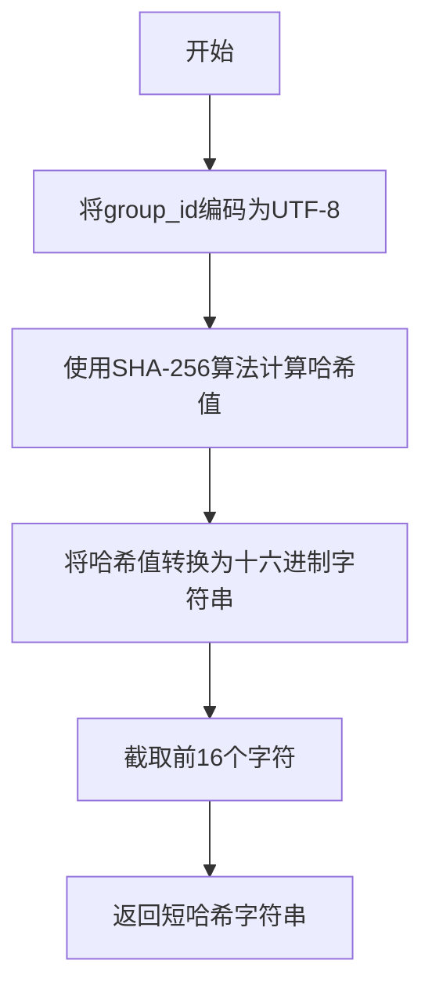

#### 带注释源码

```python
def _compute_group_hash(group_id):
    """
    计算组的短哈希值，用于生成唯一的文件名。
    
    Args:
        group_id (str): 组的唯一标识符，通常由模块名称和索引组成
        
    Returns:
        str: SHA-256哈希值的前16个字符
    """
    # 使用SHA-256算法对group_id进行哈希处理
    hashed_id = hashlib.sha256(group_id.encode("utf-8")).hexdigest()
    # 取前16个字符，生成一个相对简短但仍能保证唯一性的文件名标识
    # 这样可以避免文件名过长，同时保持低冲突率
    return hashed_id[:16]
```


### `_maybe_remove_and_reapply_group_offloading`

该函数是一个模块级的工具函数，用于在模型发生内部修改（如 QKV 融合、LoRA 动态卸载/加载）后，重置模型上的组卸载（Group Offloading）钩子。由于这些修改会改变底层张量或模块的引用，原有的钩子可能指向旧的张量或已失效的模块。该函数通过移除旧的钩子并根据保存的配置重新应用钩子，确保后续推理时数据能正确地在 CPU 和设备间传输。

参数：
-  `module`：`torch.nn.Module`，顶层模块，即最初应用组卸载的模块。

返回值：`None`，该函数直接修改传入的 `module` 及其子模块的钩子状态，无返回值。

#### 流程图

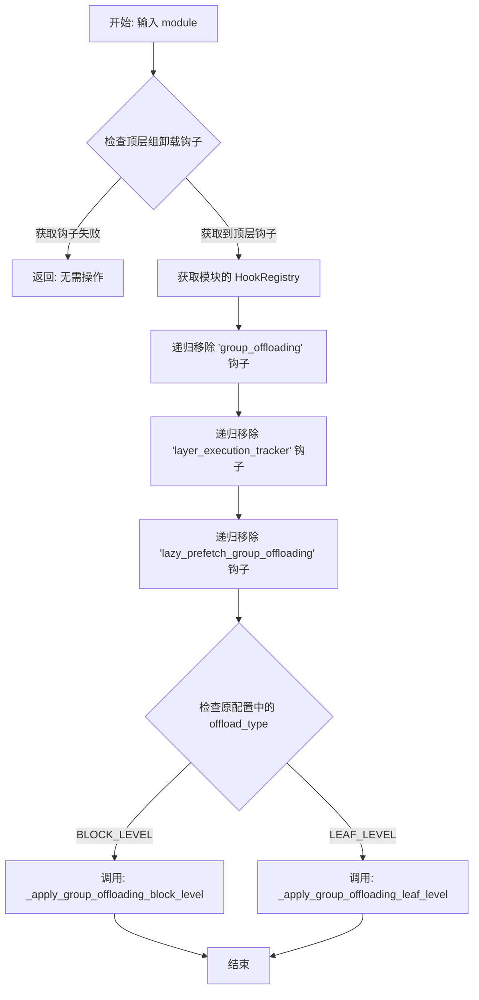

#### 带注释源码

```python
def _maybe_remove_and_reapply_group_offloading(module: torch.nn.Module) -> None:
    r"""
    Removes the group offloading hook from the module and re-applies it. This is useful when the module has been
    modified in-place and the group offloading hook references-to-tensors needs to be updated. The in-place
    modification can happen in a number of ways, for example, fusing QKV or unloading/loading LoRAs on-the-fly.

    In this implementation, we make an assumption that group offloading has only been applied at the top-level module,
    and therefore all submodules have the same onload and offload devices. If this assumption is not true, say in the
    case where user has applied group offloading at multiple levels, this function will not work as expected.

    There is some performance penalty associated with doing this when non-default streams are used, because we need to
    retrace the execution order of the layers with `LazyPrefetchGroupOffloadingHook`.
    """
    # 1. 查找当前模块是否应用了组卸载。遍历子模块找到最顶层的 GroupOffloadingHook。
    top_level_group_offload_hook = _get_top_level_group_offload_hook(module)

    # 2. 如果没有找到钩子（例如从未启用过组卸载），则直接返回，不做任何操作。
    if top_level_group_offload_hook is None:
        return

    # 3. 获取该模块的 HookRegistry 注册表，用于管理所有的钩子。
    registry = HookRegistry.check_if_exists_or_initialize(module)
    
    # 4. 递归移除所有相关的钩子。这是为了清理旧的引用，防止内存泄漏或逻辑错误。
    #    - _GROUP_OFFLOADING: 核心的组卸载钩子。
    #    - _LAYER_EXECUTION_TRACKER: 用于追踪层执行顺序的钩子（仅在流式预取时存在）。
    #    - _LAZY_PREFETCH_GROUP_OFFLOADING: 懒加载预取钩子（用于流式传输优化）。
    registry.remove_hook(_GROUP_OFFLOADING, recurse=True)
    registry.remove_hook(_LAYER_EXECUTION_TRACKER, recurse=True)
    registry.remove_hook(_LAZY_PREFETCH_GROUP_OFFLOADING, recurse=True)

    # 5. 重新应用组卸载逻辑。我们使用之前保存的 config (包含设备、流、块大小等信息) 重新初始化钩子。
    #    这样可以确保新的模块结构（或修改后的张量）被新的钩子正确捕获。
    _apply_group_offloading(module, top_level_group_offload_hook.config)
```


### `ModuleGroup._init_cpu_param_dict`

该方法用于初始化CPU参数字典，将模块的参数和缓冲区数据预加载到CPU内存中，以便在流式数据传输时使用。如果未启用流式传输（stream为None），则直接返回空字典。

参数：无（仅使用实例属性 `self.modules`、`self.parameters`、`self.buffers`、`self.stream`、`self.low_cpu_mem_usage`）

返回值：`dict[torch.nn.Parameter | torch.Tensor, torch.Tensor]`，返回将原始参数/缓冲区映射到其CPU副本的字典

#### 流程图

```mermaid
flowchart TD
    A[开始 _init_cpu_param_dict] --> B{self.stream is None?}
    B -->|是| C[返回空字典 cpu_param_dict]
    B -->|否| D[遍历 self.modules]
    D --> E[对每个module, 遍历其parameters]
    E --> F{cpu_param_dict[param] = param.data.cpu if low_cpu_mem_usage else param.data.cpu.pin_memory}
    F --> G[对每个module, 遍历其buffers]
    G --> H{cpu_param_dict[buffer] = buffer.data.cpu if low_cpu_mem_usage else buffer.data.cpu.pin_memory}
    H --> I[遍历 self.parameters]
    I --> J{cpu_param_dict[param] = param.data.cpu if low_cpu_mem_usage else param.data.cpu.pin_memory}
    J --> K[遍历 self.buffers]
    K --> L{cpu_param_dict[buffer] = buffer.data.cpu if low_cpu_mem_usage else buffer.data.cpu.pin_memory}
    L --> M[返回 cpu_param_dict]
    C --> M
```

#### 带注释源码

```python
def _init_cpu_param_dict(self):
    """
    初始化CPU参数字典，用于流式传输时的数据预加载。
    只有当使用了stream（流）时才需要预加载数据到CPU内存。
    """
    # 创建空的CPU参数字典
    cpu_param_dict = {}
    
    # 如果没有使用流式传输，直接返回空字典
    # 这意味着不需要预先将数据加载到CPU
    if self.stream is None:
        return cpu_param_dict

    # 遍历模块组中的所有模块，将它们的参数和缓冲区复制到CPU
    for module in self.modules:
        # 处理模块的参数：将每个参数的数据复制到CPU
        for param in module.parameters():
            # 根据low_cpu_mem_usage决定是否使用pinned memory
            # pinned memory可以加速后续到GPU的异步传输
            cpu_param_dict[param] = param.data.cpu() if self.low_cpu_mem_usage else param.data.cpu().pin_memory()
        
        # 处理模块的缓冲区：将每个缓冲区的数据复制到CPU
        for buffer in module.buffers():
            cpu_param_dict[buffer] = (
                buffer.data.cpu() if self.low_cpu_mem_usage else buffer.data.cpu().pin_memory()
            )

    # 处理额外传递的参数列表（不属于任何模块的参数）
    for param in self.parameters:
        cpu_param_dict[param] = param.data.cpu() if self.low_cpu_mem_usage else param.data.cpu().pin_memory()

    # 处理额外传递的缓冲区列表
    for buffer in self.buffers:
        cpu_param_dict[buffer] = buffer.data.cpu() if self.low_cpu_mem_usage else buffer.data.cpu().pin_memory()

    # 返回包含所有参数和缓冲区CPU副本的字典
    return cpu_param_dict
```


### `ModuleGroup._pinned_memory_tensors`

这是一个上下文管理器方法，用于在异步流式数据传输场景下创建并管理固定内存(pinned memory)的张量字典。它会将 `cpu_param_dict` 中的张量转换为固定内存张量，以便实现 CPU 和 GPU 之间的高效异步数据传输，并在上下文退出时清理资源。

参数：

- 无显式参数（仅使用 `self`）

返回值：`Dict[torch.nn.Parameter, torch.Tensor]`，返回一个字典，将参数/缓冲区映射到其固定内存版本的张量，供异步数据传输使用

#### 流程图

```mermaid
flowchart TD
    A[开始 _pinned_memory_tensors 上下文] --> B{创建 pinned_dict}
    B --> C{遍历 cpu_param_dict 中的每个 param, tensor}
    C --> D{tensor.is_pinned()?}
    D -->|Yes| E[返回原 tensor]
    D -->|No| F[调用 tensor.pin_memory()]
    E --> G[构建 pinned_dict 字典]
    F --> G
    G --> H{yield pinned_dict}
    H --> I[上下文体执行完成]
    I --> J{finally 块}
    J --> K[pinned_dict = None]
    K --> L[结束上下文]
```

#### 带注释源码

```python
@contextmanager
def _pinned_memory_tensors(self):
    """
    上下文管理器，用于创建和管理固定内存(pinned memory)的张量字典。
    
    固定内存张量允许 CPU 和 GPU 之间进行异步数据传输（通过 CUDA 流），
    这可以显著提高数据传输效率，因为数据在传输过程中不会阻塞主线程。
    
    使用场景：
        - 当 use_stream=True 时，在异步将数据从 CPU 传输到 GPU 之前调用
        - 与 _onload_from_memory 方法配合使用
    
    Returns:
        Dict[Parameter, Tensor]: 一个字典，将原始参数/缓冲区映射到其固定内存版本
    """
    try:
        # 遍历 cpu_param_dict 中的所有参数和缓冲区
        # cpu_param_dict 存储了 CPU 端的参数/缓冲区副本
        pinned_dict = {
            param: tensor.pin_memory() if not tensor.is_pinned() else tensor
            for param, tensor in self.cpu_param_dict.items()
        }
        # 如果张量已经是固定内存的，直接返回原张量，避免重复操作
        # 否则调用 pin_memory() 将张量固定到页面锁定的内存中
        yield pinned_dict  # 将固定内存字典提供给调用者使用
    finally:
        # 清理引用，帮助垃圾回收
        pinned_dict = None
```


### `ModuleGroup._transfer_tensor_to_device`

该方法负责将张量数据从源设备（CPU）异步传输到目标设备（GPU/加速设备），并在启用流记录时标记张量的使用流。

参数：

- `self`：ModuleGroup 实例本身
- `tensor`：`torch.Tensor`，目标张量，需要被加载数据的张量对象
- `source_tensor`：`torch.Tensor`，源张量，包含要传输数据的张量（通常位于 CPU）
- `default_stream`：`torch.cuda.Stream | torch.Stream | None`，用于流记录的 CUDA/ torch 流，当 `record_stream` 为 True 时使用

返回值：`None`，该方法无返回值，直接修改 `tensor.data`

#### 流程图

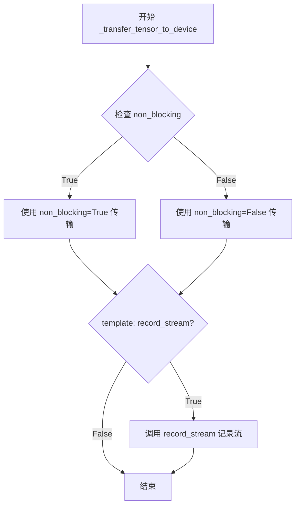

#### 带注释源码

```python
def _transfer_tensor_to_device(self, tensor, source_tensor, default_stream):
    """
    将源张量的数据转移到目标设备上。
    
    参数:
        tensor: 目标张量，其 data 属性将被更新
        source_tensor: 源张量，数据来源于此
        default_stream: 用于流记录的流对象
    """
    # 使用 .to() 方法将源张量数据转移到 onload_device（通常是 GPU）
    # non_blocking 参数控制是否使用非阻塞传输（异步）
    tensor.data = source_tensor.to(self.onload_device, non_blocking=self.non_blocking)
    
    # 如果启用了流记录，则将张量标记为已被 default_stream 使用
    # 这对于异步操作和正确的资源管理很重要
    if self.record_stream:
        tensor.data.record_stream(default_stream)
```


### `ModuleGroup._process_tensors_from_modules`

该方法负责将模块组（ModuleGroup）中的所有参数（parameters）和缓冲区（buffers）从 CPU 内存传输到目标设备（onload_device），支持从固定内存（pinned_memory）传输或在流（stream）环境下进行异步传输。

参数：

- `pinned_memory`：`dict[torch.nn.Parameter, torch.Tensor] | None`，可选参数，包含从 CPU 固定内存中存储的参数和缓冲区的字典。如果为 `None`，则直接从参数的 `.data` 属性读取数据。
- `default_stream`：`torch.cuda.Stream | torch.Stream | None`，可选参数，指定用于异步数据传输的 CUDA 流。当使用流进行数据传输时，用于记录张量的使用历史。

返回值：`None`，该方法直接修改模块组中参数和缓冲区的数据，不返回任何值。

#### 流程图

```mermaid
flowchart TD
    A[开始 _process_tensors_from_modules] --> B{pinned_memory 是否为 None?}
    B -->|是| C[使用 param.data/buffer.data 作为源]
    B -->|否| D[使用 pinned_memory[param]/pinned_memory[buffer] 作为源]
    
    C --> E[遍历 group_module in self.modules]
    D --> E
    
    E --> F[遍历 group_module 的 parameters]
    F --> G{还有 parameter?}
    G -->|是| H[调用 _transfer_tensor_to_device]
    G -->|否| I[遍历 group_module 的 buffers]
    
    H --> I
    I --> J{还有 buffer?}
    J -->|是| K[调用 _transfer_tensor_to_device]
    J -->|否| L{还有 group_module?}
    
    K --> L
    L -->|是| F
    L -->|否| M[遍历 self.parameters]
    
    M --> N{还有 param?}
    N -->|是| O[调用 _transfer_tensor_to_device]
    N -->|否| P[遍历 self.buffers]
    
    O --> P
    P --> Q{还有 buffer?}
    Q -->|是| R[调用 _transfer_tensor_to_device]
    Q -->|否| S[结束]
    
    R --> Q
    
    subgraph _transfer_tensor_to_device
        T[将 tensor.data 设置为 source 转换到 onload_device] --> U{record_stream 为 True?}
        U -->|是| V[record_stream 记录 default_stream]
        U -->|否| S
    end
    
    H --> T
    K --> T
    O --> T
    R --> T
```

#### 带注释源码

```python
def _process_tensors_from_modules(self, pinned_memory=None, default_stream=None):
    """
    将模块组中的所有参数和缓冲区传输到 onload_device。
    
    处理流程：
    1. 首先处理 self.modules 中每个模块的参数和缓冲区
    2. 然后处理直接附加到模块组的参数（self.parameters）
    3. 最后处理直接附加到模块组的缓冲区（self.buffers）
    
    Args:
        pinned_memory: 可选字典，键为参数/缓冲区，值为已固定到页锁定内存的 CPU 张量。
                      如果提供，将使用这些张量作为数据传输源，避免重复 CPU->GPU 传输。
        default_stream: 可选 CUDA 流，用于在异步传输时记录张量使用历史。
    
    Returns:
        None: 直接修改传入的参数和缓冲区的 .data 属性，不返回任何值。
    """
    # 步骤1：遍历模块组中的每个模块
    for group_module in self.modules:
        # 处理当前模块的所有参数
        for param in group_module.parameters():
            # 确定数据源：如果提供了 pinned_memory，使用固定内存中的副本；否则使用原始 param.data
            source = pinned_memory[param] if pinned_memory else param.data
            # 将参数数据传输到目标设备
            self._transfer_tensor_to_device(param, source, default_stream)
        
        # 处理当前模块的所有缓冲区
        for buffer in group_module.buffers():
            source = pinned_memory[buffer] if pinned_memory else buffer.data
            self._transfer_tensor_to_device(buffer, source, default_stream)

    # 步骤2：处理直接附加到模块组的参数（这些参数不属于任何子模块）
    for param in self.parameters:
        source = pinned_memory[param] if pinned_memory else param.data
        self._transfer_tensor_to_device(param, source, default_stream)

    # 步骤3：处理直接附加到模块组的缓冲区
    for buffer in self.buffers:
        source = pinned_memory[buffer] if pinned_memory else buffer.data
        self._transfer_tensor_to_device(buffer, source, default_stream)
```


### `ModuleGroup._onload_from_disk`

该方法负责将之前卸载到磁盘（通过 safetensors 文件）的张量数据重新加载回目标设备（通常是 GPU）。它支持同步和异步（流）两种加载模式：在异步模式下，会先同步之前的流，加载到 CPU 并固定内存后异步复制到目标设备；在同步模式下，则直接从磁盘加载到目标设备。

参数：

- `self`：`ModuleGroup` 自身实例，无需显式传递

返回值：`None`，该方法直接修改实例内部的张量数据，不返回任何值

#### 流程图

```mermaid
flowchart TD
    A[开始 _onload_from_disk] --> B{self.stream is not None?}
    B -->|Yes| C[同步之前的流: self.stream.synchronize]
    B -->|No| D[设置 context = nullcontext]
    C --> E[设置 context = torch.accelerator_module.stream]
    D --> E
    E --> F[设置 current_stream]
    F --> G{self.stream is not None?}
    G -->|Yes| H[device = 'cpu']
    G -->|No| I[device = str(self.onload_device)]
    H --> J[加载 safetensors 文件到 CPU]
    I --> K[加载 safetensors 文件到目标设备]
    J --> L{遍历 key_to_tensor}
    K --> M[直接赋值给 tensor_obj.data]
    L -->|Yes| N[固定内存并异步复制到目标设备]
    L -->|No| O[结束]
    N --> P{self.record_stream?}
    P -->|Yes| Q[record_stream 记录当前流]
    P -->|No| L
    Q --> L
```

#### 带注释源码

```python
def _onload_from_disk(self):
    """
    将保存在磁盘上的张量重新加载到目标设备。
    支持两种模式：流式异步加载和直接同步加载。
    """
    
    # 如果使用了流，先等待之前的 Host->Device 传输完成
    if self.stream is not None:
        self.stream.synchronize()

    # 根据是否使用流来创建上下文管理器
    # 如果有流，使用 accelerator 的 stream；否则使用 nullcontext（空上下文）
    context = nullcontext() if self.stream is None else self._torch_accelerator_module.stream(self.stream)
    
    # 如果需要记录流，获取当前流；否则为 None
    current_stream = self._torch_accelerator_module.current_stream() if self.record_stream else None

    with context:
        # 确定加载目标设备：
        # - 如果使用流，先加载到 CPU（因为需要先固定内存再异步传输）
        # - 如果不使用流，直接加载到目标设备
        device = str(self.onload_device) if self.stream is None else "cpu"
        
        # 使用 safetensors 库从磁盘加载张量文件
        loaded_tensors = safetensors.torch.load_file(self.safetensors_file_path, device=device)

        if self.stream is not None:
            # ===== 流式异步加载模式 =====
            # 遍历需要恢复的每个张量
            for key, tensor_obj in self.key_to_tensor.items():
                # 固定内存以加速后续的异步传输
                pinned_tensor = loaded_tensors[key].pin_memory()
                
                # 异步复制到目标设备
                tensor_obj.data = pinned_tensor.to(self.onload_device, non_blocking=self.non_blocking)
                
                # 如果需要记录流，则标记该张量被当前流使用
                # 这对于确保在异步操作完成前张量不被释放很重要
                if self.record_stream:
                    tensor_obj.data.record_stream(current_stream)
        else:
            # ===== 直接同步加载模式 =====
            # 获取目标设备的字符串表示
            onload_device = (
                self.onload_device.type if isinstance(self.onload_device, torch.device) else self.onload_device
            )
            
            # 直接从磁盘加载到目标设备（重新加载，因为上面的 load_file 可能使用了不同的 device）
            loaded_tensors = safetensors.torch.load_file(self.safetensors_file_path, device=onload_device)
            
            # 将加载的张量直接赋值给对应的参数/缓冲区
            for key, tensor_obj in self.key_to_tensor.items():
                tensor_obj.data = loaded_tensors[key]
```


### `ModuleGroup._onload_from_memory`

该方法负责将之前卸载到内存（CPU）的参数和缓冲区重新加载回目标设备（通常是GPU）。它处理同步和流管理，以确保数据正确地从CPU内存传输到加速器设备。

参数： 无（仅包含 self 参数）

返回值：`None`，该方法无返回值，通过修改对象的内部状态来完成任务

#### 流程图

```mermaid
flowchart TD
    A[开始 _onload_from_memory] --> B{self.stream is not None?}
    B -- 是 --> C[self.stream.synchronize]
    B -- 否 --> D[不进行同步]
    C --> E{self.stream is not None?}
    D --> E
    E -- 是 --> F[创建 pinned_memory context<br/>获取 pinned_memory]
    E -- 否 --> G[设置 pinned_memory = None]
    F --> H[_process_tensors_from_modules<br/>pinned_memory, default_stream]
    G --> I[_process_tensors_from_modules<br/>None]
    H --> J[结束]
    I --> J
```

#### 带注释源码

```python
def _onload_from_memory(self):
    # 如果存在 CUDA stream，先等待之前的 Host->Device 传输完成
    # 这确保了之前的数据传输操作已经完成，避免数据竞争
    if self.stream is not None:
        self.stream.synchronize()

    # 根据是否存在 stream 创建上下文管理器：
    # - 如果有 stream：使用 torch 的 stream 上下文管理器来管理异步执行
    # - 如果无 stream：使用 nullcontext() 作为空上下文
    context = nullcontext() if self.stream is None else self._torch_accelerator_module.stream(self.stream)
    
    # 如果存在 stream，获取当前默认 stream 用于后续记录
    # 如果不存在 stream，default_stream 为 None
    default_stream = self._torch_accelerator_module.current_stream() if self.stream is not None else None

    # 进入上下文执行数据加载
    with context:
        # 如果使用 stream（异步传输），需要使用 pinned memory 来加速传输
        if self.stream is not None:
            # 使用 pinned_memory_tensors 上下文管理器
            # 该管理器会将 CPU tensors 固定到 pinned memory
            with self._pinned_memory_tensors() as pinned_memory:
                # 处理模块中的参数和缓冲区，将它们从 CPU 传输到目标设备
                # 传入 pinned_memory 用于异步传输，传入 default_stream 用于流记录
                self._process_tensors_from_modules(pinned_memory, default_stream=default_stream)
        else:
            # 同步传输模式：直接将参数和缓冲区从 CPU 传输到目标设备
            # 不使用 pinned memory，直接从原始 tensor 数据传输
            self._process_tensors_from_modules(None)
```


### `ModuleGroup._offload_to_disk`

该方法将模块组的张量保存到磁盘（使用 safetensors 格式）以释放 GPU/CPU 内存。如果磁盘上已存在保存的文件或当前会话已执行过保存，则跳过写入操作。最后，它将张量数据替换为空张量以释放内存。

参数： 无（仅包含 `self`）

返回值：`None`，无返回值

#### 流程图

```mermaid
flowchart TD
    A[开始 _offload_to_disk] --> B{检查条件: <br/>_is_offloaded_to_disk 为 False<br/>且文件不存在}
    B -->|是| C[创建目标目录]
    C --> D[构建待保存的张量字典<br/>key: tensor_key<br/>value: tensor.data.to/offload_device]
    D --> E[使用 safetensors.torch.save_file<br/>保存到磁盘]
    E --> F[设置 _is_offloaded_to_disk = True]
    B -->|否| F
    F --> G[遍历所有张量对象]
    G --> H[将 tensor_obj.data 替换为<br/>torch.empty_like 在 offload_device 上]
    H --> I[结束]
```

#### 带注释源码

```python
def _offload_to_disk(self):
    # TODO: 我们可以通过检查所有所需的 safetensor 文件是否已存在于磁盘上来优化此代码路径，
    # 如果是这样，完全跳过此步骤，减少 IO 开销。目前，我们只检查给定的
    # `safetensors_file_path` 是否存在，如果不存在则执行写入操作。
    
    # 检查文件是否在此会话中已保存或已存在于磁盘上
    # 如果之前已经 offload 到磁盘过（_is_offloaded_to_disk=True），
    # 或者文件已经存在，则跳过写入，节省 IO 操作
    if not self._is_offloaded_to_disk and not os.path.exists(self.safetensors_file_path):
        # 确保目标目录存在
        os.makedirs(os.path.dirname(self.safetensors_file_path), exist_ok=True)
        
        # 将所有张量移动到 offload_device 并构建字典
        # tensor_to_key: {tensor_obj: "tensor_0", tensor_obj: "tensor_1", ...}
        tensors_to_save = {key: tensor.data.to(self.offload_device) for tensor, key in self.tensor_to_key.items()}
        
        # 使用 safetensors 格式保存到磁盘
        safetensors.torch.save_file(tensors_to_save, self.safetensors_file_path)

    # 将该组标记为已offload到磁盘，后续会话中会跳过保存步骤
    self._is_offloaded_to_disk = True

    # 执行此操作是为了释放仍持有张量数据的 RAM 内存
    # 将每个张量的数据替换为在 offload_device 上的空张量
    # 注意：这里使用 empty_like 而不是直接设为 None，以保留张量的形状和dtype信息
    for tensor_obj in self.tensor_to_key.keys():
        tensor_obj.data = torch.empty_like(tensor_obj.data, device=self.offload_device)
```


### `ModuleGroup._offload_to_memory`

该方法负责将模块组的参数和缓冲区从内存（CPU）卸载（offload）到指定的 offload 设备。当使用流（stream）进行异步数据传输时，它从预存的 `cpu_param_dict` 中恢复数据；否则直接将数据同步转移到 offload 设备。

参数：无需显式参数，使用实例属性 `self`。

返回值：`None`，无返回值。

#### 流程图

```mermaid
flowchart TD
    A[_offload_to_memory 被调用] --> B{self.stream is not None?}
    
    B -->|Yes| C{self.record_stream is False?}
    B -->|No| G[遍历 self.modules]
    
    C -->|Yes| D[current_stream.synchronize]
    C -->|No| E[跳过同步]
    
    D --> F
    E --> F
    
    F[遍历 group_module.parameters<br/>恢复 param.data = cpu_param_dict[param]] --> H[遍历 self.parameters<br/>恢复 param.data = cpu_param_dict[param]]
    
    H --> I[遍历 self.buffers<br/>恢复 buffer.data = cpu_param_dict[buffer]]
    
    I --> J[方法结束]
    
    G --> K[group_module.to<br/>(offload_device, non_blocking=False)]
    K --> L[遍历 self.parameters<br/>param.data.to<br/>(offload_device, non_blocking=False)]
    L --> M[遍历 self.buffers<br/>buffer.data.to<br/>(offload_device, non_blocking=False)]
    M --> J
```

#### 带注释源码

```python
def _offload_to_memory(self):
    """
    将模块组的参数和缓冲区从 CPU 内存卸载到 offload_device。
    根据是否使用 stream（异步数据传输），有两种处理逻辑。
    """
    # 检查是否配置了流（用于异步数据传输）
    if self.stream is not None:
        # 如果不需要记录 stream，则同步当前流以确保之前的数据传输完成
        if not self.record_stream:
            self._torch_accelerator_module.current_stream().synchronize()

        # 路径1：使用流时的处理
        # 从预存的 cpu_param_dict 中恢复每个模块的参数
        for group_module in self.modules:
            for param in group_module.parameters():
                param.data = self.cpu_param_dict[param]
        
        # 恢复直接附加到 Group 的参数
        for param in self.parameters:
            param.data = self.cpu_param_dict[param]
        
        # 恢复直接附加到 Group 的缓冲区
        for buffer in self.buffers:
            buffer.data = self.cpu_param_dict[buffer]
    else:
        # 路径2：不使用流时的同步处理
        # 直接将每个模块移到 offload_device（通常是 CPU）
        for group_module in self.modules:
            group_module.to(self.offload_device, non_blocking=False)
        
        # 将直接附加的参数移到 offload_device
        for param in self.parameters:
            param.data = param.data.to(self.offload_device, non_blocking=False)
        
        # 将直接附加的缓冲区移到 offload_device
        for buffer in self.buffers:
            buffer.data = buffer.data.to(self.offload_device, non_blocking=False)
```


### `ModuleGroup.onload_`

该方法负责将当前模块组的参数和缓冲区从卸载设备（通常是CPU或磁盘）加载回目标计算设备（通常是GPU）。这是分组卸载机制的核心操作，在模型前向传播前被调用，以确保所需的参数已就绪。

参数：

- 无显式参数（隐式接收 `self` 作为实例本身）

返回值：`None`，该方法直接修改对象状态，不返回任何值

#### 流程图

```mermaid
flowchart TD
    A[开始 onload_] --> B{offload_to_disk_path<br>是否不为 None?}
    B -->|是| C[调用 _onload_from_disk<br>从磁盘加载张量]
    B -->|否| D[调用 _onload_from_memory<br>从内存加载张量]
    C --> E[结束]
    D --> E
```

#### 带注释源码

```python
@torch.compiler.disable()
def onload_(self):
    r"""Onloads the group of parameters to the onload_device.
    
    此方法作为模块组卸载流程的"加载"阶段入口点，负责将之前被卸载到CPU内存
    或磁盘的参数和缓冲区重新加载到目标计算设备（通常是GPU）。
    
    加载策略根据初始化时的配置分为两种路径：
    1. 磁盘卸载路径：当 offload_to_disk_path 被设置时，从磁盘读取 safetensors 文件
    2. 内存卸载路径：当参数保存在CPU内存中时，直接从CPU内存复制到目标设备
    
    该方法被 @torch.compiler.disable() 装饰器保护，以避免torch.compile将其编译
    优化掉，因为卸载/加载操作依赖于精确的设备间数据传输时序。
    """
    # 检查是否配置了磁盘卸载路径
    if self.offload_to_disk_path is not None:
        # 磁盘卸载路径：调用磁盘加载方法
        # 该方法会使用safetensors库从磁盘读取预保存的张量文件
        self._onload_from_disk()
    else:
        # 内存卸载路径：调用内存加载方法
        # 该方法直接从CPU内存中的缓存张量复制到目标设备
        self._onload_from_memory()
```


### `ModuleGroup.offload_`

该方法负责将 `ModuleGroup` 中的参数组从加速器设备卸载到指定的 `offload_device`（通常是 CPU），根据是否配置了磁盘卸载路径选择调用 `_offload_to_disk()` 或 `_offload_to_memory()` 方法，以释放 GPU 显存并支持后续的计算阶段。

参数：

- 无显式参数（`self` 为隐式参数）

返回值：`None`，无返回值

#### 流程图

```mermaid
flowchart TD
    A[开始 offload_] --> B{检查 offload_to_disk_path 是否存在}
    B -->|是| C[调用 _offload_to_disk]
    B -->|否| D[调用 _offload_to_memory]
    C --> E[结束]
    D --> E
    
    subgraph _offload_to_disk
        C1[检查文件是否已存在] --> C2{判断条件}
        C2 -->|文件不存在| C3[创建目录并保存张量到 safetensors 文件]
        C2 -->|文件已存在| C4[跳过保存]
        C3 --> C5[_is_offloaded_to_disk 设为 True]
        C5 --> C6[将张量数据替换为空张量以释放内存]
    end
    
    subgraph _offload_to_memory
        D1{检查 stream 是否存在且 record_stream 为 False}
        D1 -->|是| D2[同步当前 stream]
        D1 -->|否| D3
        D2 --> D3[遍历模块参数和缓冲区]
        D3 --> D4[将参数数据移到 offload_device]
        D4 --> D5[将缓冲区数据移到 offload_device]
    end
```

#### 带注释源码

```python
@torch.compiler.disable()
def offload_(self):
    r"""Offloads the group of parameters to the offload_device."""
    # 判断是否配置了磁盘卸载路径
    if self.offload_to_disk_path:
        # 如果配置了磁盘路径，调用磁盘卸载方法
        # 该方法将张量序列化保存到磁盘，并释放显存
        self._offload_to_disk()
    else:
        # 否则，将参数卸载到内存（通常是 CPU）
        # 通过将参数数据移至 offload_device 来释放 GPU 显存
        self._offload_to_memory()
```


### `GroupOffloadingHook.initialize_hook`

在模块初始化时触发，如果当前模块是组的"offload leader"（卸载领导者），则执行组的卸载操作，将参数从 onload_device 移动到 offload_device。

参数：

- `module`：`torch.nn.Module`，需要初始化的模块实例

返回值：`torch.nn.Module`，返回原始的模块对象以保持链式调用

#### 流程图

```mermaid
flowchart TD
    A[开始: initialize_hook] --> B{检查 module 是否为 offload_leader}
    B -->|是| C[调用 self.group.offload_()]
    B -->|否| D[跳过卸载]
    C --> E[返回 module]
    D --> E
```

#### 带注释源码

```python
def initialize_hook(self, module: torch.nn.Module) -> torch.nn.Module:
    """
    初始化钩子，在模块被添加到模块树时调用。
    
    如果当前模块是该组配置的 offload_leader，则立即执行卸载操作，
    将该组的所有参数从 onload_device 移动到 offload_device（如 CPU）。
    这样可以在模型初始化完成后立即释放 GPU 显存。
    
    Args:
        module: 需要检查并可能执行卸载的模块
        
    Returns:
        原始的 module 对象，保持钩子链式调用的一致性
    """
    # 检查传入的模块是否是该组的 offload_leader
    if self.group.offload_leader == module:
        # 执行组的卸载操作，将参数移到 offload_device
        self.group.offload_()
    # 返回原始模块，保持接口一致性
    return module
```


### `GroupOffloadingHook.pre_forward`

该方法在模块前向传播之前被调用，负责将参数和缓冲区从卸载设备加载到目标设备，并处理设备间的数据传输。这是组卸载机制的核心入口点，确保在执行模型前向传播时，所需的参数已在正确的设备上。

参数：

- `module`：`torch.nn.Module`，执行前向传播的当前模块
- `*args`：位置参数元组，需要传输到目标设备的参数
- `**kwargs`：关键字参数字典，可能包含需要特殊处理的缓存特征

返回值：`tuple`，返回处理后的 `(args, kwargs)` 元组，参数已被传输到 `onload_device`

#### 流程图

```mermaid
flowchart TD
    A[pre_forward 被调用] --> B{group.onload_leader 是否为 None?}
    B -->|是| C[设置 group.onload_leader = module]
    B -->|否| D{当前模块是否是 onload_leader?}
    C --> D
    D -->|是| E{group.onload_self 是否为真?}
    E -->|是| F[调用 group.onload_()]
    E -->|否| G{next_group 存在且不需要 self onload?}
    F --> H{should_onload_next_group?}
    G -->|是| I[调用 next_group.onload_()]
    G -->|否| J{group 不 self onload 且有 stream 且不 should_onload_next_group?}
    I --> H
    H --> K[调用 group.stream.synchronize()]
    J -->|是| K
    J -->|否| L[args = send_to_device args 到 onload_device]
    D -->|否| L
    K --> L
    L --> M{exclude_kwargs 存在?}
    M -->|是| N[移动非 exclude 的 kwargs 到设备]
    M -->|否| O[移动所有 kwargs 到设备]
    N --> P[kwargs.update moved_kwargs]
    O --> P
    P --> Q[返回 args, kwargs]
```

#### 带注释源码

```
def pre_forward(self, module: torch.nn.Module, *args, **kwargs):
    # 如果没有分配 onload_leader，我们假设第一个调用 forward 方法的子模块
    # 是该组的 onload_leader
    if self.group.onload_leader is None:
        self.group.onload_leader = module

    # 如果当前模块是该组的 onload_leader，我们需要在以下情况下 onload 该组：
    # 1. 如果该组需要 self onload
    # 2. 如果使用预取且下一个组不需要 self onload（由上一个模块组负责 onload）
    if self.group.onload_leader == module:
        # 情况1：如果该组需要 self onload，则执行 onload
        if self.group.onload_self:
            self.group.onload_()

        # 情况2：如果存在下一个组且下一个组不需要 self onload，
        # 则由当前组负责预取下一个组
        should_onload_next_group = self.next_group is not None and not self.next_group.onload_self
        if should_onload_next_group:
            self.next_group.onload_()

        # 情况3：如果该组没有 self onload 但使用了 stream，
        # 需要同步 side stream 以确保参数完全加载
        # 这样可以避免使用未初始化的权重进行计算导致错误结果
        # 只有在 next_group.onload_ 中没有进行同步的情况下才需要这样做
        should_synchronize = (
            not self.group.onload_self and self.group.stream is not None and not should_onload_next_group
        )
        if should_synchronize:
            self.group.stream.synchronize()

    # 将位置参数传输到目标设备
    # non_blocking 参数控制是否使用非阻塞传输
    args = send_to_device(args, self.group.onload_device, non_blocking=self.group.non_blocking)

    # 某些 Autoencoder 模型使用跨子模块传递的特征缓存
    # 该缓存会在原地被修改。send_to_device 调用会返回此特征缓存对象的副本，
    # 这会破坏原地更新。使用 exclude_kwargs 来标记这些缓存特征
    exclude_kwargs = self.config.exclude_kwargs or []
    if exclude_kwargs:
        # 只移动不在排除列表中的 kwargs
        moved_kwargs = send_to_device(
            {k: v for k, v in kwargs.items() if k not in exclude_kwargs},
            self.group.onload_device,
            non_blocking=self.group.non_blocking,
        )
        kwargs.update(moved_kwargs)
    else:
        # 移动所有 kwargs 到目标设备
        kwargs = send_to_device(kwargs, self.group.onload_device, non_blocking=self.group.non_blocking)

    # 返回处理后的参数，准备进行前向传播
    return args, kwargs
```


### `GroupOffloadingHook.post_forward`

该方法在模型子模块完成前向传播后被调用，用于在特定模块（offload leader）完成计算后将其参数从计算设备卸载到存储设备，以释放GPU显存。

参数：

- `module`：`torch.nn.Module`，完成前向传播的模块，用于判断是否为该分组的 offload leader
- `output`：任意类型，前向传播的输出结果，该方法直接透传该返回值

返回值：任意类型，返回原始的 `output` 参数，确保前向传播链不被中断

#### 流程图

```mermaid
flowchart TD
    A[开始 post_forward] --> B{self.group.offload_leader == module?}
    B -->|是| C[调用 self.group.offload_()]
    B -->|否| D[不执行卸载]
    C --> E[返回 output]
    D --> E
```

#### 带注释源码

```python
def post_forward(self, module: torch.nn.Module, output):
    """
    在子模块完成前向传播后被调用的钩子函数。
    
    作用：
        当当前模块是该分组的 offload_leader 时，触发参数卸载操作，
        将该模块组的参数从 onload_device 移回 offload_device，释放显存。
    
    参数：
        module (torch.nn.Module): 刚完成前向传播的模块
        output: 前向传播的输出结果
    
    返回：
        output: 未经修改的原始输出，保证前向传播链完整
    """
    # 检查当前模块是否为该分组的 offload leader（负责触发卸载的模块）
    if self.group.offload_leader == module:
        # 调用 ModuleGroup 的 offload_ 方法执行实际的参数卸载
        self.group.offload_()
    
    # 直接返回原始输出，不做任何修改
    return output
```


### `LazyPrefetchGroupOffloadingHook.initialize_hook`

该方法是懒预取组卸载钩子的初始化方法，用于在首次前向传播前为每个包含组卸载钩子的子模块注册LayerExecutionTrackerHook，以追踪各层在后续前向传播中的执行顺序，为后续预取提供依据。

参数：

- `module`：`torch.nn.Module`，待初始化钩子的目标模块

返回值：`torch.nn.Module`，返回传入的模块本身

#### 流程图

```mermaid
flowchart TD
    A[开始 initialize_hook] --> B{定义内部函数 make_execution_order_update_callback}
    B --> C[创建回调函数<br/>用于记录执行顺序]
    C --> D[遍历 module 的所有子模块 named_modules]
    D --> E{子模块名称是否为空<br/>或无 _diffusers_hook 属性?}
    E -->|是| D
    E -->|否| F[获取子模块的 HookRegistry]
    F --> G{该模块是否已注册<br/>_GROUP_OFFLOADING 钩子?}
    G -->|否| D
    G -->|是| H[设置 group.non_blocking = False<br/>首次前向传播需阻塞加载]
    H --> I[创建 LayerExecutionTrackerHook<br/>传入执行顺序更新回调]
    I --> J[在子模块注册 layer_tracker_hook<br/>键为 _LAYER_EXECUTION_TRACKER]
    J --> K[将子模块名称加入<br/>_layer_execution_tracker_module_names]
    K --> D
    D --> L[所有子模块遍历完成]
    L --> M[返回 module]
```

#### 带注释源码

```python
def initialize_hook(self, module):
    # 定义内部回调函数工厂，用于创建更新执行顺序的回调
    def make_execution_order_update_callback(current_name, current_submodule):
        # 内部回调函数：记录当前子模块到执行顺序列表
        def callback():
            # 如果未在 torch.compile 编译模式下，记录调试日志
            if not torch.compiler.is_compiling():
                logger.debug(f"Adding {current_name} to the execution order")
            # 将 (模块名称, 模块实例) 元组追加到执行顺序列表
            self.execution_order.append((current_name, current_submodule))

        return callback

    # 遍历传入模块的所有子模块
    # 为每个包含组卸载钩子的子模块添加层执行追踪器钩子
    # 以确定前向传播时各层的执行顺序
    for name, submodule in module.named_modules():
        # 跳过空名称的模块（即自身模块）和没有 _diffusers_hook 属性的模块
        if name == "" or not hasattr(submodule, "_diffusers_hook"):
            continue

        # 检查或初始化该子模块的钩子注册表
        registry = HookRegistry.check_if_exists_or_initialize(submodule)
        # 从注册表中获取组卸载钩子
        group_offloading_hook = registry.get_hook(_GROUP_OFFLOADING)

        # 如果该模块已注册组卸载钩子
        if group_offloading_hook is not None:
            # 首次前向传播必须以阻塞方式进行参数加载
            # 确保所有参数完全加载到设备后再执行计算
            group_offloading_hook.group.non_blocking = False
            
            # 创建层执行追踪器钩子，传入执行顺序更新回调
            layer_tracker_hook = LayerExecutionTrackerHook(
                make_execution_order_update_callback(name, submodule)
            )
            # 将追踪器钩子注册到该子模块，键名为 _LAYER_EXECUTION_TRACKER
            registry.register_hook(layer_tracker_hook, _LAYER_EXECUTION_TRACKER)
            # 记录已注册追踪器的模块名称集合
            self._layer_execution_tracker_module_names.add(name)

    # 返回原始模块，保持接口一致性
    return module
```


### `LazyPrefetchGroupOffloadingHook.post_forward`

该方法在 `LazyPrefetchGroupOffloadingHook` 类中实现，用于在第一次前向传播完成后，确定层的执行顺序并配置预取机制。它会移除层执行跟踪钩子，启用非阻塞模式，并将 `next_group` 属性链接到各个组卸载钩子，以实现后续前向传播中的数据预取。

参数：

-  `module`：`torch.nn.Module`，当前执行前向传播的模块
-  `output`：任意，当前前向传播的输出结果

返回值：任意，返回原始的 `output` 参数

#### 流程图

```mermaid
flowchart TD
    A[post_forward 被调用] --> B[获取已执行的层数量和模块名称集合]
    B --> C{执行的模块名称集合是否等于跟踪的模块名称集合?}
    C -->|否| D[记录未执行的层并记录警告]
    C -->|是| E[继续]
    D --> E
    E --> F[获取基础模块和执行顺序中各子模块的钩子注册表]
    G[获取各子模块的 GroupOffloadingHook] --> H
    E --> H[移除所有子模块的 LayerExecutionTrackerHook]
    H --> I[移除当前 LazyPrefetchGroupOffloadingHook]
    I --> J[为所有 GroupOffloadingHook 启用 non_blocking=True]
    J --> K{num_executed > 0?}
    K -->|是| L[设置基础模块的 next_group 指向第一个组]
    K -->|否| M[结束]
    L --> N[循环设置相邻组之间的 next_group 链接]
    N --> M
```

#### 带注释源码

```python
def post_forward(self, module, output):
    # 此时，对于当前模块的子模块，我们已知层的执行顺序。现在可以移除层执行跟踪钩子，
    # 并通过为每个组卸载钩子设置 next_group 属性来应用预取。
    
    # 获取已执行的层数量
    num_executed = len(self.execution_order)
    # 从执行顺序中提取模块名称集合
    execution_order_module_names = {name for name, _ in self.execution_order}

    # 某些层可能在前向传播中未执行。这可能发生在该层未在前向传播中使用，
    # 或由于其他原因未执行的情况下。在这种情况下，我们可能无法按正确顺序应用预取，
    # 如果未来执行缺失的层，可能导致设备不匹配相关错误。
    if execution_order_module_names != self._layer_execution_tracker_module_names:
        # 计算未执行的层列表
        unexecuted_layers = list(self._layer_execution_tracker_module_names - execution_order_module_names)
        if not torch.compiler.is_compiling():
            logger.warning(
                "It seems like some layers were not executed during the forward pass. This may lead to problems when "
                "applying lazy prefetching with automatic tracing and lead to device-mismatch related errors. Please "
                "make sure that all layers are executed during the forward pass. The following layers were not executed:\n"
                f"{unexecuted_layers=}"
            )

    # 从子模块中移除层执行跟踪钩子
    # 获取基础模块的钩子注册表
    base_module_registry = module._diffusers_hook
    # 获取执行顺序中各子模块的钩子注册表
    registries = [submodule._diffusers_hook for _, submodule in self.execution_order]
    # 获取各子模块的 GroupOffloadingHook
    group_offloading_hooks = [registry.get_hook(_GROUP_OFFLOADING) for registry in registries]

    for i in range(num_executed):
        # 移除当前模块的 LayerExecutionTrackerHook，不递归
        registries[i].remove_hook(_LAYER_EXECUTION_TRACKER, recurse=False)

    # 移除当前的 lazy prefetch group offloading 钩子，以免干扰下一次前向传播
    base_module_registry.remove_hook(_LAZY_PREFETCH_GROUP_OFFLOADING, recurse=False)

    # LazyPrefetchGroupOffloadingHook 仅与流一起使用，因此我们知道 non_blocking 应为 True。
    # 我们在第一次前向传播时禁用 non_blocking，但需要在后续传播中启用它以查看预取的好处。
    for hook in group_offloading_hooks:
        hook.group.non_blocking = True

    # 设置预取所需的属性
    if num_executed > 0:
        # 获取基础模块的 GroupOffloadingHook
        base_module_group_offloading_hook = base_module_registry.get_hook(_GROUP_OFFLOADING)
        # 设置基础模块的 next_group 指向第一个组
        base_module_group_offloading_hook.next_group = group_offloading_hooks[0].group
        # 第一个组不应自行加载，而应由前一个组预取
        base_module_group_offloading_hook.next_group.onload_self = False

    # 循环设置相邻组之间的 next_group 链接，实现链式预取
    for i in range(num_executed - 1):
        name1, _ = self.execution_order[i]
        name2, _ = self.execution_order[i + 1]
        if not torch.compiler.is_compiling():
            logger.debug(f"Applying lazy prefetch group offloading from {name1} to {name2}")
        # 当前组的 next_group 指向下一个组
        group_offloading_hooks[i].next_group = group_offloading_hooks[i + 1].group
        # 下一个组不应自行加载，由当前组负责预取
        group_offloading_hooks[i].next_group.onload_self = False

    # 返回原始输出
    return output
```


### `LayerExecutionTrackerHook.pre_forward`

该方法是 `LayerExecutionTrackerHook` 类的前向传播钩子，用于在每个层执行前调用回调函数以跟踪层的执行顺序。这是一个用于追踪模型层执行顺序的钩子，配合 `LazyPrefetchGroupOffloadingHook` 实现延迟预取组卸载功能。

参数：

- `module`：`torch.nn.Module`，即将执行前向传播的模块
- `*args`：可变位置参数，传递给模块 forward 方法的位置参数
- `**kwargs`：可变关键字参数，传递给模块 forward 方法的关键字参数

返回值：`tuple`，返回处理后的 args 和 kwargs 元组，确保参数被正确传递

#### 流程图

```mermaid
flowchart TD
    A[开始 pre_forward] --> B{执行回调函数}
    B --> C[调用 execution_order_update_callback]
    C --> D[返回 args, kwargs 元组]
    D --> E[结束]
```

#### 带注释源码

```python
def pre_forward(self, module, *args, **kwargs):
    r"""
    在模块执行前向传播之前调用的钩子方法。
    
    该方法的主要功能是调用预注册的回调函数来记录当前层的执行顺序。
    这对于延迟预取（lazy prefetching）至关重要，因为它允许系统了解
    层的执行顺序，从而能够正确地预加载下一个要执行的层。
    
    参数:
        module (torch.nn.Module): 即将执行前向传播的模块。
            这个模块是层执行跟踪的目标，用于识别哪个层即将被调用。
        *args: 可变位置参数，代表传递给模块 forward 方法的
            位置参数。这些参数会被直接转发，不做修改。
        **kwargs: 可变关键字参数，代表传递给模块 forward 方法的
            关键字参数。这些参数同样会被直接转发，不做修改。
    
    返回:
        tuple: 返回一个元组 (args, kwargs)，其中包含未经修改的
            输入参数。这样可以确保原始的前向传播调用能够正常进行，
            钩子不会干扰正常的计算流程。
    
    注意:
        - 这个钩子是 LayerExecutionTrackerHook 类的一部分
        - 回调函数 execution_order_update_callback 在初始化时由
          LazyPrefetchGroupOffloadingHook 提供
        - 该钩子主要用于支持延迟预取组卸载（lazy prefetch group offloading）功能
    """
    # 调用回调函数来更新执行顺序记录
    # 回调函数会将当前模块的名称和模块本身添加到执行顺序列表中
    self.execution_order_update_callback()
    
    # 直接返回原始的 args 和 kwargs，不做任何处理
    # 这样可以保证前向传播能够正常执行
    return args, kwargs
```

## 关键组件


### GroupOffloadingConfig

一个数据类，用于存储分组卸载的所有配置参数，包括卸载设备、加载设备、卸载类型、流控制、磁盘卸载路径等配置选项。

### ModuleGroup

核心类，负责管理一组模块的参数和缓冲区的卸载与加载。支持两种卸载模式：内存卸载和磁盘卸载。提供了onload_和offload_方法实现张量的设备间转移，包含预取、异步传输、stream记录等高级功能。

### GroupOffloadingHook

ModelHook的实现类，作为模块的前向和后向钩子，负责在合适的时机触发模块组的加载和卸载。支持预取机制，能够协调当前组和下一组的加载时序。

### LazyPrefetchGroupOffloadingHook

ModelHook的实现类，用于延迟预取分组卸载。通过追踪层的执行顺序，动态设置next_group属性以实现计算与数据传输的重叠，提升性能。

### LayerExecutionTrackerHook

ModelHook的实现类，用于追踪前向传播过程中各层的执行顺序，将执行顺序回调给LazyPrefetchGroupOffloadingHook。

### apply_group_offloading

主入口函数，用于对torch.nn.Module应用分组卸载。支持block_level和leaf_level两种卸载粒度，支持stream异步传输、磁盘卸载、低CPU内存使用等高级特性。

### _apply_group_offloading_block_level

内部函数，实现block级别的分组卸载。将ModuleList或Sequential块按照num_blocks_per_group进行分组，并为每个分组创建ModuleGroup和钩子。

### _apply_group_offloading_leaf_level

内部函数，实现leaf级别的分组卸载。遍历所有支持的叶子层（如Linear、Conv2d等），为每个叶子层创建独立的ModuleGroup，实现最细粒度的卸载控制。

### _compute_group_hash

辅助函数，使用SHA256哈希生成简短唯一的分组标识符，用于磁盘卸载时的文件名生成。

### HookRegistry

外部依赖的钩子注册表组件，用于管理和检索模块上注册的各类钩子。

## 问题及建议


### 已知问题

-   **代码重复**：`_init_cpu_param_dict` 方法中遍历 modules、parameters、buffers 的逻辑与 `_process_tensors_from_modules` 方法存在大量重复代码，可抽象为通用方法。
-   **设备兼容性硬编码**：`ModuleGroup.__init__` 中使用 `getattr(torch, torch.accelerator.current_accelerator().type) else torch.cuda` 判断加速器类型，这种硬编码方式对 Intel XPU 等其他加速器支持不完善，当 `torch.accelerator` 不可用时直接回退到 cuda 可能导致行为不一致。
-   **TODO 优化未完成**：`_offload_to_disk` 方法中存在 TODO 注释提到可以通过检查 safetensor 文件是否已存在来优化 IO 开销，但该优化尚未实现。
- **类型注解不完整**：部分私有函数如 `_gather_parameters_with_no_group_offloading_parent`、`_gather_buffers_with_no_group_offloading_parent` 等的返回值类型注解使用了 `list[torch.nn.Parameter]` 而非 `List[Tuple[str, torch.nn.Parameter]]`，与实际返回类型不符。
- **日志级别使用不当**：在 `LazyPrefetchGroupOffloadingHook.post_forward` 中使用了 `logger.warning` 报告未执行层，这种情况下使用 warning 级别可能过于激进，因为某些层可能因为条件分支（如 `if` 语句）而未被实际调用。
- **资源清理风险**：`ModuleGroup` 中的 `cpu_param_dict` 字典持有 CPU 张量引用，如果模块被意外删除或 GroupOffloading 未正确卸载，可能导致内存无法及时释放。

### 优化建议

-   **提取公共逻辑**：将遍历 modules、parameters、buffers 的逻辑提取为 `_iterate_group_tensors` 或类似的私有方法，减少代码重复。
-   **改进设备检测**：引入更通用的加速器检测机制，例如使用 `torch.cuda.is_available()` 和 `torch.xpu.is_available()` 的组合判断，或依赖 `torch.accelerator` 的抽象接口，避免硬编码 cuda 回退逻辑。
-   **完成 TODO 优化**：在 `_offload_to_disk` 中实现文件存在性检查，避免重复写入相同的 safetensor 文件。
-   **修正类型注解**：确保所有函数的参数和返回值类型注解与实际代码一致，特别是处理模块参数和缓冲区列表的函数。
-   **调整日志级别**：将未执行层的日志级别从 `warning` 改为 `info` 或 `debug`，因为这可能是正常行为（如条件分支），而非真正的错误。
-   **添加上下文管理器支持**：为 `ModuleGroup` 实现 `__del__` 方法或提供显式的 `cleanup` 方法，确保在模块销毁时显式释放 `cpu_param_dict` 引用。
-   **增强错误处理**：在涉及设备流（如 `self._torch_accelerator_module.stream`）的操作中添加异常捕获，防止因流创建失败导致的隐式错误传播。

## 其它


### 设计目标与约束

本模块的设计目标是在保持模型计算性能的前提下，最小化GPU显存占用。通过将模型参数分组在CPU和GPU之间迁移，实现模块级（block_level）和叶子级（leaf_level）两种粒度的offloading策略。约束条件包括：1）仅支持CUDA或XPU设备使用流（stream）进行异步数据传输；2）block_level模式必须指定num_blocks_per_group参数；3）不能与accelerate库的AlignDevicesHook或CpuOffload共存；4）使用record_stream时必须启用use_stream。

### 错误处理与异常设计

代码采用显式参数验证和运行时错误抛出相结合的方式。参数验证错误（如use_stream=False时设置record_stream=True、block_level模式缺少num_blocks_per_group）会在apply_group_offloading函数入口立即抛出ValueError。设备不可用时（如无CUDA/XPU设备时启用stream）同样抛出ValueError。对于accelerate hook冲突，通过_raise_error_if_accelerate_model_or_sequential_hook_present函数检查并报错。LazyPrefetchGroupOffloadingHook在检测到未执行的层时会记录warning而非抛出异常，以支持部分层不被执行的使用场景。

### 数据流与状态机

GroupOffloadingHook作为核心状态机，管理ModuleGroup的onload和offload状态转换。状态转换由forward流程触发：pre_forward阶段判断当前模块是否为onload_leader，若是则执行onload_()将参数从offload_device加载到onload_device；post_forward阶段判断是否为offload_leader，若是则执行offload_()将参数卸载到offload_device。ModuleGroup内部维护_is_offloaded_to_disk标志追踪磁盘offload状态。LazyPrefetchGroupOffloadingHook通过LayerExecutionTrackerHook在首次forward时记录层执行顺序，后续forward利用该顺序实现prefetching。

### 外部依赖与接口契约

本模块依赖以下外部包：1）torch - 核心张量操作和CUDA stream支持；2）safetensors.torch - 磁盘offload时的张量序列化；3）accelerate（可选）- 设备管理工具send_to_device、AlignDevicesHook、CpuOffload冲突检测；4）diffusers内部模块 - hooks模块的HookRegistry和ModelHook基类、_common模块的_GO_LC_SUPPORTED_PYTORCH_LAYERS、utils模块的get_logger和is_accelerate_available。接口契约要求调用方传入torch.nn.Module实例，模块需支持named_children、named_modules、named_parameters、named_buffers等遍历方法。

### 并发与同步机制

模块支持两种并发模式：1）non_blocking数据传输模式，通过torch张量的non_blocking参数实现CPU-GPU异步拷贝；2）CUDA/XPU Stream模式，通过独立的stream实现计算与数据传输重叠。同步控制出现在：a）onload前同步stream以确保之前offload完成；b）使用prefetching且当前组不onload自身时，在pre_forward中显式stream.synchronize()确保参数完全加载；c）offload_to_memory中非stream模式使用to()操作的隐式同步。record_stream功能用于追踪tensor在stream中的生命周期，防止过早回收。

### 配置管理

GroupOffloadingConfig dataclass集中管理所有配置项，分为必选配置（onload_device、offload_device、offload_type、non_blocking、record_stream、low_cpu_mem_usage）和可选配置（num_blocks_per_group、offload_to_disk_path、stream、block_modules、exclude_kwargs、module_prefix）。配置传递通过函数参数链：apply_group_offloading → _apply_group_offloading → _apply_group_offloading_block_level/leaf_level → _apply_group_offloading_hook。配置不可变性通过dataclass的replace方法在递归调用时创建副本保障。

### 资源生命周期管理

ModuleGroup在初始化时根据配置创建资源：磁盘offload时创建safetensors文件路径和tensor映射字典；stream模式时预分配cpu_param_dict并可选预pin内存。onload_/offload_方法执行实际的资源迁移。_maybe_remove_and_reapply_group_offloading函数支持运行时重新应用offloading配置，用于LoRA fuse/unfuse等场景，该函数会清理所有相关hook后重新初始化。模块未提供显式的全局资源清理接口，依赖Python垃圾回收和torch的显存管理。

### 性能特征与基准

模块的性能特征：1）内存效率：block_level介于module-level和leaf-level之间，leaf_level使用最少GPU内存；2）延迟开销：offload_type="leaf_level"因设备同步次数多延迟最高，stream+prefetching模式可部分隐藏数据传输延迟；3）CPU内存：low_cpu_mem_usage=True时减少pin_memory使用但可能降低stream效率；4）磁盘IO：offload_to_disk_path设置时增加IO开销但节省RAM。典型配置CogVideoX-5b使用num_blocks_per_group=2、use_stream=True可在保持相近速度的前提下显著降低显存峰值。

### 使用限制与兼容性

兼容的PyTorch层类型定义在_GO_LC_SUPPORTED_PYTORCH_LAYERS（来自_common模块）。不支持的层类型不会被offloadingHook捕获，需要用户确保目标模块结构符合预期。模块内部通过torch.compiler.is_compiling()检查torch.compile状态，在编译模式下跳过部分日志和hook注册逻辑。与torch.compile的兼容性通过@torch.compiler.disable()装饰器保护onload_/offload_方法实现。设备支持：CUDA全面支持（stream、non_blocking、record_stream、pin_memory），XPU支持stream但功能可能受限，CPU设备仅支持同步模式。

### 其它项目

日志与调试：使用get_logger获取模块级logger，支持debug级别记录执行顺序和prefetching应用过程，warning级别报告未执行层问题。异常信息包含足够上下文（模块名称、类型、具体配置）便于问题定位。模块前缀机制（module_prefix参数）用于防止多模块场景下磁盘offload文件冲突。


    