# `diffusers\src\diffusers\hooks\hooks.py` 详细设计文档

这是一个PyTorch模型钩子（Hook）管理系统，用于在模型的前向传播（forward）过程中插入自定义回调函数，支持预执行（pre-forward）和后执行（post-forward）钩子，并提供状态管理功能以维护跨前向传播的上下文状态。

## 整体流程

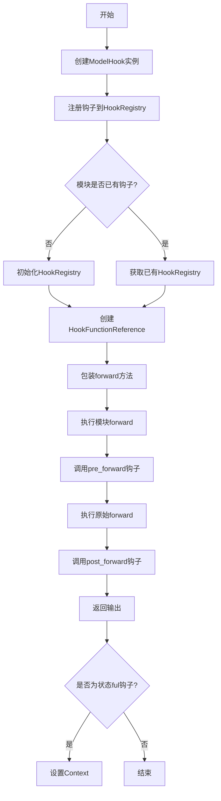

## 类结构

```
BaseState (抽象基类)
├── StateManager (状态管理器)
├── ModelHook (模型钩子基类)
│   ├── HookFunctionReference (函数引用容器)
│   └── HookRegistry (钩子注册表)
```

## 全局变量及字段


### `logger`
    
模块级别的日志记录器，用于输出调试和运行信息

类型：`logging.Logger`
    


### `functools`
    
Python标准库函数工具模块，提供函数式编程辅助函数

类型：`module`
    


### `torch`
    
PyTorch深度学习框架模块，提供张量计算和神经网络构建功能

类型：`module`
    


### `StateManager._state_cls`
    
存储状态类的引用，用于创建状态实例

类型：`Type[BaseState]`
    


### `StateManager._init_args`
    
存储传递给状态类构造函数的 positional 参数

类型：`tuple`
    


### `StateManager._init_kwargs`
    
存储传递给状态类构造函数的 keyword 参数

类型：`dict`
    


### `StateManager._state_cache`
    
缓存各上下文对应的状态实例，键为上下文名，值为状态对象

类型：`dict`
    


### `StateManager._current_context`
    
当前活跃的上下文名称，用于状态查找

类型：`str | None`
    


### `ModelHook.fn_ref`
    
保存该钩子关联的函数引用对象，用于修改执行链

类型：`HookFunctionReference | None`
    


### `ModelHook._is_stateful`
    
类属性，标记该钩子是否为有状态类型，有状态钩子需实现reset_state方法

类型：`bool`
    


### `HookFunctionReference.pre_forward`
    
在模块forward方法执行前调用的预处理函数

类型：`Callable | None`
    


### `HookFunctionReference.post_forward`
    
在模块forward方法执行后调用的后处理函数

类型：`Callable | None`
    


### `HookFunctionReference.forward`
    
当前链中实际执行的前向传播函数

类型：`Callable`
    


### `HookFunctionReference.original_forward`
    
保存原始模块的forward方法，当钩子提供自定义new_forward时使用

类型：`Callable | None`
    


### `HookRegistry.hooks`
    
存储已注册的钩子实例，键为钩子名称，值为钩子对象

类型：`dict[str, ModelHook]`
    


### `HookRegistry._module_ref`
    
指向被管理模块的引用，钩子通过它注入修改后的forward方法

类型：`torch.nn.Module`
    


### `HookRegistry._hook_order`
    
记录钩子注册顺序的列表，用于确定执行顺序

类型：`list[str]`
    


### `HookRegistry._fn_refs`
    
按注册顺序存储各钩子的函数引用对象

类型：`list[HookFunctionReference]`
    
    

## 全局函数及方法


### `get_logger`

获取指定模块的日志记录器实例，用于在模块中记录日志信息。

参数：

- `name`：`str`，模块的完全限定名称（通常使用 `__name__` 变量），用于标识日志来源

返回值：`logging.Logger`，返回配置好的 Python 标准日志记录器实例

#### 流程图

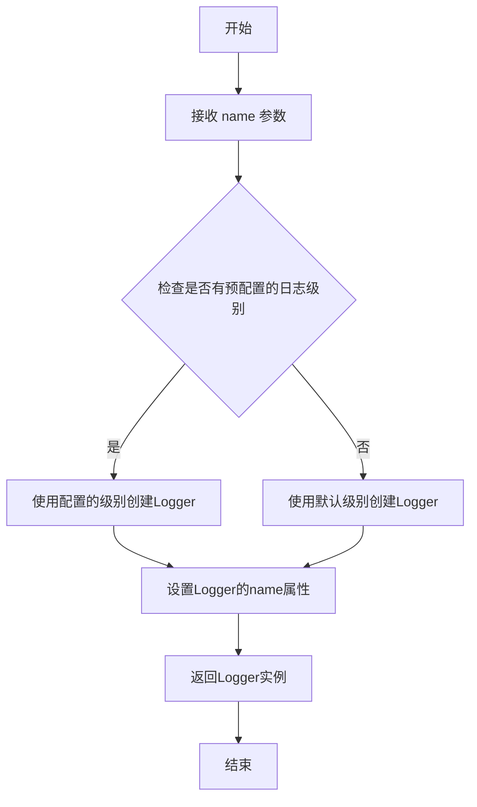

#### 带注释源码

```
# 注意：此函数定义不在当前文件中，而是从 ..utils.logging 导入
# 以下是基于使用方式的推断实现

def get_logger(name: str) -> logging.Logger:
    """
    获取指定模块的日志记录器。
    
    Args:
        name: 模块的完全限定名称，用于标识日志来源
        
    Returns:
        配置好的日志记录器实例
    """
    # 从标准库获取logger
    logger = logging.getLogger(name)
    
    # 如果logger没有处理器，则添加一个
    if not logger.handlers:
        handler = logging.StreamHandler()
        formatter = logging.Formatter(
            '%(asctime)s - %(name)s - %(levelname)s - %(message)s'
        )
        handler.setFormatter(formatter)
        logger.addHandler(handler)
    
    # 设置日志级别（如果尚未设置）
    if not logger.level:
        logger.setLevel(logging.INFO)
    
    return logger

# 在代码中的实际使用方式
logger = get_logger(__name__)  # pylint: disable=invalid-name
```

---

**备注**：由于 `get_logger` 函数定义位于 `..utils.logging` 模块中（相对导入路径），该函数的完整源代码不在当前提供的内容范围内。以上信息是基于代码中的使用方式 (`logger = get_logger(__name__)`) 和 Python 日志模块的常见实现模式推断得出的。


### `unwrap_module`

该函数是一个工具函数，用于从包装模块（如 `DataParallel` 或 `DistributedDataParallel`）中提取原始的底层模块，确保在遍历模块或进行hook操作时操作的是实际模型而非包装器。

参数：

- `module`：`torch.nn.Module`，需要解包的模块对象，可能是原始模块或被包装的模块

返回值：`torch.nn.Module`，返回解包后的原始模块，如果输入模块未被包装则直接返回原模块

#### 流程图

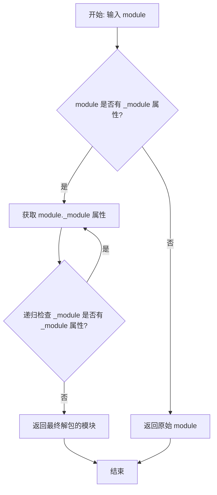

#### 带注释源码

```python
def unwrap_module(module: torch.nn.Module) -> torch.nn.Module:
    r"""
    从包装模块中提取原始模块。
    
    当模型被 DataParallel 或 DistributedDataParallel 等包装时，
    该函数可以递归地解包这些包装，返回底层的原始模块。
    
    Args:
        module (`torch.nn.Module`):
            需要解包的模块，可以是原始模块或被包装的模块。
            
    Returns:
        `torch.nn.Module`: 解包后的原始模块。如果模块未被包装，
                         则直接返回原模块。
    """
    # 检查模块是否有 _module 属性（DP/DDP 包装的特征）
    if hasattr(module, '_module'):
        # 递归解包，处理多层包装的情况
        return unwrap_module(module._module)
    else:
        # 如果没有 _module 属性，说明是原始模块，直接返回
        return module
```


### `BaseState.reset`

该方法是 `BaseState` 类的重置方法，用于重置状态。由于 `BaseState` 是一个基类，该方法并未实现具体逻辑，而是抛出 `NotImplementedError` 异常，要求派生类必须重写此方法。

参数：

- `*args`：`任意类型`，可变位置参数，用于接收任意数量的位置参数（传递给派生类的 reset 方法）
- `**kwargs`：`任意类型`，可变关键字参数，用于接收任意数量的关键字参数（传递给派生类的 reset 方法）

返回值：`None`，无返回值（该方法始终抛出异常）

#### 流程图

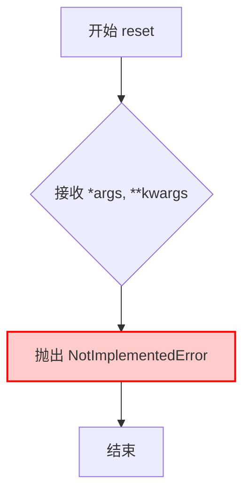

#### 带注释源码

```python
def reset(self, *args, **kwargs) -> None:
    """
    重置状态的方法。
    
    这是一个抽象方法，BaseState 作为基类不提供具体实现。
    派生类必须重写此方法以实现状态重置逻辑。
    
    Args:
        *args: 可变位置参数，会传递给派生类的具体实现
        **kwargs: 可变关键字参数，会传递给派生类的具体实现
    
    Raises:
        NotImplementedError: 始终抛出，表示该方法需要在派生类中实现
    """
    # 抛出未实现异常，提示开发者需要在派生类中重写此方法
    raise NotImplementedError(
        "BaseState::reset is not implemented. Please implement this method in the derived class."
    )
```


### `StateManager.get_state`

获取当前上下文对应的状态对象，如果不存在则创建新的状态实例。

参数：无

返回值：`BaseState`，当前上下文关联的状态对象

#### 流程图

```mermaid
flowchart TD
    A[开始: get_state] --> B{_current_context 是否为 None?}
    B -->|是| C[抛出 ValueError: 未设置上下文]
    B -->|否| D{_current_context 是否在缓存中?}
    D -->|否| E[创建新状态实例: state_cls(*_init_args, **_init_kwargs)]
    E --> F[将新状态存入缓存: _state_cache[_current_context]]
    D -->|是| G[直接获取缓存中的状态]
    F --> H[返回状态对象: _state_cache[_current_context]]
    G --> H
```

#### 带注释源码

```python
def get_state(self):
    """
    获取当前上下文对应的状态对象。

    该方法首先检查是否已经设置了上下文（_current_context），
    如果没有设置则抛出 ValueError 异常。
    然后检查上下文中是否已经存在对应的状态缓存，
    如果不存在则根据 state_cls 创建新的状态实例并缓存。
    最后返回当前上下文对应的状态对象。

    Returns:
        BaseState: 当前上下文关联的状态对象

    Raises:
        ValueError: 当未设置上下文时抛出
    """
    # 检查是否设置了上下文，未设置则抛出异常
    if self._current_context is None:
        raise ValueError("No context is set. Please set a context before retrieving the state.")
    
    # 检查当前上下文是否已有对应的状态缓存
    if self._current_context not in self._state_cache.keys():
        # 如果没有缓存，使用初始化参数创建新的状态实例
        self._state_cache[self._current_context] = self._state_cls(*self._init_args, **self._init_kwargs)
    
    # 返回当前上下文对应的状态对象
    return self._state_cache[self._current_context]
```


### `StateManager.set_context`

设置StateManager的当前上下文名称，用于在状态缓存中标识和检索特定的状态实例。

参数：

- `name`：`str`，要设置的上下文名称，用于标识状态缓存中的状态实例

返回值：`None`，无返回值

#### 流程图

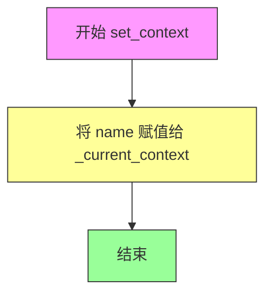

#### 带注释源码

```python
def set_context(self, name: str) -> None:
    """
    设置当前上下文名称。
    
    此方法用于切换或创建新的状态上下文。当调用 get_state() 时，
    会根据当前上下文名称从状态缓存中获取或创建对应的状态实例。
    
    Args:
        name (str): 上下文名称，用于标识状态缓存中的状态实例。
        
    Returns:
        None: 此方法不返回任何值。
        
    Example:
        >>> state_manager = StateManager(MyState)
        >>> state_manager.set_context("training")  # 设置训练上下文
        >>> state_manager.get_state()  # 获取训练状态实例
    """
    # 将传入的name参数赋值给实例变量_current_context
    # 这会改变后续get_state()调用时使用的上下文标识符
    self._current_context = name
```


### `StateManager.reset`

该方法用于重置状态管理器的内部状态，通过遍历并调用所有已缓存状态的reset方法清理缓存，同时将当前上下文置为空。

参数：

- `*args`：`Any`，可变位置参数，用于传递给底层状态的reset方法
- `**kwargs`：`Any`，可变关键字参数，用于传递给底层状态的reset方法

返回值：`None`，无返回值，仅执行状态清理操作

#### 流程图

```mermaid
flowchart TD
    A[开始 reset] --> B{检查 _state_cache 是否为空}
    B -->|否| C[遍历 _state_cache.items]
    C --> D[获取当前状态 state]
    D --> E[调用 state.reset(*args, **kwargs)]
    E --> F[从 _state_cache 中 pop 该条目]
    F --> G{_state_cache 是否还有更多条目}
    G -->|是| C
    G -->|否| H[设置 _current_context = None]
    H --> I[结束 reset]
    B -->|是| H
```

#### 带注释源码

```python
def reset(self, *args, **kwargs) -> None:
    """
    重置状态管理器，清空所有缓存的状态并将上下文置空。
    
    Args:
        *args: 可变位置参数，传递给底层状态的reset方法
        **kwargs: 可变关键字参数，传递给底层状态的reset方法
    """
    # 遍历当前缓存中的所有状态（使用list复制避免迭代中修改字典的问题）
    for name, state in list(self._state_cache.items()):
        # 调用每个状态的reset方法，传递任意参数
        state.reset(*args, **kwargs)
        # 从缓存中移除该状态条目
        self._state_cache.pop(name)
    # 重置当前上下文为None
    self._current_context = None
```


### `ModelHook.initialize_hook`

该方法是一个钩子函数，在模型初始化时执行，用于对模块进行初始化处理后返回。

参数：

- `module`：`torch.nn.Module`，附加到此钩子的模块

返回值：`torch.nn.Module`，处理后的模块

#### 流程图

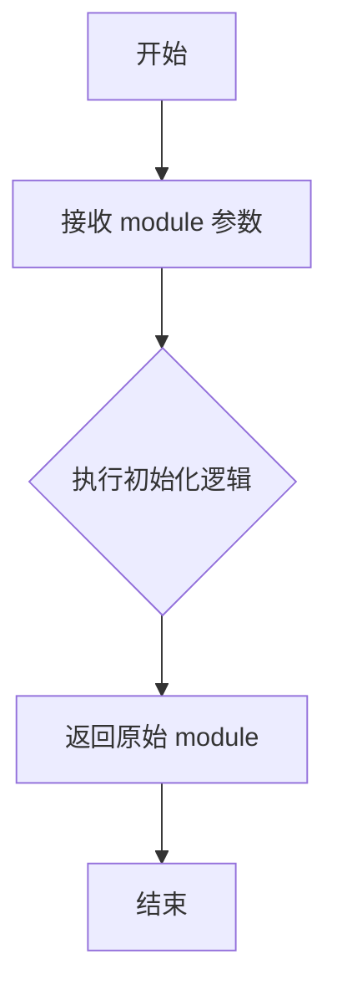

#### 带注释源码

```python
def initialize_hook(self, module: torch.nn.Module) -> torch.nn.Module:
    r"""
    Hook that is executed when a model is initialized.

    Args:
        module (`torch.nn.Module`):
            The module attached to this hook.
    """
    return module  # 直接返回传入的模块，未做任何修改
```


### `ModelHook.deinitalize_hook`

该方法是一个生命周期钩子，在模型钩子被移除或反初始化时执行，用于清理或还原模块状态。

参数：

- `module`：`torch.nn.Module`，附加到此 hook 的模块实例

返回值：`torch.nn.Module`，处理后的模块实例

#### 流程图

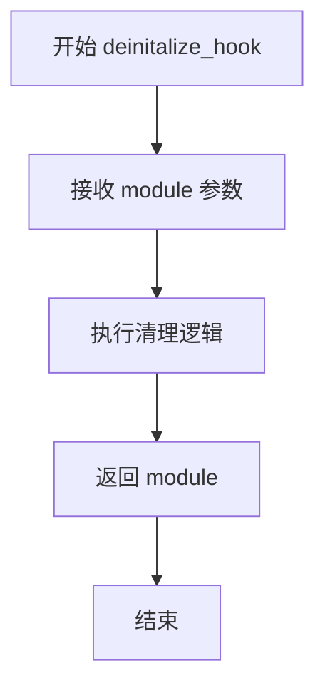

#### 带注释源码

```python
def deinitalize_hook(self, module: torch.nn.Module) -> torch.nn.Module:
    r"""
    Hook that is executed when a model is deinitialized.

    Args:
        module (`torch.nn.Module`):
            The module attached to this hook.
    """
    # 基类实现直接返回原始模块，不做任何处理
    # 子类可以重写此方法以实现自定义的清理逻辑
    # 例如：移除注册的回调、恢复原始状态、释放资源等
    return module
```

#### 补充说明

| 项目 | 描述 |
|------|------|
| **调用场景** | 在 `HookRegistry.remove_hook()` 方法中被调用，当用户主动移除某个 hook 时触发 |
| **设计意图** | 提供一个反初始化钩子点，允许子类在 hook 被移除时执行清理工作 |
| **当前实现** | 基类实现为最小化实现，仅返回原始模块不做任何修改 |
| **可扩展性** | 子类可以重写此方法实现自定义的反初始化逻辑，如恢复模块属性、释放资源等 |
| **与其他方法的关系** | 与 `initialize_hook` 互为对应的生命周期钩子，分别在 hook 添加和移除时执行 |


### `ModelHook.pre_forward`

在模型前向传播执行前被调用的钩子方法，默认实现直接返回未经处理的参数，允许子类在执行前对输入参数进行预处理或修改。

参数：

- `self`：`ModelHook`，隐含的实例本身
- `module`：`torch.nn.Module`，即将执行前向传播的模块实例
- `*args`：`tuple[Any]`，传递给模块前向方法的可变位置参数
- `**kwargs`：`dict[str, Any]`，传递给模块前向方法的关键字参数

返回值：`tuple[tuple[Any], dict[str, Any]]`，处理后的位置参数元组和关键字参数字典的元组

#### 流程图

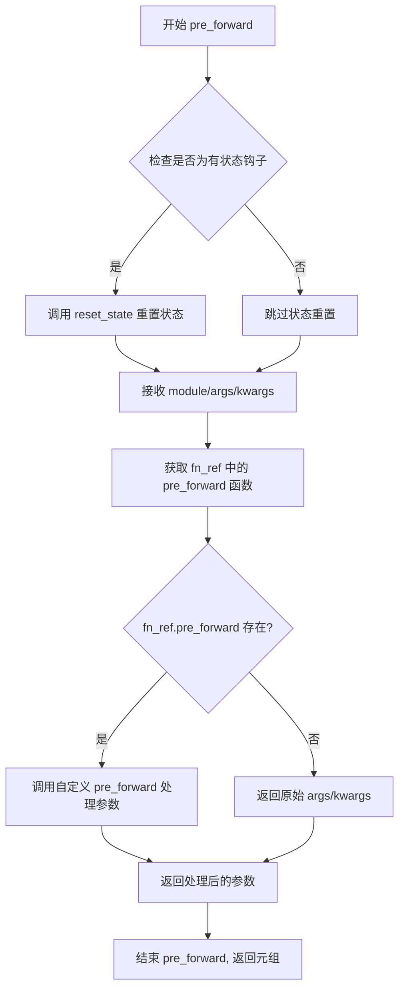

#### 带注释源码

```python
def pre_forward(self, module: torch.nn.Module, *args, **kwargs) -> tuple[tuple[Any], dict[str, Any]]:
    r"""
    Hook that is executed just before the forward method of the model.

    此钩子在模型的前向传播方法执行之前被调用，为子类提供了一个在调用实际 forward 方法前
    检查、修改或记录输入参数的机会。默认实现直接原样返回参数，但可以被重写以实现
    参数预处理、输入验证、日志记录等功能。

    Args:
        module (`torch.nn.Module`):
            The module whose forward pass will be executed just after this event.
            即将执行前向传播的 PyTorch 模块实例，钩子可以通过此参数访问模块的
            属性、参数或其他状态信息。
        args (`tuple[Any]`):
            The positional arguments passed to the module.
            传递给模块 forward 方法的位置参数元组，可以包含张量、常量或其他对象。
        kwargs (`dict[Str, Any]`):
            The keyword arguments passed to the module.
            传递给模块 forward 方法的关键字参数字典，用于传递命名参数如 attention_mask 等。

    Returns:
        `tuple[tuple[Any], dict[Str, Any]]`:
            A tuple with the treated `args` and `kwargs`.
            返回一个元组，包含处理后的位置参数和关键字参数字典。
            在钩子链中，此返回值会被传递给下一个钩子或最终的 forward 方法。
            
    Note:
        - 如果钩子被注册到 HookRegistry 中，此方法会在模块实际 forward 执行前被自动调用
        - 返回的参数将替代原始的 args 和 kwargs 传递给 forward 方法
        - 对于有状态钩子 (_is_stateful=True)，可能在调用前需要先调用 reset_state
    """
    # 默认实现直接返回未经处理的参数
    # 子类可以重写此方法以实现自定义的预处理逻辑
    return args, kwargs
```


### `ModelHook.post_forward`

该方法是一个后向钩子，在模型的 forward 方法执行完成后被调用，用于对模型输出进行后处理。

参数：

- `module`：`torch.nn.Module`，刚刚执行完 forward pass 的模块
- `output`：`Any`，模型的输出结果

返回值：`Any`，处理后的输出结果

#### 流程图

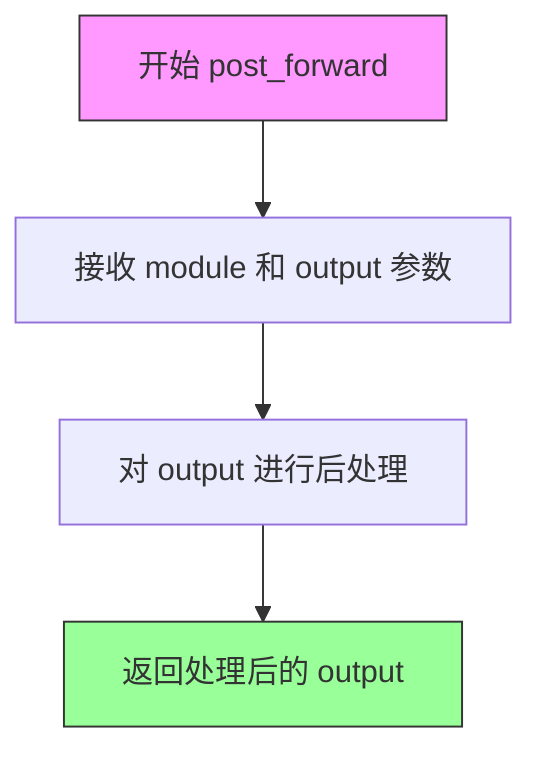

#### 带注释源码

```python
def post_forward(self, module: torch.nn.Module, output: Any) -> Any:
    r"""
    Hook that is executed just after the forward method of the model.

    Args:
        module (`torch.nn.Module`):
            The module whose forward pass been executed just before this event.
        output (`Any`):
            The output of the module.
    Returns:
        `Any`: The processed `output`.
    """
    # 直接返回 output，未进行任何处理
    # 子类可以重写此方法以实现自定义的后处理逻辑
    return output
```


### `ModelHook.detach_hook`

该方法是 `ModelHook` 类的成员方法，在钩子从模块分离时执行，主要用于执行清理或资源释放逻辑。

参数：

- `module`：`torch.nn.Module`，被分离的模块

返回值：`torch.nn.Module`，返回传入的模块本身

#### 流程图

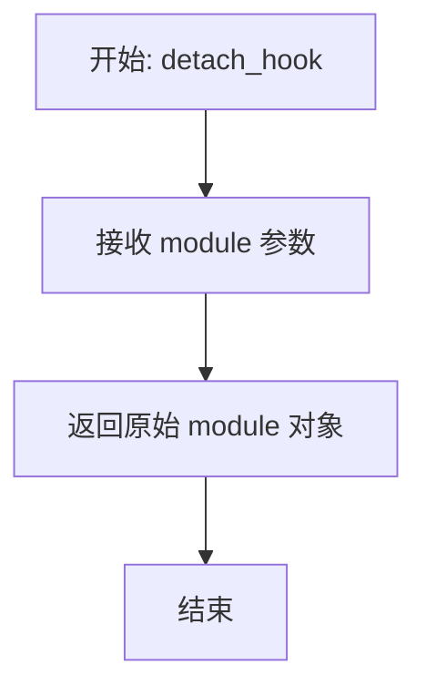

#### 带注释源码

```python
def detach_hook(self, module: torch.nn.Module) -> torch.nn.Module:
    r"""
    Hook that is executed when the hook is detached from a module.

    Args:
        module (`torch.nn.Module`):
            The module detached from this hook.
    """
    # 直接返回传入的 module，不做任何处理
    # 子类可以重写此方法以实现自定义的清理逻辑
    return module
```


### `ModelHook.reset_state`

重置钩子的状态。如果钩子被标记为有状态（`_is_stateful` 为 `True`），则抛出 `NotImplementedError` 异常；否则返回传入的模块。

参数：

- `self`：隐式的 `ModelHook` 实例，表示调用此方法的钩子对象本身
- `module`：`torch.nn.Module`，需要重置状态的 PyTorch 模块

返回值：`torch.nn.Module`，返回传入的模块对象（当钩子不是有状态时）

#### 流程图

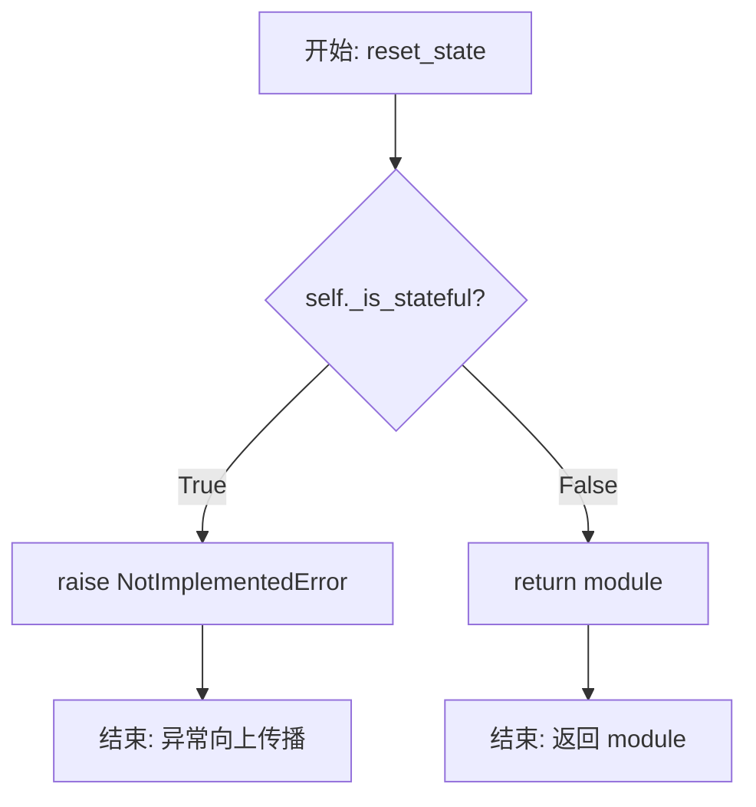

#### 带注释源码

```python
def reset_state(self, module: torch.nn.Module):
    """
    重置钩子的状态。

    如果钩子被标记为有状态（_is_stateful 为 True），则抛出 NotImplementedError，
    因为具体的状态重置逻辑需要由子类实现。否则，直接返回传入的模块对象。

    Args:
        module (torch.nn.Module): 需要重置状态的 PyTorch 模块

    Returns:
        torch.nn.Module: 返回传入的 module 对象

    Raises:
        NotImplementedError: 当钩子是有状态的但未实现 reset_state 方法时抛出
    """
    # 检查钩子是否为有状态类型
    if self._is_stateful:
        # 有状态钩子必须由子类实现具体的 reset_state 方法
        raise NotImplementedError("This hook is stateful and needs to implement the `reset_state` method.")
    # 非有状态钩子直接返回模块，不执行任何操作
    return module
```


### `ModelHook._set_context`

该方法用于在模型钩子初始化或切换上下文时，将指定的上下文名称传播到所有关联的 `StateManager` 实例中，确保状态管理器能够正确跟踪当前执行的上下文环境。

参数：

- `module`：`torch.nn.Module`，执行钩子的目标模块
- `name`：`str`，要设置的上下文名称

返回值：`None`，无返回值（尽管代码中有 `return module` 语句，但类型注解声明为 `None`）

#### 流程图

```mermaid
flowchart TD
    A[开始 _set_context] --> B[获取输入参数 module 和 name]
    B --> C{遍历所有属性名}
    C --> D[获取当前属性值 attr]
    D --> E{attr 是否为 StateManager 类型?}
    E -->|是| F[调用 attr.set_context(name)]
    F --> G[继续遍历下一个属性]
    E -->|否| G
    G --> C
    C --> H[遍历完成]
    H --> I[返回 module]
```

#### 带注释源码

```python
def _set_context(self, module: torch.nn.Module, name: str) -> None:
    # 遍历当前钩子对象的所有属性（包括方法和属性）
    for attr_name in dir(self):
        # 获取属性名对应的实际属性值
        attr = getattr(self, attr_name)
        # 检查该属性是否是 StateManager 类型的实例
        if isinstance(attr, StateManager):
            # 如果是 StateManager，则调用其 set_context 方法设置上下文名称
            attr.set_context(name)
    # 返回传入的模块对象
    return module
```


### `HookRegistry.register_hook`

该方法用于向注册表中注册一个模型钩子（Hook），通过初始化钩子、重写模块的前向传播方法并将钩子及其引用添加到内部数据结构中，以实现对模型forward过程的拦截和处理。

参数：
- `hook`：`ModelHook`，要注册的钩子实例，包含pre_forward、post_forward等回调方法
- `name`：`str`，钩子的唯一标识名称，用于在注册表中索引和移除

返回值：`None`，该方法无返回值（隐式返回None）

#### 流程图

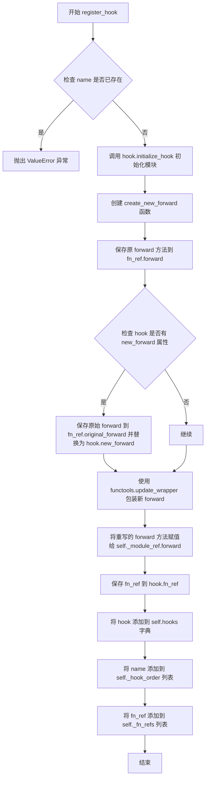

#### 带注释源码

```python
def register_hook(self, hook: ModelHook, name: str) -> None:
    """
    向注册表中注册一个模型钩子。

    该方法会初始化钩子，创建一个新的前向传播方法来包装原始的forward逻辑，
    并将钩子及其函数引用添加到内部数据结构中以便后续管理。

    Args:
        hook (ModelHook): 要注册的钩子实例，需包含pre_forward和post_forward等方法。
        name (str): 钩子的唯一标识名称，注册表中不允许重复。

    Raises:
        ValueError: 如果已有同名钩子存在于注册表中。
    """
    # 检查钩子名称是否已存在，避免重复注册
    if name in self.hooks.keys():
        raise ValueError(
            f"Hook with name {name} already exists in the registry. Please use a different name or "
            f"first remove the existing hook and then add a new one."
        )

    # 调用钩子的初始化方法，可能用于修改模块结构或注册额外状态
    self._module_ref = hook.initialize_hook(self._module_ref)

    # 定义内部函数，用于创建一个包装后的forward方法
    # 该方法会依次执行：pre_forward处理输入 -> 原始forward执行 -> post_forward处理输出
    def create_new_forward(function_reference: HookFunctionReference):
        def new_forward(module, *args, **kwargs):
            # 在前向传播前处理输入参数
            args, kwargs = function_reference.pre_forward(module, *args, **kwargs)
            # 执行原始或替换后的前向传播
            output = function_reference.forward(*args, **kwargs)
            # 在前向传播后处理输出结果
            return function_reference.post_forward(module, output)

        return new_forward

    # 获取模块当前的forward方法引用
    forward = self._module_ref.forward

    # 创建函数引用容器，用于在钩子链中动态修改执行顺序
    fn_ref = HookFunctionReference()
    # 将钩子的预处理和后处理方法绑定到引用对象
    fn_ref.pre_forward = hook.pre_forward
    fn_ref.post_forward = hook.post_forward
    # 初始forward指向模块的原始forward方法
    fn_ref.forward = forward

    # 如果钩子提供了自定义的new_forward方法，则替换forward为钩子的实现
    # 同时保留原始forward的引用以便后续恢复
    if hasattr(hook, "new_forward"):
        fn_ref.original_forward = forward
        fn_ref.forward = functools.update_wrapper(
            functools.partial(hook.new_forward, self._module_ref), hook.new_forward
        )

    # 创建重写后的forward方法，并绑定到模块上
    rewritten_forward = create_new_forward(fn_ref)
    self._module_ref.forward = functools.update_wrapper(
        functools.partial(rewritten_forward, self._module_ref), rewritten_forward
    )

    # 将函数引用保存到钩子对象中，便于后续访问和修改
    hook.fn_ref = fn_ref
    # 将钩子实例注册到字典中，以name为键
    self.hooks[name] = hook
    # 维护钩子的注册顺序列表
    self._hook_order.append(name)
    # 维护函数引用列表，与_hook_order一一对应
    self._fn_refs.append(fn_ref)
```


### `HookRegistry.get_hook`

该方法从钩子注册表中检索具有指定名称的钩子实例，如果未找到对应名称的钩子则返回 None。

参数：

- `name`：`str`，要检索的钩子的名称

返回值：`ModelHook | None`，如果找到则返回对应的 ModelHook 实例，否则返回 None

#### 流程图

```mermaid
flowchart TD
    A[开始 get_hook] --> B[输入 name]
    B --> C{self.hooks 中是否存在 name}
    C -->|是| D[返回 self.hooks.get&#40;name&#41;]
    C -->|否| E[返回 None]
    D --> F[结束]
    E --> F
```

#### 带注释源码

```python
def get_hook(self, name: str) -> ModelHook | None:
    """
    从钩子注册表中获取指定名称的钩子。

    该方法通过字典的 get 操作查找已注册的钩子，如果存在则返回对应的 ModelHook 实例，
    否则返回 None。这是获取已注册钩子的标准查询接口。

    Args:
        name (str): 要检索的钩子的名称，该名称在注册时唯一标识每个钩子。

    Returns:
        ModelHook | None: 找到返回对应的 ModelHook 实例，否则返回 None。
    """
    # 使用字典的 get 方法安全地获取钩子，如果键不存在返回 None 而不抛出异常
    return self.hooks.get(name, None)
```


### `HookRegistry.remove_hook`

该方法用于从钩子注册表中移除指定名称的钩子，并恢复模块的原始前向传播函数。如果 `recurse` 参数为 `True`，则会递归移除所有子模块中的同名钩子。

参数：

- `name`：`str`，要移除的钩子名称
- `recurse`：`bool`，是否递归移除子模块中的同名钩子，默认为 `True`

返回值：`None`，无返回值

#### 流程图

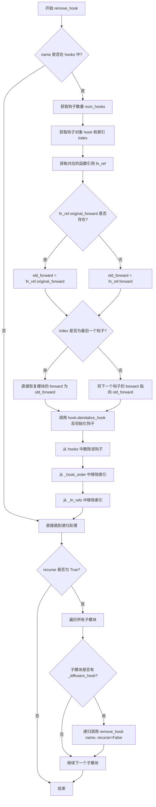

#### 带注释源码

```python
def remove_hook(self, name: str, recurse: bool = True) -> None:
    """
    移除指定名称的钩子，并恢复模块的原始前向传播函数。
    
    Args:
        name: 要移除的钩子名称
        recurse: 是否递归移除子模块中的同名钩子，默认为 True
    """
    # 检查要移除的钩子是否存在于注册表中
    if name in self.hooks.keys():
        # 获取当前注册表中的钩子总数
        num_hooks = len(self._hook_order)
        # 获取要移除的钩子对象
        hook = self.hooks[name]
        # 获取该钩子在整个钩子顺序列表中的索引位置
        index = self._hook_order.index(name)
        # 获取该钩子对应的函数引用对象
        fn_ref = self._fn_refs[index]

        # 确定要恢复的前向传播函数
        # 如果钩子提供了 original_forward，则使用它；否则使用当前保存的 forward
        old_forward = fn_ref.forward
        if fn_ref.original_forward is not None:
            old_forward = fn_ref.original_forward

        # 根据钩子的位置决定如何恢复前向传播链
        if index == num_hooks - 1:
            # 如果移除的是最后一个钩子，直接将模块的 forward 恢复为 old_forward
            self._module_ref.forward = old_forward
        else:
            # 如果移除的不是最后一个钩子，将下一个钩子的 forward 指向 old_forward
            # 这样可以保持钩子链的连续性
            self._fn_refs[index + 1].forward = old_forward

        # 调用钩子的反初始化钩子函数
        self._module_ref = hook.deinitalize_hook(self._module_ref)
        
        # 清理注册表中的相关数据
        del self.hooks[name]
        self._hook_order.pop(index)
        self._fn_refs.pop(index)

    # 如果需要递归处理，则遍历所有子模块
    if recurse:
        # 遍历模块的所有命名子模块
        for module_name, module in self._module_ref.named_modules():
            # 跳过空名称的根模块
            if module_name == "":
                continue
            # 检查子模块是否有钩子注册表
            if hasattr(module, "_diffusers_hook"):
                # 递归调用子模块的 remove_hook，传入 recurse=False 避免重复递归
                module._diffusers_hook.remove_hook(name, recurse=False)
```


### HookRegistry.reset_stateful_hooks

该方法用于重置所有有状态（stateful）hook的内部状态。它逆序遍历当前注册的所有hook，对于标记为有状态（`_is_stateful=True`）的hook，调用其`reset_state`方法进行状态重置。如果`recurse`参数为True，还会递归地对所有子模块执行相同的重置操作。

参数：

- `recurse`：`bool`，是否递归地对子模块调用此方法，默认为True。当设置为True时，会遍历所有子模块并对其包含的hook进行状态重置。

返回值：`None`，该方法不返回任何值，仅执行状态重置操作。

#### 流程图

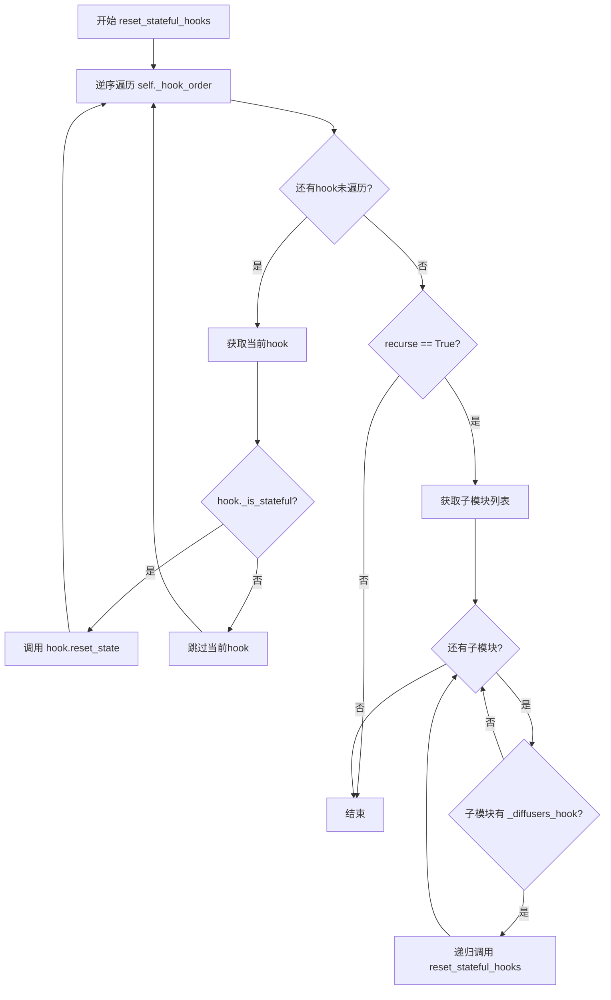

#### 带注释源码

```python
def reset_stateful_hooks(self, recurse: bool = True) -> None:
    """
    重置所有有状态hook的内部状态。
    
    该方法逆序遍历当前HookRegistry中注册的所有hook，对于标记为有状态
    (_is_stateful=True) 的hook，调用其reset_state方法进行状态重置。
    如果recurse为True，还会递归地对所有子模块执行相同的重置操作。
    
    Args:
        recurse (bool): 是否递归地对子模块调用此方法，默认为True。
                        当设置为False时，仅重置当前模块的hook，不处理子模块。
    
    Returns:
        None: 该方法不返回任何值，仅执行状态重置操作。
    """
    
    # 第一步：逆序遍历所有已注册的hook
    # 逆序遍历是为了确保hook按照注册的反向顺序进行状态重置，
    # 这在某些依赖关系中可能是重要的
    for hook_name in reversed(self._hook_order):
        # 获取当前hook名称对应的hook对象
        hook = self.hooks[hook_name]
        
        # 检查该hook是否为有状态hook
        # 只有有状态的hook才需要重置其内部状态
        if hook._is_stateful:
            # 调用hook的reset_state方法重置其内部状态
            # 传入self._module_ref以便hook可以访问相关模块信息
            hook.reset_state(self._module_ref)

    # 第二步：如果recurse为True，递归处理所有子模块
    if recurse:
        # 遍历当前模块的所有子模块
        # unwrap_module用于获取原始的module（可能已被装饰或包装）
        for module_name, module in unwrap_module(self._module_ref).named_modules():
            # 跳过根模块（空字符串名称）
            if module_name == "":
                continue
            
            # 对子模块进行unwrap处理
            module = unwrap_module(module)
            
            # 检查子模块是否包含HookRegistry实例（_diffusers_hook属性）
            # 这是判断子模块是否使用了hook系统的标志
            if hasattr(module, "_diffusers_hook"):
                # 递归调用子模块的reset_stateful_hooks方法
                # 设置recurse=False避免重复递归，只处理当前子模块的hook
                module._diffusers_hook.reset_stateful_hooks(recurse=False)
```


### `HookRegistry.check_if_exists_or_initialize`

检查模块是否已具有 HookRegistry 实例，如不存在则初始化一个，并将该实例返回。

参数：

- `module`：`torch.nn.Module`，需要检查或初始化 HookRegistry 的目标模块

返回值：`HookRegistry`，返回与模块关联的 HookRegistry 实例（无论是已存在的还是新创建的）

#### 流程图

```mermaid
flowchart TD
    A[开始: check_if_exists_or_initialize] --> B{module._diffusers_hook 是否存在?}
    B -- 是 --> C[直接返回已存在的 module._diffusers_hook]
    B -- 否 --> D[创建新的 HookRegistry 实例: cls(module)]
    D --> E[将新实例赋值给 module._diffusers_hook]
    E --> C
    C --> F[结束: 返回 HookRegistry 实例]
```

#### 带注释源码

```python
@classmethod
def check_if_exists_or_initialize(cls, module: torch.nn.Module) -> "HookRegistry":
    """
    检查模块是否已具有 HookRegistry 实例，如不存在则初始化一个。

    这是一个类方法，允许通过类名直接调用，无需先创建 HookRegistry 实例。
    它确保每个模块只对应一个 HookRegistry 实例，实现单例模式的效果。

    Args:
        module (torch.nn.Module): 需要检查或初始化 HookRegistry 的目标模块

    Returns:
        HookRegistry: 返回与模块关联的 HookRegistry 实例
    """
    # 检查模块是否已经具有 _diffusers_hook 属性
    if not hasattr(module, "_diffusers_hook"):
        # 如果不存在，则创建新的 HookRegistry 实例并绑定到模块
        module._diffusers_hook = cls(module)
    
    # 返回模块关联的 HookRegistry 实例（无论是新创建的还是已存在的）
    return module._diffusers_hook
```


### `HookRegistry._set_context`

该方法用于为注册表中的所有有状态hook及其子模块设置上下文，通过倒序遍历hook列表并递归处理子模块来确保上下文正确传播。

参数：

- `name`：`str | None`，上下文名称，用于设置hook的上下文状态，默认为 None

返回值：`None`，无返回值

#### 流程图

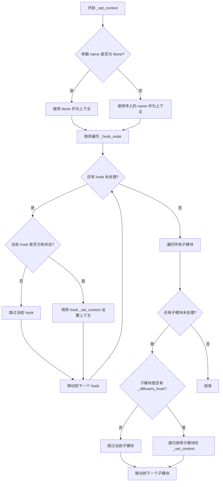

#### 带注释源码

```python
def _set_context(self, name: str | None = None) -> None:
    """
    为所有有状态hook设置上下文，并递归处理所有子模块。
    
    该方法首先倒序遍历当前注册表中的所有hook，对于标记为有状态
    (_is_stateful=True) 的hook，调用其自身的 _set_context 方法。
    然后遍历所有子模块，对每个包含 _diffusers_hook 属性的子模块
    递归调用此方法，以确保上下文在整个模型模块树中传播。
    
    Args:
        name (str | None): 上下文名称，用于设置hook的上下文状态。
                          如果为 None，则表示清除上下文。
    """
    # 第一步：倒序遍历当前注册表中的所有hook
    # 倒序确保子模块的hook先被处理（如果存在层级关系）
    for hook_name in reversed(self._hook_order):
        hook = self.hooks[hook_name]
        # 只对有状态的hook设置上下文
        if hook._is_stateful:
            # 调用 ModelHook._set_context 方法设置具体hook的上下文
            hook._set_context(self._module_ref, name)

    # 第二步：遍历当前模块的所有子模块
    for module_name, module in unwrap_module(self._module_ref).named_modules():
        # 跳过根模块（空字符串名称）
        if module_name == "":
            continue
        # 解除模块包装（如果被包装过）
        module = unwrap_module(module)
        # 检查子模块是否也有 hook 注册表
        if hasattr(module, "_diffusers_hook"):
            # 递归调用子模块的 _set_context，实现上下文在模块树中的传播
            module._diffusers_hook._set_context(name)
```


### `HookRegistry.__repr__`

该方法用于生成 HookRegistry 类的字符串表示形式，列出所有已注册的钩子及其索引和名称。

参数：

- `self`：`HookRegistry`，隐式参数，表示当前 HookRegistry 实例

返回值：`str`，返回 HookRegistry 的字符串表示，包含所有已注册钩子的列表，每个钩子显示其索引、名称和类名或自定义表示

#### 流程图

```mermaid
flowchart TD
    A([开始 __repr__]) --> B[初始化 registry_repr = ""]
    B --> C[遍历 enumerateself._hook_order]
    C --> D{遍历是否完成?}
    D -->|否| E{检查钩子类的 __repr__ 是否被重写}
    D -->|是| H[返回 HookRegistry 格式字符串]
    E -->|是| F[调用 hook.__repr__ 获取自定义表示]
    E -->|否| G[使用 hook.__class__.__name__ 作为表示]
    F --> I[构建 '  (i) hook_name - hook_repr' 字符串]
    G --> I
    I --> J{是否为最后一个钩子?}
    J -->|否| K[添加换行符 \n]
    J -->|是| C
    K --> C
```

#### 带注释源码

```python
def __repr__(self) -> str:
    """
    生成 HookRegistry 的字符串表示形式。
    
    Returns:
        str: 包含所有已注册钩子的格式化字符串表示
    """
    # 初始化用于存储钩子表示的字符串
    registry_repr = ""
    
    # 遍历所有已注册钩子的名称（按注册顺序）
    for i, hook_name in enumerate(self._hook_order):
        # 获取对应的钩子对象
        hook = self.hooks[hook_name]
        
        # 检查该钩子类是否重写了 __repr__ 方法
        # 如果重写了，则调用自定义的 __repr__；否则使用类名
        if hook.__class__.__repr__ is not object.__repr__:
            hook_repr = hook.__repr__()
        else:
            hook_repr = hook.__class__.__name__
        
        # 构建单个钩子的表示字符串，格式为：  (索引) 名称 - 表示
        registry_repr += f"  ({i}) {hook_name} - {hook_repr}"
        
        # 如果不是最后一个钩子，添加换行符
        if i < len(self._hook_order) - 1:
            registry_repr += "\n"
    
    # 返回完整的 HookRegistry 表示，格式为：HookRegistry(\n...\n)
    return f"HookRegistry(\n{registry_repr}\n)"
```

## 关键组件


### BaseState

状态基类，定义reset接口，用于派生具体的状态实现类。

### StateManager

状态管理器，负责在不同上下文中惰性初始化和缓存状态对象，支持设置当前上下文并获取对应状态。

### ModelHook

模型钩子基类，定义在模型forward前后执行的回调接口，包括pre_forward、post_forward、initialize_hook、deinitalize_hook等方法，支持有状态钩子的上下文设置。

### HookFunctionReference

钩子函数引用容器，维护钩子链中forward相关函数的可变引用，包括pre_forward、post_forward、forward和original_forward属性，支持动态修改执行链。

### HookRegistry

钩子注册中心，管理模块上的所有钩子，提供注册、获取、移除钩子的功能，支持递归应用到子模块，维护钩子执行顺序和函数引用。


## 问题及建议


### 已知问题

-   **拼写错误**: `ModelHook.deinitalize_hook` 方法名拼写错误，应为 `deinitialize_hook`（多处拼写一致错误）
-   **类型注解缺失**: 多个方法缺少返回类型注解，如 `StateManager.get_state()`、`HookFunctionReference` 类属性、`HookRegistry._fn_refs` 列表类型等
-   **字典迭代时修改**: `StateManager.reset()` 方法中 `for name, state in list(self._state_cache.items())` 然后执行 `pop`，虽然用了 `list()` 包装，但逻辑上可简化为直接清空字典
-   **上下文状态不一致**: `StateManager.reset()` 方法将 `self._current_context` 设为 `None`，但如果缓存的状态对象内部维护了上下文引用，外部调用者可能无法感知这种状态变化
-   **模块解包未生效**: `HookRegistry.reset_stateful_hooks` 和 `_set_context` 方法中调用 `module = unwrap_module(module)` 后没有将结果写回，修改未生效
-   **隐藏的魔法属性**: 使用 `module._diffusers_hook` 作为存储钩子 registry 的属性，缺乏公开 API，依赖隐式约定
-   **Hook移除逻辑边界条件**: `HookRegistry.remove_hook` 中当 `index != num_hooks - 1` 时直接将前一个 hook 的 forward 指向旧的 forward，但未验证后续 hook 链的完整性
-   **状态基类未实现**: `BaseState.reset()` 直接抛出 `NotImplementedError`，但没有定义任何实际的状态接口或抽象方法

### 优化建议

-   **修正拼写**: 将所有 `deinitalize_hook` 改为 `deinitialize_hook`
-   **完善类型注解**: 为 `HookFunctionReference` 类的属性添加类型注解，为 `HookRegistry` 的 `_fn_refs` 添加 `list[HookFunctionReference]` 类型
-   **重构状态重置逻辑**: `StateManager.reset()` 可使用 `self._state_cache.clear()` 代替循环 pop，提高可读性
-   **修复模块解包**: 在循环中使用 `module = unwrap_module(module)` 后，应将结果重新赋值给原变量或使用新变量
-   **提取公开API**: 考虑将 `_diffusers_hook` 属性访问封装为公开方法，如 `register_hook()` / `get_hook_registry()`
-   **增强错误处理**: 在 `remove_hook` 方法中添加索引越界检查，确保 hook 移除的原子性和安全性
-   **完善状态抽象**: 为 `BaseState` 类添加具体的状态字段定义和更清晰的状态生命周期管理文档

## 其它


### 设计目标与约束

该代码旨在为PyTorch模型提供一个灵活、可扩展的Hook机制，支持在模型前向传播前后执行自定义操作。设计目标包括：1) 支持多个Hook的链式注册和管理；2) 提供状态管理功能，支持有状态Hook；3) 支持上下文环境设置；4) 支持递归应用到子模块。约束条件包括：仅支持PyTorch模块的forward方法拦截，不支持其他方法；Hook执行顺序遵循注册顺序；状态管理采用缓存机制，需要显式设置上下文。

### 错误处理与异常设计

代码中的错误处理设计如下：1) BaseState.reset()方法抛出NotImplementedError，强制子类实现；2) StateManager.get_state()在未设置上下文时抛出ValueError；3) HookRegistry.register_hook()在Hook名称已存在时抛出ValueError；4) ModelHook.reset_state()对于有状态Hook抛出NotImplementedError；5) 所有PyTorch相关操作可能抛出torch.cuda.OutOfMemoryError等运行时异常。异常设计采用显式检查和有意义的错误消息，便于调试。

### 数据流与状态机

数据流主要分为三个阶段：1) 注册阶段(register_hook)：创建HookFunctionReference，包装原始forward方法，插入pre_forward和post_forward调用；2) 执行阶段：每次前向传播时，pre_forward处理输入，forward执行原始计算，post_forward处理输出；3) 移除阶段(remove_hook)：恢复原始forward方法，清理Hook引用。状态机涉及StateManager的状态缓存管理，通过set_context设置当前上下文，get_state获取或创建状态，reset清空所有缓存状态。

### 外部依赖与接口契约

主要外部依赖包括：1) torch (PyTorch) - 核心依赖，用于nn.Module和tensor操作；2) functools - 用于函数包装和偏函数；3) ..utils.logging (get_logger) - 日志记录；4) ..utils.torch_utils (unwrap_module) - 模块解包工具。接口契约：ModelHook子类需实现pre_forward和post_forward方法；有状态Hook需设置_is_stateful=True并实现reset_state方法；Hook名称必须唯一；register_hook返回None，通过get_hook获取Hook实例。

### 性能考虑

性能优化点：1) 使用字典缓存状态，避免重复创建；2) Hook采用函数引用而非重新创建，减少内存开销；3) reversed迭代用于优化查找顺序；4) 状态缓存使用dict实现，查找复杂度为O(1)。潜在性能问题：每次前向传播都会调用所有Hook的pre_forward和post_forward，过多Hook会影响推理速度；状态缓存未设置上限，可能导致内存持续增长。

### 并发与线程安全性

代码本身不提供线程安全保护。在多线程环境下需注意：1) HookRegistry的hooks字典和_hook_order列表非线程安全，并发注册/移除Hook可能导致状态不一致；2) StateManager的_state_cache字典非线程安全，并发访问可能导致缓存不一致；3) Hook的pre_forward和post_forward执行非原子操作。建议在外部使用锁保护或设计单线程访问模式。

### 配置与扩展性

扩展方式：1) 继承ModelHook实现自定义Hook逻辑；2) 继承BaseState实现自定义状态管理；3) 通过new_forward属性提供自定义前向传播实现。配置选项：Hook名称字符串标识；init_args和init_kwargs用于状态初始化；recurse参数控制是否递归应用到子模块；StateManager支持自定义状态类和初始化参数。

### 使用示例

基础Hook注册：
```python
import torch
from diffusers.models.hooks import HookRegistry, ModelHook

class MyHook(ModelHook):
    def pre_forward(self, module, *args, **kwargs):
        print("Before forward")
        return args, kwargs
    
    def post_forward(self, module, output):
        print("After forward")
        return output

model = torch.nn.Linear(10, 10)
registry = HookRegistry.check_if_exists_or_initialize(model)
registry.register_hook(MyHook(), "my_hook")
output = model(torch.randn(1, 10))
```

有状态Hook使用：
```python
class StatefulHook(ModelHook):
    _is_stateful = True
    
    def __init__(self):
        super().__init__()
        from diffusers.models.hooks import StateManager, BaseState
    
    def reset_state(self, module):
        # 实现状态重置
        return module
```

### 测试策略建议

单元测试应覆盖：1) Hook注册、获取、移除的正常流程；2) 重复注册Hook的异常情况；3) 上下文设置和状态获取；4) 递归应用到子模块；5) 有状态Hook的状态重置；6) Hook链的正确执行顺序。集成测试应验证：1) Hook对模型输出的实际影响；2) 多个Hook的组合效果；3) 复杂模型结构的Hook应用。

### 已知限制

1) 仅支持forward方法拦截，不支持其他模块方法；2) Hook移除时仅处理相邻Hook的forward链接，极端情况下可能存在边界问题；3) 状态缓存没有过期策略，长期使用可能导致内存泄漏；4) 不支持Hook优先级或排序调整，只能按注册顺序执行；5) unwrap_module的使用假设模块结构符合特定模式，可能不适用于所有自定义模块。

    