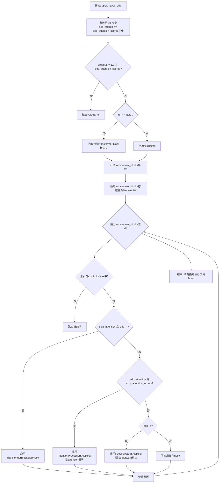
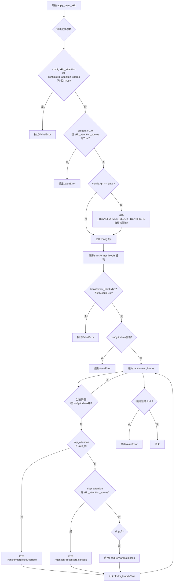
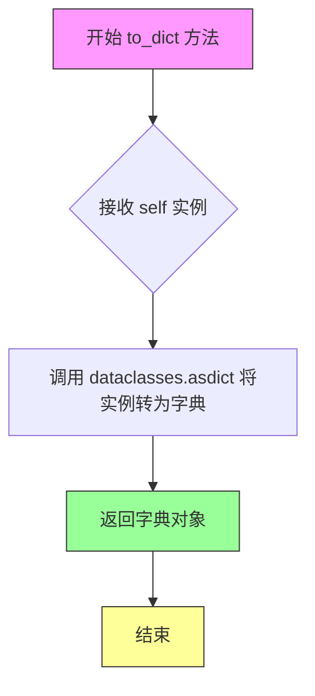
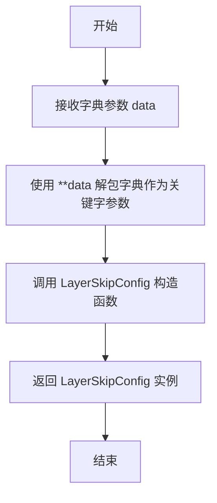
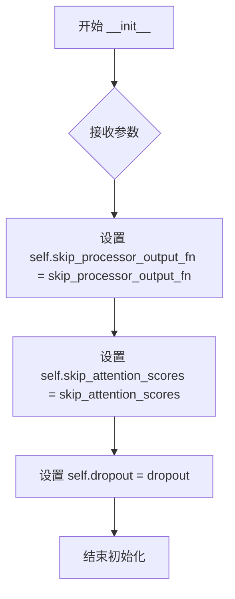
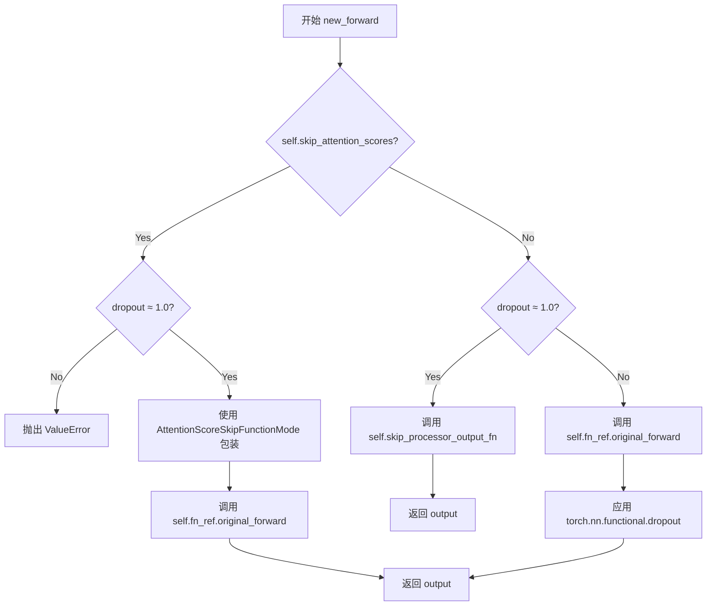
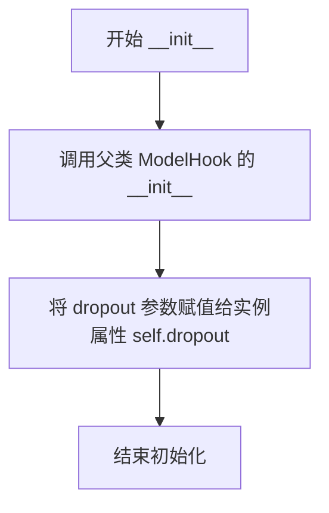

# `diffusers\src\diffusers\hooks\layer_skip.py` 详细设计文档

该代码实现了Diffusers库中的Layer Skip（层跳过）机制，允许在Transformer模型推理或训练时动态跳过指定的attention块、feed-forward块或整个transformer块，以实现加速推理、减少显存占用或实现特殊的训练策略。

## 整体流程



## 类结构

```
torch.overrides.TorchFunctionMode (Python内置)
└── AttentionScoreSkipFunctionMode (自定义实现)
ModelHook (基类)
├── AttentionProcessorSkipHook
├── FeedForwardSkipHook
└── TransformerBlockSkipHook
LayerSkipConfig (dataclass, 配置类)
```

## 全局变量及字段


### `logger`
    
模块级logger实例，用于记录调试和运行时信息

类型：`logging.Logger`
    


### `_LAYER_SKIP_HOOK`
    
层跳过hook的名称常量，值为'layer_skip_hook'

类型：`str`
    


### `LayerSkipConfig.indices`
    
要跳过的层索引列表

类型：`list[int]`
    


### `LayerSkipConfig.fqn`
    
完全限定名称，标识transformer blocks栈，默认为'auto'

类型：`str`
    


### `LayerSkipConfig.skip_attention`
    
是否跳过attention块，默认为True

类型：`bool`
    


### `LayerSkipConfig.skip_attention_scores`
    
是否跳过attention score计算，默认为False

类型：`bool`
    


### `LayerSkipConfig.skip_ff`
    
是否跳过feed-forward块，默认为True

类型：`bool`
    


### `LayerSkipConfig.dropout`
    
跳过层的dropout概率，默认为1.0

类型：`float`
    


### `AttentionProcessorSkipHook.skip_processor_output_fn`
    
跳过processor输出的函数

类型：`Callable`
    


### `AttentionProcessorSkipHook.skip_attention_scores`
    
是否跳过attention scores

类型：`bool`
    


### `AttentionProcessorSkipHook.dropout`
    
dropout概率

类型：`float`
    


### `FeedForwardSkipHook.dropout`
    
dropout概率

类型：`float`
    


### `TransformerBlockSkipHook.dropout`
    
dropout概率

类型：`float`
    


### `TransformerBlockSkipHook._metadata`
    
TransformerBlockRegistry元数据

类型：`TransformerBlockRegistry元数据`
    
    

## 全局函数及方法


### `apply_layer_skip`

应用层跳过（Layer Skip）到transformer模型，通过注册各种Hook（TransformerBlockSkipHook、AttentionProcessorSkipHook、FeedForwardSkipHook）来跳过指定的transformer块、注意力块或前馈网络块，以实现模型推理加速或特定训练策略。

参数：

- `module`：`torch.nn.Module`，要应用layer skip hook的transformer模型
- `config`：`LayerSkipConfig`，layer skip hook的配置

返回值：`None`，该函数没有返回值

#### 流程图



#### 带注释源码

```python
def apply_layer_skip(module: torch.nn.Module, config: LayerSkipConfig) -> None:
    r"""
    Apply layer skipping to internal layers of a transformer.

    Args:
        module (`torch.nn.Module`):
            The transformer model to which the layer skip hook should be applied.
        config (`LayerSkipConfig`):
            The configuration for the layer skip hook.

    Example:

    ```python
    >>> from diffusers import apply_layer_skip_hook, CogVideoXTransformer3DModel, LayerSkipConfig

    >>> transformer = CogVideoXTransformer3DModel.from_pretrained("THUDM/CogVideoX-5b", torch_dtype=torch.bfloat16)
    >>> config = LayerSkipConfig(layer_index=[10, 20], fqn="transformer_blocks")
    >>> apply_layer_skip_hook(transformer, config)
    ```
    """
    # 调用内部实现函数_apply_layer_skip_hook完成实际的hook注册
    _apply_layer_skip_hook(module, config)
```


### `_apply_layer_skip_hook`

该函数是层跳过（Layer Skip）功能的内部核心实现，通过遍历transformer模型的所有transformer block，根据配置选择性地注册不同类型的hook（`TransformerBlockSkipHook`、`AttentionProcessorSkipHook`或`FeedForwardSkipHook`），以实现跳过指定层的前馈网络或注意力计算，从而在推理时减少计算量。

参数：

- `module`：`torch.nn.Module`，要应用layer skip hook的transformer模型
- `config`：`LayerSkipConfig`，层跳过配置，包含要跳过的层索引、模块标识符、是否跳过attention/feed-forward等选项
- `name`：`str | None`，hook的注册名称，默认为`_LAYER_SKIP_HOOK`

返回值：`None`，该函数直接修改module的hook注册，不返回任何值

#### 流程图

```mermaid
flowchart TD
    A[开始 _apply_layer_skip_hook] --> B[设置hook名称为name或默认值]
    B --> C{验证config有效性}
    C --> D{config.skip_attention<br/>且 config.skip_attention_scores?}
    D -->|是| E[抛出ValueError: 不能同时为True]
    D -->|否| F{dropout != 1.0<br/>且 skip_attention_scores?}
    F -->|是| G[抛出ValueError: dropout必须为1.0]
    F -->|否| H{config.fqn == 'auto'?}
    H -->|是| I[遍历所有_TRANSFORMER_BLOCK_IDENTIFIERS<br/>自动检测fqn]
    H -->|否| J[使用config.fqn]
    I --> K{找到合适的identifier?}
    K -->|否| L[抛出ValueError: 无法自动检测]
    K -->|是| J
    J --> M[_get_submodule_from_fqn获取transformer_blocks]
    M --> N{transformer_blocks有效?}
    N -->|否| O[抛出ValueError: fqn无效]
    N -->|是| P{config.indices非空?}
    P -->|否| Q[抛出ValueError: 索引列表为空]
    P -->|是| R[初始化blocks_found=False]
    R --> S[遍历transformer_blocks]
    S --> T{i在config.indices中?}
    T -->|否| U[继续下一个block]
    T -->|是| V[blocks_found=True]
    V --> W{config.skip_attention<br/>且 config.skip_ff?}
    W -->|是| X[注册TransformerBlockSkipHook]
    W -->|否| Y{config.skip_attention<br/>或 config.skip_attention_scores?}
    Y -->|是| Z[遍历block子模块]
    Z --> AA{找到_ATTENTION_CLASSES<br/>且非cross_attention?}
    AA -->|是| AB[注册AttentionProcessorSkipHook]
    AA -->|否| AC[继续下一个子模块]
    Y -->|否| AD{config.skip_ff?}
    AD -->|是| AE[遍历block子模块]
    AE --> AF{找到_FEEDFORWARD_CLASSES?}
    AF -->|是| AG[注册FeedForwardSkipHook]
    AF -->|否| AH[继续下一个子模块]
    AB --> AI[继续下一个block]
    AG --> AI
    X --> AI
    AC --> AI
    AH --> AI
    U --> AI
    AI --> AJ{还有更多block?}
    AJ -->|是| S
    AJ -->|否| AK{blocks_found为True?]
    AK -->|否| AL[抛出ValueError: 未找到匹配的block]
    AK -->|是| AM[结束]
    
    style E fill:#ffcccc
    style G fill:#ffcccc
    style L fill:#ffcccc
    style O fill:#ffcccc
    style Q fill:#ffcccc
    style AL fill:#ffcccc
```

#### 带注释源码

```python
def _apply_layer_skip_hook(module: torch.nn.Module, config: LayerSkipConfig, name: str | None = None) -> None:
    """
    内部函数：应用层跳过hook到transformer模型
    
    Args:
        module: 要应用hook的transformer模型
        config: 层跳过配置
        name: hook名称，默认为_LAYER_SKIP_HOOK
    """
    # 1. 设置hook名称，如果未提供则使用默认值
    name = name or _LAYER_SKIP_HOOK

    # 2. 验证配置参数的有效性
    # 不能同时启用skip_attention和skip_attention_scores
    if config.skip_attention and config.skip_attention_scores:
        raise ValueError("Cannot set both `skip_attention` and `skip_attention_scores` to True. Please choose one.")
    
    # 如果dropout不为1.0且启用了skip_attention_scores，则抛出错误
    if not math.isclose(config.dropout, 1.0) and config.skip_attention_scores:
        raise ValueError(
            "Cannot set `skip_attention_scores` to True when `dropout` is not 1.0. Please set `dropout` to 1.0."
        )

    # 3. 处理fqn自动检测逻辑
    if config.fqn == "auto":
        # 遍历所有已知的transformer block标识符，自动检测模型使用的标识符
        for identifier in _ALL_TRANSFORMER_BLOCK_IDENTIFIERS:
            if hasattr(module, identifier):
                config.fqn = identifier
                break
        else:
            # 未找到合适的标识符，抛出错误
            raise ValueError(
                "Could not find a suitable identifier for the transformer blocks automatically. Please provide a valid "
                "`fqn` (fully qualified name) that identifies a stack of transformer blocks."
            )

    # 4. 获取transformer_blocks子模块
    transformer_blocks = _get_submodule_from_fqn(module, config.fqn)
    
    # 5. 验证transformer_blocks的有效性
    if transformer_blocks is None or not isinstance(transformer_blocks, torch.nn.ModuleList):
        raise ValueError(
            f"Could not find {config.fqn} in the provided module, or configured `fqn` (fully qualified name) does not identify "
            f"a `torch.nn.ModuleList`. Please provide a valid `fqn` that identifies a stack of transformer blocks."
        )
    
    # 验证indices列表非空
    if len(config.indices) == 0:
        raise ValueError("Layer index list is empty. Please provide a non-empty list of layer indices to skip.")

    # 6. 遍历transformer_blocks，为指定索引的block注册hook
    blocks_found = False
    for i, block in enumerate(transformer_blocks):
        # 仅处理配置中指定的层索引
        if i not in config.indices:
            continue

        blocks_found = True

        # 7. 根据配置选择注册不同类型的hook
        # 情况1：同时跳过attention和feed-forward
        if config.skip_attention and config.skip_ff:
            logger.debug(f"Applying TransformerBlockSkipHook to '{config.fqn}.{i}'")
            # 获取或初始化HookRegistry
            registry = HookRegistry.check_if_exists_or_initialize(block)
            # 创建并注册TransformerBlockSkipHook
            hook = TransformerBlockSkipHook(config.dropout)
            registry.register_hook(hook, name)

        # 情况2：仅跳过attention或启用skip_attention_scores
        elif config.skip_attention or config.skip_attention_scores:
            # 遍历block中的所有子模块
            for submodule_name, submodule in block.named_modules():
                # 找到非交叉注意力的attention模块
                if isinstance(submodule, _ATTENTION_CLASSES) and not submodule.is_cross_attention:
                    logger.debug(f"Applying AttentionProcessorSkipHook to '{config.fqn}.{i}.{submodule_name}'")
                    # 从AttentionProcessorRegistry获取跳过函数
                    output_fn = AttentionProcessorRegistry.get(submodule.processor.__class__).skip_processor_output_fn
                    registry = HookRegistry.check_if_exists_or_initialize(submodule)
                    hook = AttentionProcessorSkipHook(output_fn, config.skip_attention_scores, config.dropout)
                    registry.register_hook(hook, name)

        # 情况3：仅跳过feed-forward
        if config.skip_ff:
            for submodule_name, submodule in block.named_modules():
                if isinstance(submodule, _FEEDFORWARD_CLASSES):
                    logger.debug(f"Applying FeedForwardSkipHook to '{config.fqn}.{i}.{submodule_name}'")
                    registry = HookRegistry.check_if_exists_or_initialize(submodule)
                    hook = FeedForwardSkipHook(config.dropout)
                    registry.register_hook(hook, name)

    # 8. 检查是否找到了匹配的block
    if not blocks_found:
        raise ValueError(
            f"Could not find any transformer blocks matching the provided indices {config.indices} and "
            f"fully qualified name '{config.fqn}'. Please check the indices and fqn for correctness."
        )
```


### `LayerSkipConfig.__post_init__`

该方法是 `LayerSkipConfig` 数据类的初始化后验证方法，用于在对象创建后检查配置参数的有效性，确保 `dropout` 值在合法范围内，且 `skip_attention_scores` 与 `dropout` 的组合使用符合逻辑约束。

参数：

- `self`：`LayerSkipConfig` 实例，隐式参数，表示当前配置对象本身

返回值：`None`，无返回值，该方法仅执行参数验证并可能在验证失败时抛出异常

#### 流程图

```mermaid
flowchart TD
    A[__post_init__ 被调用] --> B{检查 dropout 是否在 [0, 1] 范围内}
    B -->|是| C{检查 dropout 是否接近 1.0?}
    B -->|否| D[抛出 ValueError: dropout 必须在 0.0 到 1.0 之间]
    C -->|是| E[验证通过，方法结束]
    C -->|否| F{检查 skip_attention_scores 是否为 True?}
    F -->|是| G[抛出 ValueError: skip_attention_scores 为 True 时 dropout 必须为 1.0]
    F -->|否| E
```

#### 带注释源码

```python
def __post_init__(self):
    # 验证 dropout 参数是否在有效范围内 [0, 1]
    if not (0 <= self.dropout <= 1):
        raise ValueError(f"Expected `dropout` to be between 0.0 and 1.0, but got {self.dropout}.")
    
    # 验证 skip_attention_scores 与 dropout 的兼容性
    # 当 skip_attention_scores 为 True 时，必须确保 dropout 为 1.0
    # 这是因为跳过 attention scores 时的 dropout 行为与常规 dropout 不兼容
    if not math.isclose(self.dropout, 1.0) and self.skip_attention_scores:
        raise ValueError(
            "Cannot set `skip_attention_scores` to True when `dropout` is not 1.0. Please set `dropout` to 1.0."
        )
```


### `LayerSkipConfig.to_dict`

将 LayerSkipConfig 类的当前实例转换为字典格式，提取所有字段及其值。

参数：
- （无显式参数，隐式接收 `self` 实例）

返回值：`dict`，返回包含该配置类所有字段（indices、fqn、skip_attention、skip_attention_scores、skip_ff、dropout）及其对应值的字典。

#### 流程图



#### 带注释源码

```python
def to_dict(self):
    """
    将当前 LayerSkipConfig 实例转换为字典格式。
    
    该方法利用 Python dataclasses 模块提供的 asdict 函数，
    递归地将数据类对象的所有字段转换为字典形式。
    
    返回的字典包含以下键值对：
        - 'indices': list[int] - 要跳过的层索引列表
        - 'fqn': str - 转换器块的完全限定名称
        - 'skip_attention': bool - 是否跳过注意力块
        - 'skip_attention_scores': bool - 是否跳过注意力分数计算
        - 'skip_ff': bool - 是否跳过前馈网络块
        - 'dropout': float - 跳过层的 dropout 概率
    
    Returns:
        dict: 包含所有配置字段的字典对象
    
    Example:
        >>> config = LayerSkipConfig(indices=[0, 1], fqn="transformer_blocks")
        >>> config_dict = config.to_dict()
        >>> print(config_dict)
        {'indices': [0, 1], 'fqn': 'transformer_blocks', 
         'skip_attention': True, 'skip_attention_scores': False, 
         'skip_ff': True, 'dropout': 1.0}
    """
    return asdict(self)  # 调用 dataclasses.asdict 将实例转换为字典并返回
```


### `LayerSkipConfig.from_dict`

从字典静态方法创建实例，用于将字典反序列化为 `LayerSkipConfig` 对象。

参数：

- `data`：`dict`，包含配置参数的字典，应包含 `indices`、`fqn`、`skip_attention`、`skip_attention_scores`、`skip_ff` 和 `dropout` 字段

返回值：`LayerSkipConfig`，返回从字典数据创建的配置实例

#### 流程图



#### 带注释源码

```python
@staticmethod
def from_dict(data: dict) -> "LayerSkipConfig":
    """
    从字典创建 LayerSkipConfig 实例的静态工厂方法。

    Args:
        data (dict): 包含配置参数的字典。字典的键应对应 LayerSkipConfig 的字段名：
                     - indices: list[int] - 要跳过的层索引列表
                     - fqn: str - 完全限定名称，默认为 "auto"
                     - skip_attention: bool - 是否跳过注意力块，默认为 True
                     - skip_attention_scores: bool - 是否跳过注意力分数计算，默认为 False
                     - skip_ff: bool - 是否跳过前馈块，默认为 True
                     - dropout: float - dropout 概率，默认为 1.0

    Returns:
        LayerSkipConfig: 从字典数据创建的配置实例

    Example:
        >>> config_dict = {
        ...     "indices": [0, 1, 2],
        ...     "fqn": "transformer_blocks",
        ...     "skip_attention": True,
        ...     "skip_attention_scores": False,
        ...     "skip_ff": True,
        ...     "dropout": 1.0
        ... }
        >>> config = LayerSkipConfig.from_dict(config_dict)
    """
    return LayerSkipConfig(**data)  # 使用字典解包将字典键值对作为关键字参数传递给构造函数
```


### `AttentionScoreSkipFunctionMode.__torch_function__`

该方法是 `AttentionScoreSkipFunctionMode` 类的核心实现，作为 PyTorch 的 `TorchFunctionMode` 钩子，在调用 `scaled_dot_product_attention` 时直接返回 `value`，从而跳过注意力分数的计算，实现类似直接传递 value 的效果。

参数：

- `func`：`Callable`，被调用的函数，当其为 `torch.nn.functional.scaled_dot_product_attention` 时触发特殊处理逻辑
- `types`：`tuple[type, ...]`，函数操作的张量类型元组
- `args`：`tuple`，位置参数列表，默认空元组
- `kwargs`：`dict | None`，关键字参数字典，默认 `None`

返回值：`Any`，当 `func` 是 `scaled_dot_product_attention` 且 `query.shape[2] == value.shape[2]` 时返回 `value`，否则返回原始函数调用结果 `func(*args, **kwargs)`

#### 流程图

```mermaid
flowchart TD
    A[__torch_function__ 被调用] --> B{func 是 scaled_dot_product_attention?}
    B -->|否| F[执行原始函数 func(*args, **kwargs)]
    B -->|是| C[从 kwargs 或 args 提取 query, key, value]
    C --> D{query.shape[2] == value.shape[2]?}
    D -->|否| F
    D -->|是| E[直接返回 value]
    
    style E fill:#90EE90
    style F fill:#FFB6C1
```

#### 带注释源码

```python
def __torch_function__(self, func, types, args=(), kwargs=None):
    """
    自定义 TorchFunctionMode 实现，拦截 scaled_dot_product_attention 调用
    并在满足条件时直接返回 value，实现跳过注意力分数计算的功能。
    """
    # 处理 kwargs 为 None 的情况，初始化为空字典
    if kwargs is None:
        kwargs = {}
    
    # 判断当前调用的函数是否为 scaled_dot_product_attention
    if func is torch.nn.functional.scaled_dot_product_attention:
        # 从 kwargs 中获取 query, key, value 参数
        query = kwargs.get("query", None)
        key = kwargs.get("key", None)
        value = kwargs.get("value", None)
        
        # 如果 kwargs 中没有提供，则从位置参数 args 中获取
        # scaled_dot_product_attention 标准签名为 (query, key, value, ...)
        query = query if query is not None else args[0]
        key = key if key is not None else args[1]
        value = value if value is not None else args[2]
        
        # 序列长度检查：只有当 Q 和 V 的序列长度一致时才跳过注意力计算
        # 这是因为某些方法（如 Perturbed Attention Guidance）需要 Q 和 V 序列长度匹配
        # 如果不匹配，PAG 不会生效，效果等价于普通 CFG
        if query.shape[2] == value.shape[2]:
            # 序列长度匹配，直接返回 value，跳过注意力计算
            return value
    
    # 对于其他函数或不符合条件的情况，执行原始函数调用
    return func(*args, **kwargs)
```


### `AttentionProcessorSkipHook.__init__`

初始化 AttentionProcessorSkipHook 类，用于在注意力处理过程中跳过某些计算（如跳过注意力分数计算或应用 dropout）。

参数：

- `self`：`AttentionProcessorSkipHook`，隐式参数，类的实例本身
- `skip_processor_output_fn`：`Callable`，用于跳过处理器输出的回调函数
- `skip_attention_scores`：`bool`，是否跳过注意力分数计算，默认为 `False`
- `dropout`：`float`，dropout 概率，默认为 `1.0`

返回值：`None`，无显式返回值（Python `__init__` 方法隐式返回 `None`）

#### 流程图



#### 带注释源码

```python
def __init__(self, skip_processor_output_fn: Callable, skip_attention_scores: bool = False, dropout: float = 1.0):
    """
    初始化 AttentionProcessorSkipHook 实例。

    Args:
        skip_processor_output_fn: 用于跳过处理器输出的回调函数
        skip_attention_scores: 是否跳过注意力分数计算
        dropout: dropout 概率
    """
    # 将跳过处理器输出的函数保存为实例属性
    self.skip_processor_output_fn = skip_processor_output_fn
    
    # 保存是否跳过注意力分数的标志
    self.skip_attention_scores = skip_attention_scores
    
    # 保存 dropout 概率值
    self.dropout = dropout
```


### `AttentionProcessorSkipHook.new_forward`

重写forward方法，实现attention跳过逻辑，根据配置选择跳过注意力分数计算、使用自定义跳过函数输出或应用dropout，返回处理后的模块输出。

参数：

- `self`：`AttentionProcessorSkipHook`，当前Hook实例，包含跳过配置和引用信息
- `module`：`torch.nn.Module`，执行hook的模块（attention processor）
- `*args`：`tuple`，可变位置参数，传递给原始forward的位置参数
- `**kwargs`：`dict`，可变关键字参数，传递给原始forward的关键字参数

返回值：`Any`，返回处理后的输出，可以是跳过后的值、自定义函数输出或经过dropout处理的原始输出

#### 流程图



#### 带注释源码

```python
def new_forward(self, module: torch.nn.Module, *args, **kwargs):
    """
    重写forward方法，实现attention跳过逻辑
    
    该方法是AttentionProcessorSkipHook的核心逻辑，根据配置决定如何处理attention模块的输出：
    1. 当skip_attention_scores为True时，使用AttentionScoreSkipFunctionMode跳过注意力分数计算
    2. 当dropout为1.0时，完全跳过attention模块，使用自定义的skip_processor_output_fn
    3. 当dropout在(0,1)范围内时，执行原始forward并应用dropout
    """
    # 检查是否配置了跳过注意力分数计算
    if self.skip_attention_scores:
        # 再次验证dropout必须为1.0（双重保险）
        if not math.isclose(self.dropout, 1.0):
            raise ValueError(
                "Cannot set `skip_attention_scores` to True when `dropout` is not 1.0. Please set `dropout` to 1.0."
            )
        # 使用自定义的TorchFunctionMode包装器来拦截scaled_dot_product_attention调用
        # 该模式会将SDPA的输出替换为value值，实现跳过注意力分数计算的效果
        with AttentionScoreSkipFunctionMode():
            # 调用原始的forward方法（会被拦截器包装）
            output = self.fn_ref.original_forward(*args, **kwargs)
    else:
        # 如果dropout为1.0，完全跳过attention模块的计算
        if math.isclose(self.dropout, 1.0):
            # 使用预注册的跳过处理器输出函数，直接返回处理后的值
            output = self.skip_processor_output_fn(module, *args, **kwargs)
        else:
            # 执行原始的forward计算
            output = self.fn_ref.original_forward(*args, **kwargs)
            # 对输出应用dropout，实现随机跳过部分层的效果
            output = torch.nn.functional.dropout(output, p=self.dropout)
    # 返回处理后的输出
    return output
```


### `FeedForwardSkipHook.__init__`

初始化 FeedForwardSkipHook 类的实例，用于在 Transformer 模型中跳过前馈网络（Feed-Forward）层的执行。该 hook 通过 dropout 机制控制是否跳过前馈层的计算。

参数：

- `dropout`：`float`，控制前馈层输出的丢弃概率。当 dropout 接近 1.0 时，完全跳过前馈层的计算；否则，在前馈层输出上应用 dropout。

返回值：`None`，因为 `__init__` 方法用于初始化对象，不返回任何值。

#### 流程图



#### 带注释源码

```python
def __init__(self, dropout: float):
    """
    初始化 FeedForwardSkipHook 实例。
    
    Args:
        dropout: float，控制前馈层计算的跳过概率。
                当值为 1.0 时，完全跳过前馈层计算；
                当值小于 1.0 时，执行前馈层计算并应用 dropout。
    """
    # 调用父类 ModelHook 的初始化方法
    super().__init__()
    # 将 dropout 参数存储为实例属性，供 new_forward 方法使用
    self.dropout = dropout
```


### `FeedForwardSkipHook.new_forward`

重写forward方法，实现feed-forward跳过逻辑。当dropout设置为1.0时，完全跳过feed-forward模块的计算，直接返回输入的hidden_states；否则调用原始forward方法并应用dropout。

参数：

-  `module`：`torch.nn.Module`，执行hook的模块实例
-  `*args`：可变位置参数，传递给原始forward的位置参数列表，通常包含hidden_states等张量
-  `**kwargs`：可变关键字参数，传递给原始forward的关键字参数，包含hidden_states、x等张量

返回值：`torch.Tensor`，处理后的输出张量

#### 流程图

```mermaid
flowchart TD
    A[开始 new_forward] --> B{dropout ≈ 1.0?}
    B -->|是| C[尝试从kwargs获取hidden_states]
    C --> D{hidden_states存在?}
    D -->|是| E[output = hidden_states]
    D -->|否| F[尝试从kwargs获取x]
    F --> G{x存在?}
    G -->|是| H[output = x]
    G -->|否| I{args长度 > 0?}
    I -->|是| J[output = args[0]]
    I -->|否| K[output = None]
    B -->|否| L[调用self.fn_ref.original_forward]
    L --> M[应用torch.nn.functional.dropout]
    M --> N[返回output]
    E --> O[结束]
    H --> O
    J --> O
    K --> O
    N --> O
```

#### 带注释源码

```python
def new_forward(self, module: torch.nn.Module, *args, **kwargs):
    """
    重写forward方法，实现feed-forward跳过逻辑。
    
    当dropout设置为1.0时，完全跳过feed-forward模块的计算，
    直接返回输入的hidden_states；否则调用原始forward方法并应用dropout。
    """
    # 检查dropout是否接近1.0（完全跳过模式）
    if math.isclose(self.dropout, 1.0):
        # 尝试从kwargs中获取hidden_states（常见的参数名）
        output = kwargs.get("hidden_states", None)
        
        # 如果hidden_states不存在，尝试获取x（另一种常见参数名）
        if output is None:
            output = kwargs.get("x", None)
        
        # 如果x也不存在，尝试从位置参数args[0]获取
        if output is None and len(args) > 0:
            output = args[0]
    else:
        # dropout不是1.0时，调用原始forward方法计算输出
        output = self.fn_ref.original_forward(*args, **kwargs)
        
        # 对输出应用dropout，实现部分跳过效果
        output = torch.nn.functional.dropout(output, p=self.dropout)
    
    return output
```


### `TransformerBlockSkipHook.__init__`

该方法为 `TransformerBlockSkipHook` 类的构造函数，用于初始化一个用于跳过 Transformer 块层的 Hook 实例。它接收一个 dropout 概率参数，设置实例属性并调用父类的初始化方法，为后续的层跳过逻辑做好准备。

参数：

- `dropout`：`float`，控制跳过层时的 dropout 概率。当 dropout 接近 1.0 时，将完全跳过层的计算（直接返回原始隐藏状态）；当 dropout 为 0.0 时，将完全保留原始层的输出。

返回值：`None`，该方法为构造函数，不返回任何值。

#### 流程图

```mermaid
flowchart TD
    A[开始 __init__] --> B[调用 super().__init__ 初始化父类]
    B --> C[设置 self.dropout = dropout 参数]
    C --> D[结束 __init__]
```

#### 带注释源码

```python
def __init__(self, dropout: float):
    """
    初始化 TransformerBlockSkipHook 实例。
    
    Args:
        dropout: float，控制跳过层时的 dropout 概率。
                - 值为 1.0（或接近）时：完全跳过层计算，直接返回输入的 hidden_states
                - 值为 0.0 时：完全执行层计算并返回输出
                - 介于两者之间时：对层输出应用 dropout
    """
    # 调用父类 ModelHook 的初始化方法
    super().__init__()
    
    # 将 dropout 参数存储为实例变量，供 new_forward 方法使用
    self.dropout = dropout
```


### `TransformerBlockSkipHook.initialize_hook`

该方法用于初始化Transformer模块的hook，通过注册表获取对应block的元数据并存储，以便在后续的new_forward中根据配置跳过attention或feed-forward层。

参数：

- `module`：`torch.nn.Module`，需要初始化hook的transformer模块

返回值：`torch.nn.Module`，返回原始的module对象

#### 流程图

```mermaid
flowchart TD
    A[开始 initialize_hook] --> B[获取module的类信息: unwrap_module(module).__class__]
    B --> C[调用TransformerBlockRegistry.get获取该类对应的元数据]
    C --> D[将元数据存储到self._metadata]
    D --> E[返回原始module]
    E --> F[结束]
```

#### 带注释源码

```python
def initialize_hook(self, module):
    """
    初始化hook，获取block元数据。
    
    该方法在hook首次应用到module时调用，用于从TransformerBlockRegistry
    获取对应transformer block类的元数据。元数据包含了block的参数信息、
    返回值结构等关键信息，用于后续new_forward中正确处理hidden states。
    
    Args:
        module: torch.nn.Module - 要初始化的transformer block模块
        
    Returns:
        torch.nn.Module - 返回原始module对象
    """
    # 使用unwrap_module去除可能的包装层，获取原始模块类
    # 从TransformerBlockRegistry获取该模块类对应的元数据
    # 元数据包含参数解析方法、返回值索引等信息
    self._metadata = TransformerBlockRegistry.get(unwrap_module(module).__class__)
    
    # 返回原始module，保持接口一致性
    return module
```


### `TransformerBlockSkipHook.new_forward`

该方法是 `TransformerBlockSkipHook` 类的核心forward重写方法，用于实现Transformer模块级别的跳过逻辑。当dropout设置为1.0时（完全跳过），该方法直接返回原始输入的hidden states而无需经过transformer block的计算；否则执行原始前向传播并按指定概率应用dropout。

参数：

- `module`：`torch.nn.Module`，执行hook的transformer block模块
- `*args`：可变位置参数，传递给原始forward的位置参数
- `**kwargs`：可变关键字参数，传递给原始forward的关键字参数

返回值：`torch.Tensor` 或 `Tuple[torch.Tensor, torch.Tensor]`，当 `return_encoder_hidden_states_index` 为 None 时返回原始hidden states，否则返回包含hidden states和encoder_hidden_states的元组

#### 流程图

```mermaid
flowchart TD
    A[开始 new_forward] --> B{dropout ≈ 1.0?}
    B -->|Yes| C[从args/kwargs获取original_hidden_states]
    C --> D{return_encoder_hidden_states_index<br/>is None?}
    D -->|Yes| E[output = original_hidden_states]
    D -->|No| F[从args/kwargs获取<br/>original_encoder_hidden_states]
    F --> G[output = (original_hidden_states,<br/>original_encoder_hidden_states)]
    B -->|No| H[调用原始forward<br/>self.fn_ref.original_forward]
    H --> I[应用dropout<br/>torch.nn.functional.dropout]
    I --> J[output = dropout(output)]
    E --> K[返回output]
    G --> K
    J --> K
```

#### 带注释源码

```python
def new_forward(self, module: torch.nn.Module, *args, **kwargs):
    """
    重写forward方法，实现transformer block跳过逻辑。
    
    当dropout为1.0时，完全跳过transformer block的计算，直接返回原始输入；
    否则执行原始forward并按dropout概率随机丢弃输出。
    """
    # 检查dropout是否接近1.0（完全跳过模式）
    if math.isclose(self.dropout, 1.0):
        # 从输入参数中提取原始hidden_states（未经任何transformer block处理）
        original_hidden_states = self._metadata._get_parameter_from_args_kwargs("hidden_states", args, kwargs)
        
        # 检查该transformer block是否返回encoder_hidden_states
        if self._metadata.return_encoder_hidden_states_index is None:
            # 仅返回hidden_states（单输出模式）
            output = original_hidden_states
        else:
            # 同时提取encoder_hidden_states（双输出模式，如Encoder-Decoder架构）
            original_encoder_hidden_states = self._metadata._get_parameter_from_args_kwargs(
                "encoder_hidden_states", args, kwargs
            )
            # 返回元组形式的输出
            output = (original_hidden_states, original_encoder_hidden_states)
    else:
        # 执行原始transformer block的forward计算
        output = self.fn_ref.original_forward(*args, **kwargs)
        # 按指定dropout概率随机丢弃输出（训练时用于正则化）
        output = torch.nn.functional.dropout(output, p=self.dropout)
    
    return output
```

## 关键组件


### LayerSkipConfig

配置类，用于定义层跳过（Layer Skip）功能的参数，包括要跳过的层索引、模块的完全限定名称、是否跳过注意力/前馈/注意力分数计算，以及dropout概率。

### AttentionScoreSkipFunctionMode

TorchFunctionMode子类，拦截`scaled_dot_product_attention`调用，当Q序列长度与V相同时，直接返回value作为注意力输出，实现跳过注意力分数计算的惰性加载机制。

### AttentionProcessorSkipHook

ModelHook子类，包装跳过处理器输出函数和dropout参数，在前向传播中根据配置决定是调用原始注意力计算还是使用跳过逻辑或dropout。

### FeedForwardSkipHook

ModelHook子类，根据dropout配置决定是直接返回输入hidden_states（跳过前馈计算）还是执行原始前向传播后应用dropout。

### TransformerBlockSkipHook

ModelHook子类，从TransformerBlockRegistry获取元数据，根据dropout配置决定是直接返回原始hidden_states还是执行原始前向传播后应用dropout，支持encoder_hidden_states元组返回。

### apply_layer_skip

公开API函数，接收torch.nn.Module和LayerSkipConfig配置，将层跳过钩子应用到指定的transformer模型。

### _apply_layer_skip_hook

内部实现函数，负责解析配置、验证参数、查找transformer_blocks模块、遍历索引并为每个匹配块注册相应的Hook（TransformerBlockSkipHook、AttentionProcessorSkipHook或FeedForwardSkipHook）。


## 问题及建议


### 已知问题

- **重复的验证逻辑**：`skip_attention_scores` 和 `dropout` 的验证逻辑在 `LayerSkipConfig.__post_init__`、`AttentionProcessorSkipHook.new_forward` 和 `_apply_layer_skip_hook` 三处重复出现，违反 DRY 原则，维护时容易遗漏同步更新
- **文档与实现不一致**：`apply_layer_skip` 函数的文档示例中使用 `apply_layer_skip_hook` 函数名，但实际代码中不存在该函数，可能导致用户使用错误
- **Hook 注册覆盖风险**：所有 hook 都使用相同的名称（`name = name or _LAYER_SKIP_HOOK`），重复调用 `apply_layer_skip` 会覆盖而非追加 hook，缺乏幂等性保护
- **索引越界未检查**：`_apply_layer_skip_hook` 未验证 `config.indices` 中的值是否超出 `transformer_blocks` 的实际长度，可能导致静默失败或难以调试的错误
- **TransformerBlockRegistry 潜在空值**：`TransformerBlockSkipHook.initialize_hook` 调用 `TransformerBlockRegistry.get()` 但未处理返回 `None` 的情况，若模块类未注册可能导致后续 `AttributeError`
- **Hook 清理机制缺失**：仅提供 `apply_layer_skip` 添加 hook，但未提供对应的卸载/清理方法，难以在运行时动态调整 layer skip 配置
- **类型注解不一致**：部分位置使用 `str | None`（Python 3.10+ 语法），但整个项目可能要求兼容更低版本 Python

### 优化建议

- **提取验证逻辑为共享函数**：创建 `_validate_layer_skip_config` 函数，集中处理 `skip_attention_scores` 和 `dropout` 的兼容性验证，在 `LayerSkipConfig.__post_init__`、`AttentionProcessorSkipHook.new_forward` 和 `_apply_layer_skip_hook` 中统一调用
- **修复文档示例**：将 `apply_layer_skip_hook` 更正为 `apply_layer_skip`，或添加 `apply_layer_skip_hook` 作为别名函数
- **实现幂等性检查**：在注册 hook 前检查是否已存在同名 hook，或使用唯一标识符（如 UUID）命名 hook，并提供 `force` 参数允许覆盖
- **添加索引范围验证**：在遍历 `transformer_blocks` 前检查 `max(config.indices) >= len(transformer_blocks)` 并给出明确错误提示
- **添加空值保护**：在 `TransformerBlockSkipHook.initialize_hook` 中添加 `if self._metadata is None: raise ValueError(...)`
- **提供卸载函数**：实现 `remove_layer_skip` 函数，支持通过 `name` 或 `config` 移除已注册的 hook
- **统一类型注解风格**：根据项目 Python 版本要求，统一使用 `Optional[str]` 或 `str | None` 风格

## 其它


### 设计目标与约束

本模块的设计目标是在不修改原始模型结构的情况下，通过运行时hook机制动态跳过Transformer模型中的指定层，以实现推理加速或实验不同的层配置。主要约束包括：1) 必须保持与现有Diffusers模型的兼容性；2) 跳过操作不能破坏模型的输出维度一致性；3) 需要支持多种Transformer块识别方式（auto/manual fqn）；4) dropout机制只能在指定条件下与skip_attention_scores同时使用。

### 错误处理与异常设计

代码中的错误处理主要包括以下几个方面：1) `LayerSkipConfig.__post_init__`中验证dropout参数范围[0,1]以及与skip_attention_scores的互斥关系；2) `_apply_layer_skip_hook`函数中验证skip_attention与skip_attention_scores不能同时为True；3) 自动检测fqn失败时抛出ValueError并提示手动提供；4) 验证transformer_blocks必须是ModuleList类型；5) 验证indices列表非空；6) 验证提供的indices确实能匹配到对应的transformer blocks。所有错误都通过详细的错误消息指导用户如何修正配置。

### 数据流与状态机

层跳过机制的数据流如下：当配置好LayerSkipConfig后，调用apply_layer_skip函数，该函数遍历transformer_blocks模块列表，根据indices找到需要跳过的块，然后根据skip_attention/skip_ff/skip_attention_scores的配置选择性地注册不同的Hook。运行时，这些Hook会拦截forward方法，根据dropout值决定是直接返回输入（跳过计算）还是执行原始计算后应用dropout。AttentionScoreSkipFunctionMode作为全局的TorchFunctionMode，在调用scaled_dot_product_attention时自动将输出替换为value，实现跳过注意力分数计算的目的。

### 外部依赖与接口契约

本模块依赖以下外部组件：1) `torch` - 核心计算框架，包括nn.Module、functional.dropout、TorchFunctionMode等；2) `dataclasses` - LayerSkipConfig数据类实现；3) `..utils.get_logger` - 日志记录；4) `..utils.torch_utils.unwrap_module` - 模块解包；5) `._common`模块中的_ALL_TRANSFORMER_BLOCK_IDENTIFIERS、_ATTENTION_CLASSES、_FEEDFORWARD_CLASSES、_get_submodule_from_fqn；6) `._helpers`中的AttentionProcessorRegistry和TransformerBlockRegistry；7) `.hooks`中的HookRegistry和ModelHook。接口契约方面，apply_layer_skip接受torch.nn.Module和LayerSkipConfig作为输入，返回None（原地修改module）；LayerSkipConfig支持to_dict和from_dict用于序列化/反序列化。

### 安全性与权限控制

本模块作为Diffusers库内部组件，不涉及直接的用户权限控制。但需要注意的是：1) 层跳过可能影响模型的输出质量，需要用户自行承担后果；2) Hook的注册是原地修改，不影响原始模型的序列化；3) 在多线程环境下使用Hook可能导致竞态条件，建议在单线程推理场景使用。

### 性能 Considerations

性能方面需要关注：1) 当dropout=1.0时完全跳过计算和梯度传播，可获得最大加速；2) 当dropout<1.0时仍需执行原始forward然后应用dropout，加速效果有限；3) Hook的注册和调用有一定开销，但在层数较多时该开销可忽略；4) skip_attention_scores通过TorchFunctionMode实现，可能影响所有调用scaled_dot_product_attention的地方，需确保只在推理时使用。

### 测试与验证建议

建议添加以下测试用例：1) 验证各种dropout配置下的输出维度一致性；2) 验证auto fqn检测在不同模型（CogVideoX、DiT、UNet）上的正确性；3) 验证skip_attention、skip_ff、skip_attention_scores各种组合的行为；4) 验证Hook在模型序列化/反序列化后的持久化问题；5) 验证多块skip时的梯度传播正确性；6) 性能基准测试对比跳过前后的推理时间。

### 配置持久化与序列化

LayerSkipConfig提供了to_dict和from_dict方法支持配置序列化。在实际使用中，可以将config保存为JSON或通过配置文件管理，便于复现特定的层跳过实验配置。序列化时需要注意fqn参数的具体值需要与目标模型结构匹配。


    