# `diffusers\src\diffusers\hooks\layerwise_casting.py` 详细设计文档

实现层-wise的模型权重类型转换功能，通过在计算前将权重转换为高精度dtype（compute_dtype），计算后转换回低精度dtype（storage_dtype）以节省显存，同时处理PEFT模块的输入自动类型转换问题

## 整体流程

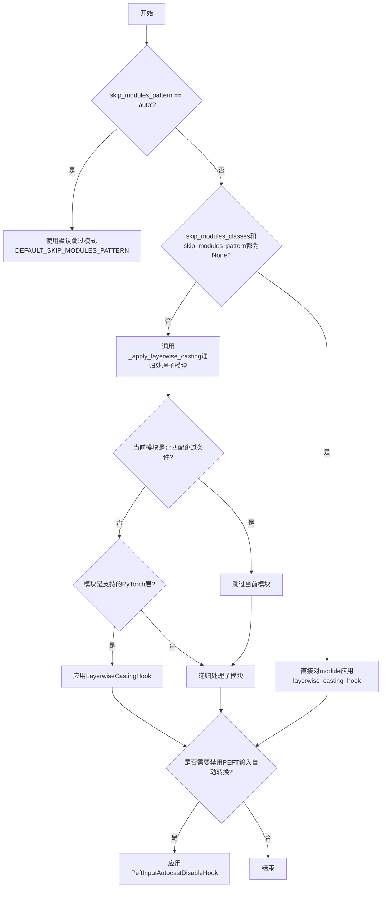

## 类结构

```
ModelHook (抽象基类)
├── LayerwiseCastingHook (层-wise类型转换钩子)
└── PeftInputAutocastDisableHook (禁用PEFT输入自动类型转换钩子)
```

## 全局变量及字段


### `_LAYERWISE_CASTING_HOOK`
    
层-wise转换钩子名称常量，用于标识层级别 casting 钩子

类型：`str`
    


### `_PEFT_AUTOCAST_DISABLE_HOOK`
    
PEFT自动转换禁用钩子名称常量，用于标识PEFT输入自动转换禁用钩子

类型：`str`
    


### `DEFAULT_SKIP_MODULES_PATTERN`
    
默认跳过的模块模式元组，包含pos_embed、patch_embed、norm等模块名称模式

类型：`tuple[str, ...]`
    


### `_SHOULD_DISABLE_PEFT_INPUT_AUTOCAST`
    
是否应禁用PEFT输入自动转换的标志，基于PEFT版本是否大于0.14.0

类型：`bool`
    


### `logger`
    
模块日志记录器，用于记录调试和信息日志

类型：`logging.Logger`
    


### `LayerwiseCastingHook.storage_dtype`
    
存储时的数据类型，用于在非计算时期保存模型权重的精度

类型：`torch.dtype`
    


### `LayerwiseCastingHook.compute_dtype`
    
计算时的数据类型，用于在前向传播期间进行高精度计算

类型：`torch.dtype`
    


### `LayerwiseCastingHook.non_blocking`
    
是否非阻塞转换标志，控制权重类型转换是否采用非阻塞方式

类型：`bool`
    
    

## 全局函数及方法


### `apply_layerwise_casting`

该函数是层-wise类型转换的主入口函数，用于将模块的权重参数在低精度dtype（存储用）和高精度dtype（计算用）之间切换，以实现内存优化。函数首先处理跳过模块的模式，然后递归地应用类型转换钩子到符合条件的子模块，并禁用PEFT的输入自动转换功能。

参数：

- `module`：`torch.nn.Module`，要应用层-wise类型转换的模块，通常是Diffusers的ModelMixin或其子模块
- `storage_dtype`：`torch.dtype`，存储权重时使用的低精度数据类型（如float8_e4m3fn），以节省显存
- `compute_dtype`：`torch.dtype`，前向传播计算时使用的高精度数据类型（如bfloat16），以保证计算精度
- `skip_modules_pattern`：`str | tuple[str, ...]`，匹配要跳过的模块名称的正则表达式模式列表，默认为"auto"使用预定义模式
- `skip_modules_classes`：`tuple[Type[torch.nn.Module], ...]`，要跳过的模块类类型列表，默认为None
- `non_blocking`：`bool`，如果为True，则权重转换操作将非阻塞执行，默认为False

返回值：`None`，该函数无返回值，通过副作用修改模块

#### 流程图

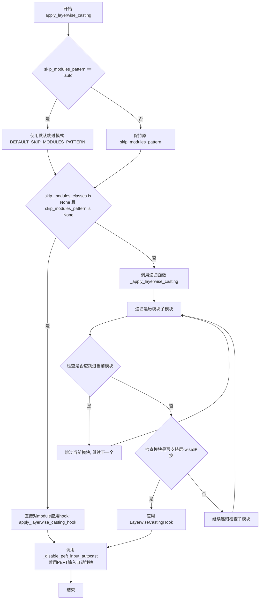

#### 带注释源码

```python
def apply_layerwise_casting(
    module: torch.nn.Module,
    storage_dtype: torch.dtype,
    compute_dtype: torch.dtype,
    skip_modules_pattern: str | tuple[str, ...] = "auto",
    skip_modules_classes: tuple[Type[torch.nn.Module], ...] | None = None,
    non_blocking: bool = False,
) -> None:
    r"""
    Applies layerwise casting to a given module. The module expected here is a Diffusers ModelMixin but it can be any
    nn.Module using diffusers layers or pytorch primitives.

    Example:

    ```python
    >>> import torch
    >>> from diffusers import CogVideoXTransformer3DModel

    >>> transformer = CogVideoXTransformer3DModel.from_pretrained(
    ...     model_id, subfolder="transformer", torch_dtype=torch.bfloat16
    ... )

    >>> apply_layerwise_casting(
    ...     transformer,
    ...     storage_dtype=torch.float8_e4m3fn,
    ...     compute_dtype=torch.bfloat16,
    ...     skip_modules_pattern=["patch_embed", "norm", "proj_out"],
    ...     non_blocking=True,
    ... )
    ```

    Args:
        module (`torch.nn.Module`):
            The module whose leaf modules will be cast to a high precision dtype for computation, and to a low
            precision dtype for storage.
        storage_dtype (`torch.dtype`):
            The dtype to cast the module to before/after the forward pass for storage.
        compute_dtype (`torch.dtype`):
            The dtype to cast the module to during the forward pass for computation.
        skip_modules_pattern (`tuple[str, ...]`, defaults to `"auto"`):
            A list of patterns to match the names of the modules to skip during the layerwise casting process. If set
            to `"auto"`, the default patterns are used. If set to `None`, no modules are skipped. If set to `None`
            alongside `skip_modules_classes` being `None`, the layerwise casting is applied directly to the module
            instead of its internal submodules.
        skip_modules_classes (`tuple[Type[torch.nn.Module], ...]`, defaults to `None`):
            A list of module classes to skip during the layerwise casting process.
        non_blocking (`bool`, defaults to `False`):
            If `True`, the weight casting operations are non-blocking.
    """
    # 如果skip_modules_pattern设为"auto"，则使用默认的跳过模式
    # 默认模式包括: pos_embed, patch_embed, norm, proj_in, proj_out等位置嵌入和归一化层
    if skip_modules_pattern == "auto":
        skip_modules_pattern = DEFAULT_SKIP_MODULES_PATTERN

    # 当skip_modules_classes和skip_modules_pattern都为None时，
    # 直接对整个module应用hook，而不是递归处理子模块
    if skip_modules_classes is None and skip_modules_pattern is None:
        apply_layerwise_casting_hook(module, storage_dtype, compute_dtype, non_blocking)
        return

    # 递归应用层-wise转换到符合条件的所有子模块
    _apply_layerwise_casting(
        module,
        storage_dtype,
        compute_dtype,
        skip_modules_pattern,
        skip_modules_classes,
        non_blocking,
    )
    # 禁用PEFT模块的输入自动类型转换，防止精度损失
    _disable_peft_input_autocast(module)
```


### `_apply_layerwise_casting`

内部递归函数，实现模块遍历和应用逻辑，用于将layerwise casting（逐层类型转换）应用到模块的叶子模块上，支持跳过指定的模块或模块类。

参数：

- `module`：`torch.nn.Module`，要应用layerwise casting的模块
- `storage_dtype`：`torch.dtype`，存储权重的低精度数据类型
- `compute_dtype`：`torch.dtype`，计算时使用的高精度数据类型
- `skip_modules_pattern`：`tuple[str, ...] | None`，要跳过的模块名称模式列表
- `skip_modules_classes`：`tuple[Type[torch.nn.Module], ...] | None`，要跳过的模块类列表
- `non_blocking`：`bool`，如果为`True`，权重转换操作是非阻塞的
- `_prefix`：`str`，内部使用的递归前缀，用于构建模块的完整名称

返回值：`None`，该函数不返回任何值，直接在模块上注册hook

#### 流程图

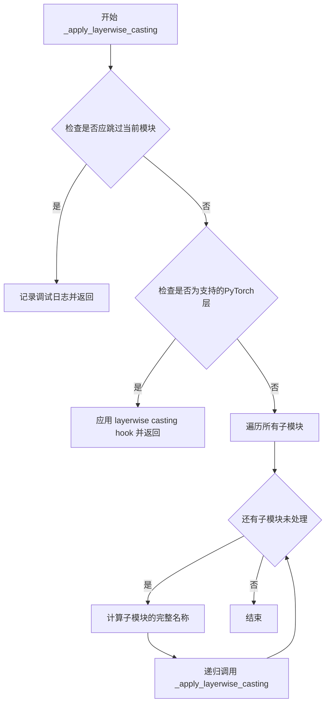

#### 带注释源码

```python
def _apply_layerwise_casting(
    module: torch.nn.Module,
    storage_dtype: torch.dtype,
    compute_dtype: torch.dtype,
    skip_modules_pattern: tuple[str, ...] | None = None,
    skip_modules_classes: tuple[Type[torch.nn.Module], ...] | None = None,
    non_blocking: bool = False,
    _prefix: str = "",
) -> None:
    """
    递归地为模块的子模块应用layerwise casting hook。
    
    该函数遍历模块树，对符合条件（支持的网络层）的模块应用LayerwiseCastingHook，
    使其在计算时使用高精度dtype，存储时使用低精度dtype，以减少内存占用。
    
    Args:
        module: 要遍历的模块
        storage_dtype: 存储权重用的低精度dtype
        compute_dtype: 计算时用的高精度dtype
        skip_modules_pattern: 要跳过的模块名称模式（通过正则匹配）
        skip_modules_classes: 要跳过的模块类
        non_blocking: 是否使用非阻塞的tensor转换
        _prefix: 内部参数，用于构建模块的层级路径名称
    """
    # 检查当前模块是否应该被跳过
    # 条件1: 模块类是skip_modules_classes中的任意一个
    # 条件2: 模块名称（_prefix）匹配skip_modules_pattern中的任意一个正则模式
    should_skip = (skip_modules_classes is not None and isinstance(module, skip_modules_classes)) or (
        skip_modules_pattern is not None and any(re.search(pattern, _prefix) for pattern in skip_modules_pattern)
    )
    
    # 如果应该跳过，记录调试日志并直接返回，不对该模块及其子模块应用hook
    if should_skip:
        logger.debug(f'Skipping layerwise casting for layer "{_prefix}"')
        return

    # 如果当前模块是支持的PyTorch层类型，应用layerwise casting hook并返回
    # _GO_LC_SUPPORTED_PYTORCH_LAYERS定义了支持的层类型（如nn.Linear, nn.Conv2d等）
    if isinstance(module, _GO_LC_SUPPORTED_PYTORCH_LAYERS):
        logger.debug(f'Applying layerwise casting to layer "{_prefix}"')
        apply_layerwise_casting_hook(module, storage_dtype, compute_dtype, non_blocking)
        return

    # 如果不是叶子模块，递归遍历其子模块
    for name, submodule in module.named_children():
        # 构建子模块的完整路径名称（用于模式匹配和日志）
        layer_name = f"{_prefix}.{name}" if _prefix else name
        _apply_layerwise_casting(
            submodule,
            storage_dtype,
            compute_dtype,
            skip_modules_pattern,
            skip_modules_classes,
            non_blocking,
            _prefix=layer_name,
        )
```


### `apply_layerwise_casting_hook`

将 `LayerwiseCastingHook` 注册到目标模块的 HookRegistry 中，使模块在前向传播时切换到计算精度 dtype，传播结束后切换回存储精度 dtype，从而实现层级的权重精度转换。

参数：

- `module`：`torch.nn.Module`，要附加 hook 的目标模块
- `storage_dtype`：`torch.dtype`，模块在 forward 前后用于存储的精度类型
- `compute_dtype`：`torch.dtype`，模块在 forward 期间用于计算的精度类型
- `non_blocking`：`bool`，如果为 `True`，权重转换操作采用非阻塞模式

返回值：`None`，无返回值

#### 流程图

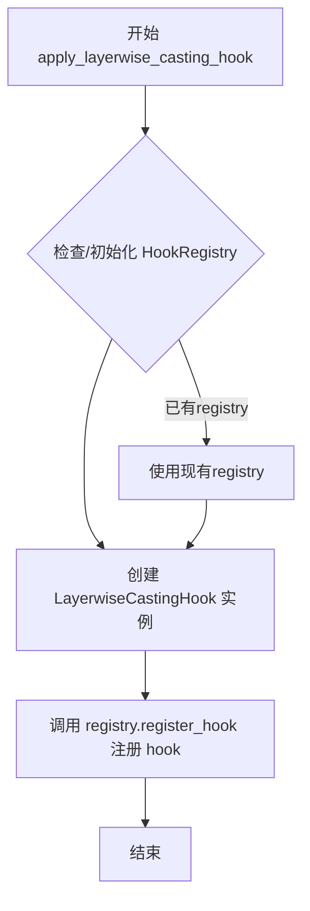

#### 带注释源码

```python
def apply_layerwise_casting_hook(
    module: torch.nn.Module, storage_dtype: torch.dtype, compute_dtype: torch.dtype, non_blocking: bool
) -> None:
    r"""
    Applies a `LayerwiseCastingHook` to a given module.

    Args:
        module (`torch.nn.Module`):
            The module to attach the hook to.
        storage_dtype (`torch.dtype`):
            The dtype to cast the module to before the forward pass.
        compute_dtype (`torch.dtype`):
            The dtype to cast the module to during the forward pass.
        non_blocking (`bool`):
            If `True`, the weight casting operations are non-blocking.
    """
    # 检查目标模块是否已存在 HookRegistry，若无则创建新实例
    registry = HookRegistry.check_if_exists_or_initialize(module)
    
    # 实例化层精度转换 hook，传入存储精度、计算精度和非阻塞标志
    hook = LayerwiseCastingHook(storage_dtype, compute_dtype, non_blocking)
    
    # 将 hook 注册到模块的 registry，使用全局标识符 _LAYERWISE_CASTING_HOOK
    registry.register_hook(hook, _LAYERWISE_CASTING_HOOK)
```


### `_is_layerwise_casting_active`

检查模块是否已应用layerwise casting。通过遍历模块的所有子模块，检查是否存在已注册的layerwise casting hook。

参数：

-  `module`：`torch.nn.Module`，要检查的模块

返回值：`bool`，如果模块或其任何子模块已应用layerwise casting hook则返回`True`，否则返回`False`

#### 流程图

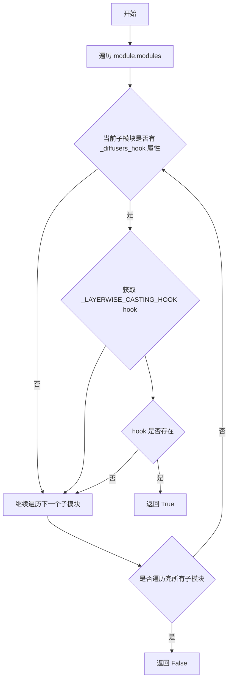

#### 带注释源码

```python
def _is_layerwise_casting_active(module: torch.nn.Module) -> bool:
    """
    检查模块是否已应用layerwise casting。

    遍历模块的所有子模块，检查是否存在已注册的layerwise casting hook。

    Args:
        module (torch.nn.Module): 要检查的模块

    Returns:
        bool: 如果模块或其任何子模块已应用layerwise casting hook则返回True，否则返回False
    """
    # 遍历模块的所有子模块（包括自身）
    for submodule in module.modules():
        # 检查子模块是否有 _diffusers_hook 属性（通常由 HookRegistry 添加）
        if (
            hasattr(submodule, "_diffusers_hook")
            # 尝试获取名为 _LAYERWISE_CASTING_HOOK 的 hook
            and submodule._diffusers_hook.get_hook(_LAYERWISE_CASTING_HOOK) is not None
        ):
            # 如果找到了 layerwise casting hook，返回 True
            return True
    # 遍历完所有子模块都没有找到 hook，返回 False
    return False
```


### `_disable_peft_input_autocast`

该函数用于在PEFT模块中禁用输入自动类型转换。它遍历给定模块的所有子模块，对符合条件的BaseTunerLayer子模块注册PeftInputAutocastDisableHook，以防止PEFT将输入强制转换为权重精度类型，从而避免精度损失。

参数：

-  `module`：`torch.nn.Module`，需要处理的主模块，函数将遍历其所有子模块以查找需要禁用自动类型转换的PEFT层

返回值：`None`，无返回值，该函数直接修改模块的钩子注册表

#### 流程图

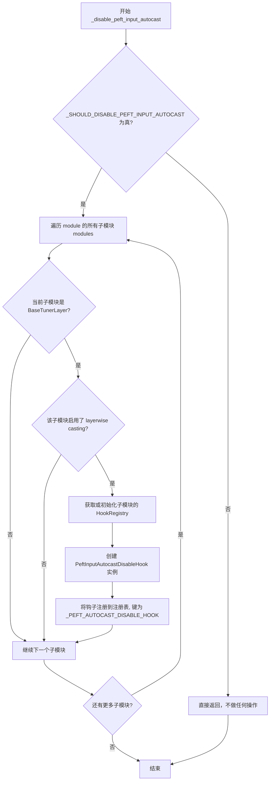

#### 带注释源码

```python
def _disable_peft_input_autocast(module: torch.nn.Module) -> None:
    """
    为PEFT模块禁用输入自动类型转换。
    
    当启用layerwise casting时，PEFT默认会将输入强制转换为权重精度类型，
    这可能导致精度损失。该函数通过注册PeftInputAutocastDisableHook来禁用此行为。
    
    Args:
        module: 需要处理的主模块，将遍历其所有子模块
    
    Returns:
        None
    """
    # 检查是否满足禁用PEFT输入自动类型转换的前提条件
    # _SHOULD_DISABLE_PEFT_INPUT_AUTOCAST 由全局变量控制:
    #   is_peft_available() and is_peft_version(">", "0.14.0")
    if not _SHOULD_DISABLE_PEFT_INPUT_AUTOCAST:
        return
    
    # 遍历模块的所有子模块（包括自身）
    for submodule in module.modules():
        # 检查子模块是否为PEFT的BaseTunerLayer类型
        if isinstance(submodule, BaseTunerLayer) and _is_layerwise_casting_active(submodule):
            # 获取或初始化该子模块的钩子注册表
            registry = HookRegistry.check_if_exists_or_initialize(submodule)
            
            # 创建禁用输入类型转换的钩子实例
            hook = PeftInputAutocastDisableHook()
            
            # 将钩子注册到注册表，使用指定的钩子名称
            registry.register_hook(hook, _PEFT_AUTOCAST_DISABLE_HOOK)
```


### `LayerwiseCastingHook.initialize_hook`

该方法在初始化阶段将传入的 PyTorch 模块转换为指定的 storage_dtype，以便以低精度存储模块权重，从而减少内存占用。

参数：

- `module`：`torch.nn.Module`，需要进行层级别转换的模块

返回值：`torch.nn.Module`，返回转换后的模块

#### 流程图

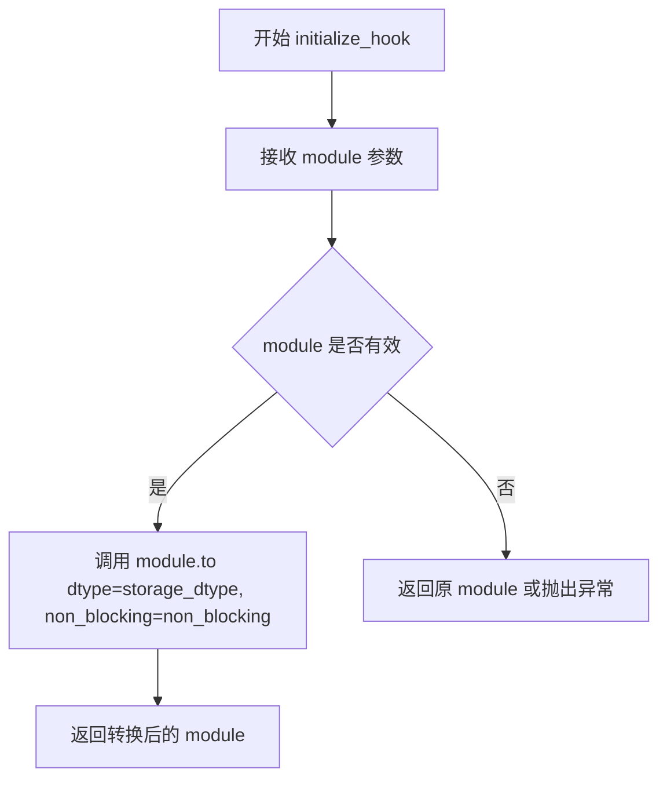

#### 带注释源码

```python
def initialize_hook(self, module: torch.nn.Module):
    """
    初始化 hook，将模块的权重转换为 storage_dtype 进行存储。
    
    该方法在模型初始化时被调用，将模块的所有参数和缓冲区转换为
    指定的低精度数据类型（storage_dtype），以降低内存占用。
    """
    # 使用 PyTorch 的 to() 方法将模块转换为指定的存储数据类型
    # non_blocking 参数控制是否使用非阻塞传输（在 CPU-GPU 传输时可提升性能）
    module.to(dtype=self.storage_dtype, non_blocking=self.non_blocking)
    
    # 返回转换后的模块，供后续流程使用
    return module
```


### `LayerwiseCastingHook.deinitalize_hook`

该方法用于撤销 `LayerwiseCastingHook` 对模块所做的修改，但由于层-wise  casting 的特性（权重已被转换为低精度存储格式，重新转换回原始精度会导致精度损失），该方法不被支持，总是抛出 `NotImplementedError`。

参数：

- `module`：`torch.nn.Module`，需要撤销层-wise casting 的目标模块

返回值：无（该方法总是抛出 `NotImplementedError` 异常，不返回任何值）

#### 流程图

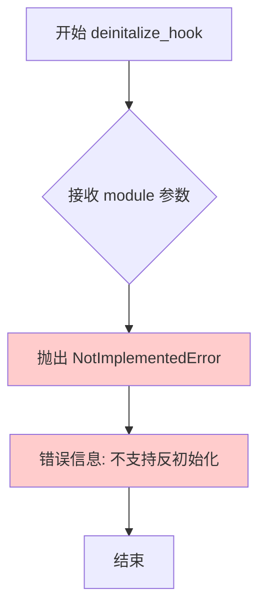

#### 带注释源码

```python
def deinitalize_hook(self, module: torch.nn.Module):
    """
    尝试撤销 LayerwiseCastingHook 对模块的修改。
    
    注意：此方法不支持反初始化操作，因为：
    1. 模型启用 layerwise casting 后，权重已被转换为低精度 dtype 进行存储
    2. 将权重重新转换回原始 dtype 会导致精度损失
    3. 这可能会影响模型的生成质量
    4. 建议重新初始化并以原始 dtype 加载模型
    
    Args:
        module (torch.nn.Module): 需要撤销 layerwise casting 的目标模块
        
    Raises:
        NotImplementedError: 总是抛出此异常，表示不支持反初始化操作
    """
    raise NotImplementedError(
        "LayerwiseCastingHook does not support deinitialization. A model once enabled with layerwise casting will "
        "have casted its weights to a lower precision dtype for storage. Casting this back to the original dtype "
        "will lead to precision loss, which might have an impact on the model's generation quality. The model should "
        "be re-initialized and loaded in the original dtype."
    )
```


### `LayerwiseCastingHook.pre_forward`

该方法在模块前向传播之前被调用，负责将模块的权重从存储精度（storage_dtype）转换为计算精度（compute_dtype），以在保证计算质量的同时减少内存占用。

参数：

- `module`：`torch.nn.Module`，执行前向传播的模块，Hook 绑定到该模块上
- `*args`：可变位置参数，包含前向传播所需的位置参数
- `**kwargs`：可变关键字参数，包含前向传播所需的关键字参数

返回值：`tuple[tuple, dict]`，返回处理后的 args 和 kwargs 元组，供后续前向传播使用

#### 流程图

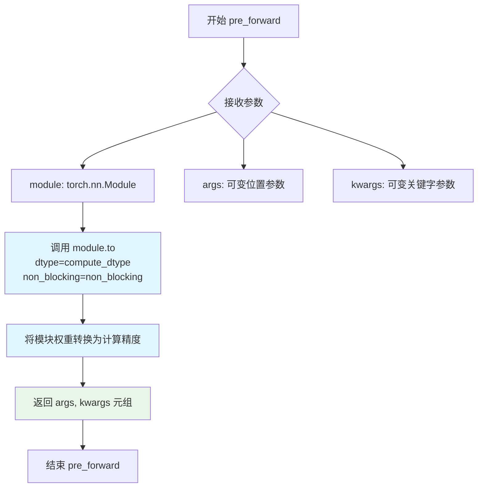

#### 带注释源码

```python
def pre_forward(self, module: torch.nn.Module, *args, **kwargs):
    """
    前向传播前的 Hook 方法。
    
    该方法在模型的 forward 方法执行之前被调用，其主要作用是：
    1. 将模块的权重从存储精度（storage_dtype）转换为计算精度（compute_dtype）
    2. 这样可以确保在计算时使用高精度数据类型，保证计算结果的准确性
    3. 计算完成后再通过 post_forward 转换回存储精度，以节省显存
    
    参数:
        module (torch.nn.Module): 正在执行前向传播的 PyTorch 模块。
                                  该模块的权重需要在计算前转换为 compute_dtype。
        *args: 可变位置参数，包含传递给 forward 方法的位置参数。
        **kwargs: 可变关键字参数，包含传递给 forward 方法的关键字参数。
    
    返回:
        tuple: 包含 args 和 kwargs 的元组 (args, kwargs)。
              返回原始参数以便原始 forward 方法可以继续使用这些参数。
    """
    # 将模块的所有参数和缓冲区从 storage_dtype 转换为 compute_dtype
    # non_blocking=True 时，GPU 操作会异步执行，减少 CPU 等待时间
    module.to(dtype=self.compute_dtype, non_blocking=self.non_blocking)
    
    # 返回元组形式的参数，PyTorch 的 Hook 机制要求返回值格式为 (args, kwargs)
    # 这样原始的 forward 方法可以通过 *args 和 **kwargs 接收这些参数
    return args, kwargs
```


### `LayerwiseCastingHook.post_forward`

在神经网络前向传播完成后，将模块的权重从计算精度（compute_dtype）转换回存储精度（storage_dtype），以节省显存占用。

参数：

- `module`：`torch.nn.Module`，在前向传播中使用的模块，需要将其权重从计算精度转回存储精度
- `output`：任意类型（通常为 `torch.Tensor` 或其元组），前向传播的输出结果

返回值：任意类型，返回与输入相同的 `output`，不做修改

#### 流程图

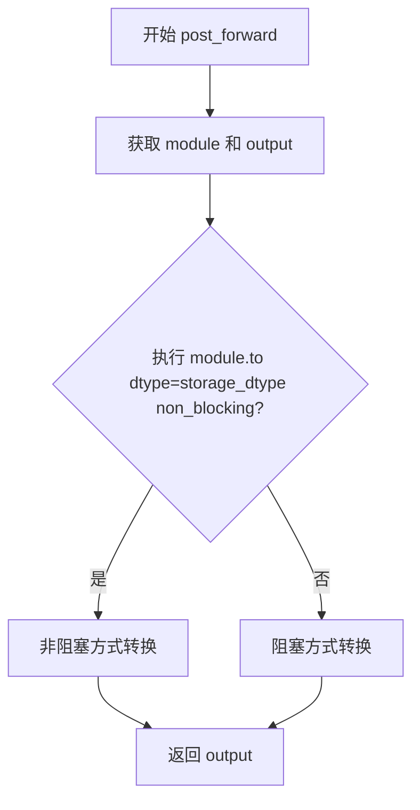

#### 带注释源码

```python
def post_forward(self, module: torch.nn.Module, output):
    """
    在前向传播后将模块权重转换回存储精度
    
    Args:
        module: 刚完成前向传播的 nn.Module 实例
        output: 前向传播的输出 tensor
    
    Returns:
        未经修改的 output tensor
    """
    # 将模块的权重和参数从 compute_dtype 转回 storage_dtype
    # 这样可以在不使用的期间以低精度存储，节省显存
    # non_blocking 参数控制是否使用非阻塞的异步传输
    module.to(dtype=self.storage_dtype, non_blocking=self.non_blocking)
    
    # 直接返回原始输出，不做任何修改
    # 输出可能是单个 Tensor 或包含多个 Tensor 的元组
    return output
```


### `PeftInputAutocastDisableHook.new_forward`

该方法是一个前向传播钩子，用于在禁用输入类型转换的上下文中调用模块的原始前向传播方法，从而避免 PEFT 层将输入强制转换为权重精度导致的精度损失问题。

参数：

- `self`：`PeftInputAutocastDisableHook`，方法所属的实例对象
- `module`：`torch.nn.Module`，执行钩子的目标模块
- `*args`：`tuple`，传递给原始前向传播的位置参数序列
- `**kwargs`：`dict`，传递给原始前向传播的关键字参数字典

返回值：`Any`，原始前向传播的输出（类型取决于 `self.fn_ref.original_forward` 的具体返回值）

#### 流程图

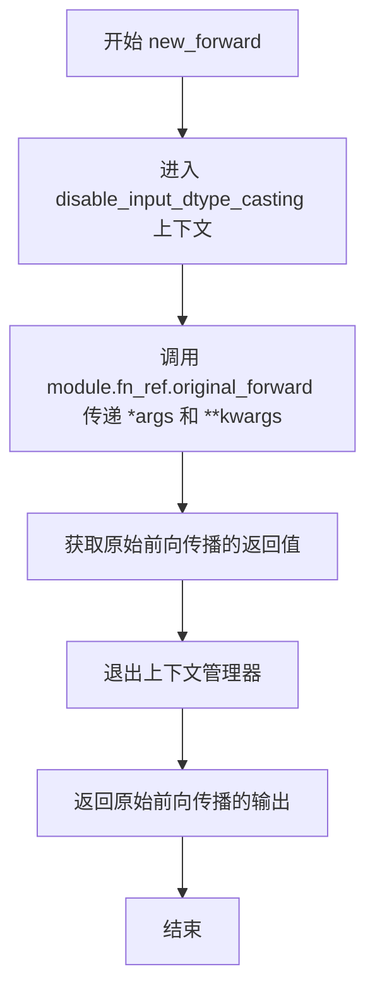

#### 带注释源码

```python
def new_forward(self, module: torch.nn.Module, *args, **kwargs):
    """
    禁用输入类型转换后调用原始前向传播。

    该方法通过 PEFT 的 disable_input_dtype_casting 上下文管理器临时禁用输入数据类型转换，
    然后调用模块保存的原始前向方法。这样可以防止在层wise casting场景下，输入被强制转换为
    较低的存储精度类型（如 float8），避免精度损失和信息丢失。

    Args:
        module: torch.nn.Module - 执行钩子的目标模块
        *args: tuple - 传递给原始前向传播的位置参数
        **kwargs: dict - 传递给原始前向传播的关键字参数

    Returns:
        Any - 原始前向传播的返回值
    """
    # 使用 PEFT 的 disable_input_dtype_casting 上下文管理器
    # 该上下文管理器会临时禁用模块的输入类型转换行为
    with disable_input_dtype_casting(module):
        # 调用模块保存的原始前向方法（绕过任何钩子修改）
        # self.fn_ref.original_forward 是预先保存的模块原始 forward 方法引用
        return self.fn_ref.original_forward(*args, **kwargs)
```

## 关键组件


### LayerwiseCastingHook

一个模型Hook类，实现权重在不同精度dtype之间转换的核心逻辑。在前向传播前将权重转换为compute_dtype用于计算，传播后再转回storage_dtype用于存储，显著降低内存占用。

### PeftInputAutocastDisableHook

一个模型Hook类，用于禁用PEFT模块的输入自动类型转换。防止PEFT层将输入强制转换为低精度storage dtype导致信息丢失，确保推理质量。

### apply_layerwise_casting

主入口函数，将逐层类型转换应用于整个模块。通过skip_modules_pattern和skip_modules_classes参数灵活控制要跳过的模块，并自动处理PEFT输入自动转换的禁用逻辑。

### _apply_layerwise_casting

递归遍历模块子树的内部函数，根据名称模式和类类型判断是否跳过当前模块，对支持的PyTorch层应用layerwise casting hook。

### apply_layerwise_casting_hook

将LayerwiseCastingHook注册到指定模块的HookRegistry的辅助函数，实现hook与模块的绑定。

### _is_layerwise_casting_active

检查模块是否已激活layerwise casting功能的辅助函数，通过遍历子模块查找已注册的LayerwiseCastingHook。

### _disable_peft_input_autocast

为启用了layerwise casting的PEFT模块注册PeftInputAutocastDisableHook，防止PEFT自动转换输入导致精度损失。

### HookRegistry

模型hook的注册表系统，用于管理模块上挂载的多个hook，支持hook的注册、查找和执行。

### _GO_LC_SUPPORTED_PYTORCH_LAYERS

支持逐层类型转换的PyTorch层类型集合，定义了哪些层可以应用layerwise casting。

### DEFAULT_SKIP_MODULES_PATTERN

默认的模块跳过模式列表，包括pos_embed、patch_embed、norm等在layerwise casting时需要跳过的模块名称模式。


## 问题及建议


### 已知问题

-   **typo错误**：`deinitalize_hook` 方法名少了一个字母'i'，应为 `deinitialize_hook`
-   **缺少输入验证**：函数参数 `storage_dtype`、`compute_dtype` 和 `module` 缺少有效性检查，可能导致运行时错误
-   **正则表达式重复编译**：在 `_apply_layerwise_casting` 中每次递归都调用 `re.search(pattern, _prefix)`，未对正则表达式进行缓存
-   **重复遍历模块**：`apply_layerwise_casting` 函数中先调用 `_apply_layerwise_casting`，然后又调用 `_disable_peft_input_autocast` 再次遍历所有子模块，效率较低
-   **未使用的类属性**：`LayerwiseCastingHook` 类中定义了 `_is_stateful = False`，但从未被使用
-   **硬编码的版本比较**：`is_peft_version(">", "0.14.0")` 使用字符串比较版本号，不够健壮
-   **潜在的运行时导入错误**：PEFT相关的导入在条件分支中，如果PEFT版本不满足条件但后续代码使用了相关功能，会导致 `NameError`
-   **GPU同步开销**：`pre_forward` 和 `post_forward` 中每次都调用 `.to(dtype=...)`，会触发GPU同步操作，可能影响性能

### 优化建议

-   **修复typo**：将 `deinitalize_hook` 重命名为 `deinitialize_hook`
-   **添加输入验证**：在 `apply_layerwise_casting` 入口处添加 dtype 有效性和 module 类型检查
-   **缓存正则表达式**：使用 `re.compile` 预编译正则表达式，或使用 `functools.lru_cache` 缓存匹配结果
-   **合并模块遍历**：将 `_disable_peft_input_autocast` 的逻辑整合到 `_apply_layerwise_casting` 中，避免重复遍历
-   **移除未使用的属性**：删除 `_is_stateful = False` 或实现其预期功能
-   **改进版本检查**：使用 `packaging.version` 或类似的版本解析库进行版本比较
-   **移动PEFT导入**：将 PEFT 相关导入移到函数内部或顶部，使用 try-except 处理导入失败的情况
-   **优化dtype转换**：考虑使用 `torch.cuda.synchronize()` 的替代方案，或提供异步选项减少同步开销

## 其它


### 设计目标与约束

本模块的设计目标是实现模型权重的分层精度转换，在保证计算精度的同时显著降低内存占用。核心约束包括：1）仅支持特定的PyTorch层类型（_GO_LC_SUPPORTED_PYTORCH_LAYERS）；2）一旦启用layerwise casting，无法完全还原到原始精度（存在精度损失）；3）需要与PEFT库（>0.14.0版本）配合使用时额外处理输入自动转换；4）skip_modules_pattern支持正则表达式匹配，但性能开销随模块数量增加而增加。

### 错误处理与异常设计

LayerwiseCastingHook的deinitalize_hook方法抛出NotImplementedError，明确告知调用者该hook不支持反初始化。代码假设调用者不会尝试对已应用layerwise casting的模型进行反向操作。若PEFT未安装或版本不符合要求，_SHOULD_DISABLE_PEFT_INPUT_AUTOCAST为False，相关hook注册被跳过。若skip_modules_pattern为"auto"，自动使用DEFAULT_SKIP_MODULES_PATTERN。模块类型检查使用isinstance，模式匹配使用re.search，这些操作均未做异常捕获。

### 数据流与状态机

LayerwiseCastingHook的状态机包含三个状态：初始化状态（模块被转换为storage_dtype）、计算状态（模块在前向传播时被转换为compute_dtype）、存储状态（模块在后向传播后被转换回storage_dtype）。数据流路径：apply_layerwise_casting → _apply_layerwise_casting（递归遍历子模块） → apply_layerwise_casting_hook（注册hook） → _disable_peft_input_autocast（处理PEFT兼容）。对于每个目标模块，hook在pre_forward时将权重转换为compute_dtype，在post_forward时转换回storage_dtype。

### 外部依赖与接口契约

本模块依赖以下外部组件：1）torch库（提供dtype和nn.Module）；2）diffusers库的utils模块（get_logger、is_peft_available、is_peft_version）；3）diffusers库的_common模块（_GO_LC_SUPPORTED_PYTORCH_LAYERS）；4）diffusers库的hooks模块（HookRegistry、ModelHook）；5）当PEFT可用且版本>0.14.0时，额外依赖peft.helpers.disable_input_dtype_casting和peft.tuners.tuners_utils.BaseTunerLayer。HookRegistry.check_if_exists_or_initialize方法必须返回具有register_hook和get_hook方法的对象。

### 配置与参数设计

apply_layerwise_casting函数暴露以下可配置参数：storage_dtype（权重存储的精度，默认由调用者指定）、compute_dtype（计算时的精度，默认由调用者指定）、skip_modules_pattern（跳过转换的模块名模式，支持"auto"、None或tuple[str, ...]）、skip_modules_classes（跳过转换的模块类）、non_blocking（是否使用非阻塞转换）。DEFAULT_SKIP_MODULES_PATTERN包含"pos_embed"、"patch_embed"、"norm"、"\^proj_in\$"、"\^proj_out\$"等模式，用于跳过位置嵌入、补丁嵌入、归一化和投影层。

### 性能考量与优化建议

权重转换操作（module.to(dtype=...)）在每次前向和后向传播时都会执行，非阻塞模式（non_blocking=True）可减少同步等待时间。递归遍历模块树（_apply_layerwise_casting）的时间复杂度为O(n)，其中n为子模块数量。对于大规模模型，建议预先确定skip_modules_pattern以减少不必要的hook注册。PEFT模块的额外hook注册（_disable_peft_input_autocast）会遍历所有子模块，可能造成性能开销。

### 兼容性设计

本模块支持Python 3.8+（基于类型注解语法）。torch.dtype作为参数类型，确保与PyTorch版本兼容。PEFT兼容性通过版本检查（is_peft_version(">", "0.14.0")）动态确定，未安装PEFT时相关功能自动禁用。skip_modules_pattern的默认值考虑了CogVideoX等模型的典型结构，但对于不同架构可能需要自定义。

### 测试策略建议

应覆盖以下测试场景：1）基本layerwise casting功能验证（权重精度转换正确性）；2）skip_modules_pattern和skip_modules_classes的过滤逻辑；3）PEFT集成场景下的输入精度保持；4）多模块嵌套场景；5）non_blocking参数对异步执行的影响；6）内存占用对比测试；7）模型输出质量对比测试（验证精度损失在可接受范围内）。

### 使用限制与注意事项

本模块不适用于以下场景：1）需要对模型进行反向操作并保持原始精度；2）模型包含不支持转换的自定义层；3）需要与不支持hook的推理框架集成。注意事项：1）layerwise casting主要用于推理场景，训练场景需额外验证梯度传播；2）某些操作（如模型保存）可能需要临时转换为原始精度；3）不同硬件平台对float8等低精度格式的支持可能不同。


    