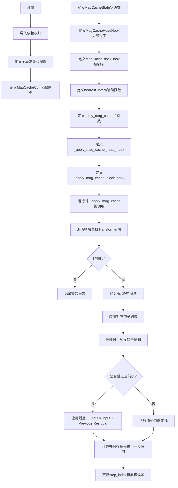
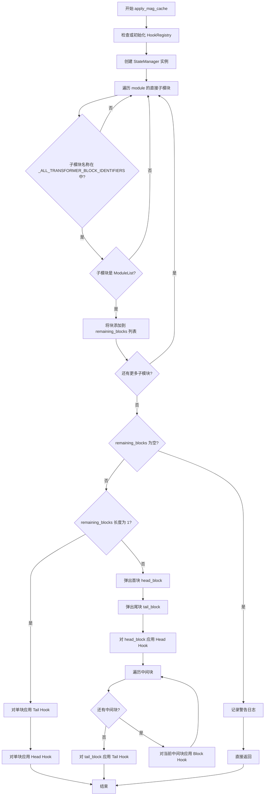
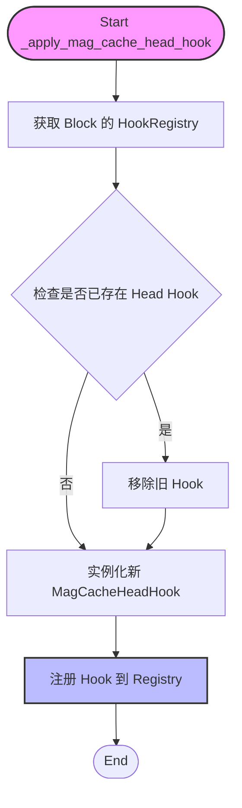
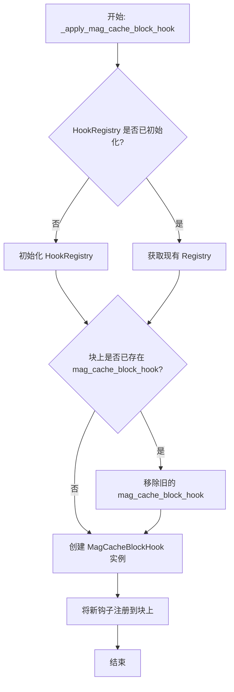
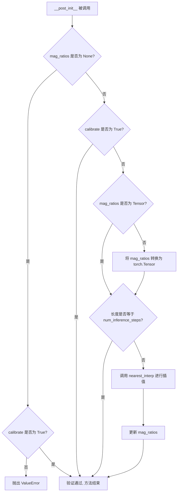
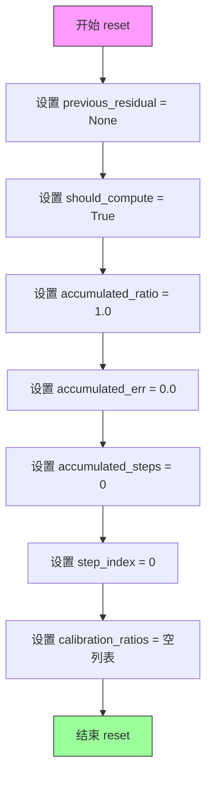
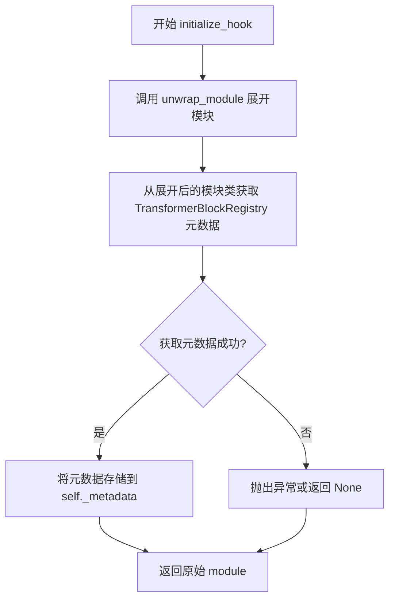
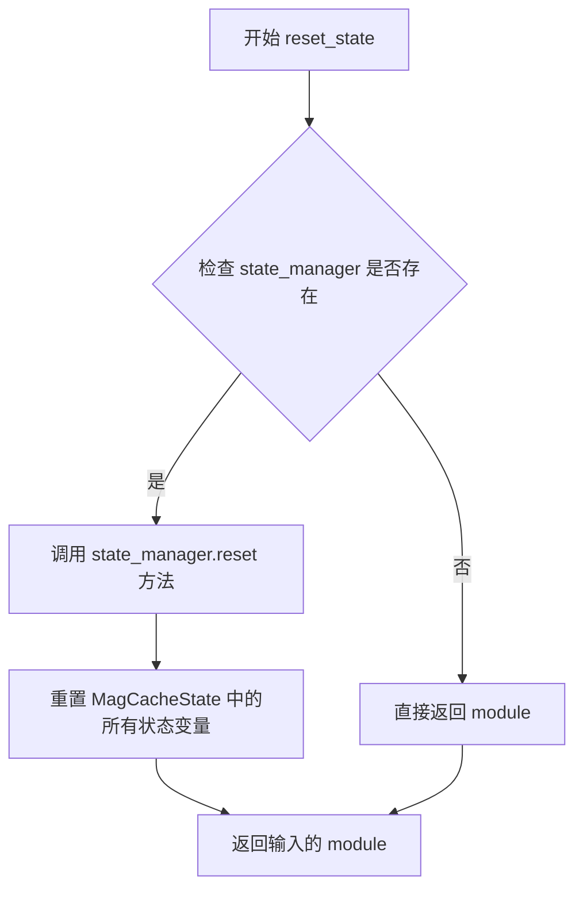
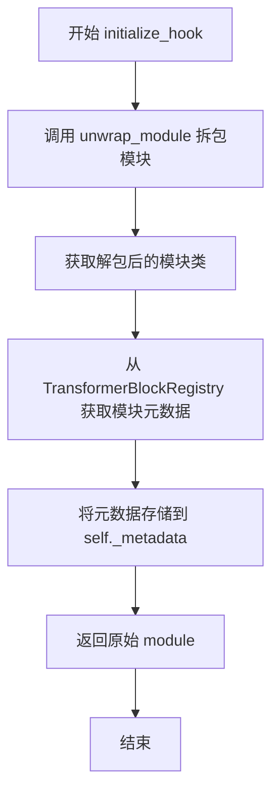
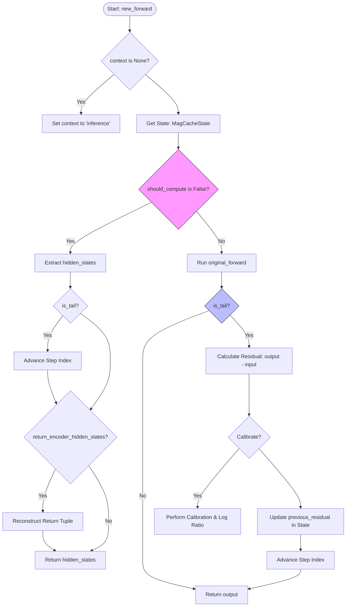

# `diffusers\src\diffusers\hooks\mag_cache.py` 详细设计文档

MagCache是一个用于加速扩散模型推理的库，通过基于累积误差阈值的智能步骤跳过机制，在保持图像质量的同时显著减少推理计算量。该模块提供了配置管理、状态追踪、模型钩子注入等功能，支持Flux等主流扩散模型。

## 整体流程



## 类结构

```
MagCacheConfig (配置数据类)
MagCacheState (状态管理类)
MagCacheHeadHook (ModelHook) - 头部块钩子
MagCacheBlockHook (ModelHook) - 中间/尾部块钩子
TransformerBlockRegistry (外部依赖)
StateManager (外部依赖)
HookRegistry (外部依赖)
```

## 全局变量及字段


### `_MAG_CACHE_LEADER_BLOCK_HOOK`
    
头部块钩子标识符

类型：`str`
    


### `_MAG_CACHE_BLOCK_HOOK`
    
中间块钩子标识符

类型：`str`
    


### `FLUX_MAG_RATIOS`
    
Flux模型的默认mag比率数组(28维)

类型：`torch.Tensor`
    


### `nearest_interp`
    
使用最近邻插值将源数组插值到目标长度

类型：`function`
    


### `MagCacheConfig.threshold`
    
累积误差阈值，低于此值时跳过块计算

类型：`float`
    


### `MagCacheConfig.max_skip_steps`
    
最大连续跳过步数(K值)

类型：`int`
    


### `MagCacheConfig.retention_ratio`
    
保留比率，前N步不跳过

类型：`float`
    


### `MagCacheConfig.num_inference_steps`
    
推理总步数，用于插值mag_ratios

类型：`int`
    


### `MagCacheConfig.mag_ratios`
    
预计算的幅度比率

类型：`Optional[Union[torch.Tensor, List[float]]]`
    


### `MagCacheConfig.calibrate`
    
校准模式标志

类型：`bool`
    


### `MagCacheState.previous_residual`
    
上一步的残差(output-input)

类型：`torch.Tensor`
    


### `MagCacheState.head_block_input`
    
头部块的输入

类型：`Union[torch.Tensor, Tuple[torch.Tensor, ...]]`
    


### `MagCacheState.should_compute`
    
当前步是否需要计算

类型：`bool`
    


### `MagCacheState.accumulated_ratio`
    
累积的幅度比率

类型：`float`
    


### `MagCacheState.accumulated_err`
    
累积的误差

类型：`float`
    


### `MagCacheState.accumulated_steps`
    
累积的跳过步数

类型：`int`
    


### `MagCacheState.step_index`
    
当前推理步索引

类型：`int`
    


### `MagCacheState.calibration_ratios`
    
校准过程中收集的比率

类型：`List[float]`
    


### `MagCacheHeadHook.state_manager`
    
状态管理器实例

类型：`StateManager`
    


### `MagCacheHeadHook.config`
    
配置对象

类型：`MagCacheConfig`
    


### `MagCacheHeadHook._metadata`
    
TransformerBlockRegistry元数据

类型：`TransformerBlockRegistry`
    


### `MagCacheBlockHook.state_manager`
    
状态管理器

类型：`StateManager`
    


### `MagCacheBlockHook.is_tail`
    
是否为尾部块标志

类型：`bool`
    


### `MagCacheBlockHook.config`
    
配置对象

类型：`MagCacheConfig`
    


### `MagCacheBlockHook._metadata`
    
TransformerBlockRegistry元数据

类型：`TransformerBlockRegistry`
    
    

## 全局函数及方法


### `nearest_interp`

该函数实现最近邻插值算法，将源张量数组调整到目标长度，通过计算缩放比例并使用四舍五入的索引映射实现数组维度的缩放，常用于将预计算的 MagCache 比率数组插值到实际推理步数。

参数：

- `src_array`：`torch.Tensor`，源数组，需要进行插值的输入张量
- `target_length`：`int`，目标长度，插值后期望的数组长度

返回值：`torch.Tensor`，插值后的数组，长度等于 target_length

#### 流程图

```mermaid
flowchart TD
    A[开始 nearest_interp] --> B[获取 src_array 长度 src_length]
    B --> C{target_length == 1?}
    C -->|是| D[返回 src_array 的最后一个元素 src_array[-1:]
    D --> G[结束]
    C -->|否| E[计算缩放比例 scale = (src_length - 1) / (target_length - 1)]
    E --> F[生成目标索引网格 grid = torch.arange target_length]
    F --> H[计算映射索引 mapped_indices = round(grid * scale)]
    H --> I[将映射索引转换为长整型 mapped_indices.long()]
    I --> J[使用映射索引从源数组取值 return src_array[mapped_indices]]
    J --> G
```

#### 带注释源码

```python
def nearest_interp(src_array: torch.Tensor, target_length: int) -> torch.Tensor:
    """
    Interpolate the source array to the target length using nearest neighbor interpolation.
    
    该函数通过计算缩放因子并使用最近邻插值方法，将源数组调整到目标长度。
    主要用于 MagCache 中将预计算的 mag_ratios 数组插值到实际推理步数。
    
    参数:
        src_array: 源数组，类型为 torch.Tensor
        target_length: 目标长度，类型为 int
    
    返回:
        插值后的数组，类型为 torch.Tensor
    """
    # 获取源数组的长度
    src_length = len(src_array)
    
    # 如果目标长度仅为1，直接返回源数组的最后一个元素
    # 这种情况下，最近邻插值就是取最后一个值
    if target_length == 1:
        return src_array[-1:]

    # 计算缩放比例
    # 公式: (src_length - 1) / (target_length - 1)
    # 减1是因为索引从0开始，需要将范围 [0, src_length-1] 映射到 [0, target_length-1]
    scale = (src_length - 1) / (target_length - 1)
    
    # 创建目标索引网格，设备与源数组相同，确保计算在同一设备上进行
    # dtype=torch.float32 用于确保缩放计算的精度
    grid = torch.arange(target_length, device=src_array.device, dtype=torch.float32)
    
    # 计算映射后的索引：grid * scale 得到连续的缩放后位置
    # torch.round 四舍五入实现最近邻选择
    # .long() 转换为索引所需的整数类型
    mapped_indices = torch.round(grid * scale).long()
    
    # 使用映射后的索引从源数组中选取对应位置的元素
    # 实现最近邻插值的核心步骤
    return src_array[mapped_indices]
```


### `apply_mag_cache`

该函数是 MagCache 的主入口函数，负责将 MagCache 钩子应用到指定的 PyTorch 模块（通常是 Transformer 模型）。它通过遍历模块的子模块识别 transformer 块，并根据块的数量（单个或多个）选择性地应用 Head Hook、Tail Hook 或 Block Hook，从而实现推理过程中的计算跳过优化。

参数：

- `module`：`torch.nn.Module`，目标模块，要在其上应用 MagCache 优化的模块，通常为 Transformer 模型。
- `config`：`MagCacheConfig`，MagCache 的配置对象，包含阈值、最大跳过步数、保留比例、推理步数以及预计算的幅值比率等参数。

返回值：`None`，该函数无返回值，通过副作用（注册钩子）完成模块的修改。

#### 流程图



#### 带注释源码

```python
def apply_mag_cache(module: torch.nn.Module, config: MagCacheConfig) -> None:
    """
    Applies MagCache to a given module (typically a Transformer).

    Args:
        module (`torch.nn.Module`):
            The module to apply MagCache to.
        config (`MagCacheConfig`):
            The configuration for MagCache.
    """
    # Initialize registry on the root module so the Pipeline can set context.
    # 确保模块上已初始化 HookRegistry，用于后续钩子的注册与管理
    HookRegistry.check_if_exists_or_initialize(module)

    # 创建状态管理器，管理 MagCacheState 实例，用于在钩子间共享状态
    state_manager = StateManager(MagCacheState, (), {})
    remaining_blocks = []

    # 遍历模块的直接子模块，识别符合要求的 transformer 块
    # _ALL_TRANSFORMER_BLOCK_IDENTIFIERS 定义了可能的 transformer 块名称集合
    for name, submodule in module.named_children():
        if name not in _ALL_TRANSFORMER_BLOCK_IDENTIFIERS or not isinstance(submodule, torch.nn.ModuleList):
            continue
        # 遍历 ModuleList 中的每个块
        for index, block in enumerate(submodule):
            remaining_blocks.append((f"{name}.{index}", block))

    # 如果未找到任何 transformer 块，记录警告并退出
    if not remaining_blocks:
        logger.warning("MagCache: No transformer blocks found to apply hooks.")
        return

    # 处理单个块的模型（如某些轻量级模型）
    if len(remaining_blocks) == 1:
        name, block = remaining_blocks[0]
        logger.info(f"MagCache: Applying Head+Tail Hooks to single block '{name}'")
        # 对单块同时应用 Tail Hook（计算残差）和 Head Hook（决定是否跳过）
        _apply_mag_cache_block_hook(block, state_manager, config, is_tail=True)
        _apply_mag_cache_head_hook(block, state_manager, config)
        return

    # 多块模型：分别处理首块、尾块和中间块
    head_block_name, head_block = remaining_blocks.pop(0)  # 取出首块
    tail_block_name, tail_block = remaining_blocks.pop(-1)  # 取出尾块

    logger.info(f"MagCache: Applying Head Hook to {head_block_name}")
    # 对首块应用 Head Hook，负责判断当前推理步骤是否应该跳过计算
    _apply_mag_cache_head_hook(head_block, state_manager, config)

    # 对中间块应用普通 Block Hook，仅传递隐藏状态
    for name, block in remaining_blocks:
        _apply_mag_cache_block_hook(block, state_manager, config)

    logger.info(f"MagCache: Applying Tail Hook to {tail_block_name}")
    # 对尾块应用 Tail Hook，负责计算残差（输出-输入）供下一跳步骤使用
    _apply_mag_cache_block_hook(tail_block, state_manager, config, is_tail=True)
```


### `_apply_mag_cache_head_hook`

该函数是一个内部辅助函数，用于将 `MagCacheHeadHook`（头部钩子）注册到指定的 transformer 块（即模型的第一层或“头部”）。它负责初始化钩子上下文并确保钩子被正确且唯一地绑定到目标模块上，以便 MagCache 机制能够管理该块的输入输出状态。

参数：

- `block`：`torch.nn.Module`，目标 transformer 块（通常是模型的第一个 block），钩子将依附于此模块。
- `state_manager`：`StateManager`，状态管理器实例，用于在不同的钩子（头部、躯干、尾部）之间共享推理状态（如是否跳过的决策、残留误差等）。
- `config`：`MagCacheConfig`，MagCache 的配置对象，包含阈值、跳过步数、mag_ratios 等关键参数。

返回值：`None`，该函数通过副作用（注册钩子）生效，不返回任何数据。

#### 流程图



#### 带注释源码

```python
def _apply_mag_cache_head_hook(block: torch.nn.Module, state_manager: StateManager, config: MagCacheConfig) -> None:
    """
    将 MagCache 头部钩子应用到指定的块。
    
    Args:
        block: 目标 torch 模块。
        state_manager: 状态管理器。
        config: 配置对象。
    """
    # 1. 获取或初始化当前 block 的 HookRegistry。
    # HookRegistry 负责管理挂载在特定模块上的所有钩子。
    registry = HookRegistry.check_if_exists_or_initialize(block)

    # 2. 检查是否已经存在 'mag_cache_leader_block_hook'。
    # 如果存在，先移除它。这允许在运行时动态重新应用 MagCache（例如切换推理模式）。
    if registry.get_hook(_MAG_CACHE_LEADER_BLOCK_HOOK) is not None:
        registry.remove_hook(_MAG_CACHE_LEADER_BLOCK_HOOK)

    # 3. 实例化 MagCacheHeadHook。
    # 这个钩子将拦截 block 的前向传播，用于判断是否需要跳过计算或应用残差。
    hook = MagCacheHeadHook(state_manager, config)
    
    # 4. 将新创建的钩子注册到注册表中，并标记为 leader hook。
    registry.register_hook(hook, _MAG_CACHE_LEADER_BLOCK_HOOK)
```


### `_apply_mag_cache_block_hook`

内部函数，用于将 MagCache 块钩子（MagCacheBlockHook）注册到指定的 Transformer 块模块上，以便在该块的前向传播过程中实现 MagCache 的缓存跳过逻辑。

参数：

- `block`：`torch.nn.Module`，要应用 MagCache 块钩子的目标 Transformer 块模块
- `state_manager`：`StateManager`，状态管理器实例，负责在多个块之间共享 MagCache 的运行状态（如累计误差、跳步计数等）
- `config`：`MagCacheConfig`，MagCache 的配置对象，包含阈值、最大跳步数、保留比例、mag_ratios 等参数
- `is_tail`：`bool`，可选参数（默认为 False），标识该块是否为模型的尾部块，尾部块需要额外计算残差（residual）用于后续步骤的跳过决策

返回值：`None`，该函数无返回值，通过副作用修改目标模块的钩子注册表

#### 流程图



#### 带注释源码

```python
def _apply_mag_cache_block_hook(
    block: torch.nn.Module,
    state_manager: StateManager,
    config: MagCacheConfig,
    is_tail: bool = False,
) -> None:
    """
    内部函数，应用块钩子到指定块，输出名称（{函数名}或{类名}.{方法名}）、参数名称、参数类型、参数描述、返回值类型、返回值描述、mermaid 流程图、和带注释源码。
    
    Args:
        block: torch.nn.Module，要应用钩子的目标模块
        state_manager: StateManager，状态管理器，用于管理 MagCache 的内部状态
        config: MagCacheConfig，MagCache 配置对象
        is_tail: bool，是否为尾部块（尾部块需要计算残差）
    """
    # 获取或初始化当前块的 HookRegistry
    # HookRegistry 是维护模块上所有钩子的注册表
    registry = HookRegistry.check_if_exists_or_initialize(block)

    # 自动移除已存在的钩子，允许重新应用（例如切换模式时）
    # 这确保了多次调用 apply_mag_cache 时不会累积重复的钩子
    if registry.get_hook(_MAG_CACHE_BLOCK_HOOK) is not None:
        registry.remove_hook(_MAG_CACHE_BLOCK_HOOK)

    # 创建 MagCacheBlockHook 实例
    # is_tail 参数决定该块是否需要计算残差（用于跳过逻辑）
    hook = MagCacheBlockHook(state_manager, is_tail, config)
    
    # 将钩子注册到模块的注册表中，键名为 _MAG_CACHE_BLOCK_HOOK
    # 注册后，在模块的 forward 过程中会自动触发钩子的 new_forward 方法
    registry.register_hook(hook, _MAG_CACHE_BLOCK_HOOK)
```


### `MagCacheConfig.__post_init__`

初始化后验证配置参数，确保用户提供了必要的 `mag_ratios` 或启用了 `calibrate` 模式，并对 `mag_ratios` 进行类型转换和长度插值处理。

参数：

-  `self`：`MagCacheConfig` 实例，隐式参数，表示当前配置对象本身

返回值：`None`，无返回值（该方法直接修改对象状态）

#### 流程图



#### 带注释源码

```python
def __post_init__(self):
    # 用户必须提供 mag_ratios 或者启用 calibrate 模式
    if self.mag_ratios is None and not self.calibrate:
        raise ValueError(
            " `mag_ratios` must be provided for MagCache inference because these ratios are model-dependent.\n"
            "To get them for your model:\n"
            "1. Initialize `MagCacheConfig(calibrate=True, ...)`\n"
            "2. Run inference on your model once.\n"
            "3. Copy the printed ratios array and pass it to `mag_ratios` in the config.\n"
            "For Flux models, you can import `FLUX_MAG_RATIOS` from `diffusers.hooks.mag_cache`."
        )

    # 如果不是校准模式且提供了 mag_ratios，则进行类型转换和长度验证
    if not self.calibrate and self.mag_ratios is not None:
        # 如果 mag_ratios 不是 Tensor，转换为 torch.Tensor
        if not torch.is_tensor(self.mag_ratios):
            self.mag_ratios = torch.tensor(self.mag_ratios)

        # 检查长度是否匹配 num_inference_steps，如果不匹配则进行插值
        if len(self.mag_ratios) != self.num_inference_steps:
            logger.debug(
                f"Interpolating mag_ratios from length {len(self.mag_ratios)} to {self.num_inference_steps}"
            )
            self.mag_ratios = nearest_interp(self.mag_ratios, self.num_inference_steps)
```


### `MagCacheState.reset`

该方法用于重置 MagCache 的所有内部状态，将累加器、计数器、缓存数据等恢复为初始值，以便在新的推理会话或重新开始时使用。

参数：无（仅包含隐式参数 `self`）

返回值：`None`，无返回值

#### 流程图



#### 带注释源码

```python
def reset(self):
    """
    重置 MagCacheState 的所有状态变量为初始值。
    此方法通常在开始新的推理循环或重新初始化时调用。
    """
    # 重置残差缓存（来自前一个时间步的输出-输入差值）
    self.previous_residual = None
    
    # 重置计算标志，默认为 True（应执行计算）
    self.should_compute = True
    
    # 重置累加 ratio（用于判断是否跳过计算）
    self.accumulated_ratio = 1.0
    
    # 重置累加误差
    self.accumulated_err = 0.0
    
    # 重置连续跳过的步数计数器
    self.accumulated_steps = 0
    
    # 重置当前时间步索引
    self.step_index = 0
    
    # 清空校准数据列表
    self.calibration_ratios = []
```


### `MagCacheHeadHook.initialize_hook`

该方法用于初始化 MagCache 头钩子，通过解包模块并从 TransformerBlockRegistry 获取对应的元数据，为后续的缓存决策和前向传播拦截提供必要的配置信息。

参数：

- `module`：`torch.nn.Module`，需要初始化的目标模块（通常是 Transformer 块）

返回值：`torch.nn.Module`，返回传入的模块本身，支持链式调用

#### 流程图



#### 带注释源码

```python
def initialize_hook(self, module):
    """
    初始化钩子并获取元数据。
    
    此方法在钩子首次被添加到模块时调用，用于：
    1. 解包模块以获取原始的未包装模块
    2. 从注册表中获取该模块类型对应的 Transformer 元数据
    3. 这些元数据包含前向传播所需的参数名称、隐藏状态索引等关键信息
    """
    # 使用 torch_utils 中的 unwrap_module 函数展开模块
    # 这会移除可能存在的 wrapper（如 torch.compile 包装器）
    unwrapped_module = unwrap_module(module)
    
    # 从 TransformerBlockRegistry 获取与该模块类关联的元数据
    # 元数据包含：hidden_states 参数名、返回值索引、encoder_hidden_states 信息等
    self._metadata = TransformerBlockRegistry.get(unwrapped_module.__class__)
    
    # 返回原始模块，保持接口一致性（支持链式调用）
    return module
```


### `MagCacheHeadHook.new_forward`

该方法是 MagCache 头部块的 Hook 核心逻辑，负责在每个前向传播步骤中判断是否跳过当前块的计算（通过比较输入与上一步残差的累积误差），若判定跳过则直接使用输入加上一步残差作为输出，否则执行原始前向传播。

参数：

-  `module`：`torch.nn.Module`，被 Hook 装饰的 Transformer 模块实例
-  `*args`：可变位置参数，包含模块前向传播的原始输入参数（如 `hidden_states`、`encoder_hidden_states` 等）
-  `**kwargs`：可变关键字参数，包含模块前向传播的原始关键字参数

返回值：`Union[torch.Tensor, Tuple[torch.Tensor, ...]]`，根据 `should_compute` 标志，若跳过计算返回处理后的输出（输入+残差），否则返回原始前向传播结果；若模块需要返回多个隐藏状态则以元组形式返回

#### 流程图

```mermaid
flowchart TD
    A[开始 new_forward] --> B{state_manager._current_context 是否为 None?}
    B -- 是 --> C[设置 context 为 'inference']
    B -- 否 --> D
    C --> D[从 args/kwargs 提取 hidden_states]
    D --> E[获取 MagCacheState 状态]
    E --> F[保存 head_block_input = hidden_states]
    F --> G{config.calibrate == True?}
    G -- 是 --> H[should_compute = True 不跳过]
    G -- 否 --> I[计算 current_scale 和 retention_step]
    I --> J{current_step >= retention_step?}
    J -- 否 --> H
    J -- 是 --> K[累加 accumulated_ratio 和 accumulated_err]
    K --> L{previous_residual 存在<br/>且 accumulated_err <= threshold<br/>且 accumulated_steps <= max_skip_steps?}
    L -- 是 --> M[should_compute = False 跳过]
    L -- 否 --> N[重置累加器]
    N --> H
    M --> O[设置 state.should_compute = False]
    O --> P{should_compute == False?}
    P -- 是 --> Q[跳过计算: Output = Input + Previous Residual]
    Q --> R{形状匹配检查}]
    R -- 匹配 --> S[output = output + res]
    R -- 不匹配 --> T[记录警告, 返回 input]
    S --> U{return_encoder_hidden_states_index 存在?}
    T --> U
    U -- 是 --> V[构建元组返回]
    U -- 否 --> W[返回 output]
    P -- 否 --> X[执行原始 forward: output = fn_ref.original_forward]
    X --> W
```

#### 带注释源码

```python
@torch.compiler.disable
def new_forward(self, module: torch.nn.Module, *args, **kwargs):
    # 确保状态管理上下文已设置，默认为 "inference"
    if self.state_manager._current_context is None:
        self.state_manager.set_context("inference")

    # 从模块元数据中获取 hidden_states 参数名称，并从 args/kwargs 中提取实际输入
    arg_name = self._metadata.hidden_states_argument_name
    hidden_states = self._metadata._get_parameter_from_args_kwargs(arg_name, args, kwargs)

    # 获取当前推理状态（MagCacheState），包含累积误差、跳过步数等信息
    state: MagCacheState = self.state_manager.get_state()
    # 记录头部块的输入，用于后续计算残差（输出-输入）
    state.head_block_input = hidden_states

    # 默认需要计算（不跳过）
    should_compute = True

    if self.config.calibrate:
        # 校准模式下永远不跳过，用于收集 mag_ratios 数据
        should_compute = True
    else:
        # MagCache 跳过逻辑：根据累积误差判断是否可跳过
        current_step = state.step_index
        # 获取当前步骤的缩放因子（预计算的 mag_ratio）
        if current_step >= len(self.config.mag_ratios):
            current_scale = 1.0
        else:
            current_scale = self.config.mag_ratios[current_step]

        # 计算保留步数（前几步不跳过，保证稳定性）
        retention_step = int(self.config.retention_ratio * self.config.num_inference_steps + 0.5)

        if current_step >= retention_step:
            # 累加缩放因子和误差
            state.accumulated_ratio *= current_scale
            state.accumulated_steps += 1
            state.accumulated_err += abs(1.0 - state.accumulated_ratio)

            # 判断是否满足跳过条件：
            # 1. 存在上一步的残差（第一次无法跳过）
            # 2. 累积误差小于阈值（误差在可接受范围）
            # 3. 连续跳过步数未超过最大限制
            if (
                state.previous_residual is not None
                and state.accumulated_err <= self.config.threshold
                and state.accumulated_steps <= self.config.max_skip_steps
            ):
                should_compute = False  # 跳过计算
            else:
                # 不满足跳过条件，重置累加器
                state.accumulated_ratio = 1.0
                state.accumulated_steps = 0
                state.accumulated_err = 0.0

    # 将判断结果存入状态，供后续 BlockHook 使用
    state.should_compute = should_compute

    if not should_compute:
        # ========== 跳过分支 ==========
        logger.debug(f"MagCache: Skipping step {state.step_index}")
        # MagCache 核心公式：输出 = 输入 + 上一步残差
        output = hidden_states
        res = state.previous_residual

        # 处理设备不一致情况
        if res.device != output.device:
            res = res.to(output.device)

        # 尝试应用残差，处理形状不匹配（如文本+图像 vs 仅图像）
        if res.shape == output.shape:
            # 形状完全匹配，直接相加
            output = output + res
        elif (
            output.ndim == 3
            and res.ndim == 3
            and output.shape[0] == res.shape[0]
            and output.shape[2] == res.shape[2]
        ):
            # 假设为拼接情况（图像部分在末尾，Flux/SD3 标准格式）
            diff = output.shape[1] - res.shape[1]
            if diff > 0:
                output = output.clone()
                # 仅对图像部分加上残差
                output[:, diff:, :] = output[:, diff:, :] + res
            else:
                logger.warning(
                    f"MagCache: Dimension mismatch. Input {output.shape}, Residual {res.shape}. "
                    "Cannot apply residual safely. Returning input without residual."
                )
        else:
            logger.warning(
                f"MagCache: Dimension mismatch. Input {output.shape}, Residual {res.shape}. "
                "Cannot apply residual safely. Returning input without residual."
            )

        # 处理需要返回 encoder_hidden_states 的情况（如 Flux/SD3）
        if self._metadata.return_encoder_hidden_states_index is not None:
            original_encoder_hidden_states = self._metadata._get_parameter_from_args_kwargs(
                "encoder_hidden_states", args, kwargs
            )
            max_idx = max(
                self._metadata.return_hidden_states_index, self._metadata.return_encoder_hidden_states_index
            )
            ret_list = [None] * (max_idx + 1)
            ret_list[self._metadata.return_hidden_states_index] = output
            ret_list[self._metadata.return_encoder_hidden_states_index] = original_encoder_hidden_states
            return tuple(ret_list)
        else:
            return output

    else:
        # ========== 计算分支 ==========
        # 执行模块的原始前向传播
        output = self.fn_ref.original_forward(*args, **kwargs)
        return output
```


### `MagCacheHeadHook.reset_state`

该方法用于重置 MagCache 钩子的内部状态，通过调用状态管理器的 `reset` 方法清除所有累积的状态信息（如累积误差、跳过步骤计数、校准数据等），确保在新的推理周期开始时状态干净。

参数：

- `module`：`torch.nn.Module`，需要重置状态的模块，通常是 Transformer 块

返回值：`torch.nn.Module`，返回传入的模块本身，以便于链式调用或在钩子链中继续传递模块

#### 流程图



#### 带注释源码

```python
def reset_state(self, module):
    """
    重置 MagCache 钩子的内部状态。
    
    该方法在每次新的推理周期开始时被调用，用于清除之前累积的所有状态信息，
    包括：
    - previous_residual: 上一步的残差
    - accumulated_ratio: 累积的缩放比例
    - accumulated_err: 累积的误差
    - accumulated_steps: 累积的跳过步骤数
    - step_index: 当前步骤索引
    - calibration_ratios: 校准数据列表
    
    Args:
        module (torch.nn.Module): 需要重置状态的模块
        
    Returns:
        torch.nn.Module: 返回输入的模块本身，以便于链式调用
    """
    # 调用状态管理器的 reset 方法，重置所有与 MagCache 相关的状态
    # StateManager.reset() 会调用 MagCacheState.reset() 方法
    self.state_manager.reset()
    
    # 返回原始模块，保持模块引用以便在钩子链中继续使用
    return module
```


### `MagCacheBlockHook.initialize_hook`

该方法是MagCacheBlockHook类的初始化钩子，用于在将钩子应用到模块之前获取模块的元数据信息。它通过解包模块并从转换器块注册表中检索相应的元数据，为后续的缓存跳过逻辑提供必要的模块信息。

参数：

- `module`：`torch.nn.Module`，需要初始化的目标模块（通常是Transformer块）

返回值：`torch.nn.Module`，返回原始模块以保持接口一致性

#### 流程图



#### 带注释源码

```python
def initialize_hook(self, module):
    """
    初始化钩子，获取模块的元数据信息。
    
    此方法在钩子被注册到模块之前调用，用于获取转换器块的元数据，
    以便后续的 new_forward 方法能够正确访问 hidden_states 等参数。
    """
    # unwrap_module 会移除任何包装器（如 DataParallel、DDP 等）
    # 确保我们获取到原始的模块类
    unwrapped_module = unwrap_module(module)
    
    # 从全局注册表中获取该模块类型对应的元数据
    # 包含 hidden_states 参数名、返回值索引等信息
    self._metadata = TransformerBlockRegistry.get(unwrapped_module.__class__)
    
    # 返回原始模块，保持接口一致性
    return module
```


### `MagCacheBlockHook.new_forward`

该方法实现了 MagCache 机制中的**块级前向传播拦截**逻辑。它负责判断当前块是应该执行真实的计算（前向传播），还是直接跳过计算并返回输入（利用缓存）。对于尾部块（Tail Block），它还负责计算残差（Residual）并更新状态管理器中的缓存数据，为下一轮的跳过决策提供依据。

参数：

-   `self`：实例本身，包含 `state_manager`（状态管理器）、`config`（配置）和 `_metadata`（模块元数据）。
-   `module`：`torch.nn.Module`，被钩子挂载的 Transformer 块（Block）实例。
-   `*args`：`Any`，可变位置参数，通常包含模块所需的 `hidden_states` 等张量。
-   `**kwargs`：`Any`，可变关键字参数，通常包含 `timestep`、`encoder_hidden_states` 等。

返回值：`Union[torch.Tensor, Tuple[torch.Tensor, ...]]`，返回该块的处理结果。如果跳过计算，则返回输入的 `hidden_states`；如果执行计算，则返回模块原始前向传播的输出（可能包含 `encoder_hidden_states`）。

#### 流程图



#### 带注释源码

```python
@torch.compiler.disable
def new_forward(self, module: torch.nn.Module, *args, **kwargs):
    # 1. 上下文管理：确保状态管理器处于推理上下文
    if self.state_manager._current_context is None:
        self.state_manager.set_context("inference")
    
    # 2. 获取当前推理状态
    state: MagCacheState = self.state_manager.get_state()

    # 3. 缓存命中逻辑 (Skipping Logic)
    # 如果 Head Hook 判定当前步骤累积误差过小，决定跳过后续块计算
    if not state.should_compute:
        # 3.1 从输入参数中提取 hidden_states
        arg_name = self._metadata.hidden_states_argument_name
        hidden_states = self._metadata._get_parameter_from_args_kwargs(arg_name, args, kwargs)

        # 3.2 即使跳过计算，也需要更新步数索引，以同步整个流程
        if self.is_tail:
            self._advance_step(state)

        # 3.3 处理返回值的 Tuple 结构 (如果模块输出包含 encoder_hidden_states)
        if self._metadata.return_encoder_hidden_states_index is not None:
            encoder_hidden_states = self._metadata._get_parameter_from_args_kwargs(
                "encoder_hidden_states", args, kwargs
            )
            max_idx = max(
                self._metadata.return_hidden_states_index, self._metadata.return_encoder_hidden_states_index
            )
            ret_list = [None] * (max_idx + 1)
            ret_list[self._metadata.return_hidden_states_index] = hidden_states
            ret_list[self._metadata.return_encoder_hidden_states_index] = encoder_hidden_states
            return tuple(ret_list)

        # 3.4 直接返回输入（跳过计算）
        return hidden_states

    # 4. 缓存未命中逻辑 (Compute Logic)
    # 执行模块的原始前向传播
    output = self.fn_ref.original_forward(*args, **kwargs)

    # 5. 尾部块特殊处理 (Tail Block Logic)
    # 只有最后一个块负责计算"残差"（输出与输入的差值），用于近似被跳过的块
    if self.is_tail:
        # 5.1 提取输出中的 hidden_states
        if isinstance(output, tuple):
            out_hidden = output[self._metadata.return_hidden_states_index]
        else:
            out_hidden = output

        # 5.2 获取该次前向的输入 (由 Head Hook 记录)
        in_hidden = state.head_block_input

        if in_hidden is None:
            return output

        # 5.3 计算残差 (Residual)
        # 残差 = 输出 - 输入
        if out_hidden.shape == in_hidden.shape:
            residual = out_hidden - in_hidden
        elif out_hidden.ndim == 3 and in_hidden.ndim == 3 and out_hidden.shape[2] == in_hidden.shape[2]:
            # 处理形状不完全匹配的情况 (例如 text+image concatenated)
            diff = in_hidden.shape[1] - out_hidden.shape[1]
            if diff == 0:
                residual = out_hidden - in_hidden
            else:
                residual = out_hidden - in_hidden  # Fallback
        else:
            # 形状差异过大时的降级处理
            residual = out_hidden

        # 5.4 校准模式逻辑
        if self.config.calibrate:
            self._perform_calibration_step(state, residual)

        # 5.5 保存残差供下一轮使用，并推进步数
        state.previous_residual = residual
        self._advance_step(state)

    return output
```


### `MagCacheBlockHook._perform_calibration_step`

该方法执行单步校准计算，用于生成 MagCache 所需的 `mag_ratios` 数组。它通过比较当前步骤的残差（residual）与上一步的残差，计算两者范数的平均值作为比例系数，并将其记录到状态中。

参数：

-  `state`：`MagCacheState`，包含校准历史记录和上一步残差的状态对象。
-  `current_residual`：`torch.Tensor`，当前前向传播计算出的残差（输出 - 输入）。

返回值：`None`，该方法直接在传入的 `state` 对象上进行修改，不返回值。

#### 流程图

```mermaid
graph TD
    A[Start _perform_calibration_step] --> B{Is state.previous_residual None?}
    B -- Yes (First Step) --> C[ratio = 1.0]
    B -- No (Subsequent Steps) --> D[Calculate curr_norm = norm(current_residual)]
    D --> E[Calculate prev_norm = norm(previous_residual)]
    E --> F[ratio = mean(curr_norm / (prev_norm + eps))]
    C --> G[Append ratio to state.calibration_ratios]
    F --> G
    G --> H[End]
```

#### 带注释源码

```python
def _perform_calibration_step(self, state: MagCacheState, current_residual: torch.Tensor):
    # 检查是否存在上一步的残差
    if state.previous_residual is None:
        # 第一个步骤没有前一个残差可以对比。
        # 记录 1.0 作为中性起始点。
        ratio = 1.0
    else:
        # MagCache 校准公式: mean(norm(curr) / norm(prev))
        # dim=-1 计算每个 token 向量的模长（L2 范数）
        curr_norm = torch.linalg.norm(current_residual.float(), dim=-1)
        prev_norm = torch.linalg.norm(state.previous_residual.float(), dim=-1)

        # 避免除以零，添加极小值 eps
        ratio = (curr_norm / (prev_norm + 1e-8)).mean().item()

    # 将计算出的比例系数添加到校准列表中
    state.calibration_ratios.append(ratio)
```


### `MagCacheBlockHook._advance_step`

该方法负责推进 MagCache 的推理步数计数。它在每个去噪步骤（inference step）结束时被调用，用于更新内部计数、判断当前推理循环是否结束，并在必要时执行状态重置或打印校准结果。

参数：

- `state`：`MagCacheState`，状态管理对象，包含了当前的推理步数索引（`step_index`）、累积误差、跳过步数等关键状态信息。

返回值：`None`，该方法直接修改传入的 `state` 对象，不返回任何值。

#### 流程图

```mermaid
flowchart TD
    A[Start _advance_step] --> B[state.step_index += 1]
    B --> C{step_index >= num_inference_steps?}
    
    C -- Yes (End of Loop) --> D{calibrate == True?}
    D -- Yes --> E[Print Calibration Ratios]
    D -- No --> F[Skip Printing]
    E --> G
    F --> G
    
    G[Reset State Variables] --> G1[step_index = 0]
    G1 --> G2[accumulated_ratio = 1.0]
    G2 --> G3[accumulated_steps = 0]
    G3 --> G4[accumulated_err = 0.0]
    G4 --> G5[previous_residual = None]
    G5 --> G6[calibration_ratios = []]
    G6 --> Z[End]
    
    C -- No (Continue) --> Z
```

#### 带注释源码

```python
def _advance_step(self, state: MagCacheState):
    """
    Advances the inference step counter and handles end-of-loop logic.
    Called at the end of the tail block's forward pass.
    """
    # 1. 推进当前的推理步数索引
    state.step_index += 1
    
    # 2. 检查是否完成了所有的推理步数 (例如 28 步)
    if state.step_index >= self.config.num_inference_steps:
        # --- 推理循环结束处理 ---
        
        # 如果处于校准模式，打印计算出的 mag_ratios 供用户拷贝使用
        if self.config.calibrate:
            print("\n[MagCache] Calibration Complete. Copy these values to MagCacheConfig(mag_ratios=...):")
            print(f"{state.calibration_ratios}\n")
            logger.info(f"MagCache Calibration Results: {state.calibration_ratios}")

        # 3. 重置状态以准备下一轮推理或清理数据
        # 注意：这里不重置 head_block_input，因为它在每轮推理开始时会被覆盖
        state.step_index = 0
        state.accumulated_ratio = 1.0
        state.accumulated_steps = 0
        state.accumulated_err = 0.0
        state.previous_residual = None  # 清除上一轮的残差缓存
        state.calibration_ratios = []   # 清除本轮的校准数据
```

## 关键组件


### MagCacheConfig

MagCache 的配置类，用于管理推理加速的各项参数，包括误差阈值（threshold）、最大连续跳过步数（max_skip_steps）、保留步数比例（retention_ratio）、推理总步数（num_inference_steps）、预计算的幅值比率（mag_ratios）以及校准模式开关（calibrate）。

### MagCacheState

状态管理类，继承自 BaseState，用于在推理过程中维护 MagCache 的运行时状态，包括前一步的残差（previous_residual）、当前块的输入（head_block_input）、是否需要计算标志（should_compute）、累积误差与比率（accumulated_err/accumulated_ratio）、步数索引（step_index）以及校准数据存储（calibration_ratios）。

### MagCacheHeadHook

头部块钩子类，继承自 ModelHook，负责拦截第一个 Transformer 块的前向传播，根据累积误差和阈值决定是否跳过当前推理步骤，并在跳过时应用 MagCache 公式（Output = Input + Previous Residual）直接返回结果。

### MagCacheBlockHook

中间/尾部块钩子类，继承自 ModelHook，负责拦截非头部块的计算，在尾部块执行后计算残差（output - input）并保存供后续步骤使用，同时支持校准模式下的幅值比率计算。

### apply_mag_cache

应用入口函数，接收目标模块和配置参数，通过 TransformerBlockRegistry 识别模块中的所有 Transformer 块，分别为头部块、尾部块和中间块注册对应的钩子，从而启用 MagCache 推理加速。

### nearest_interp

最近邻插值工具函数，用于将预计算的 mag_ratios 数组从原始长度插值到目标长度（num_inference_steps），确保不同推理步数配置下都能正确使用幅值比率。

### FLUX_MAG_RATIOS

Flux 模型（Dev/Schnell）的默认幅值比率张量，包含 28 个预训练值，这些比率来自 MagCache 论文的推荐配置，用于控制 Flux 模型推理时各步骤的跳过策略。

### MagCache 跳过逻辑

基于累积误差的决策机制，在每个推理步骤中根据 retention_ratio 决定是否启用跳过，计算累积比率和累积误差，当累积误差低于阈值且连续跳过步数未超过 max_skip_steps 时触发跳过，否则重置累积状态。

### 残差处理与形状适配

处理跳过的块时，应用残差需要处理输入与残差的形状匹配问题，支持标准形状相同情况、文本与图像拼接情况（假设图像部分在末尾）以及形状不匹配时的警告与安全返回。


## 问题及建议


### 已知问题

-   **类型安全风险**：`MagCacheState` 中的 `previous_residual`、`head_block_input` 初始化为 `None`，但在后续代码中直接作为 `torch.Tensor` 使用，缺乏空值检查保护，可能导致运行时 `AttributeError`。
-   **状态重置逻辑缺陷**：`_advance_step` 方法在 `step_index >= num_inference_steps` 时会重置整个状态（包括 `calibration_ratios` 清空），但如果还有其他 block hook 依赖该状态，会导致状态不一致。
-   **设备转换开销**：`new_forward` 中使用 `res.device != output.device` 判断后调用 `res.to(output.device)`，在每次跳过时都进行设备检查和潜在的数据迁移，增加额外开销。
-   **维度不匹配处理不完善**：当 residual 与 output 维度不匹配时，仅记录 warning 并返回原 input，丢失了本次计算的 residual，可能导致后续步骤的状态错误。
-   **日志输出混用**：同时使用 `logger.warning/debug/info` 和 `print` 语句（在 `_advance_step` 中），不符合统一的日志规范，影响可观测性。
-   **校准数据无持久化**：校准模式计算的 `calibration_ratios` 仅存储在内存中，无序列化或保存机制，每次运行需重新校准。
-   **Hook 覆盖策略**：应用 hook 时自动移除已存在的同名 hook（`_MAG_CACHE_LEADER_BLOCK_HOOK`/`_MAG_CACHE_BLOCK_HOOK`），但没有警告机制，可能导致用户意外丢失已注册的 hook。

### 优化建议

-   **增强类型注解与空值保护**：为 `previous_residual` 和 `head_block_input` 使用 `Optional[torch.Tensor]` 类型，并在访问前添加 `is not None` 检查，提高代码健壮性。
-   **统一状态管理策略**：将状态重置逻辑集中到 `MagCacheHeadHook` 或引入状态生命周期管理，避免在中间 hook 中直接清空共享状态。
-   **优化设备处理**：在初始化时确保 residual 与 hidden_states 设备一致，或在配置中指定预期设备，避免运行时动态迁移。
-   **改进维度不匹配处理**：对于维度不匹配的情况，考虑使用更鲁棒的 residual 应用策略（如切片、对齐或降级处理），而非简单丢弃。
-   **统一日志输出**：将所有 `print` 替换为 `logger` 调用，或提供统一的日志配置接口。
-   **添加校准数据导出**：在校准完成后，支持将 `calibration_ratios` 保存为文件或提供序列化接口，便于复用。
-   **增强 Hook 注册提示**：在覆盖已有 hook 时输出 info 级别日志，告知用户原有 hook 被替换，保证操作透明性。

## 其它


### 设计目标与约束

**设计目标**：MagCache 是一个用于扩散模型（Diffusion Models）推理加速的Hook机制，通过基于误差累积的跳过策略（error accumulation-based skipping）来减少计算量，同时保持输出质量。该机制实现了论文中提出的 MagCache 算法，允许在推理过程中跳过部分 transformer block 的计算。

**核心约束**：
1. **模型类型约束**：仅适用于基于 Transformer 架构的扩散模型（如 Flux、SD3 等）
2. **精度约束**：跳过机制基于误差阈值（threshold），精度与速度存在权衡
3. **状态依赖**：依赖前后时间步的残差（residual）计算，不支持并行多批次推理
4. **配置要求**：必须提供与模型匹配的 mag_ratios 参数或启用校准模式
5. **形状兼容性**：输入与残差形状必须兼容，否则跳过逻辑会降级为不应用残差

---

### 错误处理与异常设计

**关键错误处理场景**：

1. **配置验证错误**：
   - 当 `mag_ratios` 为 None 且 `calibrate=False` 时，抛出 `ValueError`，提示用户必须提供预计算的比例或启用校准模式

2. **形状不匹配警告**：
   - 当残差与输出形状不完全匹配时，输出警告日志并降级处理：不应用残差，仅返回输入
   - 当残差设备与输出设备不一致时，执行设备迁移

3. **索引越界处理**：
   - 当 `step_index >= len(mag_ratios)` 时，回退到 `current_scale = 1.0`（不跳过）

4. **运行时状态错误**：
   - 当 `state_manager._current_context` 为 None 时，自动设置为 "inference" 上下文

---

### 数据流与状态机

**数据流图**：

```
Pipeline Forward
    │
    ▼
apply_mag_cache(module, config)
    │
    ├─► 识别所有 Transformer Block
    │
    ├─► 注册 Head Hook (MagCacheHeadHook)
    │       │
    │       ▼
    │   第一个 Block Forward
    │       │
    │       ├─► 检查是否跳过 (基于 accumulated_err, threshold, max_skip_steps)
    │       │
    │       ├─► [跳过] output = input + previous_residual
    │       │
    │       └─► [计算] original_forward(*args, **kwargs)
    │
    ├─► 注册 Middle Hooks (MagCacheBlockHook, is_tail=False)
    │       │
    │       ▼
    │   中间 Blocks Forward
    │       │
    │       ├─► [跳过] 返回 hidden_states (不计算)
    │       │
    │       └─► [计算] original_forward(*args, **kwargs)
    │
    └─► 注册 Tail Hook (MagCacheBlockHook, is_tail=True)
            │
            ▼
        最后一个 Block Forward
            │
            ├─► 计算 residual = output - input
            │
            ├─► [校准模式] 记录 mag_ratios
            │
            ├─► 保存 previous_residual
            │
            ├─► 推进 step_index
            │
            └─► 返回 output
```

**状态机转换**（MagCacheState）：

| 状态变量 | 含义 | 转换条件 |
|---------|------|---------|
| `should_compute` | 是否执行 block 计算 | 根据 accumulated_err <= threshold 判断 |
| `accumulated_ratio` | 累积的缩放因子 | 每次 skip 时乘以 current_scale |
| `accumulated_err` | 累积的误差 | 每次 skip 时增加 `abs(1.0 - accumulated_ratio)` |
| `accumulated_steps` | 连续跳过的步数 | 每次 skip 时 +1，超阈值时重置为 0 |
| `step_index` | 当前推理步骤索引 | 每次 tail hook 调用时 +1，循环结束时重置为 0 |

---

### 外部依赖与接口契约

**外部依赖**：

1. **torch** (PyTorch)：
   - 核心计算框架，用于张量操作、设备迁移、范数计算
   - 依赖版本：无明确版本约束，需与主项目一致

2. **diffusers.utils**：
   - `get_logger()`：获取项目级日志器
   - `unwrap_module()`：解包 torch.nn.Module（处理 DataParallel/DistributedDataParallel）

3. **diffusers.hooks._common**：
   - `_ALL_TRANSFORMER_BLOCK_IDENTIFIERS`：已注册的可识别 Transformer Block 名称集合

4. **diffusers.hooks._helpers**：
   - `TransformerBlockRegistry`：Transformer Block 元数据注册表，用于获取隐藏状态参数名、返回值索引等

5. **diffusers.hooks.hooks**：
   - `BaseState`：状态基类
   - `HookRegistry`：Hook 注册与管理机制
   - `ModelHook`：模型 Hook 抽象基类
   - `StateManager`：状态管理器

**接口契约**：

1. **apply_mag_cache(module, config)**：
   - 输入：任意 `torch.nn.Module`，但内部会检查是否包含 `torch.nn.ModuleList` 类型的 Transformer Block
   - 输出：无返回值（in-place 修改 module）
   - 副作用：注册多个 Hook 到模块的 forward 流程

2. **MagCacheConfig**：
   - 必需参数：`mag_ratios` 或 `calibrate=True`
   - 可选参数：`threshold`, `max_skip_steps`, `retention_ratio`, `num_inference_steps`

3. **Hook 行为契约**：
   - Head Hook：决定是否跳过整个推理步骤
   - Block Hook（中间）：在 `should_compute=False` 时直接返回输入
   - Block Hook（尾部）：计算并保存残差，推进步骤计数

---

### 并发与线程安全性

**并发约束**：
- **单线程假设**：MagCache 设计为单 pipeline 推理场景，未考虑线程安全
- **状态共享**：多个 Hook 实例共享同一个 `StateManager` 和 `MagCacheState`，依赖顺序执行保证一致性

**重入性**：
- Hook 方法 (`new_forward`) 可被 torch.compiler 禁用装饰器 (`@torch.compiler.disable`) 标记，表明不支持 TorchScript 编译优化

---

### 配置管理与扩展性

**配置扩展点**：
1. **自定义 Mag Ratios**：用户可为新模型提供预计算的 mag_ratios
2. **校准模式**：`calibrate=True` 支持自动生成模型特定的 ratios
3. **Block 识别**：通过 `_ALL_TRANSFORMER_BLOCK_IDENTIFIERS` 可扩展支持的模型架构

**已知兼容模型**：
- Flux 系列（Dev/Schnell）
- Stable Diffusion 3 (SD3)

---

### 性能特征

**时间复杂度**：
- 跳过计算时：O(1) 张量加法 + 形状检查
- 执行计算时：O(n) 原始 forward 复杂度

**空间复杂度**：
- 状态存储：O(hidden_states_size) 用于保存 previous_residual
- 校准模式额外：O(num_inference_steps) 用于存储 calibration_ratios

**预期加速比**：
- 与 `max_skip_steps`、`threshold`、`retention_ratio` 强相关
- 论文报告在 Flux 模型上可实现 1.5x-2x 加速（质量损失可控）

---

### 日志与可观测性

**日志级别**：
- `logger.debug`：记录跳过的步骤（`MagCache: Skipping step {step_index}`）
- `logger.warning`：记录形状不匹配降级情况
- `logger.info`：记录校准结果（`MagCache Calibration Results`）
- `print`：校准完成时输出 ratios 数组（供用户复制）

**调试建议**：
- 启用 `calibrate=True` 可观察每一步的实际 mag_ratios
- 通过 `logger.setLevel(logging.DEBUG)` 查看详细跳过决策

    