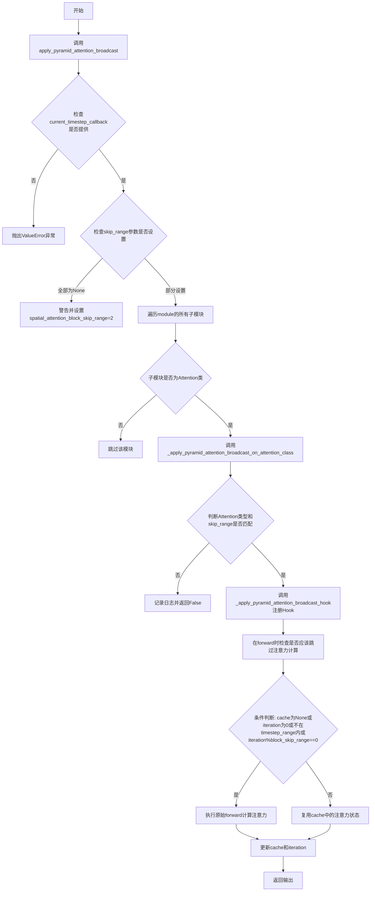
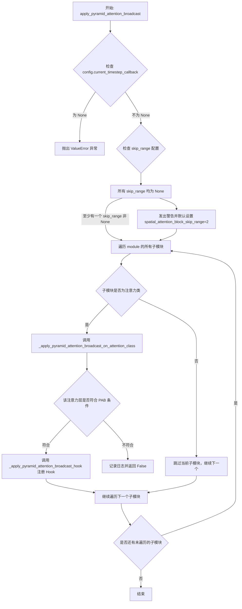
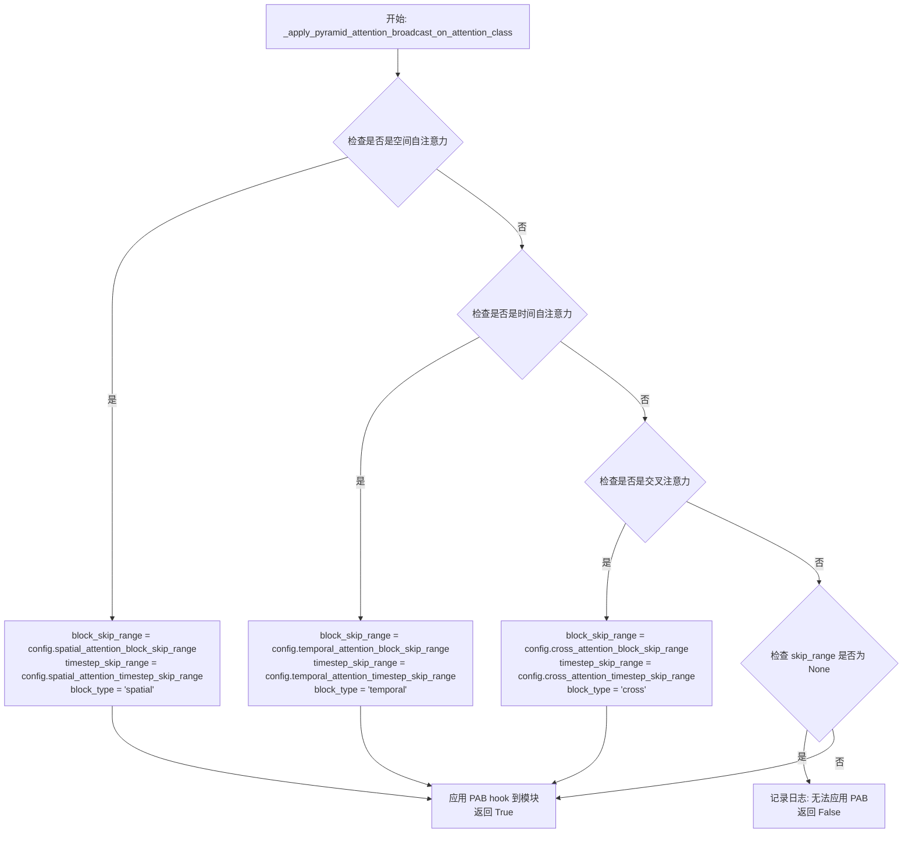
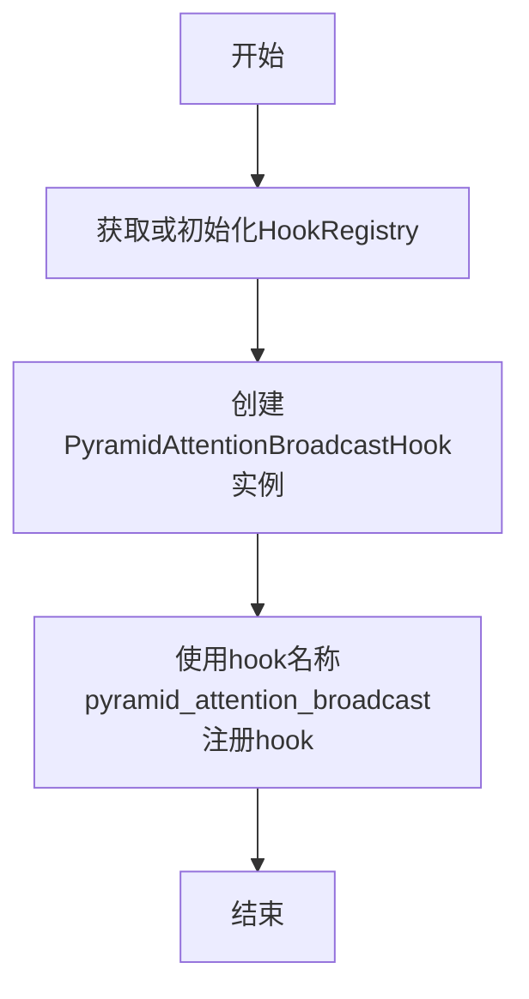
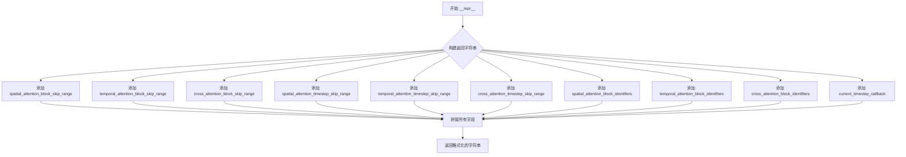
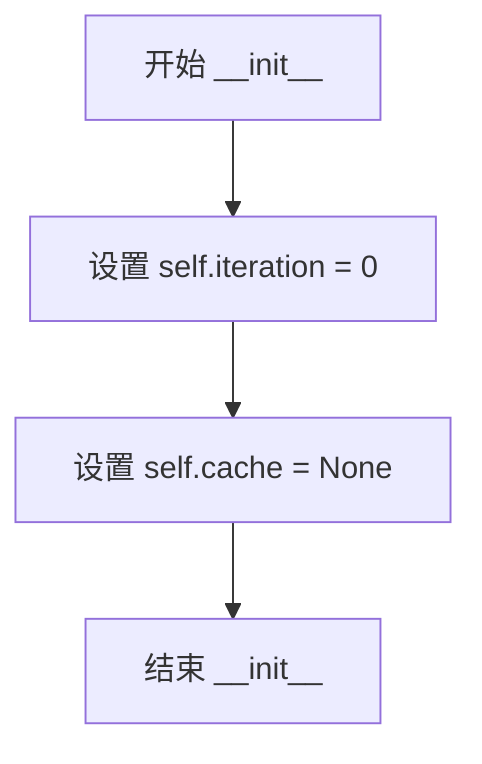
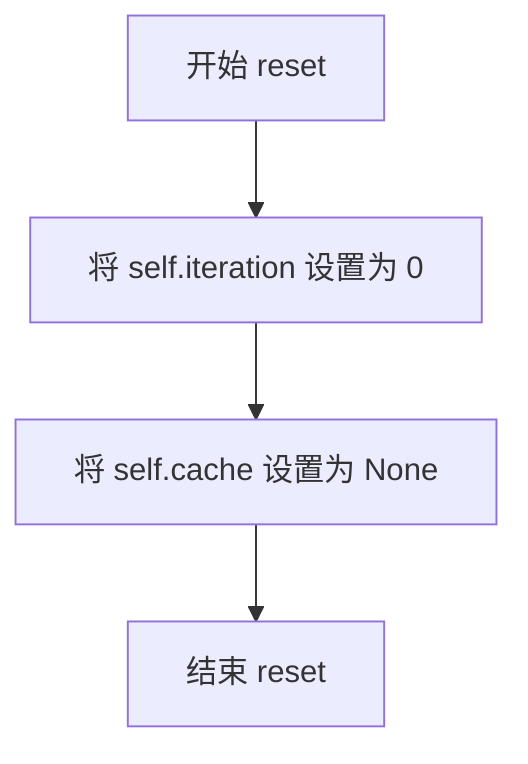
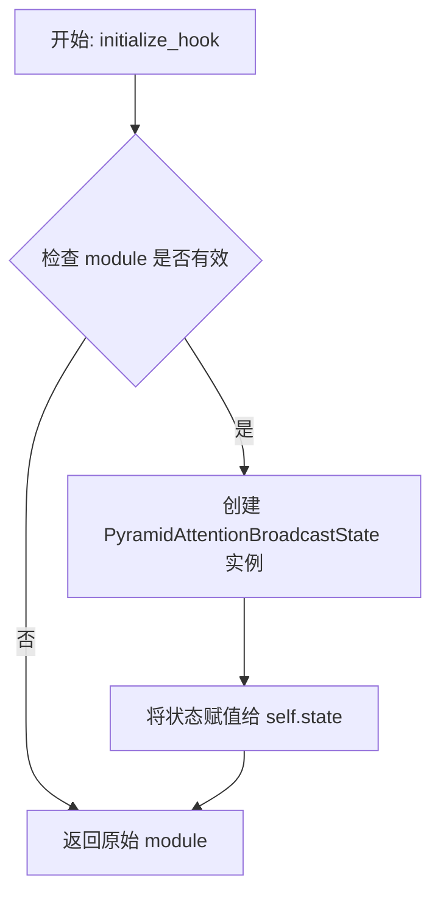
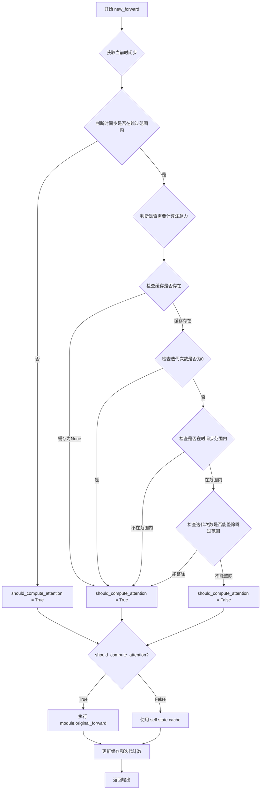
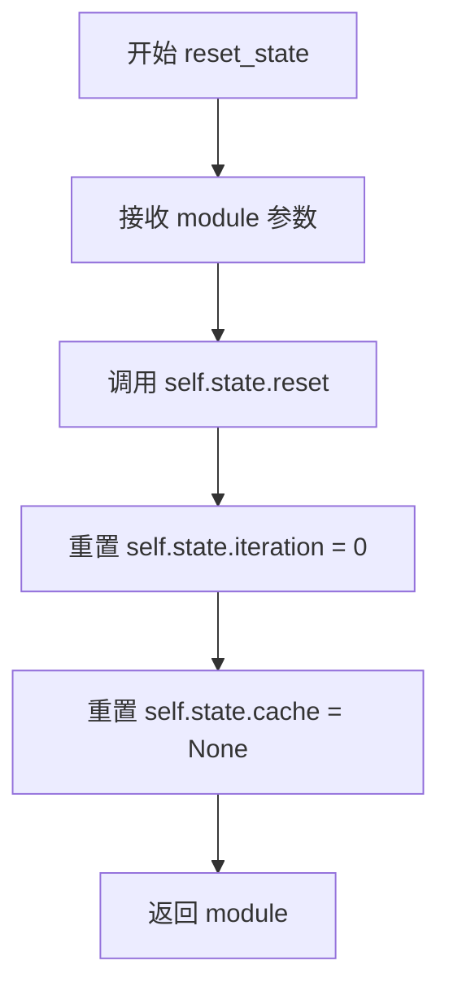

# `diffusers\src\diffusers\hooks\pyramid_attention_broadcast.py` 详细设计文档

该代码实现了Pyramid Attention Broadcast（PAB）机制，用于通过复用注意力状态来加速扩散模型的推理过程，基于论文2408.12588的实现。

## 整体流程



## 类结构

```
ModelHook (基类)
└── PyramidAttentionBroadcastHook

PyramidAttentionBroadcastConfig (dataclass)

PyramidAttentionBroadcastState
```

## 全局变量及字段


### `_PYRAMID_ATTENTION_BROADCAST_HOOK`
    
Hook名称常量，值为'pyramid_attention_broadcast'

类型：`str`
    


### `logger`
    
模块级日志记录器

类型：`logging.Logger`
    


### `PyramidAttentionBroadcastConfig.spatial_attention_block_skip_range`
    
空间注意力跳过的块数

类型：`int | None`
    


### `PyramidAttentionBroadcastConfig.temporal_attention_block_skip_range`
    
时间注意力跳过的块数

类型：`int | None`
    


### `PyramidAttentionBroadcastConfig.cross_attention_block_skip_range`
    
交叉注意力跳过的块数

类型：`int | None`
    


### `PyramidAttentionBroadcastConfig.spatial_attention_timestep_skip_range`
    
空间注意力跳过的时间步范围

类型：`tuple[int, int]`
    


### `PyramidAttentionBroadcastConfig.temporal_attention_timestep_skip_range`
    
时间注意力跳过的时间步范围

类型：`tuple[int, int]`
    


### `PyramidAttentionBroadcastConfig.cross_attention_timestep_skip_range`
    
交叉注意力跳过的时间步范围

类型：`tuple[int, int]`
    


### `PyramidAttentionBroadcastConfig.spatial_attention_block_identifiers`
    
空间注意力层标识符

类型：`tuple[str, ...]`
    


### `PyramidAttentionBroadcastConfig.temporal_attention_block_identifiers`
    
时间注意力层标识符

类型：`tuple[str, ...]`
    


### `PyramidAttentionBroadcastConfig.cross_attention_block_identifiers`
    
交叉注意力层标识符

类型：`tuple[str, ...]`
    


### `PyramidAttentionBroadcastConfig.current_timestep_callback`
    
获取当前时间步的回调函数

类型：`Callable[[], int]`
    


### `PyramidAttentionBroadcastState.iteration`
    
当前迭代次数

类型：`int`
    


### `PyramidAttentionBroadcastState.cache`
    
缓存的上一轮注意力输出

类型：`Any`
    


### `PyramidAttentionBroadcastHook._is_stateful`
    
标记hook是否有状态

类型：`bool`
    


### `PyramidAttentionBroadcastHook.timestep_skip_range`
    
时间步跳过范围

类型：`tuple[int, int]`
    


### `PyramidAttentionBroadcastHook.block_skip_range`
    
块跳过范围

类型：`int`
    


### `PyramidAttentionBroadcastHook.current_timestep_callback`
    
获取当前时间步的回调

类型：`Callable[[], int]`
    


### `PyramidAttentionBroadcastHook.state`
    
PAB状态管理

类型：`PyramidAttentionBroadcastState`
    
    

## 全局函数及方法


### `apply_pyramid_attention_broadcast`

该函数是Pyramid Attention Broadcast（PAB）技术的核心入口函数，通过遍历目标模块的所有子模块，识别出符合条件的注意力层（空间注意力、时间注意力、交叉注意力），并在这些注意力层上注册PAB hook，从而实现基于时间步和迭代次数的注意力计算跳过，达到加速推理的目的。

参数：

- `module`：`torch.nn.Module`，要应用 Pyramid Attention Broadcast 的目标模块，通常是 transformer 模型
- `config`：`PyramidAttentionBroadcastConfig`，包含 PAB 的详细配置信息，如跳过的范围、时间步范围、注意力类型标识符等

返回值：`None`，该函数直接修改传入的 module，在其子模块上注册 hook，不返回任何值

#### 流程图



#### 带注释源码

```python
def apply_pyramid_attention_broadcast(module: torch.nn.Module, config: PyramidAttentionBroadcastConfig):
    r"""
    Apply [Pyramid Attention Broadcast](https://huggingface.co/papers/2408.12588) to a given pipeline.

    PAB is an attention approximation method that leverages the similarity in attention states between timesteps to
    reduce the computational cost of attention computation. The key takeaway from the paper is that the attention
    similarity in the cross-attention layers between timesteps is high, followed by less similarity in the temporal and
    spatial layers. This allows for the skipping of attention computation in the cross-attention layers more frequently
    than in the temporal and spatial layers. Applying PAB will, therefore, speedup the inference process.

    Args:
        module (`torch.nn.Module`):
            The module to apply Pyramid Attention Broadcast to.
        config (`PyramidAttentionBroadcastConfig | None`, `optional*, defaults to `None`):
            The configuration to use for Pyramid Attention Broadcast.

    Example:

    ```python
    >>> import torch
    >>> from diffusers import CogVideoXPipeline, PyramidAttentionBroadcastConfig, apply_pyramid_attention_broadcast
    >>> from diffusers.utils import export_to_video

    >>> pipe = CogVideoXPipeline.from_pretrained("THUDM/CogVideoX-5b", torch_dtype=torch.bfloat16)
    >>> pipe.to("cuda")

    >>> config = PyramidAttentionBroadcastConfig(
    ...     spatial_attention_block_skip_range=2,
    ...     spatial_attention_timestep_skip_range=(100, 800),
    ...     current_timestep_callback=lambda: pipe.current_timestep,
    ... )
    >>> apply_pyramid_attention_broadcast(pipe.transformer, config)
    ```
    """
    # 必须提供当前时间步回调函数，用于获取推理过程中的当前时间步
    if config.current_timestep_callback is None:
        raise ValueError(
            "The `current_timestep_callback` function must be provided in the configuration to apply Pyramid Attention Broadcast."
        )

    # 检查是否至少设置了一个 skip_range 参数，否则发出警告并使用默认值
    if (
        config.spatial_attention_block_skip_range is None
        and config.temporal_attention_block_skip_range is None
        and config.cross_attention_block_skip_range is None
    ):
        logger.warning(
            "Pyramid Attention Broadcast requires one or more of `spatial_attention_block_skip_range`, `temporal_attention_block_skip_range` "
            "or `cross_attention_block_skip_range` parameters to be set to an integer, not `None`. Defaulting to using `spatial_attention_block_skip_range=2`. "
            "To avoid this warning, please set one of the above parameters."
        )
        # 默认设置 spatial_attention_block_skip_range 为 2
        config.spatial_attention_block_skip_range = 2

    # 遍历模块中的所有子模块，筛选出注意力层并应用 PAB
    for name, submodule in module.named_modules():
        # 仅处理 Diffusers 的 Attention 类或 AttentionModuleMixin
        if not isinstance(submodule, (*_ATTENTION_CLASSES, AttentionModuleMixin)):
            # PAB 针对 Diffusers 的 Attention 类实现，但并不意味着不能应用于其他层
            # 用户可以扩展此功能来实现自己的 PAB 逻辑
            continue
        # 对符合条件的注意力层应用 PAB hook
        _apply_pyramid_attention_broadcast_on_attention_class(name, submodule, config)
```


### `_apply_pyramid_attention_broadcast_on_attention_class`

该函数是 Pyramid Attention Broadcast (PAB) 机制的核心判断逻辑函数，用于判断给定的 Attention 模块属于哪种注意力类型（空间、时间或交叉注意力），并根据配置决定是否对该模块应用 PAB 优化。

参数：

- `name`：`str`，模块的完整名称，用于与配置中的标识符进行正则匹配以判断注意力类型
- `module`：`Attention`，Diffusers 库中的注意力模块实例，需要检查其属性（如 `is_cross_attention`）并可能为其注册 PAB hook
- `config`：`PyramidAttentionBroadcastConfig`，包含 PAB 的配置信息，如各类注意力的跳过范围、时间步跳过范围和标识符

返回值：`bool`，如果成功为该模块应用了 PAB hook 则返回 `True`，否则返回 `False`

#### 流程图



#### 带注释源码

```python
def _apply_pyramid_attention_broadcast_on_attention_class(
    name: str, module: Attention, config: PyramidAttentionBroadcastConfig
) -> bool:
    """
    判断并应用 Pyramid Attention Broadcast (PAB) 到特定的 Attention 类。
    
    该函数通过正则匹配模块名称和检查模块属性来确定注意力类型，
    然后根据配置为符合条件的模块注册 PAB hook 以实现注意力计算跳过优化。
    
    Args:
        name: 模块的完整名称，用于与配置中的标识符进行正则匹配
        module: Diffusers 库中的注意力模块实例
        config: 包含 PAB 配置信息的配置对象
    
    Returns:
        bool: 是否成功为该模块应用了 PAB hook
    """
    # 判断是否为空间自注意力：匹配空间标识符 + 配置中设置了跳过范围 + 不是交叉注意力
    is_spatial_self_attention = (
        any(re.search(identifier, name) is not None for identifier in config.spatial_attention_block_identifiers)
        and config.spatial_attention_block_skip_range is not None
        and not getattr(module, "is_cross_attention", False)
    )
    
    # 判断是否为时间自注意力：匹配时间标识符 + 配置中设置了跳过范围 + 不是交叉注意力
    is_temporal_self_attention = (
        any(re.search(identifier, name) is not None for identifier in config.temporal_attention_block_identifiers)
        and config.temporal_attention_block_skip_range is not None
        and not getattr(module, "is_cross_attention", False)
    )
    
    # 判断是否为交叉注意力：匹配交叉标识符 + 配置中设置了跳过范围 + 模块是交叉注意力
    is_cross_attention = (
        any(re.search(identifier, name) is not None for identifier in config.cross_attention_block_identifiers)
        and config.cross_attention_block_skip_range is not None
        and getattr(module, "is_cross_attention", False)
    )

    # 初始化变量，用于存储匹配到的配置参数
    block_skip_range, timestep_skip_range, block_type = None, None, None
    
    # 根据匹配的注意力类型设置相应的跳过参数
    if is_spatial_self_attention:
        block_skip_range = config.spatial_attention_block_skip_range
        timestep_skip_range = config.spatial_attention_timestep_skip_range
        block_type = "spatial"
    elif is_temporal_self_attention:
        block_skip_range = config.temporal_attention_block_skip_range
        timestep_skip_range = config.temporal_attention_timestep_skip_range
        block_type = "temporal"
    elif is_cross_attention:
        block_skip_range = config.cross_attention_block_skip_range
        timestep_skip_range = config.cross_attention_timestep_skip_range
        block_type = "cross"

    # 如果没有匹配到任何有效的注意力类型配置，则记录日志并返回 False
    if block_skip_range is None or timestep_skip_range is None:
        logger.info(
            f'Unable to apply Pyramid Attention Broadcast to the selected layer: "{name}" because it does '
            f"not match any of the required criteria for spatial, temporal or cross attention layers. Note, "
            f"however, that this layer may still be valid for applying PAB. Please specify the correct "
            f"block identifiers in the configuration."
        )
        return False

    # 记录调试日志，标明在哪个层启用了哪种类型的 PAB
    logger.debug(f"Enabling Pyramid Attention Broadcast ({block_type}) in layer: {name}")
    
    # 调用内部函数为模块注册 PAB hook
    _apply_pyramid_attention_broadcast_hook(
        module, timestep_skip_range, block_skip_range, config.current_timestep_callback
    )
    return True
```


### `_apply_pyramid_attention_broadcast_hook`

将 Pyramid Attention Broadcast hook 注册到指定的注意力模块上，以便在推理过程中根据时间步和块跳过范围条件性地重用注意力状态，从而减少计算成本。

参数：

- `module`：`Attention | MochiAttention`，要应用 Pyramid Attention Broadcast 的目标模块
- `timestep_skip_range`：`tuple[int, int]`，注意力层中要跳过的时间步范围。如果当前时间步在指定范围内，则条件性地跳过注意力计算
- `block_skip_range`：`int`，在重新计算注意力状态之前要跳过注意力广播的次数。如果设置为 N，则会跳过 N-1 次注意力计算，然后再次计算新的注意力状态
- `current_timestep_callback`：`Callable[[], int]`，返回当前推理时间步的回调函数

返回值：`None`，该函数无返回值，通过副作用注册 hook

#### 流程图



#### 带注释源码

```python
def _apply_pyramid_attention_broadcast_hook(
    module: Attention | MochiAttention,
    timestep_skip_range: tuple[int, int],
    block_skip_range: int,
    current_timestep_callback: Callable[[], int],
):
    r"""
    Apply [Pyramid Attention Broadcast](https://huggingface.co/papers/2408.12588) to a given torch.nn.Module.

    Args:
        module (`torch.nn.Module`):
            The module to apply Pyramid Attention Broadcast to.
        timestep_skip_range (`tuple[int, int]`):
            The range of timesteps to skip in the attention layer. The attention computations will be conditionally
            skipped if the current timestep is within the specified range.
        block_skip_range (`int`):
            The number of times a specific attention broadcast is skipped before computing the attention states to
            re-use. If this is set to the value `N`, the attention computation will be skipped `N - 1` times (i.e., old
            attention states will be reused) before computing the new attention states again.
        current_timestep_callback (`Callable[[], int]`):
            A callback function that returns the current inference timestep.
    """
    # 获取或初始化指定模块的HookRegistry，用于管理该模块上的所有hook
    registry = HookRegistry.check_if_exists_or_initialize(module)
    
    # 创建PyramidAttentionBroadcastHook实例，传入跳过范围和回调函数
    hook = PyramidAttentionBroadcastHook(timestep_skip_range, block_skip_range, current_timestep_callback)
    
    # 将hook注册到模块的注册表中，使用pyramid_attention_broadcast作为标识符名称
    registry.register_hook(hook, _PYRAMID_ATTENTION_BROADCAST_HOOK)
```


### `PyramidAttentionBroadcastConfig.__repr__`

该方法是 `PyramidAttentionBroadcastConfig` 数据类的字符串表示方法，用于将配置对象的所有属性以人类可读的格式输出，便于调试、日志记录和开发时的状态检查。

参数：

- 无（仅包含隐式参数 `self`）

返回值：`str`，返回配置对象的标准字符串表示，格式为多行显示所有配置参数及其当前值。

#### 流程图



#### 带注释源码

```python
def __repr__(self) -> str:
    """
    返回 PyramidAttentionBroadcastConfig 对象的字符串表示。
    
    该方法重写了 dataclass 默认的 __repr__ 方法，以提供更友好的
    多行格式输出，便于阅读和调试。每个配置字段都会单独一行显示。
    
    Returns:
        str: 包含所有配置参数的格式化字符串，格式如下：
             PyramidAttentionBroadcastConfig(
               field1=value1,
               field2=value2,
               ...
             )
    """
    return (
        f"PyramidAttentionBroadcastConfig(\n"
        f"  spatial_attention_block_skip_range={self.spatial_attention_block_skip_range},\n"
        f"  temporal_attention_block_skip_range={self.temporal_attention_block_skip_range},\n"
        f"  cross_attention_block_skip_range={self.cross_attention_block_skip_range},\n"
        f"  spatial_attention_timestep_skip_range={self.spatial_attention_timestep_skip_range},\n"
        f"  temporal_attention_timestep_skip_range={self.temporal_attention_timestep_skip_range},\n"
        f"  cross_attention_timestep_skip_range={self.cross_attention_timestep_skip_range},\n"
        f"  spatial_attention_block_identifiers={self.spatial_attention_block_identifiers},\n"
        f"  temporal_attention_block_identifiers={self.temporal_attention_block_identifiers},\n"
        f"  cross_attention_block_identifiers={self.cross_attention_block_identifiers},\n"
        f"  current_timestep_callback={self.current_timestep_callback}\n"
        ")"
    )
```

---

### 补充文档信息

#### 1. 一段话描述

`PyramidAttentionBroadcastConfig` 是 Pyramid Attention Broadcast（PAB）功能的配置类，用于控制扩散模型推理过程中的注意力计算优化。该配置允许用户指定空间注意力、时间注意力和交叉注意力的跳过范围和时间步范围，从而在保持生成质量的同时减少计算量、提升推理速度。

#### 2. 文件的整体运行流程

该文件 (`pyramid_attention_broadcast.py`) 实现了 Pyramid Attention Broadcast 优化机制：

1. **配置阶段**：用户创建 `PyramidAttentionBroadcastConfig` 对象，设置跳过参数和回调函数
2. **应用阶段**：`apply_pyramid_attention_broadcast` 函数遍历模型模块，识别符合条件的注意力层
3. **Hook 注册阶段**：为匹配的注意力层注册 `PyramidAttentionBroadcastHook`，拦截前向传播
4. **执行阶段**：在推理时，Hook 根据配置决定是计算新的注意力输出还是复用缓存的输出

#### 3. 类的详细信息

##### `PyramidAttentionBroadcastConfig`

配置数据类，包含以下字段：

| 字段名称 | 类型 | 描述 |
|---------|------|------|
| `spatial_attention_block_skip_range` | `int \| None` | 空间注意力跳过的迭代次数 |
| `temporal_attention_block_skip_range` | `int \| None` | 时间注意力跳过的迭代次数 |
| `cross_attention_block_skip_range` | `int \| None` | 交叉注意力跳过的迭代次数 |
| `spatial_attention_timestep_skip_range` | `tuple[int, int]` | 空间注意力跳过的时间步范围，默认 (100, 800) |
| `temporal_attention_timestep_skip_range` | `tuple[int, int]` | 时间注意力跳过的时间步范围，默认 (100, 800) |
| `cross_attention_timestep_skip_range` | `tuple[int, int]` | 交叉注意力跳过的时间步范围，默认 (100, 800) |
| `spatial_attention_block_identifiers` | `tuple[str, ...]` | 空间注意力层标识符元组 |
| `temporal_attention_block_identifiers` | `tuple[str, ...]` | 时间注意力层标识符元组 |
| `cross_attention_block_identifiers` | `tuple[str, ...]` | 交叉注意力层标识符元组 |
| `current_timestep_callback` | `Callable[[], int]` | 获取当前时间步的回调函数 |

##### `PyramidAttentionBroadcastState`

状态管理类，用于在推理过程中跟踪迭代次数和缓存的注意力输出。

##### `PyramidAttentionBroadcastHook`

继承自 `ModelHook` 的 Hook 类，负责在运行时拦截注意力层的前向传播并实现缓存复用逻辑。

#### 4. 关键组件信息

| 组件名称 | 描述 |
|---------|------|
| `_PYRAMID_ATTENTION_BROADCAST_HOOK` | Hook 注册时使用的标识符字符串 |
| `apply_pyramid_attention_broadcast` | 主入口函数，将 PAB 应用于整个模型 |
| `_apply_pyramid_attention_broadcast_on_attention_class` | 辅助函数，判断层类型并应用 Hook |

#### 5. 潜在的技术债务或优化空间

1. **MLP 层支持缺失**：代码中 TODO 注释提到尚未对 MLP 层实现 PAB 优化
2. **回调函数类型提示不精确**：`current_timestep_callback` 使用 `Callable[[], int]` 但实际可能需要更严格的类型约束
3. **缺少序列化支持**：配置类未实现 `to_dict`/`from_dict` 方法，不便于持久化
4. **正则匹配性能**：每层都进行正则表达式匹配可能影响大型模型的初始化速度

#### 6. 其它项目

**设计目标与约束**：
- 目标：通过复用相似的时间步注意力状态来减少计算量
- 约束：必须在推理前调用 `reset_state()`，否则状态会累积导致错误

**错误处理与异常设计**：
- `current_timestep_callback` 为 `None` 时会抛出 `ValueError`
- 当所有 skip_range 参数都为 `None` 时会发出警告并使用默认值

**数据流与状态机**：
- 状态机包含三个状态：初始 → 计算中 → 缓存复用
- 缓存策略基于迭代次数模运算和时间步范围判断

**外部依赖与接口契约**：
- 依赖 `AttentionModuleMixin` 和 `Attention`/`MochiAttention` 类
- 需要模型层名称匹配预定义的标识符元组


### `PyramidAttentionBroadcastState.__init__`

初始化 Pyramid Attention Broadcast 的状态管理器，设置迭代计数器为 0 并将缓存置为 None，用于管理跨推理步骤的注意力状态重用。

参数：

- 无（`__init__` 方法仅包含隐式参数 `self`）

返回值：`None`，无返回值（构造函数）

#### 流程图



#### 带注释源码

```python
def __init__(self) -> None:
    """
    初始化 PyramidAttentionBroadcastState 的状态。
    
    构造一个新的状态对象，用于在推理过程中跟踪和缓存注意力状态。
    初始状态下：
    - iteration 设为 0，表示当前为第一次迭代
    - cache 设为 None，表示尚未缓存任何注意力输出
    """
    self.iteration = 0  # 当前推理迭代计数，用于决定何时重新计算注意力
    self.cache = None   # 缓存的注意力输出，用于跳过计算并复用历史状态
```


### `PyramidAttentionBroadcastState.reset`

该方法用于重置 Pyramid Attention Broadcast 状态，将迭代计数器归零并清空缓存，以便在新的推理轮次开始时能够正确重新计算注意力状态。

参数：
- 无参数（仅包含隐式参数 `self`）

返回值：`None`，无返回值，仅执行状态重置操作

#### 流程图



#### 带注释源码

```python
def reset(self):
    """
    重置 Pyramid Attention Broadcast 的迭代计数器和缓存状态。
    
    该方法在每次新的推理前向传播开始时被调用，确保注意力状态从头开始计算，
    而不是复用上一次推理的缓存数据。这对于正确使用 PAB 机制至关重要。
    """
    self.iteration = 0  # 将迭代计数器重置为 0，用于跟踪当前的推理步骤
    self.cache = None   # 清空缓存，释放上一次推理保存的注意力输出
```


### `PyramidAttentionBroadcastState.__repr__`

该方法为 `PyramidAttentionBroadcastState` 类的实例方法，用于生成该状态对象的可读字符串表示，以便于调试和日志输出。它会检查缓存是否为 `None`，如果是则显示 "None"，否则显示缓存张量的形状和数据类型信息。

参数：无（`self` 为隐式参数）

返回值：`str`，返回状态对象的字符串表示，格式为 `PyramidAttentionBroadcastState(iteration={iteration}, cache={cache_repr})`

#### 流程图

```mermaid
flowchart TD
    A[开始 __repr__] --> B{cache is None?}
    B -->|是| C[设置 cache_repr = 'None']
    B -->|否| D[设置 cache_repr = f'Tensor(shape={shape}, dtype={dtype})']
    C --> E[返回格式化字符串]
    D --> E
```

#### 带注释源码

```python
def __repr__(self):
    """
    返回 PyramidAttentionBroadcastState 的可读字符串表示。
    
    该方法用于调试和日志输出，清晰地展示当前状态对象的关键属性。
    当 cache 为 None 时，显示 'None'；当 cache 存在时，
    显示其形状和数据类型信息，便于追踪缓存状态。
    """
    cache_repr = ""  # 初始化缓存的字符串表示
    if self.cache is None:
        # 缓存为空时，直接使用字符串 'None'
        cache_repr = "None"
    else:
        # 缓存存在时，提取并显示张量的形状和数据类型
        # 注意：这里假设 cache 是单个 Tensor，忽略了可能是 tuple 的情况
        cache_repr = f"Tensor(shape={self.cache.shape}, dtype={self.cache.dtype})"
    
    # 返回格式化的状态字符串，包含当前迭代数和缓存信息
    return f"PyramidAttentionBroadcastState(iteration={self.iteration}, cache={cache_repr})"
```


### `PyramidAttentionBroadcastHook.initialize_hook`

该方法是 `PyramidAttentionBroadcastHook` 类的初始化钩子方法，用于为指定的模块创建并附加 `PyramidAttentionBroadcastState` 状态对象，以便在后续的前向传播中跟踪注意力缓存和迭代次数。

参数：

- `module`：`torch.nn.Module`，需要初始化 hook 状态的模块

返回值：`torch.nn.Module`，返回原始模块本身，支持链式调用

#### 流程图



#### 带注释源码

```python
def initialize_hook(self, module):
    """
    初始化 hook 的状态管理机制。
    
    该方法在将 hook 注册到模块之前被调用，用于创建和初始化
    注意力状态缓存，以确保在首次前向传播时能够正确处理注意力计算。
    
    状态对象包含两个核心属性：
    - iteration: 记录当前推理迭代次数，用于确定何时重新计算注意力
    - cache: 缓存上一次计算的注意力输出，用于跳过不必要的计算
    
    Args:
        module: torch.nn.Module，需要附加状态的对象
        
    Returns:
        torch.nn.Module: 返回原始模块，保持接口一致性
    """
    # 初始化 PyramidAttentionBroadcastState 状态实例
    # 该状态将跟踪当前的迭代计数和注意力缓存
    self.state = PyramidAttentionBroadcastState()
    
    # 返回原始模块以支持链式调用和注册流程
    return module
```


### `PyramidAttentionBroadcastHook.new_forward`

该方法是 Pyramid Attention Broadcast 钩子的核心前向传播逻辑，实现了基于时间步和迭代次数的注意力跳过机制。通过判断当前时间步是否在预设范围内，以及当前迭代次数是否达到跳过阈值，决定是执行原始前向传播还是复用缓存的注意力输出，从而实现计算优化。

参数：

- `module`：`torch.nn.Module`，应用钩子的目标模块（通常是注意力层）
- `*args`：可变位置参数，传递给原始前向传播的参数
- `**kwargs`：可变关键字参数，传递给原始前向传播的关键字参数

返回值：`Any`，返回注意力层的输出，可以是张量或元组（取决于模块类型）

#### 流程图



#### 带注释源码

```python
def new_forward(self, module: torch.nn.Module, *args, **kwargs) -> Any:
    """
    新的前向传播逻辑，实现注意力跳过机制。
    
    该方法根据当前时间步和迭代次数决定是执行原始前向传播还是复用缓存的注意力输出。
    当满足跳过条件时，直接返回上一次计算的缓存结果，从而节省计算资源。
    
    Args:
        module: 应用钩子的目标模块（注意力层）
        *args: 传递给原始前向传播的位置参数
        **kwargs: 传递给原始前向传播的关键字参数
    
    Returns:
        Any: 注意力层的输出（张量或元组）
    """
    
    # 获取当前时间步，判断是否在预设的跳过范围内
    # 例如：timestep_skip_range=(100, 800)，当前时间步在100-800之间时考虑跳过
    is_within_timestep_range = (
        self.timestep_skip_range[0] < self.current_timestep_callback() < self.timestep_skip_range[1]
    )
    
    # 判断是否需要计算注意力
    # 需要计算的情况：
    # 1. 缓存为空（首次执行）
    # 2. 迭代次数为0（新一轮推理开始）
    # 3. 当前时间步不在跳过范围内（需要重新计算）
    # 4. 迭代次数能被跳过范围整除（周期性重新计算，保持一定的更新频率）
    should_compute_attention = (
        self.state.cache is None
        or self.state.iteration == 0
        or not is_within_timestep_range
        or self.state.iteration % self.block_skip_range == 0
    )

    # 根据判断结果决定是计算还是使用缓存
    if should_compute_attention:
        # 执行原始前向传播，计算新的注意力输出
        output = self.fn_ref.original_forward(*args, **kwargs)
    else:
        # 跳过计算，直接复用上一次缓存的注意力输出
        output = self.state.cache

    # 更新缓存：保存当前输出供下一次迭代使用
    self.state.cache = output
    
    # 更新迭代计数：记录当前是第几次执行该模块
    self.state.iteration += 1
    
    # 返回计算结果或缓存结果
    return output
```


### `PyramidAttentionBroadcastHook.reset_state`

重置 Pyramid Attention Broadcast hook 的内部状态，包括迭代计数和缓存，以便为下一次前向传播做好准备。

参数：

- `module`：`torch.nn.Module`，需要重置状态的 PyTorch 模块

返回值：`torch.nn.Module`，返回传入的 module 实例，便于链式调用或直接替换

#### 流程图



#### 带注释源码

```python
def reset_state(self, module: torch.nn.Module) -> None:
    """
    重置 PyramidAttentionBroadcastHook 的内部状态。
    
    在每次新的推理前向传播开始前调用，以确保 PAB 机制能够正确工作。
    该方法会重置迭代计数和缓存，防止旧的状态影响新的推理过程。
    
    Args:
        module (torch.nn.Module): 需要重置状态的 PyTorch 模块
        
    Returns:
        torch.nn.Module: 返回传入的 module，便于链式调用
    """
    # 重置内部状态对象的迭代计数和缓存
    self.state.reset()
    # 返回原始模块，保持接口一致性
    return module
```

## 关键组件


### PyramidAttentionBroadcastConfig

配置类，用于存储Pyramid Attention Broadcast的所有配置参数，包括空间/时间/交叉注意力跳过范围、步进参数和块标识符，用于控制注意力计算的跳过策略。

### PyramidAttentionBroadcastState

状态管理类，用于维护PAB的迭代计数器和缓存状态，包含当前迭代次数和上一轮计算的输出缓存，支持状态重置以开始新的推理过程。

### PyramidAttentionBroadcastHook

注意力钩子类，继承自ModelHook，拦截模块的前向传播，根据当前时间步和迭代次数决定是计算新的注意力输出还是复用缓存的输出，实现惰性加载和注意力复用逻辑。

### apply_pyramid_attention_broadcast

主应用函数，接收模块和配置参数，遍历模块的所有子模块，通过正则匹配识别注意力层类型（空间/时间/交叉），并将PAB钩子注册到符合条件的注意力层上。

### _apply_pyramid_attention_broadcast_on_attention_class

辅助函数，根据模块名称和配置中的块标识符判断注意力层类型，确定对应的跳过范围和时间步范围，返回是否成功应用PAB。

### _apply_pyramid_attention_broadcast_hook

钩子注册函数，创建PyramidAttentionBroadcastHook实例并将其注册到模块的钩子注册表中，建立注意力计算的拦截机制。

### HookRegistry

外部依赖模块，提供钩子注册表的管理功能，支持检查或初始化模块的钩子注册表，并提供钩子注册接口。

### _ATTENTION_CLASSES, _SPATIAL_TRANSFORMER_BLOCK_IDENTIFIERS, _TEMPORAL_TRANSFORMER_BLOCK_IDENTIFIERS, _CROSS_TRANSFORMER_BLOCK_IDENTIFIERS

外部导入的全局变量和标识符集合，用于匹配和识别不同类型的注意力层（空间、时间、交叉注意力），是PAB应用于正确注意力层的判断依据。


## 问题及建议


### 已知问题

- **类型注解不准确**：`current_timestep_callback`的类型注解为`Callable[[], int]`，但默认值是`None`，这会导致类型检查器报错，应该改为`Callable[[], int] | None`或设置默认值为有效的回调函数
- **硬编码的默认值**：时间步跳过范围`(100, 800)`是硬编码在配置类中的，这对不同的模型可能不适用，应该考虑从配置中完全移除或提供更灵活的默认值
- **缓存机制假设单一输出**：在`PyramidAttentionBroadcastState`中，缓存假设为单个tensor，但某些模块可能返回tuple/list，当前实现可能无法正确处理
- **callback返回值缺乏验证**：没有对`current_timestep_callback()`返回值的范围进行验证，负数或异常值可能导致不可预期行为
- **Hook与模块强耦合**：状态直接绑定到hook实例，如果同一个模块被多次应用或在不同场景复用，可能导致状态混乱
- **只支持特定Attention类**：代码明确只支持Diffusers的`Attention`和`MochiAttention`类，对于自定义Attention模块需要用户自行扩展，文档中虽有提及但实现门槛较高

### 优化建议

- 修复`current_timestep_callback`的类型注解，使用`Optional[Callable[[], int]]`或提供默认的lambda函数
- 将硬编码的时间步范围移至文档或示例中，让用户根据具体模型配置
- 改进缓存机制，支持tuple/list类型的多输出，使用`Any`类型更显式并添加类型判断
- 在`new_forward`方法中添加对callback返回值的基本校验，确保返回值在合理范围内
- 考虑将状态从hook中分离，使用独立的缓存管理器或字典来管理不同模块的状态
- 扩展对自定义模块的支持，提供抽象基类或接口文档，降低扩展门槛
- 考虑使用`functools.lru_cache`或其他缓存策略优化状态管理，特别是在多次调用场景下

## 其它


### 设计目标与约束

本模块的设计目标是通过实现Pyramid Attention Broadcast (PAB) 优化技术，显著降低视频生成模型中注意力机制的计算成本。该优化基于论文"https://huggingface.co/papers/2408.12588"的发现，即跨注意力层在时间步之间的注意力状态相似性最高，其次是时间层和空间层。设计约束包括：1) 仅支持Diffusers内置的Attention类（MochiAttention和标准Attention）；2) 必须提供current_timestep_callback回调函数以获取当前推理时间步；3) 至少需要设置一个block_skip_range参数；4) 该优化主要针对推理过程，不适用于训练阶段。

### 错误处理与异常设计

本模块包含以下错误处理机制：1) 当config.current_timestep_callback为None时，抛出ValueError异常，提示必须提供当前时间步回调函数；2) 当所有block_skip_range参数均为None时，通过logger.warning发出警告并默认设置spatial_attention_block_skip_range=2；3) 对于不匹配任何注意力层标识符的模块，通过logger.info记录信息并返回False，不抛出异常；4) 使用HookRegistry确保hook注册过程的线程安全性。

### 数据流与状态机

PyramidAttentionBroadcastState维护两个核心状态变量：iteration（当前迭代计数）和cache（缓存的注意力输出）。状态转换逻辑如下：1) 初始状态：iteration=0, cache=None；2) 每次forward调用时，根据timestep_skip_range和block_skip_range判断是否需要重新计算注意力；3) 如果should_compute_attention为True，则调用原始forward方法计算新输出并更新cache；4) 否则，直接返回缓存的cache；5) 每次执行后iteration递增；6) 通过reset_state方法重置状态，用于新的推理批次。

### 外部依赖与接口契约

本模块依赖以下外部组件：1) torch.nn.Module - PyTorch神经网络模块基类；2) AttentionModuleMixin - 注意力模块混入类；3) Attention和MochiAttention - 具体注意力实现类；4) HookRegistry和ModelHook - Hook管理系统；5) _ATTENTION_CLASSES、_SPATIAL_TRANSFORMER_BLOCK_IDENTIFIERS、_TEMPORAL_TRANSFORMER_BLOCK_IDENTIFIERS、_CROSS_TRANSFORMER_BLOCK_IDENTIFIERS - 从_common模块导入的注意力类标识符；6) logging - 日志记录工具。接口契约要求：apply_pyramid_attention_broadcast接收torch.nn.Module和PyramidAttentionBroadcastConfig参数，返回None；_apply_pyramid_attention_broadcast_on_attention_class返回布尔值表示是否成功应用。

### 性能考虑与基准测试

性能优化的核心在于通过跳过部分注意力计算来减少FLOPs。block_skip_range参数直接影响计算跳过频率：设置为N时，每N次迭代才重新计算一次注意力。timestep_skip_range定义了应用PAB的时间步区间，默认(100,800)覆盖了扩散模型的主要推理区间。潜在的性能瓶颈包括：1) 缓存机制带来的内存开销；2) 条件判断带来的分支预测开销；3) callback函数调用开销。建议在实际部署前使用torch profiler进行基准测试，验证优化效果是否符合预期。

### 版本兼容性与扩展性

当前版本仅支持Diffusers内置的Attention类，对于自定义注意力层需要用户自行扩展。代码中预留了扩展接口：注释说明可以通过类似_apply_pyramid_attention_broadcast_on_attention_class的方式实现自定义PAB逻辑。未来可能的扩展方向包括：1) 支持MLP层的PAB优化（代码中已有TODO注释提及）；2) 支持动态调整skip_range参数；3) 支持多模态注意力场景；4) 与其他推理优化技术（如Flash Attention、xFormers）的兼容性处理。

### 使用示例与最佳实践

```python
# 基础使用示例
from diffusers import CogVideoXPipeline, PyramidAttentionBroadcastConfig, apply_pyramid_attention_broadcast
import torch

pipe = CogVideoXPipeline.from_pretrained("THUDM/CogVideoX-5b", torch_dtype=torch.bfloat16)
pipe.to("cuda")

config = PyramidAttentionBroadcastConfig(
    spatial_attention_block_skip_range=2,
    temporal_attention_block_skip_range=4,
    cross_attention_block_skip_range=1,
    spatial_attention_timestep_skip_range=(100, 800),
    temporal_attention_timestep_skip_range=(100, 800),
    cross_attention_timestep_skip_range=(100, 800),
    current_timestep_callback=lambda: pipe.current_timestep,
)
apply_pyramid_attention_broadcast(pipe.transformer, config)
```

最佳实践：1) 根据模型特性调优skip_range参数；2) 在生产环境前进行完整的输出质量验证；3) 监控内存使用情况；4) 对于不支持的注意力层类型，检查日志信息并考虑自定义扩展。


    