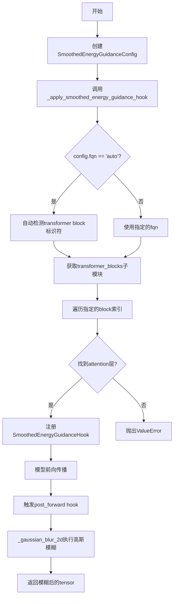
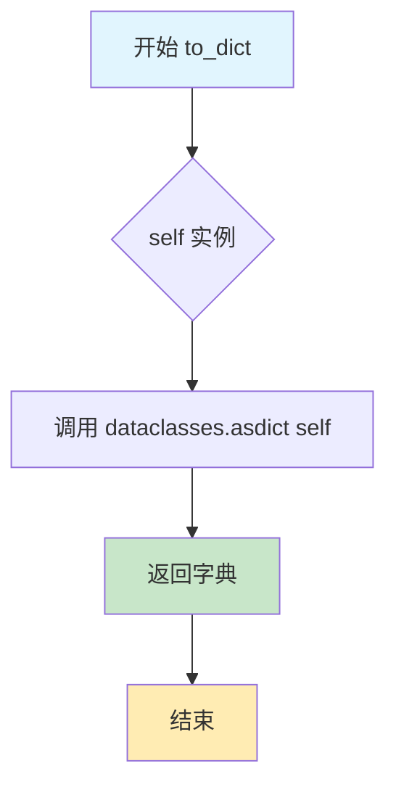
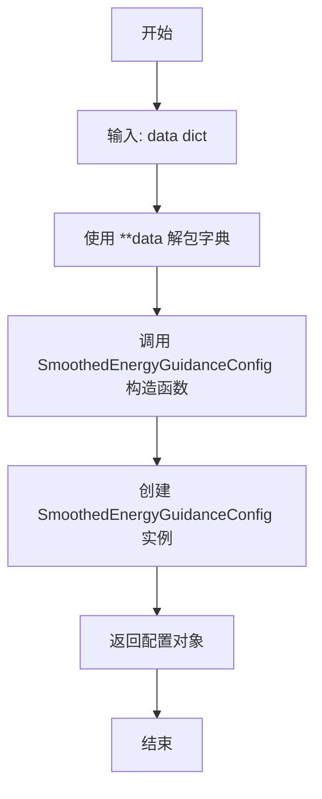
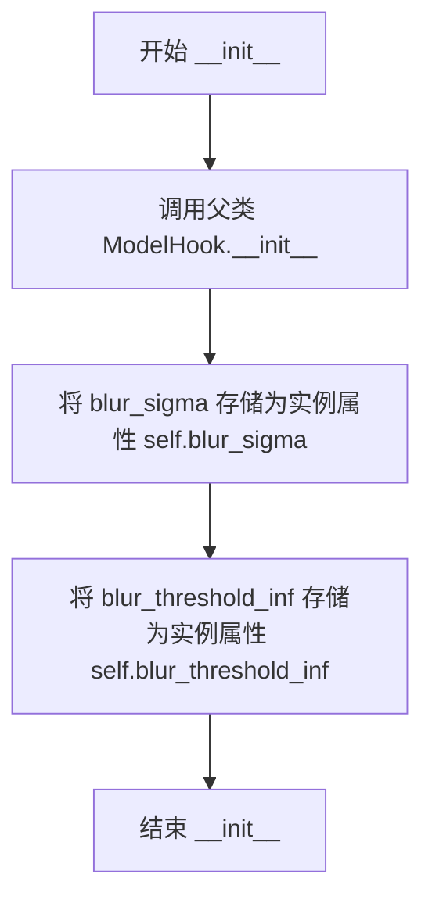
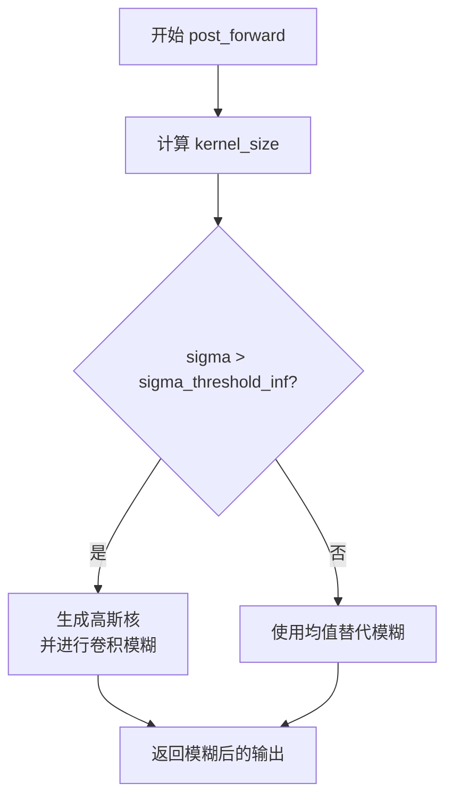

# `diffusers\src\diffusers\hooks\smoothed_energy_guidance_utils.py` 详细设计文档

该代码实现了Smoothed Energy Guidance (SEG)功能，这是一个用于扩散Transformer模型的实验性功能。它通过在Transformer块的query projection层注册hook，对视觉token应用2D高斯模糊，从而引导模型生成更平滑的能量分布，改善图像/视频生成质量。

## 整体流程



## 类结构

```
ModelHook (抽象基类)
└── SmoothedEnergyGuidanceHook

SmoothedEnergyGuidanceConfig (数据类)

全局函数:
├── _apply_smoothed_energy_guidance_hook
└── _gaussian_blur_2d
```

## 全局变量及字段


### `_SMOOTHED_ENERGY_GUIDANCE_HOOK`
    
hook的名称常量，用于注册和标识平滑能量引导hook

类型：`str`
    


### `logger`
    
模块级别的日志记录器，用于记录调试和运行时信息

类型：`logging.Logger`
    


### `SmoothedEnergyGuidanceConfig.indices`
    
要跳过的层索引列表，指定哪些transformer块需要应用平滑能量引导

类型：`list[int]`
    


### `SmoothedEnergyGuidanceConfig.fqn`
    
Transformer块的完全限定名称，用于定位模型中的transformer块堆栈，默认为'auto'

类型：`str`
    


### `SmoothedEnergyGuidanceConfig._query_proj_identifiers`
    
query projection层的标识符列表，用于查找注意力机制中的查询投影层，默认为None

类型：`list[str]`
    


### `SmoothedEnergyGuidanceHook.blur_sigma`
    
高斯模糊的sigma值，控制模糊的程度

类型：`float`
    


### `SmoothedEnergyGuidanceHook.blur_threshold_inf`
    
sigma的无限大阈值，用于判断是否使用无限模糊

类型：`float`
    
    

## 全局函数及方法


### `_apply_smoothed_energy_guidance_hook`

在指定的模块上注册平滑能量引导（SEG）hook，通过自动检测或手动指定的完全限定名称（FQN）定位transformer块，并在匹配的注意力层查询投影上注册高斯模糊hook。

参数：

- `module`：`torch.nn.Module`，要注册hook的神经网络模块
- `config`：`SmoothedEnergyGuidanceConfig`，包含跳过的层索引、transformer块FQN和查询投影标识符的配置对象
- `blur_sigma`：`float`，用于高斯模糊的sigma值，控制模糊程度
- `name`：`str | None`，可选的hook名称，默认为"smoothed_energy_guidance_hook"

返回值：`None`，该函数无返回值，通过副作用修改module的hook注册表

#### 流程图

```mermaid
flowchart TD
    A[Start _apply_smoothed_energy_guidance_hook] --> B{config.fqn == 'auto'?}
    B -->|Yes| C[遍历 _ALL_TRANSFORMER_BLOCK_IDENTIFIERS 查找模块属性]
    C --> D{找到标识符?}
    D -->|Yes| E[设置 config.fqn = identifier]
    D -->|No| F[抛出 ValueError: 无法自动检测]
    B -->|No| G[使用 config.fqn]
    E --> G
    G --> H{config._query_proj_identifiers is None?}
    H -->|Yes| I[设置默认值为 ['to_q']]
    H -->|No| J[继续]
    I --> J
    J --> K[通过 _get_submodule_from_fqn 获取 transformer_blocks]
    K --> L[初始化 blocks_found = False]
    L --> M[遍历 transformer_blocks 和索引 i]
    M --> N{i not in config.indices?}
    N -->|Yes| O[continue 跳过]
    N -->|No| P[设置 blocks_found = True]
    P --> Q[遍历 block 中的所有 named_modules]
    Q --> R{是注意力类且非cross-attention?}
    R -->|No| Q
    R -->|Yes| S[遍历 query_proj_identifiers]
    S --> T[获取 query_proj 属性]
    T --> U{query_proj 存在且是 Linear?}
    U -->|No| S
    U -->|Yes| V[记录 debug 日志]
    V --> W[获取或初始化 HookRegistry]
    W --> X[创建 SmoothedEnergyGuidanceHook]
    X --> Y[registry.register_hook 注册 hook]
    Y --> S
    S --> Q
    Q --> M
    M --> Z{blocks_found?}
    Z -->|No| AA[抛出 ValueError: 未找到匹配的块]
    Z -->|Yes| AB[End]
```

#### 带注释源码

```python
def _apply_smoothed_energy_guidance_hook(
    module: torch.nn.Module, config: SmoothedEnergyGuidanceConfig, blur_sigma: float, name: str | None = None
) -> None:
    """
    在指定模块上注册平滑能量引导（SEG）hook。
    
    该函数通过以下步骤工作：
    1. 确定hook的名称
    2. 自动检测或验证transformer块的完全限定名称（FQN）
    3. 设置默认的查询投影标识符
    4. 遍历transformer块，在匹配的注意力层上注册hook
    """
    # 如果未提供名称，使用默认的hook名称
    name = name or _SMOOTHED_ENERGY_GUIDANCE_HOOK

    # 自动检测transformer块的标识符（适用于DiT模型）
    if config.fqn == "auto":
        for identifier in _ALL_TRANSFORMER_BLOCK_IDENTIFIERS:
            if hasattr(module, identifier):
                config.fqn = identifier
                break
        else:
            # 自动检测失败，抛出错误
            raise ValueError(
                "Could not find a suitable identifier for the transformer blocks automatically. Please provide a valid "
                "`fqn` (fully qualified name) that identifies a stack of transformer blocks."
            )

    # 设置默认的查询投影标识符
    if config._query_proj_identifiers is None:
        config._query_proj_identifiers = ["to_q"]

    # 从模块中获取transformer块子模块
    transformer_blocks = _get_submodule_from_fqn(module, config.fqn)
    
    blocks_found = False
    # 遍历每个transformer块
    for i, block in enumerate(transformer_blocks):
        # 只处理配置中指定的索引
        if i not in config.indices:
            continue

        blocks_found = True

        # 遍历块中的所有子模块
        for submodule_name, submodule in block.named_modules():
            # 检查是否为注意力模块且不是交叉注意力
            if not isinstance(submodule, _ATTENTION_CLASSES) or submodule.is_cross_attention:
                continue
            
            # 遍历可能的查询投影标识符
            for identifier in config._query_proj_identifiers:
                query_proj = getattr(submodule, identifier, None)
                # 验证查询投影是否存在且为Linear层
                if query_proj is None or not isinstance(query_proj, torch.nn.Linear):
                    continue
                
                # 记录调试信息
                logger.debug(
                    f"Registering smoothed energy guidance hook on {config.fqn}.{i}.{submodule_name}.{identifier}"
                )
                
                # 获取或初始化hook注册表
                registry = HookRegistry.check_if_exists_or_initialize(query_proj)
                
                # 创建hook实例并注册
                hook = SmoothedEnergyGuidanceHook(blur_sigma)
                registry.register_hook(hook, name)

    # 如果没有找到匹配的块，抛出错误
    if not blocks_found:
        raise ValueError(
            f"Could not find any transformer blocks matching the provided indices {config.indices} and "
            f"fully qualified name '{config.fqn}'. Please check the indices and fqn for correctness."
        )
```


### `_gaussian_blur_2d`

该函数对输入的3D张量（视为展平的图像/视频token）应用2D高斯模糊，通过计算高斯核或均值滤波来处理视觉token，以实现平滑能量引导（Smoothed Energy Guidance）功能。

参数：

- `query`：`torch.Tensor`，输入的查询张量，形状为(batch_size, seq_len, embed_dim)
- `kernel_size`：`int`，高斯核的尺寸大小
- `sigma`：`float`，高斯函数的标准差，控制模糊程度
- `sigma_threshold_inf`：`float`，用于判断sigma是否视为无穷大的阈值

返回值：`torch.Tensor`，应用高斯模糊后的张量，形状与输入query相同

#### 流程图

```mermaid
flowchart TD
    A[开始] --> B[断言 query.ndim == 3]
    --> C[判断 is_inf = sigma > sigma_threshold_inf]
    --> D[获取 batch_size, seq_len, embed_dim]
    --> E[计算 seq_len_sqrt = sqrt(seq_len)]
    --> F[计算 num_square_tokens = seq_len_sqrt * seq_len_sqrt]
    --> G[提取 query[:, :num_square_tokens, :]]
    --> H[permute和reshape为2D: (batch_size, embed_dim, seq_len_sqrt, seq_len_sqrt)]
    
    H --> I{is_inf?}
    
    I -->|True| J[调整kernel_size大小]
    --> K[生成1D高斯核x]
    --> L[计算pdf = exp(-0.5 * (x/sigma)^2)]
    --> M[归一化得到kernel1d]
    --> N[转换为query设备类型]
    --> O[matmul生成2D核kernel2d]
    --> P[expand到embed_dim维度]
    --> Q[计算padding]
    --> R[F.pad应用反射填充]
    --> S[F.conv2d应用深度卷积]
    
    I -->|False| T[使用均值滤波: mean(dim=(-2, -1), keepdim=True)]
    
    S --> U[reshape回1D]
    T --> U
    --> V[permute回原始顺序]
    --> W[写回query[:, :num_square_tokens, :]]
    --> X[返回query]
```

#### 带注释源码

```python
def _gaussian_blur_2d(query: torch.Tensor, kernel_size: int, sigma: float, sigma_threshold_inf: float) -> torch.Tensor:
    """
    对输入的视觉token应用2D高斯模糊
    
    该实现假设输入query来自视觉（图像/视频）token，用于应用2D高斯模糊。
    注意：某些模型使用文本-视觉联合token注意力，可能不适用此方法。
    此外，该实现还假设视觉token来自正方形图像/视频。
    
    注意：SEG目前仅作为实验性原型功能支持，未来可能随时修改。
    """
    # 断言输入是3D张量 (batch_size, seq_len, embed_dim)
    assert query.ndim == 3

    # 判断sigma是否大于阈值，若大于则视为无穷大，使用高斯模糊；否则使用均值滤波
    is_inf = sigma > sigma_threshold_inf
    batch_size, seq_len, embed_dim = query.shape

    # 计算序列长度的平方根，假设输入是正方形图像的token
    seq_len_sqrt = int(math.sqrt(seq_len))
    num_square_tokens = seq_len_sqrt * seq_len_sqrt
    
    # 提取前num_square_tokens个token（忽略非正方形部分）
    query_slice = query[:, :num_square_tokens, :]
    
    # 维度重排和reshape：将 (batch, seq, embed) 转换为 (batch, embed, height, width) 的2D形式
    query_slice = query_slice.permute(0, 2, 1)  # (batch, embed, seq)
    query_slice = query_slice.reshape(batch_size, embed_dim, seq_len_sqrt, seq_len_sqrt)  # (batch, embed, h, w)

    if is_inf:
        # 动态调整kernel_size，确保不超过图像尺寸
        kernel_size = min(kernel_size, seq_len_sqrt - (seq_len_sqrt % 2 - 1))
        kernel_size_half = (kernel_size - 1) / 2

        # 生成1D高斯核：创建从 -kernel_size_half 到 kernel_size_half 的线性空间
        x = torch.linspace(-kernel_size_half, kernel_size_half, steps=kernel_size)
        
        # 计算高斯概率密度函数: exp(-0.5 * (x/sigma)^2)
        pdf = torch.exp(-0.5 * (x / sigma).pow(2))
        
        # 归一化得到最终的高斯核
        kernel1d = pdf / pdf.sum()
        
        # 确保核函数在query所在的设备上
        kernel1d = kernel1d.to(query)
        
        # 通过外积生成2D高斯核
        kernel2d = torch.matmul(kernel1d[:, None], kernel1d[None, :])
        
        # 扩展到embed_dim维度，用于深度卷积（每个channel独立卷积）
        kernel2d = kernel2d.expand(embed_dim, 1, kernel2d.shape[0], kernel2d.shape[1])

        # 计算padding以保持输出尺寸不变
        padding = [kernel_size // 2, kernel_size // 2, kernel_size // 2, kernel_size // 2]
        
        # 应用反射填充
        query_slice = F.pad(query_slice, padding, mode="reflect")
        
        # 应用2D卷积，groups=embed_dim 实现深度卷积
        query_slice = F.conv2d(query_slice, kernel2d, groups=embed_dim)
    else:
        # 当sigma被视为无穷大时，使用均值滤波代替高斯模糊
        query_slice[:] = query_slice.mean(dim=(-2, -1), keepdim=True)

    # 恢复原始形状
    query_slice = query_slice.reshape(batch_size, embed_dim, num_square_tokens)
    query_slice = query_slice.permute(0, 2, 1)  # (batch, seq, embed)
    
    # 写回到原始query张量
    query[:, :num_square_tokens, :] = query_slice.clone()

    return query
```


### `SmoothedEnergyGuidanceConfig.to_dict()`

将 SmoothedEnergyGuidanceConfig 类的当前实例转换为一个 Python 字典，利用 dataclasses 模块的 asdict 函数序列化所有字段。

参数：
- 无（该方法是实例方法，隐式接收 `self` 参数）

返回值：`dict`，返回包含配置所有字段的字典表示

#### 流程图



#### 带注释源码

```python
def to_dict(self):
    """
    将当前配置实例转换为字典格式。
    
    该方法使用 Python 标准库 dataclasses 模块的 asdict 函数，
    将 dataclass 的所有字段递归转换为字典形式。这对于配置序列化、
    日志记录或跨进程传输配置非常有用。
    
    Returns:
        dict: 包含所有配置字段的字典，键为字段名，值为字段值
    """
    return asdict(self)
```

---

### 补充上下文信息

#### 1. 一句话描述
`SmoothedEnergyGuidanceConfig.to_dict()` 是一个配置序列化方法，将配置对象转换为字典格式，用于配置的持久化或传输。

#### 2. 所属类的完整信息

**类名**: `SmoothedEnergyGuidanceConfig`

**类字段**:
- `indices`: `list[int]` - 要跳过的变压器块层索引列表
- `fqn`: `str` - 变压器块堆栈的完全限定名称，默认为 "auto"
- `_query_proj_identifiers`: `list[str]` - 查询投影层的标识符列表

**类方法**:
- `to_dict()` - 将配置转换为字典
- `from_dict(data: dict)` - 从字典创建配置实例（静态方法）

#### 3. 关键组件信息

| 组件名称 | 描述 |
|---------|------|
| `SmoothedEnergyGuidanceConfig` | 配置类，用于存储跳过变压器块的配置参数 |
| `asdict` | dataclasses 模块函数，将 dataclass 实例递归转换为字典 |
| `from_dict` | 静态方法，从字典恢复配置对象 |

#### 4. 潜在技术债务与优化空间

- **无参数验证**: `to_dict()` 方法没有对返回值进行任何验证或序列化选项配置
- **私有字段暴露**: `_query_proj_identifiers` 以下划线开头表示私有，但在字典中会被暴露
- **不可逆转换**: `asdict` 会进行深拷贝，返回的字典修改不影响原对象，但这可能导致内存开销

#### 5. 其它项目

**设计目标**:
- 提供配置的序列化能力，支持配置的保存和恢复
- 与 HuggingFace Diffusers 框架的配置管理风格保持一致

**错误处理**:
- 该方法本身不涉及复杂错误处理，依赖于 `asdict` 的内部实现

**外部依赖**:
- 依赖 `dataclasses.asdict` 函数

**使用场景**:
- 在保存模型配置到磁盘时调用
- 在跨进程传递配置时作为序列化手段
- 在日志记录时输出配置信息


### `SmoothedEnergyGuidanceConfig.from_dict`

从字典数据创建并返回一个 `SmoothedEnergyGuidanceConfig` 配置对象。

参数：

- `data`：`dict`，包含配置信息的字典，用于构造配置对象

返回值：`SmoothedEnergyGuidanceConfig`，从字典数据创建的配置对象实例

#### 流程图



#### 带注释源码

```python
@staticmethod
def from_dict(data: dict) -> "SmoothedEnergyGuidanceConfig":
    """
    从字典数据创建 SmoothedEnergyGuidanceConfig 配置对象。

    这是一个静态方法，接收一个字典作为输入，
    并通过字典解包方式创建一个新的配置实例。

    Args:
        data (dict): 包含配置信息的字典。
                     应包含 'indices'（必需）、
                     'fqn'（可选，默认为 "auto"）和
                     '_query_proj_identifiers'（可选，默认为 None）等键。

    Returns:
        SmoothedEnergyGuidanceConfig: 从字典数据创建的配置对象实例。

    Example:
        >>> config_dict = {
        ...     "indices": [0, 1, 2],
        ...     "fqn": "transformer_blocks",
        ...     "_query_proj_identifiers": ["to_q"]
        ... }
        >>> config = SmoothedEnergyGuidanceConfig.from_dict(config_dict)
    """
    return SmoothedEnergyGuidanceConfig(**data)
```


### `SmoothedEnergyGuidanceHook.__init__`

该方法是 `SmoothedEnergyGuidanceHook` 类的构造函数，用于初始化平滑能量引导Hook的模糊参数。它接受高斯模糊的标准差参数和无穷大阈值参数，并将这些参数存储为实例属性，以便在后续的 `post_forward` 方法中对Transformer模块的输出应用高斯模糊处理。

参数：

- `blur_sigma`：`float`，高斯模糊的标准差参数，默认值为 `1.0`。该值决定了模糊 kernel 的大小和模糊程度，值越大模糊效果越强。
- `blur_threshold_inf`：`float`，用于判断 sigma 是否视为无穷大的阈值，默认值为 `9999.9`。当 `blur_sigma` 超过此阈值时，将应用完整的二维高斯模糊；否则直接使用均值模糊。

返回值：`None`，构造函数不返回任何值。

#### 流程图



#### 带注释源码

```python
def __init__(self, blur_sigma: float = 1.0, blur_threshold_inf: float = 9999.9) -> None:
    """
    初始化 SmoothedEnergyGuidanceHook 实例。
    
    Args:
        blur_sigma: 高斯模糊的标准差参数，控制模糊程度。
        blur_threshold_inf: sigma 值的阈值，超过该值视为无穷大并应用完整高斯模糊。
    """
    # 调用父类 ModelHook 的初始化方法
    super().__init__()
    
    # 存储高斯模糊的 sigma 参数
    self.blur_sigma = blur_sigma
    
    # 存储用于判断无穷大的阈值参数
    self.blur_threshold_inf = blur_threshold_inf
```


### `SmoothedEnergyGuidanceHook.post_forward`

该方法在 transformer 模型的前向传播后执行高斯模糊操作，通过计算基于模糊 sigma 值的核大小，然后调用 `_gaussian_blur_2d` 函数对输出张量进行二维高斯模糊处理，最后返回平滑后的输出。

参数：

- `module`：`torch.nn.Module`，执行前向传播的模块（在此方法中未直接使用，仅作为 Hook 接口的约定参数）
- `output`：`torch.Tensor`，需要应用高斯模糊的输入张量，通常是视觉（图像/视频）token

返回值：`torch.Tensor`，经过高斯模糊平滑处理后的输出张量

#### 流程图



#### 带注释源码

```python
def post_forward(self, module: torch.nn.Module, output: torch.Tensor) -> torch.Tensor:
    """
    在前向传播后执行高斯模糊平滑处理。
    
    该方法实现 Smoothed Energy Guidance (SEG) 的核心逻辑，通过对 transformer
    输出的视觉 token 应用高斯模糊来引导生成过程。
    
    Args:
        module: 执行前向传播的 torch.nn.Module 实例（未被直接使用）
        output: 前向传播的输出张量，形状为 [batch_size, seq_len, embed_dim]
    
    Returns:
        torch.Tensor: 经过高斯模糊平滑处理后的输出张量
    """
    # 根据 blur_sigma 计算高斯核大小
    # 核大小公式确保覆盖 6 sigma 范围，并保持奇数尺寸以保证卷积核中心对齐
    # Copied from https://github.com/SusungHong/SEG-SDXL/blob/cf8256d640d5373541cfea3b3b6caf93272cf986/pipeline_seg.py#L172C31-L172C102
    kernel_size = math.ceil(6 * self.blur_sigma) + 1 - math.ceil(6 * self.blur_sigma) % 2
    
    # 调用二维高斯模糊函数处理输出张量
    # 使用预定义的 blur_threshold_inf 阈值来处理极端 sigma 值的情况
    smoothed_output = _gaussian_blur_2d(
        output, 
        kernel_size, 
        self.blur_sigma, 
        self.blur_threshold_inf
    )
    
    # 返回平滑处理后的输出张量
    return smoothed_output
```

## 关键组件


### SmoothedEnergyGuidanceConfig

配置类，用于存储跳过transformer块的设置，包含要跳过的层索引、transformer块的完全限定名称(FQN)以及查询投影层的标识符。

### SmoothedEnergyGuidanceHook

模型钩子类，继承自ModelHook，在前向传播后对输出应用2D高斯模糊处理，实现平滑能量引导的核心逻辑。

### _apply_smoothed_energy_guidance_hook

应用钩子的核心函数，自动检测transformer块并注册平滑能量引导钩子到指定的注意力层查询投影模块，支持自动FQN检测和索引匹配。

### _gaussian_blur_2d

2D高斯模糊实现函数，假设输入为视觉token（图像/视频），将序列token重塑为正方形图像，应用高斯模糊后再展平回原始序列格式，支持无限sigma情况下的均值模糊。

### HookRegistry & ModelHook

钩子注册和管理基础设施，提供钩子的注册、检查和初始化功能，用于在模型的特定模块上注入自定义逻辑。

### 张量索引与惰性加载

通过config.indices指定要跳过的transformer块索引，实现仅对特定层应用平滑能量引导，避免对所有块进行处理。

### 反量化支持

代码中无直接反量化操作，但通过模糊处理对query tensor进行变换，这是一种替代量化后处理的方式。


## 问题及建议


### 已知问题

- **魔法数字和硬编码值**：`blur_threshold_inf = 9999.9` 是一个不直观的硬编码阈值；`_gaussian_blur_2d` 中的 `6 * self.blur_sigma` 等数值缺乏解释，应提取为命名常量。
- **类型注解不一致**：`SmoothedEnergyGuidanceConfig` 中 `_query_proj_identifiers: list[str] = None` 应改为 `list[str] | None` 或使用 `Optional`，因为默认值是 `None`。
- **假设正方形输入**：`_gaussian_blur_2d` 假设 `seq_len` 是完全平方数且图像为正方形，非正方形图像会被截断处理，可能导致数据丢失或异常。
- **`is_inf` 分支语义不清**：当 `sigma > sigma_threshold_inf` 时使用实际高斯模糊，否则直接用 `mean` 替换，这种二元行为缺乏文档说明，且语义上用均值代替高斯模糊不够直观。
- **不必要的 `clone()` 操作**：`query[:, :num_square_tokens, :] = query_slice.clone()` 中的 `clone()` 可能造成不必要的内存开销，直接赋值 `query_slice` 或使用 `copy_()` 可能更高效。
- **模块名称假设**：代码依赖 `_ATTENTION_CLASSES`、`_ALL_TRANSFORMER_BLOCK_IDENTIFIERS` 等私有模块，若外部依赖变化会导致脆弱性。
- **hook 可能重复注册**：多次调用 `_apply_smoothed_energy_guidance_hook` 而不检查是否已注册相同 hook，可能导致同一模块被多次 hook。
- **缺乏错误处理**：遍历 `named_modules()` 和获取 `getattr` 时若模型结构不符合预期，代码会直接失败，缺乏友好的错误提示。

### 优化建议

- 将硬编码的数值（如 `9999.9`、`6`）提取为配置常量或模块级变量，并添加注释说明其含义。
- 修复类型注解以保持一致性，使用 `typing.Optional` 或 `|` 联合类型。
- 增加对非正方形输入的兼容处理，例如接受矩形维度或抛出明确异常而非静默截断。
- 重新设计 `is_inf` 的逻辑，或在文档中明确说明这种设计意图，考虑将其拆分为两个独立函数。
- 移除不必要的 `clone()`，使用 `copy_()` 或直接赋值。
- 在 `_apply_smoothed_energy_guidance_hook` 中添加重复注册检查，防止同一 hook 被多次添加到同一模块。
- 增加输入验证和更详细的错误信息，帮助开发者快速定位配置问题。

## 其它


### 设计目标与约束

本模块旨在实现Smoothed Energy Guidance (SEG) 技术，通过在Transformer的注意力机制中对query投影应用高斯模糊来引导能量分布。主要设计目标包括：1) 提供灵活的层索引配置以选择性应用模糊；2) 支持自动检测Transformer块类型；3) 兼容DiT和UNet架构。核心约束包括：假设输入为正方形视觉token、仅支持图像/视频token、不支持跨注意力机制的模糊处理。

### 错误处理与异常设计

模块包含以下错误处理机制：1) 当`fqn`设置为"auto"且无法自动识别Transformer块时，抛出`ValueError`并提示用户提供有效的完全限定名称；2) 当配置的索引在Transformer块中找不到匹配时，抛出`ValueError`并列出提供的索引和fqn；3) 在查找query投影层时，如果属性不存在或类型不匹配会跳过而非抛出异常，通过`logger.debug`记录跳过原因。异常设计遵循快速失败原则，在配置验证阶段尽早发现问题。

### 数据流与状态机

数据流主要分为配置阶段和应用阶段。配置阶段：用户创建`SmoothedEnergyGuidanceConfig`对象→调用`_apply_smoothed_energy_guidance_hook`→遍历Transformer块→在匹配索引的注意力层中注册hook。应用阶段：前向传播时`post_forward`被触发→获取原始输出→调用`_gaussian_blur_2d`进行2D高斯模糊→返回平滑后的输出。状态机转换：IDLE→CONFIGURING→READY→APPLYING→IDLE。

### 外部依赖与接口契约

主要外部依赖包括：1) `torch`和`torch.nn.functional`用于张量操作和卷积；2) `dataclass`用于配置数据类；3) `..utils.get_logger`用于日志记录；4) `.hooks.HookRegistry`和`.hooks.ModelHook`来自同模块的hook机制；5) `._common`模块中的Transformer块识别常量和辅助函数。接口契约：配置对象必须包含有效的`indices`列表；`fqn`必须为字符串且在模块层级存在；`_query_proj_identifiers`必须为字符串列表或None；所有公共方法在输入验证失败时抛出明确异常。

### 性能考虑与优化空间

性能关键点：1) 高斯核在每次前向传播时重新计算，对于`sigma > sigma_threshold_inf`的情况存在计算开销；2) 模糊操作通过`F.conv2d`以groups=embed_dim实现，计算复杂度与序列长度的平方成正比。优化建议：1) 可缓存核矩阵而非每次重新计算；2) 对于极大的`sigma`值，默认使用均值模糊可显著降低计算量；3) 当前实现对所有batch应用相同核，可考虑向量化批处理以提高GPU利用率。

### 安全性考虑

当前实现无直接的用户输入执行风险，但需要注意：1) `sigma`参数未做上界校验，极大值可能导致数值不稳定；2) `kernel_size`的计算依赖`sigma`且有特殊边界处理逻辑；3) 模块假设输入tensor维度固定为3维，错误输入可能导致断言失败或难以追踪的错误。建议添加参数范围验证和更明确的错误提示。

### 测试策略建议

应覆盖以下测试场景：1) 配置对象的序列化与反序列化（to_dict/from_dict）；2) 自动fqn检测在不同模型架构（DiT vs UNet）下的行为；3) 索引超出范围时的异常抛出；4) 模糊操作的数值正确性验证，包括极限情况（sigma趋近无穷大时退化为均值模糊）；5) 与hook系统的集成测试，验证hook正确注册和触发；6) 内存泄漏测试，验证大批量处理时无显存累积。

    