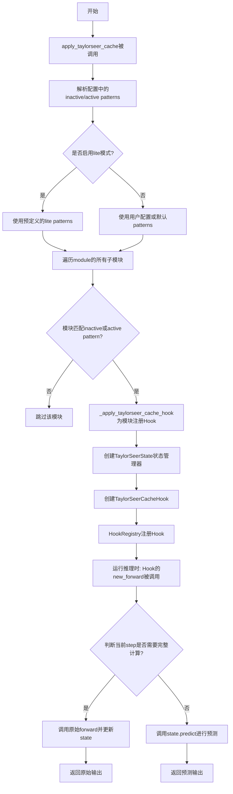
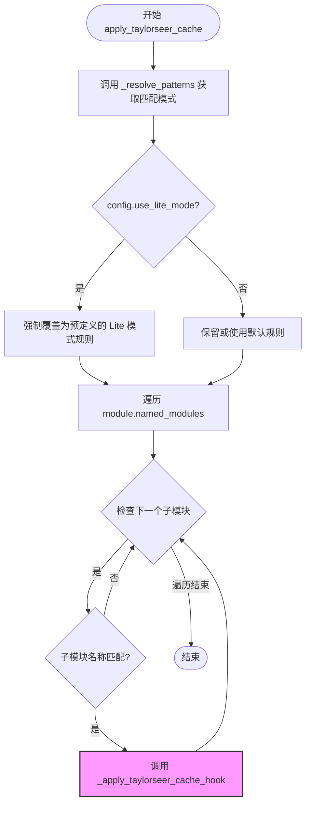
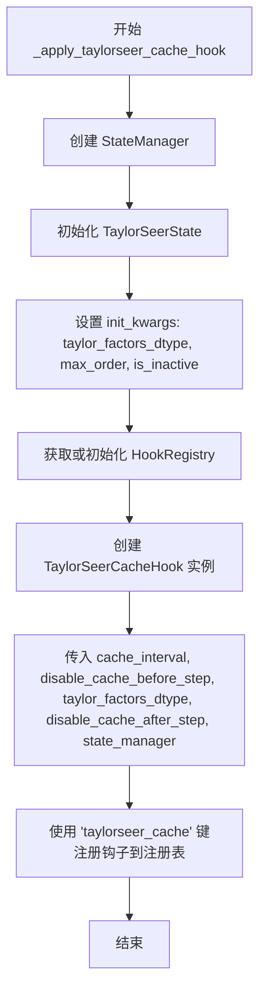
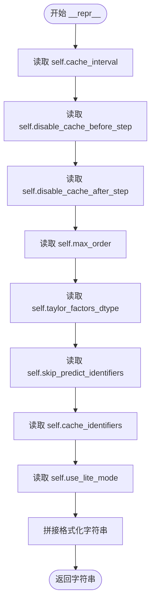
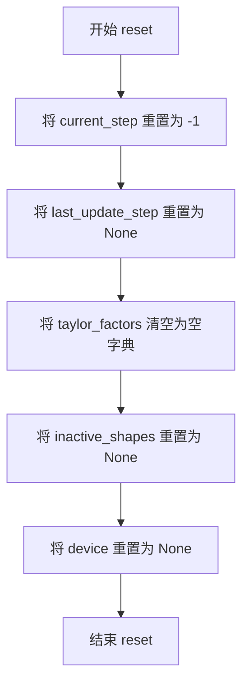
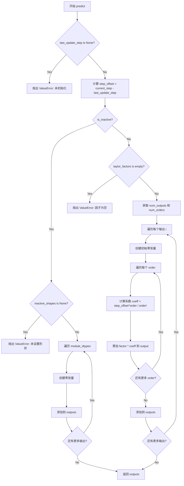
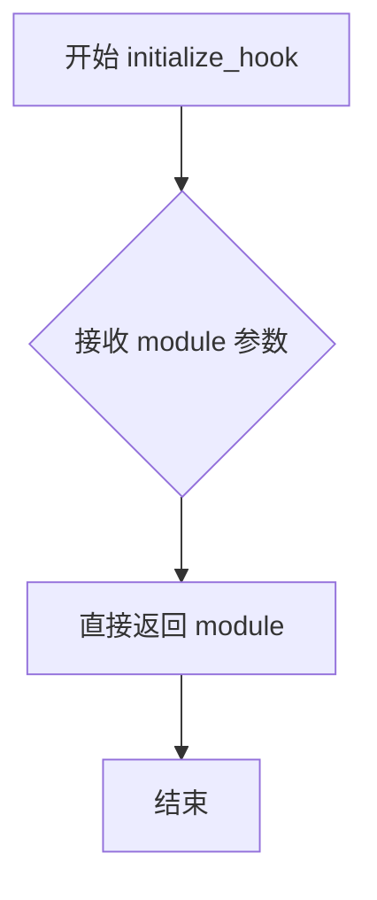

# `diffusers\src\diffusers\hooks\taylorseer_cache.py` 详细设计文档

TaylorSeer缓存实现，通过Hook机制在扩散模型的去噪循环中应用泰勒级数近似来缓存和跳过计算，从而减少冗余计算。

## 整体流程



## 类结构

```
ModelHook (抽象基类)
└── TaylorSeerCacheHook (泰勒缓存Hook实现)

TaylorSeerState (状态管理类)

TaylorSeerCacheConfig (配置数据类)
```

## 全局变量及字段


### `_TAYLORSEER_CACHE_HOOK`
    
用于标识TaylorSeer缓存hook的字符串常量

类型：`str`
    


### `_SPATIAL_ATTENTION_BLOCK_IDENTIFIERS`
    
空间注意力块的正则表达式模式列表，用于匹配UNet中的空间注意力模块

类型：`tuple[str, ...]`
    


### `_TEMPORAL_ATTENTION_BLOCK_IDENTIFIERS`
    
时间注意力块的正则表达式模式列表，用于匹配视频扩散模型中的时间注意力模块

类型：`tuple[str, ...]`
    


### `_TRANSFORMER_BLOCK_IDENTIFIERS`
    
组合的空间和时间注意力块标识符，用于匹配所有Transformer注意力模块

类型：`tuple[str, ...]`
    


### `_BLOCK_IDENTIFIERS`
    
通用块的正则表达式模式，用于匹配非点分隔的块结构

类型：`tuple[str, ...]`
    


### `_PROJ_OUT_IDENTIFIERS`
    
投影输出层的正则表达式模式，用于匹配Lite模式下的缓存目标

类型：`tuple[str, ...]`
    


### `TaylorSeerCacheConfig.cache_interval`
    
全量计算步骤之间的间隔步数，用于控制缓存刷新频率

类型：`int`
    


### `TaylorSeerCacheConfig.disable_cache_before_step`
    
禁用缓存的起始步骤索引，用于初始预热阶段的步数

类型：`int`
    


### `TaylorSeerCacheConfig.disable_cache_after_step`
    
可选的缓存禁用截止步骤，用于后期阶段的精确计算

类型：`int | None`
    


### `TaylorSeerCacheConfig.max_order`
    
泰勒级数展开的最高阶数，用于控制近似精度

类型：`int`
    


### `TaylorSeerCacheConfig.taylor_factors_dtype`
    
泰勒因子张量的数据类型，用于存储精度控制

类型：`torch.dtype | None`
    


### `TaylorSeerCacheConfig.skip_predict_identifiers`
    
跳过预测模块的正则表达式列表，用于标识不参与预测的模块

类型：`list[str] | None`
    


### `TaylorSeerCacheConfig.cache_identifiers`
    
启用缓存模块的正则表达式列表，用于标识需要缓存的模块

类型：`list[str] | None`
    


### `TaylorSeerCacheConfig.use_lite_mode`
    
轻量级模式开关，用于启用内存优化的预设模式

类型：`bool`
    


### `TaylorSeerState.taylor_factors_dtype`
    
泰勒因子张量的数据类型，用于计算精度控制

类型：`torch.dtype | None`
    


### `TaylorSeerState.max_order`
    
泰勒级数的最高阶数，限制近似计算的深度

类型：`int`
    


### `TaylorSeerState.is_inactive`
    
模块是否处于非活跃状态，用于区分跳过和缓存模式

类型：`bool`
    


### `TaylorSeerState.module_dtypes`
    
模块输出的原始数据类型元组，用于预测时恢复精度

类型：`tuple[torch.dtype, ...]`
    


### `TaylorSeerState.last_update_step`
    
上一次全量计算的步骤索引，用于计算步长偏移

类型：`int | None`
    


### `TaylorSeerState.taylor_factors`
    
泰勒级数系数的嵌套字典，用于存储各阶差分因子

类型：`dict[int, dict[int, torch.Tensor]]`
    


### `TaylorSeerState.inactive_shapes`
    
非活跃模块的输出形状元组，用于生成零张量

类型：`tuple[tuple[int, ...], ...] | None`
    


### `TaylorSeerState.device`
    
张量计算设备，用于在预测时保持设备一致性

类型：`torch.device | None`
    


### `TaylorSeerState.current_step`
    
当前扩散步骤索引，用于判断是否执行计算或预测

类型：`int`
    


### `TaylorSeerCacheHook.cache_interval`
    
缓存刷新间隔参数，传递给状态管理器

类型：`int`
    


### `TaylorSeerCacheHook.disable_cache_before_step`
    
预热阶段步数配置，用于控制初始全量计算

类型：`int`
    


### `TaylorSeerCacheHook.disable_cache_after_step`
    
冷却阶段起始步配置，用于后期禁用缓存

类型：`int | None`
    


### `TaylorSeerCacheHook.taylor_factors_dtype`
    
泰勒因子的数据类型，用于状态初始化

类型：`torch.dtype`
    


### `TaylorSeerCacheHook.state_manager`
    
状态管理器实例，用于管理TaylorSeerState的生命周期

类型：`StateManager`
    
    

## 全局函数及方法


### `_resolve_patterns`

该函数用于从 TaylorSeerCacheConfig 配置对象中解析出有效的非活跃模式（inactive patterns）和活跃模式（active patterns）列表，用于后续模块的匹配和缓存钩子的应用。

参数：

- `config`：`TaylorSeerCacheConfig`，包含 TaylorSeer 缓存配置的数据类，从中提取 `skip_predict_identifiers` 和 `cache_identifiers` 属性

返回值：`tuple[list[str], list[str]]`，返回两个字符串列表的元组，第一个列表为非活跃模式列表，第二个列表为活跃模式列表

#### 流程图

```mermaid
flowchart TD
    A[开始 _resolve_patterns] --> B{config.skip_predict_identifiers 是否为 None}
    B -- 否 --> C[获取 config.skip_predict_identifiers]
    B -- 是 --> D[设置 inactive_patterns 为 None]
    C --> E{config.cache_identifiers 是否为 None}
    D --> E
    E -- 否 --> F[获取 config.cache_identifiers]
    E -- 是 --> G[设置 active_patterns 为 None]
    F --> H{返回模式列表}
    G --> H
    H --> I[inactive_patterns or []]
    I --> J[active_patterns or []]
    J --> K[返回元组]
    K --> L[结束]
```

#### 带注释源码

```python
def _resolve_patterns(config: TaylorSeerCacheConfig) -> tuple[list[str], list[str]]:
    """
    Resolve effective inactive and active pattern lists from config + templates.
    
    该函数从配置对象中提取用于匹配模块的非活跃模式和活跃模式。
    如果配置中提供了自定义模式，则使用自定义模式；否则返回空列表，
    表明在后续处理中可能使用默认模式。
    """

    # 从配置中获取 skip_predict_identifiers
    # 如果用户提供了自定义的非活跃模式（用于跳过预测的模块），则使用该模式
    # 否则设置为 None，表示使用默认行为
    inactive_patterns = config.skip_predict_identifiers if config.skip_predict_identifiers is not None else None
    
    # 从配置中获取 cache_identifiers
    # 如果用户提供了自定义的活跃模式（用于缓存的模块），则使用该模式
    # 否则设置为 None，表示使用默认行为
    active_patterns = config.cache_identifiers if config.cache_identifiers is not None else None

    # 返回解析后的模式列表
    # 使用 or [] 处理 None 的情况，确保返回的是空列表而非 None
    return inactive_patterns or [], active_patterns or []
```


### `apply_taylorseer_cache`

该函数是 TaylorSeer 缓存机制的核心入口，负责遍历指定的神经网络模块（如 Transformer 或 UNet），根据配置中的正则表达式模式识别需要优化的子模块，并为其注册 TaylorSeer 钩子，以实现基于泰勒级数近似的计算复用和跳过，从而加速扩散模型的推理过程。

参数：

-  `module`：`torch.nn.Module`，目标模型子树，函数将遍历该模块的子模块进行钩子注册。
-  `config`：`TaylorSeerCacheConfig`，缓存策略配置，定义了缓存间隔、模式匹配规则、精度等关键参数。

返回值：`None`（无返回值，该函数通过副作用修改 `module` 的内部状态，注册钩子）。

#### 流程图



#### 带注释源码

```python
def apply_taylorseer_cache(module: torch.nn.Module, config: TaylorSeerCacheConfig):
    """
    Applies the TaylorSeer cache to a given pipeline (typically the transformer / UNet).

    This function hooks selected modules in the model to enable caching or skipping based on the provided
    configuration, reducing redundant computations in diffusion denoising loops.

    Args:
        module (torch.nn.Module): The model subtree to apply the hooks to.
        config (TaylorSeerCacheConfig): Configuration for the cache.

    Example:
    ```python
    >>> import torch
    >>> from diffusers import FluxPipeline, TaylorSeerCacheConfig

    >>> pipe = FluxPipeline.from_pretrained(
    ...     "black-forest-labs/FLUX.1-dev",
    ...     torch_dtype=torch.bfloat16,
    ... )
    >>> pipe.to("cuda")

    >>> config = TaylorSeerCacheConfig(
    ...     cache_interval=5,
    ...     max_order=1,
    ...     disable_cache_before_step=3,
    ...     taylor_factors_dtype=torch.float32,
    ... )
    >>> pipe.transformer.enable_cache(config)
    ```
    """
    # 步骤1: 解析配置中的正则表达式模式，区分 inactive (跳过预测) 和 active (缓存) 模块
    inactive_patterns, active_patterns = _resolve_patterns(config)

    # 步骤2: 如果未指定具体模块，则使用默认的 Transformer 块标识符
    active_patterns = active_patterns or _TRANSFORMER_BLOCK_IDENTIFIERS

    # 步骤3: 检查是否为轻量级模式 (Lite Mode)
    if config.use_lite_mode:
        logger.info("Using TaylorSeer Lite variant for cache.")
        # Lite 模式会覆盖用户自定义的模式，强制使用预设的投影层缓存和块跳过策略
        active_patterns = _PROJ_OUT_IDENTIFIERS
        inactive_patterns = _BLOCK_IDENTIFIERS
        # 发出警告，因为 Lite 模式会忽略用户的自定义配置
        if config.skip_predict_identifiers or config.cache_identifiers:
            logger.warning("Lite mode overrides user patterns.")

    # 步骤4: 遍历模型的所有子模块，寻找匹配注册模式的模块
    for name, submodule in module.named_modules():
        # 使用正则表达式 fullmatch 进行精确匹配
        matches_inactive = any(re.fullmatch(pattern, name) for pattern in inactive_patterns)
        matches_active = any(re.fullmatch(pattern, name) for pattern in active_patterns)
        
        # 只有当模块名称至少匹配一种模式时，才进行钩子注册
        if not (matches_inactive or matches_active):
            continue
            
        # 步骤5: 对匹配的模块应用 TaylorSeer 钩子
        _apply_taylorseer_cache_hook(
            module=submodule,
            config=config,
            is_inactive=matches_inactive,
        )
```

### 关键组件与逻辑分析

#### 1. 核心依赖与辅助函数
- **`_resolve_patterns(config)`**: 负责将 `TaylorSeerCacheConfig` 中的列表字段（`skip_predict_identifiers`, `cache_identifiers`）转换为正则表达式列表。如果用户未提供，则默认为空列表，后续逻辑会补充默认值。
- **`_apply_taylorseer_cache_hook(...)`**: 实际执行钩子挂载的函数。它创建 `TaylorSeerState` 状态管理器和 `TaylorSeerCacheHook` 实例，并将其注册到模块的 `HookRegistry` 中。

#### 2. 模式匹配策略
该函数采用了**白名单机制**：
- **Active (缓存)**：模块的输出会被计算并用于构建泰勒级数因子。
- **Inactive (跳过)**：模块在预测阶段返回零张量（形状与记录一致），但在初始/刷新阶段会执行完整计算以维持图完整性（尽管结果被丢弃）。
- **优先级**：代码逻辑为“或”的关系，只要匹配 `inactive` 或 `active` 之一即触发钩子。

#### 3. 潜在技术债务与优化空间
- **遍历开销**：`module.named_modules()` 会递归遍历整个模型树。对于参数量巨大的模型（如 Diffusion Transformer），这一初始化步骤可能耗时较长。可以考虑在配置中允许用户指定根路径以缩小遍历范围。
- **正则表达式性能**：在循环内部每次都调用 `re.fullmatch`。虽然初始化通常只发生一次，但预编译正则表达式（`re.compile`）或缓存已匹配的模块路径可以略微提升性能。
- **模块重复注册**：代码未检查模块是否已被Hook。如果 `apply_taylorseer_cache` 被意外调用两次，可能会导致状态管理混乱。建议在 `HookRegistry` 中增加幂等性检查或去重逻辑。

#### 4. 错误处理与边界情况
- **无匹配**：如果提供的正则表达式不匹配任何模块，函数将静默完成，不抛出错误。这可能导致用户误以为缓存已生效。**建议**增加 `logging.warning` 当遍历结束且匹配数为0时提醒用户。
- **Lite 模式冲突**：当 `use_lite_mode=True` 时，无论用户如何配置 `skip_predict_identifiers` 和 `cache_identifiers`，都会被强制覆盖，这可能导致非预期行为，文档中虽有 Warning，但在代码逻辑上属于强制覆盖。


### `_apply_taylorseer_cache_hook`

该函数负责为指定的 `nn.Module` 注册 TaylorSeer 缓存钩子，通过状态管理器跟踪模块状态，并使用钩子注册表将 `TaylorSeerCacheHook` 实例挂载到模块上，以实现 diffusion 降噪循环中的计算缓存或跳过。

参数：

- `module`：`nn.Module`，需要挂载 TaylorSeer 缓存钩子的神经网络模块
- `config`：`TaylorSeerCacheConfig`，TaylorSeer 缓存的配置对象，包含缓存间隔、禁用步骤、泰勒展开阶数等参数
- `is_inactive`：`bool`，布尔标志，指示该模块是否以"非活跃"模式运行（非活跃模块在预测步骤返回零张量以跳过计算）

返回值：`None`，该函数仅执行副作用（注册钩子），不返回任何值

#### 流程图



#### 带注释源码

```python
def _apply_taylorseer_cache_hook(
    module: nn.Module,
    config: TaylorSeerCacheConfig,
    is_inactive: bool,
):
    """
    Registers the TaylorSeer hook on the specified nn.Module.

    Args:
        name: Name of the module.
        module: The nn.Module to be hooked.
        config: Cache configuration.
        is_inactive: Whether this module should operate in "inactive" mode.
    """
    # 步骤1: 创建状态管理器
    # StateManager 用于管理 TaylorSeerState 的生命周期和状态存储
    # 初始化时传入 TaylorSeerState 类和初始化参数
    state_manager = StateManager(
        TaylorSeerState,
        init_kwargs={
            "taylor_factors_dtype": config.taylor_factors_dtype,
            "max_order": config.max_order,
            "is_inactive": is_inactive,
        },
    )

    # 步骤2: 获取或初始化钩子注册表
    # HookRegistry 是模块级别的钩子容器
    # check_if_exists_or_initialize 会检查模块是否已有注册表，有则返回，无则新建
    registry = HookRegistry.check_if_exists_or_initialize(module)

    # 步骤3: 创建 TaylorSeerCacheHook 实例
    # 该钩子拦截模块的 forward 方法，根据当前降噪步骤决定是执行完整计算还是使用缓存预测
    hook = TaylorSeerCacheHook(
        cache_interval=config.cache_interval,              # 完整计算步骤之间的间隔
        disable_cache_before_step=config.disable_cache_before_step,  # 缓存禁用的起始步骤
        taylor_factors_dtype=config.taylor_factors_dtype,  # 泰勒因子数据类型
        disable_cache_after_step=config.disable_cache_after_step,    # 缓存禁用的结束步骤
        state_manager=state_manager,                       # 状态管理器引用
    )

    # 步骤4: 注册钩子到模块
    # 使用 _TAYLORSEER_CACHE_HOOK ("taylorseer_cache") 作为键进行注册
    # 注册后，模块的 forward 调用会被钩子拦截
    registry.register_hook(hook, _TAYLORSEER_CACHE_HOOK)
```


### TaylorSeerCacheConfig.__repr__

该方法返回对象的字符串表示形式，包含 TaylorSeer 缓存配置的所有属性（cache_interval、disable_cache_before_step 等）及其当前值，主要用于调试、日志记录和开发时的对象检查。

参数：

-  `self`：`TaylorSeerCacheConfig`，隐式参数，代表调用该方法的当前配置对象实例。

返回值：`str`，对象的字符串表示形式，格式为 `TaylorSeerCacheConfig(attr1=value1, attr2=value2, ...)`。

#### 流程图



#### 带注释源码

```python
def __repr__(self) -> str:
    """
    返回对象的字符串表示形式。
    """
    return (
        "TaylorSeerCacheConfig("  # 类名作为字符串表示的开始
        f"cache_interval={self.cache_interval}, "  # 插入缓存间隔参数的值
        f"disable_cache_before_step={self.disable_cache_before_step}, "  # 插入禁用缓存起始步的值
        f"disable_cache_after_step={self.disable_cache_after_step}, "  # 插入禁用缓存结束步的值（可能为 None）
        f"max_order={self.max_order}, "  # 插入泰勒展开阶数的值
        f"taylor_factors_dtype={self.taylor_factors_dtype}, "  # 插入泰勒因子数据类型的值
        f"skip_predict_identifiers={self.skip_predict_identifiers}, "  # 插入跳过预测的模块标识符列表
        f"cache_identifiers={self.cache_identifiers}, "  # 插入缓存的模块标识符列表
        f"use_lite_mode={self.use_lite_mode})"  # 插入是否使用轻量模式的布尔值，并以右括号结束
    )
```


### `TaylorSeerState.reset`

重置 TaylorSeer 状态，将所有状态变量恢复为初始值，为下一次采样运行做准备。

参数：
- 无

返回值：`None`，无返回值描述

#### 流程图



#### 带注释源码

```python
def reset(self) -> None:
    """
    重置 TaylorSeer 状态，为下一次采样运行做准备。
    
    此方法清空所有累积的状态信息：
    - current_step: 重置为 -1，表示尚未开始任何步骤
    - last_update_step: 重置为 None，表示没有上一次更新记录
    - taylor_factors: 清空字典，删除所有 Taylor 系数缓存
    - inactive_shapes: 重置为 None，删除非活动模块的形状记录
    - device: 重置为 None，删除设备信息
    """
    self.current_step = -1  # 重置当前步骤计数器为初始状态
    self.last_update_step = None  # 清除上一次更新的步骤记录
    self.taylor_factors = {}  # 清空 Taylor 系数缓存
    self.inactive_shapes = None  # 清除非活动模块的输出形状记录
    self.device = None  # 清除设备信息
```


### `TaylorSeerState.update`

该方法用于在每个去噪步骤中更新 TaylorSeer 状态，收集用于 Taylor 级数近似的特征因子。对于非活动模块，记录输出形状以供后续预测使用；对于活动模块，通过递归差分计算各阶 Taylor 因子，从而实现对后续步骤输出的预测与缓存。

参数：

- `outputs`：`tuple[torch.Tensor, ...]` ，模块的实际输出元组，包含一个或多个张量，用于提取数据类型、设备信息以及计算 Taylor 因子

返回值：`None` ，该方法直接修改实例状态，不返回任何值

#### 流程图

```mermaid
flowchart TD
    A[开始 update] --> B[提取 outputs 的 dtype 和 device]
    B --> C{is_inactive?}
    C -->|Yes| D[记录所有 output 的 shapes 到 inactive_shapes]
    C -->|No| E[遍历 outputs 枚举索引 i 和 features]
    E --> F[创建 new_factors 字典, 0阶因子设为 features]
    F --> G{last_update_step is None?}
    G -->|Yes| H[直接保存 new_factors]
    G -->|No| I[计算 delta_step = current_step - last_update_step]
    I --> J{delta_step == 0?}
    J -->|Yes| K[抛出 ValueError]
    J -->|No| L[获取上一次的 factors: prev_factors]
    L --> M[循环 j 从 0 到 max_order-1]
    M --> N{prev_factors 是否有 j?}
    N -->|No| M1[break 跳出循环]
    N -->|Yes| O[计算 new_factors[j+1] = (new_factors[j] - prev) / delta_step]
    O --> M
    M1 --> P[将 new_factors 转换为 taylor_factors_dtype 并保存到 taylor_factors[i]]
    H --> Q[更新 last_update_step = current_step]
    P --> Q
    D --> Q
    Q --> R[结束 update]
```

#### 带注释源码

```python
def update(
    self,
    outputs: tuple[torch.Tensor, ...],
) -> None:
    """
    Update the TaylorSeer state with the latest module outputs.
    
    This method is called during the forward pass of the hooked module.
    For active modules, it computes Taylor series factors via divided differences.
    For inactive modules, it simply records the output shapes for later prediction.
    
    Args:
        outputs: Tuple of output tensors from the module's forward pass.
    """
    # 1. 提取并保存所有输出的数据类型和设备信息，供后续预测时使用
    self.module_dtypes = tuple(output.dtype for output in outputs)
    self.device = outputs[0].device

    # 2. 根据是否为非活动模块执行不同的更新逻辑
    if self.is_inactive:
        # 非活动模块：仅记录输出形状，预测时返回零张量
        self.inactive_shapes = tuple(output.shape for output in outputs)
    else:
        # 活动模块：计算 Taylor 级数因子
        for i, features in enumerate(outputs):
            # 0 阶因子直接使用当前输出
            new_factors: dict[int, torch.Tensor] = {0: features}
            
            # 判断是否为首次更新
            is_first_update = self.last_update_step is None
            
            if not is_first_update:
                # 计算当前步骤与上一次更新步骤的差值
                delta_step = self.current_step - self.last_update_step
                if delta_step == 0:
                    raise ValueError("Delta step cannot be zero for TaylorSeer update.")

                # 递归差分计算 1 到 max_order 阶的因子
                # 这是 Taylor 级数展开的核心：f(x+h) ≈ f(x) + f'(x)h + f''(x)h²/2! + ...
                prev_factors = self.taylor_factors.get(i, {})
                for j in range(self.max_order):
                    prev = prev_factors.get(j)
                    if prev is None:
                        break
                    # 递推公式：new_factors[j+1] 表示 j+1 阶差分
                    new_factors[j + 1] = (new_factors[j] - prev.to(features.dtype)) / delta_step
            
            # 将新因子转换为指定的数据类型并保存
            self.taylor_factors[i] = {
                order: factor.to(self.taylor_factors_dtype) for order, factor in new_factors.items()
            }

    # 3. 更新最后一次更新的步骤索引
    self.last_update_step = self.current_step
```


### `TaylorSeerState.predict`

该方法是 TaylorSeer 状态管理的核心预测函数，基于泰勒级数展开（Taylor series expansion）近似计算未来去噪步骤的输出。在缓存模式下，当不需要全量计算时（如处于缓存间隔期内），该方法根据之前记录的泰勒因子（Taylor factors）和当前步骤与最后更新步骤的偏移量，预测并返回模块的输出，从而实现计算加速。

参数：该方法无显式参数（除 self 外）

返回值：`list[torch.Tensor]`，返回预测输出的张量列表，每个张量对应一个模块输出的预测结果

#### 流程图



#### 带注释源码

```python
@torch.compiler.disable
def predict(self) -> list[torch.Tensor]:
    """
    基于泰勒级数展开预测模块输出。
    
    在缓存模式下，此方法在非全量计算步骤中被调用，
    使用之前记录的泰勒因子来近似当前步骤的输出。
    
    Returns:
        list[torch.Tensor]: 预测输出的列表
        
    Raises:
        ValueError: 如果未进行初始化/更新
        ValueError: 如果处于非活跃模式但未设置形状
        ValueError: 如果泰勒因子为空
    """
    # 检查是否已进行初始化（必须先调用 update 方法）
    if self.last_update_step is None:
        raise ValueError("Cannot predict without prior initialization/update.")

    # 计算当前步骤与最后更新步骤的偏移量
    # 这是泰勒展开的自变量增量 Δx
    step_offset = self.current_step - self.last_update_step

    outputs = []
    
    # 分支1：非活跃模块（skip_predict_identifiers 匹配的模块）
    # 这类模块在预测步骤返回零张量以跳过计算
    if self.is_inactive:
        if self.inactive_shapes is None:
            raise ValueError("Inactive shapes not set during prediction.")
        
        # 为每个模块输出创建形状匹配的空张量
        for i in range(len(self.module_dtypes)):
            outputs.append(
                torch.zeros(
                    self.inactive_shapes[i],          # 使用记录的空 shapes
                    dtype=self.module_dtypes[i],       # 保留原始数据类型
                    device=self.device,                # 保留原始设备
                )
            )
    else:
        # 分支2：活跃模块（使用泰勒级数近似）
        if not self.taylor_factors:
            raise ValueError("Taylor factors empty during prediction.")
        
        # 获取需要预测的输出数量和泰勒展开的阶数
        num_outputs = len(self.taylor_factors)
        num_orders = len(self.taylor_factors[0])
        
        # 对每个输出分别进行泰勒展开近似
        for i in range(num_outputs):
            output_dtype = self.module_dtypes[i]
            taylor_factors = self.taylor_factors[i]  # 该输出的所有阶泰勒因子
            
            # 创建与零阶因子相同形状的输出张量
            output = torch.zeros_like(taylor_factors[0], dtype=output_dtype)
            
            # 泰勒展开：f(x + Δx) = Σ f^(n)(x)/n! * (Δx)^n
            # 其中 f^(n)(x) 对应 taylor_factors[n]
            for order in range(num_orders):
                # 计算泰勒系数：Δx^order / order!
                coeff = (step_offset**order) / math.factorial(order)
                factor = taylor_factors[order]
                # 累加每一阶的贡献
                output = output + factor.to(output_dtype) * coeff
            
            outputs.append(output)
    
    return outputs
```


### `TaylorSeerCacheHook.initialize_hook`

该方法是一个钩子初始化方法，用于在将钩子注册到模块之前进行必要的初始化操作。在 TaylorSeerCacheHook 的实现中，该方法直接返回传入的模块，不进行任何额外处理，作为占位实现以满足 ModelHook 接口契约。

参数：

- `module`：`torch.nn.Module`，需要初始化钩子的目标模块

返回值：`torch.nn.Module`，返回原始模块本身（无任何修改）

#### 流程图



#### 带注释源码

```python
def initialize_hook(self, module: torch.nn.Module):
    """
    初始化钩子接口方法。
    
    该方法在钩子被注册到模块之前调用，用于执行任何必要的初始化逻辑。
    在当前实现中，这是一个空操作（no-op），直接返回传入的模块本身。
    这种设计允许子类重写此方法以添加自定义初始化逻辑，
    同时保持与 ModelHook 基类接口的一致性。
    
    Args:
        module (torch.nn.Module): 需要初始化钩子的 PyTorch 模块。
        
    Returns:
        torch.nn.Module: 未经修改的输入模块。
    """
    return module
```


### `TaylorSeerCacheHook.reset_state`

重置采样运行之间的状态，清除所有TaylorSeer缓存的内部状态信息。

参数：

- `module`：`torch.nn.Module`，需要重置状态的模块

返回值：`None`，无返回值描述

#### 流程图

```mermaid
flowchart TD
    A[开始 reset_state] --> B[调用 self.state_manager.reset]
    B --> C[重置 TaylorSeerState 内部状态]
    C --> D[current_step = -1]
    C --> E[last_update_step = None]
    C --> F[taylor_factors = {}]
    C --> G[inactive_shapes = None]
    C --> H[device = None]
    H --> I[返回 None]
```

#### 带注释源码

```python
def reset_state(self, module: torch.nn.Module) -> None:
    """
    Reset state between sampling runs.
    
    此方法在采样运行之间重置状态，确保每次新的采样过程都从干净的状态开始。
    它通过调用 state_manager 的 reset 方法来清除所有累积的 Taylor 因子、
    上一步信息、设备信息和非活跃形状缓存等。
    
    Args:
        module: torch.nn.Module - 需要重置状态的模块（此参数在当前实现中未直接使用，
                              但保留作为接口一致性）
    """
    self.state_manager.reset()  # 调用状态管理器的重置方法，清除所有内部状态
```


### `TaylorSeerCacheHook._measure_should_compute`

该方法用于判断当前去噪步骤是否应该执行完整的前向传播计算还是使用缓存的预测结果。它通过分析当前步骤与预定义的缓存间隔、预热阶段和冷却阶段的关系来决定计算策略，并同时更新内部状态。

参数：
- 无显式参数（仅包含隐式参数 `self`）

返回值：`(bool, TaylorSeerState)`，返回一个元组，包含是否应该执行完整计算的布尔标志和当前的 TaylorSeer 状态对象。

#### 流程图

```mermaid
flowchart TD
    A[开始] --> B[获取当前状态]
    B --> C[current_step += 1]
    C --> D{current_step < disable_cache_before_step?}
    D -->|是| E[is_warmup_phase = True]
    D -->|否| F[is_warmup_phase = False]
    E --> G[计算 is_compute_interval]
    F --> G
    G --> H{is_compute_interval?}
    H -->|是| I[is_compute_interval = True]
    H -->|否| J[is_compute_interval = False]
    I --> K[计算 is_cooldown_phase]
    J --> K
    K --> L{disable_cache_after_step 不为 None<br/>且 current_step >= disable_cache_after_step?}
    L -->|是| M[is_cooldown_phase = True]
    L -->|否| N[is_cooldown_phase = False]
    M --> O[should_compute = is_warmup_phase<br/>OR is_compute_interval<br/>OR is_cooldown_phase]
    N --> O
    O --> P[返回 (should_compute, state)]
```

#### 带注释源码

```python
@torch.compiler.disable
def _measure_should_compute(self) -> bool:
    """
    判断当前步骤是否应该执行完整计算。
    
    该方法决定是使用完整前向传播还是使用 Taylor 系列预测的缓存结果。
    决策基于三个条件：预热阶段、计算间隔、冷却阶段。
    
    Returns:
        Tuple[bool, TaylorSeerState]: 
            - should_compute: 是否应该执行完整计算的布尔标志
            - state: 更新后的 TaylorSeer 状态对象
    """
    # 从状态管理器获取当前的 TaylorSeer 状态
    state: TaylorSeerState = self.state_manager.get_state()
    
    # 更新当前步骤计数器
    state.current_step += 1
    current_step = state.current_step
    
    # 判断是否处于预热阶段（缓存禁用阶段）
    # 在此阶段之前，所有模块都执行完整计算以收集 Taylor 级数数据
    is_warmup_phase = current_step < self.disable_cache_before_step
    
    # 判断是否达到计算间隔点
    # 在预热阶段之后，每隔 cache_interval 步执行一次完整计算
    is_compute_interval = (current_step - self.disable_cache_before_step - 1) % self.cache_interval == 0
    
    # 判断是否处于冷却阶段（缓存再次禁用阶段）
    # 如果设置了 disable_cache_after_step，在此阶段之后所有模块执行完整计算
    is_cooldown_phase = self.disable_cache_after_step is not None and current_step >= self.disable_cache_after_step
    
    # 综合决策：满足任一条件则执行完整计算
    should_compute = is_warmup_phase or is_compute_interval or is_cooldown_phase
    
    # 返回决策结果和当前状态
    return should_compute, state
```


### `TaylorSeerCacheHook.new_forward`

该方法是 TaylorSeer 缓存机制的核心执行入口，根据当前推理步骤决定是执行完整的前向计算并更新缓存，还是使用泰勒级数预测的缓存结果。

参数：

-  `self`：`TaylorSeerCacheHook`，缓存钩子实例，包含缓存配置和状态管理器
-  `module`：`torch.nn.Module`，被钩住的神经网络模块
-  `*args`：可变位置参数，传递给原始 `forward` 方法的位置参数
-  `**kwargs`：可变关键字参数，传递给原始 `forward` 方法的关键字参数

返回值：`torch.Tensor | tuple[torch.Tensor]`，如果输出是单个张量则返回该张量，否则返回张量元组

#### 流程图

```mermaid
flowchart TD
    A[开始 new_forward] --> B{调用 _measure_should_compute}
    B --> C{should_compute = True?}
    C -->|是| D[调用原始 forward: module.forward(*args, **kwargs)]
    D --> E{outputs 是 Tensor?}
    E -->|是| F[wrapped_outputs = (outputs,)]
    E -->|否| G[wrapped_outputs = outputs]
    F --> H[调用 state.update 更新缓存]
    H --> I[返回 outputs]
    C -->|否| J[调用 state.predict 获取预测]
    J --> K{len(outputs_list) == 1?}
    K -->|是| L[返回 outputs_list[0]]
    K -->|否| M[返回 tuple(outputs_list)]
    I --> N[结束]
    L --> N
    M --> N
```

#### 带注释源码

```python
def new_forward(self, module: torch.nn.Module, *args, **kwargs):
    """
    TaylorSeer 缓存钩子的前向传播包装方法。
    
    根据当前推理步骤决定执行完整计算或使用缓存的预测结果。
    在完整计算时更新泰勒级数因子，在预测时使用这些因子重建输出。
    
    Args:
        module: 被钩住的神经网络模块
        *args: 传递给原始 forward 的位置参数
        **kwargs: 传递给原始 forward 的关键字参数
    
    Returns:
        torch.Tensor 或 tuple[torch.Tensor]: 模块输出
    """
    # 第一步：测量是否应该执行完整计算
    # _measure_should_compute 返回 (should_compute, state)
    # 内部会递增 current_step 并判断当前是否处于:
    # - warmup 阶段 (disable_cache_before_step 之前)
    # - 计算间隔点 (每 cache_interval 步)
    # - cooldown 阶段 (disable_cache_after_step 之后)
    should_compute, state = self._measure_should_compute()
    
    # 分支一：需要执行完整计算
    if should_compute:
        # 调用模块的原始 forward 方法，获取真实输出
        outputs = self.fn_ref.original_forward(*args, **kwargs)
        
        # 将输出包装为元组格式，以适配 update 方法的要求
        # 如果是单个 Tensor，包装为 (Tensor,)，否则保持原样
        wrapped_outputs = (outputs,) if isinstance(outputs, torch.Tensor) else outputs
        
        # 更新泰勒级数因子缓存
        # 内部会计算从上一次更新到当前步骤的差分，并存储各阶因子
        state.update(wrapped_outputs)
        
        # 返回原始计算结果
        return outputs
    
    # 分支二：不需要完整计算，使用缓存预测
    else:
        # 使用已缓存的泰勒级数因子预测当前步骤的输出
        # 基于 Taylor 展开: f(x) ≈ Σ (factor_k * (step_offset^k) / k!)
        outputs_list = state.predict()
        
        # 根据输出数量决定返回格式
        # 单输出返回 Tensor，多输出返回 tuple
        return outputs_list[0] if len(outputs_list) == 1 else tuple(outputs_list)
```

## 关键组件


### TaylorSeerCacheConfig

配置类，定义了TaylorSeer缓存的所有参数，包括缓存间隔、禁用缓存的步骤范围、泰勒级数阶数、数据类型、模块识别模式等，用于控制缓存行为和优化策略。

### TaylorSeerState

状态管理类，负责维护每个 hooked 模块的泰勒因子和预测状态。包含 module_dtypes（模块数据类型，用于重构输出）、taylor_factors（泰勒系数字典，按阶数索引）、inactive_shapes（非活动模块的输出形状，用于返回零张量）等关键状态，支持 predict() 方法进行惰性加载的输出预测。

### TaylorSeerCacheHook

核心钩子类，继承自 ModelHook，实现了缓存的测量、执行和预测逻辑。通过 _measure_should_compute() 判断当前步骤是否需要全量计算，在 new_forward() 中根据判断结果选择执行原始前向或使用预测输出，实现了张量索引式的缓存访问和反量化处理（taylor_factors_dtype 可与原始 dtype 不同）。

### apply_taylorseer_cache

入口函数，通过正则表达式匹配模块名称，将缓存钩子应用到符合模式（active/inactive）的模块上。包含两种模式：普通模式使用 _TRANSFORMER_BLOCK_IDENTIFIERS 匹配注意力块，lite 模式使用 _PROJ_OUT_IDENTIFIERS 和 _BLOCK_IDENTIFIERS 实现轻量级缓存策略。

### _apply_taylorseer_cache_hook

内部函数，负责为单个模块注册 TaylorSeerCacheHook，同时创建对应的 StateManager 来管理该模块的 TaylorSeerState，实现了模块级别的细粒度缓存控制。

### HookRegistry / StateManager

外部依赖组件，分别用于管理模块上注册的钩子和维护每个模块的状态实例。TaylorSeerState 通过 StateManager 进行初始化和重置，支持跨采样运行的状态隔离。

### 张量索引与惰性加载

TaylorSeerState.predict() 方法使用 step_offset 进行泰勒级数展开预测，返回的输出通过索引访问预计算的 taylor_factors，实现了计算与存储的分离；非活动模块则通过记录 inactive_shapes 在预测时返回对应形状的零张量，避免存储实际激活值。

### 反量化支持

taylor_factors_dtype 配置允许使用与原始模块不同的数据类型（如 bfloat16）存储泰勒因子，在 update() 中通过 .to(self.taylor_factors_dtype) 进行转换，在 predict() 中通过 .to(output_dtype) 还原到原始精度，实现量化策略的灵活配置。

### 量化策略

TaylorSeer 通过 skip_predict_identifiers 和 cache_identifiers 支持选择性模块缓存，配合 use_lite_mode 使用预定义模式（仅缓存投影层，跳过块计算），以及通过 taylor_factors_dtype 控制泰勒因子的数值精度，形成多层次的量化加速策略。


## 问题及建议


### 已知问题

-   **类型注解不完整**：`TaylorSeerCacheHook._measure_should_compute` 方法缺少返回类型注解，降低了代码可读性和类型检查效率。
-   **潜在的除零错误风险**：在 `TaylorSeerState.update` 方法中，当 `delta_step == 0` 时会抛出异常，但实际代码中通过 `if delta_step == 0` 检查避免了这个问题，不过该检查位于循环内部，如果 `last_update_step` 为 None 时 `current_step - None` 会先触发 TypeError。
-   **内存泄漏风险**：`TaylorSeerState` 中的 `taylor_factors` 字典在长时间运行中可能持续增长，没有自动清理机制，且 `reset` 方法未完全重置所有状态（如 `module_dtypes`）。
-   **未使用的导入**：`math` 模块被导入但在代码中未被使用（虽然 `math.factorial` 在 `predict` 中被调用，但实际上是通过 `math.factorial` 使用的，所以这是误判——实际上是有使用的）。
- **正则表达式编译缺失**：在 `apply_taylorseer_cache` 中每次循环都调用 `re.fullmatch`，对于大量模块迭代时性能较差，应预编译正则表达式模式。
- **配置验证不足**：`TaylorSeerCacheConfig` 数据类缺少对参数值的验证（如 `cache_interval` 应大于0，`max_order` 应大于0等）。
- **魔法数字和硬编码**：在 `_measure_should_compute` 中 `-1` 的偏移量缺乏明确解释。
- **日志记录不一致**：部分操作使用 `logger.info/warning`，但关键的缓存启用/禁用事件未记录。

### 优化建议

-   **预编译正则表达式**：将 `_resolve_patterns` 返回的字符串模式列表改为预编译的 `re.Pattern` 对象列表，避免在模块迭代时重复编译。
-   **添加输入验证**：在 `TaylorSeerCacheConfig.__post_init__` 或 `apply_taylorseer_cache` 入口处添加参数校验，确保 `cache_interval > 0`、`max_order >= 1` 等。
-   **优化 `predict` 方法**：考虑使用 `torch.stack` 和向量化操作替代逐元素构建输出，特别在高 `max_order` 时可提升性能。
-   **完善状态重置**：`reset` 方法应清空 `module_dtypes`，并考虑添加上下文管理器支持以显式管理资源生命周期。
-   **提取魔法数字**：将 `-1` 等魔法数字提取为具名常量，提高代码可维护性。
-   **增强日志记录**：在关键决策点（如进入预测模式、刷新缓存）添加详细日志，便于调试和监控缓存命中率。
-   **类型注解补全**：为 `_measure_should_compute` 添加返回类型 `tuple[bool, TaylorSeerState]`。

## 其它


### 设计目标与约束

**设计目标**：
- 通过Taylor级数近似（Taylor series approximation）减少扩散模型去噪循环中的冗余计算，提升推理速度
- 支持可配置的缓存策略，允许用户控制缓存精度、范围和计算间隔
- 提供"活跃"（active）和"非活跃"（inactive）两种模块模式，分别用于缓存计算和跳过计算

**设计约束**：
- 精度与性能的权衡：max_order越高，近似精度越好，但计算和内存开销越大
- 仅适用于具有连续去噪步骤的扩散模型场景
- 依赖特定命名模式的模块识别（通过正则表达式匹配）
- 必须在PyTorch 2.x环境运行（使用torch.compiler.disable装饰器）

### 错误处理与异常设计

**异常场景与处理**：
- **Delta step为零**：在`TaylorSeerState.update()`方法中，如果`delta_step == 0`则抛出`ValueError("Delta step cannot be zero for TaylorSeer update.")`
- **预测前未初始化**：在`predict()`方法中，如果`last_update_step is None`则抛出`ValueError("Cannot predict without prior initialization/update.")`
- **非活跃模块形状未设置**：在`predict()`方法中，如果`inactive_shapes is None`则抛出`ValueError("Inactive shapes not set during prediction.")`
- **Taylor因子为空**：在`predict()`方法中，如果`taylor_factors`为空则抛出`ValueError("Taylor factors empty during prediction.")`
- **模块匹配冲突**：在`apply_taylorseer_cache()`中，如果一个模块同时匹配活跃和非活跃模式，优先作为活跃模块处理（代码逻辑为`if not (matches_inactive or matches_active): continue`，即两者都不匹配才跳过）

### 数据流与状态机

**状态机定义**：
- **Warmup阶段**（is_warmup_phase）：denoising步骤 < `disable_cache_before_step`，执行完整计算，更新Taylor因子但不缓存预测结果
- **Compute阶段**（is_compute_interval）：满足`(current_step - disable_cache_before_step - 1) % cache_interval == 0`时，执行完整计算并更新缓存
- **Predict阶段**：不满足上述条件时，使用Taylor级数预测输出，替代完整计算
- **Cooldown阶段**（is_cooldown_phase）：当`disable_cache_after_step`设置且`current_step >= disable_cache_after_step`时，执行完整计算而不使用预测

**数据流向**：
1. 用户调用`apply_taylorseer_cache(module, config)`，遍历子模块并注册Hook
2. 每个去噪步骤调用`TaylorSeerCacheHook.new_forward()`
3. 通过`_measure_should_compute()`判断当前阶段
4. 如果需要计算：调用原始forward → 更新TaylorSeerState → 返回原始输出
5. 如果使用缓存：调用`state.predict()` → 返回预测输出

### 外部依赖与接口契约

**外部依赖**：
- `torch`：核心张量计算
- `torch.nn`：神经网络模块
- `..utils.logging`：内部日志工具
- `.hooks`：`HookRegistry`、`ModelHook`、`StateManager`（来自同目录hooks模块）
- `dataclasses`：配置数据类
- `re`：正则表达式模式匹配
- `math`：阶乘计算

**接口契约**：
- `TaylorSeerCacheConfig`：配置数据类，必须提供有效参数
- `ModelHook`：基类，Hook必须实现`new_forward()`、`initialize_hook()`、`reset_state()`方法
- `StateManager`：状态管理器，提供`get_state()`和`reset()`方法
- `HookRegistry.register_hook()`：注册Hook到模块

### 性能考虑

**计算优化**：
- 缓存机制避免重复计算transformer block的前向传播
- 使用`torch.compiler.disable`装饰器避免与PyTorch编译器的冲突
- 活跃模块使用Taylor级数预测，非活跃模块直接返回零张量（最小计算）

**内存考虑**：
- Taylor因子存储占用内存，与`max_order`、`cache_interval`正相关
- 使用`taylor_factors_dtype`控制因子精度（默认bfloat16减少内存）
- 非活跃模块仅存储形状信息，不存储实际张量

**性能瓶颈**：
- 正则表达式匹配（`re.fullmatch`）在大量模块时可能成为瓶颈
- 每次预测都需要计算多项式（order × output数量）

### 安全性考虑

**输入验证**：
- 正则表达式模式来自配置，需确保用户输入的模式不会导致过度匹配
- `max_order`应设置上限防止过大的内存分配
- `cache_interval`应大于0

**潜在风险**：
- 如果缓存策略配置不当，可能导致输出质量下降
- 预测精度依赖于去噪步骤的连续性和平滑性

### 测试策略

**单元测试**：
- `TaylorSeerState.update()`：测试不同max_order下的因子计算
- `TaylorSeerState.predict()`：测试预测输出的数值正确性
- `_resolve_patterns()`：测试模式解析逻辑

**集成测试**：
- 端到端测试：使用真实扩散模型（如Flux）验证缓存效果
- 精度对比：对比缓存输出与完整计算的输出差异
- 性能测试：测量启用/禁用缓存的推理时间差异

### 配置管理

**配置层次**：
- `TaylorSeerCacheConfig`作为主配置类，集中管理所有参数
- 支持`use_lite_mode`覆盖自定义模式
- 预定义模式（`_TRANSFORMER_BLOCK_IDENTIFIERS`等）作为默认值

**配置约束**：
- `cache_interval`：必须 > 0
- `disable_cache_before_step`：必须 >= 0
- `max_order`：必须 >= 1
- `taylor_factors_dtype`：必须为有效的PyTorch dtype

### 并发与线程安全性

**单线程假设**：
- 设计上假设在扩散模型的去噪循环中顺序执行
- `TaylorSeerState`在每个模型forward调用中通过`state_manager`获取，不支持并发访问
- 如果需要多线程并发，需对`StateManager`添加锁机制

### 资源管理

**GPU内存管理**：
- Taylor因子在`update()`时从原始dtype转换为`taylor_factors_dtype`
- 在`reset()`时清理所有存储的因子和形状信息
- 非活跃模块使用`torch.zeros()`创建输出，依赖PyTorch的内存分配器

**缓存生命周期**：
- 初始化：`initialize_hook()`在模块注册时调用
- 重置：`reset_state()`在采样运行之间调用，清空状态
- 销毁：随模型对象一起销毁

    