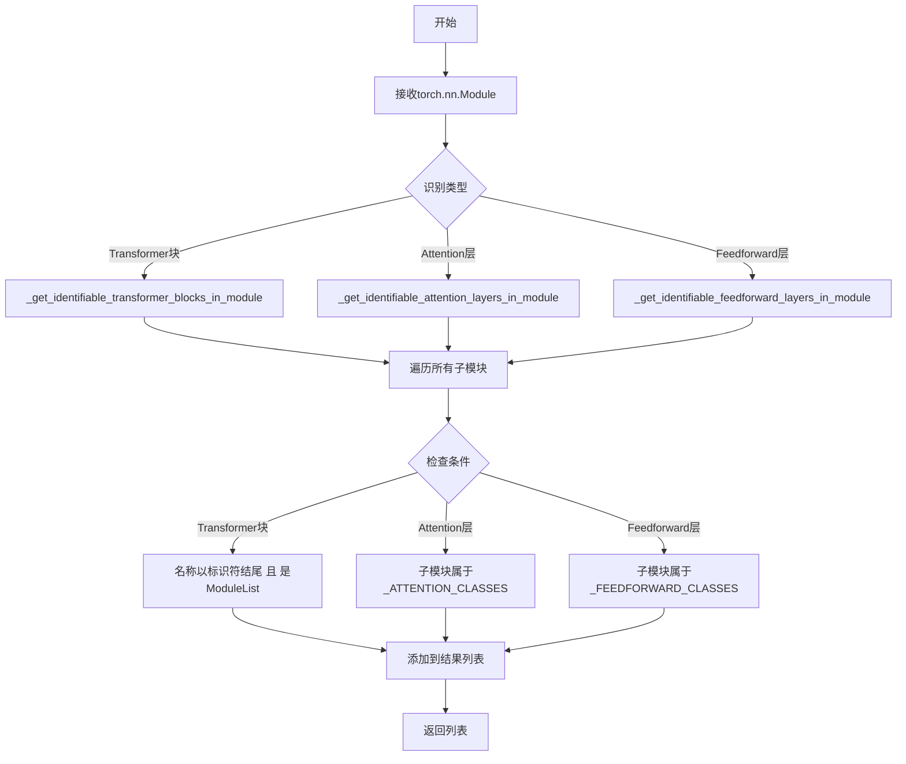

# `diffusers\src\diffusers\hooks\utils.py` 详细设计文档

该代码是一个PyTorch模型分析工具，用于从给定的nn.Module中识别并提取Transformer模型的关键组件，包括Transformer块、注意力层和前馈网络层。它通过预定义的标识符和类集合来匹配和分类模型的不同部分，便于模型分析、调试和优化。

## 整体流程



## 类结构

```
无类定义（纯函数模块）
```

## 全局变量及字段


### `_ALL_TRANSFORMER_BLOCK_IDENTIFIERS`
    
包含所有变压器块标识符的列表，用于在模块中识别变压器块模块。

类型：`list[str]`
    


### `_ATTENTION_CLASSES`
    
包含注意力层类类型的元组，用于识别模块中的注意力层。

类型：`tuple[type, ...]`
    


### `_FEEDFORWARD_CLASSES`
    
包含前馈网络层类类型的元组，用于识别模块中的前馈层。

类型：`tuple[type, ...]`
    


    

## 全局函数及方法


### `_get_identifiable_transformer_blocks_in_module`

该函数用于从给定的 PyTorch 模块中递归遍历所有子模块，筛选出以特定标识符结尾且类型为 `torch.nn.ModuleList` 的子模块，这些子模块被视为模型中的 Transformer 块，常用于模型分析、参数统计或特定层替换等场景。

参数：

- `module`：`torch.nn.Module`，需要扫描的 PyTorch 模块

返回值：`list[tuple[str, torch.nn.ModuleList]]`，返回由子模块名称和对应 `ModuleList` 对象组成的元组列表

#### 流程图

```mermaid
flowchart TD
    A[开始] --> B[创建空列表 module_list_with_transformer_blocks]
    B --> C[遍历 module.named_modules]
    C --> D[获取当前子模块的 name 和 submodule]
    D --> E{检查 name 是否以任意标识符结尾}
    E -->|是| F{检查 submodule 是否为 ModuleList}
    E -->|否| G[继续遍历下一个子模块]
    F -->|是| H[将 (name, submodule) 元组添加到列表]
    H --> G
    F -->|否| G
    G --> I{是否还有未遍历的子模块?}
    I -->|是| C
    I -->|否| J[返回 module_list_with_transformer_blocks]
    J --> K[结束]
```

#### 带注释源码

```python
def _get_identifiable_transformer_blocks_in_module(module: torch.nn.Module):
    """
    从模块中获取可识别的 transformer 块列表
    
    参数:
        module: torch.nn.Module，需要扫描的 PyTorch 模块
        
    返回:
        list: 包含 (子模块名称, ModuleList对象) 元组的列表
    """
    # 用于存储符合条件（是transformer块）的子模块
    module_list_with_transformer_blocks = []
    
    # 遍历模块的所有子模块（包括模块本身）
    for name, submodule in module.named_modules():
        # 检查子模块名称是否以预定义的标识符之一结尾
        # _ALL_TRANSFORMER_BLOCK_IDENTIFIERS 定义了合法的后缀标识
        name_endswith_identifier = any(
            name.endswith(identifier) 
            for identifier in _ALL_TRANSFORMER_BLOCK_IDENTIFIERS
        )
        
        # 检查子模块是否类型为 ModuleList
        # ModuleList 通常用于存储多个 transformer 层
        is_ModuleList = isinstance(submodule, torch.nn.ModuleList)
        
        # 只有同时满足以上两个条件才认为是 transformer 块
        if name_endswith_identifier and is_ModuleList:
            module_list_with_transformer_blocks.append((name, submodule))
    
    # 返回符合条件的 transformer 块列表
    return module_list_with_transformer_blocks
```


### `_get_identifiable_attention_layers_in_module`

该函数用于从给定的 PyTorch 模块中递归检索所有可识别的注意力层（Attention Layers）。它通过遍历模块的整个子模块树，检查每个子模块是否属于预定义的注意力层类别（`_ATTENTION_CLASSES`），并将匹配的子模块名称及其引用收集到列表中返回。

参数：

- `module`：`torch.nn.Module`，需要检索注意力层的目标 PyTorch 模块

返回值：`List[Tuple[str, torch.nn.Module]]`，返回包含所有可识别注意力层的元组列表，每个元组由子模块的完整路径名称（字符串）和对应的模块对象组成

#### 流程图

```mermaid
graph TD
    A[函数入口] --> B[初始化空列表: attention_layers]
    B --> C[遍历 module 的所有子模块: for name, submodule in module.named_modules]
    C --> D{isinstance(submodule, _ATTENTION_CLASSES)?}
    D -->|True| E[将元组 (name, submodule) 添加到 attention_layers]
    D -->|False| F[跳过当前子模块]
    E --> C
    F --> C
    C -->|遍历结束| G[返回 attention_layers 列表]
```

#### 带注释源码

```python
def _get_identifiable_attention_layers_in_module(module: torch.nn.Module):
    """
    从给定的 PyTorch 模块中提取所有可识别的注意力层。
    
    该函数通过遍历模块的所有子模块，筛选出属于预定义注意力层类别的模块，
    并返回包含名称-模块对偶的列表。
    
    参数:
        module (torch.nn.Module): 需要进行注意力层检索的 PyTorch 模块
        
    返回:
        List[Tuple[str, torch.nn.Module]]: 注意力层列表，每项为 (子模块名称, 子模块对象) 的元组
    """
    # 用于存储所有识别到的注意力层
    attention_layers = []
    
    # 遍历当前模块的所有命名子模块（包括自身）
    # named_modules() 返回迭代器，yield (模块名称, 子模块) 对
    for name, submodule in module.named_modules():
        # 检查当前子模块的类型是否属于预定义的注意力层类别
        # _ATTENTION_CLASSES 是从 ._common 模块导入的元组/列表，包含所有可识别的注意力层类型
        if isinstance(submodule, _ATTENTION_CLASSES):
            # 如果匹配，则将 (名称, 模块) 元组添加到结果列表
            attention_layers.append((name, submodule))
    
    # 返回包含所有注意力层的列表
    return attention_layers
```


### `_get_identifiable_feedforward_layers_in_module`

该函数用于从给定的 PyTorch 神经网络模块中递归遍历所有子模块，筛选出属于预定义前馈层类别的模块（如 MLP、FFN 等），并以列表形式返回它们的名称与模块实例对，以便后续对模型前馈层进行统一处理或分析。

参数：

- `module`：`torch.nn.Module`，需要遍历检查的 PyTorch 神经网络模块

返回值：`List[Tuple[str, torch.nn.Module]]`，返回一个列表，其中每个元素为元组 `(子模块名称, 子模块实例)`，包含所有被识别为前馈层的子模块

#### 流程图

```mermaid
flowchart TD
    A[开始] --> B[初始化空列表 feedforward_layers]
    B --> C[遍历 module 的所有子模块 named_modules]
    C --> D{当前子模块是否属于 _FEEDFORWARD_CLASSES?}
    D -->|是| E[将 (name, submodule) 元组添加到 feedforward_layers]
    D -->|否| F[继续下一个子模块]
    E --> F
    F --> G{是否还有未遍历的子模块?}
    G -->|是| C
    G -->|否| H[返回 feedforward_layers 列表]
    H --> I[结束]
```

#### 带注释源码

```python
def _get_identifiable_feedforward_layers_in_module(module: torch.nn.Module):
    """
    从给定的 PyTorch 模块中提取所有可识别的前馈层。
    
    该函数通过遍历模块的所有子模块，筛选出属于预定义前馈层类别的模块。
    常用于模型分析、层替换或特征提取等场景。
    
    参数:
        module: torch.nn.Module
            需要遍历检查的 PyTorch 神经网络模块
            
    返回:
        List[Tuple[str, torch.nn.Module]]:
            包含所有被识别为前馈层的 (名称, 模块) 元组列表
    """
    # 初始化用于存储前馈层的结果列表
    feedforward_layers = []
    
    # 遍历模块的所有子模块（递归遍历）
    # named_modules() 返回迭代器，产生 (子模块名称, 子模块实例) 元组
    for name, submodule in module.named_modules():
        
        # 检查当前子模块的类型是否属于预定义的前馈层类别
        # _FEEDFORWARD_CLASSES 是一个包含所有前馈层类别的元组或列表
        if isinstance(submodule, _FEEDWORK_CLASSES):
            
            # 如果匹配，则添加到结果列表中
            feedforward_layers.append((name, submodule))
    
    # 返回包含所有前馈层的列表
    return feedforward_layers
```

## 关键组件


### Transformer块识别函数 (_get_identifiable_transformer_blocks_in_module)

该函数通过遍历模块的所有子模块，识别以特定标识符结尾的ModuleList，这些通常是transformer块集合。它使用`name.endswith()`方法匹配预定义的标识符，并检查子模块是否为`torch.nn.ModuleList`类型，从而筛选出transformer块模块列表。

### 注意力层识别函数 (_get_identifiable_attention_layers_in_module)

该函数遍历模块的所有子模块，通过isinstance检查识别属于_ATTENTION_CLASSES类型的注意力层模块。它返回一个包含层名称和对应模块的元组列表，可用于定位模型中的注意力机制组件。

### 前馈层识别函数 (_get_identifiable_feedforward_layers_in_module)

该函数遍历模块的所有子模块，通过isinstance检查识别属于_FEEDFORWARD_CLASSES类型的前馈层模块。它返回一个包含层名称和对应模块的元组列表，用于定位模型中的前馈神经网络组件。

### 模块遍历与筛选模式

整个模块采用了统一的模块遍历模式：使用`module.named_modules()`递归遍历所有子模块，结合名称匹配和类型检查两种方式进行组件识别。这种设计允许灵活地扩展支持的组件类型，同时保持代码结构的一致性。

### 标识符与类集合

代码依赖于从`_common`模块导入的三个核心集合：`_ALL_TRANSFORMER_BLOCK_IDENTIFIERS`（transformer块标识符集合）、`_ATTENTION_CLASSES`（注意力层类集合）和`_FEEDFORWARD_CLASSES`（前馈层类集合）。这些集合定义了可识别的组件类型边界，是整个识别逻辑的基础。


## 问题及建议


### 已知问题

-   **重复遍历模块**：三个函数（`_get_identifiable_transformer_blocks_in_module`、`_get_identifiable_attention_layers_in_module`、`_get_identifiable_feedforward_layers_in_module`）均独立调用`named_modules()`遍历整个模块树，导致相同模块被重复遍历多次，时间复杂度为O(3n)，存在明显的性能优化空间。
-   **缺少类型注解**：所有函数均未定义返回类型注解（return type hints），降低了代码的可读性和静态分析工具的效能。
-   **缺少输入参数验证**：函数未对传入的`module`参数进行有效性检查（如`None`值检查），可能导致运行时错误。
-   **函数命名冗长**：`_get_identifiable_`前缀在三个函数中重复出现，可考虑提取为通用工具函数或使用更简洁的命名约定。
-   **缺乏文档字符串**：三个核心函数均无docstring，无法直接了解函数的具体行为、返回值格式和使用场景。
-   **字符串匹配局限性**：使用`name.endswith(identifier)`进行模块名匹配可能产生误匹配（如"block"和"non_block"的混淆），且无法处理嵌套层级中同名但不同作用域的模块。

### 优化建议

-   **合并遍历逻辑**：创建单一遍历函数，一次遍历同时收集transformer块、attention层和feedforward层，将时间复杂度从O(3n)降低至O(n)。
-   **添加类型注解**：为函数参数和返回值添加明确的类型注解，例如：
  ```python
  def _get_identifiable_transformer_blocks_in_module(module: torch.nn.Module) -> list[tuple[str, torch.nn.ModuleList]]:
  ```
-   **增加参数校验**：在函数入口处添加参数校验逻辑，提升函数健壮性：
  ```python
  if module is None:
      raise ValueError("module cannot be None")
  ```
-   **添加文档字符串**：为每个函数补充详细的docstring，说明功能、参数、返回值和使用示例。
-   **提取公共逻辑**：将`named_modules()`遍历逻辑抽象为基函数，避免代码重复，提高可维护性。
-   **考虑使用正则表达式**：对于复杂的模块命名匹配场景，可考虑使用正则表达式提高匹配精度。


## 其它


### 设计目标与约束

该模块的设计目标是提供一个通用的工具，能够从任意PyTorch模型中自动识别和提取三种核心transformer组件：transformer块（ModuleList形式）、attention层和feedforward层。设计约束包括：仅识别通过预定义标识符（_ALL_TRANSFORMER_BLOCK_IDENTIFIERS）和类类型（_ATTENTION_CLASSES、_FEEDFORWARD_CLASSES）明确标记的组件，不进行启发式猜测；仅返回ModuleList类型的transformer块；不修改原始模型结构，仅提供只读查询功能。

### 错误处理与异常设计

该模块的错误处理机制较为简单，主要通过Python内置的类型检查和异常传播实现。当输入的module参数不是torch.nn.Module类型时，named_modules()方法会抛出AttributeError；模块为空或不含目标组件时，函数返回空列表而非抛出异常，这是一种温和的错误处理策略。建议调用方在调用前验证module参数的有效性，并在结果为空时进行适当的错误提示。

### 数据流与状态机

该模块的数据流是单向的：输入一个torch.nn.Module对象，遍历其所有子模块，根据预定义的规则进行匹配筛选，最终输出符合条件的子模块列表。状态机表现为遍历过程中的状态转换：初始状态为"未检查"，遍历过程中根据匹配条件转换为"已匹配"或"未匹配"，最终输出匹配结果。无内部状态存储，纯粹是查询型操作。

### 外部依赖与接口契约

该模块的直接外部依赖包括：PyTorch（torch.nn.Module、torch.nn.ModuleList）；同包下的_common模块（_ALL_TRANSFORMER_BLOCK_IDENTIFIERS、_ATTENTION_CLASSES、_FEEDFORWARD_CLASSES）。接口契约要求：输入参数module必须是torch.nn.Module的实例；输出为列表，每个元素为(name, submodule)的元组，其中name为子模块的完整路径字符串，submodule为对应的torch.nn.Module对象。

### 性能考虑

该模块的性能特征主要由两个方面决定：named_modules()的遍历复杂度为O(n)，其中n为模型中所有子模块的数量；每个函数都需要完整遍历一次模型，当需要同时获取三种组件时，存在重复遍历的性能开销。建议优化方向：在单次遍历中同时收集三种类型的组件，减少遍历次数；对于大型模型，可考虑添加缓存机制。

### 安全性考虑

该模块仅执行只读查询操作，不修改模型权重或结构，安全性较高。但需要注意：输入的module对象可能包含恶意设计的子模块，遍历过程中应确保不会触发意外的副作用；输出的是原始子模块的引用，调用方应避免直接修改返回的submodule对象以免影响原始模型。

### 测试策略

该模块的测试应覆盖以下场景：正常情况下能够正确识别各类组件；空模型或不含目标组件的模型返回空列表；嵌套模型结构能够正确识别深层的组件；不同类型的transformer块（encoder、decoder等）都能被正确识别；模块名称不匹配或类型不匹配时不会误识别。建议使用mock对象和真实模型结构进行单元测试和集成测试。

    