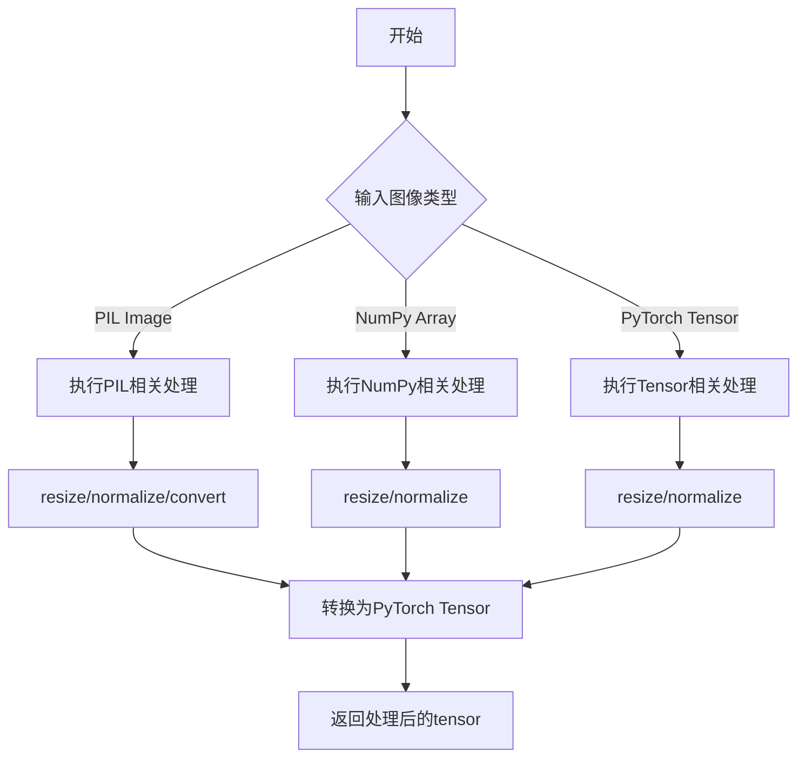
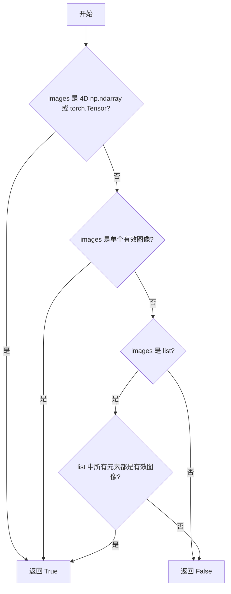
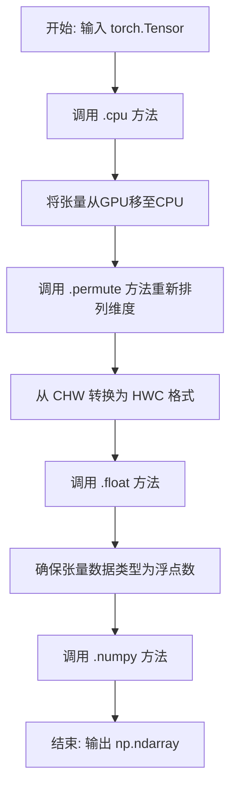
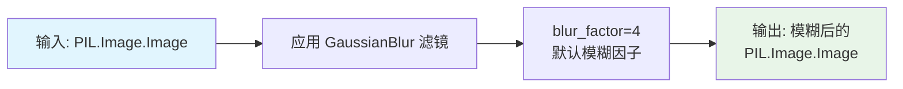
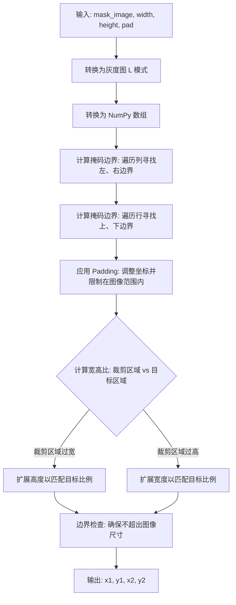
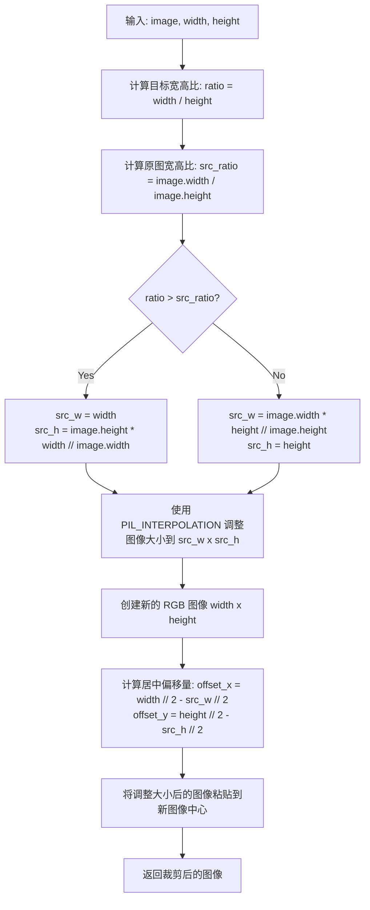
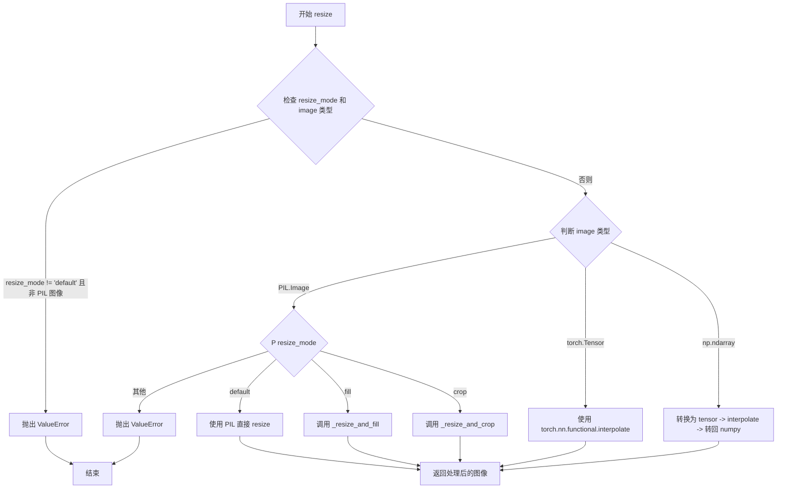

```mermaid
flowchart TD
    A[开始] --> B[调用 image.convert&#40;'RGB'&#41;]
    B --> C[返回转换后的图像]
    C --> D[结束]
```

# `diffusers\src\diffusers\image_processor.py` 详细设计文档

这是一个用于VAE（变分自编码器）图像处理的库，支持多种图像格式（PIL、NumPy、PyTorch）之间的转换、图像缩放、裁剪、归一化等预处理和后处理操作，并提供专门针对修复、深度估计、IP-Adapter和PixArt等不同任务的图像处理器。

## 整体流程



## 类结构

```
ConfigMixin (配置混入基类)
└── VaeImageProcessor (VAE图像处理器基类)
    ├── InpaintProcessor (修复图像处理器)
    ├── VaeImageProcessorLDM3D (LDM3D深度图像处理器)
    ├── IPAdapterMaskProcessor (IP-Adapter掩码处理器)
    └── PixArtImageProcessor (PixArt图像处理器)
```

## 全局变量及字段


### `PipelineImageInput`
    
联合类型，定义图像输入支持的多种格式，包括PIL图像、NumPy数组、PyTorch张量及其列表

类型：`PIL.Image.Image | np.ndarray | torch.Tensor | list[PIL.Image.Image] | list[np.ndarray] | list[torch.Tensor]`
    


### `PipelineDepthInput`
    
联合类型，定义深度图像输入支持的多种格式，与PipelineImageInput类型相同

类型：`PIL.Image.Image | np.ndarray | torch.Tensor | list[PIL.Image.Image] | list[np.ndarray] | list[torch.Tensor]`
    


### `is_valid_image`
    
全局函数，检查输入是否为有效图像，支持PIL图像、2D或3D的NumPy数组或PyTorch张量

类型：`function`
    


### `is_valid_image_imagelist`
    
全局函数，检查输入是否为有效的图像或图像列表，支持4D张量/数组、单张图像或图像列表

类型：`function`
    


### `VaeImageProcessor.VaeImageProcessor.config_name`
    
配置名称，用于标识VaeImageProcessor的配置对象

类型：`str`
    


### `VaeImageProcessor.VaeImageProcessor.config`
    
继承自ConfigMixin的配置对象，包含do_resize、vae_scale_factor、resample等图像处理配置

类型：`ConfigMixin`
    


### `InpaintProcessor.InpaintProcessor.config_name`
    
配置名称，用于标识InpaintProcessor的配置对象

类型：`str`
    


### `InpaintProcessor.InpaintProcessor._image_processor`
    
内部图像处理器实例，用于处理待修复的图像

类型：`VaeImageProcessor`
    


### `InpaintProcessor.InpaintProcessor._mask_processor`
    
内部掩码处理器实例，用于处理修复掩码

类型：`VaeImageProcessor`
    


### `VaeImageProcessorLDM3D.VaeImageProcessorLDM3D.config_name`
    
配置名称，用于标识VaeImageProcessorLDM3D的配置对象

类型：`str`
    


### `VaeImageProcessorLDM3D.VaeImageProcessorLDM3D.config`
    
继承自VaeImageProcessor的配置对象，用于LDM3D特定的图像处理配置

类型：`ConfigMixin`
    


### `IPAdapterMaskProcessor.IPAdapterMaskProcessor.config_name`
    
配置名称，用于标识IPAdapterMaskProcessor的配置对象

类型：`str`
    


### `IPAdapterMaskProcessor.IPAdapterMaskProcessor.config`
    
继承自VaeImageProcessor的配置对象，包含IP适配器掩码处理的配置

类型：`ConfigMixin`
    


### `PixArtImageProcessor.PixArtImageProcessor.config`
    
继承自VaeImageProcessor的配置对象，用于PixArt图像特定的调整大小和裁剪配置

类型：`ConfigMixin`
    
    

## 全局函数及方法


### `is_valid_image`

该函数用于验证输入是否为有效的图像对象，支持 PIL 图像、NumPy 数组和 PyTorch 张量三种格式，并通过检查数组维度（2D 或 3D）来确保图像数据的有效性。

参数：

- `image`：`PIL.Image.Image | np.ndarray | torch.Tensor`，要验证的图像，可以是 PIL 图像、NumPy 数组或 PyTorch 张量

返回值：`bool`，如果输入是有效图像返回 `True`，否则返回 `False`

#### 流程图

```mermaid
flowchart TD
    A[开始] --> B{image 是 PIL.Image.Image?}
    B -->|是| D[返回 True]
    B -->|否| C{image 是 np.ndarray 或 torch.Tensor?}
    C -->|否| F[返回 False]
    C -->|是| E{image.ndim in (2, 3)?}
    E -->|是| D
    E -->|否| F
```

#### 带注释源码

```python
def is_valid_image(image) -> bool:
    r"""
    Checks if the input is a valid image.

    A valid image can be:
    - A `PIL.Image.Image`.
    - A 2D or 3D `np.ndarray` or `torch.Tensor` (grayscale or color image).

    Args:
        image (`PIL.Image.Image | np.ndarray | torch.Tensor`):
            The image to validate. It can be a PIL image, a NumPy array, or a torch tensor.

    Returns:
        `bool`:
            `True` if the input is a valid image, `False` otherwise.
    """
    # 检查是否为 PIL 图像对象
    if isinstance(image, PIL.Image.Image):
        return True
    
    # 检查是否为 NumPy 数组或 PyTorch 张量，且维度为 2D 或 3D
    # 2D: 灰度图像 (height, width)
    # 3D: 彩色图像 (height, width, channels) 或 (channels, height, width)
    return isinstance(image, (np.ndarray, torch.Tensor)) and image.ndim in (2, 3)
```


### `is_valid_image_imagelist`

该函数用于验证输入是否为有效的图像或图像列表，支持 4D 张量/数组（批量图像）、单个图像（PIL Image、2D/3D NumPy 数组或 PyTorch 张胎）以及图像列表三种格式。

参数：

- `images`：`np.ndarray | torch.Tensor | PIL.Image.Image | list`，待验证的图像或图像列表，可以是批量图像（4D 张量/数组）、单个图像或有效图像列表

返回值：`bool`，如果输入有效返回 `True`，否则返回 `False`

#### 流程图



#### 带注释源码

```python
def is_valid_image_imagelist(images):
    r"""
    Checks if the input is a valid image or list of images.

    The input can be one of the following formats:
    - A 4D tensor or numpy array (batch of images).
    - A valid single image: `PIL.Image.Image`, 2D `np.ndarray` or `torch.Tensor` (grayscale image), 3D `np.ndarray` or
      `torch.Tensor`.
    - A list of valid images.

    Args:
        images (`np.ndarray | torch.Tensor | PIL.Image.Image | list`):
            The image(s) to check. Can be a batch of images (4D tensor/array), a single image, or a list of valid
            images.

    Returns:
        `bool`:
            `True` if the input is valid, `False` otherwise.
    """
    # 检查是否为批量图像（4D 张量或数组）
    if isinstance(images, (np.ndarray, torch.Tensor)) and images.ndim == 4:
        return True
    # 检查是否为单个有效图像（调用 is_valid_image 函数）
    elif is_valid_image(images):
        return True
    # 检查是否为图像列表
    elif isinstance(images, list):
        return all(is_valid_image(image) for image in images)
    # 默认返回 False
    return False
```


### `VaeImageProcessor.__init__`

这是 VaeImageProcessor 类的构造函数，用于初始化图像处理器的各项配置参数。该方法通过 `@register_to_config` 装饰器将配置注册到系统中，并验证 `do_convert_rgb` 和 `do_convert_grayscale` 不能同时为 `True`。

参数：

- `do_resize`：`bool`，可选，默认值为 `True`。是否对图像进行下采样，将图像的（高度，宽度）尺寸调整为 `vae_scale_factor` 的倍数。
- `vae_scale_factor`：`int`，可选，默认值为 `8`。VAE 缩放因子。如果 `do_resize` 为 `True`，图像会自动调整为此因子的倍数。
- `vae_latent_channels`：`int`，可选，默认值为 `4`。VAE 潜在空间的通道数。
- `resample`：`str`，可选，默认值为 `"lanczos"`。调整图像大小时使用的重采样滤波器。
- `reducing_gap`：`int | None`，可选，默认值为 `None`。用于调整大小的减少间隙参数。
- `do_normalize`：`bool`，可选，默认值为 `True`。是否将图像归一化到 [-1, 1] 范围。
- `do_binarize`：`bool`，可选，默认值为 `False`。是否将图像二值化为 0/1。
- `do_convert_rgb`：`bool`，可选，默认值为 `False`。是否将图像转换为 RGB 格式。
- `do_convert_grayscale`：`bool`，可选，默认值为 `False`。是否将图像转换为灰度格式。

返回值：`None`，构造函数不返回任何值。

#### 流程图

```mermaid
flowchart TD
    A[开始 __init__] --> B[调用 super().__init__]
    B --> C{do_convert_rgb 且 do_convert_grayscale?}
    C -->|是| D[抛出 ValueError]
    C -->|否| E[结束 __init__]
    D --> F[结束并显示错误信息]
```

#### 带注释源码

```python
@register_to_config
def __init__(
    self,
    do_resize: bool = True,
    vae_scale_factor: int = 8,
    vae_latent_channels: int = 4,
    resample: str = "lanczos",
    reducing_gap: int | None = None,
    do_normalize: bool = True,
    do_binarize: bool = False,
    do_convert_rgb: bool = False,
    do_convert_grayscale: bool = False,
):
    """
    初始化 VaeImageProcessor 实例。
    
    该方法通过 @register_to_config 装饰器将所有参数注册为配置项，
    使得配置可以被保存和加载。同时验证互斥的选项。
    
    Args:
        do_resize: 是否调整图像大小
        vae_scale_factor: VAE 缩放因子
        vae_latent_channels: VAE 潜在通道数
        resample: 重采样方法
        reducing_gap: 减少间隙参数
        do_normalize: 是否归一化
        do_binarize: 是否二值化
        do_convert_rgb: 是否转换为 RGB
        do_convert_grayscale: 是否转换为灰度
    """
    # 调用父类 ConfigMixin 的初始化方法
    super().__init__()
    
    # 检查互斥选项：不能同时启用 RGB 和灰度转换
    if do_convert_rgb and do_convert_grayscale:
        raise ValueError(
            "`do_convert_rgb` and `do_convert_grayscale` can not both be set to `True`,"
            " if you intended to convert the image into RGB format, please set `do_convert_grayscale = False`.",
            " if you intended to convert the image into grayscale format, please set `do_convert_rgb = False`",
        )
```


### `VaeImageProcessor.numpy_to_pil`

将 NumPy 数组格式的图像或图像批次转换为 PIL 图像列表，支持单通道灰度图像和彩色图像的转换。

参数：

- `images`：`np.ndarray`，输入的图像数组，可以是单张图像（3维）或批次图像（4维），像素值范围应为 [0, 1]

返回值：`list[PIL.Image.Image]`，转换后的 PIL 图像列表

#### 流程图

```mermaid
flowchart TD
    A[开始: 输入 images] --> B{images.ndim == 3?}
    B -- 是 --> C[添加批次维度: images[None, ...]]
    B -- 否 --> D[保持原样]
    C --> E[像素值归一化: (images * 255).round().astypeuint8]
    D --> E
    E --> F{images.shape[-1] == 1?}
    F -- 是 --> G[灰度处理: 使用mode='L']
    F -- 否 --> H[彩色处理: 直接转换]
    G --> I[创建PIL图像列表: Image.fromarray]
    H --> I
    I --> J[返回: pil_images列表]
```

#### 带注释源码

```python
@staticmethod
def numpy_to_pil(images: np.ndarray) -> list[PIL.Image.Image]:
    r"""
    将numpy图像或图像批次转换为PIL图像。

    参数:
        images (np.ndarray):
            要转换为PIL格式的图像数组。

    返回值:
        list[PIL.Image.Image]:
            PIL图像列表。
    """
    # 检查是否为单张图像（3维），若是则添加批次维度变为4维
    if images.ndim == 3:
        images = images[None, ...]
    
    # 将像素值从[0,1]范围映射到[0,255]的uint8类型
    images = (images * 255).round().astype("uint8")
    
    # 根据通道数判断是否为灰度图像
    if images.shape[-1] == 1:
        # 灰度图像特殊处理：使用mode="L"并压缩单通道维度
        pil_images = [Image.fromarray(image.squeeze(), mode="L") for image in images]
    else:
        # 彩色图像直接转换为PIL图像
        pil_images = [Image.fromarray(image) for image in images]

    return pil_images
```


### `VaeImageProcessor.pil_to_numpy`

将 PIL 图像或 PIL 图像列表转换为 NumPy 数组格式，支持单张图像和批量图像处理，自动将像素值归一化到 [0, 1] 范围。

参数：

- `images`：`list[PIL.Image.Image] | PIL.Image.Image`，要转换的 PIL 图像或 PIL 图像列表

返回值：`np.ndarray`，转换后的 NumPy 数组表示的图像

#### 流程图

```mermaid
flowchart TD
    A[开始: pil_to_numpy] --> B{images是否为列表?}
    B -- 是 --> C[保持原列表]
    B -- 否 --> D[将images包装为列表: images = [images]
    C --> E[遍历images列表]
    D --> E
    E --> F[将每个PIL图像转换为NumPy数组]
    F --> G[将像素值转换为float32并除以255.0进行归一化]
    G --> H[使用np.stack沿axis=0堆叠数组]
    I[返回NumPy数组] --> J[结束]
    H --> I
```

#### 带注释源码

```python
@staticmethod
def pil_to_numpy(images: list[PIL.Image.Image] | PIL.Image.Image) -> np.ndarray:
    r"""
    Convert a PIL image or a list of PIL images to NumPy arrays.

    Args:
        images (`PIL.Image.Image` or `list[PIL.Image.Image]`):
            The PIL image or list of images to convert to NumPy format.

    Returns:
        `np.ndarray`:
            A NumPy array representation of the images.
    """
    # 如果输入不是列表，则将其包装为列表，统一处理流程
    if not isinstance(images, list):
        images = [images]
    
    # 遍历每个PIL图像，转换为NumPy数组并归一化到[0,1]范围
    # 1. np.array(image): 将PIL图像转换为NumPy数组
    # 2. .astype(np.float32): 转换为32位浮点数
    # 3. / 255.0: 将像素值从[0,255]归一化到[0,1]
    images = [np.array(image).astype(np.float32) / 255.0 for image in images]
    
    # 使用np.stack沿axis=0（批量维度）堆叠数组
    # 例如: 多张H x W x C的图像堆叠后变成B x H x W x C
    images = np.stack(images, axis=0)

    return images
```


### `VaeImageProcessor.numpy_to_pt`

将 NumPy 图像数组转换为 PyTorch 张量格式。

参数：

- `images`：`np.ndarray`，需要转换的 NumPy 图像数组，支持 3D（单图）或 4D（批量）数组

返回值：`torch.Tensor`，转换后的 PyTorch 张量，形状为 `[batch, channels, height, width]`

#### 流程图

```mermaid
flowchart TD
    A[输入: NumPy 数组 images] --> B{images.ndim == 3?}
    B -->|是| C[添加通道维度<br/>images = images[..., None]]
    B -->|否| D[保持原样]
    C --> E[转置维度<br/>transpose(0, 3, 1, 2)]
    D --> E
    E --> F[torch.from_numpy<br/>转换为张量]
    F --> G[输出: PyTorch Tensor<br/>[batch, channels, height, width]]
```

#### 带注释源码

```python
@staticmethod
def numpy_to_pt(images: np.ndarray) -> torch.Tensor:
    r"""
    将 NumPy 图像转换为 PyTorch 张量。

    Args:
        images (np.ndarray):
            要转换为 PyTorch 格式的 NumPy 图像数组。

    Returns:
        torch.Tensor:
            图像的 PyTorch 张量表示。
    """
    # 如果是 3D 数组（单张图像：H x W x C），添加 batch 维度变成 4D
    # 这确保输出始终是 4D 张量 [batch, height, width, channels]
    if images.ndim == 3:
        images = images[..., None]  # 等价于 np.expand_dims(images, axis=-1)

    # 执行维度转置：将 [batch, height, width, channels] 
    # 转换为 PyTorch 常用的 [batch, channels, height, width] 格式
    images = torch.from_numpy(images.transpose(0, 3, 1, 2))
    
    # 返回转换后的 PyTorch 张量
    return images
```

#### 设计说明

| 特性 | 说明 |
|------|------|
| **功能** | 将 NumPy 数组表示的图像转换为 PyTorch 张量，同时调整维度顺序以符合 PyTorch 的约定 |
| **输入格式** | 3D (H×W×C) 或 4D (B×H×W×C) NumPy 数组 |
| **输出格式** | 4D (B×C×H×W) PyTorch 张量 |
| **维度转换** | NumPy 通常使用 H×W×C 顺序，PyTorch 使用 C×H×W 顺序 |
| **批量处理** | 自动处理单张图像（3D）和批量图像（4D）两种情况 |


### `VaeImageProcessor.pt_to_numpy`

将 PyTorch 张量（Tensor）转换为 NumPy 数组（ndarray），用于在深度学习模型推理后将张量结果转换为 Python 科学计算库常用的数组格式。

参数：

- `images`：`torch.Tensor`，输入的 PyTorch 张量，通常为形状 `[batch_size, channels, height, width]` 的图像数据

返回值：`np.ndarray`，转换后的 NumPy 数组，形状为 `[batch_size, height, width, channels]`

#### 流程图



#### 带注释源码

```python
@staticmethod
def pt_to_numpy(images: torch.Tensor) -> np.ndarray:
    r"""
    Convert a PyTorch tensor to a NumPy image.

    Args:
        images (`torch.Tensor`):
            The PyTorch tensor to convert to NumPy format.

    Returns:
        `np.ndarray`:
            A NumPy array representation of the images.
    """
    # 步骤1: .cpu() - 将张量从GPU设备移到CPU设备
    #        这样可以确保在转换过程中不会因设备不兼容而报错
    images = images.cpu()
    
    # 步骤2: .permute(0, 2, 3, 1) - 重新排列张量的维度顺序
    #        原始格式: [batch, channels, height, width] (CHW)
    #        转换后:   [batch, height, width, channels] (HWC)
    #        这样符合NumPy数组的标准图像格式约定
    images = images.permute(0, 2, 3, 1)
    
    # 步骤3: .float() - 将张量转换为浮点类型
    #        确保数值精度一致，避免后续计算误差
    images = images.float()
    
    # 步骤4: .numpy() - 将PyTorch张量转换为NumPy数组
    #        完成最终的格式转换，便于后续处理或可视化
    images = images.numpy()
    
    return images
```


### `VaeImageProcessor.normalize`

将图像数组归一化到 [-1,1] 范围。

参数：

- `images`：`np.ndarray | torch.Tensor`，要归一化的图像数组

返回值：`np.ndarray | torch.Tensor`，归一化后的图像数组

#### 流程图

```mermaid
flowchart TD
    A[输入: images<br/>np.ndarray | torch.Tensor] --> B[计算: 2.0 * images - 1.0]
    B --> C[输出: 归一化图像<br/>np.ndarray | torch.Tensor<br/>范围 [-1, 1]]
```

#### 带注释源码

```python
@staticmethod
def normalize(images: np.ndarray | torch.Tensor) -> np.ndarray | torch.Tensor:
    r"""
    Normalize an image array to [-1,1].

    Args:
        images (`np.ndarray` or `torch.Tensor`):
            The image array to normalize.

    Returns:
        `np.ndarray` or `torch.Tensor`:
            The normalized image array.
    """
    # 将图像从 [0, 1] 范围映射到 [-1, 1] 范围
    # 公式: output = input * 2.0 - 1.0
    # 例如: 0 -> -1, 0.5 -> 0, 1 -> 1
    return 2.0 * images - 1.0
```


### `VaeImageProcessor.denormalize`

将归一化后的图像数组从 [-1,1] 范围反归一化到 [0,1] 范围。

参数：

- `images`：`np.ndarray | torch.Tensor`，要进行反归一化的图像数组，原始范围为 [-1,1]

返回值：`np.ndarray | torch.Tensor`，反归一化后的图像数组，范围为 [0,1]

#### 流程图

```mermaid
flowchart TD
    A[开始: 输入 images] --> B{判断输入类型}
    B -->|torch.Tensor| C[执行: (images * 0.5 + 0.5).clamp(0, 1)]
    B -->|np.ndarray| D[执行: np.clip(images * 0.5 + 0.5, 0, 1)]
    C --> E[返回反归一化后的图像]
    D --> E
```

#### 带注释源码

```python
@staticmethod
def denormalize(images: np.ndarray | torch.Tensor) -> np.ndarray | torch.Tensor:
    r"""
    Denormalize an image array to [0,1].

    Args:
        images (`np.ndarray` or `torch.Tensor`):
            The image array to denormalize.

    Returns:
        `np.ndarray` or `torch.Tensor`:
            The denormalized image array.
    """
    # 步骤1: 将图像从 [-1,1] 范围映射到 [0,1] 范围
    # 公式: (x + 1) / 2 = x * 0.5 + 0.5
    # 这是 normalize 方法的逆操作
    denormalized = images * 0.5 + 0.5
    
    # 步骤2: 将数值限制在 [0,1] 范围内，防止数值溢出
    # 对于 torch.Tensor 使用 .clamp() 方法
    # 对于 np.ndarray 使用 np.clip() 函数（在调用处处理）
    return denormalized.clamp(0, 1)
```


### `VaeImageProcessor.convert_to_rgb`

将输入的 PIL 图像对象转换为 RGB 颜色模式，确保图像具有三个颜色通道（R、G、B），以便后续处理流程中的模型能够正确读取图像数据。

参数：

- `image`：`PIL.Image.Image`，需要进行 RGB 格式转换的 PIL 图像对象

返回值：`PIL.Image.Image`，转换后的 RGB 格式 PIL 图像对象

#### 流程图



#### 带注释源码

```python
@staticmethod
def convert_to_rgb(image: PIL.Image.Image) -> PIL.Image.Image:
    r"""
    Converts a PIL image to RGB format.

    Args:
        image (`PIL.Image.Image`):
            The PIL image to convert to RGB.

    Returns:
        `PIL.Image.Image`:
            The RGB-converted PIL image.
    """
    # 使用 PIL 的 convert 方法将图像模式转换为 RGB
    # 无论输入图像是灰度图(L)、RGBA还是其他模式,
    # 转换后都会确保图像具有3个通道:R、G、B
    image = image.convert("RGB")

    # 返回转换后的 RGB 图像对象
    return image
```


### `VaeImageProcessor.convert_to_grayscale`

该方法是一个静态方法，用于将输入的 PIL Image 对象转换为灰度图像（Grayscale）。

参数：

- `image`：`PIL.Image.Image`，需要转换的输入图像。

返回值：`PIL.Image.Image`，转换后的灰度图像对象。

#### 流程图

```mermaid
graph LR
    A[输入图像: PIL.Image.Image] --> B{调用 convert 方法}
    B --> C[image.convert('L')]
    C --> D[输出图像: PIL.Image.Image (灰度)]
```

#### 带注释源码

```python
@staticmethod
def convert_to_grayscale(image: PIL.Image.Image) -> PIL.Image.Image:
    r"""
    Converts a given PIL image to grayscale.

    Args:
        image (`PIL.Image.Image`):
            The input image to convert.

    Returns:
        `PIL.Image.Image`:
            The image converted to grayscale.
    """
    # 使用 PIL 的 convert 方法，'L' 模式代表 8位灰度图像 (Luminance)
    # 这会根据像素的亮度将其转换为黑白灰度
    image = image.convert("L")

    return image
```


### VaeImageProcessor.blur

对输入的 PIL 图像应用高斯模糊处理。

参数：

- `image`：`PIL.Image.Image`，要进行模糊处理的 PIL 图像
- `blur_factor`：`int`，高斯模糊的模糊因子，默认为 4，值越大模糊效果越强

返回值：`PIL.Image.Image`，应用高斯模糊后的 PIL 图像

#### 流程图



#### 带注释源码

```python
@staticmethod
def blur(image: PIL.Image.Image, blur_factor: int = 4) -> PIL.Image.Image:
    r"""
    Applies Gaussian blur to an image.

    Args:
        image (`PIL.Image.Image`):
            The PIL image to convert to grayscale.

        blur_factor (`int`, optional, defaults to 4):
            The blur factor for Gaussian blur. Higher values result in more blur.

    Returns:
        `PIL.Image.Image`:
            The blurred PIL image.
    """
    # 使用 PIL 的 ImageFilter.GaussianBlur 创建模糊滤镜
    # blur_factor 控制模糊半径，默认为 4
    image = image.filter(ImageFilter.GaussianBlur(blur_factor))

    # 返回应用模糊滤镜后的图像
    return image
```


### `VaeImageProcessor.get_crop_region`

#### 一段话描述
该方法接收一个掩码图像（Mask）和目标处理图像的尺寸，通过扫描掩码计算包含所有有效区域的边界框，应用Padding，并动态调整边界框的宽高以匹配目标图像的宽高比例，从而生成精确的裁剪坐标，确保后续图像处理（如Inpainting）的掩码与图像对齐。

#### 类详细信息
**类名**: `VaeImageProcessor`
**父类**: `ConfigMixin`
**功能描述**: 用于VAE（Variational Autoencoder）的图像处理器，负责图像的预处理（Resize、Normalize、Convert）和后处理。

**类字段 (Key Fields)**:
- `do_resize` (`bool`): 是否调整图像大小。
- `vae_scale_factor` (`int`): VAE的缩放因子。
- `resample` (`str`): 重采样滤波器（如'lanczos'）。
- `do_normalize` (`bool`): 是否将图像归一化到[-1, 1]。

#### 参数与返回值

**参数**:
- `mask_image`: `PIL.Image.Image`，需要进行区域计算的掩码图像。
- `width`: `int`，目标处理图像的宽度。
- `height`: `int`，目标处理图像的高度。
- `pad`: `int` (可选, 默认值: `0`)，裁剪区域的padding（填充）大小。

**返回值**:
- `tuple[int, int, int, int]`，返回 `(x1, y1, x2, y2)`，代表裁剪区域的左上角和右下角坐标。

#### 流程图



#### 带注释源码

```python
@staticmethod
def get_crop_region(mask_image: PIL.Image.Image, width: int, height: int, pad=0):
    r"""
    Finds a rectangular region that contains all masked ares in an image, and expands region to match the aspect
    ratio of the original image; for example, if user drew mask in a 128x32 region, and the dimensions for
    processing are 512x512, the region will be expanded to 128x128.

    Args:
        mask_image (PIL.Image.Image): Mask image.
        width (int): Width of the image to be processed.
        height (int): Height of the image to be processed.
        pad (int, optional): Padding to be added to the crop region. Defaults to 0.

    Returns:
        tuple: (x1, y1, x2, y2) represent a rectangular region that contains all masked ares in an image and
        matches the original aspect ratio.
    """

    # 1. 将掩码图像转换为灰度模式 (L模式: 0=黑/无掩码, 255=白/有掩码)
    mask_image = mask_image.convert("L")
    mask = np.array(mask_image)

    # 2. 查找包含所有掩码区域的矩形边界 (寻找非零像素的极限位置)
    h, w = mask.shape
    crop_left = 0
    # 从左向右扫描，找第一个有非零像素的列
    for i in range(w):
        if not (mask[:, i] == 0).all():
            break
        crop_left += 1

    crop_right = 0
    # 从右向左扫描，找最后一个有非零像素的列
    for i in reversed(range(w)):
        if not (mask[:, i] == 0).all():
            break
        crop_right += 1

    crop_top = 0
    # 从上向下扫描，找第一个有非零像素的行
    for i in range(h):
        if not (mask[i] == 0).all():
            break
        crop_top += 1

    crop_bottom = 0
    # 从下向上扫描，找最后一个有非零像素的行
    for i in reversed(range(h)):
        if not (mask[i] == 0).all():
            break
        crop_bottom += 1

    # 3. 添加 Padding 并计算基础边界框
    x1, y1, x2, y2 = (
        int(max(crop_left - pad, 0)),          # 左边界，减去pad，不小于0
        int(max(crop_top - pad, 0)),           # 上边界
        int(min(w - crop_right + pad, w)),     # 右边界，加上pad，不大于图像宽度w
        int(min(h - crop_bottom + pad, h)),    # 下边界，加上pad，不大于图像高度h
    )

    # 4. 扩展裁剪区域以匹配目标处理图像的宽高比 (防止变形)
    ratio_crop_region = (x2 - x1) / (y2 - y1)  # 当前裁剪区域的宽高比
    ratio_processing = width / height          # 目标处理图像的宽高比

    if ratio_crop_region > ratio_processing:
        # 如果裁剪区域比目标图像"更宽"，则增加高度以匹配比例
        desired_height = (x2 - x1) / ratio_processing
        desired_height_diff = int(desired_height - (y2 - y1))
        
        # 上下对称扩展
        y1 -= desired_height_diff // 2
        y2 += desired_height_diff - desired_height_diff // 2
        
        # 边界检查：确保不超出底部
        if y2 >= mask_image.height:
            diff = y2 - mask_image.height
            y2 -= diff
            y1 -= diff
        # 边界检查：确保不超出顶部
        if y1 < 0:
            y2 -= y1
            y1 -= y1
        # 二次检查底部
        if y2 >= mask_image.height:
            y2 = mask_image.height
    else:
        # 如果裁剪区域比目标图像"更高"，则增加宽度以匹配比例
        desired_width = (y2 - y1) * ratio_processing
        desired_width_diff = int(desired_width - (x2 - x1))
        
        # 左右对称扩展
        x1 -= desired_width_diff // 2
        x2 += desired_width_diff - desired_width_diff // 2
        
        # 边界检查：确保不超出右侧
        if x2 >= mask_image.width:
            diff = x2 - mask_image.width
            x2 -= diff
            x1 -= diff
        # 边界检查：确保不超出左侧
        if x1 < 0:
            x2 -= x1
            x1 -= x1
        # 二次检查右侧
        if x2 >= mask_image.width:
            x2 = mask_image.width

    return x1, y1, x2, y2
```

#### 关键组件信息

1.  **掩码边界计算 (Bounding Box Calculation)**: 核心算法，通过简单的循环遍历像素矩阵来定位掩码的覆盖范围。
2.  **宽高比匹配 (Aspect Ratio Matching)**: 通过 `ratio_crop_region` vs `ratio_processing` 判断并调整裁剪框，这是保证Inpainting等任务中Mask不变形的关键步骤。

#### 潜在的技术债务或优化空间

1.  **性能优化**: 目前的边界查找使用了 Python 的 `for` 循环遍历整个列或行，这在高分辨率图像（如4K）上可能较慢。可以使用 NumPy 的向量化操作（如 `np.argmax` 结合布尔索引）来直接定位第一个和最后一个非零索引，性能可提升数倍。
    *   *示例优化思路*: `rows_with_mask = np.any(mask > 0, axis=1); top = rows_with_mask.argmax(); bottom = mask.shape[0] - rows_with_mask[::-1].argmax() - 1`。
2.  **边界处理逻辑**: 当前的边界钳制（Clamping）逻辑嵌套在宽高比调整的分支中，虽然逻辑正确但略显复杂。如果扩展后的区域仍然超出边界，可能会进行二次调整，可能导致最终尺寸与预期有细微偏差。

#### 其它项目

*   **设计目标**: 确保Mask区域被完整包含，同时生成的裁剪坐标能够适应后续的图像缩放处理，保持掩码相对位置和比例的正确性。
*   **错误处理**:
    *   如果输入的 `mask_image` 完全是黑色（全0），该方法会扫描全图，最终返回整个图像作为裁剪区域（加上Padding）。
    *   如果 `width` 或 `height` 为0，可能导致除零错误，调用方需保证输入合法。
*   **外部依赖**: 依赖 `PIL.Image` 和 `numpy`。


### `VaeImageProcessor._resize_and_fill`

该方法将输入的 PIL 图像调整大小以适应指定的宽度和高度，保持纵横比，然后将图像居中放置在目标尺寸内，对于空白区域使用调整后图像的边缘像素进行填充。

参数：

- `image`：`PIL.Image.Image`，要调整大小并填充的图像
- `width`：`int`，目标宽度
- `height`：`int`，目标高度

返回值：`PIL.Image.Image`，调整大小并填充后的图像

#### 流程图

```mermaid
flowchart TD
    A[开始] --> B[计算目标宽高比 ratio = width / height]
    B --> C[计算原图宽高比 src_ratio = image.width / image.height]
    C --> D{ratio < src_ratio?}
    D -->|是| E[src_w = width<br/>src_h = image.height * width // image.width]
    D -->|否| F[src_w = image.width * height // image.height<br/>src_h = height]
    E --> G[使用 PIL_INTERPOLATION 调整图像大小到 src_w × src_h]
    F --> G
    G --> H[创建新的 RGB 图像<br/>res 大小为 width × height]
    H --> I[将 resized 图像粘贴到中心位置<br/>box = (width//2 - src_w//2, height//2 - src_h//2)]
    I --> J{ratio < src_ratio?}
    J -->|是| K[计算 fill_height = height//2 - src_h//2]
    K --> L{fill_height > 0?}
    L -->|是| M[在顶部粘贴拉伸的图像<br/>resize width × fill_height]
    M --> N[在底部粘贴拉伸的图像]
    L -->|否| O[跳过填充]
    J -->|否| P{ratio > src_ratio?}
    P -->|是| Q[计算 fill_width = width//2 - src_w//2]
    Q --> R{fill_width > 0?}
    R -->|是| S[在左侧粘贴拉伸的图像<br/>resize fill_width × height]
    S --> T[在右侧粘贴拉伸的图像]
    R -->|否| U[跳过填充]
    P -->|否| V[不需要填充]
    V --> W[返回填充后的图像 res]
    N --> W
    O --> W
    T --> W
    U --> W
```

#### 带注释源码

```python
def _resize_and_fill(
    self,
    image: PIL.Image.Image,
    width: int,
    height: int,
) -> PIL.Image.Image:
    r"""
    Resize the image to fit within the specified width and height, maintaining the aspect ratio, and then center
    the image within the dimensions, filling empty with data from image.

    Args:
        image (`PIL.Image.Image`):
            The image to resize and fill.
        width (`int`):
            The width to resize the image to.
        height (`int`):
            The height to resize the image to.

    Returns:
        `PIL.Image.Image`:
            The resized and filled image.
    """

    # 计算目标宽高比
    ratio = width / height
    # 计算原图宽高比
    src_ratio = image.width / image.height

    # 根据纵横比确定调整后的宽高
    # 如果目标更宽(横屏)，则宽度优先，压缩高度
    # 如果目标更高(竖屏)，则高度优先，压缩宽度
    src_w = width if ratio < src_ratio else image.width * height // image.height
    src_h = height if ratio >= src_ratio else image.height * width // image.width

    # 使用配置的重采样方法调整图像大小
    resized = image.resize((src_w, src_h), resample=PIL_INTERPOLATION[self.config.resample])
    
    # 创建目标尺寸的空白 RGB 图像
    res = Image.new("RGB", (width, height))
    # 将调整大小后的图像粘贴到中心位置
    res.paste(resized, box=(width // 2 - src_w // 2, height // 2 - src_h // 2))

    # 如果原图更宽（目标更高），需要在上下边缘填充
    if ratio < src_ratio:
        fill_height = height // 2 - src_h // 2
        if fill_height > 0:
            # 将调整后的图像拉伸到填充高度，粘贴到顶部和底部
            res.paste(resized.resize((width, fill_height), box=(0, 0, width, 0)), box=(0, 0))
            res.paste(
                resized.resize((width, fill_height), box=(0, resized.height, width, resized.height)),
                box=(0, fill_height + src_h),
            )
    # 如果原图更高（目标更宽），需要在左右边缘填充
    elif ratio > src_ratio:
        fill_width = width // 2 - src_w // 2
        if fill_width > 0:
            # 将调整后的图像拉伸到填充宽度，粘贴到左侧和右侧
            res.paste(resized.resize((fill_width, height), box=(0, 0, 0, height)), box=(0, 0))
            res.paste(
                resized.resize((fill_width, height), box=(resized.width, 0, resized.width, height)),
                box=(fill_width + src_w, 0),
            )

    return res
```


### `VaeImageProcessor._resize_and_crop`

该方法用于将图像调整到指定的宽度和高度，保持纵横比，然后将图像居中放置在目标尺寸内，并裁剪超出部分。

参数：

- `self`：`VaeImageProcessor`，VaeImageProcessor 实例本身，包含配置信息
- `image`：`PIL.Image.Image`，要调整大小和裁剪的图像
- `width`：`int`，目标宽度
- `height`：`int`，目标高度

返回值：`PIL.Image.Image`，调整大小并裁剪后的图像

#### 流程图



#### 带注释源码

```python
def _resize_and_crop(
    self,
    image: PIL.Image.Image,
    width: int,
    height: int,
) -> PIL.Image.Image:
    r"""
    Resize the image to fit within the specified width and height, maintaining the aspect ratio, and then center
    the image within the dimensions, cropping the excess.

    Args:
        image (`PIL.Image.Image`):
            The image to resize and crop.
        width (`int`):
            The width to resize the image to.
        height (`int`):
            The height to resize the image to.

    Returns:
        `PIL.Image.Image`:
            The resized and cropped image.
    """
    # 计算目标宽高比
    ratio = width / height
    # 计算原图宽高比
    src_ratio = image.width / image.height

    # 根据宽高比确定调整后的尺寸
    # 如果目标宽高比大于原图宽高比，说明目标图像更宽
    # 需要以宽度为基准，调整高度
    src_w = width if ratio > src_ratio else image.width * height // image.height
    # 如果目标宽高比小于等于原图宽高比，说明目标图像更高或相同
    # 需要以高度为基准，调整宽度
    src_h = height if ratio <= src_ratio else image.height * width // image.width

    # 使用配置中指定的插值方法调整图像大小
    resized = image.resize((src_w, src_h), resample=PIL_INTERPOLATION[self.config.resample])
    # 创建目标尺寸的新 RGB 图像
    res = Image.new("RGB", (width, height))
    # 将调整大小后的图像居中粘贴到新图像中
    # 计算居中偏移量，确保图像在中心位置
    res.paste(resized, box=(width // 2 - src_w // 2, height // 2 - src_h // 2))
    return res
```


### `VaeImageProcessor.resize`

该方法负责将输入图像调整到指定的高度和宽度，支持多种调整模式（默认、填充、裁剪），同时兼容PIL图像、NumPy数组和PyTorch张量三种输入格式，并根据输入类型选择相应的resize策略。

参数：

- `image`：`PIL.Image.Image | np.ndarray | torch.Tensor`，待调整大小的输入图像
- `height`：`int`，目标高度
- `width`：`int`，目标宽度
- `resize_mode`：`str`（可选，默认为"default"），调整大小模式，可选值为"default"、"fill"或"crop"

返回值：`PIL.Image.Image | np.ndarray | torch.Tensor`，调整大小后的图像

#### 流程图



#### 带注释源码

```python
def resize(
    self,
    image: PIL.Image.Image | np.ndarray | torch.Tensor,
    height: int,
    width: int,
    resize_mode: str = "default",  # "default", "fill", "crop"
) -> PIL.Image.Image | np.ndarray | torch.Tensor:
    """
    Resize image.

    Args:
        image (`PIL.Image.Image`, `np.ndarray` or `torch.Tensor`):
            The image input, can be a PIL image, numpy array or pytorch tensor.
        height (`int`):
            The height to resize to.
        width (`int`):
            The width to resize to.
        resize_mode (`str`, *optional*, defaults to `default`):
            The resize mode to use, can be one of `default` or `fill`. If `default`, will resize the image to fit
            within the specified width and height, and it may not maintaining the original aspect ratio. If `fill`,
            will resize the image to fit within the specified width and height, maintaining the aspect ratio, and
            then center the image within the dimensions, filling empty with data from image. If `crop`, will resize
            the image to fit within the specified width and height, maintaining the aspect ratio, and then center
            the image within the dimensions, cropping the excess. Note that resize_mode `fill` and `crop` are only
            supported for PIL image input.

    Returns:
        `PIL.Image.Image`, `np.ndarray` or `torch.Tensor`:
            The resized image.
    """
    # 检查：非默认模式仅支持PIL图像
    if resize_mode != "default" and not isinstance(image, PIL.Image.Image):
        raise ValueError(f"Only PIL image input is supported for resize_mode {resize_mode}")
    
    # 分支处理：PIL图像
    if isinstance(image, PIL.Image.Image):
        if resize_mode == "default":
            # 默认模式：直接调整大小，不保证宽高比
            image = image.resize(
                (width, height),
                resample=PIL_INTERPOLATION[self.config.resample],
                reducing_gap=self.config.reducing_gap,
            )
        elif resize_mode == "fill":
            # 填充模式：保持宽高比填充区域
            image = self._resize_and_fill(image, width, height)
        elif resize_mode == "crop":
            # 裁剪模式：保持宽高比裁剪多余部分
            image = self._resize_and_crop(image, width, height)
        else:
            raise ValueError(f"resize_mode {resize_mode} is not supported")

    # 分支处理：PyTorch张量
    elif isinstance(image, torch.Tensor):
        image = torch.nn.functional.interpolate(
            image,
            size=(height, width),
        )
    
    # 分支处理：NumPy数组（需转换为tensor处理后再转回）
    elif isinstance(image, np.ndarray):
        image = self.numpy_to_pt(image)  # 转为PyTorch张量
        image = torch.nn.functional.interpolate(
            image,
            size=(height, width),
        )
        image = self.pt_to_numpy(image)  # 转回NumPy数组

    return image
```


### `VaeImageProcessor.binarize`

将输入图像进行二值化处理，将像素值小于0.5的设为0，像素值大于等于0.5的设为1，常用于创建掩码或二值图像。

参数：

- `image`：`PIL.Image.Image`，输入的图像，应为PIL图像格式

返回值：`PIL.Image.Image`，二值化后的图像，值为0或1

#### 流程图

```mermaid
graph TB
    A[开始] --> B[接收输入图像<br/>image: PIL.Image.Image]
    B --> C[将像素值小于0.5的位置设为0<br/>image[image &lt; 0.5] = 0]
    C --> D[将像素值大于等于0.5的位置设为1<br/>image[image >= 0.5] = 1]
    D --> E[返回二值化图像<br/>返回值: PIL.Image.Image]
```

#### 带注释源码

```python
def binarize(self, image: PIL.Image.Image) -> PIL.Image.Image:
    """
    Create a mask.

    Args:
        image (`PIL.Image.Image`):
            The image input, should be a PIL image.

    Returns:
        `PIL.Image.Image`:
            The binarized image. Values less than 0.5 are set to 0, values greater than 0.5 are set to 1.
    """
    # 将图像中所有像素值小于0.5的位置设置为0
    # 注意：这里的操作表明输入应该是类似数组的类型（numpy或tensor）而非PIL.Image
    image[image < 0.5] = 0
    
    # 将图像中所有像素值大于等于0.5的位置设置为1
    image[image >= 0.5] = 1

    # 返回二值化后的图像
    return image
```


### `VaeImageProcessor._denormalize_conditionally`

该方法是一个私有辅助函数，用于有条件地对图像批次进行反归一化处理。它支持两种模式：全局模式（根据配置决定是否反归一化整个批次）和细粒度模式（根据传入的布尔列表决定是否反归一化批次中的每一张图像）。

参数：

- `self`：`VaeImageProcessor` 实例，调用此方法的类实例。
- `images`：`torch.Tensor`，输入的图像张量，通常为 4D 张量（批次数 x 通道数 x 高度 x 宽度）。
- `do_denormalize`：`list[bool] | None`，可选参数。一个布尔值列表，用于指定批次中每张图像是否需要反归一化。如果为 `None`，则回退到使用类配置 `self.config.do_normalize` 的值。

返回值：`torch.Tensor`，处理后的图像张量。如果进行了反归一化，数值范围将从 [-1, 1] 映射回 [0, 1]；否则保持原样。

#### 流程图

```mermaid
flowchart TD
    A([输入 images, do_denormalize]) --> B{do_denormalize is None?}
    
    %% 分支一：全局配置模式
    B -- Yes --> C{self.config.do_normalize?}
    C -- True --> D[调用 self.denormalize(images)]
    D --> E([返回 反归一化后的 images])
    C -- False --> F([返回 原始 images])
    
    %% 分支二：细粒度控制模式
    B -- No --> G[遍历批次 images]
    G --> H{当前索引 i 的 do_denormalize[i]?}
    H -- True --> I[调用 self.denormalize(images[i])]
    H -- False --> J[保持 images[i] 不变]
    I --> K[收集结果]
    J --> K
    K --> L{批次遍历结束?}
    L -- No --> G
    L -- Yes --> M[torch.stack 合并结果]
    M --> N([返回 堆叠后的张量])
    
    E --> O([结束])
    F --> O
    N --> O
```

#### 带注释源码

```python
def _denormalize_conditionally(
    self, images: torch.Tensor, do_denormalize: list[bool] | None = None
) -> torch.Tensor:
    r"""
    Denormalize a batch of images based on a condition list.

    Args:
        images (`torch.Tensor`):
            The input image tensor.
        do_denormalize (`Optional[list[bool]`, *optional*, defaults to `None`):
            A list of booleans indicating whether to denormalize each image in the batch. If `None`, will use the
            value of `do_normalize` in the `VaeImageProcessor` config.
    """
    # 情况1：如果未指定 do_denormalize，则根据配置全局决定
    if do_denormalize is None:
        # 如果配置要求归一化（do_normalize=True），则在此处进行反归一化以还原
        # 否则保持原样（可能是 latent 或者已经是 [0,1] 范围）
        return self.denormalize(images) if self.config.do_normalize else images

    # 情况2：如果指定了 do_denormalize 列表，则逐个图像进行细粒度处理
    # 使用列表推导式遍历批次维度 (images.shape[0])
    # 如果 flag 为 True，则调用 denormalize，否则保留原始图像块
    return torch.stack(
        [self.denormalize(images[i]) if do_denormalize[i] else images[i] for i in range(images.shape[0])]
    )
```


### `VaeImageProcessor.get_default_height_width`

该方法用于根据输入图像返回经过VAE缩放因子调整后的高度和宽度，确保尺寸是`vae_scale_factor`的整数倍。如果调用者未提供高度或宽度，则从输入图像中自动推断。

参数：

- `self`：`VaeImageProcessor`，VaeImageProcessor类的实例，用于访问配置中的`vae_scale_factor`
- `image`：`PIL.Image.Image | np.ndarray | torch.Tensor`，输入图像，可以是PIL图像、NumPy数组或PyTorch张量。如果是NumPy数组，形状应为`[batch, height, width]`或`[batch, height, width, channels]`；如果是PyTorch张量，形状应为`[batch, channels, height, width]`
- `height`：`int | None`，可选参数，默认为`None`。预处理图像的高度。如果为`None`，则使用输入图像的高度
- `width`：`int | None`，可选参数，默认为`None`。预处理图像的宽度。如果为`None`，则使用输入图像的宽度

返回值：`tuple[int, int]`，返回一个包含高度和宽度的元组，两者都被调整为`vae_scale_factor`的最近整数倍

#### 流程图

```mermaid
flowchart TD
    A[开始 get_default_height_width] --> B{height is None?}
    B -->|是| C{image类型是PIL.Image?}
    B -->|否| G{width is None?}
    C -->|是| D[height = image.height]
    C -->|否| E{image是Tensor?}
    D --> G
    E -->|是| F[height = image.shape[2]]
    E -->|否| H[height = image.shape[1]]
    F --> G
    H --> G
    G -->|是| I{image类型是PIL.Image?}
    G -->|否| L
    I -->|是| J[width = image.width]
    I -->|否| K{image是Tensor?}
    J --> L
    K -->|是| M[width = image.shape[3]]
    K -->|否| N[width = image.shape[2]]
    M --> L
    N --> L
    L --> O[计算width = width - width % vae_scale_factor]
    O --> P[计算height = height - height % vae_scale_factor]
    P --> Q[返回 (height, width)]
```

#### 带注释源码

```python
def get_default_height_width(
    self,
    image: PIL.Image.Image | np.ndarray | torch.Tensor,
    height: int | None = None,
    width: int | None = None,
) -> tuple[int, int]:
    r"""
    Returns the height and width of the image, downscaled to the next integer multiple of `vae_scale_factor`.

    Args:
        image (`PIL.Image.Image | np.ndarray | torch.Tensor`):
            The image input, which can be a PIL image, NumPy array, or PyTorch tensor. If it is a NumPy array, it
            should have shape `[batch, height, width]` or `[batch, height, width, channels]`. If it is a PyTorch
            tensor, it should have shape `[batch, channels, height, width]`.
        height (`int | None`, *optional*, defaults to `None`):
            The height of the preprocessed image. If `None`, the height of the `image` input will be used.
        width (`int | None`, *optional*, defaults to `None`):
            The width of the preprocessed image. If `None`, the width of the `image` input will be used.

    Returns:
        `tuple[int, int]`:
            A tuple containing the height and width, both resized to the nearest integer multiple of
            `vae_scale_factor`.
    """

    # 如果未指定高度，则从输入图像中提取
    if height is None:
        # 根据图像类型提取高度
        if isinstance(image, PIL.Image.Image):
            # PIL图像直接使用height属性
            height = image.height
        elif isinstance(image, torch.Tensor):
            # PyTorch张量形状为 [batch, channels, height, width]，高度在第3维(索引2)
            height = image.shape[2]
        else:
            # NumPy数组形状为 [batch, height, width] 或 [batch, height, width, channels]
            # 高度在第2维(索引1)
            height = image.shape[1]

    # 如果未指定宽度，则从输入图像中提取
    if width is None:
        # 根据图像类型提取宽度
        if isinstance(image, PIL.Image.Image):
            # PIL图像直接使用width属性
            width = image.width
        elif isinstance(image, torch.Tensor):
            # PyTorch张量形状为 [batch, channels, height, width]，宽度在第4维(索引3)
            width = image.shape[3]
        else:
            # NumPy数组形状为 [batch, height, width] 或 [batch, height, width, channels]
            # 宽度在第3维(索引2)
            width = image.shape[2]

    # 将宽度和高度调整为vae_scale_factor的整数倍
    # 使用取模运算确保尺寸是缩放因子的整数倍
    # 例如：如果vae_scale_factor=8, width=1000, 则 width - width % 8 = 1000 - 4 = 996
    width, height = (
        x - x % self.config.vae_scale_factor for x in (width, height)
    )  # resize to integer multiple of vae_scale_factor

    # 返回调整后的高度和宽度（注意返回顺序是height, width）
    return height, width
```


### `VaeImageProcessor.preprocess`

该方法是 `VaeImageProcessor` 类的核心预处理方法，负责将多种格式（PIL Image, NumPy Array, PyTorch Tensor）的输入图像统一转换为 PyTorch 张量（Tensor）。它根据实例配置（`do_resize`, `do_normalize`, `do_binarize`, `do_convert_rgb` 等）和传入的参数，完成图像的缩放、裁剪、颜色空间转换、归一化（映射至 [-1, 1]）及二值化处理，并自动管理批次维度。

参数：

-  `self`：`VaeImageProcessor`，VaeImageProcessor 类实例，隐含参数。
-  `image`：`PipelineImageInput`，输入图像。支持 `PIL.Image.Image`, `np.ndarray`, `torch.Tensor` 或它们的列表。
-  `height`：`int | None`，预处理后图像的目标高度。如果为 `None`，则使用 `get_default_height_width` 自动计算。
-  `width`：`int | None`，预处理后图像的目标宽度。如果为 `None`，则使用 `get_default_height_width` 自动计算。
-  `resize_mode`：`str`，*optional*, defaults to `default`。图像调整大小的模式。可选 `"default"`（直接 resize），`"fill"`（保持宽高比填充），`"crop"`（保持宽高比裁剪）。注意 `"fill"` 和 `"crop"` 仅支持 PIL 图像输入。
-  `crops_coords`：`tuple[int, int, int, int] | None`，*optional*, defaults to `None`。图像的裁剪坐标 (x1, y1, x2, y2)。如果提供，将对图像进行裁剪。

返回值：`torch.Tensor`，预处理后的 PyTorch 张量，形状通常为 `[batch, channels, height, width]`。

#### 流程图

```mermaid
flowchart TD
    A([Start preprocess]) --> B{Grayscale Expansion Required?}
    B -->|Yes: 3D Tensor/Array & do_convert_grayscale| B1[Expand Dims<br/>(unsqueeze / expand_dims)]
    B -->|No| C{Input is List of 4D Arrays/Tensors?}
    C -->|Yes| C1[Warn & Concatenate<br/>along batch dim]
    C -->|No| D{Is Valid Image List?}
    D -->|No| E[Raise ValueError]
    D -->|Yes| F{Is Single Image?}
    F -->|Yes| G[Wrap in list]
    F -->|No| H{Input Type?}
    
    H --> I[PIL Image]
    H --> J[np.ndarray]
    H --> K[torch.Tensor]
    
    I --> I1{Crops Coord Exists?}
    I1 -->|Yes| I2[Crop Image]
    I1 -->|No| I3{do_resize?}
    I3 -->|Yes| I4[Resize Image<br/>(w/ resize_mode)]
    I3 -->|No| I5{do_convert_rgb?}
    I5 -->|Yes| I6[Convert to RGB]
    I5 -->|No| I7{do_convert_grayscale?}
    I7 -->|Yes| I8[Convert to Grayscale]
    I7 -->|No| I9[Convert to NumPy]
    I9 --> I10[Convert to PyTorch]
    
    J --> J1[Concat/Stack Batch]
    J1 --> J2[Convert to PyTorch]
    J2 --> J3{do_resize?}
    J3 -->|Yes| J4[Resize Tensor]
    J3 -->|No| L{do_normalize?}
    
    K --> K1[Concat/Stack Batch]
    K1 --> K2{Grayscale & 3D?}
    K2 -->|Yes| K3[Expand Dims]
    K2 -->|No| K4{Is Latent?<br/>(chan == vae_latent_channels)}
    K4 -->|Yes| K5[Return Image Early]
    K4 -->|No| K6{do_resize?}
    K6 -->|Yes| K7[Resize Tensor]
    K6 -->|No| L
    
    I10 --> L
    J4 --> L
    K7 --> L
    
    L{do_normalize?}
    L -->|Yes| L1[Normalize<br/>(Images * 2 - 1)]
    L -->|No| M{do_binarize?}
    L1 --> M
    
    M -->|Yes| M1[Binarize<br/>(<0.5 = 0, >0.5 = 1)]
    M -->|No| N([Return torch.Tensor])
    M1 --> N
    
    E --> Z([End])
    K5 --> Z
```

#### 带注释源码

```python
    def preprocess(
        self,
        image: PipelineImageInput,
        height: int | None = None,
        width: int | None = None,
        resize_mode: str = "default",  # "default", "fill", "crop"
        crops_coords: tuple[int, int, int, int] | None = None,
    ) -> torch.Tensor:
        """
        Preprocess the image input.

        Args:
            image (`PipelineImageInput`):
                The image input, accepted formats are PIL images, NumPy arrays, PyTorch tensors; Also accept list of
                supported formats.
            height (`int`, *optional*):
                The height in preprocessed image. If `None`, will use the `get_default_height_width()` to get default
                height.
            width (`int`, *optional*):
                The width in preprocessed. If `None`, will use get_default_height_width()` to get the default width.
            resize_mode (`str`, *optional*, defaults to `default`):
                The resize mode, can be one of `default` or `fill`. If `default`, will resize the image to fit within
                the specified width and height, and it may not maintaining the original aspect ratio. If `fill`, will
                resize the image to fit within the specified width and height, maintaining the aspect ratio, and then
                center the image within the dimensions, filling empty with data from image. If `crop`, will resize the
                image to fit within the specified width and height, maintaining the aspect ratio, and then center the
                image within the dimensions, cropping the excess. Note that resize_mode `fill` and `crop` are only
                supported for PIL image input.
            crops_coords (`list[tuple[int, int, int, int]]`, *optional*, defaults to `None`):
                The crop coordinates for each image in the batch. If `None`, will not crop the image.

        Returns:
            `torch.Tensor`:
                The preprocessed image.
        """
        supported_formats = (PIL.Image.Image, np.ndarray, torch.Tensor)

        # 1. Expand the missing dimension for 3-dimensional pytorch tensor or numpy array that represents grayscale image
        if self.config.do_convert_grayscale and isinstance(image, (torch.Tensor, np.ndarray)) and image.ndim == 3:
            if isinstance(image, torch.Tensor):
                # if image is a pytorch tensor could have 2 possible shapes:
                #    1. batch x height x width: we should insert the channel dimension at position 1
                #    2. channel x height x width: we should insert batch dimension at position 0,
                #       however, since both channel and batch dimension has same size 1, it is same to insert at position 1
                #    for simplicity, we insert a dimension of size 1 at position 1 for both cases
                image = image.unsqueeze(1)
            else:
                # if it is a numpy array, it could have 2 possible shapes:
                #   1. batch x height x width: insert channel dimension on last position
                #   2. height x width x channel: insert batch dimension on first position
                if image.shape[-1] == 1:
                    image = np.expand_dims(image, axis=0)
                else:
                    image = np.expand_dims(image, axis=-1)

        # 2. Handle deprecated list of 4d arrays/tensors
        if isinstance(image, list) and isinstance(image[0], np.ndarray) and image[0].ndim == 4:
            warnings.warn(
                "Passing `image` as a list of 4d np.ndarray is deprecated."
                "Please concatenate the list along the batch dimension and pass it as a single 4d np.ndarray",
                FutureWarning,
            )
            image = np.concatenate(image, axis=0)
        if isinstance(image, list) and isinstance(image[0], torch.Tensor) and image[0].ndim == 4:
            warnings.warn(
                "Passing `image` as a list of 4d torch.Tensor is deprecated."
                "Please concatenate the list along the batch dimension and pass it as a single 4d torch.Tensor",
                FutureWarning,
            )
            image = torch.cat(image, axis=0)

        # 3. Validate input
        if not is_valid_image_imagelist(image):
            raise ValueError(
                f"Input is in incorrect format. Currently, we only support {', '.join(str(x) for x in supported_formats)}"
            )
        if not isinstance(image, list):
            image = [image]

        # 4. Process based on input type (PIL, NumPy, or PyTorch)
        if isinstance(image[0], PIL.Image.Image):
            # --- PIL Image Processing Path ---
            if crops_coords is not None:
                image = [i.crop(crops_coords) for i in image]
            if self.config.do_resize:
                # Get default height/width if not provided
                height, width = self.get_default_height_width(image[0], height, width)
                # Resize supports specific modes for PIL
                image = [self.resize(i, height, width, resize_mode=resize_mode) for i in image]
            if self.config.do_convert_rgb:
                image = [self.convert_to_rgb(i) for i in image]
            elif self.config.do_convert_grayscale:
                image = [self.convert_to_grayscale(i) for i in image]
            # Convert to NumPy then PyTorch
            image = self.pil_to_numpy(image)  # to np
            image = self.numpy_to_pt(image)  # to pt

        elif isinstance(image[0], np.ndarray):
            # --- NumPy Array Processing Path ---
            # Stack or Concatenate batch dimension
            image = np.concatenate(image, axis=0) if image[0].ndim == 4 else np.stack(image, axis=0)
            
            # Convert to PyTorch tensor
            image = self.numpy_to_pt(image)
            
            # Resize if needed (Note: resize_mode is forced to default here)
            height, width = self.get_default_height_width(image, height, width)
            if self.config.do_resize:
                image = self.resize(image, height, width)

        elif isinstance(image[0], torch.Tensor):
            # --- PyTorch Tensor Processing Path ---
            # Stack or Concatenate batch dimension
            image = torch.cat(image, axis=0) if image[0].ndim == 4 else torch.stack(image, axis=0)

            if self.config.do_convert_grayscale and image.ndim == 3:
                image = image.unsqueeze(1)

            channel = image.shape[1]
            # If image is already a latent (VAE output), skip preprocessing
            if channel == self.config.vae_latent_channels:
                return image

            height, width = self.get_default_height_width(image, height, width)
            if self.config.do_resize:
                image = self.resize(image, height, width)

        # 5. Normalize to [-1, 1]
        do_normalize = self.config.do_normalize
        # Check if input is already normalized to avoid double normalization
        if do_normalize and image.min() < 0:
            warnings.warn(
                "Passing `image` as torch tensor with value range in [-1,1] is deprecated. The expected value range for image tensor is [0,1] "
                f"when passing as pytorch tensor or numpy Array. You passed `image` with value range [{image.min()},{image.max()}]",
                FutureWarning,
            )
            do_normalize = False
        if do_normalize:
            image = self.normalize(image)

        # 6. Binarize if requested
        if self.config.do_binarize:
            image = self.binarize(image)

        return image
```


### `VaeImageProcessor.postprocess`

该方法用于将VAE处理后的图像张量后处理为指定格式（ PIL图像、NumPy数组、PyTorch张量或潜在表示）。

参数：

- `self`：`VaeImageProcessor`，VaeImageProcessor类的实例
- `image`：`torch.Tensor`，输入的图像张量，形状为 B x C x H x W
- `output_type`：`str`，可选，默认为"pil"，输出图像的类型，可为"pil"、"np"、"pt"、"latent"之一
- `do_denormalize`：`list[bool] | None`，可选，默认为None，是否将图像反归一化到[0,1]，若为None则使用VaeImageProcessor配置中的do_normalize值

返回值：`PIL.Image.Image | np.ndarray | torch.Tensor`，后处理后的图像

#### 流程图

```mermaid
flowchart TD
    A[开始 postprocess] --> B{image是否为torch.Tensor}
    B -- 否 --> C[抛出ValueError: 只支持pytorch tensor]
    B -- 是 --> D{output_type是否有效}
    D -- 否 --> E[发出deprecation警告并将output_type设为np]
    D -- 是 --> F{output_type == 'latent'}
    F -- 是 --> G[直接返回image]
    F -- 否 --> H[调用_denormalize_conditionally进行条件反归一化]
    H --> I{output_type == 'pt'}
    I -- 是 --> J[返回反归一化后的tensor]
    I -- 否 --> K[调用pt_to_numpy转换为numpy数组]
    K --> L{output_type == 'np'}
    L -- 是 --> M[返回numpy数组]
    L -- 否 --> N[调用numpy_to_pil转换为PIL图像列表]
    N --> O[返回PIL图像列表]
```

#### 带注释源码

```python
def postprocess(
    self,
    image: torch.Tensor,
    output_type: str = "pil",
    do_denormalize: list[bool] | None = None,
) -> PIL.Image.Image | np.ndarray | torch.Tensor:
    """
    Postprocess the image output from tensor to `output_type`.

    Args:
        image (`torch.Tensor`):
            The image input, should be a pytorch tensor with shape `B x C x H x W`.
        output_type (`str`, *optional*, defaults to `pil`):
            The output type of the image, can be one of `pil`, `np`, `pt`, `latent`.
        do_denormalize (`list[bool]`, *optional*, defaults to `None`):
            Whether to denormalize the image to [0,1]. If `None`, will use the value of `do_normalize` in the
            `VaeImageProcessor` config.

    Returns:
        `PIL.Image.Image`, `np.ndarray` or `torch.Tensor`:
            The postprocessed image.
    """
    # 检查输入是否为torch.Tensor类型，若不是则抛出异常
    if not isinstance(image, torch.Tensor):
        raise ValueError(
            f"Input for postprocessing is in incorrect format: {type(image)}. We only support pytorch tensor"
        )
    
    # 检查output_type是否有效，若无效则发出deprecation警告并默认为np
    if output_type not in ["latent", "pt", "np", "pil"]:
        deprecation_message = (
            f"the output_type {output_type} is outdated and has been set to `np`. Please make sure to set it to one of these instead: "
            "`pil`, `np`, `pt`, `latent`"
        )
        deprecate("Unsupported output_type", "1.0.0", deprecation_message, standard_warn=False)
        output_type = "np"

    # 如果output_type是latent，直接返回原始图像（潜在表示）
    if output_type == "latent":
        return image

    # 根据条件反归一化图像：将[-1,1]范围的值反归一化到[0,1]范围
    image = self._denormalize_conditionally(image, do_denormalize)

    # 如果output_type是pt，直接返回PyTorch张量
    if output_type == "pt":
        return image

    # 将PyTorch张量转换为NumPy数组
    image = self.pt_to_numpy(image)

    # 如果output_type是np，直接返回NumPy数组
    if output_type == "np":
        return image

    # 如果output_type是pil，将NumPy数组转换为PIL图像列表并返回
    if output_type == "pil":
        return self.numpy_to_pil(image)
```


### `VaeImageProcessor.apply_overlay`

该方法用于将掩码和修复后的图像叠加到原始图像上，实现图像修复（inpainting）的后处理功能。它接收掩码图像、原始图像和修复后的图像，通过Alpha通道合成技术将修复区域与原始图像融合，可选地支持根据裁剪坐标进行图像裁剪和调整。

参数：

- `self`：`VaeImageProcessor`，VaeImageProcessor 类实例本身
- `mask`：`PIL.Image.Image`，掩码图像，用于标记需要叠加的区域
- `init_image`：`PIL.Image.Image`，原始图像，叠加操作的目标基础图像
- `image`：`PIL.Image.Image`，要叠加到原始图像上的图像（通常是修复后的图像）
- `crop_coords`：`tuple[int, int, int, int] | None`，可选参数，表示裁剪坐标 (x1, y1, x2, y2)，如果提供则对图像进行裁剪

返回值：`PIL.Image.Image`，完成叠加操作后的最终图像

#### 流程图

```mermaid
flowchart TD
    A[开始 apply_overlay] --> B[获取 init_image 的宽度和高度]
    B --> C[创建 RGBa 图像 init_image_masked]
    C --> D[将 init_image 转换为 RGBA 后再转 RGBa]
    D --> E[使用反转的 L 通道掩码粘贴 init_image]
    E --> F[将 init_image_masked 转换为 RGBA 模式]
    F --> G{crop_coords 是否为 None?}
    G -->|否| H[解包 crop_coords: x, y, x2, y2]
    G -->|是| I[跳过裁剪逻辑]
    H --> J[计算裁剪区域宽度 w 和高度 h]
    J --> K[创建空白 RGBA 底图 base_image]
    K --> L[调用 resize 方法裁剪 image 到目标尺寸]
    L --> M[将裁剪后的 image 粘贴到 base_image 的指定位置]
    M --> N[将 base_image 转换为 RGB]
    I --> O[将 image 转换为 RGBA 模式]
    N --> O
    O --> P[执行 alpha_composite 叠加 init_image_masked]
    P --> Q[将结果转换为 RGB 模式]
    Q --> R[返回最终图像]
```

#### 带注释源码

```python
def apply_overlay(
    self,
    mask: PIL.Image.Image,
    init_image: PIL.Image.Image,
    image: PIL.Image.Image,
    crop_coords: tuple[int, int, int, int] | None = None,
) -> PIL.Image.Image:
    r"""
    Applies an overlay of the mask and the inpainted image on the original image.

    Args:
        mask (`PIL.Image.Image`):
            The mask image that highlights regions to overlay.
        init_image (`PIL.Image.Image`):
            The original image to which the overlay is applied.
        image (`PIL.Image.Image`):
            The image to overlay onto the original.
        crop_coords (`tuple[int, int, int, int]`, *optional*):
            Coordinates to crop the image. If provided, the image will be cropped accordingly.

    Returns:
        `PIL.Image.Image`:
            The final image with the overlay applied.
    """

    # 获取原始图像的尺寸信息
    width, height = init_image.width, init_image.height

    # 创建带 Alpha 通道的新图像，用于存放掩码处理后的原始图像
    # RGBa 模式支持透明度通道，便于后续 Alpha 合成操作
    init_image_masked = PIL.Image.new("RGBa", (width, height))
    
    # 将原始图像转换为 RGBA 再转 RGBa 格式，然后使用反转的掩码进行粘贴
    # ImageOps.invert(mask.convert("L")) 将掩码反相：白色区域变为黑色，黑色区域变为白色
    # 这样在粘贴时，反相后的白色区域（对应原掩码的黑色区域）将被保留
    init_image_masked.paste(
        init_image.convert("RGBA").convert("RGBa"), 
        mask=ImageOps.invert(mask.convert("L"))
    )

    # 转换为 RGBA 模式以支持 Alpha 合成操作
    init_image_masked = init_image_masked.convert("RGBA")

    # 如果提供了裁剪坐标，则对 image 进行裁剪处理
    if crop_coords is not None:
        # 解包裁剪坐标：(x1, y1, x2, y2)
        x, y, x2, y2 = crop_coords
        # 计算裁剪区域的宽度和高度
        w = x2 - x
        h = y2 - y
        
        # 创建空白 RGBA 底图，尺寸与原始图像一致
        base_image = PIL.Image.new("RGBA", (width, height))
        
        # 使用 crop 模式将 image 调整到裁剪区域的尺寸
        # resize_mode="crop" 会保持宽高比并裁剪多余部分
        image = self.resize(image, height=h, width=w, resize_mode="crop")
        
        # 将调整后的图像粘贴到指定位置
        base_image.paste(image, (x, y))
        
        # 转换回 RGB 模式
        image = base_image.convert("RGB")

    # 将待叠加图像转换为 RGBA 模式
    image = image.convert("RGBA")
    
    # 执行 Alpha 合成：将 init_image_masked 叠加到 image 上
    # Alpha 合成会自动处理透明度混合
    image.alpha_composite(init_image_masked)
    
    # 转换回 RGB 模式作为最终输出
    image = image.convert("RGB")

    return image
```


### `InpaintProcessor.__init__`

该方法是 `InpaintProcessor` 类的构造函数，用于初始化图像修复（inpainting）处理器。它接收多个配置参数来控制图像和掩码的处理方式，并创建两个内部图像处理器：`_image_processor` 用于处理原始图像，`_mask_processor` 用于处理掩码图像。

参数：

- `do_resize`：`bool`，可选，默认值为 `True`。是否对图像进行尺寸调整，将其 (height, width) 维度调整为 `vae_scale_factor` 的倍数。
- `vae_scale_factor`：`int`，可选，默认值为 `8`。VAE 的缩放因子。如果 `do_resize` 为 `True`，图像会自动调整大小到该因子的倍数。
- `vae_latent_channels`：`int`，可选，默认值为 `4`。VAE 潜在空间的通道数。
- `resample`：`str`，可选，默认值为 `"lanczos"`。调整图像大小时使用的重采样过滤器。
- `reducing_gap`：`int | None`，可选，默认值为 `None`。调整大小时使用的减少间隙参数。
- `do_normalize`：`bool`，可选，默认值为 `True`。是否将图像归一化到 [-1, 1] 范围。
- `do_binarize`：`bool`，可选，默认值为 `False`。是否将图像二值化为 0/1。
- `do_convert_grayscale`：`bool`，可选，默认值为 `False`。是否将图像转换为灰度格式。
- `mask_do_normalize`：`bool`，可选，默认值为 `False`。是否对掩码进行归一化。
- `mask_do_binarize`：`bool`，可选，默认值为 `True`。是否对掩码进行二值化。
- `mask_do_convert_grayscale`：`bool`，可选，默认值为 `True`。是否将掩码转换为灰度格式。

返回值：无（`None`）

#### 流程图

```mermaid
flowchart TD
    A[开始 __init__] --> B[调用 super().__init__ 初始化 ConfigMixin]
    B --> C[创建 VaeImageProcessor 用于处理图像]
    C --> D[配置图像处理器参数<br/>do_resize, vae_scale_factor, vae_latent_channels,<br/>resample, reducing_gap, do_normalize,<br/>do_binarize, do_convert_grayscale]
    D --> E[创建 VaeImageProcessor 用于处理掩码]
    F[配置掩码处理器参数<br/>do_resize, vae_scale_factor, vae_latent_channels,<br/>resample, reducing_gap, mask_do_normalize,<br/>mask_do_binarize, mask_do_convert_grayscale]
    E --> F
    F --> G[结束 __init__]
```

#### 带注释源码

```python
@register_to_config
def __init__(
    self,
    do_resize: bool = True,
    vae_scale_factor: int = 8,
    vae_latent_channels: int = 4,
    resample: str = "lanczos",
    reducing_gap: int | None = None,
    do_normalize: bool = True,
    do_binarize: bool = False,
    do_convert_grayscale: bool = False,
    mask_do_normalize: bool = False,
    mask_do_binarize: bool = True,
    mask_do_convert_grayscale: bool = True,
):
    """
    初始化 InpaintProcessor。
    
    Args:
        do_resize: 是否调整图像大小
        vae_scale_factor: VAE缩放因子
        vae_latent_channels: VAE潜在通道数
        resample: 重采样方法
        reducing_gap: 减少间隙
        do_normalize: 是否归一化图像
        do_binarize: 是否二值化图像
        do_convert_grayscale: 是否转换为灰度图
        mask_do_normalize: 是否归一化掩码
        mask_do_binarize: 是否二值化掩码
        mask_do_convert_grayscale: 是否将掩码转换为灰度图
    """
    # 调用父类 ConfigMixin 的初始化方法
    # 注册配置到配置系统
    super().__init__()

    # 创建用于处理原始图像的 VaeImageProcessor 实例
    # 使用与图像相关的配置参数
    self._image_processor = VaeImageProcessor(
        do_resize=do_resize,
        vae_scale_factor=vae_scale_factor,
        vae_latent_channels=vae_latent_channels,
        resample=resample,
        reducing_gap=reducing_gap,
        do_normalize=do_normalize,
        do_binarize=do_binarize,
        do_convert_grayscale=do_convert_grayscale,
    )
    
    # 创建用于处理掩码的 VaeImageProcessor 实例
    # 使用与掩码相关的配置参数
    # 注意：掩码默认进行二值化处理，不进行归一化
    self._mask_processor = VaeImageProcessor(
        do_resize=do_resize,
        vae_scale_factor=vae_scale_factor,
        vae_latent_channels=vae_latent_channels,
        resample=resample,
        reducing_gap=reducing_gap,
        do_normalize=mask_do_normalize,
        do_binarize=mask_do_binarize,
        do_convert_grayscale=mask_do_convert_grayscale,
    )
```


### `InpaintProcessor.preprocess`

该方法负责对待修复的图像（Image）和对应的掩码（Mask）进行预处理，包括尺寸调整、归一化、格式转换等操作，并返回处理后的张量以及用于后处理的元数据（如裁剪坐标）。

参数：

- `image`：`PIL.Image.Image`，待修复的输入图像。
- `mask`：`PIL.Image.Image | None`，用于标识需要修复区域的掩码图像。如果为 `None`，则行为退化为普通的图像处理器。
- `height`：`int | None`，预处理后图像的目标高度。如果为 `None`，则自动计算。
- `width`：`int | None`，预处理后图像的目标宽度。如果为 `None`，则自动计算。
- `padding_mask_crop`：`int | None`，当需要对掩码进行裁剪并填充时使用的扩展像素值。

返回值：
- 当 `mask` 不为 `None` 时：返回 `tuple[torch.Tensor, torch.Tensor, dict]`，包含处理后的图像张量、处理后的掩码张量以及后处理参数字典（含裁剪坐标、原始图像和掩码）。
- 当 `mask` 为 `None` 时：返回 `torch.Tensor`，仅包含处理后的图像张量。
> **注意**：原代码中的类型注解 `tuple[torch.Tensor, torch.Tensor]` 与实际返回三个元素的逻辑不符（实际返回了 processed_image, processed_mask, postprocessing_kwargs），此处以实际代码逻辑为准。

#### 流程图

```mermaid
graph TD
    A[开始 preprocess] --> B{检查参数合法性}
    B --> C{mask is None?}
    C -- 是 --> D[调用 _image_processor.preprocess]
    D --> E[返回 torch.Tensor]
    C -- 否 --> F{padding_mask_crop is not None?}
    F -- 是 --> G[计算 crops_coords, resize_mode='fill']
    F -- 否 --> H[crops_coords=None, resize_mode='default']
    G --> I[调用 _image_processor.preprocess 处理图像]
    H --> I
    I --> J[调用 _mask_processor.preprocess 处理掩码]
    J --> K{检查 crops_coords}
    K -- 有值 --> L[构建 postprocessing_kwargs 包含 crops_coords, original_image, original_mask]
    K -- 无值 --> M[构建 postprocessing_kwargs 包含 None]
    L --> N[返回 tuple(processed_image, processed_mask, postprocessing_kwargs)]
    M --> N
```

#### 带注释源码

```python
def preprocess(
    self,
    image: PIL.Image.Image,
    mask: PIL.Image.Image | None = None,
    height: int | None = None,
    width: int | None = None,
    padding_mask_crop: int | None = None,
) -> tuple[torch.Tensor, torch.Tensor]:
    """
    Preprocess the image and mask.
    """
    # 1. 参数校验：如果提供了 padding_mask_crop 则必须提供 mask
    if mask is None and padding_mask_crop is not None:
        raise ValueError("mask must be provided if padding_mask_crop is provided")

    # 2. 如果 mask 为 None，则复用普通的图像处理逻辑
    if mask is None:
        return self._image_processor.preprocess(image, height=height, width=width)

    # 3. 处理 Inpainting 特有逻辑：计算裁剪区域
    if padding_mask_crop is not None:
        # 获取掩码的裁剪区域，并添加 padding
        crops_coords = self._image_processor.get_crop_region(mask, width, height, pad=padding_mask_crop)
        resize_mode = "fill" # 使用填充模式以保持纵横比
    else:
        crops_coords = None
        resize_mode = "default"

    # 4. 使用图像处理器预处理图像
    processed_image = self._image_processor.preprocess(
        image,
        height=height,
        width=width,
        crops_coords=crops_coords,
        resize_mode=resize_mode,
    )

    # 5. 使用掩码处理器预处理掩码
    processed_mask = self._mask_processor.preprocess(
        mask,
        height=height,
        width=width,
        resize_mode=resize_mode,
        crops_coords=crops_coords,
    )

    # 6. 构建后处理所需的关键字参数
    if crops_coords is not None:
        postprocessing_kwargs = {
            "crops_coords": crops_coords,
            "original_image": image,
            "original_mask": mask,
        }
    else:
        postprocessing_kwargs = {
            "crops_coords": None,
            "original_image": None,
            "original_mask": None,
        }

    # 7. 返回处理后的图像、掩码以及后处理参数
    return processed_image, processed_mask, postprocessing_kwargs
```


### `InpaintProcessor.postprocess`

该方法是图像修复（Inpainting）处理器的后处理方法，负责将模型输出的张量转换为指定格式（ PIL、NumPy 或 PyTorch），并可选地应用遮罩叠加到原始图像上，以实现精确的修复区域融合。

参数：

- `self`：`InpaintProcessor` 实例本身
- `image`：`torch.Tensor`，模型输出的图像张量，形状为 `B x C x H x W`
- `output_type`：`str`，可选，默认为 `"pil"`，输出类型，支持 `"pil"`、`"np"`、`"pt"`、`"latent"`
- `original_image`：`PIL.Image.Image | None`，可选，原始输入图像，用于遮罩叠加
- `original_mask`：`PIL.Image.Image | None`，可选，原始输入遮罩，用于遮罩叠加
- `crops_coords`：`tuple[int, int, int, int] | None`，可选，裁剪坐标，格式为 `(x1, y1, x2, y2)`

返回值：`tuple[PIL.Image.Image, PIL.Image.Image]`，返回处理后的图像列表（返回类型始终为 PIL 图像列表，即使 output_type 不是 "pil"，因为内部调用了 `_image_processor.postprocess` 并在后续可能应用遮罩叠加）

#### 流程图

```mermaid
flowchart TD
    A[开始 postprocess] --> B{验证 crops_coords 条件}
    
    B -->|crops_coords is not None| C{检查 original_image 和 original_mask}
    C -->|任一为 None| D[抛出 ValueError]
    C -->|都存在| E{检查 output_type}
    
    B -->|crops_coords is None| F[调用 _image_processor.postprocess]
    
    E -->|output_type != 'pil'| G[抛出 ValueError]
    E -->|output_type == 'pil'| H[对每个图像应用 apply_overlay]
    
    F --> I{output_type == 'pil'}
    I -->|Yes| J[应用遮罩叠加如果需要]
    I -->|No| K[直接返回结果]
    
    J --> K
    D --> L[结束]
    G --> L
    H --> K
    K --> M[返回处理后的图像]
    M --> L
```

#### 带注释源码

```python
def postprocess(
    self,
    image: torch.Tensor,
    output_type: str = "pil",
    original_image: PIL.Image.Image | None = None,
    original_mask: PIL.Image.Image | None = None,
    crops_coords: tuple[int, int, int, int] | None = None,
) -> tuple[PIL.Image.Image, PIL.Image.Image]:
    """
    Postprocess the image, optionally apply mask overlay
    
    该方法执行以下步骤：
    1. 调用内部图像处理器的 postprocess 方法将张量转换为指定格式
    2. 如果提供了裁剪坐标（crops_coords），则验证并应用遮罩叠加
    3. 返回处理后的图像列表
    """
    # 步骤1: 调用 VaeImageProcessor 的 postprocess 方法进行基础后处理
    # 将模型输出的张量转换为 output_type 指定的格式
    image = self._image_processor.postprocess(
        image,
        output_type=output_type,
    )
    
    # 步骤2: 可选地应用遮罩叠加
    # 验证条件：如果提供了裁剪坐标，必须同时提供原始图像和遮罩
    if crops_coords is not None and (original_image is None or original_mask is None):
        raise ValueError("original_image and original_mask must be provided if crops_coords is provided")

    # 验证条件：只有在 output_type 为 "pil" 时才能应用裁剪坐标
    elif crops_coords is not None and output_type != "pil":
        raise ValueError("output_type must be 'pil' if crops_coords is provided")

    # 步骤3: 如果提供了裁剪坐标，应用遮罩叠加
    # 使用 apply_overlay 方法将修复区域融合到原始图像中
    elif crops_coords is not None:
        image = [
            self._image_processor.apply_overlay(original_mask, original_image, i, crops_coords) 
            for i in image
        ]

    return image
```


### `VaeImageProcessorLDM3D.__init__`

这是 `VaeImageProcessorLDM3D` 类的构造函数，用于初始化用于 VAE LDM3D 的图像处理器。它继承自 `VaeImageProcessor`，并注册配置参数。

参数：

- `do_resize`：`bool`，可选，默认值为 `True`。是否将图像的（高度、宽度）尺寸下采样到 `vae_scale_factor` 的倍数。
- `vae_scale_factor`：`int`，可选，默认值为 `8`。VAE 缩放因子。如果 `do_resize` 为 `True`，图像将自动调整大小到此因子的倍数。
- `resample`：`str`，可选，默认值为 `lanczos`。调整图像大小时使用的重采样滤波器。
- `do_normalize`：`bool`，可选，默认值为 `True`。是否将图像归一化到 [-1,1]。

返回值：`None`，无返回值（构造函数）。

#### 流程图

```mermaid
flowchart TD
    A[开始 __init__] --> B[接收参数: do_resize, vae_scale_factor, resample, do_normalize]
    B --> C[调用父类 VaeImageProcessor 的 __init__]
    C --> D[使用 @register_to_config 装饰器注册配置]
    E[结束 __init__]
```

#### 带注释源码

```python
@register_to_config
def __init__(
    self,
    do_resize: bool = True,
    vae_scale_factor: int = 8,
    resample: str = "lanczos",
    do_normalize: bool = True,
):
    super().__init__()
    """
    初始化 VaeImageProcessorLDM3D 类的实例。

    该构造函数继承自 VaeImageProcessor，用于处理 VAE LDM3D 模型的图像。
    它通过 @register_to_config 装饰器将参数注册到配置中，支持图像的缩放、
    采样和归一化处理。

    参数:
        do_resize (bool, optional): 是否调整图像大小。默认为 True。
        vae_scale_factor (int, optional): VAE 缩放因子。默认为 8。
        resample (str, optional): 重采样方法。默认为 "lanczos"。
        do_normalize (bool, optional): 是否归一化图像。默认为 True。

    返回:
        None
    """
```


### `VaeImageProcessorLDM3D.numpy_to_pil`

将NumPy图像数组或批量图像转换为PIL图像列表

参数：

-  `images`：`np.ndarray`，输入的NumPy图像数组，可以是单张图像（HWC格式）或批量图像（BHWC格式）

返回值：`list[PIL.Image.Image]`，从输入NumPy数组转换而来的PIL图像列表

#### 流程图

```mermaid
flowchart TD
    A[开始: 输入 images NumPy数组] --> B{检查维度 images.ndim == 3?}
    B -- 是 --> C[在第0维添加批次维度: images = images[None, ...]]
    B -- 否 --> D[保持原样]
    C --> E[数值转换: images = (images * 255).round().astype uint8]
    D --> E
    E --> F{检查通道数: images.shape[-1] == 1?}
    F -- 是 --> G[处理单通道灰度图: 使用mode='L'和squeeze]
    F -- 否 --> H[处理多通道RGB: 只取前3通道 image[:, :, :3]]
    G --> I[生成PIL图像列表]
    H --> I
    I --> J[返回: list[PIL.Image.Image]]
```

#### 带注释源码

```python
@staticmethod
def numpy_to_pil(images: np.ndarray) -> list[PIL.Image.Image]:
    r"""
    Convert a NumPy image or a batch of images to a list of PIL images.

    Args:
        images (`np.ndarray`):
            The input NumPy array of images, which can be a single image or a batch.

    Returns:
        `list[PIL.Image.Image]`:
            A list of PIL images converted from the input NumPy array.
    """
    # 如果输入是3维数组（单张图像），在第0维添加批次维度，扩展为4维（批量图像）
    if images.ndim == 3:
        images = images[None, ...]
    
    # 将浮点数图像从[0,1]范围转换为[0,255]范围的uint8整数
    # 乘以255后四舍五入，再转换为无符号8位整数类型
    images = (images * 255).round().astype("uint8")
    
    # 判断是否为单通道灰度图像（形状末尾维度为1）
    if images.shape[-1] == 1:
        # 特殊处理：灰度图像使用mode="L"，移除单通道维度
        pil_images = [Image.fromarray(image.squeeze(), mode="L") for image in images]
    else:
        # 多通道图像：取前3个通道作为RGB，忽略可能存在的第4通道（如深度图）
        pil_images = [Image.fromarray(image[:, :, :3]) for image in images]

    return pil_images
```


### `VaeImageProcessorLDM3D.depth_pil_to_numpy`

将PIL图像或图像列表转换为NumPy数组，主要用于深度图数据的格式转换，将16位深度图像数据归一化到[0,1]范围。

参数：

- `images`：`list[PIL.Image.Image] | PIL.Image.Image`，输入的PIL图像或图像列表

返回值：`np.ndarray`，转换后的NumPy数组

#### 流程图

```mermaid
flowchart TD
    A[开始] --> B{images是否为列表?}
    B -->|否| C[将images包装为列表]
    C --> D
    B -->|是| D[遍历images列表]
    D --> E[将每个PIL图像转换为NumPy数组]
    E --> F[数据类型转换为float32]
    F --> G[除以2**16-1进行归一化]
    G --> H[沿axis=0堆叠数组]
    H --> I[返回NumPy数组]
    I --> J[结束]
```

#### 带注释源码

```python
@staticmethod
def depth_pil_to_numpy(images: list[PIL.Image.Image] | PIL.Image.Image) -> np.ndarray:
    r"""
    Convert a PIL image or a list of PIL images to NumPy arrays.

    Args:
        images (`list[PIL.Image.Image, PIL.Image.Image]`):
            The input image or list of images to be converted.

    Returns:
        `np.ndarray`:
            A NumPy array of the converted images.
    """
    # 如果输入不是列表，则将其包装为列表，统一处理流程
    if not isinstance(images, list):
        images = [images]

    # 遍历每个PIL图像，进行以下操作：
    # 1. np.array(image): 将PIL图像转换为NumPy数组
    # 2. .astype(np.float32): 转换为32位浮点数
    # 3. / (2**16 - 1): 除以65535，将16位深度数据归一化到[0,1]范围
    images = [np.array(image).astype(np.float32) / (2**16 - 1) for image in images]
    
    # 使用np.stack将多个图像沿batch维度堆叠，形成4D数组 [batch, height, width]
    images = np.stack(images, axis=0)
    
    return images
```


### `VaeImageProcessorLDM3D.rgblike_to_depthmap`

该方法将RGB格式的深度图像（RGB-like depth image）转换为真正的深度图（depth map）。它通过将图像的绿色通道作为高位、蓝色通道作为低位进行256倍乘法并相加来重建16位深度值。此方法同时支持PyTorch张量（torch.Tensor）和NumPy数组（np.ndarray）两种输入格式。

参数：

- `image`：`np.ndarray | torch.Tensor`，输入的RGB格式深度图像

返回值：`np.ndarray | torch.Tensor`，转换后的深度图（与输入类型相同）

#### 流程图

```mermaid
flowchart TD
    A[开始 rgblike_to_depthmap] --> B{输入类型判断}
    B -->|torch.Tensor| C[保存原始数据类型]
    B -->|np.ndarray| D[保存原始数据类型]
    B -->|其他类型| E[抛出 TypeError 异常]
    
    C --> F[转换为 int32 类型避免溢出]
    D --> G[转换为 int32 类型避免溢出]
    
    F --> H[计算深度图: channel_1 * 256 + channel_2]
    G --> I[计算深度图: channel_1 * 256 + channel_2]
    
    H --> J[恢复原始数据类型并返回]
    I --> K[恢复原始数据类型并返回]
    
    J --> L[结束]
    K --> L
    E --> M[错误处理: Input image must be a torch.Tensor or np.ndarray]
    M --> L
```

#### 带注释源码

```python
@staticmethod
def rgblike_to_depthmap(image: np.ndarray | torch.Tensor) -> np.ndarray | torch.Tensor:
    r"""
    Convert an RGB-like depth image to a depth map.
    
    这个方法将RGB编码的深度图像转换为真实的深度图。
    RGB格式中，绿色通道存储高8位，蓝色通道存储低8位，
    通过公式: depth = G * 256 + B 来重建16位深度值。
    """
    # 1. 将张量转换为较大的整数类型（如int32）以安全执行256的乘法运算
    # 2. 执行16位组合: 高字节 * 256 + 低字节
    # 3. 在返回前将最终结果转换为所需的深度图类型（uint16），
    #    但通常保留为int32/int64对库函数返回值更安全

    if isinstance(image, torch.Tensor):
        # 转换为安全的数据类型（如int32或int64）进行计算
        original_dtype = image.dtype  # 保存原始数据类型以便后续恢复
        image_safe = image.to(torch.int32)  # 转换为int32避免溢出

        # 计算深度图: 使用绿色通道(索引1)作为高位，蓝色通道(索引2)作为低位
        depth_map = image_safe[:, :, 1] * 256 + image_safe[:, :, 2]

        # 可以将最终结果转换为uint16，但转换为更大的整数类型（如int32）
        # 就足以修复溢出问题
        # depth_map = depth_map.to(torch.uint16)  # 如果严格需要uint16可取消注释
        return depth_map.to(original_dtype)  # 恢复原始数据类型并返回

    elif isinstance(image, np.ndarray):
        # NumPy等价操作: 转换为安全的数据类型（如np.int32）
        original_dtype = image.dtype  # 保存原始数据类型以便后续恢复
        image_safe = image.astype(np.int32)  # 转换为int32避免溢出

        # 计算深度图: 使用绿色通道作为高位，蓝色通道作为低位
        depth_map = image_safe[:, :, 1] * 256 + image_safe[:, :, 2]

        # depth_map = depth_map.astype(np.uint16)  # 如果严格需要uint16可取消注释
        return depth_map.astype(original_dtype)  # 恢复原始数据类型并返回
    else:
        # 处理不支持的输入类型
        raise TypeError("Input image must be a torch.Tensor or np.ndarray")
```


### `VaeImageProcessorLDM3D.numpy_to_depth`

将 NumPy 深度图像数组（单张或批量）转换为 PIL 图像列表，支持 RGBA 格式（4通道）和 RGB+Depth 格式（6通道）的深度图转换。

参数：

- `self`：`VaeImageProcessorLDM3D`，类的实例，隐式参数
- `images`：`np.ndarray`，输入的 NumPy 深度图像数组，可以是单张图像（3D）或批量图像（4D）

返回值：`list[PIL.Image.Image]`，转换后的 PIL 图像列表

#### 流程图

```mermaid
flowchart TD
    A[开始: numpy_to_depth] --> B{images.ndim == 3?}
    B -->|Yes| C[将3D数组扩展为4D: images[None, ...]]
    B -->|No| D[保持4D数组不变]
    C --> E[提取深度通道: images[:, :, :, 3:]]
    D --> E
    E --> F{images.shape[-1] == 6?}
    F -->|Yes| G[深度值范围0-255: ×255]
    F -->|No| H{images.shape[-1] == 4?}
    H -->|Yes| I[深度值范围0-1: ×65535]
    H -->|No| I1[抛出异常: Not supported]
    G --> J[使用rgblike_to_depthmap转换]
    I --> K[直接转换为uint16]
    J --> L[创建PIL图像: mode='I;16']
    K --> L
    I1 --> M[结束]
    L --> N[返回PIL图像列表]
    N --> M
```

#### 带注释源码

```python
def numpy_to_depth(self, images: np.ndarray) -> list[PIL.Image.Image]:
    r"""
    将NumPy深度图像数组转换为PIL图像列表

    Args:
        images (np.ndarray): 输入的NumPy深度图像数组，可以是单张图像或批量图像

    Returns:
        list[PIL.Image.Image]: 转换后的PIL图像列表
    """
    # 如果输入是3D数组（单张图像），扩展为4D数组（批量，batch=1）
    if images.ndim == 3:
        images = images[None, ...]
    
    # 提取深度通道（跳过RGB通道，只取后面的通道）
    images_depth = images[:, :, :, 3:]
    
    # 根据深度通道的数量决定处理方式
    if images.shape[-1] == 6:
        # 6通道格式: RGB(3通道) + Depth(3通道)，深度值范围[0,1]
        # 转换为0-255范围的uint8
        images_depth = (images_depth * 255).round().astype("uint8")
        # 使用rgblike_to_depthmap将RGB格式的深度图转换为真正的深度图
        # 然后创建16位整数模式的PIL图像
        pil_images = [
            Image.fromarray(self.rgblike_to_depthmap(image_depth), mode="I;16") 
            for image_depth in images_depth
        ]
    elif images.shape[-1] == 4:
        # 4通道格式: RGB(3通道) + Depth(1通道)，深度值范围[0,1]
        # 转换为0-65535范围的uint16
        images_depth = (images_depth * 65535.0).astype(np.uint16)
        # 直接创建16位整数模式的PIL图像
        pil_images = [Image.fromarray(image_depth, mode="I;16") for image_depth in images_depth]
    else:
        # 不支持的格式，抛出异常
        raise Exception("Not supported")

    return pil_images
```


### VaeImageProcessorLDM3D.postprocess

该方法用于将 VAE LDM3D 模型的输出张量后处理为指定格式（RGB 图像和深度图的元组）。与父类 VaeImageProcessor 不同的是，它专门处理包含 RGB 和深度信息的组合输出，支持 4 通道或 6 通道的张量，并能将深度信息转换为 PIL 图像或 NumPy 数组。

参数：

- `self`：`VaeImageProcessorLDM3D` 实例，方法所属的类实例
- `image`：`torch.Tensor`，输入的图像张量，形状为 B x C x H x W，C 可以是 4（RGB+深度）或 6（RGB+深度）
- `output_type`：`str`，默认为 "pil"，输出类型，可选值为 "pil"、"np"、"pt"、"latent"
- `do_denormalize`：`list[bool] | None`，默认为 None，是否对图像进行去归一化到 [0,1] 范围，如果为 None 则使用 VaeImageProcessor 配置中的 do_normalize 值

返回值：`PIL.Image.Image | np.ndarray | torch.Tensor`，当 output_type 为 "np" 或 "pil" 时返回元组 (rgb_output, depth_output)，其他情况返回单一图像对象

#### 流程图

```mermaid
flowchart TD
    A[开始 postprocess] --> B{输入 image 是否为 torch.Tensor?}
    B -->|否| C[抛出 ValueError: 只支持 pytorch tensor]
    B -->|是| D{output_type 是否在 ["latent", "pt", "np", "pil"] 中?}
    D -->|否| E[发出 deprecation warning 并设置 output_type = "np"]
    D -->|是| F[执行 _denormalize_conditionally 进行条件去归一化]
    F --> G{output_type == "latent"?}
    G -->|是| H[直接返回 image]
    G -->|否| I[将 image 从 torch.Tensor 转换为 numpy]
    I --> J{output_type == "pt"?}
    J -->|是| K[返回 image tensor]
    J -->|否| L{output_type == "np"?}
    L -->|是| M{image 最后一维是否为 6?}
    M -->|是| N[使用 rgblike_to_depthmap 提取深度图]
    M -->|否| O[直接取第4通道作为深度图]
    N --> P[返回 RGB 和深度图的元组]
    O --> P
    L -->|否| Q{output_type == "pil"?}
    Q -->|是| R[调用 numpy_to_pil 处理 RGB]
    R --> S[调用 numpy_to_depth 处理深度图]
    S --> T[返回 PIL 图像元组]
    Q -->|否| U[抛出 Exception: 不支持的类型]
```

#### 带注释源码

```python
def postprocess(
    self,
    image: torch.Tensor,
    output_type: str = "pil",
    do_denormalize: list[bool] | None = None,
) -> PIL.Image.Image | np.ndarray | torch.Tensor:
    """
    Postprocess the image output from tensor to `output_type`.

    Args:
        image (`torch.Tensor`):
            The image input, should be a pytorch tensor with shape `B x C x H x W`.
        output_type (`str`, *optional*, defaults to `pil`):
            The output type of the image, can be one of `pil`, `np`, `pt`, `latent`.
        do_denormalize (`list[bool]`, *optional*, defaults to `None`):
            Whether to denormalize the image to [0,1]. If `None`, will use the value of `do_normalize` in the
            `VaeImageProcessor` config.

    Returns:
        `PIL.Image.Image`, `np.ndarray` or `torch.Tensor`:
            The postprocessed image.
    """
    # 验证输入是否为 torch.Tensor 类型
    if not isinstance(image, torch.Tensor):
        raise ValueError(
            f"Input for postprocessing is in incorrect format: {type(image)}. We only support pytorch tensor"
        )
    
    # 验证 output_type 是否有效，支持 "latent", "pt", "np", "pil"
    if output_type not in ["latent", "pt", "np", "pil"]:
        deprecation_message = (
            f"the output_type {output_type} is outdated and has been set to `np`. Please make sure to set it to one of these instead: "
            "`pil`, `np`, `pt`, `latent`"
        )
        deprecate("Unsupported output_type", "1.0.0", deprecation_message, standard_warn=False)
        output_type = "np"

    # 根据条件进行去归一化处理
    image = self._denormalize_conditionally(image, do_denormalize)

    # 将 PyTorch 张量转换为 NumPy 数组
    image = self.pt_to_numpy(image)

    # 处理 NumPy 数组输出
    if output_type == "np":
        # 如果图像有 6 个通道（RGB + 深度），提取深度图
        if image.shape[-1] == 6:
            # 使用 rgblike_to_depthmap 将第 4-6 通道转换为深度图
            image_depth = np.stack([self.rgblike_to_depthmap(im[:, :, 3:]) for im in image], axis=0)
        else:
            # 否则直接取第 4 通道作为深度图
            image_depth = image[:, :, :, 3:]
        # 返回 RGB 图像和深度图的元组
        return image[:, :, :, :3], image_depth

    # 处理 PIL 图像输出
    if output_type == "pil":
        # 使用 numpy_to_pil 转换 RGB 通道
        # 使用 numpy_to_depth 转换深度通道
        return self.numpy_to_pil(image), self.numpy_to_depth(image)
    else:
        # 其他不支持的类型抛出异常
        raise Exception(f"This type {output_type} is not supported")
```


### `VaeImageProcessorLDM3D.preprocess`

该方法用于预处理RGB图像和深度图像，支持PIL图像、NumPy数组和PyTorch张量格式。它执行图像格式验证、尺寸调整、类型转换和归一化等操作，最终返回处理后的RGB和深度张量元组。

参数：

- `rgb`：`torch.Tensor | PIL.Image.Image | np.ndarray`，RGB输入图像，可以是单个图像或批次
- `depth`：`torch.Tensor | PIL.Image.Image | np.ndarray`，深度输入图像，可以是单个图像或批次
- `height`：`int | None`，处理后图像的期望高度。如果为None，则默认为输入图像的高度
- `width`：`int | None`，处理后图像的期望宽度。如果为None，则默认为输入图像的宽度
- `target_res`：`int | None`，调整图像大小的目标分辨率。如果指定此参数，则会覆盖height和width

返回值：`tuple[torch.Tensor, torch.Tensor]`，包含处理后的RGB和深度图像的PyTorch张量元组

#### 流程图

```mermaid
flowchart TD
    A[开始 preprocess] --> B{检查 rgb 格式}
    B -->|supported formats| C[将 rgb 和 depth 包装为列表]
    B -->|不支持的格式| D[抛出 ValueError]
    
    C --> E{rgb[0] 是 PIL.Image?}
    E -->|Yes| F[检查 do_convert_rgb]
    F -->|启用| G[抛出异常: 不支持]
    F -->|未启用| H{do_resize 或 target_res?}
    H -->|Yes| I[计算目标尺寸]
    I --> J[调整 rgb 和 depth 大小]
    H -->|No| K[跳过调整大小]
    J --> K
    K --> L[转换为 numpy 再转 pt]
    L --> M[depth_pil_to_numpy 转换]
    M --> N[转为 PyTorch 张量]
    
    E -->|No| O{rgb[0] 是 np.ndarray?}
    O -->|Yes| P[拼接/堆叠 rgb 数组]
    P --> Q[转为 PyTorch 张量]
    Q --> R{do_resize?}
    R -->|Yes| S[调整大小]
    R -->|No| T[处理 depth 数组]
    S --> T
    T --> U[depth 转为 PyTorch 张量]
    
    O -->|No| V{rgb[0] 是 torch.Tensor?}
    V -->|Yes| W[抛出异常: 不支持]
    V -->|No| X[抛出异常]
    
    N --> Y{rgb.min < 0 且 do_normalize?}
    Y -->|Yes| Z[发出警告, do_normalize = False]
    Y -->|No| AA{do_normalize?}
    AA -->|Yes| AB[归一化 rgb 和 depth]
    AA -->|No| AC{do_binarize?}
    AB --> AC
    Z --> AC
    
    AC -->|Yes| AD[二值化 rgb 和 depth]
    AC -->|No| AE[返回 rgb, depth 元组]
    AD --> AE
    
    W --> AE
    D --> AE
    X --> AE
```

#### 带注释源码

```python
def preprocess(
    self,
    rgb: torch.Tensor | PIL.Image.Image | np.ndarray,
    depth: torch.Tensor | PIL.Image.Image | np.ndarray,
    height: int | None = None,
    width: int | None = None,
    target_res: int | None = None,
) -> torch.Tensor:
    r"""
    Preprocess the image input. Accepted formats are PIL images, NumPy arrays, or PyTorch tensors.

    Args:
        rgb (`torch.Tensor | PIL.Image.Image | np.ndarray`):
            The RGB input image, which can be a single image or a batch.
        depth (`torch.Tensor | PIL.Image.Image | np.ndarray`):
            The depth input image, which can be a single image or a batch.
        height (`int | None`, *optional*, defaults to `None`):
            The desired height of the processed image. If `None`, defaults to the height of the input image.
        width (`int | None`, *optional*, defaults to `None`):
            The desired width of the processed image. If `None`, defaults to the width of the input image.
        target_res (`int | None`, *optional*, defaults to `None`):
            Target resolution for resizing the images. If specified, overrides height and width.

    Returns:
        `tuple[torch.Tensor, torch.Tensor]`:
            A tuple containing the processed RGB and depth images as PyTorch tensors.
    """
    # 定义支持的图像格式类型元组
    supported_formats = (PIL.Image.Image, np.ndarray, torch.Tensor)

    # 检查是否需要将3维张量/数组扩展为4维（处理灰度图像）
    # 注意: 这里只是抛出异常,表示暂不支持
    if self.config.do_convert_grayscale and isinstance(rgb, (torch.Tensor, np.ndarray)) and rgb.ndim == 3:
        raise Exception("This is not yet supported")

    # 如果输入是单一图像而非列表,则将其包装为列表
    if isinstance(rgb, supported_formats):
        rgb = [rgb]
        depth = [depth]
    # 检查输入是否为格式正确的列表
    elif not (isinstance(rgb, list) and all(isinstance(i, supported_formats) for i in rgb)):
        raise ValueError(
            f"Input is in incorrect format: {[type(i) for i in rgb]}. Currently, we only support {', '.join(supported_formats)}"
        )

    # ========== PIL.Image 格式处理分支 ==========
    if isinstance(rgb[0], PIL.Image.Image):
        # 检查是否启用了RGB转换(PIL转RGB),暂不支持
        if self.config.do_convert_rgb:
            raise Exception("This is not yet supported")
            # rgb = [self.convert_to_rgb(i) for i in rgb]
            # depth = [self.convert_to_depth(i) for i in depth]  #TODO define convert_to_depth
        
        # 如果启用了调整大小或指定了目标分辨率
        if self.config.do_resize or target_res:
            # 计算目标尺寸:若指定target_res则使用它,否则使用get_default_height_width
            height, width = self.get_default_height_width(rgb[0], height, width) if not target_res else target_res
            # 对RGB和深度图像进行resize
            rgb = [self.resize(i, height, width) for i in rgb]
            depth = [self.resize(i, height, width) for i in depth]
        
        # PIL图像转换为numpy数组,再转换为PyTorch张量
        rgb = self.pil_to_numpy(rgb)  # to np
        rgb = self.numpy_to_pt(rgb)  # to pt

        # 深度图像特殊处理:使用depth_pil_to_numpy转换(除以2^16-1归一化)
        depth = self.depth_pil_to_numpy(depth)  # to np
        depth = self.numpy_to_pt(depth)  # to pt

    # ========== np.ndarray 格式处理分支 ==========
    elif isinstance(rgb[0], np.ndarray):
        # 批量处理:如果是4D数组则沿batch维度拼接,否则堆叠
        rgb = np.concatenate(rgb, axis=0) if rgb[0].ndim == 4 else np.stack(rgb, axis=0)
        rgb = self.numpy_to_pt(rgb)
        # 获取默认的高度宽度
        height, width = self.get_default_height_width(rgb, height, width)
        # 如果启用resize,则调整RGB大小
        if self.config.do_resize:
            rgb = self.resize(rgb, height, width)

        # 同样的处理流程应用于深度图像
        depth = np.concatenate(depth, axis=0) if rgb[0].ndim == 4 else np.stack(depth, axis=0)
        depth = self.numpy_to_pt(depth)
        height, width = self.get_default_height_width(depth, height, width)
        if self.config.do_resize:
            depth = self.resize(depth, height, width)

    # ========== torch.Tensor 格式处理分支(暂不支持) ==========
    elif isinstance(rgb[0], torch.Tensor):
        raise Exception("This is not yet supported")
        # 下面的代码被注释掉了,是torch.Tensor处理逻辑
        # rgb = torch.cat(rgb, axis=0) if rgb[0].ndim == 4 else torch.stack(rgb, axis=0)

        # if self.config.do_convert_grayscale and rgb.ndim == 3:
        #     rgb = rgb.unsqueeze(1)

        # channel = rgb.shape[1]

        # height, width = self.get_default_height_width(rgb, height, width)
        # if self.config.do_resize:
        #     rgb = self.resize(rgb, height, width)

        # depth = torch.cat(depth, axis=0) if depth[0].ndim == 4 else torch.stack(depth, axis=0)

        # if self.config.do_convert_grayscale and depth.ndim == 3:
        #     depth = depth.unsqueeze(1)

        # channel = depth.shape[1]
        # # don't need any preprocess if the image is latents
        # if depth == 4:
        #     return rgb, depth

        # height, width = self.get_default_height_width(depth, height, width)
        # if self.config.do_resize:
        #     depth = self.resize(depth, height, width)
    
    # ========== 归一化处理 ==========
    # 期望输入范围为[0,1],归一化到[-1,1]
    do_normalize = self.config.do_normalize
    # 如果输入值小于0且启用了归一化,发出警告并禁用归一化
    if rgb.min() < 0 and do_normalize:
        warnings.warn(
            "Passing `image` as torch tensor with value range in [-1,1] is deprecated. The expected value range for image tensor is [0,1] "
            f"when passing as pytorch tensor or numpy Array. You passed `image` with value range [{rgb.min()},{rgb.max()}]",
            FutureWarning,
        )
        do_normalize = False

    # 执行归一化操作
    if do_normalize:
        rgb = self.normalize(rgb)
        depth = self.normalize(depth)

    # ========== 二值化处理 ==========
    if self.config.do_binarize:
        rgb = self.binarize(rgb)
        depth = self.binarize(depth)

    # 返回处理后的RGB和深度图像元组
    return rgb, depth
```


### `IPAdapterMaskProcessor.__init__`

该方法是 `IPAdapterMaskProcessor` 类的构造函数，用于初始化 IP Adapter 图像掩码处理器。它继承自 `VaeImageProcessor`，配置图像的缩放、归一化、二值化和灰度转换等处理参数，并将这些参数注册到配置系统中。

参数：

- `do_resize`：`bool`，可选，默认值为 `True`。是否将图像的（高度，宽度）尺寸缩小到 `vae_scale_factor` 的倍数。
- `vae_scale_factor`：`int`，可选，默认值为 `8`。VAE 缩放因子。如果 `do_resize` 为 `True`，图像会自动调整为此因子的倍数。
- `resample`：`str`，可选，默认值为 `"lanczos"`。调整图像大小时使用的重采样过滤器。
- `do_normalize`：`bool`，可选，默认值为 `False`。是否将图像归一化到 [-1, 1] 范围。
- `do_binarize`：`bool`，可选，默认值为 `True`。是否将图像二值化为 0/1。
- `do_convert_grayscale`：`bool`，可选，默认值为 `True`。是否将图像转换为灰度格式。

返回值：`None`，无显式返回值（构造函数）。

#### 流程图

```mermaid
flowchart TD
    A[开始 __init__] --> B[接收配置参数]
    B --> C[调用 super().__init__ 初始化父类]
    C --> D[传入 do_resize, vae_scale_factor, resample, do_normalize, do_binarize, do_convert_grayscale]
    D --> E[@register_to_config 装饰器注册配置]
    E --> F[结束]
```

#### 带注释源码

```python
@register_to_config
def __init__(
    self,
    do_resize: bool = True,
    vae_scale_factor: int = 8,
    resample: str = "lanczos",
    do_normalize: bool = False,
    do_binarize: bool = True,
    do_convert_grayscale: bool = True,
):
    """
    初始化 IPAdapterMaskProcessor 实例。

    该构造函数继承自 VaeImageProcessor，专门用于处理 IP Adapter 的图像掩码。
    通过 @register_to_config 装饰器将所有参数注册到配置系统中，以便后续可以序列化和反序列化。

    Args:
        do_resize: 是否调整图像大小到 vae_scale_factor 的倍数
        vae_scale_factor: VAE 缩放因子
        resample: 重采样方法
        do_normalize: 是否归一化到 [-1,1]
        do_binarize: 是否二值化为 0/1
        do_convert_grayscale: 是否转换为灰度图
    """
    # 调用父类 VaeImageProcessor 的构造函数，传递所有配置参数
    # 父类会处理具体的图像处理逻辑
    super().__init__(
        do_resize=do_resize,
        vae_scale_factor=vae_scale_factor,
        resample=resample,
        do_normalize=do_normalize,
        do_binarize=do_binarize,
        do_convert_grayscale=do_convert_grayscale,
    )
```


### `IPAdapterMaskProcessor.downsample`

该方法是一个静态方法，用于将输入的掩码张量（mask tensor）下采样，以匹配缩放点积注意力（Scaled Dot-Product Attention, SDPA）所需的尺寸。如果掩码的宽高比与输出图像的宽高比不匹配，该方法会发出警告。

参数：

- `mask`：`torch.Tensor`，输入的掩码张量，由 `IPAdapterMaskProcessor.preprocess()` 生成。
- `batch_size`：`int`，批处理大小。
- `num_queries`：`int`，查询的数量。
- `value_embed_dim`：`int`，值嵌入的维度。

返回值：`torch.Tensor`，下采样后的掩码张量。

#### 流程图

```mermaid
flowchart TD
    A[开始: 输入 mask, batch_size, num_queries, value_embed_dim] --> B[获取 mask 高度 o_h 和宽度 o_w]
    B --> C[计算宽高比 ratio = o_w / o_h]
    C --> D[计算目标 mask 高度 mask_h = sqrt(num_queries / ratio)]
    D --> E[计算目标 mask 宽度 mask_w = num_queries // mask_h]
    E --> F[使用双三次插值下采样 mask]
    G{mask_downsample.shape[0] < batch_size?}
    F --> G
    G -- 是 --> H[将 mask_downsample 重复 batch_size 次]
    G -- 否 --> I[继续]
    H --> I
    I --> J[将 mask_downsample 展平为 2D]
    K{downsampled_area < num_queries?}
    J --> K
    K -- 是 --> L[发出警告: 宽高比不匹配]
    L --> M[使用 F.pad 填充到 num_queries]
    K -- 否 --> N{downsampled_area > num_queries?}
    N -- 是 --> O[发出警告: 宽高比不匹配]
    O --> P[截取前 num_queries 个元素]
    N -- 否 --> Q[继续]
    M --> Q
    P --> Q
    Q --> R[调整形状以匹配 SDPA 输出形状]
    R --> S[返回下采样后的 mask]
```

#### 带注释源码

```python
@staticmethod
def downsample(mask: torch.Tensor, batch_size: int, num_queries: int, value_embed_dim: int):
    """
    Downsamples the provided mask tensor to match the expected dimensions for scaled dot-product attention. If the
    aspect ratio of the mask does not match the aspect ratio of the output image, a warning is issued.

    Args:
        mask (`torch.Tensor`):
            The input mask tensor generated with `IPAdapterMaskProcessor.preprocess()`.
        batch_size (`int`):
            The batch size.
        num_queries (`int`):
            The number of queries.
        value_embed_dim (`int`):
            The dimensionality of the value embeddings.

    Returns:
        `torch.Tensor`:
            The downsampled mask tensor.

    """
    # 1. 获取原始 mask 的高度和宽度
    o_h = mask.shape[1]  # 原始 mask 高度
    o_w = mask.shape[2]  # 原始 mask 宽度
    
    # 2. 计算原始 mask 的宽高比
    ratio = o_w / o_h
    
    # 3. 根据 num_queries 和宽高比计算目标 mask 的高度和宽度
    # 使用 sqrt 确保面积接近 num_queries
    mask_h = int(math.sqrt(num_queries / ratio))
    
    # 4. 如果 num_queries 不能被 mask_h 整除，需要增加一行
    mask_h = int(mask_h) + int((num_queries % int(mask_h)) != 0)
    
    # 5. 计算目标 mask 的宽度
    mask_w = num_queries // mask_h

    # 6. 使用双三次插值（bicubic）下采样 mask 到目标尺寸
    # unsqueeze(0) 添加批次维度，squeeze(0) 移除批次维度
    mask_downsample = F.interpolate(mask.unsqueeze(0), size=(mask_h, mask_w), mode="bicubic").squeeze(0)

    # 7. 如果下采样后的批次大小小于目标批次大小，重复以匹配批次大小
    if mask_downsample.shape[0] < batch_size:
        mask_downsample = mask_downsample.repeat(batch_size, 1, 1)

    # 8. 将 mask 展平为 2D: (batch, height*width)
    mask_downsample = mask_downsample.view(mask_downsample.shape[0], -1)

    # 9. 计算下采样后的面积
    downsampled_area = mask_h * mask_w
    
    # 10. 如果下采样面积小于 num_queries，说明宽高比不匹配，需要填充
    if downsampled_area < num_queries:
        # 发出警告
        warnings.warn(
            "The aspect ratio of the mask does not match the aspect ratio of the output image. "
            "Please update your masks or adjust the output size for optimal performance.",
            UserWarning,
        )
        # 使用 0 值填充到 num_queries
        mask_downsample = F.pad(mask_downsample, (0, num_queries - mask_downsample.shape[1]), value=0.0)
    
    # 11. 如果下采样面积大于 num_queries，需要截断
    if downsampled_area > num_queries:
        # 发出警告
        warnings.warn(
            "The aspect ratio of the mask does not match the aspect ratio of the output image. "
            "Please update your masks or adjust the output size for optimal performance.",
            UserWarning,
        )
        # 保留前 num_queries 个元素
        mask_downsample = mask_downsample[:, :num_queries]

    # 12. 调整形状以匹配 SDPA 输出形状
    # 从 (batch, num_queries) 变为 (batch, num_queries, value_embed_dim)
    mask_downsample = mask_downsample.view(mask_downsample.shape[0], mask_downsample.shape[1], 1).repeat(
        1, 1, value_embed_dim
    )

    return mask_downsample
```


### `PixArtImageProcessor.__init__`

该方法是 `PixArtImageProcessor` 类的初始化方法，负责配置图像处理器的各项参数。它继承自 `VaeImageProcessor` 基类，通过 `@register_to_config` 装饰器将配置参数注册到配置系统中，支持图像的缩放、裁剪、归一化、二值化和灰度转换等预处理操作。

#### 参数

- `do_resize`：`bool`，可选，默认值为 `True`。是否将图像的（高度，宽度）尺寸缩小到 `vae_scale_factor` 的倍数。
- `vae_scale_factor`：`int`，可选，默认值为 `8`。VAE 缩放因子。如果 `do_resize` 为 `True`，图像会自动调整大小到该因子的倍数。
- `resample`：`str`，可选，默认值为 `"lanczos"`。调整图像大小时使用的重采样过滤器。
- `do_normalize`：`bool`，可选，默认值为 `True`。是否将图像归一化到 [-1, 1] 范围。
- `do_binarize`：`bool`，可选，默认值为 `False`。是否将图像二值化为 0/1。
- `do_convert_grayscale`：`bool`，可选，默认值为 `False`。是否将图像转换为灰度格式。

#### 返回值

`None`。该方法不返回任何值，仅初始化对象状态。

#### 流程图

```mermaid
flowchart TD
    A[开始 __init__] --> B[接收配置参数]
    B --> C[调用 super().__init__ 传递所有参数]
    C --> D[完成初始化]
    D --> E[结束]
    
    style A fill:#f9f,color:#000
    style D fill:#9f9,color:#000
```

#### 带注释源码

```python
@register_to_config
def __init__(
    self,
    do_resize: bool = True,
    vae_scale_factor: int = 8,
    resample: str = "lanczos",
    do_normalize: bool = True,
    do_binarize: bool = False,
    do_convert_grayscale: bool = False,
):
    """
    初始化 PixArtImageProcessor 实例。
    
    该方法继承自 VaeImageProcessor，通过 register_to_config 装饰器
    将配置参数注册到配置系统中，使配置可序列化。
    
    参数:
        do_resize: 是否启用图像缩放功能
        vae_scale_factor: VAE 模型的缩放因子，用于计算潜在空间的尺寸
        resample: 图像重采样方式，支持 'lanczos', 'bilinear' 等
        do_normalize: 是否将图像像素值归一化到 [-1, 1]
        do_binarize: 是否将图像二值化为黑白图像
        do_convert_grayscale: 是否将图像转换为灰度图
    """
    # 调用父类 VaeImageProcessor 的初始化方法
    # 传递所有配置参数到父类，由父类负责实际的初始化逻辑
    super().__init__(
        do_resize=do_resize,
        vae_scale_factor=vae_scale_factor,
        resample=resample,
        do_normalize=do_normalize,
        do_binarize=do_binarize,
        do_convert_grayscale=do_convert_grayscale,
    )
```


### `PixArtImageProcessor.classify_height_width_bin`

根据输入图像的宽高比，从预定义的宽高比字典中找出最接近的匹配项，并返回对应的预定义高度和宽度值。

参数：

- `height`：`int`，输入图像的高度
- `width`：`int`，输入图像的宽度
- `ratios`：`dict`，键为宽高比字符串，值为对应的 (高度, 宽度) 元组，例如 `{ "1.0": (512, 512), "0.75": (512, 682) }`

返回值：`tuple[int, int]`，返回最接近宽高比的预定义高度和宽度元组

#### 流程图

```mermaid
flowchart TD
    A[开始: classify_height_width_bin] --> B[计算实际宽高比: ar = height / width]
    B --> C[遍历ratios字典的键, 找出绝对差值最小的键]
    C --> D[closest_ratio = min(ratios.keys(), key=lambda ratio: abs(float(ratio) - ar))]
    D --> E[获取对应的默认尺寸: default_hw = ratios[closest_ratio]]
    E --> F[返回: int(default_hw[0]), int(default_hw[1])]
    F --> G[结束]
```

#### 带注释源码

```python
@staticmethod
def classify_height_width_bin(height: int, width: int, ratios: dict) -> tuple[int, int]:
    r"""
    Returns the binned height and width based on the aspect ratio.

    Args:
        height (`int`): The height of the image.
        width (`int`): The width of the image.
        ratios (`dict`): A dictionary where keys are aspect ratios and values are tuples of (height, width).

    Returns:
        `tuple[int, int]`: The closest binned height and width.
    """
    # 计算输入图像的实际宽高比 (height / width)
    # 例如: height=1024, width=512 -> ar=2.0
    ar = float(height / width)
    
    # 使用min函数遍历ratios字典的所有键(宽高比字符串)
    # 找出与实际宽高比绝对差值最小的宽高比作为最接近的匹配
    # lambda函数用于计算每个ratio字符串转换为float后与ar的绝对差值
    closest_ratio = min(ratios.keys(), key=lambda ratio: abs(float(ratio) - ar))
    
    # 从ratios字典中获取最接近宽高比对应的预定义尺寸元组 (height, width)
    default_hw = ratios[closest_ratio]
    
    # 将预定义的尺寸转换为整数并返回
    return int(default_hw[0]), int(default_hw[1])
```


### `PixArtImageProcessor.resize_and_crop_tensor`

该函数是一个静态方法，用于将输入的图像张量调整（resize）到指定的宽高尺寸，并执行中心裁剪（center crop）操作以获得精确的目标尺寸。首先计算缩放比例使图像能够覆盖整个目标区域，然后从图像中心进行裁剪，保留核心内容。

参数：

- `samples`：`torch.Tensor`，形状为 (N, C, H, W) 的图像张量，其中 N 为批量大小，C 为通道数，H 为高度，W 为宽度
- `new_width`：`int`，输出图像的目标宽度
- `new_height`：`int`，输出图像的目标高度

返回值：`torch.Tensor`，经过 resize 和 center crop 处理后的图像张量，形状为 (N, C, new_height, new_width)

#### 流程图

```mermaid
graph TD
    A[开始] --> B[获取原始高度 orig_height 和宽度 orig_width]
    B --> C{orig_height != new_height<br/>or orig_width != new_width?}
    C -->|否, 尺寸相同| D[直接返回原始 samples]
    C -->|是, 需要调整| E[计算缩放比例: ratio = max<br/>(new_height / orig_height,<br/>new_width / orig_width)]
    E --> F[计算 resize 后尺寸:<br/>resized_width = int(orig_width * ratio)<br/>resized_height = int(orig_height * ratio)]
    F --> G[调用 F.interpolate<br/>执行双线性插值 resize]
    G --> H[计算中心裁剪坐标:<br/>start_x = (resized_width - new_width) // 2<br/>end_x = start_x + new_width<br/>start_y = (resized_height - new_height) // 2<br/>end_y = start_y + new_height]
    H --> I[执行张量切片裁剪:<br/>samples[:, :, start_y:end_y, start_x:end_x]]
    I --> J[返回处理后的张量]
    D --> J
```

#### 带注释源码

```python
@staticmethod
def resize_and_crop_tensor(samples: torch.Tensor, new_width: int, new_height: int) -> torch.Tensor:
    r"""
    Resizes and crops a tensor of images to the specified dimensions.

    Args:
        samples (`torch.Tensor`):
            A tensor of shape (N, C, H, W) where N is the batch size, C is the number of channels, H is the height,
            and W is the width.
        new_width (`int`): The desired width of the output images.
        new_height (`int`): The desired height of the output images.

    Returns:
        `torch.Tensor`: A tensor containing the resized and cropped images.
    """
    # 从输入张量中获取原始图像的高度和宽度
    # samples 形状: (N, C, H, W) -> shape[2] 是 H (高度), shape[3] 是 W (宽度)
    orig_height, orig_width = samples.shape[2], samples.shape[3]

    # 检查是否需要进行 resize 操作
    # 只有当原始尺寸与目标尺寸不同时才进行处理
    if orig_height != new_height or orig_width != new_width:
        # 计算缩放比例: 取宽高比中较大的值，确保图像能够完全覆盖目标尺寸
        # 这样可以避免图像内容丢失
        ratio = max(new_height / orig_height, new_width / orig_width)
        
        # 根据缩放比例计算 resize 后的尺寸
        resized_width = int(orig_width * ratio)
        resized_height = int(orig_height * ratio)

        # 使用 PyTorch 的 F.interpolate 进行双线性插值 resize
        # mode="bilinear": 使用双线性插值方法
        # align_corners=False: 角落对齐为 False，是更标准的做法
        samples = F.interpolate(
            samples, size=(resized_height, resized_width), mode="bilinear", align_corners=False
        )

        # 计算中心裁剪的坐标
        # 从 resized 图像的中心开始裁剪出目标尺寸
        start_x = (resized_width - new_width) // 2
        end_x = start_x + new_width
        start_y = (resized_height - new_height) // 2
        end_y = start_y + new_height
        
        # 执行中心裁剪: 使用张量切片获取目标区域
        # 格式: samples[:, :, 高度范围, 宽度范围]
        samples = samples[:, :, start_y:end_y, start_x:end_x]

    # 返回处理后的图像张量
    return samples
```

## 关键组件


### VaeImageProcessor

核心VAE图像处理器，负责图像的预处理和后处理，支持PIL、NumPy数组和PyTorch张量之间的格式转换，以及图像的缩放、归一化、RGB/灰度转换等操作。

### InpaintProcessor

继承自VaeImageProcessor的图像修复处理器，专门处理图像修复任务中的图像和掩码预处理，支持掩码区域裁剪和遮罩叠加。

### VaeImageProcessorLDM3D

LDM3D专用的图像处理器，支持RGB图像和深度图的联合处理，提供深度图与RGB格式之间的转换功能。

### IPAdapterMaskProcessor

IP适配器掩码处理器，继承自VaeImageProcessor，专门用于处理IP适配器的掩码图像，支持掩码下采样以适配注意力机制。

### PixArtImageProcessor

PixArt专用的图像处理器，支持基于宽高比的图像尺寸分类和智能裁剪。

### 张量索引与惰性加载

通过`preprocess`方法中的条件判断实现惰性加载，当检测到图像已经是VAE潜在空间格式（通道数等于vae_latent_channels）时，直接返回而无需进一步处理。

### 反量化支持

`_denormalize_conditionally`方法支持条件反归一化，可根据`do_denormalize`标志列表对批量图像进行选择性的反归一化操作。

### 图像归一化/反归一化

`normalize`和`denormalize`静态方法实现图像从[0,1]到[-1,1]的归一化以及反向转换。

### 格式转换工具

提供`numpy_to_pil`、`pil_to_numpy`、`numpy_to_pt`、`pt_to_numpy`等静态方法，实现PIL图像、NumPy数组和PyTorch张量之间的双向转换。

### 掩码裁剪区域计算

`get_crop_region`方法根据掩码图像计算包含所有掩码区域的矩形区域，并扩展以匹配目标图像的宽高比。

### 图像缩放模式

支持三种缩放模式："default"（直接缩放）、"fill"（保持宽高比填充）、"crop"（保持宽高比裁剪）。

### 条件图像转换

支持条件RGB/灰度转换、归一化、二值化，可通过配置灵活控制处理流程。


## 问题及建议


### 已知问题

-   **类型注解不一致**：`numpy_to_pt` 方法在处理 3 维 numpy 数组时，将通道维度添加到最后一个位置，但对于某些形状可能产生意外结果；`pt_to_numpy` 强制转换为 float 可能导致精度损失
-   **方法副作用**：`binarize` 方法直接修改输入图像而非返回副本，可能导致意外的副作用
-   **代码重复**：多个类中重复实现了 `numpy_to_pil`、`pil_to_numpy`、`normalize` 等方法，应该提取到基类或工具模块中
-   **可变默认参数**：`postprocess` 和 `_denormalize_conditionally` 方法使用 `list[bool] | None = None` 作为默认参数，易导致 Python 可变默认参数陷阱
-   **魔法数字**：代码中硬编码了大量数值如 `255`、`2**16-1`、`65535` 等，缺乏常量定义降低可维护性
-   **冗余逻辑**：`VaeImageProcessorLDM3D.preprocess` 中对 torch.Tensor 的处理分支被注释掉但保留大量死代码
-   **异常处理不一致**：部分方法抛出 `Exception`，部分抛出 `ValueError`，缺乏统一的异常设计
-   **缺失参数验证**：`apply_overlay` 方法未验证输入图像尺寸是否匹配，`resize` 方法对 numpy 数组先转换再处理效率低下

### 优化建议

-   将图像格式转换方法提取到独立工具类或 mixin 中，减少代码重复
-   使用不可变默认参数 `None` 并在方法内创建新列表，避免可变默认参数问题
-   定义模块级常量替代魔法数字，如 `NORMALIZATION_SCALE = 255.0`、`DEPTH_MAX_VALUE = 2**16 - 1`
-   重构 `binarize` 方法使用函数式风格，返回新图像而非修改原图
-   清理 `VaeImageProcessorLDM3D.preprocess` 中的死代码和被注释的分支
-   统一异常类型，优先使用 `ValueError` 或 `TypeError` 替代通用 `Exception`
-   对 `preprocess` 方法进行拆分，将不同输入类型的处理逻辑提取为独立私有方法
-   增加输入形状和类型验证，特别是在处理 numpy 数组和 torch tensor 之前

## 其它


### 设计目标与约束

本模块的设计目标是为扩散模型（Diffusion Models）提供统一的图像预处理和后处理能力，支持VAE编码器和解码器的图像格式转换。主要约束包括：1）仅支持PIL.Image、numpy.ndarray和torch.Tensor三种图像格式；2）图像尺寸必须能被vae_scale_factor整除；3）归一化后图像值域为[-1,1]；4）不支持动态batch size以外的任意tensor操作；5）所有图像处理操作必须保持原有的batch维度。

### 错误处理与异常设计

代码采用分层异常处理机制：1）输入验证阶段通过is_valid_image和is_valid_image_imagelist函数检查图像合法性，不合法输入抛出ValueError；2）配置冲突检测在__init__中检查do_convert_rgb和do_convert_grayscale的互斥关系；3）不支持的操作抛出NotImplementedError或通用Exception；4）已废弃的API使用warnings.warn配合FutureWarning进行渐进式废弃；5）postprocess方法对output_type使用deprecate函数进行版本警告。异常信息通常包含具体的错误原因和期望的输入格式。

### 数据流与状态机

图像处理流程为线性状态机：preprocess阶段执行格式验证→灰度转换→尺寸调整→RGB/灰度转换→归一化→二值化；postprocess阶段执行反归一化→格式转换（PIL/numpy/pt/latent）。状态转换由配置参数（do_resize、do_normalize、do_convert_rgb等）控制，每个处理步骤都是可选的。对于InpaintProcessor，数据流包含图像和mask的双通道处理，最终通过apply_overlay方法合成最终结果。

### 外部依赖与接口契约

核心依赖包括：1）PIL库用于PIL图像操作；2）numpy用于数值计算和数组操作；3）torch和torch.nn.functional用于张量操作；4）math用于数学计算；5）warnings用于警告提示。本模块通过ConfigMixin提供配置管理接口，通过register_to_config装饰器实现配置序列化。PipelineImageInput和PipelineDepthInput定义了类型别名作为公共接口契约。

### 性能考虑与优化空间

当前实现存在以下性能瓶颈：1）多次图像格式转换（PIL→numpy→torch）带来额外内存拷贝；2）preprocess方法中对list的多次遍历（resize、convert操作分别遍历）；3）normalize和denormalize操作未使用inplace优化；4）get_crop_region方法使用Python循环而非向量化操作。优化方向可考虑：使用torch.compile加速、减少中间格式转换、提供批量处理优化、支持GPU加速的resize操作。

### 安全性考虑

代码处理图像数据时需注意：1）归一化参数（-1到1）需与模型期望一致，错误输入可能导致数值溢出；2）crop坐标必须验证边界有效性；3）mask图像的二值化阈值硬编码为0.5，不支持自定义；4）PIL图像操作需防止超大图像导致内存溢出；5）深度图像处理需防止16位到8位的精度丢失。

### 配置管理与序列化

所有处理器类继承自ConfigMixin并使用register_to_config装饰器，支持配置保存和加载。配置参数包括do_resize、vae_scale_factor、resample、do_normalize、do_binarize、do_convert_rgb、do_convert_grayscale等。配置通过config_name属性指定文件名，默认使用CONFIG_NAME常量。配置以字典形式存储，支持跨版本兼容。

### 版本兼容性与废弃处理

代码使用FutureWarning处理渐进式废弃功能：1）4D numpy/torch list输入格式已废弃，需使用concat后的4D tensor；2）[-1,1]范围的输入tensor已废弃，期望输入为[0,1]范围；3）output_type的"latent"值已重定向为"np"。版本号通过deprecate函数的version参数指定，标准警告可通过standard_warn=False关闭。

### 使用示例与最佳实践

典型使用流程：1）初始化VaeImageProcessor并配置参数；2）调用preprocess处理输入图像，返回torch.Tensor；3）将处理后的tensor送入VAE编码器；4）从VAE解码器获取输出后调用postprocess转换为目标格式。最佳实践包括：预先验证图像格式、批量处理时保持一致的图像尺寸、使用"pil"输出类型进行可视化、Inpaint场景使用InpaintProcessor处理mask。

    