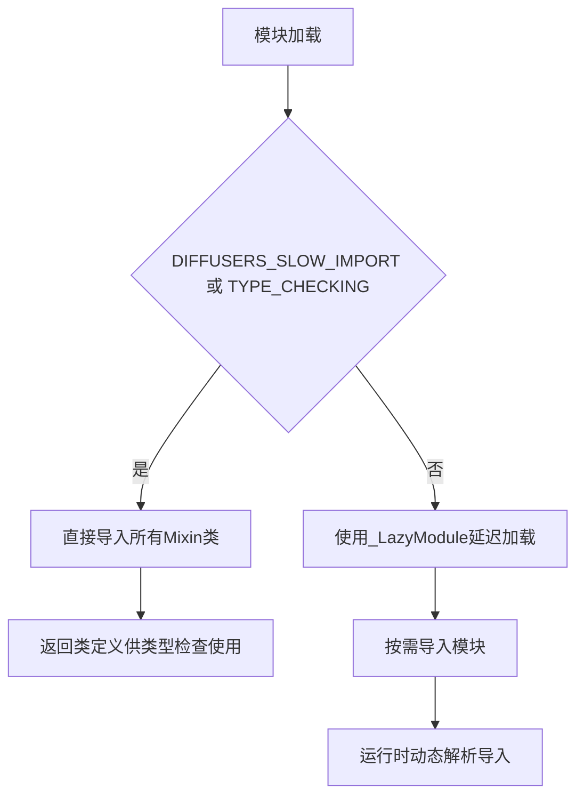
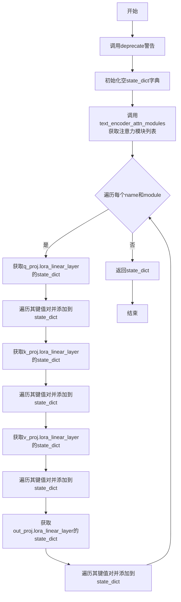
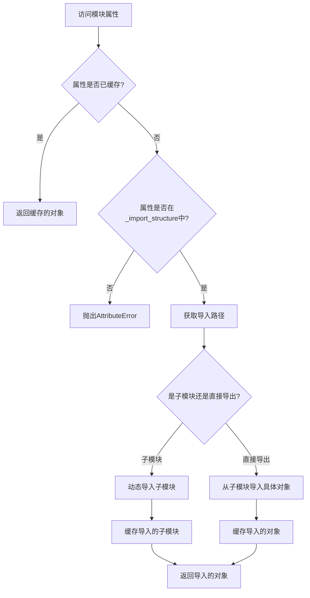

# `diffusers\src\diffusers\loaders\__init__.py` 详细设计文档

这是diffusers库中的模型加载器模块，提供了LoRA权重状态字典处理、文本编码器注意力模块提取等功能，并通过LazyModule机制动态导入各种Mixin类（如LoraLoaderMixin、IPAdapterMixin等），用于支持从单文件、PEFT、文本反转等不同来源加载模型权重。

## 整体流程



## 类结构

```
模型加载器模块 (loaders)
├── 工具函数
│   ├── text_encoder_lora_state_dict() - 提取文本编码器LoRA状态字典
│   └── text_encoder_attn_modules() - 获取文本编码器注意力模块
├── Mixin类 (通过LazyModule导入)
│   ├── LoraLoaderMixin - 通用LoRA加载
│   ├── StableDiffusionLoraLoaderMixin - SD系列LoRA加载
│   ├── FluxLoraLoaderMixin - Flux模型LoRA加载
│   ├── IPAdapterMixin - IP-Adapter加载
│   ├── FromSingleFileMixin - 单文件模型加载
│   └── TextualInversionLoaderMixin - 文本反转加载
└── 内部类
    └── _LazyModule - 延迟加载机制
```

## 全局变量及字段


### `_import_structure`
    
存储模块导入结构的字典，用于延迟加载各种模型加载器mixin类

类型：`Dict[str, List[str]]`
    


### `TYPE_CHECKING`
    
来自typing模块的标志，表示是否正在进行类型检查

类型：`bool`
    


### `DIFFUSERS_SLOW_IMPORT`
    
控制是否使用慢速导入的标志，影响模块的导入方式

类型：`bool`
    


### `__spec__`
    
Python的模块规范对象，包含模块的元数据信息

类型：`ModuleSpec`
    


### `_LazyModule.name`
    
延迟加载模块的名称

类型：`str`
    


### `_LazyModule.globals`
    
模块的全局变量字典

类型：`dict`
    


### `_LazyModule.import_structure`
    
延迟模块的导入结构定义

类型：`Dict[str, List[str]]`
    


### `_LazyModule.module_spec`
    
模块的规范对象，用于描述模块的导入方式

类型：`ModuleSpec`
    
    

## 全局函数及方法


### `text_encoder_lora_state_dict`

该函数用于从文本编码器中提取LoRA（Low-Rank Adaptation）权重状态字典，将文本编码器中各个注意力模块的q_proj、k_proj、v_proj和out_proj的lora_linear_layer权重收集到一个字典中返回。该函数已被标记为弃用，建议使用PEFT库的`get_peft_model`方法获取权重。

参数：

- `text_encoder`：对象，需要提取LoRA权重的文本编码器对象

返回值：`dict`，包含文本编码器所有LoRA层权重键值对的状态字典

#### 流程图



#### 带注释源码

```python
def text_encoder_lora_state_dict(text_encoder):
    """
    从文本编码器中提取LoRA权重状态字典
    
    参数:
        text_encoder: 文本编码器对象,需要包含CLIPTextModel或CLIPTextModelWithProjection类型的注意力模块
        
    返回:
        dict: 包含所有LoRA层权重键值对的字典
    """
    # 发出弃用警告,提示用户该函数将在0.27.0版本移除
    deprecate(
        "text_encoder_load_state_dict in `models`",
        "0.27.0",
        "`text_encoder_lora_state_dict` is deprecated and will be removed in 0.27.0. Make sure to retrieve the weights using `get_peft_model`. See https://huggingface.co/docs/peft/v0.6.2/en/quicktour#peftmodel for more information.",
    )
    
    # 初始化用于存储LoRA权重的状态字典
    state_dict = {}

    # 遍历文本编码器中的所有注意力模块
    for name, module in text_encoder_attn_modules(text_encoder):
        # 提取Query投影层的LoRA线性层权重
        for k, v in module.q_proj.lora_linear_layer.state_dict().items():
            state_dict[f"{name}.q_proj.lora_linear_layer.{k}"] = v

        # 提取Key投影层的LoRA线性层权重
        for k, v in module.k_proj.lora_linear_layer.state_dict().items():
            state_dict[f"{name}.k_proj.lora_linear_layer.{k}"] = v

        # 提取Value投影层的LoRA线性层权重
        for k, v in module.v_proj.lora_linear_layer.state_dict().items():
            state_dict[f"{name}.v_proj.lora_linear_layer.{k}"] = v

        # 提取输出投影层的LoRA线性层权重
        for k, v in module.out_proj.lora_linear_layer.state_dict().items():
            state_dict[f"{name}.out_proj.lora_linear_layer.{k}"] = v

    # 返回包含所有LoRA权重的状态字典
    return state_dict
```


### `text_encoder_attn_modules`

该函数用于从文本编码器中提取注意力模块（attention modules），支持 `CLIPTextModel` 和 `CLIPTextModelWithProjection` 两种类型的文本编码器。它遍历文本编码器的所有编码层，提取每一层的 `self_attn` 模块，并返回包含模块名称和模块对象的元组列表。注意：该函数已在 0.27.0 版本废弃，建议使用 `get_peft_model` 获取权重。

参数：

- `text_encoder`：对象，需要提取注意力模块的文本编码器实例

返回值：`List[Tuple[str, Any]]`，包含注意力模块的名称和模块对象的元组列表

#### 流程图

```mermaid
flowchart TD
    A[开始] --> B{检查 text_encoder 类型}
    B -->|CLIPTextModel 或 CLIPTextModelWithProjection| C[遍历 text_encoder.text_model.encoder.layers]
    C --> D[为每一层构建名称: text_model.encoder.layers.{i}.self_attn]
    D --> E[提取 layer.self_attn 模块]
    E --> F[将名称和模块添加到 attn_modules 列表]
    F --> C
    C --> G[返回 attn_modules]
    B -->|其他类型| H[抛出 ValueError 异常]
    H --> I[结束]
```

#### 带注释源码

```python
def text_encoder_attn_modules(text_encoder):
    # 废弃警告：提示用户该函数将在 0.27.0 版本被移除
    deprecate(
        "text_encoder_attn_modules in `models`",
        "0.27.0",
        "`text_encoder_lora_state_dict` is deprecated and will be removed in 0.27.0. Make sure to retrieve the weights using `get_peft_model`. See https://huggingface.co/docs/peft/v0.6.2/en/quicktour#peftmodel for more information.",
    )
    
    # 从 transformers 库导入支持的文本编码器类型
    from transformers import CLIPTextModel, CLIPTextModelWithProjection

    # 初始化存储注意力模块的列表
    attn_modules = []

    # 判断传入的文本编码器是否为支持的类型
    if isinstance(text_encoder, (CLIPTextModel, CLIPTextModelWithProjection)):
        # 遍历文本编码器的所有编码层
        for i, layer in enumerate(text_encoder.text_model.encoder.layers):
            # 构建该层注意力模块的名称，格式为: text_model.encoder.layers.{i}.self_attn
            name = f"text_model.encoder.layers.{i}.self_attn"
            # 获取该层的 self_attn 注意力模块
            mod = layer.self_attn
            # 将名称和模块作为元组添加到列表中
            attn_modules.append((name, mod))
    else:
        # 如果是不支持的文本编码器类型，抛出 ValueError 异常
        raise ValueError(f"do not know how to get attention modules for: {text_encoder.__class__.__name__}")

    # 返回包含所有注意力模块的列表
    return attn_modules
```


# 文档提取结果

### `_LazyModule.__getattr__`

此方法是 `_LazyModule` 类的魔法方法，用于实现模块的延迟加载（Lazy Loading）。当访问模块中尚未导入的属性或子模块时，会根据 `_import_structure` 中定义的映射关系动态导入并返回相应的对象。

参数：

- `name`：`str`，要访问的属性或模块名称

返回值：`Any`，延迟加载的对象（可以是类、函数或模块）

#### 流程图



#### 带注释源码

```python
# 注：以下源码基于 _LazyModule 类的典型实现逻辑重构
# 实际源码位于 diffusers/utils/_lazy_module.py

def __getattr__(name: str):
    """
    延迟加载模块属性的魔法方法。
    
    当访问模块中未导入的属性时，此方法会被自动调用，
    根据 _import_structure 中的映射关系动态导入所需对象。
    
    参数:
        name (str): 要访问的属性名称
        
    返回:
        Any: 延迟加载的对象
        
    抛出:
        AttributeError: 如果属性名称不在 _import_structure 中
    """
    
    # 检查属性是否已经缓存（避免重复导入）
    if name in self._modules:
        return self._modules[name]
    
    # 检查属性是否在导入结构中定义
    if name not in self._import_structure:
        raise AttributeError(f"module {self.__name__!r} has no attribute {name!r}")
    
    # 获取导入路径信息
    import_path = self._import_structure[name]
    
    # 处理子模块导入
    if isinstance(import_path, tuple):
        # 多个导出对象的情况
        module_name, *objects = import_path
    else:
        module_name = import_path
        objects = None
    
    # 构建完整的模块导入路径
    full_module_name = f"{self.__package__}.{module_name}"
    
    # 动态导入模块
    module = __import__(full_module_name, fromlist=objects or [])
    
    # 如果指定了具体对象，则提取；否则返回整个模块
    if objects:
        result = tuple(getattr(module, obj) for obj in objects)
        # 如果只有一个对象，直接返回而非元组
        result = result[0] if len(result) == 1 else result
    else:
        result = module
    
    # 缓存导入结果以供后续使用
    self._modules[name] = result
    
    return result
```

---

## 补充说明

### 关键组件信息

| 名称 | 一句话描述 |
|------|-----------|
| `_LazyModule` | 实现延迟加载的模块封装类，支持按需导入子模块和导出对象 |
| `_import_structure` | 定义模块导出结构的字典，映射属性名到导入路径 |
| `sys.modules` | Python内置模块缓存，存储已导入的模块对象 |

### 设计目标与约束

- **设计目标**：实现Diffusers库的模块化导入优化，避免在库初始化时导入所有子模块，从而提升导入速度
- **约束**：仅支持在 `_import_structure` 中预先定义的属性，未定义属性访问会抛出 `AttributeError`

### 技术债务与优化空间

1. **延迟加载的复杂性**：动态导入机制增加了代码调试难度，IDE无法静态分析模块导出内容
2. **缓存机制**：当前实现会将所有首次访问的属性缓存到内存中，对于大型库可能导致不必要的内存占用

## 关键组件


### text_encoder_lora_state_dict

提取文本编码器中LoRA适配器的权重参数，将q_proj、k_proj、v_proj和out_proj的lora_linear_layer权重整理成状态字典返回。

### text_encoder_attn_modules

获取文本编码器中的注意力模块列表，支持CLIPTextModel和CLIPTextModelWithProjection两种模型结构，返回包含名称和模块元组的列表。

### _import_structure

定义模块的导入结构字典，声明了各种LoRA加载器Mixin类、IP适配器、工具类等的导出路径，用于延迟导入和模块管理。

### FromOriginalModelMixin

从原始模型加载权重的Mixin类，提供单文件模型转换能力。

### FluxTransformer2DLoadersMixin

FluxTransformer2D模型的LoRA加载器Mixin，处理Flux架构的Transformer权重加载。

### SD3Transformer2DLoadersMixin

SD3 Transformer2D模型的LoRA加载器Mixin，处理Stable Diffusion 3的Transformer权重加载。

### UNet2DConditionLoadersMixin

UNet2DCondition模型的LoRA加载器Mixin，处理条件扩散模型的UNet权重加载。

### AttnProcsLayers

注意力处理层工具类，用于管理和操作注意力过程层。

### FromSingleFileMixin

单文件模型加载Mixin，支持从单个模型文件加载权重。

### LoraLoaderMixin

通用的LoRA加载器Mixin基类，提供LoRA权重融合的核心逻辑。

### FluxLoraLoaderMixin

Flux模型的专用LoRA加载器Mixin。

### StableDiffusionLoraLoaderMixin

Stable Diffusion模型的LoRA加载器Mixin。

### StableDiffusionXLLoraLoaderMixin

Stable Diffusion XL模型的LoRA加载器Mixin。

### SD3LoraLoaderMixin

Stable Diffusion 3模型的LoRA加载器Mixin。

### PeftAdapterMixin

PEFT（Parameter-Efficient Fine-Tuning）适配器Mixin，集成PEFT库的LoRA功能。

### IPAdapterMixin

IP-Adapter通用适配器Mixin，提供图像提示适配功能。

### FluxIPAdapterMixin

Flux模型的IP-Adapter适配器。

### SD3IPAdapterMixin

SD3模型的IP-Adapter适配器。

### ModularIPAdapterMixin

模块化IP-Adapter适配器，提供灵活的适配策略。

### TextualInversionLoaderMixin

文本反转（Textual Inversion）加载器Mixin，用于加载概念嵌入向量。


## 问题及建议


### 已知问题

-   **废弃函数仍保留**：代码中`text_encoder_lora_state_dict`和`text_encoder_attn_modules`函数已被标记为deprecated（将在0.27.0版本移除），但仍然保留在代码库中，这增加了维护负担且可能导致未来兼容性问题。
-   **代码重复**：`text_encoder_lora_state_dict`函数中处理q_proj、k_proj、v_proj、out_proj的逻辑高度重复，每个分支都执行相似的state_dict()迭代和键名构建操作。
-   **硬编码字符串**：`text_encoder_attn_modules`中attention模块名称使用硬编码的字符串前缀`f"text_model.encoder.layers.{i}.self_attn"`，缺乏灵活性且难以适配不同架构。
-   **错误信息不够详细**：`text_encoder_attn_modules`的异常处理仅返回类名，缺少更多上下文信息（如支持的模型类型列表），不利于调试。
-   **导入结构过于复杂**：`_import_structure`字典定义了数十个mixin类，条件导入嵌套过深（is_torch_available -> is_transformers_available），导致代码可读性差。
-   **缺乏类型注解**：关键函数如`text_encoder_lora_state_dict`和`text_encoder_attn_modules`缺少参数和返回值的类型注解，影响代码可维护性和IDE支持。
-   **文档缺失**：核心函数没有docstring说明其用途、参数和返回值，降低了代码的自解释性。

### 优化建议

-   **移除废弃代码**：按照deprecation计划，在0.27.0版本完全移除`text_encoder_lora_state_dict`和`text_encoder_attn_modules`函数，改为完全依赖PEFT的`get_peft_model`接口。
-   **消除重复代码**：使用循环或映射结构重构`text_encoder_lora_state_dict`，例如创建`['q_proj', 'k_proj', 'v_proj', 'out_proj']`列表进行迭代。
-   **参数化名称构建**：将硬编码的名称前缀提取为配置参数或从模型结构动态推断，提高代码通用性。
-   **改进错误处理**：在ValueError异常中添加更多上下文信息，列出当前支持的模型类型。
-   **重构导入结构**：考虑将大型导入结构拆分为多个子模块，使用更清晰的模块化设计。
-   **添加类型注解**：为所有公共函数添加完整的类型注解，提升代码质量。
-   **补充文档**：为关键函数添加详细的docstring，说明功能、参数、返回值和使用注意事项。

## 其它


### 设计目标与约束

本模块旨在为Diffusers库提供LoRA（Low-Rank Adaptation）权重加载和管理的统一接口，支持多种模型架构（Stable Diffusion、SDXL、Flux、SD3等）的LoRA适配器加载。设计约束包括：1）必须兼容PEFT库的最新版本；2）保持向后兼容性直至0.27.0版本；3）支持延迟导入以优化冷启动性能；4）仅在PyTorch和Transformers库可用时加载相关功能。

### 错误处理与异常设计

代码中包含以下异常处理模式：1）ValueError异常：当text_encoder类型无法识别时抛出，明确指出不支持的模型类别；2）DeprecationWarning：使用deprecate函数标记0.27.0将移除的功能，包括text_encoder_lora_state_dict和text_encoder_attn_modules；3）条件检查异常：is_transformers_available()、is_torch_available()等条件不满足时，相关功能不可用。异常设计遵循Fail Fast原则，在模块加载初期即检查依赖可用性。

### 外部依赖与接口契约

核心依赖包括：1）transformers库（CLIPTextModel、CLIPTextModelWithProjection）；2）peft库（用于get_peft_model）；3）torch库；4）diffusers内部utils模块。接口契约规定：text_encoder_lora_state_dict接受text_encoder对象并返回状态字典；text_encoder_attn_modules返回(name, module)元组列表；所有导出符号通过LazyModule机制延迟加载。外部调用者应确保传入的text_encoder是CLIPTextModel或CLIPTextModelWithProjection实例。

### 配置与参数说明

本模块无显式配置参数，通过环境检测函数动态启用功能。主要参数来源于依赖库的版本检查：is_peft_available()、is_torch_available()、is_transformers_available()。LoRA层命名遵循约定：{attention_module_name}.{q/k/v/out_proj}.lora_linear_layer.{state_dict_key}格式。

### 版本兼容性信息

代码明确标注以下版本信息：1）deprecation目标版本为0.27.0；2）依赖transformers库的具体类（CLIPTextModel、CLIPTextModelWithProjection）；3）建议使用PEFT v0.6.2+的get_peft_model接口。兼容性策略为渐进式废弃，旧API保留至0.27.0后移除。

### 性能考虑与优化

采用_LazyModule实现延迟加载，避免在import时加载所有子模块。text_encoder_lora_state_dict函数通过遍历模块的state_dict()直接获取权重，可能产生内存拷贝开销。优化建议：对于大规模权重提取，可考虑使用state_dict()的copy=False参数（若PyTorch版本支持）。

### 安全考虑

代码不涉及用户输入处理或网络请求，主要安全风险在于：1）传入恶意构造的text_encoder对象可能导致属性访问错误；2）版本检查函数is_transformers_available()的结果可能被绕过。建议调用者验证text_encoder对象的类型和来源。

### 使用示例与调用流程

典型使用流程：1）导入本模块的FromOriginalModelMixin或具体LoadersMixin；2）混合到模型加载器类中；3）调用load_lora_weights()方法。text_encoder_lora_state_dict的典型调用场景为从预训练文本编码器提取LoRA权重并保存。

    