# `diffusers\src\diffusers\loaders\ip_adapter.py` 详细设计文档

该文件实现了IP-Adapter混合类，用于在扩散模型（如Stable Diffusion、Flux、SD3）中加载和使用图像提示（Image Prompt）适配器，使模型能够同时基于文本和图像进行条件生成。文件包含四个主要混合类：IPAdapterMixin（基础实现）、ModularIPAdapterMixin（模块化实现）、FluxIPAdapterMixin（Flux模型专用）和SD3IPAdapterMixin（SD3模型专用），每个类都提供了加载IP适配器权重、设置适配器比例和卸载适配器的功能。

## 整体流程

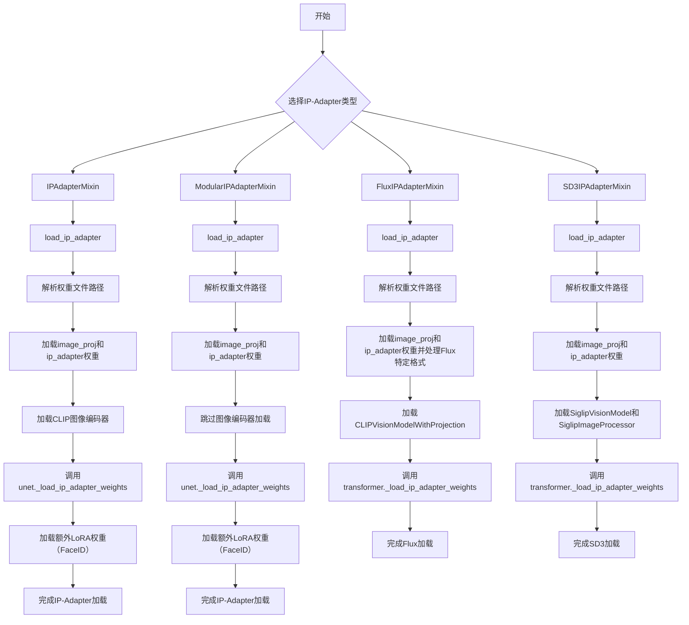

## 类结构

```
IPAdapterMixin (基础IP-Adapter混合类)
├── load_ip_adapter() - 加载IP-Adapter权重和图像编码器
├── set_ip_adapter_scale() - 设置每个transformer块的IP-Adapter比例
└── unload_ip_adapter() - 卸载IP-Adapter权重和组件
ModularIPAdapterMixin (模块化IP-Adapter混合类)
├── load_ip_adapter() - 加载IP-Adapter权重
├── set_ip_adapter_scale() - 设置IP-Adapter比例
└── unload_ip_adapter() - 卸载IP-Adapter
FluxIPAdapterMixin (Flux模型专用IP-Adapter)
├── load_ip_adapter() - 加载Flux专用IP-Adapter权重
├── set_ip_adapter_scale() - 设置Flux IP-Adapter比例
└── unload_ip_adapter() - 卸载Flux IP-Adapter
SD3IPAdapterMixin (SD3模型专用IP-Adapter)
├── is_ip_adapter_active - 属性检查IP-Adapter是否激活
├── load_ip_adapter() - 加载SD3专用IP-Adapter权重
├── set_ip_adapter_scale() - 设置SD3 IP-Adapter比例
└── unload_ip_adapter() - 卸载SD3 IP-Adapter
```

## 全局变量及字段


### `logger`
    
用于记录模块日志的logger对象，通过logging.get_logger(__name__)初始化

类型：`logging.Logger`
    


### `_LOW_CPU_MEM_USAGE_DEFAULT`
    
默认的低CPU内存使用标志，用于控制模型加载时是否启用低内存模式

类型：`bool`
    


### `USE_PEFT_BACKEND`
    
标志位，指示当前是否使用PEFT（Parameter-Efficient Fine-Tuning）后端

类型：`bool`
    


    

## 全局函数及方法


由于 `_maybe_expand_lora_scales` 函数是从 `unet_loader_utils` 模块导入的，而该模块的具体实现未在当前代码文件中提供，我无法直接获取其源代码。然而，我可以从它在代码中的使用方式来推断其功能和参数。

### `_maybe_expand_lora_scales` (位于 `unet_loader_utils` 模块)

#### 描述
该函数用于扩展和规范化 IP-Adapter 的 LoRA 缩放配置（scales），确保无论输入的 `scale` 是单一值、字典还是列表，输出都是一个标准化的列表格式，以便于应用到模型的各个注意力处理器上。

#### 参数

- `unet`：对象，UNet 模型实例，用于获取模型结构信息（例如注意力处理器的数量和名称）。
- `scale`：Union[float, dict, list]，用户提供的 IP-Adapter 缩放配置。可以是：
  - 单个浮点数（全局缩放）。
  - 字典（如 `{"up": {"block_0": [0.0, 1.0, 0.0]}}`，表示按模块和块的精细控制）。
  - 上述形式的列表（用于多个 IP-Adapter）。
- `default_scale`：float，默认缩放值，用于填充未指定的层级。

#### 返回值

- `scale_configs`：list，规范化后的缩放配置列表，长度对应模型中所有的 IP-Adapter 注意力处理器。

#### 流程图

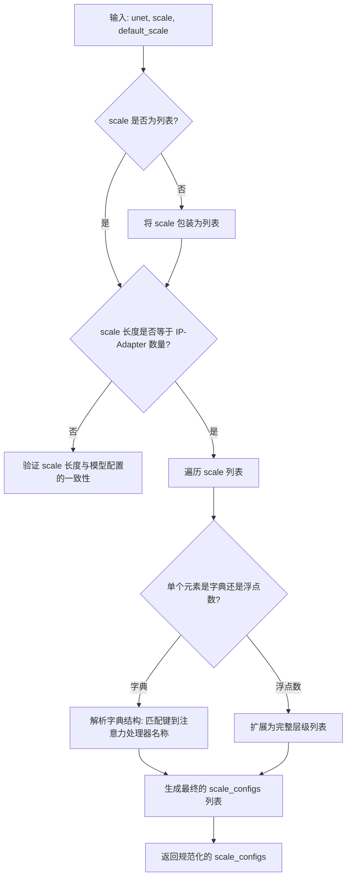

#### 使用示例源码

在 `IPAdapterMixin.set_ip_adapter_scale` 方法中：

```python
def set_ip_adapter_scale(self, scale):
    """
    Set IP-Adapter scales per-transformer block.
    """
    unet = getattr(self, self.unet_name) if not hasattr(self, "unet") else self.unet
    if not isinstance(scale, list):
        scale = [scale]
    # 调用 _maybe_expand_lora_scales 函数
    scale_configs = _maybe_expand_lora_scales(unet, scale, default_scale=0.0)

    for attn_name, attn_processor in unet.attn_processors.items():
        if isinstance(
            attn_processor, (IPAdapterAttnProcessor, IPAdapterAttnProcessor2_0, IPAdapterXFormersAttnProcessor)
        ):
            if len(scale_configs) != len(attn_processor.scale):
                raise ValueError(
                    f"Cannot assign {len(scale_configs)} scale_configs to {len(attn_processor.scale)} IP-Adapter."
                )
            elif len(scale_configs) == 1:
                scale_configs = scale_configs * len(attn_processor.scale)
            for i, scale_config in enumerate(scale_configs):
                if isinstance(scale_config, dict):
                    for k, s in scale_config.items():
                        if attn_name.startswith(k):
                            attn_processor.scale[i] = s
                else:
                    attn_processor.scale[i] = scale_config
```

**注意**：由于没有看到 `unet_loader_utils.py` 的源代码，以上信息基于该函数在当前文件中的使用方式进行的推断。


### `validate_hf_hub_args`

这是一个从 `huggingface_hub.utils` 导入的装饰器函数，用于验证 HuggingFace Hub 相关方法的参数是否符合命名约定。它确保传递给方法的参数名称和类型与 HuggingFace Hub 的标准接口规范一致，主要用于 `load_ip_adapter` 系列方法。

参数：

- 无直接参数（作为装饰器使用，作用于目标方法的参数）

返回值：无直接返回值（作为装饰器返回 wrapper 函数）

#### 流程图

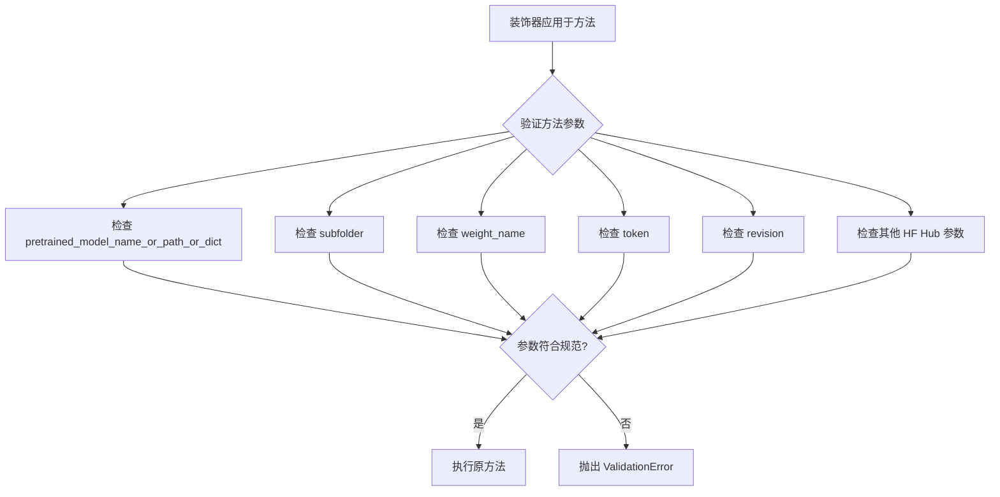

#### 带注释源码

```python
# 该函数从 huggingface_hub.utils 导入，非本项目定义
# 源码位于 huggingface_hub 库中，此处展示其使用方式

from huggingface_hub.utils import validate_hf_hub_args

# 使用示例 - 作为装饰器应用于 IP Adapter 的加载方法
class IPAdapterMixin:
    """Mixin for handling IP Adapters."""

    @validate_hf_hub_args
    def load_ip_adapter(
        self,
        pretrained_model_name_or_path_or_dict: str | list[str] | dict[str, torch.Tensor],
        subfolder: str | list[str],
        weight_name: str | list[str],
        image_encoder_folder: str | None = "image_encoder",
        **kwargs,
    ):
        """
        使用 @validate_hf_hub_args 装饰器验证以下参数：
        - pretrained_model_name_or_path_or_dict: 模型名称、路径或状态字典
        - subfolder: 子文件夹路径
        - weight_name: 权重文件名
        - token: HuggingFace Hub 认证令牌
        - revision: 模型版本
        等 HuggingFace Hub 相关参数
        
        装饰器确保传入的参数符合 HuggingFace Hub 的标准接口规范
        """
        # 方法实现...
        pass
```

#### 补充说明

| 项目 | 说明 |
|------|------|
| **来源** | `huggingface_hub.utils` 外部库 |
| **作用** | 参数验证装饰器，确保 HF Hub 相关参数命名规范 |
| **验证的参数** | `pretrained_model_name_or_path_or_dict`, `subfolder`, `weight_name`, `cache_dir`, `force_download`, `proxies`, `local_files_only`, `token`, `revision`, `low_cpu_mem_usage` 等 |
| **使用场景** | 所有 `load_ip_adapter` 方法的装饰器 |


### `_get_model_file`

获取模型权重文件的路径，支持从 HuggingFace Hub 或本地路径加载模型文件。

参数：

- `pretrained_model_name_or_path_or_dict`：`str | list[str] | dict[str, torch.Tensor]`，模型预训练名称或路径，或模型 ID，或本地目录路径，或 state dict 字典
- `weights_name`：`str | list[str]`，要加载的权重文件名称
- `cache_dir`：`str | os.PathLike | None`，缓存目录路径
- `force_download`：`bool`，是否强制重新下载
- `proxies`：`dict[str, str] | None`，代理服务器字典
- `local_files_only`：`bool | None`，是否仅使用本地文件
- `token`：`str | bool | None`，HuggingFace Hub 认证令牌
- `revision`：`str`，Git revision (branch name, tag, commit id)
- `subfolder`：`str | list[str]`，模型仓库中的子文件夹路径
- `user_agent`：`dict`，用户代理信息字典

返回值：`str`，返回模型文件的路径（本地路径或缓存路径）

#### 流程图

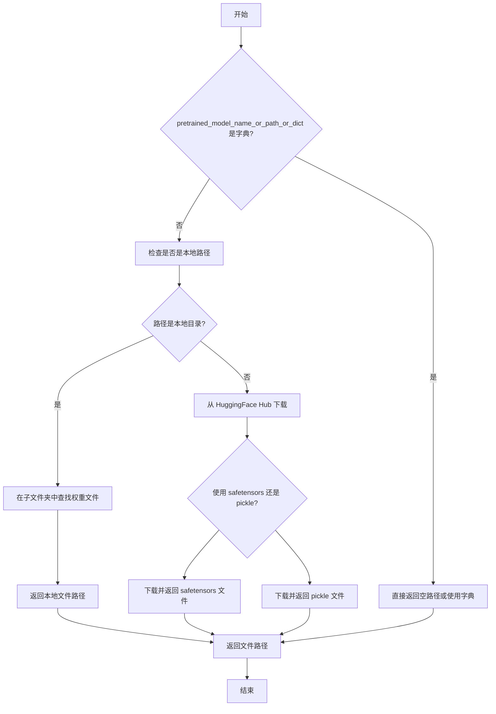

#### 带注释源码

```python
# 此函数定义在 diffusers/src/diffusers/utils 中
# 以下是根据调用方式和代码上下文推断的函数签名和逻辑

@validate_hf_hub_args  # 验证 HuggingFace Hub 参数的装饰器
def _get_model_file(
    pretrained_model_name_or_path_or_dict: str | list[str] | dict[str, torch.Tensor],
    weights_name: str | list[str] = "diffusion_pytorch_model.bin",
    cache_dir: str | os.PathLike | None = None,
    force_download: bool = False,
    proxies: dict[str, str] | None = None,
    local_files_only: bool | None = None,
    token: str | bool | None = None,
    revision: str | None = None,
    subfolder: str | list[str] | None = "",
    user_agent: dict | None = None,
) -> str:
    """
    获取模型权重文件的路径。
    
    该函数处理三种场景：
    1. pretrained_model_name_or_path_or_dict 是字典：直接使用，不返回文件路径
    2. pretrained_model_name_or_path_or_dict 是本地路径：查找本地文件
    3. pretrained_model_name_or_path_or_dict 是 Hub ID：下载模型文件
    
    参数:
        pretrained_model_name_or_path_or_dict: 模型ID、目录路径或state dict
        weights_name: 权重文件名
        cache_dir: 缓存目录
        force_download: 是否强制下载
        proxies: 代理配置
        local_files_only: 是否仅使用本地文件
        token: HuggingFace token
        revision: Git版本
        subfolder: 子文件夹
        user_agent: 用户代理
    
    返回:
        模型文件的路径
    """
    # 函数内部逻辑（根据调用推断）:
    # 1. 如果是字典类型，直接返回空路径（调用方会使用字典作为state_dict）
    # 2. 如果是本地目录，构造完整路径: {path}/{subfolder}/{weights_name}
    # 3. 如果是Hub ID，调用 huggingface_hub 的 snapshot_download 或 hf_hub_download
    #    下载模型文件到缓存目录并返回路径
    
    # 实际实现位于 diffusers.utils 模块
    pass
```

**使用示例（从提供的代码中提取）：**

```python
# 在 IPAdapterMixin.load_ip_adapter 方法中的调用
model_file = _get_model_file(
    pretrained_model_name_or_path_or_dict,
    weights_name=weight_name,
    cache_dir=cache_dir,
    force_download=force_download,
    proxies=proxies,
    local_files_only=local_files_only,
    token=token,
    revision=revision,
    subfolder=subfolder,
    user_agent=user_agent,
)
```


# load_state_dict 函数提取分析

## 1. 函数基本信息

- **名称**: `load_state_dict`
- **类型**: 全局函数（从 `..models.modeling_utils` 导入）
- **位置**: `diffusers` 库内部模块

## 2. 参数信息

基于代码中的调用方式分析：

| 参数名称 | 参数类型 | 参数描述 |
|---------|---------|---------|
| `pretrained_model_name_or_path_or_dict` | `str` 或 `dict[str, torch.Tensor]` | 模型路径或预训练模型ID或状态字典 |

## 3. 返回值信息

| 返回值类型 | 返回值描述 |
|-----------|-----------|
| `dict[str, torch.Tensor]` | 加载的模型状态字典 |

## 4. 在代码中的调用分析

```python
# 调用方式 1：从文件加载
state_dict = load_state_dict(model_file)

# 调用方式 2：直接使用传入的状态字典
state_dict = pretrained_model_name_or_path_or_dict  # 当输入为字典时直接使用
```

## 5. Mermaid 流程图

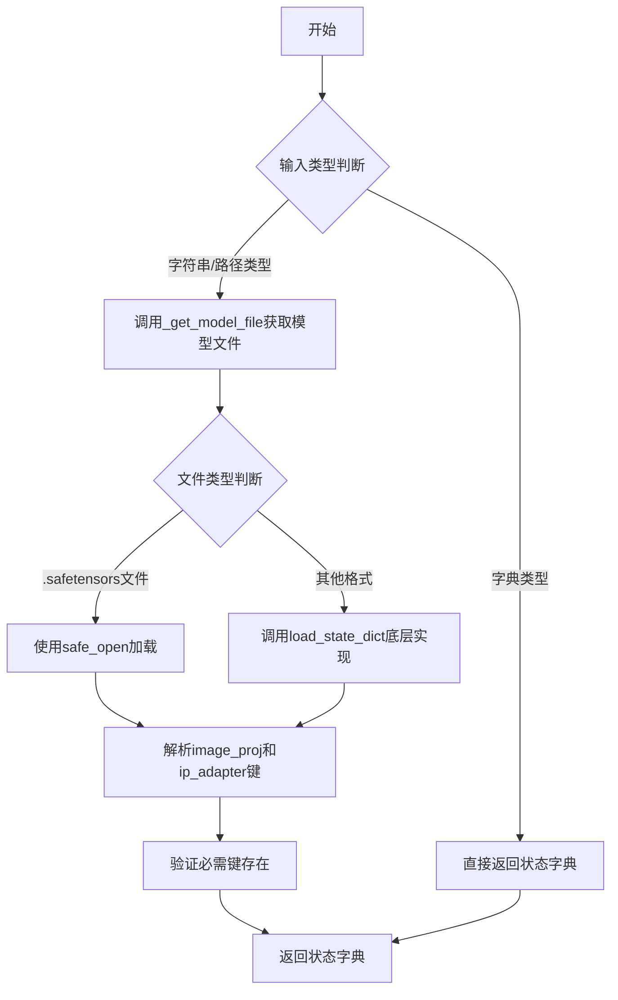

## 6. 带注释源码

```python
# 注意：load_state_dict 函数的完整定义不在当前代码文件中
# 以下是基于代码中调用方式的分析和推断

# 从 diffusers 库导入
from ..models.modeling_utils import _LOW_CPU_MEM_USAGE_DEFAULT, load_state_dict

# 在 IPAdapterMixin.load_ip_adapter 方法中的典型调用模式：
# 这是一个高层包装函数，根据输入类型决定加载策略

# 1. 如果 pretrained_model_name_or_path_or_dict 是字典（已经加载的状态字典）
if not isinstance(pretrained_model_name_or_path_or_dict, dict):
    # 获取模型文件路径
    model_file = _get_model_file(
        pretrained_model_name_or_path_or_dict,
        weights_name=weight_name,
        cache_dir=cache_dir,
        force_download=force_download,
        proxies=proxies,
        local_files_only=local_files_only,
        token=token,
        revision=revision,
        subfolder=subfolder,
        user_agent=user_agent,
    )
    
    # 如果是 safetensors 格式文件，使用专用加载逻辑
    if weight_name.endswith(".safetensors"):
        state_dict = {"image_proj": {}, "ip_adapter": {}}
        with safe_open(model_file, framework="pt", device="cpu") as f:
            for key in f.keys():
                if key.startswith("image_proj."):
                    state_dict["image_proj"][key.replace("image_proj.", "")] = f.get_tensor(key)
                elif key.startswith("ip_adapter."):
                    state_dict["ip_adapter"][key.replace("ip_adapter.", "")] = f.get_tensor(key)
    else:
        # 否则使用 load_state_dict 加载
        state_dict = load_state_dict(model_file)
else:
    # 如果已经是字典，直接使用
    state_dict = pretrained_model_name_or_path_or_dict

# 验证状态字典包含必需的键
keys = list(state_dict.keys())
if "image_proj" not in keys and "ip_adapter" not in keys:
    raise ValueError("Required keys are (`image_proj` and `ip_adapter`) missing from the state dict.")
```

## 7. 技术说明

`load_state_dict` 是 `diffusers` 库中用于加载模型权重的核心工具函数，它：

1. **支持多种输入格式**: 可以从文件路径加载，也可以直接接受字典
2. **处理不同文件格式**: 支持 `.safetensors`、`.bin`、`.pt` 等多种格式
3. **状态字典验证**: 确保加载的权重包含必需的键
4. **内存优化**: 支持低CPU内存使用模式加载大型模型

**注意**: 由于 `load_state_dict` 函数的完整定义在 `..models.modeling_utils` 模块中（未在当前文件中展示），以上信息是基于代码中的调用模式和 `diffusers` 库的标准实现推断得出的。


### `_get_detailed_type`

获取对象的具体类型名称，用于错误信息和调试。

参数：

-  `obj`：任意对象，需要获取其类型信息的对象

返回值：`str`，返回对象的详细类型名称，通常是对象的类名字符串

#### 流程图

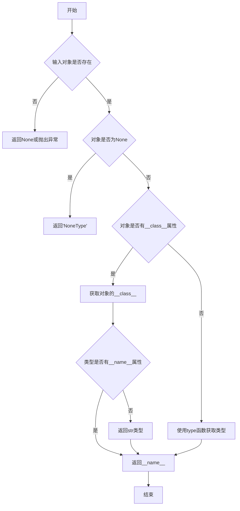

#### 带注释源码

```python
# 注意：此函数定义不在当前代码文件中
# 它是从 ..utils 模块导入的
# 以下是基于使用场景的推断实现

def _get_detailed_type(obj):
    """
    获取对象的详细类型名称。
    
    Parameters:
        obj: 任意Python对象
    
    Returns:
        str: 对象的类型名称字符串
    """
    if obj is None:
        return 'NoneType'
    
    # 获取对象的类型
    obj_type = type(obj)
    
    # 尝试获取类型的名称属性
    if hasattr(obj_type, '__name__'):
        type_name = obj_type.__name__
    else:
        type_name = str(obj_type)
    
    # 如果是泛型类型（如List[int]），可能需要进一步处理
    # 这里返回基础类型名称
    return type_name
```

---

**注意**：根据代码分析，`_get_detailed_type`函数定义在`..utils`模块中，当前提供的代码文件只是使用了该函数。实际定义需要查看`diffusers`库的`utils`模块。该函数的主要用途是在`FluxIPAdapterMixin.set_ip_adapter_scale`方法中进行类型检查，当传入的`scale`参数类型不符合预期时，生成友好的错误信息。


# _is_valid_type 函数分析

由于 `_is_valid_type` 函数并非在本文件中定义，而是从 `..utils` 模块导入的，我无法获取其完整的源代码实现。不过，我可以从**导入语句**和**使用方式**中提取相关信息。

## 导入信息

在代码的导入部分可以找到：

```python
from ..utils import (
    USE_PEFT_BACKEND,
    _get_detailed_type,
    _get_model_file,
    _is_valid_type,
    is_accelerate_available,
    is_torch_version,
    is_transformers_available,
    logging,
)
```

---

## 使用上下文

`_is_valid_type` 函数在 `FluxIPAdapterMixin.set_ip_adapter_scale` 方法中被使用：

```python
# 使用示例 1: 检查是否为单一IP-Adapter的每层缩放列表
elif _is_valid_type(scale, List[scale_type]) and num_ip_adapters == 1:
    scale = [scale]

# 使用示例 2: 检查是否为有效的缩放类型（标量或列表的列表）
elif not _is_valid_type(scale, List[Union[scale_type, List[scale_type]]]):
    raise TypeError(f"Unexpected type {_get_detailed_type(scale)} for scale.")
```

---

## 推断的函数规范

基于代码上下文推断：

### `_is_valid_type`

验证输入值是否匹配指定的类型注解。

参数：

-  `value`：任意类型，要验证的值
-  `expected_type`：TypeVar 或类型，要匹配的类型

返回值：`bool`，如果值符合预期类型返回 `True`，否则返回 `False`

#### 流程图

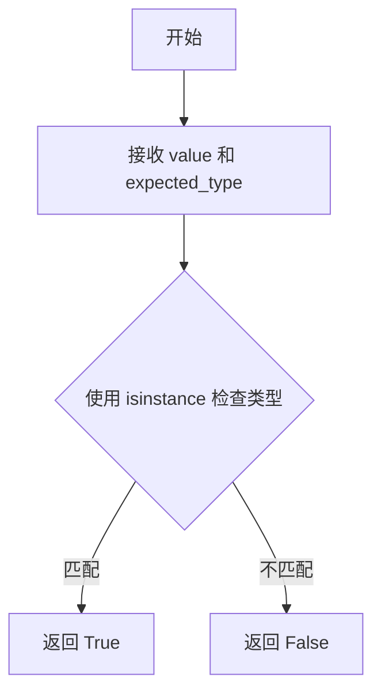

#### 源码（基于使用方式的推断）

```python
# 这是一个基于使用方式推断的伪代码实现
# 实际实现需要查看 ..utils 模块
def _is_valid_type(value, expected_type):
    """
    检查 value 是否符合 expected_type 类型规范。
    
    参数:
        value: 要检查的值
        expected_type: 预期的类型（可以是泛型如 List[int]）
    
    返回:
        bool: 类型是否匹配
    """
    import typing
    from typing import get_origin, get_args
    
    # 处理泛型类型如 List[int], Union[int, float] 等
    origin = get_origin(expected_type)
    
    if origin is None:
        # 简单类型直接用 isinstance
        return isinstance(value, expected_type)
    
    # 对于泛型类型，检查 origin 和 args
    if origin is list:
        return isinstance(value, list) and all(
            isinstance(item, get_args(expected_type)[0]) 
            for item in value
        )
    
    # 其他情况回退到 isinstance
    return isinstance(value, expected_type)
```

---

## ⚠️ 说明

由于 `_is_valid_type` 函数定义在 `..utils` 模块中（很可能是 `diffusers/src/diffusers/utils` 目录），要获取其完整准确的实际实现，需要查看该源文件。


### `is_accelerate_available`

该函数用于检测当前环境是否安装了 `accelerate` 库。在模型加载流程中用于判断是否启用低 CPU 内存占用模式（`low_cpu_mem_usage`），如果 `accelerate` 不可用则会发出警告并回退到默认加载方式。

参数：无需参数

返回值：`bool`，返回 `True` 表示 `accelerate` 库可用，返回 `False` 表示不可用

#### 流程图

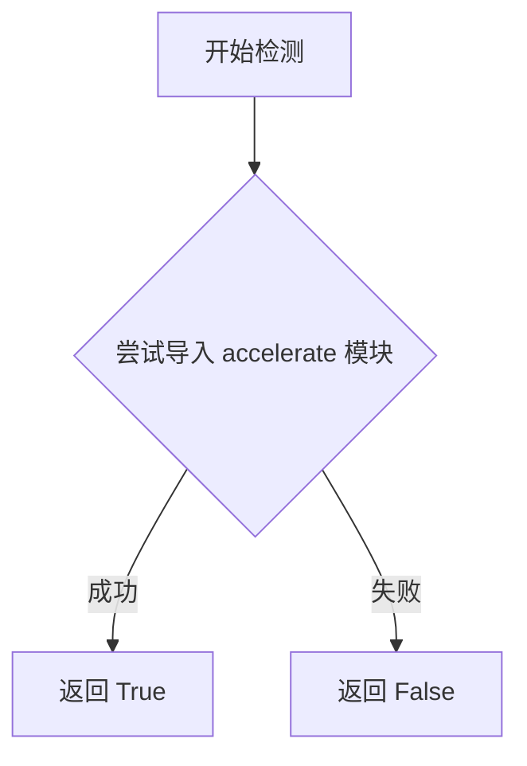

#### 带注释源码

```
# 该函数定义在 ..utils 模块中，当前文件通过以下方式导入：
from ..utils import is_accelerate_available

# 在 IPAdapterMixin.load_ip_adapter 方法中的典型用法：
if low_cpu_mem_usage and not is_accelerate_available():
    low_cpu_mem_usage = False
    logger.warning(
        "Cannot initialize model with low cpu memory usage because `accelerate` was not found in the"
        " environment. Defaulting to `low_cpu_mem_usage=False`. It is strongly recommended to install"
        " `accelerate` for faster and less memory-intense model loading. You can do so with: \n```\npip"
        " install accelerate\n```\n."
    )
```


### `is_torch_version`

检查当前PyTorch版本是否满足指定的条件（比较操作符和版本号），返回布尔值。

参数：

-  `op`：`str`，比较操作符，如 `">="`、`"=="`、`"<"`、`">"` 等
-  `version`：`str`，目标PyTorch版本号字符串，如 `"1.9.0"`、`"2.0.0"` 等

返回值：`bool`，如果当前PyTorch版本满足指定的条件则返回 `True`，否则返回 `False`

#### 流程图

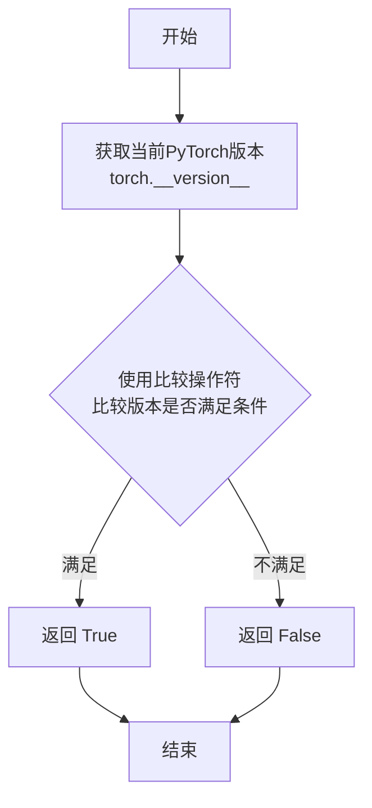

#### 带注释源码

```python
# is_torch_version 函数通常定义在 ..utils 模块中
# 以下是根据代码中使用方式推断的函数实现

def is_torch_version(op: str, version: str) -> bool:
    """
    检查当前PyTorch版本是否满足指定条件。
    
    参数:
        op: str, 比较操作符，支持 '>=', '==', '<', '>', '<=', '!='
        version: str, 目标版本号，如 '1.9.0', '2.0.0'
    
    返回:
        bool: 如果当前torch版本满足条件返回True，否则返回False
    """
    import torch
    from packaging import version
    
    # 获取当前PyTorch版本
    current_version = version.parse(torch.__version__)
    target_version = version.parse(version)
    
    # 根据操作符进行比较
    if op == ">=":
        return current_version >= target_version
    elif op == ">":
        return current_version > target_version
    elif op == "<=":
        return current_version <= target_version
    elif op == "<":
        return current_version < target_version
    elif op == "==":
        return current_version == target_version
    elif op == "!=":
        return current_version != target_version
    else:
        raise ValueError(f"Unsupported operator: {op}")
```

#### 在代码中的使用示例

```python
# 在 load_ip_adapter 方法中检查PyTorch版本
if low_cpu_mem_usage is True and not is_torch_version(">=", "1.9.0"):
    raise NotImplementedError(
        "Low memory initialization requires torch >= 1.9.0. Please either update your PyTorch version or set"
        " `low_cpu_mem_usage=False`."
    )
```

**说明**：`is_torch_version` 是从 `..utils` 模块导入的全局函数，用于在运行时检查当前环境的PyTorch版本是否满足特定要求。这是代码中处理版本兼容性检查的关键工具，特别是在使用 `low_cpu_mem_usage` 参数时需要PyTorch版本>=1.9.0。


### `is_transformers_available`

该函数用于检查当前环境中是否已安装 `transformers` 库。如果已安装，则返回 `True`；否则返回 `False`。这是一个常见的模式，用于在代码中实现可选依赖项，只有在 `transformers` 库可用时才尝试导入相关类。

参数：无需参数

返回值：`bool`，如果 `transformers` 库已安装则返回 `True`，否则返回 `False`

#### 流程图

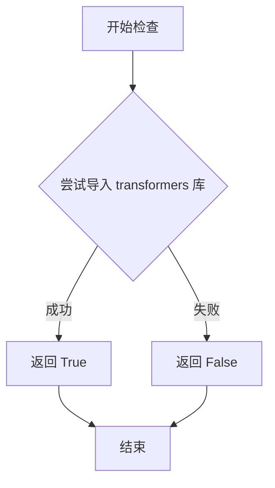

#### 带注释源码

```python
# 注意：实际的函数定义不在本文件中，而是在 ..utils 模块中
# 以下是根据使用方式的推断实现

def is_transformers_available() -> bool:
    """
    检查 transformers 库是否可用。
    
    Returns:
        bool: 如果 transformers 库已安装则返回 True，否则返回 False
    """
    try:
        # 尝试导入 transformers 库
        import transformers
        return True
    except ImportError:
        # 如果导入失败，返回 False
        return False


# 在代码中的使用方式：
if is_transformers_available():
    # 只有当 transformers 可用时才导入这些类
    from transformers import CLIPImageProcessor, CLIPVisionModelWithProjection, SiglipImageProcessor, SiglipVisionModel
```

#### 备注

此函数采用惰性导入（lazy import）模式，避免在 `transformers` 库未安装时引发 `ImportError`。这种设计允许库在不同的环境中运行，无论是否安装了可选的依赖项。当 `is_transformers_available()` 返回 `True` 时，后续代码可以安全地使用 `transformers` 库中的类和方法。


### `safe_open`

`safe_open` 是从 `safetensors` 库导入的外部函数，用于安全地打开 safetensors 格式的文件并读取张量数据。在代码中用于加载 IP Adapter 的权重文件。

参数：

-  `tensor_path`：`str | os.PathLike`，safetensors 权重文件的路径
-  `framework`：`str`，框架类型（如 "pt" 表示 PyTorch），默认为 "pt"
-  `device`：`str`，设备类型（如 "cpu" 或 "cuda"），默认为 "cpu"

返回值：`SafeTensorsFile`，safetensors 文件对象上下文管理器，用于迭代键和获取张量

#### 流程图

```mermaid
flowchart TD
    A[开始] --> B[传入文件路径、框架和设备]
    B --> C[打开 safetensors 文件]
    C --> D[返回文件对象上下文管理器]
    D --> E[通过 keys() 迭代所有张量键]
    E --> F[通过 get_tensor(key) 获取指定张量]
    F --> G[处理完成后自动关闭文件]
    G --> H[结束]
```

#### 带注释源码

```python
# 从 safetensors 库导入 safe_open 函数
from safetensors import safe_open

# 在 IPAdapterMixin.load_ip_adapter 方法中的使用示例：
# 这不是 safe_open 的定义，而是其在代码中的典型用法

# 检查权重文件是否为 safetensors 格式
if weight_name.endswith(".safetensors"):
    # 初始化状态字典结构
    state_dict = {"image_proj": {}, "ip_adapter": {}}
    
    # 使用 safe_open 打开 safetensors 文件
    # 参数说明：
    #   model_file: 文件路径
    #   framework="pt": 使用 PyTorch 框架
    #   device="cpu": 将张量加载到 CPU 设备
    with safe_open(model_file, framework="pt", device="cpu") as f:
        # 遍历文件中的所有键
        for key in f.keys():
            # 处理 image_proj 开头的键
            if key.startswith("image_proj."):
                # 移除前缀并将张量存入状态字典
                state_dict["image_proj"][key.replace("image_proj.", "")] = f.get_tensor(key)
            # 处理 ip_adapter 开头的键
            elif key.startswith("ip_adapter."):
                # 移除前缀并将张量存入状态字典
                state_dict["ip_adapter"][key.replace("ip_adapter.", "")] = f.get_tensor(key)

# 注意：safe_open 是外部库函数，其具体实现位于 safetensors 包中
# 此代码展示了在 diffusers 项目中如何调用该函数来加载 IP Adapter 权重
```


### `IPAdapterMixin.load_ip_adapter`

该方法用于将IP-Adapter（图像提示适配器）权重加载到扩散模型pipeline中，支持单IP-Adapter和多IP-Adapter配置，同时自动加载配套的CLIP图像编码器和特征提取器。

参数：

- `pretrained_model_name_or_path_or_dict`：`str | list[str] | dict[str, torch.Tensor]`，预训练模型的名称、路径或状态字典，支持单个或多个
- `subfolder`：`str | list[str]`，模型文件在仓库中的子文件夹路径，支持单个或多个
- `weight_name`：`str | list[str]`，要加载的权重文件名，支持单个或多个
- `image_encoder_folder`：`str | None`，图像编码器的子文件夹路径，默认为"image_encoder"
- `**kwargs`：可选参数，包含`cache_dir`、`force_download`、`proxies`、`local_files_only`、`token`、`revision`、`low_cpu_mem_usage`等

返回值：`None`，该方法直接在对象上加载权重，无返回值

#### 流程图

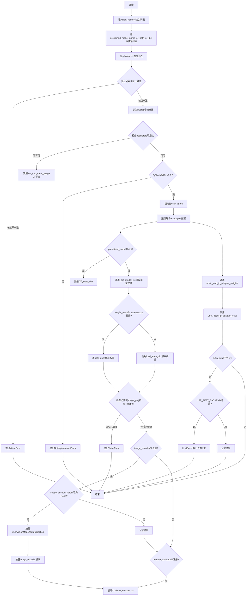

#### 带注释源码

```python
@validate_hf_hub_args
def load_ip_adapter(
    self,
    pretrained_model_name_or_path_or_dict: str | list[str] | dict[str, torch.Tensor],
    subfolder: str | list[str],
    weight_name: str | list[str],
    image_encoder_folder: str | None = "image_encoder",
    **kwargs,
):
    """
    Parameters:
        pretrained_model_name_or_path_or_dict: 预训练模型名称、路径或状态字典
        subfolder: 模型文件的子文件夹路径
        weight_name: 权重文件名
        image_encoder_folder: 图像编码器子文件夹，None则不加载
        **kwargs: 包含cache_dir、force_download、proxies等可选参数
    """
    
    # --- 步骤1: 处理列表输入，支持多个IP-Adapter ---
    if not isinstance(weight_name, list):
        weight_name = [weight_name]

    if not isinstance(pretrained_model_name_or_path_or_dict, list):
        pretrained_model_name_or_path_or_dict = [pretrained_model_name_or_path_or_dict]
    # 如果只有一个模型路径但有多个权重名称，复制模型路径
    if len(pretrained_model_name_or_path_or_dict) == 1:
        pretrained_model_name_or_path_or_dict = pretrained_model_name_or_path_or_dict * len(weight_name)

    if not isinstance(subfolder, list):
        subfolder = [subfolder]
    # 如果只有一个子文件夹但有多个权重名称，复制子文件夹
    if len(subfolder) == 1:
        subfolder = subfolder * len(weight_name)

    # --- 步骤2: 验证参数长度一致性 ---
    if len(weight_name) != len(pretrained_model_name_or_path_or_dict):
        raise ValueError("`weight_name` and `pretrained_model_name_or_path_or_dict` must have the same length.")

    if len(weight_name) != len(subfolder):
        raise ValueError("`weight_name` and `subfolder` must have the same length.")

    # --- 步骤3: 从kwargs提取下载相关参数 ---
    cache_dir = kwargs.pop("cache_dir", None)
    force_download = kwargs.pop("force_download", False)
    proxies = kwargs.pop("proxies", None)
    local_files_only = kwargs.pop("local_files_only", None)
    token = kwargs.pop("token", None)
    revision = kwargs.pop("revision", None)
    low_cpu_mem_usage = kwargs.pop("low_cpu_mem_usage", _LOW_CPU_MEM_USAGE_DEFAULT)

    # --- 步骤4: 检查低CPU内存使用条件 ---
    if low_cpu_mem_usage and not is_accelerate_available():
        low_cpu_mem_usage = False
        logger.warning(
            "Cannot initialize model with low cpu memory usage because `accelerate` was not found in the"
            " environment. Defaulting to `low_cpu_mem_usage=False`. It is strongly recommended to install"
            " `accelerate` for faster and less memory-intense model loading. You can do so with: \n```\npip"
            " install accelerate\n```\n."
        )

    if low_cpu_mem_usage is True and not is_torch_version(">=", "1.9.0"):
        raise NotImplementedError(
            "Low memory initialization requires torch >= 1.9.0. Please either update your PyTorch version or set"
            " `low_cpu_mem_usage=False`."
        )

    # --- 步骤5: 遍历加载每个IP-Adapter的权重 ---
    user_agent = {"file_type": "attn_procs_weights", "framework": "pytorch"}
    state_dicts = []
    for pretrained_model_name_or_path_or_dict, weight_name, subfolder in zip(
        pretrained_model_name_or_path_or_dict, weight_name, subfolder
    ):
        # 如果不是字典形式，从Hub或本地加载模型文件
        if not isinstance(pretrained_model_name_or_path_or_dict, dict):
            model_file = _get_model_file(
                pretrained_model_name_or_path_or_dict,
                weights_name=weight_name,
                cache_dir=cache_dir,
                force_download=force_download,
                proxies=proxies,
                local_files_only=local_files_only,
                token=token,
                revision=revision,
                subfolder=subfolder,
                user_agent=user_agent,
            )
            # 处理safetensors格式的文件
            if weight_name.endswith(".safetensors"):
                state_dict = {"image_proj": {}, "ip_adapter": {}}
                with safe_open(model_file, framework="pt", device="cpu") as f:
                    for key in f.keys():
                        if key.startswith("image_proj."):
                            state_dict["image_proj"][key.replace("image_proj.", "")] = f.get_tensor(key)
                        elif key.startswith("ip_adapter."):
                            state_dict["ip_adapter"][key.replace("ip_adapter.", "")] = f.get_tensor(key)
            else:
                # 加载PyTorch格式的权重
                state_dict = load_state_dict(model_file)
        else:
            # 直接使用传入的状态字典
            state_dict = pretrained_model_name_or_path_or_dict

        # 验证必需键是否存在
        keys = list(state_dict.keys())
        if "image_proj" not in keys and "ip_adapter" not in keys:
            raise ValueError("Required keys are (`image_proj` and `ip_adapter`) missing from the state dict.")

        state_dicts.append(state_dict)

        # --- 步骤6: 加载CLIP图像编码器（如需要）---
        if hasattr(self, "image_encoder") and getattr(self, "image_encoder", None) is None:
            if image_encoder_folder is not None:
                if not isinstance(pretrained_model_name_or_path_or_dict, dict):
                    logger.info(f"loading image_encoder from {pretrained_model_name_or_path_or_dict}")
                    # 处理子文件夹路径
                    if image_encoder_folder.count("/") == 0:
                        image_encoder_subfolder = Path(subfolder, image_encoder_folder).as_posix()
                    else:
                        image_encoder_subfolder = Path(image_encoder_folder).as_posix()

                    # 加载CLIP Vision模型作为图像编码器
                    image_encoder = CLIPVisionModelWithProjection.from_pretrained(
                        pretrained_model_name_or_path_or_dict,
                        subfolder=image_encoder_subfolder,
                        low_cpu_mem_usage=low_cpu_mem_usage,
                        cache_dir=cache_dir,
                        local_files_only=local_files_only,
                        torch_dtype=self.dtype,
                    ).to(self.device)
                    self.register_modules(image_encoder=image_encoder)
                else:
                    raise ValueError(
                        "`image_encoder` cannot be loaded because `pretrained_model_name_or_path_or_dict` is a state dict."
                    )
            else:
                logger.warning(
                    "image_encoder is not loaded since `image_encoder_folder=None` passed. You will not be able to use `ip_adapter_image` when calling the pipeline with IP-Adapter."
                    "Use `ip_adapter_image_embeds` to pass pre-generated image embedding instead."
                )

        # --- 步骤7: 创建特征提取器（如需要）---
        if hasattr(self, "feature_extractor") and getattr(self, "feature_extractor", None) is None:
            # FaceID IP adapters不需要图像编码器，默认使用224
            default_clip_size = 224
            clip_image_size = (
                self.image_encoder.config.image_size if self.image_encoder is not None else default_clip_size
            )
            feature_extractor = CLIPImageProcessor(size=clip_image_size, crop_size=clip_image_size)
            self.register_modules(feature_extractor=feature_extractor)

    # --- 步骤8: 将IP-Adapter权重加载到UNet ---
    unet = getattr(self, self.unet_name) if not hasattr(self, "unet") else self.unet
    unet._load_ip_adapter_weights(state_dicts, low_cpu_mem_usage=low_cpu_mem_usage)

    # --- 步骤9: 加载IP-Adapter的LoRA权重（如有）---
    extra_loras = unet._load_ip_adapter_loras(state_dicts)
    if extra_loras != {}:
        if not USE_PEFT_BACKEND:
            logger.warning("PEFT backend is required to load these weights.")
        else:
            # 应用IP Adapter Face ID LoRA权重
            peft_config = getattr(unet, "peft_config", {})
            for k, lora in extra_loras.items():
                if f"faceid_{k}" not in peft_config:
                    self.load_lora_weights(lora, adapter_name=f"faceid_{k}")
                    self.set_adapters([f"faceid_{k}"], adapter_weights=[1.0])
```


### `IPAdapterMixin.set_ip_adapter_scale`

设置 IP-Adapter 在每个 transformer 块上的缩放比例（scale）。输入的 `scale` 可以是单个配置（float 或字典），也可以是多个配置的列表，用于细粒度控制每个 IP-Adapter 的行为。

参数：

- `scale`：`float | dict | list`，IP-Adapter 缩放比例配置。可以是单个 float 值（如 1.0）、单个字典配置（如 `{"up": {"block_0": [0.0, 1.0, 0.0]}}`），或者是多个配置组成的列表。

返回值：`None`，该方法直接修改内部状态，不返回任何值。

#### 流程图

```mermaid
flowchart TD
    A[开始 set_ip_adapter_scale] --> B{scale 是否为 list}
    B -->|否| C[将 scale 转换为列表: scale = [scale]]
    B -->|是| D[保持 scale 为列表]
    C --> E[调用 _maybe_expand_lora_scales 展开缩放配置]
    D --> E
    E --> F[遍历 unet.attn_processors 中的每个注意力处理器]
    F --> G{当前处理器是否为 IPAdapter 类型?}
    G -->|否| H[跳过当前处理器]
    G -->|是| I{scale_configs 数量与处理器 scale 数量是否匹配?}
    I -->|否| J[抛出 ValueError 异常]
    I -->|是| K{scale_configs 数量是否为 1?}
    K -->|是| L[将 scale_configs 扩展为与处理器 scale 相同长度]
    K -->|否| M[遍历每个 scale_config]
    L --> M
    M --> N{scale_config 是否为字典?}
    N -->|是| O[遍历字典键值对]
    O --> P{attn_name 是否以字典键 k 开头?}
    P -->|是| Q[设置 attn_processor.scale[i] = s]
    P -->|否| R[继续下一个键值对]
    N -->|否| S[直接设置 attn_processor.scale[i] = scale_config]
    Q --> T[i += 1]
    R --> T
    S --> T
    T --> U{是否还有更多处理器?}
    U -->|是| F
    U -->|否| V[结束]
    H --> U
    J --> V
```

#### 带注释源码

```python
def set_ip_adapter_scale(self, scale):
    """
    设置每个 transformer 块的 IP-Adapter 缩放比例。
    输入的 scale 可以是单个配置，也可以是多个配置的列表，用于细粒度控制每个 IP-Adapter 的行为。
    配置可以是 float 类型或字典类型。
    """
    # 获取 UNet 对象：首先尝试通过 self.unet_name 属性获取 UNet，如果 self 有 unet 属性则直接使用
    unet = getattr(self, self.unet_name) if not hasattr(self, "unet") else self.unet
    
    # 确保 scale 是列表格式：如果不是列表，则包装为列表，以便统一处理
    if not isinstance(scale, list):
        scale = [scale]
    
    # 使用工具函数展开/规范化 LoRA 缩放配置：将用户输入的 scale 转换为标准化的 scale_configs 格式
    # default_scale=0.0 表示如果某个块没有指定缩放值，默认使用 0.0
    scale_configs = _maybe_expand_lora_scales(unet, scale, default_scale=0.0)

    # 遍历 UNet 中的所有注意力处理器
    for attn_name, attn_processor in unet.attn_processors.items():
        # 检查当前注意力处理器是否是 IP-Adapter 类型的处理器
        if isinstance(
            attn_processor, 
            (IPAdapterAttnProcessor, IPAdapterAttnProcessor2_0, IPAdapterXFormersAttnProcessor)
        ):
            # 验证缩放配置数量与 IP-Adapter 数量是否匹配
            if len(scale_configs) != len(attn_processor.scale):
                raise ValueError(
                    f"Cannot assign {len(scale_configs)} scale_configs to {len(attn_processor.scale)} IP-Adapter."
                )
            # 如果只有一个 scale 配置，则将其扩展为与处理器 scale 列表相同的长度
            elif len(scale_configs) == 1:
                scale_configs = scale_configs * len(attn_processor.scale)
            
            # 遍历每个缩放配置并应用到对应的注意力处理器
            for i, scale_config in enumerate(scale_configs):
                # 如果配置是字典格式（例如 {"up": {...}}, {"down": {...}}）
                if isinstance(scale_config, dict):
                    # 遍历字典中的每个键值对
                    for k, s in scale_config.items():
                        # 检查注意力名称是否以字典的键开头（例如 "up_blocks.0..." 以 "up" 开头）
                        if attn_name.startswith(k):
                            # 将对应的缩放值设置到注意力处理器的 scale 属性中
                            attn_processor.scale[i] = s
                else:
                    # 如果配置是 float 类型，直接设置
                    attn_processor.scale[i] = scale_config
```


### `IPAdapterMixin.unload_ip_adapter`

该方法用于卸载已加载的IP Adapter权重，包括移除CLIP图像编码器、特征提取器、隐藏编码器，并恢复原始的Unet注意力处理器。

参数：
- 该方法无显式参数（`self` 为隐式参数）

返回值：`None`，该方法直接修改实例状态，无返回值

#### 流程图

```mermaid
flowchart TD
    A[开始 unload_ip_adapter] --> B{是否存在 image_encoder 属性且不为 None}
    B -->|是| C[将 image_encoder 设为 None]
    C --> D[调用 register_to_config 注册 image_encoder=[None, None]]
    B -->|否| E{是否存在 safety_checker 属性}
    E -->|否| F{是否存在 feature_extractor 属性且不为 None}
    E -->|是| G[跳过 feature_extractor 清理]
    F -->|是| H[将 feature_extractor 设为 None]
    H --> I[调用 register_to_config 注册 feature_extractor=[None, None]]
    F -->|否| J[继续]
    I --> J
    G --> J
    J --> K[将 unet.encoder_hid_proj 设为 None]
    K --> L[将 unet.config.encoder_hid_dim_type 设为 None]
    L --> M{unet 是否有 text_encoder_hid_proj 属性且不为 None}
    M -->|是| N[恢复 text_encoder_hid_proj]
    N --> O[将 unet.config.encoder_hid_dim_type 设为 'text_proj']
    M -->|否| P[继续]
    O --> P
    P --> Q[遍历 unet.attn_processors]
    Q --> R{当前处理器是否为 IPAdapter 类型}
    R -->|是| S[创建默认注意力处理器 AttnProcessor2_0 或 AttnProcessor]
    R -->|否| T[保留原处理器类]
    S --> U[添加到 attn_procs 字典]
    T --> U
    Q --> V[所有处理器处理完毕]
    V --> W[调用 unet.set_attn_processor 恢复处理器]
    W --> X[结束]
```

#### 带注释源码

```python
def unload_ip_adapter(self):
    """
    Unloads the IP Adapter weights

    Examples:

    ```python
    >>> # Assuming `pipeline` is already loaded with the IP Adapter weights.
    >>> pipeline.unload_ip_adapter()
    >>> ...
    ```
    """
    # remove CLIP image encoder
    # 检查实例是否具有 image_encoder 属性且不为 None
    if hasattr(self, "image_encoder") and getattr(self, "image_encoder", None) is not None:
        # 将 image_encoder 设置为 None，释放内存
        self.image_encoder = None
        # 同时注册到配置中，记录 image_encoder 为 [None, None]
        self.register_to_config(image_encoder=[None, None])

    # remove feature extractor only when safety_checker is None as safety_checker uses
    # the feature_extractor later
    # 只有当 safety_checker 不存在时才清理 feature_extractor，因为 safety_checker 会使用它
    if not hasattr(self, "safety_checker"):
        # 检查 feature_extractor 属性是否存在且不为 None
        if hasattr(self, "feature_extractor") and getattr(self, "feature_extractor", None) is not None:
            # 将 feature_extractor 设置为 None
            self.feature_extractor = None
            # 注册到配置中
            self.register_to_config(feature_extractor=[None, None])

    # remove hidden encoder
    # 移除隐藏编码器，IP Adapter 使用 encoder_hid_proj 来传递图像特征
    self.unet.encoder_hid_proj = None
    # 重置编码器隐藏维度类型配置
    self.unet.config.encoder_hid_dim_type = None

    # Kolors: restore `encoder_hid_proj` with `text_encoder_hid_proj`
    # 针对 Kolors 模型的特殊处理：恢复 text_encoder_hid_proj
    if hasattr(self.unet, "text_encoder_hid_proj") and self.unet.text_encoder_hid_proj is not None:
        # 将 text_encoder_hid_proj 恢复到 encoder_hid_proj
        self.unet.encoder_hid_proj = self.unet.text_encoder_hid_proj
        # 清空 text_encoder_hid_proj
        self.unet.text_encoder_hid_proj = None
        # 更新配置为 text_proj 类型
        self.unet.config.encoder_hid_dim_type = "text_proj"

    # restore original Unet attention processors layers
    # 恢复原始的注意力处理器，移除 IP Adapter 相关的处理器
    attn_procs = {}
    # 遍历所有的注意力处理器
    for name, value in self.unet.attn_processors.items():
        # 根据 PyTorch 版本选择默认的注意力处理器类
        attn_processor_class = (
            AttnProcessor2_0() if hasattr(F, "scaled_dot_product_attention") else AttnProcessor()
        )
        # 如果当前处理器是 IP Adapter 类型，则替换为默认处理器；否则保留原处理器类
        attn_procs[name] = (
            attn_processor_class
            if isinstance(
                value, (IPAdapterAttnProcessor, IPAdapterAttnProcessor2_0, IPAdapterXFormersAttnProcessor)
            )
            else value.__class__()
        )
    # 调用 set_attn_processor 更新注意力处理器
    self.unet.set_attn_processor(attn_procs)
```


### `ModularIPAdapterMixin.load_ip_adapter`

该方法用于将IP-Adapter权重加载到模型中，支持加载单个或多个IP-Adapter，并处理相关的图像编码器和特征提取器。

参数：

- `pretrained_model_name_or_path_or_dict`：`str | list[str] | dict[str, torch.Tensor]`，预训练模型的名称、路径或状态字典，支持单个或多个
- `subfolder`：`str | list[str]`，模型文件在仓库中的子文件夹路径，支持单个或多个
- `weight_name`：`str | list[str]`，要加载的权重文件名称，支持单个或多个
- `**kwargs`：其他可选关键字参数，包括cache_dir、force_download、proxies、local_files_only、token、revision、low_cpu_mem_usage等

返回值：`None`，该方法直接修改对象状态，无返回值

#### 流程图

```mermaid
flowchart TD
    A[开始] --> B{weight_name是否为列表}
    B -->|否| C[转换为列表]
    B -->|是| D{pretrained_model_name_or_path_or_dict是否为列表}
    D -->|否| E[转换为列表]
    D -->|是| F{长度是否为1}
    E --> F
    C --> F
    F -->|是| G[重复为weight_name长度]
    F -->|否| H{weight_name长度与pretrained_model_path长度一致}
    G --> H
    H -->|否| I[抛出ValueError]
    H -->|是| J{subfolder是否为列表]
    J -->|否| K[转换为列表]
    J -->|是| L{长度是否为1}
    K --> L
    L -->|是| M[重复为weight_name长度]
    L -->|否| N{weight_name长度与subfolder长度一致}
    M --> N
    N -->|否| O[抛出ValueError]
    N -->|是| P[从kwargs提取配置参数]
    P --> Q{检查low_cpu_mem_usage兼容性}
    Q -->|不兼容| R[禁用并警告]
    Q -->|兼容| S{torch版本>=1.9.0}
    S -->|否| T[抛出NotImplementedError]
    S -->|是| U[创建user_agent]
    U --> V[遍历加载每个IP Adapter权重]
    V --> W{pretrained_model_path是否为字典}
    W -->|否| X[_get_model_file获取模型文件]
    W -->|是| Y[直接作为state_dict]
    X --> Z{weight_name以.safetensors结尾}
    Z -->|是| AA[解析safetensors文件]
    Z -->|否| AB[load_state_dict加载]
    AA --> AC[提取image_proj和ip_adapter]
    AB --> AC
    AC --> AD{state_dict包含必需键]
    AD -->|否| AE[抛出ValueError]
    AD -->|是| AF[添加到state_dicts列表]
    Y --> AF
    V --> AG[获取UNet]
    AG --> AH[unet._load_ip_adapter_weights]
    AH --> AI[unet._load_ip_adapter_loras]
    AI --> AJ{extra_loras不为空}
    AJ -->|是| AK{USE_PEFT_BACKEND可用}
    AJ -->|否| AL[结束]
    AK -->|否| AM[警告]
    AK -->|是| AN[加载LoRA权重]
    AM --> AL
    AN --> AL
```

#### 带注释源码

```python
@validate_hf_hub_args
def load_ip_adapter(
    self,
    pretrained_model_name_or_path_or_dict: str | list[str] | dict[str, torch.Tensor],
    subfolder: str | list[str],
    weight_name: str | list[str],
    **kwargs,
):
    """
    Parameters:
        pretrained_model_name_or_path_or_dict (`str` or `list[str]` or `os.PathLike` or `list[os.PathLike]` or `dict` or `list[dict]`):
            Can be either:
                - A string, the *model id* (for example `google/ddpm-celebahq-256`) of a pretrained model hosted on
                  the Hub.
                - A path to a *directory* (for example `./my_model_directory`) containing the model weights saved
                  with [`ModelMixin.save_pretrained`].
                - A [torch state
                  dict](https://pytorch.org/tutorials/beginner/saving_loading_models.html#what-is-a-state-dict).
        subfolder (`str` or `list[str]`):
            The subfolder location of a model file within a larger model repository on the Hub or locally. If a
            list is passed, it should have the same length as `weight_name`.
        weight_name (`str` or `list[str]`):
            The name of the weight file to load. If a list is passed, it should have the same length as
            `subfolder`.
        cache_dir (`str | os.PathLike`, *optional*):
            Path to a directory where a downloaded pretrained model configuration is cached if the standard cache
            is not used.
        force_download (`bool`, *optional*, defaults to `False`):
            Whether or not to force the (re-)download of the model weights and configuration files, overriding the
            cached versions if they exist.
        proxies (`dict[str, str]`, *optional*):
            A dictionary of proxy servers to use by protocol or endpoint, for example, `{'http': 'foo.bar:3128',
            'http://hostname': 'foo.bar:4012'}`. The proxies are used on each request.
        local_files_only (`bool`, *optional*, defaults to `False`):
            Whether to only load local model weights and configuration files or not. If set to `True`, the model
            won't be downloaded from the Hub.
        token (`str` or *bool*, *optional*):
            The token to use as HTTP bearer authorization for remote files. If `True`, the token generated from
            `diffusers-cli login` (stored in `~/.huggingface`) is used.
        revision (`str`, *optional*, defaults to `"main"`):
            The specific model version to use. It can be a branch name, a tag name, a commit id, or any identifier
            allowed by Git.
        low_cpu_mem_usage (`bool`, *optional*, defaults to `True` if torch version >= 1.9.0 else `False`):
            Speed up model loading only loading the pretrained weights and not initializing the weights. This also
            tries to not use more than 1x model size in CPU memory (including peak memory) while loading the model.
            Only supported for PyTorch >= 1.9.0. If you are using an older version of PyTorch, setting this
            argument to `True` will raise an error.
    """

    # handle the list inputs for multiple IP Adapters
    # 处理列表输入，支持多个IP Adapter
    if not isinstance(weight_name, list):
        weight_name = [weight_name]

    if not isinstance(pretrained_model_name_or_path_or_dict, list):
        pretrained_model_name_or_path_or_dict = [pretrained_model_name_or_path_or_dict]
    if len(pretrained_model_name_or_path_or_dict) == 1:
        # 如果只有一个预训练模型路径，扩展到与weight_name相同长度
        pretrained_model_name_or_path_or_dict = pretrained_model_name_or_path_or_dict * len(weight_name)

    if not isinstance(subfolder, list):
        subfolder = [subfolder]
    if len(subfolder) == 1:
        # 如果只有一个子文件夹，扩展到与weight_name相同长度
        subfolder = subfolder * len(weight_name)

    # 验证输入参数长度一致性
    if len(weight_name) != len(pretrained_model_name_or_path_or_dict):
        raise ValueError("`weight_name` and `pretrained_model_name_or_path_or_dict` must have the same length.")

    if len(weight_name) != len(subfolder):
        raise ValueError("`weight_name` and `subfolder` must have the same length.")

    # Load the main state dict first.
    # 从kwargs中提取配置参数
    cache_dir = kwargs.pop("cache_dir", None)
    force_download = kwargs.pop("force_download", False)
    proxies = kwargs.pop("proxies", None)
    local_files_only = kwargs.pop("local_files_only", None)
    token = kwargs.pop("token", None)
    revision = kwargs.pop("revision", None)
    low_cpu_mem_usage = kwargs.pop("low_cpu_mem_usage", _LOW_CPU_MEM_USAGE_DEFAULT)

    # 检查accelerate库是否可用，若不可用则禁用低内存加载
    if low_cpu_mem_usage and not is_accelerate_available():
        low_cpu_mem_usage = False
        logger.warning(
            "Cannot initialize model with low cpu memory usage because `accelerate` was not found in the"
            " environment. Defaulting to `low_cpu_mem_usage=False`. It is strongly recommended to install"
            " `accelerate` for faster and less memory-intense model loading. You can do so with: \n```\npip"
            " install accelerate\n```\n."
        )

    # 检查PyTorch版本是否支持低内存加载
    if low_cpu_mem_usage is True and not is_torch_version(">=", "1.9.0"):
        raise NotImplementedError(
            "Low memory initialization requires torch >= 1.9.0. Please either update your PyTorch version or set"
            " `low_cpu_mem_usage=False`."
        )

    # 创建用户代理信息，用于模型下载
    user_agent = {
        "file_type": "attn_procs_weights",
        "framework": "pytorch",
    }
    state_dicts = []
    # 遍历每个IP Adapter配置，加载权重
    for pretrained_model_name_or_path_or_dict, weight_name, subfolder in zip(
        pretrained_model_name_or_path_or_dict, weight_name, subfolder
    ):
        if not isinstance(pretrained_model_name_or_path_or_dict, dict):
            # 获取模型文件路径
            model_file = _get_model_file(
                pretrained_model_name_or_path_or_dict,
                weights_name=weight_name,
                cache_dir=cache_dir,
                force_download=force_download,
                proxies=proxies,
                local_files_only=local_files_only,
                token=token,
                revision=revision,
                subfolder=subfolder,
                user_agent=user_agent,
            )
            # 处理safetensors格式的权重文件
            if weight_name.endswith(".safetensors"):
                state_dict = {"image_proj": {}, "ip_adapter": {}}
                with safe_open(model_file, framework="pt", device="cpu") as f:
                    for key in f.keys():
                        if key.startswith("image_proj."):
                            # 提取image_proj权重
                            state_dict["image_proj"][key.replace("image_proj.", "")] = f.get_tensor(key)
                        elif key.startswith("ip_adapter."):
                            # 提取ip_adapter权重
                            state_dict["ip_adapter"][key.replace("ip_adapter.", "")] = f.get_tensor(key)
            else:
                # 加载PyTorch格式的权重文件
                state_dict = load_state_dict(model_file)
        else:
            # 直接使用传入的状态字典
            state_dict = pretrained_model_name_or_path_or_dict

        # 验证状态字典包含必需的键
        keys = list(state_dict.keys())
        if "image_proj" not in keys and "ip_adapter" not in keys:
            raise ValueError("Required keys are (`image_proj` and `ip_adapter`) missing from the state dict.")

        state_dicts.append(state_dict)

    # 获取UNet模块
    unet_name = getattr(self, "unet_name", "unet")
    unet = getattr(self, unet_name)
    # 加载IP Adapter权重到UNet
    unet._load_ip_adapter_weights(state_dicts, low_cpu_mem_usage=low_cpu_mem_usage)

    # 加载额外的LoRA权重（如Face ID适配器）
    extra_loras = unet._load_ip_adapter_loras(state_dicts)
    if extra_loras != {}:
        if not USE_PEFT_BACKEND:
            logger.warning("PEFT backend is required to load these weights.")
        else:
            # 应用IP Adapter Face ID LoRA权重
            peft_config = getattr(unet, "peft_config", {})
            for k, lora in extra_loras.items():
                if f"faceid_{k}" not in peft_config:
                    self.load_lora_weights(lora, adapter_name=f"faceid_{k}")
                    self.set_adapters([f"faceid_{k}"], adapter_weights=[1.0])
```


### `ModularIPAdapterMixin.set_ip_adapter_scale`

设置 IP-Adapter 在每个 transformer 块上的缩放系数。输入的 `scale` 可以是单个配置（浮点数或字典），也可以是配置列表，用于细粒度控制每个 IP-Adapter 的行为。

参数：

- `scale`：`float | dict | list`，IP-Adapter 缩放系数，支持单个浮点数、字典（按块名称指定缩放数组）或它们的列表

返回值：`None`，该方法直接修改内部注意力处理器的 scale 属性，无返回值

#### 流程图

```mermaid
flowchart TD
    A[开始 set_ip_adapter_scale] --> B[获取 unet_name 属性]
    B --> C[获取 unet 实例]
    C --> D{scale 是否为列表?}
    D -- 否 --> E[将 scale 包装为列表]
    D -- 是 --> F[保持原样]
    E --> G[调用 _maybe_expand_lora_scales 展开配置]
    F --> G
    G --> H[遍历 unet 的 attn_processors]
    H --> I{当前处理器是 IPAdapter 类型?}
    I -- 否 --> H
    I -- 是 --> J{scale_configs 长度与 attn_processor.scale 长度是否匹配?}
    J -- 否 --> K[抛出 ValueError]
    J -- 是 --> L{scale_configs 长度是否为 1?}
    L -- 是 --> M[将 scale_configs 扩展为 attn_processor.scale 的长度]
    L -- 否 --> N[遍历 scale_configs]
    M --> N
    N --> O{当前 scale_config 是否为字典?}
    O -- 是 --> P[遍历字典键值对]
    P --> Q{attn_name 是否以字典键开头?}
    Q -- 是 --> R[更新 attn_processor.scale[i]]
    Q -- 否 --> N
    O -- 否 --> S[直接赋值 attn_processor.scale[i] = scale_config]
    R --> N
    S --> N
    N --> H
    H --> T[结束]
```

#### 带注释源码

```python
def set_ip_adapter_scale(self, scale):
    """
    Set IP-Adapter scales per-transformer block. Input `scale` could be a single config or a list of configs for
    granular control over each IP-Adapter behavior. A config can be a float or a dictionary.

    Example:

    ```py
    # To use original IP-Adapter
    scale = 1.0
    pipeline.set_ip_adapter_scale(scale)

    # To use style block only
    scale = {
        "up": {"block_0": [0.0, 1.0, 0.0]},
    }
    pipeline.set_ip_adapter_scale(scale)

    # To use style+layout blocks
    scale = {
        "down": {"block_2": [0.0, 1.0]},
        "up": {"block_0": [0.0, 1.0, 0.0]},
    }
    pipeline.set_ip_adapter_scale(scale)

    # To use style and layout from 2 reference images
    scales = [{"down": {"block_2": [0.0, 1.0]}}, {"up": {"block_0": [0.0, 1.0, 0.0]}}]
    pipeline.set_ip_adapter_scale(scales)
    ```
    """
    # 获取 unet 组件名称，默认为 "unet"
    unet_name = getattr(self, "unet_name", "unet")
    # 获取 unet 实例
    unet = getattr(self, unet_name)
    
    # 如果 scale 不是列表，则包装为列表，统一处理逻辑
    if not isinstance(scale, list):
        scale = [scale]
    
    # 调用工具函数展开 LoRA 缩放配置，生成标准化的配置列表
    scale_configs = _maybe_expand_lora_scales(unet, scale, default_scale=0.0)

    # 遍历所有注意力处理器
    for attn_name, attn_processor in unet.attn_processors.items():
        # 只处理 IP-Adapter 类型的注意力处理器
        if isinstance(
            attn_processor, (IPAdapterAttnProcessor, IPAdapterAttnProcessor2_0, IPAdapterXFormersAttnProcessor)
        ):
            # 验证缩放配置数量与处理器 scale 数组长度是否匹配
            if len(scale_configs) != len(attn_processor.scale):
                raise ValueError(
                    f"Cannot assign {len(scale_configs)} scale_configs to {len(attn_processor.scale)} IP-Adapter."
                )
            # 如果只有一个配置，则扩展为与 attn_processor.scale 相同的长度
            elif len(scale_configs) == 1:
                scale_configs = scale_configs * len(attn_processor.scale)
            
            # 遍历每个缩放配置并应用
            for i, scale_config in enumerate(scale_configs):
                # 如果配置是字典形式（按块名称如 "up"/"down" 指定）
                if isinstance(scale_config, dict):
                    for k, s in scale_config.items():
                        # 匹配注意力处理器名称是否以块名称开头
                        if attn_name.startswith(k):
                            attn_processor.scale[i] = s
                else:
                    # 直接使用浮点数配置
                    attn_processor.scale[i] = scale_config
```


### `ModularIPAdapterMixin.unload_ip_adapter`

该方法用于卸载已加载的 IP Adapter 权重，通过清除隐藏编码器投影、恢复原始注意力处理器等操作，将模型从 IP Adapter 模式恢复到原始状态。

参数： 无

返回值：`None`，该方法直接修改对象状态，不返回任何值

#### 流程图

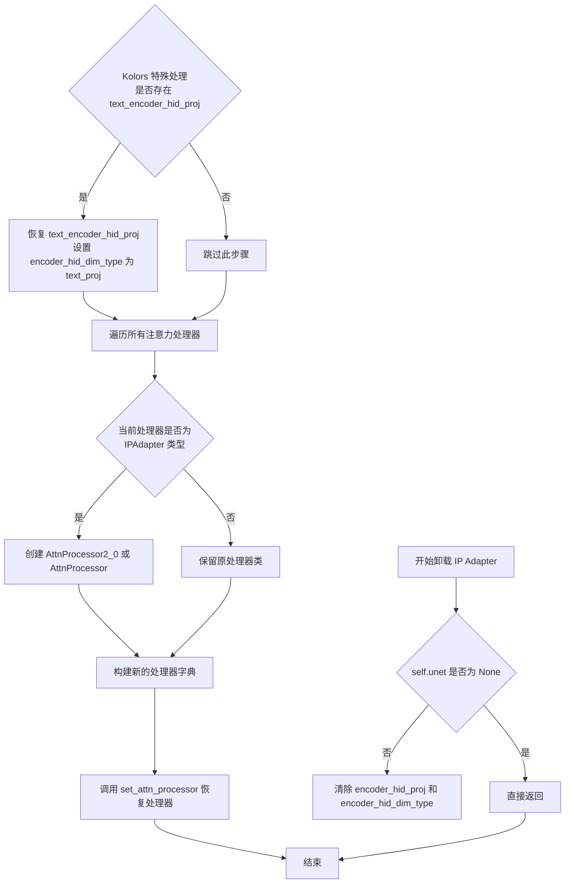

#### 带注释源码

```python
def unload_ip_adapter(self):
    """
    Unloads the IP Adapter weights

    Examples:

    ```python
    >>> # Assuming `pipeline` is already loaded with the IP Adapter weights.
    >>> pipeline.unload_ip_adapter()
    >>> ...
    ```
    """

    # 检查 unet 是否存在，如果为 None 则直接返回，无需卸载
    if self.unet is None:
        return

    # 移除隐藏编码器投影，清除 encoder_hid_dim_type 配置
    self.unet.encoder_hid_proj = None
    self.unet.config.encoder_hid_dim_type = None

    # Kolors 特殊处理：如果存在 text_encoder_hid_proj，则恢复它
    # 这是一个针对 Kolors 模型的兼容性处理
    if hasattr(self.unet, "text_encoder_hid_proj") and self.unet.text_encoder_hid_proj is not None:
        self.unet.encoder_hid_proj = self.unet.text_encoder_hid_proj
        self.unet.text_encoder_hid_proj = None
        self.unet.config.encoder_hid_dim_type = "text_proj"

    # 恢复原始的 Unet 注意力处理器
    # 遍历所有注意力处理器，将 IP Adapter 专用处理器替换为标准处理器
    attn_procs = {}
    for name, value in self.unet.attn_processors.items():
        # 根据 PyTorch 版本选择合适的注意力处理器类
        # 如果支持 scaled_dot_product_attention 则使用 AttnProcessor2_0
        attn_processor_class = (
            AttnProcessor2_0() if hasattr(F, "scaled_dot_product_attention") else AttnProcessor()
        )
        # 如果当前处理器是 IP Adapter 类型，则替换为标准处理器
        # 否则保留原处理器的类型
        attn_procs[name] = (
            attn_processor_class
            if isinstance(
                value, (IPAdapterAttnProcessor, IPAdapterAttnProcessor2_0, IPAdapterXFormersAttnProcessor)
            )
            else value.__class__()
        )
    # 应用新的注意力处理器配置
    self.unet.set_attn_processor(attn_procs)
```


### FluxIPAdapterMixin.load_ip_adapter

该方法用于将IP-Adapter权重加载到Flux模型中，支持加载图像编码器（CLIP ViT）和特征提取器，并处理单个或多个IP-Adapter权重的加载，同时包含针对Flux模型特定权重键的解析逻辑。

参数：

- `pretrained_model_name_or_path_or_dict`：`str | list[str] | dict[str, torch.Tensor]`，预训练模型的标识符，可以是模型ID（如"google/ddpm-celebahq-256"）、本地目录路径，或PyTorch状态字典
- `weight_name`：`str | list[str]`，要加载的权重文件名，支持单个或多个权重文件
- `subfolder`：`str | list[str] | None`，模型文件在仓库中的子文件夹位置，默认为空字符串
- `image_encoder_pretrained_model_name_or_path`：`str | None`，图像编码器的预训练模型名称或路径，默认为"image_encoder"
- `image_encoder_subfolder`：`str | None`，图像编码器的子文件夹路径，默认为空字符串
- `image_encoder_dtype`：`torch.dtype`，图像编码器加载时的数据类型，默认为torch.float16
- `**kwargs`：其他可选关键字参数，包括cache_dir、force_download、proxies、local_files_only、token、revision、low_cpu_mem_usage等

返回值：`None`，该方法直接修改实例状态，无返回值

#### 流程图

```mermaid
flowchart TD
    A[开始 load_ip_adapter] --> B{weight_name 是否为列表}
    B -->|否| C[将 weight_name 转为列表]
    B -->|是| D{pretrained_model_name_or_path_or_dict 是否为列表}
    C --> D
    D -->|否| E[转为列表并复制到相同长度]
    D -->|是| F{subfolder 是否为列表}
    F -->|否| G[转为列表并复制到相同长度]
    F -->|是| H{检查列表长度一致性}
    H -->|不一致| I[抛出 ValueError]
    H -->|一致| J[从 kwargs 提取加载参数]
    J --> K{检查 accelerate 和 torch 版本}
    K -->|不满足| L[警告并回退 low_cpu_mem_usage]
    K -->|满足| M[遍历加载每个 IP-Adapter]
    M --> N{pretrained_model_name_or_path_or_dict 是否为 dict}
    N -->|否| O[获取模型文件路径]
    N -->|是| P[直接作为状态字典]
    O --> Q{weight_name 是否以 .safetensors 结尾}
    Q -->|是| R[使用 safe_open 解析权重]
    Q -->|否| S[使用 load_state_dict 加载]
    R --> T[解析 image_proj 和 ip_adapter 键]
    S --> U{检查必需键是否存在}
    T --> U
    P --> U
    U -->|缺失| V[抛出 ValueError]
    U -->|存在| W{image_encoder 是否需要加载]
    W -->|是且未注册| X[加载 CLIPVisionModelWithProjection]
    W -->|否| Y{feature_extractor 是否需要创建}
    X --> Y
    Y -->|是且未注册| Z[创建 CLIPImageProcessor]
    Y -->|否| AA[加载权重到 transformer]
    Z --> AA
    AA --> AB[调用 _load_ip_adapter_weights]
    AB --> AC[调用 _load_ip_adapter_loras]
    AC --> AD[结束]
```

#### 带注释源码

```python
@validate_hf_hub_args
def load_ip_adapter(
    self,
    pretrained_model_name_or_path_or_dict: str | list[str] | dict[str, torch.Tensor],
    weight_name: str | list[str],
    subfolder: str | list[str] | None = "",
    image_encoder_pretrained_model_name_or_path: str | None = "image_encoder",
    image_encoder_subfolder: str | None = "",
    image_encoder_dtype: torch.dtype = torch.float16,
    **kwargs,
):
    """
    加载 IP-Adapter 权重到 Flux 模型中
    
    参数:
        pretrained_model_name_or_path_or_dict: 模型路径或 HuggingFace Hub ID 或状态字典
        weight_name: 权重文件名
        subfolder: 子文件夹路径
        image_encoder_pretrained_model_name_or_path: 图像编码器模型路径
        image_encoder_subfolder: 图像编码器子文件夹
        image_encoder_dtype: 图像编码器数据类型
        **kwargs: 其他加载参数（cache_dir, force_download, proxies, local_files_only, token, revision, low_cpu_mem_usage）
    """
    
    # 处理多个 IP-Adapter 的列表输入
    if not isinstance(weight_name, list):
        weight_name = [weight_name]

    if not isinstance(pretrained_model_name_or_path_or_dict, list):
        pretrained_model_name_or_path_or_dict = [pretrained_model_name_or_path_or_dict]
    # 如果只有一个模型路径但有多个权重文件，则复制模型路径
    if len(pretrained_model_name_or_path_or_dict) == 1:
        pretrained_model_name_or_path_or_dict = pretrained_model_name_or_path_or_dict * len(weight_name)

    if not isinstance(subfolder, list):
        subfolder = [subfolder]
    # 如果只有一个子文件夹但有多个权重文件，则复制子文件夹
    if len(subfolder) == 1:
        subfolder = subfolder * len(weight_name)

    # 验证列表长度一致性
    if len(weight_name) != len(pretrained_model_name_or_path_or_dict):
        raise ValueError("`weight_name` and `pretrained_model_name_or_path_or_dict` must have the same length.")

    if len(weight_name) != len(subfolder):
        raise ValueError("`weight_name` and `subfolder` must have the same length.")

    # 从 kwargs 中提取加载参数
    cache_dir = kwargs.pop("cache_dir", None)
    force_download = kwargs.pop("force_download", False)
    proxies = kwargs.pop("proxies", None)
    local_files_only = kwargs.pop("local_files_only", None)
    token = kwargs.pop("token", None)
    revision = kwargs.pop("revision", None)
    low_cpu_mem_usage = kwargs.pop("low_cpu_mem_usage", _LOW_CPU_MEM_USAGE_DEFAULT)

    # 检查 accelerate 库可用性
    if low_cpu_mem_usage and not is_accelerate_available():
        low_cpu_mem_usage = False
        logger.warning(
            "Cannot initialize model with low cpu memory usage because `accelerate` was not found in the"
            " environment. Defaulting to `low_cpu_mem_usage=False`. It is strongly recommended to install"
            " `accelerate` for faster and less memory-intense model loading. You can do so with: \n```\npip"
            " install accelerate\n```\n."
        )

    # 检查 PyTorch 版本是否支持低内存加载
    if low_cpu_mem_usage is True and not is_torch_version(">=", "1.9.0"):
        raise NotImplementedError(
            "Low memory initialization requires torch >= 1.9.0. Please either update your PyTorch version or set"
            " `low_cpu_mem_usage=False`."
        )

    # 构建用户代理信息
    user_agent = {"file_type": "attn_procs_weights", "framework": "pytorch"}
    state_dicts = []
    
    # 遍历加载每个 IP-Adapter 的权重
    for pretrained_model_name_or_path_or_dict, weight_name, subfolder in zip(
        pretrained_model_name_or_path_or_dict, weight_name, subfolder
    ):
        # 获取模型文件路径
        if not isinstance(pretrained_model_name_or_path_or_dict, dict):
            model_file = _get_model_file(
                pretrained_model_name_or_path_or_dict,
                weights_name=weight_name,
                cache_dir=cache_dir,
                force_download=force_download,
                proxies=proxies,
                local_files_only=local_files_only,
                token=token,
                revision=revision,
                subfolder=subfolder,
                user_agent=user_agent,
            )
            
            # 处理 safetensors 格式的权重文件
            if weight_name.endswith(".safetensors"):
                state_dict = {"image_proj": {}, "ip_adapter": {}}
                with safe_open(model_file, framework="pt", device="cpu") as f:
                    # Flux 模型特定的键名前缀
                    image_proj_keys = ["ip_adapter_proj_model.", "image_proj."]
                    ip_adapter_keys = ["double_blocks.", "ip_adapter."]
                    for key in f.keys():
                        # 解析 image_proj 权重
                        if any(key.startswith(prefix) for prefix in image_proj_keys):
                            diffusers_name = ".".join(key.split(".")[1:])
                            state_dict["image_proj"][diffusers_name] = f.get_tensor(key)
                        # 解析 ip_adapter 权重并进行键名转换
                        elif any(key.startswith(prefix) for prefix in ip_adapter_keys):
                            diffusers_name = (
                                ".".join(key.split(".")[1:])
                                .replace("ip_adapter_double_stream_k_proj", "to_k_ip")
                                .replace("ip_adapter_double_stream_v_proj", "to_v_ip")
                                .replace("processor.", "")
                            )
                            state_dict["ip_adapter"][diffusers_name] = f.get_tensor(key)
            else:
                # 加载 PyTorch 格式的权重文件
                state_dict = load_state_dict(model_file)
        else:
            # 直接使用提供的状态字典
            state_dict = pretrained_model_name_or_path_or_dict

        # 验证必需键是否存在
        keys = list(state_dict.keys())
        if keys != ["image_proj", "ip_adapter"]:
            raise ValueError("Required keys are (`image_proj` and `ip_adapter`) missing from the state dict.")

        state_dicts.append(state_dict)

        # 如果图像编码器未注册，则加载 CLIP 图像编码器
        if hasattr(self, "image_encoder") and getattr(self, "image_encoder", None) is None:
            if image_encoder_pretrained_model_name_or_path is not None:
                if not isinstance(pretrained_model_name_or_path_or_dict, dict):
                    logger.info(f"loading image_encoder from {image_encoder_pretrained_model_name_or_path}")
                    # 加载 CLIPVisionModelWithProjection 作为图像编码器
                    image_encoder = (
                        CLIPVisionModelWithProjection.from_pretrained(
                            image_encoder_pretrained_model_name_or_path,
                            subfolder=image_encoder_subfolder,
                            low_cpu_mem_usage=low_cpu_mem_usage,
                            cache_dir=cache_dir,
                            local_files_only=local_files_only,
                            torch_dtype=image_encoder_dtype,
                        )
                        .to(self.device)
                        .eval()
                    )
                    self.register_modules(image_encoder=image_encoder)
                else:
                    raise ValueError(
                        "`image_encoder` cannot be loaded because `pretrained_model_name_or_path_or_dict` is a state dict."
                    )
            else:
                logger.warning(
                    "image_encoder is not loaded since `image_encoder_folder=None` passed. You will not be able to use `ip_adapter_image` when calling the pipeline with IP-Adapter."
                    "Use `ip_adapter_image_embeds` to pass pre-generated image embedding instead."
                )

        # 如果特征提取器未注册，则创建 CLIP 图像处理器
        if hasattr(self, "feature_extractor") and getattr(self, "feature_extractor", None) is None:
            # FaceID IP adapters 不需要图像编码器，默认使用 224
            default_clip_size = 224
            clip_image_size = (
                self.image_encoder.config.image_size if self.image_encoder is not None else default_clip_size
            )
            feature_extractor = CLIPImageProcessor(size=clip_image_size, crop_size=clip_image_size)
            self.register_modules(feature_extractor=feature_extractor)

    # 将 IP-Adapter 权重加载到 transformer 模型中
    self.transformer._load_ip_adapter_weights(state_dicts, low_cpu_mem_usage=low_cpu_mem_usage)
```


### `FluxIPAdapterMixin.set_ip_adapter_scale`

设置IP-Adapter的比例（权重），用于控制每个transformer块中IP-Adapter的影响程度。支持三种输入格式：单一值（所有层和IP-Adapter使用相同比例）、每层比例列表（单个IP-Adapter）、每IP-Adapter每层比例的嵌套列表。

参数：

- `scale`：`float | list[float] | list[list[float]]`，IP-Adapter比例配置。float类型会被转换为所有IP-Adapter所有层使用同一值；list[float]会被重复用于每个IP-Adapter；list[list[float]]需匹配IP-Adapter数量且每个内部列表长度需等于transformer层数

返回值：`None`，无返回值，直接修改attention processor的scale属性

#### 流程图

```mermaid
flowchart TD
    A[开始 set_ip_adapter_scale] --> B[获取 transformer.encoder_hid_proj.num_ip_adapters]
    B --> C[获取 transformer.config.num_layers]
    C --> D{scale 是 int/float?}
    D -->|是| E[将 scale 扩展为 num_ip_adapters 个元素的列表]
    D -->|否| F{scale 是 list[float] 且 num_ip_adapters == 1?}
    F -->|是| G[将 scale 包装为 [scale]]
    F -->|否| H{scale 是 List[Union] 类型?}
    H -->|否| I[抛出 TypeError 异常]
    H -->|是| J[继续处理]
    E --> J
    G --> J
    J --> K{len(scale) == num_ip_adapters?}
    K -->|否| L[抛出 ValueError 异常]
    K -->|是| M{每个 scale 长度 == num_layers?}
    M -->|否| N[抛出 ValueError 异常]
    M -->|是| O[将标量转换为 num_layers 长的列表]
    O --> P[遍历 attn_processors 和 scale_configs]
    P --> Q{当前 attn_processor 是 IPAdapter 类型?}
    Q -->|是| R[设置 attn_processor.scale = 对应的 scale]
    Q -->|否| S[跳过该 processor]
    R --> T[继续下一个 processor]
    S --> T
    T --> U[所有 processor 处理完毕]
    U --> V[结束]
```

#### 带注释源码

```python
def set_ip_adapter_scale(self, scale: float | list[float] | list[list[float]]):
    """
    设置IP-Adapter比例，可针对每个transformer块进行细粒度控制。
    输入的scale可以是单一配置或配置列表。
    - float: 转换为列表，为所有IP-Adapter和层重复
    - list[float]: 长度需匹配块数，为每个IP-Adapter重复
    - list[list[float]]: 需匹配IP-Adapter数量，每个内部列表长度需等于块数
    """
    # 定义接受的标量类型（int或float）
    scale_type = Union[int, float]
    
    # 获取当前IP-Adapter的数量
    num_ip_adapters = self.transformer.encoder_hid_proj.num_ip_adapters
    
    # 获取transformer的层数
    num_layers = self.transformer.config.num_layers

    # ============ 类型检查与转换 ============
    # 情况1: 单一值（int或float），应用到所有IP-Adapter的所有层
    if isinstance(scale, scale_type):
        scale = [scale for _ in range(num_ip_adapters)]
    
    # 情况2: 单个IP-Adapter的每层比例列表
    elif _is_valid_type(scale, List[scale_type]) and num_ip_adapters == 1:
        scale = [scale]
    
    # 情况3: 无效的类型
    elif not _is_valid_type(scale, List[Union[scale_type, List[scale_type]]]):
        raise TypeError(f"Unexpected type {_get_detailed_type(scale)} for scale.")

    # ============ 数量验证 ============
    # 验证提供的scale数量是否与IP-Adapter数量匹配
    if len(scale) != num_ip_adapters:
        raise ValueError(f"Cannot assign {len(scale)} scales to {num_ip_adapters} IP-Adapters.")

    # 验证每个scale列表的长度是否与层数匹配
    if any(len(s) != num_layers for s in scale if isinstance(s, list)):
        invalid_scale_sizes = {len(s) for s in scale if isinstance(s, list)} - {num_layers}
        raise ValueError(
            f"Expected list of {num_layers} scales, got {', '.join(str(x) for x in invalid_scale_sizes)}."
        )

    # ============ 格式标准化 ============
    # 将标量转换为num_layers长的列表，便于后续统一处理
    # 例如: [[1.0], [0.5]] -> [[1.0, 1.0, ..., 1.0], [0.5, 0.5, ..., 0.5]]
    scale_configs = [[s] * num_layers if isinstance(s, scale_type) else s for s in scale]

    # ============ 应用比例到Attention Processors ============
    # 使用zip同时迭代所有processor和对应的scale配置
    # *scale_configs 进行解包，zip会依次取出每个processor的第i个scale
    for attn_processor, *scale in zip(self.transformer.attn_processors.values(), *scale_configs):
        # 直接赋值，scale是一个元组，包含该层所有IP-Adapter的比例
        attn_processor.scale = scale
```


### `FluxIPAdapterMixin.unload_ip_adapter`

该方法用于卸载已加载的Flux IP Adapter权重，清理相关的图像编码器、特征提取器、隐藏编码器，并将Transformer的注意力处理器恢复为原始状态。

参数：
- 无参数（仅包含self参数）

返回值：`None`，无返回值描述（该方法直接修改对象状态）

#### 流程图

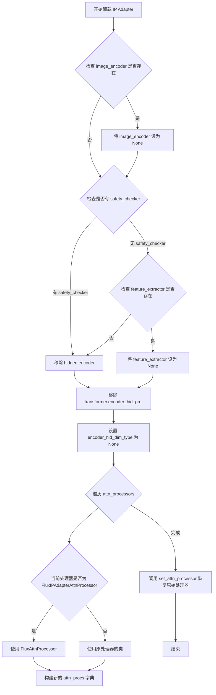

#### 带注释源码

```python
def unload_ip_adapter(self):
    """
    Unloads the IP Adapter weights

    Examples:

    ```python
    >>> # Assuming `pipeline` is already loaded with the IP Adapter weights.
    >>> pipeline.unload_ip_adapter()
    >>> ...
    ```
    """
    # 延迟导入以避免循环依赖，TODO: 1.0.0 版本后可移至顶部
    from ..models.transformers.transformer_flux import FluxAttnProcessor, FluxIPAdapterAttnProcessor

    # 移除 CLIP 图像编码器
    # 检查对象是否有 image_encoder 属性且不为 None
    if hasattr(self, "image_encoder") and getattr(self, "image_encoder", None) is not None:
        # 将图像编码器置空
        self.image_encoder = None
        # 同时更新配置中的 image_encoder 为 [None, None]
        self.register_to_config(image_encoder=[None, None])

    # 仅当 safety_checker 不存在时才移除特征提取器
    # 因为 safety_checker 后续会使用 feature_extractor
    if not hasattr(self, "safety_checker"):
        # 检查特征提取器是否存在
        if hasattr(self, "feature_extractor") and getattr(self, "feature_extractor", None) is not None:
            # 将特征提取器置空
            self.feature_extractor = None
            # 同时更新配置
            self.register_to_config(feature_extractor=[None, None])

    # 移除隐藏编码器投影
    # 将 encoder_hid_proj 置空
    self.transformer.encoder_hid_proj = None
    # 重置编码器隐藏维度类型配置
    self.transformer.config.encoder_hid_dim_type = None

    # 恢复原始 Transformer 注意力处理器层
    # 遍历所有注意力处理器
    attn_procs = {}
    for name, value in self.transformer.attn_processors.items():
        # 默认使用 FluxAttnProcessor
        attn_processor_class = FluxAttnProcessor()
        # 如果当前处理器是 IP Adapter 类型，则替换为 FluxAttnProcessor
        # 否则保留原来的处理器类
        attn_procs[name] = (
            attn_processor_class if isinstance(value, FluxIPAdapterAttnProcessor) else value.__class__()
        )
    # 应用新的注意力处理器配置
    self.transformer.set_attn_processor(attn_procs)
```


### `SD3IPAdapterMixin.is_ip_adapter_active`

该属性方法用于检查 Stable Diffusion 3 IP-Adapter 是否已加载且至少有一个注意力处理器的 scale 值大于 0，从而判断图像提示条件是否在推理过程中生效。

参数： 无

返回值：`bool`，当 IP-Adapter 已加载且任意层的 scale 值大于 0 时返回 `True`，否则返回 `False`

#### 流程图

```mermaid
flowchart TD
    A[开始] --> B[获取 transformer.attn_processors.values]
    B --> C[遍历所有注意力处理器]
    C --> D{当前处理器是否为 SD3IPAdapterJointAttnProcessor2_0 类型?}
    D -->|是| E[收集该处理器的 scale 值到列表]
    D -->|否| F[继续下一个处理器]
    E --> F
    F --> G{还有更多处理器?}
    G -->|是| C
    G -->|否| H{scales 列表长度 > 0?}
    H -->|否| I[返回 False]
    H -->|是| J{列表中是否存在 scale > 0 的值?}
    J -->|是| K[返回 True]
    J -->|否| I
```

#### 带注释源码

```python
@property
def is_ip_adapter_active(self) -> bool:
    """Checks if IP-Adapter is loaded and scale > 0.

    IP-Adapter scale controls the influence of the image prompt versus text prompt. When this value is set to 0,
    the image context is irrelevant.

    Returns:
        `bool`: True when IP-Adapter is loaded and any layer has scale > 0.
    """
    # 从 transformer 的所有注意力处理器中筛选出 SD3IPAdapterJointAttnProcessor2_0 类型
    # 的处理器，并收集它们的 scale 值到一个列表中
    scales = [
        attn_proc.scale
        for attn_proc in self.transformer.attn_processors.values()
        if isinstance(attn_proc, SD3IPAdapterJointAttnProcessor2_0)
    ]

    # 判断条件：1) 至少存在一个 SD3IPAdapterJointAttnProcessor2_0 处理器
    #          2) 至少有一个处理器的 scale 值大于 0
    return len(scales) > 0 and any(scale > 0 for scale in scales)
```


### `SD3IPAdapterMixin.load_ip_adapter`

该方法用于将IP-Adapter权重加载到Stable Diffusion 3模型的transformer中，支持从预训练模型或状态字典加载，并自动处理图像编码器和特征提取器的加载。

参数：

- `pretrained_model_name_or_path_or_dict`：`str | dict[str, torch.Tensor]`，模型ID、目录路径或包含权重的状态字典
- `weight_name`：`str`，默认为"ip-adapter.safetensors"，要加载的权重文件名
- `subfolder`：`str | None`，模型仓库或本地目录中的子文件夹路径
- `image_encoder_folder`：`str | None`，默认为"image_encoder"，图像编码器所在的子文件夹
- `**kwargs`：其他可选参数，包括cache_dir、force_download、proxies、local_files_only、token、revision、low_cpu_mem_usage

返回值：`None`，该方法直接修改实例状态，无返回值

#### 流程图

```mermaid
flowchart TD
    A[开始 load_ip_adapter] --> B{从kwargs提取参数}
    B --> C{检查 low_cpu_mem_usage}
    C --> D{accelerate可用?}
    D -->|是| E[保持 low_cpu_mem_usage]
    D -->|否| F[设False并警告]
    E --> G{PyTorch版本>=1.9?}
    F --> G
    G -->|是| H[构建user_agent]
    G -->|否| I[抛出NotImplementedError]
    H --> J{pretrained_model_name_or_path_or_dict是dict?}
    J -->|否| K[调用_get_model_file获取模型文件]
    J -->|是| L[直接作为state_dict]
    K --> M{weight_name以.safetensors结尾?}
    M -->|是| N[用safe_open加载为image_proj和ip_adapter]
    M -->|否| O[调用load_state_dict加载]
    N --> P[验证必需键image_proj和ip_adapter]
    O --> P
    L --> P
    P --> Q{image_encoder未注册?}
    Q -->|是| R{image_encoder_folder非空?}
    R -->|是| S{pretrained_model是dict?}
    R -->|否| T[记录警告]
    S -->|否| U[加载SiglipImageProcessor]
    S -->|是| V[抛出ValueError]
    U --> W[加载SiglipVisionModel并注册模块]
    Q -->|否| X[transformer._load_ip_adapter_weights]
    T --> X
    V --> X
    W --> X
    X --> Y[结束]
```

#### 带注释源码

```python
@validate_hf_hub_args
def load_ip_adapter(
    self,
    pretrained_model_name_or_path_or_dict: str | dict[str, torch.Tensor],
    weight_name: str = "ip-adapter.safetensors",
    subfolder: str | None = None,
    image_encoder_folder: str | None = "image_encoder",
    **kwargs,
) -> None:
    """
    Parameters:
        pretrained_model_name_or_path_or_dict (`str` or `os.PathLike` or `dict`):
            Can be either:
                - A string, the *model id* (for example `google/ddpm-celebahq-256`) of a pretrained model hosted on
                  the Hub.
                - A path to a *directory* (for example `./my_model_directory`) containing the model weights saved
                  with [`ModelMixin.save_pretrained`].
                - A [torch state
                  dict](https://pytorch.org/tutorials/beginner/saving_loading_models.html#what-is-a-state-dict).
        weight_name (`str`, defaults to "ip-adapter.safetensors"):
            The name of the weight file to load. If a list is passed, it should have the same length as
            `subfolder`.
        subfolder (`str`, *optional*):
            The subfolder location of a model file within a larger model repository on the Hub or locally. If a
            list is passed, it should have the same length as `weight_name`.
        image_encoder_folder (`str`, *optional*, defaults to `image_encoder`):
            The subfolder location of the image encoder within a larger model repository on the Hub or locally.
            Pass `None` to not load the image encoder. If the image encoder is located in a folder inside
            `subfolder`, you only need to pass the name of the folder that contains image encoder weights, e.g.
            `image_encoder_folder="image_encoder"`. If the image encoder is located in a folder other than
            `subfolder`, you should pass the path to the folder that contains image encoder weights, for example,
            `image_encoder_folder="different_subfolder/image_encoder"`.
        cache_dir (`str | os.PathLike`, *optional*):
            Path to a directory where a downloaded pretrained model configuration is cached if the standard cache
            is not used.
        force_download (`bool`, *optional*, defaults to `False`):
            Whether or not to force the (re-)download of the model weights and configuration files, overriding the
            cached versions if they exist.
        proxies (`dict[str, str]`, *optional*):
            A dictionary of proxy servers to use by protocol or endpoint, for example, `{'http': 'foo.bar:3128',
            'http://hostname': 'foo.bar:4012'}`. The proxies are used on each request.
        local_files_only (`bool`, *optional*, defaults to `False`):
            Whether to only load local model weights and configuration files or not. If set to `True`, the model
            won't be downloaded from the Hub.
        token (`str` or *bool*, *optional*):
            The token to use as HTTP bearer authorization for remote files. If `True`, the token generated from
            `diffusers-cli login` (stored in `~/.huggingface`) is used.
        revision (`str`, *optional*, defaults to `"main"`):
            The specific model version to use. It can be a branch name, a tag name, a commit id, or any identifier
            allowed by Git.
        low_cpu_mem_usage (`bool`, *optional*, defaults to `True` if torch version >= 1.9.0 else `False`):
            Speed up model loading only loading the pretrained weights and not initializing the weights. This also
            tries to not use more than 1x model size in CPU memory (including peak memory) while loading the model.
            Only supported for PyTorch >= 1.9.0. If you are using an older version of PyTorch, setting this
            argument to `True` will raise an error.
    """
    # 从kwargs中提取各种加载参数
    cache_dir = kwargs.pop("cache_dir", None)
    force_download = kwargs.pop("force_download", False)
    proxies = kwargs.pop("proxies", None)
    local_files_only = kwargs.pop("local_files_only", None)
    token = kwargs.pop("token", None)
    revision = kwargs.pop("revision", None)
    low_cpu_mem_usage = kwargs.pop("low_cpu_mem_usage", _LOW_CPU_MEM_USAGE_DEFAULT)

    # 检查accelerate库是否可用，如果不可用则禁用低内存加载
    if low_cpu_mem_usage and not is_accelerate_available():
        low_cpu_mem_usage = False
        logger.warning(
            "Cannot initialize model with low cpu memory usage because `accelerate` was not found in the"
            " environment. Defaulting to `low_cpu_mem_usage=False`. It is strongly recommended to install"
            " `accelerate` for faster and less memory-intense model loading. You can do so with: \n```\npip"
            " install accelerate\n```\n."
        )

    # 检查PyTorch版本是否支持低内存加载
    if low_cpu_mem_usage is True and not is_torch_version(">=", "1.9.0"):
        raise NotImplementedError(
            "Low memory initialization requires torch >= 1.9.0. Please either update your PyTorch version or set"
            " `low_cpu_mem_usage=False`."
        )

    # 构建用户代理信息用于模型下载追踪
    user_agent = {"file_type": "attn_procs_weights", "framework": "pytorch"}

    # 根据输入类型决定如何加载模型权重
    if not isinstance(pretrained_model_name_or_path_or_dict, dict):
        # 从模型仓库或本地路径获取模型文件
        model_file = _get_model_file(
            pretrained_model_name_or_path_or_dict,
            weights_name=weight_name,
            cache_dir=cache_dir,
            force_download=force_download,
            proxies=proxies,
            local_files_only=local_files_only,
            token=token,
            revision=revision,
            subfolder=subfolder,
            user_agent=user_agent,
        )
        # 处理safetensors格式的权重文件
        if weight_name.endswith(".safetensors"):
            state_dict = {"image_proj": {}, "ip_adapter": {}}
            with safe_open(model_file, framework="pt", device="cpu") as f:
                for key in f.keys():
                    if key.startswith("image_proj."):
                        state_dict["image_proj"][key.replace("image_proj.", "")] = f.get_tensor(key)
                    elif key.startswith("ip_adapter."):
                        state_dict["ip_adapter"][key.replace("ip_adapter.", "")] = f.get_tensor(key)
        else:
            # 加载其他格式的权重文件
            state_dict = load_state_dict(model_file)
    else:
        # 直接使用传入的状态字典
        state_dict = pretrained_model_name_or_path_or_dict

    # 验证状态字典包含必需的键
    keys = list(state_dict.keys())
    if "image_proj" not in keys and "ip_adapter" not in keys:
        raise ValueError("Required keys are (`image_proj` and `ip_adapter`) missing from the state dict.")

    # 如果图像编码器尚未注册，则加载图像编码器和特征提取器
    if hasattr(self, "image_encoder") and getattr(self, "image_encoder", None) is None:
        if image_encoder_folder is not None:
            if not isinstance(pretrained_model_name_or_path_or_dict, dict):
                logger.info(f"loading image_encoder from {pretrained_model_name_or_path_or_dict}")
                # 确定图像编码器的子文件夹路径
                if image_encoder_folder.count("/") == 0:
                    image_encoder_subfolder = Path(subfolder, image_encoder_folder).as_posix()
                else:
                    image_encoder_subfolder = Path(image_encoder_folder).as_posix()

                # 加载图像编码器和图像处理器的公共参数
                kwargs = {
                    "low_cpu_mem_usage": low_cpu_mem_usage,
                    "cache_dir": cache_dir,
                    "local_files_only": local_files_only,
                }

                # 注册特征提取器和图像编码器模块
                self.register_modules(
                    feature_extractor=SiglipImageProcessor.from_pretrained(image_encoder_subfolder, **kwargs),
                    image_encoder=SiglipVisionModel.from_pretrained(
                        image_encoder_subfolder, torch_dtype=self.dtype, **kwargs
                    ).to(self.device),
                )
            else:
                raise ValueError(
                    "`image_encoder` cannot be loaded because `pretrained_model_name_or_path_or_dict` is a state dict."
                )
        else:
            logger.warning(
                "image_encoder is not loaded since `image_encoder_folder=None` passed. You will not be able to use `ip_adapter_image` when calling the pipeline with IP-Adapter."
                "Use `ip_adapter_image_embeds` to pass pre-generated image embedding instead."
            )

    # 将IP-Adapter权重加载到transformer中
    self.transformer._load_ip_adapter_weights(state_dict, low_cpu_mem_usage=low_cpu_mem_usage)
```


### `SD3IPAdapterMixin.set_ip_adapter_scale`

该方法用于设置 Stable Diffusion 3 IP-Adapter 的缩放比例，控制图像提示条件的强度。值为 1.0 表示仅根据图像提示进行条件生成，值为 0.0 表示仅根据文本提示进行条件生成。

参数：

- `scale`：`float`，IP-Adapter 的缩放比例值

返回值：`None`，该方法无返回值，直接修改注意力处理器的 scale 属性

#### 流程图

```mermaid
flowchart TD
    A[开始 set_ip_adapter_scale] --> B[获取 self.transformer]
    B --> C[遍历 transformer.attn_processors 的所有注意力处理器]
    C --> D{当前处理器是否为 SD3IPAdapterJointAttnProcessor2_0 类型?}
    D -->|是| E[将处理器的 scale 属性设置为输入的 scale 值]
    D -->|否| F[跳过该处理器]
    E --> G{是否还有更多处理器?}
    F --> G
    G -->|是| C
    G -->|否| H[结束]
```

#### 带注释源码

```python
def set_ip_adapter_scale(self, scale: float) -> None:
    """
    设置 IP-Adapter 缩放比例，用于控制图像提示条件的强度。
    值为 1.0 表示仅根据图像提示进行条件生成，
    值为 0.0 表示仅根据文本提示进行条件生成。
    降低此值会鼓励模型生成更多样化的图像，但可能与图像提示的对齐度较低。

    示例:
    >>> # 假设 pipeline 已加载 IP Adapter 权重
    >>> pipeline.set_ip_adapter_scale(0.6)

    参数:
        scale (float):
            要设置的 IP-Adapter 缩放比例值
    """
    # 遍历 transformer 中的所有注意力处理器
    for attn_processor in self.transformer.attn_processors.values():
        # 仅对 SD3 专用的 IP-Adapter 注意力处理器设置缩放值
        if isinstance(attn_processor, SD3IPAdapterJointAttnProcessor2_0):
            attn_processor.scale = scale
```


### `SD3IPAdapterMixin.unload_ip_adapter`

该方法用于从Stable Diffusion 3 pipeline中卸载IP Adapter权重，包括移除图像编码器、特征提取器、图像投影模块，并将注意力处理器恢复为原始状态。

参数： 无

返回值：`None`，无返回值描述

#### 流程图

```mermaid
flowchart TD
    A[开始 unload_ip_adapter] --> B{是否存在 image_encoder}
    B -->|是| C[设置 image_encoder = None]
    C --> D[注册到配置: image_encoder=None]
    D --> E{是否存在 feature_extractor}
    B -->|否| E
    E -->|是| F[设置 feature_extractor = None]
    F --> G[注册到配置: feature_extractor=None]
    E -->|否| H
    H[设置 transformer.image_proj = None] --> I[遍历 transformer.attn_processors]
    I --> J{当前处理器是 SD3IPAdapterJointAttnProcessor2_0?}
    J -->|是| K[替换为 JointAttnProcessor2_0]
    J -->|否| L[保持原处理器类]
    K --> M[构建新的处理器字典]
    L --> M
    M --> N[调用 transformer.set_attn_processor]
    N --> O[结束]
```

#### 带注释源码

```python
def unload_ip_adapter(self) -> None:
    """
    Unloads the IP Adapter weights.

    Example:

    ```python
    >>> # Assuming `pipeline` is already loaded with the IP Adapter weights.
    >>> pipeline.unload_ip_adapter()
    >>> ...
    ```
    """
    # 移除图像编码器（如果存在）
    # 检查对象是否具有 image_encoder 属性且不为 None
    if hasattr(self, "image_encoder") and getattr(self, "image_encoder", None) is not None:
        # 将图像编码器置空，释放相关内存
        self.image_encoder = None
        # 将配置中的 image_encoder 也设置为 None
        self.register_to_config(image_encoder=None)

    # 移除特征提取器（如果存在）
    # 检查对象是否具有 feature_extractor 属性且不为 None
    if hasattr(self, "feature_extractor") and getattr(self, "feature_extractor", None) is not None:
        # 将特征提取器置空，释放相关内存
        self.feature_extractor = None
        # 将配置中的 feature_extractor 也设置为 None
        self.register_to_config(feature_extractor=None)

    # 移除图像投影模块
    # IP Adapter 的图像投影层用于将图像编码器输出转换为潜在空间
    self.transformer.image_proj = None

    # 恢复原始注意力处理器层
    # 遍历所有注意力处理器，将 IP Adapter 专用处理器替换回原始处理器
    attn_procs = {
        name: (
            # 如果当前是 SD3IPAdapterJointAttnProcessor2_0，则替换为标准 JointAttnProcessor2_0
            JointAttnProcessor2_0() if isinstance(value, SD3IPAdapterJointAttnProcessor2_0) 
            # 否则保持原有处理器类型
            else value.__class__()
        )
        for name, value in self.transformer.attn_processors.items()
    }
    # 应用新的注意力处理器配置
    self.transformer.set_attn_processor(attn_procs)
```

## 关键组件


### 张量索引与惰性加载

使用 `safe_open` 从 safetensors 文件中按需加载张量，仅在调用 `f.get_tensor(key)` 时读取对应张量数据，避免一次性加载整个权重文件到内存。代码通过检查 key 前缀（`image_proj.`、`ip_adapter.`）进行分类索引，实现惰性加载机制。

### 反量化支持

支持从多种格式加载权重：safetensors 格式使用 safe_open 读取，pytorch 格式使用 `load_state_dict` 加载。针对 Flux 模型还处理了 key 名称映射（如 `ip_adapter_double_stream_k_proj` 转换为 `to_k_ip`），实现跨格式的权重兼容。

### 量化策略

使用 `low_cpu_mem_usage` 参数控制模型加载时的内存占用，通过 `accelerate` 库实现低内存加载。同时支持 `torch_dtype` 参数，允许指定图像编码器的精度（如 `torch.float16`）。

### 多IP Adapter支持

通过 `weight_name`、`subfolder`、`pretrained_model_name_or_path_or_dict` 的列表形式，支持同时加载多个 IP Adapter。使用 `zip` 遍历所有配置，分别加载对应的权重到 `state_dicts` 列表中。

### LoRA权重处理

通过 `unet._load_ip_adapter_loras()` 加载 Face ID 类型的 LoRA 权重，并使用 PEFT backend 的 `load_lora_weights` 和 `set_adapters` 方法应用这些权重，实现 Face ID 相关的条件注入。

### 图像编码器动态加载

根据不同模型类型（CLIP 或 Siglip）动态加载对应的图像编码器（`CLIPVisionModelWithProjection` 或 `SiglipVisionModel`）和特征提取器（`CLIPImageProcessor` 或 `SiglipImageProcessor`），并在加载前检查是否已存在该模块。

### 注意力处理器管理

通过 `set_attn_processor` 方法动态替换注意力处理器为 IP Adapter 专用的处理器（`IPAdapterAttnProcessor`、`IPAdapterAttnProcessor2_0`、`IPAdapterXFormersAttnProcessor`、`FluxIPAdapterAttnProcessor`、`SD3IPAdapterJointAttnProcessor2_0`），支持按需切换。


## 问题及建议


### 已知问题

- **大量代码重复**: `IPAdapterMixin`、`ModularIPAdapterMixin` 和 `FluxIPAdapterMixin` 三个类中 `load_ip_adapter`、`set_ip_adapter_scale` 和 `unload_ip_adapter` 方法的实现存在大量重复代码，特别是列表输入处理逻辑和 safetensors 加载逻辑。
- **API 参数不一致**: 不同 Mixin 类的 `load_ip_adapter` 方法参数命名不一致，如 `image_encoder_folder` vs `image_encoder_pretrained_model_name_or_path`，且默认值各不相同（如 `image_encoder_folder: str | None = "image_encoder"` 在不同类中行为不同）。
- **属性访问方式不统一**: 有的地方使用 `getattr(self, self.unet_name)`，有的直接使用 `self.unet`，有的使用 `getattr(self, "unet_name", "unet")`，缺乏一致性。
- **类型提示不完整**: `set_ip_adapter_scale` 方法在部分类中缺少返回类型声明（如 `-> None`），且 `scale` 参数的类型定义在不同类中不一致（`float | list[float]` vs `float | list[float] | list[list[float]]`）。
- **缺少前置条件检查**: `FluxIPAdapterMixin.set_ip_adapter_scale` 方法在设置 scale 前没有验证 IP Adapter 是否已加载，可能导致运行时错误。
- **硬编码值**: `default_clip_size = 224` 被硬编码在多处，且图像投影和 IP Adapter 的 key 字符串（如 `"image_proj"`、`"ip_adapter"`）在代码中重复出现。
- **内存优化不彻底**: 状态字典被累积到 `state_dicts` 列表中然后一次性处理，而不是增量处理，可能在加载多个 IP Adapter 时导致内存峰值。
- **TODO 注释未处理**: `FluxIPAdapterMixin.unload_ip_adapter` 方法中有 TODO 注释表明存在待完成的弃用处理工作。

### 优化建议

- **提取基类**: 创建一个抽象基类 `BaseIPAdapterMixin`，将通用的加载、设置和卸载逻辑抽取出来，减少代码重复。
- **统一 API 设计**: 标准化 `load_ip_adapter` 的参数命名和默认值，确保不同模型（SD、SD3、Flux）的 IP Adapter 接口一致。
- **添加类型提示**: 为所有方法添加完整的类型提示，特别是返回类型和复杂参数类型。
- **前置条件验证**: 在 `set_ip_adapter_scale` 方法开始时添加 IP Adapter 加载状态检查，并在 `unload_ip_adapter` 前检查是否已加载。
- **常量定义**: 将魔法字符串和硬编码值提取为模块级常量，如 `IMAGE_PROJ_KEY = "image_proj"`、`IP_ADAPTER_KEY = "ip_adapter"`。
- **增量加载优化**: 考虑重构状态字典加载逻辑，避免一次性将所有状态字典存储在内存中。
- **处理 TODO**: 解决 `FluxIPAdapterMixin.unload_ip_adapter` 中的 TODO 注释，完成 1.0.0 弃用相关的处理工作。

## 其它


### 设计目标与约束

本模块旨在为 Diffusers .pipeline 提供 IP Adapter（图像提示适配器）支持，使模型能够根据输入图像生成条件化的输出。核心设计目标包括：1）支持多种模型架构（标准 Unet、Flux、Stable Diffusion 3）；2）支持多个 IP Adapter 同时加载；3）通过 LoRA 机制支持 Face ID 适配；4）支持权重热加载与卸载。技术约束包括：PyTorch >= 1.9.0（低内存加载模式），accelerate 库（推荐用于内存优化），safetensors 或 PyTorch 格式的权重文件。

### 错误处理与异常设计

主要异常场景及处理方式：1）参数校验异常：当 `weight_name`、`pretrained_model_name_or_path_or_dict`、`subfolder` 长度不一致时抛出 `ValueError`；2）状态字典缺失键：若 `state_dict` 缺少必需的 `image_proj` 或 `ip_adapter` 键，抛出 `ValueError`；3）不支持的 PyTorch 版本：当 `low_cpu_mem_usage=True` 但 PyTorch < 1.9.0 时抛出 `NotImplementedError`；4）加速库缺失：若未安装 `accelerate` 库，降级至 `low_cpu_mem_usage=False` 并发出警告；5）状态字典加载失败：当 `pretrained_model_name_or_path_or_dict` 为 dict 类型但尝试加载 `image_encoder` 时抛出 `ValueError`。

### 数据流与状态机

**load_ip_adapter 流程**：1）参数规范化（列表展开）；2）获取模型文件路径；3）加载状态字典（支持 safetensors 和 PyTorch 格式）；4）加载图像编码器（可选）；5）创建特征提取器；6）调用 `unet.transformer._load_ip_adapter_weights` 加载权重；7）处理额外的 LoRA 权重（Face ID）。**set_ip_adapter_scale 流程**：1）规范化 scale 参数；2）调用 `_maybe_expand_lora_scales` 展开配置；3）遍历注意力处理器，匹配并设置 scale。**unload_ip_adapter 流程**：1）移除图像编码器；2）移除特征提取器；3）清除 encoder_hid_proj；4）恢复原始注意力处理器。

### 外部依赖与接口契约

**核心依赖**：torch、transformers（CLIPImageProcessor、CLIPVisionModelWithProjection、SiglipImageProcessor、SiglipVisionModel）、huggingface_hub、safetensors、diffusers 内部模块（modeling_utils、attention_processor、unet_loader_utils）。**接口契约**：调用类需提供 `unet` 或 `unet_name` 属性、`device` 属性、`dtype` 属性；`image_encoder` 和 `feature_extractor` 为可选模块；通过 `register_modules` 方法注册子模块；通过 `register_to_config` 方法更新配置。

### 配置与持久化

IP Adapter 状态通过以下方式持久化：1）模型权重文件（safetensors/pyTorch）；2）配置文件（通过 `register_to_config` 存储 `image_encoder`、`feature_extractor` 为 None）；3）注意力处理器状态（scale 值存储在 `IPAdapterAttnProcessor.scale` 属性中）。卸载时需完整恢复所有修改的配置项。

### 性能考量

1）低内存加载模式：使用 `low_cpu_mem_usage=True` 可显著减少 CPU 内存占用；2）safetensors 格式优先：相比 PyTorch 格式，safetensors 加载更快且内存效率更高；3）批量加载：支持一次性加载多个 IP Adapter，减少重复 IO 操作；4）模型设备迁移：加载时需注意图像编码器的设备转换（`.to(self.device)`）。

### 安全性考虑

1）远程文件授权：支持通过 `token` 参数进行 HuggingFace Hub 认证；2）本地文件模式：`local_files_only=True` 可限制仅使用本地缓存；3）代理支持：`proxies` 参数用于企业环境；4）状态字典安全验证：检查必需的键是否存在，防止不完整的权重文件导致运行时错误。

### 兼容性矩阵

| 模型架构 | IP Adapter 版本 | 图像编码器 | LoRA 支持 | 注意力处理器 |
|---------|---------------|-----------|-----------|-------------|
| SD/SDXL | v1 | CLIP | Face ID | IPAdapterAttnProcessor2_0 |
| Flux | v1 | CLIP | 否 | FluxIPAdapterAttnProcessor |
| SD3 | v2 | SigLIP | 否 | SD3IPAdapterJointAttnProcessor2_0 |

### 版本迁移说明

代码中存在 TODO 注释：`# TODO: once the 1.0.0 deprecations are in, we can move the imports to top-level`，表明未来版本可能将 `FluxAttnProcessor` 和 `FluxIPAdapterAttnProcessor` 的导入移至模块顶层。此外，Face ID LoRA 功能依赖 PEFT 后端，若未安装将仅发出警告而不加载权重。

    