# `diffusers\src\diffusers\loaders\lora_base.py` 详细设计文档

这是一个用于管理扩散模型管线中低秩适配（LoRA）权重的混入类（Mixin），提供了加载、保存、融合、卸载和切换LoRA适配器的核心功能，支持Diffusers原生模型（如UNet）和HuggingFace Transformers模型（如Text Encoder）。

## 整体流程

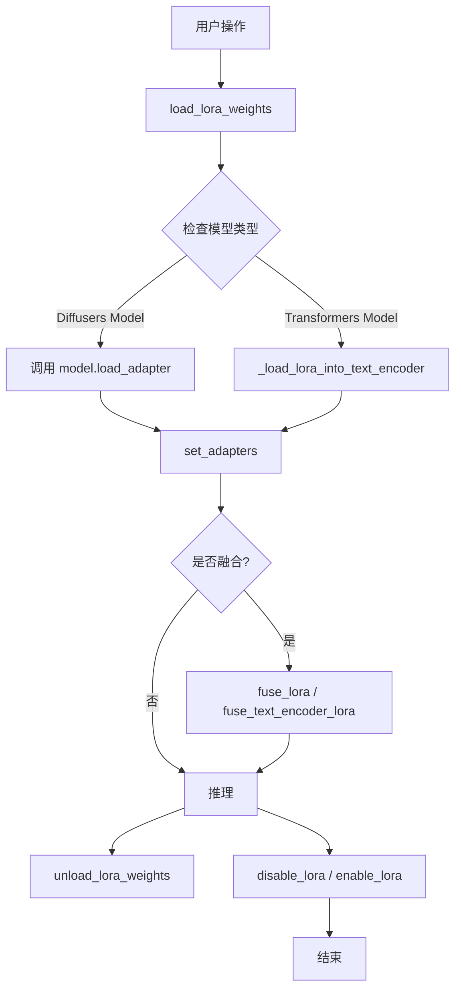

## 类结构

```
LoraBaseMixin (核心混入类)
├── 依赖: ModelMixin (Diffusers UNet/Transformer)
├── 依赖: PreTrainedModel (Transformers Text Encoder)
└── 依赖: BaseTunerLayer (PEFT Library)
```

## 全局变量及字段


### `LORA_WEIGHT_NAME`
    
LoRA权重文件名常量，指定PyTorch格式的.bin权重文件名称

类型：`str`
    


### `LORA_WEIGHT_NAME_SAFE`
    
LoRA权重文件名常量，指定SafeTensor格式的.safetensors权重文件名称

类型：`str`
    


### `LORA_ADAPTER_METADATA_KEY`
    
LoRA适配器元数据键名常量，用于在元数据字典中标识LoRA适配器信息

类型：`str`
    


### `logger`
    
模块级日志记录器对象，用于输出代码执行过程中的日志信息

类型：`logging.Logger`
    


### `LoraBaseMixin._lora_loadable_modules`
    
存储可加载LoRA权重的组件模块名称列表，如unet、text_encoder等

类型：`list`
    


### `LoraBaseMixin._merged_adapters`
    
存储已融合的适配器名称集合，用于跟踪哪些LoRA适配器已合并到模型中

类型：`set`
    


### `LoraBaseMixin._lora_scale`
    
LoRA缩放因子，用于控制LoRA权重对模型输出的影响程度

类型：`float`
    
    

## 全局函数及方法


### `fuse_text_encoder_lora`

将文本编码器的 LoRA（Low-Rank Adaptation）参数合并到原始模型参数中，实现 LoRA 权重的融合操作。该函数遍历文本编码器的所有模块，对支持 LoRA 的层进行权重合并，并可选地检查融合后的权重是否包含 NaN 值。

参数：

- `text_encoder`：`torch.nn.Module`，要融合 LoRA 的文本编码器模块。如果为 `None`，将尝试获取 `text_encoder` 属性。
- `lora_scale`：`float`，默认为 1.0，控制 LoRA 参数对输出的影响程度。
- `safe_fusing`：`bool`，默认为 `False`，是否在融合前检查融合后的权重是否包含 NaN 值，如果包含 NaN 则不进行融合。
- `adapter_names`：`list[str]` 或 `str`，要使用的适配器名称列表。

返回值：无（`None`），该函数直接修改传入的 `text_encoder` 模块，不返回任何值。

#### 流程图

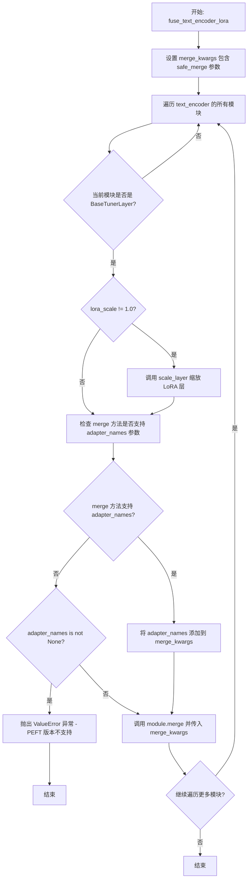

#### 带注释源码

```python
def fuse_text_encoder_lora(text_encoder, lora_scale=1.0, safe_fusing=False, adapter_names=None):
    """
    Fuses LoRAs for the text encoder.

    Args:
        text_encoder (`torch.nn.Module`):
            The text encoder module to set the adapter layers for. If `None`, it will try to get the `text_encoder`
            attribute.
        lora_scale (`float`, defaults to 1.0):
            Controls how much to influence the outputs with the LoRA parameters.
        safe_fusing (`bool`, defaults to `False`):
            Whether to check fused weights for NaN values before fusing and if values are NaN not fusing them.
        adapter_names (`list[str]` or `str`):
            The names of the adapters to use.
    """
    # 初始化 merge 参数字典，safe_merge 用于控制是否检查 NaN 值
    merge_kwargs = {"safe_merge": safe_fusing}

    # 遍历文本编码器的所有子模块
    for module in text_encoder.modules():
        # 只处理包含 BaseTunerLayer 的 LoRA 模块
        if isinstance(module, BaseTunerLayer):
            # 如果 lora_scale 不为 1.0，则先缩放 LoRA 层
            if lora_scale != 1.0:
                module.scale_layer(lora_scale)

            # 为了向后兼容之前的 PEFT 版本，需要检查 merge 方法的签名
            # 看是否支持 adapter_names 参数
            supported_merge_kwargs = list(inspect.signature(module.merge).parameters)
            
            # 如果 merge 方法支持 adapter_names 参数，则添加到 merge_kwargs
            if "adapter_names" in supported_merge_kwargs:
                merge_kwargs["adapter_names"] = adapter_names
            # 如果不支持且传入了 adapter_names，则抛出版本不兼容错误
            elif "adapter_names" not in supported_merge_kwargs and adapter_names is not None:
                raise ValueError(
                    "The `adapter_names` argument is not supported with your PEFT version. "
                    "Please upgrade to the latest version of PEFT. `pip install -U peft`"
                )

            # 执行 LoRA 权重融合操作
            module.merge(**merge_kwargs)
```


### `unfuse_text_encoder_lora`

该函数用于将文本编码器（text_encoder）中已融合的LoRA（Low-Rank Adaptation）权重进行解融合操作，使模型恢复到融合LoRA之前的状态。通过遍历文本编码器的所有模块，对每个包含LoRA适配器的层调用`unmerge()`方法来实现权重分离。

参数：

- `text_encoder`：`torch.nn.Module`，要进行LoRA解融合的文本编码器模块。如果为`None`，函数将尝试获取`text_encoder`属性。

返回值：`None`，该函数直接修改传入的`text_encoder`模块，不返回任何值。

#### 流程图

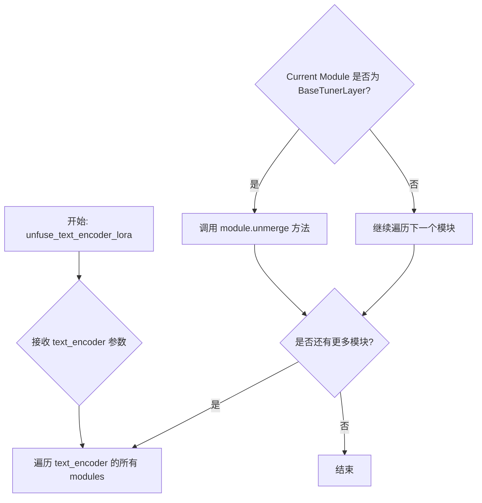

#### 带注释源码

```python
def unfuse_text_encoder_lora(text_encoder):
    """
    Unfuses LoRAs for the text encoder.

    Args:
        text_encoder (`torch.nn.Module`):
            The text encoder module to set the adapter layers for. If `None`, it will try to get the `text_encoder`
            attribute.
    """
    # 遍历文本编码器中的所有模块
    for module in text_encoder.modules():
        # 检查当前模块是否为PEFT的BaseTunerLayer类型（即包含LoRA适配器的层）
        if isinstance(module, BaseTunerLayer):
            # 调用unmerge方法将融合的LoRA权重分离，恢复原始权重
            module.unmerge()
```

---

#### 关键组件信息

| 组件名称 | 描述 |
|---------|------|
| `BaseTunerLayer` | PEFT库中的基类，表示包含LoRA适配器层的抽象类型，用于判断模块是否包含可融合的LoRA权重 |
| `module.unmerge()` | PEFT中BaseTunerLayer的方法，用于将已融合的LoRA权重从模型参数中分离出来 |

#### 潜在的技术债务或优化空间

1. **缺少空值检查**：函数未对`text_encoder`参数进行`None`检查，可能导致在传入空值时抛出异常
2. **缺乏错误处理**：未对`unmerge()`调用过程中可能出现的异常进行捕获和处理
3. **与`fuse_text_encoder_lora`不对称**：对应的融合函数`fuse_text_encoder_lora`提供了`safe_fusing`参数进行安全融合检查，但解融合函数缺少类似的安全检查机制
4. **日志缺失**：函数执行过程中没有任何日志输出，难以追踪执行状态和调试问题


### `set_adapters_for_text_encoder`

该函数用于为文本编码器（text_encoder）设置和激活LoRA适配器层。它接收适配器名称列表和对应的权重值，将权重规范化为列表格式，并调用底层函数完成适配器的设置和激活。

参数：

- `adapter_names`：`list[str] | str`，要使用的适配器名称，可以是单个字符串或字符串列表
- `text_encoder`：`PreTrainedModel | None`，文本编码器模块，如果为`None`则抛出异常
- `text_encoder_weights`：`float | list[float] | list[None] | None`，适配器的权重值，如果为`None`则所有权重默认为`1.0`

返回值：无（`None`），该函数直接操作文本编码器模块，不返回任何值

#### 流程图

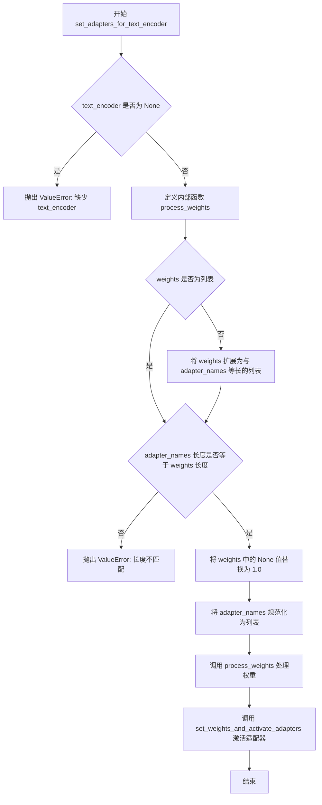

#### 带注释源码

```python
def set_adapters_for_text_encoder(
    adapter_names: list[str] | str,
    text_encoder: "PreTrainedModel" | None = None,  # noqa: F821
    text_encoder_weights: float | list[float] | list[None] | None = None,
):
    """
    Sets the adapter layers for the text encoder.

    Args:
        adapter_names (`list[str]` or `str`):
            The names of the adapters to use.
        text_encoder (`torch.nn.Module`, *optional*):
            The text encoder module to set the adapter layers for. If `None`, it will try to get the `text_encoder`
            attribute.
        text_encoder_weights (`list[float]`, *optional*):
            The weights to use for the text encoder. If `None`, the weights are set to `1.0` for all the adapters.
    """
    # 检查 text_encoder 是否为 None，如果是则抛出明确的错误信息
    if text_encoder is None:
        raise ValueError(
            "The pipeline does not have a default `pipe.text_encoder` class. Please make sure to pass a `text_encoder` instead."
        )

    def process_weights(adapter_names, weights):
        """
        处理权重参数，将其规范化为与适配器名称列表一一对应的格式
        
        Args:
            adapter_names: 适配器名称列表
            weights: 原始权重值（单个值或列表）
            
        Returns:
            处理后的权重列表
        """
        # 展开权重为列表，每个适配器一个权重值
        # 例如：2个适配器时: 7 -> [7,7] ; [3, None] -> [3, None]
        if not isinstance(weights, list):
            weights = [weights] * len(adapter_names)

        # 验证适配器名称数量与权重数量是否匹配
        if len(adapter_names) != len(weights):
            raise ValueError(
                f"Length of adapter names {len(adapter_names)} is not equal to the length of the weights {len(weights)}"
            )

        # 将 None 值替换为默认值 1.0
        # 例如：[7,7] -> [7,7] ; [3, None] -> [3,1]
        weights = [w if w is not None else 1.0 for w in weights]

        return weights

    # 将单个适配器名称字符串转换为列表
    adapter_names = [adapter_names] if isinstance(adapter_names, str) else adapter_names
    # 处理权重参数，生成标准化的权重列表
    text_encoder_weights = process_weights(adapter_names, text_encoder_weights)
    # 调用底层函数设置权重并激活适配器
    set_weights_and_activate_adapters(text_encoder, adapter_names, text_encoder_weights)
```


### `disable_lora_for_text_encoder`

该函数用于禁用文本编码器（Text Encoder）上的 LoRA（Low-Rank Adaptation）层。它检查文本编码器是否存在，如果不存在则抛出错误，否则调用 `set_adapter_layers` 将适配器层设置为禁用状态。

参数：

- `text_encoder`：`"PreTrainedModel" | None`，要禁用 LoRA 层的文本编码器模块。如果为 `None`，将尝试获取 `text_encoder` 属性。

返回值：`None`，该函数没有返回值，主要通过副作用生效。

#### 流程图

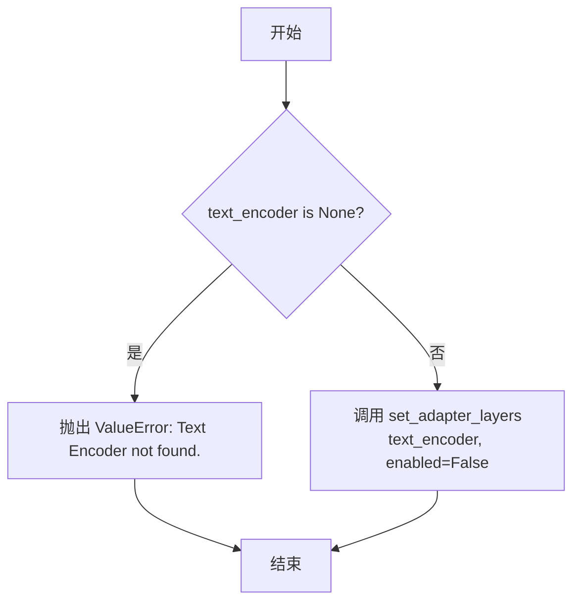

#### 带注释源码

```python
def disable_lora_for_text_encoder(text_encoder: "PreTrainedModel" | None = None):
    """
    Disables the LoRA layers for the text encoder.

    Args:
        text_encoder (`torch.nn.Module`, *optional*):
            The text encoder module to disable the LoRA layers for. If `None`, it will try to get the `text_encoder`
            attribute.
    """
    # 检查 text_encoder 是否为 None
    if text_encoder is None:
        # 如果为 None，抛出 ValueError 异常，提示未找到文本编码器
        raise ValueError("Text Encoder not found.")
    
    # 调用 set_adapter_layers 函数，传入 text_encoder 和 enabled=False
    # 该函数会将文本编码器上的所有适配器层设置为禁用状态
    set_adapter_layers(text_encoder, enabled=False)
```


### `enable_lora_for_text_encoder`

启用文本编码器（Text Encoder）的 LoRA（Low-Rank Adaptation）层，使 LoRA 适配器能够在文本编码器中生效。

参数：

-  `text_encoder`：`PreTrainedModel | None`，要启用 LoRA 层的文本编码器模块。如果为 `None`，则尝试获取 `text_encoder` 属性。

返回值：`None`，该函数没有返回值，主要通过副作用（调用 `set_adapter_layers`）生效。

#### 流程图

```mermaid
flowchart TD
    A[开始] --> B{text_encoder is None?}
    B -->|是| C[抛出 ValueError: Text Encoder not found.]
    B -->|否| D[调用 set_adapter_layers(text_encoder, enabled=True)]
    D --> E[结束]
```

#### 带注释源码

```python
def enable_lora_for_text_encoder(text_encoder: "PreTrainedModel" | None = None):
    """
    启用文本编码器的 LoRA 层。

    参数:
        text_encoder (`torch.nn.Module`, 可选):
            要启用 LoRA 层的文本编码器模块。如果为 `None`，将尝试获取 `text_encoder` 属性。
    """
    # 检查 text_encoder 是否为 None
    if text_encoder is None:
        # 如果为 None，抛出 ValueError 异常
        raise ValueError("Text Encoder not found.")
    
    # 调用 set_adapter_layers 工具函数，启用适配器层
    # enabled=True 表示启用 LoRA 层
    set_adapter_layers(text_encoder, enabled=True)
```


### `_remove_text_encoder_monkey_patch`

该函数用于移除文本编码器上的 LoRA（Low-Rank Adaptation）monkey patch，通过递归移除 PEFT 层并清理相关的配置属性，将文本编码器恢复到未应用 LoRA 的状态。

参数：

- `text_encoder`：`torch.nn.Module`（具体为 `PreTrainedModel`），需要进行 monkey patch 移除的文本编码器模块

返回值：`None`，该函数不返回任何值，仅执行清理操作

#### 流程图

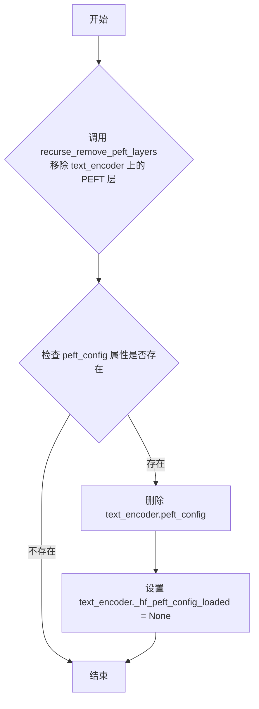

#### 带注释源码

```python
def _remove_text_encoder_monkey_patch(text_encoder):
    """
    移除文本编码器上的 LoRA monkey patch。
    
    该函数执行两个关键操作：
    1. 递归移除所有 PEFT 层
    2. 清理 text_encoder 的 peft_config 相关属性
    
    Args:
        text_encoder: 已被 monkey patch 的文本编码器模块
    """
    # 步骤1: 递归移除 text_encoder 上所有 PEFT/LoRA 层
    # 这个函数会遍历 text_encoder 的所有模块，移除由 PEFT 注入的适配器层
    recurse_remove_peft_layers(text_encoder)
    
    # 步骤2: 检查并清理 peft_config 属性
    # getattr 的第三个参数为默认值，防止属性不存在时抛出 AttributeError
    if getattr(text_encoder, "peft_config", None) is not None:
        # 删除 peft_config 字典属性
        # 这是 PEFT 存储适配器配置的核心属性
        del text_encoder.peft_config
        
        # 将 _hf_peft_config_loaded 设置为 None
        # 这个标志位用于指示是否有 PEFT 配置被加载到模型中
        text_encoder._hf_peft_config_loaded = None
```


### `_fetch_state_dict`

该函数负责从预训练模型路径或字典中加载LoRA权重文件的状态字典，支持`.safetensors`和`.bin`两种格式，并根据配置处理下载、缓存和元数据。

参数：

- `pretrained_model_name_or_path_or_dict`：`str` 或 `dict`，模型标识符（Hub ID、本地路径）或直接的状态字典
- `weight_name`：`str` 或 `None`，权重文件的名称（如`pytorch_lora_weights.safetensors`）
- `use_safetensors`：`bool`，是否优先使用safetensors格式加载
- `local_files_only`：`bool`，是否仅使用本地文件（离线模式）
- `cache_dir`：`str` 或 `None`，模型缓存目录
- `force_download`：`bool`，是否强制重新下载模型
- `proxies`：`dict` 或 `None`，HTTP代理配置
- `token`：`str` 或 `None`，Hub认证token
- `revision`：`str`，模型版本分支名
- `subfolder`：`str`，模型目录中的子文件夹路径
- `user_agent`：`str` 或 `dict`，HTTP请求的用户代理信息
- `allow_pickle`：`bool`，是否允许加载pickle格式的权重
- `metadata`：`dict` 或 `None`，（可选）状态字典的元数据

返回值：`tuple(dict, dict | None)`，返回加载的状态字典和对应的元数据（元数据可能为None）

#### 流程图

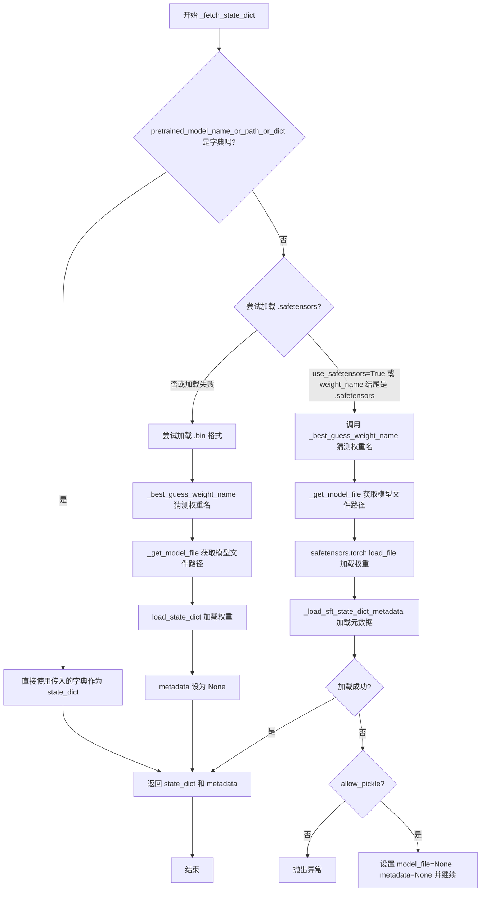

#### 带注释源码

```python
def _fetch_state_dict(
    pretrained_model_name_or_path_or_dict,
    weight_name,
    use_safetensors,
    local_files_only,
    cache_dir,
    force_download,
    proxies,
    token,
    revision,
    subfolder,
    user_agent,
    allow_pickle,
    metadata=None,
):
    """
    从预训练模型路径或字典中加载LoRA权重状态字典。
    
    支持两种加载方式：
    1. 直接传入字典（已经在内存中的权重）
    2. 从HuggingFace Hub或本地路径加载权重文件
    
    支持两种权重格式：
    - .safetensors (推荐，更安全)
    - .bin (PyTorch传统格式)
    
    参数:
        pretrained_model_name_or_path_or_dict: 模型ID/路径或状态字典
        weight_name: 权重文件名，为None时自动猜测
        use_safetensors: 是否优先使用safetensors
        local_files_only: 离线模式
        cache_dir: 缓存目录
        force_download: 强制下载
        proxies: HTTP代理
        token: HuggingFace Hub认证token
        revision: 模型版本
        subfolder: 子目录
        user_agent: 用户代理
        allow_pickle: 是否允许pickle加载
        metadata: 可选的元数据字典
    
    返回:
        (state_dict, metadata): 权重字典和元数据
    """
    model_file = None  # 初始化模型文件路径为None
    
    # 检查输入是否为字典类型，如果是则直接返回该字典作为state_dict
    if not isinstance(pretrained_model_name_or_path_or_dict, dict):
        # ======= 尝试加载 safetensors 格式 =======
        # 条件：use_safetensors=True 且未指定weight_name 
        # 或 weight_name 以 .safetensors 结尾
        if (use_safetensors and weight_name is None) or (
            weight_name is not None and weight_name.endswith(".safetensors")
        ):
            try:
                # 如果未指定weight_name，自动猜测最佳权重文件名
                # 放宽检查以支持更多Inference API场景
                if weight_name is None:
                    weight_name = _best_guess_weight_name(
                        pretrained_model_name_or_path_or_dict,
                        file_extension=".safetensors",
                        local_files_only=local_files_only,
                    )
                
                # 获取模型文件路径（处理下载、缓存等）
                model_file = _get_model_file(
                    pretrained_model_name_or_path_or_dict,
                    weights_name=weight_name or LORA_WEIGHT_NAME_SAFE,  # 默认使用safetensors文件名
                    cache_dir=cache_dir,
                    force_download=force_download,
                    proxies=proxies,
                    local_files_only=local_files_only,
                    token=token,
                    revision=revision,
                    subfolder=subfolder,
                    user_agent=user_agent,
                )
                
                # 使用safetensors库加载权重到CPU
                state_dict = safetensors.torch.load_file(model_file, device="cpu")
                # 加载safetensors文件中的元数据
                metadata = _load_sft_state_dict_metadata(model_file)

            # 捕获IO错误和safetensors相关异常
            except (IOError, safetensors.SafetensorError) as e:
                # 如果不允许pickle则抛出异常
                if not allow_pickle:
                    raise e
                # 否则尝试加载非safetensors格式的权重
                model_file = None
                metadata = None
                pass  # 继续执行后面的.bin加载逻辑

        # ======= safetensors加载失败或不需要加载时的处理 =======
        if model_file is None:
            # 如果未指定weight_name，猜测.bin格式的权重名
            if weight_name is None:
                weight_name = _best_guess_weight_name(
                    pretrained_model_name_or_path_or_dict, 
                    file_extension=".bin", 
                    local_files_only=local_files_only
                )
            
            # 获取.bin格式的模型文件
            model_file = _get_model_file(
                pretrained_model_name_or_path_or_dict,
                weights_name=weight_name or LORA_WEIGHT_NAME,  # 默认使用.bin文件名
                cache_dir=cache_dir,
                force_download=force_download,
                proxies=proxies,
                local_files_only=local_files_only,
                token=token,
                revision=revision,
                subfolder=subfolder,
                user_agent=user_agent,
            )
            
            # 使用通用load_state_dict函数加载权重
            state_dict = load_state_dict(model_file)
            # .bin格式不包含元数据
            metadata = None
    else:
        # 输入是字典类型，直接作为state_dict使用
        state_dict = pretrained_model_name_or_path_or_dict

    # 返回加载的状态字典和元数据
    return state_dict, metadata
```


### `_best_guess_weight_name`

该函数根据提供的模型路径或名称、文件扩展名以及离线模式标志，智能推断并返回最佳的权重文件名。它会过滤掉不符合条件的文件（如包含 scheduler、optimizer、checkpoint 的文件），优先选择 PyTorch 的 `.bin` 或 `.safetensors` 格式的 LoRA 权重文件。

参数：

-  `pretrained_model_name_or_path_or_dict`：`str | dict`，模型预训练名称、本地路径或包含状态字典的字典
-  `file_extension`：`.safetensors` 或 `.bin`，要查找的文件扩展名，默认为 `.safetensors`
-  `local_files_only`：`bool`，是否仅使用本地文件，默认为 `False`

返回值：`str | None`，最佳匹配的权重文件名，如果未找到则返回 `None`

#### 流程图

```mermaid
flowchart TD
    A[开始] --> B{local_files_only 或 HF_HUB_OFFLINE?}
    B -->|是| C[抛出 ValueError: 必须指定 weight_name]
    B -->|否| D{pretrained_model_name_or_path_or_dict 是文件?}
    D -->|是| E[返回 None]
    D -->|否| F{是目录?}
    F -->|是| G[列出目录中以 file_extension 结尾的文件]
    F -->|否| H[调用 model_info 获取仓库文件列表]
    H --> I[筛选以 file_extension 结尾的文件]
    G --> I
    I --> J{targeted_files 长度 == 0?}
    J -->|是| K[返回 None]
    J -->|否| L[过滤掉包含 scheduler, optimizer, checkpoint 的文件]
    L --> M{存在 LORA_WEIGHT_NAME?}
    M -->|是| N[只保留 LORA_WEIGHT_NAME]
    M -->|否| O{存在 LORA_WEIGHT_NAME_SAFE?}
    O -->|是| P[只保留 LORA_WEIGHT_NAME_SAFE]
    O -->|否| Q[保持原列表]
    N --> R
    P --> R
    Q --> R
    R{targeted_files 长度 > 1?}
    R -->|是| S[记录警告: 加载第一个文件]
    R -->|否| T
    S --> T
    T[返回 targeted_files[0]]
```

#### 带注释源码

```python
def _best_guess_weight_name(
    pretrained_model_name_or_path_or_dict, file_extension=".safetensors", local_files_only=False
):
    # 如果处于离线模式且未指定具体权重文件名，抛出错误
    # 因为离线模式下无法从 Hub 动态获取文件列表
    if local_files_only or HF_HUB_OFFLINE:
        raise ValueError("When using the offline mode, you must specify a `weight_name`.")

    targeted_files = []

    # 如果传入的是具体文件路径，直接返回 None（无文件可猜测）
    if os.path.isfile(pretrained_model_name_or_path_or_dict):
        return
    # 如果传入的是目录路径，列出目录中匹配扩展名的所有文件
    elif os.path.isdir(pretrained_model_name_or_path_or_dict):
        targeted_files = [f for f in os.listdir(pretrained_model_name_or_path_or_dict) if f.endswith(file_extension)]
    # 否则，假设传入的是 HuggingFace Hub 上的模型 ID，从远程获取文件列表
    else:
        files_in_repo = model_info(pretrained_model_name_or_path_or_dict).siblings
        targeted_files = [f.rfilename for f in files_in_repo if f.rfilename.endswith(file_extension)]
    
    # 如果没有找到任何匹配的文件，返回 None
    if len(targeted_files) == 0:
        return

    # 定义不允许的子字符串，用于过滤掉非 LoRA 检查点的文件
    # "scheduler" 不对应 LoRA 检查点
    # "optimizer" 不对应 LoRA 检查点
    # "checkpoint" 不是顶级检查点，排除其他检查点
    unallowed_substrings = {"scheduler", "optimizer", "checkpoint"}
    targeted_files = list(
        filter(lambda x: all(substring not in x for substring in unallowed_substrings), targeted_files)
    )

    # 优先选择特定格式的权重文件
    # 如果存在 .bin 格式的 LoRA 权重，只保留 .bin 文件
    if any(f.endswith(LORA_WEIGHT_NAME) for f in targeted_files):
        targeted_files = list(filter(lambda x: x.endswith(LORA_WEIGHT_NAME), targeted_files))
    # 否则，如果存在 .safetensors 格式的 LoRA 权重，只保留 .safetensors 文件
    elif any(f.endswith(LORA_WEIGHT_NAME_SAFE) for f in targeted_files):
        targeted_files = list(filter(lambda x: x.endswith(LORA_WEIGHT_NAME_SAFE), targeted_files))

    # 如果有多个匹配的文件，发出警告并选择第一个
    # 提示用户可以通过指定 weight_name 来精确控制
    if len(targeted_files) > 1:
        logger.warning(
            f"Provided path contains more than one weights file in the {file_extension} format. `{targeted_files[0]}` is going to be loaded, for precise control, specify a `weight_name` in `load_lora_weights`."
        )
    
    weight_name = targeted_files[0]
    return weight_name
```


### `_pack_dict_with_prefix`

该函数用于将状态字典（state_dict）中的所有键添加指定前缀，生成新的字典。主要用于在保存或加载 LoRA 权重时为不同组件的参数字典添加命名空间前缀，以便区分不同组件（如 UNet、Text Encoder 等）的参数。

参数：

- `state_dict`：`dict`，原始的状态字典，包含模型的参数字典
- `prefix`：`str`，要添加的前缀字符串，通常为组件名称（如 "unet"、"text_encoder" 等）

返回值：`dict`，带有指定前缀的键值对字典

#### 流程图

```mermaid
flowchart TD
    A[开始] --> B[遍历 state_dict 中的每个 key-value 对]
    B --> C[将 key 格式化为 '{prefix}.{key}' 格式]
    C --> D[构建新字典 sd_with_prefix]
    D --> E[返回 sd_with_prefix]
```

#### 带注释源码

```python
def _pack_dict_with_prefix(state_dict, prefix):
    """
    为状态字典的键添加前缀。

    Args:
        state_dict (dict): 原始的状态字典，例如 {'weight': tensor, 'bias': tensor}
        prefix (str): 要添加的前缀，例如 'unet' 或 'text_encoder'

    Returns:
        dict: 带有前缀的字典，例如 {'unet.weight': tensor, 'unet.bias': tensor}
    """
    # 使用字典推导式遍历原始字典的所有键值对
    # 将每个键格式化为 '{prefix}.{key}' 的形式
    sd_with_prefix = {f"{prefix}.{key}": value for key, value in state_dict.items()}
    return sd_with_prefix
```


### `_load_lora_into_text_encoder`

该函数用于将LoRA（Low-Rank Adaptation）权重加载到文本编码器（text_encoder）中，支持多种配置选项，包括适配器管理、内存优化、热交换等功能。

参数：

- `state_dict`：`dict`，包含LoRA权重的状态字典
- `network_alphas`：`dict | None`，可选的网络alpha值，用于调整LoRA权重
- `text_encoder`：`torch.nn.Module`，目标文本编码器模块
- `prefix`：`str | None`，状态字典中权重键的前缀，默认为`text_encoder_name`
- `lora_scale`：`float`，LoRA权重缩放因子，默认为1.0
- `text_encoder_name`：`str`，文本编码器名称，默认为"text_encoder"
- `adapter_name`：`str | None`，适配器名称，如为None则自动获取
- `_pipeline`：`DiffusionPipeline | None`，可选的扩散管道对象，用于处理模型卸载
- `low_cpu_mem_usage`：`bool`，是否启用低内存使用模式，默认为False
- `hotswap`：`bool`，是否启用热交换模式，默认为False
- `metadata`：`dict | None`，可选的元数据字典

返回值：`None`，该函数直接修改text_encoder模块，不返回任何值

#### 流程图

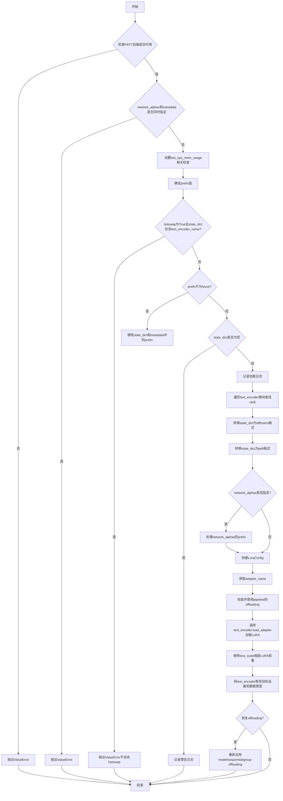

#### 带注释源码

```python
def _load_lora_into_text_encoder(
    state_dict,                      # 包含LoRA权重的状态字典
    network_alphas,                 # 可选的网络alpha值
    text_encoder,                   # 目标文本编码器模块
    prefix=None,                    # 状态字典键的前缀
    lora_scale=1.0,                 # LoRA权重缩放因子
    text_encoder_name="text_encoder",  # 文本编码器名称
    adapter_name=None,              # 适配器名称
    _pipeline=None,                 # 扩散管道对象
    low_cpu_mem_usage=False,        # 低内存使用模式标志
    hotswap: bool = False,          # 热交换模式标志
    metadata=None,                  # 可选的元数据字典
):
    # 导入用于处理group offloading的辅助函数
    from ..hooks.group_offloading import _maybe_remove_and_reapply_group_offloading

    # 检查PEFT后端是否可用，LoRA加载需要PEFT支持
    if not USE_PEFT_BACKEND:
        raise ValueError("PEFT backend is required for this method.")

    # network_alphas和metadata不能同时指定，它们是互斥的选项
    if network_alphas and metadata:
        raise ValueError("`network_alphas` and `metadata` cannot be specified both at the same time.")

    # 初始化PEFT关键字参数字典
    peft_kwargs = {}
    
    # 如果启用低内存使用模式，需要检查PEFT和transformers版本兼容性
    if low_cpu_mem_usage:
        if not is_peft_version(">=", "0.13.1"):
            raise ValueError(
                "`low_cpu_mem_usage=True` is not compatible with this `peft` version. "
                "Please update it with `pip install -U peft`."
            )
        if not is_transformers_version(">", "4.45.2"):
            # 注意：此功能尚未在transformers稳定版中发布
            # https://github.com/huggingface/transformers/pull/33725/
            raise ValueError(
                "`low_cpu_mem_usage=True` is not compatible with this `transformers` version. "
                "Please update it with `pip install -U transformers`."
            )
        peft_kwargs["low_cpu_mem_usage"] = low_cpu_mem_usage

    # 如果序列化格式是新的（来自https://github.com/huggingface/diffusers/pull/2918），
    # 则state_dict的键应该有unet_name和/或text_encoder_name作为前缀
    # 确定要使用的前缀，默认为text_encoder_name
    prefix = text_encoder_name if prefix is None else prefix

    # 检查hotswap模式是否与text_encoder兼容（目前不支持）
    if hotswap and any(text_encoder_name in key for key in state_dict.keys()):
        raise ValueError("At the moment, hotswapping is not supported for text encoders, please pass `hotswap=False`.")

    # 加载与文本编码器对应的层并进行必要的调整
    # 如果指定了prefix，则过滤并移除state_dict中对应前缀的键
    if prefix is not None:
        state_dict = {k.removeprefix(f"{prefix}."): v for k, v in state_dict.items() if k.startswith(f"{prefix}.")}
        if metadata is not None:
            metadata = {k.removeprefix(f"{prefix}."): v for k, v in metadata.items() if k.startswith(f"{prefix}.")}

    # 如果state_dict不为空，则继续处理LoRA权重
    if len(state_dict) > 0:
        logger.info(f"Loading {prefix}.")
        
        # 初始化rank字典，用于存储每个LoRA层的rank值
        rank = {}
        
        # 将state_dict从diffusers格式转换为PEFT格式
        state_dict = convert_state_dict_to_diffusers(state_dict)
        state_dict = convert_state_dict_to_peft(state_dict)

        # 遍历text_encoder的所有模块，查找LoRA适配的层
        for name, _ in text_encoder.named_modules():
            # 检查是否为LoRA支持的投影层类型
            if name.endswith((".q_proj", ".k_proj", ".v_proj", ".out_proj", ".fc1", ".fc2")):
                rank_key = f"{name}.lora_B.weight"
                if rank_key in state_dict:
                    # 从权重形状中获取rank（第二维度）
                    rank[rank_key] = state_dict[rank_key].shape[1]

        # 处理network_alphas，筛选出与当前prefix匹配的alpha值
        if network_alphas is not None:
            alpha_keys = [k for k in network_alphas.keys() if k.startswith(prefix) and k.split(".")[0] == prefix]
            network_alphas = {k.removeprefix(f"{prefix}."): v for k, v in network_alphas.items() if k in alpha_keys}

        # 创建LoraConfig配置对象，is_unet=False表示这是为text_encoder创建的配置
        lora_config = _create_lora_config(state_dict, network_alphas, metadata, rank, is_unet=False)

        # 确定适配器名称，如果未指定则自动获取
        if adapter_name is None:
            adapter_name = get_adapter_name(text_encoder)

        # 检查pipeline的offloading状态，可能需要临时禁用
        is_model_cpu_offload, is_sequential_cpu_offload, is_group_offload = _func_optionally_disable_offloading(
            _pipeline
        )
        
        # 注入LoRA层并加载状态字典
        # 在transformers中会自动检查适配器名称是否已被使用
        text_encoder.load_adapter(
            adapter_name=adapter_name,
            adapter_state_dict=state_dict,
            peft_config=lora_config,
            **peft_kwargs,
        )

        # 使用lora_scale缩放LoRA层
        scale_lora_layers(text_encoder, weight=lora_scale)
        
        # 将text_encoder移至合适的设备和数据类型
        text_encoder.to(device=text_encoder.device, dtype=text_encoder.dtype)

        # 恢复之前的offloading配置
        if is_model_cpu_offload:
            _pipeline.enable_model_cpu_offload()
        elif is_sequential_cpu_offload:
            _pipeline.enable_sequential_cpu_offload()
        elif is_group_offload:
            for component in _pipeline.components.values():
                if isinstance(component, torch.nn.Module):
                    _maybe_remove_and_reapply_group_offloading(component)

    # 如果指定了prefix但state_dict为空，记录警告信息
    if prefix is not None and not state_dict:
        model_class_name = text_encoder.__class__.__name__
        logger.warning(
            f"No LoRA keys associated to {model_class_name} found with the {prefix=}. "
            "This is safe to ignore if LoRA state dict didn't originally have any "
            f"{model_class_name} related params. You can also try specifying `prefix=None` "
            "to resolve the warning. Otherwise, open an issue if you think it's unexpected: "
            "https://github.com/huggingface/diffusers/issues/new"
        )
```


### `_func_optionally_disable_offloading`

该函数用于在已对pipeline进行CPU offload的情况下，临时移除offloading hooks，以便加载LoRA权重后重新应用hooks。它会检测并返回pipeline当前使用的offloading类型（模型offload、顺序offload或分组offload）。

参数：

-  `_pipeline`：`DiffusionPipeline`，要检查并可能禁用offloading的pipeline实例

返回值：`tuple[bool, bool, bool]`，返回一个三元组，分别表示是否存在模型CPU offload、顺序CPU offload和分组offload

#### 流程图

```mermaid
flowchart TD
    A[开始: _func_optionally_disable_offloading] --> B{_pipeline是否为None}
    B -->|是| C[返回 False, False, False]
    B -->|否| D{hf_device_map是否为None}
    D -->|否| C
    D -->|是| E[初始化: is_model_cpu_offload = False<br/>is_sequential_cpu_offload = False<br/>is_group_offload = False]
    E --> F[遍历pipeline.components]
    F --> G{component是否为nn.Module}
    G -->|否| H[继续下一个component]
    G -->|是| I[检查group_offload状态]
    I --> J{component是否有_hf_hook}
    J -->|否| H
    J -->|是| K{_hf_hook是否为CpuOffload}
    K -->|是| L[设置is_model_cpu_offload = True]
    K -->|否| M{_hf_hook是否为AlignDevicesHook<br/>或hooks[0]是否为AlignDevicesHook}
    M -->|是| N[设置is_sequential_cpu_offload = True]
    M -->|否| H
    L --> H
    N --> H
    H --> O{是否检测到offload}
    O -->|否| P[返回三元组]
    O -->|是| Q[记录日志: 将移除旧hooks<br/>加载LoRA后重新应用]
    Q --> R[遍历components移除hooks]
    R --> P
```

#### 带注释源码

```python
def _func_optionally_disable_offloading(_pipeline):
    """
    Optionally removes offloading in case the pipeline has been already sequentially offloaded to CPU.

    Args:
        _pipeline (`DiffusionPipeline`):
            The pipeline to disable offloading for.

    Returns:
        tuple:
            A tuple indicating if `is_model_cpu_offload` or `is_sequential_cpu_offload` or `is_group_offload` is True.
    """
    # 动态导入分组offloading检测函数
    from ..hooks.group_offloading import _is_group_offload_enabled

    # 初始化三种offloading状态标志
    is_model_cpu_offload = False
    is_sequential_cpu_offload = False
    is_group_offload = False

    # 只有当pipeline存在且没有hf_device_map时才进行检查
    # 有hf_device_map表示使用了更高级的设备映射，不适合手动管理hooks
    if _pipeline is not None and _pipeline.hf_device_map is None:
        # 遍历pipeline的所有组件
        for _, component in _pipeline.components.items():
            # 只处理nn.Module类型的组件
            if not isinstance(component, nn.Module):
                continue
            
            # 检查是否启用了分组offloading
            is_group_offload = is_group_offload or _is_group_offload_enabled(component)
            
            # 如果组件没有_hf_hook，跳过该组件
            if not hasattr(component, "_hf_hook"):
                continue
            
            # 检查是否为模型级别的CPU offload
            is_model_cpu_offload = is_model_cpu_offload or isinstance(component._hf_hook, CpuOffload)
            
            # 检查是否为顺序设备对齐hook
            is_sequential_cpu_offload = is_sequential_cpu_offload or (
                isinstance(component._hf_hook, AlignDevicesHook)
                or hasattr(component._hf_hook, "hooks")
                and isinstance(component._hf_hook.hooks[0], AlignDevicesHook)
            )

        # 如果检测到顺序或模型级别的CPU offload，需要移除现有的hooks
        if is_sequential_cpu_offload or is_model_cpu_offload:
            logger.info(
                "Accelerate hooks detected. Since you have called `load_lora_weights()`, "
                "the previous hooks will be first removed. Then the LoRA parameters will be "
                "loaded and the hooks will be applied again."
            )
            # 遍历所有组件，移除已存在的hooks
            for _, component in _pipeline.components.items():
                if not isinstance(component, nn.Module) or not hasattr(component, "_hf_hook"):
                    continue
                # recurse参数决定是否递归移除子模块的hooks
                remove_hook_from_module(component, recurse=is_sequential_cpu_offload)

    # 返回检测到的offloading类型三元组
    return (is_model_cpu_offload, is_sequential_cpu_offload, is_group_offload)
```


### `LoraBaseMixin.load_lora_weights`

该方法是 `LoraBaseMixin` 类中的一个抽象方法，用于加载 LoRA 权重。在基类中未实现具体逻辑，仅抛出 `NotImplementedError`，需由子类重写实现实际的权重加载逻辑。

参数：

- `**kwargs`：可变关键字参数，用于接收子类实现时需要的各种参数，如模型路径、权重名称、适配器名称等。

返回值：`None`，该方法在基类中直接抛出 `NotImplementedError` 异常。

#### 流程图

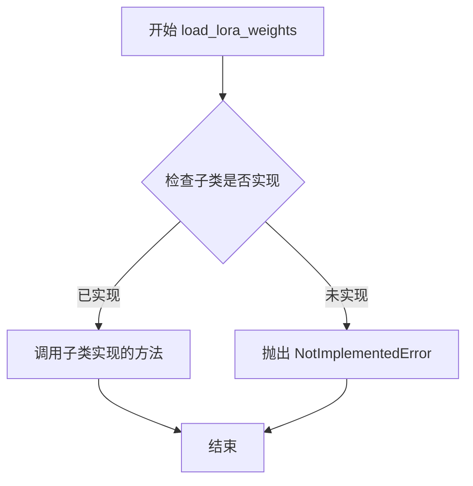

#### 带注释源码

```python
def load_lora_weights(self, **kwargs):
    """
    Load LoRA weights into the model.
    
    This method is a placeholder that raises NotImplementedError in the base class.
    Subclasses should override this method to implement actual LoRA weight loading logic.
    
    Args:
        **kwargs: Arbitrary keyword arguments for weight loading parameters
                  (e.g., pretrained_model_name_or_path, weight_name, adapter_name, etc.)
    
    Raises:
        NotImplementedError: Always raised in the base class implementation.
    """
    # Raise NotImplementedError to indicate this method must be implemented by subclasses
    raise NotImplementedError("`load_lora_weights()` is not implemented.")
```


### LoraBaseMixin.save_lora_weights

该方法定义在 `LoraBaseMixin` 类中，是一个类方法（Class Method）。它在基类中声明用于保存 LoRA 权重，但并未实现具体逻辑，直接抛出 `NotImplementedError`。具体的保存逻辑（如写入文件、格式处理）由继承该Mixin的子类（如具体的 Pipeline 类）通过重写此方法来实现。

参数：

- `cls`：类型：`LoraBaseMixin`（类对象），描述：调用该方法的类本身。
- `**kwargs`：类型：`Any`（任意关键字参数），描述：子类实现所需的关键字参数，通常包括 `save_directory`（保存路径）、`adapter_name`（适配器名称）等。

返回值：`None`，描述：基类实现中无返回值，仅抛出异常。

#### 流程图

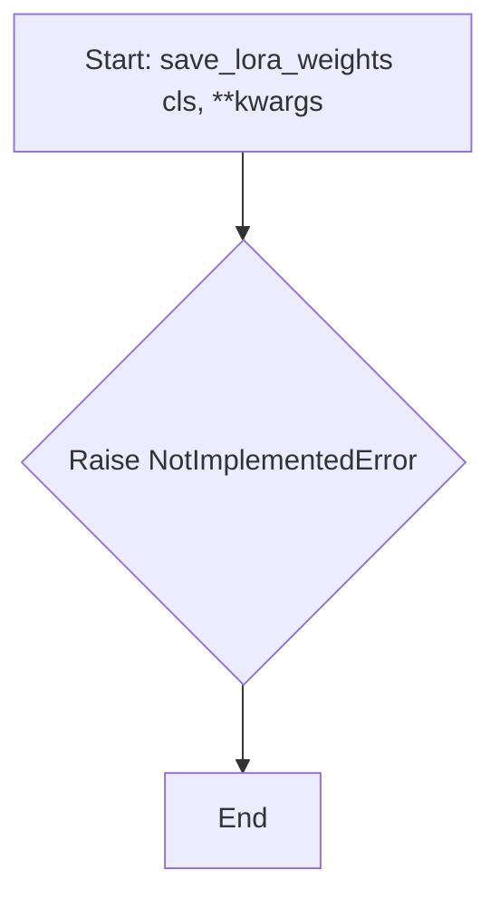

#### 带注释源码

```python
@classmethod
def save_lora_weights(cls, **kwargs):
    """
    保存 LoRA 权重到磁盘。
    注意：此方法为基类声明，子类需重写以实现具体逻辑。
    """
    # 基类中未实现具体逻辑，直接抛出未实现错误
    raise NotImplementedError("`save_lora_weights()` not implemented.")
```


### `LoraBaseMixin.lora_state_dict`

该方法是一个类方法，用于获取LoRA权重的状态字典，但由于基类中未实现，会抛出`NotImplementedError`异常，需由子类具体实现。

参数：

- `kwargs`：关键字参数（任意类型），用于传递给子类实现的具体参数

返回值：任意类型，但由于抛出`NotImplementedError`，实际不返回任何值

#### 流程图

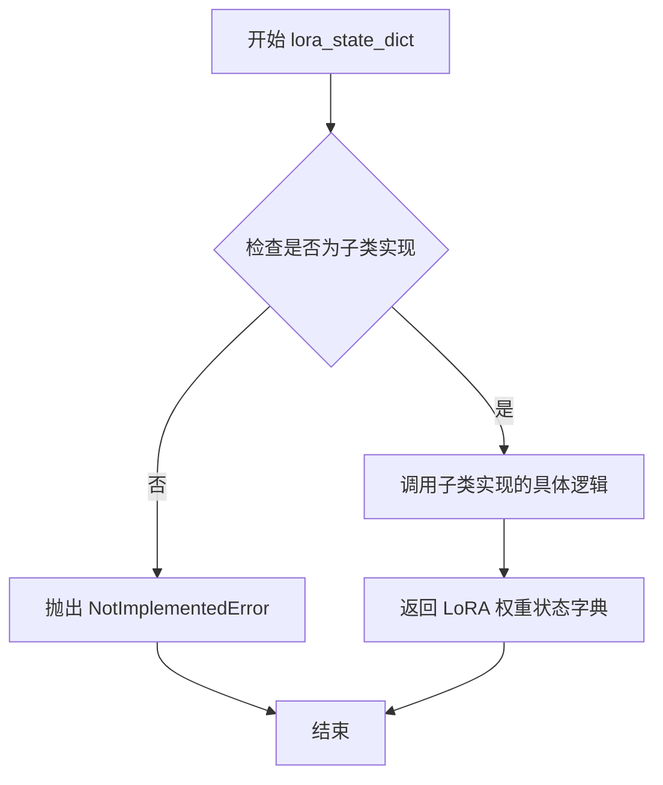

#### 带注释源码

```python
@classmethod
def lora_state_dict(cls, **kwargs):
    """
    获取LoRA权重的状态字典。
    
    这是一个类方法（@classmethod），允许通过类名直接调用，
    而不需要创建类的实例。由于基类LoraBaseMixin只是提供通用接口，
    此方法的具体实现需要由子类完成。
    
    Args:
        **kwargs: 关键字参数，具体参数由子类实现决定，可能包括：
            - adapter_name: 适配器名称
            - state_dict: 预训练模型的状态字典
            - unet_name: UNet模型名称
            - text_encoder_name: 文本编码器名称等
            
    Returns:
        dict: 包含LoRA权重参数的状态字典，由子类实现返回具体格式
        
    Raises:
        NotImplementedError: 当在基类中调用或子类未实现时抛出
    """
    raise NotImplementedError("`lora_state_dict()` is not implemented.")
```


### `LoraBaseMixin.unload_lora_weights`

该方法用于从管道组件中卸载已加载的LoRA权重。它遍历所有支持LoRA加载的模块（如UNet、文本编码器等），对Diffusers模型调用`unload_lora()`方法，对HuggingFace的PreTrainedModel则移除文本编码器的猴子补丁，从而恢复原始模型权重。

参数：
- 无参数（仅包含`self`）

返回值：`None`，该方法直接操作模型状态，不返回任何值

#### 流程图

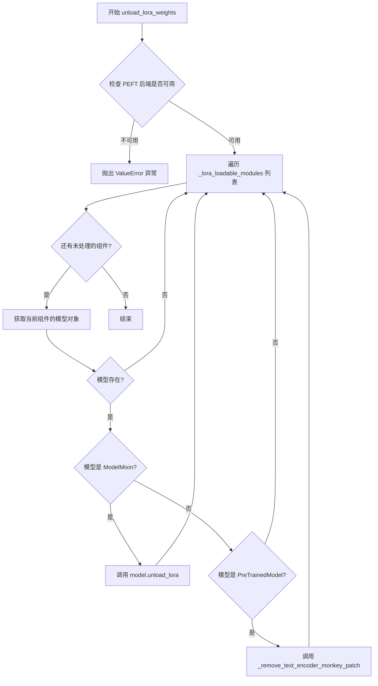

#### 带注释源码

```python
def unload_lora_weights(self):
    """
    Unloads the LoRA parameters.

    Examples:

    ```python
    >>> # Assuming `pipeline` is already loaded with the LoRA parameters.
    >>> pipeline.unload_lora_weights()
    >>> ...
    ```
    """
    # 检查是否配置了PEFT后端，这是加载LoRA权重的必要条件
    if not USE_PEFT_BACKEND:
        raise ValueError("PEFT backend is required for this method.")

    # 遍历所有支持LoRA加载的组件（如unet、text_encoder等）
    for component in self._lora_loadable_modules:
        # 动态获取组件对应的模型对象
        model = getattr(self, component, None)
        if model is not None:
            # 如果模型继承自Diffusers的ModelMixin，调用其unload_lora方法
            if issubclass(model.__class__, ModelMixin):
                model.unload_lora()
            # 如果模型是HuggingFace的PreTrainedModel（如文本编码器）
            # 移除之前可能应用的猴子补丁
            elif issubclass(model.__class__, PreTrainedModel):
                _remove_text_encoder_monkey_patch(model)
```


### `LoraBaseMixin.fuse_lora`

该方法用于将LoRA参数融合到对应模块的原始参数中，支持同时融合多个组件（如UNet、文本编码器等）的LoRA权重，并可选择安全融合模式以检测NaN值。

参数：

- `self`：`LoraBaseMixin`，mixin类实例本身
- `components`：`list[str]`，要融合LoRA的组件列表（如`["unet", "text_encoder"]`）
- `lora_scale`：`float`，默认为1.0，控制LoRA参数对输出的影响程度
- `safe_fusing`：`bool`，默认为`False`，是否在融合前检查融合后的权重是否为NaN值
- `adapter_names`：`list[str] | None`，指定要融合的适配器名称，若为None则融合所有活跃适配器
- `**kwargs`：已废弃的参数（如`fuse_unet`、`fuse_transformer`、`fuse_text_encoder`），仅用于向后兼容

返回值：`None`，该方法直接修改实例状态，不返回任何值

#### 流程图

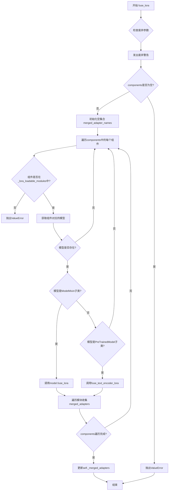

#### 带注释源码

```python
def fuse_lora(
    self,
    components: list[str] = [],
    lora_scale: float = 1.0,
    safe_fusing: bool = False,
    adapter_names: list[str] | None = None,
    **kwargs,
):
    r"""
    将LoRA参数融合到对应模块的原始参数中。

    > [!WARNING] > 这是一个实验性API。

    参数:
        components: (`list[str]`): 要融合LoRA的组件列表。
        lora_scale (`float`, 默认为 1.0):
            控制LoRA参数对输出的影响程度。
        safe_fusing (`bool`, 默认为 `False`):
            是否在融合前检查融合后的权重是否为NaN值，如果是NaN则不融合。
        adapter_names (`list[str]`, *optional*):
            要用于融合的适配器名称。如果未传递，则融合所有活跃的适配器。
    """
    # 处理废弃的fuse_unet参数
    if "fuse_unet" in kwargs:
        depr_message = "传递`fuse_unet`到`fuse_lora()`已被废弃并将被忽略。请使用`components`参数提供要融合LoRA的组件列表。`fuse_unet`将在未来版本中移除。"
        deprecate(
            "fuse_unet",
            "1.0.0",
            depr_message,
        )
    # 处理废弃的fuse_transformer参数
    if "fuse_transformer" in kwargs:
        depr_message = "传递`fuse_transformer`到`fuse_lora()`已被废弃并将被忽略。请使用`components`参数提供要融合LoRA的组件列表。`fuse_transformer`将在未来版本中移除。"
        deprecate(
            "fuse_transformer",
            "1.0.0",
            depr_message,
        )
    # 处理废弃的fuse_text_encoder参数
    if "fuse_text_encoder" in kwargs:
        depr_message = "传递`fuse_text_encoder`到`fuse_lora()`已被废弃并将被忽略。请使用`components`参数提供要融合LoRA的组件列表。`fuse_text_encoder`将在未来版本中移除。"
        deprecate(
            "fuse_text_encoder",
            "1.0.0",
            depr_message,
        )

    # 验证components不能为空
    if len(components) == 0:
        raise ValueError("`components`不能是空列表。")

    # 需要检索适配器名称，因为adapter_names可能为None
    # 不能直接在`self._merged_adapters = self._merged_adapters | merged_adapter_names`中使用它
    merged_adapter_names = set()
    
    # 遍历每个要融合的组件
    for fuse_component in components:
        # 检查组件是否在支持LoRA的模块列表中
        if fuse_component not in self._lora_loadable_modules:
            raise ValueError(f"{fuse_component}未在{self._lora_loadable_modules=}中找到。")

        # 获取组件对应的模型
        model = getattr(self, fuse_component, None)
        if model is not None:
            # 检查是否是diffusers模型（ModelMixin子类）
            if issubclass(model.__class__, ModelMixin):
                # 调用模型的fuse_lora方法进行融合
                model.fuse_lora(lora_scale, safe_fusing=safe_fusing, adapter_names=adapter_names)
                # 遍历模块收集已融合的适配器名称
                for module in model.modules():
                    if isinstance(module, BaseTunerLayer):
                        merged_adapter_names.update(set(module.merged_adapters))
            
            # 处理transformers模型（PreTrainedModel子类）
            if issubclass(model.__class__, PreTrainedModel):
                fuse_text_encoder_lora(
                    model, lora_scale=lora_scale, safe_fusing=safe_fusing, adapter_names=adapter_names
                )
                # 遍历模块收集已融合的适配器名称
                for module in model.modules():
                    if isinstance(module, BaseTunerLayer):
                        merged_adapter_names.update(set(module.merged_adapters))

    # 更新实例的_merged_adapters集合，记录所有已融合的适配器
    self._merged_adapters = self._merged_adapters | merged_adapter_names
```


### LoraBaseMixin.unfuse_lora

撤销已融合的 LoRA 参数，将 LoRA 参数从原始模型参数中分离出来，恢复到融合前的状态。这是一个实验性 API。

参数：

- `components`：`list[str]`，要从中取消融合 LoRA 的组件列表，不能为空
- `**kwargs`：关键字参数，用于向后兼容（已废弃的参数如 `unfuse_unet`、`unfuse_transformer`、`unfuse_text_encoder`）

返回值：`None`，无返回值

#### 流程图

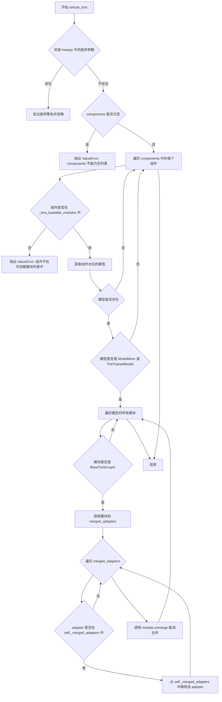

#### 带注释源码

```python
def unfuse_lora(self, components: list[str] = [], **kwargs):
    r"""
    Reverses the effect of
    [`pipe.fuse_lora()`](https://huggingface.co/docs/diffusers/main/en/api/loaders#diffusers.loaders.LoraBaseMixin.fuse_lora).

    > [!WARNING] > This is an experimental API.

    Args:
        components (`list[str]`): list of LoRA-injectable components to unfuse LoRA from.
        unfuse_unet (`bool`, defaults to `True`): Whether to unfuse the UNet LoRA parameters.
        unfuse_text_encoder (`bool`, defaults to `True`):
            Whether to unfuse the text encoder LoRA parameters. If the text encoder wasn't monkey-patched with the
            LoRA parameters then it won't have any effect.
    """
    # 检查并处理废弃的参数 unfuse_unet
    if "unfuse_unet" in kwargs:
        depr_message = "Passing `unfuse_unet` to `unfuse_lora()` is deprecated and will be ignored. Please use the `components` argument. `unfuse_unet` will be removed in a future version."
        deprecate(
            "unfuse_unet",
            "1.0.0",
            depr_message,
        )
    # 检查并处理废弃的参数 unfuse_transformer
    if "unfuse_transformer" in kwargs:
        depr_message = "Passing `unfuse_transformer` to `unfuse_lora()` is deprecated and will be ignored. Please use the `components` argument. `unfuse_transformer` will be removed in a future version."
        deprecate(
            "unfuse_transformer",
            "1.0.0",
            depr_message,
        )
    # 检查并处理废弃的参数 unfuse_text_encoder
    if "unfuse_text_encoder" in kwargs:
        depr_message = "Passing `unfuse_text_encoder` to `unfuse_lora()` is deprecated and will be ignored. Please use the `components` argument. `unfuse_text_encoder` will be removed in a future version."
        deprecate(
            "unfuse_text_encoder",
            "1.0.0",
            depr_message,
        )

    # 验证 components 参数不能为空
    if len(components) == 0:
        raise ValueError("`components` cannot be an empty list.")

    # 遍历每个要取消融合的组件
    for fuse_component in components:
        # 检查组件是否在可加载模块列表中
        if fuse_component not in self._lora_loadable_modules:
            raise ValueError(f"{fuse_component} is not found in {self._lora_loadable_modules=}.")

        # 获取组件对应的模型对象
        model = getattr(self, fuse_component, None)
        if model is not None:
            # 检查模型是否是 Diffusers 的 ModelMixin 或 Transformers 的 PreTrainedModel
            if issubclass(model.__class__, (ModelMixin, PreTrainedModel)):
                # 遍历模型的所有模块
                for module in model.modules():
                    # 检查模块是否是 BaseTunerLayer (PEFT 的 LoRA 层)
                    if isinstance(module, BaseTunerLayer):
                        # 遍历已合并的适配器
                        for adapter in set(module.merged_adapters):
                            # 如果适配器存在且在当前合并的适配器集合中，则移除
                            if adapter and adapter in self._merged_adapters:
                                self._merged_adapters = self._merged_adapters - {adapter}
                        # 调用模块的 unmerge 方法来撤销 LoRA 融合
                        module.unmerge()
```


### `LoraBaseMixin.set_adapters`

设置当前活跃的适配器，以便在管道中使用。可以同时指定多个适配器名称及其对应的权重，用于控制不同适配器在推理时的影响程度。

参数：

- `adapter_names`：`list[str] | str`，要使用的适配器名称，可以是单个名称或名称列表
- `adapter_weights`：`float | dict | list[float] | list[dict] | None`，适配器的权重，若为 None 则所有权重默认为 1.0

返回值：`None`，该方法直接修改对象状态，不返回任何值

#### 流程图

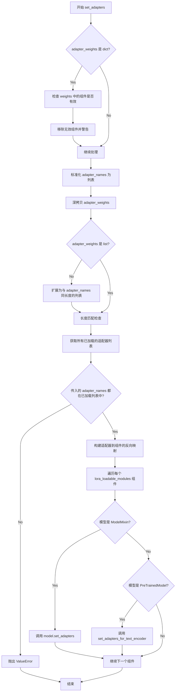

#### 带注释源码

```python
def set_adapters(
    self,
    adapter_names: list[str] | str,
    adapter_weights: float | dict | list[float] | list[dict] | None = None,
):
    """
    Set the currently active adapters for use in the pipeline.

    Args:
        adapter_names (`list[str]` or `str`):
            The names of the adapters to use.
        adapter_weights (`list[float, float]`, *optional*):
            The adapter(s) weights to use with the UNet. If `None`, the weights are set to `1.0` for all the
            adapters.

    Example:

    ```py
    from diffusers import AutoPipelineForText2Image
    import torch

    pipeline = AutoPipelineForText2Image.from_pretrained(
        "stabilityai/stable-diffusion-xl-base-1.0", torch_dtype=torch.float16
    ).to("cuda")
    pipeline.load_lora_weights(
        "jbilcke-hf/sdxl-cinematic-1", weight_name="pytorch_lora_weights.safetensors", adapter_name="cinematic"
    )
    pipeline.load_lora_weights("nerijs/pixel-art-xl", weight_name="pixel-art-xl.safetensors", adapter_name="pixel")
    pipeline.set_adapters(["cinematic", "pixel"], adapter_weights=[0.5, 0.5])
    ```
    """
    # 如果权重是字典形式，检查其中的组件是否有效
    if isinstance(adapter_weights, dict):
        components_passed = set(adapter_weights.keys())
        lora_components = set(self._lora_loadable_modules)

        invalid_components = sorted(components_passed - lora_components)
        if invalid_components:
            logger.warning(
                f"The following components in `adapter_weights` are not part of the pipeline: {invalid_components}. "
                f"Available components that are LoRA-compatible: {self._lora_loadable_modules}. So, weights belonging "
                "to the invalid components will be removed and ignored."
            )
            # 过滤掉无效组件的权重
            adapter_weights = {k: v for k, v in adapter_weights.items() if k not in invalid_components}

    # 标准化适配器名称为列表形式
    adapter_names = [adapter_names] if isinstance(adapter_names, str) else adapter_names
    # 深拷贝权重以避免修改原始数据
    adapter_weights = copy.deepcopy(adapter_weights)

    # 如果权重不是列表，扩展为与适配器名称数量相同的列表
    if not isinstance(adapter_weights, list):
        adapter_weights = [adapter_weights] * len(adapter_names)

    # 验证适配器名称和权重的长度一致性
    if len(adapter_names) != len(adapter_weights):
        raise ValueError(
            f"Length of adapter names {len(adapter_names)} is not equal to the length of the weights {len(adapter_weights)}"
        )

    # 获取所有已加载的适配器列表
    # 例如: {"unet": ["adapter1", "adapter2"], "text_encoder": ["adapter2"]}
    list_adapters = self.get_list_adapters()
    # 合并所有组件中的适配器名称: ["adapter1", "adapter2"]
    all_adapters = {adapter for adapters in list_adapters.values() for adapter in adapters}
    
    # 检查是否有未加载的适配器被请求
    missing_adapters = set(adapter_names) - all_adapters
    if len(missing_adapters) > 0:
        raise ValueError(
            f"Adapter name(s) {missing_adapters} not in the list of present adapters: {all_adapters}."
        )

    # 构建反向映射：适配器名称 -> 其所属的组件列表
    # 例如: {"adapter1": ["unet"], "adapter2": ["unet", "text_encoder"]}
    invert_list_adapters = {
        adapter: [part for part, adapters in list_adapters.items() if adapter in adapters]
        for adapter in all_adapters
    }

    # 将权重分解为去噪器和文本编码器各自的权重
    _component_adapter_weights = {}
    for component in self._lora_loadable_modules:
        model = getattr(self, component, None)
        # 跳过为 None 的模型（如 Wan 模型中可能有单个或多个去噪器）
        if model is None:
            continue

        # 为每个适配器名称分配对应的权重
        for adapter_name, weights in zip(adapter_names, adapter_weights):
            if isinstance(weights, dict):
                # 从权重字典中提取当前组件的权重
                component_adapter_weights = weights.pop(component, None)
                if component_adapter_weights is not None and component not in invert_list_adapters[adapter_name]:
                    logger.warning(
                        (
                            f"Lora weight dict for adapter '{adapter_name}' contains {component},"
                            f"but this will be ignored because {adapter_name} does not contain weights for {component}."
                            f"Valid parts for {adapter_name} are: {invert_list_adapters[adapter_name]}."
                        )
                    )
            else:
                # 如果权重不是字典，直接使用该权重
                component_adapter_weights = weights

            _component_adapter_weights.setdefault(component, [])
            _component_adapter_weights[component].append(component_adapter_weights)

        # 根据模型类型调用相应的适配器设置方法
        if issubclass(model.__class__, ModelMixin):
            # 对于 Diffusers 的 ModelMixin 模型
            model.set_adapters(adapter_names, _component_adapter_weights[component])
        elif issubclass(model.__class__, PreTrainedModel):
            # 对于 Transformers 的 PreTrainedModel (文本编码器)
            set_adapters_for_text_encoder(adapter_names, model, _component_adapter_weights[component])
```


### `LoraBaseMixin.disable_lora`

该方法用于禁用管道中所有活动的 LoRA 层，支持 ModelMixin 和 PreTrainedModel 两种模型类型。

参数：

- 无参数（仅 `self`）

返回值：`None`，无返回值描述（该方法直接修改模型状态）

#### 流程图

```mermaid
flowchart TD
    A[开始 disable_lora] --> B{USE_PEFT_BACKEND 是否为 True}
    B -->|否| C[抛出 ValueError: PEFT backend is required]
    B -->|是| D[遍历 self._lora_loadable_modules]
    D --> E[获取当前 component 的 model]
    E --> F{model 是否为 None}
    F -->|是| I[继续下一个 component]
    F -->|否| G{model 是否为 ModelMixin 子类}
    G -->|是| H[调用 model.disable_lora]
    G -->|否| J{model 是否为 PreTrainedModel 子类}
    J -->|是| K[调用 disable_lora_for_text_encoder(model)]
    J -->|否| I
    H --> I
    K --> I
    I --> L{是否还有更多 component}
    L -->|是| D
    L -->|否| M[结束]
```

#### 带注释源码

```python
def disable_lora(self):
    """
    Disables the active LoRA layers of the pipeline.

    Example:

    ```py
    from diffusers import AutoPipelineForText2Image
    import torch

    pipeline = AutoPipelineForText2Image.from_pretrained(
        "stabilityai/stable-diffusion-xl-base-1.0", torch_dtype=torch.float16
    ).to("cuda")
    pipeline.load_lora_weights(
        "jbilcke-hf/sdxl-cinematic-1", weight_name="pytorch_lora_weights.safetensors", adapter_name="cinematic"
    )
    pipeline.disable_lora()
    ```
    """
    # 检查是否使用了 PEFT 后端，若未使用则抛出异常
    if not USE_PEFT_BACKEND:
        raise ValueError("PEFT backend is required for this method.")

    # 遍历所有支持 LoRA 的组件（如 unet, text_encoder 等）
    for component in self._lora_loadable_modules:
        # 通过属性名获取模型对象
        model = getattr(self, component, None)
        if model is not None:
            # 判断模型类型：如果是 Diffusers 的 ModelMixin
            if issubclass(model.__class__, ModelMixin):
                # 调用 ModelMixin 的 disable_lora 方法
                model.disable_lora()
            # 如果是 HuggingFace 的 PreTrainedModel（如 text_encoder）
            elif issubclass(model.__class__, PreTrainedModel):
                # 调用模块级函数禁用 text_encoder 的 LoRA
                disable_lora_for_text_encoder(model)
```


### `LoraBaseMixin.enable_lora`

启用管道中当前活跃的LoRA层，使LoRA适配器权重生效并参与前向传播。

参数：

- `self`：`LoraBaseMixin`实例，隐式参数，管道对象本身

返回值：`None`，无返回值（方法直接作用于对象状态）

#### 流程图

```mermaid
flowchart TD
    A[开始 enable_lora] --> B{检查 PEFT 后端是否可用}
    B -->|不可用| C[抛出 ValueError: PEFT backend is required]
    B -->|可用| D[遍历 _lora_loadable_modules 列表]
    D --> E{还有组件需要处理?}
    E -->|是| F[获取当前组件模型]
    F --> G{模型是否为 ModelMixin 子类?}
    G -->|是| H[调用 model.enable_lora]
    G -->|否| I{模型是否为 PreTrainedModel 子类?}
    I -->|是| J[调用 enable_lora_for_text_encoder]
    I -->|否| K[跳过该组件]
    H --> E
    J --> E
    K --> E
    E -->|否| L[结束]
    C --> M[异常处理]
```

#### 带注释源码

```python
def enable_lora(self):
    """
    启用管道中活跃的 LoRA 层。

    示例:
    ```python
    from diffusers import AutoPipelineForText2Image
    import torch

    pipeline = AutoPipelineForText2Image.from_pretrained(
        "stabilityai/stable-diffusion-xl-base-1.0", torch_dtype=torch.float16
    ).to("cuda")
    pipeline.load_lora_weights(
        "jbilcke-hf/sdxl-cinematic-1", weight_name="pytorch_lora_weights.safetensors", adapter_name="cinematic"
    )
    pipeline.enable_lora()
    ```
    """
    # 检查 PEFT 后端是否可用，若不可用则抛出异常
    if not USE_PEFT_BACKEND:
        raise ValueError("PEFT backend is required for this method.")

    # 遍历所有支持 LoRA 的模块（如 unet、text_encoder 等）
    for component in self._lora_loadable_modules:
        # 获取当前组件的模型对象
        model = getattr(self, component, None)
        if model is not None:
            # 判断模型类型：Diffusers 的 ModelMixin 或 HuggingFace 的 PreTrainedModel
            if issubclass(model.__class__, ModelMixin):
                # Diffusers 模型（如 UNet）直接调用 enable_lora 方法
                model.enable_lora()
            elif issubclass(model.__class__, PreTrainedModel):
                # Transformers 模型（如 TextEncoder）使用工具函数启用 LoRA
                enable_lora_for_text_encoder(model)
```


### `LoraBaseMixin.delete_adapters`

该方法用于从管道中删除指定的LoRA适配器层。它首先检查PEFT后端是否可用，然后将字符串类型的适配器名称转换为列表，最后遍历所有支持LoRA的组件模型，对每个模型调用相应的删除适配器方法。

参数：

- `adapter_names`：`list[str] | str`，要删除的适配器名称，可以是单个字符串或字符串列表

返回值：`None`，该方法无返回值，直接修改模型状态

#### 流程图

```mermaid
flowchart TD
    A[开始 delete_adapters] --> B{检查 PEFT 后端是否可用}
    B -->|否| C[抛出 ValueError: PEFT backend is required]
    B -->|是| D{adapter_names 是否为字符串}
    D -->|是| E[将 adapter_names 转换为列表]
    D -->|否| F[继续]
    E --> F
    F --> G[遍历 _lora_loadable_modules 中的每个组件]
    G --> H{获取组件模型}
    H -->|模型为 None| I[继续下一个组件]
    H -->|模型不为 None| J{模型类型判断}
    J -->|ModelMixin| K[调用 model.delete_adapters]
    J -->|PreTrainedModel| L[遍历 adapter_names]
    L --> M[调用 delete_adapter_layers]
    K --> N[检查是否还有更多组件]
    M --> N
    I --> N
    N -->|有更多| G
    N -->|无更多| O[结束]
```

#### 带注释源码

```python
def delete_adapters(self, adapter_names: list[str] | str):
    """
    Delete an adapter's LoRA layers from the pipeline.

    Args:
        adapter_names (`list[str, str]`):
            The names of the adapters to delete.

    Example:

    ```py
    from diffusers import AutoPipelineForText2Image
    import torch

    pipeline = AutoPipelineForText2Image.from_pretrained(
        "stabilityai/stable-diffusion-xl-base-1.0", torch_dtype=torch.float16
    ).to("cuda")
    pipeline.load_lora_weights(
        "jbilcke-hf/sdxl-cinematic-1", weight_name="pytorch_lora_weights.safetensors", adapter_names="cinematic"
    )
    pipeline.delete_adapters("cinematic")
    ```
    """
    # 检查是否配置了PEFT后端，若未配置则抛出异常
    if not USE_PEFT_BACKEND:
        raise ValueError("PEFT backend is required for this method.")

    # 如果传入的是单个字符串适配器名称，转换为列表以便统一处理
    if isinstance(adapter_names, str):
        adapter_names = [adapter_names]

    # 遍历所有支持LoRA加载的模块（如unet、text_encoder等）
    for component in self._lora_loadable_modules:
        # 获取当前组件对应的模型对象
        model = getattr(self, component, None)
        if model is not None:
            # 判断模型类型：如果是Diffusers的ModelMixin类，调用其内置的delete_adapters方法
            if issubclass(model.__class__, ModelMixin):
                model.delete_adapters(adapter_names)
            # 如果是HuggingFace的PreTrainedModel（如text_encoder），逐个删除适配器层
            elif issubclass(model.__class__, PreTrainedModel):
                for adapter_name in adapter_names:
                    delete_adapter_layers(model, adapter_name)
```


### `LoraBaseMixin.get_active_adapters`

该方法用于获取当前激活的 LoRA 适配器名称列表，通过遍历所有支持 LoRA 的模型组件，找到第一个包含 `BaseTunerLayer` 的模块，并返回其活动适配器列表。

参数： 无（仅使用实例属性 `self`）

返回值：`list[str]`，返回当前激活的 LoRA 适配器名称列表

#### 流程图

```mermaid
flowchart TD
    A[开始] --> B{检查 PEFT 后端是否可用}
    B -->|不可用| C[抛出 ValueError 异常]
    B -->|可用| D[初始化空列表 active_adapters]
    D --> E[遍历 _lora_loadable_modules 中的每个组件]
    E --> F{获取当前组件的模型}
    F -->|模型为空| G[继续下一个组件]
    F -->|模型不为空| H{检查模型是否为 ModelMixin 子类}
    H -->|否| I[继续下一个组件]
    H -->是 --> J[遍历模型的所有模块]
    J --> K{检查模块是否为 BaseTunerLayer 类型}
    K -->|否| L[继续下一个模块]
    K -->|是| M[获取 module.active_adapters 并跳出循环]
    M --> N[返回 active_adapters 列表]
    G --> E
    I --> E
    L --> J
    E --> N
```

#### 带注释源码

```python
def get_active_adapters(self) -> list[str]:
    """
    Gets the list of the current active adapters.

    Example:

    ```python
    from diffusers import DiffusionPipeline

    pipeline = DiffusionPipeline.from_pretrained(
        "stabilityai/stable-diffusion-xl-base-1.0",
    ).to("cuda")
    pipeline.load_lora_weights("CiroN2022/toy-face", weight_name="toy_face_sdxl.safetensors", adapter_name="toy")
    pipeline.get_active_adapters()
    ```
    """
    # 检查 PEFT 后端是否可用，如果不可用则抛出明确的错误信息
    if not USE_PEFT_BACKEND:
        raise ValueError(
            "PEFT backend is required for this method. Please install the latest version of PEFT `pip install -U peft`"
        )

    # 初始化空列表用于存储活动适配器
    active_adapters = []

    # 遍历所有支持 LoRA 的可加载模块（如 unet, text_encoder 等）
    for component in self._lora_loadable_modules:
        # 动态获取当前组件的模型实例
        model = getattr(self, component, None)
        # 检查模型是否存在且是 ModelMixin 的子类（Diffusers 模型）
        if model is not None and issubclass(model.__class__, ModelMixin):
            # 遍历模型的所有模块，寻找 BaseTunerLayer（LoRA 层）
            for module in model.modules():
                if isinstance(module, BaseTunerLayer):
                    # 获取活动适配器列表并跳出内层循环
                    # 注意：这里假设所有 BaseTunerLayer 的活动适配器相同
                    active_adapters = module.active_adapters
                    break

    # 返回活动适配器列表，如果未找到任何适配器则返回空列表
    return active_adapters
```


### `LoraBaseMixin.get_list_adapters`

获取当前管道中所有可用的 LoRA 适配器列表。

参数：

- 无参数（仅使用 `self` 实例）

返回值：`dict[str, list[str]]`，返回管道中各组件已加载的适配器名称字典，键为组件名称（如 "unet"、"text_encoder" 等），值为该组件下适配器名称列表。

#### 流程图

```mermaid
flowchart TD
    A[开始 get_list_adapters] --> B{检查 USE_PEFT_BACKEND}
    B -->|否| C[抛出 ValueError: 需要 PEFT 后端]
    B -->|是| D[初始化空字典 set_adapters]
    D --> E[遍历 _lora_loadable_modules 组件列表]
    E --> F{当前组件}
    F --> G[获取组件对应的模型实例]
    G --> H{模型不为空 且 是 ModelMixin/PreTrainedModel 且 有 peft_config}
    H -->|否| I[继续下一个组件]
    H -->|是| J[将 peft_config.keys 转换为列表]
    J --> K[存入 set_adapters 字典, 键为组件名]
    K --> I
    I --> L{是否还有更多组件}
    L -->|是| E
    L -->|否| M[返回 set_adapters 字典]
    C --> N[结束]
    M --> N
```

#### 带注释源码

```python
def get_list_adapters(self) -> dict[str, list[str]]:
    """
    Gets the current list of all available adapters in the pipeline.
    """
    # 检查是否安装了 PEFT 后端，若未安装则抛出错误
    if not USE_PEFT_BACKEND:
        raise ValueError(
            "PEFT backend is required for this method. Please install the latest version of PEFT `pip install -U peft`"
        )

    # 初始化空字典用于存储各组件的适配器列表
    set_adapters = {}

    # 遍历所有支持 LoRA 的组件（如 unet、text_encoder 等）
    for component in self._lora_loadable_modules:
        # 通过属性名动态获取组件模型实例
        model = getattr(self, component, None)
        # 检查模型是否存在、是否为支持的模型类型、是否包含 peft_config
        if (
            model is not None
            and issubclass(model.__class__, (ModelMixin, PreTrainedModel))
            and hasattr(model, "peft_config")
        ):
            # 将该组件下的所有适配器名称转换为列表并存储
            set_adapters[component] = list(model.peft_config.keys())

    # 返回所有组件及其对应适配器的字典
    return set_adapters
```


### `LoraBaseMixin.set_lora_device`

该方法用于将指定的LoRA适配器移动到目标设备，可用于在加载多个适配器时将不活跃的适配器卸载到CPU以释放GPU显存。

参数：

- `adapter_names`：`list[str]`，需要移动设备的适配器名称列表
- `device`：`torch.device | str | int`，目标设备，可以是torch设备对象、字符串（如"cpu"、"cuda:0"）或整数

返回值：`None`，该方法无返回值

#### 流程图

```mermaid
flowchart TD
    A[开始] --> B{检查PEFT后端是否可用}
    B -->|不可用| C[抛出ValueError异常]
    B -->|可用| D[遍历_lora_loadable_modules中的每个组件]
    D --> E{获取组件模型}
    E -->|模型为空| D
    E -->|模型存在| F[遍历模型的所有模块]
    F --> G{检查模块是否为BaseTunerLayer}
    G -->|否| F
    G -->|是| H[遍历adapter_names中的每个适配器]
    H --> I{检查适配器是否在module.lora_A中}
    I -->|不在| H
    I -->|在| J[将lora_A移到目标设备]
    J --> K[将lora_B移到目标设备]
    K --> L{检查lora_magnitude_vector是否存在}
    L -->|是| M[将lora_magnitude_vector移到目标设备]
    L -->|否| H
    M --> H
    H --> N{是否还有未处理的组件}
    N -->|是| D
    N -->|否| O[结束]
```

#### 带注释源码

```python
def set_lora_device(self, adapter_names: list[str], device: torch.device | str | int) -> None:
    """
    Moves the LoRAs listed in `adapter_names` to a target device. Useful for offloading the LoRA to the CPU in case
    you want to load multiple adapters and free some GPU memory.

    After offloading the LoRA adapters to CPU, as long as the rest of the model is still on GPU, the LoRA adapters
    can no longer be used for inference, as that would cause a device mismatch. Remember to set the device back to
    GPU before using those LoRA adapters for inference.

    ```python
    >>> pipe.load_lora_weights(path_1, adapter_name="adapter-1")
    >>> pipe.load_lora_weights(path_2, adapter_name="adapter-2")
    >>> pipe.set_adapters("adapter-1")
    >>> image_1 = pipe(**kwargs)
    >>> # switch to adapter-2, offload adapter-1
    >>> pipeline.set_lora_device(adapter_names=["adapter-1"], device="cpu")
    >>> pipeline.set_lora_device(adapter_names=["adapter-2"], device="cuda:0")
    >>> pipe.set_adapters("adapter-2")
    >>> image_2 = pipe(**kwargs)
    >>> # switch back to adapter-1, offload adapter-2
    >>> pipeline.set_lora_device(adapter_names=["adapter-2"], device="cpu")
    >>> pipeline.set_lora_device(adapter_names=["adapter-1"], device="cuda:0")
    >>> pipe.set_adapters("adapter-1")
    >>> ...
    ```

    Args:
        adapter_names (`list[str]`):
            list of adapters to send device to.
        device (`torch.device | str | int`):
            Device to send the adapters to. Can be either a torch device, a str or an integer.
    """
    # 检查PEFT后端是否可用，若不可用则抛出异常
    if not USE_PEFT_BACKEND:
        raise ValueError("PEFT backend is required for this method.")

    # 遍历所有支持LoRA的组件（如unet、text_encoder等）
    for component in self._lora_loadable_modules:
        # 获取组件对应的模型对象
        model = getattr(self, component, None)
        if model is not None:
            # 遍历模型的所有模块
            for module in model.modules():
                # 检查模块是否为PEFT的BaseTunerLayer类型（LoRA注入的层）
                if isinstance(module, BaseTunerLayer):
                    # 遍历需要移动设备的适配器名称
                    for adapter_name in adapter_names:
                        # 检查适配器是否存在于lora_A中（只需检查lora_A即可）
                        if adapter_name not in module.lora_A:
                            continue

                        # 将LoRA的A矩阵移到目标设备
                        module.lora_A[adapter_name].to(device)
                        # 将LoRA的B矩阵移到目标设备
                        module.lora_B[adapter_name].to(device)
                        # lora_magnitude_vector是一个参数而非模块，需要重新赋值
                        if hasattr(module, "lora_magnitude_vector") and module.lora_magnitude_vector is not None:
                            if adapter_name in module.lora_magnitude_vector:
                                module.lora_magnitude_vector[adapter_name] = module.lora_magnitude_vector[
                                    adapter_name
                                ].to(device)
```


### `LoraBaseMixin.enable_lora_hotswap`

热插拔适配器的方法，允许在不触发模型重新编译的情况下切换适配器，或在加载的适配器 rank 不同时使用。

参数：

- `target_rank`：`int`，所有将被加载的适配器中的最高 rank。
- `check_compiled`：`str`，*可选*，默认为 `"error"`，如何处理已编译的模型。检查可返回以下消息：
  - `"error"`（默认）：抛出错误
  - `"warn"`：发出警告
  - `"ignore"`：不执行任何操作

返回值：`None`，无返回值（方法执行完成后返回 None）。

#### 流程图

```mermaid
flowchart TD
    A[开始 enable_lora_hotswap] --> B{遍历 self.components.items}
    B --> C{检查 component 是否有 enable_lora_hotswap 属性}
    C -->|是| D{检查 key 是否在 _lora_loadable_modules 中}
    C -->|否| F[跳过该 component]
    D -->|是| E[调用 component.enable_lora_hotswap 传递 kwargs]
    D -->|否| F
    E --> B
    F --> G[遍历完成，返回 None]
```

#### 带注释源码

```python
def enable_lora_hotswap(self, **kwargs) -> None:
    """
    Hotswap adapters without triggering recompilation of a model or if the ranks of the loaded adapters are
    different.

    Args:
        target_rank (`int`):
            The highest rank among all the adapters that will be loaded.
        check_compiled (`str`, *optional*, defaults to `"error"`):
            How to handle a model that is already compiled. The check can return the following messages:
              - "error" (default): raise an error
              - "warn": issue a warning
              - "ignore": do nothing
    """
    # 遍历管道中的所有组件
    for key, component in self.components.items():
        # 检查组件是否有 enable_lora_hotswap 方法（通常只有 UNet 等 diffusers 模型有）
        # 并且该组件在 _lora_loadable_modules 列表中（即支持加载 LoRA 的组件）
        if hasattr(component, "enable_lora_hotswap") and (key in self._lora_loadable_modules):
            # 将参数传递给实际的实现方法
            # 对于 UNet，会调用 ModelMixin.enable_lora_hotswap
            # 对于 text_encoder，会调用相应的方法
            component.enable_lora_hotswap(**kwargs)
```

## 关键组件


### LoraBaseMixin

核心Mixin类，提供LoRA权重加载、保存、融合、卸载、适配器管理等全套功能的基类。

### fuse_text_encoder_lora / unfuse_text_encoder_lora

融合或解融文本编码器的LoRA权重，支持安全融合（检查NaN）和适配器名称指定。

### set_adapters_for_text_encoder

为文本编码器设置适配器层及其权重，支持单个或多个适配器的权重配置。

### disable_lora_for_text_encoder / enable_lora_for_text_encoder

禁用或启用文本编码器的LoRA层。

### _fetch_state_dict

从预训练模型路径或字典加载LoRA状态字典，支持safetensors和bin格式，自动处理元数据。

### _load_lora_into_text_encoder

将LoRA权重加载到文本编码器中，处理前缀转换、rank计算、适配器创建、offloading管理等复杂逻辑。

### _func_optionally_disable_offloading

可选地禁用pipeline的设备卸载（CPU offloading），以便加载LoRA权重后重新应用hooks。

### LoraBaseMixin.load_lora_weights

加载LoRA权重到pipeline的可加载模块。

### LoraBaseMixin.save_lora_weights

保存LoRA权重到磁盘，支持安全序列化和元数据。

### LoraBaseMixin.fuse_lora

将LoRA参数融合到原始模型参数中，支持指定组件列表和安全融合。

### LoraBaseMixin.unfuse_lora

解融已融合的LoRA参数，恢复原始模型状态。

### LoraBaseMixin.set_adapters

设置当前激活的适配器及权重，支持多适配器混合使用。

### LoraBaseMixin.disable_lora / enable_lora

禁用或启用pipeline中所有LoRA层。

### LoraBaseMixin.delete_adapters

从pipeline中删除指定适配器的LoRA层。

### LoraBaseMixin.get_active_adapters / get_list_adapters

获取当前激活的适配器列表或所有可用适配器。

### LoraBaseMixin.set_lora_device

将指定适配器的LoRA权重移动到目标设备，用于CPU卸载和内存管理。

### LoraBaseMixin.enable_lora_hotswap

热切换适配器，无需重新编译模型，支持不同rank的适配器切换。

## 问题及建议


### 已知问题

- **类型提示不一致**：`set_adapters_for_text_encoder`函数中`text_encoder_weights`参数类型为`float | list[float] | list[None] | None`，但函数内部处理逻辑复杂，类型流转不够清晰。`_load_lora_into_text_encoder`中`hotswap: bool = False`与其他参数如`"PreTrainedModel"`的风格不统一。
- **抽象方法未明确标记**：`load_lora_weights`、`save_lora_weights`、`lora_state_dict`等方法在`LoraBaseMixin`基类中仅抛出`NotImplementedError`，但未使用`abc`模块将其正式定义为抽象方法，导致子类实现时缺乏强制约束。
- **重复代码逻辑**：`fuse_lora`和`unfuse_lora`方法中遍历组件并检查`ModelMixin`或`PreTrainedModel`类型的逻辑高度重复；`_load_lora_into_text_encoder`中的适配器合并收集逻辑与`fuse_lora`中也有重叠。
- **状态管理设计缺陷**：类属性`_lora_loadable_modules = []`和`_merged_adapters = set()`被设计为实例级别的配置依赖，但定义为类属性可能导致实例间状态意外共享的风险。
- **隐式依赖和版本检查分散**：多处依赖`USE_PEFT_BACKEND`全局变量、`is_peft_version`和`is_transformers_version`进行版本检查，逻辑分散在各个方法中，维护成本较高。
- **参数验证不足**：`set_adapters`方法中处理`adapter_weights`为字典时的逻辑较为复杂，但缺少对`adapter_weights`字典值类型的完整验证（如字典值为None或非法类型时未报错）。

### 优化建议

- **统一类型标注风格**：确保所有参数类型注解使用一致的格式（如统一使用字符串形式或符号形式），并使用`typing.TypeGuard`等工具增强类型安全。
- **引入抽象基类机制**：使用`abc.ABC`和`@abstractmethod`装饰器正式定义接口方法，确保子类必须实现相应功能。
- **提取公共逻辑**：将`fuse_lora`/`unfuse_lora`以及`fuse_lora`/`set_adapters`中的共同逻辑抽取为私有辅助方法（如`_iterate_lora_components`），减少代码冗余。
- **重构状态管理**：将`_lora_loadable_modules`改为实例属性在`__init__`中初始化，或使用`__slots__`结合描述符管理，确保实例隔离。
- **集中依赖检查**：创建专门的版本兼容检查模块或类，统一管理PEFT和transformers的版本依赖关系，减少散落在各方法中的版本判断逻辑。
- **增强参数校验**：在`set_adapters`等方法中添加更严格的参数类型和值校验，特别是在处理`adapter_weights`为字典时，验证其值的类型合法性。
- **操作符一致性**：统一集合操作方式，建议统一使用`update()`和`difference_update()`等显式方法替代`| `- `-`操作符，提高代码可读性。

## 其它


### 设计目标与约束

本模块的核心设计目标是提供一套统一且健壮的LoRA权重加载、融合、卸载和管理机制，支持Diffusers pipeline中的多个组件（UNet、Text Encoder等）的LoRA适配。约束条件包括：1）必须依赖PEFT后端实现LoRA管理；2）仅支持通过`BaseTunerLayer`接口的LoRA模块；3）不支持在Text Encoder上实现Hotswap；4）离线模式下必须显式指定`weight_name`参数；5）Safe serialization与metadata不能同时使用需满足互斥条件。

### 错误处理与异常设计

错误处理采用分层策略：1）参数校验在函数入口处进行，包括`text_encoder`为None、组件列表为空、adapter名称与权重长度不匹配等；2）版本兼容性检查在`low_cpu_mem_usage`等特性使用前触发，包括PEFT>=0.13.1和transformers>4.45.2的版本要求；3）文件加载失败时自动降级机制（safetensors失败后尝试bin格式）；4）异常传播遵循明确的消息格式，如"The 'adapter_names' argument is not supported with your PEFT version"；5）使用`deprecate`函数对废弃参数进行警告而非直接抛出。

### 数据流与状态机

LoRA权重的数据流遵循：加载阶段（_fetch_state_dict获取原始权重）→ 转换阶段（convert_state_dict_to_diffusers/convert_state_dict_to_peft标准化格式）→ 注入阶段（通过PEFT的load_adapter方法注入）→ 激活阶段（set_weights_and_activate_adapters或scale_lora_layers应用权重）→ 可选融合阶段（fuse_lora将权重合并到原模型）。状态机包含：unloaded（未加载）、loaded（已加载但未融合）、fused（已融合）三种主要状态，通过_merged_adapters集合追踪已融合的adapter。

### 外部依赖与接口契约

核心依赖包括：1）PEFT库（提供BaseTunerLayer接口、load_adapter、set_adapters等方法）；2）Transformers库（提供PreTrainedModel基类）；3）Accelerate库（提供AlignDevicesHook、CpuOffload等offload机制）；4）Safetensors（可选的安全权重加载）；5）torch和torch.nn。接口契约方面：ModelMixin需实现unload_lora/fuse_lora/disable_lora/enable_lora/delete_adapters/set_adapters方法；PreTrainedModel通过本模块的适配函数（fuse_text_encoder_lora、set_adapters_for_text_encoder等）间接支持；_lora_loadable_modules列表定义了pipeline中可加载LoRA的组件名称。

### 性能考虑

性能优化点包括：1）low_cpu_mem_usage参数支持降低加载时的CPU内存占用；2）_func_optionally_disable_offloading函数在加载前临时移除offload hooks避免不必要的设备迁移；3）权重预取和缓存机制通过_get_model_file实现；4）Hotswap支持在运行时切换adapter而不触发模型重编译；5）adapter权重通过set_adapters批量设置减少多次调用开销；6）设备放置使用非in-place方式（重新赋值）确保lora_magnitude_vector正确迁移。

### 安全性考虑

安全设计包括：1）safe_fusing参数在融合前检查NaN值防止数值不稳定；2）allow_pickle参数控制是否允许非safetensors格式加载；3）safetensors格式优先使用以避免pickle潜在的安全风险；4）token和revision参数用于HuggingFace Hub认证和版本控制；5）local_files_only模式避免网络请求；6）元数据与权重分离存储，通过LORA_ADAPTER_METADATA_KEY标识。

### 版本兼容性

版本兼容性策略：1）通过is_peft_version和is_transformers_version函数动态检查库版本；2）adapter_names参数支持通过inspect.signature动态检测方法签名以实现向后兼容；3）_create_lora_config内部处理不同PEFT版本的配置格式差异；4）模块级别通过try-import处理可选依赖（transformers、peft、accelerate）；5）未来版本废弃通过deprecate函数预告并在后续版本中移除。

### 配置管理

配置通过以下方式管理：1）LORA_WEIGHT_NAME和LORA_WEIGHT_NAME_SAFE定义默认权重文件名；2）LORA_ADAPTER_METADATA_KEY定义元数据存储键；3）_lora_loadable_modules类属性在子类中定义可加载组件列表；4）USE_PEFT_BACKEND全局开关控制后端选择；5）HF_HUB_OFFLINE环境变量支持离线模式；6）adapter_weights支持float、list、dict多种格式以适应不同场景。

### 资源管理

资源管理机制：1）CPU offloading通过enable_model_cpu_offload/enable_sequential_cpu_offload管理设备内存；2）set_lora_device支持将指定adapter迁移到特定设备以实现内存优化；3）unload_lora_weights清理已加载的LoRA层释放GPU内存；4）delete_adapters完全移除指定adapter的所有相关张量；5）_remove_text_encoder_monkey_patch清理PEFT注入的monkey patch和peft_config属性；6）copy.deepcopy用于adapter_weights避免意外修改原始数据。


    